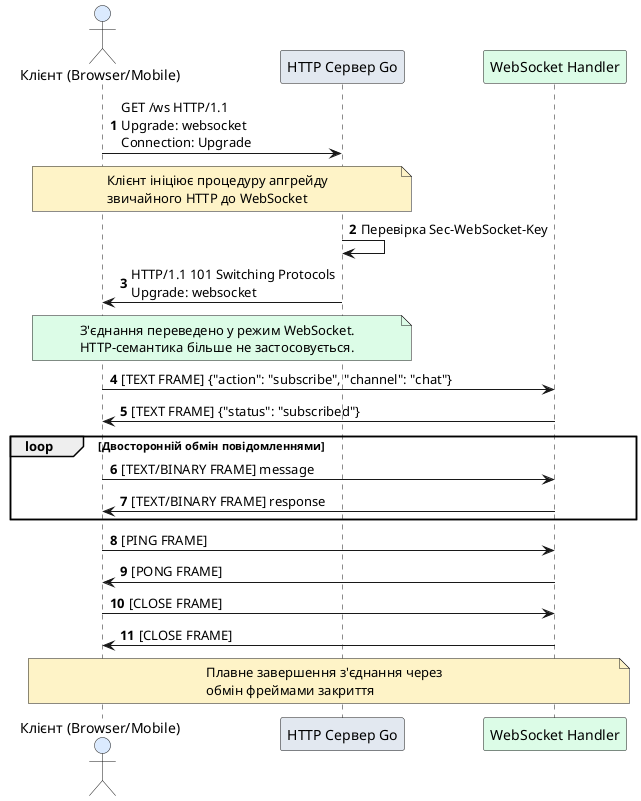

# Потокова передача даних та протокол WebSocket

::card-group

::card{title="🎯 Мета лекції" icon="i-lucide-target"}

- Зрозуміти фундаментальну потребу у двосторонній комунікації між клієнтом та сервером у реальному часі.
- Опанувати технологію Server-Sent Events (SSE) як однонапрямлений канал потокової доставки подій.
- Вивчити протокол WebSocket (RFC 6455), його архітектуру, процедуру встановлення з'єднання та структуру фреймів.
- Навчитися реалізовувати WebSocket-сервери у Go із використанням бібліотеки `gorilla/websocket`.
- Впровадити архітектурні патерни Hub, Broadcasting та Room Management для масштабованої обробки з'єднань.

::

::card{title="🔑 Ключові терміни" icon="i-lucide-key"}

- **Server-Sent Events (SSE):** однонапрямлена технологія потокової доставки подій від сервера до клієнта через довготривале HTTP-з'єднання.
- **WebSocket:** повнодуплексний протокол обміну даними поверх одного TCP-з'єднання, що забезпечує низьку затримку та мінімальні накладні витрати.
- **Upgrade Handshake:** процедура переведення звичайного HTTP-з'єднання у WebSocket-режим через обмін спеціальними заголовками.
- **Frame:** атомарна одиниця передачі даних у протоколі WebSocket, що містить метадані (тип, маскування) та корисне навантаження (*payload*).
- **Hub Pattern:** централізований диспетчер, що координує реєстрацію, відключення клієнтів та широкомовну розсилку повідомлень (*broadcast*).

::

::

---

## Архітектурний контекст та еволюція комунікаційних підходів

### Обмеження класичної моделі «запит-відповідь»

Традиційна архітектура вебзастосунків побудована навколо моделі **HTTP запит-відповідь** (*request-response*). Клієнт ініціює комунікацію, надсилаючи HTTP-запит до сервера, після чого сервер формує відповідь і закриває з'єднання. Ця модель є ідемпотентною, простою у розумінні та підтримці, однак вона має фундаментальне обмеження: **сервер не може самостійно ініціювати передачу даних до клієнта**.

У типовому REST API клієнт повинен періодично опитувати сервер (*polling*), надсилаючи запити через фіксовані інтервали часу, щоб перевірити наявність нових даних. Наприклад, для відображення оновлень чату, цін на біржі або статусу обробки завдання, клієнт може виконувати запит кожні 3–5 секунд. Такий підхід призводить до кількох критичних проблем.

По-перше, **неефективне використання мережевих ресурсів та обчислювальних потужностей**. Кожен опитуючий запит вимагає встановлення TCP-з'єднання (якщо не використовується HTTP/2 або постійні з'єднання *keep-alive*), обробки на сервері, серіалізації відповіді та передачі через мережу — навіть якщо нових даних немає. При зростанні кількості підключених клієнтів навантаження на сервер зростає лінійно, незалежно від наявності подій, що вимагають доставки.

По-друге, **висока затримка доставки інформації** (*latency*). Якщо подія відбулася на сервері одразу після чергового опитування, клієнт дізнається про неї лише через проміжок часу, що дорівнює інтервалу опитування. Зменшення інтервалу до 1–2 секунд різко збільшує навантаження на інфраструктуру, але все одно не гарантує миттєвого отримання даних.

По-третє, **складність масштабування та моніторингу**. У сценарії тисяч одночасних клієнтів, кожен із яких виконує опитування кожні 3 секунди, сервер отримує сотні тисяч порожніх запитів на годину. Відстеження реального трафіку та діагностика проблем стають значно складнішими.

### Класифікація технологій реального часу

Для розв'язання цих проблем інженери створили кілька підходів до організації **комунікації у реальному часі** (*real-time communication*). Розглянемо еволюцію цих технологій.

**1. Long Polling (Довге опитування).** Клієнт надсилає HTTP-запит, але сервер не закриває з'єднання одразу, а тримає його відкритим до появи нових даних або спливу таймауту (наприклад, 30–60 секунд). Після отримання відповіді клієнт негайно надсилає новий запит. Цей підхід зменшує затримку порівняно з класичним *polling*, але збільшує складність обробки на сервері, оскільки потрібно керувати тисячами відкритих з'єднань, які фактично чекають події.

**2. Server-Sent Events (SSE).** Стандарт HTML5, що дозволяє серверу надсилати потік текстових повідомлень клієнту через єдине довготривале HTTP-з'єднання. SSE є **однонапрямленим каналом** (сервер → клієнт), що робить його простим у реалізації та придатним для сценаріїв, де клієнт лише споживає оновлення без необхідності відправляти дані назад у тому ж каналі. Приклади використання: стрічки новин, фінансові котирування, системні логи.

**3. WebSocket.** Повнодуплексний протокол, що забезпечує **двосторонній обмін даними** між клієнтом та сервером через одне TCP-з'єднання. На відміну від SSE, WebSocket дозволяє як клієнту, так і серверу надсилати повідомлення у будь-який момент без обмежень. Протокол має надзвичайно низькі накладні витрати (фрейм лише 2–14 байтів метаданих) та підтримує передачу як текстових, так і бінарних даних. WebSocket є оптимальним рішенням для інтерактивних застосунків: чати, онлайн-ігри, спільна робота над документами, відеоконференції.

::note
Вибір між SSE та WebSocket залежить від вимог до напрямку комунікації. Якщо клієнту потрібно лише отримувати оновлення, SSE є простішим та ефективнішим рішенням. Якщо потрібна інтерактивна двостороння взаємодія з мінімальною затримкою, WebSocket є єдиною адекватною альтернативою.
::

---

## Технологія Server-Sent Events (SSE): однонапрямлений потік подій

### Архітектура протоколу SSE

Server-Sent Events (*SSE*) представляє собою стандарт HTML5, що визначає формат передачі потоку подій від сервера до клієнта через звичайне HTTP-з'єднання. Фізично SSE є довготривалим HTTP-відповіддю (*long-lived HTTP response*), у якій сервер періодично надсилає нові дані без закриття з'єднання.

Ключовою особливістю SSE є те, що з'єднання встановлюється за допомогою звичайного HTTP-запиту методом `GET`, тому воно легко проходить через проксі-сервери, балансувальники навантаження та корпоративні брандмауери, які можуть блокувати нестандартні протоколи. Браузери підтримують SSE нативно через JavaScript API `EventSource`, що автоматично обробляє повторне підключення у разі розриву з'єднання.

Формат повідомлень SSE є текстовим та регламентований специфікацією. Кожна подія складається з одного або кількох рядків, що починаються з ключових слів `data:`, `event:`, `id:`, `retry:`. Повідомлення відокремлюються подвійним символом нового рядка (`\n\n`). Наприклад:

```
data: {"user": "alice", "message": "Hello, world!"}

event: priceUpdate
data: {"symbol": "BTC/USD", "price": 64250.30}
id: 42

```

Клієнтський код у браузері виглядає надзвичайно просто:

```javascript
const eventSource = new EventSource('/api/v1/events');

eventSource.onmessage = (event) => {
    const data = JSON.parse(event.data);
    console.log('Received:', data);
};

eventSource.addEventListener('priceUpdate', (event) => {
    const price = JSON.parse(event.data);
    updatePriceOnUI(price);
});
```

### Реалізація SSE-ендпоінту у Go

Для реалізації SSE-сервера в Go необхідно використати інтерфейс `http.Flusher`, що дозволяє примусово скидати дані з буферів запису в клієнтське з'єднання без закриття відповіді. Розглянемо повну реалізацію ендпоінту, що транслює системні метрики кожні 2 секунди.


```go
package main

import (
    "encoding/json"
    "fmt"
    "log"
    "net/http"
    "runtime"
    "time"
)

type SystemMetric struct {
    Timestamp   int64  `json:"timestamp"`
    Goroutines  int    `json:"goroutines"`
    MemoryUsage uint64 `json:"memory_mb"`
}

func sseMetricsHandler(w http.ResponseWriter, r *http.Request) {
    // Перевіряємо підтримку Flusher (критично для SSE)
    flusher, ok := w.(http.Flusher)
    if !ok {
        http.Error(w, "SSE not supported", http.StatusInternalServerError)
        return
    }

    // Встановлюємо заголовки для SSE-потоку
    w.Header().Set("Content-Type", "text/event-stream")
    w.Header().Set("Cache-Control", "no-cache")
    w.Header().Set("Connection", "keep-alive")
    w.Header().Set("Access-Control-Allow-Origin", "*")

    log.Printf("SSE client connected: %s", r.RemoteAddr)

    // Канал для сигналу завершення (розрив з'єднання клієнтом)
    ctx := r.Context()
    ticker := time.NewTicker(2 * time.Second)
    defer ticker.Stop()

    for {
        select {
        case <-ctx.Done():
            // Клієнт закрив з'єднання
            log.Printf("SSE client disconnected: %s", r.RemoteAddr)
            return

        case <-ticker.C:
            // Збираємо поточні метрики системи
            var memStats runtime.MemStats
            runtime.ReadMemStats(&memStats)

            metric := SystemMetric{
                Timestamp:   time.Now().Unix(),
                Goroutines:  runtime.NumGoroutine(),
                MemoryUsage: memStats.Alloc / 1024 / 1024, // Конвертуємо у МБ
            }

            data, _ := json.Marshal(metric)

            // Форматуємо повідомлення згідно зі специфікацією SSE
            _, err := fmt.Fprintf(w, "data: %s\n\n", data)
            if err != nil {
                log.Printf("Failed to write SSE data: %v", err)
                return
            }

            // Примусово скидаємо буфер у мережу
            flusher.Flush()
        }
    }
}

func main() {
    http.HandleFunc("/metrics/stream", sseMetricsHandler)
    log.Println("SSE server listening on :8080")
    log.Fatal(http.ListenAndServe(":8080", nil))
}
```

**Покрокове пояснення реалізації:**

**Рядки 15–19:** Перевіряємо, чи базовий `http.ResponseWriter` реалізує інтерфейс `http.Flusher`. Більшість стандартних HTTP-серверів підтримують цей інтерфейс, але у разі використання спеціальних проксі-адаптерів ця перевірка є критичною. Якщо `Flusher` недоступний, потокова передача неможлива — дані буферизуються до закриття відповіді.

**Рядки 21–24:** Встановлюємо обов'язкові заголовки SSE. `Content-Type: text/event-stream` сигналізує клієнту про початок потоку подій. `Cache-Control: no-cache` вимикає кешування проксі-серверами та CDN, що є критичним для даних реального часу. `Connection: keep-alive` інструктує проміжні вузли зберігати з'єднання відкритим.

**Рядки 28–30:** Отримуємо об'єкт `context.Context` із запиту. Цей контекст автоматично скасовується (*canceled*), коли клієнт закриває з'єднання або браузер закривається. Створюємо періодичний таймер `time.Ticker`, що генерує подію кожні 2 секунди.

**Рядок 34:** Канал `ctx.Done()` закривається у момент, коли клієнт розриває з'єднання. У цьому випадку обробник завершує роботу, звільняючи горутину та пов'язані ресурси.

**Рядки 39–45:** Формуємо об'єкт метрики із поточною кількістю горутин та використаної пам'яті. Функція `runtime.NumGoroutine()` повертає кількість активних горутин у процесі, а `runtime.ReadMemStats()` заповнює структуру детальною інформацією про стан купи (*heap*). Ці дані корисні для моніторингу стану серверного застосунку в реальному часі.

**Рядки 49–55:** Серіалізуємо метрику у JSON та записуємо у відповідь у форматі SSE: `data: {...}\n\n`. Символ подвійного перенесення рядка є обов'язковим роздільником повідомлень. Після запису викликаємо `flusher.Flush()`, що гарантує негайну відправку даних без затримки у буферах ОС чи мережевого стека.

::tip
Завжди викликайте `Flush()` після запису кожного SSE-повідомлення. Без цього виклику дані можуть затримуватися у буферах ядра TCP на секунди або навіть хвилини, що робить комунікацію у «реальному часі» марною.
::

::warning
SSE використовує звичайні HTTP-з'єднання, тому кількість одночасних SSE-потоків обмежена ресурсами операційної системи (дескриптори файлів, обмеження планувальника). На типовому Linux-сервері можна підтримувати десятки тисяч одночасних SSE-з'єднань, але для екстремального масштабування слід розглянути використання спеціалізованих серверів на базі `epoll` або WebSocket.
::

### Обмеження SSE та сценарії застосування

Попри простоту та ефективність, SSE має кілька архітектурних обмежень, які визначають його придатність для конкретних завдань.

**Обмеження 1: Однонапрямлена комунікація.** SSE є виключно каналом «сервер → клієнт». Якщо клієнту потрібно надіслати дані серверу (наприклад, відповісти на подію або надіслати команду), він повинен виконати окремий HTTP-запит методом `POST` або `PUT`. У сценаріях, де передача даних є двосторонньою та інтенсивною (чат, онлайн-гра, спільне редагування), це призводить до ускладнення архітектури та збільшення затримки.

**Обмеження 2: Лише текстові дані.** Специфікація SSE передбачає передачу лише UTF-8 текстових повідомлень. Бінарні дані (зображення, відео, закодовані структури Protocol Buffers) необхідно кодувати у Base64, що збільшує обсяг трафіку на 33% та додає накладні витрати на кодування/декодування.

**Обмеження 3: Підтримка браузерами.** Більшість сучасних браузерів підтримують SSE, однак Internet Explorer та старі версії Edge не мають нативної підтримки. Для сумісності потрібно використовувати поліфіли (*polyfills*).

**Обмеження 4: Ліміт одночасних з'єднань у браузерах.** Браузери обмежують кількість одночасних HTTP-з'єднань до одного домену (зазвичай 6 з'єднань). Якщо застосунок відкриває кілька SSE-потоків до одного сервера, це може заблокувати інші HTTP-запити. WebSocket рахується як одне з'єднання незалежно від кількості повідомлень.

**Сценарії оптимального застосування SSE:**

- **Стрічки оновлень та сповіщень:** Соціальні мережі, системи моніторингу, панелі адміністрування.
- **Фінансові котирування:** Біржові ціни, курси валют, статистика торгів.
- **Системні логи та телеметрія:** Потокові логи контейнерів Docker, Kubernetes Events, метрики Prometheus.
- **Прогрес довготривалих операцій:** Завантаження файлів, обробка відео, виконання скриптів міграції баз даних.

### Порівняльна таблиця: SSE vs WebSocket

Розуміння відмінностей між технологіями є критичним для вибору правильного рішення на етапі проєктування системи.

| Критерій | Server-Sent Events (SSE) | WebSocket |
|----------|-------------------------|-----------|
| **Напрямок комунікації** | Однонапрямлений (сервер → клієнт) | Повнодуплексний (сервер ↔ клієнт) |
| **Транспортний протокол** | HTTP/1.1, HTTP/2 | TCP (з HTTP Upgrade) |
| **Формат даних** | Тільки текст (UTF-8) | Текст та бінарні дані |
| **Накладні витрати на фрейм** | ~100–200 байтів (HTTP заголовки) | 2–14 байтів |
| **Автоматичне перепідключення** | Так (вбудовано у EventSource API) | Ні (потрібна ручна реалізація) |
| **Підтримка проксі/брандмауерів** | Відмінна (звичайний HTTP) | Може бути заблокований |
| **Підтримка браузерами** | Всі крім IE/старий Edge | Універсальна |
| **Складність реалізації** | Дуже проста | Середня |
| **Ліміт з'єднань у браузері** | Враховується у HTTP-ліміт (6) | Окреме з'єднання |
| **Ідеальний use-case** | Стрічки новин, котирування, логи | Чати, ігри, спільне редагування |

::tip
Якщо ваш застосунок потребує лише доставки оновлень від сервера без інтенсивної зворотної комунікації, **віддайте перевагу SSE**. Він простіший у реалізації, легше проходить через корпоративну інфраструктуру та має вбудоване автоматичне перепідключення. WebSocket слід обирати лише тоді, коли дійсно потрібна двостороння комунікація з низькою затримкою.
::

---

## Протокол WebSocket: повнодуплексна комунікація з мінімальними накладними витратами

### Фундаментальна архітектура WebSocket

Протокол WebSocket визначений специфікацією **RFC 6455** та є стандартом повнодуплексної (*full-duplex*) комунікації між клієнтом та сервером поверх одного TCP-з'єднання. На відміну від HTTP, де кожен запит є ізольованою транзакцією із заголовками, тілом повідомлення та відповіддю, WebSocket дозволяє обом сторонам надсилати повідомлення у будь-який момент без зайвих метаданих.

Ключовою перевагою WebSocket є **низькі накладні витрати на фреймінг**. Мінімальний фрейм WebSocket містить лише 2 байти метаданих, тоді як типовий HTTP-запит включає сотні байтів заголовків. Для застосунків, що надсилають тисячі коротких повідомлень на секунду (онлайн-ігри, фінансові терміна ли), ця різниця є критичною.

Протокол WebSocket проходить дві стадії життєвого циклу:

1. **Встановлення з'єднання через HTTP Upgrade Handshake:** Клієнт надсилає спеціальний HTTP-запит із заголовками `Upgrade: websocket`, після чого сервер погоджується на перехід, і з'єднання переключається у режим WebSocket.
2. **Обмін повідомленнями через фрейми:** Після успішного встановлення з'єднання обидві сторони обмінюються бінарними фреймами, що містять текстові або бінарні дані, керуючі команди (Ping, Pong, Close).

::plant-uml{alt="Життєвий цикл WebSocket з'єднання"}



::

### Процедура встановлення з'єднання: HTTP Upgrade Handshake

Встановлення WebSocket-з'єднання починається із звичайного HTTP-запиту методом `GET`, що містить набір спеціальних заголовків. Розглянемо повну процедуру обміну повідомленнями.


**Крок 1: Клієнт надсилає HTTP-запит на апгрейд**

```http
GET /ws HTTP/1.1
Host: example.com
Upgrade: websocket
Connection: Upgrade
Sec-WebSocket-Key: dGhlIHNhbXBsZSBub25jZQ==
Sec-WebSocket-Version: 13
Origin: https://example.com
```

**Аналіз заголовків:**

- `Upgrade: websocket` та `Connection: Upgrade` сигналізують серверу про бажання переключити протокол з HTTP на WebSocket.
- `Sec-WebSocket-Key` містить випадково згенерований 16-байтовий ключ, закодований у Base64. Цей ключ використовується для криптографічного підтвердження того, що сервер дійсно підтримує WebSocket (запобігає помилковим з'єднанням через проксі-сервери, що не розуміють протокол).
- `Sec-WebSocket-Version: 13` вказує версію протоколу WebSocket (версія 13 є фінальною згідно з RFC 6455).
- `Origin` повідомляє серверу, з якого джерела (домену) надходить запит. Сервер може перевірити це значення та відхилити з'єднання, якщо джерело не є довіреним.

**Крок 2: Сервер приймає апгрейд та відправляє підтвердження**

Якщо сервер підтримує WebSocket та погоджується на встановлення з'єднання, він відповідає статус-кодом `101 Switching Protocols`:

```http
HTTP/1.1 101 Switching Protocols
Upgrade: websocket
Connection: Upgrade
Sec-WebSocket-Accept: s3pPLMBiTxaQ9kYGzzhZRbK+xOo=
```

**Заголовок `Sec-WebSocket-Accept`:** Сервер обчислює це значення шляхом конкатенації клієнтського `Sec-WebSocket-Key` із магічною константою (*magic string*) `258EAFA5-E914-47DA-95CA-C5AB0DC85B11`, після чого застосовує геш-функцію SHA-1 та кодує результат у Base64. Цей механізм гарантує, що сервер справді розуміє протокол WebSocket, а не просто відправляє статус 101 без відповідної логіки.

::note
Магічна константа `258EAFA5-E914-47DA-95CA-C5AB0DC85B11` є частиною специфікації RFC 6455 та служить ідентифікатором версії протоколу. Її використання запобігає колізіям між різними версіями протоколів апгрейду.
::

**Крок 3: Перехід у режим обміну фреймами**

Після успішного обміну заголовками TCP-з'єднання залишається відкритим, але HTTP-семантика більше не застосовується. Обидві сторони можуть починати надсилати WebSocket-фрейми без додаткових заголовків або підтверджень. З'єднання є повнодуплексним: клієнт та сервер можуть надсилати дані одночасно, без блокування один одного.

### Анатомія WebSocket-фрейму

Кожне повідомлення у протоколі WebSocket передається у вигляді одного або кількох **фреймів** (*frames*). Фрейм — це атомарна одиниця передачі, що складається з невеликого заголовка (2–14 байтів) та корисного навантаження (*payload*). Розглянемо структуру базового фрейму.

```
 0                   1                   2                   3
 0 1 2 3 4 5 6 7 8 9 0 1 2 3 4 5 6 7 8 9 0 1 2 3 4 5 6 7 8 9 0 1
+-+-+-+-+-------+-+-------------+-------------------------------+
|F|R|R|R| opcode|M| Payload len |    Extended payload length    |
|I|S|S|S|  (4)  |A|     (7)     |            (16/64)            |
|N|V|V|V|       |S|             |   (if payload len==126/127)   |
| |1|2|3|       |K|             |                               |
+-+-+-+-+-------+-+-------------+-------------------------------+
|     Extended payload length continued, if payload len == 127  |
+---------------------------------------------------------------+
|                     Masking-key (if MASK=1)                   |
+---------------------------------------------------------------+
|                       Payload Data                            |
+---------------------------------------------------------------+
```

**Пояснення полів:**

- **FIN (1 біт):** Прапорець, що вказує, чи є поточний фрейм останнім у повідомленні. Якщо `FIN = 1`, повідомлення завершено. Якщо `FIN = 0`, наступні фрейми продовжують це ж повідомлення (*fragmentation*).
- **RSV1, RSV2, RSV3 (по 1 біту кожен):** Зарезервовані для розширень протоколу. Зазвичай встановлені у `0`. Якщо сервер отримує фрейм із встановленими RSV-бітами без узгодження розширення, з'єднання має бути закрите.
- **Opcode (4 біти):** Визначає тип фрейму:
  - `0x0` — продовження попереднього фрагментованого повідомлення.
  - `0x1` — текстовий фрейм (UTF-8 дані).
  - `0x2` — бінарний фрейм (довільні байти).
  - `0x8` — фрейм закриття з'єднання (*Close*).
  - `0x9` — Ping (запит перевірки живості).
  - `0xA` — Pong (відповідь на Ping).
- **MASK (1 біт):** Вказує, чи замасковане корисне навантаження. **Відповідно до RFC 6455, всі фрейми, відправлені клієнтом, повинні бути замасковані.** Сервер не маскує свої фрейми. Маскування використовується для запобігання атакам на проміжні проксі-сервери (*cache poisoning*).
- **Payload Length (7 біт + додаткові байти):** Довжина корисного навантаження у байтах. Якщо значення ≤ 125, воно безпосередньо вказує довжину. Якщо 126, наступні 2 байти містять 16-бітову довжину. Якщо 127, наступні 8 байтів містять 64-бітову довжину.
- **Masking Key (4 байти, якщо MASK = 1):** Випадковий 32-бітний ключ, що використовується для маскування даних. Кожен байт корисного навантаження XOR-иться з відповідним байтом ключа (циклічно).
- **Payload Data:** Власне корисне навантаження — текст або бінарні дані.

::warning
Маскування фреймів клієнта є обов'язковою вимогою специфікації. Якщо сервер отримує немаскований фрейм від клієнта, він зобов'язаний негайно закрити з'єднання із кодом помилки `1002` (Protocol Error). Це правило захищає інфраструктуру від атак типу кеш-отруєння через проксі-сервери.
::

### Типи фреймів та керуючі команди

WebSocket визначає кілька типів фреймів для різних цілей комунікації.

**1. Текстові фрейми (opcode = 0x1).** Передають UTF-8 закодований текст. Це найпоширеніший тип фреймів для передачі JSON-повідомлень, команд та серіалізованих структур даних.

**2. Бінарні фрейми (opcode = 0x2).** Передають довільні байти без інтерпретації. Використовуються для передачі зображень, відео, закодованих Protocol Buffers структур, архівів тощо.

**3. Ping-фрейми (opcode = 0x9) та Pong-фрейми (opcode = 0xA).** Механізм перевірки живості з'єднання (*keep-alive*). Одна сторона надсилає Ping, інша повинна відповісти Pong із тим самим корисним навантаженням. Якщо протягом певного таймауту відповіді не надходить, з'єднання вважається мертвим та закривається. Це критично важливо для визначення розриву з'єднання у мережах із нестабільним зв'язком або NAT-маршрутизаторами, що закривають неактивні з'єднання.

**4. Close-фрейми (opcode = 0x8).** Ініціюють плавне завершення з'єднання. Фрейм закриття може містити 2-байтовий статус-код (наприклад, `1000` — нормальне закриття, `1001` — сервер йде у режим обслуговування, `1002` — помилка протоколу) та опціональну текстову причину у UTF-8.

**Процедура коректного закриття з'єднання:**
1. Одна сторона (клієнт або сервер) надсилає Close-фрейм.
2. Протилежна сторона відповідає власним Close-фреймом.
3. Обидві сторони закривають базове TCP-з'єднання.

::tip
Завжди реалізуйте обробку Close-фреймів у серверній логіці. Якщо клієнт надсилає Close, а сервер не відповідає, з'єднання залишається у напіввідкритому стані (*half-closed*), що призводить до витоку дескрипторів сокетів та порушення ліміту відкритих файлів операційної системи.
::

---

## Реалізація WebSocket-сервера у Go з використанням gorilla/websocket

### Бібліотека gorilla/websocket: промисловий стандарт для Go

Стандартна бібліотека Go не містить повноцінної підтримки протоколу WebSocket на рівні пакета `net`. Замість цього спільнота Go створила бібліотеку **`gorilla/websocket`**, що є де-факто стандартом для серверної та клієнтської WebSocket-комунікації. Ця бібліотека підтримує всі вимоги RFC 6455, включаючи фрагментацію повідомлень, стиснення (*permessage-deflate extension*), коректну обробку Ping/Pong та плавне закриття з'єднань.

Встановлення бібліотеки виконується стандартною командою Go Modules:

::tabs

::tabs-item{label="Go Modules"}
```bash
go get -u github.com/gorilla/websocket
```
::

::

### Апгрейд HTTP-з'єднання до WebSocket

Першим кроком у створенні WebSocket-сервера є реалізація ендпоінту, що виконує процедуру апгрейду HTTP-запиту до WebSocket-з'єднання. Для цього використовується об'єкт `websocket.Upgrader`.

```go
package main

import (
    "log"
    "net/http"
    "github.com/gorilla/websocket"
)

// Конфігурація Upgrader для перетворення HTTP → WebSocket
var upgrader = websocket.Upgrader{
    // Розмір буфера читання (за замовчуванням 4096 байтів)
    ReadBufferSize:  1024,
    // Розмір буфера запису
    WriteBufferSize: 1024,
    // Функція перевірки джерела запиту (Origin header)
    CheckOrigin: func(r *http.Request) bool {
        // У продакшені тут має бути перевірка списку дозволених доменів
        return true
    },
}

func wsHandler(w http.ResponseWriter, r *http.Request) {
    // Виконуємо апгрейд HTTP → WebSocket
    conn, err := upgrader.Upgrade(w, r, nil)
    if err != nil {
        log.Printf("WebSocket upgrade failed: %v", err)
        return
    }
    defer conn.Close()

    log.Printf("Client connected: %s", conn.RemoteAddr())

    // Запускаємо обробку повідомлень від клієнта
    handleWebSocketConnection(conn)
}

func main() {
    http.HandleFunc("/ws", wsHandler)
    log.Println("WebSocket server listening on :8080")
    log.Fatal(http.ListenAndServe(":8080", nil))
}
```

**Пояснення конфігурації `websocket.Upgrader`:**


**`ReadBufferSize` та `WriteBufferSize`:** Визначають розмір внутрішніх буферів для операцій читання та запису. Більші буфери зменшують кількість системних викликів при передачі великих повідомлень, але збільшують використання пам'яті на кожне з'єднання. Типові значення — 1024 або 4096 байтів.

**`CheckOrigin`:** Функція валідації заголовка `Origin` для захисту від Cross-Site WebSocket Hijacking атак. За замовчуванням `gorilla/websocket` відхиляє з'єднання, якщо `Origin` не збігається з хостом сервера. У прикладі вище функція завжди повертає `true` для спрощення, але у продакшені необхідно перевіряти список дозволених доменів:

```go
CheckOrigin: func(r *http.Request) bool {
    origin := r.Header.Get("Origin")
    return origin == "https://example.com" || origin == "https://app.example.com"
}
```

**Метод `Upgrade()`:** Виконує повний цикл WebSocket Handshake: перевіряє заголовки запиту, обчислює `Sec-WebSocket-Accept`, відправляє відповідь `101 Switching Protocols` та повертає об'єкт `*websocket.Conn`, що представляє встановлене з'єднання. Третій параметр (`nil` у прикладі) дозволяє додати додаткові HTTP-заголовки до відповіді 101.

### Читання та запис повідомлень

Об'єкт `*websocket.Conn` надає методи для читання та запису текстових і бінарних повідомлень. Критично важливо розуміти, що методи читання є **блокуючими** (*blocking*) — виклик `ReadMessage()` зупиняє горутину до отримання повного повідомлення або помилки.

```go
func handleWebSocketConnection(conn *websocket.Conn) {
    for {
        // Блокуючий виклик: чекаємо на повідомлення від клієнта
        messageType, payload, err := conn.ReadMessage()
        if err != nil {
            // Клієнт закрив з'єднання або відбулася помилка читання
            if websocket.IsCloseError(err, websocket.CloseNormalClosure, websocket.CloseGoingAway) {
                log.Println("Client closed connection gracefully")
            } else {
                log.Printf("Read error: %v", err)
            }
            break
        }

        log.Printf("Received [type=%d]: %s", messageType, string(payload))

        // Відправляємо відповідь клієнту (ехо-сервер)
        err = conn.WriteMessage(messageType, payload)
        if err != nil {
            log.Printf("Write error: %v", err)
            break
        }
    }
}
```

**Методи читання:**

- `ReadMessage() (messageType int, p []byte, err error)` — читає наступне повідомлення цілком, блокуючись до його отримання. Повертає тип повідомлення (`websocket.TextMessage` або `websocket.BinaryMessage`) та корисне навантаження.
- `NextReader() (messageType int, r io.Reader, err error)` — надає потоковий доступ до повідомлення через `io.Reader`, корисно для обробки великих повідомлень без завантаження всього у пам'ять.

**Методи запису:**

- `WriteMessage(messageType int, data []byte) error` — надсилає повідомлення одним фреймом. Цей метод **не є потокобезпечним** (*not goroutine-safe*) — одночасний виклик з кількох горутин призведе до невизначеної поведінки та пошкодження фреймів.
- `NextWriter(messageType int) (io.WriteCloser, error)` — повертає потоковий `io.Writer` для формування великих повідомлень частинами.

::caution
Об'єкт `*websocket.Conn` не є потокобезпечним для операцій запису. Якщо кілька горутин одночасно викликають `WriteMessage()`, фрейми можуть перемішатися, що призведе до порушення протоколу та розриву з'єднання. Завжди синхронізуйте доступ до запису через `sync.Mutex` або використовуйте окрему горутину-письменник.
::

### Архітектурний патерн: горутини читання та запису

Типова архітектура WebSocket-обробника передбачає **розділення логіки читання та запису у дві незалежні горутини**. Це дозволяє одночасно обробляювати вхідні повідомлення та надсилати вихідні без блокування.

```go
type Client struct {
    conn *websocket.Conn
    send chan []byte // Канал для передачі повідомлень від логіки до writer-горутини
}

func (c *Client) readPump() {
    defer c.conn.Close()
    
    for {
        _, message, err := c.conn.ReadMessage()
        if err != nil {
            break
        }
        
        // Обробка отриманого повідомлення
        log.Printf("Received: %s", string(message))
        
        // Надсилаємо відповідь через канал (не напряму!)
        c.send <- []byte("Echo: " + string(message))
    }
}

func (c *Client) writePump() {
    defer c.conn.Close()
    
    for message := range c.send {
        err := c.conn.WriteMessage(websocket.TextMessage, message)
        if err != nil {
            break
        }
    }
}

func handleClient(conn *websocket.Conn) {
    client := &Client{
        conn: conn,
        send: make(chan []byte, 256), // Буферизований канал для згладжування пікових навантажень
    }
    
    go client.writePump()
    client.readPump() // Блокує поточну горутину до закриття з'єднання
}
```

**Пояснення архітектури:**

**Горутина `readPump()`:** Виконує блокуюче читання повідомлень від клієнта у нескінченному циклі. При отриманні повідомлення воно обробляється (парситься, валідується, передається у бізнес-логіку) та результат відправляється у канал `send` для подальшої передачі клієнту.

**Горутина `writePump()`:** Чекає на повідомлення з каналу `send` та відправляє їх клієнту через `WriteMessage()`. Оскільки ця горутина є єдиним місцем виклику методів запису, гарантується потокобезпечність без використання м'ютексів.

**Буферизований канал `send`:** Ємність каналу 256 дозволяє згладжувати короткочасні сплески навантаження, коли повідомлення генеруються швидше, ніж мережа може їх відправити. Якщо канал заповнюється повністю, відправник блокується, що запобігає необмеженому росту черги у пам'яті.

::note
Використання окремих горутин для читання та запису є класичним патерном у мережевому програмуванні. Це дозволяє уникнути *head-of-line blocking* — ситуації, коли затримка запису повністю блокує читання нових повідомлень.
::

### Обробка Ping/Pong для визначення живості з'єднання

Протокол WebSocket включає механізм керуючих фреймів Ping/Pong для перевірки доступності протилежної сторони. Бібліотека `gorilla/websocket` автоматично відповідає на Ping-фрейми, але для активної перевірки живості сервер повинен періодично надсилати власні Ping-и.

```go
import "time"

const (
    // Максимальний час очікування на Pong-відповідь
    pongWait = 60 * time.Second
    // Інтервал надсилання Ping (має бути менше pongWait)
    pingPeriod = (pongWait * 9) / 10
)

func (c *Client) writePump() {
    ticker := time.NewTicker(pingPeriod)
    defer func() {
        ticker.Stop()
        c.conn.Close()
    }()
    
    for {
        select {
        case message, ok := <-c.send:
            if !ok {
                // Канал закритий, завершуємо з'єднання
                c.conn.WriteMessage(websocket.CloseMessage, []byte{})
                return
            }
            
            c.conn.WriteMessage(websocket.TextMessage, message)
            
        case <-ticker.C:
            // Надсилаємо Ping клієнту
            if err := c.conn.WriteMessage(websocket.PingMessage, nil); err != nil {
                return
            }
        }
    }
}

func (c *Client) readPump() {
    defer c.conn.Close()
    
    // Встановлюємо дедлайн для Pong-відповіді
    c.conn.SetReadDeadline(time.Now().Add(pongWait))
    
    // Реєструємо обробник Pong, що оновлює дедлайн
    c.conn.SetPongHandler(func(string) error {
        c.conn.SetReadDeadline(time.Now().Add(pongWait))
        return nil
    })
    
    for {
        _, message, err := c.conn.ReadMessage()
        if err != nil {
            break
        }
        
        // Обробка повідомлення...
        c.send <- message
    }
}
```

**Механізм роботи:**

1. Горутина `writePump()` запускає таймер `ticker`, що спрацьовує кожні ~54 секунди (90% від `pongWait`).
2. При спрацюванні таймера сервер надсилає клієнту Ping-фрейм.
3. Клієнт (якщо він справний та підключений) автоматично відповідає Pong-фреймом.
4. Горутина `readPump()` через `SetPongHandler()` реєструє обробник, що оновлює дедлайн читання при отриманні Pong.
5. Якщо протягом 60 секунд сервер не отримує жодних даних (включаючи Pong), виклик `ReadMessage()` повертає помилку таймауту, і з'єднання закривається.

::tip
Завжди встановлюйте період Ping менше таймауту Pong (зазвичай 80–90%). Це гарантує, що сервер встигне отримати відповідь навіть при невеликій затримці мережі.
::

---

## Патерн Hub: централізоване керування клієнтами та броадкастинг

### Проблема масштабування прямої комунікації


Коли кількість одночасних WebSocket-з'єднань зростає до сотень або тисяч, виникає потреба у **централізованому координаторі**, що керує реєстрацією клієнтів, їх відключенням та широкомовною розсилкою повідомлень (*broadcast*). Якщо кожна горутина `readPump()` безпосередньо взаємодіє із колекцією активних клієнтів, необхідно синхронізувати доступ до цієї колекції через м'ютекси, що створює точку контенції (*contention*) та обмежує пропускну здатність системи.

Патерн **Hub** розв'язує цю проблему шляхом створення окремої горутини-диспетчера, що володіє монопольним доступом до списку клієнтів та комунікує з іншими горутинами через канали. Завдяки цьому всі операції з колекцією клієнтів виконуються послідовно у єдиній горутині, що усуває необхідність у м'ютексах та забезпечує лінійну масштабованість.

### Архітектура Hub

Hub представляє собою централізовану структуру, що керує трьома основними операціями:

1. **Реєстрація нових клієнтів** (`register`): додавання нового з'єднання до активної колекції.
2. **Відключення клієнтів** (`unregister`): видалення закритих з'єднань із колекції.
3. **Широкомовна розсилка повідомлень** (`broadcast`): надсилання одного повідомлення всім підключеним клієнтам або клієнтам у певній кімнаті (*room*).

::plant-uml{alt="Архітектура патерну Hub"}

```plantuml
@startuml
skinparam style plain
skinparam backgroundColor #FFFFFF

package "Hub (центральна горутина)" #E2E8F0 {
    rectangle Hub {
        map "clients" #DBEAFE {
            *Client1 => true
            *Client2 => true
            *ClientN => true
        }
        queue "register chan" #DCFCE7
        queue "unregister chan" #FEF3C7
        queue "broadcast chan" #E0E7FF
    }
}

rectangle "Client 1 Goroutines" #F1F5F9 {
    component readPump1
    component writePump1
}

rectangle "Client 2 Goroutines" #F1F5F9 {
    component readPump2
    component writePump2
}

readPump1 --> Hub : register/unregister
readPump2 --> Hub : register/unregister

Hub --> writePump1 : send chan
Hub --> writePump2 : send chan

note right of Hub
  Hub виконується у єдиній горутині
  та обробляє події через select
end note
@enduml
```

::

### Повна реалізація Hub-патерна

```go
package main

import (
    "log"
    "net/http"
    "github.com/gorilla/websocket"
)

// Client представляє одне WebSocket-з'єднання
type Client struct {
    hub  *Hub
    conn *websocket.Conn
    send chan []byte
}

// Hub керує множиною клієнтів та координує розсилку
type Hub struct {
    // Карта активних клієнтів
    clients map[*Client]bool
    
    // Канал для широкомовної розсилки повідомлень
    broadcast chan []byte
    
    // Канал для реєстрації нових клієнтів
    register chan *Client
    
    // Канал для відключення клієнтів
    unregister chan *Client
}

// NewHub створює новий екземпляр Hub
func NewHub() *Hub {
    return &Hub{
        clients:    make(map[*Client]bool),
        broadcast:  make(chan []byte),
        register:   make(chan *Client),
        unregister: make(chan *Client),
    }
}

// Run запускає головний цикл Hub у окремій горутині
func (h *Hub) Run() {
    for {
        select {
        case client := <-h.register:
            // Додаємо нового клієнта до карти
            h.clients[client] = true
            log.Printf("Client registered. Total: %d", len(h.clients))
            
        case client := <-h.unregister:
            // Видаляємо клієнта та закриваємо його канал відправки
            if _, ok := h.clients[client]; ok {
                delete(h.clients, client)
                close(client.send)
                log.Printf("Client unregistered. Total: %d", len(h.clients))
            }
            
        case message := <-h.broadcast:
            // Розсилаємо повідомлення всім активним клієнтам
            for client := range h.clients {
                select {
                case client.send <- message:
                    // Повідомлення успішно поставлено у чергу
                case default:
                    // Канал клієнта переповнений, відключаємо його
                    close(client.send)
                    delete(h.clients, client)
                    log.Println("Client disconnected due to slow consumer")
                }
            }
        }
    }
}

// readPump обробляє вхідні повідомлення від клієнта
func (c *Client) readPump() {
    defer func() {
        c.hub.unregister <- c
        c.conn.Close()
    }()
    
    for {
        _, message, err := c.conn.ReadMessage()
        if err != nil {
            if websocket.IsUnexpectedCloseError(err, websocket.CloseGoingAway, websocket.CloseAbnormalClosure) {
                log.Printf("Read error: %v", err)
            }
            break
        }
        
        // Розсилаємо отримане повідомлення всім клієнтам
        c.hub.broadcast <- message
    }
}

// writePump відправляє повідомлення клієнту з каналу send
func (c *Client) writePump() {
    defer c.conn.Close()
    
    for message := range c.send {
        err := c.conn.WriteMessage(websocket.TextMessage, message)
        if err != nil {
            break
        }
    }
}

var upgrader = websocket.Upgrader{
    ReadBufferSize:  1024,
    WriteBufferSize: 1024,
    CheckOrigin: func(r *http.Request) bool {
        return true
    },
}

func serveWs(hub *Hub, w http.ResponseWriter, r *http.Request) {
    conn, err := upgrader.Upgrade(w, r, nil)
    if err != nil {
        log.Printf("Upgrade error: %v", err)
        return
    }
    
    client := &Client{
        hub:  hub,
        conn: conn,
        send: make(chan []byte, 256),
    }
    
    // Реєструємо клієнта у Hub
    client.hub.register <- client
    
    // Запускаємо горутини читання та запису
    go client.writePump()
    client.readPump() // Блокуємо HTTP-handler до закриття з'єднання
}

func main() {
    hub := NewHub()
    go hub.Run()
    
    http.HandleFunc("/ws", func(w http.ResponseWriter, r *http.Request) {
        serveWs(hub, w, r)
    })
    
    log.Println("WebSocket Hub server listening on :8080")
    log.Fatal(http.ListenAndServe(":8080", nil))
}
```

**Детальний аналіз реалізації:**

**Структура `Hub` (рядки 17–25):** Містить карту активних клієнтів (`map[*Client]bool`) та три канали для асинхронної комунікації. Використання карти замість зрізу дозволяє виконувати операції додавання та видалення за константний час O(1).

**Метод `Hub.Run()` (рядки 33–56):** Нескінченний цикл обробки подій через `select`. Оскільки цей метод виконується у єдиній горутині, всі операції з картою `clients` є потокобезпечними без використання м'ютексів. Горутина блокується на `select` до надходження події з одного з каналів.

**Реєстрація клієнта (рядки 35–37):** При надходженні нового клієнта через канал `register`, він додається до карти. Логування кількості підключених клієнтів корисне для моніторингу навантаження системи.

**Відключення клієнта (рядки 39–45):** При отриманні події `unregister`, клієнт видаляється з карти, а його канал `send` закривається. Закриття каналу сигналізує горутині `writePump()` про необхідність завершення роботи.

**Широкомовна розсилка (рядки 47–56):** Повідомлення з каналу `broadcast` надсилається у канал `send` кожного підключеного клієнта. Використання вкладеного `select` із `default`-гілкою критично важливе: якщо канал клієнта переповнений (клієнт не встигає обробляти повідомлення через повільне мережеве з'єднання), він негайно відключається замість блокування розсилки для інших клієнтів. Це запобігає ситуації «повільний споживач блокує всіх» (*slow consumer blocking*).

**Горутина `readPump()` (рядки 59–75):** Читає повідомлення від клієнта та розсилає їх через `hub.broadcast`. При закритті з'єднання або помилці читання клієнт відправляє сигнал у канал `unregister` та закриває сокет.

**Горутина `writePump()` (рядки 78–86):** Чекає на повідомлення з каналу `send` та відправляє їх через WebSocket. Цикл `for range` автоматично завершується, коли канал закривається у методі `Hub.Run()`.

::note
Патерн Hub є прикладом парадигми **CSP** (*Communicating Sequential Processes*), де горутини координуються через канали замість спільної пам'яті. Цей підхід спрощує розуміння коду та усуває класи помилок, пов'язаних із гонками даних (*data races*).
::

### Розширення Hub: кімнати та таргетована розсилка

Для складних застосунків (чат із кімнатами, багатокористувацькі ігри, групові дзвінки) часто потрібна можливість надсилати повідомлення не всім клієнтам, а лише певній підмножині. Реалізуємо систему **кімнат** (*rooms*).

```go
type Hub struct {
    clients    map[*Client]bool
    rooms      map[string]map[*Client]bool // roomID -> clients
    broadcast  chan []byte
    roomcast   chan *RoomMessage
    register   chan *Client
    unregister chan *Client
    joinRoom   chan *JoinRoomMsg
    leaveRoom  chan *LeaveRoomMsg
}

type RoomMessage struct {
    RoomID  string
    Message []byte
}

type JoinRoomMsg struct {
    Client *Client
    RoomID string
}

type LeaveRoomMsg struct {
    Client *Client
    RoomID string
}

func (h *Hub) Run() {
    for {
        select {
        case client := <-h.register:
            h.clients[client] = true
            
        case client := <-h.unregister:
            if _, ok := h.clients[client]; ok {
                delete(h.clients, client)
                // Видаляємо клієнта з усіх кімнат
                for roomID, room := range h.rooms {
                    delete(room, client)
                    if len(room) == 0 {
                        delete(h.rooms, roomID)
                    }
                }
                close(client.send)
            }
            
        case msg := <-h.joinRoom:
            if h.rooms[msg.RoomID] == nil {
                h.rooms[msg.RoomID] = make(map[*Client]bool)
            }
            h.rooms[msg.RoomID][msg.Client] = true
            log.Printf("Client joined room %s. Room size: %d", msg.RoomID, len(h.rooms[msg.RoomID]))
            
        case msg := <-h.leaveRoom:
            if room, ok := h.rooms[msg.RoomID]; ok {
                delete(room, msg.Client)
                if len(room) == 0 {
                    delete(h.rooms, msg.RoomID)
                }
            }
            
        case msg := <-h.roomcast:
            // Розсилаємо лише клієнтам у конкретній кімнаті
            if room, ok := h.rooms[msg.RoomID]; ok {
                for client := range room {
                    select {
                    case client.send <- msg.Message:
                    default:
                        close(client.send)
                        delete(h.clients, client)
                        delete(room, client)
                    }
                }
            }
            
        case message := <-h.broadcast:
            // Глобальна розсилка залишається без змін
            for client := range h.clients {
                select {
                case client.send <- message:
                default:
                    close(client.send)
                    delete(h.clients, client)
                }
            }
        }
    }
}
```

**Використання кімнат у клієнтському коді:**

```go
// Клієнт приєднується до кімнати "chat-room-42"
hub.joinRoom <- &JoinRoomMsg{
    Client: client,
    RoomID: "chat-room-42",
}

// Розсилка повідомлення лише учасникам кімнати
hub.roomcast <- &RoomMessage{
    RoomID:  "chat-room-42",
    Message: []byte(`{"user": "alice", "text": "Hello room!"}`),
}
```

Ця архітектура забезпечує масштабовану ізоляцію комунікаційних потоків без необхідності створення окремих Hub-ів для кожної кімнати.

---

## Інтеграція WebSocket із десктопними та мобільними клієнтами

### Клієнт на JavaFX (Java)

Для з'єднання з WebSocket-сервером у Java-застосунках використовується стандартний API `javax.websocket` або сторонні бібліотеки (`Tyrus`, `Java-WebSocket`).

```java
import javax.websocket.*;
import java.net.URI;

@ClientEndpoint
public class WebSocketClient {

    @OnOpen
    public void onOpen(Session session) {
        System.out.println("Connected to server");
        try {
            session.getBasicRemote().sendText("{\"action\": \"subscribe\"}");
        } catch (Exception e) {
            e.printStackTrace();
        }
    }

    @OnMessage
    public void onMessage(String message) {
        System.out.println("Received: " + message);
        // Оновлюємо UI через Platform.runLater()
    }

    @OnClose
    public void onClose(Session session, CloseReason reason) {
        System.out.println("Disconnected: " + reason.getReasonPhrase());
    }

    public static void main(String[] args) throws Exception {
        WebSocketContainer container = ContainerProvider.getWebSocketContainer();
        container.connectToServer(WebSocketClient.class, 
            new URI("ws://localhost:8080/ws"));
    }
}
```

### Клієнт на C# (Avalonia / WPF)

У .NET 6+ використовується клас `ClientWebSocket` з простран

ства імен `System.Net.WebSockets`.

```csharp
using System.Net.WebSockets;
using System.Text;

var ws = new ClientWebSocket();
await ws.ConnectAsync(new Uri("ws://localhost:8080/ws"), CancellationToken.None);

// Відправка повідомлення
var message = Encoding.UTF8.GetBytes("{\"action\": \"subscribe\"}");
await ws.SendAsync(new ArraySegment<byte>(message), 
    WebSocketMessageType.Text, true, CancellationToken.None);

// Читання у циклі
var buffer = new byte[1024];
while (ws.State == WebSocketState.Open)
{
    var result = await ws.ReceiveAsync(new ArraySegment<byte>(buffer), CancellationToken.None);
    var text = Encoding.UTF8.GetString(buffer, 0, result.Count);
    Console.WriteLine($"Received: {text}");
}
```

### Клієнт на React Native (JavaScript/TypeScript)

React Native підтримує WebSocket нативно через глобальний об'єкт `WebSocket`.

```javascript
const ws = new WebSocket('ws://192.168.1.10:8080/ws');

ws.onopen = () => {
    console.log('Connected');
    ws.send(JSON.stringify({ action: 'subscribe' }));
};

ws.onmessage = (event) => {
    const data = JSON.parse(event.data);
    console.log('Received:', data);
    // Оновлюємо стан React компонента
};

ws.onerror = (error) => {
    console.error('WebSocket error:', error);
};

ws.onclose = () => {
    console.log('Connection closed');
};
```

---

## Підсумок та

 рекомендації


::card-group

::card{title="✅ Ключові висновки" icon="i-lucide-check-circle"}

**Server-Sent Events (SSE)** є простою та ефективною технологією для однонапрямленої доставки подій від сервера до клієнта. SSE працює поверх звичайного HTTP, легко проходить через проксі та підтримується браузерами нативно. Оптимальний вибір для стрічок оновлень, фінансових котирувань, системних логів та прогресу виконання задач.

**Протокол WebSocket (RFC 6455)** забезпечує повнодуплексну комунікацію з мінімальними накладними витратами (2–14 байтів на фрейм). Процедура встановлення з'єднання відбувається через HTTP Upgrade Handshake, після чого обидві сторони обмінюються текстовими або бінарними фреймами без повторного встановлення з'єднання.

**Бібліотека `gorilla/websocket`** є промисловим стандартом для реалізації WebSocket-серверів у Go. Вона підтримує всі вимоги RFC 6455, включаючи фрагментацію, Ping/Pong механізм та коректне закриття з'єднань.

**Патерн Hub** дозволяє централізовано керувати тисячами одночасних WebSocket-з'єднань без м'ютексів завдяки використанню каналів та єдиної горутини-диспетчера. Розширення Hub кімнатами (*rooms*) забезпечує масштабовану таргетовану розсилку повідомлень.

**Архітектура читання/запису:** розділення логіки на дві незалежні горутини (`readPump` та `writePump`) є стандартною практикою, що запобігає блокуванню читання під час повільного запису та гарантує потокобезпечність операцій з `*websocket.Conn`.

::

::card{title="🎓 Практичні рекомендації" icon="i-lucide-lightbulb"}

- Завжди використовуйте механізм Ping/Pong для визначення мертвих з'єднань та своєчасного звільнення ресурсів.
- Встановлюйте `ReadDeadline` та `WriteDeadline` для запобігання нескінченного блокування у разі мережевих збоїв.
- Використовуйте буферизовані канали `send` для згладжування короткочасних сплесків навантаження.
- Реалізуйте обробку `default`-гілки у `select` при широкомовній розсилці для відключення повільних споживачів (*slow consumers*).
- Валідуйте заголовок `Origin` у продакшені для захисту від Cross-Site WebSocket Hijacking атак.
- Для критичних застосунків розгляньте використання TLS (`wss://`) для шифрування трафіку WebSocket.

::

::

---

## Запитання для самоконтролю

::accordion

::accordion-item{label="❓ Чому SSE не підходить для інтерактивних застосунків типу чату?" icon="i-lucide-help-circle"}

SSE є однонапрямленим каналом комунікації (сервер → клієнт). Якщо клієнту потрібно надіслати повідомлення серверу, він повинен виконати окремий HTTP-запит методом POST. У застосунках із високою частотою двосторонньої взаємодії (чат, онлайн-гра) це призводить до збільшення затримки, дублювання з'єднань та ускладнення архітектури. WebSocket є оптимальним рішенням для таких сценаріїв, оскільки забезпечує повнодуплексну комунікацію через одне з'єднання.

::

::accordion-item{label="❓ Яку роль відіграє магічна константа 258EAFA5-E914-47DA-95CA-C5AB0DC85B11 у WebSocket Handshake?" icon="i-lucide-help-circle"}

Ця константа є унікальним ідентифікатором версії протоколу WebSocket згідно з RFC 6455. Сервер конкатенує її з клієнтським `Sec-WebSocket-Key`, застосовує SHA-1 хеш та кодує результат у Base64, після чого відправляє у заголовку `Sec-WebSocket-Accept`. Цей механізм гарантує, що сервер дійсно підтримує протокол WebSocket, а не просто відповідає статус-кодом 101 без відповідної логіки. Це запобігає помилковим апгрейдам через проксі-сервери, що не розуміють протокол.

::

::accordion-item{label="❓ Чому методи запису `*websocket.Conn` не є потокобезпечними?" icon="i-lucide-help-circle"}

Протокол WebSocket вимагає, щоб фрейми надсилалися атомарно та послідовно. Якщо дві горутини одночасно викликають `WriteMessage()`, їхні фрейми можуть перемішатися на рівні байтів: заголовок першого фрейму, частина корисного навантаження другого, закінчення першого тощо. Це призводить до порушення структури протоколу, неможливості розпарсити дані на протилежній стороні та закриття з'єднання із кодом помилки `1002` (Protocol Error). Для забезпечення потокобезпечності слід використовувати окрему горутину-письменник або синхронізувати доступ через `sync.Mutex`.

::

::accordion-item{label="❓ Яка різниця між Close Frame та просто закриттям TCP-сокета?" icon="i-lucide-help-circle"}

Close Frame є **плавним завершенням з'єднання на рівні протоколу WebSocket**. Сторона, що ініціює закриття, надсилає Close Frame із статус-кодом (наприклад, `1000` — нормальне закриття) та опціональною текстовою причиною. Протилежна сторона повинна відповісти власним Close Frame, після чого обидві сторони закривають базове TCP-з'єднання. Це дозволяє коректно завершити обробку останніх повідомлень, звільнити ресурси та записати метрики. Якщо просто закрити TCP-сокет без Close Frame, протилежна сторона отримає помилку читання без контексту причини розриву, що ускладнює діагностику та може призвести до витоку ресурсів.

::

::accordion-item{label="❓ Навіщо потрібен `default`-кейс у select при широкомовній розсилці у патерні Hub?" icon="i-lucide-help-circle"}

Канал `client.send` має фіксовану ємність (наприклад, 256 повідомлень). Якщо клієнт має повільне мережеве з'єднання або завис, його канал може заповнитися повністю. Без `default`-гілки спроба надіслати повідомлення у повний канал **заблокує горутину Hub**, що зупинить розсилку для всіх інших клієнтів (*slow consumer blocking all*). `default`-кейс виконується негайно, якщо канал зайнятий, дозволяючи Hub відключити проблемного клієнта та продовжити розсилку для решти. Це критично важливо для високонавантажених систем із тисячами підключених користувачів.

::

::accordion-item{label="❓ Чому інтервал надсилання Ping має бути менше таймауту Pong?" icon="i-lucide-help-circle"}

Ping/Pong механізм використовується для визначення мертвих з'єднань у мережах із нестабільним зв'язком або за NAT. Якщо інтервал Ping дорівнює або перевищує таймаут Pong, існує ризик хибнопозитивного визначення розриву: сервер надсилає Ping у момент T, але через мережеву затримку або втрату пакета Pong надходить через T + ε, що перевищує дедлайн. Встановлення інтервалу у 80–90% від таймауту (наприклад, Ping кожні 54 секунди при таймауті 60 секунд) забезпечує буфер для мережевої варіативності (*jitter*) та гарантує, що справні з'єднання не закриваються передчасно.

::

::

---

## Практичне завдання

::steps

### Крок 1. Створення базового WebSocket-сервера

Реалізуйте WebSocket-сервер на базі `gorilla/websocket`, що виконує функції ехо-сервера: отримує текстові повідомлення від клієнтів та відправляє їх назад. Додайте логування адреси клієнта при підключенні та відключенні.

### Крок 2. Впровадження патерну Hub

Модифікуйте сервер, додавши структуру `Hub` для централізованого керування клієнтами. Реалізуйте широкомовну розсилку: коли один клієнт надсилає повідомлення, воно має доставлятися всім підключеним клієнтам.

### Крок 3. Механізм Ping/Pong

Додайте періодичну відправку Ping-фреймів клієнтам (інтервал 30 секунд) та встановіть таймаут Pong-відповіді (40 секунд). Логуйте відключення клієнтів через таймаут.

### Крок 4. Система кімнат

Розширте Hub системою кімнат. Реалізуйте команди `JOIN room_id` та `LEAVE room_id`, що дозволяють клієнтам приєднуватися до кімнат та виходити з них. Повідомлення мають розсилатися лише учасникам відповідної кімнати.

### Крок 5. Інтеграція з клієнтом

Створіть клієнтський застосунок на одній із платформ:
- **JavaFX / C# Avalonia:** Десктопний GUI-клієнт із текстовим полем для введення повідомлень та списком отриманих повідомлень.
- **React Native:** Мобільний застосунок з аналогічним інтерфейсом.
- **HTML/JavaScript:** Веб-сторінка з підключенням через нативний `WebSocket` API браузера.

Продемонструйте роботу системи із трьома одночасно підключеними клієнтами у двох різних кімнатах.

::

---

## Додаткові матеріали та специфікації

::note
**Ключові стандарти та специфікації:**

- **RFC 6455** — The WebSocket Protocol: [https://datatracker.ietf.org/doc/html/rfc6455](https://datatracker.ietf.org/doc/html/rfc6455)
- **Server-Sent Events (SSE)** — HTML Living Standard: [https://html.spec.whatwg.org/multipage/server-sent-events.html](https://html.spec.whatwg.org/multipage/server-sent-events.html)
- **gorilla/websocket** — Документація: [https://pkg.go.dev/github.com/gorilla/websocket](https://pkg.go.dev/github.com/gorilla/websocket)
- **WebSocket Security Considerations** — RFC 7936: [https://datatracker.ietf.org/doc/html/rfc7936](https://datatracker.ietf.org/doc/html/rfc7936)

::

::terminal-preview{title="Демонстрація роботи WebSocket Hub сервера" :cursor="true"}

<div class="line"><span class="opacity-40">$</span> <strong class="font-bold">go run cmd/websocket-hub/main.go</strong></div>
<div class="line"><span class="text-blue-400 font-bold">INFO</span> [2026-09-02 14:22:10] WebSocket Hub server listening on :8080</div>
<div class="line"><span class="text-green-400 font-bold">REGISTER</span> Client registered. Total: 1 <span class="opacity-40">remote_addr=192.168.1.45:54320</span></div>
<div class="line"><span class="text-green-400 font-bold">REGISTER</span> Client registered. Total: 2 <span class="opacity-40">remote_addr=192.168.1.46:54321</span></div>
<div class="line"><span class="text-purple-400 font-bold">JOIN</span> Client joined room <span class="text-yellow-400">chat-42</span>. Room size: 1</div>
<div class="line"><span class="text-purple-400 font-bold">JOIN</span> Client joined room <span class="text-yellow-400">chat-42</span>. Room size: 2</div>
<div class="line"><span class="text-cyan-400 font-bold">BROADCAST</span> Message sent to 2 clients in room <span class="text-yellow-400">chat-42</span></div>
<div class="line"><span class="text-green-400 font-bold">REGISTER</span> Client registered. Total: 3 <span class="opacity-40">remote_addr=192.168.1.47:54322</span></div>
<div class="line"><span class="text-red-400 font-bold">UNREGISTER</span> Client unregistered. Total: 2 <span class="opacity-40">reason=normal_closure</span></div>

::
