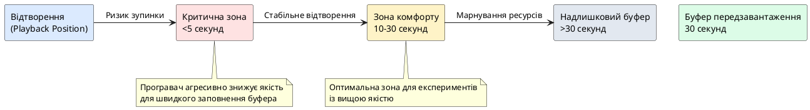
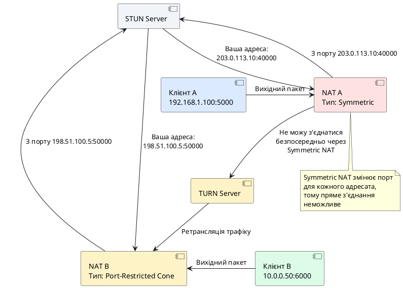
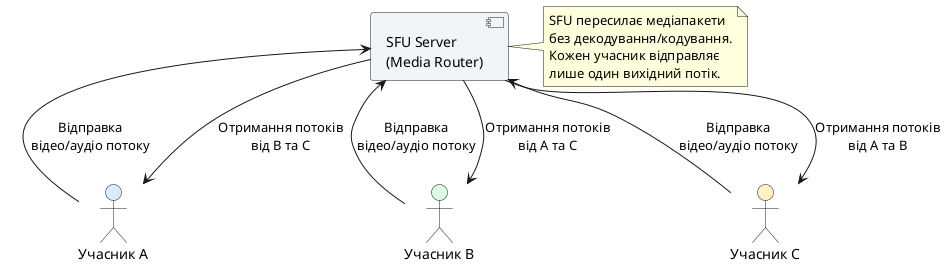

# Протоколи потокового медіа та технологія WebRTC

::card-group

::card{title="🎯 Мета лекції" icon="i-lucide-target"}

- Зрозуміти фундаментальні відмінності між завантаженням файлів та потоковою передачею медіаконтенту.
- Опанувати архітектуру протоколу HTTP Live Streaming (HLS) та формат маніфестів `.m3u8`.
- Навчитися організовувати роздачу адаптивного відео з використанням різних рівнів якості.
- Дослідити альтернативний протокол DASH (Dynamic Adaptive Streaming over HTTP) та його переваги.
- Зрозуміти архітектуру технології WebRTC для прямого P2P зв'язку без проміжних серверів.
- Опанувати процес сигналізації, встановлення з'єднання через ICE та роль серверів STUN/TURN.
- Реалізувати сервер потокового відео та систему відеочату на базі бібліотеки Pion WebRTC у Go.

::

::card{title="🔑 Ключові терміни" icon="i-lucide-key"}

- **Streaming (потокова передача):** технологія доставки медіаконтенту у вигляді послідовних фрагментів, що дозволяє розпочати відтворення до завершення завантаження всього файлу.
- **HLS (HTTP Live Streaming):** протокол потокової передачі медіа, розроблений компанією Apple, що використовує звичайні HTTP-сервери.
- **Manifest (маніфест):** текстовий файл формату `.m3u8`, що містить метаінформацію про доступні медіасегменти та потоки.
- **Adaptive Bitrate (ABR, адаптивний бітрейт):** технологія автоматичного вибору якості відео залежно від швидкості з'єднання користувача.
- **DASH (Dynamic Adaptive Streaming over HTTP):** відкритий міжнародний стандарт адаптивного стрімінгу, альтернатива HLS.
- **WebRTC (Web Real-Time Communication):** набір протоколів та API для прямого обміну аудіо, відео та даними між браузерами/застосунками без посередників.
- **Signaling (сигналізація):** процес обміну метаданими сесії (SDP) між учасниками перед встановленням прямого з'єднання.
- **ICE (Interactive Connectivity Establishment):** фреймворк для визначення найкращого шляху з'єднання між двома вузлами через NAT.
- **STUN/TURN:** допоміжні сервери для визначення публічної IP-адреси клієнта (STUN) та проксування трафіку у випадку неможливості прямого з'єднання (TURN).

::

::

---

## Світ потокового медіаконтенту: від завантаження до стрімінгу

У ранні роки розвитку інтернету споживання медіаконтенту здійснювалося переважно через повне завантаження файлу перед його відтворенням. Користувач ініціював завантаження відеофайлу формату `.avi`, `.mp4` або `.mov`, очікував завершення передачі усього обсягу даних (що могло тривати від хвилин до годин залежно від розміру та швидкості з'єднання), і лише після цього міг розпочати перегляд. Такий підхід мав цілу низку принципових обмежень: неможливість перегляду тривалих матеріалів без попереднього завершення завантаження, марнування дискового простору на клієнтській машині, відсутність адаптації до змін у пропускній здатності мережі та складність організації трансляцій у реальному часі (live streaming).

**Потокова передача медіа (Media Streaming)** радикально змінила парадигму доставки аудіо- та відеоконтенту. Замість завантаження монолітного файлу, медіапотік розділяється на невеликі самодостатні фрагменти (сегменти) тривалістю зазвичай від 2 до 10 секунд. Клієнтський програвач послідовно завантажує ці сегменти по HTTP, розпочинаючи відтворення вже після отримання першого фрагменту, паралельно завантажуючи наступні. Цей підхід забезпечує майже миттєвий старт відтворення, дозволяє здійснювати швидку перемотку вперед (достатньо завантажити сегмент із потрібної позиції без передачі проміжних даних), адаптувати якість під поточну швидкість з'єднання та здійснювати трансляції живих подій із затримкою, близькою до реального часу.

Ключовою інновацією сучасних протоколів стрімінгу є концепція **адаптивного бітрейту (Adaptive Bitrate Streaming, ABR)**. Медіаконтент заздалегідь кодується у декілька варіантів якості (наприклад, 360p, 720p, 1080p, 4K), кожен із яких сегментується окремо. Програвач постійно вимірює доступну пропускну здатність мережі та поточний розмір буфера, динамічно обираючи оптимальну версію наступного сегменту. Якщо швидкість з'єднання знижується (наприклад, користувач перемістився у зону поганого покриття мобільної мережі), програвач автоматично перемикається на нижчу якість, запобігаючи затримкам та зупинкам відтворення (*buffering*). При покращенні умов система знову повертається до максимально можливої роздільної здатності. Завдяки цьому механізму забезпечується безперервний перегляд незалежно від нестабільності мережі, що є критичним фактором для позитивного користувацького досвіду.

::note
На відміну від класичного протоколу **RTSP (Real-Time Streaming Protocol)** або **RTMP (Real-Time Messaging Protocol)**, які працюють поверх TCP або окремих транспортних протоколів та вимагають встановлення спеціалізованих потокових серверів (наприклад, Wowza, Adobe Media Server), сучасні протоколи HTTP-стрімінгу (HLS, DASH) повністю базуються на звичайному протоколі **HTTP** і можуть обслуговуватися стандартними вебсерверами (Nginx, Apache, Caddy) або навіть CDN (Content Delivery Networks). Це спрощує масштабування, кешування на проміжних вузлах та проходження через корпоративні брандмауери, які зазвичай блокують нестандартні порти, але дозволяють HTTP/HTTPS-трафік.
::

---

## HTTP Live Streaming (HLS): Архітектура та принципи роботи

Протокол **HTTP Live Streaming (HLS)** був представлений компанією Apple у 2009 році як частина екосистеми iOS та macOS. Первісно розроблений для забезпечення якісного стрімінгу на мобільних пристроях із нестабільним з'єднанням, HLS швидко став де-факто стандартом у індустрії завдяки своїй простоті, надійності та універсальній підтримці у більшості браузерів та платформ. Специфікація протоколу зафіксована у документі **RFC 8216** (HTTP Live Streaming, 2nd Edition).

### Компоненти архітектури HLS

Система потокової передачі на базі HLS складається з трьох основних компонентів:

**1. Кодувальник та сегментатор (Encoder & Segmenter).**  
Вихідний медіаконтент (відеофайл або живий потік із камери) обробляється кодувальником, який виконує транскодування у сумісні формати (зазвичай H.264/H.265 для відео та AAC для аудіо) на різних рівнях якості (бітрейтах). Після транскодування спеціалізований інструмент (наприклад, **FFmpeg** з параметром `-hls_time`) розрізає кожен варіант на короткі медіасегменти фіксованої або змінної тривалості (зазвичай 6–10 секунд). Історично сегменти зберігалися у форматі **MPEG-2 Transport Stream (`.ts`)**, проте сучасні реалізації все частіше використовують контейнер **Fragmented MP4 (`.m4s`)**, який забезпечує кращу ефективність та сумісність.

**2. HTTP-сервер роздачі сегментів (Origin Server / CDN).**  
Згенеровані медіасегменти та файли маніфестів розміщуються на звичайному HTTP-сервері або мережі доставки контенту (CDN). Сервер не виконує жодної спеціалізованої логіки — він просто віддає статичні файли у відповідь на HTTP GET запити від клієнтів. Використання CDN дозволяє географічно розподілити навантаження, кешувати популярні сегменти на крайових серверах та зменшити затримки доставки.

**3. Клієнтський програвач (Media Player).**  
Програвач на стороні клієнта (вбудований у браузер, мобільний застосунок або десктопний медіацентр) розбирає файл маніфесту, приймає рішення про вибір потрібного варіанту якості, послідовно завантажує медіасегменти через HTTP та подає їх на декодування і відтворення. Сучасні програвачі (наприклад, **Video.js**, **hls.js**, нативна підтримка у Safari/iOS, **ExoPlayer** на Android) реалізують складну логіку адаптивного вибору бітрейту, передзавантаження сегментів у буфер, обробки помилок та перемикання між серверами у разі збоїв.

### Формат маніфесту `.m3u8`

Центральним елементом протоколу HLS є текстовий файл маніфесту з розширенням **`.m3u8`** (кодування UTF-8 варіант формату M3U, який історично використовувався для списків відтворення аудіо). Маніфест містить метаінформацію про структуру потоку, доступні варіанти якості та посилання на медіасегменти.

Існує два типи маніфестів:

**Master Playlist (головний список відтворення):**  
Перший файл, який запитує клієнт. Він містить посилання на окремі медіа-списки (Media Playlists) для кожного варіанту якості, а також інформацію про пропускну здатність, роздільну здатність та аудіодоріжки. Головний маніфест дозволяє програвачу оцінити доступні опції та обрати найбільш підходящу для початку відтворення.

**Media Playlist (медіа-список відтворення):**  
Окремий файл для конкретного варіанту якості, що містить упорядкований список посилань на медіасегменти (`.ts` або `.m4s` файли) із зазначенням тривалості кожного фрагменту. Медіа-список може бути статичним (для відео на вимогу, VOD) або динамічним (для живих трансляцій, коли нові сегменти додаються у реальному часі, а старі видаляються після закінчення актуальності).


#### Приклад головного маніфесту (Master Playlist)

Розглянемо структуру типового головного маніфесту для відео із трьома варіантами якості:

```m3u8
#EXTM3U
#EXT-X-VERSION:3

# Варіант 1: Низька якість (360p, 800 kbps)
#EXT-X-STREAM-INF:BANDWIDTH=800000,RESOLUTION=640x360,CODECS="avc1.42e00a,mp4a.40.2"
360p/playlist.m3u8

# Варіант 2: Середня якість (720p, 2000 kbps)
#EXT-X-STREAM-INF:BANDWIDTH=2000000,RESOLUTION=1280x720,CODECS="avc1.4d401f,mp4a.40.2"
720p/playlist.m3u8

# Варіант 3: Висока якість (1080p, 5000 kbps)
#EXT-X-STREAM-INF:BANDWIDTH=5000000,RESOLUTION=1920x1080,CODECS="avc1.640028,mp4a.40.2"
1080p/playlist.m3u8
```

Кожен рядок `#EXT-X-STREAM-INF` визначає окремий потік із ключовими параметрами:

- **`BANDWIDTH`** — приблизна пропускна здатність у бітах за секунду, необхідна для плавного відтворення цього варіанту. Програвач використовує це значення для вибору оптимального потоку на основі вимірювань реальної швидкості з'єднання.
- **`RESOLUTION`** — роздільна здатність відео у форматі `ширина×висота` пікселів. Інформація корисна для адаптації під розмір екрану пристрою (немає сенсу завантажувати 4K на смартфон із екраном 720p).
- **`CODECS`** — специфікація відео- та аудіокодеків у форматі RFC 6381. Значення `avc1` позначає H.264 (Advanced Video Coding), а `mp4a.40.2` — AAC-LC аудіокодек. Програвач перевіряє підтримку кодеків апаратним декодером пристрою перед вибором потоку.

Після рядка з метаданими слідує відносний або абсолютний URL медіа-списку конкретного варіанту якості (наприклад, `360p/playlist.m3u8`).

::tip
Програвач зазвичай обирає початковий варіант якості на основі попередніх вимірювань швидкості (якщо доступні) або починає з середнього/низького рівня для швидкого старту. Після завантаження перших кількох сегментів система аналізує фактичну швидкість завантаження та час заповнення буфера, приймаючи рішення про перемикання на вищу або нижчу якість для наступних сегментів.
::

#### Приклад медіа-списку (Media Playlist) для VOD

Медіа-список конкретного варіанту якості містить упорядкований перелік медіасегментів:

```m3u8
#EXTM3U
#EXT-X-VERSION:3
#EXT-X-TARGETDURATION:10
#EXT-X-MEDIA-SEQUENCE:0

#EXTINF:10.0,
segment_0.ts
#EXTINF:10.0,
segment_1.ts
#EXTINF:10.0,
segment_2.ts
#EXTINF:10.0,
segment_3.ts
#EXTINF:10.0,
segment_4.ts
#EXTINF:8.5,
segment_5.ts

#EXT-X-ENDLIST
```

Основні директиви медіа-списку:

- **`#EXT-X-VERSION`** — версія специфікації HLS. Версія 3 є базовою та широко підтримується, новіші версії (4+) додають можливості шифрування, альтернативних аудіодоріжок та інших розширень.
- **`#EXT-X-TARGETDURATION`** — максимальна тривалість одного сегменту в секундах (округлена до цілого числа). Програвач використовує це значення для визначення інтервалу оновлення списку при живих трансляціях.
- **`#EXT-X-MEDIA-SEQUENCE`** — порядковий номер першого сегменту у списку. Для VOD зазвичай дорівнює 0, для живих трансляцій збільшується при видаленні старих сегментів зі списку.
- **`#EXTINF`** — тривалість наступного сегменту у секундах (може бути дробовою). Кома після числа є обов'язковою частиною синтаксису, після неї може слідувати опціональний опис сегменту (рідко використовується).
- **`#EXT-X-ENDLIST`** — маркер завершення статичного списку (VOD). Його наявність сигналізує програвачу, що медіапотік закінчений і нових сегментів не буде. У разі живих трансляцій цей тег відсутній, і програвач періодично перезавантажує маніфест для отримання нових сегментів.

::note
Для живих трансляцій (Live Streaming) медіа-список є **динамічним документом**, що постійно оновлюється сервером. Після відтворення останнього доступного сегменту програвач чекає приблизно одну тривалість сегменту, після чого повторно запитує маніфест. У новій версії з'являються свіжі сегменти, а найдавніші видаляються (зазвичай зберігається вікно з останніх 3–6 сегментів). Це створює ковзне вікно трансляції (*sliding window*) та обмежує можливість перемотки назад до декількох десятків секунд.
::

---

## Адаптивний бітрейт (Adaptive Bitrate Streaming)

Концепція адаптивного бітрейту є серцем сучасних систем стрімінгу. Замість використання фіксованого потоку якості, клієнтський програвач постійно оцінює поточні мережеві умови та динамічно змінює рівень якості для забезпечення безперервного відтворення.

### Алгоритм адаптації

Типовий алгоритм адаптивного вибору бітрейту складається з наступних кроків:

**1. Ініціалізація та вибір стартової якості.**  
При першому завантаженні програвач аналізує доступні варіанти у головному маніфесті. Якщо немає попередньої інформації про швидкість мережі (наприклад, перший запуск застосунку), зазвичай обирається середній або низький варіант для гарантованого швидкого старту. Деякі реалізації виконують короткий попередній тест швидкості (*bandwidth probing*), завантажуючи невеликий тестовий сегмент та вимірюючи швидкість передачі.

**2. Вимірювання швидкості завантаження.**  
Після завантаження кожного сегменту програвач фіксує реальний час завантаження та розмір отриманих даних, обчислюючи миттєву швидкість передачі. Для згладжування коливань зазвичай застосовується ковзне середнє (exponential moving average, EMA) за останніми декількома сегментами:

::math-formula
\text{Bandwidth}_{\text{est}} = \alpha \cdot \text{Bandwidth}_{\text{current}} + (1 - \alpha) \cdot \text{Bandwidth}_{\text{prev}}
::

де :math-formula{tex="\alpha" inline} — коефіцієнт згладжування (зазвичай 0.2–0.3).

**3. Аналіз стану буфера.**  
Програвач постійно контролює розмір буфера передзавантажених сегментів (зазвичай вимірюється у секундах майбутнього відтворення). Якщо буфер наближається до критично низького рівня (менше 5–10 секунд), система може превентивно знизити якість для прискорення завантаження наступного сегменту. Навпаки, великий заповнений буфер (30+ секунд) дозволяє спробувати перемикання на вищу якість навіть при незначному покращенні швидкості.

**4. Прийняття рішення про перемикання.**  
На основі оціненої пропускної здатності, поточного стану буфера та доступних варіантів у маніфесті алгоритм обирає оптимальний рівень якості для наступного сегменту. Перемикання відбувається на межі сегментів, що забезпечує плавність без артефактів. Сучасні алгоритми (наприклад, **BOLA** — Buffer Occupancy based Lyapunov Algorithm) використовують теорію управління для досягнення оптимального балансу між якістю відео та стабільністю відтворення.

::warning
Занадто агресивне перемикання між рівнями якості може призвести до негативного користувацького досвіду через часті зміни різкості картинки (*quality oscillation*). Хороший алгоритм адаптації повинен мати певну гістерезисну затримку: для переходу на вищу якість вимагається стабільне підтвердження покращення умов протягом декількох сегментів, а для пониження — швидка реакція на погіршення для запобігання зупинкам буферизації.
::

### Переваги адаптивного підходу

Технологія адаптивного бітрейту вирішує одну з найскладніших проблем доставки медіа через інтернет: **непередбачувану та змінну природу мережевої пропускної здатності**. Користувач може розпочати перегляд відео вдома через швидке Wi-Fi з'єднання (50+ Mbps), продовжити у транспорті через 4G (5–20 Mbps із періодичними провалами), а завершити у зоні слабкого покриття з швидкістю менше 1 Mbps. Без адаптації такий сценарій призвів би до постійних зупинок та буферизації. З ABR система автоматично підлаштовується під кожний етап, забезпечуючи безперервність відтворення з максимально можливою якістю.

Додатковою перевагою є **оптимізація споживання трафіку**. Користувачі з обмеженими тарифними планами автоматично отримують контент у стислому вигляді за умов повільного з'єднання, що зменшує витрати мобільного трафіку без необхідності ручного налаштування параметрів програвача.

### Глибоке розуміння буферизації та управління якістю

Ефективна робота адаптивного стрімінгу залежить не лише від вимірювання швидкості мережі, але й від інтелектуального управління **буфером передзавантаження** — черги сегментів, які вже завантажені, але ще не відтворені.

#### Анатомія буфера програвача

Буфер програвача можна уявити як часову лінію майбутнього контенту:

::plant-uml{alt="Модель буфера відтворення"}



::

**Три стани буфера:**

1. **Критичний рівень (<5 секунд):** Програвач знаходиться у режимі паніки. Навіть короткочасне уповільнення мережі призведе до зупинки відтворення (*buffering*). Система негайно перемикається на найнижчу якість і максимально прискорює завантаження.

2. **Зона комфорту (10–30 секунд):** Оптимальний діапазон для роботи. Є достатній запас для поглинання коливань швидкості, і програвач може експериментувати з вищою якістю. Більшість алгоритмів ABR намагаються підтримувати буфер саме у цьому діапазоні.

3. **Надлишковий буфер (>30 секунд):** Марнування ресурсів. Якщо буфер занадто великий, програвач завантажує сегменти високої якості, які користувач можливо ніколи не побачить (наприклад, якщо закриє відео або перемотає вперед). Крім того, великий буфер уповільнює реакцію на зміни якості.

#### Математична модель прийняття рішень

Сучасні алгоритми ABR використовують складні евристики для балансування між **якістю** (максимізація бітрейту), **стабільністю** (мінімізація перемикань) та **швидкістю старту** (мінімізація часу до початку відтворення). Розглянемо спрощену модель:

**Метрики для прийняття рішення:**

1. **Оцінена пропускна здатність** :math-formula{tex="B_{\text{est}}" inline}:
   - Обчислюється як ковзне середнє за останніми N сегментами
   - Зазвичай беруться песимістичні оцінки (наприклад, 10-й перцентиль замість середнього)

2. **Поточний розмір буфера** :math-formula{tex="T_{\text{buffer}}" inline} (у секундах):
   - Вимірюється як різниця між позицією останнього завантаженого сегменту та поточною позицією відтворення

3. **Бітрейти доступних варіантів** :math-formula{tex="R_1, R_2, ..., R_n" inline}:
   - Сортовані за зростанням (від найнижчої до найвищої якості)

**Правило вибору наступного варіанту:**

::math-formula
R_{\text{next}} = \max \{ R_i \mid R_i \leq \alpha \cdot B_{\text{est}} \text{ та } T_{\text{buffer}} > T_{\text{min}} \}
::

де :math-formula{tex="\alpha" inline} — коефіцієнт безпеки (зазвичай 0.85–0.9), що залишає запас для поглинання коливань швидкості.

**Умова превентивного зниження якості:**

Якщо :math-formula{tex="T_{\text{buffer}} < T_{\text{critical}}" inline} (наприклад, <5 секунд), алгоритм ігнорує оцінку пропускної здатності та негайно перемикається на :math-formula{tex="R_1" inline} (найнижчу якість) для швидкого заповнення буфера.

**Гістерезис для запобігання осциляціям:**

Для переходу на вищу якість вимагається стабільне підтвердження протягом :math-formula{tex="K" inline} послідовних сегментів (зазвичай K=3):

::math-formula
\text{Upgrade якщо: } R_{i+1} \leq \alpha \cdot B_{\text{est}} \text{ протягом } K \text{ сегментів}
::

Це запобігає ситуації, коли програвач постійно перемикається між 720p та 1080p через мінімальні коливання швидкості.

::note
Алгоритм **BOLA (Buffer Occupancy based Lyapunov Algorithm)**, розроблений дослідниками з University of Massachusetts, використовує теорію оптимального управління для максимізації якості при дотриманні обмежень на стабільність буфера. BOLA є референсною реалізацією у бібліотеці **dash.js** та забезпечує кращу якість порівняно з простими евристиками, особливо у нестабільних мережах.
::

---

## Реалізація HLS-сервера у Go

Тепер перейдемо до практичної реалізації HTTP-сервера для роздачі HLS-контенту на мові Go. Наша система складатиметься з двох основних компонентів: попередньої підготовки медіаконтенту за допомогою FFmpeg та вебсервера, що обслуговує маніфести і сегменти.

### Крок 1. Підготовка медіасегментів за допомогою FFmpeg

**FFmpeg** — універсальний інструмент командного рядка для обробки мультимедіа, який підтримує транскодування, сегментацію та генерацію маніфестів HLS. Припустимо, у нас є вихідний відеофайл `source.mp4`, який ми хочемо підготувати для стрімінгу у трьох варіантах якості.

Команда для генерації HLS-потоку з адаптивним бітрейтом виглядає наступним чином:

```bash
ffmpeg -i source.mp4 \
  -filter_complex \
  "[0:v]split=3[v1][v2][v3]; \
   [v1]scale=w=640:h=360[v1out]; \
   [v2]scale=w=1280:h=720[v2out]; \
   [v3]scale=w=1920:h=1080[v3out]" \
  -map "[v1out]" -c:v:0 libx264 -b:v:0 800k -maxrate:v:0 856k -bufsize:v:0 1200k \
  -map "[v2out]" -c:v:1 libx264 -b:v:1 2000k -maxrate:v:1 2140k -bufsize:v:1 3000k \
  -map "[v3out]" -c:v:2 libx264 -b:v:2 5000k -maxrate:v:2 5350k -bufsize:v:2 7500k \
  -map a:0 -c:a aac -b:a 128k -ac 2 \
  -f hls \
  -hls_time 10 \
  -hls_playlist_type vod \
  -hls_segment_filename "stream_%v/segment_%03d.ts" \
  -master_pl_name master.m3u8 \
  -var_stream_map "v:0,a:0 v:1,a:0 v:2,a:0" \
  stream_%v/playlist.m3u8
```

**Детальне пояснення ключових параметрів:**

**Граф відеофільтрів (`-filter_complex`):**

Параметр `-filter_complex` визначає комплексний граф обробки медіапотоків, що дозволяє виконувати паралельні операції над одним джерелом:

- **`[0:v]split=3[v1][v2][v3]`** — отримує вхідний відеопотік (позначений як `0:v`, де `0` — індекс файлу, `v` — відео) та розділяє його на три ідентичні копії, які позначаються мітками `[v1]`, `[v2]`, `[v3]`. Це необхідно, оскільки один і той самий вхідний потік не може бути використаний декілька разів у різних ланцюжках обробки.
- **`[v1]scale=w=640:h=360[v1out]`** — застосовує фільтр масштабування до першої копії. Параметри `w` (width, ширина) та `h` (height, висота) визначають цільову роздільну здатність 640×360 пікселів (360p). Результат зберігається під міткою `[v1out]`.
- Аналогічно для `[v2]` (720p) та `[v3]` (1080p).

**Налаштування кодування відео (`-map`, `-c:v`, `-b:v`):**

- **`-map "[v1out]"`** — вказує FFmpeg використати відеопотік `[v1out]` (результат масштабування) як вхідний матеріал для кодування. Без явного `-map` FFmpeg автоматично обирає лише один потік кожного типу.
- **`-c:v:0 libx264`** — визначає відеокодек для першого вихідного потоку (індекс `:0`). Значення `libx264` активує програмну реалізацію кодеку H.264/AVC через бібліотеку x264. Для апаратного прискорення можна використовувати `h264_nvenc` (NVIDIA GPU) або `h264_videotoolbox` (macOS).
- **`-b:v:0 800k`** — встановлює **середній (target) бітрейт** відеопотоку на 800 кілобіт/с. Кодек намагатиметься досягти цього значення у середньому по всьому відео, дозволяючи короткочасні відхилення для складних сцен.
- **`-maxrate:v:0 856k`** — **максимальний бітрейт**, який не може бути перевищений навіть для найскладніших кадрів (зазвичай на 5–10% вище за середній). Це критично для стрімінгу, оскільки гарантує, що жодна частина відео не вимагатиме більшої пропускної здатності, ніж заявлено у маніфесті.
- **`-bufsize:v:0 1200k`** — розмір **буфера верифікації відео (VBV buffer)** у бітах. Визначає, скільки даних декодер може накопичити перед початком відтворення. Більший буфер дозволяє кращу якість для складних сцен, але збільшує затримку старту. Рекомендоване значення: 1.5× від максимального бітрейту.

**Аудіокодування (`-map a`, `-c:a`, `-b:a`):**

- **`-map a:0`** — обирає першу аудіодоріжку вхідного файлу. Якщо відео містить декілька аудіодоріжок (наприклад, різні мови), можна вибрати конкретну через індекс.
- **`-c:a aac`** — використовує кодек **AAC (Advanced Audio Coding)** для аудіо. AAC забезпечує кращу якість звуку порівняно з MP3 при тому самому бітрейті та універсально підтримується всіма платформами.
- **`-b:a 128k`** — аудіобітрейт 128 кбіт/с. Це стандартне значення для стереозвуку прийнятної якості. Для музичного контенту можна підвищити до 192–256 кбіт/с, для мовлення — знизити до 64–96 кбіт/с.
- **`-ac 2`** — кількість аудіоканалів (audio channels). Значення `2` означає стерео. Для моно використовується `1`, для об'ємного звуку 5.1 — `6`.

**Параметри HLS-сегментації:**

- **`-f hls`** — вихідний формат HLS. Вказує FFmpeg генерувати маніфести `.m3u8` та медіасегменти замість одного цілісного файлу.
- **`-hls_time 10`** — **цільова тривалість** одного сегменту в секундах. FFmpeg намагається розрізати відео на кордонах ключових кадрів (keyframes), тому реальна тривалість може трохи відрізнятися. Короткі сегменти (2–4 с) зменшують затримку live-трансляцій, довгі (10+ с) покращують ефективність кешування CDN.
- **`-hls_playlist_type vod`** — тип списку відтворення. Значення `vod` (Video on Demand) генерує статичний маніфест із тегом `#EXT-X-ENDLIST`, що сигналізує завершеність контенту. Для live-трансляцій використовується `event` (зростаючий список без видалення старих сегментів) або опускається параметр для створення ковзного вікна (*sliding window*).
- **`-hls_segment_filename "stream_%v/segment_%03d.ts"`** — шаблон імені файлів сегментів. `%v` замінюється номером варіанту потоку (0, 1, 2), `%03d` — послідовним номером сегменту з доповненням нулями до трьох цифр (001, 002, ..., 099, 100).
- **`-master_pl_name master.m3u8`** — ім'я файлу головного маніфесту (Master Playlist), що міститиме метаінформацію про всі доступні варіанти якості.
- **`-var_stream_map "v:0,a:0 v:1,a:0 v:2,a:0"`** — визначає **зіставлення потоків** для кожного варіанту. Формат: `v:X,a:Y`, де `X` — індекс відеопотоку, `Y` — індекс аудіопотоку. У нашому випадку всі три відеоваріанти використовують одну спільну аудіодоріжку (індекс `0`).

Після виконання команди FFmpeg створить директорії `stream_0/`, `stream_1/`, `stream_2/` із відповідними медіа-списками `playlist.m3u8` та файлами сегментів `segment_000.ts`, `segment_001.ts`, ..., а також головний маніфест `master.m3u8` у кореневій директорії.


### Крок 2. Простий HTTP-сервер для роздачі HLS у Go

Після підготовки медіаконтенту нам потрібен HTTP-сервер, який обслуговуватиме запити клієнтських програвачів. Оскільки HLS базується на звичайних HTTP GET запитах до статичних файлів, найпростішою реалізацією є використання стандартного файлового обробника Go:

```go
package main

import (
    "log"
    "net/http"
)

func main() {
    // Створюємо файловий обробник для директорії з HLS-контентом
    fs := http.FileServer(http.Dir("./hls_content"))
    
    // Налаштовуємо маршрут для роздачі медіа
    http.Handle("/stream/", http.StripPrefix("/stream/", fs))
    
    // Додаємо заголовки CORS для дозволу вебклієнтів з інших доменів
    http.HandleFunc("/", func(w http.ResponseWriter, r *http.Request) {
        w.Header().Set("Access-Control-Allow-Origin", "*")
        w.Header().Set("Access-Control-Allow-Methods", "GET, OPTIONS")
        w.Header().Set("Access-Control-Allow-Headers", "Content-Type")
        
        if r.Method == http.MethodOptions {
            w.WriteHeader(http.StatusOK)
            return
        }
        
        fs.ServeHTTP(w, r)
    })
    
    log.Println("HLS streaming server запущено на порту :8080")
    log.Println("Головний маніфест доступний за адресою: http://localhost:8080/stream/master.m3u8")
    
    if err := http.ListenAndServe(":8080", nil); err != nil {
        log.Fatalf("Помилка запуску сервера: %v", err)
    }
}
```

Цей мінімалістичний сервер виконує роздачу файлів маніфестів (`.m3u8`) та медіасегментів (`.ts`) із директорії `./hls_content`. Заголовки CORS дозволяють браузерам завантажувати контент із довільних веб-застосунків, що критично для тестування через різні домени.

::tip
У продакшн-середовищах рекомендується використовувати спеціалізовані вебсервери **Nginx** або **Caddy** для роздачі статичних медіафайлів. Вони забезпечують значно вищу продуктивність, вбудовану підтримку кешування, стискання (gzip, Brotli), обмеження швидкості (*rate limiting*) та інтеграцію з CDN. Go-сервер може залишатися для динамічної генерації маніфестів або проксування запитів до джерел контенту.
::

### Крок 3. Вдосконалений сервер із динамічною генерацією маніфестів

Для живих трансляцій або ситуацій, коли медіасегменти генеруються в реальному часі, може знадобитися динамічна побудова медіа-списків. Наступний приклад демонструє генерацію `.m3u8` маніфесту на льоту:

```go
package main

import (
    "fmt"
    "log"
    "net/http"
    "os"
    "path/filepath"
    "sort"
    "strings"
)

const (
    segmentDuration = 10.0 // Тривалість одного сегменту в секундах
    baseURL         = "/stream/"
)

// generateMediaPlaylist створює медіа-список для конкретного варіанту якості
func generateMediaPlaylist(w http.ResponseWriter, quality string) {
    segmentsDir := filepath.Join("./hls_content", quality)
    
    // Зчитуємо список файлів сегментів із директорії
    files, err := os.ReadDir(segmentsDir)
    if err != nil {
        http.Error(w, "Помилка читання директорії сегментів", http.StatusInternalServerError)
        return
    }
    
    // Фільтруємо та сортуємо .ts файли
    var segments []string
    for _, file := range files {
        if !file.IsDir() && strings.HasSuffix(file.Name(), ".ts") {
            segments = append(segments, file.Name())
        }
    }
    sort.Strings(segments)
    
    // Формуємо маніфест у форматі HLS
    w.Header().Set("Content-Type", "application/vnd.apple.mpegurl")
    w.Header().Set("Access-Control-Allow-Origin", "*")
    
    fmt.Fprintf(w, "#EXTM3U\n")
    fmt.Fprintf(w, "#EXT-X-VERSION:3\n")
    fmt.Fprintf(w, "#EXT-X-TARGETDURATION:%d\n", int(segmentDuration)+1)
    fmt.Fprintf(w, "#EXT-X-MEDIA-SEQUENCE:0\n\n")
    
    for _, seg := range segments {
        fmt.Fprintf(w, "#EXTINF:%.1f,\n", segmentDuration)
        fmt.Fprintf(w, "%s/%s\n", quality, seg)
    }
    
    fmt.Fprintf(w, "#EXT-X-ENDLIST\n")
}

func main() {
    // Роздача статичних медіасегментів
    fs := http.FileServer(http.Dir("./hls_content"))
    http.Handle("/stream/", http.StripPrefix("/stream/", fs))
    
    // Динамічна генерація медіа-списків
    http.HandleFunc("/playlist/360p.m3u8", func(w http.ResponseWriter, r *http.Request) {
        generateMediaPlaylist(w, "stream_0")
    })
    http.HandleFunc("/playlist/720p.m3u8", func(w http.ResponseWriter, r *http.Request) {
        generateMediaPlaylist(w, "stream_1")
    })
    http.HandleFunc("/playlist/1080p.m3u8", func(w http.ResponseWriter, r *http.Request) {
        generateMediaPlaylist(w, "stream_2")
    })
    
    log.Println("Розширений HLS-сервер запущено на :8080")
    log.Fatal(http.ListenAndServe(":8080", nil))
}
```

У цій реалізації функція `generateMediaPlaylist` сканує директорію з медіасегментами та динамічно формує маніфест із актуальним списком доступних фрагментів. Це дозволяє додавати нові сегменти без перезапуску сервера — підхід, критичний для живих трансляцій.

::note
Для справжніх систем live streaming необхідно реалізувати логіку **ковзного вікна** (sliding window): після додавання нового сегменту найстаріші видаляються зі списку, а значення `#EXT-X-MEDIA-SEQUENCE` збільшується. Програвач періодично перезавантажує маніфест (зазвичай раз на тривалість одного сегменту) та завантажує нові фрагменти у міру їх появи. Затримка між реальною подією та її відображенням у програвача становить приблизно 2–3 тривалості сегменту (наприклад, 20–30 секунд при 10-секундних сегментах).
::

---

## DASH: альтернативний стандарт адаптивного стрімінгу

Протокол **DASH (Dynamic Adaptive Streaming over HTTP)**, стандартизований консорціумом MPEG як **ISO/IEC 23009-1**, є відкритою та незалежною від виробника альтернативою HLS. На відміну від HLS, який історично був зв'язаний з екосистемою Apple, DASH був розроблений як міжнародний стандарт із підтримкою провідних технологічних компаній (Google, Microsoft, Netflix, Adobe).

### Ключові відмінності між HLS та DASH

| Аспект | HLS (Apple) | DASH (MPEG) |
|--------|-------------|-------------|
| **Формат маніфесту** | Текстовий файл `.m3u8` (розширений M3U) | XML-документ `.mpd` (Media Presentation Description) |
| **Формат сегментів** | MPEG-2 TS (`.ts`) або fMP4 (`.m4s`) | Переважно fMP4 (`.m4s`), також підтримка WebM |
| **Стандартизація** | RFC 8216 (IETF), контрольований Apple | ISO/IEC 23009-1, відкритий консорціум MPEG |
| **Підтримка браузерів** | Нативна в Safari/iOS, через бібліотеки hls.js у інших | Нативна через Media Source Extensions (MSE) |
| **Шифрування контенту** | AES-128, Sample-AES, FairPlay DRM | MPEG-CENC (Common Encryption), Widevine, PlayReady |

### Архітектура DASH та формат MPD

Центральним елементом DASH є **Media Presentation Description (MPD)** — XML-файл, що описує структуру медіапрезентації. MPD містить ієрархію елементів:

**1. Period (Період).**  
Часовий інтервал презентації. Одна презентація може складатися з декількох періодів (наприклад, основний контент та рекламні вставки).

**2. AdaptationSet (Набір адаптації).**  
Група представлень одного типу медіа (відео, аудіо, субтитри) на різних рівнях якості. Клієнт може перемикатися між представленнями всередині одного набору адаптації.

**3. Representation (Представлення).**  
Конкретний варіант кодування (роздільна здатність, бітрейт, кодек). Кожне представлення містить посилання на список сегментів через шаблон URL або явний перелік.

**4. Segment (Сегмент).**  
Окремий файл медіаданих фіксованої або змінної тривалості, зазвичай у форматі Fragmented MP4.

#### Приклад спрощеного MPD-маніфесту

```xml
<?xml version="1.0" encoding="UTF-8"?>
<MPD xmlns="urn:mpeg:dash:schema:mpd:2011" 
     type="static" 
     mediaPresentationDuration="PT10M30S"
     minBufferTime="PT5S">
  
  <Period id="0" start="PT0S">
    <!-- Відео AdaptationSet -->
    <AdaptationSet mimeType="video/mp4" codecs="avc1.4d401f" 
                   width="1920" height="1080" frameRate="30">
      
      <!-- Представлення 1080p, 5 Mbps -->
      <Representation id="video_1080p" bandwidth="5000000">
        <SegmentTemplate timescale="1000" duration="10000" 
                         initialization="init_1080p.mp4" 
                         media="segment_1080p_$Number$.m4s" 
                         startNumber="1"/>
      </Representation>
      
      <!-- Представлення 720p, 2 Mbps -->
      <Representation id="video_720p" bandwidth="2000000" 
                      width="1280" height="720">
        <SegmentTemplate timescale="1000" duration="10000" 
                         initialization="init_720p.mp4" 
                         media="segment_720p_$Number$.m4s" 
                         startNumber="1"/>
      </Representation>
      
    </AdaptationSet>
    
    <!-- Аудіо AdaptationSet -->
    <AdaptationSet mimeType="audio/mp4" codecs="mp4a.40.2" lang="uk">
      <Representation id="audio" bandwidth="128000">
        <SegmentTemplate timescale="1000" duration="10000" 
                         initialization="init_audio.mp4" 
                         media="segment_audio_$Number$.m4s" 
                         startNumber="1"/>
      </Representation>
    </AdaptationSet>
    
  </Period>
</MPD>
```

**Пояснення ключових атрибутів:**

- **`type="static"`** — статична презентація (VOD). Для живих трансляцій використовується `type="dynamic"`.
- **`mediaPresentationDuration="PT10M30S"`** — загальна тривалість контенту у форматі ISO 8601 (10 хвилин 30 секунд).
- **`minBufferTime="PT5S"`** — мінімальний рекомендований розмір буфера клієнта (5 секунд).
- **`SegmentTemplate`** — шаблон для формування URL сегментів. Змінна `$Number$` замінюється послідовним номером сегменту, `initialization` вказує на спеціальний ініціалізаційний фрагмент fMP4, що містить заголовки контейнера.
- **`timescale="1000" duration="10000"`** — часова шкала у мілісекундах та тривалість сегменту (10000 мс = 10 секунд).

### Переваги DASH

**Відкритість та незалежність від виробника.**  
На відміну від HLS, який був створений Apple і довгий час залишався нестандартизованим, DASH є справжнім міжнародним стандартом, що гарантує інтероперабельність між різними платформами та постачальниками обладнання.

**Гнучкість у виборі кодеків та контейнерів.**  
DASH підтримує широкий спектр форматів: H.264, H.265 (HEVC), VP9, AV1 для відео; AAC, Opus для аудіо; контейнери fMP4, WebM. Це дозволяє оптимізувати баланс між якістю, розміром файлів та вимогами до декодування залежно від цільової платформи.

**Просунуті можливості захисту контенту.**  
DASH використовує стандарт **Common Encryption (CENC)**, що дозволяє зашифрувати контент один раз та розподіляти його через різні DRM-системи (Widevine, PlayReady, FairPlay) без потреби у множинному кодуванні.


::warning
Хоча DASH теоретично є кращим технічним рішенням, **HLS досі домінує у реальному світі** через історичну підтримку в iOS/Safari та масову інфраструктуру постачальників CDN, налаштовану під HLS. Багато стрімінгових платформ використовують гібридний підхід: HLS для Apple-пристроїв та DASH для Android/Web через MSE.
::

---

## WebRTC: революція прямого зв'язку в реальному часі

Протоколи HLS та DASH чудово підходять для доставки попередньо записаного контенту або live-трансляцій із прийнятною затримкою (15–30 секунд). Проте для інтерактивних сценаріїв використання — **відеоконференцій, дистанційного робочого столу, онлайн-ігор, телемедицини** — така затримка є неприйнятною. Саме для цих задач було розроблено технологію **WebRTC (Web Real-Time Communication)**.

### Філософія та архітектурні принципи WebRTC

WebRTC є не одним протоколом, а цілою **екосистемою стандартів**, що визначають набір протоколів, API та механізмів для прямого обміну медіаданими та довільною інформацією між користувацькими агентами (браузерами або нативними застосунками) з мінімальною затримкою. Ключові філософські принципи технології:

**1. Прямий зв'язок P2P (Peer-to-Peer).**  
На відміну від клієнт-серверної архітектури HLS/DASH, де медіаконтент завжди проходить через HTTP-сервер, WebRTC прагне встановити **пряме з'єднання між кінцевими учасниками** без посередників. Це радикально знижує затримку (латентність може досягати 100–200 мс замість секунд) та зменшує навантаження на центральні сервери. Медіапотоки передаються напряму з камери/мікрофона одного користувача до динаміків/екрана іншого.

**2. Безпека за замовчуванням.**  
Всі медіапотоки та дані, що передаються через WebRTC, обов'язково **шифруються** за допомогою протоколів **DTLS (Datagram Transport Layer Security)** та **SRTP (Secure Real-time Transport Protocol)**. Ключі шифрування обмінюються у процесі встановлення з'єднання, і немає можливості вимкнути шифрування — воно є невід'ємною частиною стека.

**3. Адаптація до мережевих умов у реальному часі.**  
WebRTC постійно моніторить якість з'єднання (втрати пакетів, джиттер, затримку) та динамічно адаптує параметри кодування медіа (бітрейт, роздільну здатність, частоту кадрів), щоб забезпечити найкращу можливу якість при поточних умовах.

**4. Універсальність та інтероперабельність.**  
Стандарти WebRTC підтримуються консорціумом W3C (API для JavaScript у браузерах) та IETF (мережеві протоколи). Це гарантує, що з'єднання може бути встановлене між різними типами клієнтів: Chrome на Windows, Safari на iOS, мобільний застосунок на Android, серверний компонент на Go, десктопна програма на Electron тощо.

### Компоненти архітектури WebRTC

Для успішного встановлення P2P-з'єднання необхідна взаємодія декількох компонентів:

**1. Signaling Server (Сервер сигналізації).**  
Незважаючи на концепцію прямого зв'єднання, учасники повинні спочатку якось обмінятися метаінформацією про свої можливості, мережеві адреси та параметри сесії. **Сигналізація** — це процес передачі цих даних через зовнішній канал зв'язку (зазвичай WebSocket або HTTP Long Polling). Важливо розуміти, що специфікація WebRTC **навмисно не стандартизує** протокол сигналізації, залишаючи розробникам свободу вибору (WebSocket, MQTT, навіть ручне копіювання через месенджер). Однак найпопулярнішим підходом є використання WebSocket-сервера, що пересилає повідомлення між учасниками.

**2. Протокол SDP (Session Description Protocol).**  
**SDP** — це текстовий формат опису параметрів медіасесії, стандартизований у **RFC 4566**. SDP-повідомлення містить інформацію про підтримувані кодеки (H.264, VP8, VP9, Opus), типи медіа (аудіо, відео, дані), порти та IP-адреси кандидатів для з'єднання, а також криптографічні відбитки сертифікатів для DTLS. Типовий процес встановлення з'єднання називається **Offer/Answer Model**:
   - Ініціатор (Caller) створює **Offer** — SDP-опис зі списком своїх можливостей та пропозицією параметрів сесії.
   - Відповідач (Callee) отримує Offer, аналізує його та формує **Answer** — SDP-відповідь зі своїми підтримуваними параметрами та узгодженими налаштуваннями.
   - Обидва учасники обмінюються цими SDP-описами через сервер сигналізації.

**3. ICE (Interactive Connectivity Establishment).**  
Після обміну SDP-описами потрібно визначити фактичну мережеву топологію та знайти оптимальний шлях з'єднання. Більшість користувачів знаходяться за **NAT (Network Address Translation)** або корпоративними брандмауерами, які приховують справжню IP-адресу пристрою та блокують вхідні з'єднання. Фреймворк **ICE (RFC 8445)** вирішує цю проблему шляхом збору **кандидатів з'єднання (ICE candidates)** — можливих мережевих адрес, через які може бути встановлене з'єднання:
   - **Host candidates:** локальні IP-адреси пристрою (приватні адреси локальної мережі, наприклад, `192.168.1.100`).
   - **Server-reflexive candidates (srflx):** публічна IP-адреса, отримана через запит до **STUN-сервера**.
   - **Relay candidates:** адреса **TURN-сервера**, що виконує роль ретранслятора трафіку у випадку неможливості прямого з'єднання.

**4. STUN Server (Session Traversal Utilities for NAT).**  
**STUN** — це простий протокол, що дозволяє клієнту дізнатися свою публічну IP-адресу та тип NAT, через який він під'єднаний до інтернету. Клієнт надсилає запит до публічного STUN-сервера (наприклад, `stun:stun.l.google.com:19302`), і сервер відповідає IP-адресою та портом, з якого було отримано запит. Ця інформація додається до списку ICE-кандидатів та передається іншому учаснику через сигналізацію.

**5. TURN Server (Traversal Using Relays around NAT).**  
У деяких мережевих конфігураціях (симетричний NAT, строгі корпоративні firewall) пряме з'єднання P2P неможливе навіть із знанням публічних адрес. У таких випадках використовується **TURN-сервер** — публічно доступний сервер-ретранслятор, через який проксується весь медіатрафік. TURN гарантує з'єднання у 100% випадків, але ціною збільшення затримки, навантаження на сервер та споживання пропускної здатності. Статистика показує, що приблизно 8–15% з'єднань потребують TURN через обмеження NAT.

::plant-uml{alt="Процес встановлення WebRTC-з'єднання"}

```plantuml
@startuml
skinparam style plain
skinparam backgroundColor #FFFFFF
autonumber

actor "Користувач A\n(Caller)" as UserA #DBEAFE
participant "Signaling Server\n(WebSocket)" as Signal #FEF3C7
actor "Користувач B\n(Callee)" as UserB #DCFCE7
participant "STUN Server" as STUN #E2E8F0
participant "TURN Server" as TURN #FEE2E2

UserA -> UserA : Збір локальних медіапотоків\n(камера, мікрофон)
UserA -> UserA : Створення PeerConnection
UserA -> STUN : STUN Binding Request
STUN -> UserA : Відповідь із публічною IP

UserA -> UserA : Генерація SDP Offer\nта збір ICE candidates
UserA -> Signal : Відправка Offer + ICE candidates
Signal -> UserB : Пересилання Offer

UserB -> UserB : Створення PeerConnection
UserB -> STUN : STUN Binding Request
STUN -> UserB : Відповідь із публічною IP

UserB -> UserB : Генерація SDP Answer\nта збір ICE candidates
UserB -> Signal : Відправка Answer + ICE candidates
Signal -> UserA : Пересилання Answer

UserA <-> UserB : Спроби встановлення\nпрямого з'єднання (ICE connectivity checks)

alt Пряме з'єднання успішне
    UserA <-> UserB : **DTLS Handshake**\nобмін криптографічними ключами
    UserA <-> UserB : **SRTP Media Stream**\n(аудіо, відео)
else Пряме з'єднання неможливе
    UserA -> TURN : Запит на створення Relay
    TURN -> UserA : Виділення Relay Candidate
    UserA -> Signal : Відправка TURN Candidate
    Signal -> UserB : Пересилання
    UserA <-> TURN <-> UserB : Ретрансляція медіатрафіку
end

@enduml
```

::

### Детальний розбір типів NAT та процесу ICE

Один із найскладніших аспектів WebRTC — це встановлення прямого з'єднання між вузлами, що знаходяться за **NAT (Network Address Translation)**. Розуміння типів NAT критично важливе для діагностики проблем із підключенням та налаштування інфраструктури STUN/TURN.

#### Типи NAT та їх вплив на з'єднання

**1. Full Cone NAT (найпростіший випадок):**  
Після того, як внутрішній хост надіслав пакет назовні через певний порт, NAT створює **постійне відображення** `приватна_IP:порт → публічна_IP:порт`. Будь-який зовнішній хост може надіслати пакет на цю публічну адресу, і він буде переспрямований на внутрішній хост. Це найсприятливіший тип для P2P з'єднань — достатньо STUN для визначення публічної адреси.

**2. Address-Restricted Cone NAT:**  
NAT дозволяє вхідні пакети лише від тих зовнішніх IP-адрес, на які внутрішній хост вже надсилав пакети. Порт відправника не має значення. Для встановлення з'єднання обидві сторони повинні спочатку надіслати пакети одна одній (**simultaneous open**). ICE автоматично виконує цей процес через connectivity checks.

**3. Port-Restricted Cone NAT:**  
Найсуворіший варіант Cone NAT: вхідні пакети дозволені лише від конкретної пари `зовнішня_IP:порт`, на яку було надіслано вихідний пакет. Потребує точної координації портів через ICE.

**4. Symmetric NAT (найскладніший випадок):**  
NAT створює **різні публічні порти** для кожного зовнішнього адресата. Якщо внутрішній хост надсилає пакети на `A.A.A.A:1111` та `B.B.B.B:2222` з одного локального порту, NAT виділяє два різні публічні порти (наприклад, `:40000` та `:40001`). Це робить пряме з'єднання практично неможливим без TURN, оскільки адреса, отримана через STUN, буде відрізнятися від адреси, яку бачить інший учасник.

::plant-uml{alt="Типи NAT та можливості встановлення з'єднання"}



::

#### Процес збору та перевірки ICE-кандидатів

Фреймворк **ICE (Interactive Connectivity Establishment)** автоматизує процес пошуку робочого шляху з'єднання через послідовність спроб:

**Фаза 1. Збір кандидатів (Candidate Gathering):**

1. **Host candidates:** Клієнт перераховує всі локальні мережеві інтерфейси (Ethernet, Wi-Fi, VPN) та додає їх IP-адреси як кандидати. Працює для з'єднань у локальній мережі.

2. **Server-reflexive candidates (srflx):** Клієнт надсилає STUN Binding Request на публічний STUN-сервер. Сервер відповідає пакетом, що містить IP-адресу та порт, з яких було отримано запит — це публічна адреса клієнта після NAT.

3. **Relay candidates:** Якщо налаштований TURN-сервер, клієнт запитує виділення адреси для ретрансляції. TURN резервує порт та повідомляє клієнту публічну адресу виділеного relay.

**Фаза 2. Обмін кандидатами (Candidate Exchange):**

Зібрані кандидати серіалізуються у формат JSON та передаються іншому учаснику через сервер сигналізації:

```json
{
  "candidate": "candidate:1 1 UDP 2130706431 192.168.1.100 5000 typ host",
  "sdpMid": "0",
  "sdpMLineIndex": 0
}
```

**Структура рядка candidate:**

```
candidate:<foundation> <component> <protocol> <priority> <IP> <port> typ <type> [raddr <related-IP>] [rport <related-port>]
```

- **foundation:** Ідентифікатор сімейства кандидатів (кандидати з однаковим foundation мають однакову базову адресу).
- **component:** 1 для RTP, 2 для RTCP (у сучасних реалізаціях RTCP мультиплексується поверх RTP, тому завжди 1).
- **protocol:** UDP, TCP, TLS.
- **priority:** Числовий пріоритет (вищий = кращий). Host candidates мають найвищий пріоритет, relay — найнижчий.
- **type:** host, srflx, relay, prflx (peer reflexive — виявлений під час connectivity checks).

**Фаза 3. Перевірка підключення (Connectivity Checks):**

Після отримання кандидатів обох сторін ICE формує **матрицю перевірок** (всі можливі пари кандидатів A→B). Пари сортуються за пріоритетом, і система починає надсилати STUN Binding Requests між ними. Перша пара, що успішно обмінялася STUN-пакетами в обох напрямках, стає **номінованою** (nominated) та використовується для передачі медіа.

```
Приклад порядку перевірок (від найкращих до найгірших):
1. Host A ↔ Host B          (локальна мережа, найкраща латентність)
2. Host A ↔ srflx B         (один за NAT)
3. srflx A ↔ srflx B        (обидва за NAT, пряме з'єднання)
4. srflx A ↔ relay B        (один через TURN)
5. relay A ↔ relay B        (обидва через TURN, найгірша латентність)
```

::caution
Процес ICE може тривати від 1 до 10 секунд залежно від кількості мережевих інтерфейсів та складності NAT. Для прискорення використовується **Trickle ICE** (RFC 8838): кандидати передаються та перевіряються по мірі їх генерації, без очікування завершення повного збору. Це дозволяє розпочати встановлення з'єднання на 2–5 секунд раніше.
::

---

### Протоколи транспортного рівня WebRTC

На відміну від HTTP-стрімінгу, що працює поверх TCP, WebRTC використовує **UDP** як основний транспортний протокол. Вибір UDP обумовлений критичними вимогами до затримки: для інтерактивної комунікації краще втратити кілька кадрів відео, ніж чекати повторної передачі пакета через TCP. Поверх UDP працюють наступні спеціалізовані протоколи:

**1. RTP (Real-time Transport Protocol).**  
**RTP (RFC 3550)** — основний протокол доставки медіаданих у реальному часі. Кожен пакет RTP містить часову мітку (*timestamp*), порядковий номер (*sequence number*), тип корисного навантаження (*payload type*, наприклад, VP8, Opus) та власне закодовані медіафрагменти. Приймач використовує порядкові номери для детектування втрачених пакетів та часові мітки для синхронізації відтворення аудіо та відео.

**2. SRTP (Secure RTP).**  
**SRTP (RFC 3711)** — розширення RTP із вбудованим шифруванням корисного навантаження та аутентифікацією пакетів. Кожен RTP-пакет шифрується алгоритмом AES, що гарантує конфіденційність медіа навіть при перехопленні трафіку.

**3. RTCP (RTP Control Protocol).**  
**RTCP** — супровідний протокол для передачі статистики якості з'єднання: кількості отриманих/втрачених пакетів, джиттеру (варіації затримки), round-trip time (RTT). Ця інформація використовується алгоритмами адаптивного контролю бітрейту для динамічної зміни параметрів кодування.

**4. DTLS (Datagram Transport Layer Security).**  
**DTLS (RFC 6347)** — адаптація протоколу TLS для датаграмної передачі по UDP. DTLS виконує криптографічне рукостискання на початку сесії, обмінюється сертифікатами та узгоджує ключі шифрування для SRTP. Відбитки сертифікатів (fingerprints) передаються у SDP-описах для взаємної автентифікації учасників.

**5. SCTP (Stream Control Transmission Protocol) поверх DTLS.**  
Для передачі довільних даних (не медіа) WebRTC використовує **DataChannels** — канали даних, що працюють поверх протоколу **SCTP**, інкапсульованого у DTLS. DataChannels дозволяють обмінюватися текстовими повідомленнями, файлами або ігровими командами із низькою затримкою та опціональною гарантією доставки.


---

## Реалізація WebRTC у Go: Бібліотека Pion

Екосистема Go має повнофункціональну чисту реалізацію стека WebRTC — проєкт **Pion** (`github.com/pion/webrtc`). На відміну від обгорток навколо нативної бібліотеки libwebrtc (C++), Pion повністю написаний на Go, що забезпечує чудову інтеграцію з екосистемою мови, простоту налагодження та кросплатформну збірку без залежностей від C-бібліотек.

### Архітектура серверного компоненту WebRTC

Для побудови системи відеочату або трансляцій на базі WebRTC потрібні три основні компоненти:

1. **Signaling Server** — сервер сигналізації для обміну SDP-описами та ICE-кандидатами між учасниками.
2. **WebRTC Peer** — об'єкт `webrtc.PeerConnection`, що керує медіапотоками та з'єднаннями.
3. **Media Source/Sink** — джерело медіаконтенту (камера, файл, синтетичний потік) або приймач для запису/трансляції.

### Крок 1. Встановлення бібліотеки Pion WebRTC

::tabs
::tabs-item{label="Go Modules"}
```bash
go get github.com/pion/webrtc/v4
go get github.com/gorilla/websocket
```
::
::

### Крок 2. Простий сервер сигналізації на WebSocket

Першим кроком створимо WebSocket-сервер, що виконує роль посередника для обміну SDP-повідомленнями між двома учасниками:

```go
package main

import (
    "encoding/json"
    "log"
    "net/http"
    "sync"

    "github.com/gorilla/websocket"
)

var upgrader = websocket.Upgrader{
    CheckOrigin: func(r *http.Request) bool {
        return true // У продакшні перевіряйте походження запитів!
    },
}

// SignalingMessage представляє повідомлення сигналізації
type SignalingMessage struct {
    Type      string          `json:"type"`      // "offer", "answer", "ice-candidate"
    SDP       string          `json:"sdp,omitempty"`
    Candidate json.RawMessage `json:"candidate,omitempty"`
    Target    string          `json:"target,omitempty"` // ID цільового клієнта
}

// SignalingServer керує WebSocket-з'єднаннями учасників
type SignalingServer struct {
    clients map[string]*websocket.Conn
    mu      sync.RWMutex
}

func NewSignalingServer() *SignalingServer {
    return &SignalingServer{
        clients: make(map[string]*websocket.Conn),
    }
}

// HandleWebSocket обробляє нове WebSocket-з'єднання
func (s *SignalingServer) HandleWebSocket(w http.ResponseWriter, r *http.Request) {
    conn, err := upgrader.Upgrade(w, r, nil)
    if err != nil {
        log.Printf("Помилка оновлення з'єднання: %v", err)
        return
    }
    defer conn.Close()

    // Генеруємо унікальний ID клієнта (в реальності — автентифікація)
    clientID := r.URL.Query().Get("id")
    if clientID == "" {
        log.Println("Відсутній параметр ID клієнта")
        return
    }

    // Реєструємо клієнта
    s.mu.Lock()
    s.clients[clientID] = conn
    s.mu.Unlock()
    log.Printf("Клієнт %s підключився", clientID)

    defer func() {
        s.mu.Lock()
        delete(s.clients, clientID)
        s.mu.Unlock()
        log.Printf("Клієнт %s від'єднався", clientID)
    }()

    // Читаємо повідомлення та пересилаємо цільовому клієнту
    for {
        var msg SignalingMessage
        if err := conn.ReadJSON(&msg); err != nil {
            log.Printf("Помилка читання повідомлення: %v", err)
            break
        }

        log.Printf("Отримано %s від %s для %s", msg.Type, clientID, msg.Target)

        // Пересилаємо повідомлення цільовому учаснику
        s.mu.RLock()
        targetConn, exists := s.clients[msg.Target]
        s.mu.RUnlock()

        if exists {
            if err := targetConn.WriteJSON(msg); err != nil {
                log.Printf("Помилка відправки до %s: %v", msg.Target, err)
            }
        } else {
            log.Printf("Цільовий клієнт %s не знайдено", msg.Target)
        }
    }
}

func main() {
    server := NewSignalingServer()

    http.HandleFunc("/signal", server.HandleWebSocket)
    http.Handle("/", http.FileServer(http.Dir("./static")))

    log.Println("Signaling Server запущено на :8080")
    log.Fatal(http.ListenAndServe(":8080", nil))
}
```

Цей базовий сервер приймає WebSocket-з'єднання, реєструє клієнтів за унікальними ID та пересилає повідомлення сигналізації між ними. У реальних застосунках сюди додається автентифікація, кімнати (*rooms*), присутність (*presence*) та обробка груп учасників.

::note
Протокол сигналізації **не стандартизований** специфікацією WebRTC. Розробники можуть використовувати будь-який механізм обміну повідомленнями: WebSocket, Server-Sent Events, HTTP Long Polling, MQTT, навіть ручну вставку SDP через месенджер (для тестування). Важливо лише забезпечити надійну доставку SDP Offer, Answer та ICE-кандидатів між учасниками.
::

### Крок 3. Створення WebRTC Peer Connection на сервері

Тепер реалізуємо серверну частину WebRTC, що приймає вхідне з'єднання від браузерного клієнта та транслює відео із файлу або живого джерела:

```go
package main

import (
    "encoding/json"
    "fmt"
    "log"

    "github.com/pion/webrtc/v4"
)

// CreatePeerConnection створює та налаштовує WebRTC PeerConnection
func CreatePeerConnection() (*webrtc.PeerConnection, error) {
    // Конфігурація ICE серверів (STUN/TURN)
    config := webrtc.Configuration{
        ICEServers: []webrtc.ICEServer{
            {
                URLs: []string{"stun:stun.l.google.com:19302"},
            },
            // Для продакшну додайте власний TURN-сервер:
            // {
            //     URLs:       []string{"turn:turn.example.com:3478"},
            //     Username:   "user",
            //     Credential: "password",
            // },
        },
    }

    // Створюємо новий PeerConnection
    peerConnection, err := webrtc.NewPeerConnection(config)
    if err != nil {
        return nil, fmt.Errorf("помилка створення PeerConnection: %w", err)
    }

    // Обробник події підключення
    peerConnection.OnConnectionStateChange(func(state webrtc.PeerConnectionState) {
        log.Printf("Стан з'єднання змінився: %s", state.String())
        
        if state == webrtc.PeerConnectionStateFailed {
            log.Println("З'єднання не вдалося встановити")
        } else if state == webrtc.PeerConnectionStateConnected {
            log.Println("WebRTC з'єднання успішно встановлено!")
        }
    })

    // Обробник ICE-кандидатів
    peerConnection.OnICECandidate(func(candidate *webrtc.ICECandidate) {
        if candidate == nil {
            return
        }
        
        // Серіалізуємо кандидата у JSON
        candidateJSON, err := json.Marshal(candidate.ToJSON())
        if err != nil {
            log.Printf("Помилка серіалізації ICE-кандидата: %v", err)
            return
        }
        
        log.Printf("Згенеровано ICE-кандидат: %s", string(candidateJSON))
        // Тут відправте candidateJSON клієнту через сервер сигналізації
    })

    // Обробник вхідних медіапотоків (якщо peer відправляє відео)
    peerConnection.OnTrack(func(track *webrtc.TrackRemote, receiver *webrtc.RTPReceiver) {
        log.Printf("Отримано віддалений трек: ID=%s, StreamID=%s, Codec=%s",
            track.ID(), track.StreamID(), track.Codec().MimeType)

        // Читаємо RTP-пакети із треку (для запису або ретрансляції)
        for {
            rtpPacket, _, readErr := track.ReadRTP()
            if readErr != nil {
                log.Printf("Помилка читання RTP: %v", readErr)
                return
            }
            
            // Обробка пакетів: запис у файл, пересилка іншим учасникам тощо
            _ = rtpPacket
        }
    })

    return peerConnection, nil
}

// HandleOffer обробляє SDP Offer від клієнта та генерує Answer
func HandleOffer(pc *webrtc.PeerConnection, offerSDP string) (string, error) {
    // Розбираємо отриманий SDP Offer
    offer := webrtc.SessionDescription{
        Type: webrtc.SDPTypeOffer,
        SDP:  offerSDP,
    }

    // Встановлюємо віддалений опис (Remote Description)
    if err := pc.SetRemoteDescription(offer); err != nil {
        return "", fmt.Errorf("помилка встановлення Remote Description: %w", err)
    }

    // Створюємо відповідь (Answer)
    answer, err := pc.CreateAnswer(nil)
    if err != nil {
        return "", fmt.Errorf("помилка створення Answer: %w", err)
    }

    // Встановлюємо локальний опис (Local Description)
    if err := pc.SetLocalDescription(answer); err != nil {
        return "", fmt.Errorf("помилка встановлення Local Description: %w", err)
    }

    return answer.SDP, nil
}
```

**Основні кроки роботи з PeerConnection:**

1. **Створення конфігурації** із адресами STUN/TURN серверів.
2. **Реєстрація обробників подій**: зміна стану з'єднання, нові ICE-кандидати, вхідні медіатреки.
3. **Обробка SDP Offer:** встановлення віддаленого опису, генерація Answer, встановлення локального опису.
4. **Передача ICE-кандидатів** клієнту через сервер сигналізації у міру їх генерації.

### Детальний розбір ключових типів та методів Pion WebRTC

#### Структура `webrtc.Configuration`

Об'єкт конфігурації визначає параметри створення з'єднання та містить наступні поля:

```go
type Configuration struct {
    // ICEServers - список STUN/TURN серверів для збору кандидатів
    ICEServers []ICEServer
    
    // ICETransportPolicy - політика вибору ICE-кандидатів:
    // - ICETransportPolicyAll (за замовчуванням): використовувати всі типи
    // - ICETransportPolicyRelay: лише через TURN (для примусового проксування)
    ICETransportPolicy ICETransportPolicy
    
    // BundlePolicy - політика об'єднання медіапотоків у один транспорт:
    // - BundlePolicyBalanced: баланс між продуктивністю та надійністю
    // - BundlePolicyMaxBundle: всі потоки через одне з'єднання (економія портів)
    BundlePolicy BundlePolicy
    
    // Certificates - масив сертифікатів DTLS для автентифікації
    // (автоматично генеруються, якщо не вказані)
    Certificates []Certificate
}
```

**Структура `ICEServer`** описує STUN або TURN сервер:

```go
type ICEServer struct {
    URLs       []string // Список URL серверів (можна вказати резервні)
    Username   string   // Ім'я користувача (для TURN з автентифікацією)
    Credential string   // Пароль або токен доступу
    
    // CredentialType - тип автентифікації:
    // - ICECredentialTypePassword (за замовчуванням)
    // - ICECredentialTypeOauth (токен OAuth для TURN)
    CredentialType ICECredentialType
}
```

**Приклад розширеної конфігурації:**

```go
config := webrtc.Configuration{
    ICEServers: []webrtc.ICEServer{
        {
            URLs: []string{
                "stun:stun.l.google.com:19302",
                "stun:stun1.l.google.com:19302", // Резервний STUN
            },
        },
        {
            URLs:       []string{"turn:turn.example.com:3478"},
            Username:   "myuser",
            Credential: "mypassword",
        },
    },
    ICETransportPolicy: webrtc.ICETransportPolicyAll,
    BundlePolicy:       webrtc.BundlePolicyMaxBundle, // Мінімізація портів
}
```

#### Метод `AddTrack()` та структура `RTPSender`

Метод `AddTrack()` додає локальний медіатрек до з'єднання та повертає об'єкт `RTPSender`, який контролює передачу RTP-пакетів:

```go
// Сигнатура методу
func (pc *PeerConnection) AddTrack(track TrackLocal) (*RTPSender, error)
```

**`RTPSender`** надає методи для управління передачею медіа:

```go
type RTPSender struct {
    // Track - посилання на локальний трек, що передається
    Track() TrackLocal
    
    // Read - читання RTCP-пакетів (статистика та управління)
    Read(b []byte) (n int, attributes interceptor.Attributes, err error)
    
    // ReplaceTrack - заміна треку без перепогодження SDP
    // (корисно для перемикання камер або джерел)
    ReplaceTrack(track TrackLocal) error
    
    // GetParameters - отримання параметрів кодування (кодеки, SSRC)
    GetParameters() RTPSendParameters
}
```

**Читання RTCP-статистики:**

RTCP (RTP Control Protocol) — супровідний протокол, що передає метрики якості з'єднання. Приймач регулярно надсилає звіти про кількість отриманих/втрачених пакетів, джиттер (варіацію затримки) та round-trip time (RTT). Ця інформація критична для алгоритмів адаптивного контролю бітрейту:

```go
rtpSender, _ := pc.AddTrack(videoTrack)

go func() {
    rtcpBuf := make([]byte, 1500) // MTU мережі
    for {
        n, _, rtcpErr := rtpSender.Read(rtcpBuf)
        if rtcpErr != nil {
            log.Println("RTCP-з'єднання закрито")
            return
        }
        
        // Розбір RTCP-пакетів
        packets, err := rtcp.Unmarshal(rtcpBuf[:n])
        if err != nil {
            continue
        }
        
        for _, pkt := range packets {
            switch rtcpPacket := pkt.(type) {
            case *rtcp.ReceiverReport:
                // Звіт від приймача про якість з'єднання
                for _, report := range rtcpPacket.Reports {
                    log.Printf("Статистика SSRC %d: втрачено %d пакетів, джиттер %d",
                        report.SSRC, report.TotalLost, report.Jitter)
                }
            case *rtcp.PictureLossIndication:
                // Запит на повторну передачу ключового кадру (I-frame)
                log.Println("Клієнт запитує ключовий кадр через втрату пакетів")
            }
        }
    }
}()
```

#### Обробник `OnTrack` та структура `TrackRemote`

Подія `OnTrack` викликається при отриманні віддаленого медіатреку від іншого учасника:

```go
pc.OnTrack(func(track *webrtc.TrackRemote, receiver *webrtc.RTPReceiver) {
    // Метаінформація про трек
    codecName := track.Codec().MimeType    // Наприклад: "video/VP8", "audio/opus"
    trackID := track.ID()                   // Унікальний ідентифікатор треку
    streamID := track.StreamID()            // Ідентифікатор медіапотоку
    
    log.Printf("Отримано трек: Codec=%s, TrackID=%s, StreamID=%s",
        codecName, trackID, streamID)
    
    // Створення горутини для читання RTP-пакетів
    go func() {
        for {
            // ReadRTP блокується до отримання наступного пакету
            rtpPacket, attributes, readErr := track.ReadRTP()
            if readErr != nil {
                if readErr == io.EOF {
                    log.Println("Трек закрито коректно")
                } else {
                    log.Printf("Помилка читання RTP: %v", readErr)
                }
                return
            }
            
            // Доступ до даних пакету
            payload := rtpPacket.Payload         // Закодовані медіадані
            timestamp := rtpPacket.Timestamp     // Часова мітка (відносна)
            sequenceNumber := rtpPacket.SequenceNumber // Порядковий номер
            
            // Обробка: запис у файл, пересилка іншим учасникам,
            // декодування для аналізу, тощо
            _ = payload
            _ = timestamp
            _ = sequenceNumber
            _ = attributes
        }
    }()
})
```

**Структура `RTPPacket`** містить такі поля:

```go
type Packet struct {
    Header          // Заголовок RTP
    Payload []byte  // Корисне навантаження (закодовані медіадані)
}

type Header struct {
    Version        uint8   // Завжди 2 для RTP
    Padding        bool    // Чи є доповнення в кінці пакету
    Extension      bool    // Чи присутні розширення заголовка
    Marker         bool    // Маркер кінця кадру (для відео)
    PayloadType    uint8   // Тип корисного навантаження (кодек)
    SequenceNumber uint16  // Порядковий номер (збільшується на 1)
    Timestamp      uint32  // Часова мітка (у тактах годинника кодеку)
    SSRC           uint32  // Ідентифікатор джерела синхронізації
    CSRC           []uint32 // Список учасників (для мікшування аудіо)
}
```

**Використання порядкових номерів та часових міток:**

- **`SequenceNumber`** дозволяє виявляти втрачені пакети: якщо приймач отримує пакет №105 після №103, пакет №104 втрачено.
- **`Timestamp`** використовується для синхронізації відтворення. Для відео часова мітка збільшується на `90000 / FPS` тактів на кадр (для 30 FPS: 90000/30 = 3000 тактів). Для аудіо — на кількість семплів у пакеті.
- **`Marker` біт** сигналізує про кінець відеокадру. Декодер не може розпочати декодування до отримання всіх пакетів кадру.

::tip
У процесі встановлення з'єднання обидві сторони генерують ICE-кандидати асинхронно. Важливо передавати їх клієнту **одразу після генерації**, не чекаючи завершення збору всіх кандидатів. Це прискорює встановлення з'єднання через механізм **Trickle ICE** (RFC 8838), коли перевірка сумісності кандидатів починається до завершення повного збору.
::

### Крок 4. Додавання відеотреку для трансляції

Щоб транслювати відео клієнту, потрібно додати медіатрек до PeerConnection. Приклад створення треку із синтетичного джерела або файлу:

```go
package main

import (
    "fmt"
    "io"
    "log"
    "os"
    "time"

    "github.com/pion/webrtc/v4"
    "github.com/pion/webrtc/v4/pkg/media"
    "github.com/pion/webrtc/v4/pkg/media/ivfreader"
)

// AddVideoTrack додає відеотрек до PeerConnection та транслює кадри
func AddVideoTrack(pc *webrtc.PeerConnection, videoFilePath string) error {
    // Створюємо відеотрек із кодеком VP8
    videoTrack, err := webrtc.NewTrackLocalStaticSample(
        webrtc.RTPCodecCapability{MimeType: webrtc.MimeTypeVP8},
        "video",
        "pion-video-stream",
    )
    if err != nil {
        return fmt.Errorf("помилка створення треку: %w", err)
    }

    // Додаємо трек до PeerConnection
    rtpSender, err := pc.AddTrack(videoTrack)
    if err != nil {
        return fmt.Errorf("помилка додавання треку: %w", err)
    }

    // Запускаємо горутину для читання RTCP-пакетів (статистика)
    go func() {
        rtcpBuf := make([]byte, 1500)
        for {
            if _, _, rtcpErr := rtpSender.Read(rtcpBuf); rtcpErr != nil {
                return
            }
        }
    }()

    // Запускаємо горутину для трансляції відеокадрів
    go func() {
        if err := streamVideoFile(videoTrack, videoFilePath); err != nil {
            log.Printf("Помилка трансляції відео: %v", err)
        }
    }()

    return nil
}

// streamVideoFile читає VP8-відео із файлу та пересилає кадри у трек
func streamVideoFile(track *webrtc.TrackLocalStaticSample, filePath string) error {
    file, err := os.Open(filePath)
    if err != nil {
        return fmt.Errorf("помилка відкриття файлу: %w", err)
    }
    defer file.Close()

    // IVF — простий контейнер для VP8/VP9 відео
    ivf, header, err := ivfreader.NewWith(file)
    if err != nil {
        return fmt.Errorf("помилка розбору IVF: %w", err)
    }

    // Вираховуємо затримку між кадрами на основі FPS
    frameDuration := time.Millisecond * time.Duration(
        (float32(header.TimebaseNumerator)/float32(header.TimebaseDenominator))*1000,
    )

    ticker := time.NewTicker(frameDuration)
    defer ticker.Stop()

    for range ticker.C {
        frame, _, err := ivf.ParseNextFrame()
        if err == io.EOF {
            log.Println("Відео завершилося, перезапуск...")
            file.Seek(0, io.SeekStart)
            ivf, _, _ = ivfreader.NewWith(file)
            continue
        }
        if err != nil {
            return fmt.Errorf("помилка читання кадру: %w", err)
        }

        // Відправляємо кадр у трек
        if err := track.WriteSample(media.Sample{Data: frame, Duration: frameDuration}); err != nil {
            return fmt.Errorf("помилка запису кадру: %w", err)
        }
    }

    return nil
}
```

**Пояснення роботи трансляції:**

- Створюється локальний статичний трек (`TrackLocalStaticSample`) з підтримкою кодеку VP8.
- Трек додається до PeerConnection через `AddTrack()`, що автоматично включає його у SDP-опис.
- У фоновій горутині відкривається відеофайл у форматі IVF (контейнер для чистого VP8/VP9 без аудіо).
- Кадри з файлу читаються із частотою, що відповідає FPS відео, та записуються у трек методом `WriteSample()`.
- Бібліотека Pion автоматично інкапсулює кадри у RTP-пакети, шифрує їх через SRTP та відправляє клієнту.

::caution
Формат IVF є простим, але обмеженим (лише VP8/VP9, без аудіо). Для підтримки різних кодеків (H.264, H.265) та синхронізованого аудіо у реальних системах використовуються інструменти транскодування (FFmpeg) або бібліотеки роботи з медіаконтейнерами (MP4, Matroska). Бібліотека Pion надає пакети `github.com/pion/webrtc/v4/pkg/media/h264reader`, `github.com/pion/webrtc/v4/pkg/media/oggreader` для читання популярних форматів.
::


---

## Інтеграція WebRTC із клієнтськими платформами

Після реалізації серверних компонентів необхідно створити клієнтську частину, що взаємодіє з сервером сигналізації та встановлює WebRTC-з'єднання. Розглянемо приклади для різних платформ.

### Вебклієнт (JavaScript у браузері)

Сучасні браузери мають нативну підтримку WebRTC через JavaScript API `RTCPeerConnection`. Приклад клієнта для отримання відеопотоку від сервера:

```html
<!DOCTYPE html>
<html>
<head>
    <meta charset="UTF-8">
    <title>WebRTC Відеопрогравач</title>
    <style>
        body {
            font-family: -apple-system, system-ui, sans-serif;
            max-width: 1200px;
            margin: 40px auto;
            padding: 20px;
        }
        video {
            width: 100%;
            max-width: 800px;
            background: #000;
            border-radius: 8px;
        }
        button {
            padding: 12px 24px;
            font-size: 16px;
            cursor: pointer;
            background: #3b82f6;
            color: white;
            border: none;
            border-radius: 6px;
            margin-top: 20px;
        }
        button:hover {
            background: #2563eb;
        }
        #status {
            margin-top: 16px;
            padding: 12px;
            background: #f3f4f6;
            border-radius: 6px;
            font-family: monospace;
            font-size: 14px;
        }
    </style>
</head>
<body>
    <h1>WebRTC Відеопрогравач</h1>
    <video id="remoteVideo" autoplay playsinline controls></video>
    <button id="connectBtn">Підключитися до трансляції</button>
    <div id="status">Статус: Очікування підключення...</div>

    <script>
        const remoteVideo = document.getElementById('remoteVideo');
        const connectBtn = document.getElementById('connectBtn');
        const statusDiv = document.getElementById('status');

        let peerConnection = null;
        let websocket = null;

        // Конфігурація ICE серверів
        const iceServers = {
            iceServers: [
                { urls: 'stun:stun.l.google.com:19302' },
                // Додайте TURN-сервер для надійності:
                // { urls: 'turn:turn.example.com:3478', username: 'user', credential: 'pass' }
            ]
        };

        function updateStatus(message) {
            console.log(message);
            statusDiv.textContent = `Статус: ${message}`;
        }

        async function startConnection() {
            try {
                updateStatus('Підключення до сервера сигналізації...');
                
                // Підключення до WebSocket-сервера
                websocket = new WebSocket('ws://localhost:8080/signal?id=client-' + Date.now());
                
                websocket.onopen = () => {
                    updateStatus('З\'єднання з сервером встановлено. Ініціалізація WebRTC...');
                    initializeWebRTC();
                };

                websocket.onmessage = async (event) => {
                    const message = JSON.parse(event.data);
                    await handleSignalingMessage(message);
                };

                websocket.onerror = (error) => {
                    updateStatus('Помилка WebSocket: ' + error);
                };

                websocket.onclose = () => {
                    updateStatus('З\'єднання з сервером закрито');
                };

            } catch (error) {
                updateStatus('Помилка: ' + error.message);
            }
        }

        async function initializeWebRTC() {
            // Створення PeerConnection
            peerConnection = new RTCPeerConnection(iceServers);

            // Обробник отримання віддалених медіапотоків
            peerConnection.ontrack = (event) => {
                updateStatus('Отримано відеопотік! Відтворення...');
                remoteVideo.srcObject = event.streams[0];
            };

            // Обробник генерації ICE-кандидатів
            peerConnection.onicecandidate = (event) => {
                if (event.candidate) {
                    console.log('Відправка ICE-кандидата на сервер');
                    websocket.send(JSON.stringify({
                        type: 'ice-candidate',
                        candidate: event.candidate,
                        target: 'server'
                    }));
                }
            };

            // Обробник зміни стану з'єднання
            peerConnection.onconnectionstatechange = () => {
                updateStatus('Стан WebRTC: ' + peerConnection.connectionState);
                
                if (peerConnection.connectionState === 'connected') {
                    updateStatus('WebRTC з\'єднання встановлено! Трансляція активна.');
                }
            };

            // Створення та відправка SDP Offer
            const offer = await peerConnection.createOffer({
                offerToReceiveVideo: true,
                offerToReceiveAudio: true
            });

            await peerConnection.setLocalDescription(offer);

            updateStatus('Відправка SDP Offer на сервер...');
            websocket.send(JSON.stringify({
                type: 'offer',
                sdp: offer.sdp,
                target: 'server'
            }));
        }

        async function handleSignalingMessage(message) {
            switch (message.type) {
                case 'answer':
                    // Отримали SDP Answer від сервера
                    updateStatus('Отримано SDP Answer. Встановлення з\'єднання...');
                    const answer = new RTCSessionDescription({
                        type: 'answer',
                        sdp: message.sdp
                    });
                    await peerConnection.setRemoteDescription(answer);
                    break;

                case 'ice-candidate':
                    // Отримали ICE-кандидат від сервера
                    if (message.candidate) {
                        console.log('Додавання ICE-кандидата від сервера');
                        await peerConnection.addIceCandidate(
                            new RTCIceCandidate(message.candidate)
                        );
                    }
                    break;

                default:
                    console.warn('Невідомий тип повідомлення:', message.type);
            }
        }

        // Обробник кнопки підключення
        connectBtn.addEventListener('click', () => {
            connectBtn.disabled = true;
            connectBtn.textContent = 'Підключення...';
            startConnection();
        });
    </script>
</body>
</html>
```

**Ключові моменти клієнтської реалізації:**

1. **Створення RTCPeerConnection** із конфігурацією ICE-серверів.
2. **Реєстрація обробника `ontrack`** для отримання віддалених медіапотоків та їх прив'язки до елементу `<video>`.
3. **Створення SDP Offer** із параметрами `offerToReceiveVideo: true` (клієнт лише приймає, не відправляє медіа).
4. **Обмін SDP та ICE-кандидатами** через WebSocket із сервером сигналізації.
5. **Автоматичне відтворення** отриманого потоку після встановлення з'єднання.

### Мобільний клієнт (React Native)

Для мобільних застосунків на React Native використовується бібліотека `react-native-webrtc`, що надає JavaScript API, аналогічний браузерному:

::tabs
::tabs-item{label="npm"}
```bash
npm install react-native-webrtc
```
::
::tabs-item{label="yarn"}
```bash
yarn add react-native-webrtc
```
::
::

Приклад компоненту для відеочату:

```javascript
import React, { useEffect, useRef, useState } from 'react';
import { View, Button, StyleSheet } from 'react-native';
import { RTCView, RTCPeerConnection, mediaDevices } from 'react-native-webrtc';

const WebRTCVideo = () => {
  const [remoteStream, setRemoteStream] = useState(null);
  const peerConnectionRef = useRef(null);

  useEffect(() => {
    return () => {
      // Очищення ресурсів при розмонтуванні
      if (peerConnectionRef.current) {
        peerConnectionRef.current.close();
      }
    };
  }, []);

  const startCall = async () => {
    const configuration = {
      iceServers: [
        { urls: 'stun:stun.l.google.com:19302' }
      ]
    };

    const pc = new RTCPeerConnection(configuration);
    peerConnectionRef.current = pc;

    pc.ontrack = (event) => {
      if (event.streams && event.streams[0]) {
        setRemoteStream(event.streams[0]);
      }
    };

    // Створення offer та сигналізація (аналогічно веб-версії)
    const offer = await pc.createOffer({ offerToReceiveVideo: true });
    await pc.setLocalDescription(offer);

    // Відправка offer через WebSocket сервер сигналізації
    // ... (код WebSocket підключення)
  };

  return (
    <View style={styles.container}>
      {remoteStream && (
        <RTCView
          streamURL={remoteStream.toURL()}
          style={styles.video}
          objectFit="cover"
        />
      )}
      <Button title="Розпочати трансляцію" onPress={startCall} />
    </View>
  );
};

const styles = StyleSheet.create({
  container: {
    flex: 1,
    backgroundColor: '#000',
    justifyContent: 'center',
    alignItems: 'center',
  },
  video: {
    width: '100%',
    height: '70%',
  },
});

export default WebRTCVideo;
```

### Десктопний клієнт (C# / Avalonia)

Для десктопних застосунків на C# існує бібліотека **SIPSorcery.WebRTC**, що надає повноцінну реалізацію WebRTC:

```bash
dotnet add package SIPSorcery.WebRTC
```

Приклад встановлення з'єднання у C#:

```csharp
using System;
using System.Threading.Tasks;
using SIPSorcery.Net;
using SIPSorceryMedia.Abstractions;

public class WebRTCClient
{
    private RTCPeerConnection _peerConnection;

    public async Task StartConnection()
    {
        var config = new RTCConfiguration
        {
            iceServers = new List<RTCIceServer>
            {
                new RTCIceServer { urls = "stun:stun.l.google.com:19302" }
            }
        };

        _peerConnection = new RTCPeerConnection(config);

        // Обробник віддалених треків
        _peerConnection.ontrack += (track, type, ssrc) =>
        {
            Console.WriteLine($"Отримано {type} трек");
            // Прив'язка до UI-елементу відображення відео
        };

        // Обробник ICE-кандидатів
        _peerConnection.onicecandidate += (candidate) =>
        {
            // Відправка кандидата через WebSocket
        };

        // Створення offer
        var offer = _peerConnection.createOffer();
        await _peerConnection.setLocalDescription(offer);

        // Відправка offer на сервер через WebSocket
    }
}
```

::note
Десктопні клієнти часто використовуються для професійних застосувань (телемедицина, відеоспостереження, онлайн-навчання), де потрібні розширені функції: запис трансляцій, віртуальні фони, обробка відео у реальному часі. Бібліотека SIPSorcery дозволяє інтегрувати власні аудіо/відео кодеки та джерела медіа.
::

---

## Практичні сценарії використання

### Сценарій 1: Відеоконференція один-на-один (P2P)

Найпростіший випадок — пряме з'єднання між двома учасниками без участі сервера у передачі медіа:

::steps

### Крок 1. Реєстрація учасників
Обидва користувачі підключаються до сервера сигналізації через WebSocket, повідомляючи свої унікальні ідентифікатори.

### Крок 2. Ініціація виклику
Користувач A натискає кнопку "Викликати", створюється RTCPeerConnection, генерується SDP Offer та відправляється користувачу B через сервер сигналізації.

### Крок 3. Прийняття виклику
Користувач B отримує Offer, створює власний PeerConnection, встановлює Remote Description, генерує Answer та відправляє його користувачу A.

### Крок 4. Обмін ICE-кандидатами
Обидві сторони генерують ICE-кандидати та обмінюються ними через сигналізацію. Розпочинається процес встановлення прямого з'єднання (connectivity checks).

### Крок 5. Активна комунікація
Після успішного встановлення з'єднання медіапотоки (аудіо з мікрофонів, відео з камер) передаються напряму між учасниками без участі сервера.

::

### Сценарій 2: Груповий відеочат (SFU архітектура)

Для конференцій із більше ніж двома учасниками пряме P2P з'єднання між усіма парами стає неефективним (при N учасниках потрібно N-1 вихідних потоків на кожного). Застосовується архітектура **SFU (Selective Forwarding Unit)** — спеціалізований сервер, що приймає медіапотоки від усіх учасників та вибірково пересилає їх іншим без транскодування:

::plant-uml{alt="Архітектура SFU для групових викликів"}



::

Популярні open-source реалізації SFU: **Janus Gateway**, **Mediasoup**, **Pion SFU** (на базі бібліотеки Pion для Go).

### Сценарій 3: Live-трансляція для широкої аудиторії (WebRTC + HLS)

Для трансляцій із великою кількістю глядачів (тисячі одночасних переглядів) чисте WebRTC стає неефективним через навантаження на SFU. Застосовується гібридний підхід:

1. **Стрімер передає відео на сервер через WebRTC** (низька затримка, двосторонній зв'язок для можливості інтерактивності).
2. **Сервер транскодує потік у HLS** та роздає через CDN для масової аудиторії (затримка 10–30 секунд, але необмежена масштабованість).
3. **VIP-глядачі або модератори** можуть підключатися через WebRTC для інтерактивної участі.

Цей підхід використовують платформи типу Twitch, YouTube Live, Facebook Live для балансу між інтерактивністю та масштабованістю.

::tip
Бібліотека **FFmpeg** підтримує прийом WebRTC-потоку через протокол **WHIP (WebRTC-HTTP Ingestion Protocol)** та його перекодування у HLS одночасно:

```bash
ffmpeg -protocol_whitelist file,udp,rtp \
  -i webrtc_stream.sdp \
  -c:v libx264 -preset veryfast -b:v 2000k \
  -c:a aac -b:a 128k \
  -f hls -hls_time 6 -hls_list_size 10 \
  output.m3u8
```
::

---

## Порівняння технологій потокової передачі

| Критерій | HLS / DASH | WebRTC |
|----------|------------|--------|
| **Затримка (Latency)** | 10–30 секунд | 100–500 мс |
| **Масштабованість** | Необмежена (CDN) | Обмежена (до ~100 учасників на SFU) |
| **Якість адаптації** | ABR за сегментами (6–10 сек) | Адаптація у реальному часі (кожні 100 мс) |
| **Двостороння комунікація** | Немає (лише доставка) | Так (аудіо, відео, дані) |
| **Підтримка браузерів** | Універсальна (через HTML5 або hls.js) | Нативна у всіх сучасних браузерах |
| **Складність реалізації** | Низька (статичні файли + HTTP) | Висока (сигналізація, ICE, STUN/TURN) |
| **Використання серверних ресурсів** | Мінімальне (лише роздача файлів) | Високе (обробка RTP, пересилка потоків) |
| **Типові сценарії** | VOD, live-трансляції, освітні курси | Відеоконференції, ігри, телемедицина |

::accordion

::accordion-item{label="❓ Чому не можна використовувати лише WebRTC для всіх сценаріїв стрімінгу?" icon="i-lucide-help-circle"}

WebRTC оптимізований для інтерактивних сценаріїв із низькою затримкою та невеликою кількістю учасників. При масових трансляціях (10 000+ глядачів) навантаження на SFU-сервер стає критичним, оскільки кожен глядач потребує окремого з'єднання та обробки RTP-пакетів. Крім того, WebRTC потребує TURN-серверів для гарантованого з'єднання через NAT, що додає витрат на інфраструктуру. HLS/DASH у таких ситуаціях ефективніші, оскільки використовують стандартні HTTP-сервери та можуть повністю кешуватися на CDN.

::

::accordion-item{label="❓ Як вибрати між HLS та DASH для нового проєкту?" icon="i-lucide-help-circle"}

Якщо ваша цільова аудиторія переважно використовує Apple-пристрої (iPhone, iPad, Mac), або потрібна нативна підтримка у Safari без додаткових бібліотек — обирайте **HLS**. Якщо важлива відкритість стандарту, підтримка найновіших кодеків (VP9, AV1) та інтеграція з DRM-системами різних виробників — обирайте **DASH**. Багато сучасних платформ генерують обидва формати одночасно та динамічно обирають підходящий залежно від клієнта.

::

::accordion-item{label="❓ Чи можна організувати WebRTC-трансляцію без TURN-сервера?" icon="i-lucide-help-circle"}

Так, але з обмеженнями. Якщо обидва учасники знаходяться у простих NAT-мережах (наприклад, домашні роутери), STUN-сервера зазвичай достатньо для визначення публічних адрес та встановлення прямого з'єднання. Проте у корпоративних мережах із симетричним NAT або строгими firewall правилами пряме з'єднання може бути неможливим. Статистика показує, що без TURN успішність встановлення з'єднання падає до 85–92% замість гарантованих 100% з TURN.

::

::


---

## Практичні рекомендації та найкращі практики

### Оптимізація HLS/DASH трансляцій

**1. Вибір тривалості сегменту.**  
Короткі сегменти (2–4 секунди) забезпечують швидший старт та зменшують затримку, але збільшують кількість HTTP-запитів та погіршують ефективність кешування. Довгі сегменти (10+ секунд) знижують накладні витрати, але уповільнюють реакцію ABR-алгоритму. Оптимальний баланс для VOD — 6–10 секунд, для live — 4–6 секунд.

**2. Організація структури каталогів для CDN.**  
Розміщуйте маніфести та сегменти у передбачуваній структурі каталогів, що полегшує налаштування правил кешування на CDN:
```
/content/video_id/
    master.m3u8
    360p/playlist.m3u8, segment_000.ts, segment_001.ts, ...
    720p/playlist.m3u8, segment_000.ts, segment_001.ts, ...
    1080p/playlist.m3u8, segment_000.ts, segment_001.ts, ...
```

**3. Налаштування HTTP-заголовків кешування.**  
Медіасегменти є іммутабельними (після створення ніколи не змінюються), тому можуть кешуватися агресивно:
```
Cache-Control: public, max-age=31536000, immutable
```
Маніфести для VOD також статичні:
```
Cache-Control: public, max-age=3600
```
Для live-трансляцій маніфести оновлюються постійно:
```
Cache-Control: public, max-age=2
```

**4. Використання Byte-Range Requests для зменшення затримки.**  
Замість чекання завершення запису всього сегменту можна використовувати часткові HTTP-запити (*HTTP Range Requests*) для завантаження початку сегменту та розпочати декодування до завершення передачі. Це знижує затримку старту на 1–2 секунди.

::warning
При live-трансляціях переконайтеся, що ваш вебсервер правильно обробляє **HTTP 206 Partial Content** для сегментів, що ще записуються. Неправильна конфігурація може призвести до пошкоджених фрагментів та зупинок відтворення.
::

### Оптимізація WebRTC з'єднань

**1. Мінімізація переданих даних.**  
WebRTC автоматично адаптує бітрейт, але початкові параметри кодування критично важливі:
- Встановлюйте `maxBitrate` відповідно до очікуваних умов мережі (наприклад, 2500 kbps для мобільних мереж).
- Використовуйте **Simulcast** — одночасну передачу кількох версій потоку (наприклад, 360p, 720p, 1080p). SFU-сервер вибирає підходящу версію для кожного отримувача залежно від його пропускної здатності.

**2. Налаштування параметрів кодеків.**  
У SDP-описі можна явно вказати пріоритетні кодеки та їх параметри:
```go
// Приклад обмеження роздільної здатності у Pion WebRTC
mediaEngine := webrtc.MediaEngine{}
mediaEngine.RegisterCodec(webrtc.RTPCodecParameters{
    RTPCodecCapability: webrtc.RTPCodecCapability{
        MimeType:  webrtc.MimeTypeVP8,
        ClockRate: 90000,
    },
    PayloadType: 96,
}, webrtc.RTPCodecTypeVideo)
```

**3. Моніторинг якості з'єднання.**  
Регулярно аналізуйте RTCP-статистику для виявлення проблем:
- **Packet Loss** > 3% — погіршення якості, потрібно зниження бітрейту.
- **Jitter** > 30 мс — нестабільне з'єднання, можливі артефакти аудіо.
- **RTT (Round-Trip Time)** > 200 мс — висока затримка, погіршення інтерактивності.

**4. Обов'язкове використання TURN для продакшн-систем.**  
Навіть якщо 90% користувачів можуть встановити пряме з'єднання через STUN, наявність резервного TURN-сервера гарантує 100% успішність підключення. Розгорніть власний TURN-сервер на базі **coturn** із аутентифікацією для захисту від зловживань:

::tabs
::tabs-item{label="Docker"}
```bash
docker run -d --network=host \
  -e TURN_USERNAME=myuser \
  -e TURN_PASSWORD=mypassword \
  -e TURN_REALM=turn.example.com \
  coturn/coturn
```
::
::tabs-item{label="Systemd Service"}
```bash
# Встановлення coturn
sudo apt install coturn

# Налаштування /etc/turnserver.conf
listening-port=3478
realm=turn.example.com
user=myuser:mypassword
lt-cred-mech
```
::
::

### Безпека медіатрансляцій

**1. Захист контенту від несанкціонованого доступу.**  
Для HLS/DASH використовуйте **підписані URL (Signed URLs)** із обмеженим терміном дії:
```go
// Генерація підписаного URL із терміном дії 1 година
func generateSignedURL(baseURL string, secretKey []byte, expiry time.Duration) string {
    expiresAt := time.Now().Add(expiry).Unix()
    message := fmt.Sprintf("%s?expires=%d", baseURL, expiresAt)
    
    h := hmac.New(sha256.New, secretKey)
    h.Write([]byte(message))
    signature := hex.EncodeToString(h.Sum(nil))
    
    return fmt.Sprintf("%s&signature=%s", message, signature)
}
```

**2. Шифрування сегментів HLS за допомогою AES-128.**  
FFmpeg підтримує генерацію зашифрованих сегментів:
```bash
# Генерація ключа шифрування
openssl rand 16 > encryption.key

# Створення файлу keyinfo
echo "http://example.com/keys/encryption.key" > keyinfo
echo "encryption.key" >> keyinfo
echo $(openssl rand -hex 16) >> keyinfo

# Кодування із шифруванням
ffmpeg -i input.mp4 \
  -c:v libx264 -c:a aac \
  -hls_key_info_file keyinfo \
  -f hls output.m3u8
```

**3. Обмеження доступу до серверів сигналізації.**  
Захистіть WebSocket-ендпоінт сигналізації автентифікацією (JWT токени у параметрах з'єднання) та rate limiting для запобігання DoS-атак:
```go
func authenticateWebSocket(r *http.Request) bool {
    token := r.URL.Query().Get("token")
    // Перевірка JWT токену
    claims, err := validateJWT(token)
    return err == nil && claims.Valid()
}
```

**4. Ізоляція учасників у SFU-системах.**  
У груповому відеочаті створюйте окремі ізольовані кімнати (*rooms*), куди учасники можуть приєднатися лише за запрошенням або після автентифікації. Ніколи не транслюйте медіапотоки між різними кімнатами.

---

## Інструменти розробки та налагодження

### Тестування HLS/DASH трансляцій

**1. VLC Media Player** — універсальний програвач для тестування маніфестів:
```bash
vlc http://localhost:8080/stream/master.m3u8
```

**2. FFplay** — легковаговий програвач із FFmpeg для швидкого тестування:
```bash
ffplay http://localhost:8080/stream/master.m3u8
```

**3. Онлайн-тестери:**
- **HLS.js Demo:** https://hls-js.netlify.app/demo/
- **DASH.js Reference Player:** https://reference.dashif.org/dash.js/

**4. Chrome DevTools Network Inspector** — аналіз запитів до сегментів та заголовків кешування у вкладці Network браузера.

### Тестування WebRTC з'єднань

**1. about:webrtc у Firefox / chrome://webrtc-internals у Chrome.**  
Вбудовані інструменти браузерів для детального аналізу WebRTC-сесій: статистика пакетів, RTT, кодеки, ICE-кандидати, графіки бітрейту.

**2. Trickle ICE Testing Tool:**  
Онлайн-інструмент для перевірки доступності STUN/TURN серверів:  
https://webrtc.github.io/samples/src/content/peerconnection/trickle-ice/

**3. Логування у Pion WebRTC:**
```go
import "github.com/pion/logging"

// Увімкнення детального логування
logger := logging.NewDefaultLoggerFactory()
logger.DefaultLogLevel = logging.LogLevelTrace

api := webrtc.NewAPI(webrtc.WithSettingEngine(settingEngine))
```

**4. Wireshark для аналізу RTP/SRTP пакетів.**  
Захопіть мережевий трафік та застосуйте фільтр `rtp` або `stun` для аналізу на рівні пакетів.

---

## Висновки та подальше вивчення

У цій лекції ми здійснили глибоке занурення у світ потокової передачі медіаконтенту, розглянувши дві принципово різні парадигми: HTTP-based стрімінг (HLS, DASH) та прямий P2P зв'язок у реальному часі (WebRTC).

**Ключові висновки:**

::card-group

::card{title="🌐 HTTP Live Streaming" icon="i-lucide-film"}

Протокол HLS забезпечує надійну доставку відео через звичайні HTTP-сервери та CDN, використовуючи сегментацію контенту та адаптивний бітрейт. Ідеальний вибір для VOD-платформ, освітніх курсів та масових live-трансляцій, де критична масштабованість, а затримка 10–30 секунд є прийнятною.

::

::card{title="📡 Dynamic Adaptive Streaming" icon="i-lucide-layers"}

DASH є відкритим міжнародним стандартом, що пропонує більшу гнучкість у виборі кодеків та контейнерів. Підтримка MPEG-CENC дозволяє уніфікувати захист контенту для різних DRM-систем. Рекомендується для платформ, що цінують відкритість стандартів та незалежність від виробників.

::

::card{title="🎥 WebRTC Communications" icon="i-lucide-video"}

Технологія WebRTC революціонізувала інтерактивну комунікацію, забезпечуючи затримку менше секунди та прямий обмін медіа між учасниками. Незамінна для відеоконференцій, телемедицини, онлайн-ігор та будь-яких сценаріїв, де критична двостороння інтерактивність у реальному часі.

::

::

### Рекомендації щодо вибору технології

| Сценарій використання | Рекомендована технологія | Обґрунтування |
|----------------------|-------------------------|---------------|
| VOD-платформа (Netflix-style) | HLS + CDN | Необмежена масштабованість, мінімальні серверні витрати |
| Освітні онлайн-курси | HLS або DASH | Підтримка широкого діапазону пристроїв, можливість DRM |
| Live-трансляція спортивних подій | HLS із низькою затримкою (LL-HLS) | Масова аудиторія + прийнятна затримка 3–5 секунд |
| Відеоконференції 1-на-1 | WebRTC P2P | Мінімальна затримка, прямий зв'язок без серверів |
| Груповий відеочат до 50 учасників | WebRTC + SFU | Ефективна маршрутизація медіа без транскодування |
| Масова інтерактивна трансляція | WebRTC (стрімер) → HLS (глядачі) | Інтерактивність для ведучого + масштабованість для аудиторії |
| Віддалений робочий стіл | WebRTC DataChannels + Video | Низька затримка, двостороння передача даних та екрану |

### Ресурси для подальшого вивчення

**Специфікації та стандарти:**
- RFC 8216: HTTP Live Streaming (HLS) — https://datatracker.ietf.org/doc/html/rfc8216
- ISO/IEC 23009-1: MPEG-DASH Specification
- RFC 8445: Interactive Connectivity Establishment (ICE)
- RFC 8866: SDP: Session Description Protocol
- RFC 3550: RTP: A Transport Protocol for Real-Time Applications

**Документація бібліотек:**
- Pion WebRTC Documentation — https://github.com/pion/webrtc
- FFmpeg HLS Muxer — https://ffmpeg.org/ffmpeg-formats.html#hls-2
- Video.js Player — https://videojs.com/
- hls.js Library — https://github.com/video-dev/hls.js

**Онлайн-ресурси та спільноти:**
- WebRTC для розробників (Google) — https://webrtc.org/
- Streaming Media Magazine — https://www.streamingmedia.com/
- WebRTC Weekly Newsletter — https://webrtcweekly.com/

::note
Технології потокового медіа постійно еволюціонують. Слідкуйте за новими стандартами, такими як **Low-Latency HLS (LL-HLS)**, **WebRTC HTTP Ingestion Protocol (WHIP/WHEP)** та кодеками наступного покоління (**AV1**, **VVC/H.266**), що обіцяють кращу якість при нижчій пропускній здатності.
::

---

## Контрольні питання для самоперевірки

::accordion

::accordion-item{label="1. Поясніть принципову різницю між прогресивним завантаженням та потоковою передачею медіа." icon="i-lucide-help-circle"}

**Прогресивне завантаження** передбачає повне або часткове завантаження медіафайлу через HTTP із можливістю розпочати відтворення до завершення завантаження. Проте весь файл є монолітним, адаптація якості неможлива, і клієнт змушений завантажувати дані лінійно. **Потокова передача (Streaming)** розділяє контент на короткі самодостатні сегменти, які завантажуються послідовно. Це дозволяє динамічно змінювати якість (ABR), швидко перемотувати без завантаження проміжних даних та ефективно кешувати сегменти на CDN.

::

::accordion-item{label="2. Чому у HLS використовується формат .m3u8, а не бінарний формат маніфесту?" icon="i-lucide-help-circle"}

Текстовий формат `.m3u8` (UTF-8 варіант M3U) обраний для **простоти налагодження, читабельності людиною та легкості інтеграції**. Розробники можуть відкрити маніфест у текстовому редакторі для швидкої діагностики проблем, а HTTP-сервери без додаткової конфігурації правильно визначають MIME-тип `application/vnd.apple.mpegurl`. Накладні витрати на розмір текстового файлу мінімальні (маніфести зазвичай <10 KB) та компенсуються gzip-стисненням при передачі.

::

::accordion-item{label="3. Що таке ICE-кандидат у контексті WebRTC, і чому їх потрібно обмінювати через сигналізацію?" icon="i-lucide-help-circle"}

**ICE-кандидат** — це можливий мережевий шлях (IP-адреса + порт + протокол), через який може бути встановлено з'єднання. Типи кандидатів: **host** (локальна адреса пристрою), **srflx** (публічна адреса через STUN), **relay** (адреса TURN-сервера). Обмін кандидатами потрібен, оскільки браузери та застосунки за NAT не знають своїх публічних адрес та мережевої топології один одного. Лише після отримання всіх кандидатів обох сторін відбуваються **connectivity checks** — серія тестових пакетів STUN для визначення найкращого шляху з'єднання.

::

::accordion-item{label="4. Яка роль протоколу SDP у WebRTC, і що міститься у SDP Offer та Answer?" icon="i-lucide-help-circle"}

**SDP (Session Description Protocol)** — це текстовий формат опису параметрів медіасесії. SDP Offer створюється ініціатором виклику і містить: список підтримуваних кодеків (H.264, VP8, Opus тощо), типи медіапотоків (аудіо, відео, дані), ICE-параметри, DTLS-відбитки сертифікатів для шифрування. SDP Answer — це відповідь другої сторони, що підтверджує узгоджені параметри (наприклад, "я підтримую лише VP8 із твого списку кодеків"). Після обміну SDP обидві сторони мають єдине розуміння формату та параметрів майбутнього медіапотоку.

::

::accordion-item{label="5. Чому для live-трансляцій із затримкою <1 секунди краще WebRTC, а не HLS із короткими сегментами?" icon="i-lucide-help-circle"}

Навіть при зменшенні тривалості HLS-сегментів до 1 секунди загальна затримка залишається високою через **послідовний характер обробки**: кодувальник повинен завершити запис сегменту, закрити файл, оновити маніфест, програвач — завантажити маніфест, завантажити новий сегмент, розпочати декодування. Це додає мінімум 3–4 тривалості сегменту затримки (3–4 секунди). WebRTC передає RTP-пакети **безперервним потоком без чекання завершення фрагментів**, що знижує затримку до одного RTT + час кодування/декодування кадру (зазвичай 100–300 мс). Додатково, WebRTC використовує UDP, що дозволяє пропускати втрачені пакети замість повторної передачі.

::

::accordion-item{label="6. Опишіть сценарій, коли гібридний підхід WebRTC + HLS є оптимальним рішенням." icon="i-lucide-help-circle"}

Типовий приклад — **інтерактивний стрімінг із великою аудиторією** (аукціони, спортивні події з коментаторами, освітні вебінари). Ведучий/стрімер передає відео через WebRTC на SFU-сервер (затримка <500 мс), що дозволяє йому бачити реакцію аудиторії та взаємодіяти у реальному часі. Одночасно SFU транскодує потік у HLS та роздає через CDN тисячам глядачів (затримка 10–20 секунд), забезпечуючи масштабованість без перевантаження SFU. Обрані VIP-учасники або модератори можуть приєднатися через WebRTC для активної участі, тоді як основна маса глядачів споживає контент через HLS.

::

::

---

::card-group

::card{title="📚 Наступна тема" icon="i-lucide-arrow-right"}

**Тема 18:** Моніторинг, безпека та контейнеризація застосунків  
Дізнаємось про структуроване логування (`log/slog`), збір метрик для Prometheus, захист серверних інтерфейсів та створення мінімальних Docker-образів для Go-застосунків.

::

::card{title="🔗 Пов'язані теми" icon="i-lucide-link"}

- **Тема 8:** Протокол HTTP та стандартний вебсервер Go
- **Тема 14:** Потокова передача даних та протокол WebSocket
- **Тема 15:** Міжсервісна взаємодія на основі протоколу gRPC

::

::

