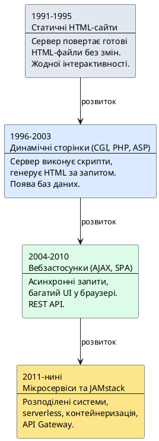
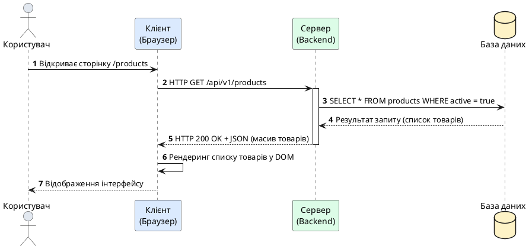
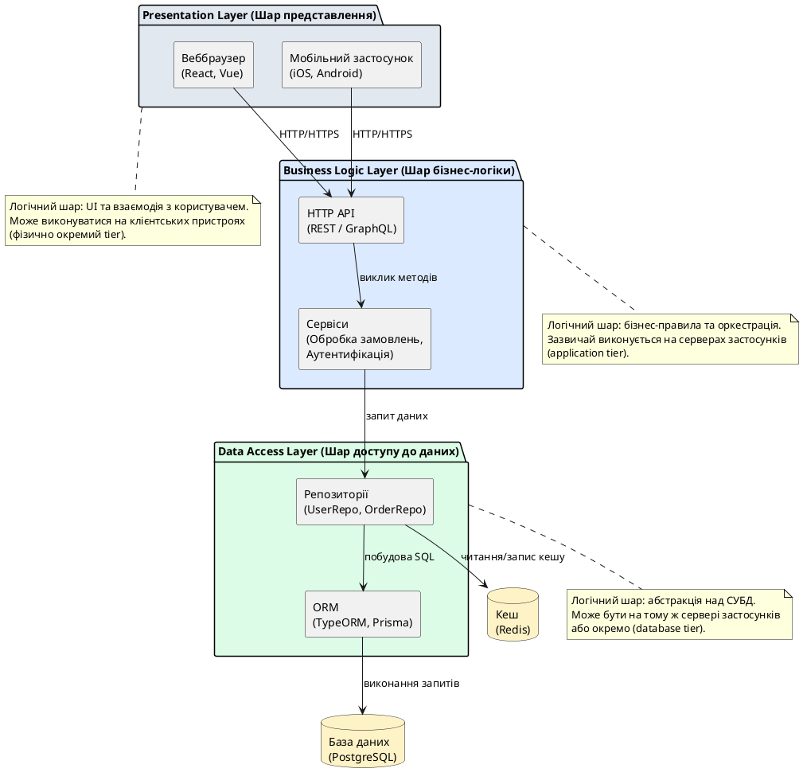
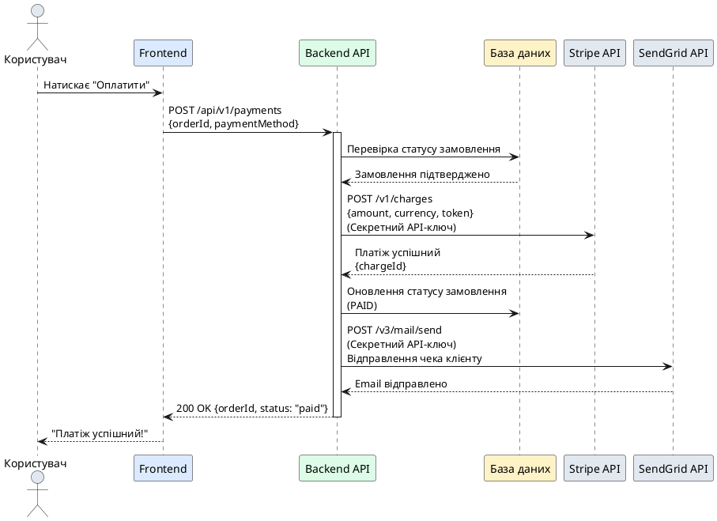

# Еволюція веброзробки та модель клієнт-сервер

::card-group

::card{title="🎯 Мета розділу" icon="i-lucide-target"}

- Простежити еволюцію вебтехнологій від статичних HTML-сторінок до сучасних розподілених систем.
- Зрозуміти фундаментальні принципи архітектури клієнт-сервер (*client-server architecture*).
- Опанувати концепцію багатошарової архітектури (*multi-layer architecture*) вебзастосунків.
- Усвідомити роль серверної частини (*backend*) у загальній екосистемі веброзробки.

::

::card{title="🔑 Ключові терміни" icon="i-lucide-key"}

- **Клієнт-сервер (Client-Server):** архітектурна модель розподіленої системи.
- **Frontend:** клієнтська частина застосунку, що виконується у браузері користувача.
- **Backend:** серверна частина, що обробляє бізнес-логіку та керує даними.
- **Багатошарова архітектура (Multi-Layer Architecture):** розділення застосунку на логічні шари відповідальності.

::

::

---

## Історичний контекст: шлях від документів до застосунків

Всесвітня павутина (*World Wide Web*), створена Тімом Бернерсом-Лі у 1989 році в CERN, спочатку задумувалася як проста система обміну науковими документами між дослідниками. Перші вебсайти складалися виключно зі статичних HTML-файлів (*HyperText Markup Language*), що зберігалися на сервері та передавалися клієнту без жодних змін. Вебсервер виконував примітивну роль файлового сховища: отримавши запит на певний документ, він лише зчитував відповідний файл з диска та відправляв його браузеру у незмінному вигляді.

Така модель ідеально підходила для публікації академічних статей, технічної документації та інформаційних ресурсів, проте вона не передбачала жодної інтерактивності. Користувач міг лише переглядати готові сторінки, переходячи за гіперпосиланнями, але не міг впливати на їхній вміст, здійснювати пошук, відправляти форми або отримувати персоналізовану інформацію. У цій парадигмі вебсервер був пасивним учасником комунікації — він не виконував обчислень та не приймав рішень щодо того, які дані показувати конкретному користувачеві.

{.diagram-img}

::note
У середині 1990-х років кількість вебсайтів обчислювалася сотнями, і більшість з них були суто інформаційними. Концепція «динамічного вмісту», де сервер генерує HTML-код залежно від параметрів запиту або стану бази даних, тільки-но почала формуватися у свідомості розробників.
::

### Поява динамічної генерації вмісту

Революційний зрушення у веброзробці відбувся із запровадженням технологій серверного скриптингу (*server-side scripting*). У 1993 році з'являється CGI (*Common Gateway Interface*) — стандарт, що дозволяв вебсерверу викликати зовнішні програми (написані на Perl, C або інших мовах) для генерації HTML-коду «на льоту». Натомість статичного файлу сервер виконував програму, яка зчитувала параметри з HTTP-запиту, виконувала необхідну логіку (наприклад, пошук у базі даних), формувала результуюче HTML-представлення та повертала його клієнту.

Незабаром з'явилися спеціалізовані мови програмування та платформи для веброзробки: PHP (*Personal Home Page*, згодом *PHP: Hypertext Preprocessor*) у 1995 році, ASP (*Active Server Pages*) від Microsoft у 1996-му, JSP (*JavaServer Pages*) у 1999-му. Ці технології вбудовували код безпосередньо в HTML-шаблони, що спрощувало створення динамічних сторінок, проте призводило до тісного переплетення логіки відображення (*presentation logic*) та бізнес-правил.

{.diagram-img}

::plant-uml{alt="Еволюція архітектури вебзастосунків"}

::

### Ера вебзастосунків: AJAX та Single Page Applications

На початку 2000-х років домінуючою парадигмою залишалася модель, де кожна взаємодія користувача з інтерфейсом (клік на посилання, відправка форми) призводила до повного перезавантаження сторінки. Браузер надсилав новий HTTP-запит, сервер повертав цілісний HTML-документ, і браузер замінював весь вміст вікна. Це створювало неприємний досвід користування: інтерфейс «блимав», втрачалося прокручування, а навіть незначна зміна частини сторінки вимагала повторного завантаження всіх ресурсів.

Прорив відбувся із популяризацією технології AJAX (*Asynchronous JavaScript and XML*) після публікації статті Джессі Джеймса Гаррета у 2005 році. AJAX не був новою технологією — він об'єднував існуючі можливості браузера (об'єкт `XMLHttpRequest`, JavaScript, DOM-маніпуляції) у новий підхід до побудови інтерфейсів. Ключова ідея полягала в тому, що JavaScript-код, що виконується у браузері, може асинхронно надсилати HTTP-запити до сервера у фоновому режимі, отримувати дані (зазвичай у форматі XML, згодом JSON) та динамічно оновлювати лише ті частини сторінки, які цього потребують, без повного перезавантаження.

Ця парадигма дала поштовх розвитку односторінкових застосунків (*Single Page Applications, SPA*), де HTML-каркас завантажується один раз, а весь подальший обмін даними відбувається через AJAX-виклики до серверних API. Браузер перетворився на повноцінну платформу виконання додатків, здатну підтримувати складну бізнес-логіку на клієнтській стороні. З'явилися JavaScript-фреймворки — Angular (2010), Backbone.js (2010), Ember.js (2011), React (2013), Vue.js (2014) — що спрощували побудову таких застосунків та впроваджували архітектурні патерни (MVC, MVVM, компонентний підхід) у фронтенд-розробку.

{.diagram-img}

::warning
Перехід до SPA-архітектури змістив значну частину обчислювальних операцій із сервера на клієнта, що поставило нові вимоги до продуктивності JavaScript-рушіїв браузерів та спричинило появу проблем із SEO (*Search Engine Optimization*) та початковим завантаженням (*time-to-interactive*).
::

### Мікросервісна архітектура та безсерверні обчислення

Наприкінці 2000-х — на початку 2010-х років великі технологічні компанії (Amazon, Netflix, LinkedIn) зіткнулися з обмеженнями монолітної архітектури, де весь серверний код працював як єдиний застосунок у межах одного процесу або кластера ідентичних серверів. Масштабування монолітів вимагало реплікації всього застосунку, навіть якщо навантаження зростало лише на окремі функції (наприклад, пошук або рекомендаційну систему). Розгортання змін у монолітах було ризикованим — помилка в одній підсистемі могла «покласти» весь сервіс.

Відповіддю на ці виклики стала мікросервісна архітектура (*microservices architecture*), де застосунок розбивається на набір невеликих, автономних сервісів, кожен з яких відповідає за чітко окреслену бізнес-можливість (наприклад, «керування користувачами», «обробка платежів», «відправка повідомлень»). Кожен мікросервіс має власну базу даних, розгортається незалежно і спілкується з іншими через легковагові протоколи (HTTP REST, gRPC, черги повідомлень). Така декомпозиція дозволяє різним командам розробників працювати паралельно, вибирати різні технологічні стеки для різних сервісів та масштабувати лише ті компоненти, які цього потребують.

Паралельно розвивалася концепція безсерверних обчислень (*serverless computing*), де розробник пише лише бізнес-логіку у вигляді функцій (*Functions as a Service, FaaS*), а хмарна платформа (AWS Lambda, Google Cloud Functions, Azure Functions) автоматично керує виділенням ресурсів, масштабуванням та високою доступністю. У безсерверній моделі розробник не управляє віртуальними машинами чи контейнерами — платформа запускає функцію у відповідь на подію (HTTP-запит, зміну у базі даних, повідомлення у черзі) та стягує плату лише за фактичний час виконання коду.

{.diagram-img}

::tip
Сучасні вебзастосунки часто поєднують кілька архітектурних підходів: монолітне ядро для стабільних компонентів, мікросервіси для окремих бізнес-функцій та безсерверні функції для задач, що виконуються епізодично (обробка завантажених зображень, генерація звітів).
::

---

## Фундаментальні принципи архітектури клієнт-сервер

Архітектура клієнт-сервер є базовою моделлю побудови розподілених систем, у якій обчислювальні завдання та дані розподіляються між двома типами учасників: **клієнтами** (*clients*), що ініціюють запити, та **серверами** (*servers*), що обробляють ці запити та надають відповіді. Ця модель виникла задовго до появи веб — вона використовувалася у файлових системах (NFS), базах даних (клієнт-серверні СУБД на кшталт Oracle або PostgreSQL), електронній пошті (протоколи SMTP, POP3, IMAP) та багатьох інших прикладних областях.

### Асиметрія ролей: ініціатор та постачальник

Ключовою характеристикою клієнт-серверної моделі є чітка асиметрія ролей. **Клієнт** завжди виступає ініціатором взаємодії: він формує запит, встановлює з'єднання із сервером, передає дані та очікує на відповідь. **Сервер**, натомість, є пасивним у тому сенсі, що він не може ініціювати комунікацію з клієнтом — він лише очікує на вхідні запити, обробляє їх відповідно до внутрішньої логіки та повертає результати.

Сервер, як правило, є довготривалим процесом (*long-running process*), що постійно працює на певному вузлі мережі, прослуховує вказаний мережевий порт та обслуговує множину клієнтів одночасно. Клієнти, навпаки, можуть бути короткочасними: вони запускаються, коли користувач відкриває застосунок або вебсторінку, виконують необхідні дії та завершують роботу.

::note
У контексті веброзробки **клієнтом** зазвичай виступає веббраузер (Chrome, Firefox, Safari), мобільний застосунок або інший програмний агент (наприклад, інший сервер, що виконує API-виклик). **Сервером** є вебсервер (Nginx, Apache) або прикладний сервер (Node.js, Django, Spring Boot), що виконує бізнес-логіку та повертає дані.
::

### Централізація ресурсів та логіки

Одна із головних переваг клієнт-серверної архітектури полягає у централізації даних та бізнес-правил. Замість того, щоб зберігати копії даних на кожному клієнтському пристрої та синхронізувати їх вручну, дані зберігаються на сервері у централізованій базі даних. Це забезпечує консистентність (*consistency*): усі клієнти бачать актуальний стан інформації, а зміни, внесені одним клієнтом, негайно стають доступними іншим (після оновлення запиту).

Бізнес-логіка — правила обробки даних, валідації, авторизації, обчислень — також зосереджена на сервері. Це дозволяє уникнути дублювання коду між різними клієнтськими платформами (веббраузер, мобільний iOS-застосунок, Android-застосунок, десктопна програма) та спрощує оновлення логіки: достатньо модифікувати серверний код, і всі клієнти автоматично отримують нову поведінку без необхідності їхнього оновлення.

{.diagram-img}

::plant-uml{alt="Базова модель клієнт-сервер"}

::

### Масштабованість та ізоляція відмов

Клієнт-серверна модель спрощує горизонтальне масштабування (*horizontal scaling*) серверної частини. Коли кількість користувачів зростає, можна розгорнути кілька ідентичних примірників сервера та розподілити навантаження між ними за допомогою балансувальника навантаження (*load balancer*). Кожен запит клієнта направляється на один із доступних серверів, що дозволяє обслуговувати тисячі або мільйони одночасних користувачів без зміни архітектури застосунку.

Водночас, централізація створює єдину точку відмови (*single point of failure*): якщо сервер недоступний (через технічні несправності, атаки DDoS, перевантаження), усі клієнти втрачають доступ до сервісу. Для забезпечення високої доступності (*high availability*) використовуються методи резервування: розгортання серверів у різних центрах обробки даних, реплікація баз даних, автоматичне перемикання на резервні вузли.

::caution
Надмірна централізація логіки на сервері може призвести до створення «розумного сервера та тупого клієнта» (*thick server, thin client*), де браузер або мобільний застосунок виконує лише функції відображення. Це знижує відгук інтерфейсу та підвищує навантаження на мережу. Сучасні підходи прагнуть розумного балансу: частина валідації, кешування та презентаційної логіки виконується на клієнті, тоді як критичні операції з даними та бізнес-правила залишаються на сервері.
::

---

## Багатошарова архітектура: розділення відповідальності

Реальні вебзастосунки рідко обмежуються простою двокомпонентною структурою «клієнт — сервер». Замість цього вони організовуються як багатошарова (*multi-layer*) архітектура, де кожен шар (*layer*) відповідає за чітко визначену категорію завдань та взаємодіє лише з сусідніми шарами через формалізовані інтерфейси. Найпоширенішою є **тришарова архітектура** (*three-layer architecture*), що складається із шарів представлення, бізнес-логіки та доступу до даних.

::note
Важливо розрізняти **шари (layers)** та **рівні (tiers)**. Шари — це логічна організація коду (presentation layer, business logic layer, data access layer), яка може виконуватися на одному фізичному сервері. Рівні — це фізичне розгортання компонентів на різних машинах (наприклад, three-tier: клієнтська машина, сервер застосунків, сервер бази даних). Один фізичний рівень може містити кілька логічних шарів.
::

### Шар представлення (Presentation Layer)

Шар представлення (*presentation layer*, інколи називається *UI layer* або *client layer*) відповідає за взаємодію з користувачем. Цей шар включає веббраузер із завантаженим HTML, CSS та JavaScript-кодом, мобільний застосунок або десктопну програму. Його завдання полягає у відображенні інформації у зручному для користувача форматі, прийомі введених даних (через форми, кнопки, жести) та передачі цих даних на наступний рівень для обробки.

У контексті веброзробки шар представлення реалізується фронтенд-застосунком, написаним на JavaScript (або TypeScript) із використанням фреймворків на кшталт React, Angular, Vue.js або Svelte. Цей код виконується безпосередньо у браузері користувача та спілкується із сервером через HTTP-запити (зазвичай у форматі JSON через REST API або GraphQL).

Ключові обов'язки шару представлення:

- **Рендеринг інтерфейсу:** побудова DOM-дерева, застосування стилів, анімації, перехідні ефекти.
- **Обробка подій користувача:** реакція на кліки, введення тексту, прокручування, зміну розміру вікна.
- **Валідація на стороні клієнта:** перевірка формату email, довжини пароля, числових діапазонів перед відправкою даних на сервер (для покращення досвіду користувача, але **не** як основний механізм безпеки).
- **Управління станом:** збереження локального стану застосунку (поточний користувач, обраний продукт, вміст кошика) у пам'яті браузера або LocalStorage.
- **Асинхронна комунікація:** виконання AJAX-запитів до API, обробка відповідей, відображення індикаторів завантаження, помилок мережі.

::tip
Шар представлення **не повинен** містити критичну бізнес-логіку або прямі запити до бази даних. Будь-який код, що виконується на клієнті, є доступним користувачеві (його можна прочитати через інструменти розробника браузера), тому він не може бути довіреним джерелом істини щодо прав доступу, валідації чи обчислення вартості замовлення.
::

### Шар бізнес-логіки (Business Logic Layer)

Шар бізнес-логіки (*business logic layer* або *application layer*) містить ядро функціональності застосунку — правила, процедури та алгоритми, що визначають, як саме система обробляє дані та приймає рішення. Цей шар виконується на серверній стороні та ізольований від користувача. Він отримує запити від шару представлення, виконує необхідні обчислення, взаємодіє із шаром даних для читання та запису інформації, та повертає результати назад клієнту.

Приклади бізнес-логіки:

- **Створення нового користувача:** перевірка унікальності email, хешування пароля, збереження у базі даних, відправка підтверджувального листа.
- **Оформлення замовлення:** перевірка наявності товарів на складі, обчислення загальної вартості з урахуванням знижок та податків, резервування товарів, ініціювання платіжної транзакції, оновлення статусу замовлення.
- **Авторизація доступу до ресурсу:** перевірка JWT-токена, витягування ідентифікатора користувача, перевірка ролей та прав доступу, дозвіл або заборона операції.

Цей шар зазвичай реалізується у вигляді набору сервісів (*services*), класів або функцій, організованих відповідно до певного архітектурного патерну (наприклад, Domain-Driven Design, Clean Architecture, Hexagonal Architecture). У фреймворках на кшталт NestJS бізнес-логіка зосереджена у провайдерах (*providers*) та сервісних класах, що впроваджуються у контролери через механізм ін'єкції залежностей (*dependency injection*).

::note
Терміни «бізнес-логіка» та «прикладна логіка» (*application logic*) часто використовуються як синоніми, проте у строгому розумінні бізнес-логіка — це підмножина прикладної логіки, що безпосередньо реалізує бізнес-правила предметної області (наприклад, «знижка 15% для клієнтів категорії VIP»), тоді як прикладна логіка включає також технічні аспекти (логування, кешування, повторні спроби при помилках мережі).
::

### Шар доступу до даних (Data Access Layer)

Шар доступу до даних (*data access layer, DAL*) відповідає за взаємодію із системами зберігання інформації — реляційними базами даних (PostgreSQL, MySQL), NoSQL-сховищами (MongoDB, Redis), файловими системами, зовнішніми API. Його основне завдання — абстрагувати деталі роботи з конкретною технологією зберігання від шару бізнес-логіки, надаючи останньому простий інтерфейс для операцій читання, запису, оновлення та видалення даних.

Цей шар реалізується через патерн **Repository** (*сховище*), де для кожної сутності предметної області (користувач, продукт, замовлення) створюється клас-репозиторій, що інкапсулює SQL-запити або виклики ORM (*Object-Relational Mapping*). Наприклад, `UserRepository` може містити методи `findById(id: string)`, `findByEmail(email: string)`, `create(user: User)`, `update(user: User)`, `delete(id: string)`. Бізнес-логіка викликає ці методи, не знаючи, як саме дані зберігаються фізично — у таблиці PostgreSQL, документі MongoDB чи навіть у пам'яті.

Переваги шару доступу до даних:

- **Ізоляція змін:** якщо потрібно змінити СУБД (наприклад, мігрувати з MySQL на PostgreSQL) або додати кешування запитів через Redis, достатньо модифікувати лише репозиторії, не торкаючись бізнес-логіки.
- **Тестованість:** бізнес-логіку можна тестувати ізольовано, підставляючи замість справжніх репозиторіїв їхні макети (*mocks*), що повертають заздалегідь визначені дані без звернення до реальної бази.
- **Контроль транзакцій:** шар DAL керує початком, фіксацією та відкатом транзакцій, забезпечуючи консистентність даних при складних операціях, що охоплюють кілька таблиць.
- **Оптимізація запитів:** репозиторії можуть використовувати складні запити із з'єднаннями (*joins*), індексами, пагінацією, не розкриваючи ці деталі вищим шарам.

{.diagram-img}

::plant-uml{alt="Тришарова архітектура вебзастосунку"}

::

---

## Розмежування понять Backend та Frontend

У сучасній веброзробці терміни **backend** та **frontend** позначають дві різні сфери відповідальності та компетенцій, кожна з яких має власні технології, інструменти та патерни проєктування.

{.diagram-img}

### Frontend: клієнтська частина застосунку

**Frontend** (*фронтенд*, дослівно «передня частина») охоплює все, що виконується на стороні користувача — у браузері, мобільному застосунку або десктопній програмі. Це шар представлення із попереднього розділу, але у ширшому розумінні frontend включає також екосистему інструментів для розробки інтерфейсів: системи збирання (Webpack, Vite, Rollup), транспілятори (Babel, TypeScript), CSS-препроцесори (Sass, Less), фреймворки компонентного UI (React, Vue, Svelte), бібліотеки управління станом (Redux, Zustand, Pinia).

Основні обов'язки frontend-розробника:

- **Побудова інтерфейсу користувача:** створення сторінок, форм, навігаційних меню, модальних вікон, адаптивного дизайну для різних розмірів екранів (responsive design).
- **Забезпечення доступності (Accessibility, a11y):** підтримка клавіатурної навігації, зчитувачів екрану (*screen readers*), семантичної розмітки HTML, контрастності кольорів.
- **Оптимізація продуктивності:** зменшення розміру JavaScript-пакетів (*code splitting*), ледаче завантаження (*lazy loading*), кешування ресурсів, мінімізація часу до інтерактивності (*time-to-interactive*).
- **Інтеграція з API:** виконання HTTP-запитів до backend-сервісів, обробка станів завантаження, успіху та помилок, відображення індикаторів прогресу.

::warning
Частою помилкою є переконання, що frontend — це «лише HTML і CSS». Насправді сучасні frontend-застосунки є повноцінними програмними системами із складною архітектурою, керуванням станом, маршрутизацією, аутентифікацією на клієнті (збереження токенів, автоматичне оновлення), інтернаціоналізацією (i18n) та багатьма іншими аспектами, що вимагають ґрунтовних знань програмування.
::

### Backend: серверна частина застосунку

**Backend** (*бекенд*, «задня частина») є серверною частиною системи, що виконує бізнес-логіку, управляє даними, забезпечує безпеку та інтегрується із зовнішніми сервісами. Backend реалізується на серверних мовах програмування (JavaScript/TypeScript на платформі Node.js, Python, Java, Go, C#, Ruby, PHP) та розгортається на віддалених серверах або у хмарних середовищах (AWS, Google Cloud, Azure, DigitalOcean).

Основні обов'язки backend-розробника:

- **Проєктування та реалізація API:** створення REST, GraphQL або gRPC-інтерфейсів, визначення ендпоінтів, методів HTTP, форматів запитів та відповідей.
- **Робота з базами даних:** моделювання схеми даних, написання складних запитів, оптимізація індексів, керування транзакціями, міграції схеми.
- **Автентифікація та авторизація:** реалізація реєстрації, входу, відновлення пароля, видачі токенів (JWT, OAuth 2.0), перевірка ролей та дозволів.
- **Безпека:** захист від SQL-ін'єкцій, XSS, CSRF, валідація вхідних даних, шифрування чутливої інформації, налаштування HTTPS, CORS, заголовків безпеки.
- **Масштабованість та продуктивність:** проєктування архітектури, що витримує високі навантаження (кешування, балансування навантаження, асинхронна обробка через черги, горизонтальне масштабування).
- **Інтеграції:** взаємодія з платіжними системами (Stripe, PayPal), поштовими сервісами (SendGrid, AWS SES), сторонніми API (соціальні мережі, геолокація, аналітика).
- **Фонові завдання:** планування періодичних задач (генерація звітів, очищення застарілих даних), обробка черг повідомлень (RabbitMQ, Kafka), відправка email та push-нотифікацій.

::note
Розподіл на frontend та backend не означає, що це обов'язково різні команди або навіть різні особи. Full-stack розробники (*full-stack developers*) володіють компетенціями в обох сферах та можуть самостійно створювати повноцінні вебзастосунки від інтерфейсу до бази даних. Проте у великих проєктах спеціалізація є вигіднішою через глибину знань, що вимагається у кожній області.
::

### Взаємодія Frontend та Backend: API як контракт

Frontend та backend взаємодіють через чітко визначений програмний інтерфейс (*Application Programming Interface, API*), що виступає формальним контрактом між обома сторонами. Найпоширенішим стилем API у веброзробці є **REST** (*Representational State Transfer*) — архітектурний підхід, що використовує стандартні HTTP-методи (GET, POST, PUT, PATCH, DELETE) для операцій над ресурсами, представленими у форматі JSON.

Приклад REST API для керування користувачами:

- `GET /api/v1/users` — отримання списку всіх користувачів (з пагінацією).
- `GET /api/v1/users/:id` — отримання даних конкретного користувача за ідентифікатором.
- `POST /api/v1/users` — створення нового користувача (тіло запиту містить JSON із даними).
- `PUT /api/v1/users/:id` — повне оновлення користувача (заміна всіх полів).
- `PATCH /api/v1/users/:id` — часткове оновлення користувача (зміна окремих полів).
- `DELETE /api/v1/users/:id` — видалення користувача.

Frontend-застосунок викликає ці ендпоінти через JavaScript-функції (наприклад, `fetch()` або бібліотеку `axios`), надсилаючи токен автентифікації у заголовку `Authorization`, та обробляє відповіді, оновлюючи інтерфейс відповідно до результату.

{.diagram-img}

::tip
Документування API є критично важливим для координації роботи frontend- та backend-команд. Інструменти на кшталт **Swagger (OpenAPI)** дозволяють автоматично генерувати інтерактивну документацію з коментарів у коді та забезпечують «єдине джерело істини» щодо структури запитів та відповідей.
::

---

## Роль серверної частини у сучасних вебзастосунках

Незважаючи на зростання можливостей клієнтських технологій та появу концепцій на кшталт JAMstack (*JavaScript, APIs, Markup*), де значна частина логіки переноситься у браузер та статичні генератори сайтів, backend залишається незамінним компонентом будь-якої серйозної системи. Розглянемо ключові сфери відповідальності серверної частини, які неможливо делегувати клієнту з міркувань безпеки, продуктивності чи функціональності.

### Єдине джерело істини для даних

Backend є авторитетним джерелом даних (*single source of truth*). Усі критичні інформаційні активи — користувацькі акаунти, фінансові транзакції, історія замовлень, конфіденційні документи — зберігаються на сервері у контрольованому середовищі. Клієнт може мати локальні копії для відображення, проте рішення про дійсність цих даних (чи є баланс достатнім для операції, чи має користувач право переглядати документ) завжди приймається на сервері.

Якщо довіряти клієнту приймати рішення про дозволи або обчислювати вартість, зловмисник може змінити JavaScript-код у браузері (через інструменти розробника або проксі-перехоплювач на кшталт Burp Suite), підробити результати та здійснити несанкціоновані дії (купити товар за нульову ціну, отримати доступ до чужих даних).

### Виконання ресурсомістких обчислень

Деякі завдання вимагають значних обчислювальних потужностей, доступу до спеціалізованого апаратного прискорення (GPU для машинного навчання) або великих обсягів пам'яті. Приклади таких завдань:

- **Генерація звітів:** агрегація мільйонів записів транзакцій за місяць, побудова складних графіків, експорт у форматі PDF або Excel.
- **Обробка зображень та відео:** перекодування відео у різні роздільності та формати, розпізнавання облич, автоматичне обрізання та стиснення зображень.
- **Машинне навчання:** виконання інференсу нейронних мереж для рекомендаційних систем, класифікації контенту, генерації тексту або зображень.
- **Складні бізнес-розрахунки:** маршрутизація логістичних маршрутів, оптимізація розкладу, симуляції фінансових моделей.

Виконання цих операцій на клієнті було б повільним (обмежена потужність пристроїв користувачів, особливо мобільних), дорогим (спалювання батареї) та небезпечним (витік бізнес-алгоритмів через доступ до коду).

### Інтеграція із зовнішніми сервісами

Backend виступає посередником між фронтенд-застосунком та зовнішніми API третіх сторін. Наприклад, при обробці платежу backend взаємодіє з платіжним шлюзом (Stripe, PayPal), надсилаючи секретні API-ключі, які ніколи не повинні потрапити на клієнта. Аналогічно, для відправки email backend інтегрується з поштовим сервісом (SendGrid, AWS SES), передаючи автентифікаційні токени, що зберігаються у безпечних змінних оточення сервера.

Таке проксіювання запитів дозволяє:

- **Захистити облікові дані:** API-ключі, паролі, сертифікати зберігаються на сервері, а не у коді, доступному користувачеві.
- **Абстрагувати складність:** frontend викликає простий ендпоінт `POST /api/v1/payments`, а backend керує всією складною логікою взаємодії із платіжною системою (retry-логіка, обробка webhook, відкат транзакції при помилці).
- **Контролювати витрати:** деякі зовнішні сервіси стягують плату за кожен запит. Backend може кешувати результати, агрегувати запити або впроваджувати rate limiting, щоб запобігти зловживанням.

::plant-uml{alt="Backend як посередник між Frontend та зовнішніми сервісами"}

::

### Забезпечення безпеки та комплаєнсу

Backend є останнім рубежем захисту у системі. Усі вхідні дані, що надходять від клієнта, мають розглядатися як недовірені (*untrusted input*) та проходити суворе валідування, санітизацію та перевірку авторизації на сервері. Навіть якщо frontend виконує валідацію форм (перевірка формату email, мінімальної довжини пароля), backend повинен дублювати цю валідацію, оскільки зловмисник може надіслати HTTP-запит безпосередньо, обійшовши інтерфейс.

Крім того, backend відповідає за дотримання нормативних вимог (*compliance*), таких як GDPR (захист персональних даних у Європейському Союзі), HIPAA (конфіденційність медичних записів у США), PCI DSS (безпека обробки платіжних карт). Це включає шифрування даних у спокої (*data at rest*) та при передачі (*data in transit*), аудит доступу, право на забуття (*right to be forgotten*), анонімізацію логів.

::caution
Ніколи не покладайтеся на клієнтську валідацію як на єдиний механізм безпеки. Клієнтська валідація — це лише покращення користувацького досвіду (*UX enhancement*), що дозволяє негайно вказати на помилку без очікування відповіді від сервера. Справжня валідація та авторизація мають відбуватися виключно на сервері.
::

---

## Підсумок

Розуміння еволюції веброзробки — від статичних HTML-сторінок до складних мікросервісних екосистем — є критично важливим для усвідомлення архітектурних рішень, що стоять за сучасними застосунками. Модель клієнт-сервер залишається фундаментальним принципом побудови розподілених систем, а багатошарова архітектура забезпечує розділення відповідальності, що спрощує розробку, тестування та супровід кодової бази.

Серверна частина (backend) відіграє центральну роль у забезпеченні безпеки, цілісності даних, продуктивності та інтеграції вебзастосунків. Розуміння цієї ролі є першим кроком до опанування мистецтва backend-розробки, що далі включатиме вивчення мережевих протоколів, серверних фреймворків, баз даних, автентифікації та багатьох інших аспектів, які ми розглянемо у наступних лекціях курсу.

::accordion

::accordion-item{label="❓ Чому статичні сайти знову стають популярними у вигляді JAMstack, якщо динамічні застосунки вирішували проблему інтерактивності?" icon="i-lucide-help-circle"}

JAMstack (*JavaScript, APIs, Markup*) повертає статичну генерацію сайтів, але на новому рівні. Замість серверного рендерингу при кожному запиті, сайт попередньо генерується на етапі збирання (*build time*) та розгортається у CDN для миттєвого завантаження. Інтерактивність забезпечується через JavaScript та виклики API. Це поєднує швидкість статичних сайтів із можливостями динамічних застосунків, знижуючи навантаження на backend та покращуючи SEO.

::

::accordion-item{label="❓ Як зрозуміти, які завдання виконувати на клієнті, а які делегувати серверу?" icon="i-lucide-help-circle"}

Загальне правило: усе, що стосується відображення, анімацій, локального стану інтерфейсу — виконується на клієнті. Усе, що стосується безпеки (автентифікація, авторизація), персистентних даних, важких обчислень, інтеграцій із платіжними системами — на сервері. Валідація даних має дублюватися на обох сторонах: на клієнті для зручності користувача, на сервері для безпеки. При сумнівах питайте себе: «Чи може зловмисник підробити ці дані або обійти цю перевірку?» Якщо так — логіку треба виконувати на сервері.

::

::accordion-item{label="❓ Чому мікросервіси не є універсальним рішенням для всіх проєктів?" icon="i-lucide-help-circle"}

Мікросервісна архітектура вирішує проблеми масштабованості та організаційної складності великих систем, проте вона вносить додаткові виклики: складність розгортання та оркестрування (Kubernetes, Docker), розподілені транзакції, моніторинг та трасування запитів між десятками сервісів, мережева латентність, консистентність даних. Для невеликих команд та стартапів монолітна архітектура часто є розумнішим вибором, що дозволяє швидше розробляти функціональність та не потребує складної інфраструктури. Мікросервіси варто впроваджувати тоді, коли монолітна база коду стає неконтрольованою або коли різні частини системи мають істотно різні вимоги до масштабування.

::

::

---

## Контрольні питання для самоперевірки

1. Опишіть основні етапи еволюції веброзробки від статичних сторінок до мікросервісів. Які технологічні зрушення спричинили кожен перехід?
2. Поясніть різницю між клієнтом і сервером в архітектурі клієнт-сервер. Хто ініціює комунікацію та чому ця асиметрія є принциповою?
3. Охарактеризуйте три шари багатошарової архітектури (презентація, бізнес-логіка, доступ до даних). Наведіть конкретні приклади відповідальності кожного шару.
4. Чому валідація вхідних даних повинна виконуватися і на клієнті, і на сервері? Яка роль кожної валідації?
5. Поясніть, чому критичні обчислення вартості замовлення або перевірки прав доступу не можна довірити клієнтській частині застосунку.
6. Наведіть приклад ситуації, коли backend виступає посередником між frontend та зовнішнім API. Які переваги надає таке проксіювання?
7. У чому полягає різниця між монолітною та мікросервісною архітектурою? За яких умов доцільно переходити до мікросервісів?

---

## Додаткові матеріали для поглибленого вивчення

::card-group

::card{title="📖 Рекомендована література" icon="i-lucide-book-open"}

- Martin Fowler. *Patterns of Enterprise Application Architecture.* — Addison-Wesley, 2002. (Глави про багатошарову архітектуру та Domain Logic Patterns).
- Sam Newman. *Building Microservices: Designing Fine-Grained Systems.* — 2nd ed. — O'Reilly Media, 2021.
- Mark Richards, Neal Ford. *Fundamentals of Software Architecture: An Engineering Approach.* — O'Reilly Media, 2020.

::

::card{title="🌐 Корисні вебресурси" icon="i-lucide-globe"}

- [MDN Web Docs — Client-Server Overview](https://developer.mozilla.org/en-US/docs/Learn/Server-side/First_steps/Client-Server_overview)
- [Martin Fowler's Blog — Microservices](https://martinfowler.com/articles/microservices.html)
- [The Twelve-Factor App Methodology](https://12factor.net/) — принципи побудови SaaS-застосунків.

::

::
