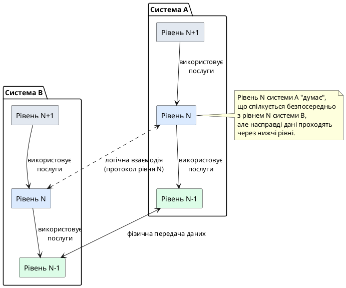
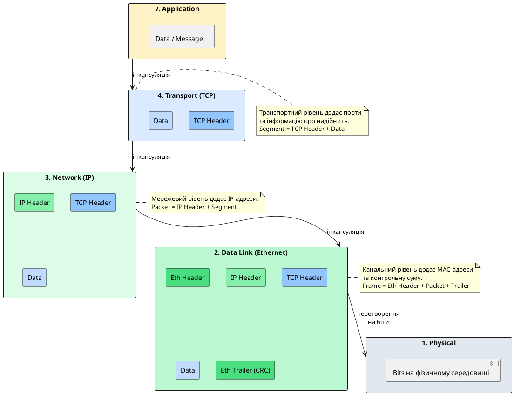

# Еталонна модель OSI

::card-group

::card{title="🎯 Мета розділу" icon="i-lucide-target"}

- Зрозуміти, що таке мережевий протокол та чому він є фундаментальним поняттям комп'ютерних мереж.
- Опанувати семирівневу модель OSI як концептуальну основу мережевої взаємодії.
- Усвідомити призначення та відповідальність кожного рівня моделі OSI.
- Вивчити процес інкапсуляції даних та поняття PDU (Protocol Data Unit).
- Навчитися мислити категоріями рівнів при аналізі мережевих проблем.

::

::card{title="🔑 Ключові терміни" icon="i-lucide-key"}

- **Протокол (Protocol):** формалізований набір правил взаємодії між учасниками комунікації.
- **Модель OSI (Open Systems Interconnection):** еталонна семирівнева модель мережевої взаємодії.
- **Інкапсуляція (Encapsulation):** процес додавання службової інформації на кожному рівні стеку.
- **PDU (Protocol Data Unit):** одиниця даних, що передається на певному рівні протокольного стеку.

::

::

---

## Що таке мережевий протокол

Перш ніж занурюватися у вивчення моделі OSI та різноманіття протоколів комп'ютерних мереж (HTTP, TCP, IP, Ethernet), необхідно сформулювати фундаментальне питання: **що саме означає термін "протокол" у контексті мережевої взаємодії?** Це поняття є настільки центральним для розуміння принципів роботи будь-якої мережевої системи, що без його чіткого осмислення подальше вивчення технічних деталей перетворюється на механічне запам'ятовування назв та акронімів.

### Протокол як система домовленостей

У найширшому розумінні **протокол** (_protocol_) — це формалізований набір правил, процедур та угод, що регулюють взаємодію між двома або більше учасниками комунікації. Ця концепція не є специфічною для комп'ютерних наук: протоколи існують у дипломатії (дипломатичний протокол визначає порядок переговорів, форму звернення, послідовність виступів), у соціальних взаємодіях (етикет — це неформальний протокол поведінки), у науці (експериментальний протокол описує кроки проведення досліду).

У комп'ютерних мережах протокол визначає:

- **Синтаксис повідомлень:** структуру та формат даних, що передаються (які поля має містити повідомлення, у якому порядку, яка довжина кожного поля, як позначаються межі між повідомленнями).
- **Семантику повідомлень:** значення кожного поля та інтерпретацію різних комбінацій значень (що означає конкретний код відповіді, як розуміти флаги у заголовку).
- **Процедури взаємодії:** послідовність дій, що мають виконати учасники для досягнення певної мети (як ініціювати з'єднання, як передавати дані, як коректно завершити сеанс, як обробляти помилки).
- **Правила синхронізації:** коли та в якому порядку учасники мають надсилати та очікувати повідомлення (хто говорить першим, коли можна передавати наступне повідомлення, скільки чекати на відповідь).

::note
Аналогія з людською розмовою допомагає зрозуміти роль протоколу. Коли дві людини спілкуються телефоном, вони несвідомо дотримуються протоколу: перший абонент вітається, другий відповідає, потім відбувається обмін репліками, один з учасників ініціює завершення розмови («На цьому все, до побачення»), інший підтверджує («Так, до зустрічі»), і обидва кладуть трубку. Якщо хтось порушить цей протокол (наприклад, відразу почне говорити без привітання або раптово перерве з'єднання), комунікація стане неефективною або взагалі неможливою.
::

### Чому мережі потребують протоколів

Комп'ютерні мережі — це середовище, де взаємодіють пристрої, розроблені різними виробниками, що працюють під керуванням різних операційних систем, знаходяться на різних континентах та з'єднані різнорідними фізичними каналами (мідні кабелі, оптоволокно, радіохвилі, супутникові канали). Без загальноприйнятих правил взаємодії така різнорідність призвела б до хаосу: кожен виробник визначав би власний формат даних, власну процедуру встановлення з'єднання, власне тлумачення помилок. У такому світі пристрої різних виробників просто не змогли б спілкуватися між собою.

Протоколи вирішують цю проблему через **стандартизацію**. Міжнародні організації (ISO, IETF, IEEE, ITU-T) розробляють та публікують специфікації протоколів у вигляді документів-стандартів (RFC для інтернет-протоколів, стандарти IEEE для локальних мереж). Ці документи детально описують кожен аспект протоколу, що дозволяє незалежним розробникам створювати сумісні реалізації.

Розглянемо конкретний приклад: протокол HTTP (_HyperText Transfer Protocol_). Цей протокол визначає, як веббраузер (клієнт) має формувати запит до вебсервера та як сервер має структурувати відповідь. Специфікація HTTP описує:

- Формат стартового рядка запиту: `МЕТОД /шлях HTTP/версія` (наприклад, `GET /index.html HTTP/1.1`).
- Структуру заголовків: `Назва-Заголовка: значення` (наприклад, `Host: example.com`, `User-Agent: Mozilla/5.0`).
- Порожній рядок, що розділяє заголовки та тіло повідомлення.
- Опціональне тіло запиту (для методів POST, PUT), що містить дані.
- Формат відповіді сервера: статусний рядок `HTTP/версія КОД Опис` (наприклад, `HTTP/1.1 200 OK`), заголовки відповіді, порожній рядок, тіло відповіді (HTML-документ, JSON, зображення).

Завдяки цій детальній специфікації розробник може написати HTTP-клієнта на будь-якій мові програмування (Python, JavaScript, Go, C#), і цей клієнт зможе успішно взаємодіяти з будь-яким HTTP-сервером (Nginx, Apache, IIS), що коректно реалізує стандарт, незалежно від того, на якій платформі працює сервер.

::warning
Поширена помилка початківців полягає у змішуванні понять «протокол» та «API». **API** (_Application Programming Interface_) — це програмний інтерфейс, що надає бібліотека або фреймворк для спрощення роботи з протоколом (наприклад, клас `HttpClient` у .NET або модуль `requests` у Python). **Протокол** — це сама специфікація взаємодії на мережевому рівні (формат HTTP-запитів та відповідей). API реалізує протокол, приховуючи від розробника низькорівневі деталі побудови байтових послідовностей, але сам по собі не є протоколом.
::

### Ієрархія та стекування протоколів

Мережева комунікація занадто складна, щоб описувати її одним монолітним протоколом. Натомість використовується **ієрархічний підхід**, де протоколи організовані у вигляді стеку (_protocol stack_): протоколи нижчих рівнів надають сервіси протоколам вищих рівнів. Наприклад:

- Протокол HTTP працює поверх протоколу TCP, використовуючи його послуги для надійної доставки байтового потоку.
- Протокол TCP, у свою чергу, спирається на протокол IP для маршрутизації пакетів через мережу.
- Протокол IP використовує послуги протоколів канального рівня (Ethernet, Wi-Fi) для передачі даних у межах локального сегмента мережі.
- Протоколи канального рівня залежать від фізичного рівня (електричні сигнали в мідному кабелі, світлові імпульси в оптоволокні, радіохвилі у Wi-Fi).

Така ієрархічна організація дозволяє **абстрагувати складність**: HTTP не потребує знань про те, як IP маршрутизує пакети через десятки маршрутизаторів, а TCP не цікавить, чи передаються дані через кабель Ethernet або супутниковий канал. Кожен протокол виконує чітко визначену роль та покладається на протоколи нижчого рівня для виконання їхніх функцій.

---

## Виникнення моделі OSI: історичний контекст

У 1970-х роках комп'ютерні мережі ще перебували на ранній стадії розвитку. Різні виробники (IBM, DEC, Xerox, Honeywell) створювали власні мережеві архітектури зі своїми унікальними протоколами: IBM мала SNA (_Systems Network Architecture_), DEC розробляла DECnet, Xerox працювала над Ethernet та XNS. Ці системи були несумісними між собою — комп'ютер однієї мережі не міг безпосередньо спілкуватися з пристроєм іншої мережі без спеціалізованих шлюзів та конвертерів протоколів.

Міжнародна організація зі стандартизації (ISO, _International Organization for Standardization_) усвідомила необхідність створення універсальної моделі, що визначила б загальні принципи побудови мережевих систем та забезпечила б **відкриту взаємодію** (_open systems interconnection_) між пристроями різних виробників. У 1984 році ISO опублікувала стандарт ISO/IEC 7498, що описував **модель OSI** (_OSI model, Open Systems Interconnection Reference Model_) — еталонну семирівневу архітектуру мережевої взаємодії.

::note
Модель OSI не є конкретною технологією або реалізацією — це **концептуальна рамка**, абстрактна модель, що описує, які функції мають виконуватися у мережі та як ці функції можна логічно згрупувати у рівні. Реальні протокольні стеки (TCP/IP, що став основою Інтернету) не завжди точно відповідають семи рівням OSI, проте модель залишається неоціненним інструментом для навчання, аналізу та проєктування мережевих систем.
::

### Мета та принципи моделі OSI

Головна мета моделі OSI полягала у створенні єдиної термінології та структури для опису мережевої взаємодії, що дозволила б:

- **Розділити складність:** Замість того, щоб думати про мережу як про монолітну систему, розбити її на логічні рівні, кожен з яких вирішує специфічний набір задач.
- **Забезпечити модульність:** Зміна технології на одному рівні (наприклад, заміна Ethernet на Wi-Fi) не повинна вимагати переписування протоколів вищих рівнів (TCP, HTTP залишаються незмінними).
- **Стандартизувати інтерфейси:** Визначити чіткі межі між рівнями, описавши, які послуги надає кожен рівень рівню вище і які послуги він споживає від рівня нижче.
- **Сприяти інтероперабельності:** Дозволити пристроям різних виробників взаємодіяти, якщо вони реалізують однакові протоколи на відповідних рівнях.
- **Полегшити навчання та аналіз:** Надати студентам, інженерам та розробникам спільну мову для обговорення мережевих проблем та рішень.

Модель OSI побудована на принципі **шарування** (_layering_): кожен рівень виконує специфічний набір функцій та взаємодіє лише з безпосередньо сусідніми рівнями. Рівень _N_ надає послуги (_services_) рівню _N+1_ через чітко визначений інтерфейс (_interface_), приховуючи деталі своєї внутрішньої реалізації. При цьому рівень _N_ використовує послуги рівня _N-1_ для виконання своїх функцій.

::plant-uml{alt="Принцип шарування у моделі OSI"}



::

---

## Семирівнева архітектура моделі OSI

Модель OSI складається з семи рівнів, пронумерованих від 1 (найнижчий, фізичний) до 7 (найвищий, прикладний). Кожен рівень має власну назву, призначення та типові протоколи або технології.

{.diagram-img}

::plant-uml{alt="Семирівнева модель OSI"}

```plantuml
@startuml
skinparam style plain
skinparam backgroundColor #FFFFFF

rectangle "7. Application Layer\n(Прикладний рівень)" as L7 #FEF3C7 {
    note bottom
    HTTP, SMTP, FTP, DNS,
    WebSocket, SSH
    end note
}

rectangle "6. Presentation Layer\n(Рівень представлення)" as L6 #FDE68A {
    note bottom
    TLS/SSL, кодування (UTF-8),
    стиснення, шифрування
    end note
}

rectangle "5. Session Layer\n(Сеансовий рівень)" as L5 #FCD34D {
    note bottom
    Встановлення, підтримка
    та завершення сеансів
    end note
}

rectangle "4. Transport Layer\n(Транспортний рівень)" as L4 #DBEAFE {
    note bottom
    TCP, UDP, порти,
    надійність доставки
    end note
}

rectangle "3. Network Layer\n(Мережевий рівень)" as L3 #BFDBFE {
    note bottom
    IP, ICMP, маршрутизація,
    IP-адресація
    end note
}

rectangle "2. Data Link Layer\n(Канальний рівень)" as L2 #DCFCE7 {
    note bottom
    Ethernet, Wi-Fi,
    MAC-адреси, кадри
    end note
}

rectangle "1. Physical Layer\n(Фізичний рівень)" as L1 #BBF7D0 {
    note bottom
    Електричні сигнали,
    оптичні імпульси, радіохвилі
    end note
}

L7 -down-> L6
L6 -down-> L5
L5 -down-> L4
L4 -down-> L3
L3 -down-> L2
L2 -down-> L1
@enduml
```

::

### Рівень 1: Фізичний рівень (Physical Layer)

**Призначення:** Фізичний рівень відповідає за передачу бітів (_bits_) через фізичне середовище передачі даних. Це найнижчий рівень моделі OSI, що безпосередньо взаємодіє з апаратним забезпеченням.

Функції фізичного рівня включають:

- Перетворення бітової послідовності на електричні, оптичні або радіосигнали та навпаки.
- Визначення фізичних характеристик середовища передачі: типу кабелю (мідний, оптоволокно), роз'ємів, частоти радіохвиль, рівнів напруги, потужності сигналу.
- Встановлення швидкості передачі даних (_bit rate_), дуплексності (симплекс, напівдуплекс, повний дуплекс).
- Синхронізацію бітів між відправником та отримувачем, щоб приймач міг правильно розпізнати межі між бітами.

**Приклади технологій:** Електричні імпульси у витій парі (Ethernet через UTP-кабель), світлові імпульси у оптоволокні (1000BASE-LX), радіохвилі у Wi-Fi (802.11a/b/g/n/ac/ax), Bluetooth, інфрачервоний зв'язок.

{.diagram-img}

{.diagram-img}

::tip
Фізичний рівень не «розуміє» структури даних: для нього існують лише нулі та одиниці, представлені певними фізичними станами середовища (наприклад, +2.5 В означає «1», а -2.5 В означає «0» у одній із схем кодування Ethernet). Він не знає, що у цих бітах закодовано HTTP-запит або відеопотік — це відповідальність вищих рівнів.
::

### Рівень 2: Канальний рівень (Data Link Layer)

**Призначення:** Канальний рівень забезпечує **надійну передачу кадрів** (_frames_) між двома безпосередньо з'єднаними вузлами в межах одного локального сегмента мережі. Він організовує біти фізичного рівня у структуровані блоки даних, додає адресацію та виявляє помилки передачі.

Функції канального рівня:

- **Фреймування:** Групування бітів у кадри з чітко визначеними початком та кінцем (наприклад, через спеціальні байти-роздільники або довжину кадру у заголовку).
- **Фізична адресація:** Використання MAC-адрес (_Media Access Control addresses_) для ідентифікації відправника та призначення у локальній мережі (наприклад, `00:1A:2B:3C:4D:5E`).
- **Контроль доступу до середовища:** Визначення, коли та як вузли можуть передавати дані у спільному каналі (CSMA/CD у Ethernet, CSMA/CA у Wi-Fi).
- **Виявлення помилок:** Додавання контрольної суми (CRC, _Cyclic Redundancy Check_) для перевірки цілісності кадру при прийомі.
- **Управління потоком:** Запобігання переповненню буферів приймача шляхом узгодження швидкості передачі.

**Приклади протоколів та технологій:** Ethernet (IEEE 802.3), Wi-Fi (IEEE 802.11), PPP (_Point-to-Point Protocol_), HDLC (_High-Level Data Link Control_).

{.diagram-img}

Канальний рівень часто поділяють на два підрівні:

- **LLC (_Logical Link Control_, IEEE 802.2):** Забезпечує інтерфейс до мережевого рівня, мультиплексує різні протоколи вищого рівня.
- **MAC (_Media Access Control_):** Керує доступом до фізичного середовища та адресацією на рівні апаратних адрес.

::note
MAC-адреса — це унікальний 48-бітовий ідентифікатор, «вшитий» у мережеву карту виробником. Перші 24 біти ідентифікують виробника (OUI, _Organizationally Unique Identifier_), наступні 24 біти — конкретний пристрій. MAC-адреси працюють лише в межах локального сегмента мережі: маршрутизатори не пересилають кадри з MAC-адресами між різними мережами.
::

### Рівень 3: Мережевий рівень (Network Layer)

**Призначення:** Мережевий рівень відповідає за **маршрутизацію пакетів** (_packets_) через множину взаємопов'язаних мереж від вузла-джерела до вузла-призначення. Це рівень, на якому працює протокол IP (_Internet Protocol_) — основа Інтернету.

Функції мережевого рівня:

- **Логічна адресація:** Призначення та використання IP-адрес (IPv4, IPv6) для унікальної ідентифікації пристроїв у глобальній мережі.
- **Маршрутизація:** Визначення оптимального шляху проходження пакета через мережу на основі таблиць маршрутизації та алгоритмів вибору шляху (RIP, OSPF, BGP).
- **Фрагментація та реасемблювання:** Розбиття великих пакетів на менші фрагменти, якщо наступний канал має меншу MTU (_Maximum Transmission Unit_), та збирання їх назад у вузлі призначення.
- **Пересилання пакетів:** Маршрутизатори приймають пакети на одному інтерфейсі, аналізують IP-адресу призначення та пересилають пакет через відповідний вихідний інтерфейс.

**Приклади протоколів:** IP (IPv4, IPv6), ICMP (_Internet Control Message Protocol_, використовується утилітою `ping`), ARP (_Address Resolution Protocol_, відображення IP-адрес на MAC-адреси), IGMP (_Internet Group Management Protocol_, для мультикастингу).

{.diagram-img}

::warning
Важливо розрізняти IP-адресу та MAC-адресу. **IP-адреса** — це логічна адреса, що призначається адміністратором мережі або DHCP-сервером і може змінюватися залежно від підмережі. **MAC-адреса** — це фізична адреса, що «вшита» у апаратне забезпечення і не змінюється. Коли пакет проходить через маршрутизатори, IP-адреси джерела та призначення залишаються незмінними, тоді як MAC-адреси у кадрах змінюються на кожному «стрибку» між маршрутизаторами.
::

### Рівень 4: Транспортний рівень (Transport Layer)

**Призначення:** Транспортний рівень забезпечує **наскрізну передачу даних** (_end-to-end communication_) між процесами на різних вузлах мережі. Якщо мережевий рівень доставляє пакети між вузлами, то транспортний рівень доставляє дані між прикладними програмами, що працюють на цих вузлах.

Функції транспортного рівня:

- **Мультиплексування та демультиплексування:** Використання номерів портів для розрізнення різних прикладних процесів на одному вузлі (наприклад, вебсервер слухає порт 80 для HTTP, поштовий сервер — порт 25 для SMTP).
- **Встановлення з'єднання:** Для протоколів, орієнтованих на з'єднання (TCP), встановлення логічного каналу між клієнтом та сервером перед передачею даних.
- **Надійна доставка:** Підтвердження отримання сегментів, виявлення втрачених або пошкоджених сегментів, повторна передача (TCP).
- **Контроль потоку:** Узгодження швидкості передачі між відправником та приймачем, щоб не переповнити буфери приймача (вікно TCP).
- **Контроль перевантаження:** Виявлення перевантаження мережі та зниження швидкості передачі для запобігання колапсу (алгоритми TCP Reno, CUBIC).
- **Сегментація та реасемблювання:** Розбиття даних прикладного рівня на менші сегменти (TCP) або датаграми (UDP) та збирання їх назад у приймача.

**Основні протоколи транспортного рівня:**

- **TCP (_Transmission Control Protocol_):** Орієнтований на з'єднання, надійний, гарантує впорядковану доставку, підходить для додатків, що потребують точності (HTTP, SMTP, FTP, SSH).
- **UDP (_User Datagram Protocol_):** Безз'єднальний, ненадійний (не гарантує доставку), мінімальні накладні витрати, підходить для додатків реального часу (потокове відео/аудіо, онлайн-ігри, DNS-запити).

{.diagram-img}

::note
Номер порту — це 16-бітове число (від 0 до 65535), що ідентифікує конкретний процес або службу на вузлі. Порти поділяються на три діапазони: **Well-Known Ports** (0-1023, зарезервовані для стандартних служб: HTTP — 80, HTTPS — 443, SSH — 22), **Registered Ports** (1024-49151, реєструються для конкретних застосунків), **Dynamic/Private Ports** (49152-65535, використовуються клієнтськими програмами для тимчасових з'єднань).
::

### Рівень 5: Сеансовий рівень (Session Layer)

**Призначення:** Сеансовий рівень керує **діалогом** (_dialog control_) між прикладними процесами: встановлює, підтримує та завершує сеанси взаємодії, а також синхронізує обмін даними.

Функції сеансового рівня:

- **Встановлення та завершення сеансів:** Ініціювання логічного з'єднання між двома програмами та коректне закриття сеансу після завершення роботи.
- **Синхронізація:** Додавання контрольних точок (_checkpoints_) у потік даних, щоб у разі збою можна було відновити передачу з останньої успішної точки, а не спочатку.
- **Управління діалогом:** Визначення режиму взаємодії: симплекс (односторонній), напівдуплекс (по черзі), повний дуплекс (одночасно в обох напрямках).

У сучасних мережевих стеках функції сеансового рівня часто інтегровані у прикладні протоколи або транспортний рівень. Наприклад, HTTP/1.1 підтримує механізм _persistent connections_ (Keep-Alive), що дозволяє виконувати кілька запитів в одному TCP-з'єднанні, фактично керуючи «сеансом» взаємодії браузера та сервера.

::tip
Хоча сеансовий рівень у чистому вигляді рідко виділяється як окремий шар у сучасних протокольних стеках, його концепція залишається важливою. Прикладні програми, що потребують довгострокової взаємодії (онлайн-ігри, системи відеоконференцій, термінальні сесії SSH), фактично реалізують логіку сеансового рівня всередині прикладного коду.
::

### Рівень 6: Рівень представлення (Presentation Layer)

**Призначення:** Рівень представлення відповідає за **формат та синтаксис даних**, що обмінюються між прикладними процесами. Він забезпечує, щоб дані, надіслані одним застосунком, були зрозумілі іншому, навіть якщо ці застосунки працюють на різних платформах із різними внутрішніми представленнями даних.

Функції рівня представлення:

- **Перетворення форматів:** Конвертація між різними кодуваннями символів (ASCII, UTF-8, UTF-16), порядком байтів (_endianness_: big-endian, little-endian), представленнями чисел з плаваючою комою.
- **Стиснення даних:** Зменшення обсягу переданих даних для економії пропускної здатності (gzip, deflate, Brotli для HTTP).
- **Шифрування та дешифрування:** Захист конфіденційності даних через криптографічні перетворення (TLS/SSL забезпечує шифрування на рівні, що концептуально відноситься до рівня представлення).
- **Серіалізація та десеріалізація:** Перетворення структур даних прикладної програми (об'єктів, масивів) у послідовність байтів для передачі та зворотне перетворення (JSON, XML, Protocol Buffers, MessagePack).

**Приклади:** TLS/SSL (шифрування HTTPS), кодування MIME для електронної пошти, стандарти ASN.1 (_Abstract Syntax Notation One_) для представлення структурованих даних у телекомунікаціях.

У сучасних вебзастосунках функції рівня представлення часто виконуються бібліотеками та фреймворками на стороні застосунку: JSON-парсери перетворюють рядки у об'єкти JavaScript, TLS-бібліотеки шифрують HTTP-трафік, а HTTP-заголовок `Content-Encoding: gzip` сигналізує про стиснення тіла відповіді.

::note
Якщо прикладний рівень відповідає на питання «що передається» (HTTP-запит, email, файл), то рівень представлення відповідає на питання «в якому форматі це представлено» (текст у UTF-8, зашифрований TLS-потік, стиснуті JSON-дані).
::

### Рівень 7: Прикладний рівень (Application Layer)

**Призначення:** Прикладний рівень — це найвищий рівень моделі OSI, найближчий до кінцевого користувача. Він надає **мережеві сервіси безпосередньо прикладним програмам** та визначає протоколи, що реалізують конкретну функціональність (перегляд вебсторінок, відправка email, передача файлів, віддалене керування).

Функції прикладного рівня:

- Визначення семантики взаємодії між клієнтом та сервером для конкретних застосунків.
- Специфікація форматів повідомлень (запити, відповіді, команди).
- Надання інтерфейсів для прикладних програм для доступу до мережевих послуг.
- Реалізація бізнес-логіки, специфічної для протоколу (наприклад, HTTP-методи GET, POST, PUT, DELETE відображають операції над ресурсами).

**Приклади протоколів прикладного рівня:**

- **HTTP/HTTPS:** Протокол передачі гіпертексту для вебсторінок.
- **SMTP, POP3, IMAP:** Протоколи електронної пошти (відправка, отримання).
- **FTP, SFTP:** Протоколи передачі файлів.
- **DNS:** Система доменних імен для резолвінгу доменних імен у IP-адреси.
- **SSH:** Протокол безпечного віддаленого доступу до командного рядка.
- **WebSocket:** Протокол повнодуплексної комунікації для вебзастосунків реального часу.

{.diagram-img}

::warning
Поширена помилка полягає у плутанні прикладного рівня OSI з конкретними прикладними програмами (веббраузер, email-клієнт). **Прикладний рівень** — це не сама програма, а протоколи, що ці програми використовують для комунікації. Веббраузер Chrome — це прикладна програма, що використовує протоколи прикладного рівня (HTTP, WebSocket, DNS) для виконання своїх функцій.
::

---

## Інкапсуляція даних та поняття PDU

Після ознайомлення з функціями кожного рівня моделі OSI виникає природне питання: **як саме дані проходять крізь ці рівні при передачі від одного вузла до іншого?** Відповідь полягає у процесі, що називається **інкапсуляцією** (_encapsulation_).

### Процес інкапсуляції

Коли прикладна програма (наприклад, веббраузер) генерує дані для передачі (HTTP-запит), ці дані не надсилаються безпосередньо у мережу. Натомість вони послідовно проходять через усі рівні протокольного стеку **зверху вниз** (від прикладного до фізичного), причому кожен рівень додає власну службову інформацію — **заголовок** (_header_), а іноді й завершальний блок — **трейлер** (_trailer_). Цей процес називається інкапсуляцією.

Розглянемо інкапсуляцію покроково:

1. **Прикладний рівень:** Застосунок формує дані (HTTP-запит, email-повідомлення). Ці дані називаються **Data** або **Message**.

2. **Транспортний рівень:** Транспортний протокол (TCP або UDP) додає власний заголовок, що містить порти джерела та призначення, номери послідовності (для TCP), контрольні суми. Результат називається **Segment** (для TCP) або **Datagram** (для UDP). Формула: `TCP Header + Data = Segment`.

3. **Мережевий рівень:** Протокол IP додає IP-заголовок, що містить IP-адреси джерела та призначення, TTL (_Time To Live_), протокол вищого рівня (TCP/UDP). Результат називається **Packet** (пакет). Формула: `IP Header + Segment = Packet`.

4. **Канальний рівень:** Протокол канального рівня (Ethernet, Wi-Fi) додає заголовок кадру з MAC-адресами джерела та призначення, а також трейлер із контрольною сумою (CRC). Результат називається **Frame** (кадр). Формула: `Ethernet Header + Packet + Ethernet Trailer = Frame`.

5. **Фізичний рівень:** Кадр перетворюється на послідовність бітів та передається як електричні, оптичні або радіосигнали через фізичне середовище. На цьому рівні дані представлені у вигляді **Bits** (біти).

{.diagram-img}

::plant-uml{alt="Процес інкапсуляції даних"}



::

### Деінкапсуляція на приймальному боці

На приймальному вузлі відбувається зворотний процес — **деінкапсуляція** (_decapsulation_). Біти, отримані фізичним рівнем, перетворюються на кадр. Канальний рівень перевіряє MAC-адресу призначення та CRC, видаляє заголовок та трейлер Ethernet і передає пакет мережевому рівню. Мережевий рівень перевіряє IP-адресу, видаляє IP-заголовок і передає сегмент транспортному рівню. Транспортний рівень перевіряє порт, видаляє TCP/UDP-заголовок і передає дані прикладному рівню. Зрештою прикладна програма (вебсервер) отримує чисті дані (HTTP-запит) без жодної службової інформації нижчих рівнів.

::note
Інкапсуляція та деінкапсуляція відбуваються прозоро для прикладної програми. Веббраузер не знає, що його HTTP-запит був розбитий на TCP-сегменти, інкапсульований у IP-пакети, передан через Wi-Fi-кадри та перетворений на радіохвилі. З точки зору застосунку, воно просто «надсилає HTTP-запит і отримує відповідь». Вся складність абстрагована шарами стеку протоколів.
::

### PDU: Protocol Data Unit

Узагальнений термін для одиниці даних, що передається на певному рівні протокольного стеку, називається **PDU** (_Protocol Data Unit_). Кожен рівень має власну назву для свого PDU:

| Рівень OSI          | Назва PDU                      | Опис                                                           |
| :------------------ | :----------------------------- | :------------------------------------------------------------- |
| **7. Application**  | Data / Message                 | Дані прикладної програми (HTTP-запит, email)                   |
| **6. Presentation** | Data (трансформовані)          | Дані після перетворення форматів, шифрування, стиснення        |
| **5. Session**      | Data (синхронізовані)          | Дані з контрольними точками сеансу                             |
| **4. Transport**    | Segment (TCP) / Datagram (UDP) | TCP-сегмент або UDP-датаграма з заголовком транспортного рівня |
| **3. Network**      | Packet                         | IP-пакет з заголовком мережевого рівня                         |
| **2. Data Link**    | Frame                          | Кадр із заголовком та трейлером канального рівня               |
| **1. Physical**     | Bits                           | Бітова послідовність, представлена фізичними сигналами         |

{.diagram-img}

::tip
У професійному спілкуванні важливо використовувати точну термінологію. Якщо ви говорите «IP-пакет», це чітко вказує на мережевий рівень. Якщо ви кажете «Ethernet-кадр», зрозуміло, що йдеться про канальний рівень. Загальний термін «пакет» часто використовується у неформальному контексті, але для технічного аналізу краще бути точним.
::

---

## Підсумок та практичне значення

Модель OSI є концептуальною рамкою, що дозволяє структурувати знання про комп'ютерні мережі та систематизувати величезне розмаїття протоколів та технологій. Розуміння семи рівнів OSI, їхніх функцій та взаємозв'язків дає розробнику мову для точного формулювання проблем, аналізу мережевих збоїв та проєктування надійних систем.

Ключові висновки:

- **Протокол** — це формалізований набір правил взаємодії, що визначає синтаксис, семантику та процедури обміну повідомленнями.
- **Модель OSI** розділяє мережеву комунікацію на сім рівнів, кожен з яких має чітко визначені обов'язки.
- **Інкапсуляція** — процес послідовного додавання заголовків (та трейлерів) при проходженні даних зверху вниз по стеку протоколів.
- **PDU** — загальний термін для одиниці даних на кожному рівні (Data, Segment/Datagram, Packet, Frame, Bits).
- Модульність моделі OSI дозволяє замінювати технології на одному рівні без впливу на інші рівні (наприклад, перехід від Ethernet до Wi-Fi не вимагає зміни протоколів TCP чи HTTP).

::accordion

::accordion-item{label="❓ Чому модель OSI має саме сім рівнів, а не п'ять або дев'ять?" icon="i-lucide-help-circle"}

Кількість рівнів у моделі OSI була результатом компромісу між детальністю опису та практичною зручністю. ISO прагнула створити модель, що була б достатньо деталізованою, щоб чітко розділити різні функції (фізична передача, адресація, маршрутизація, надійність, формат даних, прикладна логіка), але не надмірно фрагментованою, щоб не ускладнювати розуміння. Сім рівнів виявилися оптимальним балансом для навчальних та аналітичних цілей, хоча реальні протокольні стеки (як-от TCP/IP) часто групують деякі рівні разом.

::

::accordion-item{label="❓ Якщо модель OSI настільки важлива, чому Інтернет побудований на TCP/IP, а не на «чистій» OSI?" icon="i-lucide-help-circle"}

Модель OSI була опублікована у 1984 році, коли TCP/IP вже активно використовувався в ARPANET (попереднику Інтернету) з кінця 1970-х. До моменту стандартизації OSI TCP/IP мав величезну базу розгорнутих систем, практичні реалізації та підтримку спільноти. Крім того, деякі протоколи OSI (X.25, X.400) виявилися занадто складними та менш ефективними порівняно з простішими та гнучкішими протоколами TCP/IP. У результаті TCP/IP став де-факто стандартом Інтернету, а модель OSI залишилася концептуальною основою для навчання та аналізу.

::

::accordion-item{label="❓ Чи можна сказати, що HTTPS працює на прикладному рівні, якщо він використовує шифрування TLS?" icon="i-lucide-help-circle"}

HTTPS — це гібридний протокол. HTTP (сам по собі протокол прикладного рівня) працює поверх TLS/SSL, який забезпечує шифрування та автентифікацію. TLS концептуально відноситься до рівня представлення (займається форматуванням та захистом даних), але у практичній реалізації TCP/IP стеку TLS часто розглядається як «прошарок» між транспортним (TCP) та прикладним (HTTP) рівнями. Правильно говорити, що HTTPS — це HTTP, захищений TLS, і обидва разом забезпечують функції, що охоплюють як прикладний, так і рівень представлення моделі OSI.

::

::

---

## Контрольні питання для самоперевірки

1. Що таке мережевий протокол? Які три основні аспекти він визначає?
2. Поясніть принцип шарування у моделі OSI. Чому кожен рівень взаємодіє лише з сусідніми рівнями?
3. Опишіть функції фізичного та канального рівнів. У чому їхня фундаментальна різниця?
4. Чим відрізняються IP-адреса (мережевий рівень) та MAC-адреса (канальний рівень)?
5. Які два основні протоколи транспортного рівня ви знаєте? У чому їхня ключова відмінність?
6. Що таке інкапсуляція? Опишіть, як HTTP-запит перетворюється на біти при проходженні через стек протоколів.
7. Які PDU відповідають транспортному, мережевому та канальному рівням?
8. Наведіть приклад ситуації, коли розуміння моделі OSI допомагає швидше діагностувати мережеву проблему.

---

## Додаткові матеріали для поглибленого вивчення

::card-group

::card{title="📖 Рекомендована література" icon="i-lucide-book-open"}

- Andrew S. Tanenbaum, David J. Wetherall. _Computer Networks._ — 6th ed. — Pearson, 2021. (Розділи 1-2: основи мережевої комунікації та архітектурні моделі).
- James F. Kurose, Keith W. Ross. _Computer Networking: A Top-Down Approach._ — 8th ed. — Pearson, 2020. (Детальний розгляд протокольних стеків).

::

::card{title="🌐 Корисні вебресурси" icon="i-lucide-globe"}

- [ISO/IEC 7498-1:1994 — The OSI Reference Model](https://www.iso.org/standard/20269.html)
- [RFC 1122 — Requirements for Internet Hosts (Communication Layers)](https://datatracker.ietf.org/doc/html/rfc1122)
- [MDN Web Docs — An overview of HTTP](https://developer.mozilla.org/en-US/docs/Web/HTTP/Overview)

::

::
