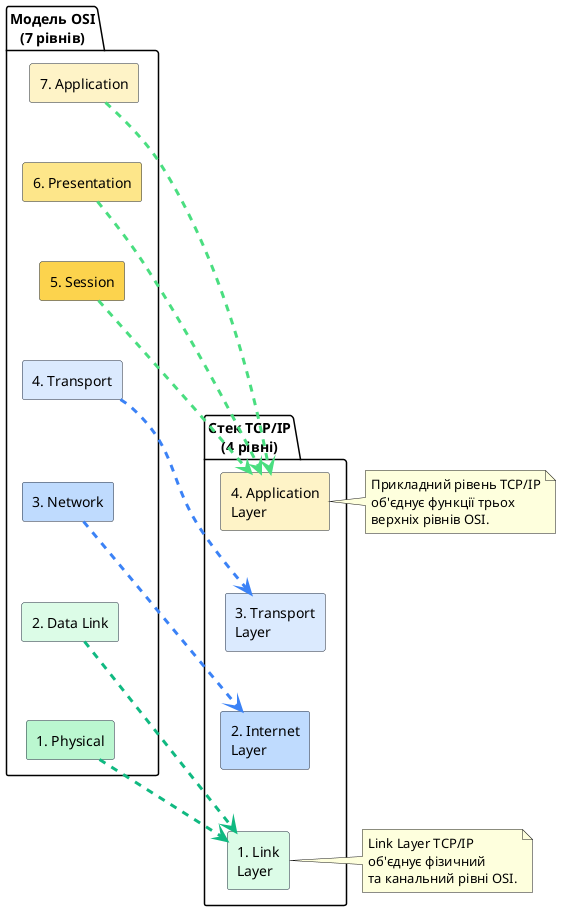
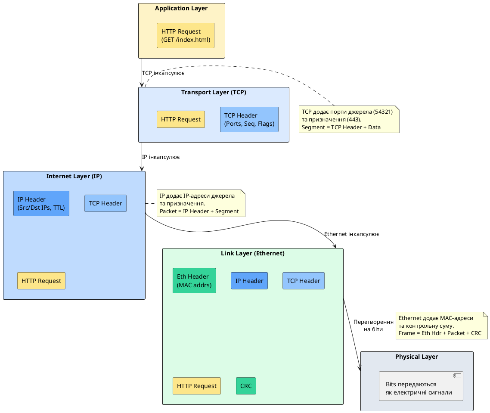

# Стек протоколів TCP/IP

::card-group

::card{title="🎯 Мета розділу" icon="i-lucide-target"}

- Зрозуміти архітектуру стеку TCP/IP як практичну основу сучасного Інтернету.
- Порівняти модель TCP/IP з еталонною моделлю OSI та усвідомити їхній взаємозв'язок.
- Опанувати структуру чотирьох рівнів TCP/IP та їхні функції.
- Вивчити ключові протоколи кожного рівня стеку TCP/IP.
- Навчитися застосовувати знання про TCP/IP для розуміння реальної мережевої взаємодії.

::

::card{title="🔑 Ключові терміни" icon="i-lucide-key"}

- **TCP/IP (Internet Protocol Suite):** практичний стек протоколів, на якому побудований Інтернет.
- **RFC (Request for Comments):** документи-стандарти, що описують інтернет-протоколи.
- **IETF (Internet Engineering Task Force):** організація, відповідальна за розробку інтернет-стандартів.
- **Інкапсуляція TCP/IP:** процес додавання заголовків протоколів при передачі даних через стек.

::

::

---

## Від теорії OSI до практики TCP/IP

У попередньому розділі ми детально вивчили еталонну модель OSI — концептуальну семирівневу архітектуру, що описує, як має бути організована мережева взаємодія. Модель OSI є надзвичайно корисною для навчання, аналізу та класифікації мережевих функцій, проте **сучасний Інтернет побудований не на "чистій" реалізації OSI**, а на іншому протокольному стеку, що називається **TCP/IP** або **Internet Protocol Suite** (набір інтернет-протоколів).

Виникає природне питання: якщо модель OSI настільки добре продумана та стандартизована міжнародною організацією ISO, чому Інтернет не використовує її безпосередньо? Відповідь криється в історії розвитку комп'ютерних мереж та у фундаментальній різниці між **еталонною моделлю** (OSI) та **практичним стеком протоколів** (TCP/IP).

### Історія виникнення TCP/IP

Стек TCP/IP виник у результаті дослідницького проєкту ARPANET (*Advanced Research Projects Agency Network*), що фінансувався Агентством перспективних дослідницьких проєктів Міністерства оборони США (DARPA) наприкінці 1960-х — на початку 1970-х років. Метою проєкту було створення децентралізованої мережі, здатної витримати часткові відмови вузлів та каналів зв'яз ку (концепція виникла в контексті холодної війни, коли важливою була стійкість комунікацій до ядерного удару).

Ключові етапи розвитку TCP/IP:

- **1969:** Запуск ARPANET — першої мережі з комутацією пакетів, що з'єднала чотири вузли (університети UCLA, Stanford, UCSB та Університет Юти).
- **1974:** Вінтон Серф та Роберт Кан публікують статтю "A Protocol for Packet Network Intercommunication", що описує протокол TCP (*Transmission Control Protocol*).
- **1978:** TCP розділяється на два окремі протоколи: TCP (транспортний рівень) та IP (мережевий рівень), що дає початок сучасній архітектурі TCP/IP.
- **1983:** ARPANET офіційно переходить на стек TCP/IP (1 січня 1983 року вважається «днем народження Інтернету»).
- **1989:** Тім Бернерс-Лі створює протокол HTTP та концепцію Всесвітньої павутини (World Wide Web) поверх інфраструктури TCP/IP.
- **1990-ті:** Масова комерціалізація Інтернету, поява веббраузерів (Mosaic, Netscape, Internet Explorer), експоненціальне зростання кількості підключених пристроїв.

{.diagram-img}

::note
На відміну від моделі OSI, що була спочатку задумана як теоретична специфікація, TCP/IP виник **еволюційно**, як результат практичних експериментів, інженерних компромісів та поступового удосконалення робочих реалізацій. Протоколи TCP/IP документуються у специфікаціях **RFC** (*Request for Comments*), що публікуються IETF (*Internet Engineering Task Force*) — відкритою міжнародною спільнотою інженерів, дослідників та розробників.
::

### Чому TCP/IP переміг OSI

Хоча модель OSI була офіційно стандартизована ISO, а протоколи OSI (X.25 для мереж з комутацією пакетів, X.400 для електронної пошти, X.500 для каталогових служб) активно просувалися телекомунікаційними компаніями та урядами, TCP/IP виявився більш успішним з кількох причин:

**1. Практичність та простота:** Протоколи TCP/IP були розроблені практиками для вирішення реальних проблем, а не комітетами стандартизації. IP, TCP та UDP є відносно простими протоколами з мінімальними накладними витратами, що забезпечило їхню ефективність та легкість реалізації.

**2. Відкритість та доступність:** Специфікації TCP/IP публікувалися як RFC-документи, доступні безкоштовно для будь-кого. Це дозволило університетам, дослідникам та компаніям вільно реалізовувати протоколи без необхідності платити за стандарти або ліцензії (на відміну від деяких протоколів OSI, що контролювалися комерційними організаціями).

**3. Наявність працюючих реалізацій:** До моменту стандартизації OSI (1984) TCP/IP вже мав численні робочі реалізації у BSD Unix, що широко використовувався в академічних та дослідницьких установах. Мережа ARPANET успішно працювала, демонструючи практичну життєздатність підходу.

**4. Гнучкість та еволюційність:** TCP/IP не був жорстко прив'язаний до семирівневої ієрархії. Замість цього він дозволяв протоколам природно адаптуватися до потреб застосунків. Наприклад, протокол UDP був доданий пізніше як легковаговий транспорт для застосунків, що не потребують надійності TCP.

**5. Підтримка UNIX:** Інтеграція TCP/IP у Berkeley Software Distribution (BSD) Unix у 1980-х зробила його стандартним мережевим стеком для операційних систем UNIX, що домінували у серверному сегменті та академічному світі.

::warning
Важливо розуміти, що «перемога» TCP/IP над OSI не означає, що модель OSI є марною або неправильною. OSI залишається неоціненним навчальним та аналітичним інструментом. Однак для практичної роботи з реальними мережами та Інтернетом необхідно глибоко розуміти саме TCP/IP — його архітектуру, протоколи та особливості функціонування.
::

---

## Архітектура стеку TCP/IP

Стек TCP/IP зазвичай описують як **чотирирівневу модель**, що є спрощенням семирівневої моделі OSI. Ця спрощена структура краще відображає реальну організацію інтернет-протоколів та їхню практичну реалізацію в операційних системах.

### Чотири рівні TCP/IP

| Рівень TCP/IP | Номер | Приблизна відповідність OSI | Основні функції | Приклади протоколів |
|:---|:---:|:---|:---|:---|
| **Application** | 4 | OSI 5-7 | Прикладні протоколи, формати даних, сеанси | HTTP, SMTP, FTP, DNS, SSH, WebSocket |
| **Transport** | 3 | OSI 4 | Наскрізна доставка між процесами, порти, надійність | TCP, UDP, SCTP |
| **Internet** | 2 | OSI 3 | Маршрутизація пакетів, логічна адресація | IP (IPv4, IPv6), ICMP, ARP |
| **Link** | 1 | OSI 1-2 | Передача кадрів у локальному сегменті, фізична адресація | Ethernet, Wi-Fi (802.11), PPP |

{.diagram-img}

::plant-uml{alt="Порівняння моделей OSI та TCP/IP"}



::


### Детальний розгляд рівнів TCP/IP

#### Рівень 1: Link Layer (Канальний рівень)

**Призначення:** Link Layer у стеку TCP/IP відповідає за передачу IP-пакетів через конкретне фізичне середовище (Ethernet-мережа, Wi-Fi, оптоволоконний канал, мобільний зв'язок). Цей рівень об'єднує функції фізичного та канального рівнів моделі OSI, абстрагуючи деталі конкретної технології передачі даних від вищих рівнів.

**Ключові функції:**

- Інкапсуляція IP-пакетів у кадри (*frames*) специфічного протоколу канального рівня (Ethernet, Wi-Fi).
- Фізична адресація через MAC-адреси у локальних мережах.
- Виявлення та, в деяких випадках, виправлення помилок передачі (CRC у Ethernet).
- Керування доступом до спільного фізичного середовища (CSMA/CD у Ethernet, CSMA/CA у Wi-Fi).
- Перетворення бітів у фізичні сигнали (електричні, оптичні, радіохвилі) та навпаки.

**Технології Link Layer:**

- **Ethernet (IEEE 802.3):** Дротова локальна мережа, швидкості від 10 Mbps (застаріла) до 400 Gbps (сучасні дата-центри). Використовує CSMA/CD для доступу до середовища (у сучасних комутованих мережах колізії відсутні).
- **Wi-Fi (IEEE 802.11):** Бездротова локальна мережа, стандарти 802.11a/b/g/n/ac/ax (Wi-Fi 6/6E/7). Використовує CSMA/CA для уникнення колізій.
- **PPP (Point-to-Point Protocol):** Протокол «точка-точка» для з'єднання двох вузлів через послідовний канал (модем, ADSL).
- **Оптоволоконні канали:** SONET/SDH для магістральних мереж операторів зв'язку.

{.diagram-img}

::tip
З точки зору розробника вебзастосунків, Link Layer є найбільш «прозорим» рівнем: операційна система та мережеві драйвери автоматично обирають відповідну технологію (Ethernet або Wi-Fi) для передачі IP-пакетів. Розробнику рідко потрібно безпосередньо взаємодіяти з цим рівнем, за винятком специфічних випадків (мережева діагностика, аналіз трафіку через Wireshark).
::

#### Рівень 2: Internet Layer (Міжмережевий рівень)

**Призначення:** Internet Layer є серцем стеку TCP/IP. Його головна відповідальність — забезпечити **наскрізну доставку пакетів** через множину різнорідних мереж від джерела до призначення, навіть якщо ці вузли знаходяться на різних континентах та з'єднані десятками проміжних маршрутизаторів.

**Ключові функції:**

- **Логічна адресація:** Призначення унікальних IP-адрес кожному вузлу в глобальній мережі (IPv4: 32 біти, IPv6: 128 біт).
- **Маршрутизація:** Визначення шляху проходження пакета через мережу на основі таблиць маршрутизації та протоколів динамічної маршрутизації (RIP, OSPF, BGP).
- **Фрагментація та реасемблювання:** Розбиття великих пакетів на менші фрагменти при проходженні через канали з меншою MTU та збирання їх назад у вузлі призначення.
- **Обробка помилок та діагностика:** Протокол ICMP повідомляє про недоступність вузла, перевищення TTL, проблеми з фрагментацією (використовується утилітами `ping` та `traceroute`).

**Протоколи Internet Layer:**

- **IP (Internet Protocol):**
  - **IPv4:** Версія протоколу, що використовується з 1983 року. Адреси довжиною 32 біти (наприклад, `192.168.1.100`), що дає ~4.3 мільярди унікальних адрес. Через вичерпання адресного простору використовуються технології NAT (*Network Address Translation*) та приватні діапазони.
  - **IPv6:** Наступна версія протоколу, стандартизована у 1998 році. Адреси довжиною 128 біт (наприклад, `2001:0db8:85a3:0000:0000:8a2e:0370:7334`), що забезпечує практично необмежений адресний простір (340 ундеціліонів адрес). Поступово впроваджується паралельно з IPv4.

- **ICMP (Internet Control Message Protocol):** Службовий протокол для передачі повідомлень про помилки та діагностичної інформації. Використовується утилітою `ping` (Echo Request/Reply) та `traceroute` (TTL Exceeded).

- **ARP (Address Resolution Protocol):** Протокол відображення IP-адрес на MAC-адреси у локальній мережі. Коли вузол знає IP-адресу призначення, але не знає відповідної MAC-адреси, він надсилає ARP-запит (*ARP Request*) у широкомовному режимі (*broadcast*), і вузол з цією IP-адресою відповідає своєю MAC-адресою.

{.diagram-img}

::note
Протокол IP є **ненадійним** (*unreliable*) протоколом без підтвердження доставки: якщо пакет загубиться в дорозі (через перевантаження маршрутизатора, обрив каналу, перевищення TTL), IP просто його відкине без повідомлення відправника. Забезпечення надійності делегується транспортному рівню (протоколу TCP), який виявляє втрати та повторно передає дані.
::

#### Рівень 3: Transport Layer (Транспортний рівень)

**Призначення:** Transport Layer забезпечує **логічну комунікацію між процесами** на різних вузлах мережі. Якщо Internet Layer доставляє пакети між комп'ютерами (host-to-host), то Transport Layer доставляє дані між прикладними програмами, що виконуються на цих комп'ютерах (process-to-process).

**Ключові функції:**

- **Мультиплексування та демультиплексування:** Використання номерів портів (16-бітові числа від 0 до 65535) для ідентифікації конкретної прикладної програми на вузлі.
- **Сегментація та реасемблювання:** Розбиття даних прикладного рівня на менші сегменти (TCP) або датаграми (UDP) та збирання їх назад у приймача.
- **Надійна доставка (TCP):** Підтвердження отримання сегментів, виявлення втрачених або пошкоджених сегментів, повторна передача, впорядкування.
- **Контроль потоку:** Узгодження швидкості передачі між відправником та приймачем (вікно TCP).
- **Контроль перевантаження:** Виявлення перевантаження мережі та адаптація швидкості передачі (алгоритми TCP: Slow Start, Congestion Avoidance, Fast Retransmit, Fast Recovery).

**Протоколи Transport Layer:**

- **TCP (Transmission Control Protocol):**
  - Орієнтований на з'єднання: перед передачею даних встановлюється логічне з'єднання через процедуру "three-way handshake" (SYN, SYN-ACK, ACK).
  - Надійний: гарантує доставку всіх даних у правильному порядку без дублікатів.
  - Повноду плексний: дані можуть передаватися одночасно в обох напрямках.
  - Потоковий: TCP передає безперервний потік байтів, не зберігаючи межі між повідомленнями прикладного рівня.
  - Використовується протоколами, що потребують надійності: HTTP/HTTPS, SMTP, FTP, SSH, WebSocket (після upgrade).

- **UDP (User Datagram Protocol):**
  - Безз'єднальний: кожна датаграма незалежна, немає процедури встановлення з'єднання.
  - Ненадійний: не гарантує доставку, порядок або відсутність дублікатів.
  - Легковаговий: мінімальний заголовок (8 байт проти 20 байт у TCP), менші накладні витрати.
  - Зберігає межі повідомлень: кожна датаграма є окремим повідомленням.
  - Використовується протоколами реального часу, де швидкість важливіша за надійність: DNS-запити, потокове відео/аудіо (RTP), онлайн-ігри, VoIP.

{.diagram-img}

::warning
Поширена помилка: вважати, що UDP «поганий» або «застарілий» порівняно з TCP. Насправді це два інструменти для різних завдань. TCP оптимізований для надійної доставки даних, навіть ціною затримок (повторні передачі, контроль потоку). UDP оптимізований для мінімальних затримок, навіть ціною можливих втрат. Для потокового відео краще втратити один кадр, ніж зупинити трансляцію на секунду для повторної передачі.
::

#### Рівень 4: Application Layer (Прикладний рівень)

**Призначення:** Application Layer у TCP/IP об'єднує функції трьох верхніх рівнів моделі OSI (Application, Presentation, Session). Цей рівень містить всі протоколи, що безпосередньо взаємодіють з кінцевими користувачами та реалізують конкретні мережеві сервіси.


**Ключові функції:**

- Визначення семантики взаємодії для конкретних застосунків (веббраузинг, електронна пошта, передача файлів).
- Специфікація форматів повідомлень та процедур обміну.
- Забезпечення функцій, що раніше були розділені між рівнями представлення та сеансовим: кодування даних (UTF-8, JSON), стиснення (gzip), шифрування (TLS), керування сеансами (HTTP Keep-Alive, WebSocket).

**Основні протоколи Application Layer:**

- **HTTP/HTTPS (HyperText Transfer Protocol / Secure):** Протокол передачі гіпертексту для вебзастосунків. HTTP/1.1 (1997) — текстовий протокол із можливістю persistent connections. HTTP/2 (2015) — бінарний протокол із мультиплексуванням потоків. HTTP/3 (2022) — протокол поверх QUIC (UDP) замість TCP.

- **DNS (Domain Name System):** Розподілена ієрархічна база даних для перетворення доменних імен (`example.com`) у IP-адреси. Використовує UDP для запитів (порт 53), TCP для зонних трансферів.

- **SMTP (Simple Mail Transfer Protocol):** Протокол відправки електронної пошти від клієнта до сервера та між поштовими серверами (порт 25, 587 з STARTTLS).

- **POP3 / IMAP (Post Office Protocol 3 / Internet Message Access Protocol):** Протоколи отримання пошти з поштового сервера. POP3 завантажує листи на клієнт і видаляє їх з сервера. IMAP зберігає листи на сервері та синхронізує стан між пристроями.

- **FTP / SFTP (File Transfer Protocol / SSH File Transfer Protocol):** Протоколи передачі файлів. FTP використовує два з'єднання (команди та дані), не шифрується. SFTP працює поверх SSH, забезпечує шифрування.

- **SSH (Secure Shell):** Протокол безпечного віддаленого доступу до командного рядка, тунелювання портів, передачі файлів (порт 22).

- **WebSocket:** Протокол повнодуплексної комунікації поверх TCP для вебзастосунків реального часу. Встановлюється через HTTP Upgrade, потім переходить на власний протокол (порти 80/443).

{.diagram-img}

::tip
Багато сучасних протоколів прикладного рівня інкорпорують функції шифрування та автентифікації, що концептуально належали рівню представлення OSI. Наприклад, HTTPS — це HTTP поверх TLS (Transport Layer Security), який шифрує весь HTTP-трафік. Така інтеграція робить стек TCP/IP більш гнучким та адаптованим до реальних потреб безпеки.
::

---

## Інкапсуляція у стеку TCP/IP

Процес інкапсуляції у стеку TCP/IP аналогічний до процесу в моделі OSI, але з меншою кількістю рівнів. Розглянемо конкретний приклад передачі HTTP-запиту через стек TCP/IP.

### Приклад: HTTP-запит від браузера до вебсервера

**Сценарій:** Користувач вводить у браузері адресу `https://example.com/index.html` та натискає Enter.

**Крок 1: Application Layer (HTTP)**

Браузер формує HTTP-запит:
```
GET /index.html HTTP/1.1
Host: example.com
User-Agent: Mozilla/5.0
Accept: text/html
```

Цей текстовий запит (плюс порожній рядок) є даними прикладного рівня.

**Крок 2: Transport Layer (TCP)**

- Браузер встановлює TCP-з'єднання з сервером `example.com` на порт 443 (HTTPS).
- HTTP-запит розбивається на TCP-сегменти (якщо запит великий, він може поділитися на кілька сегментів; у цьому випадку він вміщується в один).
- TCP додає заголовок із портом джерела (наприклад, 54321), портом призначення (443), номером послідовності, прапорцями (PSH, ACK), контрольною сумою.

**Структура TCP-сегмента:**
```
[TCP Header: 20 байт] [HTTP Request Data: ~80 байт]
```

**Крок 3: Internet Layer (IP)**

- Операційна система визначає IP-адресу сервера `example.com` через DNS-запит (наприклад, `93.184.216.34`).
- IP додає заголовок із IP-адресою джерела (наприклад, `192.168.1.100`), IP-адресою призначення (`93.184.216.34`), протоколом (TCP = 6), TTL (наприклад, 64), контрольною сумою заголовка.

**Структура IP-пакета:**
```
[IP Header: 20 байт] [TCP Header: 20 байт] [HTTP Request Data: ~80 байт]
```

**Крок 4: Link Layer (Ethernet)**

- Якщо сервер знаходиться за межами локальної мережі, IP-пакет відправляється на шлюз за замовчуванням (маршрутизатор).
- Операційна система використовує ARP для визначення MAC-адреси шлюзу.
- Ethernet додає заголовок із MAC-адресою джерела (мережевої карти клієнта), MAC-адресою призначення (маршрутизатора), типом протоколу (IPv4 = 0x0800), а також трейлер із контрольною сумою CRC.

**Структура Ethernet-кадру:**
```
[Eth Header: 14 байт] [IP Header: 20 байт] [TCP Header: 20 байт] [HTTP Request Data: ~80 байт] [Eth Trailer (CRC): 4 байт]
```

**Крок 5: Physical Layer**

Ethernet-кадр перетворюється на послідовність бітів та передається як електричні імпульси через мідний кабель (або оптичні імпульси через оптоволокно, або радіохвилі через Wi-Fi).

{.diagram-img}

::plant-uml{alt="Інкапсуляція HTTP-запиту у стеку TCP/IP"}



::

### Деінкапсуляція на вебсервері

Коли Ethernet-кадр досягає вебсервера (після проходження через маршрутизатори, де він деінкапсулювався до IP-пакета, маршрутизувався та знову інкапсулювався у новий Ethernet-кадр), відбувається зворотний процес:

1. **Link Layer:** Мережева карта сервера перевіряє, чи призначений кадр для неї (MAC-адреса збігається), обчислює CRC для перевірки цілісності, видаляє Ethernet-заголовок та трейлер, передає IP-пакет вище.

2. **Internet Layer:** Ядро операційної системи перевіряє IP-адресу призначення (збігається з адресою сервера), видаляє IP-заголовок, передає TCP-сегмент транспортному рівню.

3. **Transport Layer:** TCP-стек перевіряє порт призначення (443 — HTTPS), контрольну суму, номер послідовності, відправляє підтвердження (ACK) клієнту, збирає дані з сегментів у послідовний потік, передає дані прикладному рівню.

4. **Application Layer:** Вебсервер (Nginx, Apache, Node.js) отримує HTTP-запит, парсить його, виконує бізнес-логіку (зчитує файл `index.html` з диска або генерує динамічний вміст), формує HTTP-відповідь та відправляє її назад клієнту через той самий стек (але у зворотному напрямку).

::note
Важливо розуміти, що на практиці між клієнтом та сервером можуть бути десятки проміжних вузлів (маршрутизатори, комутатори, брандмауери). Кожен маршрутизатор деінкапсулює пакет до IP-рівня, приймає рішення про маршрутизацію, інкапсулює назад у кадр наступного каналу та пересилає далі. Проте з точки зору транспортного та прикладного рівнів це прозоро: TCP «бачить» наскрізне з'єднання між клієнтом та сервером, а HTTP «бачить» обмін запитами та відповідями без знання про проміжну інфраструктуру.
::

---

## Практичне значення розуміння стеку TCP/IP

Для розробника вебзастосунків глибоке розуміння стеку TCP/IP є не просто теоретичним знанням, а практичним інструментом для вирішення реальних інженерних задач.


### Діагностика мережевих проблем

Коли користувач скаржиться, що «сайт не відкривається», знання TCP/IP дозволяє систематично локалізувати проблему:

- **Проблема на Link/Physical Layer?** Перевірити, чи підключено кабель, чи активний Wi-Fi, чи отримано IP-адресу через DHCP. Команда: `ip link` (Linux), `ipconfig` (Windows).

- **Проблема на Internet Layer?** Перевірити з'єднання на рівні IP через `ping`. Якщо `ping` до шлюзу (`192.168.1.1`) проходить, але до `8.8.8.8` (Google DNS) — ні, проблема у маршрутизації між локальною мережею та Інтернетом.

- **Проблема у DNS (Application Layer)?** Якщо `ping 93.184.216.34` (IP-адреса example.com) працює, але `ping example.com` — ні, проблема у резолвінгу доменних імен. Перевірити налаштування DNS-серверів.

- **Проблема на Transport Layer?** Якщо пінг проходить, але з'єднання з портом 443 не встановлюється, використати `telnet example.com 443` або `nc -zv example.com 443` для перевірки доступності TCP-порту. Проблема може бути у фаєрволі, що блокує порт.

- **Проблема на Application Layer?** Якщо TCP-з'єднання встановлюється, але HTTP-запит повертає `500 Internal Server Error` або `404 Not Found`, проблема у самому вебзастосунку, а не у мережевій інфраструктурі.

{.diagram-img}

::accordion

::accordion-item{label="❓ Чому важливо розрізняти «мережа не працює» та «сайт не працює»?" icon="i-lucide-help-circle"}

«Мережа не працює» зазвичай означає проблему на Link або Internet Layer: немає фізичного підключення, неправильна IP-адреса, недоступний шлюз, проблеми з маршрутизацією. «Сайт не працює» при робочій мережі (пінг до інших хостів проходить) означає проблему на Transport або Application Layer: закритий порт, збій вебсервера, помилка у застосунку. Розуміння рівнів дозволяє швидко звузити коло пошуку та не витрачати години на перевірку мережевих кабелів, коли насправді проблема у коді вебзастосунку.

::

::accordion-item{label="❓ Чому деякі застосунки використовують UDP замість TCP, якщо UDP ненадійний?" icon="i-lucide-help-circle"}

UDP обирають, коли **мінімізація затримки** важливіша за **гарантію доставки кожного пакета**. У потоковому відео (YouTube, Netflix) втрата одного кадру непомітна для користувача, але затримка на повторну передачу через TCP може призвести до «заїкання» відео. В онлайн-іграх (шутери, MOBA) важлива миттєва реакція: краще відобразити позицію гравця на основі останнього отриманого пакета, ніж чекати повторної передачі застарілих даних. DNS використовує UDP, оскільки запити короткі (один пакет), а повторна відправка запиту у разі втрати простіша, ніж накладні витрати на встановлення TCP-з'єднання.

::

::accordion-item{label="❓ Як HTTP/3 може працювати поверх UDP, якщо HTTP потребує надійності?" icon="i-lucide-help-circle"}

HTTP/3 не використовує «голий» UDP. Він працює поверх протоколу **QUIC** (*Quick UDP Internet Connections*), який реалізує надійність, контроль потоку, шифрування та мультиплексування **на рівні прикладного/транспортного протоколу**, а не на рівні ядра ОС (як TCP). QUIC вбудовує функції TCP та TLS у один протокол, що працює в user-space, дозволяючи швидше встановлювати з'єднання (0-RTT), уникати head-of-line blocking (кожен потік HTTP/3 незалежний) та краще працювати при втратах пакетів. UDP використовується лише як «транспортний контейнер» для передачі QUIC-пакетів через мережу.

::

::

### Оптимізація продуктивності

Розуміння TCP/IP допомагає оптимізувати продуктивність вебзастосунків:

- **Зменшення кількості HTTP-запитів:** Кожне HTTP-з'єднання через TCP вимагає three-way handshake (1.5 RTT — round-trip time), що додає затримки. HTTP/2 мультиплексує кілька запитів у одне TCP-з'єднання, усуваючи цю проблему.

- **Використання CDN:** Розміщення статичних ресурсів на географічно розподілених серверах зменшує кількість «стрибків» (hops) між клієнтом та сервером, знижуючи латентність на Internet Layer.

- **Налаштування TCP-параметрів:** На серверах можна налаштувати розмір TCP-вікна, алгоритми контролю перевантаження (CUBIC, BBR), увімкнути TCP Fast Open для зменшення затримок при встановленні з'єднання.

- **Стиснення даних:** HTTP-заголовок `Content-Encoding: gzip` зменшує обсяг переданих даних, що знижує навантаження на Transport та Internet Layers.

### Безпека та захист

Знання стеку допомагає розуміти вектори атак та методи захисту:

- **DDoS на різних рівнях:**
  - **Link Layer:** MAC-флудинг комутаторів.
  - **Internet Layer:** ICMP-флудинг (`ping` flood).
  - **Transport Layer:** SYN-флудинг (засмічення півоткритими TCP-з'єднаннями).
  - **Application Layer:** HTTP-флудинг (велика кількість легітимних HTTP-запитів).

- **Man-in-the-Middle (MITM):** Атакуючий перехоплює трафік на Link або Internet Layer. Захист: шифрування на Application Layer (HTTPS/TLS), що робить перехоплені дані нечитабельними.

- **DNS Spoofing:** Атакуючий підміняє відповідь DNS, направляючи користувача на фішинговий сайт. Захист: DNSSEC (цифрові підписи DNS-відповідей), DoH/DoT (DNS over HTTPS/TLS).

::tip
Безпека має бути багаторівневою (*defense in depth*). Навіть якщо один рівень скомпрометовано (наприклад, атакуючий контролює маршрутизатор на Internet Layer), шифрування на Application Layer (TLS) захищає конфіденційність даних. Аналогічно, фаєрвол на Transport Layer (блокування портів) доповнює захист на Application Layer (валідація вхідних даних, автентифікація).
::

---

## Підсумок

Стек TCP/IP є практичною основою сучасного Інтернету, що еволюціонував з дослідницької мережі ARPANET у глобальну інфраструктуру, що з'єднує мільярди пристроїв. Розуміння чотирьох рівнів TCP/IP — Link, Internet, Transport, Application — та їхнього зв'язку з семирівневою моделлю OSI є фундаментальною компетенцією для будь-якого backend-розробника.

**Ключові висновки:**

- **TCP/IP — це практичний стек протоколів**, що реально використовується в Інтернеті, на відміну від OSI, що є концептуальною моделлю.
- **Чотири рівні TCP/IP** (Link, Internet, Transport, Application) відповідають семи рівням OSI, причому Application Layer TCP/IP об'єднує три верхні рівні OSI.
- **IP забезпечує маршрутизацію пакетів** через глобальну мережу, але є ненадійним протоколом без гарантій доставки.
- **TCP додає надійність** поверх IP: підтвердження, повторні передачі, впорядкування, контроль потоку та перевантаження.
- **UDP є легковаговим транспортом** для застосунків, де швидкість важливіша за надійність.
- **Протоколи прикладного рівня** (HTTP, DNS, SMTP, SSH) реалізують конкретні мережеві сервіси та часто інтегрують функції шифрування (TLS) та стиснення.
- **Інкапсуляція** послідовно додає заголовки кожного рівня при передачі даних вниз по стеку, а **деінкапсуляція** видаляє їх при підйомі вгору на приймальній стороні.

Наступні розділи курсу детально розглянуть конкретні протоколи кожного рівня: IP-адресацію, TCP та UDP, HTTP, DNS та інші, поглиблюючи практичні знання про роботу мережевих застосунків.

---

## Контрольні питання для самоперевірки

1. У чому головна відмінність між моделлю OSI та стеком TCP/IP? Чому Інтернет побудований на TCP/IP, а не на OSI?
2. Перелічіть чотири рівні стеку TCP/IP та вкажіть їхню приблизну відповідність рівням OSI.
3. Які функції виконує Internet Layer (IP)? Чому IP називають ненадійним протоколом?
4. У чому фундаментальна різниця між TCP та UDP? Наведіть приклади застосунків, що використовують кожен з цих протоколів.
5. Опишіть процес інкапсуляції HTTP-запиту при його передачі через стек TCP/IP (від Application Layer до Physical Layer).
6. Що відбувається на кожному рівні стеку при деінкапсуляції пакета на вебсервері?
7. Як знання стеку TCP/IP допомагає діагностувати мережеві проблеми? Наведіть приклад послідовності перевірок для локалізації проблеми «сайт не відкривається».
8. Чому HTTP/3 використовує QUIC поверх UDP замість TCP?

---

## Додаткові матеріали для поглибленого вивчення

::card-group

::card{title="📖 Рекомендована література" icon="i-lucide-book-open"}

- W. Richard Stevens, Kevin R. Fall. *TCP/IP Illustrated, Volume 1: The Protocols.* — 2nd ed. — Addison-Wesley, 2011. (Класична книга з детальним розглядом протоколів TCP/IP).
- Douglas E. Comer. *Internetworking with TCP/IP Volume I: Principles, Protocols, and Architecture.* — 6th ed. — Pearson, 2013.

::

::card{title="🌐 Корисні вебресурси" icon="i-lucide-globe"}

- [RFC Editor — офіційний репозиторій RFC](https://www.rfc-editor.org/)
- [IETF — Internet Engineering Task Force](https://www.ietf.org/)
- [TCP/IP Guide by Charles M. Kozierok](http://www.tcpipguide.com/)
- [Wireshark — аналізатор мережевого трафіку](https://www.wireshark.org/)

::

::card{title="🛠️ Практичні інструменти" icon="i-lucide-wrench"}

- `ping` — перевірка доступності хоста на Internet Layer
- `traceroute` / `tracert` — відстеження маршруту пакетів
- `netstat` / `ss` — перегляд мережевих з'єднань та портів
- `tcpdump` / Wireshark — захоплення та аналіз мережевих пакетів
- `nslookup` / `dig` — діагностика DNS

::

::
