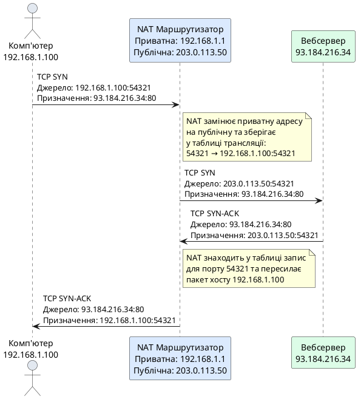
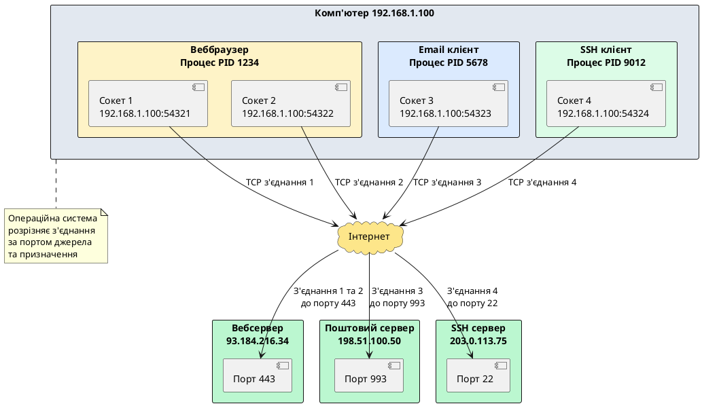
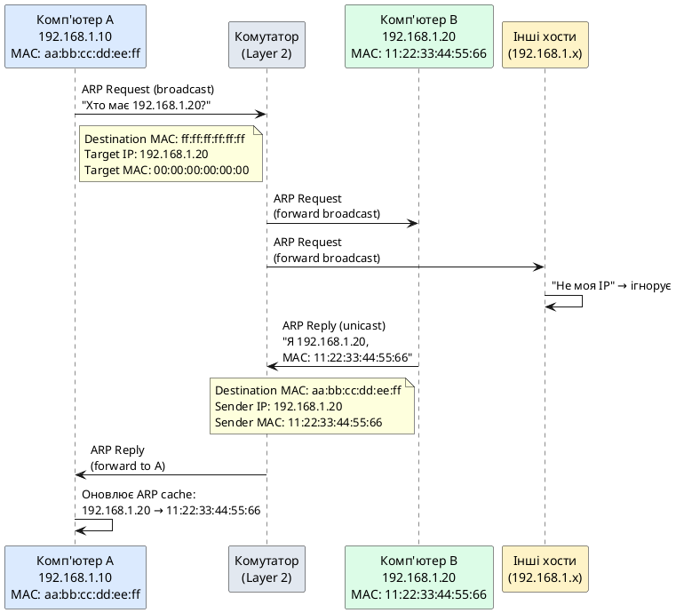
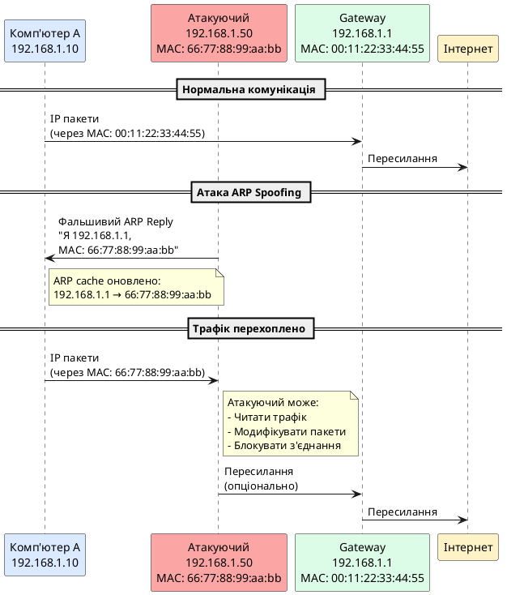
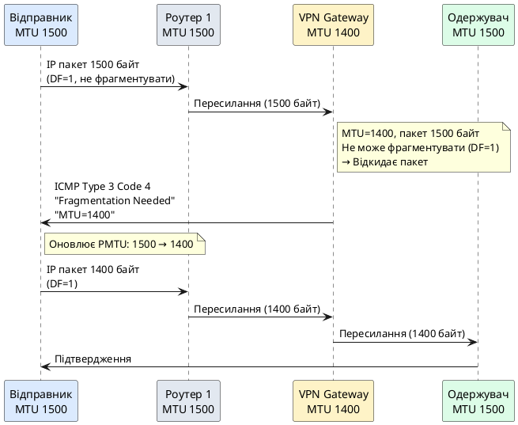

# IP-адресація, порти та сокети

::card-group

::card{title="🎯 Мета розділу" icon="i-lucide-target"}

- Глибоко зрозуміти концепцію IP-адреси як унікального ідентифікатора вузла в мережі.
- Опанувати структуру IPv4-адрес: класи, маски підмереж, приватні діапазони, CIDR-нотацію.
- Вивчити IPv6 як наступну генерацію IP-адресації та причини її впровадження.
- Зрозуміти роль портів у мультиплексуванні мережевих з'єднань між застосунками.
- Освоїти поняття сокета як комбінації IP-адреси та порту для унікальної ідентифікації кінцевої точки комунікації.
- Навчитися застосовувати ці знання для налаштування мережевих застосунків.

::

::card{title="🔑 Ключові терміни" icon="i-lucide-key"}

- **IP-адреса (IP Address):** унікальний числовий ідентифікатор вузла в мережі TCP/IP.
- **IPv4:** версія протоколу IP з 32-бітовими адресами (4.3 мільярди адрес).
- **IPv6:** версія протоколу IP з 128-бітовими адресами (практично необмежена кількість).
- **Маска підмережі (Subnet Mask):** визначає, яка частина IP-адреси відноситься до мережі, а яка — до хоста.
- **Порт (Port):** 16-бітове число (0-65535), що ідентифікує конкретний процес на вузлі.
- **Сокет (Socket):** комбінація IP-адреси та порту (наприклад, `192.168.1.100:8080`).

::

::

---

## Що таке IP-адреса та навіщо вона потрібна

У попередніх розділах ми з'ясували, що протокол IP (*Internet Protocol*) працює на мережевому рівні (Network Layer у OSI, Internet Layer у TCP/IP) та відповідає за маршрутизацію пакетів через множину взаємопов'язаних мереж від джерела до призначення. Але як протокол IP знає, **куди саме** відправляти пакет? Як маршрутизатори визначають напрямок пересилання? Відповідь проста: кожен вузол у мережі TCP/IP має унікальний числовий ідентифікатор — **IP-адресу**.

### IP-адреса як логічна адреса вузла

IP-адреса — це **логічний ідентифікатор**, призначений пристрою (комп'ютеру, серверу, маршрутизаторові, смартфону, принтеру, IoT-пристрою) у мережі. На відміну від MAC-адреси, що є фізичним ідентифікатором, «вшитим» виробником у мережеву карту та незмінним протягом життя пристрою, IP-адреса є **конфігурованою**: вона може змінюватися залежно від мережі, до якої підключений пристрій.

Аналогія з поштовою системою допомагає зрозуміти різницю між MAC-адресою та IP-адресою:

- **MAC-адреса** схожа на **серійний номер паспорта** людини: унікальний, незмінний, ідентифікує особу, але не вказує на її місцезнаходження. MAC-адреса працює лише в межах локального сегмента мережі (один Ethernet-комутатор або Wi-Fi-точка доступу).

- **IP-адреса** схожа на **поштову адресу**: країна, місто, вулиця, будинок, квартира. Вона має ієрархічну структуру, що дозволяє маршрутизаторам приймати рішення про пересилання пакетів без знання точного розташування всіх пристроїв у світі. IP-адреса може змінюватися, якщо ви переїжджаєте (підключаєтеся до іншої мережі).

::note
Коли ваш ноутбук підключається до домашньої Wi-Fi мережі, він отримує одну IP-адресу (наприклад, `192.168.1.50`). Коли ви приносите його до кав'ярні та підключаєтеся до їхньої Wi-Fi, він отримує іншу IP-адресу (наприклад, `10.0.5.123`). MAC-адреса мережевої карти залишається незмінною в обох випадках.
::

### Дві версії протоколу IP: IPv4 та IPv6

На сьогодні існують дві версії протоколу IP, що одночасно використовуються в Інтернеті:

- **IPv4 (*Internet Protocol version 4*):** Розроблена на початку 1980-х, використовує 32-бітові адреси, що дають приблизно 4.3 мільярда унікальних адрес. Записується у десятковій крапковій нотації: `192.168.1.1`, `8.8.8.8`, `172.16.0.1`.

- **IPv6 (*Internet Protocol version 6*):** Розроблена у 1990-х як відповідь на вичерпання адресного простору IPv4. Використовує 128-бітові адреси, що дають 340 ундеціліонів адрес (3.4 × 10³⁸). Записується у шістнадцятковій нотації з двокрапками: `2001:0db8:85a3:0000:0000:8a2e:0370:7334`.

{.diagram-img}

Більшість матеріалу цього розділу присвячена IPv4, оскільки вона все ще домінує в практичній веброзробці, проте ми також детально розглянемо IPv6 та причини її впровадження.

---

## IPv4: структура та нотація

### Анатомія IPv4-адреси

IPv4-адреса складається з **32 біт** (4 байти), що зазвичай записуються у **десятковій крапковій нотації** (*dotted-decimal notation*): чотири десяткові числа (від 0 до 255), розділені крапками.

**Приклад:** `192.168.1.100`

Розберемо цю адресу покроково:

1. **Десяткова форма:** `192.168.1.100`
   - Перший октет (байт): `192`
   - Другий октет: `168`
   - Третій октет: `1`
   - Четвертий октет: `100`

2. **Двійкова форма:** Кожен октет — це 8 біт, тому повна адреса — 32 біти:
   ```
   192       .  168       .  1         .  100
   11000000  .  10101000  .  00000001  .  01100100
   ```

3. **Шістнадцяткова форма:** `0xC0A80164`
   - `192` = `C0` (hex)
   - `168` = `A8` (hex)
   - `1` = `01` (hex)
   - `100` = `64` (hex)

::tip
Розуміння двійкової форми IP-адреси є критично важливим для роботи з масками підмереж, обчислення діапазонів адрес та розуміння маршрутизації. Хоча у повсякденній роботі ми використовуємо десяткову нотацію, під капотом маршрутизатори та операційні системи оперують двійковими числами.
::

### Чому саме 4 байти?

Вибір 32-бітової адреси був інженерним компромісом на початку 1980-х:

- **Достатня кількість адрес на той момент:** 4.3 мільярда адрес здавалися величезною кількістю для експериментальної мережі ARPANET, що мала лише кілька сотень вузлів. Ніхто не передбачав, що через 30 років кожна людина матиме кілька пристроїв, підключених до Інтернету (смартфон, ноутбук, планшет, розумні годинники, домашні пристрої IoT).

- **Ефективність обробки:** 32-бітові числа добре вписуються у розміри машинних слів комп'ютерних процесорів 1980-х років, що робило операції з IP-адресами ефективними.

- **Компактність заголовків:** Менші адреси означають менший розмір IP-заголовка (20 байт у IPv4), що зменшує накладні витрати при передачі даних.

### Діапазон можливих IPv4-адрес

Оскільки IPv4-адреса — це 32-бітове число, теоретично можливі адреси від `0.0.0.0` до `255.255.255.255`:

- **Мінімальна адреса:** `0.0.0.0` (всі біти = 0) — у двійковій формі: `00000000.00000000.00000000.00000000`
- **Максимальна адреса:** `255.255.255.255` (всі біти = 1) — у двійковій формі: `11111111.11111111.11111111.11111111`

**Загальна кількість адрес:** 2³² = 4,294,967,296 адрес (трохи більше 4.3 мільярда).

Проте не всі ці адреси доступні для призначення звичайним пристроям. Деякі діапазони зарезервовані для спеціальних цілей:

- **`0.0.0.0/8`** — адреси «цієї мережі», використовуються для позначення джерела під час ініціалізації.
- **`127.0.0.0/8`** — петлева адреса (*loopback*), `127.0.0.1` вказує на сам пристрій («localhost»).
- **`10.0.0.0/8`, `172.16.0.0/12`, `192.168.0.0/16`** — приватні діапазони (RFC 1918), недоступні з Інтернету, використовуються у локальних мережах.
- **`224.0.0.0/4`** — мультикастові адреси (для передачі одного пакета багатьом отримувачам одночасно).
- **`255.255.255.255`** — широкомовна адреса (*broadcast*) для відправки пакета всім вузлам у локальній мережі.

::note
З 4.3 мільярда теоретичних IPv4-адрес реально доступних для публічного використання значно менше через зарезервовані діапазони, фрагментацію адресного простору та неефективний розподіл у ранні роки Інтернету (деякі організації отримували цілі блоки `/8` з 16 мільйонами адрес, навіть якщо використовували лише їх невелику частину).
::

---

## Класова адресація IPv4 (застаріла, але важлива для розуміння)

На ранніх етапах розвитку Інтернету (1980-ті — початок 1990-х) IPv4-адреси розподілялися за **класовою системою** (*classful addressing*). Ідея полягала у поділі адресного простору на класи залежно від розміру мережі, що дозволяло простий поділ адреси на частину мережі та частину хоста.


### П'ять класів IPv4-адрес

IPv4-адресний простір був поділений на п'ять класів (A, B, C, D, E), що відрізнялися кількістю бітів, виділених для ідентифікації мережі та хоста:

| Клас | Перші біти | Діапазон адрес | Кількість мереж | Хостів на мережу | Призначення |
|:---:|:---:|:---|:---:|:---:|:---|
| **A** | `0` | `0.0.0.0` — `127.255.255.255` | 128 | 16,777,214 | Величезні мережі (наприклад, великі корпорації) |
| **B** | `10` | `128.0.0.0` — `191.255.255.255` | 16,384 | 65,534 | Середні мережі (університети, компанії) |
| **C** | `110` | `192.0.0.0` — `223.255.255.255` | 2,097,152 | 254 | Малі мережі (невеликі організації, офіси) |
| **D** | `1110` | `224.0.0.0` — `239.255.255.255` | — | — | Мультикастинг (групова передача) |
| **E** | `1111` | `240.0.0.0` — `255.255.255.255` | — | — | Зарезервовано для експериментів |

#### Клас A: Великі мережі

**Структура:** `N.H.H.H` (N — номер мережі, H — номер хоста)

- **Перший біт:** завжди `0`, тому перший октет: `0` — `127` (у десятковій формі).
- **Біти мережі:** 8 біт (перший октет) ⇒ 2⁷ = 128 мереж (біт 0 фіксований).
- **Біти хоста:** 24 біти (три останні октети) ⇒ 2²⁴ - 2 = 16,777,214 хостів на мережу (віднімаємо 2 адреси: адресу мережі та широкомовну адресу).

**Приклад:** `10.0.0.0/8` — приватна мережа класу A.
- Адреса мережі: `10.0.0.0`
- Діапазон хостів: `10.0.0.1` — `10.255.255.254`
- Широкомовна адреса: `10.255.255.255`

::note
Мережі класу A видавалися лише найбільшим організаціям (MIT, IBM, HP, Apple, AT&T), що призвело до неефективного використання адресного простору: організація, що отримала мережу класу A, мала у своєму розпорядженні 16 мільйонів адрес, навіть якщо реально використовувала лише кілька тисяч.
::

#### Клас B: Середні мережі

**Структура:** `N.N.H.H`

- **Перші два біти:** завжди `10`, тому перший октет: `128` — `191`.
- **Біти мережі:** 16 біт (перші два октети) ⇒ 2¹⁴ = 16,384 мережі (два біти `10` фіксовані).
- **Біти хоста:** 16 біт (два останні октети) ⇒ 2¹⁶ - 2 = 65,534 хости на мережу.

**Приклад:** `172.16.0.0/12` — приватний діапазон класу B (технічно охоплює 16 мереж класу B від `172.16.0.0` до `172.31.0.0`).
- Адреса мережі `172.16.0.0/16`:
  - Діапазон хостів: `172.16.0.1` — `172.16.255.254`
  - Широкомовна адреса: `172.16.255.255`

#### Клас C: Малі мережі

**Структура:** `N.N.N.H`

- **Перші три біти:** завжди `110`, тому перший октет: `192` — `223`.
- **Біти мережі:** 24 біти (перші три октети) ⇒ 2²¹ = 2,097,152 мережі (три біти `110` фіксовані).
- **Біти хоста:** 8 біт (останній октет) ⇒ 2⁸ - 2 = 254 хости на мережу.

**Приклад:** `192.168.1.0/24` — типова домашня мережа класу C.
- Адреса мережі: `192.168.1.0`
- Діапазон хостів: `192.168.1.1` — `192.168.1.254`
- Широкомовна адреса: `192.168.1.255`

::warning
Класова адресація офіційно застаріла з 1993 року, коли була введена система **CIDR** (*Classless Inter-Domain Routing*), що дозволяє більш гнучкий розподіл адрес без прив'язки до класів. Проте розуміння класів все ще корисне для розуміння історичного контексту та деяких застарілих систем.
::

---

## Маски підмереж та CIDR-нотація

Основною проблемою класової адресації була **негнучкість**: якщо організації потрібна мережа на 300 хостів, вона не могла отримати мережу класу C (254 хости — замало) і змушена була отримувати мережу класу B (65,534 хости — величезний перевитрата). Рішенням стало впровадження **масок підмереж** (*subnet masks*) та нотації **CIDR**.

### Що таке маска підмережі

**Маска підмережі** — це 32-бітове число, що визначає, яка частина IP-адреси відноситься до **ідентифікатора мережі**, а яка — до **ідентифікатора хоста** в цій мережі. Маска має таку саму структуру, як IP-адреса (чотири октети), але складається з послідовності одиниць (біти мережі), за якими йдуть нулі (біти хоста).

**Приклад маски:** `255.255.255.0`

- **Десяткова форма:** `255.255.255.0`
- **Двійкова форма:** `11111111.11111111.11111111.00000000`

Ця маска означає, що **перші 24 біти** (три октети) IP-адреси відносяться до мережі, а **останні 8 біт** (один октет) — до хоста.

### Як працює маска: побітова операція AND

Щоб визначити, до якої мережі належить певна IP-адреса, виконується **побітова операція AND** між IP-адресою та маскою підмережі. Результат — **адреса мережі**.

**Приклад:**
- IP-адреса хоста: `192.168.1.100`
- Маска підмережі: `255.255.255.0`

**Двійкова форма:**
```
IP-адреса:  11000000.10101000.00000001.01100100  (192.168.1.100)
Маска:      11111111.11111111.11111111.00000000  (255.255.255.0)
─────────────────────────────────────────────────── (AND)
Адреса мережі: 11000000.10101000.00000001.00000000  (192.168.1.0)
```

Результат: хост `192.168.1.100` з маскою `255.255.255.0` належить до мережі `192.168.1.0`.

::tip
Операція AND працює просто: якщо обидва біти `1`, результат `1`. Якщо хоча б один біт `0`, результат `0`. Оскільки маска має одиниці у частині мережі та нулі у частині хоста, AND «обнуляє» біти хоста, залишаючи лише біти мережі.
::

### CIDR-нотація: префіксна довжина

Замість запису повної маски (наприклад, `255.255.255.0`), сучасна практика використовує **CIDR-нотацію** (*Classless Inter-Domain Routing*), що вказує кількість бітів мережі через слеш:

**Формат:** `IP-адреса/префікс`

**Приклад:** `192.168.1.0/24`

- `/24` означає, що **перші 24 біти** — це частина мережі.
- Це еквівалентно масці `255.255.255.0` (24 одиниці, 8 нулів).

**Таблиця відповідності CIDR-префіксів та масок:**

| CIDR | Маска підмережі | Біти мережі | Біти хоста | Кількість хостів |
|:---:|:---|:---:|:---:|---:|
| `/8` | `255.0.0.0` | 8 | 24 | 16,777,214 |
| `/16` | `255.255.0.0` | 16 | 16 | 65,534 |
| `/24` | `255.255.255.0` | 24 | 8 | 254 |
| `/25` | `255.255.255.128` | 25 | 7 | 126 |
| `/26` | `255.255.255.192` | 26 | 6 | 62 |
| `/27` | `255.255.255.224` | 27 | 5 | 30 |
| `/28` | `255.255.255.240` | 28 | 4 | 14 |
| `/29` | `255.255.255.248` | 29 | 3 | 6 |
| `/30` | `255.255.255.252` | 30 | 2 | 2 |
| `/32` | `255.255.255.255` | 32 | 0 | 1 (одна адреса) |

{.diagram-img}

**Формула кількості хостів:** 2^(кількість бітів хоста) - 2

Віднімаємо 2, оскільки:
1. Перша адреса діапазону — адреса мережі (не може бути призначена хосту).
2. Остання адреса діапазону — широкомовна адреса (*broadcast*), використовується для відправки пакета всім хостам у мережі.

::note
**Виняток для `/31` та `/32`:**
- `/31` використовується для point-to-point з'єднань між маршрутизаторами (RFC 3021), де немає необхідності у адресі мережі та broadcast.
- `/32` вказує на одну конкретну адресу хоста (використовується у маршрутах до окремих хостів).
::

### Приклад обчислення діапазону адрес

**Мережа:** `172.16.5.64/26`

**Крок 1:** Визначити маску підмережі.
- `/26` означає 26 бітів мережі, 6 бітів хоста.
- Маска: `11111111.11111111.11111111.11000000` = `255.255.255.192`

**Крок 2:** Визначити адресу мережі (AND між IP та маскою).
```
IP:    172.16.5.64   = 10101100.00010000.00000101.01000000
Маска: 255.255.255.192 = 11111111.11111111.11111111.11000000
────────────────────────────────────────────────────────── (AND)
Мережа: 172.16.5.64   = 10101100.00010000.00000101.01000000
```
Адреса мережі: `172.16.5.64`

**Крок 3:** Обчислити діапазон хостів.
- Кількість хостів: 2⁶ - 2 = 64 - 2 = 62
- Перша доступна адреса хоста: `172.16.5.65`
- Остання доступна адреса хоста: `172.16.5.126`
- Широкомовна адреса: `172.16.5.127`

**Крок 4:** Визначити наступну мережу.
- Розмір блоку адрес: 2⁶ = 64 адреси
- Наступна мережа: `172.16.5.128/26`

::accordion

::accordion-item{label="❓ Як швидко обчислити діапазон без двійкових перетворень?" icon="i-lucide-help-circle"}

Є простий спосіб для обчислення діапазону адрес у межах одного октету (коли маска не виходить за межі октету):

1. Знайдіть значення останнього октету маски (наприклад, `255.255.255.192` → останній октет `192`).
2. Обчисліть **розмір блоку**: `256 - значення_октету_маски`. Для `192`: `256 - 192 = 64`.
3. Адреси мережі кратні розміру блоку: `0, 64, 128, 192` (для останнього октету).
4. Для `172.16.5.64/26`: мережа починається з `64`, закінчується перед наступним кратним (`128 - 1 = 127`).
5. Діапазон хостів: `172.16.5.65` — `172.16.5.126` (мінус перша та остання адреси блоку).

::

::accordion-item{label="❓ Чому не можна використовувати адресу мережі та broadcast-адресу для хостів?" icon="i-lucide-help-circle"}

**Адреса мережі** (всі біти хоста = 0) ідентифікує саму мережу як ціле. Вона використовується у таблицях маршрутизації для позначення напрямку: «пакети до мережі `192.168.1.0/24` відправляти через інтерфейс X».

**Broadcast-адреса** (всі біти хоста = 1) призначена для відправки одного пакета **всім** хостам у мережі одночасно. Наприклад, ARP-запити використовують broadcast для запитання «хто має IP-адресу X?».

Якщо дозволити призначення цих адрес окремим хостам, виникне конфлікт: маршрутизатори та протоколи не зможуть відрізнити «адресу мережі як маршрут» від «адреси конкретного хоста».

::

::


---

## Приватні та публічні IPv4-адреси

У міру зростання Інтернету стало очевидно, що 4.3 мільярда IPv4-адрес недостатньо для всіх пристроїв у світі. Одним з рішень стало впровадження **приватних діапазонів IP-адрес** (RFC 1918) та технології **NAT** (*Network Address Translation*).

### Приватні діапазони IPv4 (RFC 1918)

**Приватні адреси** — це спеціальні діапазони IPv4-адрес, зарезервовані для використання у **локальних мережах** (домашніх, офісних, корпоративних) та **не маршрутизовані в Інтернеті**. Маршрутизатори Інтернету налаштовані так, щоб відкидати пакети з приватними адресами джерела або призначення.

**Три приватні діапазони:**

| Діапазон CIDR | Діапазон адрес | Кількість адрес | Типове використання |
|:---|:---|---:|:---|
| **`10.0.0.0/8`** | `10.0.0.0` — `10.255.255.255` | 16,777,216 | Великі корпоративні мережі |
| **`172.16.0.0/12`** | `172.16.0.0` — `172.31.255.255` | 1,048,576 | Середні організації, дата-центри |
| **`192.168.0.0/16`** | `192.168.0.0` — `192.168.255.255` | 65,536 | Домашні мережі, малі офіси |

**Приклади використання:**

- **Домашня мережа:** Ваш Wi-Fi-маршрутизатор зазвичай призначає пристроям адреси з діапазону `192.168.0.0/24` або `192.168.1.0/24` (наприклад, ноутбук отримує `192.168.1.10`, смартфон — `192.168.1.11`).

- **Корпоративна мережа:** Велика компанія може використовувати мережу `10.0.0.0/8`, розділяючи її на підмережі за відділами: `10.1.0.0/16` — маркетинг, `10.2.0.0/16` — розробка, `10.3.0.0/16` — адміністрація.

::note
Приватні адреси **не унікальні глобально**. Мільйони домашніх мереж у всьому світі використовують адреси `192.168.1.1` (маршрутизатор) та `192.168.1.100` (комп'ютер). Це не створює конфліктів, оскільки ці адреси ізольовані всередині локальної мережі та не виходять безпосередньо в Інтернет.
::

### Публічні IPv4-адреси

**Публічні адреси** — це всі інші IPv4-адреси, що **маршрутизуються в глобальному Інтернеті** та мають бути **глобально унікальними**. Публічні адреси розподіляються централізовано:

1. **IANA** (*Internet Assigned Numbers Authority*) — центральний орган, що виділяє великі блоки адрес регіональним реєстрам.
2. **RIR** (*Regional Internet Registries*) — п'ять регіональних організацій (ARIN для Північної Америки, RIPE NCC для Європи, APNIC для Азії-Тихоокеанського регіону тощо), що розподіляють адреси інтернет-провайдерам.
3. **ISP** (*Internet Service Providers*) — інтернет-провайдери виділяють публічні адреси своїм клієнтам.

**Приклади публічних адрес:**
- `8.8.8.8` — публічний DNS-сервер Google
- `1.1.1.1` — публічний DNS-сервер Cloudflare
- `93.184.216.34` — вебсервер example.com

### NAT: як приватні адреси виходять у Інтернет

**NAT (Network Address Translation)** — це технологія, що дозволяє множині пристроїв з приватними адресами **спільно використовувати одну публічну IP-адресу** для доступу до Інтернету.

**Як працює NAT (спрощено):**

1. Ваш комп'ютер з приватною адресою `192.168.1.100` хоче відкрити сайт `example.com` (`93.184.216.34`).
2. Комп'ютер надсилає TCP SYN-пакет до порту 80:
   - **Джерело:** `192.168.1.100:54321`
   - **Призначення:** `93.184.216.34:80`
3. Пакет проходить через NAT-маршрутизатор (домашній роутер), який **замінює** приватну адресу джерела на свою публічну адресу (наприклад, `203.0.113.50`):
   - **Джерело (після NAT):** `203.0.113.50:54321`
   - **Призначення:** `93.184.216.34:80`
4. Маршрутизатор зберігає запис у **таблиці NAT**: «порт 54321 належить хосту `192.168.1.100:54321`».
5. Сервер `example.com` отримує пакет від `203.0.113.50:54321` і відповідає на цю адресу.
6. Маршрутизатор отримує відповідь, перевіряє таблицю NAT, бачить, що порт 54321 належить `192.168.1.100`, і **пересилає** пакет у локальну мережу:
   - **Призначення (після зворотної трансляції):** `192.168.1.100:54321`

{.diagram-img}

::plant-uml{alt="Принцип роботи NAT"}



::

**Переваги NAT:**

- **Економія публічних адрес:** Сотні пристроїв у локальній мережі можуть працювати через одну публічну адресу.
- **Додатковий рівень безпеки:** Зовнішні хости не мають прямого доступу до приватних адрес всередині мережі (працює як простий фаєрвол).

**Недоліки NAT:**

- **Порушення end-to-end принципу:** Пристрої за NAT не мають «справжньої» публічної адреси, що ускладнює peer-to-peer комунікацію (VoIP, онлайн-ігри, BitTorrent).
- **Проблеми з деякими протоколами:** Протоколи, що вбудовують IP-адреси у корисне навантаження (FTP, SIP), потребують спеціальних модулів NAT (ALG — Application Layer Gateway).
- **Складність у налаштуванні вхідних з'єднань:** Якщо потрібно запустити сервер за NAT (наприклад, вебсервер на домашньому комп'ютері), необхідно налаштувати **port forwarding** (перенаправлення порту).

::tip
NAT є тимчасовим рішенням проблеми вичерпання IPv4-адрес. Довгострокове рішення — перехід на IPv6, де кожен пристрій може мати глобально унікальну публічну адресу без потреби у NAT.
::

---

## IPv6: наступна генерація IP-адресації

### Чому виникла необхідність у IPv6

До кінця 1990-х років стало зрозуміло, що IPv4-адреси закінчуються:

- **Експоненціальне зростання Інтернету:** Кількість підключених пристроїв зростала швидше, ніж очікувалося. Поява смартфонів, планшетів, IoT-пристроїв (розумні лічильники, камери, холодильники, автомобілі) призвела до того, що одна людина може мати десяток підключених пристроїв.

- **Неефективний розподіл адрес:** У ранні роки Інтернету адреси розподілялися неефективно: організації отримували цілі блоки `/8` або `/16`, навіть якщо використовували лише невелику частину.

- **Обмеження NAT:** Хоча NAT допоміг відстрочити кризу, він не є ідеальним рішенням через технічні обмеження та порушення end-to-end принципу.

**Останні блоки IPv4-адрес були розподілені:**
- IANA виділила останні блоки RIR у 2011 році.
- APNIC (Азія-Тихоокеанський регіон) вичерпав вільні адреси у 2011 році.
- RIPE NCC (Європа) вичерпав адреси у 2012 році.
- ARIN (Північна Америка) вичерпав адреси у 2015 році.

### Структура IPv6-адреси

**IPv6** використовує **128-бітові адреси**, що записуються у **шістнадцятковій нотації** з двокрапками, розділеними на вісім груп по 16 біт (4 шістнадцяткові цифри).

**Повна форма IPv6-адреси:**
```
2001:0db8:85a3:0000:0000:8a2e:0370:7334
```

**Скорочена форма:**
IPv6 дозволяє скорочення для зручності:

1. **Ведучі нулі у групі можна пропустити:**
   ```
   2001:0db8:85a3:0000:0000:8a2e:0370:7334
   → 2001:db8:85a3:0:0:8a2e:370:7334
   ```

2. **Одну послідовність нульових груп можна замінити на `::`:**
   ```
   2001:db8:85a3:0:0:8a2e:370:7334
   → 2001:db8:85a3::8a2e:370:7334
   ```

::warning
Подвійна двокрапка `::` може використовуватися **лише один раз** в адресі. Якщо використати її двічі, неможливо однозначно визначити, скільки нульових груп пропущено.

**Правильно:** `2001:db8::1` (означає `2001:0db8:0000:0000:0000:0000:0000:0001`)
**Неправильно:** `2001::db8::1` (неоднозначно!)
::

**Спеціальні IPv6-адреси:**

- **`::1/128`** — петлева адреса (*loopback*), еквівалент `127.0.0.1` у IPv4.
- **`::/128`** — невизначена адреса (all-zeros), використовується при ініціалізації.
- **`fe80::/10`** — link-local адреси, використовуються для комунікації в межах локального сегмента (автоматично призначаються кожному інтерфейсу).
- **`fc00::/7`** — унікальні локальні адреси (*Unique Local Addresses, ULA*), аналог приватних адрес IPv4.
- **`ff00::/8`** — мультикастові адреси (немає broadcast у IPv6, замість нього використовується multicast).

**Кількість адрес у IPv6:**

2¹²⁸ = 340,282,366,920,938,463,463,374,607,431,768,211,456 адрес (340 ундеціліонів)

Це приблизно **670 мільйонів адрес на кожен квадратний міліметр поверхні Землі**. Практично необмежена кількість.


::note
IPv6 не потребує NAT: кожен пристрій може мати глобально унікальну публічну адресу. Це відновлює end-to-end принцип Інтернету, спрощує peer-to-peer комунікацію та усуває необхідність у port forwarding. Проте практика показує, що багато організацій все ще використовують фаєрволи для контролю доступу, навіть якщо NAT технічно не потрібен.
::

---

## Структура IP-пакету: анатомія даних у мережі

Тепер, коли ми розуміємо, як адресуються вузли в мережі, розглянемо детальніше, **як саме дані передаються** між ними. IP протокол інкапсулює дані з вищих рівнів у **IP-пакети** (*IP packets*) — структуровані блоки інформації з заголовком та корисним навантаженням.

### IPv4 пакет: структура заголовка

Кожен IPv4-пакет складається з двох частин:

1. **IP-заголовок** (*IP header*) — метадані про пакет (адреси, протокол, контрольна сума тощо). Мінімальний розмір: 20 байт, максимальний: 60 байт.
2. **Корисне навантаження** (*payload*) — дані з вищих рівнів (TCP-сегмент, UDP-датаграма або ICMP-повідомлення).

{.diagram-img}

**Схема IPv4-заголовка (20 байт без опцій):**

```
 0                   1                   2                   3
 0 1 2 3 4 5 6 7 8 9 0 1 2 3 4 5 6 7 8 9 0 1 2 3 4 5 6 7 8 9 0 1
+-+-+-+-+-+-+-+-+-+-+-+-+-+-+-+-+-+-+-+-+-+-+-+-+-+-+-+-+-+-+-+-+
|Version|  IHL  |Type of Service|          Total Length         |
+-+-+-+-+-+-+-+-+-+-+-+-+-+-+-+-+-+-+-+-+-+-+-+-+-+-+-+-+-+-+-+-+
|         Identification        |Flags|      Fragment Offset    |
+-+-+-+-+-+-+-+-+-+-+-+-+-+-+-+-+-+-+-+-+-+-+-+-+-+-+-+-+-+-+-+-+
|  Time to Live |    Protocol   |         Header Checksum       |
+-+-+-+-+-+-+-+-+-+-+-+-+-+-+-+-+-+-+-+-+-+-+-+-+-+-+-+-+-+-+-+-+
|                       Source IP Address                       |
+-+-+-+-+-+-+-+-+-+-+-+-+-+-+-+-+-+-+-+-+-+-+-+-+-+-+-+-+-+-+-+-+
|                    Destination IP Address                     |
+-+-+-+-+-+-+-+-+-+-+-+-+-+-+-+-+-+-+-+-+-+-+-+-+-+-+-+-+-+-+-+-+
|                    Options (if IHL > 5)                       |
+-+-+-+-+-+-+-+-+-+-+-+-+-+-+-+-+-+-+-+-+-+-+-+-+-+-+-+-+-+-+-+-+
|                            Payload                            |
|                            (Data)                             |
+-+-+-+-+-+-+-+-+-+-+-+-+-+-+-+-+-+-+-+-+-+-+-+-+-+-+-+-+-+-+-+-+
```

### Опис полів IPv4-заголовка

#### 1. Version (4 біти)
**Значення:** `4` (для IPv4) або `6` (для IPv6)

Це поле дозволяє маршрутизаторам та хостам розрізняти IPv4 та IPv6 пакети.

#### 2. IHL — Internet Header Length (4 біти)
**Значення:** довжина заголовка у 32-бітних словах (4 байти кожне).

- Мінімум: `5` (5 × 4 = 20 байт) — заголовок без опцій
- Максимум: `15` (15 × 4 = 60 байт) — заголовок з опціями

**Чому потрібне:** IP-заголовок має змінну довжину через опціональне поле Options. IHL вказує, де закінчується заголовок і починається корисне навантаження.

#### 3. Type of Service / DSCP (8 біт)
**Історично:** Type of Service (ToS) використовувався для визначення пріоритету пакета.

**Сучасне використання:** **DSCP** (*Differentiated Services Code Point*) — перші 6 біт використовуються для **QoS** (*Quality of Service*) класифікації трафіку:

- `000000` (0) — Best Effort (звичайний трафік)
- `101110` (46) — Expedited Forwarding (EF) — критичний трафік (VoIP)
- `001010` (10) — Assured Forwarding (AF) — пріоритетний трафік

**Останні 2 біти (ECN — Explicit Congestion Notification):** використовуються для повідомлення про перевантаження мережі.

::note
У повсякденній роботі більшість трафіку має DSCP=0 (Best Effort). Налаштування QoS зазвичай потребується лише у корпоративних мережах для пріоритизації VoIP, відеоконференцій або критичних застосунків.
::

#### 4. Total Length (16 біт)
**Значення:** загальна довжина пакета (заголовок + дані) у байтах.

- Мінімум: 20 байт (тільки заголовок без даних)
- Максимум: 65,535 байт (2¹⁶ - 1)

**Практичне обмеження:** більшість мереж обмежують розмір пакета через MTU (зазвичай 1500 байт для Ethernet). Пакети більші за MTU фрагментуються.

#### 5. Identification (16 біт)
**Призначення:** унікальний ідентифікатор для групи фрагментів одного пакета.

Коли великий пакет фрагментується, всі фрагменти отримують **однаковий** Identification, що дозволяє одержувачу зібрати їх назад у правильному порядку.

**Приклад:**
```
Оригінальний пакет ID=12345 розбивається на 3 фрагменти:
  Fragment 1: ID=12345, Offset=0
  Fragment 2: ID=12345, Offset=185
  Fragment 3: ID=12345, Offset=370
```

#### 6. Flags (3 біти)
**Біт 0:** зарезервований (завжди 0)
**Біт 1 (DF — Don't Fragment):** якщо встановлений у `1`, пакет **не можна фрагментувати**. Якщо пакет занадто великий, маршрутизатор відкидає його та відправляє ICMP повідомлення "Fragmentation Needed".
**Біт 2 (MF — More Fragments):** якщо встановлений у `1`, це означає, що **є ще фрагменти**. Останній фрагмент має MF=0.

**Використання DF=1:** сучасні системи встановлюють DF=1 для використання **Path MTU Discovery** — автоматичного виявлення максимального розміру пакета, що може пройти без фрагментації.

#### 7. Fragment Offset (13 біт)
**Значення:** позиція цього фрагмента у оригінальному пакеті, виміряна у **8-байтних блоках** (не в байтах!).

**Чому в 8-байтних блоках?** Економія біт. 13 біт дозволяють адресувати 8192 блоки × 8 байт = 65,536 байт (максимальний розмір IPv4 пакета).

**Приклад:**
```
Фрагмент з Offset=185 означає:
185 × 8 = 1480 байт від початку оригінального пакета
```

#### 8. Time To Live / TTL (8 біт)
**Значення:** максимальна кількість **hop** (стрибків через маршрутизатори), які може зробити пакет.

- **Початкове значення:** встановлюється відправником (зазвичай 64 або 128)
- **На кожному маршрутизаторі:** TTL зменшується на 1
- **Коли TTL=0:** маршрутизатор **відкидає пакет** та відправляє ICMP повідомлення "Time Exceeded" відправнику

**Приклад:**
```
Комп'ютер відправляє пакет з TTL=64
    ↓
Router 1: TTL=63 (зменшує на 1, пересилає далі)
    ↓
Router 2: TTL=62
    ↓
Router 3: TTL=61
    ↓
Сервер отримує пакет з TTL=61
```

**Навіщо TTL?** Захист від **нескінченних циклів маршрутизації**. Якщо в таблицях маршрутизації є помилка, що створює цикл (A → B → C → A), пакет буде циркулювати назавжди, перевантажуючи мережу. TTL гарантує, що пакет буде відкинуто через певну кількість кроків.

**Використання TTL у діагностиці:** утиліта `traceroute` використовує TTL для визначення маршруту:
1. Відправляє пакет з TTL=1 → перший роутер відповідає "Time Exceeded"
2. Відправляє пакет з TTL=2 → другий роутер відповідає "Time Exceeded"
3. Продовжує збільшувати TTL, поки не досягне призначення

::tip
**Як визначити ОС за TTL:**
- TTL=64 у відповіді → зазвичай Linux/Unix/macOS
- TTL=128 у відповіді → зазвичай Windows
- TTL=255 у відповіді → зазвичай Cisco/мережеве обладнання

Точне значення може відрізнятися залежно від кількості hop між вами та хостом.
::

#### 9. Protocol (8 біт)
**Значення:** визначає **протокол вищого рівня** (транспортного або мережевого), чиї дані знаходяться у корисному навантаженні.

**Найпоширеніші значення:**

| Значення | Протокол | Призначення |
|:---:|:---|:---|
| **1** | ICMP | Internet Control Message Protocol (ping, traceroute, повідомлення про помилки) |
| **6** | TCP | Transmission Control Protocol (надійна передача з встановленням з'єднання) |
| **17** | UDP | User Datagram Protocol (швидка ненадійна передача без з'єднання) |
| **41** | IPv6 | IPv6 інкапсульований у IPv4 (тунелювання 6in4) |
| **47** | GRE | Generic Routing Encapsulation (VPN тунелі) |
| **50** | ESP | Encapsulating Security Payload (IPsec шифрування) |
| **51** | AH | Authentication Header (IPsec автентифікація) |
| **89** | OSPF | Open Shortest Path First (протокол маршрутизації) |

**Як це працює:**
1. IP-рівень отримує пакет.
2. Читає поле Protocol.
3. Якщо Protocol=6 (TCP), передає дані TCP-обробнику.
4. Якщо Protocol=17 (UDP), передає дані UDP-обробнику.
5. Якщо Protocol=1 (ICMP), обробляє як ICMP-повідомлення.

#### 10. Header Checksum (16 біт)
**Призначення:** виявлення помилок у **заголовку** (не в даних!).

**Як працює:**
1. Відправник обчислює контрольну суму заголовка (з полем Checksum=0).
2. Записує результат у поле Checksum.
3. Кожен маршрутизатор:
   - Перевіряє контрольну суму заголовка.
   - Якщо не співпадає → відкидає пакет (пошкоджений заголовок).
   - Змінює TTL (зменшує на 1).
   - **Перераховує** контрольну суму (оскільки TTL змінився).

::note
**Чому контрольна сума тільки для заголовка?**
Перевірка цілісності даних — відповідальність вищих рівнів (TCP має свою контрольну суму для всього сегмента). Це дозволяє маршрутизаторам швидко перевіряти тільки заголовок без обробки всього пакета.
::

#### 11. Source IP Address (32 біти)
IP-адреса відправника пакета.

#### 12. Destination IP Address (32 біти)
IP-адреса одержувача пакета.

#### 13. Options (змінна довжина, 0-40 байт)
**Опціональне поле** для додаткових функцій:
- **Record Route:** записує IP-адреси всіх маршрутизаторів на шляху.
- **Timestamp:** записує час проходження через маршрутизатори.
- **Source Routing:** відправник вказує точний маршрут пакета.

**Практика:** опції рідко використовуються у сучасних мережах через:
- Проблеми з безпекою (Source Routing дозволяє обходити фаєрволи).
- Падіння продуктивності (маршрутизатори обробляють пакети з опціями повільніше).
- Багато маршрутизаторів відкидають пакети з опціями за замовчуванням.

### Приклад реального IPv4-пакету: hex dump та розбір

Розглянемо реальний захоплений IP-пакет (TCP SYN до вебсервера):

**Hex dump заголовка:**
```
45 00 00 3c 1c 46 40 00 40 06 b1 e6 c0 a8 01 64 5d b8 d8 22
```

**Побайтовий розбір:**

```
Байти 0-1:  45 00
  Version=4, IHL=5 (4 біти + 4 біти)
    0x4 = 0100 (Version=4)
    0x5 = 0101 (IHL=5, тобто 5×4=20 байт заголовок)
  DSCP/ECN=0 (8 біт)
    0x00 = Best Effort (немає пріоритету)

Байти 2-3:  00 3c
  Total Length = 0x003c = 60 байт
    (20 байт IP-заголовок + 40 байт TCP-сегмент)

Байти 4-5:  1c 46
  Identification = 0x1c46 = 7238
    (унікальний ID для можливої фрагментації)

Байти 6-7:  40 00
  Flags + Fragment Offset
    0x4000 у двійковій: 0100 0000 0000 0000
    Flags: 010 → DF=1 (Don't Fragment), MF=0 (немає більше фрагментів)
    Offset: 0000 0000 0000 = 0 (це перший/єдиний фрагмент)

Байт 8:     40
  TTL = 0x40 = 64
    (стандартне початкове значення для Linux)

Байт 9:     06
  Protocol = 0x06 = 6 → TCP
    (дані у payload — TCP-сегмент)

Байти 10-11: b1 e6
  Header Checksum = 0xb1e6
    (контрольна сума для перевірки цілісності заголовка)

Байти 12-15: c0 a8 01 64
  Source IP = 192.168.1.100
    c0 = 192, a8 = 168, 01 = 1, 64 = 100

Байти 16-19: 5d b8 d8 22
  Destination IP = 93.184.216.34
    5d = 93, b8 = 184, d8 = 216, 22 = 34
    (це example.com)
```

**Підсумок пакету:**
- Версія: IPv4
- Розмір заголовка: 20 байт (без опцій)
- Загальний розмір: 60 байт
- TTL: 64 (Linux відправник)
- Протокол: TCP
- Від: 192.168.1.100 (приватна адреса)
- До: 93.184.216.34 (example.com)
- Флаг DF встановлений (використовує Path MTU Discovery)

::tip
**Як самостійно захопити та проаналізувати пакети:**

1. **Wireshark** (GUI):
   - Запустіть Wireshark
   - Оберіть мережевий інтерфейс
   - Застосуйте фільтр: `ip.addr == 8.8.8.8` (для фільтрації за IP)
   - Клацніть на пакет → вкладка "Internet Protocol Version 4"
   - Wireshark автоматично розбирає всі поля

2. **tcpdump** (командний рядок):
   ```bash
   sudo tcpdump -i any -n -X 'host 8.8.8.8 and tcp' -c 1
   ```
   Ключі:
   - `-i any` — захоплення на всіх інтерфейсах
   - `-n` — не перетворювати IP у DNS-імена
   - `-X` — показати hex dump
   - `-c 1` — захопити 1 пакет

::

---

## Порти: мультиплексування мережевих з'єднань

IP-адреса ідентифікує **пристрій** у мережі, але на одному пристрої зазвичай працює **множина програм**, що одночасно використовують мережу: веббраузер відкриває кілька вкладок, поштовий клієнт перевіряє пошту, месенджер підтримує з'єднання, операційна система синхронізує час з NTP-сервером. Як операційна система визначає, якій програмі призначені вхідні дані?

Відповідь: через **номери портів** (*port numbers*).

### Що таке порт

**Порт** — це 16-бітове число (від 0 до 65535), що ідентифікує **конкретний процес або службу** на вузлі. Порт є частиною адреси транспортного рівня (TCP або UDP) та працює у комбінації з IP-адресою для унікальної ідентифікації кінцевої точки комунікації.

**Аналогія:** Якщо IP-адреса — це адреса будинку (країна, місто, вулиця, будинок), то порт — це **номер квартири** у цьому будинку. Поштар (маршрутизатор) доставляє лист до будинку за IP-адресою, а співробітник будинку (операційна система) передає лист у конкретну квартиру за номером порту.

### Діапазони портів

Порти поділяються на три категорії відповідно до рекомендацій IANA:

| Діапазон | Назва | Призначення | Приклади |
|:---|:---|:---|:---|
| **0 — 1023** | Well-Known Ports<br/>(Добре відомі порти) | Зарезервовані для стандартних системних служб та протоколів | HTTP (80), HTTPS (443), SSH (22), FTP (21), SMTP (25), DNS (53) |
| **1024 — 49151** | Registered Ports<br/>(Зареєстровані порти) | Реєструються IANA для специфічних застосунків | MySQL (3306), PostgreSQL (5432), Redis (6379), MongoDB (27017) |
| **49152 — 65535** | Dynamic/Private Ports<br/>(Динамічні/приватні порти) | Використовуються клієнтськими програмами для тимчасових з'єднань | Операційна система автоматично призначає вільний порт при відкритті вихідного з'єднання |

**Найпоширеніші порти:**

| Порт | Протокол | Призначення |
|---:|:---|:---|
| **20, 21** | FTP | File Transfer Protocol (дані та команди) |
| **22** | SSH | Secure Shell (віддалений доступ) |
| **23** | Telnet | Незахищений віддалений доступ (застарілий) |
| **25** | SMTP | Відправка електронної пошти |
| **53** | DNS | Domain Name System (UDP/TCP) |
| **80** | HTTP | Незахищений вебтрафік |
| **110** | POP3 | Отримання пошти |
| **143** | IMAP | Отримання пошти (з синхронізацією) |
| **443** | HTTPS | Захищений вебтрафік (HTTP over TLS) |
| **3306** | MySQL | База даних MySQL |
| **3389** | RDP | Remote Desktop Protocol (Windows) |
| **5432** | PostgreSQL | База даних PostgreSQL |
| **6379** | Redis | In-memory база даних Redis |
| **8080** | HTTP альтернативний | Часто використовується для розробки |
| **27017** | MongoDB | NoSQL база даних MongoDB |

::tip
Для запуску серверного застосунку на портах 0-1023 у UNIX-подібних системах (Linux, macOS) зазвичай потрібні права адміністратора (*root*), оскільки ці порти вважаються привілейованими. Для розробки зручніше використовувати порти вище 1024 (наприклад, 3000, 8000, 8080), що не вимагають підвищених прав.
::

### Порти у TCP та UDP

Порти є концепцією **транспортного рівня** та існують як у TCP, так і в UDP. Важливо розуміти, що **TCP-порт 80 та UDP-порт 80 — це різні порти**, оскільки вони належать різним протоколам.

**Приклад:**
- Вебсервер слухає **TCP-порт 80** для HTTP-запитів.
- DNS-сервер слухає **UDP-порт 53** для запитів (а також TCP-порт 53 для зонних трансферів).

Операційна система веде **окремі таблиці портів** для TCP та UDP, тому один і той же номер порту може використовуватися обома протоколами одночасно без конфлікту.

### Клієнт-серверна модель та порти

У типовій клієнт-серверній взаємодії:

- **Сервер** слухає на **добре відомому порті** (наприклад, вебсервер на порті 80), очікуючи вхідних з'єднань.
- **Клієнт** відкриває з'єднання з сервера, використовуючи **випадковий (ефемерний) порт** з діапазону 49152-65535, призначений операційною системою.

**Приклад з'єднання:**
- **Клієнт:** `192.168.1.100:54321` (IP клієнта + випадковий порт)
- **Сервер:** `93.184.216.34:80` (IP сервера + порт HTTP)

Коли клієнт одночасно відкриває кілька з'єднань до того самого сервера (наприклад, завантажує кілька ресурсів вебсторінки), кожне з'єднання має **унікальний порт джерела**:
- З'єднання 1: `192.168.1.100:54321 → 93.184.216.34:80`
- З'єднання 2: `192.168.1.100:54322 → 93.184.216.34:80`
- З'єднання 3: `192.168.1.100:54323 → 93.184.216.34:80`

Сервер розрізняє ці з'єднання за портом джерела клієнта.

---

## Сокети: комбінація IP-адреси та порту

### Визначення сокета

**Сокет** (*socket*) — це **комбінація IP-адреси та порту**, що унікально ідентифікує **кінцеву точку** (*endpoint*) мережевого з'єднання. Сокет є фундаментальною абстракцією для мережевого програмування.

**Формат сокета:**
```
IP-адреса:порт
```

**Приклади сокетів:**
- IPv4: `192.168.1.100:8080`
- IPv6: `[2001:db8::1]:8080` (квадратні дужки використовуються, щоб відділити IP від порту)

{.diagram-img}

### П'ятикомпонентна ідентифікація з'єднання

Кожне мережеве з'єднання унікально ідентифікується **п'ятьма компонентами** (*5-tuple*):

1. **Протокол транспортного рівня:** TCP або UDP
2. **IP-адреса джерела:** адреса клієнта
3. **Порт джерела:** порт клієнта
4. **IP-адреса призначення:** адреса сервера
5. **Порт призначення:** порт сервера

**Приклад унікального з'єднання:**
```
TCP  192.168.1.100:54321 → 93.184.216.34:443
```

Операційна система використовує цю п'ятикомпонентну комбінацію для **демультиплексування** вхідних пакетів: вона визначає, якому сокету (і, відповідно, якому процесу) призначений кожен пакет.

::plant-uml{alt="Мультиплексування через порти та сокети"}



::

### Сокети у програмуванні

У мережевому програмуванні термін «сокет» також позначає **програмний інтерфейс** (*socket API*) для роботи з мережевими з'єднаннями. Більшість мов програмування надають бібліотеки для роботи з сокетами:

- **Node.js/JavaScript:** модуль `net` (TCP), `dgram` (UDP)
- **Python:** модуль `socket`
- **Java:** пакет `java.net.Socket`, `java.net.ServerSocket`
- **C/C++:** Berkeley Sockets API (`socket()`, `bind()`, `listen()`, `connect()`, `send()`, `recv()`)

**Приклад створення серверного сокета у Node.js:**

```javascript
const net = require('net');

// Створення TCP-сервера, що слухає на порту 8080
const server = net.createServer((socket) => {
  console.log('Клієнт підключився:', socket.remoteAddress, socket.remotePort);
  
  socket.on('data', (data) => {
    console.log('Отримано дані:', data.toString());
    socket.write('Відповідь сервера\n');
  });
  
  socket.on('end', () => {
    console.log('Клієнт відключився');
  });
});

// Прив'язати сокет до IP-адреси 0.0.0.0 (всі інтерфейси) та порту 8080
server.listen(8080, '0.0.0.0', () => {
  console.log('Сервер слухає на порту 8080');
});
```

У цьому прикладі:
- `server.listen(8080, '0.0.0.0')` створює **слухаючий сокет** (listening socket), прив'язаний до порту 8080 на всіх мережевих інтерфейсах.
- Коли клієнт підключається, створюється новий **прийнятий сокет** (accepted socket) для комунікації з цим конкретним клієнтом.
- `socket.remoteAddress` та `socket.remotePort` вказують на IP-адресу та порт клієнта.

::warning
**Прив'язка до `0.0.0.0` проти `127.0.0.1`:**

- **`0.0.0.0`** (або `::` для IPv6) означає «всі мережеві інтерфейси»: сервер прийматиме з'єднання з будь-якої IP-адреси комп'ютера (localhost, локальна мережа, Інтернет).
- **`127.0.0.1`** (або `::1` для IPv6) означає «лише локальний інтерфейс»: сервер прийматиме з'єднання тільки з того самого комп'ютера, що корисно для розробки та тестування без ризику зовнішнього доступу.

Під час розробки безпечніше використовувати `127.0.0.1`, а у продакшені — налаштовувати конкретний інтерфейс або `0.0.0.0` із відповідним фаєрволом.
::

---

## ICMP: протокол діагностики та повідомлень про помилки

### Що таке ICMP

**ICMP** (*Internet Control Message Protocol*) — це допоміжний протокол мережевого рівня, що працює поруч з IP та призначений для:

1. **Повідомлень про помилки:** коли пакет не може бути доставлений, ICMP інформує відправника про причину.
2. **Діагностики мережі:** утиліти `ping` та `traceroute` використовують ICMP для перевірки доступності та визначення маршруту.
3. **Інформаційних повідомлень:** редирект маршрутів, запити про час тощо.

**Важливо:** ICMP є частиною IP-рівня (хоча технічно інкапсулюється у IP-пакети з Protocol=1). Він **не є протоколом транспортного рівня** — у нього немає портів, немає концепції з'єднання.

### Структура ICMP-повідомлення

ICMP-повідомлення інкапсулюється у IP-пакет як корисне навантаження (Protocol=1):

```
┌─────────────────────────────────┐
│      IP Header (Protocol=1)     │
├─────────────────────────────────┤
│ Type (8 біт) │ Code (8 біт)     │ ← ICMP Header
├──────────────┴──────────────────┤
│      Checksum (16 біт)          │
├─────────────────────────────────┤
│   Rest of Header (32 біти)      │ ← залежить від Type/Code
├─────────────────────────────────┤
│          Data/Payload           │
└─────────────────────────────────┘
```

- **Type:** тип повідомлення (Echo Request, Time Exceeded, тощо)
- **Code:** підтип для деталізації (наприклад, різні причини Destination Unreachable)
- **Checksum:** контрольна сума для перевірки цілісності ICMP-повідомлення

### Основні типи ICMP-повідомлень

#### 1. Echo Request (Type 8) та Echo Reply (Type 0) — ping

**Призначення:** перевірка доступності хоста та вимірювання часу відгуку (RTT — Round-Trip Time).

**Як працює ping:**
```
1. Ваш комп'ютер надсилає ICMP Echo Request (Type 8)
   ├─ Містить ідентифікатор та послідовний номер
   └─ Містить довільні дані (зазвичай алфавіт або timestamp)

2. Цільовий хост отримує запит і відповідає ICMP Echo Reply (Type 0)
   └─ Копіює ідентифікатор, номер та дані з запиту

3. Ваш комп'ютер отримує відповідь і обчислює RTT
   └─ RTT = час відправки - час отримання

{.diagram-img}
```

**Приклад виводу ping:**
```bash
$ ping -c 4 example.com
PING example.com (93.184.216.34): 56 data bytes
64 bytes from 93.184.216.34: icmp_seq=0 ttl=56 time=15.2 ms
64 bytes from 93.184.216.34: icmp_seq=1 ttl=56 time=14.8 ms
64 bytes from 93.184.216.34: icmp_seq=2 ttl=56 time=15.1 ms
64 bytes from 93.184.216.34: icmp_seq=3 ttl=56 time=15.0 ms

--- example.com ping statistics ---
4 packets transmitted, 4 packets received, 0.0% packet loss
round-trip min/avg/max/stddev = 14.8/15.0/15.2/0.2 ms
```

**Що означають параметри:**
- `64 bytes` — розмір відповіді (56 байт даних + 8 байт ICMP-заголовок)
- `icmp_seq` — послідовний номер (для виявлення втрачених пакетів)
- `ttl=56` — TTL у відповіді (початковий TTL мінус кількість hop)
- `time=15.2 ms` — RTT (час туди-назад)

#### 2. Destination Unreachable (Type 3) — пакет не може бути доставлений

Маршрутизатор або хост відправляє це повідомлення, коли не може доставити пакет.

**Основні коди:**

| Code | Значення | Причина |
|:---:|:---|:---|
| **0** | Network Unreachable | Маршрут до мережі призначення невідомий |
| **1** | Host Unreachable | Хост у мережі недоступний (немає ARP-відповіді) |
| **2** | Protocol Unreachable | Протокол не підтримується (наприклад, хост не підтримує IPv6) |
| **3** | Port Unreachable | Порт закритий або процес не слухає (UDP) |
| **4** | Fragmentation Needed, DF set | Пакет занадто великий, але встановлений флаг DF |
| **9** | Network Prohibited | Адміністративно заборонено (firewall) |
| **10** | Host Prohibited | Адміністративно заборонено (firewall) |

**Приклад:** спроба підключення до закритого UDP-порту:
```bash
$ nc -u 8.8.8.8 9999
(надсилаємо дані)
→ Сервер відповідає: ICMP Type 3, Code 3 (Port Unreachable)
```

#### 3. Time Exceeded (Type 11) — TTL вичерпано

**Code 0:** TTL досяг 0 під час транзиту через маршрутизатор.

Коли маршрутизатор отримує пакет з TTL=1, він:
1. Зменшує TTL на 1 → TTL=0
2. Відкидає пакет
3. Надсилає ICMP Time Exceeded відправнику

**Використання у traceroute:**

`traceroute` використовує TTL для визначення маршруту пакета:

```
1. Відправляємо пакет з TTL=1
   → Перший маршрутизатор: TTL=0 → ICMP Time Exceeded
   → Тепер знаємо IP першого маршрутизатора

2. Відправляємо пакет з TTL=2
   → Другий маршрутизатор: TTL=0 → ICMP Time Exceeded
   → Тепер знаємо IP другого маршрутизатора

3. Продовжуємо збільшувати TTL, поки не досягнемо призначення
```

**Приклад виводу traceroute:**
```bash
$ traceroute google.com
traceroute to google.com (142.250.185.78), 64 hops max
 1  192.168.1.1          1.234 ms   (домашній роутер)
 2  10.0.0.1             5.678 ms   (ISP gateway)
 3  93.158.172.1        10.234 ms   (ISP router)
 4  195.34.52.100       15.567 ms   (регіональний backbone)
 5  142.250.74.46       20.123 ms   (Google edge router)
 6  142.250.185.78      22.456 ms   (Google server)
```

::note
**Різниця між Linux `traceroute` та Windows `tracert`:**
- **Linux traceroute** використовує UDP-пакети до високих портів (33434+)
- **Windows tracert** використовує ICMP Echo Request
- **Обидва** використовують поступове збільшення TTL для визначення маршруту
::

#### 4. Redirect (Type 5) — зміна маршруту

Маршрутизатор інформує хост, що існує кращий маршрут до призначення.

**Приклад:**
```
Хост відправляє пакет до 8.8.8.8 через Gateway A (192.168.1.1)
Gateway A знає, що Gateway B (192.168.1.2) ближче до 8.8.8.8
Gateway A:
  1. Пересилає пакет до Gateway B
  2. Надсилає ICMP Redirect хосту: "Використовуй 192.168.1.2 для 8.8.8.8"
Хост оновлює свою routing table
```

::warning
**Безпека ICMP Redirect:**
ICMP Redirect може бути використаний для атак (перенаправлення трафіку через зловмисний маршрутизатор). Багато систем ігнорують ICMP Redirect або обмежують їх прийняття лише від маршрутизаторів у локальній мережі.
::

### ICMP у діагностиці: практичні команди

#### ping — перевірка доступності

```bash
# Базовий ping
ping google.com

# Обмежити кількість пакетів
ping -c 4 google.com

# Встановити розмір пакету (для тестування MTU)
ping -s 1472 google.com  # 1472 + 8 (ICMP) + 20 (IP) = 1500 (MTU)

# Встановити інтервал між пакетами
ping -i 0.2 google.com  # 200 мс між пакетами

# Flood ping (потребує root, для тестування продуктивності)
sudo ping -f google.com
```

#### traceroute / tracert — визначення маршруту

```bash
# Linux/macOS
traceroute google.com

# Windows
tracert google.com

# Використовувати ICMP замість UDP (Linux)
traceroute -I google.com

# Встановити максимальну кількість hop
traceroute -m 15 google.com
```

#### mtr — комбінація ping + traceroute у реальному часі

```bash
# Linux/macOS (потребує встановлення: apt install mtr / brew install mtr)
mtr google.com
```

**Вивід mtr** показує:
- Всі hop на маршруті
- Статистику втрат пакетів для кожного hop
- Середній/мінімальний/максимальний RTT

### Безпека ICMP: загрози та захист

#### Атаки з використанням ICMP:

**1. ICMP Flood (Ping Flood):**
- Атакуючий надсилає величезну кількість ICMP Echo Request
- Ціль перевантажується обробкою запитів та відправкою відповідей
- **Захист:** rate limiting ICMP, фільтрування на фаєрволі

**2. Ping of Death:**
- Надсилання ICMP-пакетів більших за максимальний розмір (>65,535 байт через фрагментацію)
- Старі системи могли зависати або падати
- **Захист:** сучасні ОС захищені, але патчі критичні

**3. Smurf Attack:**
- Атакуючий надсилає ICMP Echo Request на broadcast-адресу з підробленою адресою джерела (жертви)
- Всі хости в мережі відповідають жертві → DDoS
- **Захист:** заборона ICMP на broadcast, ingress filtering

#### Рекомендації щодо ICMP на фаєрволі:

**НЕ блокуйте весь ICMP!** Це ускладнює діагностику та порушує роботу деяких протоколів (Path MTU Discovery).

**Рекомендовано дозволити:**
- Type 0 (Echo Reply) — відповіді на ping
- Type 3 (Destination Unreachable) — критично для PMTUD
- Type 8 (Echo Request) — ping (з rate limiting)
- Type 11 (Time Exceeded) — traceroute

**Рекомендовано заблокувати:**
- Type 5 (Redirect) — для безпеки
- Type 9, 10 (Router Advertisement/Solicitation) — тільки в межах локальної мережі

---

## ARP: зв'язок між IP та MAC-адресами

### Навіщо потрібен ARP

Ми з'ясували, що IP-адреси є **логічними** ідентифікаторами (мережевий рівень, Layer 3), а MAC-адреси — **фізичними** (канальний рівень, Layer 2). Проте фактична передача даних у локальній мережі (Ethernet, Wi-Fi) відбувається за MAC-адресами.

**Проблема:** Як перевести IP-адресу у MAC-адресу?

**Рішення:** **ARP** (*Address Resolution Protocol*).

### Як працює ARP: покроковий приклад

**Сценарій:** Комп'ютер A (192.168.1.10, MAC: `aa:bb:cc:dd:ee:ff`) хоче надіслати дані до комп'ютера B (192.168.1.20, MAC невідома).

```
Крок 1: A перевіряє свою ARP cache (таблицю IP→MAC)
  $ arp -a
  → Немає запису для 192.168.1.20

Крок 2: A надсилає ARP Request (broadcast у локальній мережі)
  Ethernet Frame:
    Destination MAC: ff:ff:ff:ff:ff:ff (broadcast)
    Source MAC: aa:bb:cc:dd:ee:ff (MAC адреса A)
  ARP Packet:
    Sender IP: 192.168.1.10
    Sender MAC: aa:bb:cc:dd:ee:ff
    Target IP: 192.168.1.20
    Target MAC: 00:00:00:00:00:00 (невідома, заповнюємо нулями)
  Запитання: "Хто має 192.168.1.20? Скажіть мені на 192.168.1.10!"

Крок 3: Всі пристрої в локальній мережі отримують ARP Request
  - Комп'ютер C (192.168.1.30): "Це не моя IP" → ігнорує
  - Комп'ютер B (192.168.1.20): "Це моя IP!" → готує відповідь

Крок 4: B надсилає ARP Reply (unicast до A)
  Ethernet Frame:
    Destination MAC: aa:bb:cc:dd:ee:ff (MAC адреса A)
    Source MAC: 11:22:33:44:55:66 (MAC адреса B)
  ARP Packet:
    Sender IP: 192.168.1.20
    Sender MAC: 11:22:33:44:55:66
    Target IP: 192.168.1.10
    Target MAC: aa:bb:cc:dd:ee:ff
  Відповідь: "Я 192.168.1.20, моя MAC: 11:22:33:44:55:66"

Крок 5: A отримує ARP Reply та оновлює свою ARP cache
  192.168.1.20 → 11:22:33:44:55:66 (динамічний запис, timeout ~2-20 хв)

Крок 6: A може тепер надсилати IP-пакети до B
  Інкапсулює IP-пакет у Ethernet frame з Destination MAC=11:22:33:44:55:66

{.diagram-img}
```

::plant-uml{alt="Процес ARP Request/Reply"}



::

### ARP Cache: зберігання відповідностей IP↔MAC

Кожен хост зберігає **ARP cache** (таблицю IP→MAC) для уникнення повторних ARP-запитів.

**Перегляд ARP cache:**
```bash
# Linux/macOS/Windows
arp -a

# Приклад виводу (Linux):
? (192.168.1.1) at 00:11:22:33:44:55 [ether] on eth0
? (192.168.1.20) at aa:bb:cc:dd:ee:ff [ether] on eth0
? (192.168.1.255) at ff:ff:ff:ff:ff:ff [ether] on eth0
```

**Типи записів:**
- **dynamic:** створені автоматично через ARP, видаляються після timeout (зазвичай 2-20 хвилин)
- **static:** створені адміністратором вручну, не видаляються

**Додавання статичного ARP-запису:**
```bash
# Linux
sudo arp -s 192.168.1.100 aa:bb:cc:dd:ee:ff

# Windows
arp -s 192.168.1.100 aa-bb-cc-dd-ee-ff

# macOS
sudo arp -s 192.168.1.100 aa:bb:cc:dd:ee:ff
```

**Очищення ARP cache:**
```bash
# Linux (видалити один запис)
sudo arp -d 192.168.1.20

# Linux (очистити всю таблицю)
sudo ip -s -s neigh flush all

# Windows
arp -d *

# macOS
sudo arp -d -a
```

### Gratuitous ARP: "Я тут!"

**Gratuitous ARP** — це ARP Request або Reply, де **Sender IP = Target IP** (хост запитує свою власну IP-адресу).

**Навіщо це потрібно:**

1. **Оновлення ARP cache інших хостів:** коли пристрій змінює MAC-адресу (наприклад, після заміни мережевої карти), він надсилає Gratuitous ARP, щоб інші хости оновили свої таблиці.

2. **Виявлення конфліктів IP:** при отриманні IP (DHCP або статично), хост надсилає Gratuitous ARP. Якщо інший хост відповідає — конфлікт IP!

3. **Повідомлення про з'явлення в мережі:** після підключення до мережі (failover, VM migration).

**Приклад:**
```
Комп'ютер з IP 192.168.1.50 підключається до мережі
→ Надсилає ARP Request: "Хто має 192.168.1.50? Скажіть 192.168.1.50!"
→ Якщо хтось відповідає → конфлікт IP (помилка конфігурації)
→ Якщо ніхто не відповідає → всі хости оновлюють свої ARP cache
```

### Proxy ARP: роутер як проксі

**Proxy ARP** — це коли маршрутизатор відповідає на ARP Request замість іншого хоста.

**Використання:** об'єднання фізично роз'єднаних мереж без зміни конфігурації хостів.

**Приклад:**
```
Мережа A: 192.168.1.0/24 (через інтерфейс eth0)
Мережа B: 192.168.2.0/24 (через інтерфейс eth1)
Роутер з'єднує обидві мережі

Хост A (192.168.1.10) надсилає ARP Request: "Хто має 192.168.2.50?"
→ Роутер відповідає: "Я маю 192.168.2.50, моя MAC: [MAC eth0]"
→ Хост A надсилає пакети роутеру, роутер пересилає до мережі B
```

### ARP у IPv6: NDP замість ARP

**IPv6 НЕ використовує ARP!** Натомість використовується **NDP** (*Neighbor Discovery Protocol*), що працює через ICMPv6.

**Відмінності NDP від ARP:**

| Характеристика | ARP (IPv4) | NDP (IPv6) |
|:---|:---|:---|
| **Протокол** | Окремий протокол (Ethertype 0x0806) | Частина ICMPv6 |
| **Request** | ARP Request (broadcast) | Neighbor Solicitation (multicast) |
| **Reply** | ARP Reply (unicast) | Neighbor Advertisement (unicast) |
| **Multicast замість broadcast** | Використовує broadcast (ff:ff:ff:ff:ff:ff) | Використовує solicited-node multicast (ефективніше) |

**Приклад NDP:**
```
Хост A хоче знайти MAC для IPv6 адреси 2001:db8::1

1. A надсилає ICMPv6 Neighbor Solicitation (Type 135) на multicast адресу:
   ff02::1:ff00:1 (solicited-node multicast для 2001:db8::1)

2. Хост з адресою 2001:db8::1 відповідає Neighbor Advertisement (Type 136)

3. A оновлює Neighbor Cache (еквівалент ARP cache)
```

**Команди для роботи з NDP:**
```bash
# Linux: перегляд Neighbor Cache (IPv6 ARP)
ip -6 neigh show

# Приклад виводу:
fe80::1 dev eth0 lladdr 00:11:22:33:44:55 REACHABLE
2001:db8::1 dev eth0 lladdr aa:bb:cc:dd:ee:ff STALE
```

### Безпека ARP: атаки та захист

#### ARP Spoofing (ARP Poisoning) — атака "людина посередині"

**Сутність атаки:** Атакуючий надсилає фальшиві ARP-відповіді, щоб перенаправити трафік через свій комп'ютер.

**Приклад атаки:**
```
Нормальна мережа:
  Комп'ютер A (192.168.1.10) → Gateway (192.168.1.1, MAC: 00:11:22:33:44:55)
  ARP cache на A: 192.168.1.1 → 00:11:22:33:44:55

Атакуючий (192.168.1.50, MAC: 66:77:88:99:aa:bb) надсилає фальшивий ARP Reply:
  "Я 192.168.1.1, моя MAC: 66:77:88:99:aa:bb"
  
A оновлює свою ARP cache:
  192.168.1.1 → 66:77:88:99:aa:bb (фальшива!)

Тепер весь трафік A до Інтернету йде через атакуючого:
  A → Атакуючий → Gateway → Інтернет
  Атакуючий може:
    - Читати весь незашифрований трафік (HTTP, FTP, тощо)
    - Модифікувати дані
    - Блокувати з'єднання
```

::plant-uml{alt="ARP Spoofing атака"}



::

#### Захист від ARP Spoofing:

**1. Статичні ARP-записи** (для критичних хостів):
```bash
# Прив'язати IP gateway до його MAC назавжди
sudo arp -s 192.168.1.1 00:11:22:33:44:55
```
**Недоліки:** не масштабується, важко підтримувати.

**2. Dynamic ARP Inspection (DAI)** на комутаторах:
- Комутатор перевіряє всі ARP-пакети
- Дозволяє тільки легітимні ARP-відповіді (на основі DHCP snooping database)
- Блокує фальшиві ARP-пакети

**3. DHCP Snooping:**
- Комутатор відстежує, які IP-адреси видані DHCP
- Перевіряє, що ARP-відповіді відповідають DHCP-записам

**4. Port Security на комутаторах:**
- Обмеження кількості MAC-адрес на порт
- Блокування порту при виявленні підозрілої активності

**5. 802.1X аутентифікація:**
- Вимагає аутентифікації перед доступом до мережі
- Ускладнює підключення зловмісників

**6. Інструменти моніторингу:**
```bash
# arpwatch (Linux) — моніторинг змін у ARP-таблиці
sudo apt install arpwatch
sudo arpwatch -i eth0

# XArp (Windows) — детекція ARP Spoofing
# Wireshark — захоплення та аналіз ARP-трафіку
```

::warning
**HTTPS не повністю захищає від ARP Spoofing!**

Хоча HTTPS шифрує дані, атакуючий може:
- Бачити, до яких сайтів ви підключаєтеся (SNI у TLS handshake)
- Виконувати SSL-stripping атаки (перенаправлення з HTTPS на HTTP)
- Блокувати ваші з'єднання (DoS)

Найкращий захист — правильна конфігурація мережевого обладнання (DAI, DHCP Snooping) та використання VPN у недовірених мережах.
::

---

## Фрагментація пакетів та MTU

### Що таке MTU

**MTU** (*Maximum Transmission Unit*) — максимальний розмір кадру (frame), який може передати мережа на канальному рівні, **включаючи заголовки**.

**Типові значення MTU:**

| Тип мережі | MTU (байт) | Примітка |
|:---|---:|:---|
| **Ethernet** | 1500 | Стандарт для проводових мереж |
| **Wi-Fi (802.11)** | 1500 | Зазвичай таке саме, як Ethernet |
| **PPPoE** | 1492 | 1500 - 8 (PPPoE заголовок) |
| **VPN тунелі** | 1400-1450 | Залежить від типу VPN (IPsec, OpenVPN) |
| **Jumbo Frames** | 9000 | Для високошвидкісних мереж (дата-центри) |
| **Loopback** | 65536 | Локальний інтерфейс (без фізичної передачі) |

**Важливо:** MTU — це розмір на **канальному рівні** (включає Ethernet заголовок). Максимальний розмір **IP-пакета** = MTU - розмір Ethernet заголовка:
```
MTU 1500 байт:
  - Ethernet заголовок: 14 байт
  - Ethernet trailer (FCS): 4 байти
  = Максимальний IP-пакет: 1500 байт (без Ethernet заголовка)
```

**Перевірка MTU:**
```bash
# Linux
ip link show eth0

# macOS
ifconfig en0

# Windows
netsh interface ipv4 show subinterfaces

# Приклад виводу:
   MTU  MediaSenseState   Bytes In  Bytes Out  Interface
------  ---------------  ---------  ---------  --------
1500         1              1234567    7654321  Ethernet
```

### Що таке фрагментація

**Фрагментація** — це процес розбиття великого IP-пакета на менші частини (фрагменти), щоб вони відповідали MTU мережі.

**Коли виникає потреба:**
```
Додаток генерує 3000 байт даних
  ↓ TCP додає 20 байт заголовка
2980 байт TCP-сегмент
  ↓ IP додає 20 байт заголовка
3000 байт IP-пакет

Мережа має MTU 1500 байт
→ Пакет 3000 байт НЕ поміститься!
→ Потрібна фрагментація

{.diagram-img}
```

### Процес фрагментації: детальний приклад

**Оригінальний пакет:**
- Розмір: 3000 байт (20 байт IP-заголовок + 2980 байт даних)
- MTU: 1500 байт
- Флаг DF=0 (фрагментація дозволена)

**Фрагмент 1:**
```
├─ IP Header (20 байт)
│    Identification: 12345
│    Flags: MF=1 (More Fragments)
│    Fragment Offset: 0 (початок)
│    Total Length: 1500
└─ Data: 1480 байт (1500 - 20)
```

**Фрагмент 2:**
```
├─ IP Header (20 байт)
│    Identification: 12345 (той самий!)
│    Flags: MF=0 (останній фрагмент)
│    Fragment Offset: 185 (1480 ÷ 8 = 185 блоків)
│    Total Length: 1520 (20 + 1500)
└─ Data: 1500 байт (залишок)
```

**Пояснення Fragment Offset:**
- Вимірюється у **8-байтних блоках** (не в байтах!)
- Фрагмент 2 починається з байта 1480
- 1480 ÷ 8 = 185 блоків
- Fragment Offset = 185

::note
**Чому 8-байтні блоки?**
Це дозволяє адресувати більший діапазон з меншою кількістю біт:
- Fragment Offset: 13 біт
- Максимальне значення: 2¹³ - 1 = 8191 блоків
- 8191 × 8 = 65,528 байт (практично максимальний розмір IPv4 пакета 65,535 байт)
::

### Path MTU Discovery (PMTUD)

**Проблема:** Як відправник дізнається MTU всього шляху до одержувача?

Різні сегменти мережі можуть мати різні MTU:
```
Відправник (MTU 1500) → ISP (MTU 1500) → VPN-тунель (MTU 1400) → Одержувач (MTU 1500)
                                            ↑ вузьке місце
```

**Рішення: Path MTU Discovery (PMTUD)**

**Процес PMTUD:**
```
1. Відправник встановлює флаг DF=1 (Don't Fragment)
   → "Не фрагментуйте цей пакет!"

2. Відправляє пакет розміром 1500 байт

3. Якщо маршрутизатор з MTU=1400 отримує пакет:
   - Не може фрагментувати (DF=1)
   - Відкидає пакет
   - Надсилає ICMP Type 3, Code 4: "Fragmentation Needed"
   - Вказує свій MTU: 1400

4. Відправник отримує ICMP повідомлення
   - Зменшує PMTU до 1400
   - Повторно надсилає пакет розміром 1400 байт

5. Пакет успішно проходить
   - PMTU для цього шляху = 1400
```

::plant-uml{alt="Path MTU Discovery"}



::

**Тестування MTU командою ping:**
```bash
# Linux: надіслати пакет 1472 байт з DF=1
ping -M do -s 1472 google.com
  # -M do: встановити DF (Don't Fragment)
  # -s 1472: розмір даних (1472 + 28 ICMP/IP = 1500 байт)

# Якщо проходить → PMTU ≥ 1500
# Якщо повертає "Frag needed" → PMTU < 1500, зменшуйте розмір

# Windows: надіслати пакет з DF=1
ping -f -l 1472 google.com
  # -f: встановити DF
  # -l 1472: розмір даних

# macOS: надіслати пакет з DF=1
ping -D -s 1472 google.com
  # -D: встановити DF
```

### Різниця фрагментації у IPv4 та IPv6

| Характеристика | IPv4 | IPv6 |
|:---|:---|:---|
| **Хто фрагментує** | Відправник АБО проміжні маршрутизатори | **Тільки відправник** |
| **PMTUD** | Опціональний (через DF=1) | **Обов'язковий** |
| **Мінімальний MTU** | Немає гарантії | Мінімум 1280 байт |
| **Фрагментація маршрутизатором** | Так (якщо DF=0) | **Ні** (маршрутизатори НЕ фрагментують) |

**Чому IPv6 не дозволяє маршрутизаторам фрагментувати:**
- Фрагментація — це дорога операція (процесорний час, пам'ять)
- Переносить відповідальність на відправника (кінцеві хости мають більше ресурсів)
- Примушує використовувати PMTUD (ефективніше)

### Проблеми з фрагментацією

**1. Overhead (накладні витрати):**
```
Оригінальний пакет: 3000 байт (20 байт заголовок + 2980 даних)
Після фрагментації:
  Фрагмент 1: 1500 байт (20 байт заголовок + 1480 даних)
  Фрагмент 2: 1520 байт (20 байт заголовок + 1500 даних)
  Всього: 3020 байт (додаткові 20 байт заголовка)
```

**2. Втрата одного фрагмента = втрата всього пакета:**
```
Фрагмент 1: доставлено ✓
Фрагмент 2: втрачено ✗
→ Одержувач не може зібрати пакет
→ Весь пакет відкидається
→ TCP повторно надсилає ВСЬ пакет (включно з фрагментом 1)
```

**3. Затримки збору:**
Одержувач повинен чекати всі фрагменти перед обробкою.

**4. Навантаження на CPU:**
Фрагментація та збірка — це процесорно-інтенсивні операції.

**5. Проблеми з фаєрволами:**
Деякі фаєрволи блокують фрагментовані пакети або неправильно їх обробляють.

### Best Practices: уникнення фрагментації

**1. Використовуйте PMTUD (встановлюйте DF=1):**
```
Сучасні ОС встановлюють DF=1 за замовчуванням для TCP
```

**2. TCP MSS Clamping на маршрутизаторах:**
**MSS** (*Maximum Segment Size*) — максимальний розмір даних у TCP-сегменті (без заголовків).

Маршрутизатор може обмежувати MSS у TCP SYN-пакетах:
```
Клієнт оголошує MSS=1460 (для MTU 1500)
Роутер перезаписує MSS=1360 (для MTU 1400)
→ Клієнт ніколи не надсилає сегменти більші за 1360 байт
→ Фрагментація не потрібна
```

**Налаштування MSS clamping (Linux iptables):**
```bash
sudo iptables -t mangle -A FORWARD -p tcp --tcp-flags SYN,RST SYN \
  -j TCPMSS --set-mss 1360
```

**3. Зменшіть MTU на інтерфейсі (якщо потрібно):**
```bash
# Linux
sudo ip link set dev eth0 mtu 1400

# Перевірка
ip link show eth0
```

**4. Уникайте створення великих UDP-пакетів:**
UDP не має автоматичної фрагментації на транспортному рівні. Якщо UDP-пакет більший за MTU → фрагментація на IP-рівні.

**Рекомендація:** обмежуйте розмір UDP-датаграм до 1472 байт (1500 MTU - 20 IP - 8 UDP).

---

## Підсумок

IP-адресація, структура пакетів, протоколи ICMP/ARP, порти та сокети є фундаментальними концепціями мережевого стеку TCP/IP, без розуміння яких неможливе свідоме проєктування та налагодження вебзастосунків.

**Ключові висновки:**

- **IP-адреса** — це логічний 32-бітовий (IPv4) або 128-бітовий (IPv6) ідентифікатор вузла в мережі.
- **Структура IP-пакета:** заголовок містить критичні поля (TTL, Protocol, Source/Destination IP, Flags для фрагментації), що контролюють доставку пакетів.
- **TTL (Time To Live)** захищає від циклів маршрутизації, зменшується на 1 на кожному hop, використовується у traceroute.
- **Protocol field** визначає протокол вищого рівня (1=ICMP, 6=TCP, 17=UDP), вказує ОС, як обробляти пакет.
- **ICMP протокол** є критичним для діагностики мережі (ping, traceroute) та повідомлень про помилки (Destination Unreachable, Time Exceeded).
- **ARP протокол** перекладає IP-адреси у MAC-адреси в локальній мережі через broadcast запити та unicast відповіді.
- **ARP Spoofing** — серйозна загроза безпеки, захист потребує DAI, DHCP Snooping та port security на комутаторах.
- **IPv6 NDP** замінює ARP, використовує multicast замість broadcast, є частиною ICMPv6.
- **Фрагментація** розбиває великі пакети для проходження через мережі з меншим MTU, але створює overhead та проблеми з продуктивністю.
- **Path MTU Discovery (PMTUD)** з флагом DF=1 дозволяє знайти оптимальний розмір пакета без фрагментації.
- **Маска підмережі** та **CIDR-нотація** визначають, яка частина адреси відноситься до мережі, а яка — до хоста.
- **Приватні діапазони** (10.0.0.0/8, 172.16.0.0/12, 192.168.0.0/16) використовуються у локальних мережах, а **NAT** дозволяє їм спільно використовувати публічну адресу.
- **IPv6** вирішує проблему вичерпання IPv4-адрес, надаючи практично необмежну кількість адрес та усуваючи необхідність у NAT.
- **Порт** — це 16-бітове число, що ідентифікує конкретний процес на вузлі, дозволяючи мультиплексувати кілька з'єднань через одну IP-адресу.
- **Сокет** — це комбінація IP-адреси та порту, що унікально ідентифікує кінцеву точку мережевого з'єднання.

**Діагностичні інструменти, що використовують ці концепції:**
- `ping` (ICMP Echo Request/Reply) — перевірка доступності та RTT
- `traceroute` / `tracert` (ICMP Time Exceeded + TTL) — визначення маршруту
- `arp -a` — перегляд ARP cache (IP→MAC відповідності)
- `ip link show` / `ifconfig` — перегляд MTU інтерфейсів
- `tcpdump` / `Wireshark` — захоплення та аналіз IP-пакетів

У наступних розділах ми детально розглянемо протоколи транспортного рівня (TCP та UDP), які використовують порти для доставки даних між застосунками, та прикладні протоколи (HTTP, DNS, SMTP), що працюють поверх транспортного рівня.

---

## Контрольні питання для самоперевірки

1. Що таке IP-адреса? У чому різниця між IP-адресою (логічна) та MAC-адресою (фізична)?
2. Поясніть структуру IPv4-адреси. Скільки біт вона містить і як записується у десятковій крапковій нотації?
3. Опишіть структуру IPv4-заголовка. Які основні поля містить заголовок та яке їх призначення?
4. Що таке TTL (Time To Live) і навіщо воно потрібне? Як TTL використовується у traceroute?
5. Яке значення має поле Protocol у IP-заголовку? Наведіть приклади (ICMP, TCP, UDP).
6. Що таке ICMP протокол? Які типи ICMP-повідомлень ви знаєте та для чого вони використовуються?
7. Поясніть, як працює ping. Які типи ICMP-повідомлень використовуються?
8. Як працює traceroute? Поясніть роль TTL та ICMP Time Exceeded.
9. Що таке ARP і навіщо він потрібен? Опишіть процес ARP Request/Reply.
10. У чому різниця між dynamic та static записами в ARP cache?
11. Що таке Gratuitous ARP та для чого він використовується?
12. Поясніть, як працює атака ARP Spoofing. Які методи захисту існують?
13. Чим NDP у IPv6 відрізняється від ARP у IPv4?
14. Що таке MTU та які типові значення MTU для різних типів мереж?
15. Що таке фрагментація пакетів? Коли вона виникає та які проблеми створює?
16. Опишіть поля IP-заголовка, що використовуються для фрагментації (Identification, Flags, Fragment Offset).
17. Що таке Path MTU Discovery (PMTUD) і як воно працює?
18. У чому різниця між фрагментацією у IPv4 та IPv6?
19. Що таке маска підмережі? Як вона використовується для визначення мережевої та хостової частини IP-адреси?
20. Обчисліть діапазон хостів для мережі `10.20.30.128/26`. Вкажіть адресу мережі, діапазон доступних хостів та broadcast-адресу.
21. Які три приватні діапазони IPv4 визначені RFC 1918? Чому вони не маршрутизуються в Інтернеті?
22. Поясніть принцип роботи NAT. Чому NAT з'явився та які його переваги та недоліки?
23. Чим IPv6 відрізняється від IPv4? Скільки адрес надає IPv6 та чому це вирішує проблему вичерпання адрес?
24. Що таке порт? Які три діапазони портів існують та для чого вони використовуються?
25. Що таке сокет? Як він формується та чому він унікально ідентифікує кінцеву точку з'єднання?
26. Поясніть п'ятикомпонентну ідентифікацію (5-tuple) мережевого з'єднання.

---

## Додаткові матеріали для поглибленого вивчення

::card-group

::card{title="📖 Рекомендована література" icon="i-lucide-book-open"}

- W. Richard Stevens. *TCP/IP Illustrated, Volume 1.* — Addison-Wesley, 2011. (Розділи 3-9: IP-адресація, ICMP, ARP, маршрутизація, фрагментація).
- RFC 791 — Internet Protocol (IPv4) — офіційна специфікація
- RFC 792 — Internet Control Message Protocol (ICMP)
- RFC 826 — Address Resolution Protocol (ARP)
- RFC 1191 — Path MTU Discovery
- RFC 8200 — Internet Protocol, Version 6 (IPv6)
- RFC 4861 — Neighbor Discovery for IPv6 (NDP)
- RFC 1918 — Address Allocation for Private Internets

::

::card{title="🛠️ Практичні інструменти" icon="i-lucide-wrench"}

**Калькулятори та планування:**
- [IP Calculator](https://www.subnet-calculator.com/) — калькулятор підмереж
- `ipcalc` (Linux) — утиліта командного рядка для обчислень з IP

**Діагностика мережі:**
- `ping` — перевірка доступності (ICMP Echo)
- `traceroute` / `tracert` / `mtr` — визначення маршруту
- `arp` / `ip neigh` — перегляд ARP cache
- `ip link show` / `ifconfig` / `ipconfig` — перегляд MTU та адрес

**Захоплення та аналіз пакетів:**
- **Wireshark** — GUI аналізатор пакетів з підтримкою декодування IP, ICMP, ARP
- **tcpdump** — командний рядок для захоплення пакетів
- **arpwatch** — моніторинг змін у ARP-таблиці

**Тестування MTU:**
```bash
# Linux
ping -M do -s 1472 google.com

# Windows
ping -f -l 1472 google.com

# macOS
ping -D -s 1472 google.com
```

**Перегляд структури пакетів:**
```bash
# Захопити та показати hex dump
sudo tcpdump -i any -n -X 'icmp or arp' -c 5
```

::

::card{title="🔒 Безпека" icon="i-lucide-shield"}

**Захист від ARP Spoofing:**
- **Dynamic ARP Inspection (DAI)** на комутаторах
- **DHCP Snooping** — відстеження DHCP-призначень
- **Port Security** — обмеження MAC-адрес на порт
- **arpwatch** — детекція змін у ARP cache

**ICMP безпека:**
- Rate limiting ICMP на фаєрволі
- Дозвіл критичних типів (0, 3, 8, 11)
- Блокування ICMP Redirect (Type 5)

::

::
