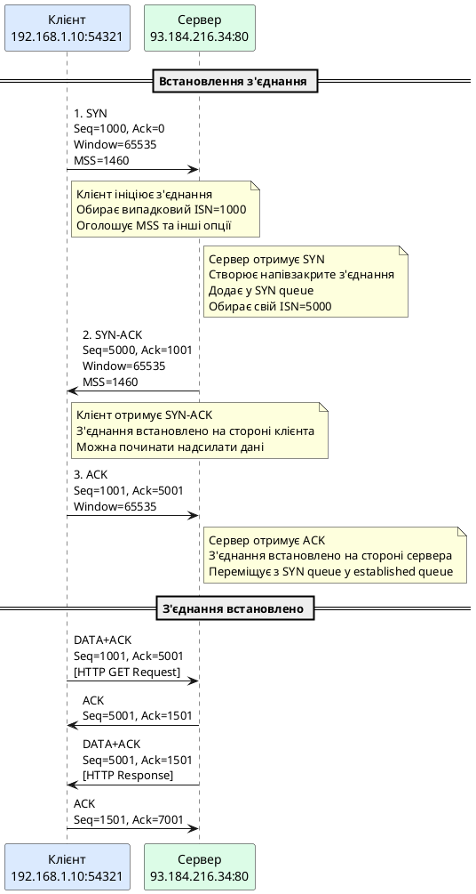
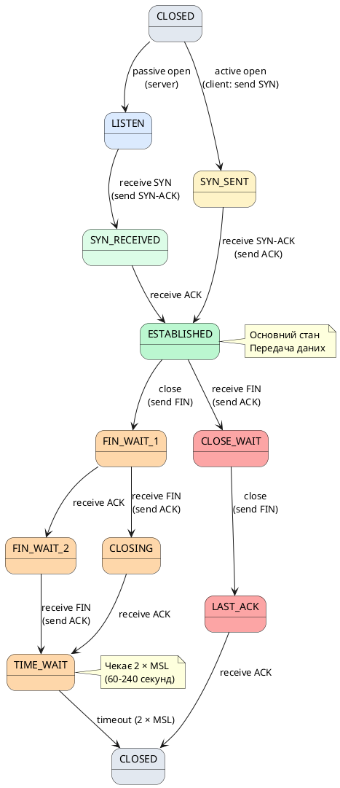

# Протоколи TCP та UDP

::card-group

::card{title="🎯 Мета розділу" icon="i-lucide-target"}

- Глибоко зрозуміти роль транспортного рівня у стеку TCP/IP.
- Опанувати структуру та механізми роботи протоколу TCP: встановлення з'єднання, контроль потоку, виявлення та виправлення помилок, завершення з'єднання.
- Вивчити протокол UDP: коли та чому використовується ненадійна передача без встановлення з'єднання.
- Зрозуміти компроміси між надійністю та продуктивністю при виборі транспортного протоколу.
- Навчитися аналізувати поведінку TCP у реальних мережах через утиліти діагностики.
- Застосовувати отримані знання для оптимізації вебзастосунків та вирішення мережевих проблем.

::

::card{title="🔑 Ключові терміни" icon="i-lucide-key"}

- **TCP (Transmission Control Protocol):** надійний, орієнтований на з'єднання протокол транспортного рівня з гарантованою доставкою, контролем потоку та виправленням помилок.
- **UDP (User Datagram Protocol):** швидкий, ненадійний протокол без встановлення з'єднання, що мінімізує overhead.
- **Three-Way Handshake:** процес встановлення TCP-з'єднання (SYN → SYN-ACK → ACK).
- **Sequence Number:** порядковий номер байта даних у TCP-потоці для гарантування правильного порядку.
- **Acknowledgment (ACK):** підтвердження отримання даних.
- **Window Size:** розмір вікна прийому для контролю потоку даних.
- **Congestion Control:** механізми запобігання перевантаження мережі (Slow Start, Congestion Avoidance).
- **Retransmission:** повторна передача втрачених сегментів.

::

::

---

## Транспортний рівень: місце у стеку протоколів

У попередніх розділах ми розглянули, як IP-протокол мережевого рівня забезпечує **адресацію** та **маршрутизацію** пакетів між хостами через складні мережі. Проте IP надає лише **ненадійну доставку без встановлення з'єднання** (*best-effort delivery*): пакети можуть втрачатися, дублюватися, приходити в неправильному порядку. IP не має концепції "з'єднання" між застосунками, не перевіряє цілісність даних (окрім контрольної суми заголовка).

**Транспортний рівень** (Transport Layer у OSI, Transport Layer у TCP/IP) надбудовується над IP та вирішує ці проблеми, надаючи:

1. **Мультиплексування/демультиплексування** між застосунками через порти.
2. **Виявлення та виправлення помилок** (у TCP).
3. **Контроль потоку** для запобігання перевантаження приймача (у TCP).
4. **Контроль перевантаження** для запобігання перевантаження мережі (у TCP).
5. **Надійну доставку** з гарантованим порядком (у TCP).

**Два основні протоколи транспортного рівня:**

- **TCP** (*Transmission Control Protocol*) — надійний, орієнтований на з'єднання.
- **UDP** (*User Datagram Protocol*) — швидкий, ненадійний, без встановлення з'єднання.

### Розташування у стеку TCP/IP

```
┌─────────────────────────────────────┐
│   Application Layer                 │ ← HTTP, FTP, SMTP, DNS
│   (Додатки)                         │
├─────────────────────────────────────┤
│   Transport Layer                   │ ← TCP, UDP ★ (ми тут!)
│   (Транспортний рівень)             │
├─────────────────────────────────────┤
│   Internet Layer                    │ ← IP, ICMP, ARP
│   (Мережевий рівень)                │
├─────────────────────────────────────┤
│   Link Layer                        │ ← Ethernet, Wi-Fi
│   (Канальний рівень)                │
└─────────────────────────────────────┘
```

**Інкапсуляція даних:**

```
[Application Data: "GET /index.html HTTP/1.1"]
        ↓ додає TCP заголовок
[TCP Header | Application Data]  ← TCP-сегмент
        ↓ додає IP заголовок
[IP Header | TCP Header | Application Data]  ← IP-пакет
        ↓ додає Ethernet заголовок
[Eth Header | IP Header | TCP Header | Application Data | Eth Trailer]  ← Ethernet-кадр
        ↓
Фізичний рівень (біти по дротах/хвилях)
```

### Чому потрібні два протоколи?

Різні застосунки мають різні вимоги:

**TCP — коли важлива надійність:**
- Вебсторінки (HTTP/HTTPS)
- Електронна пошта (SMTP, IMAP, POP3)
- Передача файлів (FTP, SFTP)
- SSH, Telnet
- Бази даних

**UDP — коли важлива швидкість:**
- Відеоконференції (Zoom, Skype)
- Онлайн-ігри
- Потокове відео/аудіо (live streaming)
- DNS-запити
- VoIP (голосові дзвінки)
- IoT сенсори

::note
**Не існує "кращого" протоколу** — тільки підходящий для конкретної задачі. TCP жертвує швидкістю заради надійності, UDP жертвує надійністю заради швидкості. Вибір залежить від типу застосунку та його толерантності до втрат даних.
::

---

## TCP: Transmission Control Protocol

### Основні характеристики TCP

**TCP** — це протокол транспортного рівня, розроблений Вінтоном Серфом та Робертом Каном у 1974 році як частина Internet Protocol Suite. TCP забезпечує **надійну, впорядковану, перевірену на помилки доставку потоку байтів** між застосунками.

**Ключові властивості TCP:**

✓ **Connection-Oriented (орієнтований на з'єднання):**
Перед передачею даних TCP встановлює з'єднання через three-way handshake (SYN → SYN-ACK → ACK). Після завершення роботи з'єднання коректно закривається (FIN → ACK, FIN → ACK).

✓ **Reliable Delivery (надійна доставка):**
Кожен байт даних має порядковий номер (sequence number). Приймач підтверджує отримання (acknowledgment). Якщо підтвердження не приходить — відправник повторно надсилає дані (retransmission).

✓ **Ordered Delivery (впорядкована доставка):**
Навіть якщо IP-пакети приходять у неправильному порядку, TCP збирає їх у правильній послідовності завдяки sequence numbers.

✓ **Error Detection (виявлення помилок):**
Контрольна сума (checksum) для всього сегмента (заголовок + дані) виявляє пошкодження під час передачі.

✓ **Flow Control (контроль потоку):**
Приймач повідомляє відправнику розмір свого буфера (window size), щоб не перевантажувати повільного приймача.

✓ **Congestion Control (контроль перевантаження):**
Відправник динамічно змінює швидкість передачі на основі сигналів мережі (втрати пакетів, затримки) для запобігання перевантаження.

✓ **Full-Duplex (повнодуплексний):**
Після встановлення з'єднання дані можуть передаватися в обох напрямках одночасно.

✓ **Stream-Oriented (потоковий):**
TCP сприймає дані як **безперервний потік байтів** без меж повідомлень. Застосунок може надіслати 1000 байт, а TCP може розділити їх на сегменти довільного розміру (залежно від MSS).

::warning
**TCP не зберігає межі повідомлень!**

Якщо застосунок надсилає три повідомлення: `"Hello"`, `"World"`, `"!"`, приймач може отримати їх як:
- `"HelloWorld!"` (три повідомлення об'єднані)
- `"Hell"`, `"oWor"`, `"ld!"` (розділені довільно)
- `"Hello"`, `"World!"` (два об'єднані)

Протоколи прикладного рівня (HTTP, FTP) повинні самі визначати межі повідомлень через:
- Роздільники (HTTP використовує `\r\n\r\n` для кінця заголовків)
- Довжину повідомлення в заголовку (`Content-Length` у HTTP)
- Закриття з'єднання (застаріла практика)
::

### Структура TCP-сегмента

TCP інкапсулює дані з прикладного рівня у **TCP-сегменти** з детальним заголовком.

**Мінімальний розмір TCP-заголовка:** 20 байт (без опцій)
**Максимальний розмір TCP-заголовка:** 60 байт (з опціями)

**Схема TCP-заголовка:**

```
 0                   1                   2                   3
 0 1 2 3 4 5 6 7 8 9 0 1 2 3 4 5 6 7 8 9 0 1 2 3 4 5 6 7 8 9 0 1
+-+-+-+-+-+-+-+-+-+-+-+-+-+-+-+-+-+-+-+-+-+-+-+-+-+-+-+-+-+-+-+-+
|          Source Port          |       Destination Port        |
+-+-+-+-+-+-+-+-+-+-+-+-+-+-+-+-+-+-+-+-+-+-+-+-+-+-+-+-+-+-+-+-+
|                        Sequence Number                        |
+-+-+-+-+-+-+-+-+-+-+-+-+-+-+-+-+-+-+-+-+-+-+-+-+-+-+-+-+-+-+-+-+
|                    Acknowledgment Number                      |
+-+-+-+-+-+-+-+-+-+-+-+-+-+-+-+-+-+-+-+-+-+-+-+-+-+-+-+-+-+-+-+-+
| Offset| Rsvd |     Flags     |            Window             |
+-+-+-+-+-+-+-+-+-+-+-+-+-+-+-+-+-+-+-+-+-+-+-+-+-+-+-+-+-+-+-+-+
|           Checksum            |         Urgent Pointer        |
+-+-+-+-+-+-+-+-+-+-+-+-+-+-+-+-+-+-+-+-+-+-+-+-+-+-+-+-+-+-+-+-+
|                    Options (if Offset > 5)                    |
+-+-+-+-+-+-+-+-+-+-+-+-+-+-+-+-+-+-+-+-+-+-+-+-+-+-+-+-+-+-+-+-+
|                             Data                              |
+-+-+-+-+-+-+-+-+-+-+-+-+-+-+-+-+-+-+-+-+-+-+-+-+-+-+-+-+-+-+-+-+
```

{.diagram-img}

### Опис полів TCP-заголовка

#### 1. Source Port (16 біт)
Порт відправника (0-65535).

**Приклад:** Клієнт використовує випадковий порт `54321` для з'єднання з вебсервером.

#### 2. Destination Port (16 біт)
Порт одержувача (0-65535).

**Приклад:** Вебсервер слухає на порті `80` (HTTP) або `443` (HTTPS).

**Комбінація (Source IP:Port, Destination IP:Port, Protocol)** унікально ідентифікує TCP-з'єднання (5-tuple).

#### 3. Sequence Number (32 біти)
**Порядковий номер першого байта даних** у цьому сегменті.

TCP нумерує **кожен байт** даних у потоці. Якщо відправник надсилає 1000 байт, а наступний сегмент містить 500 байт, sequence numbers будуть:
- Сегмент 1: Seq=100, дані: байти 100-1099
- Сегмент 2: Seq=1100, дані: байти 1100-1599

**Початковий Sequence Number (ISN):**
При встановленні з'єднання кожна сторона обирає **випадковий** ISN (не починає з 0!) для безпеки.

**Навіщо випадковий ISN?**
- Захист від **hijacking** атак (злочинець не може легко вгадати наступний sequence number)
- Уникнення конфліктів зі старими з'єднаннями (якщо TCP-з'єднання перевстановлюється швидко)

**Приклад:**
```
Клієнт обирає ISN = 1000
Клієнт надсилає SYN з Seq=1000

Сервер обирає ISN = 5000
Сервер відповідає SYN-ACK з Seq=5000, Ack=1001

Клієнт надсилає перші 100 байт даних з Seq=1001
Сервер підтверджує Ack=1101 ("очікую байт 1101")
```

#### 4. Acknowledgment Number (32 біти)
**Наступний очікуваний байт** від відправника.

Якщо приймач отримав байти 0-999 (Seq=0, довжина 1000), він відповідає Ack=1000 ("очікую байт 1000 і далі").

**ACK є кумулятивним:** Ack=5000 означає "отримав усі байти до 5000, очікую 5000 і далі". Це спрощує протокол, але може призвести до повторних передач, якщо втрачено один сегмент посередині.

**Приклад проблеми:**
```
Відправник надсилає:
  Сегмент 1: Seq=0, довжина 1000 (байти 0-999)
  Сегмент 2: Seq=1000, довжина 1000 (байти 1000-1999)
  Сегмент 3: Seq=2000, довжина 1000 (байти 2000-2999)

Сегмент 2 втрачено у мережі.

Приймач отримує сегменти 1 та 3:
  - Сегмент 1 отримано → Ack=1000
  - Сегмент 3 отримано, але є розрив → продовжує відправляти Ack=1000

Відправник бачить Ack=1000 тричі (duplicate ACK) → повторно надсилає сегмент 2
```

**Вирішення:** **SACK (Selective Acknowledgment)** — опція TCP, що дозволяє вибірково підтверджувати отримані діапазони (розглянемо далі).

#### 5. Data Offset / Header Length (4 біти)
Довжина TCP-заголовка у **32-бітних словах** (як IHL у IP).

- Мінімум: `5` (5 × 4 = 20 байт)
- Максимум: `15` (15 × 4 = 60 байт)

**Навіщо:** TCP-заголовок має змінну довжину через опціональні поля (Options). Data Offset вказує, де закінчується заголовок і починаються дані.

#### 6. Reserved (3 біти)
Зарезервовано для майбутнього використання, завжди `0`.

#### 7. Flags / Control Bits (9 біт)

TCP використовує **флаги** для контролю стану з'єднання та передачі даних:

| Біт | Назва | Призначення |
|:---:|:---|:---|
| **NS** | ECN-nonce | Захист від підробки ECN (рідко використовується) |
| **CWR** | Congestion Window Reduced | Відправник зменшив congestion window (ECN) |
| **ECE** | ECN-Echo | Повідомлення про перевантаження (ECN) |
| **URG** | Urgent | Urgent Pointer має значення (рідко використовується) |
| **ACK** | Acknowledgment | Acknowledgment Number дійсний (встановлюється у всіх сегментах після встановлення з'єднання) |
| **PSH** | Push | Негайно передати дані застосунку (не буферизувати) |
| **RST** | Reset | Скинути з'єднання (аварійне закриття) |
| **SYN** | Synchronize | Встановлення з'єднання (синхронізація Sequence Numbers) |
| **FIN** | Finish | Нормальне завершення з'єднання |

**Найчастіше використовувані флаги:**

- **SYN:** перший крок three-way handshake (встановлення з'єднання)
- **ACK:** підтвердження отримання даних (встановлений у всіх сегментах після handshake)
- **FIN:** ініціювання закриття з'єднання
- **RST:** аварійне закриття (помилка, відмова, атака)
- **PSH:** запит на негайну доставку (застосунок хоче отримати дані без затримки)

**Комбінації флагів:**

```
SYN           → Запит на встановлення з'єднання
SYN+ACK       → Підтвердження запиту на з'єднання
ACK           → Підтвердження даних (нормальна передача)
FIN+ACK       → Запит на закриття з'єднання з підтвердженням попередніх даних
RST           → Скидання з'єднання без коректного закриття
```

#### 8. Window Size (16 біт)
**Розмір вікна прийому** — кількість байтів, яку приймач готовий прийняти (розмір вільного буфера).

**Контроль потоку (Flow Control):**
Якщо приймач повільно обробляє дані, його буфер заповнюється. Приймач зменшує Window Size у відповідях, сповіщаючи відправника: "Надсилай менше даних!".

**Приклад:**
```
Сервер має буфер 64 KB (65536 байт)
  → Window=65536

Застосунок повільно читає дані, буфер заповнено на 50%
  → Window=32768

Буфер майже повний (залишилось 1 KB)
  → Window=1024

Буфер повний
  → Window=0 ("зупинися, не надсилай більше!")
```

**Window Scale Option:** Оскільки 16 біт дозволяють максимум 65535 байт (64 KB), для високошвидкісних мереж це замало. **TCP Window Scaling** (RFC 1323) дозволяє множити Window Size на коефіцієнт (до 1 GB вікно).

#### 9. Checksum (16 біт)
**Контрольна сума** для виявлення помилок у **заголовку та даних** TCP-сегмента.

**Важливо:** На відміну від IP checksum (тільки заголовок), TCP checksum покриває **весь сегмент** (заголовок + дані). Це виявляє пошкодження даних під час передачі.

**Псевдозаголовок:** TCP checksum також включає частину IP-заголовка (Source IP, Destination IP, Protocol) для додаткової перевірки, що сегмент доставлено правильному одержувачу.

#### 10. Urgent Pointer (16 біт)
Вказує на останній байт "термінових" даних (якщо встановлений флаг URG).

**Історично:** використовувався для Telnet (Ctrl+C для переривання команди). **Сучасність:** майже не використовується, багато реалізацій TCP ігнорують це поле.

#### 11. Options (змінна довжина, 0-40 байт)
Опціональні поля для розширення функціональності TCP:

**Найпоширеніші опції:**

- **MSS (Maximum Segment Size):** максимальний розмір даних у сегменті (без заголовків). Оголошується під час handshake.
  ```
  Приклад: MSS=1460 (для MTU 1500: 1500 - 20 IP - 20 TCP = 1460)
  ```

- **Window Scale:** множник для Window Size (дозволяє вікна більші за 64 KB).
  ```
  Приклад: Window Scale=7 → Window Size множиться на 2^7 = 128
  ```

- **SACK Permitted:** дозволяє Selective Acknowledgment (вибіркове підтвердження).

- **SACK:** вказує діапазони отриманих байтів (при втраті проміжного сегмента).
  ```
  Приклад: "Отримав байти 0-999 та 2000-2999, чекаю 1000-1999"
  ```

- **Timestamps:** мітки часу для вимірювання RTT (Round-Trip Time) та захисту від старих дублікатів.

**Приклад опцій у SYN-пакеті:**
```
Options: (20 байт)
  - MSS: 1460
  - SACK Permitted
  - Timestamps: TSval=123456789, TSecr=0
  - Window Scale: 7
```

---

## Three-Way Handshake: встановлення TCP-з'єднання

Перед передачею даних TCP встановлює **з'єднання** через процес, відомий як **three-way handshake** (триетапне рукостискання).

### Навіщо потрібне встановлення з'єднання?

1. **Синхронізація Sequence Numbers:** обидві сторони повідомляють свої початкові sequence numbers (ISN).
2. **Узгодження параметрів:** MSS, Window Scale, SACK тощо.
3. **Перевірка доступності:** підтвердження, що обидві сторони готові та можуть обмінюватися даними.

### Процес Three-Way Handshake

```
Клієнт                               Сервер
  │                                     │
  │  1. SYN (Seq=X)                    │
  │───────────────────────────────────>│
  │                                     │
  │                                     │ (Сервер отримує SYN,
  │                                     │  створює з'єднання)
  │                                     │
  │  2. SYN-ACK (Seq=Y, Ack=X+1)       │
  │<───────────────────────────────────│
  │                                     │
  │ (Клієнт отримує SYN-ACK,           │
  │  з'єднання встановлено)            │
  │                                     │
  │  3. ACK (Seq=X+1, Ack=Y+1)         │
  │───────────────────────────────────>│
  │                                     │
  │                                     │ (Сервер отримує ACK,
  │                                     │  з'єднання встановлено)
  │                                     │
  │  ═══════════════════════════════   │
  │     Передача даних (DATA+ACK)      │
  │  ═══════════════════════════════   │
```

{.diagram-img}

### Деталізація кожного кроку:

#### Крок 1: Клієнт → Сервер (SYN)

Клієнт ініціює з'єднання, надсилаючи TCP-сегмент з встановленим флагом **SYN**.

**Заголовок SYN-сегмента:**
```
Source Port: 54321 (випадковий клієнтський порт)
Destination Port: 80 (HTTP-сервер)
Sequence Number: 1000 (випадковий ISN клієнта)
Acknowledgment Number: 0 (ще немає даних для підтвердження)
Flags: SYN
Window Size: 65535 (розмір буфера клієнта)
Options:
  - MSS: 1460
  - Window Scale: 7
  - SACK Permitted
  - Timestamps: TSval=123456789, TSecr=0
```

**Що відбувається на сервері:**
- Операційна система отримує SYN-пакет.
- Перевіряє, чи слухає процес на порті 80.
- Якщо так → створює напівзакрите з'єднання (half-open) та додає у **SYN queue**.
- Якщо ні → надсилає RST (відмова з'єднання).

#### Крок 2: Сервер → Клієнт (SYN-ACK)

Сервер відповідає сегментом з флагами **SYN+ACK**.

**Заголовок SYN-ACK сегмента:**
```
Source Port: 80
Destination Port: 54321
Sequence Number: 5000 (випадковий ISN сервера)
Acknowledgment Number: 1001 (ISN клієнта + 1)
Flags: SYN, ACK
Window Size: 65535 (розмір буфера сервера)
Options:
  - MSS: 1460
  - Window Scale: 7
  - SACK Permitted
  - Timestamps: TSval=987654321, TSecr=123456789
```

**Що означає Ack=1001:**
"Отримав твій SYN з Seq=1000, очікую наступний байт 1001".

**Що означає Seq=5000:**
Сервер оголошує свій початковий sequence number для даних, які він надсилатиме.

#### Крок 3: Клієнт → Сервер (ACK)

Клієнт підтверджує SYN сервера, надсилаючи сегмент з флагом **ACK**.

**Заголовок ACK-сегмента:**
```
Source Port: 54321
Destination Port: 80
Sequence Number: 1001 (наступний байт клієнта)
Acknowledgment Number: 5001 (ISN сервера + 1)
Flags: ACK
Window Size: 65535
```

**З'єднання встановлено!** Обидві сторони знають:
- Початкові sequence numbers одне одного
- Розміри вікон прийому
- Підтримувані опції (MSS, SACK, Timestamps)

**Тепер можна передавати дані** в обох напрямках одночасно (full-duplex).

::plant-uml{alt="Three-Way Handshake"}



::

---


### Затримка handshake: вплив на продуктивність

**Three-way handshake додає затримку** перед передачею даних:

```
Час встановлення з'єднання = 1.5 × RTT
```

**Пояснення:**
- Крок 1 (SYN): клієнт → сервер (0.5 RTT)
- Крок 2 (SYN-ACK): сервер → клієнт (0.5 RTT)
- Крок 3 (ACK) + перші дані: клієнт → сервер (0.5 RTT)

**Приклад:**
```
RTT до сервера: 100 ms

Handshake: 150 ms
Передача даних: починається після 150 ms

Для короткого HTTP-запиту (наприклад, API):
  - Handshake: 150 ms
  - Запит + відповідь: 50 ms
  - Закриття з'єднання: 100 ms
  Всього: 300 ms, з яких 83% — накладні витрати!
```

**Оптимізація:**

1. **Keep-Alive (постійні з'єднання):**
   HTTP/1.1 за замовчуванням тримає з'єднання відкритим для множини запитів.
   ```
   З'єднання встановлено один раз → використовується для 10 запитів
   Економія: 9 × 150 ms = 1350 ms
   ```

2. **TCP Fast Open (TFO):**
   Дозволяє надсилати дані вже у SYN-пакеті (експериментальна опція).
   ```
   Звичайний TCP: SYN → SYN-ACK → ACK+DATA (1.5 RTT)
   TCP Fast Open: SYN+DATA → SYN-ACK+DATA (1 RTT)
   ```

3. **HTTP/2 та HTTP/3:**
   - HTTP/2: мультиплексування множини запитів через одне TCP-з'єднання
   - HTTP/3: використовує QUIC поверх UDP (без handshake взагалі для повторних з'єднань)

### SYN Flood атака: загроза безпеці

**SYN Flood** — це DDoS-атака, що експлуатує механізм three-way handshake.

**Як працює атака:**

```
Атакуючий надсилає тисячі SYN-пакетів з підробленими IP-адресами
  ↓
Сервер створює напівзакриті з'єднання (half-open) для кожного SYN
  ↓
Сервер відповідає SYN-ACK на неіснуючі адреси (відповідей ніколи не приходить)
  ↓
SYN queue переповнюється
  ↓
Легітимні клієнти НЕ можуть встановити з'єднання
```

**Діаграма атаки:**

```
Атакуючий (підроблені IP)          Сервер
  │                                    │
  │ SYN (від 1.2.3.4)                 │
  │──────────────────────────────────>│ Додає у SYN queue
  │ SYN (від 5.6.7.8)                 │
  │──────────────────────────────────>│ Додає у SYN queue
  │ SYN (від 9.10.11.12)              │
  │──────────────────────────────────>│ Додає у SYN queue
  │ ... (тисячі SYN)                  │
  │                                    │ SYN queue повна!
                                       │
Легітимний клієнт                     │
  │ SYN                                │
  │──────────────────────────────────>│ Відмова (queue повна)
  │                              RST <─┤
```

**Захист від SYN Flood:**

**1. SYN Cookies:**
Сервер НЕ зберігає стан з'єднання після отримання SYN. Натомість кодує інформацію у Sequence Number SYN-ACK.

```
Нормальний режим:
  SYN → створює запис у SYN queue → SYN-ACK

SYN Cookies:
  SYN → обчислює спеціальний Seq у SYN-ACK → SYN-ACK
  (жодних записів у пам'яті!)
  
  ACK → декодує Seq, перевіряє валідність → створює з'єднання
```

**Переваги:** SYN queue не переповнюється.
**Недоліки:** втрата деяких TCP-опцій (Window Scale, SACK), трохи більше CPU.

**2. Rate Limiting:**
Обмеження кількості нових з'єднань з одного IP за секунду.

```bash
# iptables (Linux)
iptables -A INPUT -p tcp --syn -m limit --limit 10/s --limit-burst 20 -j ACCEPT
iptables -A INPUT -p tcp --syn -j DROP
```

**3. Збільшення розміру SYN queue:**
```bash
# Linux
sysctl -w net.ipv4.tcp_max_syn_backlog=8192
```

**4. Firewall та IDS/IPS:**
Виявлення та блокування джерел атаки.

**5. Використання CDN та DDoS-захисту:**
Cloudflare, Akamai тощо фільтрують трафік перед вашим сервером.

---

## Передача даних: надійна доставка

Після встановлення з'єднання TCP передає дані з гарантованою доставкою та порядком.

### Механізм підтверджень (ACK)

Кожен байт даних має **Sequence Number**. Приймач підтверджує отримання через **Acknowledgment Number**.

**Приклад передачі:**

```
Відправник                            Приймач
  │                                      │
  │ DATA: Seq=1001, Len=1000            │
  │ (байти 1001-2000)                   │
  │─────────────────────────────────────>│
  │                                      │ Отримано байти 1001-2000
  │                                      │
  │                         ACK: Ack=2001│
  │<─────────────────────────────────────│
  │                                      │ "Очікую байт 2001"
  │                                      │
  │ DATA: Seq=2001, Len=1000            │
  │ (байти 2001-3000)                   │
  │─────────────────────────────────────>│
  │                                      │
  │                         ACK: Ack=3001│
  │<─────────────────────────────────────│
```

**Ключові моменти:**

- **ACK є кумулятивним:** Ack=3001 означає "отримав всі байти до 3001".
- **Delayed ACK:** Приймач може затримувати ACK до 200 ms або до отримання двох сегментів (економія bandwidth).
- **Piggybacking:** ACK часто "їде" разом з даними у зворотному напрямку.

### Повторна передача (Retransmission)

Якщо відправник НЕ отримує ACK протягом певного часу (**RTO — Retransmission Timeout**), він повторно надсилає дані.

**Приклад втрати пакету:**

```
Відправник                            Приймач
  │                                      │
  │ DATA: Seq=1001, Len=1000            │
  │─────────────────────────────────────>│
  │                                      │ Отримано
  │                         ACK: Ack=2001│
  │<─────────────────────────────────────│
  │                                      │
  │ DATA: Seq=2001, Len=1000            │
  │──────────X (втрачено у мережі)      │
  │                                      │
  │ DATA: Seq=3001, Len=1000            │
  │─────────────────────────────────────>│
  │                                      │ Розрив! Чекаю 2001
  │                         ACK: Ack=2001│
  │<─────────────────────────────────────│ Duplicate ACK
  │                                      │
  │ (timeout або 3 duplicate ACKs)      │
  │                                      │
  │ RETRANSMIT: Seq=2001, Len=1000      │
  │─────────────────────────────────────>│
  │                                      │ Отримано, тепер маю 2001-3000
  │                                      │
  │                         ACK: Ack=4001│
  │<─────────────────────────────────────│ Підтверджую все до 4001
```

**Два механізми retransmission:**

**1. Timeout-Based Retransmission:**
Якщо ACK не приходить протягом RTO → повторна передача.

**RTO обчислюється динамічно** на основі вимірюваного RTT:
```
RTT (Round-Trip Time) — час туди-назад для сегмента

RTO = RTT + 4 × RTT_variance
```

Якщо мережа повільна (великий RTT), RTO більший.
Якщо мережа швидка, RTO менший.

**2. Fast Retransmit:**
Якщо приймач надсилає **3 duplicate ACK** (той самий Ack тричі підряд) → відправник НЕ чекає timeout, негайно повторно надсилає.

```
Приймач отримує: Seq=1001, Seq=3001, Seq=4001
Всі три рази відповідає: Ack=2001 (чекає Seq=2001)

Відправник бачить:
  Ack=2001 (перший раз)
  Ack=2001 (другий раз — duplicate ACK #1)
  Ack=2001 (третій раз — duplicate ACK #2)
  Ack=2001 (четвертий раз — duplicate ACK #3)
  
→ Fast Retransmit: негайно повторно надсилає Seq=2001
```

**Переваги Fast Retransmit:**
- Швидше відновлення (не чекає timeout)
- Менший вплив на throughput

### SACK: Selective Acknowledgment

**Проблема кумулятивних ACK:**
Якщо втрачено один сегмент, всі наступні НЕ підтверджуються, навіть якщо отримані.

**Приклад:**
```
Відправлено: Seq=1000, Seq=2000, Seq=3000, Seq=4000
Втрачено: Seq=2000
Отримано: Seq=1000, Seq=3000, Seq=4000

Без SACK:
  Приймач надсилає Ack=2000
  Відправник повторно надсилає Seq=2000, Seq=3000, Seq=4000
  (повторна передача зайвих даних!)

З SACK:
  Приймач надсилає Ack=2000 + SACK: 3000-5000
  Відправник повторно надсилає ТІЛЬКИ Seq=2000
  (ефективніше!)
```

**Формат SACK опції:**
```
SACK: Left Edge=3000, Right Edge=5000
  → "Отримав байти 3000-4999"
```

**SACK узгоджується під час handshake:**
```
SYN: SACK Permitted
SYN-ACK: SACK Permitted
→ Обидві сторони підтримують SACK
```

---

## Контроль потоку (Flow Control)

**Мета:** Запобігти перевантаженню **приймача** (повільний приймач не встигає обробляти дані).

**Механізм:** **Sliding Window** (ковзне вікно) — приймач повідомляє розмір свого вільного буфера через **Window Size**.

### Як працює Sliding Window

**Приймач має буфер** для тимчасового зберігання даних до їх обробки застосунком.

```
Буфер приймача (розмір 10000 байт):
┌────────────────────────────────────┐
│░░░░░░░░│                           │
│ Read   │  Available (Window Size)  │
│        │                           │
└────────────────────────────────────┘
  ↑
Застосунок читає дані повільно
```

**Window Size** у кожному ACK вказує, скільки ще байтів можна надіслати.

**Приклад:**

```
Відправник                            Приймач (буфер 10000)
  │                                      │
  │ DATA: Seq=1, Len=5000               │
  │─────────────────────────────────────>│ Буфер: 5000 зайнято
  │                                      │
  │            ACK: Ack=5001, Win=5000  │
  │<─────────────────────────────────────│ "Можеш надіслати ще 5000"
  │                                      │
  │ DATA: Seq=5001, Len=5000            │
  │─────────────────────────────────────>│ Буфер: повний (10000)
  │                                      │
  │             ACK: Ack=10001, Win=0   │
  │<─────────────────────────────────────│ "Зупинись! Буфер повний"
  │                                      │
  │ (відправник чекає, поки Win > 0)    │
  │                                      │
  │                                      │ Застосунок читає 3000
  │                                      │ Буфер: 7000 зайнято
  │                                      │
  │            ACK: Ack=10001, Win=3000 │
  │<─────────────────────────────────────│ "Можеш надіслати 3000"
  │                                      │
  │ DATA: Seq=10001, Len=3000           │
  │─────────────────────────────────────>│
```

**Zero Window Probe:**
Якщо приймач оголошує Win=0, відправник періодично надсилає **Zero Window Probe** (1 байт даних) для перевірки, чи звільнився буфер.

{.diagram-img}

### Window Scaling

**Проблема:** Window Size — 16 біт → максимум 65535 байт (64 KB).

Для високошвидкісних мереж (1 Gbps+) це замало:

```
Bandwidth-Delay Product (BDP) = Bandwidth × RTT

Приклад:
  Bandwidth: 100 Mbps
  RTT: 100 ms
  BDP = 100 Mbps × 0.1 s = 10 Mb = 1.25 MB

Без Window Scaling: максимум 64 KB у "польоті"
→ Використання каналу: 64 KB / 1.25 MB = 5% (!!)
```

**Рішення: Window Scale Option**

Узгоджується під час handshake, множить Window Size на 2^scale:

```
Window Scale = 7
Window Size у пакеті = 1000
Реальне вікно = 1000 × 2^7 = 128,000 байт
```

**Максимальне вікно з Window Scale:**
```
16 біт × 2^14 = 1 GB
```

::tip
**Перевірка Window Scaling:**
```bash
# Linux: чи увімкнено Window Scaling
sysctl net.ipv4.tcp_window_scaling

# Wireshark: перевірити опції у SYN/SYN-ACK пакетах
Фільтр: tcp.flags.syn == 1
Шукайте: TCP Option - Window Scale
```
::

---

## Контроль перевантаження (Congestion Control)

**Мета:** Запобігти перевантаженню **мережі** (маршрутизатори не встигають обробляти трафік).

**Відмінність від Flow Control:**
- **Flow Control:** захист приймача (повільний приймач)
- **Congestion Control:** захист мережі (повільна/перевантажена мережа)

### Сигнали перевантаження

TCP визначає перевантаження мережі через:

1. **Втрату пакетів** (timeout або duplicate ACKs) — основний індикатор
2. **Збільшення RTT** — затримки у мережі зростають
3. **ECN (Explicit Congestion Notification)** — маршрутизатори явно повідомляють про перевантаження

### Congestion Window (CWND)

На додачу до Window Size (від приймача), відправник підтримує власне **Congestion Window (CWND)** — скільки байтів можна надіслати без перевантаження мережі.

**Фактичне вікно передачі:**
```
Effective Window = min(CWND, Receiver Window)
```

**Приклад:**
```
Receiver Window = 64 KB (оголошено приймачем)
CWND = 32 KB (обчислено відправником на основі стану мережі)
→ Effective Window = 32 KB
```

### Алгоритми Congestion Control

#### 1. Slow Start

При встановленні нового з'єднання TCP НЕ знає, скільки мережа може витримати. Починає з **малого CWND** та **експоненційно збільшує** його.

```
Початковий CWND = 1 MSS (зазвичай 1460 байт)
                   або 10 MSS (RFC 6928, сучасний стандарт)

Кожен отриманий ACK збільшує CWND:
  CWND += MSS

Результат:
  RTT 1: CWND = 1 MSS → надсилає 1 сегмент
  RTT 2: CWND = 2 MSS → надсилає 2 сегменти
  RTT 3: CWND = 4 MSS → надсилає 4 сегменти
  RTT 4: CWND = 8 MSS → надсилає 8 сегментів
  ...
  (подвоюється кожен RTT)
```

**Чому "Slow" Start?** Історично це було повільніше за попередні реалізації. Сучасними мірками це досить агресивне зростання (експоненційне).

**Коли зупиняється Slow Start:**
- Досягнуто **SSThresh** (Slow Start Threshold) → переходить у Congestion Avoidance
- Виявлено втрату пакету → зменшує CWND

#### 2. Congestion Avoidance

Після досягнення SSThresh TCP переходить у **Congestion Avoidance** — повільніше зростання CWND.

```
Кожен RTT (коли отримано ACK для всього вікна):
  CWND += MSS

Результат:
  RTT 1: CWND = 10 MSS
  RTT 2: CWND = 11 MSS
  RTT 3: CWND = 12 MSS
  ...
  (лінійне зростання)
```

{.diagram-img}

#### 3. Fast Recovery

При виявленні втрати (3 duplicate ACKs):

```
1. SSThresh = CWND / 2
2. CWND = SSThresh + 3 MSS
3. Кожен наступний duplicate ACK: CWND += MSS
4. Після отримання нового ACK: CWND = SSThresh
5. Повернення до Congestion Avoidance
```

**Візуалізація алгоритмів:**

```
CWND
 │
 │         ╱╲                    ╱╲
 │        ╱  ╲                  ╱  ╲
 │       ╱    ╲                ╱    ╲
 │      ╱      ╲              ╱      ╲
 │     ╱        ╲            ╱        ╲
 │    ╱          ╲          ╱          ╲
 │   ╱    CA      ╲        ╱    CA      ╲
 │  ╱              ╲      ╱              ╲
 │ ╱ SS             ╲    ╱ SS             ╲
 │╱                  ╲  ╱                  ╲
 └───────────────────────────────────────────> Час
    ↑                ↑  ↑
    Початок          │  │
                 Втрата │
                 (3 dup)│
                        Новий ACK

SS = Slow Start (експоненційне зростання)
CA = Congestion Avoidance (лінійне зростання)
```

### Варіанти алгоритмів Congestion Control

Існує кілька реалізацій, оптимізованих для різних сценаріїв:

**TCP Reno** (класичний):
- Slow Start → Congestion Avoidance → Fast Recovery

**TCP Cubic** (за замовчуванням у Linux):
- Оптимізований для високошвидкісних мереж з великими RTT
- Зростання CWND залежить від часу з моменту останньої втрати (кубічна функція)

**TCP BBR** (Bottleneck Bandwidth and RTT, Google):
- Активно вимірює bandwidth та RTT
- Намагається утримувати канал заповненим, але не перевантаженим
- Краще працює у мережах з втратами (Wi-Fi, мобільні мережі)

**Перевірка активного алгоритму:**
```bash
# Linux
sysctl net.ipv4.tcp_congestion_control

# Доступні алгоритми
sysctl net.ipv4.tcp_available_congestion_control

# Змінити на BBR
sudo sysctl -w net.ipv4.tcp_congestion_control=bbr
```

---


## Завершення TCP-з'єднання

TCP підтримує **коректне закриття з'єднання** (graceful shutdown) через обмін FIN-флагами.

### Four-Way Termination (чотириетапне завершення)

Оскільки TCP — full-duplex (дані йдуть в обох напрямках), кожен напрямок закривається окремо.

```
Клієнт                               Сервер
  │                                     │
  │  1. FIN (Seq=X)                    │
  │───────────────────────────────────>│
  │                                     │ "Клієнт завершив надсилання"
  │                                     │
  │  2. ACK (Ack=X+1)                  │
  │<───────────────────────────────────│
  │                                     │ "Підтверджую FIN клієнта"
  │                                     │
  │                                     │ Сервер може ще надсилати дані
  │                                     │
  │  3. FIN (Seq=Y)                    │
  │<───────────────────────────────────│
  │                                     │ "Сервер завершив надсилання"
  │                                     │
  │  4. ACK (Ack=Y+1)                  │
  │───────────────────────────────────>│
  │                                     │ "Підтверджую FIN сервера"
  │                                     │
  │  TIME_WAIT (2 × MSL)               │
  │                                     │ CLOSED
  │                                     │
  │  CLOSED                             │
```

{.diagram-img}

### Деталізація кроків:

#### Крок 1: Клієнт → Сервер (FIN)

Клієнт завершив надсилання даних, надсилає **FIN**.

```
Flags: FIN, ACK
Seq: X (останній байт даних + 1)
Ack: Y (підтвердження останніх даних від сервера)
```

**Стан клієнта:** FIN_WAIT_1 ("чекаю підтвердження мого FIN")

#### Крок 2: Сервер → Клієнт (ACK)

Сервер підтверджує FIN клієнта.

```
Flags: ACK
Ack: X+1 ("отримав твій FIN")
```

**Стан клієнта:** FIN_WAIT_2 ("FIN підтверджено, чекаю FIN сервера")
**Стан сервера:** CLOSE_WAIT ("клієнт закрився, але я ще можу надсилати")

::note
**Напівзакрите з'єднання (Half-Close):**
Після кроків 1-2 клієнт НЕ може надсилати дані, але **сервер може продовжувати** надсилати дані клієнту. Це корисно для протоколів, де клієнт надсилає запит, закриває свою сторону, а сервер надсилає велику відповідь.

**Приклад:** FTP DATA з'єднання — клієнт надсилає команду, закриває свою сторону, сервер надсилає файл.
::

#### Крок 3: Сервер → Клієнт (FIN)

Коли сервер завершив надсилання даних, він надсилає свій **FIN**.

```
Flags: FIN, ACK
Seq: Y
Ack: X+1
```

**Стан сервера:** LAST_ACK ("надіслав FIN, чекаю підтвердження")

#### Крок 4: Клієнт → Сервер (ACK)

Клієнт підтверджує FIN сервера.

```
Flags: ACK
Ack: Y+1 ("отримав твій FIN")
```

**Стан клієнта:** TIME_WAIT (чекає 2 × MSL перед остаточним закриттям)
**Стан сервера:** CLOSED (з'єднання закрито)

### TIME_WAIT стан

**Чому клієнт НЕ закривається відразу після надсилання останнього ACK?**

Клієнт чекає **2 × MSL** (Maximum Segment Lifetime, зазвичай 2 × 30s = 60s або 2 × 120s = 240s) з двох причин:

1. **Гарантувати доставку останнього ACK:**
   Якщо останній ACK втрачено, сервер повторно надішле FIN. Клієнт повинен бути готовий відповісти.

2. **Уникнути конфліктів зі старими сегментами:**
   Старі сегменти, що "блукають" у мережі, можуть прибути після закриття. TIME_WAIT гарантує, що вони вже не існують перед повторним використанням портів.

**Проблема TIME_WAIT:**
Кожне з'єднання у TIME_WAIT займає ресурси (порт + запис у таблиці). Для високонавантажених серверів це може бути проблемою.

**Приклад:**
```
Клієнт робить 1000 запитів/с до сервера
Кожне з'єднання у TIME_WAIT 60 с
→ 60,000 з'єднань у TIME_WAIT одночасно!
→ Вичерпання портів (максимум 65535)
```

**Рішення:**
1. **Keep-Alive:** повторне використання з'єднання
2. **Збільшення local port range:**
   ```bash
   sysctl -w net.ipv4.ip_local_port_range="1024 65535"
   ```
3. **TCP_TW_REUSE:** дозволяє повторне використання портів у TIME_WAIT (обережно!)
   ```bash
   sysctl -w net.ipv4.tcp_tw_reuse=1
   ```

### Аварійне закриття (RST)

**RST** (Reset) — негайне закриття з'єднання **без коректного handshake**.

**Коли надсилається RST:**

1. **Підключення до закритого порту:**
   ```
   Клієнт: SYN → порт 12345
   Сервер: RST ← "ніхто не слухає на цьому порті"
   ```

2. **Некоректний сегмент:**
   ```
   Отримано сегмент з невідомим з'єднанням (порт або Seq не збігаються)
   → RST
   ```

3. **Примусове закриття застосунком:**
   ```c
   // C: замість close() використовується SO_LINGER з timeout=0
   setsockopt(sock, SOL_SOCKET, SO_LINGER, ...)
   close(sock); // надсилає RST замість FIN
   ```

4. **Firewall або Security:**
   ```
   Firewall блокує з'єднання → надсилає RST
   ```

**Відмінності FIN vs RST:**

| Характеристика | FIN (Graceful) | RST (Abortive) |
|:---|:---|:---|
| Handshake | Так (4 кроки) | Ні (1 пакет) |
| Буферизовані дані | Доставляються | Відкидаються |
| TIME_WAIT | Так | Ні |
| Використання | Нормальне закриття | Помилки, атаки, примусове закриття |

::plant-uml{alt="TCP Connection Lifecycle"}



::

---

## UDP: User Datagram Protocol

### Основні характеристики UDP

**UDP** — це мінімалістичний протокол транспортного рівня, що надає **ненадійну доставку датаграм без встановлення з'єднання**.

**Ключові властивості UDP:**

✗ **Connectionless (без встановлення з'єднання):**
Немає handshake, немає стану з'єднання. Кожна датаграма незалежна.

✗ **Unreliable (ненадійна доставка):**
Немає підтверджень, немає повторних передач. Датаграми можуть втрачатися, дублюватися, приходити у неправильному порядку.

✗ **No Flow Control:**
Відправник не знає, чи приймач готовий отримувати дані.

✗ **No Congestion Control:**
UDP не реагує на перевантаження мережі (може погіршувати ситуацію).

✓ **Low Overhead:**
Мінімальний заголовок (8 байт проти 20+ у TCP), немає handshake, немає підтверджень.

✓ **Message-Oriented:**
UDP зберігає межі повідомлень. Якщо надіслано датаграму 100 байт, приймач отримає саме 100 байт (або нічого, якщо втрачено).

✓ **Fast:**
Немає затримок на handshake, підтвердження, повторні передачі.

✓ **Broadcast/Multicast:**
UDP підтримує надсилання одного пакета багатьом одержувачам.

### Структура UDP-датаграми

UDP має **найпростіший заголовок** серед транспортних протоколів.

**Схема UDP-заголовка:**

```
 0                   1                   2                   3
 0 1 2 3 4 5 6 7 8 9 0 1 2 3 4 5 6 7 8 9 0 1 2 3 4 5 6 7 8 9 0 1
+-+-+-+-+-+-+-+-+-+-+-+-+-+-+-+-+-+-+-+-+-+-+-+-+-+-+-+-+-+-+-+-+
|          Source Port          |       Destination Port        |
+-+-+-+-+-+-+-+-+-+-+-+-+-+-+-+-+-+-+-+-+-+-+-+-+-+-+-+-+-+-+-+-+
|            Length             |           Checksum            |
+-+-+-+-+-+-+-+-+-+-+-+-+-+-+-+-+-+-+-+-+-+-+-+-+-+-+-+-+-+-+-+-+
|                             Data                              |
+-+-+-+-+-+-+-+-+-+-+-+-+-+-+-+-+-+-+-+-+-+-+-+-+-+-+-+-+-+-+-+-+
```

**Всього 8 байт заголовка!

{.diagram-img}**

### Опис полів UDP-заголовка

#### 1. Source Port (16 біт)
Порт відправника (необов'язковий, може бути 0, якщо відповідь не потрібна).

#### 2. Destination Port (16 біт)
Порт одержувача (обов'язковий).

#### 3. Length (16 біт)
Довжина **всієї датаграми** (заголовок + дані) у байтах.

```
Мінімум: 8 байт (тільки заголовок без даних)
Максимум: 65535 байт (обмеження 16 біт)
```

**Практичне обмеження:**
```
MTU 1500 байт:
  - IP заголовок: 20 байт
  - UDP заголовок: 8 байт
  = Максимум даних: 1472 байти (без фрагментації)
```

#### 4. Checksum (16 біт)
Контрольна сума для заголовка та даних.

**Важливо:**
- **У IPv4:** checksum опціональна (може бути 0, якщо не обчислена)
- **У IPv6:** checksum **обов'язкова** (IPv6 не має checksum у IP-заголовку)

**Псевдозаголовок:** Як і TCP, UDP checksum включає частину IP-заголовка (Source/Destination IP, Protocol).

### Коли використовувати UDP

**UDP підходить, коли:**

✓ **Втрати даних прийнятні:**
- Потокове відео/аудіо (Netflix, YouTube Live, Twitch)
- VoIP (Skype, Zoom, Discord)
- Онлайн-ігри (CS:GO, Fortnite, League of Legends)

✓ **Потрібна низька затримка:**
- Реального часу застосунки (trading, ставки)
- IoT сенсори (температура, вологість кожну секунду)

✓ **Короткі запити/відповіді:**
- DNS (один запит → одна відповідь, легко повторити)
- DHCP (отримання IP-адреси)
- NTP (синхронізація часу)

✓ **Broadcast/Multicast:**
- IPTV, стрімінг спортивних подій
- Автоматичне виявлення пристроїв (SSDP, mDNS)

✓ **Власний контроль надійності на прикладному рівні:**
- QUIC (HTTP/3) — надійність реалізована поверх UDP
- Власні протоколи з вибірковою повторною передачею

**UDP НЕ підходить, коли:**

✗ Критична цілісність даних (передача файлів, фінансові транзакції)
✗ Гарантована доставка (електронна пошта, HTTP запити)
✗ Велика кількість даних, що потребує впорядкування

### Приклад використання UDP: DNS

**Чому DNS використовує UDP?**

1. **Короткий запит/відповідь:**
   ```
   Запит: "Яка IP для google.com?" (< 512 байт)
   Відповідь: "142.250.185.78" (< 512 байт)
   ```

2. **Низька затримка:**
   ```
   TCP: Handshake (1.5 RTT) + Запит/Відповідь (1 RTT) = 2.5 RTT
   UDP: Запит/Відповідь (1 RTT) = 1 RTT
   
   Для RTT=50ms:
   TCP: 125 ms
   UDP: 50 ms
   ```

3. **Легко повторити:**
   Якщо відповідь не прийшла протягом timeout (зазвичай 5 с) → повторити запит.

4. **Stateless сервер:**
   DNS-сервер НЕ тримає стан з'єднань → може обслуговувати мільйони запитів/с.

**Проте:**
Для великих відповідей (> 512 байт, наприклад, DNSSEC) DNS використовує **TCP** або **EDNS0** (розширення UDP до 4096 байт).

### Приклад використання UDP: QUIC (HTTP/3)

**QUIC** (Quick UDP Internet Connections) — сучасний протокол від Google, що використовується у **HTTP/3**.

**Чому QUIC побудований поверх UDP?**

1. **Уникнення ossification TCP:**
   TCP складно модифікувати (middleboxes, NAT, firewalls очікують стандартну поведінку).
   UDP — гнучкіший, дозволяє інновації на прикладному рівні.

2. **Швидше встановлення з'єднання:**
   ```
   TCP+TLS: 2-3 RTT (TCP handshake + TLS handshake)
   QUIC: 0-1 RTT (0 RTT для повторних з'єднань!)
   ```

3. **Краща обробка втрат:**
   QUIC має вбудовану надійність (як TCP), але з кращими механізмами (незалежні потоки).

4. **Мультиплексування без head-of-line blocking:**
   У TCP втрата одного сегмента блокує всі наступні дані.
   У QUIC кожен HTTP-запит — окремий потік, втрата в одному НЕ блокує інші.

**Структура:**
```
HTTP/3 (Application Layer)
    ↓
QUIC (Transport-like, але на Application Layer)
    ↓
UDP (Transport Layer)
    ↓
IP (Internet Layer)
```

{.diagram-img}

::note
**QUIC — це не просто UDP!**
QUIC реалізує власні механізми:
- Надійність (acknowledgments, retransmissions)
- Контроль потоку
- Контроль перевантаження
- Шифрування (вбудоване, на відміну від TCP+TLS)

Це більше схоже на "TCP 2.0 поверх UDP" з покращеннями.
::

---

## TCP vs UDP: детальне порівняння

| Характеристика | TCP | UDP |
|:---|:---|:---|
| **З'єднання** | Connection-oriented (handshake) | Connectionless |
| **Надійність** | Надійна (ACK, retransmission) | Ненадійна (best-effort) |
| **Порядок** | Гарантується (Seq Numbers) | Не гарантується |
| **Виявлення помилок** | Checksum (обов'язково) | Checksum (опціонально у IPv4) |
| **Контроль потоку** | Так (Window Size) | Ні |
| **Контроль перевантаження** | Так (Slow Start, AIMD) | Ні |
| **Розмір заголовка** | 20-60 байт | 8 байт |
| **Overhead** | Високий (handshake, ACK) | Низький |
| **Швидкість** | Повільніше (затримки на підтвердження) | Швидше |
| **Затримка встановлення** | 1.5 RTT (handshake) | 0 RTT |
| **Межі повідомлень** | Не зберігаються (stream) | Зберігаються (datagram) |
| **Broadcast/Multicast** | Ні | Так |
| **Приклади протоколів** | HTTP/1.1, HTTP/2, SMTP, FTP, SSH | DNS, DHCP, VoIP, QUIC, NTP |
| **Use Case** | Надійна передача даних | Реального часу, низька затримка |

{.diagram-img}

### Вибір між TCP та UDP: сценарії

**Використовуйте TCP, якщо:**
- ✓ Кожен байт даних критичний (фінанси, бази даних, файли)
- ✓ Потрібен порядок (відео не в реальному часі, текстові дані)
- ✓ З'єднання довготривале (веб-застосунки, SSH)
- ✓ Контроль перевантаження важливий (не хочете перевантажувати мережу)

**Використовуйте UDP, якщо:**
- ✓ Деякі втрати прийнятні (live streaming, ігри)
- ✓ Низька затримка критична (VoIP, trading)
- ✓ Короткі запити/відповіді (DNS, DHCP)
- ✓ Потрібен broadcast/multicast (автоматичне виявлення)
- ✓ Реалізуєте власну надійність (QUIC, власні протоколи)

**Гібридні підходи:**
- **QUIC/HTTP/3:** Надійність TCP + Швидкість UDP
- **WebRTC:** UDP з вибірковою повторною передачею
- **Streaming з буфером:** UDP для передачі, буфер компенсує втрати

---


## Практична діагностика TCP/UDP

### Перегляд активних з'єднань

**Linux/macOS:**
```bash
# Всі TCP з'єднання
netstat -tan

# Тільки ESTABLISHED
netstat -tan | grep ESTABLISHED

# З процесами (потребує root)
sudo netstat -tanp

# Сучасна альтернатива: ss
ss -tan               # TCP
ss -uan               # UDP
ss -tan state established  # Тільки встановлені
ss -tanp              # З процесами
```

**Windows:**
```powershell
# Всі з'єднання
netstat -an

# З процесами
netstat -anb

# TCP тільки
netstat -an -p tcp

# UDP тільки
netstat -an -p udp
```

**Приклад виводу netstat:**
```
Proto Recv-Q Send-Q Local Address           Foreign Address         State
tcp        0      0 192.168.1.100:54321     93.184.216.34:80        ESTABLISHED
tcp        0      0 192.168.1.100:54322     1.1.1.1:443             TIME_WAIT
tcp        0      0 0.0.0.0:22              0.0.0.0:*               LISTEN
udp        0      0 0.0.0.0:68              0.0.0.0:*               -
```

**Пояснення полів:**
- **Recv-Q:** Байти у буфері прийому (якщо > 0 → застосунок повільно читає)
- **Send-Q:** Байти у буфері відправки (якщо > 0 → мережа повільна або приймач повільний)
- **Local Address:** IP:порт локального хоста
- **Foreign Address:** IP:порт віддаленого хоста
- **State:** Стан TCP-з'єднання (LISTEN, ESTABLISHED, TIME_WAIT тощо)

### Перегляд відкритих портів

```bash
# Які порти слухаються (Linux/macOS)
sudo lsof -iTCP -sTCP:LISTEN -n -P
sudo lsof -iUDP -n -P

# ss (швидше за netstat)
ss -tuln
  # -t: TCP
  # -u: UDP
  # -l: listening
  # -n: числові адреси (без DNS lookup)
```

**Приклад виводу lsof:**
```
COMMAND   PID USER   FD   TYPE DEVICE SIZE/OFF NODE NAME
sshd     1234 root    3u  IPv4  12345      0t0  TCP *:22 (LISTEN)
nginx    5678 www     6u  IPv4  23456      0t0  TCP *:80 (LISTEN)
nginx    5678 www     7u  IPv4  23457      0t0  TCP *:443 (LISTEN)
```

### Захоплення та аналіз TCP/UDP трафіку

**tcpdump:**
```bash
# Захопити TCP трафік на порт 80
sudo tcpdump -i any 'tcp port 80'

# Захопити UDP трафік на порт 53 (DNS)
sudo tcpdump -i any 'udp port 53'

# Показати ASCII вміст пакетів
sudo tcpdump -i any 'tcp port 80' -A

# Показати hex dump
sudo tcpdump -i any 'tcp port 80' -X

# Зберегти у файл для Wireshark
sudo tcpdump -i any 'tcp port 80' -w capture.pcap
```

**Wireshark фільтри:**
```
# TCP з'єднання з конкретним хостом
tcp.stream eq 0

# Тільки SYN пакети (встановлення з'єднань)
tcp.flags.syn == 1 && tcp.flags.ack == 0

# Тільки retransmissions
tcp.analysis.retransmission

# UDP на порт 53
udp.port == 53

# Великі TCP Window Size
tcp.window_size > 60000
```

### Тестування з'єднань

**Перевірка доступності TCP-порту:**
```bash
# telnet (традиційний спосіб)
telnet google.com 80

# nc (netcat) — сучасніша утиліта
nc -zv google.com 80
  # -z: scan mode (не надсилає дані)
  # -v: verbose

# nmap (сканування портів)
nmap -p 80,443 google.com
```

**Надсилання UDP-датаграми:**
```bash
# nc для UDP
echo "test message" | nc -u 8.8.8.8 53

# Тестування UDP-порту (складніше, бо немає підтверджень)
nc -zuv 8.8.8.8 53
```

**Вимірювання throughput:**
```bash
# iperf3 — утиліта для тестування пропускної здатності

# На сервері:
iperf3 -s

# На клієнті (TCP за замовчуванням):
iperf3 -c server_ip

# UDP з певною швидкістю:
iperf3 -c server_ip -u -b 10M
  # -u: UDP
  # -b: bandwidth (10 Mbps)
```

### Діагностика проблем TCP

**Проблема 1: З'єднання не встановлюється**

**Симптоми:**
```bash
telnet google.com 80
Trying 93.184.216.34...
# Зависає або "Connection refused"
```

**Діагностика:**
```bash
# 1. Перевірка доступності хоста
ping google.com

# 2. Traceroute до хоста
traceroute google.com

# 3. Захоплення SYN/SYN-ACK
sudo tcpdump -i any 'tcp and host google.com'

# Шукайте:
# - SYN без SYN-ACK → firewall блокує або порт закритий
# - SYN-ACK без ACK → проблема на клієнті
# - RST → порт закритий
```

**Проблема 2: Повільна передача даних**

**Симптоми:**
```
Завантаження файлу займає набагато довше, ніж очікувалося
```

**Діагностика:**
```bash
# 1. Перевірка RTT
ping target_host
# Високий RTT (> 200 ms) → проблема мережі

# 2. Перевірка втрат пакетів
ping -c 100 target_host
# Packet loss > 1% → проблема якості мережі

# 3. Аналіз TCP у Wireshark:
# Шукайте:
# - Duplicate ACKs → втрата пакетів
# - Small Window Size → проблема приймача
# - Retransmissions → нестабільна мережа
# - Long Time to ACK → затримки

# 4. Перевірка congestion control:
ss -tin
# Шукайте cwnd (congestion window)
```

**Проблема 3: Багато з'єднань у TIME_WAIT**

**Симптоми:**
```bash
netstat -tan | grep TIME_WAIT | wc -l
# Результат: 10000+ з'єднань
```

**Рішення:**
```bash
# 1. Увімкнути TCP tw_reuse (Linux)
sudo sysctl -w net.ipv4.tcp_tw_reuse=1

# 2. Зменшити timeout TIME_WAIT (обережно!)
sudo sysctl -w net.ipv4.tcp_fin_timeout=30

# 3. Збільшити діапазон портів
sudo sysctl -w net.ipv4.ip_local_port_range="1024 65535"

# 4. Використовувати Keep-Alive (HTTP/1.1)
# Повторне використання з'єднання замість створення нового
```

---

## Підсумок

Протоколи транспортного рівня TCP та UDP є фундаментальними для роботи Інтернету та вебзастосунків, надаючи різні компроміси між надійністю та продуктивністю.

**Ключові висновки:**

**TCP (Transmission Control Protocol):**
- ✓ Надійна, впорядкована доставка з гарантованою цілісністю
- ✓ Three-way handshake для встановлення з'єднання (SYN → SYN-ACK → ACK)
- ✓ Sequence Numbers та Acknowledgments для відстеження кожного байта
- ✓ Flow Control (Window Size) запобігає перевантаженню приймача
- ✓ Congestion Control (Slow Start, AIMD, Cubic, BBR) запобігає перевантаженню мережі
- ✓ Retransmission механізми (timeout-based, fast retransmit) відновлюють втрачені дані
- ✓ SACK (Selective Acknowledgment) ефективніше обробляє втрати
- ✓ Graceful shutdown (Four-Way Termination) коректно закриває з'єднання
- ✗ Overhead: handshake (1.5 RTT), підтвердження, великий заголовок (20-60 байт)
- ✗ Head-of-line blocking: втрата одного сегмента блокує весь потік

**UDP (User Datagram Protocol):**
- ✓ Мінімальний overhead (8 байт заголовок, без handshake)
- ✓ Низька затримка (без підтверджень, без затримок на повторні передачі)
- ✓ Зберігає межі повідомлень (message-oriented)
- ✓ Підтримує broadcast та multicast
- ✗ Ненадійна доставка (без гарантій, без порядку)
- ✗ Немає контролю потоку та перевантаження
- ✗ Застосунок повинен сам обробляти втрати та дублікати

**Вибір протоколу:**
- **TCP:** Веб (HTTP/1.1, HTTP/2), електронна пошта, передача файлів, бази даних, SSH
- **UDP:** Streaming (відео/аудіо), онлайн-ігри, VoIP, DNS, DHCP, IoT
- **Гібридні (UDP з надійністю):** QUIC (HTTP/3), WebRTC, власні протоколи

**Оптимізація TCP:**
- Використання Keep-Alive для повторного використання з'єднань
- TCP Fast Open для зменшення затримки handshake (експериментально)
- Window Scaling для високошвидкісних мереж
- Вибір congestion control алгоритму (Cubic, BBR) залежно від сценарію
- MSS Clamping для уникнення фрагментації

**Діагностика:**
- `netstat` / `ss` — перегляд активних з'єднань та портів
- `tcpdump` / `Wireshark` — захоплення та аналіз пакетів
- `iperf3` — вимірювання throughput
- Аналіз станів TCP (ESTABLISHED, TIME_WAIT, CLOSE_WAIT)
- Виявлення проблем: втрати пакетів, повільна передача, вичерпання портів

У наступних розділах ми розглянемо протоколи прикладного рівня (HTTP, DNS, SMTP, WebSocket), що працюють поверх TCP та UDP, використовуючи надані ними можливості для реалізації складної функціональності.

---

## Контрольні питання для самоперевірки

1. Яку роль виконує транспортний рівень у стеку TCP/IP? Які основні функції він надає?
2. Опишіть структуру TCP-сегмента. Які основні поля містить TCP-заголовок?
3. Що таке Sequence Number та Acknowledgment Number? Як вони використовуються для гарантування порядку та надійності?
4. Поясніть процес three-way handshake. Які флаги використовуються на кожному кроці?
5. Чому TCP використовує випадковий Initial Sequence Number (ISN)? Які загрози це запобігає?
6. Що таке SYN Flood атака? Як працює захист через SYN Cookies?
7. Яка різниця між Flow Control та Congestion Control? Які механізми TCP використовує для кожного?
8. Опишіть, як працює Sliding Window для контролю потоку. Що означає Window Size у TCP-заголовку?
9. Що таке Window Scale опція? Навіщо вона потрібна для високошвидкісних мереж?
10. Поясніть алгоритми Congestion Control: Slow Start, Congestion Avoidance, Fast Recovery.
11. Що таке Congestion Window (CWND)? Як воно відрізняється від Receiver Window?
12. Які два механізми retransmission має TCP? Опишіть timeout-based та fast retransmit.
13. Що таке SACK (Selective Acknowledgment)? Яку проблему він вирішує?
14. Опишіть процес four-way termination для коректного закриття TCP-з'єднання.
15. Що таке TIME_WAIT стан і навіщо він потрібен? Яку проблему він створює для високонавантажених серверів?
16. У чому різниця між FIN (graceful shutdown) та RST (abortive close)?
17. Опишіть структуру UDP-датаграми. Чому UDP-заголовок такий простий (8 байт)?
18. Які основні відмінності між TCP та UDP? Коли варто використовувати кожен з них?
19. Чому DNS зазвичай використовує UDP? Коли DNS використовує TCP?
20. Що таке QUIC протокол? Чому HTTP/3 побудований поверх UDP, а не TCP?
21. Як TCP зберігає (чи не зберігає) межі повідомлень? Чому це важливо для прикладних протоколів?
22. Які проблеми можуть виникнути через відсутність контролю перевантаження у UDP?
23. Як діагностувати проблему з TCP-з'єднанням (не встановлюється, повільне, багато TIME_WAIT)?
24. Які команди використовуються для перегляду активних TCP/UDP з'єднань у Linux та Windows?

---

## Додаткові матеріали для поглибленого вивчення

::card-group

::card{title="📖 Рекомендована література" icon="i-lucide-book-open"}

**Книги:**
- W. Richard Stevens. *TCP/IP Illustrated, Volume 1.* — Addison-Wesley, 2011. (Розділи 17-24: детальний розгляд TCP та UDP).
- Kevin R. Fall, W. Richard Stevens. *TCP/IP Illustrated, Volume 2.* — Addison-Wesley, 1995. (Реалізація TCP/IP у BSD Unix).

**RFC документи:**
- RFC 793 — Transmission Control Protocol (TCP) — офіційна специфікація
- RFC 768 — User Datagram Protocol (UDP)
- RFC 2581 — TCP Congestion Control
- RFC 5681 — TCP Congestion Control (оновлена версія)
- RFC 2018 — TCP Selective Acknowledgment (SACK)
- RFC 7323 — TCP Extensions for High Performance (Window Scale, Timestamps)
- RFC 9000 — QUIC: A UDP-Based Multiplexed and Secure Transport

::

::card{title="🛠️ Практичні інструменти" icon="i-lucide-wrench"}

**Діагностика з'єднань:**
```bash
# Перегляд активних з'єднань
netstat -tan             # Linux/macOS/Windows
ss -tan                  # Linux (сучасна альтернатива)
lsof -iTCP -sTCP:LISTEN  # Відкриті порти (Linux/macOS)

# Тестування портів
nc -zv host port         # netcat
telnet host port         # telnet
nmap -p 80,443 host      # nmap
```

**Захоплення трафіку:**
```bash
# tcpdump
sudo tcpdump -i any 'tcp port 80'
sudo tcpdump -i any 'udp port 53'

# Wireshark (GUI)
# Фільтри:
tcp.stream eq 0
tcp.analysis.retransmission
tcp.flags.syn == 1
```

**Тестування продуктивності:**
```bash
# iperf3 — throughput testing
iperf3 -s              # сервер
iperf3 -c server_ip    # клієнт TCP
iperf3 -c server_ip -u # клієнт UDP
```

**Налаштування TCP (Linux):**
```bash
# Перегляд параметрів
sysctl -a | grep tcp

# Congestion control алгоритм
sysctl net.ipv4.tcp_congestion_control

# Window Scaling
sysctl net.ipv4.tcp_window_scaling

# SYN queue розмір
sysctl net.ipv4.tcp_max_syn_backlog

# TIME_WAIT параметри
sysctl net.ipv4.tcp_tw_reuse
sysctl net.ipv4.tcp_fin_timeout
```

::

::card{title="🎓 Онлайн ресурси" icon="i-lucide-graduation-cap"}

**Інтерактивні інструменти:**
- [PacketLife TCP/IP Cheat Sheets](https://packetlife.net/library/cheat-sheets/) — шпаргалки по TCP/IP
- [TCP State Diagram](https://www4.cs.fau.de/Projects/JX/Projects/TCP/tcpstate.html) — інтерактивна діаграма станів TCP

**Відео та курси:**
- *Computer Networking: A Top-Down Approach* (Kurose & Ross) — розділ 3: Transport Layer
- Coursera: "The Bits and Bytes of Computer Networking" (Google)

**Блоги та статті:**
- Cloudflare Learning Center: TCP vs UDP
- High Performance Browser Networking (Ilya Grigorik) — безкоштовна онлайн-книга

::

::card{title="🔬 Експерименти" icon="i-lucide-flask"}

**Практичні завдання:**

1. **Аналіз three-way handshake:**
   - Захопити SYN/SYN-ACK/ACK у Wireshark
   - Проаналізувати ISN, MSS, Window Scale опції

2. **Тестування retransmission:**
   - Симулювати втрату пакетів (tc, netem у Linux)
   - Спостерігати fast retransmit та timeout

3. **Порівняння TCP congestion control:**
   - Тестувати Cubic vs BBR з iperf3
   - Вимірювати throughput та latency

4. **UDP vs TCP продуктивність:**
   - Порівняти throughput UDP та TCP
   - Вплив RTT на продуктивність

::

::

