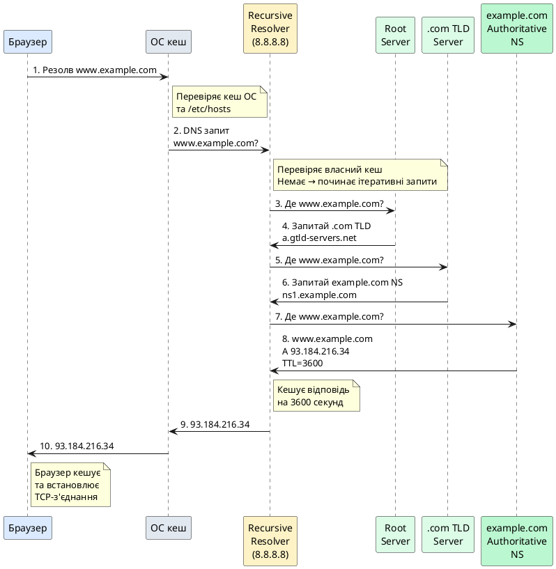

# Система доменних імен DNS

::card-group

::card{title="🎯 Мета розділу" icon="i-lucide-target"}

- Глибоко зрозуміти роль DNS як "телефонної книги" Інтернету.
- Опанувати ієрархічну структуру DNS: root, TLD, authoritative серверів.
- Вивчити процес резолвінгу доменних імен: рекурсивні та ітеративні запити.
- Освоїти типи DNS-записів (A, AAAA, CNAME, MX, TXT, NS, SOA) та їх застосування.
- Зрозуміти механізми кешування та TTL для оптимізації продуктивності.
- Навчитися діагностувати проблеми DNS через утиліти командного рядка.
- Застосовувати знання DNS для конфігурації доменів та вирішення мережевих проблем.

::

::card{title="🔑 Ключові терміни" icon="i-lucide-key"}

- **DNS (Domain Name System):** розподілена ієрархічна система для перекладу доменних імен у IP-адреси.
- **FQDN (Fully Qualified Domain Name):** повне доменне ім'я (наприклад, `www.example.com.`).
- **TLD (Top-Level Domain):** домен верхнього рівня (`.com`, `.org`, `.ua`).
- **Authoritative Name Server:** офіційний DNS-сервер, що володіє записами для конкретної зони.
- **Recursive Resolver:** DNS-сервер, що виконує повний процес резолвінгу від імені клієнта.
- **DNS Record:** запис у DNS (A, AAAA, CNAME, MX, TXT тощо).
- **TTL (Time To Live):** час, протягом якого DNS-запис може зберігатися у кеші.
- **Zone File:** файл, що містить DNS-записи для конкретної зони (домену).

::

::

---

## Навіщо потрібен DNS

### Проблема: IP-адреси незручні для людей

Комп'ютери ідентифікують один одного через **IP-адреси**:
```
IPv4: 142.250.185.78
IPv6: 2a00:1450:4001:82f::200e
```

Проте людям **незручно запам'ятовувати числа**:
- Важко запам'ятати `142.250.185.78`
- Неможливо запам'ятати `2a00:1450:4001:82f::200e`
- IP-адреси можуть змінюватися (сервер переїжджає, балансування навантаження)

**Рішення:** Використовувати **доменні імена** (domain names):
```
google.com        → легко запам'ятати
facebook.com      → зрозуміло, що це
stackoverflow.com → описове
```

### Рання спроба: файл /etc/hosts

**До DNS (до 1980-х):** Кожен комп'ютер мав **локальний файл** `/etc/hosts` (Unix) або `C:\Windows\System32\drivers\etc\hosts` (Windows) з відповідностями імен та IP.

**Приклад `/etc/hosts`:**
```
127.0.0.1       localhost
192.168.1.1     router.local
142.250.185.78  google.com www.google.com
```

**Проблеми цього підходу:**

1. **Не масштабується:**
   - Кожен комп'ютер повинен мати повний список усіх імен Інтернету
   - У 1980-х це був один файл `HOSTS.TXT`, що розповсюджувався вручну

2. **Складність оновлення:**
   - Якщо IP змінюється → треба оновити файл на всіх комп'ютерах
   - У ранньому Інтернеті це робилося раз на тиждень через FTP

3. **Конфлікти імен:**
   - Хто вирішує, що `apple.com` належить саме Apple Inc.?
   - Немає централізованого управління

**Рішення:** **Domain Name System (DNS)** — розподілена, ієрархічна, масштабована система.

### DNS як розподілена база даних

**DNS** — це глобальна розподілена база даних, що перекладає доменні імена у IP-адреси та інші ресурсні записи.

**Ключові властивості:**

✓ **Розподілена:** Немає одного центрального сервера. Дані розподілені між мільйонами DNS-серверів по всьому світу.

✓ **Ієрархічна:** Домени організовані у дерево (root → TLD → domain → subdomain).

✓ **Кешована:** Результати запитів кешуються на різних рівнях для швидкості.

✓ **Надлишкова:** Множина серверів для кожної зони (відмовостійкість).

✓ **Масштабована:** Обслуговує мільярди запитів на секунду глобально.

**Аналогія:** DNS — це як глобальна телефонна книга, де замість пошуку номера телефону за іменем людини, ми шукаємо IP-адресу за доменним ім'ям.

---

## Ієрархія DNS

DNS організовано як **дерево** з root на вершині та доменами, що розгалужуються вниз.

### Структура FQDN (Fully Qualified Domain Name)

**Приклад:** `www.example.com.`

Розберемо по частинах (справа наліво):

```
www.example.com.
│   │       │   │
│   │       │   └─── Root (порожній, але присутній)
│   │       └─────── Top-Level Domain (TLD)
│   └─────────────── Second-Level Domain (SLD)
└─────────────────── Subdomain (або hostname)
```

**Детальніше:**

1. **`.` (Root/Корінь):**
   - Верхівка ієрархії DNS
   - Зазвичай не пишеться, але технічно присутня (`www.example.com.` ← крапка в кінці)
   - 13 root name servers по всьому світу (a.root-servers.net до m.root-servers.net)

2. **`com` (TLD — Top-Level Domain):**
   - Домен верхнього рівня
   - Типи TLD:
     - **gTLD (Generic):** `.com`, `.org`, `.net`, `.edu`, `.gov`
     - **ccTLD (Country Code):** `.ua` (Україна), `.us` (США), `.uk` (Велика Британія)
     - **New gTLD:** `.app`, `.dev`, `.blog`, `.shop` (з 2013 року)

3. **`example` (SLD — Second-Level Domain):**
   - Ім'я домену, що реєструється користувачем
   - Унікальне в межах TLD (може існувати `example.com` та `example.org` окремо)

4. **`www` (Subdomain/Hostname):**
   - Піддомен або ім'я хоста
   - Може бути будь-яким: `mail.example.com`, `ftp.example.com`, `api.example.com`
   - Можна мати багаторівневі піддомени: `api.v2.staging.example.com`

### Візуалізація ієрархії DNS

```
                      . (Root)
                     /│\
        ┌───────────┘ │ └───────────┐
        │             │             │
       com           org           ua (ccTLD)
      /│\            │            /│\
   ┌─┘ │ └─┐        │         ┌─┘ │ └─┐
google example apple wikipedia gov co  com
   │     │     │       │       │   │    │
  www   www   www     www     www www  www
        /│\
       / │ \
     api mail ftp
```

**Приклад резолвінгу `www.example.com`:**

```
1. Root (.)         → "Де знайти .com?"
2. .com TLD         → "Де знайти example.com?"
3. example.com NS   → "Де знайти www.example.com?"
4. Authoritative    → "www.example.com = 93.184.216.34"
```

{.diagram-img}

---

## Root серверів DNS

**Root name servers** — це вершина ієрархії DNS, що знають, де знайти TLD name servers.

### 13 Root серверів (логічних)

Існує **13 логічних root серверів**, позначених літерами **a-m**:

```
a.root-servers.net (Verisign, США)
b.root-servers.net (USC-ISI, США)
c.root-servers.net (Cogent, США)
d.root-servers.net (University of Maryland, США)
e.root-servers.net (NASA, США)
f.root-servers.net (ISC, США)
g.root-servers.net (US DoD, США)
h.root-servers.net (US Army, США)
i.root-servers.net (Netnod, Швеція)
j.root-servers.net (Verisign, США)
k.root-servers.net (RIPE NCC, Нідерланди)
l.root-servers.net (ICANN, США)
m.root-servers.net (WIDE Project, Японія)
```

::note
**Чому саме 13?**
Історично це обмеження UDP-пакету розміром 512 байт (без EDNS0). У такий пакет поміщається 13 NS записів з IPv4 адресами. Сучасні реалізації використовують EDNS0 та можуть передавати більше.
::

### Anycast: багато фізичних серверів

Кожен з 13 логічних root серверів насправді — це **сотні фізичних серверів** по всьому світу через **Anycast** (одна IP-адреса, багато серверів).

**Приклад `a.root-servers.net`:**
```
IPv4: 198.41.0.4
IPv6: 2001:503:ba3e::2:30

Фізичні локації: 100+ дата-центрів по всьому світу
```

Коли ви надсилаєте запит до `198.41.0.4`, він автоматично направляється до **найближчого** фізичного сервера через маршрутизацію Anycast.

**Переваги Anycast:**
- Низька затримка (запит йде до найближчого сервера)
- Відмовостійкість (якщо один сервер падає, трафік йде до іншого)
- Розподіл навантаження

{.diagram-img}

### Що знають root серверів

Root серверів НЕ знають IP-адреси всіх доменів у світі. Вони знають тільки **TLD name servers**.

**Приклад запиту до root:**
```
Запит: "Де знайти www.example.com?"
Відповідь root: "Запитай TLD сервери для .com:
  a.gtld-servers.net (192.5.6.30)
  b.gtld-servers.net (192.33.14.30)
  ..."
```

---

## TLD Name Servers

**TLD name servers** знають, де знайти authoritative name servers для доменів другого рівня.

### Типи TLD

#### 1. Generic TLD (gTLD)

**Оригінальні gTLD (з 1985):**
```
.com — комерційні (найпопулярніший, 150+ млн доменів)
.org — організації
.net — мережеві провайдери
.edu — освітні установи (США)
.gov — урядові установи (США)
.mil — військові (США)
.int — міжнародні організації
```

**New gTLD (з 2013):**
```
.app — застосунки (Google)
.dev — розробники (Google)
.blog — блоги
.shop — інтернет-магазини
.tech — технології
.io — популярний серед стартапів (British Indian Ocean Territory ccTLD)
```

#### 2. Country Code TLD (ccTLD)

Двобуквені коди країн відповідно до ISO 3166:

```
.ua — Україна
.us — США
.uk — Велика Британія (технічно .gb, але .uk використовується)
.de — Німеччина (Deutschland)
.fr — Франція (France)
.jp — Японія (Japan)
.cn — Китай
.ru — Росія
```

**Спеціальні ccTLD:**
```
.tv — Тувалу (продається для відео-сайтів)
.io — Британська територія в Індійському океані (популярна для стартапів)
.me — Чорногорія (Montenegro) (популярна для особистих сайтів)
.ai — Ангілья (популярна для AI-компаній)
```

#### 3. Sponsored TLD (sTLD)

TLD з спеціальними вимогами:

```
.aero — авіаційна індустрія
.museum — музеї
.coop — кооперативи
.travel — туристична індустрія
```

### Хто управляє TLD

**ICANN** (Internet Corporation for Assigned Names and Numbers) — некомерційна організація, що координує DNS та розподіл TLD.

**Registry operators** управляють конкретними TLD:
```
.com, .net — Verisign
.org — Public Interest Registry (PIR)
.ua — Українська Асоціація Інтернет Провайдерів (UA-IX)
.app, .dev — Google Registry
```

**Registrars** (реєстратори) — компанії, через які користувачі реєструють домени:
```
GoDaddy, Namecheap, Google Domains, Cloudflare Registrar тощо
```

---

## Authoritative Name Servers

**Authoritative name servers** — це офіційні DNS-сервери, що володіють **zone file** (файлом зони) для конкретного домену.

### Що таке Zone File

**Zone file** — це текстовий файл з DNS-записами для домену.

**Приклад zone file для `example.com`:**
```dns
$ORIGIN example.com.
$TTL 86400    ; 24 години за замовчуванням

; SOA запис (Start of Authority)
@       IN      SOA     ns1.example.com. admin.example.com. (
                        2024010101  ; Serial (YYYYMMDDNN)
                        3600        ; Refresh (1 година)
                        1800        ; Retry (30 хвилин)
                        604800      ; Expire (7 днів)
                        86400       ; Minimum TTL (24 години)
                        )

; NS записи (Name Servers)
@       IN      NS      ns1.example.com.
@       IN      NS      ns2.example.com.

; A записи (IPv4)
@       IN      A       93.184.216.34
www     IN      A       93.184.216.34
mail    IN      A       93.184.216.35

; AAAA записи (IPv6)
@       IN      AAAA    2606:2800:220:1:248:1893:25c8:1946

; CNAME записи (Alias)
ftp     IN      CNAME   www.example.com.
blog    IN      CNAME   hosting-provider.com.

; MX записи (Mail Exchange)
@       IN      MX      10 mail.example.com.
@       IN      MX      20 mail2.example.com.

; TXT записи (Text)
@       IN      TXT     "v=spf1 include:_spf.example.com ~all"
_dmarc  IN      TXT     "v=DMARC1; p=quarantine; rua=mailto:dmarc@example.com"
```

{.diagram-img}

### Primary vs Secondary Name Servers

**Primary (Master) NS:**
- Містить оригінальний zone file
- Зміни робляться тут
- Зазвичай `ns1.example.com`

**Secondary (Slave) NS:**
- Отримує копію zone file з primary через **zone transfer** (AXFR/IXFR)
- Надає відмовостійкість
- Зазвичай `ns2.example.com`, `ns3.example.com`

**Як працює zone transfer:**
```
1. Secondary періодично запитує Primary (відповідно до SOA Refresh)
2. Порівнює Serial number у SOA
3. Якщо Serial збільшився → запитує повний zone transfer (AXFR)
   або інкрементальний (IXFR — тільки зміни)
4. Оновлює свою копію zone file
```

---

## Типи DNS-записів

DNS підтримує багато типів записів (resource records), кожен з яких має специфічне призначення.

### 1. A (Address) — IPv4 адреса

**Призначення:** Переклад доменного імені у IPv4-адресу.

**Формат:**
```dns
example.com.    IN    A    93.184.216.34
www.example.com. IN   A    93.184.216.34
```

**Використання:**
- Основний запис для доступу до вебсайтів
- Можна мати кілька A записів для балансування навантаження (Round-Robin DNS)

**Приклад з кількома A записами:**
```dns
example.com.    IN    A    192.0.2.1
example.com.    IN    A    192.0.2.2
example.com.    IN    A    192.0.2.3
```
DNS-сервер повертає всі три, клієнт вибирає випадково (або за порядком).

### 2. AAAA (IPv6 Address)

**Призначення:** Переклад доменного імені у IPv6-адресу.

**Формат:**
```dns
example.com.    IN    AAAA    2606:2800:220:1:248:1893:25c8:1946
```

**Чому "AAAA"?** IPv6 адреса у 4 рази довша за IPv4 (128 біт проти 32 біт), тому "AAAA" = A × 4.

**Dual-stack:** Домени часто мають і A, і AAAA записи для підтримки IPv4 та IPv6 клієнтів.

### 3. CNAME (Canonical Name) — Alias

**Призначення:** Створює псевдонім (alias) для іншого доменного імені.

**Формат:**
```dns
www.example.com.    IN    CNAME    example.com.
ftp.example.com.    IN    CNAME    files.hosting.com.
```

**Як працює:**
```
Запит: www.example.com
  ↓
DNS: "www.example.com це CNAME для example.com"
  ↓
Запит: example.com
  ↓
DNS: "example.com = 93.184.216.34"
  ↓
Результат: 93.184.216.34
```

**Обмеження CNAME:**
- НЕ може існувати на рівні root домену (apex)
  ```dns
  example.com.    IN    CNAME    other.com.    ❌ Заборонено!
  ```
  Причина: SOA та NS записи повинні існувати на apex, а CNAME виключає інші записи.

- НЕ може співіснувати з іншими записами того самого імені
  ```dns
  www.example.com.    IN    CNAME    example.com.
  www.example.com.    IN    A        93.184.216.34    ❌ Конфлікт!
  ```

**Використання:**
- Піддомени, що вказують на CDN: `cdn.example.com CNAME xyz.cloudfront.net`
- Редирект між доменами
- Спрощення управління (змінюєте A запис в одному місці, всі CNAME автоматично оновлюються)

### 4. MX (Mail Exchange) — Поштові сервери

**Призначення:** Вказує поштові сервери для домену.

**Формат:**
```dns
example.com.    IN    MX    10 mail1.example.com.
example.com.    IN    MX    20 mail2.example.com.
```

**Priority (пріоритет):** Число перед ім'ям сервера. Менше число = вищий пріоритет.

**Як працює надсилання email до `user@example.com`:**
```
1. Поштовий сервер запитує MX записи для example.com
2. Отримує:
   - mail1.example.com (priority 10)
   - mail2.example.com (priority 20)
3. Намагається з'єднатися з mail1.example.com (вищий пріоритет)
4. Якщо mail1 недоступний → пробує mail2.example.com
```

**Важливо:** MX запис вказує на **доменне ім'я**, а не на IP. Потім виконується додатковий запит для A/AAAA запису поштового сервера.

**Приклад конфігурації з Gmail:**
```dns
example.com.    IN    MX    1  aspmx.l.google.com.
example.com.    IN    MX    5  alt1.aspmx.l.google.com.
example.com.    IN    MX    5  alt2.aspmx.l.google.com.
example.com.    IN    MX    10 alt3.aspmx.l.google.com.
example.com.    IN    MX    10 alt4.aspmx.l.google.com.
```

### 5. TXT (Text) — Текстові записи

**Призначення:** Зберігання довільного тексту. Використовується для різних цілей.

**Формат:**
```dns
example.com.    IN    TXT    "v=spf1 include:_spf.google.com ~all"
```

**Поширені використання:**

**a) SPF (Sender Policy Framework) — захист від підробки email:**
```dns
example.com.    IN    TXT    "v=spf1 ip4:93.184.216.0/24 include:_spf.google.com ~all"
```
Вказує, які сервери мають право надсилати email від імені домену.

**b) DKIM (DomainKeys Identified Mail) — цифровий підпис email:**
```dns
default._domainkey.example.com.    IN    TXT    "v=DKIM1; k=rsa; p=MIGfMA0GCSq..."
```

**c) DMARC (Domain-based Message Authentication) — політика email:**
```dns
_dmarc.example.com.    IN    TXT    "v=DMARC1; p=quarantine; rua=mailto:dmarc@example.com"
```

**d) Верифікація домену для сервісів:**
```dns
example.com.    IN    TXT    "google-site-verification=abc123..."
```

**e) CAA (Certification Authority Authorization) — через TXT (хоча має окремий тип):**
Вказує, які certificate authorities можуть видавати SSL-сертифікати для домену.

### 6. NS (Name Server)

**Призначення:** Вказує authoritative name servers для домену або піддомену.

**Формат:**
```dns
example.com.    IN    NS    ns1.example.com.
example.com.    IN    NS    ns2.example.com.
```

**Делегування піддомену:**
```dns
subdomain.example.com.    IN    NS    ns1.hosting-provider.com.
subdomain.example.com.    IN    NS    ns2.hosting-provider.com.
```
Тепер `subdomain.example.com` управляється окремими name servers.

### 7. SOA (Start of Authority)

**Призначення:** Містить адміністративну інформацію про зону.

**Формат:**
```dns
example.com.    IN    SOA    ns1.example.com. admin.example.com. (
                             2024010101  ; Serial
                             3600        ; Refresh
                             1800        ; Retry
                             604800      ; Expire
                             86400       ; Minimum TTL
                             )
```

**Поля:**
- **Primary NS:** `ns1.example.com` — primary name server
- **Admin email:** `admin.example.com.` — email адміністратора (@ замінено на `.`)
  Реальний email: `admin@example.com`
- **Serial:** Номер версії zone file (зазвичай `YYYYMMDDNN`). Збільшується при кожній зміні.
- **Refresh:** Як часто secondary NS перевіряє оновлення (3600 с = 1 год)
- **Retry:** Якщо refresh невдалий, як довго чекати перед повтором (1800 с = 30 хв)
- **Expire:** Якщо secondary не може зв'язатися з primary, як довго тримати стару копію (604800 с = 7 днів)
- **Minimum TTL:** Мінімальний TTL для негативних відповідей (NXDOMAIN)

### 8. PTR (Pointer) — Reverse DNS

**Призначення:** Переклад IP-адреси у доменне ім'я (зворотний lookup).

**Формат:**
```dns
34.216.184.93.in-addr.arpa.    IN    PTR    example.com.
```

**Використання:**
- Верифікація поштових серверів (багато серверів перевіряють reverse DNS)
- Логування (показувати доменне ім'я замість IP)
- Діагностика

**Як працює reverse DNS:**
```
IP: 93.184.216.34
  ↓ Перевертається та додається .in-addr.arpa
34.216.184.93.in-addr.arpa.
  ↓ PTR запит
example.com.
```

**Для IPv6:**
```
2606:2800:220:1:248:1893:25c8:1946
  ↓ Кожна hex цифра окремо, перевернуто, .ip6.arpa
6.4.9.1.8.c.5.2.3.9.8.1.8.4.2.0.1.0.0.0.0.2.2.0.0.0.8.2.6.0.6.2.ip6.arpa.
  ↓ PTR запит
example.com.
```

### 9. SRV (Service) — Локація сервісів

**Призначення:** Вказує hostname та port для конкретного сервісу.

**Формат:**
```dns
_service._proto.name.    TTL    IN    SRV    priority weight port target.

_xmpp._tcp.example.com.    IN    SRV    10 5 5222 xmpp1.example.com.
_sip._tcp.example.com.     IN    SRV    10 60 5060 sip.example.com.
```

**Поля:**
- **Priority:** Пріоритет (як у MX)
- **Weight:** Вага для балансування навантаження між серверами з однаковим пріоритетом
- **Port:** Порт сервісу
- **Target:** Hostname сервера

**Використання:**
- VoIP (SIP)
- Instant messaging (XMPP/Jabber)
- Minecraft серверів
- Microsoft Active Directory

### 10. CAA (Certification Authority Authorization)

**Призначення:** Вказує, які Certificate Authorities можуть видавати SSL-сертифікати.

**Формат:**
```dns
example.com.    IN    CAA    0 issue "letsencrypt.org"
example.com.    IN    CAA    0 issuewild "letsencrypt.org"
example.com.    IN    CAA    0 iodef "mailto:security@example.com"
```

**Flags та Tags:**
- `issue` — CA може видавати сертифікат
- `issuewild` — CA може видавати wildcard сертифікат (`*.example.com`)
- `iodef` — email для повідомлень про порушення

**Безпека:** Запобігає неавторизованому видачі сертифікатів (phishing, man-in-the-middle).

---

## Процес резолвінгу DNS

Коли ви вводите `www.example.com` у браузер, відбувається складний процес резолвінгу доменного імені.

### Рекурсивний vs Ітеративний запит

**Рекурсивний запит (Recursive Query):**
Клієнт надсилає запит DNS-серверу, і сервер **робить всю роботу** від імені клієнта.

```
Клієнт → Recursive Resolver: "Дай мені IP для www.example.com"
Recursive Resolver: "Почекай, я з'ясую..."
  → Запитує Root
  → Запитує TLD
  → Запитує Authoritative
Recursive Resolver → Клієнт: "Ось: 93.184.216.34"
```

**Ітеративний запит (Iterative Query):**
DNS-сервер повертає **найкращу відповідь, яку він має**, але не виконує додаткові запити.

```
Recursive Resolver → Root: "Де www.example.com?"
Root → Recursive Resolver: "Я не знаю, але запитай .com TLD: a.gtld-servers.net"

Recursive Resolver → a.gtld-servers.net: "Де www.example.com?"
TLD → Recursive Resolver: "Я не знаю, але запитай example.com NS: ns1.example.com"

Recursive Resolver → ns1.example.com: "Де www.example.com?"
Authoritative → Recursive Resolver: "www.example.com = 93.184.216.34"
```

### Повний процес резолвінгу з кешуванням

{.diagram-img}

**Крок за кроком:**

```
1. Браузер перевіряє свій кеш
   → Якщо є і не застарів (TTL) → готово!

2. Операційна система перевіряє свій кеш
   → Якщо є → готово!

3. ОС перевіряє /etc/hosts (або C:\Windows\System32\drivers\etc\hosts)
   → Якщо є запис → готово!

4. ОС надсилає запит до налаштованого DNS-сервера (Recursive Resolver)
   Зазвичай це:
   - DNS провайдера (наприклад, 8.8.8.8 Google, 1.1.1.1 Cloudflare)
   - Корпоративний DNS

5. Recursive Resolver перевіряє свій кеш
   → Якщо є і не застарів → повертає відповідь

6. Recursive Resolver починає ітеративні запити:

   a) Запит до Root Server:
      Запит: "Де www.example.com?"
      Відповідь: "Запитай .com TLD: a.gtld-servers.net (192.5.6.30)"

   b) Запит до TLD Server (.com):
      Запит: "Де www.example.com?"
      Відповідь: "Запитай NS для example.com: ns1.example.com (93.184.216.10)"

   c) Запит до Authoritative Name Server (example.com):
      Запит: "Де www.example.com?"
      Відповідь: "www.example.com A 93.184.216.34, TTL=3600"

7. Recursive Resolver кешує відповідь на 3600 секунд (TTL)

8. Recursive Resolver повертає відповідь клієнту

9. ОС кешує відповідь

10. Браузер кешує відповідь

11. Браузер встановлює TCP-з'єднання з 93.184.216.34:80
```

::plant-uml{alt="DNS Resolution Process"}



::

---


## TTL та кешування

**TTL (Time To Live)** визначає, скільки часу DNS-запис може зберігатися у кеші перед тим, як стати застарілим.

### Як працює TTL

Кожен DNS-запис має TTL (у секундах):

```dns
www.example.com.    3600    IN    A    93.184.216.34
                     │
                     └─ TTL = 3600 секунд (1 година)
```

**Процес:**
```
1. Resolver запитує DNS-запис
2. Authoritative NS відповідає з TTL=3600
3. Resolver кешує запис на 3600 секунд
4. Наступні запити протягом 1 години → відповідь з кешу (швидко!)
5. Через 3600 секунд запис застаріває
6. Наступний запит → знову запитує Authoritative NS
```

### Рівні кешування

DNS-записи кешуються на **кількох рівнях**:

```
1. Браузер                → Кеш на 60 секунд (зазвичай)
2. Операційна система     → Кеш на TTL (контролюється DNS)
3. Recursive Resolver     → Кеш на TTL
4. ISP DNS сервери        → Кеш на TTL
```

{.diagram-img}

**Приклад затримки поширення змін:**

```
Ви змінили A запис:
  example.com.    300    IN    A    192.0.2.1  (старий)
                                     ↓
  example.com.    300    IN    A    203.0.113.5  (новий)

Через скільки всі побачать зміну?
  - Максимум: TTL + час поширення до всіх resolver
  - У цьому випадку: 300 секунд (5 хвилин)
  - Але: якщо хтось запитав за 1 секунду до зміни,
    він бачитиме старий запис ще 299 секунд
```

### Вибір правильного TTL

**Короткий TTL (60-300 секунд):**
```
✓ Швидке поширення змін
✓ Корисно перед міграцією сервера
✗ Більше навантаження на DNS-сервери
✗ Повільніше для кінцевих користувачів (частіші запити)
```

**Довгий TTL (3600-86400 секунд):**
```
✓ Менше навантаження на DNS
✓ Швидше для користувачів (кешовані відповіді)
✗ Повільне поширення змін
✗ Проблематично при аварійних переключеннях
```

**Рекомендації:**
- **Стабільні записи:** TTL = 86400 (24 години) або більше
- **Записи, що можуть змінюватися:** TTL = 3600 (1 година)
- **Перед міграцією:** Зменшити TTL до 300 (5 хвилин) за 24-48 годин до зміни
- **Після міграції:** Повернути TTL до нормального значення

### Негативне кешування (NXDOMAIN)

Коли домен НЕ існує, DNS також кешує цю інформацію.

```
Запит: nonexistent.example.com
Відповідь: NXDOMAIN (домен не існує)
  → Кешується на Minimum TTL з SOA (зазвичай 300-3600 секунд)
```

**Проблема:** Якщо ви створили новий піддомен, деякі resolver можуть ще мати негативний кеш.

**Рішення:** Зачекати, поки негативний кеш застаріє, або очистити кеш вручну.

---

## DNS та UDP/TCP

### Чому DNS використовує UDP

**За замовчуванням DNS використовує UDP** на порті 53:

**Причини:**
1. **Швидкість:** Немає handshake (TCP = 1.5 RTT, UDP = 1 RTT)
   ```
   TCP DNS: Handshake (1.5 RTT) + Запит/Відповідь (1 RTT) = 2.5 RTT
   UDP DNS: Запит/Відповідь (1 RTT) = 1 RTT
   ```

2. **Stateless сервер:** DNS-сервер НЕ тримає стан з'єднань → масштабується краще

3. **Короткі повідомлення:** Більшість DNS запитів/відповідей < 512 байт

**Обмеження UDP:** Максимум 512 байт без EDNS0.

### Коли DNS використовує TCP

DNS переключається на **TCP** у таких випадках:

**1. Великі відповіді (> 512 байт):**
```
Запит через UDP → відповідь > 512 байт
DNS сервер встановлює TC (Truncated) flag
Клієнт повторює запит через TCP
```

**Приклади великих відповідей:**
- Багато A записів (Round-Robin DNS)
- DNSSEC підписи (додають багато даних)
- Велика кількість MX записів

**2. Zone Transfer (AXFR/IXFR):**
```
Secondary NS завантажує zone file з Primary NS
  → Використовує TCP (може бути мегабайти даних)
```

**3. EDNS0 (Extension Mechanisms for DNS):**
Дозволяє UDP-пакети до **4096 байт** (або більше):
```dns
; EDNS0 псевдо-запис у запиті
; UDP payload size = 4096
OPT PSEUDOSECTION:
; EDNS: version: 0, flags:; udp: 4096
```

Якщо відповідь не вміщається навіть у 4096 байт → TCP.

**Порівняння:**
```
Класичний DNS: UDP, max 512 байт, TC flag → retry через TCP
Сучасний DNS: UDP з EDNS0, max 4096 байт, рідко потребує TCP
```

---

## Безпека DNS

### Проблеми безпеки традиційного DNS

**1. Немає шифрування:**
```
DNS запити/відповіді передаються у відкритому вигляді
→ ISP, уряди, злочинці можуть бачити, які сайти ви відвідуєте
```

**2. Немає автентифікації:**
```
Немає гарантії, що відповідь прийшла від легітимного DNS-сервера
→ Man-in-the-Middle атаки, DNS spoofing
```

**3. Немає цілісності:**
```
Відповіді можуть бути модифіковані у русі
→ Редирект на фішингові сайти
```

### DNS Spoofing (Cache Poisoning)

**Сутність атаки:** Злочинець відправляє фальшиві DNS-відповіді, щоб "отруїти" кеш resolver.

**Приклад атаки:**

```
Жертва → Resolver: "Де bank.com?"
  │
  ↓ Запит відправлено
  │
Атакуючий швидко надсилає багато фальшивих відповідей:
  "bank.com A 203.0.113.66" (IP атакуючого)
  "bank.com A 203.0.113.66" (з різними Transaction ID)
  ...

Resolver отримує фальшиву відповідь РАНІШЕ ніж легітимну
  → Кешує фальшиву відповідь
  → Всі наступні запити до bank.com йдуть на фішинговий сайт!
```

**Захист:**

**a) Randomization:**
- Випадковий **Transaction ID** (16 біт у DNS заголовку)
- Випадковий **Source Port** (16 біт додатково)
- **0x20 encoding** (випадкова капіталізація літер у доменному імені)

Загалом: 2^32 можливих комбінацій → складніше вгадати.

**b) DNSSEC** (детальніше далі)

### DNSSEC (DNS Security Extensions)

**DNSSEC** додає **цифрові підписи** до DNS-записів для гарантування автентичності та цілісності.

**Як працює:**

```
1. Кожна DNS-зона має пару ключів (публічний/приватний)
2. Zone owner підписує всі DNS-записи приватним ключем
3. Публічний ключ публікується у DNS (DNSKEY запис)
4. Клієнт перевіряє підпис публічним ключем
5. Якщо підпис валідний → запис достовірний
```

**Нові типи записів:**

**RRSIG (Resource Record Signature):**
Цифровий підпис для DNS-записів.
```dns
example.com.    3600    IN    A        93.184.216.34
example.com.    3600    IN    RRSIG    A 8 2 3600 (
                                        20240201000000
                                        20240101000000
                                        12345 example.com.
                                        base64EncodedSignature...
                                        )
```

**DNSKEY:**
Публічний ключ зони.
```dns
example.com.    3600    IN    DNSKEY   256 3 8 (
                                        base64EncodedPublicKey...
                                        )
```

**DS (Delegation Signer):**
Хеш DNSKEY, публікується у батьківській зоні (.com для example.com).
```dns
example.com.    86400   IN    DS       12345 8 2 (
                                        hexEncodedHash...
                                        )
```

**Ланцюг довіри:**
```
. (Root) — підписаний Root Key Signing Key
  ↓ DS запис у Root для .com
.com — підписаний ключем .com
  ↓ DS запис у .com для example.com
example.com — підписаний ключем example.com
  ↓ RRSIG для www.example.com A запису
www.example.com A 93.184.216.34 ← валідний запис!
```

**Переваги DNSSEC:**
✓ Гарантує автентичність (відповідь від справжнього власника домену)
✓ Гарантує цілісність (відповідь не модифікована)
✓ Запобігає cache poisoning

**Недоліки DNSSEC:**
✗ НЕ шифрує дані (запити/відповіді все ще у відкритому вигляді)
✗ Складніше налаштування
✗ Збільшує розмір відповідей (RRSIG, DNSKEY додають багато байтів)
✗ Не широко впроваджено (станом на 2024: ~30% доменів)

{.diagram-img}

### DNS over HTTPS (DoH)

**DoH** — це DNS через HTTPS (порт 443), що **шифрує** DNS-запити/відповіді.

**Як працює:**
```
Замість:
  UDP пакет до 8.8.8.8:53 (незашифрований)

Використовується:
  HTTPS запит до https://dns.google/dns-query (зашифрований)
```

**Приклад запиту:**
```http
GET /dns-query?name=example.com&type=A HTTP/2
Host: dns.google
Accept: application/dns-json

Відповідь (JSON):
{
  "Status": 0,
  "TC": false,
  "RD": true,
  "RA": true,
  "AD": true,
  "CD": false,
  "Question": [
    {"name": "example.com.", "type": 1}
  ],
  "Answer": [
    {"name": "example.com.", "type": 1, "TTL": 3600, "data": "93.184.216.34"}
  ]
}
```

**Переваги DoH:**
✓ Шифрування (ISP не бачить запити)
✓ Використовує стандартний порт 443 (складніше блокувати)
✓ Інтегрується з веббраузерами (Firefox, Chrome підтримують)

**Недоліки DoH:**
✗ Більший overhead (HTTPS handshake, HTTP заголовки)
✗ Обхід корпоративних DNS-фільтрів (контроверсійно)
✗ Централізація (більшість користувачів може використовувати 2-3 великі DoH провайдери)

**Популярні DoH провайдери:**
```
Cloudflare: https://cloudflare-dns.com/dns-query (1.1.1.1)
Google:     https://dns.google/dns-query (8.8.8.8)
Quad9:      https://dns.quad9.net/dns-query (9.9.9.9)
```

{.diagram-img}

### DNS over TLS (DoT)

**DoT** — це DNS через TLS (порт 853), альтернатива DoH.

**Відмінності від DoH:**
```
DoH: DNS через HTTPS (порт 443), виглядає як звичайний HTTPS трафік
DoT: DNS через TLS (порт 853), виділений порт для DNS
```

**Переваги DoT:**
✓ Шифрування (як DoH)
✓ Менший overhead (немає HTTP, тільки TLS + DNS)
✓ Легше фільтрувати мережевими адміністраторами (порт 853)

**Недоліки DoT:**
✗ Легше блокувати (порт 853 специфічний для DNS)
✗ Менша підтримка у браузерах (більше у ОС та apps)

---

## Діагностика DNS

### Утиліти командного рядка

#### 1. nslookup (Name Server Lookup)

**Базове використання:**
```bash
# Простий A запит
nslookup example.com

# Результат:
Server:         8.8.8.8
Address:        8.8.8.8#53

Non-authoritative answer:
Name:   example.com
Address: 93.184.216.34
```

**Вказати конкретний DNS-сервер:**
```bash
nslookup example.com 1.1.1.1
```

**Запит конкретного типу запису:**
```bash
# MX записи
nslookup -type=MX example.com

# NS записи
nslookup -type=NS example.com

# TXT записи
nslookup -type=TXT example.com

# Всі записи
nslookup -type=ANY example.com
```

**Інтерактивний режим:**
```bash
nslookup
> set type=A
> example.com
> set type=MX
> example.com
> exit
```

#### 2. dig (Domain Information Groper)

**dig** — більш потужна та гнучка утиліта (Linux/macOS).

**Базовий запит:**
```bash
dig example.com

# Скорочений вивід (тільки відповідь)
dig example.com +short
# Результат: 93.184.216.34
```

**Вказати тип запису:**
```bash
dig example.com A
dig example.com AAAA
dig example.com MX
dig example.com TXT
dig example.com NS
```

**Вказати DNS-сервер:**
```bash
dig @8.8.8.8 example.com
dig @1.1.1.1 example.com
```

**Детальний вивід з трасуванням:**
```bash
dig +trace example.com

# Показує весь шлях резолвінгу:
# Root → TLD → Authoritative
```

**Приклад виводу `dig +trace`:**
```
; <<>> DiG 9.10.6 <<>> +trace example.com
;; global options: +cmd
.                       518400  IN      NS      a.root-servers.net.
... (всі root servers)

com.                    172800  IN      NS      a.gtld-servers.net.
... (всі .com TLD servers)

example.com.            172800  IN      NS      a.iana-servers.net.
example.com.            172800  IN      NS      b.iana-servers.net.

example.com.            86400   IN      A       93.184.216.34
```

{.diagram-img}

**Reverse DNS lookup:**
```bash
dig -x 93.184.216.34

# Або
dig 34.216.184.93.in-addr.arpa PTR
```

**Перевірка DNSSEC:**
```bash
dig example.com +dnssec

# Шукайте у відповіді:
# - RRSIG записи (підписи)
# - ad flag (authenticated data)
```

**Запит всіх типів:**
```bash
dig example.com ANY
```

#### 3. host

**host** — проста утиліта для швидких запитів.

```bash
# A запит
host example.com

# MX записи
host -t MX example.com

# Reverse DNS
host 93.184.216.34

# Всі записи
host -a example.com
```

#### 4. Перевірка локального кешу

**Linux (systemd-resolved):**
```bash
# Статистика кешу
systemd-resolve --statistics

# Очистити кеш
sudo systemd-resolve --flush-caches
```

**macOS:**
```bash
# Очистити кеш
sudo dscacheutil -flushcache
sudo killall -HUP mDNSResponder
```

**Windows:**
```powershell
# Показати кеш
ipconfig /displaydns

# Очистити кеш
ipconfig /flushdns
```

### Діагностика типових проблем

#### Проблема 1: Домен не резолвиться

**Симптоми:**
```bash
nslookup example.com
# Server can't find example.com: NXDOMAIN
```

**Діагностика:**
```bash
# 1. Перевірити, чи домен існує
whois example.com

# 2. Перевірити NS записи
dig example.com NS

# 3. Перевірити, чи NS серверів доступні
dig @ns1.example.com example.com

# 4. Трасування резолвінгу
dig +trace example.com

# 5. Спробувати різні DNS-сервери
dig @8.8.8.8 example.com
dig @1.1.1.1 example.com
```

**Можливі причини:**
- Домен не зареєстрований
- NS записи неправильні у registrar
- Authoritative NS серверів недоступні
- Проблема з TTL (негативне кешування)

#### Проблема 2: DNS резолвиться неправильно

**Симптоми:**
```bash
nslookup example.com
# Address: 203.0.113.50  ← неправильний IP
```

**Діагностика:**
```bash
# 1. Перевірити на різних DNS-серверах
dig @8.8.8.8 example.com +short
dig @1.1.1.1 example.com +short
dig @208.67.222.222 example.com +short  # OpenDNS

# 2. Запитати authoritative NS прямо
dig example.com NS +short  # Отримати NS
dig @ns1.example.com example.com +short  # Запитати напряму

# 3. Перевірити TTL
dig example.com
# Якщо TTL великий → очікувати, поки застаріє

# 4. Перевірити /etc/hosts
cat /etc/hosts | grep example.com
```

**Можливі причини:**
- Застарілий кеш (великий TTL)
- Запис у /etc/hosts перевизначає DNS
- DNS hijacking (провайдер або malware)
- Неправильна конфігурація на authoritative NS

#### Проблема 3: Повільний DNS резолвінг

**Симптоми:**
```bash
time dig example.com
# Query time: 2000 msec  ← дуже повільно!
```

**Діагностика:**
```bash
# 1. Перевірити затримку до DNS-сервера
ping 8.8.8.8

# 2. Порівняти різні DNS-сервери
time dig @8.8.8.8 example.com
time dig @1.1.1.1 example.com

# 3. Перевірити, чи працює UDP 53
sudo tcpdump -i any port 53

# 4. Перевірити timeout у /etc/resolv.conf
cat /etc/resolv.conf
```

**Можливі причини:**
- Велика затримка до DNS-сервера
- DNS-сервер перевантажений
- Firewall блокує UDP 53 → fallback на TCP (повільніше)
- Authoritative NS повільні або недоступні

---

## Практичні сценарії

### Сценарій 1: Міграція сайту на новий сервер

**Завдання:** Перенести `example.com` з `old-server.com` (93.184.216.34) на `new-server.com` (203.0.113.50).

**Покрокова інструкція:**

```
Крок 1: Зменшити TTL (за 24-48 годин до міграції)
  example.com.    300    IN    A    93.184.216.34
                  └─ TTL зменшено до 5 хвилин

Крок 2: Підготувати новий сервер
  - Налаштувати веб-сервер на 203.0.113.50
  - Перевірити, що сайт працює: http://203.0.113.50

Крок 3: Оновити DNS-запис
  example.com.    300    IN    A    203.0.113.50
                                    └─ Новий IP

Крок 4: Перевірити поширення
  dig @8.8.8.8 example.com +short  # Перевірити Google DNS
  dig @1.1.1.1 example.com +short  # Перевірити Cloudflare DNS
  
  # Онлайн інструменти:
  # https://www.whatsmydns.net/

Крок 5: Моніторити логи обох серверів
  - Трафік поступово перейде на новий сервер
  - Старий сервер ще отримуватиме запити (застарілий кеш)

Крок 6: Через 24-48 годин повернути TTL
  example.com.    3600   IN    A    203.0.113.50
                  └─ TTL повернуто до 1 години

Крок 7: Вимкнути старий сервер (через кілька днів)
```

### Сценарій 2: Налаштування email для домену

**Завдання:** Налаштувати Google Workspace (Gmail) для `example.com`.

**DNS записи:**

```dns
; MX записи для Gmail
example.com.    IN    MX    1  aspmx.l.google.com.
example.com.    IN    MX    5  alt1.aspmx.l.google.com.
example.com.    IN    MX    5  alt2.aspmx.l.google.com.
example.com.    IN    MX    10 alt3.aspmx.l.google.com.
example.com.    IN    MX    10 alt4.aspmx.l.google.com.

; SPF запис (дозволити Gmail надсилати email)
example.com.    IN    TXT   "v=spf1 include:_spf.google.com ~all"

; DKIM запис (цифровий підпис)
google._domainkey.example.com.    IN    TXT    "v=DKIM1; k=rsa; p=MIGfMA0..."

; DMARC запис (політика)
_dmarc.example.com.    IN    TXT    "v=DMARC1; p=quarantine; rua=mailto:dmarc@example.com"
```

**Перевірка:**
```bash
# MX записи
dig example.com MX +short

# SPF запис
dig example.com TXT +short

# DKIM запис
dig google._domainkey.example.com TXT +short

# DMARC запис
dig _dmarc.example.com TXT +short
```

### Сценарій 3: Wildcard DNS

**Завдання:** Всі піддомени `*.example.com` вказують на один IP.

**DNS запис:**
```dns
*.example.com.    3600    IN    A    93.184.216.34
```

**Результат:**
```
anything.example.com    → 93.184.216.34
test.example.com        → 93.184.216.34
api.example.com         → 93.184.216.34
```

**Використання:**
- Багатобічні SaaS застосунки (кожен клієнт має піддомен)
- Динамічні піддомени
- Catch-all для всіх піддоменів

**Важливо:** Конкретні записи мають пріоритет над wildcard:
```dns
*.example.com.        IN    A       93.184.216.34
www.example.com.      IN    A       203.0.113.50

Результат:
  www.example.com       → 203.0.113.50 (конкретний запис)
  anything-else.example.com → 93.184.216.34 (wildcard)
```

---

## Підсумок

DNS є критичною інфраструктурою Інтернету, що перекладає зрозумілі людині доменні імена у IP-адреси, необхідні для маршрутизації.

**Ключові висновки:**

**Ієрархія DNS:**
- Root серверів (13 логічних, сотні фізичних через Anycast)
- TLD name servers (.com, .org, .ua тощо)
- Authoritative name servers (власники доменів)
- Recursive resolvers (виконують резолвінг від імені клієнтів)

**Типи DNS-записів:**
- **A/AAAA:** IP-адреси (IPv4/IPv6)
- **CNAME:** Псевдоніми (alias)
- **MX:** Поштові сервери
- **TXT:** Текстові дані (SPF, DKIM, DMARC, верифікація)
- **NS:** Name servers для зони
- **SOA:** Адміністративна інформація зони
- **PTR:** Reverse DNS (IP → ім'я)
- **SRV:** Локація сервісів
- **CAA:** Авторизація certificate authorities

**Процес резолвінгу:**
- Кешування на кількох рівнях (браузер, ОС, resolver)
- Ітеративні запити від resolver до Root → TLD → Authoritative
- TTL контролює час зберігання у кеші

**Безпека:**
- **DNSSEC:** Автентичність та цілісність через цифрові підписи
- **DoH/DoT:** Шифрування DNS-запитів через HTTPS/TLS
- Захист від cache poisoning через randomization

**Діагностика:**
- `nslookup` — базові запити
- `dig` — детальна інформація, трасування (+trace), DNSSEC
- `host` — швидкі запити
- Перевірка кешу та очищення (systemd-resolve, dscacheutil, ipconfig)

**Практичне застосування:**
- Міграція серверів (зменшення TTL перед зміною)
- Налаштування email (MX, SPF, DKIM, DMARC)
- Wildcard DNS для динамічних піддоменів
- Балансування навантаження (кілька A записів)

DNS є розподіленою системою, що обслуговує мільярди запитів щодня, забезпечуючи доступність та продуктивність Інтернету.

---

## Контрольні питання для самоперевірки

1. Яку проблему вирішує DNS? Чому не використовується файл `/etc/hosts` для всього Інтернету?
2. Опишіть ієрархічну структуру DNS. Що таке Root, TLD, та Authoritative name servers?
3. Розберіть FQDN `www.example.com.` по частинах. Що означає кожна частина?
4. Скільки існує root name servers? Чому саме ця кількість? Що таке Anycast?
5. Які типи TLD існують? Наведіть приклади gTLD, ccTLD, та new gTLD.
6. Що таке zone file? Які основні типи записів він містить?
7. Яка різниця між Primary та Secondary name servers? Як працює zone transfer?
8. Опишіть призначення кожного типу DNS-запису: A, AAAA, CNAME, MX, TXT, NS, SOA, PTR, SRV, CAA.
9. Чому CNAME не може існувати на apex домену (наприклад, `example.com`)?
10. Як працює MX запис? Що означає priority у MX записі?
11. Для чого використовуються TXT записи? Наведіть приклади (SPF, DKIM, DMARC).
12. Опишіть повний процес резолвінгу `www.example.com` від браузера до отримання IP-адреси.
13. Яка різниця між рекурсивним та ітеративним DNS-запитом?
14. Що таке TTL? Як він впливає на швидкість поширення DNS-змін?
15. На яких рівнях кешуються DNS-записи? Як це впливає на продуктивність?
16. Як вибрати правильний TTL? Коли використовувати короткий, а коли довгий TTL?
17. Чому DNS зазвичай використовує UDP? Коли DNS переключається на TCP?
18. Що таке EDNS0? Яку проблему він вирішує?
19. Що таке DNS spoofing (cache poisoning)? Як працює ця атака?
20. Як DNSSEC захищає від DNS-атак? Які нові типи записів він додає?
21. Яка різниця між DoH (DNS over HTTPS) та DoT (DNS over TLS)? Переваги та недоліки кожного.
22. Як використовувати `dig` для трасування повного шляху резолвінгу (+trace)?
23. Як діагностувати проблему, коли домен не резолвиться або резолвиться неправильно?
24. Опишіть процес міграції домену на новий сервер з мінімальним downtime.

---

## Додаткові матеріали для поглибленого вивчення

::card-group

::card{title="📖 Рекомендована література" icon="i-lucide-book-open"}

**Книги:**
- Paul Albitz, Cricket Liu. *DNS and BIND.* — O'Reilly, 2006. (Класична книга про DNS).
- W. Richard Stevens. *TCP/IP Illustrated, Volume 1.* — Розділ 14: DNS.

**RFC документи:**
- RFC 1034 — Domain Names - Concepts and Facilities
- RFC 1035 — Domain Names - Implementation and Specification
- RFC 2181 — Clarifications to the DNS Specification
- RFC 4033-4035 — DNS Security (DNSSEC)
- RFC 7858 — DNS over TLS (DoT)
- RFC 8484 — DNS Queries over HTTPS (DoH)
- RFC 6891 — EDNS0

::

::card{title="🛠️ Практичні інструменти" icon="i-lucide-wrench"}

**Діагностика DNS:**
```bash
# Базові запити
nslookup example.com
dig example.com
host example.com

# Детальна діагностика
dig example.com +trace        # Трасування резолвінгу
dig example.com +dnssec       # Перевірка DNSSEC
dig @8.8.8.8 example.com      # Конкретний DNS-сервер

# Reverse DNS
dig -x 93.184.216.34

# Очищення кешу
sudo systemd-resolve --flush-caches   # Linux
sudo dscacheutil -flushcache          # macOS
ipconfig /flushdns                    # Windows
```

**Онлайн інструменти:**
- [whatsmydns.net](https://www.whatsmydns.net/) — перевірка DNS по всьому світу
- [mxtoolbox.com](https://mxtoolbox.com/) — перевірка MX, SPF, DMARC
- [dnschecker.org](https://dnschecker.org/) — глобальна перевірка DNS
- [dnsviz.net](https://dnsviz.net/) — візуалізація DNSSEC

**Публічні DNS-сервери:**
```
Google:      8.8.8.8, 8.8.4.4
Cloudflare:  1.1.1.1, 1.0.0.1
Quad9:       9.9.9.9, 149.112.112.112
OpenDNS:     208.67.222.222, 208.67.220.220
```

**DoH провайдери:**
```
Cloudflare: https://cloudflare-dns.com/dns-query
Google:     https://dns.google/dns-query
Quad9:      https://dns.quad9.net/dns-query
```

::

::card{title="🔧 Налаштування DNS" icon="i-lucide-settings"}

**Linux (/etc/resolv.conf):**
```bash
# Вказати DNS-сервери
nameserver 8.8.8.8
nameserver 1.1.1.1
options timeout:2 attempts:3
```

**systemd-resolved (сучасний Linux):**
```bash
# Перевірити налаштування
resolvectl status

# Встановити DNS
sudo resolvectl dns eth0 8.8.8.8 1.1.1.1

# Конфігураційний файл
/etc/systemd/resolved.conf
```

**macOS:**
```bash
# GUI: System Preferences → Network → Advanced → DNS

# Командний рядок
networksetup -setdnsservers Wi-Fi 8.8.8.8 1.1.1.1
```

**Windows:**
```powershell
# GUI: Network Adapter Properties → IPv4 → DNS

# PowerShell
Set-DnsClientServerAddress -InterfaceAlias "Ethernet" -ServerAddresses ("8.8.8.8","1.1.1.1")
```

::

::card{title="🎓 Онлайн ресурси та курси" icon="i-lucide-graduation-cap"}

**Навчальні матеріали:**
- Cloudflare Learning Center: What is DNS?
- [DNSimple DNS Guide](https://support.dnsimple.com/) — зрозумілі пояснення
- ICANN Learn: DNS Basics

**Інтерактивні інструменти:**
- [DNS Propagation Checker](https://www.whatsmydns.net/)
- [DNS Lookup Tool](https://toolbox.googleapps.com/apps/dig/)

**Відео:**
- Computerphile: How DNS Works
- PowerCert: DNS Explained

::

::

