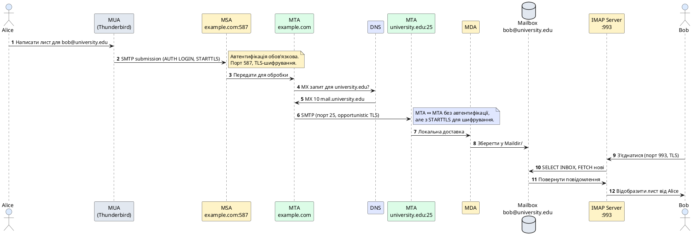

::card-group

::card{title="🎯 Мета лекції" icon="i-lucide-target"}

- Зрозуміти архітектуру електронної пошти як розподіленої системи передачі повідомлень через ланцюжок серверів.
- Опанувати протокол SMTP (*Simple Mail Transfer Protocol*) для надсилання email: команди, коди відповідей, механізм доставки.
- Вивчити різницю між POP3 та IMAP для отримання пошти з поштових серверів та їхні моделі роботи.
- Розглянути формат електронних повідомлень за RFC 5322 та роль MIME у передачі вкладень та багатомовного контенту.
- Проаналізувати механізми безпеки email: SPF, DKIM, DMARC для запобігання підміні відправника та спаму.

::

::card{title="🔑 Ключові терміни" icon="i-lucide-key"}

- **SMTP (Simple Mail Transfer Protocol):** текстовий протокол для передачі електронних повідомлень між серверами через TCP порт 25.
- **MTA (Mail Transfer Agent):** поштовий сервер, що пересилає листи між доменами (Postfix, Exim, Sendmail).
- **MUA (Mail User Agent):** поштовий клієнт для створення та читання листів (Thunderbird, Outlook, Gmail Web).
- **POP3:** протокол завантаження пошти з сервера на локальний пристрій з видаленням (модель «download and delete»).
- **IMAP:** протокол синхронізації пошти між сервером та клієнтами з підтримкою папок (модель «mail stays on server»).
- **MIME (Multipurpose Internet Mail Extensions):** стандарт кодування вкладень, HTML-контенту та не-ASCII символів у email.

::

::

## Архітектура системи електронної пошти

Електронна пошта є однією з найстаріших та найстабільніших розподілених систем Інтернету, що працює з 1971 року. На відміну від миттєвих месенджерів з прямим з'єднанням, email побудовано на принципі **асинхронної доставки через ланцюжок посередників** — поштових серверів, що пересилають повідомлення між відправником і одержувачем.

### Компоненти email-інфраструктури

Система електронної пошти складається з кількох функціональних компонентів, кожен з яких відповідає за окремий етап життєвого циклу повідомлення:

**MUA (Mail User Agent) — Поштовий клієнт**

Програма або вебінтерфейс, за допомогою яких користувач **створює, відправляє та читає** електронну пошту. MUA взаємодіє з поштовими серверами через протоколи SMTP (для відправки) та POP3/IMAP (для отримання).

*Приклади:* Mozilla Thunderbird, Microsoft Outlook, Apple Mail, Gmail Web, ProtonMail.

**MSA (Mail Submission Agent) — Агент прийому пошти**

Спеціалізований SMTP-сервер, що приймає повідомлення від **автентифікованих користувачів** (ваших клієнтів). MSA працює на порту **587** та вимагає логін/пароль, що запобігає відправці спаму через ваш сервер.

**MTA (Mail Transfer Agent) — Поштовий сервер-ретранслятор**

Основний компонент, що **передає листи між доменами** через протокол SMTP. MTA приймає повідомлення від MSA або інших MTA, визначає MX-запис (DNS) для домену одержувача і пересилає лист до відповідного поштового сервера.

*Приклади:* Postfix (найпопулярніший на Linux), Exim, Microsoft Exchange Server.

**MDA (Mail Delivery Agent) — Агент локальної доставки**

Компонент, що приймає повідомлення від MTA і **зберігає його у поштовій скриньці** користувача на сервері (зазвичай у форматі Maildir — кожен лист як окремий файл).

*Приклади:* Dovecot LDA, Procmail, Maildrop.

**Mailbox — Поштова скринька**

Місце зберігання повідомлень на сервері. Користувач отримує доступ до неї через протоколи POP3 або IMAP.

### Шлях повідомлення від відправника до одержувача

Розглянемо повний життєвий цикл email від `alice@example.com` до `bob@university.edu`:

::plant-uml{alt="Шлях електронного листа через компоненти email-інфраструктури"}



::

**Ключові етапи:**

1. **MUA → MSA (порт 587):** Alice пише лист у Thunderbird, який надсилає його на MSA через автентифіковане SMTP-з'єднання з TLS-шифруванням.
2. **MSA → MTA:** MSA перевіряє автентифікацію та передає лист власному MTA для обробки.
3. **DNS MX запит:** MTA виконує DNS-запит для визначення поштового сервера домену `university.edu` (результат: `mail.university.edu`).
4. **MTA → MTA (порт 25):** MTA відправника підключається до MTA одержувача і передає лист через SMTP без автентифікації (відкрита ретрансляція між серверами).
5. **MTA → MDA → Mailbox:** MTA одержувача передає лист MDA, який зберігає його у поштовій скриньці Bob.
6. **IMAP-доступ:** Bob підключається до IMAP-сервера і завантажує новий лист через зашифроване з'єднання.

::note
Ключова відмінність: **порт 587** з автентифікацією (MUA → MSA) запобігає зловживанням, тоді як **порт 25** без автентифікації (MTA ↔ MTA) дозволяє відкриту ретрансляцію між довіреними серверами.
::

## Протокол SMTP (Simple Mail Transfer Protocol)

SMTP — це текстовий протокол прикладного рівня для передачі електронних повідомлень, що працює поверх TCP на **порту 25** (між MTA) або **587** (submission від клієнтів до MSA). Протокол визначено у RFC 5321 (2008, оновлення RFC 821 від 1982).

### Характеристики SMTP

**1. Текстовий протокол:** Команди та відповіді передаються у форматі ASCII, що дозволяє тестувати протокол вручну через `telnet` або `openssl s_client`.

**2. Push-модель:** SMTP є **push-протоколом** — відправник активно передає повідомлення серверу одержувача, на відміну від pull-протоколів (POP3/IMAP), де клієнт запитує дані у сервера.

**3. ESMTP (Extended SMTP):** Сучасні сервери підтримують розширення, що оголошуються через команду `EHLO` замість застарілої `HELO`: STARTTLS (шифрування), AUTH (автентифікація), 8BITMIME (UTF-8), PIPELINING (пакетна передача команд).

### Основні команди SMTP

**EHLO (Extended Hello)**

Ідентифікація клієнта та запит списку підтримуваних розширень:

```
C: EHLO client.example.org
S: 250-mail.example.com
S: 250-SIZE 10240000
S: 250-STARTTLS
S: 250-AUTH PLAIN LOGIN
S: 250 8BITMIME
```

**MAIL FROM**

Вказує адресу відправника (envelope sender):

```
C: MAIL FROM:<alice@example.com>
S: 250 OK
```

**RCPT TO**

Вказує адресу одержувача (можна кілька разів для кількох одержувачів):

```
C: RCPT TO:<bob@university.edu>
S: 250 OK
```

**DATA**

Початок передачі вмісту повідомлення (заголовки + тіло). Закінчення позначається рядком з однією крапкою (`.`):

```
C: DATA
S: 354 End data with <CR><LF>.<CR><LF>
C: Subject: Test
C: From: alice@example.com
C: To: bob@university.edu
C:
C: This is the message body.
C: .
S: 250 Message accepted for delivery
```

**QUIT**

Завершення SMTP-сесії:

```
C: QUIT
S: 221 Bye
```

**STARTTLS**

Перехід до шифрованого з'єднання:

```
C: STARTTLS
S: 220 Ready to start TLS
(TLS handshake)
```

### Коди відповідей SMTP

SMTP використовує тризначні числові коди, аналогічно до HTTP:

| Код | Категорія | Приклад | Значення |
|-----|-----------|---------|----------|
| 2xx | Успіх | 250 OK | Команда виконана успішно |
| 3xx | Проміжна відповідь | 354 Start mail input | Сервер готовий приймати DATA |
| 4xx | Тимчасова помилка | 450 Mailbox unavailable | Повторити спробу пізніше |
| 5xx | Постійна помилка | 550 No such user | Не повторювати |

**Правило:** Коди **4xx** означають **transient error** (MTA автоматично повторить спробу через кілька хвилин/годин). Коди **5xx** означають **permanent error** (лист не може бути доставлено, генерується bounce message).

::warning
Якщо у тілі листа є рядок, що починається з крапки (`.`), його потрібно **екранувати подвійною крапкою** (`..`). Це називається dot-stuffing. Сервер автоматично видалить першу крапку при обробці.
::

## Формат електронних повідомлень

Електронне повідомлення складається з **заголовків** (headers) та **тіла** (body), розділених порожнім рядком. Формат визначено у RFC 5322.

### Структура повідомлення

```
From: Alice Smith <alice@example.com>
To: bob@university.edu
Subject: Meeting tomorrow
Date: Sat, 29 Aug 2026 10:30:00 +0200
Message-ID: <abc123@example.com>
Content-Type: text/plain; charset=utf-8

Hello Bob,

Let's meet tomorrow at 10 AM.

Best regards,
Alice
```

### Ключові заголовки

**Обов'язкові:**
- `From:` — адреса відправника (може відрізнятися від SMTP `MAIL FROM`)
- `To:` — адреса одержувача
- `Subject:` — тема листа
- `Date:` — дата створення у форматі RFC 5322 (`Day, DD Mon YYYY HH:MM:SS +ZZZZ`)
- `Message-ID:` — унікальний ідентифікатор повідомлення

**Додаткові:**
- `Cc:` (Carbon Copy) — копія для інших одержувачів (всі бачать список)
- `Bcc:` (Blind Carbon Copy) — прихована копія (видаляється MTA перед доставкою)
- `Reply-To:` — адреса для відповіді (якщо відрізняється від `From:`)
- `Received:` — ланцюжок серверів, через які пройшов лист (додається кожним MTA)
- `Return-Path:` — адреса для bounce messages (додається при доставці)

**Приклад заголовків Received (читати знизу вгору):**

```
Received: from mail.example.com (mail.example.com [93.184.216.34])
    by mail.university.edu (Postfix) with ESMTPS id ABC123
    for <bob@university.edu>; Sat, 29 Aug 2026 10:31:05 +0200
Received: from client.example.org (client.example.org [192.0.2.100])
    by mail.example.com (Postfix) with ESMTPSA id XYZ789
    for <bob@university.edu>; Sat, 29 Aug 2026 10:30:00 +0200
```

Перший `Received` (внизу) — відправник, останній (вгорі) — одержувач. Різниця у часових мітках показує затримки між серверами.

### MIME (Multipurpose Internet Mail Extensions)

Оригінальний email підтримував лише 7-бітний ASCII-текст. MIME розширює можливості:

**MIME-заголовки:**

```
Content-Type: text/plain; charset=utf-8
Content-Transfer-Encoding: base64
Content-Disposition: attachment; filename="document.pdf"
```

**Multipart повідомлення:**

Для листів з HTML + текстова версія або вкладеннями:

```
Content-Type: multipart/alternative; boundary="----=_Part_123"

------=_Part_123
Content-Type: text/plain; charset=utf-8

This is the plain text version.

------=_Part_123
Content-Type: text/html; charset=utf-8

<html><body><p>This is the <strong>HTML</strong> version.</p></body></html>

------=_Part_123--
```

Поштовий клієнт показує HTML-версію, якщо підтримує HTML, інакше — текстову.

::note
Base64 кодування збільшує розмір файлу на ~33% (3 байти → 4 символи ASCII). Це ціна за можливість передавати бінарні дані через систему, розроблену для тексту.
::

## POP3 та IMAP: протоколи отримання пошти

### POP3 (Post Office Protocol v3)

POP3 реалізує модель **«завантажити та видалити»** (download and delete):

```
1. З'єднання з сервером (порт 110 або 995 для POP3S)
2. Автентифікація (USER bob, PASS secretpassword)
3. Завантажити всі листи з сервера
4. Видалити листи з сервера (опціонально)
5. Закрити з'єднання
```

**Основні команди:**

```
C: USER bob
S: +OK
C: PASS secretpassword
S: +OK Logged in
C: STAT
S: +OK 2 320
C: LIST
S: +OK 2 messages
S: 1 120
S: 2 200
S: .
C: RETR 1
S: +OK 120 octets
S: <email content>
S: .
C: DELE 1
S: +OK message 1 deleted
C: QUIT
S: +OK Bye
```

**Обмеження POP3:**
- Немає синхронізації між пристроями (листи завантажуються на один пристрій і видаляються з сервера).
- Немає підтримки папок, міток, категорій.
- Неможливо позначити лист як прочитаний на сервері або переміщувати між папками.

### IMAP (Internet Message Access Protocol)

IMAP реалізує модель **«пошта залишається на сервері»** (mail stays on server):

```
1. З'єднання (порт 143 або 993 для IMAPS)
2. Автентифікація
3. Вибрати папку (INBOX, Sent, Drafts)
4. Завантажити метадані (заголовки, розмір)
5. Завантажити тіло при відкритті листа
6. Синхронізувати зміни (прочитано, видалено)
7. З'єднання може залишатися відкритим (IDLE для push-нотифікацій)
```

**Основні команди:**

```
C: A001 LOGIN bob secretpassword
S: A001 OK LOGIN completed
C: A002 SELECT INBOX
S: * 42 EXISTS
S: * 0 RECENT
S: A002 OK [READ-WRITE] SELECT completed
C: A003 FETCH 1:10 (FLAGS ENVELOPE RFC822.SIZE)
S: * 1 FETCH (FLAGS (\Seen) ENVELOPE (...) RFC822.SIZE 1234)
S: A003 OK FETCH completed
C: A004 STORE 1 +FLAGS (\Seen)
S: * 1 FETCH (FLAGS (\Seen))
S: A004 OK STORE completed
C: A005 IDLE
S: + idling
... (push-нотифікації про нові листи) ...
C: DONE
S: A005 OK IDLE terminated
```

**Переваги IMAP:**
- Повна синхронізація між усіма пристроями (зміни відображаються скрізь).
- Підтримка папок, підпапок, міток, прапорців.
- Економія трафіку (завантажуються лише заголовки, тіло за запитом).
- Push-нотифікації через команду IDLE (миттєва доставка без polling).
- Пошук на сервері (`SEARCH FROM "alice@example.com" SINCE 1-Aug-2026`).

| Характеристика | POP3 | IMAP |
|---|---|---|
| Модель | Завантажити та видалити | Синхронізація |
| Синхронізація пристроїв | ❌ Немає | ✅ Повна |
| Підтримка папок | ❌ Немає | ✅ Папки, мітки |
| Економія трафіку | ❌ Завантажує все | ✅ Лише заголовки |
| Push-нотифікації | ❌ Polling | ✅ IDLE |
| Пошук на сервері | ❌ Немає | ✅ SEARCH |
| Складність | Простий | Складніший |
| Типове використання | Один пристрій | Кілька пристроїв |

::tip
Сучасні поштові системи (Gmail, Outlook, ProtonMail) використовують **IMAP** як основний протокол. POP3 залишається лише для сумісності зі старими клієнтами або сценаріїв з обмеженим дисковим простором на сервері.
::

## Безпека електронної пошти

Традиційний email має три критичні проблеми безпеки: відсутність шифрування, відсутність автентифікації відправника та відсутність гарантій цілісності. Розглянемо сучасні механізми захисту.

### TLS-шифрування (STARTTLS)

**Порти з TLS:**
- SMTP submission (MUA → MSA): **587** з STARTTLS або **465** з SSL/TLS (SMTPS)
- SMTP relay (MTA → MTA): **25** з opportunistic STARTTLS
- POP3S: **995**
- IMAPS: **993**

**Opportunistic vs Mandatory TLS:**

**Opportunistic TLS** (порт 25): якщо обидва сервери підтримують — шифрується, якщо ні — передається відкритим текстом. Вразливий до **downgrade-атак** (атакуючий блокує STARTTLS).

**Mandatory TLS** (порти 465, 587, 993, 995): TLS обов'язковий, якщо недоступний — з'єднання відхиляється. Безпечніше, але несумісно зі старими серверами.

**MTA-STS (Mail Transfer Agent Strict Transport Security):** Новий стандарт, що змушує використовувати TLS між MTA через політику, опубліковану через HTTPS.

### SPF (Sender Policy Framework)

SPF — механізм перевірки, чи **дозволено IP-адресі** надсилати пошту від імені домену.

**Проблема:** Будь-хто може вказати довільний `MAIL FROM` у SMTP.

**Рішення:** Домен публікує SPF-запис у DNS:

```dns
example.com.    IN    TXT    "v=spf1 ip4:93.184.216.0/24 include:_spf.google.com ~all"
```

**Механізм:**
1. MTA одержувача отримує лист з `MAIL FROM:<alice@example.com>`
2. Виконує DNS-запит: `TXT example.com`
3. Перевіряє, чи IP відправника належить до дозволеного діапазону
4. Результат: Pass, Fail, Soft Fail, Neutral

**Обмеження:** SPF перевіряє тільки `MAIL FROM` (envelope sender), а не заголовок `From:`, який бачить користувач.

### DKIM (DomainKeys Identified Mail)

DKIM — механізм **цифрового підпису** email для гарантування автентичності та цілісності.

**Як працює:**
1. Відправник генерує пару ключів (приватний/публічний)
2. Публічний ключ публікується у DNS: `default._domainkey.example.com TXT`
3. MTA підписує повідомлення приватним ключем
4. Підпис додається у заголовок `DKIM-Signature`
5. MTA одержувача завантажує публічний ключ з DNS і перевіряє підпис

**Приклад DKIM-Signature:**

```
DKIM-Signature: v=1; a=rsa-sha256; c=relaxed/relaxed;
    d=example.com; s=default;
    h=from:to:subject:date;
    b=XYZ789...
```

**Переваги:**
- Гарантує, що лист надіслано саме з домену `example.com`
- Гарантує цілісність (повідомлення не змінено)
- Працює з заголовком `From:`, на відміну від SPF

### DMARC (Domain-based Message Authentication, Reporting & Conformance)

DMARC — політика, що вказує, **що робити** з листами, які не пройшли SPF або DKIM.

**Приклад DMARC-запису:**

```dns
_dmarc.example.com.    IN    TXT    "v=DMARC1; p=quarantine; rua=mailto:dmarc@example.com; pct=100"
```

**Поля:**
- `p=quarantine` — політика: `none` (моніторинг), `quarantine` (спам), `reject` (відхилити)
- `rua=mailto:...` — адреса для агрегованих звітів
- `pct=100` — відсоток листів, до яких застосовувати політику

**Послідовність впровадження:**
1. Налаштувати SPF (дозволити легітимні IP)
2. Налаштувати DKIM (підписувати листи)
3. Налаштувати DMARC з `p=none` (моніторинг)
4. Аналізувати звіти кілька тижнів
5. Змінити на `p=quarantine`
6. Через кілька місяців → `p=reject`

::warning
DMARC захищає від **phishing-атак** з підміною домену. Без DMARC зловмисник може надсилати листи від імені вашого домену, і вони можуть бути доставлені одержувачам.
::

## Питання для самоперевірки

::accordion

::accordion-item{label="❓ Чому між MUA та MSA використовується порт 587 з автентифікацією, а між MTA — порт 25 без неї?" icon="i-lucide-help-circle"}

**Порт 587 (MUA → MSA)** призначений для **submission** (надсилання пошти від клієнтів) і вимагає автентифікації через логін/пароль або OAuth2. Це запобігає зловживанням — без автентифікації будь-хто міг би використовувати ваш сервер для надсилання спаму (**open relay**).

**Порт 25 (MTA ↔ MTA)** призначений для **relay** (ретрансляції між серверами) і працює без автентифікації, оскільки сервери довіряють один одному через DNS MX-записи. Якщо MTA вимагатиме автентифікацію, система email перестане працювати — сервери не зможуть передавати пошту між доменами.

**Захист порту 25:** Сучасні MTA приймають пошту тільки для локальних доменів (домени, за які вони відповідальні) або від довірених IP-адрес. Спроба надіслати пошту для стороннього домену без автентифікації повертає помилку `550 Relay access denied`.

::

::accordion-item{label="❓ Яка різниця між MAIL FROM (envelope sender) та заголовком From:?" icon="i-lucide-help-circle"}

**`MAIL FROM`** (envelope sender) — це адреса, вказана у протоколі SMTP командою `MAIL FROM:<address>`. Вона використовується для **маршрутизації** та повідомлень про недоставку (bounce messages). Це аналог зворотної адреси на конверті.

**`From:`** — це заголовок у самому листі, який **бачить користувач** у поштовому клієнті. Це аналог адреси відправника на аркуші паперу всередині конверта.

**Чому вони можуть відрізнятися:**
- **Mailing lists:** лист надсилається через список розсилки — `From: alice@example.com`, але `MAIL FROM: bounces@mailinglist.com`.
- **Send on behalf:** корпоративні системи, де асистент надсилає листи від імені керівника.
- **No-reply адреси:** `From: noreply@example.com`, але `MAIL FROM: bounces-123@example.com` для обробки bounce.

**SPF перевіряє `MAIL FROM`**, а **DKIM підписує `From:`**, тому для повного захисту потрібні обидва механізми.

::

::accordion-item{label="❓ Що таке MIME і які проблеми він вирішує?" icon="i-lucide-help-circle"}

Оригінальний стандарт email (RFC 822, 1982) підтримував тільки **7-бітний ASCII-текст** — англійські літери, цифри та базові символи пунктуації. Це створювало три проблеми:

1. **Багатомовність:** Неможливо відправити кирилицю, китайські ієрогліфи, арабське письмо.
2. **Вкладені файли:** Неможливо передати бінарні файли (зображення, документи, архіви).
3. **Форматування:** Неможливо використовувати HTML для форматування тексту.

**MIME (Multipurpose Internet Mail Extensions)** вирішує ці проблеми:

**1. Кодування багатомовних символів:**
```
Content-Type: text/plain; charset=utf-8
Content-Transfer-Encoding: quoted-printable
```
UTF-8 дозволяє використовувати будь-які мови.

**2. Вкладені файли:**
```
Content-Type: application/pdf; name="document.pdf"
Content-Transfer-Encoding: base64
Content-Disposition: attachment; filename="document.pdf"
```
Base64 перетворює бінарні дані у ASCII-текст (3 байти → 4 символи), збільшуючи розмір на ~33%.

**3. HTML-форматування:**
```
Content-Type: multipart/alternative; boundary="----=_Part_123"

------=_Part_123
Content-Type: text/plain
Plain text version

------=_Part_123
Content-Type: text/html
<p>HTML version</p>
------=_Part_123--
```
Поштовий клієнт показує HTML, якщо підтримує, інакше — текст.

::

::accordion-item{label="❓ У чому фундаментальна різниця між POP3 та IMAP?" icon="i-lucide-help-circle"}

**POP3 (Post Office Protocol):**
**Модель:** «Завантажити та видалити» (download and delete).
**Сценарій:** Листи завантажуються з сервера на локальний пристрій (комп'ютер, телефон) і видаляються з сервера. Пошта зберігається локально.

**Переваги:**
- Працює офлайн після завантаження.
- Мінімальне використання дискового простору на сервері.

**Недоліки:**
- Немає синхронізації між пристроями (якщо завантажили на ноутбук — телефон не побачить).
- Втрата даних при виході з ладу пристрою.
- Немає папок, міток, пошуку на сервері.

**IMAP (Internet Message Access Protocol):**
**Модель:** «Пошта залишається на сервері» (mail stays on server).
**Сценарій:** Всі листи зберігаються на сервері. Клієнт завантажує лише метадані (заголовки, відправник, розмір), а тіло листа — при відкритті. Зміни (прочитано, видалено, переміщено) синхронізуються між усіма пристроями.

**Переваги:**
- Повна синхронізація (почали читати на телефоні, продовжили на ноутбуці).
- Доступ з будь-якого пристрою.
- Папки, мітки, пошук на сервері.
- Push-нотифікації (IDLE) без polling.

**Недоліки:**
- Потребує постійного інтернет-з'єднання.
- Обмеження дискового простору на сервері (квота).

**Висновок:** IMAP є стандартом для сучасних багатопристроїних середовищ. POP3 використовується лише у специфічних сценаріях (один пристрій, обмежений інтернет, конфіденційність).

::

::accordion-item{label="❓ Як працює DKIM і чому цифровий підпис гарантує автентичність листа?" icon="i-lucide-help-circle"}

DKIM використовує **асиметричну криптографію** (пара ключів: приватний і публічний) для створення цифрового підпису повідомлення.

**Процес підписування (відправник):**
1. MTA відправника обчислює **хеш** обраних заголовків (`From:`, `To:`, `Subject:`, `Date:`) та тіла повідомлення.
2. Хеш **шифрується приватним ключем** домену (який зберігається у секреті на сервері).
3. Зашифрований хеш (підпис) додається у заголовок `DKIM-Signature`:
   ```
   DKIM-Signature: v=1; a=rsa-sha256; d=example.com; s=default;
       h=from:to:subject:date;
       bh=abc123...;  ← хеш тіла
       b=XYZ789...    ← цифровий підпис
   ```
4. Лист надсилається одержувачу.

**Процес перевірки (одержувач):**
1. MTA одержувача отримує лист і бачить заголовок `DKIM-Signature`.
2. Завантажує **публічний ключ** з DNS: `dig default._domainkey.example.com TXT`
3. **Розшифровує підпис** публічним ключем → отримує оригінальний хеш.
4. Обчислює хеш заголовків та тіла **самостійно** з отриманого листа.
5. Порівнює два хеші:
   - **Збігаються** → підпис валідний, лист автентичний і не змінений.
   - **Не збігаються** → лист підроблено або змінено під час передачі.

**Чому це гарантує автентичність:**
- Лише власник **приватного ключа** (MTA домену `example.com`) може створити валідний підпис.
- Зловмисник не може підмінити `From: example.com` і створити валідний DKIM-підпис без приватного ключа.
- Якщо хтось змінить лист під час передачі (MITM-атака), хеш не збігатиметься і підпис стане невалідним.

**Обмеження:** DKIM не шифрує повідомлення (для цього потрібен TLS або end-to-end шифрування PGP/S/MIME).

::

::accordion-item{label="❓ Яка правильна послідовність впровадження SPF, DKIM, DMARC для нового домену?" icon="i-lucide-help-circle"}

**Фаза 1: Налаштування SPF (тиждень 1)**

1. Визначити всі легітимні джерела пошти (власні сервери, Google Workspace, SendGrid тощо).
2. Створити SPF-запис у DNS:
   ```dns
   example.com. IN TXT "v=spf1 ip4:93.184.216.34 include:_spf.google.com ~all"
   ```
3. Використовувати `~all` (Soft Fail) для моніторингу, а не `-all` (Fail), щоб не заблокувати легітимні джерела, які ви забули додати.
4. Тестувати: надіслати тестові листи і перевірити заголовки `Authentication-Results: spf=pass`.

**Фаза 2: Налаштування DKIM (тиждень 2)**

1. Згенерувати пару ключів на поштовому сервері:
   ```bash
   opendkim-genkey -d example.com -s default
   ```
2. Додати публічний ключ у DNS:
   ```dns
   default._domainkey.example.com. IN TXT "v=DKIM1; k=rsa; p=MIGfMA0..."
   ```
3. Налаштувати MTA для підписування всіх вихідних листів.
4. Тестувати: перевірити заголовки `DKIM-Signature` та `Authentication-Results: dkim=pass`.

**Фаза 3: DMARC у режимі моніторингу (тиждень 3–6)**

1. Створити DMARC-запис з політикою `p=none` (лише моніторинг):
   ```dns
   _dmarc.example.com. IN TXT "v=DMARC1; p=none; rua=mailto:dmarc@example.com; pct=100"
   ```
2. Налаштувати прийом DMARC-звітів (XML-файли надходять щодня на `rua`).
3. Аналізувати звіти протягом 2–4 тижнів: перевіряти, чи всі легітимні джерела проходять SPF/DKIM.

**Фаза 4: DMARC у режимі карантину (тиждень 7–12)**

1. Якщо у звітах немає проблем, змінити політику на `p=quarantine`:
   ```dns
   _dmarc.example.com. IN TXT "v=DMARC1; p=quarantine; rua=mailto:dmarc@example.com"
   ```
2. Листи, що не пройшли SPF/DKIM, потраплятимуть у спам замість inbox.
3. Продовжувати моніторити звіти.

**Фаза 5: DMARC у режимі відхилення (через 3–6 місяців)**

1. Після впевненості у стабільності, змінити на `p=reject`:
   ```dns
   _dmarc.example.com. IN TXT "v=DMARC1; p=reject; rua=mailto:dmarc@example.com"
   ```
2. Листи, що не пройшли SPF/DKIM, **не доставлятимуться** взагалі.

**Критично:** Не переходити відразу до `p=reject` — це може заблокувати легітимну пошту, якщо ви пропустили джерело у SPF або неправильно налаштували DKIM.

::

::

## Підсумок

Електронна пошта є фундаментальною розподіленою системою асинхронної комунікації, що працює через ланцюжок спеціалізованих серверів та протоколів. Розуміння її архітектури критично важливе для розробки вебзастосунків з email-нотифікаціями, інтеграції поштових серверів та діагностики проблем доставки.

::card-group

::card{title="🏗️ Архітектура email" icon="i-lucide-layers"}

Система складається з MUA (клієнт), MSA (приймання від користувачів), MTA (ретрансляція між доменами), MDA (локальна доставка) та Mailbox (зберігання). Шлях листа: MUA → MSA (порт 587, AUTH) → MTA відправника → DNS MX → MTA одержувача (порт 25) → MDA → Mailbox → IMAP/POP3 → одержувач.

::

::card{title="📨 SMTP протокол" icon="i-lucide-send"}

Текстовий push-протокол для передачі email. Команди: EHLO, MAIL FROM, RCPT TO, DATA, QUIT, STARTTLS. Коди відповідей: 2xx (успіх), 4xx (тимчасова помилка, повторити), 5xx (постійна помилка, не повторювати). ESMTP розширення: STARTTLS (шифрування), AUTH (автентифікація), 8BITMIME (UTF-8).

::

::card{title="📬 POP3 vs IMAP" icon="i-lucide-mail"}

**POP3:** модель «завантажити та видалити», один пристрій, просто, немає синхронізації. **IMAP:** модель «пошта на сервері», кілька пристроїв, папки, синхронізація змін, push-нотифікації (IDLE), пошук на сервері. IMAP є стандартом для сучасних багатопристроїних середовищ.

::

::card{title="🔐 Безпека: SPF, DKIM, DMARC" icon="i-lucide-shield-check"}

**SPF:** перевірка IP відправника через DNS (захист від підміни envelope sender). **DKIM:** цифровий підпис повідомлення (гарантія автентичності та цілісності). **DMARC:** політика дій при провалі SPF/DKIM + звітність (захист від phishing). TLS/STARTTLS для шифрування з'єднань (порти 465, 587, 993, 995).

::

::

**Практичні висновки:**
- Для вебзастосунків використовувати email API (SendGrid, Mailgun, AWS SES) замість власного SMTP-сервера.
- Налаштовувати SPF, DKIM, DMARC для запобігання підміні домену та покращення deliverability.
- Використовувати IMAP для багатопристроїних сценаріїв, POP3 тільки для специфічних випадків.
- Завжди використовувати TLS-шифрування (STARTTLS на порту 587 для submission).
- Аналізувати заголовки `Received` та `Authentication-Results` для діагностики проблем доставки.

::tip
Для поглибленого вивчення рекомендується ознайомитися зі специфікаціями **RFC 5321** (SMTP), **RFC 5322** (формат повідомлень), **RFC 3501** (IMAP), **RFC 7208** (SPF), **RFC 6376** (DKIM), **RFC 7489** (DMARC) та практичною документацією **Postfix**, **Dovecot**, **Nodemailer**.
::
