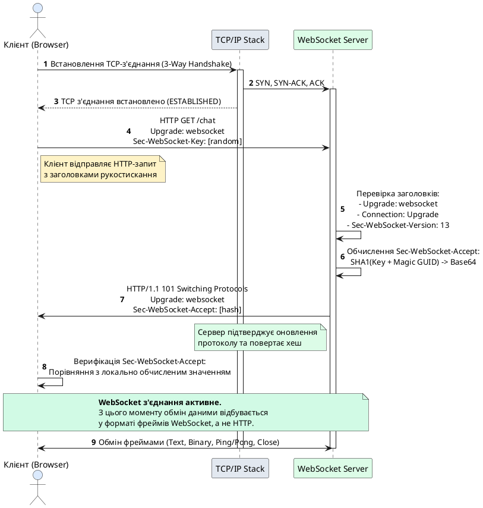
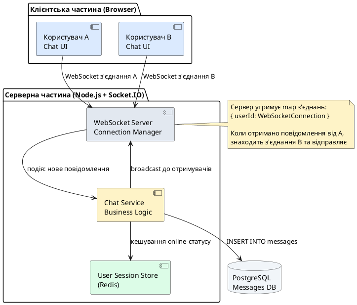
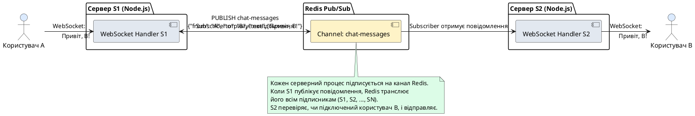

::card-group

::card{title="🎯 Мета лекції" icon="i-lucide-target"}

- Зрозуміти обмеження традиційного HTTP-протоколу для комунікації у реальному часі та необхідність альтернативних механізмів.
- Опанувати архітектуру протоколу WebSocket, процес рукостискання (*handshake*) та встановлення повнодуплексного з'єднання.
- Проаналізувати структуру фреймів (*frames*) WebSocket, типи повідомлень та механізми фрагментації даних.
- Вивчити практичні сценарії застосування WebSocket: чати, нотифікації, онлайн-ігри та відображення даних у реальному часі.

::

::card{title="🔑 Ключові терміни" icon="i-lucide-key"}

- **WebSocket:** стандарт повнодуплексного зв'язку (*full-duplex communication*) поверх одного TCP-з'єднання.
- **Handshake:** процес рукостискання для оновлення (*upgrade*) HTTP-з'єднання до WebSocket.
- **Frame:** базовий блок даних протоколу WebSocket з визначеною структурою заголовка та корисного навантаження.
- **Opcode:** код операції у фреймі, що визначає тип повідомлення (текст, бінарні дані, керуючі команди).
- **Full-Duplex:** режим одночасної двосторонньої передачі даних між клієнтом та сервером.

::

::

## Архітектурний контекст та еволюція систем

Для розуміння необхідності протоколу WebSocket розгляньмо спочатку традиційний підхід до обміну даними у вебзастосунках. Протокол HTTP є фундаментальним засобом комунікації у світовій павутині та заснований на парадигмі **запит-відповідь** (*request-response*), що означає: кожна взаємодія ініціюється клієнтом, сервер обробляє запит і повертає відповідь, після чого з'єднання закривається або переходить у режим очікування наступного запиту від того самого клієнта.

Цей підхід ідеально підходить для традиційних вебдодатків, де користувач натискає посилання чи відправляє форму, а сервер формує HTML-сторінку або JSON-відповідь. Проте із зростанням вимог до інтерактивності вебзастосунків — онлайн-чати, фінансові тікери, відеоконференції, багатокористувацькі ігри, дошки для спільної роботи — обмеження HTTP стають критичними бар'єрами на шляху до справжньої комунікації у реальному часі (*real-time communication*).

### Проблеми HTTP для реального часу

Розгляньмо типову задачу: онлайн-чат, де повідомлення одного користувача має миттєво з'явитися у браузері іншого користувача без натискання кнопки «Оновити». У класичній HTTP-архітектурі сервер не може самостійно ініціювати передачу даних клієнту — він лише відповідає на запити. Для обходу цього обмеження розробники застосовували кілька технік, кожна з яких має свої недоліки:

**1. Polling (*опитування*):** Клієнт періодично (наприклад, кожні 2 секунди) відправляє HTTP-запит на сервер із питанням: «Чи є нові повідомлення?». Якщо сервер повертає порожню відповідь, клієнт чекає інтервал та повторює запит. Цей підхід генерує величезну кількість зайвих запитів — якщо повідомлення надходять рідко, 90% запитів повертають відповідь «немає оновлень», марнуючи пропускну здатність мережі та ресурси сервера. Крім того, затримка (*latency*) між надсиланням повідомлення і його відображенням у клієнта може сягати інтервалу опитування.

**2. Long Polling (*довге опитування*):** Клієнт відправляє запит, але сервер не відповідає миттєво — він утримує з'єднання відкритим, поки не з'явиться нове повідомлення або не спрацює таймаут (наприклад, 30 секунд). Коли сервер отримує подію, він негайно повертає відповідь, клієнт обробляє дані та одразу відкриває новий long-polling запит. Цей метод зменшує кількість порожніх запитів, але все одно вимагає постійного встановлення нових HTTP-з'єднань, обробки заголовків та підтримки тисяч відкритих з'єднань на сервері.


**3. Server-Sent Events (SSE):** Стандарт HTML5, що дозволяє серверу відправляти подієво-орієнтовані повідомлення клієнту через довготривале HTTP-з'єднання. SSE підтримує лише односпрямований потік — від сервера до клієнта. Якщо клієнту потрібно відправити дані на сервер, він все одно має використовувати окремі HTTP-запити. Це робить SSE придатним для потокової трансляції оновлень (новини, котирування акцій), але недостатнім для двосторонніх інтерактивних застосунків.

Кожен із цих методів є компромісом, що намагається втиснути комунікацію у реальному часі у рамки протоколу, який спочатку для цього не призначався. Результат — надлишкові HTTP-заголовки при кожному обміні даними (типовий HTTP-заголовок займає 500–1000 байт, навіть якщо корисне навантаження — 10 байт JSON), постійне встановлення та розрив TCP-з'єднань, складність підтримки стану на сервері та незадовільна затримка.

### Народження WebSocket

Для розв'язання цих фундаментальних обмежень у 2008–2011 роках було розроблено та стандартизовано протокол **WebSocket** (RFC 6455, опублікований IETF у 2011 році). WebSocket пропонує принципово інший підхід: замість нескінченного потоку незалежних запитів та відповідей встановлюється одне довготривале TCP-з'єднання, що працює у **повнодуплексному режимі** (*full-duplex mode*). Це означає, що обидві сторони — клієнт і сервер — можуть ініціювати передачу даних у будь-який момент без попереднього запиту з протилежного боку. Уявіть телефонну розмову, де обидва співрозмовники можуть говорити одночасно (технічно), на противагу звичайній пошті, де лист завжди є відповіддю на попередній лист.

WebSocket дозволяє усунути весь надлишковий HTTP-overhead після початкового рукостискання: дані передаються у компактних **фреймах** (*frames*) із мінімальним заголовком (2–14 байт), що робить протокол надзвичайно ефективним для передачі частих невеликих повідомлень. Типова затримка обміну повідомленнями через WebSocket може бути на рівні 10–50 мілісекунд, що робить його придатним навіть для найвимогливіших застосунків — онлайн-шутерів, фінансових торгових платформ, систем телемедицини.

::note
Протокол WebSocket офіційно стандартизовано у специфікації **RFC 6455** (2011) та інтегровано у стандарт HTML5 як Web API `WebSocket`. Усі сучасні браузери та серверні платформи (Node.js, Python, Java, Go, C#) мають вбудовану підтримку WebSocket.
::

## Процес встановлення з'єднання: HTTP Upgrade Handshake

WebSocket — це не окремий протокол транспортного рівня (як TCP чи UDP), а прикладний протокол, що працює поверх звичайного TCP-з'єднання. Для забезпечення сумісності з існуючою інфраструктурою веба — проксі-серверами, брандмауерами, балансувальниками навантаження, які розуміють HTTP — WebSocket використовує **HTTP Upgrade Handshake** як механізм початкового встановлення з'єднання.

### Ініціація з'єднання клієнтом

Процес починається з того, що клієнт (зазвичай веббраузер) відправляє спеціальний HTTP-запит на сервер. Це звичайний HTTP-запит методом `GET`, але з кількома специфічними заголовками, що сигналізують серверу про бажання клієнта оновити протокол з HTTP до WebSocket. Розгляньмо типовий запит рукостискання:

```http
GET /chat HTTP/1.1
Host: example.com
Upgrade: websocket
Connection: Upgrade
Sec-WebSocket-Key: dGhlIHNhbXBsZSBub25jZQ==
Sec-WebSocket-Version: 13
Origin: https://example.com
```

Проаналізуймо кожен заголовок детально:

**`Upgrade: websocket`** — інформує сервер, що клієнт бажає змінити протокол з HTTP на WebSocket. Заголовок `Upgrade` є стандартним механізмом HTTP/1.1 для зміни протоколів (також використовується для переходу з HTTP/1.1 на HTTP/2).

**`Connection: Upgrade`** — вказує, що з'єднання не повинно закриватися після відповіді, а має бути оновлено до іншого протоколу згідно з заголовком `Upgrade`.

**`Sec-WebSocket-Key`** — випадкове 16-байтове значення, закодоване у форматі Base64. Це криптографічний ключ, який сервер використовує для підтвердження того, що він розуміє протокол WebSocket і не просто повертає стандартну HTTP-відповідь на будь-який запит. Ключ генерується клієнтом випадково при кожному з'єднанні та є частиною механізму захисту від випадкового прийняття WebSocket-з'єднання HTTP-сервером, що не підтримує цей протокол.

**`Sec-WebSocket-Version: 13`** — номер версії протоколу WebSocket. Версія 13 є останньою стабільною версією, визначеною у RFC 6455. Якщо сервер не підтримує зазначену версію, він може повернути список підтримуваних версій у заголовку відповіді `Sec-WebSocket-Version`.

**`Origin`** — заголовок, що містить походження (*origin*) сторінки, яка ініціює WebSocket-з'єднання. Сервер може використовувати цей заголовок для перевірки політики Same-Origin або Cross-Origin, щоб дозволити або заблокувати з'єднання з певних доменів. Це важливий механізм безпеки проти атак типу Cross-Site WebSocket Hijacking (CSWSH).


### Відповідь сервера: підтвердження рукостискання

Якщо сервер підтримує протокол WebSocket і приймає запит, він повертає HTTP-відповідь зі статус-кодом **101 Switching Protocols**. Цей код означає, що сервер погоджується змінити протокол згідно з заголовком `Upgrade` клієнта. Типова відповідь виглядає так:

```http
HTTP/1.1 101 Switching Protocols
Upgrade: websocket
Connection: Upgrade
Sec-WebSocket-Accept: s3pPLMBiTxaQ9kYGzzhZRbK+xOo=
```

**`HTTP/1.1 101 Switching Protocols`** — статус-код, що сигналізує успішне оновлення протоколу. Після відправки цієї відповіді сервер і клієнт більше не обмінюються HTTP-повідомленнями — всі подальші дані передаються у форматі фреймів WebSocket.

**`Sec-WebSocket-Accept`** — це криптографічно обчислене значення, яке сервер формує на основі `Sec-WebSocket-Key`, отриманого від клієнта. Алгоритм обчислення такий:

1. Взяти значення `Sec-WebSocket-Key` з запиту клієнта.
2. Конкатенувати його з магічним рядком-константою `258EAFA5-E914-47DA-95CA-C5AB0DC85B11` (визначено у RFC 6455).
3. Обчислити SHA-1 хеш отриманого рядка.
4. Закодувати результат у форматі Base64.

Цей механізм гарантує, що сервер дійсно обробив WebSocket-запит, а не просто повернув шаблонну відповідь. Клієнт після отримання відповіді виконує ту саму процедуру обчислення і порівнює результат з `Sec-WebSocket-Accept`. Якщо значення збігаються — рукостискання вважається успішним, і з'єднання переходить у режим WebSocket.

::note
Магічний рядок `258EAFA5-E914-47DA-95CA-C5AB0DC85B11` у специфікації RFC 6455 обрано як унікальний GUID, що не може бути випадково згенерований. Його присутність у процесі обчислення `Sec-WebSocket-Accept` унеможливлює підробку відповіді сервером, що не розуміє протокол WebSocket.
::

### Діаграма послідовності встановлення з'єднання

Візуалізуймо процес рукостискання у вигляді діаграми послідовності (*sequence diagram*), що ілюструє крок за кроком взаємодію клієнта, мережевого стека та сервера:

::plant-uml{alt="Процес WebSocket Handshake між клієнтом та сервером"}



::

Після успішного завершення рукостискання TCP-з'єднання залишається відкритим і переходить у режим WebSocket. Обидві сторони тепер можуть відправляти та отримувати повідомлення у будь-який момент без додаткових HTTP-заголовків та запитів.

::warning
Якщо сервер не підтримує WebSocket або відхиляє з'єднання з причин безпеки (наприклад, неправильний `Origin`), він поверне стандартний HTTP-статус помилки (400 Bad Request, 403 Forbidden, 426 Upgrade Required) замість 101 Switching Protocols. У цьому випадку клієнт отримає помилку, і WebSocket-з'єднання не буде встановлено.
::


## Структура та типи фреймів WebSocket

Після встановлення з'єднання всі дані між клієнтом і сервером передаються у вигляді **фреймів** (*frames*). Фрейм є базовою одиницею передачі даних у протоколі WebSocket і має чітко визначену структуру бітових полів. На відміну від HTTP, де кожен запит і відповідь містять текстові заголовки, фрейми WebSocket є бінарними структурами з мінімальним накладом — базовий заголовок займає лише 2 байти, що робить протокол надзвичайно ефективним для передачі невеликих повідомлень.

### Бітова структура фрейма

Згідно зі специфікацією RFC 6455, фрейм WebSocket починається з обов'язкового 2-байтового заголовка, за яким можуть слідувати додаткові байти залежно від розміру корисного навантаження та наявності маски. Структура фрейма виглядає так:

```
 0                   1                   2                   3
 0 1 2 3 4 5 6 7 8 9 0 1 2 3 4 5 6 7 8 9 0 1 2 3 4 5 6 7 8 9 0 1
+-+-+-+-+-------+-+-------------+-------------------------------+
|F|R|R|R| opcode|M| Payload len |    Extended payload length    |
|I|S|S|S|  (4)  |A|     (7)     |             (16/64)           |
|N|V|V|V|       |S|             |   (if payload len==126/127)   |
| |1|2|3|       |K|             |                               |
+-+-+-+-+-------+-+-------------+ - - - - - - - - - - - - - - - +
|     Extended payload length continued, if payload len == 127  |
+ - - - - - - - - - - - - - - - +-------------------------------+
|                               | Masking-key, if MASK set to 1 |
+-------------------------------+-------------------------------+
| Masking-key (continued)       |          Payload Data         |
+-------------------------------- - - - - - - - - - - - - - - - +
:                     Payload Data continued ...                :
+ - - - - - - - - - - - - - - - - - - - - - - - - - - - - - - - +
|                     Payload Data continued ...                |
+---------------------------------------------------------------+
```

Розглянемо ключові поля цієї структури:

**FIN (1 біт):** прапорець завершення (*finish*). Якщо `FIN = 1`, це означає, що даний фрейм є останнім фрагментом повідомлення. Якщо `FIN = 0`, повідомлення продовжується у наступних фреймах (механізм фрагментації, який розглянемо далі). Більшість простих повідомлень вміщується в один фрейм, тому зазвичай `FIN = 1`.

**RSV1, RSV2, RSV3 (по 1 біту кожен):** резервні біти для розширень протоколу. У стандартній реалізації ці біти мають бути встановлені у 0, якщо не узгоджено спеціальних розширень (наприклад, компресія `permessage-deflate`). Якщо сервер отримує фрейм з ненульовими RSV-бітами без попереднього узгодження розширення, він повинен закрити з'єднання з помилкою.

**Opcode (4 біти):** код операції, що визначає інтерпретацію корисного навантаження фрейма. Опкоди поділяються на дві категорії: фрейми даних (*data frames*) та керуючі фрейми (*control frames*). Основні значення:
- `0x0` (продовження, *continuation*): вказує, що це фрагмент багаточастинного повідомлення.
- `0x1` (текст, *text*): корисне навантаження є текстовими даними у кодуванні UTF-8.
- `0x2` (бінарні дані, *binary*): корисне навантаження є довільними бінарними даними.
- `0x8` (закриття, *close*): ініціює процедуру закриття з'єднання.
- `0x9` (ping): запит перевірки доступності з'єднання.
- `0xA` (pong): відповідь на ping-фрейм.

**MASK (1 біт):** вказує, чи замасковане корисне навантаження фрейма. Згідно зі специфікацією, **усі фрейми, відправлені клієнтом, мають бути замасковані** (`MASK = 1`), тоді як фрейми від сервера **не повинні бути замасковані** (`MASK = 0`). Це асиметричне правило введено для захисту від атак на проксі-сервери, що можуть неправильно інтерпретувати незашифровані дані як HTTP-трафік.

**Payload Length (7 біт):** вказує довжину корисного навантаження. Якщо значення від 0 до 125, це безпосередньо довжина у байтах. Якщо 126, наступні 2 байти містять 16-бітове беззнакове ціле число з довжиною. Якщо 127, наступні 8 байт містять 64-бітове беззнакове ціле число. Це дозволяє передавати повідомлення розміром від 0 байт до ~18 екзабайт.

**Masking-key (0 або 4 байти):** випадковий 32-бітний ключ, що використовується для маскування даних, якщо `MASK = 1`. Алгоритм маскування простий: кожен байт корисного навантаження XOR-иться з відповідним байтом ключа (циклічно, якщо дані довші за 4 байти). Це не є шифруванням — мета маскування полягає у запобіганні виявлення структурованих патернів у даних, які можуть бути сприйняті проміжним обладнанням як HTTP.

**Payload Data:** власне дані повідомлення — текст у UTF-8 (для opcode=1) або довільні байти (для opcode=2).

### Типи фреймів: дані та керування

Фрейми WebSocket діляться на дві функціональні категорії:

**Фрейми даних** (*data frames*) передають корисну інформацію застосунку:
- **Text Frame (opcode=0x1):** містить текстові дані у кодуванні UTF-8. Якщо отримувач виявляє некоректну послідовність UTF-8, він має закрити з'єднання з кодом помилки 1007 (Invalid Frame Payload Data).
- **Binary Frame (opcode=0x2):** містить довільні бінарні дані — зображення, аудіо, серіалізовані об'єкти (наприклад, Protocol Buffers, MessagePack).
- **Continuation Frame (opcode=0x0):** використовується для передачі фрагментів одного логічного повідомлення, якщо воно розбите на кілька фреймів.

**Керуючі фрейми** (*control frames*) координують роботу з'єднання:
- **Close Frame (opcode=0x8):** ініціює процес коректного закриття з'єднання. Може містити 2-байтний код статусу закриття (наприклад, 1000 = нормальне закриття, 1001 = клієнт йде, 1008 = порушення політики) та необов'язкове текстове повідомлення причини.
- **Ping Frame (opcode=0x9):** клієнт або сервер може відправити ping-фрейм для перевірки, чи активне з'єднання. Отримувач повинен негайно відповісти pong-фреймом з тим самим корисним навантаженням.
- **Pong Frame (opcode=0xA):** відповідь на ping. Може бути відправлений і несолісітовано (*unsolicited pong*) як односторонній сигнал підтримки з'єднання (*keep-alive*).

::note
Керуючі фрейми мають обмеження: їхнє корисне навантаження не може перевищувати 125 байт, і вони не можуть бути фрагментовані (`FIN` завжди має дорівнювати 1). Це забезпечує швидку обробку керуючих команд без буферизації фрагментів.
::


### Фрагментація повідомлень

Протокол WebSocket підтримує механізм **фрагментації** (*fragmentation*), що дозволяє розбивати велике логічне повідомлення на кілька менших фреймів. Це корисно, коли відправник не знає заздалегідь розмір повідомлення (наприклад, потокова передача даних) або хоче перемежовувати передачу різних повідомлень без блокування (multiplexing різних потоків даних в одному з'єднанні).

Перший фрейм багаточастинного повідомлення має opcode, що відповідає типу даних (0x1 для тексту або 0x2 для бінарних даних), і `FIN = 0`. Усі проміжні фрейми мають opcode=0x0 (continuation) і `FIN = 0`. Останній фрейм також має opcode=0x0, але `FIN = 1`, що сигналізує про завершення повідомлення.

Приклад передачі фрагментованого текстового повідомлення «Hello, World!»:

```
Фрейм 1: FIN=0, opcode=0x1 (text), payload="Hello, "
Фрейм 2: FIN=0, opcode=0x0 (continuation), payload="Wor"
Фрейм 3: FIN=1, opcode=0x0 (continuation), payload="ld!"
```

Отримувач збирає фрагменти у буфері до моменту отримання фрейма з `FIN = 1`, після чого об'єднує всі частини у повне повідомлення та передає його застосунку.

::warning
Фрагментація можлива лише для фреймів даних (text і binary). Керуючі фрейми (close, ping, pong) **не можуть бути фрагментовані** і мають передаватися цілком (`FIN = 1`). Крім того, керуючі фрейми можуть вклинюватися між фрагментами повідомлення даних — отримувач має обробляти їх негайно, не чекаючи завершення багаточастинного повідомлення.
::

## Життєвий цикл WebSocket-з'єднання

WebSocket-з'єднання проходить чіткі фази від встановлення до закриття. Розуміння цього життєвого циклу критично важливе для коректної обробки помилок та звільнення ресурсів.

### Фаза 1: Встановлення з'єднання (Opening Handshake)

Як було детально розглянуто раніше, клієнт відправляє HTTP Upgrade-запит, сервер повертає відповідь зі статусом 101, і з'єднання переходить у стан `OPEN`. У цьому стані обидві сторони можуть вільно обмінюватися фреймами. Web API в браузері надає подію `onopen`, яка спрацьовує після успішного завершення рукостискання:

```javascript
const socket = new WebSocket('wss://example.com/chat');

socket.onopen = (event) => {
  console.log('WebSocket з\'єднання встановлено:', event);
  // Можна розпочати відправку повідомлень
  socket.send('Привіт, сервер!');
};
```

На серверній стороні (наприклад, у Node.js з бібліотекою `ws`) подія `connection` сигналізує про нове з'єднання:

```javascript
const WebSocket = require('ws');
const wss = new WebSocket.Server({ port: 8080 });

wss.on('connection', (ws, req) => {
  console.log('Новий клієнт підключився з адреси:', req.socket.remoteAddress);
  ws.send('Вітаємо на сервері!');
});
```

### Фаза 2: Обмін повідомленнями (Data Transfer)

У стані `OPEN` клієнт і сервер можуть відправляти необмежену кількість повідомлень у будь-якому напрямку. Кожен виклик методу `send()` генерує один або кілька фреймів залежно від розміру та типу даних:

```javascript
// Відправка текстового повідомлення (Text Frame)
socket.send('Це текстове повідомлення у UTF-8');

// Відправка бінарних даних (Binary Frame)
const buffer = new Uint8Array([0x48, 0x65, 0x6C, 0x6C, 0x6F]); // "Hello"
socket.send(buffer);

// Відправка Blob (у браузері, автоматично перетворюється на Binary Frame)
const blob = new Blob(['Дані файлу'], { type: 'text/plain' });
socket.send(blob);
```

Отримувач обробляє вхідні повідомлення через подію `onmessage`:

```javascript
socket.onmessage = (event) => {
  if (typeof event.data === 'string') {
    console.log('Отримано текст:', event.data);
  } else if (event.data instanceof Blob) {
    console.log('Отримано Blob розміром:', event.data.size);
  } else if (event.data instanceof ArrayBuffer) {
    console.log('Отримано бінарні дані:', new Uint8Array(event.data));
  }
};
```

::tip
Для високочастотного обміну даними (наприклад, у грі з частотою 60 FPS) рекомендується використовувати бінарні повідомлення замість JSON. Бінарні формати (Protocol Buffers, MessagePack, FlatBuffers) займають менше місця та обробляються швидше, ніж парсинг JSON.
::

### Фаза 3: Механізм keep-alive (Ping/Pong)

WebSocket-з'єднання може простоювати тривалий час без обміну даними. Проміжні мережеві вузли (NAT-шлюзи, балансувальники, проксі) можуть автоматично закривати неактивні TCP-з'єднання через таймаут (зазвичай 30–120 секунд). Для запобігання цьому використовується механізм **heartbeat** (*пульс серця*) на основі ping/pong фреймів.

Сервер або клієнт періодично (наприклад, кожні 30 секунд) відправляє ping-фрейм:

```javascript
// Серверна сторона (Node.js + ws)
const interval = setInterval(() => {
  wss.clients.forEach((ws) => {
    if (ws.isAlive === false) {
      // Клієнт не відповів на попередній ping — закриваємо з'єднання
      return ws.terminate();
    }
    ws.isAlive = false;
    ws.ping(); // Відправка ping-фрейма
  });
}, 30000);

wss.on('connection', (ws) => {
  ws.isAlive = true;
  ws.on('pong', () => {
    ws.isAlive = true; // Клієнт відповів — з'єднання активне
  });
});
```

У браузерному API немає прямого доступу до відправки ping/pong фреймів (це реалізовано автоматично браузером), але на серверній стороні цей механізм має бути реалізований явно для виявлення «мертвих» з'єднань.

::note
Альтернативою ping/pong є відправка звичайних повідомлень застосунку з типом «heartbeat». Наприклад, `{"type": "ping"}` кожні 30 секунд, на які клієнт відповідає `{"type": "pong"}`. Цей підхід дає більше контролю, але вимагає обробки на рівні логіки застосунку.
::


### Фаза 4: Коректне закриття з'єднання (Closing Handshake)

На відміну від раптового обриву TCP-з'єднання, протокол WebSocket визначає процедуру **коректного закриття** (*graceful shutdown*), що дозволяє обом сторонам домовитися про завершення роботи та обробити всі буферизовані дані.

Ініціатор закриття (клієнт або сервер) відправляє **Close Frame** з опціональним 2-байтним кодом статусу та текстовою причиною (до 123 байт UTF-8):

```javascript
// Клієнт ініціює закриття
socket.close(1000, 'Користувач вийшов з чату');
```

Коди статусу закриття стандартизовані RFC 6455:
- **1000** — Normal Closure (нормальне закриття, задача виконана).
- **1001** — Going Away (клієнт покидає сторінку або сервер вимикається).
- **1002** — Protocol Error (помилка протоколу, некоректний фрейм).
- **1003** — Unsupported Data (отримано дані неприйнятного типу).
- **1006** — Abnormal Closure (аварійне закриття без Close Frame, лише для клієнтського API).
- **1007** — Invalid Frame Payload Data (некоректне кодування UTF-8 у текстовому фреймі).
- **1008** — Policy Violation (порушення політики застосунку).
- **1009** — Message Too Big (повідомлення занадто велике для обробки).
- **1011** — Internal Server Error (несподівана помилка на сервері).

Коли одна сторона відправляє Close Frame, отримувач має:
1. Припинити відправку нових повідомлень даних.
2. Відповісти власним Close Frame (зазвичай з тим самим кодом статусу).
3. Закрити базове TCP-з'єднання.

Після цього обидві сторони вважають з'єднання закритим. У Web API спрацьовує подія `onclose`:

```javascript
socket.onclose = (event) => {
  console.log('З\'єднання закрито:', {
    code: event.code,    // Код статусу (наприклад, 1000)
    reason: event.reason, // Текстова причина
    wasClean: event.wasClean // true, якщо Close Frame отримано
  });
  
  if (!event.wasClean) {
    console.error('Аварійне закриття з\'єднання');
  }
};
```

::warning
Якщо сторона не отримує Close Frame у відповідь протягом розумного таймауту (зазвичай 2–5 секунд), вона має примусово закрити TCP-з'єднання методом `terminate()` для звільнення ресурсів. Без цього можливе накопичення «підвислих» з'єднань на сервері (connection leak).
::

### Обробка помилок

У разі критичних помилок (некоректний фрейм, порушення протоколу, помилка мережі) спрацьовує подія `onerror`:

```javascript
socket.onerror = (error) => {
  console.error('Помилка WebSocket:', error);
  // Подія 'onerror' завжди супроводжується подією 'onclose'
};
```

На серверній стороні:

```javascript
ws.on('error', (error) => {
  console.error('Помилка з\'єднання з клієнтом:', error.message);
  // Логування та моніторинг
});
```

Типові помилки:
- **ECONNREFUSED** — сервер не відповідає на запит рукостискання.
- **HTTP 403 Forbidden** — сервер відхилив з'єднання через невідповідність `Origin`.
- **HTTP 426 Upgrade Required** — сервер не підтримує оновлення до WebSocket.
- **Protocol Error** — отримано фрейм з некоректною структурою.

## Порівняння WebSocket із альтернативними технологіями

Для розуміння ніші WebSocket у екосистемі вебтехнологій корисно порівняти його з іншими підходами до комунікації у реальному часі.

::code-group

```javascript [WebSocket (повнодуплексний)]
const socket = new WebSocket('wss://example.com/stream');

// Клієнт може відправляти будь-коли
socket.send('Повідомлення від клієнта');

// Сервер може відправляти будь-коли
socket.onmessage = (event) => {
  console.log('Повідомлення від сервера:', event.data);
};

// Обидві сторони рівноправні
```

```javascript [Server-Sent Events (однонаправлений)]
const eventSource = new EventSource('/events');

// Лише сервер може відправляти дані
eventSource.onmessage = (event) => {
  console.log('Подія від сервера:', event.data);
};

// Клієнт НЕ може відправляти через SSE
// Потрібен окремий HTTP-запит для відправки
fetch('/api/action', { method: 'POST', body: data });
```

```javascript [HTTP Long Polling (симуляція реального часу)]
async function pollServer() {
  const response = await fetch('/poll?timeout=30000');
  const data = await response.json();
  console.log('Отримано оновлення:', data);
  
  // Негайно відкриваємо новий запит
  pollServer();
}

pollServer();
// Кожен запит = нові HTTP-заголовки, нове TCP-з'єднання
```

::

Порівняльна таблиця характеристик:

| Характеристика | WebSocket | SSE | Long Polling |
|---|---|---|---|
| **Напрямок даних** | Повнодуплексний (клієнт ↔ сервер) | Однонаправлений (сервер → клієнт) | Однонаправлений (сервер → клієнт) |
| **Протокол** | `ws://` або `wss://` | HTTP/HTTPS | HTTP/HTTPS |
| **З'єднання** | Одне довготривале TCP | Одне довготривале HTTP | Багато коротких HTTP |
| **Overhead** | Мінімальний (2–14 байт на фрейм) | Середній (HTTP-заголовки) | Високий (повні HTTP-заголовки при кожному запиті) |
| **Затримка** | 10–50 мс | 50–200 мс | 500–2000 мс (залежить від інтервалу) |
| **Proxy-friendly** | Потребує підтримки `Upgrade` | Повна сумісність | Повна сумісність |
| **Автоматична реконнект** | Потрібна реалізація вручну | Вбудована (EventSource API) | Вбудована у логіці polling |
| **Бінарні дані** | Підтримка нативна | Підтримка відсутня (лише текст) | Підтримка через Base64 (неефективно) |
| **Сценарії використання** | Чати, ігри, фінанси, спільна робота | Нотифікації, новинні стрічки, прогрес-бари | Легаси-системи, прості оновлення |

::tip
Якщо застосунок вимагає лише односпрямованої передачі від сервера до клієнта (наприклад, оновлення цін на біржі), а клієнт надсилає дані рідко через звичайні HTTP API, **Server-Sent Events** може бути простішим рішенням за WebSocket. SSE має вбудований механізм автоматичного перепідключення і не вимагає обробки бінарних фреймів.
::


## Практичні сценарії застосування WebSocket

Протокол WebSocket знайшов широке застосування у найрізноманітніших категоріях вебзастосунків, де вимагається низька затримка та двостороння комунікація. Розглянемо типові архітектурні патерни та реальні приклади.

### Застосунки обміну миттєвими повідомленнями (Messaging)

Чат-застосунки є класичним сценарієм використання WebSocket. Коли користувач A надсилає повідомлення користувачеві B, сервер отримує дані через WebSocket-з'єднання A, зберігає повідомлення у базі даних та негайно пересилає його через активне WebSocket-з'єднання B без будь-яких запитів з боку B.

Архітектура типового чат-застосунку:

::plant-uml{alt="Архітектура чат-застосунку на WebSocket"}



::

Ключові переваги WebSocket у чатах:
- **Миттєва доставка:** повідомлення доставляються за ~10–50 мс замість 1–2 секунд затримки при polling.
- **Індикатори набору тексту:** коли користувач друкує, клієнт може відправляти події `typing_start` / `typing_stop` без створення нових HTTP-запитів.
- **Онлайн-статус у реальному часі:** сервер може транслювати зміни статусу (online/offline/away) усім підключеним користувачам негайно.
- **Групові кімнати:** Socket.IO та подібні бібліотеки надають механізм **rooms** — логічного групування з'єднань, що дозволяє ефективно розсилати повідомлення всім учасникам кімнати одним викликом `io.to('room-123').emit('message', data)`.

### Інтерактивні дошки для спільної роботи (Collaborative Editing)

Застосунки типу Google Docs, Miro, Figma дозволяють кільком користувачам одночасно редагувати документ або креслення. Кожна дія одного користувача (додавання тексту, переміщення об'єкта, зміна кольору) має миттєво відображатися у всіх інших клієнтів.

WebSocket дозволяє реалізувати **оперативну трансформацію** (*Operational Transformation, OT*) або **конфліктно-вільні реплікуючі типи даних** (*Conflict-Free Replicated Data Types, CRDT*) — алгоритми, що синхронізують стан документа між клієнтами через потік інкрементальних змін.

Приклад потоку подій:
1. Користувач A вводить символ «H» у позицію 5 документа.
2. Клієнт A відправляє через WebSocket: `{ op: 'insert', pos: 5, char: 'H' }`.
3. Сервер перевіряє операцію, застосовує до серверної копії документа.
4. Сервер транслює операцію всім підключеним клієнтам (B, C, D).
5. Клієнти B, C, D отримують операцію через WebSocket і негайно оновлюють свій локальний стан документа.

Типова затримка від введення символу до його відображення у віддаленого користувача — 50–100 мс, що є прийнятним для відчуття «синхронності».

::note
Для реалізації спільного редагування зазвичай використовують бібліотеки, що абстрагують складність: **Yjs** (CRDT-бібліотека з підтримкою WebSocket через `y-websocket`), **ShareDB** (OT-фреймворк на Node.js), **Automerge** (CRDT для JavaScript).
::

### Фінансові тікери та трейдинг-платформи

Біржові застосунки вимагають відображення ціни активів у реальному часі з мінімальною затримкою. Традиційний підхід polling генерував би тисячі запитів на секунду від усіх підключених трейдерів, створюючи нестерпне навантаження на сервер та мережу.

З WebSocket біржа підтримує одне з'єднання з кожним клієнтом і надсилає оновлення ціни лише при зміні:

```javascript
// Сервер відправляє оновлення ціни
ws.send(JSON.stringify({
  type: 'price_update',
  symbol: 'AAPL',
  price: 178.42,
  change: +1.25,
  timestamp: Date.now()
}));
```

Клієнт отримує дані та негайно оновлює інтерфейс без перемальовування всієї сторінки. Якщо за секунду ціна змінюється 10 разів, клієнт отримає 10 мікроповідомлень загальним обсягом ~500 байт замість 10 HTTP-запитів по ~1 КБ кожен (з заголовками).

Для критичних сценаріїв (високочастотний трейдинг, *High-Frequency Trading, HFT*) використовують бінарні протоколи поверх WebSocket — наприклад, **FIX (Financial Information eXchange)** у бінарному форматі, що зменшує розмір повідомлення до десятків байт та прискорює парсинг.

### Багатокористувацькі онлайн-ігри (Multiplayer Gaming)

Онлайн-ігри з багатьма гравцями у реальному часі (MOBA, шутери, аркади) вимагають синхронізації стану гри між клієнтами з частотою 10–60 разів на секунду (*tick rate*). Кожен tick містить позиції гравців, стан об'єктів, події (постріли, підбір предметів).

WebSocket дозволяє ігровому серверу розсилати tick-апдейти всім підключеним гравцям:

```javascript
// Сервер надсилає стан гри 20 разів на секунду
setInterval(() => {
  const gameState = {
    tick: currentTick++,
    players: gameWorld.getPlayers().map(p => ({
      id: p.id,
      x: p.x,
      y: p.y,
      health: p.health
    })),
    projectiles: gameWorld.getProjectiles()
  };
  
  // Broadcast усім клієнтам
  gameRoom.broadcast(gameState);
}, 50); // 20 FPS
```

Для зменшення обсягу даних застосовують:
- **Delta-компресію:** надсилати лише зміни стану порівняно з попереднім tick.
- **Інтерполяцію на клієнті:** клієнт згладжує рух між отриманими tick для плавної анімації.
- **Передбачення на клієнті** (*client-side prediction*): клієнт миттєво відображає дії гравця локально, а сервер підтверджує або корегує стан у наступному tick.

::warning
Для багатокористувацьких ігор з дуже низькими вимогами до затримки (< 30 мс) WebSocket може бути недостатнім через overhead TCP-протоколу (гарантована доставка, повторна передача втрачених пакетів). У таких випадках використовують протокол **WebRTC Data Channels** (працює поверх UDP через DTLS) або спеціалізовані протоколи UDP з власною логікою надійності (наприклад, **ENet**, **KCP**).
::


### Системи моніторингу та дашборди

Адміністративні панелі для моніторингу серверів, застосунків, IoT-пристроїв вимагають відображення метрик у реальному часі — завантаження CPU, використання пам'яті, кількість запитів, статус сервісів. Замість оновлення сторінки кожні 5 секунд, WebSocket дозволяє серверу надсилати нові дані безпосередньо після їх збору.

Приклад серверної частини дашборду:

```javascript
// Сервер збирає метрики кожні 2 секунди
setInterval(async () => {
  const metrics = await collectSystemMetrics(); // CPU, RAM, Disk
  
  // Надсилаємо всім підключеним адмінським клієнтам
  adminRoom.emit('metrics_update', {
    timestamp: Date.now(),
    cpu: metrics.cpuUsage,
    memory: metrics.memoryUsage,
    activeConnections: metrics.connections
  });
}, 2000);
```

Клієнт отримує метрики та оновлює графіки у реальному часі без перезавантаження:

```javascript
socket.on('metrics_update', (data) => {
  // Оновлюємо Chart.js або інший графічний компонент
  cpuChart.data.labels.push(new Date(data.timestamp).toLocaleTimeString());
  cpuChart.data.datasets[0].data.push(data.cpu);
  cpuChart.update();
});
```

### IoT та телеметрія пристроїв

Пристрої Інтернету речей (IoT) — сенсори температури, камери безпеки, розумні лічильники — генерують потоки даних, які мають бути відображені у веб-інтерфейсі оператора. Замість постійного опитування сервера, пристрої підключаються до WebSocket-сервера і надсилають телеметрію при зміні стану:

```javascript
// Сенсор температури (ESP32 + JavaScript runtime)
const socket = new WebSocket('wss://iot-hub.example.com/sensor-feed');

setInterval(() => {
  const temperature = readTemperatureSensor();
  socket.send(JSON.stringify({
    deviceId: 'sensor-001',
    type: 'temperature',
    value: temperature,
    unit: 'celsius',
    timestamp: Date.now()
  }));
}, 10000); // Кожні 10 секунд
```

Центральний сервер агрегує дані від тисяч пристроїв і транслює їх адміністраторам через окремі WebSocket-з'єднання.

## Масштабування та архітектурні виклики WebSocket

Реалізація високонавантаженої системи на основі WebSocket вимагає врахування кількох важливих архітектурних аспектів, що відрізняються від традиційних stateless HTTP-застосунків.

### Проблема збереження стану (Statefulness)

На відміну від HTTP, де кожен запит є незалежним і може бути оброблений будь-яким сервером за балансувальником навантаження, WebSocket-з'єднання є **stateful** — воно прив'язане до конкретного серверного процесу, що утримує відкритий TCP-сокет. Якщо клієнт A підключений до сервера S1, всі повідомлення від/до A мають проходити через S1, а не через S2 або S3.

Це створює два виклики:

**1. Sticky Sessions:** балансувальник навантаження має спрямовувати всі запити від одного клієнта на той самий сервер. Це досягається через механізми:
- Cookie-based routing (балансувальник встановлює cookie з ідентифікатором сервера при першому з'єднанні).
- IP Hash routing (хешування IP-адреси клієнта для вибору сервера).
- WebSocket-aware балансувальники (Nginx, HAProxy з директивою `ip_hash` або `least_conn`).

**2. Міжсерверна комунікація:** Якщо користувач A підключений до сервера S1, а користувач B до сервера S2, як відправити повідомлення від A до B? Рішення — використання **pub/sub системи** (Redis Pub/Sub, RabbitMQ, Kafka):

::plant-uml{alt="Масштабування WebSocket через Redis Pub/Sub"}



::

Код серверної частини з Redis Pub/Sub:

```javascript
const Redis = require('ioredis');
const pub = new Redis();
const sub = new Redis();

// Підписуємося на канал повідомлень
sub.subscribe('chat-messages');

sub.on('message', (channel, message) => {
  const msg = JSON.parse(message);
  
  // Шукаємо з'єднання отримувача на цьому сервері
  const recipientSocket = connections.get(msg.to);
  if (recipientSocket) {
    recipientSocket.send(JSON.stringify(msg));
  }
});

// Коли отримуємо повідомлення від клієнта
ws.on('message', (data) => {
  const msg = JSON.parse(data);
  
  // Публікуємо у Redis — всі сервери отримають
  pub.publish('chat-messages', JSON.stringify(msg));
});
```

### Обмеження ресурсів та вертикальне масштабування

Кожне активне WebSocket-з'єднання споживає ресурси:
- **Пам'ять:** ~4–16 КБ на з'єднання (буфери TCP, структури даних).
- **Дескриптори файлів:** кожен сокет — це відкритий файловий дескриптор в ОС. Linux за замовчуванням обмежує процес ~1024 дескрипторами (збільшується через `ulimit -n 65536`).
- **CPU:** обробка вхідних фреймів, серіалізація/десеріалізація JSON, логіка бізнес-застосунку.

Один серверний процес Node.js (однопотоковий Event Loop) може утримувати 10 000–50 000 одночасних з'єднань залежно від частоти повідомлень та складності обробки. Для підтримки 500 000 з'єднань потрібно ~10–50 серверів або використання багатопотокових рантаймів (C++ з Boost.Beast, Go, Rust).

::tip
Для екстремального масштабування (мільйони з'єднань) застосовують:
- **Кластеризацію на рівні ОС:** запуск кількох процесів Node.js на одному сервері (по одному на ядро CPU) через модуль `cluster`.
- **Спеціалізовані WebSocket-шлюзи:** написані на низькорівневих мовах (Nginx з модулем `ngx_http_v2_module`, **Centrifugo** на Go, **Phoenix Channels** на Elixir).
- **Serverless WebSocket:** AWS API Gateway WebSocket, Azure SignalR Service — повністю керовані сервіси, що автоматично масштабуються.
::

### Реконнект та гарантії доставки

WebSocket-з'єднання може обриватися з різних причин: втрата мережі, перезапуск сервера, таймаути проксі. Клієнт має реалізувати логіку **автоматичного перепідключення** (*auto-reconnect*) з експоненційною затримкою (*exponential backoff*):

```javascript
class ReconnectingWebSocket {
  constructor(url) {
    this.url = url;
    this.reconnectDelay = 1000; // Початкова затримка 1 сек
    this.maxReconnectDelay = 30000; // Максимум 30 сек
    this.connect();
  }

  connect() {
    this.ws = new WebSocket(this.url);
    
    this.ws.onopen = () => {
      console.log('Підключено до WebSocket');
      this.reconnectDelay = 1000; // Скидаємо затримку
    };
    
    this.ws.onclose = (event) => {
      if (!event.wasClean) {
        console.warn('З\'єднання втрачено, перепідключення через', this.reconnectDelay, 'мс');
        setTimeout(() => this.connect(), this.reconnectDelay);
        
        // Збільшуємо затримку для наступної спроби
        this.reconnectDelay = Math.min(this.reconnectDelay * 2, this.maxReconnectDelay);
      }
    };
    
    this.ws.onerror = (error) => {
      console.error('Помилка WebSocket:', error);
    };
  }

  send(data) {
    if (this.ws.readyState === WebSocket.OPEN) {
      this.ws.send(data);
    } else {
      console.warn('Не можна відправити: з\'єднання не активне');
      // Буферизувати повідомлення та відправити після реконнекту
    }
  }
}
```

Проте WebSocket **не гарантує доставку повідомлень** на рівні застосунку — якщо з'єднання обривається між відправкою та підтвердженням, повідомлення може бути втрачено. Для критичних даних необхідно реалізувати механізм підтверджень (*acknowledgements*) на рівні застосунку:

```javascript
// Клієнт
let messageId = 0;
const pendingMessages = new Map();

function sendMessage(data) {
  const id = messageId++;
  const message = { id, data };
  
  socket.send(JSON.stringify(message));
  
  // Зберігаємо для повторної відправки, якщо не отримаємо ACK
  pendingMessages.set(id, message);
  
  setTimeout(() => {
    if (pendingMessages.has(id)) {
      console.warn('Не отримано ACK для повідомлення', id, '— повторна відправка');
      sendMessage(data);
    }
  }, 5000);
}

socket.onmessage = (event) => {
  const msg = JSON.parse(event.data);
  if (msg.type === 'ack') {
    pendingMessages.delete(msg.id); // Підтверджено
  }
};
```

Сервер відправляє підтвердження після успішної обробки:

```javascript
ws.on('message', (data) => {
  const msg = JSON.parse(data);
  
  // Обробка повідомлення
  processMessage(msg.data);
  
  // Відправка підтвердження
  ws.send(JSON.stringify({ type: 'ack', id: msg.id }));
});
```


## Безпека WebSocket-з'єднань

WebSocket, як і будь-який мережевий протокол, має власні вектори атак та вимагає комплексного підходу до забезпечення безпеки. Розглянемо ключові загрози та методи захисту.

### Шифрування: WSS (WebSocket Secure)

Незашифровані WebSocket-з'єднання (`ws://`) передають дані у відкритому вигляді, що дозволяє зловмисникам прослуховувати трафік або підробляти повідомлення методом атаки **Man-in-the-Middle (MITM)**. Для захисту конфіденційності та цілісності даних обов'язково використовуйте **WSS** (`wss://`) — WebSocket поверх TLS/SSL, аналогічно HTTPS для HTTP.

WSS працює ідентично WS, але рукостискання та всі фрейми передаються через зашифроване TLS-з'єднання. У браузері це виглядає так:

```javascript
// Незахищене з'єднання (лише для локальної розробки!)
const socket = new WebSocket('ws://localhost:3000');

// Захищене з'єднання (продакшн)
const socket = new WebSocket('wss://api.example.com/chat');
```

На серверній стороні WSS вимагає сертифіката TLS (Let's Encrypt, комерційний CA) та конфігурації HTTPS-сервера:

```javascript
const https = require('https');
const fs = require('fs');
const WebSocket = require('ws');

// Створення HTTPS-сервера з сертифікатом
const server = https.createServer({
  cert: fs.readFileSync('/path/to/cert.pem'),
  key: fs.readFileSync('/path/to/key.pem')
});

// WebSocket-сервер поверх HTTPS
const wss = new WebSocket.Server({ server });

wss.on('connection', (ws) => {
  console.log('Захищене WSS з\'єднання встановлено');
});

server.listen(443); // Стандартний порт HTTPS
```

::caution
У продакшн-середовищі ніколи не використовуйте незашифровані `ws://` з'єднання для передачі чутливих даних (паролі, токени, особисті повідомлення). Сучасні браузери можуть блокувати WebSocket-з'єднання з незахищених сторінок (`http://`) до захищених серверів (`wss://`) згідно з політикою **Mixed Content**.
::

### Автентифікація та авторизація

WebSocket-протокол не має вбудованого механізму автентифікації — це відповідальність застосунку. Існує кілька стратегій:

**1. Автентифікація через токен у URL:**
```javascript
const token = getUserAuthToken(); // JWT або session token
const socket = new WebSocket(`wss://api.example.com/chat?token=${token}`);
```

Сервер витягує токен з URL при рукостисканні:
```javascript
wss.on('connection', (ws, req) => {
  const token = new URL(req.url, 'wss://api.example.com').searchParams.get('token');
  
  if (!verifyToken(token)) {
    ws.close(1008, 'Неавторизований доступ'); // Policy Violation
    return;
  }
  
  // Токен дійсний — асоціюємо з'єднання з користувачем
  ws.userId = extractUserId(token);
});
```

**Недоліки:** токен видимий у логах сервера, проксі та історії браузера. Підходить лише для короткоживучих токенів.

**2. Автентифікація через HTTP Cookie:**
```javascript
// Клієнт спочатку логінується через HTTP API
fetch('/api/auth/login', {
  method: 'POST',
  body: JSON.stringify({ email, password }),
  credentials: 'include' // Дозволити cookies
});

// Браузер зберігає HttpOnly cookie з session ID або JWT
// При WebSocket-рукостисканні браузер автоматично відправляє cookies
const socket = new WebSocket('wss://api.example.com/chat');
```

Сервер перевіряє cookie:
```javascript
const cookie = require('cookie');

wss.on('connection', (ws, req) => {
  const cookies = cookie.parse(req.headers.cookie || '');
  const sessionId = cookies['session_id'];
  
  if (!isValidSession(sessionId)) {
    ws.close(1008, 'Недійсна сесія');
    return;
  }
  
  ws.userId = getSessionUserId(sessionId);
});
```

**Переваги:** токен не передається у URL, захищений атрибутами `HttpOnly` (недоступний JavaScript) і `Secure` (лише HTTPS).

**3. Автентифікація через перше повідомлення:**
```javascript
const socket = new WebSocket('wss://api.example.com/chat');

socket.onopen = () => {
  // Відправляємо токен як перше повідомлення
  socket.send(JSON.stringify({ type: 'auth', token: getUserAuthToken() }));
};
```

Сервер очікує автентифікаційне повідомлення:
```javascript
wss.on('connection', (ws) => {
  let isAuthenticated = false;
  
  const authTimeout = setTimeout(() => {
    if (!isAuthenticated) {
      ws.close(1008, 'Таймаут автентифікації');
    }
  }, 5000); // 5 секунд на автентифікацію

  ws.on('message', (data) => {
    const msg = JSON.parse(data);
    
    if (!isAuthenticated) {
      if (msg.type === 'auth' && verifyToken(msg.token)) {
        isAuthenticated = true;
        clearTimeout(authTimeout);
        ws.userId = extractUserId(msg.token);
      } else {
        ws.close(1008, 'Невірний токен');
      }
      return;
    }
    
    // Обробка звичайних повідомлень після автентифікації
    handleMessage(ws, msg);
  });
});
```

### Захист від Cross-Site WebSocket Hijacking (CSWSH)

Атака CSWSH полягає у тому, що зловмисний сайт `evil.com` може створити WebSocket-з'єднання до вашого сервера `api.example.com` від імені користувача, що має активну сесію у `example.com`. Якщо сервер не перевіряє походження запиту, зловмисник може отримати доступ до конфіденційних даних.

**Захист через перевірку заголовка `Origin`:**
```javascript
wss.on('connection', (ws, req) => {
  const origin = req.headers.origin;
  const allowedOrigins = ['https://example.com', 'https://app.example.com'];
  
  if (!allowedOrigins.includes(origin)) {
    console.warn('Підозріле підключення з', origin);
    ws.close(1008, 'Недозволене походження');
    return;
  }
  
  // Походження дозволене — продовжуємо
});
```

::note
Заголовок `Origin` не може бути підроблений браузером — він встановлюється автоматично і недоступний для модифікації через JavaScript. Проте зловмисник може підключитися до WebSocket з не-браузерного клієнта (Node.js, Python), де `Origin` контролюється повністю. Тому перевірка `Origin` має комбінуватися з автентифікацією через токени або cookies з атрибутом `SameSite`.
::

### Rate Limiting та захист від DoS

Оскільки WebSocket-з'єднання довготривалі, зловмисник може відкрити тисячі з'єднань для вичерпання ресурсів сервера (дескриптори файлів, пам'ять) — атака типу **Connection Exhaustion DoS**.

**Захисні міри:**
1. **Обмеження кількості з'єднань з одного IP:**
```javascript
const connectionsPerIP = new Map();

wss.on('connection', (ws, req) => {
  const ip = req.socket.remoteAddress;
  const count = connectionsPerIP.get(ip) || 0;
  
  if (count >= 10) { // Максимум 10 з'єднань з одного IP
    ws.close(1008, 'Забагато з\'єднань');
    return;
  }
  
  connectionsPerIP.set(ip, count + 1);
  
  ws.on('close', () => {
    connectionsPerIP.set(ip, connectionsPerIP.get(ip) - 1);
  });
});
```

2. **Rate Limiting повідомлень:**
```javascript
const messageRates = new Map();

ws.on('message', (data) => {
  const userId = ws.userId;
  const now = Date.now();
  const userRate = messageRates.get(userId) || { count: 0, resetAt: now + 10000 };
  
  if (now > userRate.resetAt) {
    userRate.count = 0;
    userRate.resetAt = now + 10000;
  }
  
  if (userRate.count >= 100) { // Максимум 100 повідомлень за 10 секунд
    ws.send(JSON.stringify({ error: 'Rate limit exceeded' }));
    return;
  }
  
  userRate.count++;
  messageRates.set(userId, userRate);
  
  // Обробка повідомлення
});
```

3. **Використання reverse proxy з Rate Limiting:** Nginx, Cloudflare або AWS WAF можуть обмежувати кількість нових WebSocket-з'єднань на хвилину на рівні інфраструктури.

### Валідація вхідних даних

Оскільки клієнт може відправляти довільні дані, сервер має валідувати кожне вхідне повідомлення:

```javascript
const Ajv = require('ajv');
const ajv = new Ajv();

const messageSchema = {
  type: 'object',
  properties: {
    type: { type: 'string', enum: ['chat', 'typing', 'reaction'] },
    text: { type: 'string', maxLength: 1000 },
    roomId: { type: 'string', pattern: '^[a-zA-Z0-9-]{1,50}$' }
  },
  required: ['type', 'roomId']
};

const validate = ajv.compile(messageSchema);

ws.on('message', (data) => {
  let msg;
  try {
    msg = JSON.parse(data);
  } catch (e) {
    ws.send(JSON.stringify({ error: 'Невірний JSON' }));
    return;
  }
  
  if (!validate(msg)) {
    ws.send(JSON.stringify({ error: 'Невалідна структура повідомлення', details: validate.errors }));
    return;
  }
  
  // Обробка валідного повідомлення
});
```

::warning
**Ніколи не виконуйте `eval()` або інші небезпечні операції над вхідними даними від клієнта.** Це відкриває вразливість до виконання довільного коду (Remote Code Execution, RCE). Валідуйте типи даних, довжину рядків, формати ідентифікаторів та діапазони числових значень.
::


## Інтеграція WebSocket у серверні фреймворки

Більшість сучасних серверних фреймворків надають вбудовану підтримку або спеціалізовані модулі для роботи з WebSocket. Розглянемо інтеграцію у контексті Node.js екосистеми та фреймворку NestJS, що вивчається у даному курсі.

### NestJS WebSocket Gateway

NestJS пропонує абстракцію високого рівня для роботи з WebSocket через концепцію **Gateway** (*шлюз*). Gateway є аналогом контролера для WebSocket-з'єднань і дозволяє декларативно оголошувати обробники подій за допомогою декораторів.

Типова структура WebSocket Gateway у NestJS:

```typescript
import {
  WebSocketGateway,
  WebSocketServer,
  SubscribeMessage,
  OnGatewayConnection,
  OnGatewayDisconnect,
  MessageBody,
  ConnectedSocket
} from '@nestjs/websockets';
import { Server, Socket } from 'socket.io';

@WebSocketGateway({
  cors: {
    origin: 'https://example.com',
    credentials: true
  }
})
export class ChatGateway implements OnGatewayConnection, OnGatewayDisconnect {
  @WebSocketServer()
  server: Server;

  // Викликається при новому підключенні
  handleConnection(client: Socket) {
    console.log('Новий клієнт підключився:', client.id);
    // Можна перевірити автентифікацію тут
  }

  // Викликається при від'єднанні
  handleDisconnect(client: Socket) {
    console.log('Клієнт від\'єднався:', client.id);
    // Очищення ресурсів, видалення з кімнат
  }

  // Обробник події "sendMessage" від клієнта
  @SubscribeMessage('sendMessage')
  handleMessage(
    @MessageBody() data: { roomId: string; text: string },
    @ConnectedSocket() client: Socket
  ) {
    // Валідація даних
    if (!data.text || data.text.length > 1000) {
      return { error: 'Невалідне повідомлення' };
    }

    // Транслювання повідомлення всім у кімнаті
    this.server.to(data.roomId).emit('newMessage', {
      userId: client.data.userId,
      text: data.text,
      timestamp: Date.now()
    });

    return { success: true };
  }

  // Приєднання до кімнати
  @SubscribeMessage('joinRoom')
  handleJoinRoom(
    @MessageBody() roomId: string,
    @ConnectedSocket() client: Socket
  ) {
    client.join(roomId);
    console.log(`Клієнт ${client.id} приєднався до кімнати ${roomId}`);
    
    // Повідомлення іншим учасникам
    client.to(roomId).emit('userJoined', {
      userId: client.data.userId
    });
  }
}
```

**Ключові декоратори:**
- **`@WebSocketGateway()`:** оголошує клас як WebSocket-шлюз з конфігурацією (порт, CORS, namespace).
- **`@WebSocketServer()`:** ін'єктує екземпляр Socket.IO Server для ручного керування.
- **`@SubscribeMessage('eventName')`:** реєструє обробник для події від клієнта.
- **`@MessageBody()`:** витягує корисне навантаження повідомлення.
- **`@ConnectedSocket()`:** надає доступ до об'єкта сокета конкретного клієнта.

### Автентифікація у NestJS WebSocket

Для захисту WebSocket-з'єднань у NestJS застосовують **Guards** (*гварди*) — механізм авторизації, що перевіряє токени або сесії перед допуском до обробників:

```typescript
import { CanActivate, ExecutionContext, Injectable } from '@nestjs/common';
import { JwtService } from '@nestjs/jwt';
import { WsException } from '@nestjs/websockets';

@Injectable()
export class WsAuthGuard implements CanActivate {
  constructor(private jwtService: JwtService) {}

  canActivate(context: ExecutionContext): boolean {
    const client = context.switchToWs().getClient();
    const token = client.handshake.auth.token || client.handshake.headers.authorization?.split(' ')[1];

    if (!token) {
      throw new WsException('Токен автентифікації відсутній');
    }

    try {
      const payload = this.jwtService.verify(token);
      client.data.userId = payload.sub; // Зберігаємо userId у сокеті
      return true;
    } catch (e) {
      throw new WsException('Невалідний токен');
    }
  }
}
```

Застосування гварда до Gateway:

```typescript
@WebSocketGateway()
@UseGuards(WsAuthGuard)
export class ChatGateway {
  // Всі обробники захищені автентифікацією
}
```

Клієнт передає токен при підключенні:

```javascript
import { io } from 'socket.io-client';

const socket = io('wss://api.example.com', {
  auth: {
    token: localStorage.getItem('access_token')
  }
});
```

### Socket.IO vs нативний WebSocket

NestJS за замовчуванням використовує бібліотеку **Socket.IO** замість нативного WebSocket API. Socket.IO надає додаткові можливості:

- **Автоматична реконнект:** клієнт автоматично перепідключається при обриві з'єднання.
- **Rooms і Namespaces:** логічне групування з'єднань для таргетованого broadcasting.
- **Fallback до Long Polling:** якщо WebSocket недоступний (старі браузери, обмеження корпоративних проксі), Socket.IO автоматично переключається на HTTP Long Polling.
- **Acknowledgements:** підтримка callback-функцій для підтвердження доставки повідомлень.

Проте Socket.IO має недоліки:
- **Більший розмір бібліотеки:** ~50 КБ (gzip) проти ~5 КБ нативного WebSocket API.
- **Несумісність з не-Socket.IO клієнтами:** не можна підключитися звичайним `new WebSocket()` до Socket.IO-сервера.
- **Додатковий overhead:** Socket.IO додає власні метадані до кожного пакета.

Для мікросервісної архітектури або високонавантажених систем можна використовувати нативний WebSocket через `@nestjs/platform-ws` адаптер:

```typescript
// main.ts
import { WsAdapter } from '@nestjs/platform-ws';

const app = await NestFactory.create(AppModule);
app.useWebSocketAdapter(new WsAdapter(app));
```

Gateway з нативним WebSocket:

```typescript
import { WebSocketGateway, WebSocketServer, OnGatewayConnection } from '@nestjs/websockets';
import { Server } from 'ws';

@WebSocketGateway({ transports: ['websocket'] })
export class NativeWsGateway implements OnGatewayConnection {
  @WebSocketServer()
  server: Server;

  handleConnection(client: WebSocket, req: Request) {
    client.on('message', (data) => {
      // Обробка бінарних або текстових даних
      console.log('Отримано:', data.toString());
    });
  }
}
```

::tip
Якщо ваш застосунок вимагає лише базової функціональності WebSocket без rooms/namespaces і ви не потребуєте підтримки Internet Explorer 10, використовуйте нативний WebSocket через `@nestjs/platform-ws` для зменшення overhead та спрощення архітектури.
::

## Практичні рекомендації та best practices

На завершення узагальнімо рекомендації для проєктування надійних та ефективних WebSocket-застосунків.

### Структурування повідомлень

Визначте чіткий формат структури повідомлень з обов'язковим полем `type` для розрізнення типів подій:

```typescript
// Типи повідомлень клієнт → сервер
type ClientMessage =
  | { type: 'chat.send'; roomId: string; text: string }
  | { type: 'chat.typing'; roomId: string; isTyping: boolean }
  | { type: 'room.join'; roomId: string }
  | { type: 'room.leave'; roomId: string };

// Типи повідомлень сервер → клієнт
type ServerMessage =
  | { type: 'chat.message'; roomId: string; userId: string; text: string; timestamp: number }
  | { type: 'chat.typing'; roomId: string; userId: string; isTyping: boolean }
  | { type: 'room.userJoined'; roomId: string; userId: string }
  | { type: 'error'; code: string; message: string };
```

Це дозволяє використовувати TypeScript для безпеки типів та спрощує розширення функціоналу без ламання зворотної сумісності.

### Версіонування протоколу

Для еволюції API без порушення роботи старих клієнтів додайте поле версії:

```javascript
socket.send(JSON.stringify({
  version: 1,
  type: 'chat.send',
  data: { roomId: 'room-123', text: 'Привіт!' }
}));
```

Сервер може підтримувати кілька версій одночасно:

```javascript
ws.on('message', (raw) => {
  const msg = JSON.parse(raw);
  
  if (msg.version === 1) {
    handleV1Message(msg);
  } else if (msg.version === 2) {
    handleV2Message(msg);
  } else {
    ws.send(JSON.stringify({ error: 'Непідтримувана версія протоколу' }));
  }
});
```

### Моніторинг та логування

Впровадьте детальне логування ключових подій для діагностики проблем:

```javascript
wss.on('connection', (ws, req) => {
  const connectionId = generateId();
  const ip = req.socket.remoteAddress;
  const userAgent = req.headers['user-agent'];
  
  logger.info('WebSocket connection established', {
    connectionId,
    ip,
    userAgent,
    timestamp: Date.now()
  });

  ws.on('message', (data) => {
    logger.debug('Message received', { connectionId, size: data.length });
  });

  ws.on('close', (code, reason) => {
    logger.info('WebSocket connection closed', {
      connectionId,
      code,
      reason: reason.toString(),
      duration: Date.now() - ws.connectedAt
    });
  });

  ws.on('error', (error) => {
    logger.error('WebSocket error', {
      connectionId,
      error: error.message,
      stack: error.stack
    });
  });
});
```

Інтегруйте метрики (Prometheus, StatsD) для моніторингу:
- Кількість активних з'єднань.
- Частота повідомлень (messages/sec).
- Середня затримка доставки.
- Частота помилок та закриттих з'єднань.

### Тестування WebSocket

Використовуйте бібліотеки для автоматизованого тестування:

```javascript
// E2E-тест з Jest та ws
const WebSocket = require('ws');

describe('ChatGateway', () => {
  let ws;

  beforeAll((done) => {
    ws = new WebSocket('ws://localhost:3000');
    ws.on('open', done);
  });

  afterAll(() => {
    ws.close();
  });

  test('повинен отримати повідомлення після відправки', (done) => {
    ws.on('message', (data) => {
      const msg = JSON.parse(data);
      expect(msg.type).toBe('chat.message');
      expect(msg.text).toBe('Тестове повідомлення');
      done();
    });

    ws.send(JSON.stringify({
      type: 'chat.send',
      roomId: 'test-room',
      text: 'Тестове повідомлення'
    }));
  });
});
```

::note
Для навантажувального тестування WebSocket використовуйте спеціалізовані інструменти: **Artillery** (підтримує WebSocket та Socket.IO), **k6** (розширення `xk6-websockets`), **JMeter** з WebSocket Sampler.
::


## Питання для самоперевірки

::accordion

::accordion-item{label="❓ Чому протокол HTTP не підходить для застосунків реального часу, таких як онлайн-чати?" icon="i-lucide-help-circle"}

Протокол HTTP заснований на парадигмі **запит-відповідь**, де кожна взаємодія ініціюється клієнтом. Сервер не може самостійно відправити дані клієнту без попереднього запиту. Для обходу цього обмеження застосовують polling або long polling, що призводить до:

1. **Надлишкового трафіку:** кожен HTTP-запит містить 500–1000 байт заголовків, навіть якщо корисне навантаження — лише кілька байт.
2. **Високої затримки:** при polling затримка дорівнює інтервалу опитування (1–5 секунд), а при long polling — часу встановлення нового з'єднання після отримання відповіді (200–500 мс).
3. **Навантаження на сервер:** тисячі клієнтів генерують постійний потік запитів, навіть коли немає нових даних.

WebSocket вирішує ці проблеми через встановлення довготривалого повнодуплексного з'єднання з мінімальним overhead (2–14 байт на фрейм) та затримкою 10–50 мс.

::

::accordion-item{label="❓ Що відбувається під час процесу WebSocket Handshake і чому він необхідний?" icon="i-lucide-help-circle"}

WebSocket Handshake — це процес рукостискання, що перетворює стандартне HTTP-з'єднання на WebSocket. Він необхідний для забезпечення сумісності з існуючою веб-інфраструктурою (проксі, балансувальники, брандмауери):

1. **Клієнт відправляє HTTP Upgrade-запит** з заголовками `Upgrade: websocket`, `Connection: Upgrade` та `Sec-WebSocket-Key` (випадковий Base64-ключ).
2. **Сервер перевіряє заголовки** та обчислює відповідь `Sec-WebSocket-Accept` шляхом конкатенації ключа клієнта з магічним GUID, обчислення SHA-1 хешу та кодування у Base64.
3. **Сервер повертає статус 101 Switching Protocols** з заголовком `Sec-WebSocket-Accept`.
4. **Клієнт верифікує відповідь** порівнюючи отриманий `Sec-WebSocket-Accept` з локально обчисленим значенням.
5. **З'єднання переходить у режим WebSocket**, і всі подальші дані передаються у форматі фреймів, а не HTTP.

Цей механізм гарантує, що обидві сторони розуміють протокол WebSocket і запобігає випадковому прийняттю WebSocket-з'єднання HTTP-сервером.

::

::accordion-item{label="❓ У чому полягає різниця між Text Frame та Binary Frame у WebSocket?" icon="i-lucide-help-circle"}

Фрейми WebSocket мають поле **opcode**, що визначає тип корисного навантаження:

**Text Frame (opcode=0x1):**
- Містить текстові дані у кодуванні **UTF-8**.
- Отримувач має перевірити коректність UTF-8 послідовності.
- Якщо виявлено некоректне кодування, з'єднання має бути закрите з кодом 1007 (Invalid Frame Payload Data).
- Використовується для JSON, XML, простого тексту.

**Binary Frame (opcode=0x2):**
- Містить довільні бінарні дані без обмежень на формат.
- Жодних перевірок кодування не виконується.
- Використовується для зображень, аудіо, серіалізованих об'єктів (Protocol Buffers, MessagePack, FlatBuffers).

Вибір між типами залежить від природи даних: якщо дані текстові і читабельні людиною (JSON чат-повідомлень), використовуйте Text Frame. Якщо дані бінарні або потребують максимальної ефективності, використовуйте Binary Frame.

::

::accordion-item{label="❓ Навіщо потрібне маскування даних у WebSocket і чому воно асиметричне (лише клієнт → сервер)?" icon="i-lucide-help-circle"}

Маскування даних у WebSocket не є шифруванням і не забезпечує конфіденційності — його мета полягає у **захисті проксі-серверів від атак cache poisoning**.

**Проблема:** деякі старі HTTP-проксі могли кешувати будь-який трафік, що проходить через них, навіть якщо це WebSocket-дані. Зловмисник міг створити WebSocket-з'єднання і відправити спеціально сформовані байти, які проксі інтерпретував як валідну HTTP-відповідь і кешував її. Наступні користувачі, що запитували той самий ресурс, отримували б підроблену відповідь з кешу.

**Рішення:** RFC 6455 вимагає, щоб всі фрейми від клієнта були замасковані за допомогою випадкового 32-бітного ключа. Кожен байт корисного навантаження XOR-иться з відповідним байтом ключа. Це робить неможливим передбачення точного вмісту пакета і запобігає інтерпретації даних як HTTP.

**Чому асиметрично:** фрейми від сервера не маскуються, оскільки сервер контролюється адміністратором і не може бути скомпрометований так само легко, як клієнт (браузер). Це також зменшує обчислювальне навантаження на сервер при обробці тисяч з'єднань.

::

::accordion-item{label="❓ Як реалізувати автоматичне перепідключення WebSocket у випадку обриву з'єднання?" icon="i-lucide-help-circle"}

Браузерний API `WebSocket` не має вбудованого механізму автоматичного перепідключення. Його потрібно реалізувати вручну з **експоненційною затримкою** (*exponential backoff*) для запобігання перевантаження сервера при масовому обриві з'єднань:

```javascript
class ReconnectingWebSocket {
  constructor(url) {
    this.url = url;
    this.reconnectDelay = 1000; // Початкова затримка 1 сек
    this.maxDelay = 30000; // Максимум 30 сек
    this.connect();
  }

  connect() {
    this.ws = new WebSocket(this.url);
    
    this.ws.onopen = () => {
      console.log('Підключено');
      this.reconnectDelay = 1000; // Скидаємо затримку
    };
    
    this.ws.onclose = (event) => {
      if (!event.wasClean) {
        console.warn(`Реконнект через ${this.reconnectDelay}мс`);
        setTimeout(() => this.connect(), this.reconnectDelay);
        this.reconnectDelay = Math.min(this.reconnectDelay * 2, this.maxDelay);
      }
    };
  }
}
```

**Алгоритм:**
1. При обриві з'єднання чекаємо 1 секунду і намагаємося перепідключитися.
2. Якщо не вдалося — чекаємо 2 секунди, потім 4, 8, 16, максимум 30 секунд.
3. При успішному з'єднанні скидаємо затримку до початкового значення.

Це запобігає негайним повторним спробам підключення, що можуть утворити DDoS на власний сервер.

::

::accordion-item{label="❓ Як забезпечити масштабування WebSocket-застосунку при горизонтальному розподілі навантаження на кілька серверів?" icon="i-lucide-help-circle"}

WebSocket-з'єднання є **stateful** — воно прив'язане до конкретного серверного процесу. При горизонтальному масштабуванні виникає проблема: якщо користувач A підключений до сервера S1, а користувач B до сервера S2, як передати повідомлення від A до B?

**Рішення — Pub/Sub система (Redis, RabbitMQ, Kafka):**

1. Кожен серверний процес підписується на спільний канал повідомлень (наприклад, Redis Pub/Sub).
2. Коли сервер S1 отримує повідомлення від клієнта A, він **публікує** його у канал Redis.
3. Redis транслює повідомлення всім підписникам (S1, S2, S3, ...).
4. Сервер S2, отримавши повідомлення з Redis, перевіряє, чи підключений клієнт B до нього, і якщо так — відправляє через WebSocket.

**Додатково:**
- Використовуйте **Sticky Sessions** на балансувальнику (Nginx `ip_hash`, HAProxy `balance source`) для спрямування всіх запитів від одного клієнта на той самий сервер.
- Для екстремального масштабування (мільйони з'єднань) застосовуйте керовані сервіси: **AWS API Gateway WebSocket**, **Azure SignalR Service**, **Pusher**.

::

::accordion-item{label="❓ Чому WebSocket-з'єднання має бути захищене через WSS (WebSocket Secure) у продакшн-середовищі?" icon="i-lucide-help-circle"}

Незашифроване WebSocket-з'єднання (`ws://`) передає всі дані у відкритому вигляді, що робить його вразливим до:

1. **Перехоплення трафіку (Sniffing):** зловмисник у тій самій мережі (публічний Wi-Fi, скомпрометований маршрутизатор) може читати всі повідомлення, включаючи паролі, особисті дані, токени.
2. **Man-in-the-Middle (MITM):** атакуючий може перехопити з'єднання, змінити повідомлення або підробити відповіді сервера.
3. **Політика браузерів Mixed Content:** сучасні браузери блокують `ws://` з'єднання зі сторінок, завантажених через `https://`, що робить незахищені WebSocket непрацездатними на HTTPS-сайтах.

**WSS** (`wss://`) — це WebSocket поверх TLS/SSL:
- Всі дані шифруються за допомогою сертифіката TLS (Let's Encrypt, комерційний CA).
- Гарантується автентичність сервера (клієнт перевіряє сертифікат).
- Захист від перехоплення та підробки даних.

У продакшн-середовищі **завжди** використовуйте WSS для будь-яких даних, що потребують конфіденційності або цілісності.

::

::

## Підсумок

Протокол **WebSocket** революціонізував комунікацію у реальному часі для вебзастосунків, надаючи повнодуплексний канал зв'язку поверх одного TCP-з'єднання з мінімальним overhead. На відміну від традиційних підходів (polling, long polling, SSE), WebSocket дозволяє обом сторонам — клієнту і серверу — ініціювати передачу даних у будь-який момент без додаткових HTTP-запитів, що знижує затримку до 10–50 мілісекунд і зменшує навантаження на мережу та сервер.

Ключові аспекти, розглянуті у лекції:

::card-group

::card{title="🔄 Процес встановлення з'єднання" icon="i-lucide-git-merge"}

WebSocket використовує **HTTP Upgrade Handshake** для сумісності з існуючою інфраструктурою. Клієнт відправляє спеціальний HTTP-запит з заголовками `Upgrade`, `Connection`, `Sec-WebSocket-Key`. Сервер повертає статус 101 Switching Protocols з хешем `Sec-WebSocket-Accept`, після чого з'єднання переходить у режим обміну фреймами.

::

::card{title="📦 Структура фреймів" icon="i-lucide-package"}

Дані передаються у компактних бінарних фреймах (мінімум 2 байти заголовка) з полями: FIN (завершення), opcode (тип даних: text/binary/ping/pong/close), MASK (обов'язкове маскування клієнт→сервер), payload length та корисне навантаження. Протокол підтримує фрагментацію великих повідомлень.

::

::card{title="🔒 Безпека та автентифікація" icon="i-lucide-shield-check"}

Обов'язкове використання WSS (WebSocket Secure) для шифрування. Автентифікація реалізується через токени у URL, HTTP cookies або перше повідомлення після підключення. Захист від CSWSH через перевірку заголовка `Origin`. Rate limiting та валідація вхідних даних для запобігання DoS та ін'єкціям.

::

::card{title="📈 Масштабування" icon="i-lucide-trending-up"}

Горизонтальне масштабування через Pub/Sub системи (Redis, RabbitMQ) для міжсерверної комунікації. Sticky Sessions на балансувальнику для прив'язки клієнтів до серверів. Використання керованих сервісів (AWS API Gateway WebSocket, Azure SignalR) для мільйонів з'єднань.

::

::card{title="🛠️ Практичне застосування" icon="i-lucide-wrench"}

Чат-застосунки, інтерактивні дошки для спільної роботи, фінансові тікери, багатокористувацькі ігри, системи моніторингу та IoT-телеметрія. Інтеграція у NestJS через Gateway API з декораторами `@WebSocketGateway()`, `@SubscribeMessage()` та підтримкою Socket.IO або нативного WebSocket.

::

::card{title="🔍 Відмінності від альтернатив" icon="i-lucide-git-compare"}

WebSocket забезпечує повнодуплексну комунікацію на противагу однонаправленому SSE. Мінімальний overhead порівняно з Long Polling (2–14 байт vs 500–1000 байт HTTP-заголовків). Затримка 10–50 мс проти 500–2000 мс при polling. Підходить для високочастотного обміну даними.

::

::

Протокол WebSocket є фундаментальною технологією сучасного вебу, що забезпечує інтерактивність та швидкість відгуку, недосяжні для традиційних HTTP-підходів. Розуміння його внутрішньої будови, життєвого циклу з'єднання, механізмів безпеки та архітектурних патернів масштабування є критично важливим для проєктування надійних серверних застосунків реального часу.

::tip
Для поглибленого вивчення протоколу WebSocket рекомендується ознайомитися зі специфікацією **RFC 6455** (The WebSocket Protocol), документацією **Socket.IO** та офіційним гайдом **NestJS WebSocket Gateway**. Практичне закріплення матеріалу доцільно здійснювати через розробку чат-застосунку або дашборду моніторингу з підтримкою горизонтального масштабування.
::
