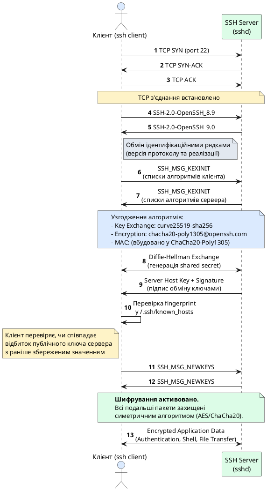
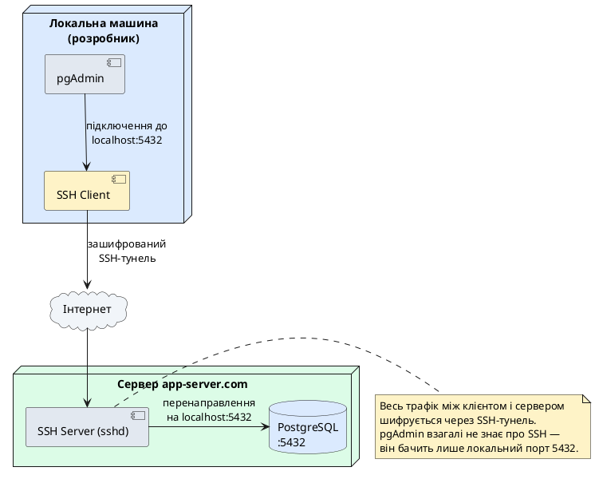

::card-group

::card{title="🎯 Мета лекції" icon="i-lucide-target"}

- Зрозуміти принципи роботи протоколу SSH (*Secure Shell*) та його переваги над незахищеними протоколами віддаленого доступу.
- Опанувати архітектуру SSH: транспортний, автентифікаційний та з'єднувальний рівні протоколу.
- Вивчити механізми автентифікації у SSH: парольна автентифікація та автентифікація за допомогою пари криптографічних ключів.
- Розглянути практичні сценарії застосування SSH: віддалене керування серверами, передача файлів, тунелювання трафіку та проксування з'єднань.

::

::card{title="🔑 Ключові терміни" icon="i-lucide-key"}

- **SSH (Secure Shell):** криптографічний мережевий протокол для безпечного віддаленого керування операційними системами та передачі даних.
- **Public Key Cryptography:** асиметрична криптографія з парою ключів (публічний та приватний) для автентифікації без передачі паролів.
- **SSH Tunnel:** механізм інкапсуляції довільного TCP-трафіку всередину зашифрованого SSH-з'єднання.
- **Port Forwarding:** перенаправлення мережевого трафіку з одного порту на інший через SSH-тунель.
- **Known Hosts:** файл з відбитками (*fingerprints*) публічних ключів серверів для захисту від атак підміни сервера.

::

::

## Історичний контекст та еволюція віддаленого доступу

Задовго до появи хмарних платформ та контейнерної оркестрації системні адміністратори та розробники потребували засобів керування серверами без фізичної присутності перед консоллю машини. У 1960-х роках з'явилися перші протоколи віддаленого доступу, що дозволяли підключатися до мейнфреймів через термінальні пристрої. Проте до середини 1990-х років більшість таких протоколів мали критичну вразливість: **вони передавали всі дані, включаючи паролі, у відкритому вигляді** через мережу.

### Небезпека незахищених протоколів: Telnet та rlogin

Найпоширенішими протоколами віддаленого доступу у доерi інтернету були **Telnet** (RFC 854, 1983) та **rlogin** (*remote login*, BSD Unix). Обидва протоколи працювали поверх TCP та надавали інтерактивний текстовий інтерфейс командної оболонки (*shell*) віддаленої системи. Telnet використовував порт 23, rlogin — порт 513, і жодна з цих реалізацій не застосовувала шифрування.

Це створювало серйозні загрози безпеці:


**1. Прослуховування трафіку (Sniffing):** зловмисник у тій самій локальній мережі або на будь-якому проміжному маршрутизаторі міг перехопити TCP-пакети та витягти з них ім'я користувача, пароль та всі команди, що виконувалися на сервері. Для цього достатньо було запустити утиліту **tcpdump** або **Wireshark** в режимі promiscuous на мережевій карті.

**2. Атака Man-in-the-Middle (MITM):** зловмисник міг перехопити з'єднання між клієнтом і сервером, видаючи себе за сервер перед клієнтом і за клієнта перед сервером. Це дозволяло не лише читати, але й **модифікувати** команди та відповіді в реальному часі — наприклад, замінити команду `sudo rm -rf /tmp/test` на `sudo rm -rf /`, спричинивши катастрофічні наслідки.

**3. Відсутність автентифікації сервера:** клієнт не мав засобів перевірити, що він дійсно підключається до легітимного сервера, а не до підробленої машини зловмисника. Це особливо критично при підключенні через публічні мережі (аеропорти, кафе, готелі), де атакуючий міг налаштувати власний Telnet-сервер із тією самою IP-адресою, що і справжній сервер (через ARP-спуфінг або DNS-отруєння).

У корпоративному та урядовому секторах ці вразливості призводили до витоків конфіденційної інформації, компрометації серверів та саботажу. У 1995 році фінський дослідник безпеки **Тату Юлонен** (*Tatu Ylönen*) зіткнувся з атакою на мережу Гельсінського технологічного університету, де зловмисник перехопив тисячі паролів через прослуховування Telnet-сесій. Це спонукало його розробити альтернативний протокол, що **шифрував би весь трафік** та **автентифікував би обидві сторони** з'єднання.

### Народження SSH

У липні 1995 року Тату Юлонен опублікував першу версію **SSH-1** (*Secure Shell protocol version 1*) як open-source проєкт. Протокол негайно здобув популярність у Unix-спільноті завдяки простоті використання (командний інтерфейс ідентичний Telnet) та радикальному покращенню безпеки. Основні принципи SSH-1:

- **Шифрування всього трафіку:** кожен байт даних, включаючи паролі, команди та відповіді, шифрується симетричним алгоритмом (3DES, Blowfish).
- **Автентифікація сервера:** клієнт перевіряє ідентичність сервера за допомогою криптографічного відбитка (*fingerprint*) його публічного ключа, що запобігає MITM-атакам.
- **Автентифікація клієнта за ключами:** замість паролів можна використовувати пару криптографічних ключів (публічний і приватний), що унеможливлює брутфорс-атаки.

У 1996 році Юлонен заснував компанію **SSH Communications Security** для комерціалізації протоколу, що призвело до закриття вихідного коду майбутніх версій. Проте у 1999 році розробники OpenBSD (проєкт вільної операційної системи на базі BSD Unix) створили форк останньої відкритої версії SSH і випустили **OpenSSH** — повністю вільну реалізацію протоколу, що стала де-факто стандартом у світі Unix/Linux та інтегрована у macOS, Windows 10+, Android, iOS.

У 2006 році IETF (*Internet Engineering Task Force*) стандартизував протокол SSH версії 2 у серії RFC: **RFC 4251–4254**, виправивши вразливості SSH-1 та додавши підтримку сучасних криптографічних алгоритмів. SSH-1 вважається застарілим і небезпечним, тому всі сучасні реалізації використовують виключно **SSH-2**.

::note
На сьогодні SSH є найпоширенішим протоколом віддаленого адміністрування Unix/Linux-серверів. За оцінками, понад **80% веб-серверів у світі** (Apache, Nginx на Linux) керуються через SSH. Протокол також використовується у системах контролю версій (Git через SSH), системах безперервної інтеграції (CI/CD агенти), оркестраторах контейнерів (доступ до Kubernetes-нод) та IoT-пристроях.
::

## Архітектура протоколу SSH

Протокол SSH-2 побудований за **багаторівневою архітектурою**, де кожен рівень відповідає за окремий аспект з'єднання. Це дозволяє модульно розширювати функціональність та підтримувати різні алгоритми шифрування і автентифікації. Згідно з RFC 4251, SSH складається з трьох основних рівнів:

### Транспортний рівень (SSH Transport Layer Protocol, RFC 4253)

Транспортний рівень є базовим компонентом SSH і відповідає за встановлення захищеного каналу зв'язку поверх TCP. Цей рівень працює поверх **TCP порту 22** (стандартний порт SSH-сервера, може бути змінений в конфігурації) і виконує наступні функції:

**1. Узгодження алгоритмів шифрування та стиснення:**
При встановленні з'єднання клієнт і сервер обмінюються списками підтримуваних алгоритмів для:
- Обміну ключами (*key exchange*): Diffie-Hellman (DH), Elliptic Curve Diffie-Hellman (ECDH), Curve25519.
- Шифрування (*encryption*): AES (128/192/256-біт у режимах CTR, GCM), ChaCha20-Poly1305, 3DES (застарілий).
- Обчислення MAC (*Message Authentication Code*): HMAC-SHA256, HMAC-SHA512, Poly1305.
- Стиснення (*compression*): zlib, none.

Обидві сторони вибирають найкращий спільний алгоритм з кожної категорії за пріоритетом, визначеним у конфігурації. Сучасні сервери зазвичай віддають перевагу **ChaCha20-Poly1305** (швидкість) або **AES-256-GCM** (поширеність у апаратних акселераторах).

**2. Обмін ключами та встановлення шифрування:**
SSH використовує **гібридну криптографічну схему**: асиметрична криптографія (RSA, ECDSA, Ed25519) для автентифікації сервера та обміну ключами, а симетрична криптографія (AES, ChaCha20) для шифрування даних сесії.

Процес обміну ключами складається з наступних етапів:

1. Клієнт і сервер обмінюються ідентифікаційними рядками (наприклад, `SSH-2.0-OpenSSH_8.9`).
2. Обидві сторони надсилають пакет `SSH_MSG_KEXINIT` зі списками підтримуваних алгоритмів.
3. Виконується алгоритм Diffie-Hellman для генерації спільного секретного ключа (*shared secret*) без передачі його через мережу.
4. Сервер підписує обмін ключами своїм приватним ключом, і клієнт перевіряє підпис за допомогою публічного ключа сервера (зберігається у файлі `~/.ssh/known_hosts`).
5. З спільного секрету виводяться симетричні ключі для шифрування (окремо для клієнт→сервер і сервер→клієнт), ключі для MAC та вектори ініціалізації (IV).
6. Весь подальший трафік шифрується симетричним алгоритмом.

**3. Цілісність даних:**
Кожен пакет SSH супроводжується кодом автентифікації повідомлення (MAC), що обчислюється з використанням криптографічного хешу (SHA-256/SHA-512) та секретного ключа. Це гарантує, що дані не були модифіковані під час передачі.

**4. Періодична зміна ключів:**
Для захисту від криптоаналізу довготривалих сесій SSH автоматично виконує **re-keying** (повторний обмін ключами) після передачі певного обсягу даних (зазвичай 1 ГБ) або через певний проміжок часу (наприклад, 1 годину). Це відбувається прозоро для застосунку, що працює поверх SSH.

::plant-uml{alt="Процес встановлення SSH-з'єднання та обміну ключами"}



::

### Автентифікаційний рівень (SSH Authentication Protocol, RFC 4252)

Після встановлення захищеного транспортного каналу клієнт має **автентифікувати** себе перед сервером — довести, що він має право доступу до облікового запису користувача. SSH підтримує кілька методів автентифікації, що можуть застосовуватися послідовно або комбіновано:

**1. Парольна автентифікація (`password`):**
Найпростіший метод, де клієнт відправляє ім'я користувача та пароль серверу. Пароль передається у зашифрованому вигляді (весь трафік вже захищений транспортним рівнем), тому навіть прослуховування мережі не дає зловмиснику доступ до пароля. Проте парольна автентифікація вразлива до брутфорс-атак, фішингу та компрометації паролів через витоки баз даних. Багато серверів вимикають парольну автентифікацію у конфігурації (`PasswordAuthentication no` у `/etc/ssh/sshd_config`).

**2. Автентифікація за публічним ключем (`publickey`):**
Найбезпечніший та рекомендований метод. Користувач генерує пару криптографічних ключів (публічний і приватний) локально на своєму комп'ютері. Публічний ключ копіюється на сервер у файл `~/.ssh/authorized_keys`, а приватний ключ залишається на клієнтській машині і **ніколи не передається через мережу**.

Процес автентифікації виглядає так:
1. Клієнт надсилає серверу своє ім'я користувача та публічний ключ.
2. Сервер перевіряє, чи міститься цей публічний ключ у файлі `~/.ssh/authorized_keys` для даного користувача.
3. Якщо ключ знайдено, сервер генерує випадкове повідомлення (*challenge*) і шифрує його публічним ключем клієнта.
4. Клієнт розшифровує challenge за допомогою приватного ключа і підписує відповідь, відправляючи підпис серверу.
5. Сервер перевіряє підпис за допомогою публічного ключа. Якщо підпис валідний, автентифікація успішна.

Цей механізм гарантує, що навіть якщо зловмисник отримає публічний ключ (він і так публічний), він не зможе автентифікуватися без приватного ключа, який захищений паролем-фразою (*passphrase*) на клієнтській машині.

**3. Keyboard-interactive (`keyboard-interactive`):**
Гнучкий метод для багатофакторної автентифікації (MFA). Сервер може запитати користувача ввести кілька параметрів послідовно: пароль, одноразовий код з Google Authenticator, відповідь на контрольне питання. Цей метод використовується для інтеграції SSH з системами двофакторної автентифікації (2FA) через PAM (*Pluggable Authentication Modules*).

**4. GSSAPI (Kerberos):**
Інтеграція з корпоративними системами єдиного входу (*Single Sign-On, SSO*), що дозволяє автентифікуватися за допомогою Kerberos-тікетів без введення пароля. Поширено у корпоративних середовищах Windows Active Directory.

::tip
Для максимальної безпеки рекомендується:
- Використовувати **Ed25519** ключі замість RSA (коротші ключі, швидша генерація, стійкість до атак на основі квантових комп'ютерів).
- Захищати приватні ключі сильною passphrase (мінімум 20 символів).
- Вимкнути парольну автентифікацію на серверах у продакшн-середовищі.
- Використовувати 2FA через `keyboard-interactive` для критичних систем.
::

### З'єднувальний рівень (SSH Connection Protocol, RFC 4254)

Після успішної автентифікації клієнт може відкривати **канали** (*channels*) всередині одного SSH-з'єднання для виконання різних задач. Це дозволяє мультиплексувати кілька логічних з'єднань поверх одного TCP-сокета:

**1. Інтерактивна сесія shell:**
Найпоширеніший канал, що надає доступ до командної оболонки (`bash`, `zsh`, `sh`) віддаленої системи. Клієнт відправляє натискання клавіш, сервер виконує команди та повертає вивід.

**2. Виконання команди (`exec`):**
Замість відкриття інтерактивного shell можна виконати одну команду і отримати результат: `ssh user@host "uptime"`. Це корисно для автоматизації та скриптів.

**3. Підсистеми (`subsystem`):**
Спеціалізовані режими роботи, найвідоміший — **SFTP** (*SSH File Transfer Protocol*), що дозволяє передавати файли через SSH-з'єднання з підтримкою відновлення перерваних завантажень, синхронізації каталогів та керування правами доступу.

**4. Port Forwarding (тунелювання):**
Перенаправлення TCP-портів через SSH-тунель для доступу до сервісів, недоступних напряму з клієнтської мережі. Детально розглянемо у наступних розділах.

Кожен канал має власні потоки даних (stdin, stdout, stderr), буфери та статус завершення, що дозволяє ізольовано обробляти кілька задач одночасно.


## Генерація та керування SSH-ключами

Для практичного використання SSH з автентифікацією за ключами необхідно згенерувати пару ключів на клієнтській машині та налаштувати сервер для прийняття цих ключів. Розглянемо покрокову процедуру.

### Генерація пари ключів

Утиліта **ssh-keygen** (входить до складу OpenSSH) дозволяє створювати криптографічні ключі різних типів. Сучасні рекомендації віддають перевагу алгоритму **Ed25519** (*Edwards-curve Digital Signature Algorithm*), що є частиною сімейства EdDSA:

```bash
ssh-keygen -t ed25519 -C "user@example.com"
```

**Параметри команди:**
- `-t ed25519` — тип ключа. Альтернативи: `rsa` (застарілий, але сумісний), `ecdsa` (еліптична крива NIST), `dsa` (deprecated).
- `-C "user@example.com"` — коментар для ідентифікації ключа (зазвичай email або опис призначення).

Утиліта запитає:

**1. Місце збереження ключа:**
За замовчуванням приватний ключ зберігається у `~/.ssh/id_ed25519`, публічний — у `~/.ssh/id_ed25519.pub`. Можна вказати інший шлях для створення кількох ключів (наприклад, окремі ключі для GitHub, AWS, корпоративних серверів).

**2. Passphrase (парольна фраза):**
Рекомендується встановити сильну passphrase для шифрування приватного ключа на диску. Навіть якщо зловмисник отримає доступ до файлу приватного ключа (наприклад, через крадіжку ноутбука), він не зможе використати його без passphrase. Passphrase має бути довжиною мінімум 20 символів і не містити словникових слів.

Після виконання команди будуть створені два файли:

```
~/.ssh/id_ed25519       # Приватний ключ (НІКОЛИ не передавати нікому!)
~/.ssh/id_ed25519.pub   # Публічний ключ (безпечно розповсюджувати)
```

Вміст публічного ключа виглядає приблизно так:

```
ssh-ed25519 AAAAC3NzaC1lZDI1NTE5AAAAIGh7vZ8K3pQ... user@example.com
```

::warning
Приватний ключ `id_ed25519` має бути захищений правами доступу `600` (читання/запис лише для власника). SSH-клієнт автоматично встановлює ці права при генерації, але якщо файл було скопійовано з іншої системи, перевірте та виправте права:

```bash
chmod 600 ~/.ssh/id_ed25519
chmod 644 ~/.ssh/id_ed25519.pub
```

Якщо права занадто відкриті (наприклад, `644` або `777`), SSH-клієнт відмовиться використовувати ключ з міркувань безпеки.
::

### Копіювання публічного ключа на сервер

Для автентифікації публічний ключ має бути доданий у файл `~/.ssh/authorized_keys` на сервері у домашньому каталозі користувача, під яким ви плануєте підключатися.

**Спосіб 1: Утиліта ssh-copy-id (найпростіший):**

```bash
ssh-copy-id -i ~/.ssh/id_ed25519.pub user@server.example.com
```

Ця команда автоматично додасть ваш публічний ключ у файл `~/.ssh/authorized_keys` на віддаленому сервері. При першому підключенні потрібно буде ввести пароль користувача `user` на сервері.

**Спосіб 2: Ручне копіювання через SSH:**

```bash
cat ~/.ssh/id_ed25519.pub | ssh user@server.example.com "mkdir -p ~/.ssh && cat >> ~/.ssh/authorized_keys"
```

**Спосіб 3: Прямий доступ до сервера:**
Якщо у вас є фізичний або консольний доступ до сервера:

```bash
# На клієнті: скопіюйте вміст публічного ключа
cat ~/.ssh/id_ed25519.pub

# На сервері: додайте ключ у authorized_keys
echo "ssh-ed25519 AAAAC3NzaC1lZDI1NTE5AAAA... user@example.com" >> ~/.ssh/authorized_keys
chmod 700 ~/.ssh
chmod 600 ~/.ssh/authorized_keys
```

Після цього можна підключитися до сервера без введення пароля:

```bash
ssh user@server.example.com
```

SSH-клієнт автоматично використає приватний ключ `~/.ssh/id_ed25519` для автентифікації. Якщо ключ захищений passphrase, буде запропоновано ввести її один раз за сесію (або до перезавантаження, якщо використовується ssh-agent).

### Керування кількома ключами: SSH Config

У реальній роботі часто потрібно використовувати різні ключі для різних серверів (наприклад, окремий ключ для GitHub, AWS, корпоративних серверів). Для спрощення керування створіть файл конфігурації `~/.ssh/config`:

```bash
# GitHub
Host github.com
    HostName github.com
    User git
    IdentityFile ~/.ssh/id_ed25519_github
    IdentitiesOnly yes

# Корпоративні сервери
Host corp-server
    HostName server.company.com
    User admin
    IdentityFile ~/.ssh/id_rsa_corporate
    Port 2222
    
# AWS EC2 інстанси
Host *.compute.amazonaws.com
    User ec2-user
    IdentityFile ~/.ssh/aws-keypair.pem
    StrictHostKeyChecking no
```

**Ключові директиви:**
- `Host` — псевдонім або патерн для відповідності імені хоста.
- `HostName` — реальна адреса сервера (IP або FQDN).
- `User` — ім'я користувача за замовчуванням.
- `IdentityFile` — шлях до приватного ключа для автентифікації.
- `Port` — порт SSH-сервера (якщо не стандартний 22).
- `IdentitiesOnly yes` — використовувати лише вказаний ключ, не перебирати всі ключі з `~/.ssh/`.
- `StrictHostKeyChecking no` — не запитувати підтвердження при першому підключенні (використовуйте обережно, лише для автоматизації у довіреному середовищі).

Тепер можна підключатися за псевдонімом:

```bash
ssh corp-server
# Еквівалентно: ssh -p 2222 admin@server.company.com -i ~/.ssh/id_rsa_corporate
```

### SSH-Agent: кешування паролів приватних ключів

Якщо приватний ключ захищений passphrase, SSH-клієнт запитуватиме її при кожному підключенні, що незручно при частих з'єднаннях. **ssh-agent** — це фонова служба, що зберігає розшифровані приватні ключі у пам'яті, дозволяючи автентифікуватися без повторного введення passphrase.

Запуск ssh-agent:

```bash
# Запустити агента та експортувати змінні оточення
eval "$(ssh-agent -s)"
```

Додавання ключа до агента:

```bash
ssh-add ~/.ssh/id_ed25519
# Буде запрошено ввести passphrase один раз
# Після цього ключ залишатиметься у пам'яті до завершення сесії агента
```

Перегляд завантажених ключів:

```bash
ssh-add -l
```

Видалення всіх ключів з агента:

```bash
ssh-add -D
```

У macOS ssh-agent інтегрований з Keychain — можна зберегти passphrase у зв'язці ключів для автоматичного завантаження при вході у систему:

```bash
ssh-add --apple-use-keychain ~/.ssh/id_ed25519
```

::note
На серверах у продакшн-середовищі **не рекомендується** використовувати ssh-agent з довгим терміном життя — якщо зловмисник отримає доступ до сесії користувача, він зможе використати завантажені ключі для автентифікації на інших серверах без знання passphrase. Для серверів краще використовувати окремі ключі без passphrase з обмеженими правами доступу або інтегрувати SSH з апаратними токенами безпеки (YubiKey, FIDO2).
::

## Практичні сценарії використання SSH

Протокол SSH не обмежується лише віддаленим керуванням серверами через командну оболонку. Його гнучка архітектура дозволяє вирішувати широке коло задач інфраструктурної безпеки та автоматизації.

### Віддалене виконання команд та автоматизація

SSH дозволяє виконувати окремі команди на віддаленому сервері без відкриття інтерактивного shell, що ідеально підходить для автоматизації через скрипти:

```bash
# Перевірка версії ядра на віддаленому сервері
ssh user@server.example.com "uname -r"

# Перезапуск веб-сервера
ssh user@server.example.com "sudo systemctl restart nginx"

# Створення архіву логів та завантаження локально
ssh user@server.example.com "tar -czf - /var/log/app/*.log" > logs-backup.tar.gz
```

Для автоматизації масових операцій на кількох серверах використовують інструменти паралельного виконання SSH-команд:

**Parallel SSH (pssh):**

```bash
# Виконання команди на 10 серверах одночасно
pssh -h servers.txt -l root -i "df -h"
```

**Ansible (автоматизація конфігурації):**

```yaml
- name: Оновлення всіх пакетів на серверах
  hosts: webservers
  tasks:
    - name: apt update and upgrade
      apt:
        upgrade: dist
        update_cache: yes
```

Ansible використовує SSH як транспорт для підключення до керованих вузлів, що робить його agentless-рішенням (не потрібно встановлювати додаткове ПЗ на цільових серверах).

### Безпечна передача файлів: SCP та SFTP

**SCP (Secure Copy Protocol)** — утиліта для копіювання файлів через SSH-з'єднання з синтаксисом, подібним до `cp`:

```bash
# Копіювання файлу на сервер
scp local-file.txt user@server.example.com:/path/to/destination/

# Копіювання файлу з сервера
scp user@server.example.com:/path/to/remote-file.txt ./local-directory/

# Копіювання каталогу рекурсивно
scp -r local-directory/ user@server.example.com:/path/to/destination/

# Копіювання між двома віддаленими серверами
scp user1@server1.com:/file.txt user2@server2.com:/destination/
```

**SFTP (SSH File Transfer Protocol)** — інтерактивний протокол передачі файлів з підтримкою розширених операцій:

```bash
sftp user@server.example.com
```

Після підключення доступні команди:

```bash
ls                # Список файлів на сервері
lls               # Список файлів локально
pwd               # Поточний каталог на сервері
lpwd              # Поточний каталог локально
cd /path          # Перехід у каталог на сервері
lcd /path         # Перехід у каталог локально
get remote.txt    # Завантажити файл з сервера
put local.txt     # Відправити файл на сервер
mget *.log        # Завантажити кілька файлів за патерном
mkdir dirname     # Створити каталог на сервері
rm file.txt       # Видалити файл на сервері
exit              # Завершити сесію
```

SFTP підтримує відновлення перерваних завантажень (команда `reget`) та синхронізацію каталогів, що робить його придатним для резервного копіювання великих обсягів даних.

::tip
Для автоматичної синхронізації файлів між локальною машиною та сервером використовуйте **rsync** через SSH:

```bash
rsync -avz -e ssh /local/directory/ user@server.example.com:/remote/directory/
```

**Параметри:**
- `-a` — архівний режим (зберігає права доступу, часові мітки, символічні посилання).
- `-v` — детальний вивід (verbose).
- `-z` — стиснення даних під час передачі.
- `-e ssh` — використовувати SSH як транспорт.

rsync передає лише змінені частини файлів, що робить його набагато ефективнішим за scp для повторюваних синхронізацій.
::


### SSH Port Forwarding: тунелювання трафіку

Одна з найпотужніших можливостей SSH — здатність **тунелювати** довільний TCP-трафік через зашифроване SSH-з'єднання. Це дозволяє безпечно підключатися до сервісів, недоступних напряму з вашої мережі, або шифрувати трафік застосунків, що не підтримують TLS.

#### Local Port Forwarding (Локальне перенаправлення)

Локальне перенаправлення дозволяє підключитися до порту на вашій локальній машині, а SSH-клієнт перенаправить з'єднання через сервер до цільового хоста.

**Сценарій:** база даних PostgreSQL на порту 5432 доступна лише з серверу `app-server.com`, але не з вашої локальної машини напряму (закрита файрволом). Ви хочете підключитися до неї через pgAdmin локально.

```bash
ssh -L 5432:localhost:5432 user@app-server.com
```

**Що відбувається:**
1. SSH-клієнт відкриває TCP-порт 5432 на вашій локальній машині.
2. Будь-який трафік, надісланий на `localhost:5432` локально, перенаправляється через SSH-тунель до `app-server.com`.
3. `app-server.com` підключається до `localhost:5432` (PostgreSQL на тому самому сервері) і повертає відповідь через тунель.

Тепер можна підключитися до бази даних локально:

```bash
psql -h localhost -p 5432 -U dbuser -d production
```

**Загальний синтаксис:**

```bash
ssh -L [local_addr:]local_port:remote_addr:remote_port user@ssh_server
```

**Приклад доступу до внутрішнього веб-сервісу:**

```bash
ssh -L 8080:internal-api.local:80 user@gateway.company.com
```

Відкрийте браузер на `http://localhost:8080` — побачите веб-сервіс `internal-api.local`, доступний лише у внутрішній корпоративній мережі.

::plant-uml{alt="Local Port Forwarding: доступ до внутрішньої бази даних"}



::

#### Remote Port Forwarding (Віддалене перенаправлення)

Віддалене перенаправлення працює у зворотному напрямку: порт на SSH-сервері перенаправляє трафік назад на вашу локальну машину. Це корисно для демонстрації локального веб-застосунку колегам або тестування webhook без публічної IP-адреси.

**Сценарій:** ви розробляєте веб-застосунок локально на `localhost:3000` і хочете, щоб колега міг отримати до нього доступ через віддалений сервер.

```bash
ssh -R 8080:localhost:3000 user@public-server.com
```

**Що відбувається:**
1. SSH-сервер `public-server.com` відкриває порт 8080 на своєму інтерфейсі.
2. Будь-який трафік на `public-server.com:8080` перенаправляється через SSH-тунель назад на вашу машину до `localhost:3000`.

Колега може відкрити браузер на `http://public-server.com:8080` і побачить ваш локальний застосунок.

**Загальний синтаксис:**

```bash
ssh -R [remote_addr:]remote_port:local_addr:local_port user@ssh_server
```

::warning
За замовчуванням SSH-сервер дозволяє віддалене перенаправлення лише на інтерфейс `localhost` (тобто `public-server.com:8080` буде доступний лише локально на сервері). Щоб дозволити зовнішні з'єднання, адміністратор сервера має встановити `GatewayPorts yes` у конфігурації `/etc/ssh/sshd_config` та перезапустити `sshd`. Використовуйте цю функцію обережно — вона відкриває локальні сервіси назовні через публічний сервер.
::

#### Dynamic Port Forwarding: SOCKS-проксі

Динамічне перенаправлення перетворює SSH-клієнт на **SOCKS-проксі**, через який можна маршрутизувати весь трафік браузера або застосунку.

```bash
ssh -D 1080 user@server.example.com
```

**Що відбувається:**
1. SSH-клієнт відкриває SOCKS5-проксі на порту 1080 вашої локальної машини.
2. Будь-який застосунок, налаштований на використання SOCKS-проксі `localhost:1080`, буде маршрутизувати весь свій трафік через SSH-тунель до `server.example.com`, а звідти — до кінцевих пунктів призначення.

**Налаштування браузера:**
У Firefox: Settings → Network Settings → Manual proxy configuration:
- SOCKS Host: `localhost`
- Port: `1080`
- SOCKS v5

Тепер весь трафік браузера йде через сервер `server.example.com`, що корисно для:
- **Обходу географічних обмежень:** якщо `server.example.com` знаходиться у США, веб-сайти бачитимуть запити з США.
- **Захисту у публічних мережах:** весь трафік шифрується до SSH-сервера, що запобігає прослуховуванню у Wi-Fi кафе/аеропорту.
- **Доступу до корпоративних ресурсів:** якщо `server.example.com` знаходиться у внутрішній корпоративній мережі, ви отримуєте доступ до всіх внутрішніх сервісів.

::tip
Для автоматизації SSH-тунелів зі збереженням з'єднання у фоновому режимі використовуйте опції:

```bash
ssh -f -N -L 5432:localhost:5432 user@server.com
```

**Параметри:**
- `-f` — перейти у фоновий режим після автентифікації.
- `-N` — не виконувати віддалені команди (лише тунелювання).
- `-T` — не виділяти псевдотермінал (для неінтерактивних сесій).

Для закриття фонового тунелю знайдіть процес через `ps aux | grep ssh` і завершіть через `kill <PID>`.
::

### SSH у системах контролю версій: Git через SSH

Більшість платформ хостингу Git-репозиторіїв (GitHub, GitLab, Bitbucket) підтримують доступ до репозиторіїв через SSH як альтернативу HTTPS. Це усуває необхідність вводити пароль при кожній операції `git push` або `git pull` і забезпечує вищий рівень безпеки.

**Налаштування SSH для GitHub:**

1. Згенеруйте SSH-ключ:

```bash
ssh-keygen -t ed25519 -C "your_email@example.com" -f ~/.ssh/id_ed25519_github
```

2. Скопіюйте публічний ключ:

```bash
cat ~/.ssh/id_ed25519_github.pub
```

3. Додайте ключ у налаштуваннях GitHub: Settings → SSH and GPG keys → New SSH key → вставте вміст `.pub` файлу.

4. Налаштуйте SSH config:

```bash
# ~/.ssh/config
Host github.com
    HostName github.com
    User git
    IdentityFile ~/.ssh/id_ed25519_github
    IdentitiesOnly yes
```

5. Перевірте з'єднання:

```bash
ssh -T git@github.com
# Hi username! You've successfully authenticated, but GitHub does not provide shell access.
```

6. Клонуйте репозиторій через SSH:

```bash
git clone git@github.com:username/repository.git
```

Тепер всі операції `git push`, `git pull`, `git fetch` виконуватимуться через SSH без запиту паролів.

::note
GitHub (та інші Git-платформи) не надають інтерактивного shell-доступу через SSH — з'єднання використовується виключно для операцій Git. Спроба підключитися через `ssh git@github.com` поверне повідомлення про успішну автентифікацію, але не відкриє shell.
::

## Захист SSH-серверів та рекомендації безпеки

SSH-сервери є критичною точкою входу у інфраструктуру, тому їхня конфігурація має відповідати найвищим стандартам безпеки. Розглянемо ключові заходи захисту.

### Зміна стандартного порту

За замовчуванням SSH-сервер слухає на порту **22**. Автоматизовані боти сканують інтернет у пошуку відкритих портів 22 та намагаються брутфорсити паролі. Хоча зміна порту не є повноцінним захистом (security through obscurity), вона значно зменшує кількість автоматизованих атак.

```bash
# /etc/ssh/sshd_config
Port 2222
```

Після зміни перезапустіть SSH-сервер:

```bash
sudo systemctl restart sshd
```

Тепер підключення виконується через нестандартний порт:

```bash
ssh -p 2222 user@server.example.com
```

### Вимкнення парольної автентифікації

Після налаштування автентифікації за ключами вимкніть парольну автентифікацію для запобігання брутфорсу:

```bash
# /etc/ssh/sshd_config
PasswordAuthentication no
ChallengeResponseAuthentication no
UsePAM no
```

### Вимкнення root-логіну

Пряме підключення під користувачем `root` є поганою практикою. Замість цього підключайтеся під звичайним користувачем і використовуйте `sudo` для адміністративних задач:

```bash
# /etc/ssh/sshd_config
PermitRootLogin no
```

Якщо root-логін необхідний для автоматизації (наприклад, Ansible), дозвольте лише автентифікацію за ключами:

```bash
PermitRootLogin prohibit-password
```

### Обмеження доступу за списком користувачів

Дозволити SSH-доступ лише конкретним користувачам:

```bash
# /etc/ssh/sshd_config
AllowUsers alice bob deploy
```

Або заборонити конкретних користувачів:

```bash
DenyUsers hacker guest
```

Для обмеження за групами:

```bash
AllowGroups ssh-users admins
```

### Налаштування таймауту неактивності

Автоматично розривати з'єднання після періоду неактивності:

```bash
# /etc/ssh/sshd_config
ClientAliveInterval 300       # Відправляти keepalive кожні 5 хвилин
ClientAliveCountMax 2         # Розривати після 2 невдалих keepalive (10 хвилин неактивності)
```

### Обмеження кількості спроб автентифікації

```bash
# /etc/ssh/sshd_config
MaxAuthTries 3
MaxSessions 5
```

### Використання Fail2Ban для блокування атакуючих IP

**Fail2Ban** моніторить лог-файли SSH (`/var/log/auth.log`) та автоматично блокує IP-адреси після кількох невдалих спроб автентифікації.

Встановлення:

```bash
sudo apt install fail2ban   # Debian/Ubuntu
sudo yum install fail2ban    # CentOS/RHEL
```

Конфігурація (`/etc/fail2ban/jail.local`):

```ini
[sshd]
enabled = true
port = 2222
filter = sshd
logpath = /var/log/auth.log
maxretry = 3
bantime = 3600
findtime = 600
```

**Параметри:**
- `maxretry` — кількість невдалих спроб до блокування.
- `bantime` — час блокування у секундах (3600 = 1 година).
- `findtime` — вікно часу для підрахунку спроб (600 = 10 хвилин).

Запуск:

```bash
sudo systemctl enable fail2ban
sudo systemctl start fail2ban
```

Перегляд заблокованих IP:

```bash
sudo fail2ban-client status sshd
```

### Двофакторна автентифікація (2FA)

Для критичних серверів додайте 2FA через Google Authenticator:

```bash
sudo apt install libpam-google-authenticator
```

Налаштування для користувача:

```bash
google-authenticator
# Відповісти 'y' на всі запитання, зберегти QR-код
```

Конфігурація PAM (`/etc/pam.d/sshd`):

```bash
auth required pam_google_authenticator.so
```

Конфігурація SSH (`/etc/ssh/sshd_config`):

```bash
ChallengeResponseAuthentication yes
AuthenticationMethods publickey,keyboard-interactive
```

Тепер для підключення потрібні: SSH-ключ + одноразовий код з Google Authenticator.

::caution
При налаштуванні 2FA переконайтеся, що у вас залишається альтернативний спосіб доступу (консоль через хмарну панель керування), інакше втрата телефону з Authenticator може назавжди заблокувати доступ до сервера.
::


## Розширені можливості та інструменти SSH

Окрім базових функцій віддаленого доступу, SSH надає низку розширених можливостей для автоматизації, моніторингу та інтеграції з іншими системами.

### SSH-сесії з multiplexing: tmux та screen

При роботі через SSH часто виникає необхідність залишити процес працювати після розриву з'єднання (наприклад, довготривале завантаження даних, компіляція, навчання моделі машинного навчання). **tmux** (*terminal multiplexer*) та **screen** дозволяють створювати постійні сесії, що існують незалежно від SSH-з'єднання.

**Використання tmux:**

```bash
# Створення нової іменованої сесії
tmux new -s deployment

# Всередині tmux можна запустити довготривалий процес
./deploy-script.sh

# Від'єднатися від сесії (процес продовжує працювати)
# Натиснути Ctrl+B, потім D

# Закрити SSH-з'єднання
exit

# Пізніше: підключитися знову та приєднатися до сесії
ssh user@server.com
tmux attach -t deployment

# Список всіх сесій
tmux ls

# Вбити сесію після завершення роботи
tmux kill-session -t deployment
```

**Ключові можливості tmux:**
- Вертикальні та горизонтальні розділення вікна (*split panes*).
- Кілька вікон у одній сесії з табами.
- Копіювання та вставка тексту у режимі scroll-back.
- Автоматичне відновлення сесій після перезапуску сервера (через плагіни).

### Переадресація X11: віддалений графічний інтерфейс

SSH підтримує переадресацію **X11** — протоколу віконної системи Unix, що дозволяє запускати графічні застосунки на віддаленому сервері, але відображати їх локально.

```bash
ssh -X user@server.example.com
firefox &
```

Браузер Firefox запуститься на сервері, але його вікно з'явиться на вашому локальному екрані. Всі обчислення виконуються на сервері, через SSH передаються лише графічні команди (малювання вікон, реакція на кліки).

**Вимоги:**
- На клієнті має бути встановлений X11-сервер (Linux/macOS мають вбудовані, Windows потребує XMing або VcXsrv).
- На сервері: `X11Forwarding yes` у `/etc/ssh/sshd_config`.

Для безпечнішої переадресації використовуйте `-Y` (trusted X11 forwarding):

```bash
ssh -Y user@server.example.com
```

::note
X11 forwarding має високу затримку через обсяг даних, що передаються (малювання кожного пікселя). Для професійної роботи з віддаленими графічними застосунками краще використовувати протоколи віддаленого робочого столу: **RDP** (Windows), **VNC** (кросплатформенний) або сучасні рішення типу **NoMachine**, **Chrome Remote Desktop**, які оптимізовані для відеостиснення та інтерактивності.
::

### ProxyJump: доступ через проміжні хости

У корпоративних мережах серверні інфраструктури часто захищені **bastion host** (*jump server*) — виділеним сервером, доступним з інтернету, через який здійснюється доступ до внутрішніх серверів.

Традиційний підхід вимагав двох SSH-з'єднань:

```bash
# Крок 1: підключитися до bastion
ssh user@bastion.company.com

# Крок 2: з bastion підключитися до внутрішнього сервера
ssh user@internal-server.local
```

SSH підтримує **ProxyJump** для автоматичного проксування через проміжні хости:

```bash
ssh -J user@bastion.company.com user@internal-server.local
```

Або у конфігурації `~/.ssh/config`:

```bash
Host internal-*
    ProxyJump user@bastion.company.com
    User admin

Host internal-web
    HostName web-server.internal
    
Host internal-db
    HostName db-server.internal
```

Тепер можна підключатися напряму:

```bash
ssh internal-web
# SSH автоматично підключиться до bastion, а через нього до web-server.internal
```

**Ланцюжки проксі:**

```bash
ssh -J user1@hop1.com,user2@hop2.com user3@destination.com
# Через hop1 → hop2 → destination
```

### ControlMaster: повторне використання з'єднань

При частих SSH-з'єднаннях до одного сервера (наприклад, git push/pull, rsync) встановлення нового TCP-з'єднання та повторна автентифікація створюють затримку. **ControlMaster** дозволяє повторно використовувати вже встановлене з'єднання для нових сесій.

```bash
# ~/.ssh/config
Host *
    ControlMaster auto
    ControlPath ~/.ssh/sockets/%r@%h:%p
    ControlPersist 10m
```

**Параметри:**
- `ControlMaster auto` — автоматично створювати або повторно використовувати master-з'єднання.
- `ControlPath` — шлях до UNIX-сокета для комунікації між сесіями.
- `ControlPersist 10m` — зберігати master-з'єднання активним 10 хвилин після закриття останньої сесії.

Після цього перше `ssh server.com` встановить з'єднання, а всі наступні сесії (навіть в інших терміналах) миттєво приєднуватимуться до існуючого з'єднання без автентифікації.

### SSH Escape Sequences: керування сесією

Всередині SSH-сесії можна використовувати **escape sequences** для керування з'єднанням, не закриваючи термінал:

- `~.` (тільда-крапка) — негайно розірвати з'єднання (корисно, якщо сесія зависла).
- `~^Z` (тільда-Ctrl+Z) — відправити SSH-процес у фон (можна повернути через `fg`).
- `~#` — показати список переадресованих з'єднань.
- `~?` — показати список всіх escape sequences.

**Важливо:** тільда має бути першим символом після Enter, інакше вона інтерпретується як звичайний текст.

```bash
ssh user@server.com
# Виконуємо команду, сесія зависла
# Натискаємо Enter, потім ~.
# З'єднання миттєво розривається
```

### SSH через HTTP(S) проксі

У корпоративних мережах прямі TCP-з'єднання на порт 22 можуть бути заблоковані, але доступ до інтернету здійснюється через HTTP-проксі. SSH можна налаштувати для роботи через проксі за допомогою утиліти **ProxyCommand**:

```bash
# ~/.ssh/config
Host external-server
    HostName server.example.com
    ProxyCommand corkscrew proxy.company.com 8080 %h %p
```

**corkscrew** — утиліта для тунелювання SSH через HTTP CONNECT проксі.

Встановлення:

```bash
sudo apt install corkscrew
```

Для HTTPS-проксі з автентифікацією:

```bash
ProxyCommand corkscrew proxy.company.com 8080 %h %p ~/.ssh/proxyauth
```

Файл `~/.ssh/proxyauth`:

```
username:password
```

## Порівняння SSH з альтернативними протоколами віддаленого доступу

Для розуміння переваг SSH корисно порівняти його з іншими протоколами віддаленого керування системами.

| Характеристика | SSH | Telnet | RDP | VNC |
|---|---|---|---|---|
| **Шифрування** | Так (AES, ChaCha20) | Ні (відкритий текст) | Так (TLS опціонально) | Опціонально (потребує TLS-тунель) |
| **Автентифікація** | Пароль, ключі, 2FA | Пароль (відкрито) | Пароль, смарт-карти | Пароль (слабке хешування) |
| **Протокол** | TCP порт 22 | TCP порт 23 | TCP порт 3389 | TCP порт 5900 |
| **Інтерфейс** | Текстовий термінал | Текстовий термінал | Графічний (Windows Desktop) | Графічний (кросплатформенний) |
| **Передача файлів** | Вбудована (SCP, SFTP) | Немає | Вбудована (дисковий маппінг) | Немає (потрібні сторонні утиліти) |
| **Тунелювання** | Вбудоване (Local/Remote/Dynamic) | Немає | Немає | Немає |
| **Кросплатформенність** | Unix, Linux, macOS, Windows | Unix, Linux (застарілий) | Windows, macOS, Linux (клієнти) | Кросплатформенний |
| **Використання** | Системне адміністрування, автоматизація | Застарілий (заборонений у PCI DSS) | Віддалений робочий стіл Windows | Віддалений робочий стіл серверів |
| **Затримка** | Низька (~10–50 мс) | Низька (~10–50 мс) | Середня (~50–200 мс) | Висока (~100–500 мс, залежить від compression) |
| **Пропускна здатність** | Мінімальна (текст) | Мінімальна (текст) | Висока (відео-стиснення) | Дуже висока (передача кожного пікселя) |

::note
**PCI DSS** (*Payment Card Industry Data Security Standard*) — стандарт безпеки платіжних карток — **забороняє використання Telnet** для будь-яких систем, що обробляють платіжну інформацію. Компанії, що не дотримуються цього правила, втрачають сертифікацію та можливість приймати платежі Visa/Mastercard.
::

**Коли використовувати SSH:**
- Системне адміністрування Unix/Linux-серверів.
- Автоматизація через скрипти та CI/CD-пайплайни.
- Безпечна передача файлів (SFTP, rsync).
- Тунелювання трафіку для доступу до внутрішніх сервісів.
- Git-операції з віддаленими репозиторіями.

**Коли використовувати RDP:**
- Віддалений робочий стіл Windows Server з графічним інтерфейсом.
- Робота з Windows-застосунками (SQL Server Management Studio, .NET розробка).

**Коли використовувати VNC:**
- Віддалений робочий стіл Linux з графічним інтерфейсом (GNOME, KDE).
- Підтримка користувачів із візуальною демонстрацією (технічна підтримка).
- Доступ до серверів без клавіатури/монітора (headless серверів).

## Питання для самоперевірки

::accordion

::accordion-item{label="❓ Чому протокол Telnet є небезпечним і які конкретні загрози він створює?" icon="i-lucide-help-circle"}

Протокол Telnet передає всі дані, включаючи паролі та команди, у **відкритому вигляді** без будь-якого шифрування. Це створює три критичні загрози:

1. **Sniffing (прослуховування):** зловмисник у тій самій мережі або на проміжному маршрутизаторі може перехопити TCP-пакети за допомогою утиліт tcpdump або Wireshark і витягти ім'я користувача, пароль та всі виконані команди.

2. **Man-in-the-Middle (MITM):** атакуючий може перехопити з'єднання і не лише читати, але й **модифікувати** команди в реальному часі, наприклад, замінити `rm /tmp/test` на `rm -rf /`, що призведе до знищення системи.

3. **Відсутність автентифікації сервера:** клієнт не має засобів перевірити, що підключається до справжнього сервера, а не до підробленого сервера зловмисника (DNS-спуфінг, ARP-отруєння).

SSH вирішує всі ці проблеми через шифрування всього трафіку (AES, ChaCha20), автентифікацію сервера за fingerprint публічного ключа та підтримку автентифікації клієнта за криптографічними ключами.

::

::accordion-item{label="❓ Як працює автентифікація за публічним ключем у SSH і чому вона безпечніша за парольну?" icon="i-lucide-help-circle"}

Автентифікація за публічним ключем використовує **асиметричну криптографію** з парою ключів:

**Процес налаштування:**
1. Користувач генерує пару ключів локально: приватний (`id_ed25519`) і публічний (`id_ed25519.pub`).
2. Публічний ключ копіюється на сервер у файл `~/.ssh/authorized_keys`.
3. Приватний ключ залишається на клієнтській машині і **ніколи не передається через мережу**.

**Процес автентифікації:**
1. Клієнт надсилає серверу публічний ключ.
2. Сервер перевіряє, чи міститься цей ключ у `authorized_keys`.
3. Сервер генерує випадкове повідомлення (challenge) і шифрує його публічним ключем клієнта.
4. Клієнт розшифровує challenge приватним ключем і підписує відповідь.
5. Сервер перевіряє підпис публічним ключем — якщо валідний, автентифікація успішна.

**Переваги над паролями:**
- Неможливо брутфорсити (приватний ключ 256-біт Ed25519 ≈ пароль з 43 випадкових символів).
- Приватний ключ не передається через мережу, тому прослуховування не дає зловмиснику доступ.
- Приватний ключ захищений passphrase локально — навіть крадіжка файлу ключа не дає доступу без passphrase.
- Один публічний ключ можна додати на сотні серверів — зміна одного пароля вимагає оновлення на всіх серверах, зміна passphrase ключа не вимагає змін на серверах.

::

::accordion-item{label="❓ У чому різниця між Local, Remote та Dynamic Port Forwarding у SSH?" icon="i-lucide-help-circle"}

**Local Port Forwarding (`-L`):**
Відкриває порт на **локальній машині**, трафік перенаправляється через SSH-сервер до цільового хоста.

```bash
ssh -L 5432:localhost:5432 user@server.com
```

**Сценарій:** база даних на сервері доступна лише локально (закрита файрволом). Підключаєтеся до `localhost:5432` локально, SSH пересилає трафік на сервер, де він підключається до `localhost:5432` (БД на тому самому сервері).

**Remote Port Forwarding (`-R`):**
Відкриває порт на **SSH-сервері**, трафік перенаправляється назад на локальну машину.

```bash
ssh -R 8080:localhost:3000 user@public-server.com
```

**Сценарій:** локальний веб-застосунок на `localhost:3000` стає доступним через `public-server.com:8080`. Колеги можуть переглянути ваш локальний застосунок через публічний сервер.

**Dynamic Port Forwarding (`-D`):**
SSH-клієнт стає **SOCKS5-проксі**. Весь трафік застосунку маршрутизується через SSH-сервер до будь-яких пунктів призначення.

```bash
ssh -D 1080 user@server.com
```

**Сценарій:** налаштуйте браузер на використання SOCKS-проксі `localhost:1080`. Весь веб-трафік йде через сервер — корисно для обходу географічних обмежень, захисту у публічних Wi-Fi або доступу до корпоративних ресурсів через VPN-сервер.

::

::accordion-item{label="❓ Що таке Known Hosts і як SSH захищається від атак Man-in-the-Middle?" icon="i-lucide-help-circle"}

При першому підключенні до SSH-сервера клієнт **не знає**, чи це справжній сервер, чи підроблений зловмисником. SSH вирішує цю проблему через механізм **known hosts**:

**Перше підключення:**
1. Клієнт отримує публічний ключ сервера та обчислює його криптографічний відбиток (fingerprint), наприклад:
   ```
   SHA256:nThbg6kXUpJWGl7E1IGOCspRomTxdCARLviKw6E5SY8
   ```
2. Клієнт запитує користувача підтвердити fingerprint (зазвичай порівнюють з офіційною документацією сервера або отримують через альтернативний безпечний канал).
3. Після підтвердження публічний ключ сервера зберігається у файлі `~/.ssh/known_hosts`.

**Наступні підключення:**
1. Клієнт отримує публічний ключ сервера і порівнює його з збереженим у `known_hosts`.
2. Якщо ключі збігаються — з'єднання продовжується.
3. Якщо ключі **не збігаються** — SSH видає попередження **"WARNING: REMOTE HOST IDENTIFICATION HAS CHANGED!"** і **блокує з'єднання**.

**Захист від MITM:**
Якщо зловмисник підміняє сервер (DNS-спуфінг, ARP-отруєння), він не зможе надати публічний ключ справжнього сервера (бо не має приватного ключа). SSH виявить невідповідність fingerprint і попередить користувача про можливу атаку.

**Примітка:** це не захищає при першому підключенні (Trust On First Use, TOFU) — користувач має самостійно перевірити fingerprint через альтернативний канал (наприклад, офіційний сайт хмарного провайдера публікує fingerprints серверів).

::

::accordion-item{label="❓ Навіщо потрібен SSH-Agent і як він підвищує безпеку та зручність?" icon="i-lucide-help-circle"}

SSH-Agent — це фонова служба, що зберігає **розшифровані приватні ключі у пам'яті**, дозволяючи автентифікуватися без повторного введення passphrase при кожному підключенні.

**Проблема без агента:**
Якщо приватний ключ захищений passphrase (рекомендовано), SSH запитує її при кожному підключенні. При частих з'єднаннях (git push/pull, rsync, автоматизація) це незручно.

**Рішення через SSH-Agent:**
1. Запустити агента: `eval "$(ssh-agent -s)"`
2. Завантажити ключ: `ssh-add ~/.ssh/id_ed25519` (запитає passphrase один раз).
3. Ключ зберігається у пам'яті процесу агента у розшифрованому вигляді.
4. SSH-клієнт при автентифікації звертається до агента, який підписує challenge без запиту passphrase.

**Переваги:**
- **Зручність:** passphrase вводиться один раз за сесію, а не при кожному з'єднанні.
- **Безпека:** приватний ключ на диску залишається зашифрованим passphrase. Навіть якщо зловмисник скопіює файл ключа, він не зможе використати його без passphrase.
- **Agent Forwarding:** можна пересилати автентифікацію через проміжні сервери без копіювання приватних ключів на ці сервери (використовується через `ssh -A`).

**Застереження:**
На серверах у продакшн-середовищі довготривалі SSH-агенти створюють ризик — якщо зловмисник отримає доступ до сесії користувача, він зможе використати завантажені ключі без знання passphrase. Для серверів краще використовувати окремі ключі без passphrase з обмеженими правами або апаратні токени (YubiKey).

::

::accordion-item{label="❓ Як захистити SSH-сервер від брутфорс-атак та автоматизованих сканувань?" icon="i-lucide-help-circle"}

Комплексний захист SSH-сервера включає кілька рівнів:

**1. Вимкнення парольної автентифікації:**
```bash
# /etc/ssh/sshd_config
PasswordAuthentication no
```
Брутфорс паролів стає неможливим — автентифікація лише за ключами.

**2. Зміна стандартного порту:**
```bash
Port 2222
```
Зменшує кількість автоматизованих атак від ботів, що сканують порт 22.

**3. Обмеження доступу за списком користувачів:**
```bash
AllowUsers alice bob
PermitRootLogin no
```
Навіть якщо зловмисник отримає валідний SSH-ключ, він не зможе підключитися під непередбаченим користувачем.

**4. Fail2Ban — автоматичне блокування атакуючих IP:**
Моніторить `/var/log/auth.log` та блокує IP після кількох невдалих спроб автентифікації:
```ini
[sshd]
maxretry = 3
bantime = 3600
findtime = 600
```
Після 3 невдалих спроб за 10 хвилин IP блокується на 1 годину.

**5. Двофакторна автентифікація (2FA):**
Вимагає SSH-ключ + одноразовий код з Google Authenticator:
```bash
AuthenticationMethods publickey,keyboard-interactive
```
Навіть компрометація приватного ключа не дає доступу без фізичного телефону.

**6. Обмеження мережевого доступу через файрвол:**
```bash
# Дозволити SSH лише з корпоративної мережі
sudo ufw allow from 203.0.113.0/24 to any port 2222
```

**7. Моніторинг та логування:**
Централізоване збирання SSH-логів (ELK Stack, Splunk) для виявлення підозрілих патернів (з'єднання з нових країн, брутфорс з розподілених IP).

Комбінація цих заходів робить SSH-сервер практично неможливим для зламу без фізичного доступу або компрометації приватних ключів.

::

::

## Підсумок

Протокол **SSH (Secure Shell)** є фундаментальною технологією безпечного віддаленого керування системами, що революціонізувала адміністрування Unix/Linux-інфраструктури та замінила небезпечні протоколи Telnet і rlogin. SSH забезпечує наскрізне шифрування всього трафіку, взаємну автентифікацію клієнта та сервера за допомогою криптографічних ключів і захист від атак Man-in-the-Middle через механізм known hosts.

Ключові аспекти, розглянуті у лекції:

::card-group

::card{title="🏗️ Архітектура протоколу" icon="i-lucide-layers"}

SSH складається з трьох рівнів: транспортний (встановлення шифрування, обмін ключами Diffie-Hellman), автентифікаційний (підтвердження ідентичності через паролі або криптографічні ключі) та з'єднувальний (мультиплексування каналів для shell, SFTP, port forwarding). Використовує сучасні алгоритми: Ed25519/RSA для автентифікації, AES-256/ChaCha20 для шифрування, SHA-256 для цілісності.

::

::card{title="🔐 Автентифікація за ключами" icon="i-lucide-key-round"}

Найбезпечніший метод: генерація пари ключів локально (Ed25519 рекомендовано), публічний ключ копіюється на сервер у `authorized_keys`, приватний залишається на клієнті і захищений passphrase. Автентифікація через challenge-response без передачі секретів мережею. SSH-Agent кешує розшифровані ключі для зручності.

::

::card{title="🚇 SSH-тунелювання" icon="i-lucide-arrow-right-left"}

Local Port Forwarding (доступ до віддалених сервісів через локальний порт), Remote Port Forwarding (публікація локальних сервісів через віддалений сервер), Dynamic Port Forwarding (SOCKS-проксі для маршрутизації всього трафіку). Використання для доступу до баз даних через bastion-хости, обходу географічних обмежень, захисту трафіку у публічних мережах.

::

::card{title="🛡️ Захист SSH-серверів" icon="i-lucide-shield"}

Вимкнення парольної автентифікації, заборона root-логіну, зміна стандартного порту, обмеження доступу за списком користувачів, Fail2Ban для блокування брутфорс-атак, двофакторна автентифікація через Google Authenticator, моніторинг логів. Періодична ротація ключів та аудит authorized_keys.

::

::card{title="📁 Передача файлів" icon="i-lucide-file-transfer"}

SCP для простого копіювання файлів, SFTP для інтерактивної роботи з підтримкою відновлення завантажень, rsync для інкрементальної синхронізації великих каталогів. Всі протоколи працюють поверх SSH-з'єднання з повним шифруванням. Інтеграція з системами контролю версій (Git через SSH).

::

::card{title="🔧 Розширені можливості" icon="i-lucide-wrench"}

tmux/screen для постійних сесій, що існують незалежно від SSH-з'єднання. X11 Forwarding для запуску графічних застосунків. ProxyJump для доступу через bastion-хости. ControlMaster для повторного використання з'єднань. SSH Config для керування кількома ключами та профілями підключення.

::

::

SSH став універсальним стандартом не лише для адміністрування серверів, але й для автоматизації DevOps-процесів (Ansible, CI/CD), доступу до Git-репозиторіїв (GitHub, GitLab), керування хмарними інфраструктурами (AWS, Azure, GCP) та захисту мережевого трафіку через тунелювання. Розуміння внутрішньої будови SSH, механізмів криптографії та практичних сценаріїв застосування є критично важливим для будь-якого інженера, що працює з серверними системами.

::tip
Для поглибленого вивчення протоколу SSH рекомендується ознайомитися зі специфікаціями **RFC 4251–4254** (The Secure Shell Protocol), офіційною документацією **OpenSSH** та практичними гайдами з налаштування безпеки серверів. Практичне закріплення матеріалу доцільно здійснювати через розгортання власного SSH-сервера на віртуальній машині або хмарному інстансі з налаштуванням автентифікації за ключами, port forwarding та Fail2Ban.
::
