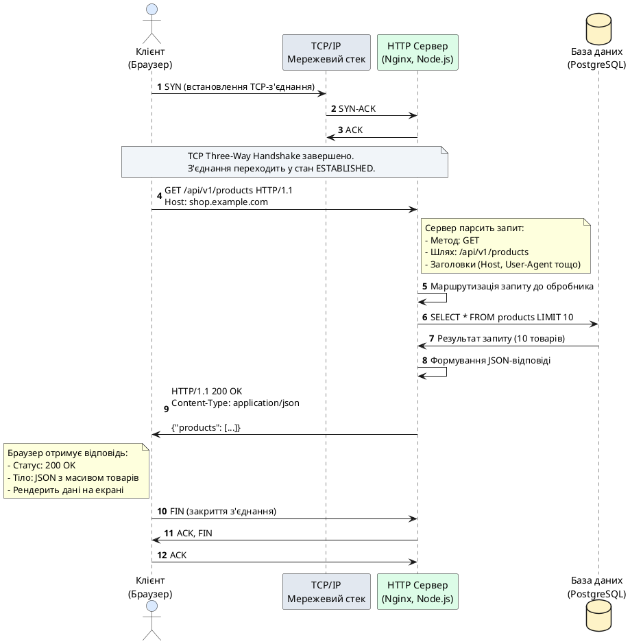
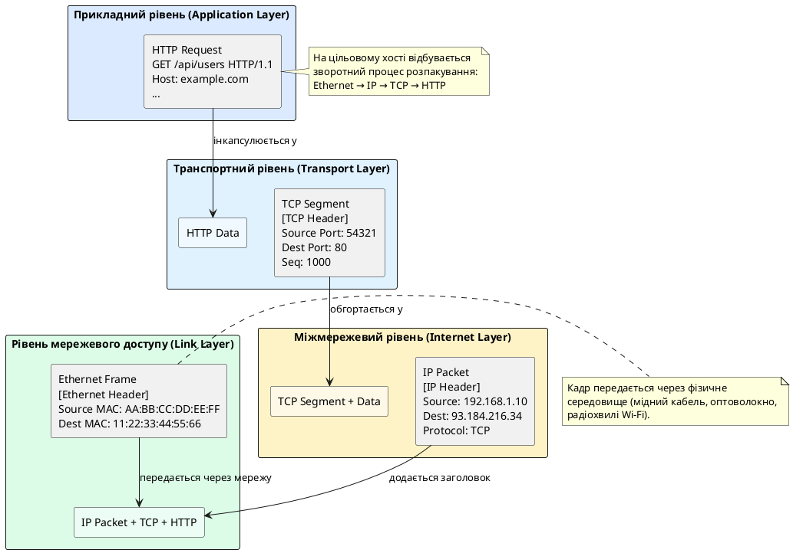

# Вступ до протоколу HTTP та еволюція веб-технологій

::card-group

::card{title="🎯 Мета розділу" icon="i-lucide-target"}

- Зрозуміти історичну еволюцію протоколу HTTP від перших статичних сторінок до сучасних динамічних застосунків.
- Опанувати архітектурні засади клієнт-серверної взаємодії у вебі.
- Усвідомити місце HTTP у багаторівневій моделі мережевих протоколів TCP/IP.
- Засвоїти принцип безстанковості (*stateless*) як фундаментальну характеристику протоколу HTTP.

::

::card{title="🔑 Ключові терміни" icon="i-lucide-key"}

- **HTTP** (*Hypertext Transfer Protocol*) — прикладний протокол передачі гіпертекстових документів.
- **Клієнт-серверна архітектура** (*Client-Server Architecture*) — модель розподіленої взаємодії, де клієнт ініціює запити, а сервер обробляє їх та надає відповіді.
- **Stateless Protocol** — протокол без збереження стану між окремими запитами.
- **TCP/IP Stack** — набір мережевих протоколів, що забезпечує передачу даних через мережу Інтернет.

::

::

---

## Історичний контекст та витоки всесвітньої павутини

Протокол HTTP (*Hypertext Transfer Protocol*) є однією з ключових технологій, що зробили можливим існування сучасного Інтернету у тому вигляді, в якому ми його знаємо. Розуміння еволюції цього протоколу та архітектурних рішень, закладених на ранніх етапах розвитку веб-технологій, є необхідною умовою для проєктування надійних та ефективних серверних застосунків.

### Перші кроки: CERN та народження вебу (1989–1991)

У 1989 році британський вчений Тім Бернерс-Лі (*Tim Berners-Lee*), який працював у Європейській організації ядерних досліджень (CERN, Швейцарія), запропонував концепцію розподіленої інформаційної системи на основі гіпертексту. Його мета полягала у створенні універсального способу обміну науковими документами між дослідниками, які працювали у різних лабораторіях по всьому світу.

Основна ідея була революційно простою: документи повинні містити посилання (*hyperlinks*) на інші документи, а доступ до них має здійснюватися за допомогою стандартизованого протоколу через комп'ютерну мережу. Це дозволило б створити глобальну «павутину» (*web*) взаємопов'язаних документів, де користувач міг би переходити від однієї інформаційної одиниці до іншої одним кліком миші.

У 1991 році Тім Бернерс-Лі разом із колегою Робертом Кайо (*Robert Cailliau*) представили робочий прототип системи, яка включала три фундаментальні компоненти:

1. **HTML** (*HyperText Markup Language*) — мова розмітки для структурування гіпертекстових документів.
2. **URI/URL** (*Uniform Resource Identifier / Locator*) — система унікальних адрес для ідентифікації ресурсів у мережі.
3. **HTTP** — протокол передачі даних між клієнтом та сервером.

::note
Перша версія протоколу, яка згодом отримала ретроспективну назву **HTTP/0.9**, була надзвичайно мінімалістичною. Вона підтримувала лише один метод запиту — `GET`, і могла передавати виключно HTML-документи без жодних метаданих. Запит складався буквально з одного рядка тексту: `GET /index.html`.
::


### Приклад найпростішого HTTP/0.9 запиту

Для розуміння масштабу спрощення ранніх версій протоколу розглянемо, як виглядала взаємодія клієнта та сервера у HTTP/0.9. Клієнт встановлював TCP-з'єднання з сервером на порту 80 та надсилав однорядковий текстовий запит:

```http
GET /welcome.html
```

Сервер, отримавши цей запит, просто повертав вміст файлу `welcome.html` у вигляді потоку байтів без жодних додаткових заголовків або метаданих. Одразу після передачі документа з'єднання закривалося. У відповіді не було ніякої інформації про статус виконання запиту (успіх чи помилка), тип вмісту (*content type*), розмір файлу або кодування символів.

Ця модель працювала виключно для статичних HTML-сторінок, але вже на початку 1990-х років стало очевидно, що для розвитку вебу потрібен більш потужний та гнучкий протокол, здатний передавати різноманітні типи даних — зображення, аудіо, відео, а також підтримувати інтерактивну взаємодію користувача з сервером.

---

## Еволюція протоколу: від HTTP/1.0 до HTTP/3

### HTTP/1.0 (1996): Введення заголовків та метаданих

Поява HTTP/1.0, стандартизованого документом **RFC 1945** у травні 1996 року, ознаменувала перехід до значно складнішої моделі взаємодії. Основні нововведення включали:

- **Заголовки запитів та відповідей** (*headers*) — структуровані метадані у форматі ключ-значення, що передавалися перед основним тілом повідомлення.
- **Коди статусу відповіді** (*status codes*) — тризначні числа, які інформували клієнта про результат обробки запиту (200 OK, 404 Not Found, 500 Internal Server Error тощо).
- **Підтримка різних методів запиту** — окрім `GET`, з'явилися методи `POST` (для відправки даних на сервер) та `HEAD` (для отримання лише заголовків без тіла відповіді).
- **Вказівка версії протоколу** — кожен запит тепер містив явне зазначення версії, що дозволяло серверам підтримувати сумісність із різними клієнтами.
- **Багатотиповість вмісту** (*MIME types*) — заголовок `Content-Type` дозволяв серверу повідомити клієнту, який саме тип даних він отримав (текст, зображення, відео, JSON тощо).

Приклад типового HTTP/1.0 запиту та відповіді:

```http
GET /images/logo.png HTTP/1.0
Host: www.example.com
User-Agent: Mozilla/4.0
Accept: image/png, image/jpeg

```

Відповідь сервера:

```http
HTTP/1.0 200 OK
Content-Type: image/png
Content-Length: 5324
Connection: close

[бінарні дані зображення]
```

::warning
Критичним обмеженням HTTP/1.0 була відсутність механізму **постійних з'єднань** (*persistent connections*). Кожен запит вимагав встановлення нового TCP-з'єднання, що включало трифазове рукостискання (*three-way handshake*), передачу даних та закриття з'єднання. За умови, що веб-сторінка завантажувала десятки ресурсів (HTML, CSS, JavaScript, зображення), це створювало значні накладні витрати на мережеву взаємодію та збільшувало час завантаження сторінки.
::


### HTTP/1.1 (1997): Постійні з'єднання та конвеєризація

Версія HTTP/1.1, формалізована у документі **RFC 2068** у січні 1997 року (пізніше оновлена RFC 2616 у 1999 році та остаточно уточнена серією RFC 7230–7235 у 2014 році), стала домінуючим стандартом веб-комунікації на наступні два десятиліття. Ключові вдосконалення включали:

#### Постійні з'єднання (Persistent Connections)

За замовчуванням HTTP/1.1 використовує **постійні з'єднання** (*persistent connections* або *keep-alive*). Це означає, що після завершення обробки одного запиту TCP-з'єднання не закривається автоматично, а залишається відкритим для наступних запитів від того самого клієнта. Клієнт або сервер можуть явно сигналізувати про бажання закрити з'єднання за допомогою заголовка `Connection: close`.

Цей механізм радикально знизив накладні витрати на встановлення та розрив з'єднань, особливо для сторінок із великою кількістю дрібних ресурсів. Замість створення 50 окремих TCP-з'єднань для завантаження всіх компонентів сторінки браузер міг повторно використовувати одне з'єднання для послідовної передачі всіх запитів.

#### HTTP Pipelining (Конвеєризація запитів)

HTTP/1.1 ввів концепцію **конвеєризації** (*pipelining*), яка дозволяла клієнту надсилати декілька запитів підряд через одне з'єднання, не чекаючи відповідей на попередні запити. Сервер зобов'язаний обробляти ці запити у тому самому порядку, в якому вони надійшли, та повертати відповіді у відповідній послідовності.

На практиці pipelining виявився складним у реалізації через проблему **блокування черги** (*head-of-line blocking*): якщо обробка першого запиту затримувалася, всі наступні відповіді також затримувалися, навіть якщо вони були вже готові. Через ці труднощі більшість браузерів або взагалі не впроваджували pipelining, або вимикали його за замовчуванням.

#### Обов'язковість заголовка Host

У HTTP/1.1 заголовок `Host` став **обов'язковим** (*mandatory*). Це дозволило впровадити концепцію **віртуальних хостів** (*virtual hosting*), коли один фізичний сервер з однією IP-адресою може обслуговувати декілька незалежних доменів. Сервер визначає, який саме веб-сайт запитує клієнт, аналізуючи значення заголовка `Host`.

Приклад запиту HTTP/1.1 з обов'язковим заголовком Host:

```http
GET /api/v1/users HTTP/1.1
Host: api.example.com
User-Agent: curl/7.68.0
Accept: application/json
Connection: keep-alive

```

#### Підтримка діапазонів та часткового завантаження

HTTP/1.1 ввів заголовки `Range` та `Content-Range`, які дозволили клієнту запитувати лише частину великого файлу (наприклад, завантажувати відео порціями або відновлювати перерване завантаження). Це стало критично важливим для потокового відео (*streaming*) та завантаження великих файлів через ненадійні мережеві з'єднання.

#### Нові методи та кешування

Версія 1.1 додала нові методи запитів — `PUT`, `DELETE`, `OPTIONS`, `TRACE`, `CONNECT` — що дозволило реалізувати повноцінні RESTful API. Також був значно вдосконалений механізм кешування за допомогою заголовків `Cache-Control`, `ETag`, `If-None-Match`, `If-Modified-Since`, що дозволило клієнтам та проміжним проксі-серверам зберігати копії ресурсів локально та зменшувати навантаження на мережу.


::tip
HTTP/1.1 залишається найпоширенішою версією протоколу у світі навіть станом на 2026 рік. Більшість REST API, веб-серверів та клієнтських бібліотек підтримують HTTP/1.1 як базовий стандарт. Розуміння принципів роботи цієї версії є фундаментальною вимогою для будь-якого backend-розробника.
::

---

### HTTP/2 (2015): Бінарний протокол та мультиплексування

До середини 2010-х років обмеження HTTP/1.1 стали очевидними. Веб-сторінки зросли у складності: типова сторінка завантажувала сотні ресурсів (скрипти, стилі, шрифти, зображення, відео), а HTTP/1.1 обробляв їх послідовно через обмежену кількість паралельних з'єднань (зазвичай браузери відкривали 6–8 одночасних з'єднань до одного домену). Це призводило до значних затримок завантаження.

Протокол **HTTP/2**, стандартизований у RFC 7540 у травні 2015 року, був розроблений на основі експериментального протоколу **SPDY** від компанії Google. Основні інновації HTTP/2 включали:

#### Бінарне кадрування (Binary Framing Layer)

На відміну від текстового формату HTTP/1.x, HTTP/2 використовує **бінарний протокол**. Дані розбиваються на невеликі **кадри** (*frames*), які передаються через з'єднання. Кожен кадр має тип (DATA, HEADERS, PRIORITY, RST_STREAM тощо) та прив'язаний до конкретного **потоку** (*stream*). Це дозволило протоколу бути більш компактним, ефективнішим у парсингу та менш схильним до помилок інтерпретації.

#### Мультиплексування (Multiplexing)

HTTP/2 дозволяє передавати **множину незалежних потоків** (*streams*) через одне TCP-з'єднання одночасно. Кожен запит та відповідь отримує унікальний ідентифікатор потоку, і кадри різних потоків можуть чергуватися у довільному порядку. Це повністю усуває проблему head-of-line blocking на рівні протоколу HTTP (хоча вона все ще присутня на рівні TCP).

Наприклад, браузер може одночасно запитувати HTML-документ, три CSS-файли, п'ять JavaScript-скриптів та десять зображень через одне з'єднання, і сервер може відправляти відповіді у міру їх готовності, не чекаючи завершення попередніх запитів.

#### Server Push (Серверний проактивний пуш)

HTTP/2 дозволяє серверу **проактивно надсилати** ресурси клієнту ще до того, як клієнт їх запросив. Наприклад, коли клієнт запитує HTML-сторінку, сервер може автоматично відправити також CSS та JavaScript файли, які будуть потрібні для рендерингу цієї сторінки, не чекаючи додаткових запитів від браузера.

Цей механізм потенційно зменшує час завантаження сторінки, але вимагає обережної конфігурації, оскільки непродумане використання може призвести до передачі непотрібних даних та марнування пропускної здатності мережі.

#### Стиснення заголовків (Header Compression)

HTTP/1.1 передавав заголовки у текстовому форматі без стиснення, що призводило до значного дублювання даних (наприклад, заголовки `User-Agent`, `Cookie`, `Accept` часто повторювалися у кожному запиті без змін). HTTP/2 впровадив алгоритм стиснення **HPACK**, який зберігає таблицю раніше переданих заголовків та передає лише зміни у наступних запитах, радикально зменшуючи обсяг службових даних.

::note
HTTP/2 зворотно сумісний з HTTP/1.1 на рівні семантики: методи запитів, коди статусів, заголовки залишаються тими самими. Змінюється лише спосіб кодування та передачі даних через мережу. Це дозволило серверам та клієнтам поступово мігрувати на новий протокол без порушення сумісності з існуючими застосунками.
::


### HTTP/3 (2022): Перехід на протокол QUIC

Незважаючи на значні вдосконалення HTTP/2, протокол все ще спирався на TCP як транспортний рівень. TCP, розроблений у 1970-х роках, гарантує надійну та упорядковану доставку даних, але має фундаментальне обмеження: **head-of-line blocking на рівні TCP**. Якщо один TCP-пакет втрачається у мережі, весь потік даних блокується до моменту повторної передачі втраченого пакета, навіть якщо інші HTTP/2-потоки у цьому з'єднанні не залежать від втраченого пакета.

Для вирішення цієї проблеми був розроблений новий транспортний протокол **QUIC** (*Quick UDP Internet Connections*), який працює поверх UDP замість TCP. HTTP/3, стандартизований у RFC 9114 у червні 2022 року, є адаптацією HTTP/2 для роботи поверх QUIC.

#### Ключові особливості HTTP/3 та QUIC

- **Незалежні потоки на транспортному рівні**: QUIC нативно підтримує множину незалежних потоків даних у одному з'єднанні, і втрата пакета блокує лише той потік, до якого він належить, а не все з'єднання.
- **Швидше встановлення з'єднання**: QUIC інтегрує TLS 1.3 безпосередньо у рукостискання, що дозволяє встановити захищене з'єднання за один раунд обміну даними (*1-RTT*), а для повторних з'єднань — взагалі без додаткової затримки (*0-RTT*).
- **Міграція з'єднань**: QUIC використовує унікальний ідентифікатор з'єднання (*Connection ID*) замість пари IP-адреса + порт, що дозволяє клієнту змінювати мережу (наприклад, перемикатися з Wi-Fi на мобільний Інтернет) без розриву з'єднання та повторної автентифікації.
- **Вбудована підтримка мобільності**: Ця властивість критична для мобільних застосунків, які часто переключаються між базовими станціями, точками доступу та типами мереж.

::warning
Станом на 2026 рік HTTP/3 підтримується усіма основними браузерами (Chrome, Firefox, Safari, Edge) та великими CDN-провайдерами (Cloudflare, Fastly, Akamai), але ще не досяг повсюдного впровадження на рівні серверних застосунків. Багато веб-серверів (Nginx, Apache) підтримують HTTP/3 через експериментальні модулі або сторонні патчі. Для більшості backend-застосунків HTTP/1.1 та HTTP/2 залишаються стандартом де-факто.
::

---

## Клієнт-серверна архітектура HTTP

Протокол HTTP реалізує класичну **модель клієнт-сервер** (*client-server model*), яка є однією з фундаментальних архітектурних парадигм розподілених систем. Розуміння ролей клієнта та сервера, а також їхньої взаємодії, є необхідною умовою для проєктування будь-яких веб-застосунків.

### Роль клієнта (HTTP Client)

**Клієнт** — це програмний компонент, який **ініціює** HTTP-запити до сервера. Найпоширенішими типами HTTP-клієнтів є:

- **Веб-браузери** (Chrome, Firefox, Safari, Edge) — інтерпретують HTML, виконують JavaScript, рендерять графічний інтерфейс користувача.
- **Мобільні застосунки** (iOS, Android) — використовують HTTP API для взаємодії з серверною частиною застосунку.
- **Програмні бібліотеки та інструменти** (`curl`, `wget`, `Postman`, HTTP-клієнти у різних мовах програмування) — використовуються для тестування, автоматизації та інтеграції систем.
- **Інші сервери** — у мікросервісній архітектурі один сервер може виступати клієнтом для іншого сервера, формуючи ланцюжок запитів.

Клієнт несе відповідальність за:

1. **Формування коректного HTTP-запиту** згідно зі специфікацією протоколу (метод, URI, версія, заголовки, тіло).
2. **Встановлення TCP-з'єднання** з сервером на вказаному порту (зазвичай 80 для HTTP або 443 для HTTPS).
3. **Відправку запиту** через встановлене з'єднання.
4. **Очікування відповіді** від сервера та її інтерпретацію (парсинг заголовків, обробка статус-коду, декодування тіла відповіді).
5. **Повторні спроби у разі помилок** (за умови, що запит є безпечним та ідемпотентним).


### Роль сервера (HTTP Server)

**Сервер** — це програмний компонент, який **очікує** вхідні HTTP-запити на певному мережевому порту, **обробляє** їх відповідно до внутрішньої бізнес-логіки та **повертає** HTTP-відповіді клієнтам. Сервери можуть варіюватися від простих статичних файлових серверів до складних розподілених систем із базами даних, чергами повідомлень, кешуванням та інтеграцією з іншими сервісами.

Сервер відповідає за:

1. **Прослуховування мережевого порту** та прийняття вхідних TCP-з'єднань від клієнтів.
2. **Парсинг HTTP-запиту** — розбір стартового рядка, заголовків та тіла запиту на структуровані компоненти.
3. **Маршрутизацію запиту** (*routing*) — визначення, який саме обробник (*handler*) повинен виконати обробку запиту на основі методу, шляху URI, заголовків.
4. **Виконання бізнес-логіки** — взаємодія з базою даних, зовнішніми API, обчислення результатів, генерація динамічного вмісту.
5. **Формування HTTP-відповіді** — побудова відповіді з відповідним статус-кодом, заголовками та тілом.
6. **Відправку відповіді клієнту** через те саме TCP-з'єднання.
7. **Логування та моніторинг** — реєстрація запитів, помилок, метрик продуктивності для діагностики та аналізу.

### Асиметрія ролей

Важливо усвідомити **асиметрію** ролей у клієнт-серверній моделі:

- **Клієнт завжди ініціює запит**. Сервер не може самостійно розпочати передачу даних клієнту без попереднього запиту (виняток: механізм Server Push у HTTP/2, але він також вимагає початкового запиту від клієнта).
- **Сервер завжди пасивно очікує**. Сервер не знає, коли надійде наступний запит, від якого клієнта і з яким вмістом.
- **Один сервер обслуговує багато клієнтів**. Типовий веб-сервер має справу з тисячами одночасних клієнтів, тому він повинен бути спроєктований для ефективної конкурентної обробки запитів (багатопотоковість, асинхронність, пули з'єднань).

::plant-uml{alt="Послідовність взаємодії клієнта та сервера через HTTP"}



::

Ця діаграма ілюструє повний цикл життя одного HTTP-запиту: від встановлення TCP-з'єднання до отримання відповіді та закриття з'єднання. У реальних сценаріях із HTTP/1.1 keep-alive або HTTP/2 з'єднання залишається відкритим для наступних запитів, але базова послідовність взаємодії залишається незмінною.


---

## Місце HTTP у стеку протоколів TCP/IP

Для повного розуміння архітектури HTTP необхідно усвідомити його положення у багаторівневій моделі мережевих протоколів. Сучасний Інтернет побудований на основі **стеку протоколів TCP/IP**, який складається з чотирьох концептуальних рівнів:

### Чотирирівнева модель TCP/IP

1. **Рівень мережевого доступу** (*Link Layer / Network Access Layer*)  
   Відповідає за передачу даних у межах локальної мережі (Ethernet, Wi-Fi, PPP). Визначає фізичну адресацію (MAC-адреси) та методи доступу до середовища передачі.

2. **Міжмережевий рівень** (*Internet Layer*)  
   Забезпечує маршрутизацію пакетів між різними мережами. Основний протокол цього рівня — **IP** (*Internet Protocol*), який відповідає за логічну адресацію (IP-адреси) та доставку пакетів до цільового вузла через маршрутизатори.

3. **Транспортний рівень** (*Transport Layer*)  
   Надає сервіси передачі даних між застосунками на різних хостах. Два основні протоколи:
   - **TCP** (*Transmission Control Protocol*) — надійна, з'єднання-орієнтована передача з гарантією порядку та контролем помилок.
   - **UDP** (*User Datagram Protocol*) — ненадійна, без встановлення з'єднання, мінімальна затримка.

4. **Прикладний рівень** (*Application Layer*)  
   Містить протоколи, які безпосередньо використовуються прикладними програмами для взаємодії через мережу. Саме на цьому рівні знаходиться **HTTP**, а також інші протоколи: FTP, SMTP, DNS, SSH, WebSocket.

### HTTP як прикладний протокол поверх TCP

HTTP працює **поверх протоколу TCP**, що означає таке:

- **Надійність**: TCP гарантує, що всі байти HTTP-повідомлення будуть доставлені у правильному порядку без втрат. Якщо пакет губиться у мережі, TCP автоматично повторює його передачу.
- **Потік байтів**: TCP надає абстракцію **безперервного потоку байтів** (*byte stream*). HTTP не потребує турбуватися про розбиття повідомлення на пакети або їхнє об'єднання — TCP робить це прозоро для прикладного рівня.
- **Контроль потоку**: TCP управляє швидкістю передачі даних, щоб не перевантажити приймач або мережу (*flow control* та *congestion control*).
- **Встановлення з'єднання**: Перед обміном HTTP-повідомленнями клієнт та сервер повинні встановити TCP-з'єднання через трифазове рукостискання (SYN → SYN-ACK → ACK).

::note
Саме залежність від TCP є причиною, чому HTTP/3 перейшов на протокол QUIC, який працює поверх UDP. QUIC реалізує власні механізми надійності, контролю потоку та шифрування, уникаючи обмежень традиційного TCP, таких як head-of-line blocking та повільне встановлення з'єднання.
::

### Інкапсуляція даних у стеку TCP/IP

Коли клієнт відправляє HTTP-запит, дані проходять через усі рівні стеку, обгортаючись у заголовки кожного рівня:

1. **Прикладний рівень (HTTP)**: формується HTTP-повідомлення (запит або відповідь) з заголовками та тілом.
2. **Транспортний рівень (TCP)**: HTTP-повідомлення розбивається на **TCP-сегменти**. До кожного сегмента додається TCP-заголовок із портами джерела та призначення, номерами послідовності, контрольними сумами.
3. **Міжмережевий рівень (IP)**: TCP-сегмент обгортається у **IP-пакет** з IP-заголовком, який містить адреси джерела та призначення, час життя пакета (TTL), протокол верхнього рівня (TCP).
4. **Рівень мережевого доступу (Ethernet)**: IP-пакет обгортається у **кадр Ethernet** з MAC-адресами та передається через фізичне середовище.

На кожному проміжному маршрутизаторі пакет розпаковується до рівня IP, аналізується адреса призначення, приймається рішення про маршрутизацію, та пакет знову пакується і передається далі. На цільовому хості відбувається зворотний процес розпакування (*decapsulation*): знімаються Ethernet-заголовок, IP-заголовок, TCP-заголовок, і нарешті прикладна програма (HTTP-сервер) отримує HTTP-повідомлення у чистому вигляді.


::plant-uml{alt="Інкапсуляція HTTP-повідомлення у стеку TCP/IP"}



::

---

## Принцип безстанковості HTTP (Stateless Protocol)

Однією з найфундаментальніших характеристик протоколу HTTP є його **безстанковість** (*stateless nature*). Це означає, що кожен HTTP-запит є **повністю самодостатнім** та не залежить від попередніх запитів. Сервер не зберігає ніякої інформації про попередні взаємодії з клієнтом між окремими запитами.

### Що таке «стан» у контексті протоколів?

У теорії розподілених систем **стан** (*state*) — це інформація про поточну ситуацію, яка впливає на поведінку системи у майбутньому. Наприклад:

- Чи увійшов користувач у систему (автентифікований)?
- Які товари знаходяться у кошику покупця?
- Яка сторінка результатів пошуку переглядається зараз?
- Який етап багатокрокової форми заповнив користувач?

У **станковому** (*stateful*) протоколі сервер зберігає цю інформацію між запитами, і клієнт може посилатися на неї неявно. Наприклад, протокол **FTP** (*File Transfer Protocol*) є станковим: клієнт встановлює з'єднання, автентифікується, змінює поточну директорію командою `CWD`, і всі наступні команди виконуються відносно цієї директорії. Сервер «пам'ятає» контекст сесії.

### HTTP як безстанковий протокол

У HTTP кожен запит повинен містити **всю необхідну інформацію** для його обробки. Сервер розглядає кожен запит ізольовано, без урахування того, що клієнт робив секунду або хвилину тому. Якщо клієнт хоче виконати операцію, яка вимагає знання про попередню взаємодію (наприклад, отримати вміст кошика), він повинен **явно передати ідентифікатор** цього стану у запиті (через Cookie, токен авторизації або параметри запиту).

### Переваги безстанковості

Безстанковість надає протоколу HTTP кілька важливих властивостей:

1. **Простота реалізації**: Сервер не потребує складних механізмів управління сесіями, синхронізації стану між потоками або процесами. Кожен запит обробляється незалежно.

2. **Масштабованість**: Оскільки сервер не зберігає стан клієнтів, запити від одного клієнта можуть бути оброблені різними екземплярами сервера (наприклад, у кластері за балансувальником навантаження). Це дозволяє горизонтально масштабувати систему шляхом додавання нових серверів без необхідності реплікувати стан між ними.

3. **Надійність та відмовостійкість**: Якщо один сервер виходить з ладу, клієнт може повторити запит до іншого сервера без втрати функціональності (за умови, що запит є ідемпотентним). Немає проблеми «втраченого стану».

4. **Кешування**: Безстанкові запити легше кешувати, оскільки результат запиту залежить лише від його вмісту, а не від невидимого серверного стану. Проксі-сервери та CDN можуть ефективно зберігати копії відповідей.


### Виклики безстанковості

Водночас безстанковість створює виклики для розробників веб-застосунків:

1. **Необхідність явного збереження стану**: Для реалізації сесій користувача, кошиків покупок, багатокрокових форм необхідно впроваджувати додаткові механізми на рівні застосунку (Cookies, JWT-токени, серверні сесії у базі даних або Redis).

2. **Додаткові дані у запитах**: Кожен запит повинен містити ідентифікатори стану (наприклад, довгий токен автентифікації), що збільшує обсяг переданих даних.

3. **Складність координації**: Якщо користувач одночасно працює у кількох вкладках браузера, синхронізація стану між ними стає відповідальністю клієнтської частини застосунку або вимагає складнішої серверної логіки.

::accordion

::accordion-item{label="❓ Чому HTTP обрали безстанковим, а не станковим протоколом?" icon="i-lucide-help-circle"}

Рішення зробити HTTP безстанковим було прийнято у ранні роки розвитку веб-технологій, коли основна мета полягала у **простоті** та **надійності** передачі гіпертекстових документів. Тім Бернерс-Лі та інші розробники веб-стандартів усвідомлювали, що Інтернет є **ненадійним середовищем** з можливими розривами з'єднань, затримками, втратами пакетів.

Станкові протоколи (як FTP) вимагають постійно відкритого з'єднання та складних механізмів відновлення стану після збоїв. Для масштабованої системи, де один сервер може обслуговувати тисячі клієнтів одночасно, управління станом кожного з'єднання стало б неможливо складним.

Натомість безстанковий підхід дозволив серверам бути максимально простими: отримати запит, обробити його, повернути відповідь, забути про клієнта. Відповідальність за збереження контексту взаємодії перекладалася на вищі рівні (застосунок, сесії, Cookies), що надало розробникам гнучкість у виборі стратегій управління станом.

::

::accordion-item{label="❓ Якщо HTTP безстанковий, як тоді працюють сесії користувачів у вебзастосунках?" icon="i-lucide-help-circle"}

HTTP як протокол дійсно безстанковий, але це не заважає **застосункам** реалізовувати станковість на вищому рівні. Існує кілька поширених підходів:

1. **Cookies із ідентифікатором сесії**: Після автентифікації сервер генерує унікальний ідентифікатор сесії (наприклад, `sessionId=abc123xyz`) та зберігає його у Cookie клієнта. При кожному наступному запиті браузер автоматично прикріплює цей Cookie, і сервер використовує ідентифікатор для пошуку даних сесії у базі даних або Redis.

2. **JWT-токени** (*JSON Web Tokens*): Сервер кодує інформацію про стан користувача (ID, ролі, права доступу) у підписаний токен, який передається клієнту. Клієнт зберігає токен (у Local Storage або Cookie) і прикріплює його до заголовка `Authorization` у кожному запиті. Сервер перевіряє підпис токена та витягує дані без звернення до бази даних.

3. **Серверні сесії у пам'яті або базі даних**: Сервер зберігає повний стан кожного користувача у внутрішній структурі даних (HashMap, Redis) та асоціює його з унікальним ідентифікатором, який передається клієнту.

Усі ці методи **не порушують** безстанковість протоколу HTTP — кожен HTTP-запит залишається самодостатнім та містить всю необхідну інформацію (ідентифікатор сесії або токен) для його обробки. Просто застосунок на основі цієї інформації відновлює контекст взаємодії.

::

::

---

## Порівняльна таблиця версій HTTP

Для систематизації знань про еволюцію протоколу наведемо порівняльну таблицю ключових характеристик різних версій HTTP:

| Характеристика | HTTP/0.9 (1991) | HTTP/1.0 (1996) | HTTP/1.1 (1997) | HTTP/2 (2015) | HTTP/3 (2022) |
|----------------|-----------------|-----------------|-----------------|---------------|---------------|
| **Формат даних** | Текстовий | Текстовий | Текстовий | Бінарний | Бінарний |
| **Методи запитів** | GET | GET, POST, HEAD | + PUT, DELETE, OPTIONS, TRACE, CONNECT | Ті самі | Ті самі |
| **Заголовки** | ❌ Відсутні | ✅ Підтримуються | ✅ Розширені | ✅ + стиснення HPACK | ✅ + стиснення QPACK |
| **Коди статусів** | ❌ Відсутні | ✅ 1xx–5xx | ✅ Ті самі | ✅ Ті самі | ✅ Ті самі |
| **Постійні з'єднання** | ❌ | ❌ (опційно) | ✅ Keep-Alive за замовчуванням | ✅ Multiplexing | ✅ Multiplexing через QUIC |
| **Конвеєризація** (*Pipelining*) | ❌ | ❌ | ✅ (рідко використовується) | ❌ (не потрібна) | ❌ (не потрібна) |
| **Мультиплексування** | ❌ | ❌ | ❌ | ✅ Багато потоків через одне з'єднання | ✅ Незалежні потоки |
| **Server Push** | ❌ | ❌ | ❌ | ✅ | ✅ |
| **Транспортний протокол** | TCP | TCP | TCP | TCP + TLS | QUIC (UDP + TLS 1.3) |
| **Head-of-Line Blocking** | Не застосовується | Так | Так | Так (на рівні TCP) | ❌ Усунено |
| **Встановлення з'єднання** | TCP handshake | TCP handshake | TCP handshake | TCP + TLS (2-RTT) | QUIC 1-RTT / 0-RTT |
| **Підтримка у браузерах (2026)** | ❌ Застаріла | ⚠️ Обмежена | ✅ Повна | ✅ Повна | ✅ Повна |

::tip
Для більшості backend-застосунків у 2026 році актуальними залишаються **HTTP/1.1** (базовий стандарт, підтримується усюди) та **HTTP/2** (рекомендований для продакшн-систем з високим навантаженням). HTTP/3 поступово набирає популярності, але вимагає підтримки на рівні веб-сервера та інфраструктури.
::


---

## Підсумок розділу

У цьому розділі ми розглянули фундаментальні засади протоколу HTTP, що становить основу сучасного вебу:

::card-group

::card{title="📚 Основні висновки" icon="i-lucide-book-open"}

- HTTP пройшов шлях від мінімалістичного HTTP/0.9 (лише GET-запити без заголовків) до високопродуктивного HTTP/3 із мультиплексуванням та вбудованим шифруванням.
- Клієнт-серверна архітектура визначає асиметрію ролей: клієнт завжди ініціює запити, сервер пасивно очікує та обробляє їх.
- HTTP працює на прикладному рівні стеку TCP/IP, спираючись на надійність транспортного протоколу TCP (або QUIC у випадку HTTP/3).
- Принцип безстанковості робить HTTP простим, масштабованим та надійним, але вимагає явного збереження стану на рівні застосунку через Cookies, токени або серверні сесії.

::

::card{title="🔍 Ключові терміни до запам'ятовування" icon="i-lucide-key"}

- **Клієнт-серверна модель** — архітектурна парадигма, де клієнт ініціює запити, а сервер їх обробляє.
- **Stateless Protocol** — протокол без збереження стану між окремими запитами.
- **Persistent Connection** — механізм повторного використання TCP-з'єднання для кількох HTTP-запитів.
- **Multiplexing** — одночасна передача множини незалежних потоків даних через одне з'єднання.
- **QUIC** — транспортний протокол поверх UDP, що усуває head-of-line blocking на транспортному рівні.

::

::

---

## Контрольні запитання для самоперевірки

::accordion

::accordion-item{label="1. Які три фундаментальні компоненти склали основу всесвітньої павутини у 1991 році?" icon="i-lucide-check-circle"}

Тім Бернерс-Лі створив три взаємопов'язані технології:

1. **HTML** (*HyperText Markup Language*) — мова розмітки для структурування документів із гіперпосиланнями.
2. **URI/URL** (*Uniform Resource Identifier / Locator*) — система унікальних адрес для ідентифікації ресурсів у мережі.
3. **HTTP** (*Hypertext Transfer Protocol*) — прикладний протокол передачі даних між клієнтом та сервером.

Ці компоненти разом утворили архітектурний фундамент, на якому побудований сучасний Інтернет.

::

::accordion-item{label="2. Яка ключова проблема HTTP/1.0 була вирішена у версії HTTP/1.1?" icon="i-lucide-check-circle"}

Основною проблемою HTTP/1.0 була відсутність **постійних з'єднань** (*persistent connections*). Кожен запит вимагав встановлення нового TCP-з'єднання (трифазове рукостискання), передачі даних та закриття з'єднання. Це створювало значні накладні витрати, особливо для сторінок із десятками ресурсів.

HTTP/1.1 запровадив **keep-alive з'єднання за замовчуванням**, що дозволило повторно використовувати одне TCP-з'єднання для множини запитів, радикально зменшивши затримки та навантаження на мережу.

::

::accordion-item{label="3. Чому HTTP/2 використовує бінарний формат даних замість текстового?" icon="i-lucide-check-circle"}

Бінарний протокол має кілька переваг перед текстовим:

- **Ефективність парсингу**: Бінарні дані легше та швидше аналізувати комп'ютером, оскільки структура даних чітко визначена на рівні байтів. Текстові протоколи вимагають складного парсингу рядків, пошуку роздільників, обробки різних варіантів написання.
- **Компактність**: Бінарне представлення зазвичай займає менше місця, ніж текстове (особливо після впровадження HPACK-стиснення заголовків).
- **Менша кількість помилок**: Текстові протоколи схильні до помилок через неоднозначності у форматуванні (пробіли, регістр символів, кодування). Бінарний формат унеможливлює такі проблеми.
- **Підтримка мультиплексування**: Бінарне кадрування (*framing*) дозволяє легко розділяти дані різних потоків у одному з'єднанні, не плутаючи їх.

::

::accordion-item{label="4. У чому полягає фундаментальна відмінність між HTTP/2 та HTTP/3 на рівні транспортного протоколу?" icon="i-lucide-check-circle"}

HTTP/2 працює поверх **TCP** (*Transmission Control Protocol*), тоді як HTTP/3 використовує **QUIC** (*Quick UDP Internet Connections*), що побудований поверх UDP.

Ключова відмінність:

- **TCP** гарантує надійну та упорядковану доставку, але має проблему **head-of-line blocking на транспортному рівні**: якщо один TCP-пакет губиться, весь потік блокується до повторної передачі, навіть якщо інші HTTP/2-потоки не залежать від втраченого пакета.
  
- **QUIC** реалізує незалежні потоки на транспортному рівні: втрата пакета в одному потоці не впливає на інші потоки у тому самому з'єднанні. Також QUIC інтегрує TLS 1.3 безпосередньо у рукостискання, що прискорює встановлення захищеного з'єднання до 1-RTT або навіть 0-RTT.

::

::accordion-item{label="5. Що означає принцип «безстанковості» HTTP і які це має наслідки для розробників?" icon="i-lucide-check-circle"}

**Безстанковість** (*stateless*) означає, що кожен HTTP-запит є повністю самодостатнім та не залежить від попередніх запитів. Сервер не зберігає інформацію про контекст взаємодії з клієнтом між окремими запитами.

**Наслідки для розробників:**

- **Плюси**: Простота масштабування (запити можна розподіляти між різними серверами без синхронізації стану), надійність (відсутність «втраченого стану» при збоях), легкість кешування.
  
- **Мінуси**: Необхідність явного збереження стану через механізми на рівні застосунку (Cookies, JWT-токени, серверні сесії), збільшення обсягу даних у запитах (кожен запит містить ідентифікатори стану).

Розробники повинні самостійно проєктувати систему управління станом, враховуючи вимоги до безпеки, продуктивності та масштабованості.

::

::

---

У наступному розділі ми детально розглянемо **анатомію HTTP-запиту** — структуру стартового рядка, заголовків та тіла запиту, а також проаналізуємо конкретні приклади RAW HTTP-повідомлень для різних методів та сценаріїв взаємодії клієнта з сервером.

