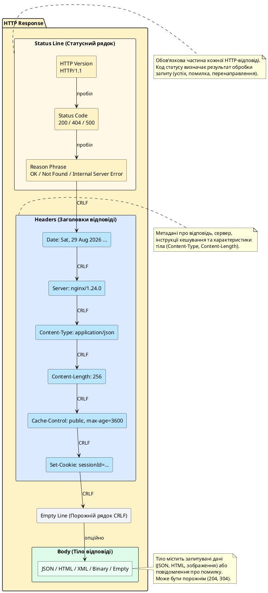

# Анатомія HTTP-відповіді

::card-group

::card{title="🎯 Мета розділу" icon="i-lucide-target"}

- Опанувати структуру HTTP-відповіді: статусний рядок, заголовки та тіло повідомлення.
- Навчитися читати та інтерпретувати RAW HTTP-відповіді у текстовому форматі.
- Зрозуміти значення кодів статусу та їхній вплив на поведінку клієнта.
- Засвоїти призначення заголовків відповіді та механізми керування кешуванням.

::

::card{title="🔑 Ключові терміни" icon="i-lucide-key"}

- **Status Line** — статусний рядок HTTP-відповіді з версією протоколу, кодом статусу та текстовим поясненням.
- **Status Code** — тризначне число, що вказує на результат обробки запиту (успіх, помилка, перенаправлення).
- **Response Headers** — метадані відповіді у форматі ключ-значення.
- **Response Body** — тіло відповіді, що містить запитувані дані або повідомлення про помилку.
- **Content Negotiation** — механізм узгодження формату відповіді між клієнтом та сервером.

::

::

---

## Загальна структура HTTP-відповіді

HTTP-відповідь — це текстове повідомлення, яке сервер повертає клієнту у відповідь на отриманий запит. Структура відповіді аналогічна до структури запиту, але має свої специфічні компоненти, які інформують клієнта про результат обробки запиту, характеристики даних та подальші дії.

HTTP-відповідь складається з **трьох основних частин**:

1. **Статусний рядок** (*Status Line*) — містить версію протоколу, код статусу та текстове пояснення результату.
2. **Заголовки відповіді** (*Response Headers*) — метадані про відповідь, сервер та дані, що повертаються.
3. **Тіло відповіді** (*Response Body*) — запитувані дані, HTML-документ, JSON, зображення або повідомлення про помилку.

Між заголовками та тілом відповіді обов'язково міститься **порожній рядок** (подвійна послідовність `CRLF`), який сигналізує клієнту про завершення розділу заголовків.

### Загальна схема HTTP-відповіді

```http
[HTTP-версія] [Код статусу] [Текстове пояснення]CRLF
[Заголовок-1]: [Значення]CRLF
[Заголовок-2]: [Значення]CRLF
...
[Заголовок-N]: [Значення]CRLF
CRLF
[Тіло відповіді — опційне]
```

::note
Порядок компонентів відповіді є **фіксованим**: спочатку завжди йде статусний рядок, потім заголовки, порожній рядок та тіло. Порушення цього порядку призведе до помилок парсингу на стороні клієнта.
::

---

## Статусний рядок HTTP-відповіді (Status Line)

Статусний рядок є **першим рядком** HTTP-відповіді та містить три обов'язкові компоненти, розділені **одиночним пробілом**:

```
[HTTP-версія] [Код статусу] [Reason Phrase]
```

Наприклад:

```http
HTTP/1.1 200 OK
```

Розберемо кожен компонент детально.

### HTTP-версія (HTTP Version)

Сервер вказує **версію протоколу HTTP**, яку він використовує для відповіді. Зазвичай це та сама версія, що була вказана у запиті клієнта, але сервер може обрати іншу версію (наприклад, клієнт надіслав запит HTTP/1.0, а сервер відповів HTTP/1.1).

Формат: `HTTP/major.minor`

**Приклади:**
- `HTTP/1.0` — застаріла версія, рідко використовується.
- `HTTP/1.1` — стандарт, повсюдна підтримка.
- `HTTP/2` — бінарний протокол (у текстовій відповіді не з'являється, оскільки HTTP/2 не використовує текстовий формат).

### Код статусу (Status Code)

**Код статусу** (*status code*) — це **тризначне число**, яке інформує клієнта про результат обробки запиту. Коди статусу класифікуються за першою цифрою на п'ять категорій:

| Діапазон | Категорія | Значення |
|----------|-----------|----------|
| **1xx** | Інформаційні (*Informational*) | Проміжна відповідь, обробка запиту продовжується |
| **2xx** | Успішні (*Successful*) | Запит успішно оброблено |
| **3xx** | Перенаправлення (*Redirection*) | Клієнт повинен виконати додаткові дії для завершення запиту |
| **4xx** | Помилки клієнта (*Client Error*) | Запит містить помилку або не може бути оброблений |
| **5xx** | Помилки сервера (*Server Error*) | Сервер не зміг обробити валідний запит через внутрішню помилку |

Детальний розгляд кодів статусу буде наведено у окремому розділі. Наразі розглянемо найпоширеніші:

- **200 OK** — запит успішно оброблено, тіло містить запитувані дані.
- **201 Created** — ресурс успішно створено (POST-запит).
- **204 No Content** — запит успішно оброблено, але тіло відповіді порожнє.
- **301 Moved Permanently** — ресурс назавжди переміщено на іншу адресу.
- **400 Bad Request** — запит має неправильний синтаксис або невалідні дані.
- **401 Unauthorized** — необхідна автентифікація.
- **404 Not Found** — запитуваний ресурс не знайдено.
- **500 Internal Server Error** — внутрішня помилка сервера.


### Reason Phrase (Текстове пояснення)

**Reason Phrase** — це **короткий текстовий опис** коду статусу, призначений для зручності читання людиною. Він не має функціонального значення для програмного забезпечення (клієнт орієнтується виключно на числовий код).

**Приклади стандартних Reason Phrases:**

| Код | Стандартна фраза | Альтернативи (допустимі) |
|-----|------------------|--------------------------|
| 200 | OK | Success, All Good |
| 201 | Created | Resource Created |
| 400 | Bad Request | Invalid Request |
| 404 | Not Found | Resource Not Found |
| 500 | Internal Server Error | Server Error |

::note
Специфікація HTTP не вимагає використання точних текстових фраз — сервер може повернути будь-який текст або навіть порожній рядок. Проте використання стандартних фраз полегшує читання логів та налагодження. Клієнтські додатки **повинні** ігнорувати Reason Phrase та базувати логіку виключно на числовому коді статусу.
::

**Приклад нестандартних Reason Phrases (технічно валідних):**

```http
HTTP/1.1 200 Everything is Awesome
```

```http
HTTP/1.1 404 Oops, Nothing Here
```

```http
HTTP/1.1 500 💥 Something Exploded
```

Хоча такі відповіді є синтаксично коректними, вони можуть викликати плутанину при аналізі логів, тому рекомендується дотримуватися стандартних фраз.

---

## Заголовки HTTP-відповіді (Response Headers)

Після статусного рядка слідують **заголовки відповіді** — метадані, які надають клієнту інформацію про сервер, характеристики відповіді, інструкції щодо кешування та подальшої поведінки.

Заголовки відповіді мають такий самий формат, як і заголовки запиту:

```
Назва-Заголовка: Значення
```

### Класифікація заголовків відповіді

1. **Загальні заголовки** (*General Headers*) — застосовні до всього повідомлення: `Date`, `Connection`, `Cache-Control`.
2. **Заголовки відповіді** (*Response Headers*) — специфічні для відповіді, містять інформацію про сервер: `Server`, `Location`, `Set-Cookie`.
3. **Заголовки сутності** (*Entity Headers*) — описують тіло відповіді: `Content-Type`, `Content-Length`, `Content-Encoding`, `Last-Modified`, `ETag`.

### Поширені заголовки відповіді

#### `Date` — дата та час формування відповіді

```http
Date: Sat, 29 Aug 2026 10:30:00 GMT
```

Цей заголовок вказує точний момент часу, коли сервер сформував відповідь. Використовується для кешування, синхронізації часу та аналізу продуктивності. Формат часу завжди у **GMT** (Greenwich Mean Time) згідно зі стандартом RFC 7231.

#### `Server` — ідентифікація серверного програмного забезпечення

```http
Server: nginx/1.24.0
```

або

```http
Server: Apache/2.4.57 (Ubuntu)
```

Цей заголовок містить інформацію про веб-сервер, операційну систему та версію. З міркувань безпеки багато адміністраторів **приховують** або **мінімізують** цю інформацію, щоб ускладнити зловмисникам пошук вразливостей:

```http
Server: WebServer
```

::warning
Розкриття детальної інформації про версію серверного ПЗ може полегшити атаки, оскільки зловмисники можуть шукати відомі вразливості для конкретної версії. Рекомендується налаштувати сервер на видалення або узагальнення заголовка `Server`.
::

#### `Content-Type` — тип вмісту відповіді

```http
Content-Type: application/json; charset=utf-8
```

Цей заголовок інформує клієнта про **MIME-тип** даних у тілі відповіді та, опційно, про кодування символів. Клієнт використовує цю інформацію для правильної інтерпретації даних (парсинг JSON, рендеринг HTML, відображення зображення).

**Поширені MIME-типи:**

- `text/html` — HTML-документ.
- `application/json` — JSON-дані.
- `application/xml` або `text/xml` — XML-документ.
- `text/plain` — простий текст.
- `image/png`, `image/jpeg`, `image/gif`, `image/webp` — зображення.
- `application/pdf` — PDF-документ.
- `video/mp4` — відео.
- `application/octet-stream` — бінарні дані невизначеного типу (клієнт зазвичай пропонує завантажити файл).

#### `Content-Length` — розмір тіла відповіді

```http
Content-Length: 2048
```

Вказує **довжину тіла відповіді у байтах**. Клієнт використовує це значення для визначення, скільки даних потрібно прочитати з TCP-потоку. Якщо тіло передається частинами (*chunked transfer encoding*), заголовок `Content-Length` відсутній, натомість використовується `Transfer-Encoding: chunked`.

#### `Content-Encoding` — алгоритм стиснення тіла

```http
Content-Encoding: gzip
```

Якщо сервер стиснув тіло відповіді для економії пропускної здатності, цей заголовок вказує алгоритм стиснення. Клієнт автоматично розпаковує дані перед обробкою.

**Підтримувані алгоритми:**

- `gzip` — найпоширеніший, хороше співвідношення швидкості та ступеня стиснення.
- `deflate` — застарілий, рідко використовується.
- `br` (*Brotli*) — сучасний алгоритм, кращий ніж gzip, підтримується всіма сучасними браузерами.
- `compress` — застарілий Unix-алгоритм, практично не використовується.


#### `Set-Cookie` — встановлення cookies на клієнті

```http
Set-Cookie: sessionId=abc123xyz; Path=/; HttpOnly; Secure; SameSite=Strict; Max-Age=3600
```

Сервер використовує цей заголовок для **встановлення або оновлення cookies** на стороні клієнта. Браузер зберігає cookie та автоматично прикріплює його до всіх наступних запитів до даного домену (згідно з атрибутами `Domain`, `Path`, `Secure`, `SameSite`).

**Атрибути cookies:**

- **`Path=/api`** — cookie надсилається лише для запитів, що починаються з `/api`.
- **`Domain=.example.com`** — cookie доступний для всіх субдоменів `example.com`.
- **`Max-Age=3600`** — cookie зберігається 3600 секунд (1 година), потім автоматично видаляється.
- **`Expires=Wed, 21 Oct 2026 07:28:00 GMT`** — альтернатива `Max-Age`, абсолютна дата закінчення терміну дії.
- **`HttpOnly`** — cookie недоступний через JavaScript (`document.cookie`), захист від XSS-атак.
- **`Secure`** — cookie передається лише через HTTPS, захист від перехоплення.
- **`SameSite=Strict`** — cookie не надсилається при переходах з інших сайтів, захист від CSRF-атак. Значення: `Strict`, `Lax`, `None`.

Сервер може встановити **множину cookies** через окремі заголовки `Set-Cookie`:

```http
Set-Cookie: userId=42; Path=/; Secure; HttpOnly
Set-Cookie: theme=dark; Path=/; Max-Age=31536000
Set-Cookie: language=uk; Path=/; Max-Age=31536000
```

#### `Location` — адреса для перенаправлення

```http
Location: https://www.example.com/new-page
```

Використовується у відповідях із кодами **перенаправлення** (3xx) або **201 Created** для вказівки URI нового або переміщеного ресурсу. Клієнт (браузер) автоматично виконує перехід за вказаною адресою.

**Приклад перенаправлення:**

```http
HTTP/1.1 301 Moved Permanently
Location: https://www.example.com/products
Content-Length: 0

```

Браузер автоматично надішле новий GET-запит до `https://www.example.com/products`.

**Приклад після створення ресурсу:**

```http
HTTP/1.1 201 Created
Location: https://api.example.com/api/v1/users/123
Content-Type: application/json
Content-Length: 85

{"id": 123, "email": "john@example.com", "createdAt": "2026-08-29T10:30:00Z"}
```

Заголовок `Location` вказує URI новоствореного ресурсу, щоб клієнт міг отримати до нього прямий доступ.

#### `Cache-Control` — інструкції кешування

```http
Cache-Control: public, max-age=3600, must-revalidate
```

Цей заголовок визначає **політику кешування** відповіді — чи може відповідь бути збережена у кеші (браузер, CDN, проксі), на який термін та за яких умов.

**Основні директиви:**

- **`public`** — відповідь може бути закешована будь-яким кешем (браузер, CDN, проксі).
- **`private`** — відповідь призначена для конкретного користувача, може кешуватися лише браузером (не проксі).
- **`no-cache`** — відповідь може бути закешована, але перед використанням кешу клієнт повинен перевірити актуальність на сервері (умовний запит).
- **`no-store`** — відповідь **не повинна** кешуватися взагалі (конфіденційні дані).
- **`max-age=3600`** — відповідь вважається свіжою протягом 3600 секунд (1 година).
- **`must-revalidate`** — після закінчення `max-age` клієнт **обов'язково** повинен перевірити актуальність на сервері.
- **`immutable`** — вміст ніколи не зміниться, клієнт не повинен перевіряти актуальність (корисно для статичних ресурсів із версійованими іменами файлів).

**Приклад для статичного ресурсу (CSS, JavaScript):**

```http
Cache-Control: public, max-age=31536000, immutable
```

Файл може кешуватися на 1 рік, і клієнт не повинен перевіряти оновлення.

**Приклад для конфіденційних даних:**

```http
Cache-Control: private, no-cache, no-store, must-revalidate
```

Дані не кешуються взагалі, завжди запитуються заново з сервера.

#### `ETag` — унікальний ідентифікатор версії ресурсу

```http
ETag: "33a64df551425fcc55e4d42a148795d9f25f89d4"
```

**Entity Tag** — це унікальний ідентифікатор (хеш, контрольна сума або номер версії) конкретної версії ресурсу. Клієнт може зберегти `ETag` разом із закешованою відповіддю та при наступному запиті надіслати його у заголовку `If-None-Match`:

```http
GET /api/v1/products/42 HTTP/1.1
Host: api.example.com
If-None-Match: "33a64df551425fcc55e4d42a148795d9f25f89d4"
```

Якщо ресурс **не змінився**, сервер повертає:

```http
HTTP/1.1 304 Not Modified
ETag: "33a64df551425fcc55e4d42a148795d9f25f89d4"
Content-Length: 0

```

Клієнт використовує закешовану версію, економлячи пропускну здатність.

#### `Last-Modified` — дата останньої модифікації ресурсу

```http
Last-Modified: Fri, 28 Aug 2026 14:20:00 GMT
```

Вказує, коли ресурс був востаннє змінений. Працює аналогічно до `ETag`, але на основі часу замість хешу. Клієнт може надіслати умовний запит:

```http
GET /api/v1/products/42 HTTP/1.1
Host: api.example.com
If-Modified-Since: Fri, 28 Aug 2026 14:20:00 GMT
```

Якщо ресурс не змінювався після вказаної дати, сервер повертає `304 Not Modified`.


#### `Access-Control-Allow-Origin` — дозвіл CORS

```http
Access-Control-Allow-Origin: https://frontend.example.com
```

або

```http
Access-Control-Allow-Origin: *
```

Цей заголовок дозволяє **крос-доменні запити** (*Cross-Origin Resource Sharing*, CORS). Браузери блокують AJAX/Fetch запити до API на іншому домені, якщо сервер не надає явного дозволу через цей заголовок.

- `*` — дозволяє запити з будь-якого домену (небезпечно для API з автентифікацією).
- `https://frontend.example.com` — дозволяє запити лише з конкретного домену.

Детальніше про CORS у окремому розділі.

---

## Тіло HTTP-відповіді (Response Body)

**Тіло відповіді** містить запитувані дані або повідомлення про помилку. Наявність тіла залежить від коду статусу та методу запиту:

- **Відповіді без тіла** (зазвичай): `204 No Content`, `304 Not Modified`, відповіді на HEAD-запити.
- **Відповіді з тілом**: більшість відповідей 2xx, 4xx, 5xx.

Формат тіла визначається заголовком `Content-Type`.

### Формати тіла відповіді

#### 1. JSON (application/json)

Найпоширеніший формат для сучасних REST API. Легко парситься JavaScript, підтримується всіма мовами програмування.

**Приклад успішної відповіді (200 OK):**

```http
HTTP/1.1 200 OK
Date: Sat, 29 Aug 2026 10:30:00 GMT
Server: nginx/1.24.0
Content-Type: application/json; charset=utf-8
Content-Length: 187
Cache-Control: private, no-cache
ETag: "abc123"

{"id":42,"email":"john.doe@example.com","firstName":"John","lastName":"Doe","role":"user","createdAt":"2026-01-15T08:30:00Z","isActive":true}
```

**Приклад помилки (400 Bad Request):**

```http
HTTP/1.1 400 Bad Request
Date: Sat, 29 Aug 2026 10:35:00 GMT
Server: nginx/1.24.0
Content-Type: application/json; charset=utf-8
Content-Length: 125

{"error":"Validation Error","message":"Email is required and must be valid","details":{"field":"email","code":"INVALID_EMAIL"}}
```

#### 2. HTML (text/html)

Використовується для веб-сторінок, які рендеряться браузером.

**Приклад відповіді з HTML:**

```http
HTTP/1.1 200 OK
Date: Sat, 29 Aug 2026 10:30:00 GMT
Server: Apache/2.4.57
Content-Type: text/html; charset=utf-8
Content-Length: 342
Cache-Control: public, max-age=3600

<!DOCTYPE html>
<html lang="uk">
<head>
    <meta charset="UTF-8">
    <title>Головна сторінка</title>
</head>
<body>
    <h1>Ласкаво просимо</h1>
    <p>Це головна сторінка нашого веб-сайту.</p>
    <a href="/products">Переглянути товари</a>
</body>
</html>
```

#### 3. XML (application/xml)

Використовується у legacy API, SOAP веб-сервісах та RSS/Atom фідах.

**Приклад відповіді з XML:**

```http
HTTP/1.1 200 OK
Date: Sat, 29 Aug 2026 10:30:00 GMT
Server: TomCat/9.0
Content-Type: application/xml; charset=utf-8
Content-Length: 256

<?xml version="1.0" encoding="UTF-8"?>
<user>
    <id>42</id>
    <email>john.doe@example.com</email>
    <firstName>John</firstName>
    <lastName>Doe</lastName>
    <role>user</role>
    <isActive>true</isActive>
</user>
```

#### 4. Зображення (image/*)

Тіло містить бінарні дані зображення.

```http
HTTP/1.1 200 OK
Date: Sat, 29 Aug 2026 10:30:00 GMT
Server: CDN-Server
Content-Type: image/png
Content-Length: 15234
Cache-Control: public, max-age=31536000, immutable
ETag: "img-v2-abc123"

[бінарні дані PNG-зображення]
```

#### 5. Порожнє тіло (204 No Content)

Запит успішно оброблено, але немає даних для повернення.

```http
HTTP/1.1 204 No Content
Date: Sat, 29 Aug 2026 10:30:00 GMT
Server: nginx/1.24.0

```

**Використання:** видалення ресурсу, оновлення без необхідності повертати оновлені дані.

---

## Повні RAW приклади HTTP-відповідей

### Приклад 1: Успішне отримання списку (GET → 200 OK)

**Запит:**
```http
GET /api/v1/products?category=laptops&limit=2 HTTP/1.1
Host: shop.example.com
Accept: application/json
```

**Відповідь:**
```http
HTTP/1.1 200 OK
Date: Sat, 29 Aug 2026 10:30:00 GMT
Server: Node.js/20.0.0
Content-Type: application/json; charset=utf-8
Content-Length: 312
Cache-Control: public, max-age=300
ETag: "products-v5-hash789"
Access-Control-Allow-Origin: https://frontend.example.com

{"products":[{"id":1,"name":"Dell XPS 15","price":45000,"inStock":true},{"id":2,"name":"MacBook Pro 14","price":72000,"inStock":false}],"total":128,"page":1,"limit":2}
```

### Приклад 2: Створення ресурсу (POST → 201 Created)

**Запит:**
```http
POST /api/v1/users HTTP/1.1
Host: api.example.com
Content-Type: application/json
Content-Length: 98

{"email":"jane@example.com","password":"SecurePass123!","firstName":"Jane","lastName":"Smith"}
```

**Відповідь:**
```http
HTTP/1.1 201 Created
Date: Sat, 29 Aug 2026 10:32:00 GMT
Server: Express/4.18.0
Content-Type: application/json; charset=utf-8
Content-Length: 145
Location: https://api.example.com/api/v1/users/124

{"id":124,"email":"jane@example.com","firstName":"Jane","lastName":"Smith","createdAt":"2026-08-29T10:32:00Z","isActive":true}
```

### Приклад 3: Помилка валідації (POST → 400 Bad Request)

**Запит:**
```http
POST /api/v1/users HTTP/1.1
Host: api.example.com
Content-Type: application/json
Content-Length: 48

{"email":"invalid-email","password":"123"}
```

**Відповідь:**
```http
HTTP/1.1 400 Bad Request
Date: Sat, 29 Aug 2026 10:35:00 GMT
Server: Express/4.18.0
Content-Type: application/json; charset=utf-8
Content-Length: 218

{"error":"Validation Failed","details":[{"field":"email","message":"Must be a valid email address"},{"field":"password","message":"Password must be at least 8 characters long"}]}
```

### Приклад 4: Ресурс не знайдено (GET → 404 Not Found)

**Запит:**
```http
GET /api/v1/users/99999 HTTP/1.1
Host: api.example.com
Accept: application/json
```

**Відповідь:**
```http
HTTP/1.1 404 Not Found
Date: Sat, 29 Aug 2026 10:40:00 GMT
Server: nginx/1.24.0
Content-Type: application/json; charset=utf-8
Content-Length: 78

{"error":"Not Found","message":"User with ID 99999 does not exist"}
```

### Приклад 5: Перенаправлення (GET → 301 Moved Permanently)

**Запит:**
```http
GET /old-page HTTP/1.1
Host: www.example.com
```

**Відповідь:**
```http
HTTP/1.1 301 Moved Permanently
Date: Sat, 29 Aug 2026 10:45:00 GMT
Server: Apache/2.4.57
Location: https://www.example.com/new-page
Content-Length: 0

```

Браузер автоматично перенаправляється на `https://www.example.com/new-page`.


### Приклад 6: Умовний запит (GET → 304 Not Modified)

**Запит з ETag:**
```http
GET /api/v1/products/42 HTTP/1.1
Host: api.example.com
Accept: application/json
If-None-Match: "product-v3-hash456"
```

**Відповідь (ресурс не змінився):**
```http
HTTP/1.1 304 Not Modified
Date: Sat, 29 Aug 2026 10:50:00 GMT
Server: nginx/1.24.0
ETag: "product-v3-hash456"
Cache-Control: public, max-age=3600

```

Тіло відповіді **порожнє**, клієнт використовує закешовану версію.

---

## Візуалізація структури HTTP-відповіді

::plant-uml{alt="Структура HTTP-відповіді"}



::

---

## Підсумок розділу

::card-group

::card{title="📚 Основні висновки" icon="i-lucide-book-open"}

- HTTP-відповідь складається з статусного рядка, заголовків та опційного тіла.
- **Код статусу** є ключовим компонентом, що визначає результат обробки запиту (2xx — успіх, 4xx — помилка клієнта, 5xx — помилка сервера).
- **Reason Phrase** є текстовим поясненням коду для зручності людини, не має функціонального значення для програм.
- Заголовки відповіді надають інформацію про сервер, формат даних, інструкції кешування (`Cache-Control`, `ETag`) та установку cookies (`Set-Cookie`).
- Умовні запити (`If-None-Match`, `If-Modified-Since`) дозволяють клієнту економити пропускну здатність через відповіді `304 Not Modified`.

::

::card{title="🎓 Навички, набуті у розділі" icon="i-lucide-lightbulb"}

- Читання та аналіз RAW HTTP-відповідей у текстовому форматі.
- Розуміння значення різних кодів статусу та відповідних сценаріїв.
- Інтерпретація заголовків відповіді для оптимізації кешування та безпеки.
- Розпізнавання різних форматів тіла відповіді (JSON, HTML, XML, бінарні дані).

::

::

---

## Контрольні запитання для самоперевірки

::accordion

::accordion-item{label="❓ Чому Reason Phrase не є критичним компонентом статусного рядка?" icon="i-lucide-help-circle"}

**Reason Phrase** (текстове пояснення коду статусу) призначене виключно для **зручності читання людиною** при аналізі логів, налагодженні та ручному тестуванні. Програмне забезпечення (клієнтські бібліотеки, браузери, фреймворки) **не повинно** покладатися на Reason Phrase для прийняття рішень, оскільки:

1. Специфікація HTTP не вимагає конкретних текстових фраз — сервер може повернути будь-який текст або навіть порожній рядок.
2. Фраза може бути локалізована на різні мови, що унеможливлює парсинг на її основі.
3. Числовий код статусу є стандартизованим та достатнім для визначення результату обробки запиту.

Клієнтські додатки завжди повинні базувати логіку на **числовому коді статусу** (200, 404, 500), ігноруючи текстову фразу.

::

::accordion-item{label="❓ Яка різниця між заголовками Cache-Control: no-cache та Cache-Control: no-store?" icon="i-lucide-help-circle"}

Ці дві директиви часто плутають, але вони мають різну семантику:

**`Cache-Control: no-cache`**
- Відповідь **може бути закешована**, але перед використанням кешу клієнт **повинен перевірити актуальність** на сервері через умовний запит (`If-None-Match`, `If-Modified-Since`).
- Якщо ресурс не змінився, сервер поверне `304 Not Modified`, і клієнт використає закешовану версію.
- **Приклад використання:** динамічні дані, які змінюються нечасто, але потребують перевірки актуальності (новини, профілі користувачів).

**`Cache-Control: no-store`**
- Відповідь **не повинна кешуватися взагалі** — ні у браузері, ні у проксі, ні у CDN.
- Кожен запит завжди йде безпосередньо на сервер, кеш не використовується ніколи.
- **Приклад використання:** конфіденційні дані (банківські операції, персональна інформація, API з токенами).

**Підсумок:** `no-cache` = «кешуй, але перевіряй», `no-store` = «не кешуй взагалі».

::

::accordion-item{label="❓ Навіщо потрібні два механізми валідації кешу — ETag та Last-Modified?" icon="i-lucide-help-circle"}

Обидва механізми дозволяють клієнту перевірити, чи змінився ресурс, перед використанням кешу, але вони мають різні переваги:

**`ETag` (Entity Tag):**
- Базується на **хеші або контрольній сумі вмісту** ресурсу.
- **Переваги:** точність — навіть мінімальна зміна вмісту змінює ETag. Не залежить від системного часу сервера.
- **Недоліки:** обчислення хешу може бути ресурсомістким для великих файлів. Складність синхронізації між кількома серверами у кластері.

**`Last-Modified` (дата останньої модифікації):**
- Базується на **часі останньої зміни файлу** на диску.
- **Переваги:** простота обчислення (операційна система зберігає час модифікації автоматично). Менше навантаження на сервер.
- **Недоліки:** точність обмежена секундою — якщо файл змінюється двічі за секунду, Last-Modified може не відрізнятися. Залежність від синхронізації часу між серверами.

**Рекомендація:** використовувати обидва механізми одночасно. Клієнт надсилає обидва заголовки (`If-None-Match` та `If-Modified-Since`), а сервер перевіряє спочатку ETag (якщо є), потім Last-Modified.

::

::accordion-item{label="❓ Чому порожній рядок між заголовками та тілом є обов'язковим?" icon="i-lucide-help-circle"}

Порожній рядок (подвійна послідовність `CRLF`) є **розділювачем** між розділом заголовків та тілом повідомлення. Це дозволяє парсеру HTTP-повідомлення **однозначно визначити**, де закінчуються заголовки та починається тіло.

Без цього розділювача парсер не зміг би відрізнити:
- Чи рядок є останнім заголовком, чи вже початком тіла.
- Де закінчується тіло (якщо немає `Content-Length` або `Transfer-Encoding: chunked`).

**Приклад проблеми без порожнього рядка:**

```http
HTTP/1.1 200 OK
Content-Type: application/json
{"key": "value"}
```

Парсер може інтерпретувати `{"key": "value"}` як ім'я заголовка, а не як тіло, що призведе до помилки.

**Правильний формат:**

```http
HTTP/1.1 200 OK
Content-Type: application/json

{"key": "value"}
```

Порожній рядок чітко розділяє заголовки та тіло, усуваючи неоднозначність.

::

::

---

У наступному розділі ми детально розглянемо **методи HTTP та їхню семантику** — призначення, ідемпотентність, безпечність кожного методу, а також проаналізуємо RAW приклади запитів для різних сценаріїв взаємодії клієнта з сервером.

