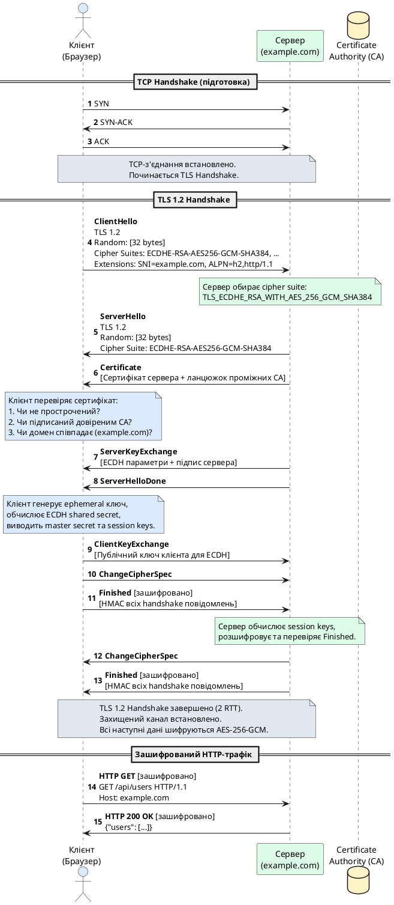

# HTTPS та криптографічні основи TLS

::card-group

::card{title="🎯 Мета розділу" icon="i-lucide-target"}

- Зрозуміти фундаментальні відмінності між HTTP та HTTPS з точки зору безпеки передачі даних.
- Опанувати архітектуру Transport Layer Security (TLS) та її роль у захисті веб-комунікацій.
- Детально розібрати процес TLS Handshake (рукостискання) у версіях 1.2 та 1.3.
- Засвоїти концепції симетричного та асиметричного шифрування у контексті TLS.
- Навчитися працювати з цифровими сертифікатами, ланцюжками довіри та Certificate Authorities.
- Розібратися з сучасними механізмами захисту: Perfect Forward Secrecy, Certificate Pinning, OCSP Stapling.

::

::card{title="🔑 Ключові терміни" icon="i-lucide-key"}

- **HTTPS (HTTP Secure)** — протокол HTTP, інкапсульований у TLS/SSL для забезпечення конфіденційності, цілісності та автентифікації.
- **TLS (Transport Layer Security)** — криптографічний протокол, що забезпечує безпечний канал зв'язку між клієнтом та сервером.
- **SSL (Secure Sockets Layer)** — застарілий попередник TLS (SSL 3.0 → TLS 1.0).
- **Handshake** — процес узгодження параметрів шифрування та взаємної автентифікації між клієнтом та сервером.
- **Symmetric Encryption** — симетричне шифрування, де один ключ використовується для шифрування та розшифрування.
- **Asymmetric Encryption** — асиметричне шифрування з парою ключів (публічний/приватний).
- **Certificate Authority (CA)** — довірена організація, що підписує цифрові сертифікати.
- **Certificate Chain** — ланцюжок довіри від кореневого CA до кінцевого сертифіката сервера.
- **Cipher Suite** — набір криптографічних алгоритмів для TLS-з'єднання.

::

::

---

## HTTP vs HTTPS: Фундаментальна відмінність

### Вразливості незахищеного HTTP

Протокол **HTTP** передає дані у **відкритому вигляді** (plaintext) через мережу без будь-якого шифрування. Це створює три критичні проблеми безпеки, які роблять HTTP непридатним для передачі чутливої інформації у сучасному інтернеті:

**1. Відсутність конфіденційності (Lack of Confidentiality)**

Будь-хто, хто має доступ до мережевого трафіку між клієнтом та сервером, може **прочитати весь вміст** HTTP-повідомлень: заголовки, тіло запитів, відповіді. Це можуть бути зловмисники у публічному Wi-Fi, інтернет-провайдери (ISP), урядові організації або адміністратори корпоративних мереж. Особливо вразливими є автентифікаційні дані (паролі, токени), особиста інформація (email, адреси, номери телефонів), фінансові дані (номери кредитних карток, банківські реквізити) та медичні записи.

Наприклад, якщо користувач надсилає логін та пароль через HTTP-форму у публічному Wi-Fi кафе, зловмисник з інструментом типу Wireshark може перехопити цей трафік та прочитати облікові дані у відкритому вигляді. Це не вимагає складних технічних навичок — базові інструменти сніфінгу мережі доступні публічно та легкі у використанні.

**2. Відсутність цілісності (Lack of Integrity)**

HTTP не має механізмів перевірки, чи **не були змінені дані** під час передачі. Зловмисник, що контролює мережеву інфраструктуру (наприклад, через атаку Man-in-the-Middle або скомпрометований роутер), може **модифікувати вміст** HTTP-повідомлень без відома клієнта або сервера. Це дозволяє впроваджувати шкідливий JavaScript-код у HTML-сторінки (XSS), змінювати параметри транзакцій (підміна суми платежу, рахунку отримувача), підміняти завантажувані файли (вірус замість легітимної програми) або змінювати інструкції API (модифікація JSON-відповідей).

Історичний приклад: деякі інтернет-провайдери впроваджували рекламу безпосередньо у HTTP-трафік своїх клієнтів, модифікуючи HTML-код сторінок на льоту. Користувачі бачили рекламу, яку сайти ніколи не розміщували, і не мали способу це перевірити.

**3. Відсутність автентифікації (Lack of Authentication)**

HTTP не надає гарантій, що клієнт спілкується саме з **легітимним сервером**, а не з підробленим. Зловмисник може підмінити DNS-записи (DNS Spoofing) або виконати ARP Poisoning у локальній мережі, перенаправляючи трафік на свій фальшивий сервер. Користувач вводить URL банку `http://bank.com`, але фактично підключається до сервера зловмисника, який імітує інтерфейс банку та викрадає облікові дані. Це класична **фішингова атака**, яка стає тривіальною без механізмів автентифікації сервера.

### Архітектура HTTPS: Інкапсуляція HTTP у TLS

**HTTPS** (HTTP Secure) вирішує всі три проблеми, інкапсулюючи HTTP-трафік у **криптографічний тунель TLS** (Transport Layer Security). HTTPS — це не окремий протокол, а комбінація двох протоколів: **HTTP працює поверх TLS**, який, у свою чергу, працює поверх TCP.

**Стек протоколів HTTP vs HTTPS:**

```
HTTP:                          HTTPS:
┌──────────────┐              ┌──────────────┐
│     HTTP     │              │     HTTP     │
├──────────────┤              ├──────────────┤
│     TCP      │              │     TLS      │
├──────────────┤              ├──────────────┤
│      IP      │              │     TCP      │
├──────────────┤              ├──────────────┤
│  Data Link   │              │      IP      │
└──────────────┘              ├──────────────┤
                              │  Data Link   │
                              └──────────────┘
```

TLS створює **захищений канал** між клієнтом та сервером, гарантуючи:

1. **Конфіденційність** — весь трафік шифрується симетричним алгоритмом (AES-256-GCM), непрочитний для третіх осіб.
2. **Цілісність** — кожне повідомлення супроводжується криптографічним MAC (Message Authentication Code), будь-яка модифікація виявляється та відкидається.
3. **Автентифікацію** — сервер доводить свою ідентичність через цифровий сертифікат, підписаний довіреним Certificate Authority.

**Порти за замовчуванням:**
- HTTP: **порт 80**
- HTTPS: **порт 443**

::note
**Історична довідка:**  
Протокол **SSL (Secure Sockets Layer)** був розроблений компанією Netscape у 1994-1995 роках. SSL 2.0 та 3.0 мали серйозні вразливості (POODLE, BEAST). У 1999 році IETF стандартизувала протокол під новою назвою **TLS (Transport Layer Security)** як наступник SSL. TLS 1.0 був фактично SSL 3.1. Сьогодні терміни "SSL" та "TLS" часто використовуються взаємозамінно, але технічно правильно говорити **TLS**, оскільки SSL застарів та небезпечний.
::

---

## Криптографічні основи TLS

Перед розглядом TLS Handshake необхідно зрозуміти фундаментальні криптографічні концепції, на яких базується протокол.

### Симетричне шифрування (Symmetric Encryption)

**Симетричне шифрування** використовує **один і той самий ключ** для шифрування (encryption) та розшифрування (decryption) даних. Це найшвидший тип шифрування, тому він використовується для **масового шифрування трафіку** в TLS після завершення handshake.

**Принцип роботи:**

**Відправник:**
```
Plaintext + Symmetric Key → Encryption Algorithm → Ciphertext
"Hello"   + [32 bytes]    → AES-256-GCM        → [encrypted bytes]
```

**Отримувач (з тим самим ключем):**
```
Ciphertext + Symmetric Key → Decryption Algorithm → Plaintext
[encrypted bytes] + [32 bytes] → AES-256-GCM → "Hello"
```

**Популярні симетричні алгоритми у TLS:**
- **AES (Advanced Encryption Standard)** — AES-128, AES-256 з режимами GCM (Galois/Counter Mode) або CBC (Cipher Block Chaining).
- **ChaCha20-Poly1305** — сучасний потоковий шифр, оптимізований для мобільних пристроїв без апаратного прискорення AES.

**Проблема симетричного шифрування:**  
Як безпечно передати симетричний ключ між клієнтом та сервером через незахищену мережу? Якщо ключ перехопить зловмисник, він зможе розшифрувати весь трафік. Саме тут в гру вступає **асиметричне шифрування**.

### Асиметричне шифрування (Asymmetric Encryption / Public-Key Cryptography)

**Асиметричне шифрування** використовує **пару математично пов'язаних ключів**: **публічний (public key)** та **приватний (private key)**. Дані, зашифровані публічним ключем, можуть бути розшифровані **лише** відповідним приватним ключем, і навпаки. Це вирішує проблему обміну ключами, дозволяючи безпечно передавати публічний ключ через незахищену мережу.

**Властивості:**
- **Публічний ключ** — може бути вільно розповсюджений, використовується для **шифрування** та **перевірки підписів**.
- **Приватний ключ** — зберігається у секреті, використовується для **розшифрування** та **створення підписів**.

**Принцип роботи (шифрування):**

**Відправник (має публічний ключ сервера):**
```
Plaintext + Server Public Key → RSA/ECDH Encryption → Ciphertext
"Secret"  + [public key]      → Algorithm           → [encrypted]
```

**Отримувач (сервер з приватним ключем):**
```
Ciphertext + Server Private Key → RSA/ECDH Decryption → Plaintext
[encrypted] + [private key]     → Algorithm           → "Secret"
```

**Популярні асиметричні алгоритми:**
- **RSA (Rivest-Shamir-Adleman)** — класичний алгоритм, базується на складності факторизації великих простих чисел. Ключі 2048-4096 біт.
- **ECDH (Elliptic Curve Diffie-Hellman)** — сучасний алгоритм узгодження ключів на основі еліптичних кривих. Коротші ключі (256 біт) з еквівалентною безпекою до RSA 3072 біт.
- **Ed25519** — алгоритм цифрових підписів на еліптичних кривих, надзвичайно швидкий та безпечний.

**Недолік асиметричного шифрування:**  
Набагато **повільніше** за симетричне (у 100-1000 разів). Тому у TLS воно використовується лише для **початкового обміну ключами** під час handshake, а масове шифрування трафіку виконується симетричним алгоритмом.

### Цифрові підписи (Digital Signatures)

**Цифровий підпис** доводить **автентичність** та **цілісність** повідомлення. Він створюється шляхом хешування повідомлення та шифрування цього хешу приватним ключем.

**Процес створення підпису:**

1. Обчислити хеш повідомлення: `SHA-256(message) → hash`
2. Зашифрувати хеш приватним ключем: `encrypt(hash, private_key) → signature`

**Процес перевірки підпису (отримувач має публічний ключ):**

1. Обчислити хеш отриманого повідомлення: `SHA-256(message) → hash_received`
2. Розшифрувати підпис публічним ключем: `decrypt(signature, public_key) → hash_original`
3. Порівняти хеші: якщо `hash_received == hash_original`, підпис валідний.

**Застосування у TLS:**  
Сервер підписує деякі параметри handshake своїм приватним ключем. Клієнт перевіряє підпис публічним ключем з сертифіката, доводячи, що сервер володіє приватним ключем, пов'язаним з цим сертифікатом.

### Хеш-функції (Hash Functions)

**Криптографічна хеш-функція** перетворює дані довільного розміру у **фіксований розмір** (хеш/дайджест) детерміністично та односпрямовано. Неможливо відновити оригінальні дані з хешу.

**Властивості:**
- **Детермінованість:** однакові дані завжди дають однаковий хеш.
- **Односпрямованість:** неможливо знайти дані, що дають конкретний хеш (preimage resistance).
- **Лавинний ефект:** зміна одного біта даних кардинально змінює хеш.
- **Стійкість до колізій:** практично неможливо знайти дві різні порції даних з однаковим хешом.

**Популярні хеш-функції:**
- **SHA-256, SHA-384, SHA-512** (Secure Hash Algorithm) — сучасні стандарти.
- **MD5, SHA-1** — застарілі, вразливі, не використовуються у TLS.

**Застосування у TLS:**
- Цифрові підписи (хешування перед підписом).
- HMAC (Hash-based Message Authentication Code) для перевірки цілісності повідомлень.
- Хешування сертифікатів для Certificate Pinning.

---

## TLS Handshake: Процес встановлення захищеного з'єднання

**TLS Handshake** є критично важливим етапом, під час якого клієнт та сервер **узгоджують параметри шифрування** та **автентифікують один одного** перед початком передачі зашифрованих даних. Handshake відбувається **після** встановлення TCP-з'єднання (3-way handshake) та **перед** надсиланням HTTP-запиту.

### TLS 1.2 Handshake (Full Handshake)

TLS 1.2 був стандартом протягом багатьох років (2008-2018) та залишається широко використовуваним. Повний handshake TLS 1.2 вимагає **двох roundtrips** (4 повідомлення туди-назад) перед початком передачі даних.


#### Фази TLS 1.2 Handshake

**Крок 1: ClientHello — Ініціація з'єднання**

Клієнт (браузер) ініціює TLS-з'єднання, надсилаючи повідомлення **ClientHello** до сервера. Це повідомлення містить критично важливу інформацію про можливості та вимоги клієнта:

**Вміст ClientHello:**
- **TLS версія:** Найвища підтримувана версія (наприклад, TLS 1.2).
- **Client Random:** 32 байти випадкових даних, згенерованих клієнтом. Використовується пізніше для генерації session keys.
- **Session ID:** Якщо клієнт раніше підключався до цього сервера, може надіслати ID попередньої сесії для спроби відновлення (session resumption).
- **Cipher Suites:** Список підтримуваних клієнтом наборів алгоритмів шифрування, відсортованих за пріоритетом. Наприклад:
  - `TLS_ECDHE_RSA_WITH_AES_256_GCM_SHA384`
  - `TLS_ECDHE_RSA_WITH_CHACHA20_POLY1305_SHA256`
  - `TLS_RSA_WITH_AES_128_GCM_SHA256`
- **Compression Methods:** Методи стиснення (зазвичай `null`, оскільки TLS-стиснення має вразливості CRIME).
- **Extensions:** Додаткові можливості (SNI, ALPN, supported groups, supported signature algorithms).

**Важливе розширення — SNI (Server Name Indication):**  
SNI дозволяє клієнту вказати **ім'я хоста** (domain name) у ClientHello. Це критично важливо для **virtual hosting**, коли один IP-сервер обслуговує кілька доменів з різними SSL-сертифікатами. Без SNI сервер не зна, який сертифікат відправити.

**Приклад ClientHello (спрощений текстовий формат):**
```
ClientHello:
  TLS Version: TLS 1.2
  Random: [32 bytes of random data]
  Session ID: [empty or previous session ID]
  Cipher Suites (4 suites):
    TLS_ECDHE_RSA_WITH_AES_256_GCM_SHA384
    TLS_ECDHE_RSA_WITH_CHACHA20_POLY1305_SHA256
    TLS_ECDHE_ECDSA_WITH_AES_256_GCM_SHA384
    TLS_RSA_WITH_AES_128_GCM_SHA256
  Compression: null
  Extensions:
    server_name: example.com (SNI)
    supported_groups: x25519, secp256r1, secp384r1
    signature_algorithms: rsa_pss_rsae_sha256, rsa_pkcs1_sha256, ecdsa_secp256r1_sha256
    application_layer_protocol_negotiation: h2, http/1.1
```

**Крок 2: ServerHello + Certificate + ServerKeyExchange + ServerHelloDone**

Сервер отримує ClientHello, аналізує підтримувані cipher suites та обирає найбезпечніший сумісний варіант. Сервер надсилає кілька повідомлень у відповідь (зазвичай в одному TCP-пакеті):

**2a. ServerHello:**
- **TLS версія:** Узгоджена версія (TLS 1.2).
- **Server Random:** 32 байти випадкових даних від сервера.
- **Session ID:** Новий або відновлений.
- **Обраний Cipher Suite:** Наприклад, `TLS_ECDHE_RSA_WITH_AES_256_GCM_SHA384`.
- **Compression:** `null`.
- **Extensions:** Відповіді на розширення клієнта.

**2b. Certificate:**  
Сервер надсилає свій **X.509 цифровий сертифікат** та зазвичай **ланцюжок проміжних сертифікатів** (certificate chain) до кореневого CA. Сертифікат містить:
- Публічний ключ сервера.
- Інформацію про домен (Common Name або Subject Alternative Names).
- Інформацію про Certificate Authority, що підписав сертифікат.
- Термін дії (Not Before, Not After).
- Цифровий підпис CA.

Клієнт **перевіряє сертифікат**: чи не прострочений, чи підписаний довіреним CA (з власного сховища кореневих сертифікатів), чи співпадає домен.

**2c. ServerKeyExchange (якщо використовується ECDHE/DHE):**  
Для cipher suites з **Forward Secrecy** (ECDHE, DHE) сервер надсилає параметри для узгодження ephemeral (тимчасового) ключа. Це можуть бути параметри еліптичної кривої та публічний ключ сервера для ECDH. Сервер **підписує** ці параметри своїм приватним ключем, доводячи автентичність.

**2d. ServerHelloDone:**  
Сервер повідомляє, що завершив свою частину handshake та очікує відповіді від клієнта.

**Крок 3: ClientKeyExchange + ChangeCipherSpec + Finished**

Клієнт завершує узгодження ключів та сигналізує про готовність до шифрованої комунікації:

**3a. ClientKeyExchange:**  
Клієнт генерує **premaster secret** (залежно від обраного cipher suite):
- Для **RSA**: Клієнт генерує випадкове 48-байтне значення (premaster secret), **шифрує його публічним ключем сервера** з сертифіката та надсилає серверу. Лише сервер з приватним ключем може розшифрувати.
- Для **ECDHE**: Клієнт генерує свій ephemeral приватний ключ, обчислює публічний ключ та надсилає його серверу. Обидві сторони виконують ECDH для отримання спільного секрету.

З premaster secret, Client Random та Server Random обидві сторони **незалежно обчислюють** однакові **master secret** (48 байт) та з нього **session keys** для симетричного шифрування та HMAC.

**3b. ChangeCipherSpec:**  
Клієнт надсилає спеціальне повідомлення, що повідомляє сервер: "Всі наступні повідомлення від мене будуть зашифровані обчисленими session keys".

**3c. Finished (зашифроване):**  
Клієнт надсилає **перше зашифроване повідомлення** — Finished message, яке містить хеш всіх попередніх handshake-повідомлень, зашифрований та MAC. Це дозволяє серверу **перевірити цілісність** всього handshake (захист від атак типу downgrade або MitM).

**Крок 4: ChangeCipherSpec + Finished (від сервера)**

Сервер, отримавши ClientKeyExchange, обчислює ті самі session keys, розшифровує та перевіряє Finished message від клієнта.

**4a. ChangeCipherSpec:**  
Сервер сигналізує, що переключається на шифроване з'єднання.

**4b. Finished (зашифроване):**  
Сервер надсилає свій Finished message з хешом всіх handshake-повідомлень, зашифрованим session keys.

**Крок 5: Application Data (HTTP через TLS)**

Handshake завершено. Клієнт та сервер тепер обмінюються **зашифрованим HTTP-трафіком** через встановлений захищений канал.

#### Візуалізація TLS 1.2 Handshake

::plant-uml{alt="TLS 1.2 Full Handshake"}



::

::accordion

::accordion-item{label="❓ Чому TLS 1.2 вимагає 2 roundtrips (2-RTT)?" icon="i-lucide-help-circle"}

TLS 1.2 Handshake складається з **чотирьох етапів обміну повідомленнями**, що вимагає двох повних циклів "запит-відповідь" (roundtrips) перед початком передачі даних:

**Roundtrip 1 (клієнт → сервер → клієнт):**
- Клієнт надсилає ClientHello.
- Сервер відповідає ServerHello + Certificate + ServerKeyExchange + ServerHelloDone.

На цьому етапі клієнт отримує сертифікат сервера та параметри для узгодження ключів, але **ще не може надіслати зашифровані дані**, оскільки session keys ще не обчислені.

**Roundtrip 2 (клієнт → сервер):**
- Клієнт надсилає ClientKeyExchange + ChangeCipherSpec + Finished.
- Сервер відповідає ChangeCipherSpec + Finished.

Лише після отримання підтвердження від сервера (Finished) клієнт може бути впевнений, що handshake завершено успішно та session keys коректні. Це означає, що **фактичний HTTP-запит** може бути надісланий лише після **2-RTT**, що додає затримку приблизно `2 × (мережева латентність)`.

Для з'єднання з латентністю 50 мс це додає 100 мс накладних витрат лише на handshake, що є значним для продуктивності веб-застосунків. Саме тому TLS 1.3 був розроблений з метою зменшити handshake до **1-RTT**, а у деяких випадках до **0-RTT** (zero roundtrip resumption).

::

::accordion-item{label="❓ Що таке Cipher Suite та як його читати?" icon="i-lucide-help-circle"}

**Cipher Suite** — це набір криптографічних алгоритмів, узгоджених між клієнтом та сервером для TLS-з'єднання. Він визначає алгоритми для кожного етапу криптографічного процесу.

**Формат Cipher Suite (TLS 1.2):**
```
TLS_<Key Exchange>_<Authentication>_WITH_<Encryption>_<Hash>
```

**Приклад: `TLS_ECDHE_RSA_WITH_AES_256_GCM_SHA384`**

Розшифровка компонентів:
1. **TLS** — протокол (TLS, а не SSL).
2. **ECDHE** (Elliptic Curve Diffie-Hellman Ephemeral) — алгоритм **узгодження ключів**. "Ephemeral" означає, що генеруються тимчасові ключі для кожної сесії (Forward Secrecy).
3. **RSA** — алгоритм **автентифікації сервера**. Сервер використовує RSA-ключі у сертифікаті для підпису параметрів ECDHE.
4. **AES_256_GCM** — алгоритм **симетричного шифрування** даних:
   - **AES-256** — Advanced Encryption Standard з 256-бітним ключем.
   - **GCM** (Galois/Counter Mode) — режим роботи, що забезпечує одночасно шифрування та автентифікацію (AEAD — Authenticated Encryption with Associated Data).
5. **SHA384** — **хеш-функція** для HMAC та цифрових підписів під час handshake.

**Інші приклади:**

`TLS_RSA_WITH_AES_128_CBC_SHA256`:
- RSA для узгодження ключів (**немає Forward Secrecy**, оскільки немає DHE/ECDHE).
- AES-128 у режимі CBC (старий режим, вразливий до BEAST, Lucky13).
- SHA-256 для HMAC.

`TLS_ECDHE_ECDSA_WITH_CHACHA20_POLY1305_SHA256`:
- ECDHE для узгодження ключів (Forward Secrecy).
- ECDSA для автентифікації (сертифікат на еліптичних кривих, швидший за RSA).
- ChaCha20-Poly1305 для шифрування (оптимізовано для мобільних пристроїв).
- SHA-256 для хешування.

**Сучасні рекомендації (2026):**  
Використовувати cipher suites з **ECDHE** або **DHE** (Forward Secrecy), **AES-GCM** або **ChaCha20-Poly1305** (AEAD), та **SHA-256/384** (безпечні хеш-функції). Уникати RSA key exchange (без ephemeral), CBC-режим, SHA-1, MD5.

::

::

### TLS 1.3 Handshake (1-RTT та 0-RTT)

**TLS 1.3**, стандартизований у 2018 році (RFC 8446), був розроблений з метою **підвищення безпеки** та **зменшення латентності**. Він спрощує handshake, видаляє застарілі небезпечні алгоритми та вводить **обов'язкове Forward Secrecy**.

#### Ключові покращення TLS 1.3

**1. Скорочення handshake до 1-RTT**

TLS 1.3 скорочує повний handshake з **2-RTT до 1-RTT**, що зменшує час встановлення з'єднання вдвічі. Це досягається шляхом **спекулятивного обчислення ключів** клієнтом у ClientHello.

**2. Спрощення Cipher Suites**

У TLS 1.3 cipher suites містять лише **алгоритм симетричного шифрування** та **хеш-функцію**. Узгодження ключів (key exchange) та автентифікація винесені в окремі параметри.

**Приклади TLS 1.3 Cipher Suites:**
- `TLS_AES_256_GCM_SHA384`
- `TLS_CHACHA20_POLY1305_SHA256`
- `TLS_AES_128_GCM_SHA256`

Алгоритм узгодження ключів (ECDHE, x25519, secp256r1) узгоджується через розширення `supported_groups` та `key_share`.

**3. Обов'язкове Forward Secrecy**

TLS 1.3 **видаляє RSA key exchange** (статичний обмін ключами), залишаючи лише **ephemeral Diffie-Hellman** (ECDHE, DHE). Це гарантує Forward Secrecy для всіх з'єднань.

**4. Видалення небезпечних алгоритмів**

TLS 1.3 видаляє підтримку:
- RSA key exchange
- CBC-режим (вразливий до BEAST, Lucky13)
- SHA-1, MD5
- RC4, 3DES
- Статичні ключі (без ephemeral)
- Renegotiation (джерело вразливостей)
- Compression (вразливість CRIME)

**5. Шифрування більшої частини handshake**

У TLS 1.3 всі повідомлення handshake після ServerHello **зашифровані**, включаючи сертифікат сервера. Це захищає метадані (який сертифікат використовується) від пасивного спостереження.


#### TLS 1.3 Handshake (1-RTT)

**Крок 1: ClientHello (з Key Share)**

Клієнт надсилає ClientHello, який містить **спекулятивне припущення** про алгоритм узгодження ключів, який обере сервер. Клієнт **генерує ephemeral ключі** для найімовірніших груп (наприклад, x25519) та включає **публічні ключі** у розширення `key_share`.

**Вміст ClientHello (TLS 1.3):**
- TLS версія: TLS 1.3
- Random: [32 bytes]
- Cipher Suites: `TLS_AES_256_GCM_SHA384`, `TLS_CHACHA20_POLY1305_SHA256`
- Extensions:
  - `supported_versions`: TLS 1.3
  - `supported_groups`: x25519, secp256r1, secp384r1
  - **`key_share`**: Публічний ключ клієнта для x25519 [32 bytes]
  - `signature_algorithms`: rsa_pss_rsae_sha256, ecdsa_secp256r1_sha256
  - `server_name`: example.com (SNI)

**Крок 2: ServerHello + EncryptedExtensions + Certificate + CertificateVerify + Finished**

Сервер отримує ClientHello, обирає cipher suite та групу узгодження ключів з `key_share` клієнта. Сервер **негайно обчислює shared secret** (використовуючи свій ephemeral приватний ключ та публічний ключ клієнта) та **виводить session keys**. Усі наступні повідомлення handshake **зашифровані** цими ключами.

**2a. ServerHello:**
- TLS версія: TLS 1.3
- Random: [32 bytes]
- Cipher Suite: `TLS_AES_256_GCM_SHA384`
- `key_share`: Публічний ключ сервера для x25519

**2b. EncryptedExtensions [зашифровано]:**
Розширення, які не потрібні для обчислення ключів (ALPN, server_name підтвердження).

**2c. Certificate [зашифровано]:**
Сертифікат сервера та ланцюжок проміжних CA.

**2d. CertificateVerify [зашифровано]:**
Сервер **підписує хеш** всіх попередніх handshake-повідомлень своїм приватним ключем, доводячи володіння приватним ключем з сертифіката.

**2e. Finished [зашифровано]:**
HMAC всіх handshake-повідомлень для перевірки цілісності.

**Крок 3: Client Finished**

Клієнт, отримавши ServerHello, обчислює ті самі session keys, розшифровує та перевіряє Certificate, CertificateVerify та Finished.

**3a. Finished [зашифровано]:**
Клієнт надсилає свій Finished message.

**Крок 4: Application Data**

Handshake завершено за **1-RTT**. HTTP-запити можуть бути надіслані одразу після ClientHello → ServerHello циклу, без очікування додаткового roundtrip.

**Порівняння TLS 1.2 vs TLS 1.3:**

| Характеристика | TLS 1.2 | TLS 1.3 |
|----------------|---------|---------|
| **Handshake RTT** | 2-RTT | 1-RTT (0-RTT для resumption) |
| **Forward Secrecy** | Опціонально (ECDHE/DHE) | Обов'язково (лише ECDHE/DHE) |
| **Шифрування handshake** | Лише після ChangeCipherSpec | Більшість handshake зашифровано |
| **Cipher Suites** | Складні (5 компонентів) | Спрощені (2 компоненти) |
| **Небезпечні алгоритми** | Підтримуються (RSA key exchange, CBC, SHA-1) | Видалені |
| **Renegotiation** | Підтримується (джерело вразливостей) | Видалено |

::tip
**TLS 1.3 0-RTT Resumption (Early Data):**  
Для повторних підключень TLS 1.3 підтримує **0-RTT resumption**, де клієнт може надіслати HTTP-запит **одночасно з ClientHello**, використовуючи ключі з попередньої сесії. Це зменшує латентність до нуля, але має обмеження: 0-RTT дані не мають Forward Secrecy та вразливі до replay-атак. Тому 0-RTT не повинен використовуватися для операцій зміни стану (POST, PUT, DELETE).
::

---

## Цифрові сертифікати та інфраструктура PKI

**Цифровий сертифікат** є електронним документом, що **прив'язує публічний ключ до ідентичності** (домен, організація, особа). Сертифікати дозволяють клієнтам перевіряти автентичність серверів у TLS-з'єднаннях.

### Структура X.509 сертифіката

Сертифікати у веб використовують стандарт **X.509 v3**. Основні компоненти:

**1. Версія та серійний номер:**
- Version: 3 (X.509 v3)
- Serial Number: Унікальний ідентифікатор сертифіката, виданий CA

**2. Алгоритм підпису:**
- Signature Algorithm: RSA with SHA-256, ECDSA with SHA-384

**3. Issuer (Видавець):**
Інформація про Certificate Authority, що підписав сертифікат:
```
CN = Let's Encrypt Authority X3
O = Let's Encrypt
C = US
```

**4. Validity (Термін дії):**
```
Not Before: 2026-01-01 00:00:00 UTC
Not After:  2026-04-01 23:59:59 UTC
```

**5. Subject (Власник):**
Інформація про сутність, якій виданий сертифікат:
```
CN = example.com
O = Example Corporation
L = San Francisco
ST = California
C = US
```

**6. Public Key Info:**
Публічний ключ власника та алгоритм:
```
Public Key Algorithm: RSA Encryption
RSA Public Key: (2048 bit)
  Modulus: 00:d4:f3:... [256 bytes]
  Exponent: 65537
```

або
```
Public Key Algorithm: EC Public Key (256 bit)
Curve: prime256v1
Public Key: 04:a1:b2:... [65 bytes]
```

**7. Extensions (Розширення):**

**Subject Alternative Names (SAN)** — список доменів, для яких дійсний сертифікат:
```
DNS: example.com
DNS: www.example.com
DNS: *.example.com (wildcard)
```

**Key Usage** — дозволені операції з ключем:
```
Digital Signature, Key Encipherment
```

**Extended Key Usage:**
```
TLS Web Server Authentication
TLS Web Client Authentication
```

**Basic Constraints:**
```
CA: FALSE (це не CA-сертифікат)
```

**8. Signature (Підпис CA):**
Цифровий підпис всього сертифіката, створений приватним ключем CA:
```
Signature Algorithm: sha256WithRSAEncryption
Signature: 6f:2a:b4:c8:... [256 bytes]
```

### Certificate Chain (Ланцюжок довіри)

У реальних сценаріях сертифікати організовані у **ієрархічний ланцюжок довіри**:

1. **Root CA Certificate (Кореневий сертифікат)** — самопідписаний, вбудований у браузери та операційні системи. Приклади: DigiCert Global Root CA, IdenTrust DST Root CA X3.

2. **Intermediate CA Certificate (Проміжний сертифікат)** — підписаний Root CA, використовується для підписання кінцевих сертифікатів. Дозволяє Root CA залишатися офлайн для безпеки.

3. **End-Entity Certificate (Кінцевий сертифікат сервера)** — підписаний Intermediate CA, використовується для TLS-з'єднань веб-сервером.

**Ланцюжок:**
```
example.com Certificate (End-Entity)
  ↓ підписаний
Let's Encrypt Authority X3 (Intermediate CA)
  ↓ підписаний
ISRG Root X1 (Root CA, вбудований у браузери)
```

**Процес перевірки клієнтом:**

1. Клієнт отримує сертифікат `example.com` від сервера.
2. Клієнт перевіряє підпис сертифіката, використовуючи публічний ключ з Intermediate CA.
3. Клієнт перевіряє підпис Intermediate CA, використовуючи публічний ключ Root CA.
4. Клієнт знаходить Root CA у своєму **Trust Store** (сховище довірених кореневих сертифікатів).
5. Якщо всі підписи валідні та Root CA довірений, ланцюжок перевірено успішно.

::note
**Чому проміжні сертифікати?**  
Кореневі CA зберігають свої приватні ключі у високозахищених **Hardware Security Modules (HSM)** у офлайн-режимі. Якби вони підписували кожен сертифікат веб-сайту безпосередньо, приватний ключ довелося б використовувати регулярно, збільшуючи ризик компрометації. Проміжні CA виступають **буфером**: якщо проміжний ключ скомпрометовано, Root CA може відкликати проміжний сертифікат та видати новий без необхідності оновлювати Trust Store у всіх браузерах.
::

### Certificate Authorities (CA) та Trust Store

**Certificate Authority** — це довірена організація, що видає та підписує цифрові сертифікати після перевірки ідентичності заявника. Браузери та операційні системи постачаються з **Trust Store** — списком кореневих сертифікатів CA, яким вони довіряють.

**Популярні публічні CA:**
- **Let's Encrypt** — безкоштовний, автоматизований CA (ACME протокол).
- **DigiCert, Sectigo (Comodo), GlobalSign** — комерційні CA з розширеною валідацією (EV).
- **Google Trust Services, Amazon Trust Services** — CA від технологічних гігантів.

**Типи валідації сертифікатів:**

1. **Domain Validation (DV)** — перевіряється лише контроль над доменом (через email, DNS-запис або HTTP challenge). Видається за хвилини. Використовується Let's Encrypt.

2. **Organization Validation (OV)** — перевіряється домен та існування організації (юридичні документи, телефонний дзвінок). Видається за 1-3 дні.

3. **Extended Validation (EV)** — найсуворіша перевірка (фізична адреса, юридичний статус, право підписання). У старих браузерах показувався зелений рядок адреси з назвою організації. Видається за 1-2 тижні.

::warning
**Еволюція EV-сертифікатів:**  
У 2019-2020 роках браузери (Chrome, Firefox, Safari) **видалили візуальні індикатори EV** (зелений рядок з назвою компанії) з інтерфейсу, оскільки дослідження показали, що користувачі не звертали на це уваги, а фішингові сайти використовували DV-сертифікати з назвами, схожими на легітимні компанії (наприклад, "Apple Inc Support"). Сьогодні всі HTTPS-сайти показуються однаково незалежно від типу валідації.
::

---

## Сучасні механізми безпеки TLS

### Perfect Forward Secrecy (PFS)

**Perfect Forward Secrecy** гарантує, що **компрометація приватного ключа сервера у майбутньому не дозволить розшифрувати раніше перехоплений трафік**. Це досягається використанням **ephemeral (тимчасових) ключів** для кожної сесії.

**Без PFS (RSA key exchange):**
- Сервер має статичний RSA приватний ключ.
- Клієнт шифрує premaster secret публічним ключем сервера.
- Зловмисник записує зашифрований трафік.
- Через 5 років зловмисник краде приватний ключ сервера (через злом, витік backup).
- Зловмисник розшифровує premaster secret з архівних записів handshake.
- Зловмисник виводить session keys та розшифровує **весь архівний трафік за 5 років**.

**З PFS (ECDHE key exchange):**
- Для кожної сесії генеруються нові ephemeral ключі.
- Після завершення сесії ephemeral ключі **видаляються з пам'яті** та ніколи не зберігаються.
- Навіть якщо зловмисник отримає статичний приватний ключ сервера, він **не зможе розшифрувати архівний трафік**, оскільки ephemeral ключі відсутні.

**Cipher Suites з PFS:**
- `TLS_ECDHE_RSA_WITH_AES_256_GCM_SHA384` ✅ (ECDHE)
- `TLS_DHE_RSA_WITH_AES_128_GCM_SHA256` ✅ (DHE)
- `TLS_RSA_WITH_AES_256_GCM_SHA384` ❌ (немає ephemeral, немає PFS)

TLS 1.3 **завжди** використовує PFS, оскільки підтримує лише ECDHE/DHE.

### HTTP Public Key Pinning (HPKP) — Застаріле

**HPKP** дозволяв веб-серверам оголошувати, які публічні ключі є валідними для їхнього домену. Браузер запам'ятовував ці ключі та відкидав з'єднання з іншими ключами, навіть якщо сертифікат підписаний довіреним CA.

**Заголовок:**
```http
Public-Key-Pins: pin-sha256="base64-hash-of-public-key"; max-age=5184000; includeSubDomains
```

**Проблеми HPKP:**
- **Ризик самоблокування:** Якщо сайт втратить доступ до pinned ключів (втрата приватного ключа, помилкова конфігурація), сайт стане **недоступним** для всіх користувачів протягом `max-age`.
- **Складність управління:** Потребує ретельного планування ротації ключів.
- **Низька прийнятність:** Менше 0.1% сайтів використовували HPKP через ризики.

**Статус:** HPKP **застарів** та видалений з Chrome (2018), Firefox (2020). Рекомендується використовувати **Certificate Transparency** замість цього.

### Certificate Transparency (CT)

**Certificate Transparency** — це система публічного логування всіх виданих SSL/TLS сертифікатів. Кожен сертифікат записується у публічні **CT Logs** (незмінні append-only логи), які може перевіряти будь-хто.

**Переваги:**
- **Виявлення неправомірних сертифікатів:** Власники доменів можуть моніторити CT Logs та виявляти сертифікати, видані для їхніх доменів без їхньої згоди (скомпрометований CA, phishing).
- **Підзвітність CA:** Всі дії CA є публічними та можуть бути аудитовані.

**Процес:**
1. CA видає сертифікат.
2. CA відправляє сертифікат до CT Log.
3. CT Log повертає **Signed Certificate Timestamp (SCT)** — криптографічне підтвердження, що сертифікат занесено до логу.
4. Сервер включає SCT у TLS handshake (через розширення або OCSP Stapling).
5. Браузер перевіряє наявність SCT — якщо відсутній, показує попередження (у Chrome обов'язково з 2018 року).

### OCSP Stapling

**Online Certificate Status Protocol (OCSP)** дозволяє перевіряти, чи не було **відкликано** (revoked) сертифікат. Традиційний OCSP вимагає, щоб браузер надсилав запит до OCSP-сервера CA під час кожного TLS handshake, що додає латентність та створює проблеми приватності (CA знає, які сайти відвідує користувач).

**OCSP Stapling** вирішує ці проблеми: **сервер** періодично отримує підписану OCSP-відповідь від CA та **додає ("staples")** її до TLS handshake. Браузер отримує свіжу інформацію про статус сертифіката без додаткового запиту.

**Переваги:**
- **Знижена латентність:** Немає додаткових запитів до CA.
- **Приватність:** CA не бачить, які сайти відвідує користувач.
- **Надійність:** Якщо OCSP-сервер CA недоступний, stapled відповідь все одно працює (якщо не прострочена).

**Налаштування (nginx приклад):**
```nginx
ssl_stapling on;
ssl_stapling_verify on;
ssl_trusted_certificate /path/to/chain.pem;
```

---

## Узагальнення та найкращі практики

::card-group

::card{title="🔐 TLS Версії" icon="i-lucide-shield"}

**Рекомендації:**
- Використовувати **TLS 1.3** як пріоритет (1-RTT, PFS, безпечніший)
- Підтримувати **TLS 1.2** для сумісності зі старими клієнтами
- **Відключити** TLS 1.0, TLS 1.1, SSL 3.0, SSL 2.0 (застарілі, вразливі)

::

::card{title="🔑 Cipher Suites" icon="i-lucide-key"}

**Пріоритезувати:**
- **ECDHE** для Forward Secrecy
- **AES-256-GCM** або **ChaCha20-Poly1305** для шифрування
- **SHA-256/384** для хешування
- Уникати RSA key exchange, CBC-режим, SHA-1

::

::card{title="📜 Сертифікати" icon="i-lucide-file-certificate"}

**Найкращі практики:**
- Використовувати **Let's Encrypt** для безкоштовних автоматизованих сертифікатів
- Ротація сертифікатів кожні **90 днів**
- Включити **Certificate Transparency** (SCT)
- Використовувати **OCSP Stapling**
- Wildcard-сертифікати для субдоменів: `*.example.com`

::

::card{title="⚡ Продуктивність" icon="i-lucide-zap"}

**Оптимізація:**
- **TLS 1.3** для 1-RTT handshake
- **Session Resumption** для повторних з'єднань
- **OCSP Stapling** замість online OCSP
- **HTTP/2** або **HTTP/3** поверх TLS
- Апаратне прискорення AES (AES-NI)

::

::

---

## Контрольні питання

::accordion

::accordion-item{label="Питання 1: Порівняння TLS 1.2 та TLS 1.3" icon="i-lucide-help-circle"}

**Завдання:** Поясніть ключові відмінності між TLS 1.2 та TLS 1.3. Чому TLS 1.3 швидший та безпечніший?

::collapsible{label="Показати відповідь"}

**Ключові відмінності:**

**1. Handshake Latency:**
- TLS 1.2: **2-RTT** (два повні цикли запит-відповідь)
- TLS 1.3: **1-RTT** (один цикл) + підтримка 0-RTT resumption

**2. Forward Secrecy:**
- TLS 1.2: **Опціонально** (потрібно обирати cipher suites з ECDHE/DHE)
- TLS 1.3: **Обов'язково** (підтримує лише ECDHE/DHE, RSA key exchange видалено)

**3. Шифрування Handshake:**
- TLS 1.2: Більшість handshake у відкритому вигляді
- TLS 1.3: **Більшість handshake зашифровано** (Certificate, CertificateVerify, Finished)

**4. Cipher Suites:**
- TLS 1.2: Складні (5 компонентів: key exchange, auth, encryption, mode, hash)
- TLS 1.3: **Спрощені** (2 компоненти: encryption + hash)

**5. Безпека:**
- TLS 1.2: Підтримує застарілі алгоритми (RSA key exchange, CBC, SHA-1, 3DES)
- TLS 1.3: **Видалено небезпечні алгоритми**, залишено лише сучасні (AES-GCM, ChaCha20-Poly1305, SHA-256/384)

**Чому швидший:**  
Зменшення handshake з 2-RTT до 1-RTT знижує час встановлення з'єднання вдвічі. Для з'єднання з латентністю 50 мс економія становить 50 мс на кожне нове з'єднання.

**Чому безпечніший:**  
Обов'язкове PFS гарантує, що компрометація приватного ключа у майбутньому не дозволить розшифрувати архівний трафік. Видалення вразливих алгоритмів усуває атаки типу BEAST, Lucky13, POODLE.

::

::

::accordion-item{label="Питання 2: Перевірка ланцюжка сертифікатів" icon="i-lucide-help-circle"}

**Завдання:** Опишіть покроковий процес перевірки браузером ланцюжка сертифікатів для `https://example.com`. Що перевіряється на кожному етапі?

::collapsible{label="Показати відповідь"}

**Процес перевірки (Certificate Chain Validation):**

**Крок 1: Отримання ланцюжка**  
Сервер надсилає у TLS Handshake:
- End-Entity Certificate (`example.com`)
- Intermediate CA Certificate (`Let's Encrypt Authority X3`)

**Крок 2: Перевірка End-Entity Certificate**  
Браузер перевіряє сертифікат `example.com`:
- ✅ **Термін дії:** `Not Before <= Current Date <= Not After`
- ✅ **Домен:** SAN містить `example.com` (або CN співпадає)
- ✅ **Key Usage:** Дозволено "TLS Web Server Authentication"
- ✅ **Підпис:** Цифровий підпис валідний (перевірка публічним ключем Intermediate CA)

**Крок 3: Перевірка Intermediate CA Certificate**  
Браузер перевіряє Intermediate CA:
- ✅ **Термін дії:** Не прострочений
- ✅ **CA Flag:** `Basic Constraints: CA=TRUE`
- ✅ **Підпис:** Валідний (перевірка публічним ключем Root CA)

**Крок 4: Перевірка Root CA**  
Браузер шукає Root CA (`ISRG Root X1`) у своєму **Trust Store**:
- ✅ **Присутній у Trust Store:** Сертифікат є довіреним
- ✅ **Самопідписаний:** Підпис валідний (Root CA підписує сам себе)

**Крок 5: Certificate Revocation (опціонально)**  
Браузер перевіряє, чи не відкликано сертифікат:
- Через **OCSP** (online запит до CA) або
- Через **OCSP Stapling** (сервер надає stapled відповідь) або
- Через **CRL (Certificate Revocation List)** — застарілий метод

**Крок 6: Certificate Transparency (Chrome, обов'язково з 2018)**  
Перевірка наявності **Signed Certificate Timestamp (SCT)**:
- ✅ SCT присутній у сертифікаті або TLS handshake
- ✅ SCT підписаний довіреним CT Log

**Якщо всі перевірки успішні:**  
Браузер встановлює TLS-з'єднання та показує **замок у адресному рядку** 🔒.

**Якщо будь-яка перевірка провалена:**  
Браузер показує попередження "Your connection is not private" та блокує з'єднання (або дозволяє продовжити з ризиком).

::

::

::accordion-item{label="Питання 3: Perfect Forward Secrecy у дії" icon="i-lucide-help-circle"}

**Завдання:** Поясніть, чому cipher suite `TLS_RSA_WITH_AES_256_GCM_SHA384` не забезпечує Perfect Forward Secrecy, а `TLS_ECDHE_RSA_WITH_AES_256_GCM_SHA384` забезпечує. Як це впливає на безпеку архівного трафіку?

::collapsible{label="Показати відповідь"}

**`TLS_RSA_WITH_AES_256_GCM_SHA384` (без PFS):**

**Процес узгодження ключів:**
1. Клієнт генерує 48-байтний `premaster secret`.
2. Клієнт **шифрує** `premaster secret` **статичним публічним ключем** з RSA-сертифіката сервера.
3. Сервер **розшифровує** `premaster secret` своїм **статичним приватним ключем**.
4. Обидві сторони виводять `master secret` та `session keys`.

**Проблема:**  
Якщо зловмисник:
1. **Записує** весь зашифрований трафік (handshake + application data).
2. **Через рік краде** приватний ключ сервера (злом, витік backup, sound employee).
3. Зловмисник **розшифровує** `premaster secret` з архівного handshake.
4. Зловмисник **виводить** `session keys` та **розшифровує весь архівний трафік**.

---

**`TLS_ECDHE_RSA_WITH_AES_256_GCM_SHA384` (з PFS):**

**Процес узгодження ключів:**
1. Сервер генерує **ephemeral (тимчасовий)** ECDH приватний ключ.
2. Сервер надсилає ephemeral публічний ключ у `ServerKeyExchange`.
3. Сервер **підписує** ці параметри своїм **статичним RSA приватним ключем** (доведення автентичності).
4. Клієнт генерує свій ephemeral ECDH ключ.
5. Обидві сторони виконують **ECDH key agreement** та отримують спільний секрет.
6. Після завершення сесії ephemeral ключі **видаляються з пам'яті назавжди**.

**Захист:**  
Навіть якщо зловмисник краде статичний RSA приватний ключ сервера:
- Зловмисник **не може** розшифрувати `premaster secret`, оскільки його **не існує** у цьому варіанті (використовується ECDH).
- Ephemeral ключі **не зберігаються** та **не можуть бути відновлені**.
- Зловмисник може **імітувати сервер** у майбутніх з'єднаннях, але **не може розшифрувати архівний трафік**.

**Висновок:**  
PFS гарантує, що **компрометація довгострокових ключів не компрометує минулі сесії**. Це критично важливо для захисту від довгострокового шпигунства (масова прослуховування трафіку спецслужбами з розшифровкою у майбутньому).

::

::

::

---

## Додаткові ресурси

1. **RFC 8446** — TLS 1.3 офіційна специфікація.
2. **SSL Labs Server Test** — безкоштовний аудит TLS-конфігурації сервера.
3. **Let's Encrypt Documentation** — автоматизація SSL-сертифікатів через ACME.
4. **Mozilla SSL Configuration Generator** — рекомендовані конфігурації для nginx, Apache, HAProxy.

::note
**Цикл «HTTP та HTTPS» завершено!** 🎉  
Ви опанували фундаментальні принципи веб-комунікацій від базового HTTP до криптографічних механізмів TLS 1.3. Ці знання є основою для розробки безпечних та продуктивних веб-застосунків.
::
