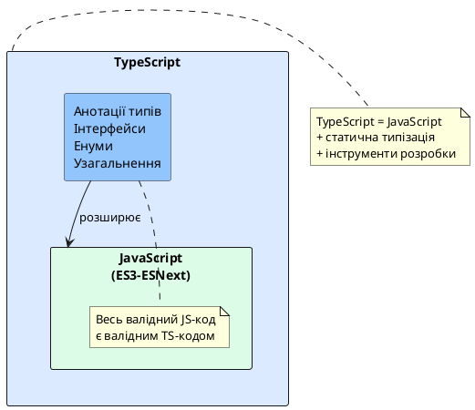
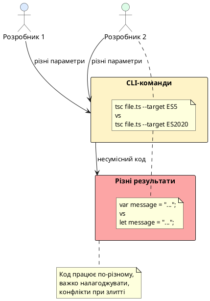
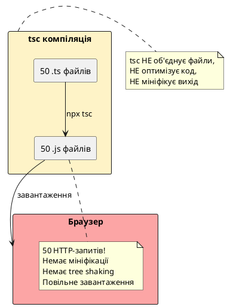
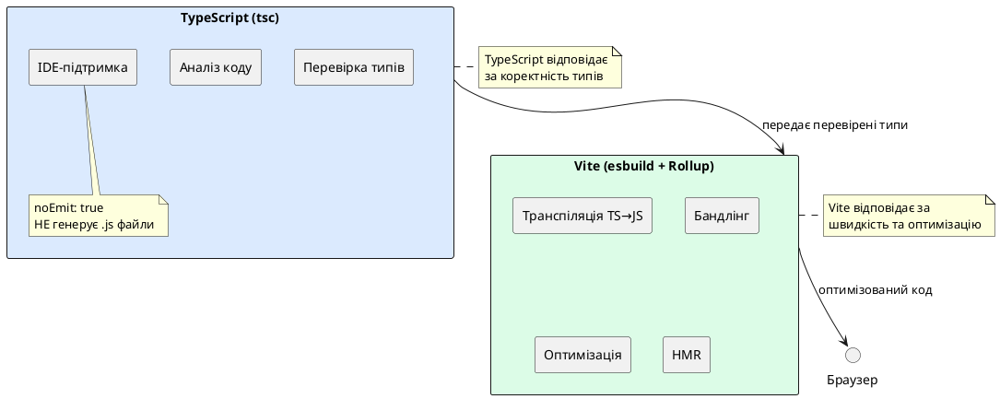

# Знайомство з TypeScript Compiler

::card-group

::card{title="🎯 Мета розділу" icon="i-lucide-target"}

- Зрозуміти, що таке компіляція TypeScript у JavaScript та навіщо вона потрібна.
- Опанувати роботу з компілятором `tsc` через командний рядок.
- Вивчити структуру та ключові параметри конфігураційного файлу `tsconfig.json`.
- Усвідомити еволюцію від tsc-компіляції до сучасних інструментів збірки (Vite).
- Зрозуміти концепцію `noEmit` та роль TypeScript у сучасних проєктах.

::

::card{title="🔑 Ключові терміни" icon="i-lucide-key"}

- **Компілятор (Compiler):** програма, що перетворює вихідний код однієї мови на іншу.
- **TypeScript Compiler (tsc):** офіційний компілятор TypeScript у JavaScript.
- **Транспіляція (Transpilation):** перетворення коду з однієї мови на іншу схожого рівня абстракції.
- **Target:** цільова версія JavaScript, у яку компілюється TypeScript (ES5, ES2015, ES2020 тощо).
- **Bundler:** інструмент збірки, що об'єднує модулі у фінальні файли (Vite, Webpack, Rollup).

::

::

---

## Проблематика динамічної типізації JavaScript

JavaScript був створений у 1995 році Бренданом Айком (_Brendan Eich_) за десять днів як мова сценаріїв для браузера Netscape Navigator. Його первинне призначення полягало у додаванні інтерактивності до статичних HTML-сторінок: валідація форм, анімації, обробка кліків. У той час ніхто не передбачав, що через два десятиліття JavaScript стане однією з найпопулярніших мов програмування у світі, на якій створюються складні серверні системи (Node.js), мобільні застосунки (React Native), настільні програми (Electron) та навіть вбудовані системи інтернету речей.

Однією з ключових характеристик JavaScript є **динамічна типізація** (_dynamic typing_). Це означає, що тип змінної визначається автоматично під час виконання програми (_runtime_), а не під час написання коду (_compile time_). Розробник може присвоїти змінній значення будь-якого типу, а потім змінити тип цього значення у будь-який момент:

```javascript
let data = "Hello, World!";  // рядок (string)
console.log(data.toUpperCase()); // "HELLO, WORLD!"

data = 42; // тепер число (number)
console.log(data.toFixed(2)); // "42.00"

data = { name: "Alice", age: 28 }; // тепер об'єкт (object)
console.log(data.name); // "Alice"
```

### Переваги динамічної типізації

Динамічна типізація має свої переваги, особливо на ранніх етапах розробки або для невеликих скриптів:

- **Швидкість прототипування:** Не потрібно витрачати час на оголошення типів, можна швидко експериментувати з різними структурами даних.
- **Гнучкість коду:** Функція може приймати аргументи різних типів та адаптувати поведінку залежно від переданого значення (_duck typing_: «якщо щось крякає як качка і плаває як качка — це качка»).
- **Мінімалістичний синтаксис:** Код виглядає стисло, без додаткових анотацій типів, що може підвищувати читабельність для простих випадків.

### Недоліки динамічної типізації у великих проєктах

Однак коли проєкт зростає у розмірах, коли над ним працює команда з десятків розробників, коли кодова база досягає сотень тисяч рядків, динамічна типізація перетворюється на джерело серйозних проблем:

**Проблема 1: Помилки типів виявляються лише під час виконання**

Уявімо функцію, що форматує дату публікації:

```javascript
function formatPublishDate(post) {
  return post.publishedAt.toISOString();
}

const article = { title: "My Article", author: "Alice" };
console.log(formatPublishDate(article)); 
// TypeError: Cannot read property 'toISOString' of undefined
```

Ця помилка з'явиться лише тоді, коли функція буде викликана з об'єктом, що не має властивості `publishedAt`. Якщо цей виклик знаходиться у рідко використовуваній гілці коду (наприклад, адміністративна панель, доступна лише певним користувачам), помилка може залишитися непоміченою тижнями або місяцями після розгортання у продакшен. Користувачі побачать білий екран або повідомлення про помилку, що негативно вплине на репутацію продукту.

**Проблема 2: Рефакторинг коду стає ризикованим**

Припустімо, ви перейменували властивість `author` на `authorName` у моделі статті. У великому проєкті можуть існувати десятки або сотні місць, де використовується `post.author`. Без статичної типізації неможливо автоматично знайти всі ці місця — IDE не знає, що `post` має бути об'єктом певної структури. Розробник змушений вручну шукати всі входження через текстовий пошук (_Find in Files_), що призводить до пропущених місць та помилок:

```javascript
// Файл 1: модель змінена
const post = { title: "Article", authorName: "Alice" };

// Файл 2: забули оновити (помилка!)
function getAuthor(post) {
  return post.author; // undefined, але компілятор не попереджає
}
```

**Проблема 3: Відсутність автодоповнення та інтелектуальних підказок**

Коли ви пишете `post.` у редакторі, IDE не може запропонувати список доступних властивостей, оскільки не знає структуру об'єкта `post`. Розробник змушений або запам'ятовувати імена полів, або постійно звертатися до документації чи інших частин коду. Це сповільнює розробку та підвищує кількість помилок через друкарські помилки у назвах властивостей.

**Проблема 4: Неявні контракти між модулями**

Функція `calculateTotal(price, quantity, discount)` не документує, які типи аргументів вона очікує. Чи `price` має бути числом у копійках (ціле число) чи у гривнях (дробове число)? Чи `discount` — це відсоток (0-100) чи коефіцієнт (0-1)? Без коментарів або зовнішньої документації це залишається загадкою, що призводить до некоректного використання функції:

```javascript
// Розробник A думає, що discount у відсотках:
calculateTotal(100, 2, 10); // очікує 10% знижки

// Розробник B думає, що discount — коефіцієнт:
calculateTotal(100, 2, 0.1); // очікує 10% знижки

// Яка реалізація правильна? Невідомо без читання коду!
```

::note
Згідно з дослідженням Microsoft, близько **15% помилок у JavaScript-проєктах** є помилками типів, які могли б бути виявлені статичним аналізатором на етапі компіляції. У великих командних проєктах цей відсоток може сягати 25-30%, що перетворює відлагодження у болісний процес пошуку помилок, які могли бути запобігнуті.
::

---

## TypeScript як рішення проблеми

У 2012 році компанія Microsoft оголосила про розробку мови **TypeScript** — надмножини JavaScript, що додає статичну типізацію та інші можливості для підтримки великомасштабної розробки. Головний архітектор TypeScript, **Андерс Хейлсберг** (_Anders Hejlsberg_), раніше працював над мовами Turbo Pascal, Delphi та C#, тому TypeScript увібрав багато ідей зі статично типізованих мов корпоративного класу.

### TypeScript як надмножина JavaScript

Ключова філософія TypeScript полягає у тому, що це **надмножина** (_superset_) JavaScript: **будь-який валідний JavaScript-код є валідним TypeScript-кодом**. Це означає, що ви можете взяти існуючий `.js` файл, перейменувати його у `.ts`, і він миттєво стане TypeScript-файлом без жодних змін. Немає потреби переписувати весь код з нуля — TypeScript можна впроваджувати поступово, файл за файлом, додаючи типізацію там, де це найбільш критично.

::plant-uml{alt="TypeScript як надмножина JavaScript"}



::

TypeScript додає до JavaScript наступні можливості:

- **Анотації типів:** Явне оголошення типів змінних, параметрів функцій, значень повернення.
- **Інтерфейси та псевдоніми типів:** Опис структури об'єктів, контрактів між модулями.
- **Узагальнені типи (Generics):** Створення функцій та класів, що працюють з різними типами даних, зберігаючи типобезпеку.
- **Перерахування (Enums):** Визначення іменованих констант для обмеження можливих значень.
- **Розширений об'єктно-орієнтований синтаксис:** Модифікатори доступу (`private`, `protected`, `public`), абстрактні класи.
- **Декоратори:** Метапрограмування для модифікації класів, методів та властивостей.

При цьому TypeScript не виконується безпосередньо — він **компілюється** (_transpiles_) у звичайний JavaScript, що може працювати у будь-якому середовищі виконання (браузери, Node.js, Deno, Bun).

### Переваги статичної типізації

Статична типізація TypeScript надає численні переваги, що кардинально змінюють досвід розробки:

**1. Раннє виявлення помилок**

Компілятор TypeScript аналізує код та повідомляє про типові невідповідності **до запуску програми**. Якщо ви спробуєте викликати метод на значенні `undefined` або передати рядок туди, де очікується число, компілятор видасть помилку на етапі написання коду:

```typescript
type Post = {
  id: string;
  title: string;
  publishedAt: Date;
};

function formatPublishDate(post: Post): string {
  return post.publishedAt.toISOString();
}

const article = { title: "My Article", author: "Alice" };
formatPublishDate(article); 
// Error: Argument of type '{ title: string; author: string; }' 
// is not assignable to parameter of type 'Post'.
// Property 'id' is missing.
```

Помилка виявлена у редакторі **до запуску коду**. Не потрібно чекати, поки користувач натрапить на цю помилку у продакшені.

**2. Автодоповнення та навігація у коді**

Редактори коду (Visual Studio Code, WebStorm, Sublime Text з плагінами) використовують інформацію про типи для надання інтелектуальних підказок. Коли ви пишете `post.`, IDE миттєво показує список доступних властивостей (`id`, `title`, `publishedAt`) та їхні типи. Натискання Ctrl+клік (Cmd+клік на macOS) на ім'я функції переносить вас до її оголошення:

{.screenshot}

**3. Безпечний рефакторинг**

Перейменування властивості через команду "Rename Symbol" у VS Code автоматично оновлює всі використання цієї властивості у всьому проєкті. Компілятор TypeScript гарантує, що жодне місце не буде пропущено. Якщо ви видалите параметр функції, компілятор покаже помилки у всіх місцях виклику цієї функції, де ще передається старий параметр.

**4. Самодокументований код**

Сигнатура функції `calculateTotal(price: number, quantity: number, discount: number): number` чітко вказує, які аргументи приймає функція (всі числа) та що вона повертає (число). Немає потреби шукати документацію або досліджувати тіло функції, щоб зрозуміти її контракт. Типи є **вбудованою документацією**, що завжди актуальна (на відміну від коментарів, які часто застарівають).

**5. Полегшення командної розробки**

Коли над проєктом працює кілька розробників, типізація діє як **формальна специфікація** інтерфейсів між модулями. Розробник, що працює над модулем оплати, може покладатися на те, що модуль користувачів надає об'єкт певної структури з гарантованими полями, і компілятор забезпечить дотримання цього контракту. Немає «сюрпризів» у вигляді неочікуваних `undefined` чи некоректних типів даних.

::warning
Поширена помилка полягає у думці, що TypeScript «сповільнює розробку» через необхідність писати анотації типів. Насправді ця початкова інвестиція часу багаторазово окупається зменшенням часу на відлагодження, рефакторинг та онбординг нових членів команди. За оцінками Airbnb, впровадження TypeScript у їхній кодовій базі **скоротило кількість продакшн-помилок на 38%** та **прискорило розробку нових функцій на 15%** завдяки покращеній підтримці IDE та впевненості розробників у коректності коду.
::

### Історичний контекст: чому TypeScript з'явився саме у 2012 році

До 2012 року JavaScript активно використовувався для створення складних веб-застосунків (Gmail, Google Maps, Facebook), але розробники стикалися з критичними проблемами масштабування. Google створив власну мову **Dart** (2011), що мала статичну типізацію та компілювалася у JavaScript. Facebook розробляв **Flow** — статичний аналізатор типів для JavaScript. Microsoft, маючи досвід створення корпоративних мов (C#, Visual Basic), бачив можливість створити рішення, що поєднує сумісність з JavaScript та потужність статичної типізації.

Ключовою відмінністю TypeScript від конкурентів стала **поступова типізація** (_gradual typing_): можна починати з чистого JavaScript та додавати типи поступово, файл за файлом. Це зробило міграцію існуючих проєктів практичною — не потрібно переписувати мільйони рядків коду за одну ніч.

Сьогодні TypeScript використовують:
- **Великі технологічні компанії:** Microsoft (весь VS Code написаний на TS), Google (Angular повністю на TS), Airbnb, Slack, Shopify.
- **Популярні фреймворки:** Angular (обов'язковий TS), Vue 3 (написаний на TS), NestJS (Node.js фреймворк).
- **Опенсорс-проєкти:** Redux Toolkit, RxJS, TypeORM, Prisma.

За даними State of JS 2023, **78% JavaScript-розробників** використовують TypeScript у своїх проєктах, і лише 9% планують від нього відмовитися. TypeScript став де-факто стандартом для серйозної веброзробки.

---

## Чому TypeScript потребує компіляції

JavaScript є **інтерпретованою мовою**: браузери та середовище Node.js виконують JavaScript-код безпосередньо, рядок за рядком, без попереднього перетворення. TypeScript, навпаки, не може бути виконаний безпосередньо — жоден рушій JavaScript (V8 у Chrome/Node.js, SpiderMonkey у Firefox, JavaScriptCore у Safari) не розуміє синтаксису TypeScript.

TypeScript є **надбудовою** (_superset_) JavaScript: будь-який валідний JavaScript-код є валідним TypeScript-кодом, але TypeScript додає додаткові конструкції — **анотації типів**, **інтерфейси**, **енуми**, **узагальнення** тощо. Ці конструкції існують лише на етапі розробки для перевірки коректності коду. Перед виконанням вони мають бути видалені, а сам код — перетворений на чистий JavaScript.

Процес перетворення TypeScript у JavaScript називається **компіляцією** (або точніше — **транспіляцією**, оскільки обидві мови знаходяться на схожому рівні абстракції). Цей процес виконує **TypeScript Compiler** — програма `tsc` (_TypeScript Compiler_).

::plant-uml{alt="Процес компіляції TypeScript"}

```plantuml
@startuml
skinparam style plain
skinparam backgroundColor #FFFFFF
skinparam componentStyle rectangle

rectangle "Вихідний TypeScript\n(example.ts)" as TS #DBEAFE {
    note bottom
    let message: string = "Hello";
    function greet(name: string): string {
      return `Hello, ${name}!`;
    }
    end note
}

rectangle "TypeScript Compiler\n(tsc)" as TSC #FCD34D {
    note bottom
    1. Парсинг коду
    2. Перевірка типів
    3. Видалення анотацій
    4. Трансформація синтаксису
    end note
}

rectangle "Згенерований JavaScript\n(example.js)" as JS #DCFCE7 {
    note bottom
    var message = "Hello";
    function greet(name) {
      return "Hello, " + name + "!";
    }
    end note
}

rectangle "Виконання\n(Node.js / Browser)" as Runtime #E2E8F0

TS -right-> TSC : npx tsc example.ts
TSC -right-> JS : генерація
JS -right-> Runtime : node example.js

note bottom of Runtime
  TypeScript зникає повністю —
  виконується чистий JavaScript
end note
@enduml
```

::

::note
TypeScript не додає жодних runtime-бібліотек чи залежностей до згенерованого коду (на відміну від Babel з полі-філами). Результатом компіляції завжди є чистий JavaScript, який може виконуватися у будь-якому середовищі без додаткових залежностей.
::

---

## Встановлення TypeScript Compiler

Перед початком роботи необхідно встановити Node.js (версія LTS, наприклад 20.x) та менеджер пакетів npm. Перевірте встановлення:

```bash
node --version   # v20.11.0
npm --version    # 10.4.0
```

Створіть новий каталог для експериментів та ініціалізуйте npm-проєкт:

```bash
mkdir typescript-basics
cd typescript-basics
npm init -y
```

Встановіть TypeScript як залежність розробки:

::tabs
::tabs-item{label="npm"}
```bash
npm install --save-dev typescript
```
::
::tabs-item{label="yarn"}
```bash
yarn add --dev typescript
```
::
::tabs-item{label="pnpm"}
```bash
pnpm add -D typescript
```
::
::

Перевірте встановлення компілятора:

```bash
npx tsc --version
```

::terminal-preview{title="npx tsc --version" :cursor="false"}

<div class="line"><span class="opacity-40">$</span> <strong class="font-bold">npx tsc --version</strong></div>
<div class="line"><span class="text-green-400">Version 5.3.3</span></div>
::

Команда `npx` запускає локально встановлений виконуваний файл з `node_modules/.bin/`, що дозволяє уникнути глобального встановлення.

---

## Перша компіляція: робота з tsc через CLI

Створимо найпростіший TypeScript-файл та скомпілюємо його вручну через командний рядок.

### Приклад 1: Базова компіляція

Створіть файл `hello.ts`:

```typescript
let message: string = "Hello, TypeScript!";
console.log(message.toUpperCase());
```

Скомпілюйте файл командою:

```bash
npx tsc hello.ts
```

Компілятор створить файл `hello.js` у тому ж каталозі:

```javascript
var message = "Hello, TypeScript!";
console.log(message.toUpperCase());
```

Зверніть увагу на зміни:

1. **Анотація типу `: string` видалена** — JavaScript не знає про типи.
2. **`let` замінено на `var`** — за замовчуванням tsc компілює у ES3/ES5 для максимальної сумісності.

Запустіть згенерований JavaScript:

```bash
node hello.js
```

::terminal-preview{title="node hello.js" :cursor="false"}

<div class="line"><span class="opacity-40">$</span> <strong class="font-bold">node hello.js</strong></div>
<div class="line">HELLO, TYPESCRIPT!</div>
::

### Приклад 2: Функції з типізацією

Створіть файл `math.ts`:

```typescript
function add(a: number, b: number): number {
  return a + b;
}

function multiply(x: number, y: number): number {
  return x * y;
}

let result: number = add(5, 3);
console.log(`5 + 3 = ${result}`);
console.log(`5 * 3 = ${multiply(5, 3)}`);
```

Скомпілюйте:

```bash
npx tsc math.ts
```

Згенерований `math.js`:

```javascript
function add(a, b) {
    return a + b;
}
function multiply(x, y) {
    return x * y;
}
var result = add(5, 3);
console.log("5 + 3 = " + result);
console.log("5 * 3 = " + multiply(5, 3));
```

Зміни:

1. **Всі анотації типів видалені** (`: number`).
2. **Template literal перетворено на конкатенацію** — це поведінка для ES5.
3. **`let` замінено на `var`**.

::warning
За замовчуванням tsc використовує **target: ES3**, що є надзвичайно старою версією JavaScript (1999 рік). Це призводить до громіздкого коду. У реальних проєктах завжди налаштовуйте target через параметри CLI або `tsconfig.json`.
::

### Приклад 3: Вказування target через CLI

Скомпілюємо той же файл у сучасніший JavaScript (ES2020):

```bash
npx tsc math.ts --target ES2020
```

Згенерований `math.js` (ES2020):

```javascript
function add(a, b) {
    return a + b;
}
function multiply(x, y) {
    return x * y;
}
let result = add(5, 3);
console.log(`5 + 3 = ${result}`);
console.log(`5 * 3 = ${multiply(5, 3)}`);
```

Тепер код зберігає `let` та template literals, оскільки ES2020 їх підтримує.

::tip
Команда `npx tsc --help` виводить повний список доступних параметрів компілятора. Експериментуйте з різними комбінаціями для розуміння їхнього впливу на вихідний код.
::

---

## Проблеми компіляції через CLI

Компіляція через командний рядок підходить для швидких експериментів, але має серйозні недоліки для реальних проєктів:

### Проблема 1: Багатослівність команд

Кожного разу доводиться вручну вказувати всі параметри:

```bash
npx tsc src/index.ts --target ES2020 --module ESNext --outDir dist --strict --esModuleInterop
```

Якщо проєкт має 20 файлів, команда стає неймовірно довгою. Немає способу зберегти налаштування для повторного використання.

### Проблема 2: Відсутність консистентності

Різні члени команди можуть використовувати різні параметри компіляції, що призводить до несумісного коду. Один розробник компілює у ES5, інший у ES2020 — результати відрізняються.

### Проблема 3: Немає автоматичної компіляції всіх файлів

Для компіляції всього проєкту потрібно або перелічити всі файли вручну, або використовувати glob-паттерни, що не завжди працюють однаково на різних ОС:

```bash
npx tsc src/**/*.ts --outDir dist
```

### Проблема 4: Складність налаштування IDE

Редактори коду (VS Code, WebStorm) потребують знати параметри компіляції для коректного аналізу та підказок. Передавати їм параметри через CLI неможливо.

::plant-uml{alt="Проблеми CLI-компіляції"}



::

**Рішення:** Всі параметри компіляції виносяться у конфігураційний файл `tsconfig.json`, який стає єдиним джерелом істини для проєкту.

---

## Конфігураційний файл tsconfig.json

Файл `tsconfig.json` — це JSON-конфігурація, що описує параметри компіляції TypeScript-проєкту. Він розміщується у корені проєкту та автоматично зчитується компілятором `tsc`, а також редакторами коду для аналізу.

### Створення базового tsconfig.json

Згенеруйте файл командою:

```bash
npx tsc --init
```

Ця команда створює `tsconfig.json` із детальними коментарями:

```json
{
  "compilerOptions": {
    "target": "ES2016",
    "module": "commonjs",
    "strict": true,
    "esModuleInterop": true,
    "skipLibCheck": true,
    "forceConsistentCasingInFileNames": true
  }
}
```

Тепер для компіляції всього проєкту достатньо виконати:

```bash
npx tsc
```

Компілятор автоматично знайде `tsconfig.json`, прочитає налаштування та скомпілює всі `.ts` файли відповідно до конфігурації.

::note
Якщо у каталозі є `tsconfig.json`, команда `npx tsc` без аргументів компілює **весь проєкт** згідно з конфігурацією. Якщо вказати конкретний файл (`npx tsc file.ts`), `tsconfig.json` **ігнорується**, і використовуються параметри за замовчуванням або параметри CLI.
::

### Структура tsconfig.json

Файл складається з кількох основних секцій:

```json
{
  "compilerOptions": {
    // Параметри компілятора
  },
  "include": [
    // Які файли компілювати
  ],
  "exclude": [
    // Які файли ігнорувати
  ],
  "files": [
    // Конкретні файли (рідко використовується)
  ]
}
```

Найважливішою є секція `compilerOptions`, що містить десятки параметрів. Розглянемо найкритичніші.

---

## Детальний розбір ключових параметрів compilerOptions

### Параметр `target`: цільова версія JavaScript

Параметр `target` визначає, у яку версію ECMAScript компілюватиметься TypeScript-код.

**Доступні значення:**
- `ES3` (1999) — Internet Explorer 6-8
- `ES5` (2009) — IE 9-11, старі Android-браузери
- `ES6` / `ES2015` (2015) — класи, стрілкові функції, `let`/`const`, модулі
- `ES2016` — оператор `**` (піднесення до степеня)
- `ES2017` — `async`/`await`
- `ES2020` — optional chaining (`?.`), nullish coalescing (`??`), `BigInt`
- `ES2022` — class fields, top-level `await`
- `ESNext` — найновіші можливості (експериментальні)

**Приклад впливу target:**

::code-group

```typescript [Вихідний TypeScript]
const greet = (name: string): string => {
  return `Hello, ${name}!`;
};

class User {
  constructor(public name: string) {}
}

console.log(greet("Alice"));
```

```javascript [target: ES5]
var greet = function (name) {
    return "Hello, " + name + "!";
};
var User = /** @class */ (function () {
    function User(name) {
        this.name = name;
    }
    return User;
}());
console.log(greet("Alice"));
```

```javascript [target: ES2015]
const greet = (name) => {
    return `Hello, ${name}!`;
};
class User {
    constructor(name) {
        this.name = name;
    }
}
console.log(greet("Alice"));
```

```javascript [target: ES2020]
const greet = (name) => {
    return `Hello, ${name}!`;
};
class User {
    constructor(name) {
        this.name = name;
    }
}
console.log(greet("Alice"));
```

::

**Як обрати target:**
- **Node.js 18+:** `ES2022` або `ESNext`
- **Сучасні браузери (Chrome/Firefox/Safari останніх 2 версій):** `ES2020`
- **Потрібна підтримка IE11:** `ES5`
- **Невідоме середовище:** `ES2015` (безпечний баланс)

::terminal-preview{title="tsc з різними target" :cursor="true"}

<div class="line"><span class="opacity-40">$</span> <strong class="font-bold">npx tsc --target ES5 example.ts</strong></div>
<div class="line"><span class="text-blue-400">Generated:</span> example.js <span class="opacity-60">(ES5 syntax)</span></div>
<div class="line"></div>
<div class="line"><span class="opacity-40">$</span> <strong class="font-bold">npx tsc --target ES2020 example.ts</strong></div>
<div class="line"><span class="text-blue-400">Generated:</span> example.js <span class="opacity-60">(modern syntax)</span></div>
::

### Параметр `module`: система модулів

Параметр `module` визначає, яку систему модулів використовувати у згенерованому JavaScript-коді.

**Доступні значення:**
- `CommonJS` — Node.js-модулі (`require`/`module.exports`)
- `ES2015` / `ES6` / `ESNext` — стандарт ECMAScript (`import`/`export`)
- `AMD` — Asynchronous Module Definition (застарілий)
- `UMD` — Universal Module Definition (сумісний з усіма системами)
- `None` — без модулів (всі файли у глобальній області видимості)

**Приклад впливу module:**

::code-group

```typescript [Вихідний TypeScript]
export function calculateSum(a: number, b: number): number {
  return a + b;
}

import { calculateSum } from './math';
console.log(calculateSum(5, 3));
```

```javascript [module: CommonJS]
"use strict";
Object.defineProperty(exports, "__esModule", { value: true });
exports.calculateSum = void 0;
function calculateSum(a, b) {
    return a + b;
}
exports.calculateSum = calculateSum;

// Імпорт
const math_1 = require("./math");
console.log((0, math_1.calculateSum)(5, 3));
```

```javascript [module: ES2015]
export function calculateSum(a, b) {
    return a + b;
}

// Імпорт
import { calculateSum } from './math';
console.log(calculateSum(5, 3));
```

::

**Як обрати module:**
- **Node.js проєкт:** `CommonJS` (або `ES2015` якщо package.json має `"type": "module"`)
- **Браузерний проєкт з бандлером (Vite/Webpack):** `ESNext`
- **Бібліотека для npm:** `CommonJS` або гібридний підхід

### Параметри `outDir` та `rootDir`: організація файлів

- **`rootDir`:** Кореневий каталог вихідних `.ts` файлів (зазвичай `./src`)
- **`outDir`:** Каталог для згенерованих `.js` файлів (зазвичай `./dist` або `./build`)

```json
{
  "compilerOptions": {
    "rootDir": "./src",
    "outDir": "./dist"
  }
}
```

**До компіляції:**
```
project/
├── src/
│   ├── index.ts
│   └── utils.ts
└── tsconfig.json
```

**Після `npx tsc`:**
```
project/
├── src/
│   ├── index.ts
│   └── utils.ts
├── dist/           # <-- згенеровано
│   ├── index.js
│   └── utils.js
└── tsconfig.json
```

::warning
Якщо не вказати `rootDir`, компілятор визначить його автоматично як найглибший спільний каталог усіх вхідних файлів. Це може призвести до неочікуваної структури `dist/`.
::

### Параметр `strict`: суворий режим типізації

Параметр `strict: true` вмикає всі сув

орі перевірки типів одночасно. Це **найважливіший параметр** для якісного коду.

```json
{
  "compilerOptions": {
    "strict": true
  }
}
```

Еквівалентно вмиканню:
- `strictNullChecks` — `null` та `undefined` окремі типи
- `strictFunctionTypes` — сувора перевірка типів функцій
- `strictBindCallApply` — перевірка типів для `bind`/`call`/`apply`
- `strictPropertyInitialization` — властивості класів мають бути ініціалізовані
- `noImplicitAny` — заборона неявного `any`
- `noImplicitThis` — заборона неявного `this`
- `alwaysStrict` — генерувати `"use strict"` у JS

**Приклад:**

```typescript
// Без strict
let value: string;
value = null; // Дозволено (небезпечно!)

// З strict: true
let value: string;
value = null; // Error: Type 'null' is not assignable to type 'string'
```

::tip
Завжди використовуйте `strict: true` для нових проєктів. Це запобігає 70-80% типових помилок на ранніх етапах розробки.
::

---

Продовжити з наступною секцією про еволюцію до Vite?


## Еволюція від tsc до сучасних інструментів збірки

### Обмеження класичної tsc-компіляції

Компілятор `tsc` чудово справляється з перевіркою типів та трансформацією TypeScript у JavaScript, але має кілька фундаментальних обмежень для сучасної веброзробки:

**1. Відсутність бандлінгу (bundling):**

`tsc` компілює кожен `.ts` файл у окремий `.js` файл, зберігаючи структуру каталогів. Це означає, що якщо ваш проєкт має 50 файлів, згенерується 50 JavaScript-файлів. Браузер повинен завантажити всі ці файли окремими HTTP-запитами:

```
src/
├── index.ts
├── utils/
│   ├── math.ts
│   ├── string.ts
│   └── validation.ts
└── components/
    ├── button.ts
    └── card.ts

↓ npx tsc

dist/
├── index.js
├── utils/
│   ├── math.js
│   ├── string.js
│   └── validation.js
└── components/
    ├── button.js
    └── card.js
```

Кожен файл — окремий HTTP-запит. Для великих проєктів це сотні запитів, що критично сповільнює завантаження.

**2. Немає оптимізацій коду:**

`tsc` не мініфікує код, не видаляє невикористані змінні (_tree shaking_), не оптимізує імпорти. Згенерований JavaScript містить коментарі, пробіли, повні назви змінних.

**3. Відсутність Hot Module Replacement (HMR):**

При зміні файлу доводиться перекомпілювати весь проєкт командою `npx tsc --watch` та вручну перезавантажувати браузер. Немає автоматичного оновлення змін у реальному часі.

**4. Повільна компіляція великих проєктів:**

`tsc` написаний на TypeScript та виконується у Node.js. Для проєктів з тисячами файлів компіляція може займати хвилини.

::plant-uml{alt="Обмеження tsc для браузерної розробки"}



::

### Рішення: Бандлери та інструменти збірки

Для вирішення цих проблем виникли **бандлери** (_bundlers_) — інструменти, що об'єднують кілька модулів у один або кілька оптимізованих файлів:

- **Webpack** (2012) — потужний, але складний у налаштуванні
- **Rollup** (2015) — спеціалізований для бібліотек, чудовий tree shaking
- **Parcel** (2017) — zero-config, автоматичні налаштування
- **esbuild** (2020) — надшвидкий, написаний на Go
- **Vite** (2020) — сучасний, заснований на esbuild та Rollup

### Vite: швидкість та простота

**Vite** (_від французького «швидкий»_) — це інструмент збірки нового покоління, створений Еваном Ю (автором Vue.js). Vite використовує нативні ES-модулі браузера під час розробки та Rollup для продакшн-збірки.

**Ключові переваги Vite:**

1. **Миттєвий запуск dev-сервера** — не потрібно збирати весь проєкт перед стартом.
2. **Hot Module Replacement (HMR)** — зміни з'являються у браузері за мілісекунди.
3. **Вбудована підтримка TypeScript** — не потрібно налаштовувати tsc.
4. **Оптимізація для продакшену** — автоматична мініфікація, tree shaking, code splitting.

### Встановлення проєкту з Vite

Створіть новий проєкт:

```bash
npm create vite@latest my-app -- --template vanilla-ts
cd my-app
npm install
```

Структура згенерованого проєкту:

::code-tree

```text [Структура Vite-проєкту]
my-app/
├── src/
│   ├── main.ts          # Точка входу
│   ├── style.css
│   └── vite-env.d.ts    # Типи для Vite
├── index.html           # HTML-шаблон
├── tsconfig.json        # Конфігурація TypeScript
├── vite.config.ts       # Конфігурація Vite (опціонально)
└── package.json
```

::

Запустіть dev-сервер:

```bash
npm run dev
```

::terminal-preview{title="npm run dev" :cursor="true"}

<div class="line"><span class="opacity-40">$</span> <strong class="font-bold">npm run dev</strong></div>
<div class="line"></div>
<div class="line"><span class="text-blue-400 font-bold">VITE</span> v5.0.10 <span class="opacity-60">ready in 324 ms</span></div>
<div class="line"></div>
<div class="line"><span class="text-green-400">➜</span>  <span class="font-bold">Local:</span>   <span class="text-cyan-400">http://localhost:5173/</span></div>
<div class="line"><span class="text-green-400">➜</span>  <span class="font-bold">Network:</span> use <span class="opacity-60">--host</span> to expose</div>
::

Відкрийте `http://localhost:5173/` — застосунок працює! Змініть `src/main.ts`, збережіть файл — зміни миттєво з'являться у браузері без перезавантаження сторінки.

---

## Концепція noEmit: TypeScript без компіляції

Подивимося на `tsconfig.json`, згенерований Vite:

```json
{
  "compilerOptions": {
    "target": "ES2020",
    "useDefineForClassFields": true,
    "module": "ESNext",
    "lib": ["ES2020", "DOM", "DOM.Iterable"],
    "skipLibCheck": true,

    /* Bundler mode */
    "moduleResolution": "bundler",
    "allowImportingTsExtensions": true,
    "resolveJsonModule": true,
    "isolatedModules": true,
    "noEmit": true,  // <-- КЛЮЧОВА ОПЦІЯ!

    /* Linting */
    "strict": true,
    "noUnusedLocals": true,
    "noUnusedParameters": true,
    "noFallthroughCasesInSwitch": true
  },
  "include": ["src"]
}
```

Зверніть увагу на параметр **`noEmit: true`**. Що це означає?

### Що таке noEmit?

`noEmit: true` вказує компілятору TypeScript **не генерувати JavaScript-файли**. tsc виконує лише **перевірку типів** (_type checking_) без створення вихідних `.js` файлів.

**Чому це потрібно у Vite-проєкті?**

Vite має власний транспілятор (esbuild), що перетворює TypeScript у JavaScript **на льоту** під час розробки та через Rollup при збірці для продакшену. Це набагато швидше, ніж tsc.

Роль TypeScript у Vite-проєкті:
1. **Перевірка типів** — знаходження помилок типізації.
2. **Інтелектуальні підказки IDE** — автодоповнення, навігація по коду.
3. **Статичний аналіз** — виявлення потенційних помилок до виконання.

Роль Vite:
1. **Транспіляція TypeScript → JavaScript** (через esbuild).
2. **Бандлінг модулів** (об'єднання файлів).
3. **Оптимізація коду** (мініфікація, tree shaking).
4. **Hot Module Replacement** (миттєве оновлення у браузері).

::plant-uml{alt="Розділення відповідальності: TypeScript vs Vite"}



::

### Перевірка типів у Vite-проєкті

Vite **не перевіряє типи** під час dev-сервера для максимальної швидкості. Помилки типізації з'являються лише у редакторі коду (VS Code) або при запуску `tsc` вручну.

Додайте скрипт для перевірки типів у `package.json`:

```json
{
  "scripts": {
    "dev": "vite",
    "build": "tsc && vite build",  // Перевірка типів перед збіркою
    "preview": "vite preview",
    "typecheck": "tsc --noEmit"    // Лише перевірка типів
  }
}
```

Тепер можна запустити:

```bash
npm run typecheck
```

::terminal-preview{title="npm run typecheck" :cursor="true"}

<div class="line"><span class="opacity-40">$</span> <strong class="font-bold">npm run typecheck</strong></div>
<div class="line"></div>
<div class="line"><span class="text-red-400 font-bold">src/main.ts:5:7 - error TS2322:</span> Type 'number' is not assignable to type 'string'.</div>
<div class="line"></div>
<div class="line"><span class="opacity-60">5</span>   let name: string = 42;</div>
<div class="line">      <span class="text-red-400">~~~~</span></div>
<div class="line"></div>
<div class="line"><span class="text-blue-400">Found 1 error.</span></div>
::

::tip
У CI/CD-конвеєрах завжди додавайте крок `npm run typecheck` перед збіркою. Це гарантує, що код без помилок типізації потрапить у продакшен, навіть якщо розробник пропустив помилку у редакторі.
::

---

## Порівняння підходів: tsc vs Vite

| Критерій | tsc (класичний) | Vite + noEmit |
|---|---|---|
| **Транспіляція** | tsc перетворює TS→JS | esbuild (швидше у 10-100 разів) |
| **Перевірка типів** | Так, під час компіляції | Окремо через `tsc --noEmit` |
| **Бандлінг** | Ні (кожен файл окремо) | Так (Rollup для продакшену) |
| **HMR** | Ні | Так (миттєво) |
| **Швидкість dev-сервера** | Повільно (перекомпіляція) | Миттєво (на льоту) |
| **Оптимізація продакшену** | Ні | Так (мініфікація, tree shaking) |
| **Складність налаштування** | Проста | Проста (zero-config) |
| **Коли використовувати** | Node.js-бібліотеки | Браузерні застосунки |

::note
Для **Node.js-проєктів** (серверів, CLI-утиліт, бібліотек) tsc залишається стандартним вибором, оскільки там не потрібні бандлінг та HMR. Для **браузерних застосунків** Vite (або інші бандлери) є де-факто стандартом.
::

---

## Практичний приклад: TypeScript + Vite

Створимо простий калькулятор з типізацією:

::code-tree

```typescript [src/calculator.ts]
type Operation = 'add' | 'subtract' | 'multiply' | 'divide';

function calculate(a: number, b: number, op: Operation): number {
  switch (op) {
    case 'add':
      return a + b;
    case 'subtract':
      return a - b;
    case 'multiply':
      return a * b;
    case 'divide':
      if (b === 0) {
        throw new Error('Division by zero');
      }
      return a / b;
  }
}

export { calculate, type Operation };
```

```typescript [src/main.ts]
import { calculate } from './calculator';

const result1 = calculate(10, 5, 'add');
console.log(`10 + 5 = ${result1}`); // 15

const result2 = calculate(10, 5, 'multiply');
console.log(`10 * 5 = ${result2}`); // 50

// Помилка типізації (перехоплена tsc):
// const result3 = calculate(10, 5, 'modulo'); 
// Error: Argument of type '"modulo"' is not assignable to parameter of type 'Operation'
```

::

Запустіть dev-сервер:

```bash
npm run dev
```

Відкрийте консоль браузера — побачите результати. Спробуйте розкоментувати останній рядок з помилкою — VS Code миттєво покаже червоне підкреслення, а `npm run typecheck` виведе помилку компіляції.

---

## Підсумок та ключові висновки

TypeScript Compiler (tsc) є фундаментом екосистеми TypeScript, але його роль еволюціонувала з часом. У сучасних проєктах tsc часто виконує лише перевірку типів, тоді як транспіляція та оптимізація делегуються швидшим інструментам.

Ключові тези розділу:

- **tsc через CLI** підходить для експериментів, але незручний для реальних проєктів через багатослівність команд.
- **tsconfig.json** є єдиним джерелом істини для налаштувань компіляції, забезпечуючи консистентність у команді.
- **target** визначає версію JavaScript (ES5, ES2020, ESNext), **module** — систему модулів (CommonJS, ESNext).
- **strict: true** вмикає найсуворіші перевірки типів та рекомендується для всіх нових проєктів.
- **Vite** — сучасний інструмент збірки, що використовує esbuild для транспіляції та Rollup для продакшен-збірки.
- **noEmit: true** у Vite-проєктах означає, що tsc лише перевіряє типи, а не генерує JavaScript.
- **Розділення відповідальності:** TypeScript — перевірка типів, Vite — транспіляція та оптимізація.

::accordion

::accordion-item{label="❓ Чи можна використовувати tsc для браузерних проєктів без Vite?" icon="i-lucide-help-circle"}

Так, але це не рекомендується для продакшену. `tsc` згенерує окремі `.js` файли для кожного модуля, що призведе до сотень HTTP-запитів у браузері. Для невеликих навчальних проєктів це прийнятно, але для реальних застосунків потрібен бандлер (Vite, Webpack, Rollup).

Альтернативно, можна налаштувати `module: "ESNext"` та використовувати нативні ES-модулі браузера з `<script type="module">`, але це також має обмеження (немає tree shaking, мініфікації, HMR).

::

::accordion-item{label="❓ Що станеться, якщо видалити noEmit з Vite-проєкту?" icon="i-lucide-help-circle"}

tsc почне генерувати `.js` файли поруч з `.ts` файлами (або у `outDir`). Це створить плутанину: у проєкті будуть і TypeScript, і згенеровані JavaScript-файли, які Vite ігноруватиме.

Крім того, це подвоїть час збірки: спочатку tsc компілює у JS, потім Vite знову транспілює оригінальні `.ts` файли. Немає жодної користі від генерованих tsc файлів у Vite-проєкті.

**Висновок:** завжди залишайте `noEmit: true` у проєктах, що використовують бандлер.

::

::accordion-item{label="❓ Як запустити перевірку типів автоматично при збереженні файлу?" icon="i-lucide-help-circle"}

Використовуйте `tsc --watch --noEmit`:

```bash
npx tsc --watch --noEmit
```

Ця команда запустить tsc у режимі спостереження: при кожній зміні файлу компілятор перевірятиме типи та виводитиме помилки у термінал. Це можна запустити у окремому терміналі паралельно з `npm run dev`.

Альтернативно, встановіть плагін для VS Code **Error Lens**, що показує помилки tsc безпосередньо у редакторі у реальному часі.

::

::

---

## Контрольні питання для самоперевірки

1. Чому TypeScript не може виконуватися безпосередньо у браузері або Node.js?
2. Яка різниця між компіляцією через `npx tsc file.ts` та `npx tsc` (без аргументів)?
3. Як параметр `target` впливає на згенерований JavaScript-код? Наведіть приклад.
4. Чому `strict: true` є найважливішим параметром для нових проєктів?
5. У чому полягають обмеження класичної tsc-компіляції для браузерних проєктів?
6. Що означає параметр `noEmit: true` у Vite-проєкті?
7. Яка роль TypeScript у сучасних проєктах з бандлерами (Vite, Webpack)?
8. Коли варто використовувати tsc без бандлера, а коли обов'язково потрібен Vite?
