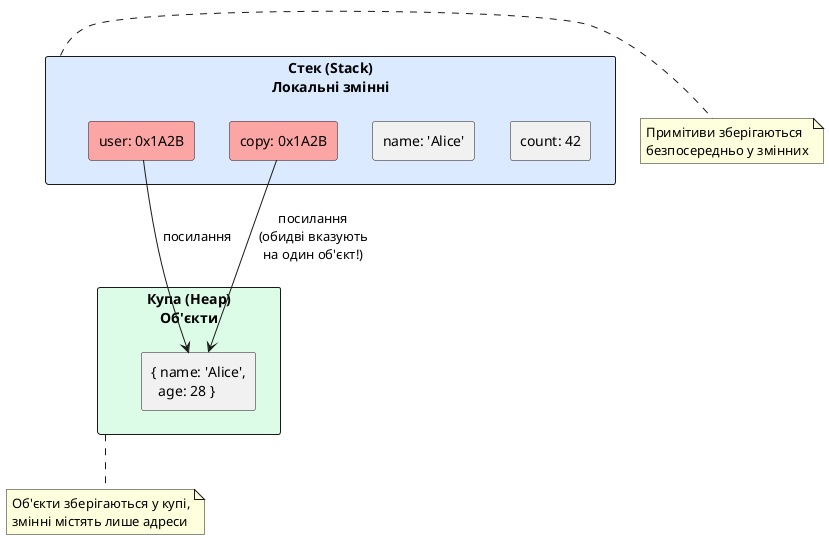
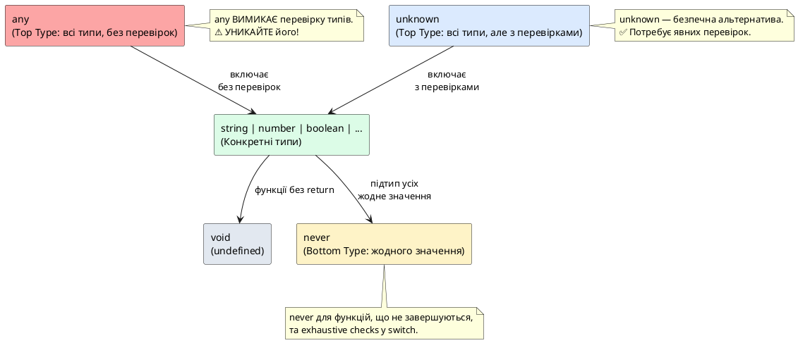

# Примітивні типи даних: string, number, boolean

::card-group

::card{title="🎯 Мета розділу" icon="i-lucide-target"}

- Глибоко зрозуміти, що таке примітивний тип та чим він відрізняється від об'єктного.
- Опанувати внутрішню будову типів `string`, `number`, `boolean` у JavaScript.
- Навчитися правильно типізувати змінні та функції у TypeScript.
- Усвідомити особливості та підводні камені кожного примітивного типу.
- Вивчити різницю між явною анотацією типів та автоматичним виведенням.

::

::card{title="🔑 Ключові терміни" icon="i-lucide-key"}

- **Примітивний тип (Primitive Type):** незмінний базовий тип даних, що зберігається за значенням.
- **Об'єктний тип (Object Type):** складний тип даних, що зберігається за посиланням.
- **Іммутабельність (Immutability):** властивість даних, які не можуть бути змінені після створення.
- **Type Annotation:** явне оголошення типу змінної через синтаксис `: Type`.
- **Type Inference:** автоматичне визначення типу компілятором на основі значення.

::

::

---

## Що таке примітивний тип: фундаментальна концепція

У JavaScript (і TypeScript) існують два фундаментальних класи типів даних: **примітивні типи** (_primitive types_) та **об'єктні типи** (_object types_). Розуміння їхньої різниці є критично важливим для написання коректного коду.

### Примітивні vs об'єктні типи

**Примітивний тип** — це атомарне, незмінне (_immutable_) значення, що зберігається безпосередньо у змінній:

```javascript
let count = 42;        // примітивне число зберігається безпосередньо
let name = "Alice";    // примітивний рядок зберігається безпосередньо
let isActive = true;   // примітивний boolean зберігається безпосередньо
```

**Об'єктний тип** — це складна структура, що зберігається у пам'яті (купа, _heap_), а у змінній зберігається лише **посилання** (_reference_) на цю структуру:

```javascript
let user = { name: "Alice", age: 28 };  // у змінній user зберігається ПОСИЛАННЯ на об'єкт
let numbers = [1, 2, 3];                // у змінній numbers зберігається ПОСИЛАННЯ на масив
```

### Практичні наслідки цієї різниці

Коли ви присвоюєте примітивне значення, **копіюється саме значення**:

```javascript
let a = 10;
let b = a;  // b отримує КОПІЮ значення 10

a = 20;     // змінюємо a

console.log(a); // 20
console.log(b); // 10 (залишилось незмінним, оскільки це окрема копія)
```

Коли ви присвоюєте об'єкт, **копіюється посилання**, а не сам об'єкт:

```javascript
let user1 = { name: "Alice" };
let user2 = user1;  // user2 отримує КОПІЮ ПОСИЛАННЯ (обидві змінні вказують на один об'єкт!)

user1.name = "Bob"; // змінюємо об'єкт через user1

console.log(user1.name); // "Bob"
console.log(user2.name); // "Bob" (!!!) — обидві змінні вказують на один об'єкт
```

::plant-uml{alt="Різниця між примітивами та об'єктами у пам'яті"}



::

::note
**Чому примітиви зберігаються у стеку, а об'єкти у купі?**

Примітивні значення мають **фіксований розмір** (число займає 8 байт, boolean — 1 байт), тому їх можна ефективно розмістити у стеку, який працює за принципом LIFO (Last In, First Out). 

Об'єкти мають **динамічний розмір** (масив може мати 3 елементи зараз і 1000 елементів через секунду), тому вони розміщуються у купі, де пам'ять виділяється та звільняється динамічно. У стеку зберігається лише 4-8 байт посилання (адреса у купі).
::

### Сім примітивних типів JavaScript

JavaScript має рівно сім примітивних типів:

1. **string** — рядки текстових символів
2. **number** — числа (цілі та дробові)
3. **boolean** — логічні значення (`true` / `false`)
4. **null** — явна відсутність об'єктного значення
5. **undefined** — неініціалізована змінна
6. **symbol** — унікальний ідентифікатор (ES2015+)
7. **bigint** — великі цілі числа (ES2020+)

У цьому розділі детально розглянемо перші три, які є найпоширенішими у повсякденній розробці.

---

## Тип `string`: текстові дані та їхня внутрішня будова

### Що таке рядок у JavaScript

**Рядок** (_string_) — це послідовність символів Unicode, що представляють текст. У JavaScript рядки є **іммутабельними** (_immutable_): жодна операція не може змінити існуючий рядок, лише створити новий.

```javascript
let greeting = "Hello";
let upper = greeting.toUpperCase(); // створює НОВИЙ рядок "HELLO"

console.log(greeting); // "Hello" (оригінал не змінився)
console.log(upper);    // "HELLO" (новий рядок)
```

Це фундаментально відрізняється від масивів, які є змінними (_mutable_):

```javascript
let numbers = [1, 2, 3];
numbers.push(4);  // ЗМІНЮЄ існуючий масив

console.log(numbers); // [1, 2, 3, 4] (оригінальний масив змінився)
```

### Три способи оголошення рядків

JavaScript підтримує три синтаксиси для літералів рядків:

```javascript
// 1. Одинарні лапки (single quotes)
let name1 = 'Alice';

// 2. Подвійні лапки (double quotes)
let name2 = "Bob";

// 3. Зворотні лапки / template literals (backticks) - ES2015+
let name3 = `Charlie`;
```

Функціонально одинарні та подвійні лапки **абсолютно ідентичні**. Вибір між ними — питання стилю коду (найпопулярніша конвенція — одинарні лапки для простих рядків).

**Template literals** (зворотні лапки) мають суперсили:

**1. Інтерполяція змінних:**

```javascript
let userName = "Alice";
let age = 28;

// Старий спосіб (конкатенація)
let message1 = "User " + userName + " is " + age + " years old";

// Сучасний спосіб (template literal)
let message2 = `User ${userName} is ${age} years old`;

console.log(message2); // "User Alice is 28 years old"
```

**2. Багаторядкові рядки:**

```javascript
// Старий спосіб (некрасиво)
let html1 = "<div>\n" +
            "  <h1>Title</h1>\n" +
            "</div>";

// Сучасний спосіб (чисто)
let html2 = `
<div>
  <h1>Title</h1>
</div>
`;
```

**3. Вбудовані вирази:**

```javascript
let price = 99.99;
let quantity = 3;

let total = `Total: $${(price * quantity).toFixed(2)}`;
console.log(total); // "Total: $299.97"
```

### Типізація рядків у TypeScript

TypeScript додає статичну перевірку типів для рядків:

```typescript
// Явна анотація типу
let firstName: string = "Alice";
let lastName: string = 'Johnson';
let fullName: string = `${firstName} ${lastName}`;

// Автоматичне виведення типу (Type Inference)
let city = "Kyiv";  // TypeScript виводить: string
```

При наведенні курсору на `city` у VS Code побачите підказку: `let city: string`.

**TypeScript забороняє присвоєння значень іншого типу:**

```typescript
let userName: string = "Alice";

userName = 42; 
// Error: Type 'number' is not assignable to type 'string'

userName = true;
// Error: Type 'boolean' is not assignable to type 'string'
```

### Внутрішнє представлення: UTF-16 та сурогатні пари

JavaScript зберігає рядки у форматі **UTF-16** — кожен символ займає 2 байти (16 біт). Це працює чудово для більшості символів (латиниця, кирилиця, цифри, базові символи), але має підводний камінь з **сурогатними парами** (_surrogate pairs_).

Символи Unicode поза Basic Multilingual Plane (BMP) — емодзі, рідкісні ієрогліфи, математичні символи — займають **дві 16-бітні одиниці**:

```javascript
let emoji = "😀";

console.log(emoji.length);  // 2 (!!!) — не 1, як очікувалось
console.log(emoji[0]);      // � (некоректний символ)
console.log(emoji[1]);      // � (некоректний символ)
```

**Правильний спосіб роботи з Unicode:**

```javascript
let text = "Hello 😀 World";

// Неправильно: length рахує UTF-16 одиниці
console.log(text.length); // 14 (не 13!)

// Правильно: перетворюємо у масив символів
let chars = Array.from(text);
console.log(chars.length); // 13 ✓
console.log(chars[6]);     // "😀" ✓

// Або через spread оператор
let chars2 = [...text];
console.log(chars2.length); // 13 ✓
```

::warning
**Поширена помилка:** Підрахунок "кількості символів" через `.length` для валідації вводу (наприклад, "максимум 100 символів у коментарі"). Якщо користувач введе багато емодзі, фактична кількість символів буде вдвічі меншою за `.length`.

**Рішення:** Використовуйте `Array.from(text).length` або бібліотеки для коректної роботи з Unicode (наприклад, `grapheme-splitter`).
::

### Методи роботи з рядками

JavaScript надає багато методів для роботи з рядками. Пам'ятайте: всі вони **не змінюють** оригінальний рядок, а повертають новий:

```typescript
let text: string = "  Hello, World!  ";

// Видалення пробілів
let trimmed: string = text.trim();  // "Hello, World!"

// Зміна регістру
let upper: string = text.toUpperCase();  // "  HELLO, WORLD!  "
let lower: string = text.toLowerCase();  // "  hello, world!  "

// Пошук підрядка
let includes: boolean = text.includes("World");  // true
let startsWith: boolean = text.startsWith("  Hello");  // true
let endsWith: boolean = text.endsWith("!");  // false (бо є пробіли в кінці)

// Заміна
let replaced: string = text.replace("World", "TypeScript");  // "  Hello, TypeScript!  "

// Розбиття на масив
let words: string[] = text.trim().split(", ");  // ["Hello", "World!"]

// Отримання підрядка
let sub1: string = text.substring(2, 7);  // "Hello"
let sub2: string = text.slice(2, 7);      // "Hello"

// Повторення (ES2015+)
let repeated: string = "Ha".repeat(3);  // "HaHaHa"

console.log(text); // "  Hello, World!  " (оригінал не змінився!)
```

**TypeScript перевіряє типи:**

```typescript
let message: string = "Hello";

// Правильно: метод повертає string
let upper: string = message.toUpperCase();

// Помилка: includes повертає boolean, а не string
let result: string = message.includes("He");
// Error: Type 'boolean' is not assignable to type 'string'
```

### Практичні приклади з рядками

**Приклад 1: Форматування імені користувача**

```typescript
function formatUserName(firstName: string, lastName: string): string {
  const formattedFirst = firstName.trim().charAt(0).toUpperCase() + firstName.trim().slice(1).toLowerCase();
  const formattedLast = lastName.trim().charAt(0).toUpperCase() + lastName.trim().slice(1).toLowerCase();
  
  return `${formattedFirst} ${formattedLast}`;
}

console.log(formatUserName("  aLiCe  ", "  jOhNsOn  ")); // "Alice Johnson"
```

**Приклад 2: Генерація slug для URL**

```typescript
function generateSlug(title: string): string {
  return title
    .toLowerCase()                    // "hello world!" → "hello world!"
    .trim()                           // видаляє пробіли з країв
    .replace(/[^\w\s-]/g, '')        // видаляє спецсимволи (крім - та пробілів)
    .replace(/\s+/g, '-')            // пробіли → дефіси
    .replace(/-+/g, '-');            // множинні дефіси → один дефіс
}

console.log(generateSlug("  Hello, World! 2024  ")); // "hello-world-2024"
```

**Приклад 3: Перевірка email (спрощена)**

```typescript
function isValidEmail(email: string): boolean {
  const trimmed = email.trim().toLowerCase();
  
  return trimmed.includes("@") && 
         trimmed.includes(".") &&
         trimmed.indexOf("@") > 0 &&
         trimmed.lastIndexOf(".") > trimmed.indexOf("@");
}

console.log(isValidEmail("alice@example.com")); // true
console.log(isValidEmail("invalid.email"));     // false
console.log(isValidEmail("@example.com"));      // false
```

---

## Тип `number`: числові дані та особливості IEEE 754

### Що таке число у JavaScript

У JavaScript існує **один єдиний тип для всіх чисел** — `number`. На відміну від мов як Java, C++ чи C#, JavaScript не розрізняє:

- Цілі числа (`int`, `long`) та дробові (`float`, `double`)
- Знакові та беззнакові числа
- Числа різної точності

Всі числа представлені у форматі **IEEE 754 double-precision floating-point** (64-бітне число з плаваючою комою).

### Внутрішня будова IEEE 754

64 біти числа розподілені так:

- **1 біт знаку** (0 = додатнє, 1 = від'ємне)
- **11 біт експоненти** (визначає порядок величини)
- **52 біти мантиси** (значущі цифри числа)

Це дає:

- **Діапазон:** приблизно ±1.8 × 10^308
- **Точність:** ~15-17 десяткових цифр
- **Спеціальні значення:** `Infinity`, `-Infinity`, `NaN`

```typescript
// Звичайні числа
let age: number = 28;
let temperature: number = -15.7;
let pi: number = 3.14159265358979;

// Спеціальні значення
let positiveInf: number = Infinity;
let negativeInf: number = -Infinity;
let notANumber: number = NaN;

// Перевірка спеціальних значень
console.log(isFinite(age));        // true
console.log(isFinite(Infinity));   // false
console.log(isNaN(notANumber));    // true
```

### Різні системи числення

JavaScript підтримує літерали у різних системах числення:

```typescript
// Десяткова (decimal) - за замовчуванням
let decimal: number = 255;

// Шістнадцяткова (hexadecimal) - префікс 0x
let hex: number = 0xFF;            // 255
let hexColor: number = 0x1A2B3C;   // 1715004

// Бінарна (binary) - префікс 0b (ES2015+)
let binary: number = 0b11111111;   // 255

// Вісімкова (octal) - префікс 0o (ES2015+)
let octal: number = 0o377;         // 255

console.log(decimal === hex);      // true
console.log(hex === binary);       // true
console.log(binary === octal);     // true
```

Усі ці літерали **представляють одне і те саме число** — просто записані у різних форматах. У runtime усі вони перетворюються на звичайні десяткові числа.

### Підводний камінь 1: Обмеження точності цілих чисел

JavaScript може безпечно представляти цілі числа лише у діапазоні від `-(2^53 - 1)` до `2^53 - 1`:

```typescript
console.log(Number.MAX_SAFE_INTEGER);  // 9007199254740991
console.log(Number.MIN_SAFE_INTEGER);  // -9007199254740991

// Усередині безпечного діапазону — все ОК
let safe1: number = 9007199254740991;
let safe2: number = safe1 + 1;
console.log(safe2 === 9007199254740992); // true ✓

// ЗА МЕЖАМИ безпечного діапазону — втрата точності!
let unsafe1: number = 9007199254740992;
let unsafe2: number = unsafe1 + 1;
console.log(unsafe2 === unsafe1);        // true (!!!) — числа стали однаковими
console.log(unsafe2);                    // 9007199254740992 (не 9007199254740993!)
```

**Чому це відбувається?**

У IEEE 754 є лише 52 біти для зберігання значущих цифр. Коли число виходить за межі 2^53, не вистачає бітів для точного представлення кожної цілої одиниці — деякі числа "пропускаються".

::warning
**Поширена помилка:** Використання `number` для ID записів у базі даних, які генеруються автоінкрементом. Якщо у вашій таблиці понад 9 квадрильйонів записів (що нереально), або якщо ID генеруються як 64-бітні числа (наприклад, Twitter Snowflake ID), JavaScript втратить точність.

**Рішення:** Використовуйте рядки (`string`) для великих ID або тип `bigint` для справді великих цілих чисел.
::

### Підводний камінь 2: Похибки округлення дробових чисел

Бінарна система числення не може точно представити деякі десяткові дроби:

```typescript
console.log(0.1 + 0.2);         // 0.30000000000000004 (не 0.3!)
console.log(0.1 + 0.2 === 0.3); // false (!!!)

// Ще приклади
console.log(0.3 - 0.2);         // 0.09999999999999998
console.log(0.7 + 0.1);         // 0.7999999999999999
```

Це не баг JavaScript — це фундаментальне обмеження бінарного представлення дробів. У двійковій системі `0.1` є нескінченним дробом (як `1/3` у десятковій).

**Правильний спосіб порівняння дробових чисел:**

```typescript
function areEqual(a: number, b: number, epsilon: number = 0.000001): boolean {
  return Math.abs(a - b) < epsilon;
}

console.log(areEqual(0.1 + 0.2, 0.3)); // true ✓
```

**Для фінансових обчислень:**

```typescript
// НЕПРАВИЛЬНО: зберігати гроші як дробові числа
let price1: number = 0.1;
let price2: number = 0.2;
let total: number = price1 + price2;  // 0.30000000000000004 💸

// ПРАВИЛЬНО: зберігати гроші у копійках (цілі числа)
let priceInCents1: number = 10;  // 10 копійок
let priceInCents2: number = 20;  // 20 копійок
let totalInCents: number = priceInCents1 + priceInCents2;  // 30 копійок ✓
let totalInDollars: number = totalInCents / 100;  // 0.30 долара
```

::tip
**Best Practice для грошей:** Завжди зберігайте гроші у найменшій одиниці (копійки, центи) як цілі числа. Перетворюйте у дробові лише для відображення користувачеві. Або використовуйте спеціалізовані бібліотеки як `decimal.js` або `bignumber.js`.
::

### Методи роботи з числами

```typescript
let num: number = 123.456789;

// Округлення до цілого
let rounded1: number = Math.round(num);   // 123
let rounded2: number = Math.floor(num);   // 123 (до меншого)
let rounded3: number = Math.ceil(num);    // 124 (до більшого)
let truncated: number = Math.trunc(num);  // 123 (відкинути дробову частину)

// Форматування до N знаків після коми
let fixed: string = num.toFixed(2);       // "123.46" (повертає STRING!)
let fixedNum: number = parseFloat(num.toFixed(2)); // 123.46 (number)

// Експоненційна форма
let exp: string = num.toExponential(2);   // "1.23e+2"

// Перетворення у рядок з певною точністю
let precise: string = num.toPrecision(5); // "123.46"

// Мінімум та максимум
let min: number = Math.min(10, 5, 8, 3);  // 3
let max: number = Math.max(10, 5, 8, 3);  // 10

// Випадкове число від 0 до 1
let random: number = Math.random();       // наприклад, 0.7234523452

// Випадкове ціле число від min до max (включно)
function randomInt(min: number, max: number): number {
  return Math.floor(Math.random() * (max - min + 1)) + min;
}

console.log(randomInt(1, 10));  // наприклад, 7
```

### Практичні приклади з числами

**Приклад 1: Обчислення знижки**

```typescript
function calculateDiscountedPrice(
  originalPrice: number,
  discountPercent: number
): number {
  if (discountPercent < 0 || discountPercent > 100) {
    throw new Error("Discount must be between 0 and 100");
  }
  
  const discount = originalPrice * (discountPercent / 100);
  const finalPrice = originalPrice - discount;
  
  // Округлюємо до 2 знаків після коми
  return Math.round(finalPrice * 100) / 100;
}

console.log(calculateDiscountedPrice(99.99, 15)); // 84.99
```

**Приклад 2: Перевірка, чи число є цілим**

```typescript
function isInteger(value: number): boolean {
  return Number.isInteger(value);
  // Або: return Math.floor(value) === value;
}

console.log(isInteger(42));      // true
console.log(isInteger(42.0));    // true
console.log(isInteger(42.5));    // false
console.log(isInteger(Infinity)); // false
console.log(isInteger(NaN));     // false
```

**Приклад 3: Форматування великих чисел з розділювачами**

```typescript
function formatNumber(num: number): string {
  return num.toLocaleString('uk-UA'); // Українська локаль
}

console.log(formatNumber(1234567));      // "1 234 567"
console.log(formatNumber(1234567.89));   // "1 234 567,89"
```

---

Продовжити з типом `boolean` та спеціальними типами?


## Тип `boolean`: логічні значення та truthy/falsy концепція

### Що таке boolean у JavaScript

Тип **boolean** має лише два можливі значення: `true` (істина) та `false` (хибність). Це найпростіший тип даних у програмуванні, але його роль критично важлива — він контролює потік виконання програми через умовні вирази та цикли.

```typescript
// Прямі boolean-значення
let isActive: boolean = true;
let isDeleted: boolean = false;

// Результати операцій порівняння завжди boolean
let isAdult: boolean = age >= 18;
let isEqual: boolean = (5 === 5);  // true
let isGreater: boolean = (10 > 20); // false
```

### Логічні оператори

JavaScript має три основні логічні оператори:

**1. Логічне І (AND) — `&&`**

Повертає `true`, лише якщо обидва операнди `true`:

```typescript
let hasAccount: boolean = true;
let isVerified: boolean = true;

let canPost: boolean = hasAccount && isVerified;  // true

console.log(true && true);   // true
console.log(true && false);  // false
console.log(false && true);  // false
console.log(false && false); // false
```

**2. Логічне АБО (OR) — `||`**

Повертає `true`, якщо хоча б один операнд `true`:

```typescript
let isAdmin: boolean = false;
let isModerator: boolean = true;

let canModerate: boolean = isAdmin || isModerator;  // true

console.log(true || true);    // true
console.log(true || false);   // true
console.log(false || true);   // true
console.log(false || false);  // false
```

**3. Логічне НЕ (NOT) — `!`**

Інвертує boolean-значення:

```typescript
let isOnline: boolean = true;
let isOffline: boolean = !isOnline;  // false

console.log(!true);   // false
console.log(!false);  // true
console.log(!!true);  // true (подвійне заперечення = оригінальне значення)
```

### Truthy та Falsy: підводний камінь JavaScript

JavaScript має концепцію **truthy** (значення, що приводяться до `true`) та **falsy** (приводяться до `false`) у логічних контекстах (умовні вирази, цикли).

**Існують ЛИШЕ 8 falsy-значень:**

1. `false` — сам boolean false
2. `0` — число нуль
3. `-0` — від'ємний нуль (рідкісний випадок)
4. `0n` — BigInt нуль
5. `""` — порожній рядок
6. `null` — відсутність об'єктного значення
7. `undefined` — неініціалізована змінна
8. `NaN` — не-число

**ВСІ інші значення є truthy**, включаючи:

- Непорожні рядки (навіть `"0"`, `"false"`)
- Будь-які числа крім `0` (включаючи від'ємні)
- Порожні об'єкти `{}`
- Порожні масиви `[]`
- Функції

```javascript
// Falsy-значення
if (false) { /* не виконається */ }
if (0) { /* не виконається */ }
if ("") { /* не виконається */ }
if (null) { /* не виконається */ }
if (undefined) { /* не виконається */ }
if (NaN) { /* не виконається */ }

// Truthy-значення
if (true) { /* виконається */ }
if (42) { /* виконається */ }
if (-1) { /* виконається */ }
if ("hello") { /* виконається */ }
if ("0") { /* виконається */ } // рядок "0", а не число!
if ([]) { /* виконається */ }  // порожній масив truthy!
if ({}) { /* виконається */ }  // порожній об'єкт truthy!
```

::warning
**Поширена пастка:** Порожній масив `[]` та порожній об'єкт `{}` є truthy, хоча інтуїтивно здається, що "пусті" структури мали б бути falsy:

```javascript
let items = [];

if (items) {
  console.log("Масив існує"); // ЦЕ ВИКОНАЄТЬСЯ, навіть якщо масив порожній!
}

// Правильна перевірка на порожній масив:
if (items.length > 0) {
  console.log("Масив має елементи");
}
```
::

### TypeScript та суворі boolean-перевірки

У TypeScript з `strict: true` неможливо безпосередньо використовувати не-boolean значення у умовних виразах:

```typescript
let count: number = 0;

// ❌ Error (з strict: true): ця умова завжди повертає 'false', 
// оскільки типи 'number' та 'boolean' не перетинаються
if (count) {
  console.log("Has items");
}

// ✅ Правильно: явне порівняння
if (count > 0) {
  console.log("Has items");
}

// ✅ Або явне перетворення у boolean
if (Boolean(count)) {
  console.log("Has items");
}
```

Це змушує писати більш явний код, що запобігає багатьом помилкам.

### Практичні приклади з boolean

**Приклад 1: Перевірка складних умов**

```typescript
function canAccessAdminPanel(
  isActive: boolean,
  isVerified: boolean,
  role: string
): boolean {
  return isActive && isVerified && role === "admin";
}

console.log(canAccessAdminPanel(true, true, "admin"));    // true
console.log(canAccessAdminPanel(true, false, "admin"));   // false
console.log(canAccessAdminPanel(true, true, "user"));     // false
```

**Приклад 2: Toggle (перемикання стану)**

```typescript
let isDarkMode: boolean = false;

function toggleDarkMode(): void {
  isDarkMode = !isDarkMode;  // інвертуємо значення
  console.log(`Dark mode: ${isDarkMode ? "ON" : "OFF"}`);
}

toggleDarkMode(); // "Dark mode: ON"
toggleDarkMode(); // "Dark mode: OFF"
```

**Приклад 3: Валідація форми**

```typescript
function isValidPassword(password: string): boolean {
  const hasMinLength = password.length >= 8;
  const hasUpperCase = /[A-Z]/.test(password);
  const hasLowerCase = /[a-z]/.test(password);
  const hasNumber = /\d/.test(password);
  
  return hasMinLength && hasUpperCase && hasLowerCase && hasNumber;
}

console.log(isValidPassword("abc123"));        // false (немає великих літер)
console.log(isValidPassword("Abc123"));        // false (менше 8 символів)
console.log(isValidPassword("Abcdefg1"));      // true
```

---

## Спеціальні типи: `any`, `unknown`, `void`, `never`

TypeScript додає кілька спеціальних типів, що не існують у JavaScript, але є критично важливими для типобезпеки.

### Тип `any`: вимкнення перевірки типів

**`any`** — це "аварійний вихід" з системи типів TypeScript. Змінна типу `any` може містити значення **будь-якого типу**, і компілятор **не виконує жодних перевірок** для операцій з нею.

```typescript
let data: any = "Hello";  // OK: рядок
data = 42;                // OK: число
data = true;              // OK: boolean
data = { name: "Alice" }; // OK: об'єкт
data = [1, 2, 3];         // OK: масив

// Компілятор дозволяє ВСЕ:
data.toUpperCase();       // OK під час компіляції (але може бути runtime-помилка!)
data.nonExistentMethod(); // OK під час компіляції (runtime-помилка!)
data();                   // OK під час компіляції (може бути помилка!)
```

**Проблема `any`:** Він "інфікує" код — результати операцій з `any` також стають `any`:

```typescript
let value: any = "hello";
let length = value.length;  // тип length: any (не number!)

// Тепер length також any, і можемо робити що завгодно
length.toUpperCase();  // компілятор не скаржиться
```

::warning
**Ніколи не використовуйте `any` за замовчуванням!** Кожен `any` у коді — це місце, де TypeScript перестає вам допомагати. Використовуйте `any` лише у крайніх випадках:

- Міграція JavaScript-коду на TypeScript (тимчасово)
- Робота зі сторонніми бібліотеками без типів (краще встановити `@types/*`)
- Дійсно динамічні дані (але краще `unknown`)
::

### Тип `unknown`: безпечна альтернатива `any`

**`unknown`** (додано у TypeScript 3.0) — це "безпечний `any`". Як і `any`, він може містити значення будь-якого типу, але на відміну від `any`, компілятор **забороняє операції без явної перевірки типу**.

```typescript
let userInput: unknown = getUserInput(); // функція повертає невідомий тип

// ❌ Неможливо використовувати без перевірки
console.log(userInput.toUpperCase());
// Error: Object is of type 'unknown'

userInput.length;
// Error: Object is of type 'unknown'

// ✅ Потрібна явна перевірка типу (Type Guard)
if (typeof userInput === "string") {
  console.log(userInput.toUpperCase()); // OK: тут userInput має тип string
}

if (typeof userInput === "number") {
  console.log(userInput.toFixed(2));    // OK: тут userInput має тип number
}
```

**Приклад з JSON.parse:**

```typescript
function parseJSON(jsonString: string): unknown {
  return JSON.parse(jsonString);  // JSON.parse повертає any, ми явно вказуємо unknown
}

const data = parseJSON('{"name": "Alice", "age": 28}');

// ❌ Неможливо використати без перевірки
console.log(data.name);
// Error: Object is of type 'unknown'

// ✅ Перевірка структури
if (
  typeof data === "object" &&
  data !== null &&
  "name" in data &&
  "age" in data
) {
  const user = data as { name: string; age: number };
  console.log(user.name);  // OK
}
```

::tip
**Завжди віддавайте перевагу `unknown` замість `any`**, коли тип справді невідомий. `unknown` змушує вас явно перевірити тип перед використанням, що запобігає runtime-помилкам.
::

### Тип `void`: відсутність значення повернення

**`void`** означає відсутність будь-якого типу. Використовується як тип повернення функцій, що **не повертають значення** (виконують дію, але не продукують результат).

```typescript
// Функція, що нічого не повертає
function logMessage(message: string): void {
  console.log(message);
  // Неявний return або return без значення
}

// Функція, що змінює стан, але не повертає значення
function updateCounter(counter: { value: number }): void {
  counter.value += 1;
  // Не повертає нічого
}

const result: void = logMessage("Hello");  // result має тип void
```

**Що насправді повертає void-функція?**

У JavaScript функція без `return` або з порожнім `return` **неявно повертає `undefined`**:

```javascript
function doSomething() {
  console.log("Action");
  // неявно: return undefined;
}

const result = doSomething();
console.log(result);  // undefined
```

TypeScript дозволяє присвоїти `undefined` змінній типу `void`, але не інші значення:

```typescript
let voidValue: void;

voidValue = undefined;  // OK
voidValue = null;       // Error (з strictNullChecks)
voidValue = 123;        // Error
```

**Практичне використання:**

```typescript
// Колбек, що не має повертати значення
function addEventListener(
  event: string,
  handler: (event: Event) => void
): void {
  // ...
}

addEventListener("click", (event) => {
  console.log("Clicked!");
  // Не потрібно нічого повертати
});
```

### Тип `never`: неможливе значення

**`never`** представляє тип значень, які **ніколи не можуть існувати**. Це "нижній тип" (_bottom type_) — підтип усіх типів, але жоден тип (крім самого `never`) не є підтипом `never`.

Функція повертає `never`, якщо вона **ніколи не завершується нормально**:

**1. Функція завжди викидає помилку:**

```typescript
function throwError(message: string): never {
  throw new Error(message);
  // Після throw виконання зупиняється — функція не повертає нічого
}

// Використання
function processData(data: string | null): string {
  if (data === null) {
    throwError("Data cannot be null");
    // TypeScript знає, що після цього рядка код не виконається
  }
  
  // Тут TypeScript знає, що data має тип string (не null)
  return data.toUpperCase();
}
```

**2. Функція з нескінченним циклом:**

```typescript
function infiniteLoop(): never {
  while (true) {
    // Нескінченна обробка
  }
  // Це місце ніколи не досягається
}
```

**3. Exhaustive checks (вичерпна перевірка):**

Найпрактичніше застосування `never` — гарантувати, що всі можливі варіанти union-типу оброблені:

```typescript
function handleStatus(status: "pending" | "approved" | "rejected"): string {
  switch (status) {
    case "pending":
      return "Waiting for review";
    case "approved":
      return "Approved";
    case "rejected":
      return "Rejected";
    default:
      // Якщо сюди потрапимо, значить пропущений case
      const exhaustiveCheck: never = status;
      throw new Error(`Unhandled status: ${exhaustiveCheck}`);
  }
}
```

Якщо ми додамо новий статус у параметр функції, але забудемо обробити його у `switch`, TypeScript видасть помилку компіляції:

```typescript
function handleStatus(
  status: "pending" | "approved" | "rejected" | "cancelled"
): string {
  switch (status) {
    case "pending":
      return "Waiting for review";
    case "approved":
      return "Approved";
    case "rejected":
      return "Rejected";
    default:
      const exhaustiveCheck: never = status;
      // Error: Type '"cancelled"' is not assignable to type 'never'
      throw new Error(`Unhandled status: ${exhaustiveCheck}`);
  }
}
```

Це змушує нас додати `case "cancelled"`, гарантуючи, що всі варіанти оброблені.

::plant-uml{alt="Ієрархія спеціальних типів"}



::

---

## Підсумок та ключові висновки

Примітивні типи є фундаментом будь-якої програми. Розуміння їхньої внутрішньої будови, особливостей JavaScript та правильної типізації у TypeScript критично важливе для написання надійного коду.

**Ключові тези розділу:**

- **Примітивні типи** зберігаються за значенням (у стеку), **об'єктні типи** — за посиланням (у купі).
- **`string`** — іммутабельна послідовність UTF-16 символів. Сурогатні пари для емодзі займають 2 одиниці `.length`.
- **`number`** — IEEE 754 double-precision. Обмеження: безпечні цілі лише до ±2^53, похибки округлення дробів.
- **`boolean`** — `true` або `false`. JavaScript має 8 falsy-значень, всі інші truthy.
- **`any`** вимикає перевірку типів — уникайте його. **`unknown`** — безпечна альтернатива з обов'язковими перевірками.
- **`void`** для функцій без `return`. **`never`** для функцій, що не завершуються, та exhaustive checks.

**Практичні рекомендації:**

1. Для великих ID або чисел поза ±2^53 використовуйте `string` або `bigint`.
2. Для грошей зберігайте суми у копійках (цілі числа), а не у дробових.
3. Порівнюйте дробові числа з epsilon-допуском, а не через `===`.
4. Для Unicode-рядків використовуйте `Array.from(str)` замість `.length`.
5. Завжди віддавайте перевагу `unknown` замість `any` для невідомих типів.

::accordion

::accordion-item{label="❓ Чому порожній масив [] є truthy, якщо він пустий?" icon="i-lucide-help-circle"}

Масив `[]` є **об'єктом**, а всі об'єкти у JavaScript є truthy, навіть якщо вони порожні. Falsy-значення — це лише примітиви (false, 0, "", null, undefined, NaN) та спеціальні числа (0, -0, 0n).

Щоб перевірити, чи масив порожній, використовуйте `.length`:

```typescript
let items: string[] = [];

if (items.length > 0) {  // ✅ Правильно
  console.log("Has items");
}

if (items) {  // ❌ Завжди true, навіть для []
  console.log("This will execute!");
}
```

::

::accordion-item{label="❓ Коли використовувати `unknown` замість `any`?" icon="i-lucide-help-circle"}

**Використовуйте `unknown`** коли:
- Тип справді невідомий (дані з API, `JSON.parse`, введення користувача)
- Потрібна типобезпека (не хочете пропустити помилки)
- Готові написати перевірки типів перед використанням

**Використовуйте `any` лише** коли:
- Міграція JS → TS (тимчасово)
- Робота зі старою бібліотекою без типів (краще `@types/*`)
- Дедлайн критичний і немає часу на типізацію (технічний борг)

Загальне правило: якщо можете використати `unknown` замість `any` — використовуйте `unknown`.

::

::accordion-item{label="❓ Яка різниця між `void` та `undefined`?" icon="i-lucide-help-circle"}

**`void`** — це тип повернення функції, що означає "ця функція не повертає корисного значення". TypeScript дозволяє присвоїти `undefined` змінній типу `void`, але семантично `void` означає "значення повернення ігнорується".

**`undefined`** — це конкретне примітивне значення JavaScript, що означає "змінна не ініціалізована".

Практична різниця:

```typescript
// Функція з void може фактично повернути undefined
function log(): void {
  console.log("Hello");
  return undefined;  // OK
}

// Але не може повернути інші значення
function log2(): void {
  return 42;  // Error!
}

// Змінна типу undefined може містити лише undefined
let value: undefined = undefined;  // OK
value = null;  // Error (з strictNullChecks)
```

::

::