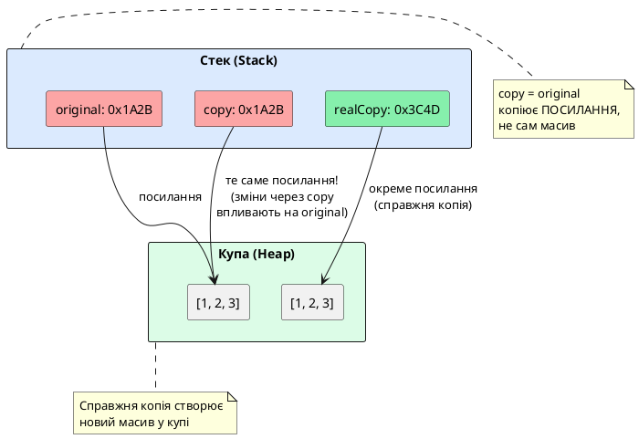

# Масиви, кортежі та об'єкти

::card-group

::card{title="🎯 Мета розділу" icon="i-lucide-target"}

- Зрозуміти, як масиви зберігаються у пам'яті та чому вони передаються за посиланням.
- Навчитися типізувати масиви, кортежі та об'єкти у TypeScript.
- Освоїти inline-синтаксис об'єктних типів без використання псевдонімів.
- Вивчити модифікатор `readonly` для захисту даних від змін.
- Опанувати індексні сигнатури для динамічних ключів.
- Усвідомити різницю між масивами та кортежами.

::

::card{title="🔑 Ключові терміни" icon="i-lucide-key"}

- **Reference Type:** тип даних, що зберігається за посиланням (масиви, об'єкти, функції).
- **Array:** впорядкована колекція елементів однакового або різних типів.
- **Tuple:** масив фіксованої довжини з типізацією кожної позиції.
- **Object Type:** структура даних з іменованими властивостями.
- **Index Signature:** синтаксис для опису об'єктів з динамічними ключами.
- **Readonly:** модифікатор, що забороняє зміну значення після ініціалізації.

::

::

---

## Масиви: впорядковані колекції даних

### Що таке масив у JavaScript

**Масив** (_array_) — це спеціальний об'єкт, що зберігає впорядковану колекцію елементів. На відміну від примітивних типів, масив є **reference type** — зберігається у купі (_heap_), а змінна містить лише посилання на нього.

```javascript
// Створення масиву
let numbers = [1, 2, 3, 4, 5];
let fruits = ["apple", "banana", "orange"];
let mixed = [42, "text", true, null];  // різні типи!

// Доступ до елементів (індексація з 0)
console.log(numbers[0]);  // 1
console.log(fruits[2]);   // "orange"

// Зміна елементів
numbers[0] = 100;
console.log(numbers);  // [100, 2, 3, 4, 5]
```

### Масиви зберігаються за посиланням

Критично важливо розуміти: коли ви присвоюєте масив іншій змінній, **копіюється посилання**, а не сам масив:

```javascript
let original = [1, 2, 3];
let copy = original;  // copy отримує ПОСИЛАННЯ на той самий масив!

copy[0] = 999;  // змінюємо через copy

console.log(original);  // [999, 2, 3] — оригінал теж змінився!
console.log(copy);      // [999, 2, 3]

console.log(original === copy);  // true (обидві змінні вказують на один масив)
```

**Як зробити справжню копію масиву:**

```javascript
let original = [1, 2, 3];

// Спосіб 1: Spread оператор (найпопулярніший)
let copy1 = [...original];

// Спосіб 2: Array.from()
let copy2 = Array.from(original);

// Спосіб 3: slice() без параметрів
let copy3 = original.slice();

// Тепер зміни не впливають на оригінал
copy1[0] = 999;
console.log(original);  // [1, 2, 3] — не змінився ✓
console.log(copy1);     // [999, 2, 3]
```

::warning
**Shallow copy vs Deep copy:** Усі три способи вище роблять **поверхневу копію** (_shallow copy_). Якщо масив містить об'єкти або вкладені масиви, копіюються лише посилання на них:

```javascript
let users = [
  { name: "Alice", age: 28 },
  { name: "Bob", age: 32 }
];

let copy = [...users];  // shallow copy

copy[0].age = 100;  // змінюємо об'єкт через копію

console.log(users[0].age);  // 100 — оригінальний об'єкт теж змінився!
```

Для глибокої копії (_deep copy_) потрібні спеціальні методи (наприклад, `structuredClone()` у сучасних браузерах або бібліотека `lodash.cloneDeep`).
::

::plant-uml{alt="Масиви у пам'яті: посилання vs копія"}



::

### Типізація масивів у TypeScript

TypeScript дозволяє вказати тип елементів масиву двома способами:

**Спосіб 1: `T[]` (рекомендований)**

```typescript
let numbers: number[] = [1, 2, 3, 4, 5];
let names: string[] = ["Alice", "Bob", "Charlie"];
let flags: boolean[] = [true, false, true];

// Вкладені масиви (двовимірні)
let matrix: number[][] = [
  [1, 2, 3],
  [4, 5, 6],
  [7, 8, 9]
];

// Масиви масивів рядків
let groups: string[][] = [
  ["Alice", "Bob"],
  ["Charlie", "Dave"]
];
```

**Спосіб 2: `Array<T>` (generic-синтаксис)**

```typescript
let numbers: Array<number> = [1, 2, 3];
let names: Array<string> = ["Alice", "Bob"];
```

Обидва способи функціонально ідентичні. `T[]` є коротшим і більш читабельним, тому використовується частіше.

**TypeScript перевіряє типи елементів:**

```typescript
let numbers: number[] = [1, 2, 3];

numbers.push(4);       // OK: число
numbers.push("five");  // Error: Argument of type 'string' is not assignable to parameter of type 'number'

numbers[0] = 100;      // OK: число
numbers[1] = true;     // Error: Type 'boolean' is not assignable to type 'number'
```

### Порожній масив та type inference

Коли ви створюєте порожній масив без анотації, TypeScript виводить тип `any[]`, що небезпечно:

```typescript
// ❌ Небезпечно: TypeScript виводить any[]
let items = [];

items.push(1);        // OK
items.push("text");   // OK
items.push(true);     // OK — масив стає [number, string, boolean]
```

**Правильно: завжди вказуйте тип для порожніх масивів:**

```typescript
// ✅ Безпечно: явна типізація
let items: number[] = [];

items.push(1);        // OK
items.push("text");   // Error: тип string не підходить
```

### Методи роботи з масивами

JavaScript надає багато методів для роботи з масивами. Деякі **змінюють** оригінальний масив (_mutating_), інші — **повертають новий** (_non-mutating_).

**Методи, що змінюють масив:**

```typescript
let numbers: number[] = [1, 2, 3];

// push: додає елемент в кінець
numbers.push(4);  // [1, 2, 3, 4]

// pop: видаляє останній елемент
let last: number | undefined = numbers.pop();  // 4, масив: [1, 2, 3]

// unshift: додає елемент на початок
numbers.unshift(0);  // [0, 1, 2, 3]

// shift: видаляє перший елемент
let first: number | undefined = numbers.shift();  // 0, масив: [1, 2, 3]

// splice: видаляє/додає елементи в середині
numbers.splice(1, 1);  // видаляє 1 елемент з індексу 1, масив: [1, 3]

// reverse: перевертає масив
numbers.reverse();  // [3, 1]

// sort: сортує масив
numbers.sort();  // [1, 3]
```

**Методи, що повертають новий масив:**

```typescript
let numbers: number[] = [1, 2, 3, 4, 5];

// map: перетворює кожен елемент
let doubled: number[] = numbers.map((n) => n * 2);  // [2, 4, 6, 8, 10]

// filter: залишає лише елементи, що пройшли умову
let evens: number[] = numbers.filter((n) => n % 2 === 0);  // [2, 4]

// slice: копіює частину масиву
let part: number[] = numbers.slice(1, 3);  // [2, 3] (індекси 1, 2)

// concat: об'єднує масиви
let more: number[] = numbers.concat([6, 7, 8]);  // [1, 2, 3, 4, 5, 6, 7, 8]

// flat: розгортає вкладені масиви
let nested: number[][] = [[1, 2], [3, 4]];
let flattened: number[] = nested.flat();  // [1, 2, 3, 4]

console.log(numbers);  // [1, 2, 3, 4, 5] — оригінал не змінився!
```

**Методи пошуку та перевірки:**

```typescript
let numbers: number[] = [1, 2, 3, 4, 5];

// includes: чи є елемент у масиві
let hasThree: boolean = numbers.includes(3);  // true

// indexOf: індекс першого входження (-1 якщо не знайдено)
let index: number = numbers.indexOf(3);  // 2

// find: повертає перший елемент, що пройшов умову
let found: number | undefined = numbers.find((n) => n > 3);  // 4

// findIndex: індекс першого елемента, що пройшов умову
let foundIndex: number = numbers.findIndex((n) => n > 3);  // 3 (індекс числа 4)

// some: чи є хоча б один елемент, що пройшов умову
let hasEven: boolean = numbers.some((n) => n % 2 === 0);  // true

// every: чи всі елементи пройшли умову
let allPositive: boolean = numbers.every((n) => n > 0);  // true
```

::tip
Методи `map`, `filter`, `reduce`, `find`, `some`, `every` не змінюють оригінальний масив, тому їх називають **pure functions** (чисті функції). Це робить код більш передбачуваним та безпечним, особливо у функціональному стилі програмування.
::

### Багатовимірні масиви

TypeScript підтримує масиви будь-якої розмірності. Найчастіше використовуються двовимірні масиви (матриці):

```typescript
// Двовимірний масив (матриця 3x3)
let matrix: number[][] = [
  [1, 2, 3],
  [4, 5, 6],
  [7, 8, 9]
];

// Доступ до елементів
console.log(matrix[0][0]);  // 1 (перший рядок, перша колонка)
console.log(matrix[1][2]);  // 6 (другий рядок, третя колонка)

// Ітерація по матриці
for (let row of matrix) {
  for (let cell of row) {
    console.log(cell);
  }
}

// Або через forEach
matrix.forEach((row, i) => {
  row.forEach((cell, j) => {
    console.log(`[${i}][${j}] = ${cell}`);
  });
});
```

**Тривимірні та багатовимірні масиви:**

```typescript
// Тривимірний масив (куб 2x2x2)
let cube: number[][][] = [
  [
    [1, 2],
    [3, 4]
  ],
  [
    [5, 6],
    [7, 8]
  ]
];

console.log(cube[0][1][0]);  // 3

// Масив з різними рівнями вкладеності
let jagged: number[][] = [
  [1, 2],
  [3, 4, 5],      // рядки можуть мати різну довжину!
  [6]
];
```

::warning
**Jagged arrays** (нерівні масиви) — це масиви, де вкладені масиви мають різну довжину. У JavaScript це цілком легально, але може призвести до помилок, якщо ви очікуєте, що всі рядки матриці мають однакову кількість колонок. TypeScript не перевіряє рівність довжини вкладених масивів статично.
::

---

## Readonly масиви: захист від змін

### Чому потрібна незмінність

У багатьох випадках ви хочете передати масив функції, але **гарантувати**, що функція не зміниь його вміст. Або створити константний масив даних, який не має змінюватися протягом виконання програми.

```typescript
const config = ["/api/v1", "/api/v2", "/health"];

// Хтось може випадково змінити масив:
config.push("/admin");  // Ой! Тепер config змінений
config[0] = "/legacy";   // Ой! Перший елемент перезаписаний
```

Хоча ми використали `const`, це захищає лише **посилання** на масив від переприсвоєння, але НЕ сам масив від змін:

```typescript
const numbers = [1, 2, 3];

numbers = [4, 5, 6];  // Error: Cannot assign to 'numbers' because it is a constant
numbers.push(4);      // OK: сам масив можна змінювати!
```

### Синтаксис readonly масивів

TypeScript надає модифікатор `readonly` для масивів:

```typescript
// Спосіб 1: readonly T[]
let numbers: readonly number[] = [1, 2, 3, 4, 5];

// Спосіб 2: ReadonlyArray<T> (generic-синтаксис)
let names: ReadonlyArray<string> = ["Alice", "Bob", "Charlie"];
```

**Що забороняє readonly:**

```typescript
let numbers: readonly number[] = [1, 2, 3];

// ❌ Заборонені всі методи, що змінюють масив:
numbers.push(4);       // Error: Property 'push' does not exist on type 'readonly number[]'
numbers.pop();         // Error
numbers.shift();       // Error
numbers.unshift(0);    // Error
numbers.splice(1, 1);  // Error
numbers.reverse();     // Error
numbers.sort();        // Error
numbers[0] = 999;      // Error: Index signature in type 'readonly number[]' only permits reading

// ✅ Дозволені методи, що НЕ змінюють масив:
let doubled = numbers.map(n => n * 2);  // OK: map повертає новий масив
let evens = numbers.filter(n => n % 2 === 0);  // OK
let sum = numbers.reduce((acc, n) => acc + n, 0);  // OK
console.log(numbers[0]);  // OK: читання дозволено
```

### Практичний приклад: захист конфігурації

```typescript
// Конфігурація API endpoints (не має змінюватися)
const API_ENDPOINTS: readonly string[] = [
  "/api/v1/users",
  "/api/v1/posts",
  "/api/v1/comments"
];

function makeRequest(endpoint: string): void {
  if (!API_ENDPOINTS.includes(endpoint)) {
    throw new Error(`Unknown endpoint: ${endpoint}`);
  }
  console.log(`Making request to ${endpoint}`);
}

// Ніхто не може випадково змінити конфігурацію:
// API_ENDPOINTS.push("/api/v1/admin");  // Error!
```

### Readonly та вкладені структури

Важливо розуміти: `readonly` робить **поверхневу** незмінність (_shallow immutability_):

```typescript
let users: readonly { name: string; age: number }[] = [
  { name: "Alice", age: 28 },
  { name: "Bob", age: 32 }
];

// ❌ Не можна додавати/видаляти елементи масиву:
// users.push({ name: "Charlie", age: 25 });  // Error

// ✅ Але можна змінювати властивості об'єктів всередині масиву!
users[0].age = 100;  // OK — об'єкт не readonly!
console.log(users[0]);  // { name: "Alice", age: 100 }
```

**Рішення: зробити об'єкти теж readonly:**

```typescript
let users: readonly (readonly { name: string; age: number })[] = [
  { name: "Alice", age: 28 },
  { name: "Bob", age: 32 }
];

// Тепер нічого не можна змінювати:
// users[0].age = 100;  // Error: Cannot assign to 'age' because it is a read-only property
```

Але це виглядає громіздко. Пізніше, коли ви вивчите `interface` та utility types, буде простіше писати складні readonly структури.

::plant-uml{alt="Різниця між const та readonly для масивів"}

```plantuml
@startuml
skinparam style plain
skinparam backgroundColor #FFFFFF

rectangle "const numbers = [1, 2, 3]" as Const #FCA5A5 {
    note bottom
    const захищає лише ПОСИЛАННЯ.
    Сам масив можна змінювати:
    numbers.push(4) ✓
    numbers[0] = 999 ✓
    numbers = [4, 5] ✗
    end note
}

rectangle "readonly numbers = [1, 2, 3]" as Readonly #86EFAC {
    note bottom
    readonly захищає ВМІСТ масиву.
    Змінювати масив не можна:
    numbers.push(4) ✗
    numbers[0] = 999 ✗
    end note
}

rectangle "const numbers: readonly number[]" as Both #BFDBFE {
    note bottom
    Комбінація const + readonly:
    - Посилання незмінне (const)
    - Вміст незмінний (readonly)
    Найбільший рівень захисту!
    end note
}

Const -down-> Both : комбінувати з
Readonly -down-> Both : комбінувати з

note right of Both
  Рекомендація:
  використовуйте обидва
  модифікатори для
  критичних даних
end note
@enduml
```

::

---

## Кортежі: масиви з фіксованою структурою

### Що таке кортеж (tuple)

**Кортеж** (_tuple_) — це масив **фіксованої довжини**, де кожна позиція має **власний тип**. На відміну від звичайного масиву (`number[]`), де всі елементи мають однаковий тип, кортеж дозволяє змішувати різні типи у чіткій послідовності.

**Приклад із реального життя:**

```typescript
// Координати на карті: [широта, довгота]
let coordinates: [number, number] = [50.4501, 30.5234];

// Користувач: [ім'я, вік, активний]
let user: [string, number, boolean] = ["Alice", 28, true];

// HTTP відповідь: [статус-код, тіло відповіді]
let response: [number, string] = [200, "OK"];
```

### Типізація кортежів

Синтаксис кортежу — квадратні дужки з типами через кому:

```typescript
// Кортеж з 2 елементів: рядок та число
let pair: [string, number] = ["age", 25];

// Кортеж з 3 елементів: число, рядок, boolean
let triple: [number, string, boolean] = [1, "hello", true];

// Кортеж з вкладеним кортежем
let nested: [string, [number, number]] = ["point", [10, 20]];
```

**TypeScript строго перевіряє типи та кількість елементів:**

```typescript
let user: [string, number] = ["Alice", 28];

user = ["Bob", 32];       // OK: типи співпадають
user = ["Charlie", 25, true];  // Error: Source has 3 element(s) but target allows only 2
user = [28, "Alice"];     // Error: порядок типів не співпадає
user = ["David"];         // Error: Source has 1 element(s) but target requires 2
```

### Доступ до елементів кортежу

Доступ до елементів кортежу виглядає так само, як до масиву, але TypeScript **знає тип** кожної позиції:

```typescript
let user: [string, number, boolean] = ["Alice", 28, true];

let name: string = user[0];    // OK: TypeScript знає, що user[0] — це string
let age: number = user[1];     // OK: TypeScript знає, що user[1] — це number
let active: boolean = user[2]; // OK: TypeScript знає, що user[2] — це boolean

// TypeScript допомагає уникнути помилок:
let wrong: number = user[0];  // Error: Type 'string' is not assignable to type 'number'
```

**Вихід за межі кортежу:**

```typescript
let pair: [string, number] = ["age", 25];

console.log(pair[0]);  // "age"
console.log(pair[1]);  // 25
console.log(pair[2]);  // undefined (виконання), але TypeScript покаже помилку!
// Error: Tuple type '[string, number]' of length '2' has no element at index '2'
```

### Деструктуризація кортежів

Кортежі ідеально підходять для деструктуризації, бо TypeScript знає типи кожної позиції:

```typescript
let user: [string, number, boolean] = ["Alice", 28, true];

// Деструктуризація з типізацією
let [name, age, active] = user;

console.log(name);    // "Alice" (тип string)
console.log(age);     // 28 (тип number)
console.log(active);  // true (тип boolean)

// TypeScript автоматично виводить типи змінних!
// name: string
// age: number
// active: boolean
```

**Практичний приклад: функція, що повертає кортеж:**

```typescript
function getUser(id: number): [string, number] {
  // У реальності тут був би запит до бази даних
  return ["Alice", 28];
}

let [userName, userAge] = getUser(1);

console.log(userName);  // "Alice" (тип string)
console.log(userAge);   // 28 (тип number)
```

### Опціональні елементи у кортежах

Ви можете позначити елементи кортежу як опціональні за допомогою `?`:

```typescript
// Третій елемент опціональний
let user: [string, number, boolean?] = ["Alice", 28];

// Обидва варіанти валідні:
let user1: [string, number, boolean?] = ["Bob", 32];
let user2: [string, number, boolean?] = ["Charlie", 25, true];

// TypeScript знає, що третій елемент може бути undefined:
let [name, age, active] = user;
console.log(active);  // undefined (тип boolean | undefined)
```

### Rest елементи у кортежах

Кортежі підтримують rest-синтаксис для змінної кількості елементів:

```typescript
// Перші два елементи фіксовані, решта — числа
let data: [string, boolean, ...number[]] = ["test", true, 1, 2, 3, 4, 5];

// Мінімум 2 елементи (string та boolean), потім будь-яка кількість чисел
let minimal: [string, boolean, ...number[]] = ["test", true];  // OK
let withNumbers: [string, boolean, ...number[]] = ["test", false, 10, 20];  // OK
```

### Readonly кортежі

Так само, як масиви, кортежі можна зробити незмінними:

```typescript
let coordinates: readonly [number, number] = [50.4501, 30.5234];

console.log(coordinates[0]);  // OK: читання дозволено

// ❌ Зміна заборонена:
// coordinates[0] = 51.0;  // Error: Cannot assign to '0' because it is a read-only property
// coordinates.push(40.0);  // Error: Property 'push' does not exist on type 'readonly [number, number]'
```

### Кортежі vs масиви: коли що використовувати

**Використовуйте кортежі, коли:**

- Кількість елементів фіксована і завжди однакова
- Кожна позиція має специфічне значення (широта/довгота, ім'я/вік)
- Ви працюєте з парами, трійками чи іншими невеликими структурами
- Функція повертає кілька значень різних типів

**Використовуйте масиви, коли:**

- Кількість елементів може змінюватися динамічно
- Всі елементи мають однаковий тип та значення
- Ви ітеруєте по колекції однотипних даних
- Розмір колекції заздалегідь невідомий

```typescript
// ✅ Кортеж: фіксована структура "RGB колір"
let color: [number, number, number] = [255, 128, 0];

// ✅ Масив: динамічна колекція оцінок студента
let grades: number[] = [85, 90, 78, 92];
grades.push(88);  // можемо додавати нові оцінки

// ✅ Кортеж: функція повертає результат та помилку
function divide(a: number, b: number): [number | null, string | null] {
  if (b === 0) {
    return [null, "Division by zero"];
  }
  return [a / b, null];
}

let [result, error] = divide(10, 2);
if (error) {
  console.error(error);
} else {
  console.log(result);
}
```

::tip
У TypeScript немає вбудованого типу для пар ключ-значення (як `Tuple` або `Pair` в інших мовах). Натомість використовуйте кортежі: `[string, number]` для пари, `[string, number, boolean]` для трійки тощо.
::

---

## Об'єкти: структури з іменованими властивостями

### Що таке об'єкт у JavaScript

**Об'єкт** (_object_) — це колекція **іменованих властивостей** (пар ключ-значення). На відміну від масивів, де доступ до елементів здійснюється через числовий індекс, у об'єктах доступ — через **ключ-рядок** або **Symbol**.

```javascript
// Створення об'єкта
let user = {
  name: "Alice",
  age: 28,
  email: "alice@example.com",
  isActive: true
};

// Доступ до властивостей
console.log(user.name);   // "Alice" (dot notation)
console.log(user["age"]); // 28 (bracket notation)

// Зміна властивостей
user.age = 29;
user["email"] = "alice.new@example.com";

// Додавання нових властивостей
user.city = "Kyiv";

console.log(user);
// {
//   name: "Alice",
//   age: 29,
//   email: "alice.new@example.com",
//   isActive: true,
//   city: "Kyiv"
// }
```

### Об'єкти зберігаються за посиланням

Так само, як масиви, об'єкти є **reference type**:

```javascript
let original = { name: "Alice", age: 28 };
let copy = original;  // копіюється ПОСИЛАННЯ

copy.age = 100;

console.log(original.age);  // 100 — оригінал теж змінився!
console.log(original === copy);  // true (обидва вказують на один об'єкт)
```

**Створення справжньої копії об'єкта:**

```javascript
let original = { name: "Alice", age: 28 };

// Спосіб 1: Spread оператор (shallow copy)
let copy1 = { ...original };

// Спосіб 2: Object.assign (shallow copy)
let copy2 = Object.assign({}, original);

copy1.age = 100;
console.log(original.age);  // 28 — не змінився ✓
```

::warning
Spread та `Object.assign` роблять **поверхневу копію** (_shallow copy_). Якщо об'єкт містить вкладені об'єкти, вони копіюються за посиланням:

```javascript
let user = {
  name: "Alice",
  address: {
    city: "Kyiv",
    country: "Ukraine"
  }
};

let copy = { ...user };

copy.address.city = "Lviv";  // змінюємо вкладений об'єкт

console.log(user.address.city);  // "Lviv" — оригінал теж змінився!
```

Для глибокої копії використовуйте `structuredClone()` або бібліотеки на кшталт `lodash.cloneDeep`.
::

### Типізація об'єктів у TypeScript: inline-синтаксис

У TypeScript ви можете типізувати об'єкт безпосередньо в анотації типу через **inline об'єктний тип**:


```typescript
// Inline об'єктний тип
let user: { name: string; age: number; email: string } = {
  name: "Alice",
  age: 28,
  email: "alice@example.com"
};

// Функція з параметром-об'єктом
function greetUser(user: { name: string; age: number }): string {
  return `Hello, ${user.name}! You are ${user.age} years old.`;
}

console.log(greetUser({ name: "Bob", age: 32 }));
// "Hello, Bob! You are 32 years old."
```

**Синтаксис inline типу:**

- Фігурні дужки `{ }`
- Імена властивостей з типами: `name: string`
- Розділювач: крапка з комою `;` або кома `,` (обидва варіанти валідні)

```typescript
// Обидва синтаксиси однакові:
let user1: { name: string; age: number } = { name: "Alice", age: 28 };
let user2: { name: string, age: number } = { name: "Bob", age: 32 };

// Рекомендується використовувати крапку з комою (;) для консистентності
```

### TypeScript перевіряє структуру об'єкта

TypeScript строго перевіряє, що об'єкт має **всі обов'язкові** властивості та **не має зайвих**:

```typescript
let user: { name: string; age: number } = {
  name: "Alice",
  age: 28
};  // OK

// ❌ Помилка: відсутня властивість age
let incomplete: { name: string; age: number } = {
  name: "Bob"
};
// Error: Property 'age' is missing in type '{ name: string; }' but required in type '{ name: string; age: number; }'

// ❌ Помилка: зайва властивість email
let extra: { name: string; age: number } = {
  name: "Charlie",
  age: 25,
  email: "charlie@example.com"
};
// Error: Object literal may only specify known properties, and 'email' does not exist in type '{ name: string; age: number; }'
```

::note
TypeScript застосовує **excess property checking** (перевірку зайвих властивостей) лише для **об'єктних літералів**, що безпосередньо присвоюються змінній або передаються у функцію. Якщо ви спочатку створюєте об'єкт, а потім передаєте його, TypeScript менш строгий:

```typescript
function greet(user: { name: string }): void {
  console.log(`Hello, ${user.name}!`);
}

// ❌ Помилка: зайва властивість
greet({ name: "Alice", age: 28 });
// Error: Object literal may only specify known properties

// ✅ OK: об'єкт створений окремо
let user = { name: "Bob", age: 32 };
greet(user);  // OK! TypeScript перевіряє лише наявність name
```

Це називається **structural typing** (структурна типізація): якщо об'єкт має всі необхідні властивості, він підходить, навіть якщо має зайві.
::

### Вкладені об'єктні типи

Об'єкти можуть містити інші об'єкти:

```typescript
let user: {
  name: string;
  age: number;
  address: {
    city: string;
    country: string;
  };
} = {
  name: "Alice",
  age: 28,
  address: {
    city: "Kyiv",
    country: "Ukraine"
  }
};

// Доступ до вкладених властивостей
console.log(user.address.city);  // "Kyiv"

// Зміна вкладених властивостей
user.address.city = "Lviv";
```

**Масиви об'єктів:**

```typescript
let users: { name: string; age: number }[] = [
  { name: "Alice", age: 28 },
  { name: "Bob", age: 32 },
  { name: "Charlie", age: 25 }
];

// Доступ до елементів
console.log(users[0].name);  // "Alice"

// Ітерація
users.forEach(user => {
  console.log(`${user.name} is ${user.age} years old`);
});

// Фільтрація
let adults = users.filter(user => user.age >= 30);
console.log(adults);  // [{ name: "Bob", age: 32 }]
```

### Опціональні властивості

Якщо властивість може бути відсутня, позначте її через `?`:

```typescript
let user: {
  name: string;
  age: number;
  email?: string;  // опціональна властивість
} = {
  name: "Alice",
  age: 28
  // email відсутній — це OK!
};

// TypeScript знає, що email може бути undefined
let email: string | undefined = user.email;

if (user.email) {
  console.log(`Email: ${user.email}`);
} else {
  console.log("Email not provided");
}
```

**Опціональна властивість vs undefined:**

```typescript
// Опціональна властивість: може бути відсутня
let user1: { name: string; email?: string } = { name: "Alice" };

// Явно undefined: властивість ОБОВ'ЯЗКОВА, але може бути undefined
let user2: { name: string; email: string | undefined } = { name: "Bob", email: undefined };

// user1 може не мати email взагалі
// user2 ПОВИНЕН мати email, навіть якщо це undefined
```

У більшості випадків `email?: string` зручніше, ніж `email: string | undefined`.

### Readonly властивості

Щоб заборонити зміну властивості після створення об'єкта, використовуйте `readonly`:

```typescript
let user: {
  readonly id: number;
  name: string;
  age: number;
} = {
  id: 1,
  name: "Alice",
  age: 28
};

// ✅ Читання дозволено
console.log(user.id);  // 1

// ✅ Зміна звичайних властивостей дозволена
user.name = "Alicia";
user.age = 29;

// ❌ Зміна readonly властивості заборонена
// user.id = 2;
// Error: Cannot assign to 'id' because it is a read-only property
```

**Використання readonly для захисту критичних даних:**

```typescript
function processUser(user: {
  readonly id: number;
  name: string;
}): void {
  // Функція не може випадково змінити ID
  // user.id = 999;  // Error!
  
  // Але може змінити name
  user.name = user.name.toUpperCase();
}
```

**Readonly та вкладені об'єкти:**

Так само, як у масивів, `readonly` працює поверхнево:

```typescript
let user: {
  readonly id: number;
  address: {
    city: string;
  };
} = {
  id: 1,
  address: { city: "Kyiv" }
};

// ❌ Не можна змінити id
// user.id = 2;  // Error

// ✅ Але можна змінити вкладений об'єкт!
user.address.city = "Lviv";  // OK
```

Щоб зробити вкладений об'єкт теж readonly, додайте модифікатор явно:

```typescript
let user: {
  readonly id: number;
  readonly address: {
    readonly city: string;
  };
} = {
  id: 1,
  address: { city: "Kyiv" }
};

// Тепер нічого не можна змінювати:
// user.address.city = "Lviv";  // Error: Cannot assign to 'city'
```

---

## Index signatures: динамічні ключі

### Проблема: невідомі ключі

Іноді структура об'єкта заздалегідь невідома — кількість та імена властивостей визначаються динамічно:

```typescript
// Словник перекладів: ключ — мова, значення — текст
let translations = {
  en: "Hello",
  uk: "Привіт",
  de: "Hallo",
  fr: "Bonjour"
};

// Як типізувати такий об'єкт, якщо ми не знаємо всі можливі мови?
```

### Синтаксис index signature

**Index signature** дозволяє описати об'єкт з невідомими ключами:

```typescript
// Будь-який ключ (string) → значення (string)
let translations: { [key: string]: string } = {
  en: "Hello",
  uk: "Привіт",
  de: "Hallo",
  fr: "Bonjour"
};

// Доступ до властивостей
console.log(translations["en"]);  // "Hello"
console.log(translations["uk"]);  // "Привіт"

// Додавання нових властивостей
translations["es"] = "Hola";
translations["it"] = "Ciao";
```

**Синтаксис:**

```typescript
{ [key: КлючТип]: ЗначенняТип }
```

- `key` — довільна назва змінної (можна назвати `k`, `prop`, `id` тощо)
- `КлючТип` — майже завжди `string` або `number`
- `ЗначенняТип` — тип значень властивостей

### Приклади index signatures

**Словник з числовими значеннями:**

```typescript
// Оцінки студентів: ім'я → оцінка
let grades: { [studentName: string]: number } = {
  Alice: 95,
  Bob: 87,
  Charlie: 92
};

grades["David"] = 88;  // OK
// grades["Eve"] = "A+";  // Error: Type 'string' is not assignable to type 'number'
```

**Конфігурація з boolean значеннями:**

```typescript
// Налаштування фіч: назва фічі → увімкнена/вимкнена
let features: { [feature: string]: boolean } = {
  darkMode: true,
  notifications: false,
  analytics: true
};

console.log(features["darkMode"]);  // true
features["betaFeatures"] = false;  // OK
```

**Числові ключі (масивоподібні об'єкти):**

```typescript
// Об'єкт з числовими індексами
let items: { [index: number]: string } = {
  0: "apple",
  1: "banana",
  2: "orange"
};

console.log(items[0]);  // "apple"
console.log(items[1]);  // "banana"

items[3] = "grape";  // OK
```

::note
Хоча TypeScript дозволяє використовувати `number` як тип ключа, у JavaScript всі ключі об'єктів насправді є рядками. Коли ви пишете `obj[0]`, JavaScript перетворює `0` на `"0"`. TypeScript знає про це і дозволяє обидва варіанти доступу.
::

### Index signature з додатковими властивостями

Ви можете комбінувати index signature з явними властивостями:

```typescript
let config: {
  appName: string;        // обов'язкова властивість
  version: string;        // обов'язкова властивість
  [key: string]: string;  // інші довільні властивості
} = {
  appName: "MyApp",
  version: "1.0.0",
  author: "Alice",
  license: "MIT"
};

console.log(config.appName);  // "MyApp"
console.log(config.author);   // "Alice"

config.theme = "dark";  // OK: додаємо нову властивість
```

**Обмеження:** Всі явні властивості мають відповідати типу значення index signature:

```typescript
// ❌ Помилка: version має тип number, але index signature вимагає string
let config: {
  appName: string;
  version: number;  // Error!
  [key: string]: string;
} = {
  appName: "MyApp",
  version: 1
};
// Error: Property 'version' of type 'number' is not assignable to 'string' index type 'string'
```

**Рішення:** Використовуйте union type для index signature:

```typescript
let config: {
  appName: string;
  version: number;
  [key: string]: string | number;  // ключі можуть бути string або number
} = {
  appName: "MyApp",
  version: 1,
  maxUsers: 100,
  author: "Alice"
};
```

### Index signature з readonly

Щоб заборонити зміну властивостей, додайте `readonly`:

```typescript
let constants: {
  readonly [key: string]: number;
} = {
  PI: 3.14159,
  E: 2.71828,
  GOLDEN_RATIO: 1.61803
};

console.log(constants.PI);  // 3.14159

// ❌ Зміна заборонена
// constants.PI = 3.14;  // Error: Index signature in type '...' only permits reading
// constants.SPEED_OF_LIGHT = 299792458;  // Error
```

### Коли використовувати index signatures

**Використовуйте index signatures, коли:**

- Ключі об'єкта невідомі заздалегідь (словники, мапи, конфігурації)
- Кількість властивостей динамічна
- Ви працюєте з даними зовнішніх джерел (JSON API, файли конфігурації)

**НЕ використовуйте index signatures, коли:**

- Структура об'єкта фіксована і відома (краще явно перелічити властивості)
- Потрібна строга типізація кожної властивості
- Ви хочете автодоповнення в IDE (index signatures не дають підказок для імен ключів)

```typescript
// ❌ Погано: index signature для фіксованої структури
let user: { [key: string]: string | number } = {
  name: "Alice",
  age: 28,
  email: "alice@example.com"
};
// Немає автодоповнення, можна додати будь-які ключі

// ✅ Добре: явна типізація
let user: { name: string; age: number; email: string } = {
  name: "Alice",
  age: 28,
  email: "alice@example.com"
};
// IDE підказує властивості, TypeScript перевіряє їх наявність
```

::plant-uml{alt="Коли використовувати різні способи типізації об'єктів"}

```plantuml
@startuml
skinparam style plain
skinparam backgroundColor #FFFFFF

card "Фіксована структура\n(знаємо всі властивості)" as Fixed #DCFCE7 {
    note bottom
    **Використовуйте явну типізацію:**
    { name: string; age: number }
    
    ✓ Автодоповнення в IDE
    ✓ Строга перевірка властивостей
    ✓ Захист від помилок
    end note
}

card "Динамічна структура\n(ключі невідомі)" as Dynamic #DBEAFE {
    note bottom
    **Використовуйте index signature:**
    { [key: string]: ValueType }
    
    ✓ Гнучкість
    ✓ Підходить для словників
    ✗ Немає автодоповнення
    end note
}

card "Комбінований підхід\n(часткова фіксованість)" as Hybrid #FEF3C7 {
    note bottom
    **Комбінуйте обидва:**
    {
      required: string;
      [key: string]: string;
    }
    
    ✓ Обов'язкові властивості
    ✓ Додаткові довільні ключі
    end note
}

Fixed -down-> Hybrid : можна комбінувати
Dynamic -down-> Hybrid : можна комбінувати
@enduml
```

::

---

## Методи об'єктів та this

### Об'єкти можуть містити функції

Функція, що є властивістю об'єкта, називається **методом**:

```typescript
let user: {
  name: string;
  age: number;
  greet: () => string;  // метод без параметрів, повертає string
} = {
  name: "Alice",
  age: 28,
  greet: () => {
    return "Hello!";
  }
};

console.log(user.greet());  // "Hello!"
```

**Метод з параметрами:**

```typescript
let calculator: {
  add: (a: number, b: number) => number;
  subtract: (a: number, b: number) => number;
} = {
  add: (a, b) => a + b,
  subtract: (a, b) => a - b
};

console.log(calculator.add(5, 3));      // 8
console.log(calculator.subtract(10, 4)); // 6
```

### Альтернативний синтаксис для методів

Замість стрілочних функцій можна використовувати **method shorthand**:

```typescript
let user: {
  name: string;
  greet(): string;  // метод через shorthand синтаксис
} = {
  name: "Alice",
  greet() {  // function shorthand
    return `Hello, I'm ${this.name}!`;
  }
};

console.log(user.greet());  // "Hello, I'm Alice!"
```

**Різниця між стрілочною функцією та method shorthand:**

- **Стрілочна функція `() =>`:** не має власного `this`, успадковує `this` з контексту
- **Method shorthand `method() {}`:** має власний `this`, що вказує на об'єкт

```typescript
let user = {
  name: "Alice",
  
  // Method shorthand: this = user
  greet1() {
    return `Hello, I'm ${this.name}!`;
  },
  
  // Arrow function: this = undefined (або window у браузері)
  greet2: () => {
    // Error: 'this' implicitly has type 'any'
    return `Hello, I'm ${this.name}!`;
  }
};

console.log(user.greet1());  // "Hello, I'm Alice!"
console.log(user.greet2());  // Error або undefined
```

::warning
У TypeScript із `strict: true` компілятор заборонить використовувати `this` у стрілочній функції без явної типізації контексту. Це захищає вас від помилок з неправильним `this`.
::

### Типізація this у методах

Для методів, що використовують `this`, TypeScript автоматично виводить тип:

```typescript
let user: {
  name: string;
  age: number;
  greet(): string;
  haveBirthday(): void;
} = {
  name: "Alice",
  age: 28,
  
  greet() {
    // TypeScript знає, що this — це об'єкт з name: string
    return `Hello, I'm ${this.name}!`;
  },
  
  haveBirthday() {
    // TypeScript знає, що this.age — це number
    this.age++;
  }
};

console.log(user.age);  // 28
user.haveBirthday();
console.log(user.age);  // 29
```

::tip
Для складних об'єктів з багатьма методами краще використовувати `interface` або `class`, які ви вивчите у наступних розділах. Inline-типізація стає незручною для великих структур.
::

---

## Практичні приклади та патерни

### Приклад 1: Валідація форми

```typescript
function validateForm(form: {
  username: string;
  email: string;
  age: number;
}): { valid: boolean; errors: string[] } {
  let errors: string[] = [];
  
  if (form.username.length < 3) {
    errors.push("Username must be at least 3 characters");
  }
  
  if (!form.email.includes("@")) {
    errors.push("Invalid email format");
  }
  
  if (form.age < 18) {
    errors.push("Must be at least 18 years old");
  }
  
  return {
    valid: errors.length === 0,
    errors: errors
  };
}

let form = {
  username: "al",
  email: "alice.example.com",
  age: 16
};

let result = validateForm(form);
console.log(result);
// {
//   valid: false,
//   errors: [
//     "Username must be at least 3 characters",
//     "Invalid email format",
//     "Must be at least 18 years old"
//   ]
// }
```

### Приклад 2: Робота зі словником

```typescript
function countWords(text: string): { [word: string]: number } {
  let counts: { [word: string]: number } = {};
  
  let words = text.toLowerCase().split(/\s+/);
  
  for (let word of words) {
    if (counts[word]) {
      counts[word]++;
    } else {
      counts[word] = 1;
    }
  }
  
  return counts;
}

let text = "hello world hello TypeScript world";
let wordCounts = countWords(text);

console.log(wordCounts);
// {
//   hello: 2,
//   world: 2,
//   typescript: 1
// }
```

### Приклад 3: Конфігурація з readonly

```typescript
function createConfig(): {
  readonly apiUrl: string;
  readonly timeout: number;
  readonly retries: number;
} {
  return {
    apiUrl: "https://api.example.com",
    timeout: 5000,
    retries: 3
  };
}

let config = createConfig();

console.log(config.apiUrl);  // "https://api.example.com"

// ❌ Не можна змінювати конфігурацію
// config.timeout = 10000;  // Error: Cannot assign to 'timeout'
```

### Приклад 4: Об'єкт з опціональними метаданими

```typescript
function fetchUser(id: number): {
  id: number;
  name: string;
  email: string;
  avatar?: string;  // опціонально
  bio?: string;     // опціонально
} {
  // Імітація запиту до API
  if (id === 1) {
    return {
      id: 1,
      name: "Alice",
      email: "alice@example.com",
      avatar: "/avatars/alice.jpg"
      // bio відсутнє
    };
  } else {
    return {
      id: 2,
      name: "Bob",
      email: "bob@example.com"
      // avatar і bio відсутні
    };
  }
}

let user1 = fetchUser(1);
let user2 = fetchUser(2);

console.log(user1.avatar);  // "/avatars/alice.jpg"
console.log(user2.avatar);  // undefined

if (user2.avatar) {
  console.log(`Avatar: ${user2.avatar}`);
} else {
  console.log("No avatar");
}
```

---

## Підсумок

У цьому розділі ви опанували складні типи даних TypeScript та їх внутрішню будову у JavaScript:

**Масиви:**

- Масиви — це reference type, що зберігаються у купі за посиланням.
- Типізація через `T[]` синтаксис (наприклад, `number[]`, `string[][]`).
- Методи масивів: mutating (`push`, `pop`, `splice`) та non-mutating (`map`, `filter`, `slice`).
- Модифікатор `readonly` захищає масив від змін.
- Поверхнева vs глибока копія через spread оператор.

**Кортежі:**

- Кортежі — масиви фіксованої довжини з типізацією кожної позиції: `[string, number]`.
- Ідеально підходять для пар, трійок та функцій з кількома поверненими значеннями.
- Підтримують опціональні елементи (`[string, number?]`) та rest-синтаксис.
- Модифікатор `readonly` робить кортеж незмінним.

**Об'єкти:**

- Об'єкти — колекції іменованих властивостей, також reference type.
- Inline-типізація: `{ name: string; age: number }`.
- Опціональні властивості через `?`: `email?: string`.
- Модифікатор `readonly` для захисту критичних властивостей.
- Index signatures для динамічних ключів: `{ [key: string]: ValueType }`.
- Методи об'єктів та різниця між arrow functions та method shorthand.

**Ключові принципи:**

- Завжди типізуйте порожні масиви явно: `let items: number[] = []`.
- Використовуйте `readonly` для захисту незмінних даних.
- Inline-типізація зручна для простих структур, але для складних об'єктів краще використовувати `interface` (ви вивчите їх пізніше).
- Структурна типізація TypeScript дозволяє об'єктам мати «зайві» властивості у деяких контекстах.

::accordion

::accordion-item{label="❓ Чому const не захищає масив від змін?" icon="i-lucide-help-circle"}

Ключове слово `const` захищає лише **посилання** на масив від переприсвоєння, але не сам масив від модифікації:

```typescript
const numbers = [1, 2, 3];

numbers = [4, 5, 6];  // Error: Cannot assign to 'numbers'
numbers.push(4);      // OK: сам масив можна змінювати
```

Щоб заборонити зміни вмісту масиву, використовуйте `readonly`:

```typescript
const numbers: readonly number[] = [1, 2, 3];

numbers.push(4);  // Error: Property 'push' does not exist
```

Найбільший захист: `const` + `readonly` = незмінне посилання + незмінний вміст.

::

::accordion-item{label="❓ Чим кортеж відрізняється від масиву?" icon="i-lucide-help-circle"}

**Масив** (`number[]`) — це колекція елементів **одного типу** з **динамічною довжиною**:

```typescript
let scores: number[] = [85, 90, 78];
scores.push(92);  // можна додавати елементи
```

**Кортеж** (`[string, number]`) — це масив **фіксованої довжини**, де кожна позиція має **свій тип**:

```typescript
let user: [string, number] = ["Alice", 28];
// user.push(true);  // Error: не можна додавати елементи
```

Використовуйте кортежі для фіксованих структур (координати, пари ключ-значення), масиви — для динамічних колекцій.

::

::accordion-item{label="❓ Що таке shallow copy і deep copy?" icon="i-lucide-help-circle"}

**Shallow copy** (поверхнева копія) — копіюються лише властивості першого рівня. Вкладені об'єкти/масиви залишаються посиланнями:

```typescript
let original = {
  name: "Alice",
  address: { city: "Kyiv" }
};

let copy = { ...original };  // shallow copy

copy.address.city = "Lviv";
console.log(original.address.city);  // "Lviv" — оригінал теж змінився!
```

**Deep copy** (глибока копія) — рекурсивно копіюються всі вкладені структури:

```typescript
let copy = structuredClone(original);  // deep copy

copy.address.city = "Lviv";
console.log(original.address.city);  // "Kyiv" — оригінал НЕ змінився ✓
```

Spread оператор `{ ...obj }` та `Object.assign()` роблять лише shallow copy.

::

::accordion-item{label="❓ Коли використовувати index signature?" icon="i-lucide-help-circle"}

Використовуйте **index signature**, коли:

- Ключі об'єкта невідомі заздалегідь (словники, конфігурації, мапи).
- Кількість властивостей динамічна.
- Ви працюєте з даними зовнішніх джерел (JSON, API).

**Приклад:**

```typescript
// Словник перекладів
let translations: { [key: string]: string } = {
  en: "Hello",
  uk: "Привіт"
};

translations["de"] = "Hallo";  // можна додавати нові ключі
```

**НЕ використовуйте** для фіксованих структур — краще явно перелічити властивості для автодоповнення в IDE.

::

::accordion-item{label="❓ Чи можна змінити readonly властивість через JavaScript?" icon="i-lucide-help-circle"}

Так, `readonly` — це **лише перевірка на рівні TypeScript**. Після компіляції у JavaScript код стає звичайним об'єктом без захисту:

```typescript
let user: { readonly id: number; name: string } = { id: 1, name: "Alice" };

// TypeScript заборонить:
// user.id = 2;  // Error

// Але у скомпільованому JS:
// user.id = 2;  // OK у JavaScript!
```

TypeScript не додає runtime-захист. Якщо потрібна справжня незмінність у runtime, використовуйте `Object.freeze()`:

```typescript
let user = Object.freeze({ id: 1, name: "Alice" });

user.id = 2;  // Помилка у strict mode JS
```

::

::accordion-item{label="❓ Чому TypeScript не виводить тип для порожнього масиву?" icon="i-lucide-help-circle"}

Коли ви пишете `let items = []`, TypeScript не має інформації про тип майбутніх елементів, тому виводить `any[]`:

```typescript
let items = [];  // тип: any[]

items.push(1);        // OK
items.push("text");   // OK — небезпечно!
```

Це вимикає перевірку типів. **Завжди типізуйте порожні масиви явно:**

```typescript
let items: number[] = [];  // тип: number[]

items.push(1);        // OK
items.push("text");   // Error: тип string не підходить
```

::

::
