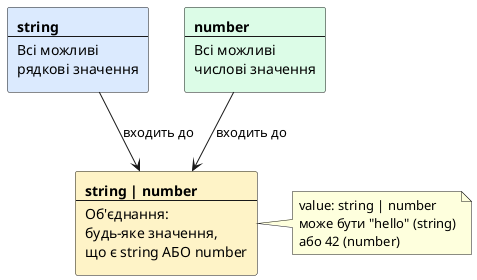
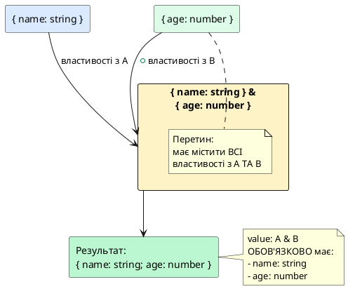
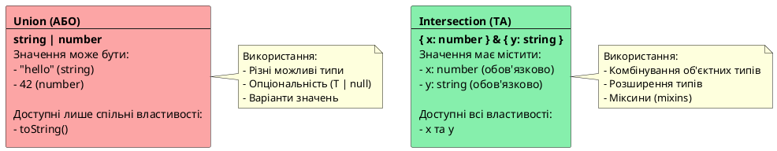

# Псевдоніми типів, Union типи, Intersection типи та літеральні типи

::card-group

::card{title="🎯 Мета розділу" icon="i-lucide-target"}

- Опанувати концепцію та синтаксис псевдонімів типів (*type aliases*) за допомогою ключового слова `type`.
- Навчитися створювати іменовані типи для примітивів, об'єктних структур, кортежів та функціональних сигнатур.
- Усвідомити принцип структурної типізації (*structural typing*) та еквівалентності типів.
- Зрозуміти концепцію union types для об'єднання типів через логічне "АБО".
- Освоїти intersection types для комбінування типів через логічне "ТА".
- Навчитися працювати з літеральними типами для точного обмеження значень.
- Опанувати практичні патерни: discriminated unions, type narrowing для unions.
- Усвідомити різницю між union та intersection на рівні теорії множин.
- Вивчити комбінування union, intersection та literal types для складних типів.

::

::card{title="🔑 Ключові терміни" icon="i-lucide-key"}

- **Type Alias (псевдонім типу):** синтаксична конструкція на базі ключового слова `type`, яка призначає ідентифікатор типу або його композиції.
- **Structural Typing (структурна типізація):** система, де сумісність типів базується на формі даних, а не на явному імені класу чи типу.
- **Union Type:** об'єднання типів — значення може бути одним з кількох типів (логічне АБО).
- **Intersection Type:** перетин типів — значення має задовольняти всі типи одночасно (логічне ТА).
- **Literal Type:** літеральний тип — тип, що представляє конкретне значення.
- **String Literal Type:** літеральний рядковий тип (наприклад, `"success"`, `"error"`).
- **Numeric Literal Type:** літеральний числовий тип (наприклад, `0`, `1`, `404`).
- **Boolean Literal Type:** літеральний булевий тип (`true` або `false`).

::

::

---

## Псевдоніми типів (Type Aliases): створення іменованих типів

### Проблема надлишковості інлайн-анотацій

У попередньому розділі ми детально познайомилися зі складними типами даних — масивами, кортежами та об'єктами — описуючи їх безпосередньо у місці оголошення змінних або параметрів функцій через так звані вбудовані (*inline*) анотації. Наприклад, щоб описати сутність облікового запису користувача, доводилося записувати всі його властивості безпосередньо в кожній функції:

```typescript
function registerUser(user: { id: string; name: string; email: string; isActive: boolean }): void {
  // реєстрація користувача в системі
}

function sendWelcomeNotification(user: { id: string; name: string; email: string; isActive: boolean }): void {
  // надсилання вітального листа
}

function persistUserToDatabase(user: { id: string; name: string; email: string; isActive: boolean }): void {
  // збереження стану в сховищі
}
```

Такий підхід є цілком прийнятним для коротких одноразових скриптів чи простих допоміжних функцій. Проте у міру зростання проєкту інлайн-анотації неминуче призводять до відчутних інженерних проблем:

1. **Грубе порушення принципу DRY (*Don't Repeat Yourself*):** одна й та сама форма даних дублюється у десятках функцій, контролерів та репозиторіїв.
2. **Зниження читабельності коду:** сигнатури функцій стають перевантаженими громіздкими описами полів, що відволікає увагу розробника від сигнатури поведінки та логіки самої функції.
3. **Критична крихкість кодової бази:** якщо модель користувача змінюється (наприклад, з'являється обов'язкове поле `createdAt: Date`), інженеру доводиться вручну знаходити та правити десятки розрізнених сигнатур у всій системі. Пропуск бодай одного файлу спричиняє помилки компіляції.

Для подолання цих обмежень мова TypeScript надає фундаментальний інструмент — **псевдоніми типів** (*type aliases*).

### Що таке псевдонім типу та ключове слово type

**Псевдонім типу** (*type alias*) — це синтаксична конструкція, яка дозволяє оголосити семантичне, повторно використовуване ім'я для будь-якого типу даних: примітиву, об'єктної структури, кортежу, об'єднання, перетину або сигнатури функції.

Оголошення псевдоніма здійснюється за допомогою ключового слова `type`:

```typescript
type User = {
  id: string;
  name: string;
  email: string;
  isActive: boolean;
};
```

Після створення псевдоніма ми замінюємо масивні повторювані інлайн-структури лаконічним і чітким ідентифікатором `User`:

```typescript
function registerUser(user: User): void {
  console.log(`Користувача ${user.name} успішно зареєстровано`);
}

function sendWelcomeNotification(user: User): void {
  console.log(`Вітальний лист надіслано на адресу ${user.email}`);
}

const newUser: User = {
  id: "usr_1024",
  name: "Олександр",
  email: "oleksandr@example.com",
  isActive: true
};

registerUser(newUser);
sendWelcomeNotification(newUser);
```

**Синтаксичні конвенції та правила:**
- Оголошення завжди має структуру: `type <Ім'яПсевдоніма> = <ОписТипу>;`.
- **Конвенція `PascalCase`:** імена типів у TypeScript завжди пишуться з великої літери в стилі `PascalCase` (`User`, `Coordinates`, `HttpRequestPayload`). Це візуально відрізняє типи від змінних та параметрів, для яких застосовується стиль `camelCase`.
- Оголошення обов'язково завершується крапкою з комою `;`.

### Повне стирання типів (Zero Runtime Overhead)

Фундаментальне правило, яке повинен чітко засвоїти кожен розробник: **псевдоніми типів існують виключно на етапі статичного аналізу та перевірки типів компілятором**.

Під час транспіляції TypeScript у JavaScript компілятор застосовує механізм **стирання типів** (*type erasure*). Це означає, що всі ключові слова `type`, імена псевдонімів та їхні описи повністю видаляються з результуючого коду. У згенерованому JavaScript файлі не з'явиться жодного однойменного об'єкта, змінної чи функції. Отже, використання `type` не створює жодних накладних витрат у середовищі виконання (*zero runtime overhead*).

::plant-uml{alt="Стирання псевдонімів типів під час компіляції"}

```plantuml
@startuml
skinparam style plain
skinparam backgroundColor #FFFFFF

package "Вихідний код TypeScript" #DBEAFE {
  class "type User = {\n  id: string;\n  name: string;\n}" as TsType #93C5FD
  class "function greet(u: User) {\n  return u.name;\n}" as TsFunc #BFDBFE
}

package "Компілятор TypeScript (tsc)" #FEF3C7 {
  component "Аналізатор типів\n(Type Checker)" as Checker #FDE68A
  component "Генератор коду\n(Emitter / Type Erasure)" as Emitter #FCD34D
}

package "Результуючий JavaScript-бандл" #DCFCE7 {
  class "function greet(u) {\n  return u.name;\n}" as JsFunc #86EFAC
  note bottom of JsFunc
    Ключове слово type та псевдонім User
    повністю зникли з фінального коду.
    Нуль накладних витрат у пам'яті.
  end note
}

TsType -down-> Checker : валідація структури
TsFunc -down-> Checker : перевірка аргументів
Checker -right-> Emitter : типи сумісні
Emitter -down-> JsFunc : генерація чистого JS
@enduml
```

::

### Категорії використання псевдонімів типів

На відміну від інтерфейсів (`interface`), які призначені виключно для опису структури об'єктів та класів, ключове слово `type` є універсальним: воно здатне створювати псевдоніми для будь-якої сутності в системі типів.

#### 1. Псевдоніми для примітивних типів (Семантична типізація)

Призначення імені базовому примітиву (`string`, `number`, `boolean`) дозволяє надати змінним виразного контексту предметної області:

```typescript
type UserId = string;
type Timestamp = number;
type Milliseconds = number;
type EmailAddress = string;

function scheduleTask(delay: Milliseconds, owner: UserId): void {
  console.log(`Завдання заплановано через ${delay} мс для користувача ${owner}`);
}
```

Хоча компілятор трактує `Milliseconds` як звичайний `number`, для інженера, який читає код або працює з підказками IDE, призначення аргументу стає очевидним без додаткових коментарів.

#### 2. Псевдоніми для складних об'єктів

Псевдоніми дозволяють зручно комбінувати обов'язкові, опціональні (`?`) та незмінні (`readonly`) поля:

```typescript
type GeoPoint = {
  readonly latitude: number;
  readonly longitude: number;
  elevation?: number; // опціональне значення висоти
};

type ServerNode = {
  hostname: string;
  ip: string;
  location: GeoPoint;
  isHealthy: boolean;
};

const primaryNode: ServerNode = {
  hostname: "core-node-01",
  ip: "10.0.0.1",
  location: {
    latitude: 50.4501,
    longitude: 30.5234
  },
  isHealthy: true
};
```

#### 3. Псевдоніми для кортежів та масивів

Типізація впорядкованих послідовностей через кортежі стає на порядок чистішою при винесенні у псевдонім:

```typescript
// Іменовані мітки всередині кортежу виступають підказками в редакторі коду
type Vector3D = [x: number, y: number, z: number];
type HttpResponseEntry = [statusCode: number, statusMessage: string];

const cameraPosition: Vector3D = [0, 15, -30];
const notFoundStatus: HttpResponseEntry = [404, "Resource Not Found"];
```

#### 4. Псевдоніми для сигнатур функцій

Псевдонім може описувати контракт виклику функції (*call signature*), використовуючи стрілочний синтаксис `(параметри) => тип_результату`:

```typescript
// Оголошення сигнатури обробника події
type EventHandler = (eventName: string, payload: unknown) => void;

// Оголошення сигнатури предикату валідації
type ValidationPredicate = (input: string) => boolean;

const logEvent: EventHandler = (event, data) => {
  console.log(`[Event: ${event}]`, data);
};

const isEmailValid: ValidationPredicate = (email) => {
  return email.includes("@") && email.includes(".");
};
```

### Принцип структурної еквівалентності (Structural Typing)

Для розробників, які прийшли зі світу мов із номінальною типізацією (*nominal typing*), таких як Java, C# чи C++, поведінка псевдонімів типів може стати несподіванкою. **Ключове слово `type` не створює новий унікальний номінальний тип**. Воно лише призначає нову назву для вже існуючого типу чи його форми.

У TypeScript діє **структурна система типів** (*structural type system*, або принцип «качиної типізації» — *duck typing*). Сумісність двох типів визначається виключно їхньою внутрішньою структурою (формою та властивостями), а не іменем, під яким вони оголошені:

```typescript
type Meters = number;
type Kilograms = number;

let distance: Meters = 1500;
let mass: Kilograms = 70;

// ⚠️ Увага: компілятор дозволяє таке присвоєння без помилок!
distance = mass;
```

::note
**Чому компілятор не повідомляє про помилку?**
У процесі аналізу компілятор розгортає псевдоніми до їхніх базових складових (*alias unfolding*). Оскільки і `Meters`, і `Kilograms` розгортаються у примітивний тип `number`, з погляду TypeScript вони є абсолютно ідентичними та взаємозамінними. Якщо архітектура вимагає суворого розділення величин однакової форми, застосовують патерн «брендованих типів» (*branded types*), який додає штучний дискримінатор.
::

Аналогічний принцип працює для об'єктних типів: якщо два незалежних псевдоніми мають ідентичний набір полів однакових типів, TypeScript вважає їх взаємозамінними:

```typescript
type Point2D = { x: number; y: number };
type CoordinatePair = { x: number; y: number };

const pt: Point2D = { x: 10, y: 20 };
const coords: CoordinatePair = pt; // Цілком валідно: структури полів однакові
```

### Параметризовані псевдоніми типів (Generic Type Aliases)

Псевдоніми типів можуть приймати параметри типу (*type arguments*), що дозволяє створювати гнучкі та універсальні структури для будь-яких типів даних:

```typescript
// Параметризований тип для обробки можливих null значень
type Nullable<T> = T | null;

let userNickname: Nullable<string> = "skywalker";
userNickname = null; // OK

// Універсальний контейнер відповіді сервера
type ApiResponsePayload<TData> = {
  success: boolean;
  data: TData;
  timestamp: number;
};

type UserProfile = {
  id: string;
  name: string;
};

const response: ApiResponsePayload<UserProfile> = {
  success: true,
  data: { id: "usr_1", name: "Марія" },
  timestamp: Date.now()
};
```

Повну потужність узагальнень (*generics*) ми дослідимо у наступних розділах, проте розуміння того, що `type` може бути параметризованим шаблоном, є важливим уже зараз.

### Незмінність оголошення type (Immutability)

На відміну від інтерфейсів (`interface`), які підтримують так зване злиття декларацій (*declaration merging*), **псевдонім типу не можна оголосити повторно з тим самим ім'ям в одній області видимості**:

```typescript
type Configuration = { host: string };

// ❌ Помилка компіляції: Duplicate identifier 'Configuration'
type Configuration = { port: number };
```

Ця характеристика робить `type` надійним та передбачуваним: одного разу оголошений псевдонім не може бути несподівано змінений чи доповнений стороннім кодом в іншій частині програми.

### Псевдоніми типів як фундамент для комбінування

Опанувавши псевдоніми типів, ми отримуємо потужний синтаксичний фундамент для дослідження наступних ключових можливостей TypeScript: **об'єднання типів** (*union types*), **перетину типів** (*intersection types*) та **літеральних типів** (*literal types*). Замість нечитабельних довгих виразів ми можемо створювати складні типи шляхом лаконічної композиції.

Перейдемо до вивчення логічного АБО в системі типів — операції `Union`.

---

## Union Types: логічне АБО для типів

### Що таке Union Type

**Union type** (_тип об'єднання_) дозволяє змінній мати **один з кількох типів**. Це логічна операція **АБО** (OR) для типів:

```typescript
// value може бути string АБО number
let value: string | number;

value = "hello";  // OK
value = 42;       // OK
value = true;     // Error: Type 'boolean' is not assignable to type 'string | number'
```

**Синтаксис:** `Type1 | Type2 | Type3`

Символ `|` (вертикальна риска) означає "або" — значення має відповідати **хоча б одному** з типів.

### Чому потрібні Union Types

У реальному коді часто трапляються ситуації, коли значення може мати різні типи:

**1. Функція приймає різні типи входу:**

```typescript
function formatValue(value: string | number): string {
  if (typeof value === "string") {
    return value.toUpperCase();
  } else {
    return value.toFixed(2);
  }
}

console.log(formatValue("hello"));  // "HELLO"
console.log(formatValue(3.14159));  // "3.14"
```

**2. Змінна може бути відсутня (`null` або `undefined`):**

```typescript
let username: string | null = getUsernameFromStorage();

if (username !== null) {
  console.log(`Welcome, ${username}!`);
} else {
  console.log("Please log in");
}
```

**3. API повертає різні типи даних:**

```typescript
function getConfig(key: string): string | number | boolean {
  // читання з конфігурації
  return config[key];
}

let timeout = getConfig("timeout");     // string | number | boolean
let isDebug = getConfig("debug");       // string | number | boolean
```

### Union Types як множини

Математично union type відповідає **об'єднанню множин**:

```typescript
// Множина A: всі string значення
// Множина B: всі number значення
// Union A | B: всі значення, що належать A АБО B

let value: string | number;
// value ∈ (A ∪ B)
```

::plant-uml{alt="Union type як об'єднання множин"}



::

### Множинні Union Types

Union може містити більше двох типів:

```typescript
// value може бути string, number, boolean або null
let value: string | number | boolean | null;

value = "hello";    // OK
value = 42;         // OK
value = true;       // OK
value = null;       // OK
value = undefined;  // Error: Type 'undefined' is not assignable
```

**Приклад: статус HTTP запиту:**

```typescript
let status: "pending" | "success" | "error" | "cancelled";

status = "pending";    // OK
status = "success";    // OK
status = "loading";    // Error: Type '"loading"' is not assignable
```

### Union Types та Type Inference

TypeScript автоматично виводить union type, коли змінна може мати різні типи:

```typescript
// TypeScript виводить: string | number
let value = Math.random() > 0.5 ? "hello" : 42;

// TypeScript виводить: string | null
let username = isLoggedIn ? "Alice" : null;

// TypeScript виводить: number[]
let numbers1 = [1, 2, 3];

// TypeScript виводить: (string | number)[]
let mixed = [1, "two", 3, "four"];
```

### Обмеження Union Types

Коли змінна має union type, ви можете використовувати лише **спільні** властивості та методи всіх типів:

```typescript
let value: string | number;

// ❌ Помилка: toUpperCase() існує лише для string
console.log(value.toUpperCase());
// Error: Property 'toUpperCase' does not exist on type 'string | number'

// ❌ Помилка: toFixed() існує лише для number
console.log(value.toFixed(2));
// Error: Property 'toFixed' does not exist on type 'string | number'

// ✅ OK: toString() існує для обох типів
console.log(value.toString());  // OK
```

Щоб використовувати специфічні методи, потрібно **звузити тип** (_type narrowing_):

```typescript
let value: string | number = getValue();

if (typeof value === "string") {
  // Тут value: string
  console.log(value.toUpperCase());  // OK
} else {
  // Тут value: number
  console.log(value.toFixed(2));     // OK
}
```

---

## Літеральні типи (Literal Types)

### Що таке Literal Type

**Літеральний тип** (_literal type_) — це тип, що представляє **конкретне значення**, а не множину значень:

```typescript
// Звичайний тип: будь-який рядок
let status1: string = "success";
status1 = "error";     // OK
status1 = "loading";   // OK
status1 = "anything";  // OK

// Літеральний тип: лише конкретний рядок "success"
let status2: "success" = "success";
status2 = "error";     // Error: Type '"error"' is not assignable to type '"success"'
```

Літеральний тип — це **найвужчий можливий тип** для значення. Він дозволяє TypeScript гарантувати, що змінна має точно певне значення.

### String Literal Types

Найчастіше використовуються **рядкові літерали**:

```typescript
let direction: "north" | "south" | "east" | "west";

direction = "north";   // OK
direction = "south";   // OK
direction = "left";    // Error: Type '"left"' is not assignable
```

**Практичний приклад: HTTP методи:**

```typescript
function makeRequest(
  url: string,
  method: "GET" | "POST" | "PUT" | "DELETE"
): void {
  console.log(`${method} ${url}`);
}

makeRequest("/api/users", "GET");     // OK
makeRequest("/api/users", "POST");    // OK
makeRequest("/api/users", "PATCH");   // Error: Argument of type '"PATCH"' is not assignable
```

**Переваги над простим `string`:**

- TypeScript перевіряє правильність значення
- IDE підказує доступні варіанти (автодоповнення)
- Захист від друкарських помилок

```typescript
// ❌ Погано: string дозволяє будь-яке значення
function setTheme(theme: string): void { }
setTheme("darrk");  // Опечатка, але TypeScript не помітить!

// ✅ Добре: літеральні типи обмежують значення
function setTheme(theme: "light" | "dark"): void { }
setTheme("darrk");  // Error: Argument of type '"darrk"' is not assignable
```

### Numeric Literal Types

Літеральні типи працюють і для чисел:

```typescript
let httpStatus: 200 | 404 | 500;

httpStatus = 200;   // OK
httpStatus = 404;   // OK
httpStatus = 201;   // Error: Type '201' is not assignable
```

**Практичний приклад: конфігурація порту:**

```typescript
function startServer(port: 3000 | 8080 | 8888): void {
  console.log(`Server listening on port ${port}`);
}

startServer(3000);  // OK
startServer(8080);  // OK
startServer(5000);  // Error: Argument of type '5000' is not assignable
```

### Boolean Literal Types

Булеві літерали рідко використовуються окремо, бо є лише два значення:

```typescript
let isTrue: true = true;
isTrue = false;  // Error: Type 'false' is not assignable to type 'true'

let isFalse: false = false;
isFalse = true;  // Error: Type 'true' is not assignable to type 'false'
```

Але вони корисні у union types:

```typescript
// Значення може бути true або "auto"
let autoplay: true | "auto" = "auto";
autoplay = true;    // OK
autoplay = false;   // Error: Type 'false' is not assignable
```

### Const Assertions для літеральних типів

Коли ви оголошуєте змінну через `const`, TypeScript автоматично виводить літеральний тип:

```typescript
// TypeScript виводить: "success" (літеральний тип)
const status = "success";

// TypeScript виводить: string (ширший тип)
let status2 = "success";
```

Для `let` ви можете **явно вказати літеральний тип**:

```typescript
let status: "success" = "success";
status = "error";  // Error: Type '"error"' is not assignable to type '"success"'
```

Або використовувати **const assertion** (`as const`):

```typescript
// TypeScript виводить: "success" (літеральний тип)
let status = "success" as const;
status = "error";  // Error
```

**Const assertion для об'єктів:**

```typescript
// Без as const: { name: string; age: number }
let user1 = { name: "Alice", age: 28 };

// З as const: { readonly name: "Alice"; readonly age: 28 }
let user2 = { name: "Alice", age: 28 } as const;

user1.name = "Bob";  // OK
user2.name = "Bob";  // Error: Cannot assign to 'name' because it is a read-only property
```

::tip
**Коли використовувати `as const`:**

- Для конфігураційних об'єктів, що не мають змінюватися
- Для enum-подібних структур без використання `enum`
- Для отримання найточніших можливих типів

```typescript
const COLORS = {
  PRIMARY: "#007bff",
  SECONDARY: "#6c757d",
  SUCCESS: "#28a745"
} as const;

// Тип: "#007bff" (літеральний), а не string
let primary = COLORS.PRIMARY;
```
::

---

## Комбінування Union та Literal Types

### Union літеральних типів

Найпотужніший патерн — комбінування union з літеральними типами:

```typescript
// Обмежена множина допустимих значень
let status: "pending" | "success" | "error";

status = "pending";   // OK
status = "success";   // OK
status = "error";     // OK
status = "loading";   // Error
```

Це створює **enum-подібну** поведінку без використання `enum`:

```typescript
// Замість enum
enum Status {
  Pending = "pending",
  Success = "success",
  Error = "error"
}

// Можна використовувати union літералів
type Status = "pending" | "success" | "error";

function handleStatus(status: Status): void {
  if (status === "success") {
    console.log("✓ Success");
  } else if (status === "error") {
    console.log("✗ Error");
  } else {
    console.log("⏳ Pending");
  }
}
```

### Практичний приклад: фінітні автомати

Union літеральних типів ідеально підходять для моделювання **станів** (_state machines_):

```typescript
let trafficLight: "red" | "yellow" | "green";

function changeLight(current: "red" | "yellow" | "green"): "red" | "yellow" | "green" {
  if (current === "red") {
    return "green";
  } else if (current === "green") {
    return "yellow";
  } else {
    return "red";
  }
}

trafficLight = "red";
trafficLight = changeLight(trafficLight);  // "green"
trafficLight = changeLight(trafficLight);  // "yellow"
trafficLight = changeLight(trafficLight);  // "red"
```

### Масиви union літералів

```typescript
// Масив може містити лише ці три значення
let statuses: ("pending" | "success" | "error")[] = [
  "pending",
  "success",
  "error"
];

statuses.push("loading");  // Error: Argument of type '"loading"' is not assignable
```

### Функції з union літералів у поверненні

```typescript
function getStatus(isSuccess: boolean): "success" | "error" {
  return isSuccess ? "success" : "error";
}

let result = getStatus(true);  // тип: "success" | "error"

if (result === "success") {
  console.log("Operation succeeded");
}
```

---

## Intersection Types: логічне ТА для типів

### Що таке Intersection Type

**Intersection type** (_тип перетину_) об'єднує **кілька типів в один**, що має **всі властивості** з усіх типів. Це логічна операція **ТА** (AND) для типів:

```typescript
// User має ВСІ властивості з Person ТА Contactable
type Person = {
  name: string;
  age: number;
};

type Contactable = {
  email: string;
  phone: string;
};

type User = Person & Contactable;

let user: User = {
  name: "Alice",      // з Person
  age: 28,            // з Person
  email: "alice@example.com",  // з Contactable
  phone: "+380991234567"       // з Contactable
};
```

**Синтаксис:** `Type1 & Type2 & Type3`

Символ `&` (амперсанд) означає "та" — значення має відповідати **всім** типам одночасно.

::tip
Зверніть увагу, як псевдоніми типів (`type`), які ми детально опанували на початку цього розділу, роблять композицію перетинів наочною та масштабованою: замість запису громіздкої інлайн-структури `{ name: string; age: number } & { email: string; phone: string }` у кожній функції чи змінній, ми оперуємо виразними та семантичними будівельними блоками `Person & Contactable`.
::

### Intersection Types як множини

Математично intersection type відповідає **перетину множин**:

```typescript
type A = { x: number };
type B = { y: string };
type C = A & B;  // C ∩ (A ∩ B)

let value: C = { x: 42, y: "hello" };
// value має задовольняти ОБИДВА типи
```

::plant-uml{alt="Intersection type як перетин множин"}



::

### Комбінування об'єктних типів

Intersection types найчастіше використовують для **розширення** об'єктних типів:

```typescript
type Timestamped = {
  createdAt: Date;
  updatedAt: Date;
};

type WithId = {
  id: string;
};

type User = {
  name: string;
  email: string;
};

// Комбінуємо всі три типи
type UserEntity = User & Timestamped & WithId;

let user: UserEntity = {
  id: "user_123",
  name: "Alice",
  email: "alice@example.com",
  createdAt: new Date(),
  updatedAt: new Date()
};
```

**Практична користь:** DRY (Don't Repeat Yourself) — уникайте дублювання властивостей.

### Intersection примітивних типів

Intersection примітивних типів **майже завжди** дає `never`:

```typescript
// string & number — неможливий тип
type Impossible = string & number;  // never

let value: Impossible;
// Немає значення, що одночасно є string ТА number!
```

**Чому `never`?** Немає жодного значення, що належить ОБОМ множинам одночасно:

```typescript
type A = string;    // множина всіх рядків
type B = number;    // множина всіх чисел
type C = A & B;     // порожня множина (перетин рядків та чисел порожній)
```

::warning
**Пастка:** Не плутайте union (`|`) та intersection (`&`):

```typescript
// Union: значення може бути string АБО number
let value1: string | number = "hello";  // OK
value1 = 42;                            // OK

// Intersection: значення має бути string ТА number одночасно
let value2: string & number;            // never (неможливо!)
```

Для примітивних типів використовуйте **union**, для об'єктних — **intersection**.
::

---

## Union vs Intersection: різниця та застосування

### Концептуальна різниця

**Union (`|`)** — "АБО":

- Значення може бути **одним з** типів
- **Розширює** множину допустимих значень
- Можна використовувати лише **спільні** властивості

**Intersection (`&`)** — "ТА":

- Значення має задовольняти **всі** типи
- **Звужує** множину (для об'єктів додає властивості)
- Можна використовувати **всі** властивості з усіх типів

::plant-uml{alt="Порівняння Union та Intersection"}



::

### Таблиця порівняння

| Аспект | Union (`A \| B`) | Intersection (`A & B`) |
|--------|------------------|------------------------|
| **Логіка** | АБО (OR) | ТА (AND) |
| **Значення** | Одне з A або B | Має задовольняти A і B |
| **Множини** | Об'єднання (A ∪ B) | Перетин (A ∩ B) |
| **Доступні властивості** | Лише спільні | Всі з A та B |
| **Примітивні типи** | Розширює (`string \| number`) | Дає `never` |
| **Об'єктні типи** | Варіанти структур | Комбінування властивостей |
| **Type narrowing** | Потрібен (через type guards) | Не потрібен (всі властивості доступні) |

### Коли використовувати Union

**Використовуйте Union, коли:**

1. Значення може мати **різні типи**:

```typescript
function format(value: string | number): string {
  return String(value);
}
```

2. Значення може бути **відсутнє**:

```typescript
let username: string | null;
let age: number | undefined;
```

3. Моделюєте **варіанти** або **стани**:

```typescript
type Status = "idle" | "loading" | "success" | "error";
```

4. Discriminated unions для складних варіантів:

```typescript
type Shape =
  | { kind: "circle"; radius: number }
  | { kind: "square"; side: number };
```

### Коли використовувати Intersection

**Використовуйте Intersection, коли:**

1. **Комбінуєте кілька об'єктних типів**:

```typescript
type Person = { name: string; age: number };
type Employee = { id: string; salary: number };
type EmployeePerson = Person & Employee;
```

2. **Розширюєте існуючий тип**:

```typescript
type Timestamped = { createdAt: Date };
type User = { name: string } & Timestamped;
```

3. **Міксини** (_mixins_):

```typescript
type Serializable = { toJSON: () => string };
type Comparable = { compareTo: (other: unknown) => number };
type Entity = Serializable & Comparable & { id: string };
```

---

## Комбінування Union, Intersection та Literals

### Складні комбінації типів

Ви можете комбінувати всі три концепції для створення точних типів:

```typescript
// Літерали + Union
type HttpMethod = "GET" | "POST" | "PUT" | "DELETE";

// Об'єктні типи + Intersection
type WithId = { id: string };
type WithTimestamp = { timestamp: Date };
type Entity = WithId & WithTimestamp;

// Union об'єктних типів з Intersection
type ApiResponse<T> =
  | ({ status: "success" } & { data: T })
  | ({ status: "error" } & { error: string });
```

### Приклад: система подій

```typescript
// Базовий тип події
type BaseEvent = {
  timestamp: Date;
  userId: string;
};

// Конкретні типи подій
type ClickEvent = BaseEvent & {
  type: "click";
  x: number;
  y: number;
  element: string;
};

type InputEvent = BaseEvent & {
  type: "input";
  value: string;
  field: string;
};

type SubmitEvent = BaseEvent & {
  type: "submit";
  formData: { [key: string]: unknown };
};

// Union всіх подій
type AppEvent = ClickEvent | InputEvent | SubmitEvent;

// Обробник подій
function handleEvent(event: AppEvent): void {
  switch (event.type) {
    case "click":
      // TypeScript знає: event — це ClickEvent
      console.log(`Click at (${event.x}, ${event.y}) on ${event.element}`);
      break;
    
    case "input":
      // TypeScript знає: event — це InputEvent
      console.log(`Input in ${event.field}: ${event.value}`);
      break;
    
    case "submit":
      // TypeScript знає: event — це SubmitEvent
      console.log("Form submitted:", event.formData);
      break;
  }
}
```

### Приклад: результат API

```typescript
// Базові метадані
type ApiMeta = {
  requestId: string;
  timestamp: Date;
};

// Успішна відповідь
type SuccessResponse<T> = ApiMeta & {
  status: "success";
  data: T;
};

// Помилка
type ErrorResponse = ApiMeta & {
  status: "error";
  code: 400 | 404 | 500;
  message: string;
};

// Об'єднання варіантів
type ApiResult<T> = SuccessResponse<T> | ErrorResponse;

// Використання
function processResponse(response: ApiResult<{ name: string }>): void {
  console.log(`Request ID: ${response.requestId}`);
  
  if (response.status === "success") {
    // TypeScript знає: response — це SuccessResponse
    console.log(`Name: ${response.data.name}`);
  } else {
    // TypeScript знає: response — це ErrorResponse
    console.error(`Error ${response.code}: ${response.message}`);
  }
}
```

---

## Type Guards для Union Types

### Повторення: чому потрібні type guards

Коли змінна має union type, TypeScript дозволяє використовувати лише **спільні** властивості:

```typescript
function process(value: string | number): void {
  // ❌ Помилка: toUpperCase() існує лише для string
  console.log(value.toUpperCase());
  
  // ✅ OK: toString() існує для обох типів
  console.log(value.toString());
}
```

Щоб отримати доступ до специфічних властивостей, використовуйте **type guards**.

### typeof для примітивних типів

```typescript
function format(value: string | number | boolean): string {
  if (typeof value === "string") {
    return value.toUpperCase();
  } else if (typeof value === "number") {
    return value.toFixed(2);
  } else {
    return value ? "Yes" : "No";
  }
}
```

### in оператор для об'єктних типів

```typescript
type Circle = { kind: "circle"; radius: number };
type Square = { kind: "square"; side: number };
type Shape = Circle | Square;

function getArea(shape: Shape): number {
  if ("radius" in shape) {
    // TypeScript знає: shape — це Circle
    return Math.PI * shape.radius ** 2;
  } else {
    // TypeScript знає: shape — це Square
    return shape.side ** 2;
  }
}
```

### Discriminated unions (рекомендований патерн)

Найкращий підхід — використовувати **спільну властивість-дискримінатор**:

```typescript
type Circle = { kind: "circle"; radius: number };
type Square = { kind: "square"; side: number };
type Rectangle = { kind: "rectangle"; width: number; height: number };
type Shape = Circle | Square | Rectangle;

function getArea(shape: Shape): number {
  switch (shape.kind) {
    case "circle":
      return Math.PI * shape.radius ** 2;
    case "square":
      return shape.side ** 2;
    case "rectangle":
      return shape.width * shape.height;
  }
}
```

Детальніше про type narrowing ви вивчали у попередньому розділі.

---

## Практичні патерни та приклади

### Патерн 1: Опціональність через union

```typescript
// Замість двох окремих типів
type User = {
  name: string;
  email: string;
  avatar: string | null;  // може бути відсутнім
  bio: string | undefined; // може бути не визначеним
};

let user: User = {
  name: "Alice",
  email: "alice@example.com",
  avatar: null,     // немає аватара
  bio: undefined    // біографія не вказана
};
```

### Патерн 2: Розширення конфігурацій

```typescript
// Базова конфігурація
type BaseConfig = {
  appName: string;
  version: string;
};

// Конфігурація для різних середовищ
type DevConfig = BaseConfig & {
  debug: true;
  logLevel: "verbose";
};

type ProdConfig = BaseConfig & {
  debug: false;
  logLevel: "error";
};

type Config = DevConfig | ProdConfig;

function initApp(config: Config): void {
  console.log(`Starting ${config.appName} v${config.version}`);
  
  if (config.debug) {
    console.log("Debug mode enabled");
  }
}
```

### Патерн 3: Tagged unions для стану

```typescript
type IdleState = {
  status: "idle";
};

type LoadingState = {
  status: "loading";
  progress: number;
};

type SuccessState<T> = {
  status: "success";
  data: T;
};

type ErrorState = {
  status: "error";
  error: Error;
};

type AsyncState<T> = IdleState | LoadingState | SuccessState<T> | ErrorState;

// Використання
function renderUI(state: AsyncState<{ name: string }[]>): void {
  switch (state.status) {
    case "idle":
      console.log("Ready to load");
      break;
    
    case "loading":
      console.log(`Loading... ${state.progress}%`);
      break;
    
    case "success":
      console.log("Users:", state.data.map(u => u.name).join(", "));
      break;
    
    case "error":
      console.error("Error:", state.error.message);
      break;
  }
}
```

### Патерн 4: Міксини через intersection

```typescript
// Компонуємо функціональність через міксини
type Identifiable = {
  id: string;
};

type Timestamped = {
  createdAt: Date;
  updatedAt: Date;
};

type SoftDeletable = {
  deletedAt: Date | null;
};

// Повна сутність бази даних
type DatabaseEntity = Identifiable & Timestamped & SoftDeletable;

type User = DatabaseEntity & {
  name: string;
  email: string;
};

type Post = DatabaseEntity & {
  title: string;
  content: string;
  authorId: string;
};
```

---

## Підсумок

У цьому розділі ви опанували фундаментальні інструменти типізації та комбінування типів у TypeScript:

**Псевдоніми типів (Type Aliases):**

- Синтаксична конструкція з ключовим словом `type` для створення читабельних та семантичних імен будь-яких типів.
- Опис різноманітних структур: примітивів, об'єктів, кортежів, функцій, параметризованих типів, об'єднань та перетинів.
- Структурна еквівалентність (*structural typing*): псевдонім не створює нового номінального типу в пам'яті, а посилається на форму даних.
- Нульові витрати у середовищі виконання (*zero runtime overhead*): повне стирання компілятором під час транспіляції в JavaScript.
- Незмінність оголошення в межах однієї області видимості.

**Union Types (`|`):**

- Логічне АБО — значення може бути **одним з** типів
- Синтаксис: `Type1 | Type2`
- Об'єднання множин: `A ∪ B`
- Можна використовувати лише спільні властивості без type narrowing
- Використовується для варіантів, опціональності, різних типів входу

**Literal Types:**

- Конкретні значення як типи: `"success"`, `42`, `true`
- String, numeric та boolean літерали
- Найточніші можливі типи
- Const assertion (`as const`) для отримання літеральних типів
- Ідеальні для обмеження допустимих значень (enum-подібна поведінка)

**Intersection Types (`&`):**

- Логічне ТА — значення має задовольняти **всі** типи
- Синтаксис: `Type1 & Type2`
- Перетин множин: `A ∩ B`
- Доступні всі властивості з усіх типів
- Для примітивних типів дає `never`
- Використовується для комбінування об'єктних типів, розширення, міксинів

**Ключові відмінності:**

- Union **розширює** допустимі значення (більше варіантів)
- Intersection **звужує** (більше вимог, але для об'єктів додає властивості)
- Union потребує type narrowing для доступу до специфічних властивостей
- Intersection надає доступ до всіх властивостей одразу

**Практичні патерни:**

- Union літералів для enum-подібних значень
- Discriminated unions для варіантів з дискримінатором
- Intersection для DRY та композиції об'єктних типів
- Комбінування всіх трьох концепцій для складних типів

::accordion

::accordion-item{label="❓ Що таке Type Alias і чи створює він новий тип даних у системі?" icon="i-lucide-help-circle"}

**Псевдонім типу (*type alias*)** — це виключно іменоване посилання на існуючий або складений тип даних:

```typescript
type Username = string;
```

Він **не створює** нового номінального типу даних і не породжує жодних об'єктів під час виконання програми (*runtime*). У системі типів TypeScript псевдонім `Username` є повністю еквівалентним та взаємозамінним із базовим типом `string`. Після компіляції всі оголошення `type` видаляються з коду (*type erasure*), забезпечуючи нульовий вплив на продуктивність та розмір фінального JavaScript-бандлу.

::

::accordion-item{label="❓ Чому TypeScript дозволяє присвоїти значення типу Meters змінній типу Kilograms, якщо обидва оголошені як number?" icon="i-lucide-help-circle"}

TypeScript використовує **структурну систему типізації** (*structural typing / duck typing*), а не номінальну (*nominal typing*):

```typescript
type Meters = number;
type Kilograms = number;

let distance: Meters = 1500;
let weight: Kilograms = 75;

distance = weight; // Компілятор дозволяє це без помилок
```

Для компілятора TypeScript значення має внутрішня структура даних (форма), а не надане псевдоніму ім'я. Оскільки обидва псевдоніми `Meters` та `Kilograms` розгортаються в один і той самий примітивний тип `number`, їхні типи є на 100% сумісними.

Якщо бізнес-логіка вимагає суворої заборони змішування величин однакової структури, у TypeScript використовують спеціальний патерн «брендованих типів» (*branded types*), додаючи унікальний прихований тип-дискримінатор.

::

::accordion-item{label="❓ Чим Union відрізняється від Intersection?" icon="i-lucide-help-circle"}

**Union (`|`)** — логічне **АБО**:

```typescript
let value: string | number;
value = "hello";  // OK: може бути string
value = 42;       // OK: може бути number
```

- Значення належить **одному з** типів
- Можна використовувати лише **спільні** властивості
- **Розширює** множину допустимих значень

**Intersection (`&`)** — логічне **ТА**:

```typescript
type Person = { name: string };
type Contact = { email: string };
type User = Person & Contact;

let user: User = {
  name: "Alice",   // обов'язково (з Person)
  email: "a@ex.com" // обов'язково (з Contact)
};
```

- Значення задовольняє **всі** типи одночасно
- Можна використовувати **всі** властивості
- **Звужує** (додає вимоги)

**Правило:** Для примітивів використовуйте union, для об'єктів — intersection.

::

::accordion-item{label="❓ Чому string & number дає never?" icon="i-lucide-help-circle"}

Intersection вимагає, щоб значення задовольняло **обидва** типи одночасно:

```typescript
type Impossible = string & number;  // never
```

Немає жодного значення, що є **одночасно** рядком **та** числом:

- `"hello"` — це string, але не number ✗
- `42` — це number, але не string ✗
- Жодне значення не підходить!

Результат: **порожня множина** = `never` (неможливий тип).

**Для примітивів використовуйте union:**

```typescript
type Possible = string | number;  // OK: може бути string АБО number
let value: Possible = "hello";    // OK
value = 42;                        // OK
```

::

::accordion-item{label="❓ Що таке літеральний тип і навіщо він потрібен?" icon="i-lucide-help-circle"}

**Літеральний тип** — це тип, що представляє **конкретне значення**:

```typescript
// Звичайний тип: будь-який рядок
let status1: string = "success";
status1 = "anything";  // OK

// Літеральний тип: лише "success"
let status2: "success" = "success";
status2 = "error";  // Error: Type '"error"' is not assignable
```

**Навіщо потрібні:**

1. **Обмеження допустимих значень:**

```typescript
function setTheme(theme: "light" | "dark"): void { }
setTheme("blue");  // Error: захист від помилок
```

2. **Автодоповнення в IDE** — підказує можливі варіанти

3. **Type narrowing** — TypeScript точно знає значення:

```typescript
if (status === "success") {
  // status тут має літеральний тип "success"
}
```

::

::accordion-item{label="❓ Коли використовувати union літералів замість enum?" icon="i-lucide-help-circle"}

Union літералів — це **сучасніша альтернатива** enum:

**Union літералів:**

```typescript
type Status = "pending" | "success" | "error";

let status: Status = "pending";
```

**Переваги:**

- ✅ Простіший синтаксис
- ✅ Не компілюється у JavaScript код (zero runtime overhead)
- ✅ Краща інтеграція з типовою системою TypeScript
- ✅ Можна використовувати з `const` об'єктами

**Enum:**

```typescript
enum Status {
  Pending = "pending",
  Success = "success",
  Error = "error"
}

let status: Status = Status.Pending;
```

**Недоліки:**

- ✗ Генерує JavaScript код
- ✗ Складніша поведінка (зворотне відображення для numeric enums)
- ✗ Менш гнучкий

**Рекомендація:** Використовуйте union літералів для нових проєктів. Enum залишається корисним для backward compatibility.

::

::accordion-item{label="❓ Що робить as const?" icon="i-lucide-help-circle"}

**`as const`** (_const assertion_) вказує TypeScript створити **найточніші можливі типи**:

**Без `as const`:**

```typescript
let config = {
  url: "https://api.example.com",
  timeout: 5000
};
// Тип: { url: string; timeout: number }

config.url = "https://other.com";  // OK: можна змінювати
```

**З `as const`:**

```typescript
let config = {
  url: "https://api.example.com",
  timeout: 5000
} as const;
// Тип: {
//   readonly url: "https://api.example.com";  // літеральний тип
//   readonly timeout: 5000                     // літеральний тип
// }

config.url = "https://other.com";  // Error: readonly
```

**Що робить `as const`:**

1. Перетворює типи на **літеральні** (`string` → `"hello"`)
2. Робить всі властивості **readonly**
3. Робить масиви **readonly tuple**

**Використання:** Константні конфігурації, enum-подібні об'єкти.

::

::accordion-item{label="❓ Як працює type narrowing для union types?" icon="i-lucide-help-circle"}

**Type narrowing** — це процес, коли TypeScript **звужує** тип з union до конкретного варіанту:

```typescript
function format(value: string | number): string {
  // Тут value: string | number
  
  if (typeof value === "string") {
    // TypeScript ЗВУЗИВ тип до string
    return value.toUpperCase();  // OK: метод string
  } else {
    // TypeScript ЗВУЗИВ тип до number
    return value.toFixed(2);     // OK: метод number
  }
}
```

**Техніки звуження:**

1. **typeof** для примітивів:

```typescript
if (typeof value === "string") { }
```

2. **in** для об'єктів:

```typescript
if ("radius" in shape) { }
```

3. **Discriminated unions:**

```typescript
if (shape.kind === "circle") { }
```

Після перевірки TypeScript **гарантує** тип у відповідній гілці коду.

::

::
