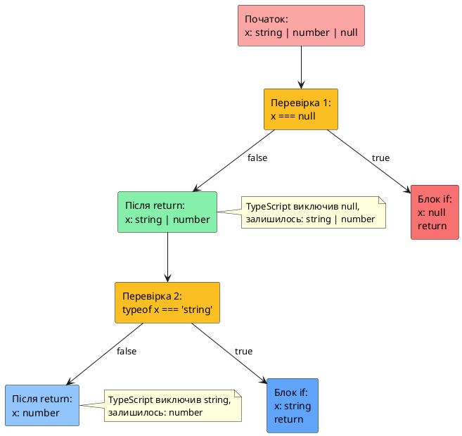

# Type Narrowing (звуження типів)

::card-group

::card{title="🎯 Мета розділу" icon="i-lucide-target"}

- Зрозуміти концепцію звуження типів (_type narrowing_) та її важливість.
- Освоїти різні техніки type guards: `typeof`, `instanceof`, `in`, equality checks.
- Навчитися використовувати truthiness та discriminated unions для безпечної роботи з типами.
- Опанувати control flow analysis TypeScript для автоматичного виведення типів.
- Усвідомити, як TypeScript відстежує потік виконання коду та звужує типи в різних гілках.
- Навчитися писати власні type guard функції для складних перевірок.

::

::card{title="🔑 Ключові терміни" icon="i-lucide-key"}

- **Type Narrowing:** процес уточнення типу з ширшого до вужчого всередині певного контексту.
- **Type Guard:** вираз або функція, що дозволяє TypeScript звузити тип у певній гілці коду.
- **Control Flow Analysis:** аналіз потоку виконання коду для автоматичного виведення типів.
- **Discriminated Union:** union type з спільною властивістю-дискримінатором для розрізнення варіантів.
- **Truthiness:** концепція JavaScript, де значення приводяться до `true` або `false` у логічному контексті.

::

::

---

## Що таке Type Narrowing

### Проблема широких типів

У попередніх розділах ви вивчили union types, які дозволяють змінній мати один з кількох типів:

```typescript
function processValue(value: string | number): void {
  // Тут TypeScript знає лише, що value — це string АБО number
  // Але не знає, який саме тип у конкретному виклику
  
  console.log(value.toUpperCase());  // Error!
  // Property 'toUpperCase' does not exist on type 'string | number'.
  // Property 'toUpperCase' does not exist on type 'number'.
}
```

Проблема: метод `toUpperCase()` існує лише для `string`, але TypeScript не може його викликати, бо `value` може бути `number`. Нам потрібен спосіб **звузити тип** (_narrow the type_) — переконати TypeScript, що в певній частині коду `value` точно є `string`.

### Концепція Type Narrowing

**Type Narrowing** (_звуження типів_) — це процес, коли TypeScript **уточнює тип** змінної з більш загального (wide type) до більш специфічного (narrow type) на основі перевірок у коді. Після звуження TypeScript дозволяє використовувати властивості та методи, специфічні для звуженого типу.

```typescript
function processValue(value: string | number): void {
  // Перевірка типу через typeof
  if (typeof value === "string") {
    // У цій гілці TypeScript ЗНАЄ, що value — це string
    console.log(value.toUpperCase());  // OK! TypeScript звузив тип до string
  } else {
    // У цій гілці TypeScript ЗНАЄ, що value — це number
    console.log(value.toFixed(2));     // OK! TypeScript звузив тип до number
  }
}

processValue("hello");  // виведе "HELLO"
processValue(42);       // виведе "42.00"
```

Після перевірки `typeof value === "string"` TypeScript **гарантує**, що всередині блоку `if` змінна `value` має тип `string`, а в блоці `else` — тип `number`.

::plant-uml{alt="Концепція звуження типу від широкого до вузького"}

```plantuml
@startuml
skinparam style plain
skinparam backgroundColor #FFFFFF

rectangle "Початковий тип:\nstring | number" as Wide #FCA5A5 {
    note bottom
    TypeScript знає лише,
    що value може бути
    string або number
    end note
}

rectangle "Перевірка:\ntypeof value === 'string'" as Check #FBBF24

rectangle "Звужений тип у блоці if:\nstring" as NarrowString #86EFAC {
    note bottom
    TypeScript тепер знає,
    що value точно string.
    Доступні методи: toUpperCase(),
    slice(), charAt() тощо
    end note
}

rectangle "Звужений тип у блоці else:\nnumber" as NarrowNumber #93C5FD {
    note bottom
    TypeScript знає,
    що value точно number.
    Доступні методи: toFixed(),
    toPrecision() тощо
    end note
}

Wide -down-> Check
Check -down-> NarrowString : if (true)
Check -down-> NarrowNumber : else (false)

note right of Check
  Type guard відділяє
  один тип від іншого
end note
@enduml
```

::

### Чому Type Narrowing критично важливий

Type narrowing — це не просто синтаксична особливість TypeScript. Це **фундаментальний механізм**, що дозволяє:

1. **Безпечно працювати з union types:** без звуження union types майже марні — ви не можете викликати жодних специфічних методів.

2. **Уникати runtime помилок:** перевірки типів змушують вас обробляти всі можливі варіанти, а TypeScript гарантує, що ви нічого не пропустили.

3. **Писати виразний код:** перевірки типів документують ваші наміри та роблять код більш читабельним.

4. **Отримувати автодоповнення в IDE:** після звуження типу IDE показує лише релевантні властивості та методи.

::note
У JavaScript ви теж пишете перевірки типів (наприклад, `if (typeof x === "string")`), але JavaScript не дає жодних гарантій щодо коректності вашого коду. TypeScript **відстежує** ці перевірки та **гарантує** типобезпеку на етапі компіляції.
::

---

## Typeof Type Guards

### Оператор typeof у JavaScript

У JavaScript оператор `typeof` повертає рядок, що описує тип значення:

```javascript
console.log(typeof "hello");       // "string"
console.log(typeof 42);            // "number"
console.log(typeof true);          // "boolean"
console.log(typeof undefined);     // "undefined"
console.log(typeof Symbol("id"));  // "symbol"
console.log(typeof 123n);          // "bigint"
console.log(typeof {});            // "object"
console.log(typeof []);            // "object" (масиви теж є об'єктами!)
console.log(typeof null);          // "object" (історична помилка JS!)
console.log(typeof function(){}); // "function"
```

**Важливі особливості `typeof`:**

- `typeof null` повертає `"object"` — це **історична помилка** JavaScript, що залишилася для зворотної сумісності.
- Масиви та об'єкти повертають `"object"` — `typeof` не розрізняє їх.
- Функції повертають `"function"`, хоча технічно вони теж є об'єктами.

### Typeof як Type Guard у TypeScript

TypeScript розуміє `typeof` та використовує його для звуження типів:

```typescript
function format(value: string | number | boolean): string {
  if (typeof value === "string") {
    // Тип звужено до string
    return value.toUpperCase();
  }
  
  if (typeof value === "number") {
    // Тип звужено до number
    return value.toFixed(2);
  }
  
  // Тут TypeScript знає, що value — це boolean
  return value ? "Yes" : "No";
}

console.log(format("hello"));   // "HELLO"
console.log(format(3.14159));   // "3.14"
console.log(format(true));      // "Yes"
```

**TypeScript відстежує гілки коду:**

```typescript
function example(x: string | number): void {
  if (typeof x === "string") {
    // У цій гілці x: string
    console.log(x.toUpperCase());
  } else {
    // У цій гілці x: number (бо якщо не string, то number)
    console.log(x.toFixed(2));
  }
}
```

### Перевірка на undefined та null

`typeof` корисний для перевірки на `undefined`:

```typescript
function printLength(text: string | undefined): void {
  if (typeof text === "undefined") {
    console.log("No text provided");
    return;
  }
  
  // Тут text: string (undefined виключено)
  console.log(`Length: ${text.length}`);
}

printLength("hello");      // "Length: 5"
printLength(undefined);    // "No text provided"
```

**Але для `null` typeof не спрацює коректно:**

```typescript
function example(value: string | null): void {
  if (typeof value === "null") {  // ❌ Неправильно!
    // typeof null === "object", а не "null"!
  }
  
  // ✅ Правильно: перевірка через ===
  if (value === null) {
    console.log("Value is null");
    return;
  }
  
  // Тут value: string
  console.log(value.toUpperCase());
}
```

::warning
**Пастка з typeof null:** `typeof null` повертає `"object"`, тому для перевірки на `null` використовуйте **strict equality** (`=== null`), а не `typeof`.
::

### Обмеження typeof

`typeof` працює лише з **примітивними типами** та функціями. Він не допомагає розрізняти:

- Масиви від об'єктів (обидва повертають `"object"`)
- Різні класи об'єктів (всі повертають `"object"`)
- `null` (повертає `"object"` замість `"null"`)

Для складніших типів потрібні інші техніки звуження.

---

## Truthiness Narrowing

### Truthy та Falsy значення у JavaScript

У JavaScript будь-яке значення у логічному контексті (`if`, `while`, `? :`) приводиться до `true` або `false`. Значення, що перетворюються на `false`, називаються **falsy**:

**Falsy значення (їх всього 8):**

1. `false`
2. `0` (число нуль)
3. `-0` (від'ємний нуль)
4. `0n` (BigInt нуль)
5. `""` (порожній рядок)
6. `null`
7. `undefined`
8. `NaN`

**Усі інші значення є truthy**, включаючи:

- Непорожні рядки: `"hello"`, `"0"`, `"false"`
- Будь-які ненульові числа: `1`, `-1`, `3.14`, `Infinity`
- Об'єкти: `{}`, `[]`, `function(){}`
- `true`

```javascript
// Приклади truthiness
if ("hello") {
  console.log("Truthy");  // виконається
}

if (0) {
  console.log("Truthy");  // НЕ виконається (0 — falsy)
}

if ([]) {
  console.log("Truthy");  // виконається (порожній масив — truthy!)
}

if (null) {
  console.log("Truthy");  // НЕ виконається (null — falsy)
}
```

### Truthiness для звуження типів

TypeScript використовує truthiness для звуження типів, особливо для виключення `null` та `undefined`:

```typescript
function printName(name: string | null | undefined): void {
  // Перевірка на truthiness
  if (name) {
    // Тут name: string (null та undefined — falsy, вони виключені)
    console.log(`Hello, ${name.toUpperCase()}!`);
  } else {
    console.log("Name not provided");
  }
}

printName("Alice");     // "Hello, ALICE!"
printName(null);        // "Name not provided"
printName(undefined);   // "Name not provided"
printName("");          // "Name not provided" (порожній рядок теж falsy!)
```

**Увага: порожній рядок теж falsy!**

Якщо ви хочете дозволити порожній рядок, але виключити `null`/`undefined`, використовуйте явну перевірку:

```typescript
function printName(name: string | null | undefined): void {
  // Перевірка лише на null/undefined
  if (name !== null && name !== undefined) {
    // Тут name: string (включаючи порожній рядок "")
    console.log(`Name: ${name}`);
  } else {
    console.log("Name not provided");
  }
}

printName("");          // "Name: " (тепер порожній рядок дозволений)
printName(null);        // "Name not provided"
printName(undefined);   // "Name not provided"
```

**Або через оператор `!= null`:**

```typescript
function printName(name: string | null | undefined): void {
  // != null виключає як null, так і undefined
  if (name != null) {
    // Тут name: string
    console.log(`Name: ${name}`);
  } else {
    console.log("Name not provided");
  }
}
```

::tip
Оператор `!= null` (не strict equality) **виключає як `null`, так і `undefined`** завдяки type coercion у JavaScript:

```javascript
null == undefined   // true
null == null        // true
undefined == null   // true
"" == null          // false
0 == null           // false
```

Це один з **рідкісних випадків**, коли `==` корисніший за `===` для звуження типів.
::

### Boolean() для явного перетворення

Іноді truthy-перевірка недостатньо очевидна. Для явного перетворення до boolean використовуйте `Boolean()` або подвійне заперечення `!!`:

```typescript
function hasValue(value: string | null | undefined): value is string {
  return Boolean(value);  // явне перетворення до boolean
}

// Або через !!
function hasValue2(value: string | null | undefined): value is string {
  return !!value;  // !! перетворює до boolean
}

let text: string | null = "hello";

if (hasValue(text)) {
  // Тут text: string
  console.log(text.toUpperCase());
}
```

---

## Equality Narrowing

### Перевірка через === та !==

**Strict equality** (`===` та `!==`) дозволяє TypeScript звужувати типи на основі порівняння значень:

```typescript
function example(x: string | number, y: string | boolean): void {
  if (x === y) {
    // Якщо x === y, то вони ОБИДВА мають однаковий тип
    // TypeScript виводить: x та y — це string (єдиний спільний тип)
    console.log(x.toUpperCase());  // OK
    console.log(y.toUpperCase());  // OK
  } else {
    // У цій гілці x та y можуть мати різні типи
    console.log(x);  // string | number
    console.log(y);  // string | boolean
  }
}
```

**Перевірка на конкретне значення:**

```typescript
function printStatus(status: "success" | "error" | "pending"): void {
  if (status === "success") {
    // Тут status: "success" (literal type)
    console.log("✓ Operation completed");
  } else if (status === "error") {
    // Тут status: "error"
    console.log("✗ Operation failed");
  } else {
    // Тут status: "pending" (єдиний варіант, що залишився)
    console.log("⏳ Operation in progress");
  }
}
```

### Виключення null та undefined через ===

Перевірка через `=== null` або `=== undefined` звужує тип:

```typescript
function processValue(value: string | null | undefined): void {
  if (value === null) {
    console.log("Value is null");
    return;
  }
  
  if (value === undefined) {
    console.log("Value is undefined");
    return;
  }
  
  // Тут value: string (null та undefined виключені)
  console.log(value.toUpperCase());
}
```

**Або через !== для виключення:**

```typescript
function processValue(value: string | null): void {
  if (value !== null) {
    // Тут value: string
    console.log(value.toUpperCase());
  }
}
```

### Switch statement для звуження

`switch` також звужує типи:

```typescript
function handleEvent(event: "click" | "focus" | "blur"): void {
  switch (event) {
    case "click":
      // Тут event: "click"
      console.log("Button clicked");
      break;
    
    case "focus":
      // Тут event: "focus"
      console.log("Input focused");
      break;
    
    case "blur":
      // Тут event: "blur"
      console.log("Input blurred");
      break;
    
    default:
      // Якщо всі варіанти оброблені, цей блок ніколи не виконається
      const exhaustiveCheck: never = event;
      throw new Error(`Unhandled event: ${exhaustiveCheck}`);
  }
}
```

::note
**Exhaustiveness checking:** Призначення змінної типу `never` у блоці `default` — це патерн для перевірки повноти обробки всіх варіантів. Якщо ви додасте новий варіант до union type, але забудете обробити його у `switch`, TypeScript видасть помилку у блоці `default`.
::

---

## Оператор in для звуження

### Перевірка наявності властивості

Оператор `in` перевіряє, чи існує властивість в об'єкті:

```javascript
let user = { name: "Alice", age: 28 };

console.log("name" in user);    // true
console.log("email" in user);   // false
console.log("toString" in user); // true (успадковано від Object.prototype)
```

### Використання in як type guard

TypeScript розуміє оператор `in` та використовує його для звуження union types:

```typescript
function processShape(shape: { kind: "circle"; radius: number } | { kind: "square"; side: number }): number {
  if ("radius" in shape) {
    // Тут TypeScript знає, що shape має властивість radius
    // Отже, це { kind: "circle"; radius: number }
    return Math.PI * shape.radius ** 2;
  } else {
    // Тут shape: { kind: "square"; side: number }
    return shape.side ** 2;
  }
}

console.log(processShape({ kind: "circle", radius: 5 }));  // 78.54
console.log(processShape({ kind: "square", side: 4 }));    // 16
```

**Приклад з різними структурами:**

```typescript
function printInfo(entity: { name: string; email: string } | { name: string; phone: string }): void {
  console.log(`Name: ${entity.name}`);
  
  if ("email" in entity) {
    // Тут entity має властивість email
    console.log(`Email: ${entity.email}`);
  } else {
    // Тут entity має властивість phone
    console.log(`Phone: ${entity.phone}`);
  }
}

printInfo({ name: "Alice", email: "alice@example.com" });
// Name: Alice
// Email: alice@example.com

printInfo({ name: "Bob", phone: "+380991234567" });
// Name: Bob
// Phone: +380991234567
```

### Обмеження оператора in

Оператор `in` перевіряє **наявність** властивості, але не її **тип**:

```typescript
function example(obj: { x: number } | { y: string }): void {
  if ("x" in obj) {
    console.log(obj.x);  // OK: obj має x
  }
}

// Але це може призвести до помилок:
example({ x: 42, y: "hello" });  // obj має ОБИ властивості!
```

У складних випадках краще використовувати **discriminated unions** (про них далі).

::warning
Оператор `in` перевіряє наявність властивості **як власної, так і успадкованої** з прототипу:

```javascript
let obj = { name: "Alice" };

console.log("name" in obj);      // true (власна властивість)
console.log("toString" in obj);  // true (успадкована з Object.prototype)
```

Якщо потрібна перевірка лише власних властивостей, використовуйте `Object.hasOwn(obj, "prop")` або `obj.hasOwnProperty("prop")`.
::

---

## Instanceof для класів

### Оператор instanceof у JavaScript

Оператор `instanceof` перевіряє, чи є об'єкт екземпляром певного класу (конструктора):

```javascript
class Dog {
  bark() {
    console.log("Woof!");
  }
}

class Cat {
  meow() {
    console.log("Meow!");
  }
}

let pet1 = new Dog();
let pet2 = new Cat();

console.log(pet1 instanceof Dog);  // true
console.log(pet1 instanceof Cat);  // false
console.log(pet2 instanceof Cat);  // true

console.log([] instanceof Array);   // true
console.log({} instanceof Object);  // true
console.log(new Date() instanceof Date);  // true
```

### Instanceof як type guard

TypeScript використовує `instanceof` для звуження типів до конкретного класу:

```typescript
class Dog {
  bark(): void {
    console.log("Woof!");
  }
}

class Cat {
  meow(): void {
    console.log("Meow!");
  }
}

function makeSound(animal: Dog | Cat): void {
  if (animal instanceof Dog) {
    // Тут animal: Dog
    animal.bark();
  } else {
    // Тут animal: Cat
    animal.meow();
  }
}

makeSound(new Dog());  // "Woof!"
makeSound(new Cat());  // "Meow!"
```

**Приклад з вбудованими класами:**

```typescript
function processValue(value: Date | string): string {
  if (value instanceof Date) {
    // Тут value: Date
    return value.toISOString();
  } else {
    // Тут value: string
    return value.toUpperCase();
  }
}

console.log(processValue(new Date()));  // "2026-08-29T..."
console.log(processValue("hello"));     // "HELLO"
```

### Перевірка на масив через instanceof

`instanceof Array` коректно розрізняє масиви та об'єкти:

```typescript
function processData(data: unknown[]| { [key: string]: unknown }): void {
  if (data instanceof Array) {
    // Тут data: unknown[]
    console.log(`Array with ${data.length} elements`);
  } else {
    // Тут data: { [key: string]: unknown }
    console.log(`Object with keys: ${Object.keys(data).join(", ")}`);
  }
}

processData([1, 2, 3]);               // "Array with 3 elements"
processData({ a: 1, b: 2, c: 3 });    // "Object with keys: a, b, c"
```

**Альтернатива: `Array.isArray()`**

Для перевірки на масив краще використовувати `Array.isArray()`, бо він працює навіть з масивами з інших iframe/контекстів:

```typescript
function processData(data: unknown[] | { [key: string]: unknown }): void {
  if (Array.isArray(data)) {
    // Тут data: unknown[]
    console.log(`Array with ${data.length} elements`);
  } else {
    // Тут data: { [key: string]: unknown }
    console.log(`Object with keys: ${Object.keys(data).join(", ")}`);
  }
}
```

::tip
**Array.isArray() vs instanceof Array:**

- `Array.isArray(value)` — рекомендований спосіб, працює з масивами з інших контекстів.
- `value instanceof Array` — може не спрацювати для масивів, створених в іншому iframe або window.

У TypeScript обидва підходи звужують тип до масиву, але `Array.isArray()` більш надійний.
::

---

## Discriminated Unions (розрізнені union типи)

### Проблема складних union types

Коли union type складається з кількох об'єктних типів з різними властивостями, перевірки через `in` стають громіздкими:

```typescript
function processShape(
  shape:
    | { radius: number }
    | { side: number }
    | { width: number; height: number }
): number {
  if ("radius" in shape) {
    return Math.PI * shape.radius ** 2;
  } else if ("side" in shape) {
    return shape.side ** 2;
  } else {
    return shape.width * shape.height;
  }
}
```

Цей код працює, але:

- Важко читати та підтримувати
- Легко додати об'єкт з неоднозначними властивостями (наприклад, `{ radius: 5, side: 4 }`)
- Немає гарантії, що всі варіанти оброблені

### Що таке Discriminated Union

**Discriminated Union** (_розрізнений union тип_, також відомий як _tagged union_ або _algebraic data type_) — це union type, де кожен варіант має **спільну властивість з унікальним літеральним значенням**, яка виступає **дискримінатором** для розрізнення варіантів.

```typescript
// Discriminated union з властивістю kind
type Circle = {
  kind: "circle";     // дискримінатор
  radius: number;
};

type Square = {
  kind: "square";     // дискримінатор
  side: number;
};

type Rectangle = {
  kind: "rectangle";  // дискримінатор
  width: number;
  height: number;
};

type Shape = Circle | Square | Rectangle;
```

Тепер кожен варіант має властивість `kind` з унікальним значенням: `"circle"`, `"square"` або `"rectangle"`. TypeScript може використовувати `kind` для **точного** звуження типу:

```typescript
function calculateArea(shape: Shape): number {
  switch (shape.kind) {
    case "circle":
      // Тут shape: Circle
      return Math.PI * shape.radius ** 2;
    
    case "square":
      // Тут shape: Square
      return shape.side ** 2;
    
    case "rectangle":
      // Тут shape: Rectangle
      return shape.width * shape.height;
    
    default:
      // Exhaustiveness check
      const exhaustiveCheck: never = shape;
      throw new Error(`Unhandled shape: ${exhaustiveCheck}`);
  }
}

console.log(calculateArea({ kind: "circle", radius: 5 }));        // 78.54
console.log(calculateArea({ kind: "square", side: 4 }));          // 16
console.log(calculateArea({ kind: "rectangle", width: 3, height: 5 }));  // 15
```

::plant-uml{alt="Discriminated Union з дискримінатором kind"}

```plantuml
@startuml
skinparam style plain
skinparam backgroundColor #FFFFFF

rectangle "Shape Union Type" as Union #FCA5A5 {
    note bottom
    Shape = Circle | Square | Rectangle
    end note
}

rectangle "Circle" as Circle #86EFAC {
    note bottom
    kind: "circle"
    radius: number
    end note
}

rectangle "Square" as Square #93C5FD {
    note bottom
    kind: "square"
    side: number
    end note
}

rectangle "Rectangle" as Rectangle #FCD34D {
    note bottom
    kind: "rectangle"
    width: number
    height: number
    end note
}

Union -down-> Circle : shape.kind === "circle"
Union -down-> Square : shape.kind === "square"
Union -down-> Rectangle : shape.kind === "rectangle"

note right of Union
  Властивість kind —
  це дискримінатор,
  що дозволяє TypeScript
  точно визначити варіант
end note
@enduml
```

::

### Переваги Discriminated Unions

1. **Чіткість:** Код легко читати — одна перевірка дискримінатора замість кількох перевірок через `in`.

2. **Безпека:** TypeScript гарантує, що ви обробили всі варіанти (через exhaustiveness check).

3. **Автодоповнення:** IDE підказує доступні властивості після звуження типу.

4. **Неможливість неоднозначності:** Не можна створити об'єкт, що одночасно є `Circle` і `Square` (різні значення `kind`).

### Практичний приклад: Result type

Discriminated unions ідеально підходять для моделювання результатів операцій, що можуть завершитися успіхом або помилкою:

```typescript
type Success = {
  status: "success";
  data: string;
};

type Error = {
  status: "error";
  errorMessage: string;
};

type Result = Success | Error;

function parseJSON(json: string): Result {
  try {
    let data = JSON.parse(json);
    return { status: "success", data: data };
  } catch (error) {
    return { status: "error", errorMessage: String(error) };
  }
}

function handleResult(result: Result): void {
  if (result.status === "success") {
    // Тут result: Success
    console.log(`Data: ${result.data}`);
  } else {
    // Тут result: Error
    console.error(`Error: ${result.errorMessage}`);
  }
}

let result1 = parseJSON('{"name": "Alice"}');
handleResult(result1);  // "Data: [object Object]"

let result2 = parseJSON('invalid json');
handleResult(result2);  // "Error: SyntaxError: Unexpected token i in JSON at position 0"
```

### Вибір імені для дискримінатора

Найчастіше використовують імена:

- `kind` — для типів сутностей (shape, animal, vehicle)
- `type` — для типів повідомлень або подій (event, action)
- `status` — для станів (success/error, pending/fulfilled/rejected)
- `tag` — загальна назва для будь-яких варіантів

Вибирайте ім'я, що найкраще відображає суть вашого union type.

::tip
Discriminated unions — це **найпотужніший** та **найбезпечніший** спосіб моделювання варіативних даних у TypeScript. Використовуйте їх завжди, коли маєте union type з кількох об'єктних типів.
::


---

## Custom Type Guards (власні функції-guards)

### Проблема складних перевірок

Іноді вбудованих type guards (`typeof`, `instanceof`, `in`) недостатньо для складних перевірок:

```typescript
function isValidEmail(value: string): boolean {
  return /^[\w.-]+@[\w.-]+\.\w+$/.test(value);
}

function processInput(input: string): void {
  if (isValidEmail(input)) {
    // TypeScript НЕ знає, що тут input — це валідний email
    // input все ще має тип string
    sendEmail(input);  // TypeScript не може перевірити коректність
  }
}
```

Функція `isValidEmail` повертає `boolean`, але TypeScript **не розуміє**, що це звужує тип. Нам потрібен спосіб сказати TypeScript: "якщо ця функція повернула `true`, то значення гарантовано має певний тип".

### Синтаксис Type Predicate

**Type predicate** (_предикат типу_) — це спеціальний тип повернення функції у форматі `parameterName is Type`, що **явно** повідомляє TypeScript про звуження типу:

```typescript
function isString(value: unknown): value is string {
  return typeof value === "string";
}

function processValue(value: string | number): void {
  if (isString(value)) {
    // Тут TypeScript ЗНАЄ, що value — це string
    console.log(value.toUpperCase());
  } else {
    // Тут value: number
    console.log(value.toFixed(2));
  }
}
```

**Синтаксис:**

```typescript
function isTypeName(value: WideType): value is NarrowType {
  // логіка перевірки
  return /* boolean вираз */;
}
```

- `value is NarrowType` — це **type predicate**, що каже: "якщо функція повертає `true`, то параметр `value` має тип `NarrowType`"
- TypeScript **довіряє** вам — він не перевіряє логіку перевірки! Ви відповідаєте за коректність реалізації.

### Приклад: перевірка на масив

```typescript
function isNumberArray(value: unknown): value is number[] {
  return Array.isArray(value) && value.every(item => typeof item === "number");
}

function processData(data: unknown): void {
  if (isNumberArray(data)) {
    // Тут data: number[]
    let sum = data.reduce((acc, n) => acc + n, 0);
    console.log(`Sum: ${sum}`);
  } else {
    console.log("Not a number array");
  }
}

processData([1, 2, 3, 4, 5]);      // "Sum: 15"
processData([1, "two", 3]);        // "Not a number array"
processData({ a: 1, b: 2 });       // "Not a number array"
```

### Приклад: перевірка структури об'єкта

```typescript
function isUser(value: unknown): value is { name: string; age: number } {
  return (
    typeof value === "object" &&
    value !== null &&
    "name" in value &&
    typeof (value as any).name === "string" &&
    "age" in value &&
    typeof (value as any).age === "number"
  );
}

function greetUser(data: unknown): void {
  if (isUser(data)) {
    // Тут data: { name: string; age: number }
    console.log(`Hello, ${data.name}! You are ${data.age} years old.`);
  } else {
    console.log("Invalid user data");
  }
}

greetUser({ name: "Alice", age: 28 });        // "Hello, Alice! You are 28 years old."
greetUser({ name: "Bob" });                   // "Invalid user data"
greetUser({ name: "Charlie", age: "30" });    // "Invalid user data"
```

### Приклад: перевірка на null/undefined

```typescript
function isNotNull<T>(value: T | null | undefined): value is T {
  return value !== null && value !== undefined;
}

function processNames(names: (string | null | undefined)[]): void {
  // Фільтрація null та undefined через custom type guard
  let validNames = names.filter(isNotNull);
  
  // Тут validNames: string[] (без null та undefined)
  validNames.forEach(name => {
    console.log(name.toUpperCase());  // OK: всі елементи — string
  });
}

processNames(["Alice", null, "Bob", undefined, "Charlie"]);
// ALICE
// BOB
// CHARLIE
```

::warning
**Відповідальність за коректність:** TypeScript **довіряє** вашому type predicate. Якщо ви напишете неправильну перевірку, TypeScript не виявить помилку:

```typescript
// ❌ НЕПРАВИЛЬНО: функція каже, що value — це string, але не перевіряє!
function isBrokenString(value: unknown): value is string {
  return true;  // завжди повертає true, навіть для чисел!
}

let value: unknown = 42;

if (isBrokenString(value)) {
  // TypeScript думає, що value — це string
  console.log(value.toUpperCase());  // Runtime error: toUpperCase is not a function
}
```

Завжди переконуйтеся, що логіка перевірки у type guard функції **дійсно** відповідає типу, що ви заявляєте.
::

### Generics у Type Guards

Type guards можна робити універсальними через generics (хоча ви ще не вивчали generics, це корисний патерн):

```typescript
function isArrayOf<T>(
  value: unknown,
  itemCheck: (item: unknown) => item is T
): value is T[] {
  return Array.isArray(value) && value.every(itemCheck);
}

function isNumber(value: unknown): value is number {
  return typeof value === "number";
}

function isString(value: unknown): value is string {
  return typeof value === "string";
}

let data1: unknown = [1, 2, 3];
let data2: unknown = ["a", "b", "c"];
let data3: unknown = [1, "two", 3];

if (isArrayOf(data1, isNumber)) {
  // Тут data1: number[]
  console.log(data1.map(n => n * 2));
}

if (isArrayOf(data2, isString)) {
  // Тут data2: string[]
  console.log(data2.map(s => s.toUpperCase()));
}

if (isArrayOf(data3, isNumber)) {
  // Не пройде перевірку
} else {
  console.log("data3 is not a number array");
}
```

---

## Control Flow Analysis

### TypeScript відстежує потік виконання

TypeScript не просто перевіряє типи у ізольованих виразах — він **аналізує потік виконання коду** (_control flow analysis_) та відстежує, як типи змінюються в різних гілках:

```typescript
function example(x: string | number | null): void {
  // Тут x: string | number | null
  
  if (x === null) {
    // Тут x: null
    console.log("x is null");
    return;
  }
  
  // Після return TypeScript знає, що x НЕ null
  // Тут x: string | number
  
  if (typeof x === "string") {
    // Тут x: string
    console.log(x.toUpperCase());
    return;
  }
  
  // Після return TypeScript знає, що x НЕ string
  // Тут x: number (єдиний варіант, що залишився)
  console.log(x.toFixed(2));
}
```

TypeScript **пам'ятає**, які типи були виключені у попередніх перевірках, та звужує тип до залишкових варіантів.

### Early return для звуження

Патерн **early return** (ранній вихід) ефективно звужує типи:

```typescript
function processValue(value: string | number | null | undefined): void {
  if (value === null) {
    console.log("Value is null");
    return;
  }
  
  if (value === undefined) {
    console.log("Value is undefined");
    return;
  }
  
  // Тут value: string | number (null та undefined виключені)
  
  if (typeof value === "string") {
    console.log(value.toUpperCase());
    return;
  }
  
  // Тут value: number (єдиний варіант)
  console.log(value.toFixed(2));
}
```

Цей підхід робить код більш лінійним та зрозумілим, ніж вкладені `if-else` блоки.

### Логічні оператори && та ||

TypeScript розуміє логічні оператори та звужує типи відповідно:

```typescript
function printLength(text: string | null): void {
  // Оператор && виконує правий операнд лише якщо лівий truthy
  text && console.log(text.length);
  // TypeScript знає, що якщо дійшло до text.length, то text не null
}

function getDefault(value: string | null): string {
  // Оператор || повертає лівий операнд, якщо він truthy, інакше — правий
  return value || "default";
  // TypeScript знає, що якщо value є null, повернеться "default"
}
```

**Nullish coalescing (`??`):**

```typescript
function getDefault(value: string | null | undefined): string {
  // ?? повертає правий операнд лише якщо лівий — null або undefined
  return value ?? "default";
}

console.log(getDefault("hello"));     // "hello"
console.log(getDefault(null));        // "default"
console.log(getDefault(undefined));   // "default"
console.log(getDefault(""));          // "" (порожній рядок не замінюється!)
```

Різниця між `||` та `??`:

- `||` повертає правий операнд для будь-якого falsy значення (`0`, `""`, `false`, `null`, `undefined`)
- `??` повертає правий операнд **лише** для `null` та `undefined`

```typescript
console.log(0 || 10);       // 10 (0 — falsy)
console.log(0 ?? 10);       // 0 (0 — не null/undefined)

console.log("" || "default");   // "default" (порожній рядок — falsy)
console.log("" ?? "default");   // "" (порожній рядок — не null/undefined)
```

### Optional chaining (?.) для безпечного доступу

**Optional chaining** (`?.`) дозволяє безпечно отримувати доступ до властивостей, які можуть не існувати:

```typescript
let user: { name: string; address?: { city: string } } | null = getUser();

// Без optional chaining:
let city1: string | undefined;
if (user !== null && user.address !== undefined) {
  city1 = user.address.city;
}

// З optional chaining:
let city2 = user?.address?.city;
// Якщо user — null або user.address — undefined, повертається undefined

console.log(city2);  // string | undefined
```

**Optional chaining для методів:**

```typescript
let user: { getName?: () => string } | null = getUser();

// Виклик методу через ?.
let name = user?.getName?.();
// Якщо user — null або getName — undefined, повертається undefined
```

**Optional chaining для індексів:**

```typescript
let users: string[] | null = getUsers();

let firstUser = users?.[0];
// Якщо users — null, повертається undefined
```

::plant-uml{alt="Control Flow Analysis: відстеження потоку виконання"}



::

---

## Assertion Functions

### Що таке assertion function

**Assertion function** (_функція-твердження_) — це функція, що **викидає помилку**, якщо умова не виконується. TypeScript розуміє, що після виклику такої функції умова **гарантовано** виконана.

```typescript
function assert(condition: unknown, message?: string): asserts condition {
  if (!condition) {
    throw new Error(message || "Assertion failed");
  }
}

function processValue(value: string | null): void {
  assert(value !== null, "Value must not be null");
  
  // Після assert TypeScript ЗНАЄ, що value не null
  console.log(value.toUpperCase());  // OK: value: string
}

processValue("hello");  // "HELLO"
processValue(null);     // Error: Value must not be null
```

**Синтаксис:**

```typescript
function assertCondition(condition: unknown): asserts condition {
  if (!condition) {
    throw new Error("Assertion failed");
  }
}
```

- `asserts condition` — це спеціальний тип повернення, що каже TypeScript: "якщо функція не викинула помилку, то `condition` — true"

### Assertion function з конкретним типом

Assertion function може **звужувати** тип параметра:

```typescript
function assertIsString(value: unknown): asserts value is string {
  if (typeof value !== "string") {
    throw new Error(`Expected string, got ${typeof value}`);
  }
}

function processValue(value: unknown): void {
  assertIsString(value);
  
  // Після assertIsString TypeScript ЗНАЄ, що value — string
  console.log(value.toUpperCase());  // OK
}

processValue("hello");  // "HELLO"
processValue(42);       // Error: Expected string, got number
```

### Приклад: assert для null/undefined

```typescript
function assertNotNull<T>(value: T | null | undefined, message?: string): asserts value is T {
  if (value === null || value === undefined) {
    throw new Error(message || "Value is null or undefined");
  }
}

function getUser(id: number): { name: string } | null {
  // Імітація запиту до бази
  if (id === 1) {
    return { name: "Alice" };
  }
  return null;
}

function processUser(id: number): void {
  let user = getUser(id);
  
  // Тут user: { name: string } | null
  
  assertNotNull(user, `User with id ${id} not found`);
  
  // Після assertNotNull TypeScript ЗНАЄ, що user не null
  console.log(user.name.toUpperCase());  // OK
}

processUser(1);  // "ALICE"
processUser(2);  // Error: User with id 2 not found
```

### Різниця між type guard та assertion function

**Type guard** повертає boolean та дозволяє обробити обидва випадки (true/false):

```typescript
function isString(value: unknown): value is string {
  return typeof value === "string";
}

if (isString(value)) {
  // значення — string
} else {
  // значення — не string
}
```

**Assertion function** викидає помилку і не повертає нічого. Використовується, коли невиконання умови — це **помилка програми**:

```typescript
function assertString(value: unknown): asserts value is string {
  if (typeof value !== "string") {
    throw new Error("Expected string");
  }
}

assertString(value);  // якщо не string — програма зупиняється
// далі value гарантовано string
```

::tip
Використовуйте **type guards** для очікуваних варіантів (валідація користувацьких даних, обробка різних форматів).

Використовуйте **assertion functions** для інваріантів програми, які повинні завжди виконуватися (перевірка внутрішніх станів, налагодження).
::

---

## Практичні патерни та приклади

### Патерн 1: Валідація форми з discriminated union

```typescript
type ValidationSuccess = {
  status: "success";
  data: { username: string; email: string };
};

type ValidationError = {
  status: "error";
  errors: { field: string; message: string }[];
};

type ValidationResult = ValidationSuccess | ValidationError;

function validateForm(input: { username?: string; email?: string }): ValidationResult {
  let errors: { field: string; message: string }[] = [];
  
  if (!input.username || input.username.length < 3) {
    errors.push({ field: "username", message: "Username must be at least 3 characters" });
  }
  
  if (!input.email || !input.email.includes("@")) {
    errors.push({ field: "email", message: "Invalid email format" });
  }
  
  if (errors.length > 0) {
    return { status: "error", errors };
  }
  
  return {
    status: "success",
    data: {
      username: input.username!,  // тут точно є значення
      email: input.email!
    }
  };
}

function handleForm(input: { username?: string; email?: string }): void {
  let result = validateForm(input);
  
  if (result.status === "error") {
    // Тут result: ValidationError
    console.error("Validation failed:");
    result.errors.forEach(err => {
      console.error(`  ${err.field}: ${err.message}`);
    });
  } else {
    // Тут result: ValidationSuccess
    console.log("Form is valid!");
    console.log(`Username: ${result.data.username}`);
    console.log(`Email: ${result.data.email}`);
  }
}

handleForm({ username: "al", email: "invalid" });
// Validation failed:
//   username: Username must be at least 3 characters
//   email: Invalid email format

handleForm({ username: "alice", email: "alice@example.com" });
// Form is valid!
// Username: alice
// Email: alice@example.com
```

### Патерн 2: Парсинг JSON з type guard

```typescript
function isObject(value: unknown): value is { [key: string]: unknown } {
  return typeof value === "object" && value !== null && !Array.isArray(value);
}

function hasStringProperty(obj: { [key: string]: unknown }, key: string): boolean {
  return key in obj && typeof obj[key] === "string";
}

function hasNumberProperty(obj: { [key: string]: unknown }, key: string): boolean {
  return key in obj && typeof obj[key] === "number";
}

function parseUser(json: string): { name: string; age: number } | null {
  try {
    let parsed: unknown = JSON.parse(json);
    
    if (!isObject(parsed)) {
      return null;
    }
    
    if (!hasStringProperty(parsed, "name") || !hasNumberProperty(parsed, "age")) {
      return null;
    }
    
    // Після всіх перевірок безпечно повертаємо об'єкт
    return {
      name: parsed.name as string,
      age: parsed.age as number
    };
  } catch {
    return null;
  }
}

let user1 = parseUser('{"name": "Alice", "age": 28}');
console.log(user1);  // { name: "Alice", age: 28 }

let user2 = parseUser('{"name": "Bob"}');
console.log(user2);  // null (відсутнє поле age)

let user3 = parseUser('invalid json');
console.log(user3);  // null (помилка парсингу)
```

### Патерн 3: Фільтрація масиву з type guard

```typescript
function isDefined<T>(value: T | null | undefined): value is T {
  return value !== null && value !== undefined;
}

function processUsers(users: ({ name: string; email?: string } | null)[]): void {
  // Відфільтрувати null значення
  let validUsers = users.filter(isDefined);
  
  // Тут validUsers: { name: string; email?: string }[]
  
  // Відфільтрувати користувачів з email
  let usersWithEmail = validUsers.filter(user => user.email !== undefined);
  
  // Відправити email всім
  usersWithEmail.forEach(user => {
    console.log(`Sending email to ${user.name} at ${user.email}`);
  });
}

processUsers([
  { name: "Alice", email: "alice@example.com" },
  null,
  { name: "Bob" },
  { name: "Charlie", email: "charlie@example.com" }
]);
// Sending email to Alice at alice@example.com
// Sending email to Charlie at charlie@example.com
```

---

## Підсумок

У цьому розділі ви опанували механізми звуження типів у TypeScript:

**Концепція Type Narrowing:**

- Звуження типів — це процес уточнення типу з ширшого до вужчого.
- TypeScript відстежує потік виконання коду (control flow analysis).
- Після перевірок TypeScript дозволяє використовувати специфічні властивості звужених типів.

**Техніки Type Guards:**

- **typeof** — перевірка примітивних типів (`typeof x === "string"`).
- **Truthiness** — виключення falsy значень через `if (value)`.
- **Equality** — перевірка через `===`, `!==`, `==`, `!=`.
- **in оператор** — перевірка наявності властивості (`"prop" in obj`).
- **instanceof** — перевірка на клас або конструктор (`value instanceof Date`).

**Discriminated Unions:**

- Найпотужніший патерн для моделювання варіативних даних.
- Кожен варіант має спільну властивість-дискримінатор з унікальним літеральним значенням.
- TypeScript точно звужує тип на основі дискримінатора.
- Exhaustiveness checking через `never` гарантує обробку всіх варіантів.

**Custom Type Guards:**

- Функції з type predicate (`value is Type`) для складних перевірок.
- Assertion functions (`asserts condition`) для інваріантів програми.
- Ви відповідаєте за коректність логіки перевірки.

**Control Flow Analysis:**

- TypeScript відстежує, які типи були виключені у попередніх перевірках.
- Early return ефективно звужує типи.
- Optional chaining (`?.`) та nullish coalescing (`??`) для безпечної роботи з nullable значеннями.

**Ключові рекомендації:**

- Використовуйте discriminated unions для складних union types.
- Пишіть custom type guards для багаторазових перевірок.
- Завжди обробляйте всі варіанти union type (exhaustiveness checking).
- Довіряйте control flow analysis TypeScript — він розумніший, ніж здається.

::accordion

::accordion-item{label="❓ Чому typeof null повертає 'object'?" icon="i-lucide-help-circle"}

Це **історична помилка** JavaScript з 1995 року. У першій реалізації JavaScript значення зберігалися як 32-бітові слова: перші біти позначали тип, а решта — дані. Об'єкти мали тег `000`, а `null` був представлений як NULL pointer (всі біти 0), тому `typeof` плутав `null` з об'єктом.

Помилку не можна виправити через зворотну сумісність — це зламало б мільйони сайтів.

**Рішення:** Завжди перевіряйте `null` через strict equality:

```typescript
if (value === null) {
  // коректна перевірка
}
```

::

::accordion-item{label="❓ Чим відрізняється || від ?? (nullish coalescing)?" icon="i-lucide-help-circle"}

**Оператор `||`** повертає правий операнд для **будь-якого falsy** значення:

```typescript
console.log(0 || 10);           // 10
console.log("" || "default");   // "default"
console.log(false || true);     // true
console.log(null || "fallback");// "fallback"
```

**Оператор `??`** повертає правий операнд **лише** для `null` та `undefined`:

```typescript
console.log(0 ?? 10);           // 0 (0 — не null/undefined)
console.log("" ?? "default");   // "" (порожній рядок — не null/undefined)
console.log(false ?? true);     // false
console.log(null ?? "fallback");// "fallback"
```

Використовуйте `??`, коли хочете замінити лише `null`/`undefined`, зберігаючи інші falsy значення (`0`, `""`, `false`).

::

::accordion-item{label="❓ Що таке exhaustiveness checking?" icon="i-lucide-help-circle"}

**Exhaustiveness checking** — це техніка, що гарантує обробку всіх варіантів union type:

```typescript
type Status = "success" | "error" | "pending";

function handleStatus(status: Status): void {
  switch (status) {
    case "success":
      console.log("Success");
      break;
    case "error":
      console.log("Error");
      break;
    case "pending":
      console.log("Pending");
      break;
    default:
      // Якщо всі варіанти оброблені, status тут має тип never
      const exhaustiveCheck: never = status;
      throw new Error(`Unhandled status: ${exhaustiveCheck}`);
  }
}
```

Якщо ви додасте новий варіант (`"loading"`) до `Status`, але забудете обробити його у `switch`, TypeScript видасть помилку у блоці `default`:

```typescript
type Status = "success" | "error" | "pending" | "loading";
// Error: Type 'string' is not assignable to type 'never'
```

::

::accordion-item{label="❓ Чи може type guard помилитися?" icon="i-lucide-help-circle"}

Так! TypeScript **довіряє** вашим type guards. Якщо ви напишете неправильну логіку, TypeScript не виявить помилку:

```typescript
function isBrokenNumber(value: unknown): value is number {
  return typeof value === "string";  // ❌ Помилка: перевіряє string, каже number!
}

let x: unknown = "hello";

if (isBrokenNumber(x)) {
  // TypeScript думає, що x — number
  console.log(x.toFixed(2));  // Runtime Error!
}
```

**Правило:** Завжди переконуйтеся, що логіка перевірки **дійсно** відповідає типу у type predicate.

::

::accordion-item{label="❓ Навіщо потрібні discriminated unions, якщо є оператор in?" icon="i-lucide-help-circle"}

Оператор `in` працює, але має недоліки:

1. **Неоднозначність:** Об'єкт може мати властивості з кількох варіантів:

```typescript
let shape = { radius: 5, side: 4 };  // це Circle чи Square?
```

2. **Громіздкість:** Багато перевірок для складних union types.

3. **Немає exhaustiveness checking:** TypeScript не попередить, якщо ви забули обробити варіант.

**Discriminated unions** вирішують ці проблеми:

```typescript
type Shape =
  | { kind: "circle"; radius: number }
  | { kind: "square"; side: number };

function area(shape: Shape): number {
  switch (shape.kind) {  // одна перевірка
    case "circle":
      return Math.PI * shape.radius ** 2;
    case "square":
      return shape.side ** 2;
    default:
      const exhaustiveCheck: never = shape;  // гарантія повноти
  }
}
```

::

::accordion-item{label="❓ Як працює optional chaining (?.) з масивами та функціями?" icon="i-lucide-help-circle"}

**Optional chaining** працює не лише для властивостей об'єктів:

**З масивами:**

```typescript
let users: string[] | null = getUsers();

let firstUser = users?.[0];
// Якщо users — null, повертається undefined
```

**З функціями:**

```typescript
let callback: (() => void) | undefined = getCallback();

callback?.();
// Викличе функцію лише якщо вона не undefined
```

**Ланцюжок:**

```typescript
let user: { getName?: () => string } | null = getUser();

let name = user?.getName?.();
// Перевіряє: user не null? getName існує? Викликає getName()
```

Результат завжди може бути `undefined`, тому тип буде `T | undefined`.

::

::
