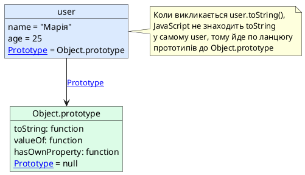

# Interfaces та Classes

::card-group

::card{title="🎯 Мета розділу" icon="i-lucide-target"}

- Зрозуміти фундаментальну відмінність між `interface` та `type` у TypeScript та коли застосовувати кожен підхід.
- Опанувати систему класів JavaScript та їх типізацію через TypeScript.
- Навчитися проєктувати контракти поведінки через інтерфейси для досягнення слабкого зв'язування.
- Усвідомити прототипну природу класів JavaScript та механізм наслідування через ланцюг прототипів.
- Застосовувати принципи інкапсуляції через модифікатори доступу `public`, `private`, `protected`.
- Розрізняти абстрактні класи та інтерфейси як інструменти моделювання архітектури.

::

::card{title="🔑 Ключові терміни" icon="i-lucide-key"}

- **Interface (Інтерфейс):** контракт, що визначає структуру об'єкта або поведінку класу без реалізації.
- **Class (Клас):** шаблон для створення об'єктів, що інкапсулює дані та методи.
- **Prototype (Прототип):** об'єкт у JavaScript, від якого інші об'єкти наслідують властивості та методи.
- **Constructor (Конструктор):** спеціальний метод класу, що викликається при створенні нового екземпляра.
- **Access Modifiers (Модифікатори доступу):** ключові слова `public`, `private`, `protected`, що контролюють видимість членів класу.
- **Abstract Class (Абстрактний клас):** клас, що не може бути інстанційованим напряму і призначений для успадкування.

::

::

---

## Обмеження inline типів та необхідність багаторазового використання

У попередніх розділах ми активно користувалися **inline об'єктними типами** для опису структури даних:

```typescript
function createUser(data: { name: string; email: string; age: number }) {
  return {
    ...data,
    id: Math.random().toString(36),
    createdAt: new Date()
  };
}

function validateUser(user: { name: string; email: string; age: number }): boolean {
  return user.name.length > 0 && user.email.includes('@') && user.age >= 18;
}
```

Цей підхід працює, але призводить до **дублювання коду**: тип `{ name: string; email: string; age: number }` повторюється двічі. Якщо структура користувача зміниться (наприклад, додамо поле `phone`), доведеться вносити зміни у кількох місцях, що підвищує ризик помилок та ускладнює підтримку коду.

Для вирішення цієї проблеми у TypeScript існують два основні інструменти: **type aliases** (псевдоніми типів, які ви вже знаєте з розділу про union та intersection типи) та **interfaces** (інтерфейси). Обидва механізми дозволяють **винести опис типу у окреме іменоване оголошення** та багаторазово використовувати його у сигнатурах функцій, змінних та класів.

::note
Нагадаємо, що у розділі про union та intersection типи ми вже використовували `type` для створення псевдонімів:

```typescript
type StatusCode = 200 | 404 | 500;
type Point = { x: number; y: number };
```

Інтерфейси доповнюють цей інструментарій, пропонуючи більш природний синтаксис для опису структур об'єктів та контрактів поведінки класів, а також унікальні можливості розширення та об'єднання оголошень.
::

---

## Interface: контракт структури об'єкта

**Інтерфейс** (_interface_) у TypeScript — це спосіб формального визначення структури об'єкта: які властивості він повинен мати, які типи мають ці властивості, які методи він надає та які сигнатури мають ці методи. Інтерфейс діє як **контракт**: будь-який об'єкт або клас, що оголошує відповідність цьому інтерфейсу, зобов'язується надати всі описані властивості та методи з вказаними типами.

### Синтаксис оголошення інтерфейсу

Інтерфейс оголошується через ключове слово `interface`, за яким слідує ім'я інтерфейсу (за конвенцією починається з великої літери) та тіло у фігурних дужках:

```typescript
interface User {
  name: string;
  email: string;
  age: number;
}
```

Тепер ми можемо використовувати `User` як тип у будь-якому місці програми:

```typescript
function createUser(data: User): User & { id: string; createdAt: Date } {
  return {
    ...data,
    id: Math.random().toString(36),
    createdAt: new Date()
  };
}

function validateUser(user: User): boolean {
  return user.name.length > 0 && user.email.includes('@') && user.age >= 18;
}

const newUser = createUser({ 
  name: 'Олена Шевченко', 
  email: 'olena@example.com', 
  age: 22 
});
```

Компілятор TypeScript перевіряє, що об'єкт, переданий як `User`, містить усі обов'язкові поля з правильними типами. Якщо передати неповний об'єкт або об'єкт з полями неправильних типів, отримаємо помилку компіляції:

```typescript
// ❌ Error: Property 'age' is missing in type
const invalidUser: User = { 
  name: 'Іван', 
  email: 'ivan@example.com' 
};

// ❌ Error: Type 'string' is not assignable to type 'number'
const anotherInvalidUser: User = { 
  name: 'Марія', 
  email: 'maria@example.com', 
  age: 'twenty' 
};
```

### Опціональні властивості та readonly модифікатор

Як і у inline типах, інтерфейси підтримують **опціональні властивості** через `?` та **незмінні властивості** через `readonly`:

```typescript
interface Product {
  readonly id: string;        // неможливо змінити після створення
  name: string;
  price: number;
  description?: string;       // опціональне поле
  category?: string;
}

const laptop: Product = {
  id: 'prod-001',
  name: 'MacBook Pro',
  price: 2500
  // description та category відсутні — це допустимо
};

laptop.price = 2400;          // ✅ OK: price не readonly
// laptop.id = 'prod-002';    // ❌ Error: Cannot assign to 'id' because it is a read-only property
```

::tip
Використовуйте `readonly` для властивостей, що представляють **ідентифікатори, мітки часу створення або інші незмінні метадані**. Це запобігає випадковій зміні критичних даних у коді та робить інтенції явними: "це поле встановлюється один раз і більше не змінюється".
::

### Методи в інтерфейсах

Інтерфейси можуть описувати не лише дані, але й **поведінку** — методи, що об'єкт повинен реалізувати. Сигнатура методу визначає ім'я, параметри та тип повернення, але не містить реалізації (це лише контракт):

```typescript
interface Logger {
  log(message: string): void;
  error(message: string, code?: number): void;
}
```

Об'єкт, що відповідає інтерфейсу `Logger`, зобов'язаний надати методи `log` та `error` з вказаними сигнатурами:

```typescript
const consoleLogger: Logger = {
  log(message: string): void {
    console.log(`[LOG] ${message}`);
  },
  error(message: string, code?: number): void {
    console.error(`[ERROR] ${message}`, code !== undefined ? `Code: ${code}` : '');
  }
};

consoleLogger.log('Сервер запущено на порту 3000');
consoleLogger.error('Не вдалося підключитися до бази даних', 1001);
```

Важливо розуміти, що інтерфейс описує **лише сигнатуру** методу, але не його **реалізацію**. Реалізація надається об'єктом або класом, що впроваджує цей інтерфейс.

::note
**Чому це корисно?** Уявімо, що система логування використовується у багатьох модулях застосунку. Замість прив'язування коду до конкретної реалізації (`console.log`), ми оголошуємо інтерфейс `Logger` та пишемо функції, що приймають `Logger` як залежність:

```typescript
function processRequest(logger: Logger) {
  logger.log('Обробка запиту розпочата');
  // ... бізнес-логіка
  logger.log('Обробка запиту завершена');
}
```

Тепер ми можемо передати будь-яку реалізацію `Logger`: консольний логер, логер у файл, логер у віддалений сервіс моніторингу — головне, щоб об'єкт задовольняв контракт `Logger`. Це дозволяє легко підміняти реалізацію без зміни коду, що використовує логер, — принцип **dependency inversion** із SOLID.
::

### Index signatures в інтерфейсах

Інтерфейси, як і inline об'єктні типи, підтримують **index signatures** для опису об'єктів з динамічною кількістю властивостей:

```typescript
interface Dictionary {
  [key: string]: string;
}

const translations: Dictionary = {
  hello: 'привіт',
  goodbye: 'до побачення',
  thanks: 'дякую'
};

console.log(translations['hello']);  // "привіт"
translations['welcome'] = 'ласкаво просимо';  // ✅ OK
```

Можна комбінувати index signature з фіксованими властивостями, але типи фіксованих властивостей мають бути сумісними з типом index signature:

```typescript
interface Config {
  readonly version: string;  // ✅ OK: string сумісний з string
  [key: string]: string | number;
}

const appConfig: Config = {
  version: '1.0.0',
  port: 3000,               // ✅ OK: number сумісний з string | number
  host: 'localhost'         // ✅ OK: string сумісний з string | number
};
```

---

## Interface vs Type: семантичні відмінності та практичні рекомендації

Ви вже знайомі з `type` псевдонімами з попередніх розділів. Інтерфейси та псевдоніми типів у багатьох випадках **взаємозамінні**, особливо для опису структур об'єктів:

```typescript
// Через interface
interface Point {
  x: number;
  y: number;
}

// Через type alias
type PointType = {
  x: number;
  y: number;
};
```

Обидва підходи створюють тип для об'єкта з полями `x` та `y`. Проте між ними існують важливі відмінності, що впливають на вибір інструменту.

### Ключові відмінності

**1. Розширення (Extending)**

Інтерфейси підтримують **наслідування** через ключове слово `extends`:

```typescript
interface Animal {
  name: string;
  age: number;
}

interface Dog extends Animal {
  breed: string;
  bark(): void;
}

const myDog: Dog = {
  name: 'Рекс',
  age: 3,
  breed: 'Німецька вівчарка',
  bark() { console.log('Гав!'); }
};
```

Type aliases можуть досягти аналогічного ефекту через **intersection types**:

```typescript
type Animal = {
  name: string;
  age: number;
};

type Dog = Animal & {
  breed: string;
  bark(): void;
};
```

Результат ідентичний, але `extends` у інтерфейсах семантично виразніший: "Dog розширює Animal" читається природніше, ніж "Dog є перетином Animal та додаткових полів".

**2. Declaration Merging (Об'єднання оголошень)**

Інтерфейси підтримують **declaration merging**: якщо в одному scope оголошено кілька інтерфейсів з однаковим іменем, TypeScript автоматично об'єднає їх в один:

```typescript
interface Window {
  title: string;
}

interface Window {
  close(): void;
}

// TypeScript об'єднує обидва оголошення
const myWindow: Window = {
  title: 'Головне вікно',
  close() { console.log('Закриття вікна'); }
};
```

Цей механізм широко використовується для **розширення глобальних типів** (наприклад, додавання власних властивостей до `Window` або `Array` у браузерному середовищі).

Type aliases **не підтримують declaration merging** — спроба оголосити два `type` з однаковим іменем призведе до помилки:

```typescript
type Config = { port: number };
// type Config = { host: string }; // ❌ Error: Duplicate identifier 'Config'
```

**3. Що можна описати**

Type aliases більш **універсальні**: вони можуть описувати не лише об'єкти, але й union types, intersection types, примітивні типи, кортежі, функціональні типи:

```typescript
type ID = string | number;                    // union
type Point = [number, number];                 // tuple
type Callback = (data: string) => void;        // function
type StringOrNumber = string | number;         // union примітивів
```

Інтерфейси **призначені для об'єктів та класів**. Вони не можуть описувати union types або примітиви:

```typescript
// ❌ Error: An interface can only extend an object type
// interface ID extends string | number {}
```

**4. Повідомлення про помилки**

Компілятор TypeScript у повідомленнях про помилки часто **показує інтерфейси за іменем**, тоді як type aliases можуть бути **розгорнуті** до своєї структури. Це робить помилки з інтерфейсами зрозумілішими:

```typescript
interface User {
  name: string;
  email: string;
}

function greet(user: User) {
  console.log(`Привіт, ${user.name}`);
}

// ❌ Error: Argument of type '{ name: string; }' is not assignable to parameter of type 'User'.
//           Property 'email' is missing in type '{ name: string; }' but required in type 'User'.
greet({ name: 'Олександр' });
```

Помилка чітко вказує на інтерфейс `User` та відсутнє поле. З type alias повідомлення може бути більш громіздким, особливо для складних типів.

### Практичні рекомендації

::tip
**Коли використовувати `interface`:**

- Для опису **структур об'єктів** та **контрактів поведінки** (особливо коли об'єкт або клас реалізовуватиме інтерфейс).
- Коли потрібна можливість **розширення** через `extends` (наслідування інтерфейсів).
- Коли пишете **публічну бібліотеку** і хочете дозволити користувачам розширювати ваші типи через declaration merging.
- Для **доменних моделей** та **DTO** (_Data Transfer Objects_), що представляють сутності предметної області.

**Коли використовувати `type`:**

- Для **union types** та **intersection types** складних комбінацій: `type Status = 'idle' | 'loading' | 'success' | 'error'`.
- Для **примітивних псевдонімів**, кортежів, функціональних типів: `type ID = string; type Point = [number, number]`.
- Коли потрібна більша **гнучкість** у композиції типів (mapped types, conditional types — вивчатимуться у наступних розділах).
- Для **внутрішніх допоміжних типів** у модулі, що не призначені для розширення ззовні.
::

У багатьох ситуаціях вибір між `interface` та `type` є питанням стилю та командних домовленостей. Головне — **бути послідовним** у межах проєкту.

::warning
Уникайте змішування `interface` та `type` для опису однієї сутності без причини. Якщо ви почали описувати доменну модель через інтерфейси, продовжуйте у тому ж ключі для узгодженості коду.
::

---

## Наслідування інтерфейсів через extends

Інтерфейси підтримують **наслідування** (_inheritance_), що дозволяє створювати **ієрархії типів** та повторно використовувати спільні частини структур. Інтерфейс-нащадок (_derived interface_) успадковує всі властивості та методи батьківського інтерфейсу (_base interface_) та може додавати власні.

### Одиночне наслідування

```typescript
interface Person {
  firstName: string;
  lastName: string;
  age: number;
}

interface Employee extends Person {
  employeeId: string;
  position: string;
  salary: number;
}

const employee: Employee = {
  firstName: 'Олександр',
  lastName: 'Коваленко',
  age: 28,
  employeeId: 'EMP-12345',
  position: 'Backend Developer',
  salary: 50000
};
```

Інтерфейс `Employee` автоматично включає поля `firstName`, `lastName`, `age` з `Person` та додає три власні поля. Об'єкт типу `Employee` має задовольняти обидва контракти.

### Множинне наслідування

На відміну від класів у багатьох мовах (де множинне наслідування заборонене або обмежене), інтерфейси TypeScript можуть **успадковувати від кількох батьківських інтерфейсів** одночасно:

```typescript
interface Loggable {
  log(message: string): void;
}

interface Serializable {
  toJSON(): string;
}

interface Entity extends Loggable, Serializable {
  id: string;
  createdAt: Date;
}

const userEntity: Entity = {
  id: 'user-001',
  createdAt: new Date(),
  log(message: string) {
    console.log(`[Entity ${this.id}] ${message}`);
  },
  toJSON() {
    return JSON.stringify({ id: this.id, createdAt: this.createdAt });
  }
};
```

Інтерфейс `Entity` успадковує методи з `Loggable` та `Serializable`, а також додає власні поля. Об'єкт, що реалізує `Entity`, зобов'язаний надати всі чотири елементи.

### Перевизначення властивостей при наслідуванні

Інтерфейс-нащадок може **звузити тип** батьківської властивості (зробити його більш специфічним), але не може **розширити** (зробити менш специфічним):

```typescript
interface Animal {
  name: string;
  age: number | null;  // може бути null (вік невідомий)
}

interface Dog extends Animal {
  age: number;         // ✅ OK: звуження типу (прибираємо null)
  breed: string;
}

const dog: Dog = {
  name: 'Бобік',
  age: 5,              // тепер age обов'язково число, не може бути null
  breed: 'Лабрадор'
};
```

Спроба розширити тип призведе до помилки:

```typescript
interface Cat extends Animal {
  // ❌ Error: Interface 'Cat' incorrectly extends interface 'Animal'.
  //           Types of property 'name' are incompatible.
  name: string | number;  // спроба розширити тип з string до string | number
}
```

::note
**Чому заборонено розширення типу?** Якби `Cat.name` міг бути `string | number`, то об'єкт типу `Cat` не міг би бути безпечно використаний там, де очікується `Animal` (адже код, що працює з `Animal`, очікує `name` типу `string`, а отримав би можливість `number`). Це порушило б **принцип підстановки Лісков** (_Liskov Substitution Principle_), один з фундаментальних принципів об'єктно-орієнтованого програмування.
::

---

## Класи у JavaScript: прототипна природа та синтаксичний цукор

Перш ніж занурюватися у типізацію класів через TypeScript, критично важливо зрозуміти, **як насправді працюють класи у JavaScript**. На відміну від класичних об'єктно-орієнтованих мов (Java, C#, C++), де класи є фундаментальною частиною мови, у JavaScript класи — це **синтаксичний цукор** (_syntactic sugar_) поверх **прототипної моделі наслідування** (_prototypal inheritance_), що існувала у мові з самого початку.

### Прототипи: основа об'єктів JavaScript

У JavaScript кожен об'єкт має внутрішнє посилання на інший об'єкт, що називається його **прототипом** (_prototype_). Коли ви намагаєтеся звернутися до властивості об'єкта, і ця властивість не знайдена безпосередньо у самому об'єкті, JavaScript автоматично шукає цю властивість у прототипі об'єкта, потім у прототипі прототипа, і так далі, формуючи **ланцюг прототипів** (_prototype chain_). Цей процес називається **прототипним lookup**.

Розглянемо найпростіший приклад створення об'єкта через літерал:

```javascript
const user = {
  name: 'Марія',
  age: 25
};

console.log(user.toString());  // "[object Object]"
```

Об'єкт `user` не має власного методу `toString`, але виклик `user.toString()` не призводить до помилки. Як це працює? JavaScript шукає `toString` у прототипі `user`, яким є `Object.prototype` — базовий прототип для всіх об'єктів у мові. `Object.prototype` містить метод `toString`, тому виклик успішний.

::plant-uml{alt="Ланцюг прототипів JavaScript"}



::

### Функції-конструктори: прообраз класів

До появи синтаксису `class` у ES2015 розробники JavaScript використовували **функції-конструктори** (_constructor functions_) для створення об'єктів з спільним прототипом:

```javascript
function User(name, age) {
  this.name = name;
  this.age = age;
}

User.prototype.greet = function() {
  return `Привіт, мене звати ${this.name}`;
};

const user1 = new User('Олександр', 30);
const user2 = new User('Олена', 28);

console.log(user1.greet());  // "Привіт, мене звати Олександр"
console.log(user2.greet());  // "Привіт, мене звати Олена"
```

Що відбувається при виклику `new User('Олександр', 30)`:

1. Створюється новий порожній об'єкт `{}`.
2. Встановлюється прототип цього об'єкта: `{}.__proto__ = User.prototype`.
3. Функція `User` викликається з `this`, прив'язаним до нового об'єкта, і встановлює властивості `name` та `age`.
4. Повертається новостворений об'єкт (якщо конструктор не повертає інший об'єкт явно).

Обидва екземпляри `user1` та `user2` мають власні властивості `name` та `age`, але **спільний метод** `greet`, що знаходиться у `User.prototype`. Це економить пам'ять: замість створення нової копії функції `greet` для кожного користувача, усі екземпляри спільно використовують одну функцію з прототипа.

::note
**Чому це важливо для розуміння класів TypeScript?** Тому що під капотом синтаксис `class` компілюється саме у функцію-конструктор з прототипами. TypeScript не змінює поведінку JavaScript — він лише додає типізацію поверх існуючої прототипної моделі.
::

### Синтаксис class у ES2015 та компіляція TypeScript

У ES2015 (ES6) до JavaScript додали синтаксис `class`, що робить код більш читабельним та схожим на інші ОО-мови:

```javascript
class User {
  constructor(name, age) {
    this.name = name;
    this.age = age;
  }

  greet() {
    return `Привіт, мене звати ${this.name}`;
  }
}

const user = new User('Ігор', 32);
console.log(user.greet());
```

Цей код **функціонально ідентичний** попередньому прикладу з функцією-конструктором: метод `greet` додається до `User.prototype`, а `constructor` — це та сама функція-конструктор. Синтаксис `class` — це лише **більш зручна обгортка** над прототипами, але прототипна модель залишається незмінною.

Коли TypeScript компілює клас з таргетом ES5 (який не підтримує `class`), він генерує функцію-конструктор:

```typescript
// TypeScript код
class Counter {
  count = 0;

  increment() {
    this.count++;
  }
}
```

```javascript
// Компіляція у ES5
"use strict";
var Counter = /** @class */ (function () {
    function Counter() {
        this.count = 0;
    }
    Counter.prototype.increment = function () {
        this.count++;
    };
    return Counter;
}());
```

Розуміння цього перетворення допомагає усвідомити, що **класи TypeScript — це насамперед JavaScript-класи** з додатковою типізацією часу компіляції.

---

## Базовий синтаксис класів у TypeScript

Тепер, коли ми розуміємо прототипну основу, розглянемо, як TypeScript типізує та розширює функціональність класів.

### Оголошення класу та конструктор

Клас оголошується через ключове слово `class`, за яким слідує ім'я класу та тіло класу у фігурних дужках:

```typescript
class User {
  name: string;
  email: string;
  age: number;

  constructor(name: string, email: string, age: number) {
    this.name = name;
    this.email = email;
    this.age = age;
  }

  greet(): string {
    return `Привіт, мене звати ${this.name}, мені ${this.age} років`;
  }
}

const user = new User('Анна', 'anna@example.com', 27);
console.log(user.greet());  // "Привіт, мене звати Анна, мені 27 років"
```

**Конструктор** (_constructor_) — це спеціальний метод, що викликається автоматично при створенні екземпляра класу через `new`. Він ініціалізує властивості екземпляра. У TypeScript поля класу (`name`, `email`, `age`) оголошуються у тілі класу з вказівкою типу, а потім ініціалізуються у конструкторі.

::warning
Якщо поле оголошено у класі, але не ініціалізовано у конструкторі і не має значення за замовчуванням, TypeScript у strict mode видасть помилку:

```typescript
class Product {
  name: string;      // ❌ Error: Property 'name' has no initializer
  price: number;

  constructor(price: number) {
    this.price = price;
    // name не ініціалізовано
  }
}
```

Щоб уникнути помилки, ініціалізуйте поле або позначте його як опціональне (`name?: string`) або використайте **definite assignment assertion** (`name!: string`), якщо впевнені, що ініціалізація відбудеться іншим способом.
::

### Скорочений синтаксис конструктора (Parameter Properties)

TypeScript пропонує **скорочений синтаксис** для автоматичного оголошення та ініціалізації полів класу безпосередньо у параметрах конструктора через модифікатори доступу `public`, `private`, `protected` або `readonly`:

```typescript
class User {
  constructor(
    public name: string,
    public email: string,
    public age: number
  ) {
    // Поля name, email, age автоматично оголошені та ініціалізовані
  }

  greet(): string {
    return `Привіт, мене звати ${this.name}`;
  }
}

const user = new User('Максим', 'max@example.com', 24);
console.log(user.name);  // "Максим"
```

Цей код еквівалентний попередньому прикладу, але значно коротший. Модифікатор `public` перед параметром конструктора автоматично створює публічне поле класу і присвоює йому значення параметра.

::tip
Скорочений синтаксис особливо корисний для **DTO** (_Data Transfer Objects_) та простих моделей, де клас в основному служить контейнером даних з мінімальною логікою:

```typescript
class CreateUserDto {
  constructor(
    public readonly email: string,
    public readonly password: string,
    public readonly firstName: string,
    public readonly lastName: string
  ) {}
}
```

Всі поля автоматично стають незмінними (`readonly`) властивостями екземпляра, що відповідає семантиці "об'єкт передачі даних, що не має змінюватися після створення".
::


### Методи класу

Методи класу — це функції, що визначені всередині тіла класу і мають доступ до полів екземпляра через `this`:

```typescript
class Calculator {
  constructor(private value: number = 0) {}

  add(n: number): Calculator {
    this.value += n;
    return this;  // повернення this для method chaining
  }

  subtract(n: number): Calculator {
    this.value -= n;
    return this;
  }

  multiply(n: number): Calculator {
    this.value *= n;
    return this;
  }

  getValue(): number {
    return this.value;
  }
}

const calc = new Calculator(10);
const result = calc.add(5).multiply(2).subtract(3).getValue();
console.log(result);  // (10 + 5) * 2 - 3 = 27
```

Повернення `this` з методів дозволяє створювати **fluent interface** (_плавний інтерфейс_) або **method chaining** (_ланцюжок викликів методів_), що робить код виразнішим та компактнішим.

::note
Методи класу додаються до **прототипу** класу, а не до кожного екземпляра. Це означає, що якщо створити 1000 екземплярів `Calculator`, метод `add` існуватиме в пам'яті лише один раз у `Calculator.prototype`, а не 1000 копій. Поля класу (`value`), навпаки, зберігаються окремо у кожному екземплярі.
::

### Статичні члени класу

**Статичні члени** (_static members_) належать класу як цілому, а не окремим екземплярам. Вони оголошуються через ключове слово `static` і доступні через ім'я класу, а не через екземпляр:

```typescript
class MathUtils {
  static readonly PI = 3.14159;

  static areaOfCircle(radius: number): number {
    return MathUtils.PI * radius * radius;
  }

  static max(a: number, b: number): number {
    return a > b ? a : b;
  }
}

console.log(MathUtils.PI);                    // 3.14159
console.log(MathUtils.areaOfCircle(5));       // 78.53975
console.log(MathUtils.max(10, 20));           // 20

// const utils = new MathUtils();             // ❌ Error: Cannot create an instance
```

Статичні методи часто використовуються для **утилітних функцій**, що логічно пов'язані з класом, але не потребують доступу до стану екземпляра, або для **фабричних методів** (_factory methods_), що створюють екземпляри класу специфічним чином:

```typescript
class User {
  constructor(
    public id: string,
    public name: string,
    public email: string
  ) {}

  static fromJSON(json: string): User {
    const data = JSON.parse(json);
    return new User(data.id, data.name, data.email);
  }

  static generateId(): string {
    return Math.random().toString(36).substring(2, 15);
  }
}

const jsonString = '{"id":"user-123","name":"Олег","email":"oleg@example.com"}';
const user = User.fromJSON(jsonString);
console.log(user.name);  // "Олег"

const newId = User.generateId();
console.log(newId);  // наприклад, "8f3k2m9q1"
```

::tip
Статичні члени корисні для:

- **Констант**, що належать класу: `Math.PI`, `Number.MAX_VALUE`.
- **Утилітних функцій**: `ArrayUtils.chunk()`, `StringUtils.capitalize()`.
- **Фабричних методів**: `User.fromJSON()`, `Date.parse()`.
- **Лічильників або спільного стану**: підрахунок кількості створених екземплярів класу.
::

---

## Модифікатори доступу: public, private, protected

TypeScript додає до JavaScript механізм **контролю доступу** (_access control_) через модифікатори `public`, `private` та `protected`. Ці модифікатори діють **лише на рівні компіляції** — у скомпільованому JavaScript коді вони зникають, і всі поля залишаються доступними. Проте на етапі розробки вони забезпечують **інкапсуляцію** та захищають внутрішню реалізацію класу від неправильного використання.

### Public (за замовчуванням)

Всі члени класу у TypeScript **за замовчуванням є публічними** (`public`), тобто доступні з будь-якого місця коду:

```typescript
class Counter {
  public count: number = 0;

  public increment(): void {
    this.count++;
  }
}

const counter = new Counter();
counter.count = 100;        // ✅ OK: public поле
counter.increment();        // ✅ OK: public метод
console.log(counter.count); // 101
```

Ключове слово `public` можна опустити — результат ідентичний. Його явне використання має сенс для **документування інтенцій**: "це поле/метод є частиною публічного API класу".

### Private: приватні члени класу

Члени класу, позначені як `private`, **доступні лише всередині самого класу**. Спроба звернутися до приватного поля або методу ззовні класу призводить до помилки компіляції:

```typescript
class BankAccount {
  private balance: number = 0;

  constructor(initialBalance: number) {
    this.balance = initialBalance;
  }

  deposit(amount: number): void {
    if (amount > 0) {
      this.balance += amount;
    }
  }

  withdraw(amount: number): boolean {
    if (amount > 0 && amount <= this.balance) {
      this.balance -= amount;
      return true;
    }
    return false;
  }

  getBalance(): number {
    return this.balance;
  }
}

const account = new BankAccount(1000);
account.deposit(500);
console.log(account.getBalance());  // 1500

// account.balance = 5000;           // ❌ Error: Property 'balance' is private
```

Поле `balance` приховане від зовнішнього коду: єдиний спосіб змінити баланс — через публічні методи `deposit` та `withdraw`, що містять валідаційну логіку. Це запобігає некоректним станам (наприклад, від'ємному балансу або прямому встановленню довільного значення).

::note
**Важливо:** у скомпільованому JavaScript коді `balance` залишиться звичайним полем, доступним ззовні. TypeScript `private` — це лише захист на рівні **статичної типізації часу компіляції**, але не runtime захист. Якщо потрібна справжня приватність у JavaScript runtime, використовуйте **приватні поля ECMAScript** через префікс `#`:

```typescript
class SecureAccount {
  #balance: number = 0;  // справді приватне поле JavaScript

  constructor(initialBalance: number) {
    this.#balance = initialBalance;
  }

  getBalance(): number {
    return this.#balance;
  }
}

const acc = new SecureAccount(1000);
// acc.#balance;  // ❌ Syntax Error у runtime JavaScript
```

Поля з `#` є частиною ECMAScript 2022 і забезпечують справжню приватність навіть після компіляції. TypeScript підтримує обидва синтаксиси: `private` для типізації часу компіляції та `#` для runtime приватності.
::

### Protected: доступ у нащадках

Члени класу, позначені як `protected`, доступні **всередині самого класу та у класах-нащадках**, але недоступні ззовні:

```typescript
class Animal {
  protected name: string;

  constructor(name: string) {
    this.name = name;
  }

  protected makeSound(): void {
    console.log('Тварина видає звук');
  }
}

class Dog extends Animal {
  bark(): void {
    console.log(`${this.name} каже: Гав-гав!`);
    this.makeSound();  // ✅ OK: доступ до protected методу батьківського класу
  }
}

const dog = new Dog('Рекс');
dog.bark();             // "Рекс каже: Гав-гав!" + "Тварина видає звук"
// dog.name;            // ❌ Error: Property 'name' is protected
// dog.makeSound();     // ❌ Error: Property 'makeSound' is protected
```

Модифікатор `protected` дозволяє **контрольовано розкрити внутрішню реалізацію** нащадкам, зберігаючи інкапсуляцію від зовнішнього коду. Це корисно у бібліотеках та фреймворках, де базові класи надають "точки розширення" для користувацьких класів-нащадків.

### Readonly у класах

Модифікатор `readonly` робить поле **незмінним після ініціалізації**. Його можна встановити лише у конструкторі або при оголошенні:

```typescript
class User {
  readonly id: string;
  readonly createdAt: Date;
  name: string;

  constructor(id: string, name: string) {
    this.id = id;
    this.createdAt = new Date();
    this.name = name;
  }

  rename(newName: string): void {
    this.name = newName;           // ✅ OK: name не readonly
    // this.id = 'new-id';         // ❌ Error: Cannot assign to 'id' because it is a read-only property
  }
}

const user = new User('user-123', 'Ірина');
user.rename('Ірина Петрівна');    // ✅ OK
// user.id = 'user-456';           // ❌ Error: Cannot assign to 'id'
```

`readonly` можна комбінувати з модифікаторами доступу:

```typescript
class Product {
  constructor(
    private readonly id: string,
    public name: string,
    public price: number
  ) {}

  getId(): string {
    return this.id;  // доступ до приватного readonly поля всередині класу
  }
}

const product = new Product('prod-001', 'Ноутбук', 25000);
console.log(product.getId());  // "prod-001"
// product.id;                 // ❌ Error: Property 'id' is private
```

::warning
**Відмінність `readonly` від `const`:** `const` використовується для змінних і запобігає **повторному присвоєнню** самої змінної. `readonly` застосовується до властивостей класу та запобігає **зміні значення властивості** після ініціалізації. Не плутайте ці концепції:

```typescript
const user = new User('user-123', 'Олексій');
user = new User('user-456', 'Марія');  // ❌ Error: Cannot assign to 'user' because it is a constant

user.name = 'Олексій Іванович';       // ✅ OK: сам об'єкт мутабельний, змінна const — ні
```
::

---

## Наслідування класів через extends

Класи TypeScript підтримують **наслідування** (_inheritance_): клас-нащадок успадковує поля та методи батьківського класу і може додавати власні або **перевизначати** (_override_) успадковані методи.

### Базове наслідування

```typescript
class Animal {
  constructor(public name: string) {}

  makeSound(): void {
    console.log('Тварина видає звук');
  }
}

class Cat extends Animal {
  meow(): void {
    console.log(`${this.name} каже: Мяу!`);
  }
}

const cat = new Cat('Мурчик');
cat.makeSound();  // "Тварина видає звук" (успадкований метод)
cat.meow();       // "Мурчик каже: Мяу!" (власний метод)
```

Клас `Cat` автоматично отримує поле `name` та метод `makeSound` від `Animal` та додає власний метод `meow`.

### Виклик конструктора батьківського класу через super()

Якщо клас-нащадок має власний конструктор, він **обов'язково має викликати** `super()` — конструктор батьківського класу — **до звернення до `this`**:

```typescript
class Vehicle {
  constructor(public brand: string, public year: number) {}
}

class Car extends Vehicle {
  constructor(brand: string, year: number, public model: string) {
    super(brand, year);  // виклик конструктора Vehicle
    this.model = model;
  }

  getInfo(): string {
    return `${this.brand} ${this.model} (${this.year})`;
  }
}

const car = new Car('Toyota', 2022, 'Camry');
console.log(car.getInfo());  // "Toyota Camry (2022)"
```

Якщо забути викликати `super()`, TypeScript видасть помилку:

```typescript
class Truck extends Vehicle {
  constructor(brand: string, year: number, public capacity: number) {
    // ❌ Error: A 'super' call must be the first statement in the constructor
    this.capacity = capacity;
    super(brand, year);
  }
}
```

::note
**Чому `super()` обов'язковий?** У JavaScript конструктор класу-нащадка не створює новий об'єкт самостійно — це робить конструктор батьківського класу. Виклик `super()` ініціалізує `this` через батьківський конструктор. Без цього виклику `this` залишається неініціалізованим, і будь-які звернення до нього призведуть до помилки runtime.
::

### Перевизначення методів (Method Overriding)

Клас-нащадок може **перевизначити** (_override_) метод батьківського класу, надавши власну реалізацію:

```typescript
class Animal {
  constructor(public name: string) {}

  makeSound(): void {
    console.log('Тварина видає невизначений звук');
  }
}

class Dog extends Animal {
  makeSound(): void {
    console.log(`${this.name} гавкає: Гав-гав!`);
  }
}

class Cat extends Animal {
  makeSound(): void {
    console.log(`${this.name} нявкає: Мяу!`);
  }
}

const animals: Animal[] = [
  new Dog('Бобік'),
  new Cat('Мурка'),
  new Animal('Невідома тварина')
];

animals.forEach(animal => animal.makeSound());
// "Бобік гавкає: Гав-гав!"
// "Мурка нявкає: Мяу!"
// "Невідома тварина видає невизначений звук"
```

Це демонструє **поліморфізм** (_polymorphism_): масив типу `Animal[]` містить екземпляри різних класів (`Dog`, `Cat`, `Animal`), і виклик `makeSound()` на кожному елементі виконує відповідну реалізацію залежно від фактичного типу об'єкта у runtime.

### Виклик методу батьківського класу через super

Всередині перевизначеного методу можна викликати **оригінальну реалізацію** батьківського методу через `super.methodName()`:

```typescript
class Logger {
  log(message: string): void {
    console.log(`[LOG] ${message}`);
  }
}

class TimestampedLogger extends Logger {
  log(message: string): void {
    const timestamp = new Date().toISOString();
    super.log(`${timestamp} - ${message}`);  // виклик батьківського log()
  }
}

const logger = new TimestampedLogger();
logger.log('Сервер запущено');
// "[LOG] 2026-08-30T12:34:56.789Z - Сервер запущено"
```

Виклик `super.log()` делегує виконання базовій реалізації, дозволяючи уникнути дублювання логіки та розширити поведінку, а не повністю замінити її.

::tip
**Коли використовувати `super` у методах:**

- Коли потрібно **розширити** поведінку батьківського методу, а не замінити його повністю.
- Коли базовий клас виконує важливі операції (валідацію, логування, оновлення внутрішнього стану), які не варто дублювати у нащадку.
- Коли ви хочете зберегти **узгодженість поведінки** між базовим класом та нащадками.
::

---

## Реалізація інтерфейсів через implements

Класи TypeScript можуть **реалізовувати** (_implement_) один або кілька інтерфейсів, оголошуючи, що вони задовольняють контракт цих інтерфейсів. Ключове слово `implements` використовується для цього:

```typescript
interface Loggable {
  log(message: string): void;
}

interface Serializable {
  toJSON(): string;
}

class User implements Loggable, Serializable {
  constructor(
    public id: string,
    public name: string,
    public email: string
  ) {}

  log(message: string): void {
    console.log(`[User ${this.id}] ${message}`);
  }

  toJSON(): string {
    return JSON.stringify({
      id: this.id,
      name: this.name,
      email: this.email
    });
  }
}

const user = new User('user-001', 'Дмитро', 'dmytro@example.com');
user.log('Користувач створений');
console.log(user.toJSON());
```

Компілятор TypeScript перевіряє, що клас `User` надає всі методи та властивості, визначені в інтерфейсах `Loggable` та `Serializable`. Якщо хоча б один метод відсутній або має невірну сигнатуру, виникне помилка компіляції:

```typescript
class Product implements Loggable {
  constructor(public name: string) {}

  // ❌ Error: Class 'Product' incorrectly implements interface 'Loggable'.
  //           Property 'log' is missing in type 'Product' but required in type 'Loggable'.
}
```

### Відмінність між implements та extends

- **`extends`** використовується для **наслідування класів**: нащадок успадковує **реалізацію** (код) батьківського класу.
- **`implements`** використовується для **реалізації інтерфейсів**: клас зобов'язується надати **реалізацію** контракту інтерфейсу, але не успадковує жодного коду.

Клас може одночасно успадковувати інший клас (`extends`) та реалізовувати інтерфейси (`implements`):

```typescript
interface Timestamped {
  createdAt: Date;
  updatedAt: Date;
}

class BaseEntity {
  constructor(public id: string) {}
}

class Article extends BaseEntity implements Timestamped {
  createdAt: Date;
  updatedAt: Date;

  constructor(id: string, public title: string, public content: string) {
    super(id);
    this.createdAt = new Date();
    this.updatedAt = new Date();
  }

  updateContent(newContent: string): void {
    this.content = newContent;
    this.updatedAt = new Date();
  }
}

const article = new Article('article-001', 'TypeScript Classes', 'Вступ до класів...');
console.log(article.id);         // успадковано від BaseEntity
console.log(article.createdAt);  // реалізовано з Timestamped
```

::note
**Коли використовувати `implements`?** Реалізація інтерфейсів корисна для **dependency injection** та **інверсії залежностей**: замість того, щоб код залежав від конкретного класу, він залежить від інтерфейсу, що дозволяє підставляти різні реалізації:

```typescript
interface PaymentGateway {
  processPayment(amount: number): Promise<boolean>;
}

class StripeGateway implements PaymentGateway {
  async processPayment(amount: number): Promise<boolean> {
    // інтеграція зі Stripe API
    return true;
  }
}

class PayPalGateway implements PaymentGateway {
  async processPayment(amount: number): Promise<boolean> {
    // інтеграція з PayPal API
    return true;
  }
}

function checkout(gateway: PaymentGateway, amount: number) {
  return gateway.processPayment(amount);
}

// Можна передати будь-яку реалізацію PaymentGateway
checkout(new StripeGateway(), 100);
checkout(new PayPalGateway(), 200);
```

Це робить код **гнучким, тестованим та слабко зв'язаним** (_loosely coupled_).
::

---

## Абстрактні класи: шаблони для наслідування

**Абстрактний клас** (_abstract class_) — це клас, що не може бути інстанційований напряму і призначений виключно для наслідування. Він може містити як **реалізовані методи** (зі звичайним кодом), так і **абстрактні методи** (без реалізації), які нащадки зобов'язані реалізувати.

### Оголошення абстрактного класу

Абстрактний клас оголошується через ключове слово `abstract`:

```typescript
abstract class Shape {
  constructor(public color: string) {}

  abstract getArea(): number;       // абстрактний метод: без реалізації
  abstract getPerimeter(): number;

  describe(): string {               // звичайний метод: з реалізацією
    return `Фігура кольору ${this.color} з площею ${this.getArea()}`;
  }
}

// const shape = new Shape('червоний');  // ❌ Error: Cannot create an instance of an abstract class
```

Спроба створити екземпляр абстрактного класу призводить до помилки. Абстрактний клас можна лише **успадковувати**:

```typescript
class Circle extends Shape {
  constructor(color: string, public radius: number) {
    super(color);
  }

  getArea(): number {
    return Math.PI * this.radius * this.radius;
  }

  getPerimeter(): number {
    return 2 * Math.PI * this.radius;
  }
}

class Rectangle extends Shape {
  constructor(color: string, public width: number, public height: number) {
    super(color);
  }

  getArea(): number {
    return this.width * this.height;
  }

  getPerimeter(): number {
    return 2 * (this.width + this.height);
  }
}

const circle = new Circle('синій', 5);
console.log(circle.describe());  // "Фігура кольору синій з площею 78.53981633974483"

const rect = new Rectangle('зелений', 10, 20);
console.log(rect.describe());    // "Фігура кольору зелений з площею 200"
```

### Абстрактні методи: контракт для нащадків

Абстрактні методи оголошуються через `abstract` і **не мають тіла** (лише сигнатура). Кожен нащадок абстрактного класу **зобов'язаний** надати реалізацію всіх абстрактних методів, інакше компілятор видасть помилку:

```typescript
class Triangle extends Shape {
  constructor(color: string, public base: number, public height: number) {
    super(color);
  }

  getArea(): number {
    return 0.5 * this.base * this.height;
  }

  // ❌ Error: Non-abstract class 'Triangle' does not implement inherited abstract member 'getPerimeter'
}
```

Щоб усунути помилку, треба реалізувати `getPerimeter()`:

```typescript
class Triangle extends Shape {
  constructor(color: string, public a: number, public b: number, public c: number) {
    super(color);
  }

  getArea(): number {
    const s = (this.a + this.b + this.c) / 2;
    return Math.sqrt(s * (s - this.a) * (s - this.b) * (s - this.c));
  }

  getPerimeter(): number {
    return this.a + this.b + this.c;
  }
}

const triangle = new Triangle('жовтий', 3, 4, 5);
console.log(triangle.describe());  // "Фігура кольору жовтий з площею 6"
```

### Абстрактні класи vs Інтерфейси

Обидва механізми дозволяють визначити контракт, але мають різне призначення та можливості:

| Характеристика | Абстрактний клас | Інтерфейс |
|---|---|---|
| **Реалізація методів** | Може містити методи з реалізацією | Лише сигнатури, без реалізації |
| **Конструктор** | Може мати конструктор | Не може мати конструктора |
| **Поля класу** | Може мати поля з ініціалізацією | Не може мати полів (лише опис типу) |
| **Множинне наслідування** | Неможливо (клас може успадковувати лише один клас) | Можливо (клас може реалізовувати кілька інтерфейсів) |
| **Модифікатори доступу** | Підтримуються (`private`, `protected`, `public`) | Не підтримуються (всі члени публічні) |
| **Використання** | Базовий клас з частковою реалізацією | Контракт поведінки без реалізації |

::tip
**Коли використовувати абстрактний клас:**

- Коли потрібна **спільна реалізація** частини функціональності для всіх нащадків (щоб уникнути дублювання коду).
- Коли базовий клас має містити **приватні або protected поля** та методи, недоступні ззовні.
- Коли моделюєте **IS-A зв'язок** (Circle IS-A Shape, Dog IS-A Animal).

**Коли використовувати інтерфейс:**

- Коли потрібен **чистий контракт поведінки** без реалізації.
- Коли клас має реалізовувати **кілька контрактів** одночасно (множинна реалізація інтерфейсів).
- Коли описуєте **CAN-DO зв'язок** (Car CAN-DO Drivable, Logger CAN-DO Serializable).
::

---

## Getters та Setters: контрольований доступ до полів

**Getters** та **setters** (акцесори, _accessors_) дозволяють контролювати доступ до полів класу, додаючи логіку при читанні або записі значення. Вони виглядають як звичайні властивості під час використання, але насправді є методами.

### Синтаксис getters та setters

Getter оголошується через `get` перед назвою методу, setter — через `set`:

```typescript
class Temperature {
  private _celsius: number = 0;

  get celsius(): number {
    return this._celsius;
  }

  set celsius(value: number) {
    if (value < -273.15) {
      throw new Error('Температура не може бути нижчою за абсолютний нуль');
    }
    this._celsius = value;
  }

  get fahrenheit(): number {
    return this._celsius * 9/5 + 32;
  }

  set fahrenheit(value: number) {
    this.celsius = (value - 32) * 5/9;  // конвертуємо у Цельсій через setter
  }
}

const temp = new Temperature();
temp.celsius = 25;               // викликається setter celsius
console.log(temp.celsius);       // 25 (викликається getter celsius)
console.log(temp.fahrenheit);    // 77 (викликається getter fahrenheit)

temp.fahrenheit = 86;            // викликається setter fahrenheit
console.log(temp.celsius);       // 30

// temp.celsius = -300;          // ❌ Error: Температура не може бути нижчою за абсолютний нуль
```

Зовні клас виглядає так, ніби `celsius` та `fahrenheit` є звичайними властивостями, але насправді кожне звернення проходить через getter/setter, де виконується валідація та конвертація.

::note
**Конвенція іменування:** Часто приватне поле, що стоїть за getter/setter, іменується з префіксом `_` (наприклад, `_celsius`), щоб уникнути конфлікту імен з акцесором. Getter та setter мають однакову назву без префіксу (`celsius`), що дозволяє використовувати їх як властивість.
::

### Переваги використання getters та setters

- **Валідація:** Можна перевіряти значення перед присвоєнням та кидати помилки при некоректних даних.
- **Обчислювані властивості:** Getter може повертати значення, обчислене на основі інших полів (як `fahrenheit` у прикладі вище).
- **Логування та моніторинг:** Можна додати логування кожного звернення до поля для діагностики.
- **Зворотна сумісність:** Якщо публічне поле потрібно замінити на getter/setter (щоб додати валідацію), зовнішній код не потребуватиме змін — синтаксис використання залишається тим самим.
- **Lazy initialization:** Getter може ініціалізувати значення лише при першому зверненні:

```typescript
class Database {
  private _connection: Connection | null = null;

  get connection(): Connection {
    if (!this._connection) {
      this._connection = createConnection();  // ініціалізація при першому зверненні
      console.log('З'єднання з базою даних встановлено');
    }
    return this._connection;
  }
}
```

::warning
Не зловживайте getters/setters: якщо акцесор просто повертає або встановлює поле без жодної логіки, краще залишити поле публічним (або використати `readonly` для read-only властивостей). Додавання getter/setter "на всяк випадок" ускладнює код без реальної користі.
::


---

## Композиція замість наслідування: практичний приклад

Наслідування — потужний інструмент, але надмірне його використання призводить до **жорстких ієрархій класів**, де зміна базового класу впливає на всі нащадки. У багатьох випадках **композиція** (_composition_) — підхід, при якому клас містить екземпляри інших класів як поля — виявляється гнучкішим та простішим у підтримці.

Розглянемо класичну проблему: моделювання тварин з різними здібностями (літати, плавати, бігати). Через наслідування це швидко стає заплутаним:

```typescript
// ❌ Проблематична ієрархія через наслідування
class Animal {
  constructor(public name: string) {}
}

class FlyingAnimal extends Animal {
  fly() { console.log(`${this.name} літає`); }
}

class SwimmingAnimal extends Animal {
  swim() { console.log(`${this.name} плаває`); }
}

// Але що робити з качкою, яка і літає, і плаває?
// TypeScript не підтримує множинне наслідування класів
```

Рішення через **композицію** та **інтерфейси**:

```typescript
// Поведінка виділена у окремі класи
class FlyingAbility {
  fly(name: string): void {
    console.log(`${name} літає`);
  }
}

class SwimmingAbility {
  swim(name: string): void {
    console.log(`${name} плаває`);
  }
}

class RunningAbility {
  run(name: string): void {
    console.log(`${name} біжить`);
  }
}

// Інтерфейси описують здібності
interface CanFly {
  fly(): void;
}

interface CanSwim {
  swim(): void;
}

interface CanRun {
  run(): void;
}

// Качка реалізує обидва інтерфейси через композицію
class Duck implements CanFly, CanSwim {
  private flyingAbility = new FlyingAbility();
  private swimmingAbility = new SwimmingAbility();

  constructor(public name: string) {}

  fly(): void {
    this.flyingAbility.fly(this.name);
  }

  swim(): void {
    this.swimmingAbility.swim(this.name);
  }
}

// Собака бігає та плаває
class Dog implements CanRun, CanSwim {
  private runningAbility = new RunningAbility();
  private swimmingAbility = new SwimmingAbility();

  constructor(public name: string) {}

  run(): void {
    this.runningAbility.run(this.name);
  }

  swim(): void {
    this.swimmingAbility.swim(this.name);
  }
}

const duck = new Duck('Дональд');
duck.fly();   // "Дональд літає"
duck.swim();  // "Дональд плаває"

const dog = new Dog('Рекс');
dog.run();    // "Рекс біжить"
dog.swim();   // "Рекс плаває"
```

Переваги композиції:

- **Гнучкість:** Легко комбінувати різні здібності без обмежень множинного наслідування.
- **Повторне використання:** Класи `FlyingAbility`, `SwimmingAbility` можна використовувати у різних тваринах.
- **Слабке зв'язування:** Зміна реалізації `SwimmingAbility` не впливає на ієрархію класів тварин.
- **Тестованість:** Можна тестувати кожну здібність окремо та легко підміняти реалізації через мок-об'єкти.

::tip
**Принцип "Favor composition over inheritance"** (віддавай перевагу композиції перед наслідуванням) — один із ключових порад у об'єктно-орієнтованому проєктуванні. Використовуйте наслідування для моделювання **IS-A** зв'язків (Собака IS-A Тварина), а композицію — для **HAS-A** зв'язків (Качка HAS-A здібність літати).
::

---

## Structural typing: "качина типізація" у класах

TypeScript використовує **structural typing** (_структурну типізацію_), а не **nominal typing** (_номінальну типізацію_). Це означає, що сумісність типів визначається **структурою об'єкта** (які поля та методи він має), а не назвою класу або явним оголошенням реалізації інтерфейсу.

### Приклад структурної типізації

```typescript
interface Point {
  x: number;
  y: number;
}

class Vector {
  constructor(public x: number, public y: number) {}
}

function printPoint(p: Point): void {
  console.log(`Координати: (${p.x}, ${p.y})`);
}

const vector = new Vector(10, 20);
printPoint(vector);  // ✅ OK: Vector має поля x та y, тому сумісний з Point
```

Клас `Vector` **не оголошує** `implements Point`, але він має поля `x: number` та `y: number`, що відповідає структурі інтерфейсу `Point`. TypeScript вважає `Vector` сумісним з `Point` і дозволяє передати екземпляр `Vector` у функцію, що очікує `Point`.

Це працює і для класів:

```typescript
class Dog {
  constructor(public name: string) {}
  bark(): void { console.log('Гав!'); }
}

class Cat {
  constructor(public name: string) {}
  bark(): void { console.log('Мяу... (помилка природи)'); }
}

function makeBark(animal: Dog): void {
  console.log(`${animal.name} каже:`);
  animal.bark();
}

const cat = new Cat('Мурчик');
makeBark(cat);  // ✅ OK: Cat має ту саму структуру, що й Dog (name: string, bark(): void)
```

З точки зору TypeScript, `Cat` структурно еквівалентний `Dog`, тому їх можна підставляти один замість одного. Це **"качина типізація"** (_duck typing_): "якщо щось виглядає як качка, плаває як качка та крякає як качка, то це качка".

::note
**Відмінність від номінальної типізації:** У мовах з номінальною типізацією (Java, C#) два класи з ідентичною структурою все одно вважаються різними типами, якщо оголошені окремо:

```java
// Java
class Dog { String name; void bark() {} }
class Cat { String name; void bark() {} }

void makeBark(Dog dog) { dog.bark(); }
Cat cat = new Cat();
// makeBark(cat);  // ❌ Compile Error: Cat is not a Dog
```

TypeScript не робить таких обмежень: якщо структури сумісні, типи сумісні. Це робить код гнучкішим, але іноді може призвести до неочевидних помилок, коли два концептуально різні класи мають однакову структуру випадково.
::

### Nominal typing через приватні поля (Brand Types)

Якщо потрібна номінальна типізація (розрізнення типів за назвою, а не структурою), можна використати техніку **brand types** через приватні поля:

```typescript
class UserId {
  private readonly __brand = 'UserId';
  constructor(public value: string) {}
}

class ProductId {
  private readonly __brand = 'ProductId';
  constructor(public value: string) {}
}

function getUserById(id: UserId): void {
  console.log(`Шукаємо користувача ${id.value}`);
}

const userId = new UserId('user-123');
const productId = new ProductId('prod-456');

getUserById(userId);     // ✅ OK
// getUserById(productId);  // ❌ Error: ProductId не сумісний з UserId через різні приватні поля
```

Приватне поле `__brand` робить структури `UserId` та `ProductId` різними, навіть якщо обидва мають лише `value: string`. TypeScript тепер розрізняє ці типи і не дозволяє підставляти один замість іншого.

::warning
Ця техніка використовується рідко і лише тоді, коли необхідна жорстка диференціація типів (наприклад, для ідентифікаторів різних сутностей, щоб запобігти плутанині `UserId` з `OrderId` на рівні типів).
::

---

## Практичний кейс: моделювання доменної логіки

Розглянемо практичний приклад моделювання системи управління курсами (e-learning платформа) з використанням інтерфейсів, класів, наслідування та композиції.

### Вимоги

- **Користувачі:** можуть бути студентами або викладачами.
- **Курси:** мають назву, опис, викладача та список студентів.
- **Студент:** може записатися на курс, переглянути свої курси.
- **Викладач:** може створити курс, додати матеріали.
- **Всі користувачі:** мають email, ім'я та можуть оновлювати профіль.

### Реалізація

```typescript
// Базовий інтерфейс для всіх користувачів
interface User {
  readonly id: string;
  name: string;
  email: string;
  updateProfile(name: string, email: string): void;
}

// Абстрактний базовий клас
abstract class BaseUser implements User {
  constructor(
    public readonly id: string,
    public name: string,
    public email: string
  ) {}

  updateProfile(name: string, email: string): void {
    if (name.length === 0 || !email.includes('@')) {
      throw new Error('Некоректні дані профілю');
    }
    this.name = name;
    this.email = email;
  }

  abstract getUserType(): string;  // кожен тип користувача має визначити свій тип
}

// Клас Student
class Student extends BaseUser {
  private enrolledCourses: Course[] = [];

  enrollInCourse(course: Course): void {
    if (!this.enrolledCourses.includes(course)) {
      this.enrolledCourses.push(course);
      course.addStudent(this);
      console.log(`${this.name} записався на курс "${course.title}"`);
    }
  }

  getCourses(): Course[] {
    return [...this.enrolledCourses];  // повертаємо копію масиву
  }

  getUserType(): string {
    return 'Student';
  }
}

// Клас Instructor
class Instructor extends BaseUser {
  private createdCourses: Course[] = [];

  createCourse(title: string, description: string): Course {
    const course = new Course(
      `course-${Math.random().toString(36).substring(2, 9)}`,
      title,
      description,
      this
    );
    this.createdCourses.push(course);
    console.log(`${this.name} створив курс "${course.title}"`);
    return course;
  }

  getCourses(): Course[] {
    return [...this.createdCourses];
  }

  getUserType(): string {
    return 'Instructor';
  }
}

// Клас Course
class Course {
  private students: Student[] = [];

  constructor(
    public readonly id: string,
    public title: string,
    public description: string,
    public instructor: Instructor
  ) {}

  addStudent(student: Student): void {
    if (!this.students.includes(student)) {
      this.students.push(student);
    }
  }

  getStudents(): Student[] {
    return [...this.students];
  }

  getInfo(): string {
    return `Курс: ${this.title}\nВикладач: ${this.instructor.name}\nСтудентів: ${this.students.length}`;
  }
}

// Використання
const instructor = new Instructor('inst-001', 'Олександр Петренко', 'petro@university.edu');
const student1 = new Student('stud-001', 'Марія Коваленко', 'maria@student.edu');
const student2 = new Student('stud-002', 'Іван Шевченко', 'ivan@student.edu');

const typescriptCourse = instructor.createCourse(
  'TypeScript Fundamentals',
  'Вступ до TypeScript: типи, класи, інтерфейси'
);

student1.enrollInCourse(typescriptCourse);
student2.enrollInCourse(typescriptCourse);

console.log(typescriptCourse.getInfo());
// Курс: TypeScript Fundamentals
// Викладач: Олександр Петренко
// Студентів: 2

console.log(`Курси студента ${student1.name}:`);
student1.getCourses().forEach(course => console.log(`- ${course.title}`));
// Курси студента Марія Коваленко:
// - TypeScript Fundamentals
```

### Аналіз рішення

- **Інтерфейс `User`:** Визначає контракт для всіх користувачів, забезпечуючи узгодженість API.
- **Абстрактний клас `BaseUser`:** Містить спільну реалізацію (`updateProfile`) та абстрактний метод `getUserType()`, який нащадки мають реалізувати.
- **Класи `Student` та `Instructor`:** Успадковують `BaseUser`, додають специфічну поведінку (запис на курси для студентів, створення курсів для викладачів).
- **Клас `Course`:** Інкапсулює логіку курсу, зберігає список студентів, зв'язаний з викладачем.
- **Інкапсуляція:** Приватні масиви `enrolledCourses` та `students` захищені від прямого доступу; методи `getCourses()` та `getStudents()` повертають копії масивів, щоб зовнішній код не міг змінити внутрішній стан напряму.
- **Двостороння зв'язаність:** Метод `enrollInCourse` додає студента до курсу і оновлює список курсів студента, підтримуючи узгодженість даних.

::tip
Цей приклад демонструє **доменно-орієнтоване проєктування** (_Domain-Driven Design, DDD_): класи моделюють реальні сутності предметної області (студенти, викладачі, курси), інкапсулюють бізнес-правила (валідацію, обмеження) та надають чіткі інтерфейси для взаємодії. TypeScript забезпечує безпеку типів, що знижує ризик помилок у runtime.
::

---

## Підсумок: інтерфейси та класи як основа типобезпечної архітектури

У цьому розділі ми опанували два фундаментальні інструменти TypeScript для структурування коду: **інтерфейси** та **класи**. Хоча обидва механізми часто використовуються разом, вони мають різні ролі:

- **Інтерфейси** визначають **контракти** — що має робити об'єкт або клас, але не як це робиться. Вони є основою **слабкого зв'язування** (_loose coupling_) та **інверсії залежностей**: код залежить від абстракцій (інтерфейсів), а не від конкретних реалізацій (класів). Це робить систему гнучкою, тестованою та легко розширюваною.

- **Класи** надають **реалізацію** — конкретний код, що виконує функціональність. Класи TypeScript базуються на прототипній моделі JavaScript, але додають типізацію, модифікатори доступу, абстрактні методи та інші інструменти, що роблять ОО-код безпечним та виразним.

### Ключові тези

- **Інтерфейси описують структуру:** використовуйте їх для моделювання форм даних, контрактів поведінки та публічних API.
- **Type aliases універсальніші:** застосовуйте для union types, intersection types, кортежів, але для об'єктів часто інтерфейси виразніші.
- **Класи інкапсулюють стан та логіку:** використовуйте модифікатори доступу (`private`, `protected`, `public`) для контролю видимості та захисту внутрішньої реалізації.
- **Наслідування через `extends`:** створюйте ієрархії класів для повторного використання коду, але не зловживайте глибокими ієрархіями.
- **Реалізація інтерфейсів через `implements`:** забезпечує узгодженість API та дозволяє використовувати поліморфізм.
- **Абстрактні класи як шаблони:** використовуйте для базових класів з частковою реалізацією та абстрактними методами, що нащадки мають реалізувати.
- **Композиція перед наслідуванням:** для гнучких та слабко зв'язаних архітектур віддавайте перевагу композиції поведінки через поля-об'єкти замість глибоких ієрархій наслідування.
- **Getters та setters:** додають контрольований доступ до полів з валідацією, обчисленнями та lazy initialization.
- **Structural typing:** TypeScript перевіряє сумісність типів за структурою, а не за іменем класу, що робить систему типів гнучкішою.

### Практичні рекомендації

::tip

**Для публічних API бібліотек:**

- Використовуйте **інтерфейси** для визначення контрактів, що користувачі мають реалізувати або яким мають відповідати об'єкти.
- Дозволяйте **declaration merging** для розширення ваших типів користувачами.
- Документуйте інтерфейси через JSDoc коментарі.

**Для внутрішньої доменної логіки:**

- Моделюйте сутності через **класи** з приватними полями та публічними методами.
- Застосовуйте **абстрактні класи** для базових сутностей з частковою реалізацією.
- Використовуйте **readonly** для незмінних ідентифікаторів та метаданих.

**Для архітектурних патернів:**

- **Dependency Injection:** приймайте залежності як інтерфейси у конструкторі класу.
- **Strategy Pattern:** визначайте стратегії як інтерфейси, реалізуйте через класи, передавайте через композицію.
- **Factory Pattern:** використовуйте статичні методи класів для створення екземплярів з різними конфігураціями.

::

У наступних розділах ми розглянемо **generics** — механізм параметризації типів, що дозволяє писати універсальний та повторно використовуваний код без втрати типобезпеки, а також **enums** та **decorators** для метапрограмування та декларативного розширення функціональності класів.

---

::accordion

::accordion-item{label="❓ Чи можна використовувати interface для опису union типу?" icon="i-lucide-help-circle"}

Ні, інтерфейси призначені для опису структур об'єктів. Для union типів використовуйте `type`:

```typescript
// ❌ Неможливо
interface Status = 'idle' | 'loading' | 'success';

// ✅ Правильно
type Status = 'idle' | 'loading' | 'success';
```

Інтерфейси можуть розширюватися, об'єднуватися (declaration merging), але не можуть бути union типами або примітивами.

::

::accordion-item{label="❓ Чому TypeScript private відрізняється від JavaScript # приватних полів?" icon="i-lucide-help-circle"}

**TypeScript `private`** — це лише анотація типу, що працює на етапі компіляції. У скомпільованому JavaScript коді поле залишається звичайним і доступним. **JavaScript `#`** — це справжня приватність на рівні мови: поля з `#` недоступні ззовні навіть у runtime.

Використовуйте `private` для типізації та документування інтенцій, `#` — коли потрібна реальна приватність у runtime (наприклад, для безпеки або уникнення конфліктів імен).

::

::accordion-item{label="❓ Коли використовувати абстрактний клас, а коли інтерфейс?" icon="i-lucide-help-circle"}

**Абстрактний клас:** коли потрібна **спільна реалізація** частини функціональності для всіх нащадків, або коли базовий клас має містити стан (поля) та приватні/protected методи. Приклад: `abstract class Shape` з методом `describe()` та абстрактними методами `getArea()`, `getPerimeter()`.

**Інтерфейс:** коли потрібен **чистий контракт** без реалізації, або коли клас має реалізовувати кілька контрактів одночасно (множинна реалізація). Приклад: `interface Loggable`, `interface Serializable`.

Якщо сумніваєтеся, почніть з інтерфейсу — він гнучкіший. Перейдіть на абстрактний клас, коли виявиться, що кілька класів дублюють одну й ту саму реалізацію.

::

::accordion-item{label="❓ Чи можна змінити модифікатор доступу (public/private/protected) при перевизначенні методу у нащадку?" icon="i-lucide-help-circle"}

TypeScript дозволяє **розширити доступність** (зробити метод більш доступним), але **заборонить звуження** (зробити його менш доступним):

```typescript
class Base {
  protected method(): void {}
}

class Derived extends Base {
  public method(): void {}  // ✅ OK: розширення з protected до public
}

class Another extends Base {
  // ❌ Error: Cannot reduce visibility
  private method(): void {}
}
```

Це забезпечує принцип підстановки Лісков: якщо метод був доступний у базовому класі, він має залишатися доступним у нащадку.

::

::accordion-item{label="❓ Як перевірити у runtime, чи є об'єкт екземпляром певного класу?" icon="i-lucide-help-circle"}

Використовуйте оператор `instanceof`:

```typescript
class Dog {
  bark(): void { console.log('Гав!'); }
}

class Cat {
  meow(): void { console.log('Мяу!'); }
}

const animal: Dog | Cat = new Dog();

if (animal instanceof Dog) {
  animal.bark();  // TypeScript знає, що animal тут має тип Dog
} else {
  animal.meow();  // TypeScript знає, що animal тут має тип Cat
}
```

`instanceof` перевіряє ланцюг прототипів об'єкта у runtime і є type guard для TypeScript — після перевірки компілятор автоматично звужує тип.

::

::accordion-item{label="❓ Чи впливає порядок оголошення інтерфейсів при declaration merging?" icon="i-lucide-help-circle"}

Ні, порядок не впливає — TypeScript об'єднує всі оголошення інтерфейсів з однаковим іменем у одне незалежно від порядку:

```typescript
interface User {
  name: string;
}

interface User {
  age: number;
}

interface User {
  email: string;
}

// Результат: User має name, age, email незалежно від порядку оголошень
```

Якщо є конфлікт (одне й те саме поле оголошено з різними типами), TypeScript видасть помилку.

::

::

