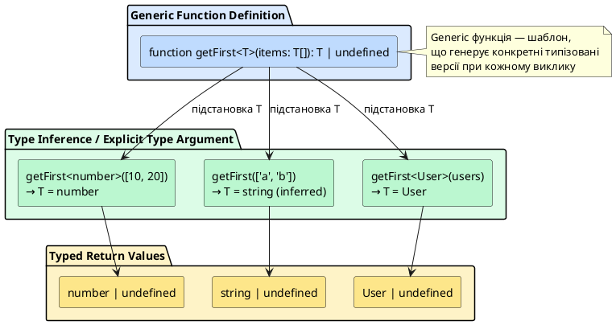
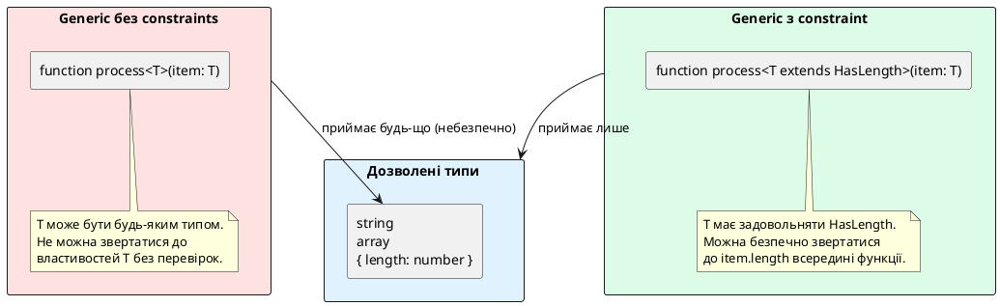

# Основи Generic типів

::card-group

::card{title="🎯 Мета розділу" icon="i-lucide-target"}

- Зрозуміти проблему дублювання коду при роботі з різними типами та необхідність параметризації.
- Опанувати синтаксис generic типів через кутові дужки `<T>` та конвенції іменування типових параметрів.
- Навчитися створювати generic функції, класи та інтерфейси для повторно використовуваного коду.
- Застосовувати constraints (обмеження) через `extends` для забезпечення мінімальних вимог до типових параметрів.
- Розуміти механізм type inference для generics та коли потрібно явно вказувати типові аргументи.
- Використовувати generic типи для побудови типобезпечних колекцій, утилітних функцій та API.

::

::card{title="🔑 Ключові терміни" icon="i-lucide-key"}

- **Generics (Узагальнені типи):** механізм параметризації типів, що дозволяє писати код, який працює з різними типами без втрати типобезпеки.
- **Type Parameter (Типовий параметр):** змінна типу, що оголошується у кутових дужках `<T>` та замінюється конкретним типом при використанні.
- **Type Argument (Типовий аргумент):** конкретний тип, що передається у generic конструкцію при виклику `Array<number>`.
- **Constraint (Обмеження):** вимога до типового параметра через `extends`, що гарантує наявність певних властивостей або методів.
- **Type Inference (Виведення типу):** автоматичне визначення типових аргументів компілятором на основі контексту виклику.

::

::

---

## Проблема дублювання коду: мотивація для generics

Припустимо, ви пишете функцію, що повертає перший елемент масиву. Спочатку працюємо з масивом чисел:

```typescript
function getFirstNumber(items: number[]): number | undefined {
  return items[0];
}

const firstNum = getFirstNumber([10, 20, 30]);
console.log(firstNum);  // 10
```

Функція працює, але лише для чисел. Що, якщо потрібна аналогічна функція для рядків?

```typescript
function getFirstString(items: string[]): string | undefined {
  return items[0];
}

const firstStr = getFirstString(['TypeScript', 'JavaScript', 'Python']);
console.log(firstStr);  // "TypeScript"
```

А тепер для об'єктів користувачів:

```typescript
interface User {
  id: string;
  name: string;
}

function getFirstUser(items: User[]): User | undefined {
  return items[0];
}

const users: User[] = [
  { id: 'user-1', name: 'Олександр' },
  { id: 'user-2', name: 'Марія' }
];
const firstUser = getFirstUser(users);
console.log(firstUser?.name);  // "Олександр"
```

Ми щойно написали **три ідентичні функції**, що відрізняються лише типами. Логіка однакова: `return items[0]`. Це класичний приклад **дублювання коду** (_code duplication_), що порушує принцип DRY (_Don't Repeat Yourself_).

### Спроба вирішення через any: втрата типобезпеки

Можна спробувати об'єднати всі три функції через тип `any`:

```typescript
function getFirst(items: any[]): any {
  return items[0];
}

const num = getFirst([10, 20, 30]);
const str = getFirst(['a', 'b', 'c']);
const user = getFirst(users);

// ❌ Проблема: TypeScript не знає реальних типів
console.log(num.toFixed(2));      // OK у runtime, але без перевірки типів
console.log(str.toUpperCase());   // OK у runtime, але без перевірки типів
console.log(user.name);           // OK у runtime, але без перевірки типів

// ❌ Помилки не виявляються:
console.log(num.toUpperCase());   // Runtime Error, але компілятор не попереджує
```

Функція стала універсальною, але **втратила типобезпеку**: компілятор не знає, що `getFirst([10, 20])` повертає `number`, а `getFirst(['a', 'b'])` повертає `string`. Ми втратили головну перевагу TypeScript — статичну перевірку типів.

### Рішення через generics: type-safe універсальність

**Generics** вирішують цю дилему, дозволяючи написати **одну універсальну функцію**, що зберігає інформацію про типи:

```typescript
function getFirst<T>(items: T[]): T | undefined {
  return items[0];
}

const num = getFirst<number>([10, 20, 30]);       // num: number | undefined
const str = getFirst<string>(['a', 'b', 'c']);    // str: string | undefined
const user = getFirst<User>(users);               // user: User | undefined

console.log(num?.toFixed(2));       // ✅ OK: TypeScript знає, що num — number
console.log(str?.toUpperCase());    // ✅ OK: TypeScript знає, що str — string
console.log(user?.name);            // ✅ OK: TypeScript знає, що user — User

// ❌ Компілятор ловить помилки:
// console.log(num?.toUpperCase()); // Error: Property 'toUpperCase' does not exist on type 'number'
```

Одна функція, три виклики з різними типами, повна типобезпека. Це сила generics.

::note
**Generic тип** — це "шаблон типу" або "функція на рівні типів". Так само, як звичайна функція приймає значення як параметри та повертає результат, generic конструкція приймає **типи** як параметри та "повертає" типізовану структуру. `getFirst<number>` — це виклик generic функції з типовим аргументом `number`.
::

---

## Синтаксис generic функцій: типові параметри

Generic функція оголошується через **типовий параметр** (_type parameter_) у кутових дужках `<T>` між іменем функції та списком параметрів:

```typescript
function functionName<TypeParameter>(param: TypeParameter): TypeParameter {
  // тіло функції
}
```

Типовий параметр `TypeParameter` — це **змінна типу**, яка може бути замінена будь-яким конкретним типом при виклику функції. За конвенцією використовуються однолітерні імена з великої літери: `T` (Type), `U`, `V` для додаткових параметрів, або більш описові імена: `TKey`, `TValue`, `TItem`.

### Базовий приклад: identity функція

**Identity функція** — канонічний приклад generic функції. Вона просто повертає те, що отримала, але зберігаючи тип:

```typescript
function identity<T>(value: T): T {
  return value;
}

const numIdentity = identity<number>(42);          // numIdentity: number
const strIdentity = identity<string>('Hello');     // strIdentity: string
const objIdentity = identity<User>({ id: '1', name: 'Іван' });  // objIdentity: User
```

Хоча функція виглядає тривіально (`return value`), вона демонструє ключову ідею: **тип вхідного значення зберігається у типі повернення**. Без generics довелося б або використовувати `any` (втрата типів), або писати окрему функцію для кожного типу (дублювання).

### Type inference: автоматичне виведення типових аргументів

У попередніх прикладах ми явно вказували типовий аргумент: `getFirst<number>(...)`. Але TypeScript часто може **автоматично вивести** (_infer_) типовий аргумент на основі переданих значень:

```typescript
function getFirst<T>(items: T[]): T | undefined {
  return items[0];
}

// Явне вказання типу:
const num1 = getFirst<number>([10, 20, 30]);

// Type inference: TypeScript виводить T = number з типу масиву [10, 20, 30]
const num2 = getFirst([10, 20, 30]);  // num2: number | undefined

// Inference працює для будь-яких типів:
const str = getFirst(['a', 'b']);     // str: string | undefined
const user = getFirst(users);         // user: User | undefined (якщо users має тип User[])
```

Компілятор аналізує аргументи функції: якщо передано `[10, 20, 30]`, він виводить тип масиву як `number[]`, отже `T = number`. Це робить код коротшим та зрозумілішим — явне вказання типу потрібне лише тоді, коли inference неможливий або дає неправильний результат.

::tip
**Коли вказувати типовий аргумент явно:**

- Коли передаєте порожній масив або значення, що не дозволяють однозначно визначити тип: `getFirst([])` → TypeScript виведе `unknown[]`.
- Коли хочете звузити тип: `getFirst<string | number>([...])` явно обмежує тип, навіть якщо масив містить лише числа.
- Коли викликаєте функцію без аргументів, які б дали підказку про тип.
::

### Кілька типових параметрів

Функція може приймати кілька типових параметрів, розділених комою:

```typescript
function pair<T, U>(first: T, second: U): [T, U] {
  return [first, second];
}

const numStr = pair<number, string>(42, 'answer');  // numStr: [number, string]
const boolObj = pair(true, { x: 10 });              // inference: [boolean, { x: number }]

console.log(numStr[0].toFixed(2));   // ✅ OK: TypeScript знає, що numStr[0] — number
console.log(numStr[1].toUpperCase());// ✅ OK: TypeScript знає, що numStr[1] — string
```

Функція `pair` створює кортеж з двох значень різних типів, зберігаючи інформацію про типи кожного елемента. Це корисно для функцій, що повертають кілька значень різних типів або працюють з гетерогенними структурами.

::plant-uml{alt="Generic функція як шаблон типу"}



::

---

## Generic інтерфейси та типи

Generics не обмежуються функціями — вони можуть параметризувати **інтерфейси**, **type aliases** та **класи**.

### Generic інтерфейси

Інтерфейс може мати типові параметри, що дозволяє описувати структури даних, які працюють з різними типами:

```typescript
interface Box<T> {
  value: T;
  getValue(): T;
  setValue(newValue: T): void;
}

const numberBox: Box<number> = {
  value: 42,
  getValue() {
    return this.value;
  },
  setValue(newValue: number) {
    this.value = newValue;
  }
};

const stringBox: Box<string> = {
  value: 'Hello',
  getValue() {
    return this.value;
  },
  setValue(newValue: string) {
    this.value = newValue;
  }
};

numberBox.setValue(100);
console.log(numberBox.getValue());  // 100

stringBox.setValue('TypeScript');
console.log(stringBox.getValue());  // "TypeScript"

// ❌ Type safety збережено:
// numberBox.setValue('text');  // Error: Argument of type 'string' is not assignable to parameter of type 'number'
```

Інтерфейс `Box<T>` — це шаблон для "коробки", що зберігає значення типу `T`. При створенні конкретного об'єкта ми вказуємо тип: `Box<number>` або `Box<string>`, і TypeScript забезпечує, що всі операції з `value` узгоджені з цим типом.

### Generic type aliases

Type aliases також підтримують параметризацію:

```typescript
type Result<T, E> = 
  | { success: true; data: T }
  | { success: false; error: E };

function fetchUser(id: string): Result<User, string> {
  if (id === 'valid-id') {
    return {
      success: true,
      data: { id: 'user-1', name: 'Олена' }
    };
  }
  return {
    success: false,
    error: 'Користувача не знайдено'
  };
}

const result = fetchUser('valid-id');

if (result.success) {
  console.log(result.data.name);  // ✅ TypeScript знає, що result.data має тип User
} else {
  console.log(result.error);      // ✅ TypeScript знає, що result.error — string
}
```

Тип `Result<T, E>` моделює операцію, що може завершитися успішно з даними типу `T` або невдало з помилкою типу `E`. Це типобезпечна альтернатива винятків або повернення `null`/`undefined`, що явно кодує можливість помилки у типі.

::note
Цей патерн популярний у функціональних мовах (Rust `Result<T, E>`, Haskell `Either a b`) та знаходить застосування у TypeScript для моделювання операцій, що можуть зазнати невдачі (мережеві запити, парсинг, валідація). Discriminated union (`success: true/false`) дозволяє TypeScript автоматично звужувати тип у гілках `if/else`.
::

### Вкладені generic типи

Generic типи можуть бути вкладені один в одного:

```typescript
type Response<T> = Result<T, string>;  // Response<T> — це Result<T, string>

interface ApiResponse<T> {
  statusCode: number;
  data: T | null;
  errors: string[];
}

type UserResponse = ApiResponse<User>;     // UserResponse має data: User | null
type ProductList = ApiResponse<Product[]>; // ProductList має data: Product[] | null

function handleResponse<T>(response: ApiResponse<T>): T | null {
  if (response.statusCode === 200 && response.data !== null) {
    return response.data;
  }
  console.error('Errors:', response.errors);
  return null;
}
```

Generic типи можуть служити будівельними блоками для складних типів, дозволяючи створювати багаторівневі абстракції без втрати типобезпеки.

---

## Generic класи: параметризовані колекції

Класи можуть бути generic, що дозволяє створювати типобезпечні колекції та структури даних.

### Приклад: Stack (стек)

```typescript
class Stack<T> {
  private items: T[] = [];

  push(item: T): void {
    this.items.push(item);
  }

  pop(): T | undefined {
    return this.items.pop();
  }

  peek(): T | undefined {
    return this.items[this.items.length - 1];
  }

  isEmpty(): boolean {
    return this.items.length === 0;
  }

  size(): number {
    return this.items.length;
  }
}

const numberStack = new Stack<number>();
numberStack.push(10);
numberStack.push(20);
numberStack.push(30);

console.log(numberStack.pop());   // 30
console.log(numberStack.peek());  // 20
console.log(numberStack.size());  // 2

// ❌ Type safety:
// numberStack.push('text');  // Error: Argument of type 'string' is not assignable to parameter of type 'number'

const stringStack = new Stack<string>();
stringStack.push('TypeScript');
stringStack.push('JavaScript');
console.log(stringStack.pop());   // "JavaScript"
```

Клас `Stack<T>` реалізує структуру даних "стек" (LIFO — Last In, First Out) для будь-якого типу `T`. Один клас, безліч можливих типів: `Stack<number>`, `Stack<string>`, `Stack<User>` — кожен з повною типобезпекою.

### Type inference у generic класах

При створенні екземпляра generic класу TypeScript може вивести типовий аргумент з аргументів конструктора, якщо конструктор приймає параметри типу `T`:

```typescript
class Container<T> {
  constructor(public value: T) {}

  getValue(): T {
    return this.value;
  }
}

// Явне вказання типу:
const container1 = new Container<number>(42);

// Type inference з аргумента конструктора:
const container2 = new Container(42);     // TypeScript виводить T = number
const container3 = new Container('text'); // TypeScript виводить T = string

console.log(container2.getValue().toFixed(2)); // ✅ OK: getValue() повертає number
```

Якщо конструктор не приймає аргументів типу `T` або inference неоднозначний, потрібно явно вказати типовий аргумент:

```typescript
const stack = new Stack<number>();  // конструктор порожній, тому треба вказати тип
```

### Generic класи та наслідування

Generic клас може бути успадкований:

```typescript
class BaseRepository<T> {
  protected items: T[] = [];

  add(item: T): void {
    this.items.push(item);
  }

  findAll(): T[] {
    return [...this.items];
  }
}

interface Product {
  id: string;
  name: string;
  price: number;
}

class ProductRepository extends BaseRepository<Product> {
  findByName(name: string): Product | undefined {
    return this.items.find(p => p.name === name);
  }

  findExpensive(minPrice: number): Product[] {
    return this.items.filter(p => p.price >= minPrice);
  }
}

const repo = new ProductRepository();
repo.add({ id: 'prod-1', name: 'Ноутбук', price: 25000 });
repo.add({ id: 'prod-2', name: 'Миша', price: 500 });

const laptop = repo.findByName('Ноутбук');
console.log(laptop?.price);  // 25000

const expensive = repo.findExpensive(10000);
console.log(expensive.length);  // 1
```

Клас `ProductRepository` успадковує `BaseRepository<Product>`, фіксуючи типовий параметр `T` як `Product`. Нащадок отримує типобезпечні методи `add` та `findAll` та додає власні методи, специфічні для продуктів.

::tip
Generic базові класи дозволяють створювати **універсальні репозиторії** (_repository pattern_) для роботи з даними. Замість дублювання CRUD-операцій для кожної сутності (User, Product, Order), ви пишете один `BaseRepository<T>` та успадковуєте його, додаючи лише специфічні запити.
::

---

## Constraints: обмеження типових параметрів

Іноді generic функція або клас потребує, щоб типовий параметр `T` мав певні властивості або методи. **Constraints** (обмеження) через ключове слово `extends` дозволяють накласти такі вимоги.

### Проблема без constraints

Припустимо, ми пишемо функцію, що виводить довжину чогось:

```typescript
function logLength<T>(item: T): void {
  // ❌ Error: Property 'length' does not exist on type 'T'
  console.log(item.length);
}
```

Компілятор не знає, що `T` має властивість `length`. Тип `T` може бути будь-яким: `number`, `boolean`, об'єкт без `length` — доступ до `item.length` небезпечний.

### Рішення: constraint через extends

Додамо обмеження, що `T` має мати властивість `length`:

```typescript
interface HasLength {
  length: number;
}

function logLength<T extends HasLength>(item: T): void {
  console.log(`Довжина: ${item.length}`);
}

logLength('TypeScript');       // ✅ OK: string має length
logLength([1, 2, 3, 4]);       // ✅ OK: array має length
logLength({ length: 10 });     // ✅ OK: об'єкт має length

// ❌ Error: Argument of type 'number' is not assignable to parameter of type 'HasLength'
// logLength(42);
```

Constraint `T extends HasLength` означає: "тип `T` має задовольняти інтерфейс `HasLength`, тобто мати властивість `length: number`". TypeScript перевіряє цю умову при виклику функції та дозволяє доступ до `item.length` всередині функції.

::note
**Structural typing знову працює:** Constraint `T extends HasLength` не вимагає, щоб тип `T` явно реалізовував `HasLength` через `implements`. Достатньо, щоб структура типу містила `length: number`. Рядки, масиви та будь-які об'єкти з полем `length` автоматично задовольняють цю вимогу.
::

### Constraint через конкретний тип або union

Можна обмежити типовий параметр конкретним типом або union типом:

```typescript
function processNumber<T extends number>(value: T): T {
  return value * 2 as T;  // множимо на 2 (приведення типу для збереження T)
}

const result = processNumber(10);  // result: 10 (TypeScript зберігає літеральний тип)

// ❌ Error:
// processNumber('text');  // Argument of type 'string' is not assignable to parameter of type 'number'
```

Або обмежити union типом:

```typescript
type Primitive = string | number | boolean;

function clone<T extends Primitive>(value: T): T {
  return value;  // примітиви копіюються за значенням
}

const num = clone(42);          // num: 42
const str = clone('Hello');     // str: "Hello"
const bool = clone(true);       // bool: true

// ❌ Error:
// clone({ x: 10 });  // Argument of type '{ x: number; }' is not assignable to parameter of type 'Primitive'
```

### Використання typof у constraints

Іноді потрібно обмежити типовий параметр на основі типу іншого параметра:

```typescript
function getProperty<T, K extends keyof T>(obj: T, key: K): T[K] {
  return obj[key];
}

const user = {
  id: 'user-1',
  name: 'Марія',
  age: 25
};

const userName = getProperty(user, 'name');  // userName: string
const userAge = getProperty(user, 'age');    // userAge: number

// ❌ Error: Argument of type '"address"' is not assignable to parameter of type '"id" | "name" | "age"'
// getProperty(user, 'address');
```

Constraint `K extends keyof T` означає: "тип `K` має бути одним із ключів типу `T`". Оператор `keyof T` генерує union літеральних типів ключів об'єкта `T`. Для `user` це `"id" | "name" | "age"`. Тип повернення `T[K]` — це тип відповідної властивості (indexed access type).

::plant-uml{alt="Generic constraints через extends"}



::

---

## Практичні патерни з generics

### Патерн: Repository з фільтрацією

```typescript
interface Entity {
  id: string;
}

class Repository<T extends Entity> {
  private items: T[] = [];

  add(item: T): void {
    this.items.push(item);
  }

  findById(id: string): T | undefined {
    return this.items.find(item => item.id === id);
  }

  findBy(predicate: (item: T) => boolean): T[] {
    return this.items.filter(predicate);
  }

  update(id: string, updates: Partial<T>): boolean {
    const item = this.findById(id);
    if (item) {
      Object.assign(item, updates);
      return true;
    }
    return false;
  }

  delete(id: string): boolean {
    const index = this.items.findIndex(item => item.id === id);
    if (index !== -1) {
      this.items.splice(index, 1);
      return true;
    }
    return false;
  }

  getAll(): T[] {
    return [...this.items];
  }
}

interface Product extends Entity {
  name: string;
  price: number;
  category: string;
}

const productRepo = new Repository<Product>();
productRepo.add({ id: 'prod-1', name: 'Ноутбук', price: 25000, category: 'Електроніка' });
productRepo.add({ id: 'prod-2', name: 'Стілець', price: 2000, category: 'Меблі' });

const electronics = productRepo.findBy(p => p.category === 'Електроніка');
console.log(electronics);  // [{ id: 'prod-1', name: 'Ноутбук', ... }]

productRepo.update('prod-1', { price: 23000 });
const laptop = productRepo.findById('prod-1');
console.log(laptop?.price);  // 23000
```

Constraint `T extends Entity` гарантує, що всі об'єкти у репозиторії мають поле `id`, що необхідне для методів `findById`, `update` та `delete`. Метод `findBy` приймає предикат типу `(item: T) => boolean`, що дозволяє гнучко фільтрувати за будь-яким критерієм. `Partial<T>` (utility type, який вивчатиметься у наступному розділі, але його можна використовувати інтуїтивно) робить всі поля `T` опціональними, дозволяючи оновлювати лише частину властивостей.

::warning
Зверніть увагу, що ми ще не вивчали `Partial<T>` детально (це utility type з наступного розділу), але використали його інтуїтивно: `Partial<T>` робить всі властивості типу `T` опціональними. Це дозволяє передавати у `update` лише ті поля, що потрібно оновити, без необхідності дублювати всю структуру.
::


### Патерн: Promise-wrapper з типобезпечною обробкою помилок

```typescript
type AsyncResult<T, E = Error> =
  | { status: 'success'; data: T }
  | { status: 'error'; error: E }
  | { status: 'pending' };

class AsyncOperation<T, E = Error> {
  private result: AsyncResult<T, E> = { status: 'pending' };

  constructor(private operation: Promise<T>) {
    this.execute();
  }

  private async execute(): Promise<void> {
    try {
      const data = await this.operation;
      this.result = { status: 'success', data };
    } catch (error) {
      this.result = { status: 'error', error: error as E };
    }
  }

  async getResult(): Promise<AsyncResult<T, E>> {
    // Чекаємо завершення операції
    await this.operation.catch(() => {});
    return this.result;
  }

  async unwrap(): Promise<T> {
    const result = await this.getResult();
    if (result.status === 'success') {
      return result.data;
    }
    throw result.status === 'error' ? result.error : new Error('Operation pending');
  }
}

// Використання:
async function fetchUserData(id: string): Promise<User> {
  const response = await fetch(`/api/users/${id}`);
  if (!response.ok) {
    throw new Error(`HTTP error: ${response.status}`);
  }
  return response.json();
}

const operation = new AsyncOperation<User>(fetchUserData('user-123'));

const result = await operation.getResult();
if (result.status === 'success') {
  console.log(`User: ${result.data.name}`);
} else if (result.status === 'error') {
  console.error(`Error: ${result.error.message}`);
}
```

Клас `AsyncOperation<T, E>` обгортає `Promise<T>` та надає зручний API для роботи з асинхронними операціями через discriminated union. Типовий параметр `T` представляє тип успішного результату, `E` — тип помилки (за замовчуванням `Error`). Метод `getResult()` повертає структурований результат замість throw/catch, що дозволяє обробляти помилки функціонально.

### Патерн: Builder з fluent interface

```typescript
class QueryBuilder<T> {
  private filters: Array<(item: T) => boolean> = [];
  private sortFn: ((a: T, b: T) => number) | null = null;
  private limitCount: number | null = null;

  where(predicate: (item: T) => boolean): QueryBuilder<T> {
    this.filters.push(predicate);
    return this;
  }

  sort(compareFn: (a: T, b: T) => number): QueryBuilder<T> {
    this.sortFn = compareFn;
    return this;
  }

  limit(count: number): QueryBuilder<T> {
    this.limitCount = count;
    return this;
  }

  execute(data: T[]): T[] {
    let result = [...data];

    // Застосовуємо фільтри
    for (const filter of this.filters) {
      result = result.filter(filter);
    }

    // Сортуємо
    if (this.sortFn) {
      result.sort(this.sortFn);
    }

    // Обмежуємо кількість
    if (this.limitCount !== null) {
      result = result.slice(0, this.limitCount);
    }

    return result;
  }
}

interface Product {
  id: string;
  name: string;
  price: number;
  category: string;
}

const products: Product[] = [
  { id: '1', name: 'Ноутбук', price: 25000, category: 'Електроніка' },
  { id: '2', name: 'Миша', price: 500, category: 'Електроніка' },
  { id: '3', name: 'Стілець', price: 2000, category: 'Меблі' },
  { id: '4', name: 'Монітор', price: 8000, category: 'Електроніка' },
  { id: '5', name: 'Стіл', price: 5000, category: 'Меблі' }
];

const query = new QueryBuilder<Product>()
  .where(p => p.category === 'Електроніка')
  .where(p => p.price > 1000)
  .sort((a, b) => b.price - a.price)  // за спаданням ціни
  .limit(2);

const result = query.execute(products);
console.log(result);
// [
//   { id: '1', name: 'Ноутбук', price: 25000, category: 'Електроніка' },
//   { id: '4', name: 'Монітор', price: 8000, category: 'Електроніка' }
// ]
```

`QueryBuilder<T>` реалізує патерн Builder з fluent interface для побудови складних запитів до колекцій даних. Кожен метод повертає `this`, дозволяючи ланцюжок викликів. Generic параметр `T` гарантує, що предикати у `where()` та функція порівняння у `sort()` працюють з правильним типом даних.

---

## Default типові параметри

Як і параметри функцій, типові параметри можуть мати **значення за замовчуванням**:

```typescript
class ApiClient<T = any> {
  async get(url: string): Promise<T> {
    const response = await fetch(url);
    return response.json();
  }

  async post(url: string, data: T): Promise<void> {
    await fetch(url, {
      method: 'POST',
      body: JSON.stringify(data),
      headers: { 'Content-Type': 'application/json' }
    });
  }
}

// Використання з явним типом:
const userClient = new ApiClient<User>();
const user = await userClient.get('/api/users/1');  // user: User

// Використання без типу (за замовчуванням any):
const genericClient = new ApiClient();
const data = await genericClient.get('/api/data');  // data: any
```

Default типовий параметр `T = any` дозволяє створювати екземпляр `ApiClient` без вказання типу, коли типобезпека не критична або тип даних невідомий заздалегідь. Проте краще явно вказувати тип для збереження переваг TypeScript.

::tip
Використовуйте default типові параметри для **backward compatibility** або **поступової міграції**: якщо у вас вже є клас без generics, додавання generic параметра з default значенням дозволяє зберегти сумісність з існуючим кодом, поступово додаючи типізацію у нових місцях.
::

---

## Обмеження та поширені помилки з generics

### Помилка 1: Забування про type variance та звуження типу

```typescript
function processItems<T>(items: T[]): T[] {
  // ❌ Помилка: спроба звузити тип всередині функції
  const numbers = items as number[];  // небезпечне приведення
  return numbers.map(n => n * 2) as T[];
}

const result = processItems([1, 2, 3]);  // працює
// const result2 = processItems(['a', 'b']);  // Runtime Error: NaN
```

**Проблема:** Generic функція має працювати з будь-яким типом `T`, але тіло функції припускає, що `T` завжди `number`. Це порушує контракт generic функції.

**Рішення:** Або додайте constraint `T extends number`, або перепишіть логіку так, щоб вона не залежала від конкретного типу:

```typescript
// ✅ Правильно: constraint
function processNumbers<T extends number>(items: T[]): number[] {
  return items.map(n => n * 2);
}

// ✅ Правильно: generic операція
function duplicateItems<T>(items: T[]): T[] {
  return items.flatMap(item => [item, item]);
}
```

### Помилка 2: Неправильне використання типових параметрів у static членах

```typescript
class Container<T> {
  private value: T;

  // ❌ Error: Static members cannot reference class type parameters
  // static defaultValue: T;

  constructor(value: T) {
    this.value = value;
  }

  // ✅ OK: інстанс-методи можуть використовувати T
  getValue(): T {
    return this.value;
  }
}
```

**Проблема:** Статичні члени належать класу як цілому, а не конкретному екземпляру. Типовий параметр `T` визначається лише при створенні екземпляра (`new Container<number>()`), тому статичні члени не мають доступу до `T`.

**Рішення:** Використовуйте окремий generic параметр для статичного методу або уникайте використання типових параметрів класу у статичних членах:

```typescript
class Container<T> {
  private value: T;

  constructor(value: T) {
    this.value = value;
  }

  // ✅ Статичний метод з власним generic параметром
  static create<U>(value: U): Container<U> {
    return new Container(value);
  }
}

const container = Container.create(42);  // Container<number>
```

### Помилка 3: Надмірне використання generics там, де достатньо union типів

```typescript
// ❌ Надмірно складно:
function process<T extends string | number>(value: T): T {
  return value;
}

// ✅ Простіше та зрозуміліше:
function process(value: string | number): string | number {
  return value;
}
```

**Проблема:** Generic додає складність без реальної користі. Якщо функція просто повертає те саме значення або не потребує збереження точного літерального типу, union тип простіший.

**Коли використовувати generic:** Коли потрібно **зберегти зв'язок між типами** (наприклад, тип вхідного параметра визначає тип повернення) або коли тип має **поширюватися через кілька операцій** (як у `Repository<T>` — тип проходить через `add`, `findById`, `update`).

::warning
Правило: використовуйте generics, коли тип параметра впливає на тип повернення або коли потрібна універсальна логіка для різних типів. Не додавайте generic "просто так" — кожен типовий параметр збільшує когнітивне навантаження читання коду.
::

---

## Generics у стандартній бібліотеці TypeScript

TypeScript активно використовує generics у вбудованих типах та інтерфейсах.

### Array<T> та ReadonlyArray<T>

Масиви у TypeScript — це generic тип `Array<T>`:

```typescript
// Два еквівалентні способи оголошення типу масиву:
const numbers1: number[] = [1, 2, 3];
const numbers2: Array<number> = [1, 2, 3];
```

Синтаксис `number[]` — це скорочення для `Array<number>`. Обидва варіанти ідентичні, але `Array<T>` виразніше показує generic природу масивів.

`ReadonlyArray<T>` — незмінна версія масиву:

```typescript
function processNumbers(nums: ReadonlyArray<number>): number {
  // nums.push(10);  // ❌ Error: Property 'push' does not exist on type 'readonly number[]'
  return nums.reduce((sum, n) => sum + n, 0);
}

const numbers: ReadonlyArray<number> = [1, 2, 3, 4, 5];
const sum = processNumbers(numbers);
console.log(sum);  // 15
```

`ReadonlyArray<T>` гарантує, що функція не змінює переданий масив, що важливо для **іммутабельних структур даних** та функціонального програмування.

### Promise<T>

`Promise` — generic тип, що представляє асинхронну операцію, яка завершиться значенням типу `T`:

```typescript
async function fetchUser(id: string): Promise<User> {
  const response = await fetch(`/api/users/${id}`);
  return response.json();  // TypeScript знає, що це Promise<User>
}

const userPromise: Promise<User> = fetchUser('user-123');

userPromise.then(user => {
  console.log(user.name);  // TypeScript знає, що user має тип User
});

// або через async/await:
const user = await fetchUser('user-123');  // user: User
```

Типовий параметр `Promise<T>` визначає тип значення, що буде доступне після `await` або у `.then()`. Це дозволяє типобезпечно працювати з асинхронним кодом.

### Record<K, V>

`Record<K, V>` створює тип об'єкта з ключами типу `K` та значеннями типу `V`:

```typescript
type UserRoles = Record<string, string[]>;

const roles: UserRoles = {
  'user-1': ['admin', 'editor'],
  'user-2': ['viewer'],
  'user-3': ['editor']
};

console.log(roles['user-1']);  // ['admin', 'editor']
```

Це еквівалент index signature `{ [key: string]: string[] }`, але більш виразний та зручний для композиції типів.

### Map<K, V> та Set<T>

Колекції `Map` та `Set` також generic:

```typescript
const userMap = new Map<string, User>();
userMap.set('user-1', { id: 'user-1', name: 'Олександр' });
userMap.set('user-2', { id: 'user-2', name: 'Марія' });

const user = userMap.get('user-1');  // user: User | undefined
if (user) {
  console.log(user.name);
}

const uniqueIds = new Set<string>();
uniqueIds.add('id-1');
uniqueIds.add('id-2');
uniqueIds.add('id-1');  // дублікат, не додасться

console.log(uniqueIds.size);  // 2
```

Generic параметри гарантують, що ключі та значення у `Map` мають правильні типи, а елементи `Set` однорідні.

---

## Практичний кейс: типобезпечний Event Emitter

Побудуємо типобезпечний event emitter, що використовує generics для забезпечення узгодженості типів подій та слухачів.

```typescript
type EventMap = Record<string, any>;

type EventListener<T> = (payload: T) => void;

class TypedEventEmitter<Events extends EventMap> {
  private listeners: {
    [K in keyof Events]?: Array<EventListener<Events[K]>>;
  } = {};

  on<K extends keyof Events>(event: K, listener: EventListener<Events[K]>): void {
    if (!this.listeners[event]) {
      this.listeners[event] = [];
    }
    this.listeners[event]!.push(listener);
  }

  off<K extends keyof Events>(event: K, listener: EventListener<Events[K]>): void {
    const eventListeners = this.listeners[event];
    if (eventListeners) {
      const index = eventListeners.indexOf(listener);
      if (index !== -1) {
        eventListeners.splice(index, 1);
      }
    }
  }

  emit<K extends keyof Events>(event: K, payload: Events[K]): void {
    const eventListeners = this.listeners[event];
    if (eventListeners) {
      eventListeners.forEach(listener => listener(payload));
    }
  }

  once<K extends keyof Events>(event: K, listener: EventListener<Events[K]>): void {
    const onceListener: EventListener<Events[K]> = (payload) => {
      listener(payload);
      this.off(event, onceListener);
    };
    this.on(event, onceListener);
  }
}

// Визначаємо карту подій для конкретного застосунку:
interface AppEvents {
  userLoggedIn: { userId: string; timestamp: Date };
  messageReceived: { from: string; text: string };
  dataLoaded: { count: number };
}

const emitter = new TypedEventEmitter<AppEvents>();

// ✅ Type-safe: TypeScript знає структуру кожної події
emitter.on('userLoggedIn', (payload) => {
  console.log(`User ${payload.userId} logged in at ${payload.timestamp}`);
});

emitter.on('messageReceived', (payload) => {
  console.log(`Message from ${payload.from}: ${payload.text}`);
});

// ✅ Перевірка типів при emit:
emitter.emit('userLoggedIn', {
  userId: 'user-123',
  timestamp: new Date()
});

emitter.emit('messageReceived', {
  from: 'Олександр',
  text: 'Привіт!'
});

// ❌ Error: Argument of type '{ count: string; }' is not assignable...
// emitter.emit('dataLoaded', { count: 'invalid' });

// ❌ Error: Argument of type '"unknownEvent"' is not assignable to parameter of type 'keyof AppEvents'
// emitter.emit('unknownEvent', {});
```

### Аналіз реалізації

- **Типовий параметр `Events extends EventMap`:** Приймає об'єкт-карту, де ключі — назви подій, значення — типи payload.
- **Mapped type `{ [K in keyof Events]?: ... }`:** Створює структуру, де для кожної події є масив слухачів відповідного типу.
- **Constraint `K extends keyof Events`:** У методах `on`, `off`, `emit` параметр `event` обмежений ключами `Events`, що запобігає передачі неіснуючих подій.
- **Indexed access type `Events[K]`:** Отримує тип payload для події `K`, гарантуючи, що слухач та `emit` використовують узгоджені типи.

Цей підхід забезпечує **повну типобезпеку** на рівні компіляції: неможливо підписатися на неіснуючу подію, неможливо передати payload невірного типу, неможливо забути обов'язкові поля у payload. Всі помилки ловляться до запуску коду.

::tip
Патерн typed event emitter широко використовується у фреймворках та бібліотеках (наприклад, Socket.IO з версії 4.x підтримує typed events). Він демонструє силу generics для побудови API, що **самодокументуються** та **безпечні за дизайном**.
::

---

## Коли НЕ використовувати generics

Generics — потужний інструмент, але не панацея. У деяких ситуаціях вони додають складність без реальної користі.

### Випадок 1: Функція не зберігає зв'язок між типами

```typescript
// ❌ Generic без сенсу:
function logMessage<T>(message: T): void {
  console.log(message);
}

// ✅ Простіше:
function logMessage(message: unknown): void {
  console.log(message);
}
```

Якщо тип параметра не впливає на тип повернення або логіку функції, generic не потрібен. Використовуйте `unknown` (безпечніший за `any`) для прийому будь-яких значень.

### Випадок 2: Union тип достатній

```typescript
// ❌ Надмірна параметризація:
function formatValue<T extends string | number>(value: T): string {
  return String(value);
}

// ✅ Union тип простіший:
function formatValue(value: string | number): string {
  return String(value);
}
```

Якщо немає потреби зберігати точний підтип (чи це string, чи number), union тип виразніший.

### Випадок 3: Один типовий параметр використовується лише раз

```typescript
// ❌ Generic використовується лише в одному місці:
function createId<T>(prefix: T): string {
  return `${prefix}-${Math.random()}`;
}

// ✅ Явний тип простіший:
function createId(prefix: string): string {
  return `${prefix}-${Math.random()}`;
}
```

Якщо типовий параметр з'являється лише в одному параметрі функції і не впливає на повернення, краще використовувати конкретний тип.

::warning
**Правило мінімальної складності:** Додавайте generic лише тоді, коли він вирішує реальну проблему (дублювання коду, втрата типобезпеки) або надає значну перевагу (повторне використання, гнучкість). Якщо простіше рішення (union, intersection, конкретний тип) працює, віддавайте йому перевагу.
::

---

## Підсумок: generics як основа переповторно використовуваного коду

Generic типи — один із найпотужніших інструментів TypeScript, що дозволяє писати **універсальний, типобезпечний та переповторно використовуваний код**. Вони усувають необхідність дублювання логіки для різних типів та забезпечують, що типи узгоджені по всьому коду.

### Ключові тези

- **Generics параметризують типи:** Замість створення окремих функцій/класів для кожного типу, пишемо один generic шаблон з типовим параметром `<T>`.
- **Type inference спрощує використання:** Часто TypeScript може автоматично вивести типовий аргумент з контексту, роблячи код коротшим.
- **Constraints через `extends` забезпечують мінімальні вимоги:** Коли generic код потребує певних властивостей або методів, використовуємо `T extends Interface`.
- **Generic класи для типобезпечних колекцій:** `Stack<T>`, `Repository<T>`, `EventEmitter<Events>` — класичні приклади generic класів.
- **Generic інтерфейси для абстрактних контрактів:** `Box<T>`, `Result<T, E>`, `ApiResponse<T>` — інтерфейси, що описують структури для різних типів даних.
- **Не зловживайте generics:** Використовуйте їх там, де є реальна потреба у параметризації типів, а не "на всяк випадок".

### Практичні рекомендації

::tip

**Іменування типових параметрів:**

- `T` (Type) — для єдиного generic параметра.
- `K, V` (Key, Value) — для пар ключ-значення (`Map<K, V>`, `Record<K, V>`).
- `E` (Element, Error) — для елементів колекцій або типів помилок.
- Описові імена для складних випадків: `TEntity`, `TResponse`, `TConfig`.

**Де застосовувати generics:**

- **Утилітні функції:** `map`, `filter`, `reduce`, `groupBy`, `unique` — функції, що працюють з колекціями будь-якого типу.
- **Data structures:** `Stack`, `Queue`, `LinkedList`, `Tree` — структури даних, що зберігають елементи довільного типу.
- **Repositories та DAL:** Абстракції доступу до даних, що працюють з різними сутностями.
- **API wrappers:** HTTP-клієнти, WebSocket обгортки, що повертають типізовані відповіді.
- **Event systems:** Typed event emitters, pub/sub системи з типізованими повідомленнями.

::

У наступному розділі ми вивчимо **enums** та **decorators** — інструменти для моделювання обмежених множин значень та метапрограмування, що доповнюють наш інструментарій для побудови надійних TypeScript застосунків.

---

::accordion

::accordion-item{label="❓ В чому різниця між `Array<T>` та `T[]`?" icon="i-lucide-help-circle"}

Це **повністю еквівалентні** способи оголошення типу масиву. `T[]` — це синтаксичний цукор для `Array<T>`. Обидва варіанти генерують ідентичний тип після компіляції.

Вибір між ними — питання стилю:
- `number[]`, `string[]` — коротший, часто використовується для простих типів.
- `Array<number>`, `Array<string>` — більш виразний для складних типів: `Array<User | Product>` читається краще, ніж `(User | Product)[]`.

Важливо бути **послідовним** у межах проєкту — оберіть один стиль та дотримуйтеся його.

::

::accordion-item{label="❓ Чи можна створити екземпляр типового параметра `new T()`?" icon="i-lucide-help-circle"}

Ні, TypeScript не дозволяє безпосередньо інстанціювати типовий параметр:

```typescript
function create<T>(): T {
  // ❌ Error: 'T' only refers to a type, but is being used as a value here
  return new T();
}
```

**Причина:** Типи стираються при компіляції у JavaScript. У runtime інформація про `T` недоступна, тому `new T()` не має сенсу.

**Рішення:** Передайте конструктор як параметр:

```typescript
function create<T>(constructor: new () => T): T {
  return new constructor();
}

class User {
  name = 'Default User';
}

const user = create(User);  // user: User
```

Або використовуйте фабричну функцію:

```typescript
function create<T>(factory: () => T): T {
  return factory();
}

const user = create(() => new User());
```

::

::accordion-item{label="❓ Як працює type inference для generic функцій з кількома параметрами?" icon="i-lucide-help-circle"}

TypeScript аналізує **всі** аргументи функції та намагається вивести типові параметри, що задовольняють усі обмеження:

```typescript
function merge<T, U>(obj1: T, obj2: U): T & U {
  return { ...obj1, ...obj2 };
}

const result = merge(
  { name: 'Іван' },
  { age: 30 }
);
// TypeScript виводить: T = { name: string }, U = { age: number }
// result: { name: string } & { age: number } = { name: string; age: number }
```

Якщо inference неоднозначний або неможливий, TypeScript видасть помилку або виведе `unknown`. У таких випадках вказуйте типові аргументи явно:

```typescript
const result = merge<{ name: string }, { age: number }>(
  { name: 'Іван' },
  { age: 30 }
);
```

::

::accordion-item{label="❓ Чи можна використовувати union тип як constraint?" icon="i-lucide-help-circle"}

Так, можна обмежити типовий параметр union типом:

```typescript
function process<T extends string | number>(value: T): T {
  // Можна безпечно викликати методи, спільні для string та number
  console.log(value.toString());
  return value;
}

process(42);          // ✅ OK: T = 42 (number literal type)
process('text');      // ✅ OK: T = "text" (string literal type)
// process(true);     // ❌ Error: boolean не входить у string | number
```

TypeScript перевіряє, що переданий тип `T` **assignable** до `string | number`. Всередині функції можна безпечно звертатися до методів та властивостей, спільних для всіх типів union.

::

::accordion-item{label="❓ Що таке generic utility types і чи вивчаємо їх у цьому розділі?" icon="i-lucide-help-circle"}

**Generic utility types** (`Partial<T>`, `Pick<T, K>`, `Omit<T, K>`, `Record<K, V>` тощо) — це вбудовані generic типи TypeScript, що виконують трансформації над іншими типами.

У цьому розділі ми вивчили **основи generics** (синтаксис, constraints, inference) та застосування їх у функціях, класах та інтерфейсах. **Utility types будуть детально розглянуті у наступному розділі** (04.utility-types.md), де ми вивчимо, як вони реалізовані та як їх використовувати для маніпуляції типами.

Ми використали `Partial<T>` інтуїтивно в одному прикладі, але його детальний розбір попереду.

::

::accordion-item{label="❓ Як перевірити у runtime, який тип має generic параметр?" icon="i-lucide-help-circle"}

**Неможливо напряму** — типи стираються при компіляції. У runtime JavaScript не має інформації про `T`:

```typescript
function check<T>(value: T): void {
  // ❌ Немає способу дізнатися, що таке T у runtime
  console.log(typeof T);  // Error: 'T' only refers to a type
}
```

**Рішення:** Використовуйте type guards, перевірку властивостей або передавайте додаткові метадані:

```typescript
function isString(value: unknown): value is string {
  return typeof value === 'string';
}

function process<T>(value: T): void {
  if (isString(value)) {
    console.log(value.toUpperCase());  // TypeScript знає, що value тут string
  }
}

// Або передайте тип як параметр:
function processWithType<T>(value: T, type: 'string' | 'number'): void {
  if (type === 'string') {
    console.log((value as any).toUpperCase());
  }
}
```

Для складних перевірок використовуйте бібліотеки валідації (Zod, io-ts, Yup), що виконують runtime перевірку структури даних.

::

::

