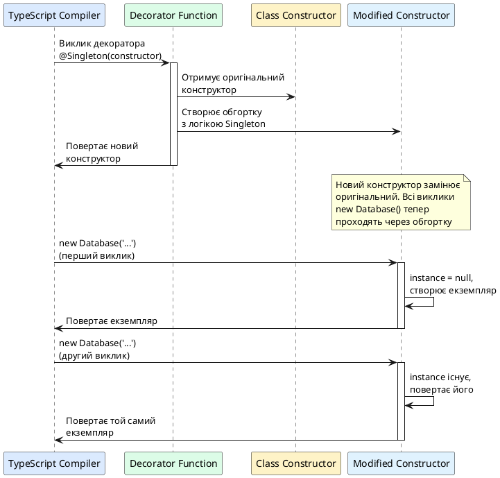

# Enums та Decorators

::card-group

::card{title="🎯 Мета розділу" icon="i-lucide-target"}

- Опанувати концепцію enums (перерахувань) для моделювання обмежених множин значень.
- Зрозуміти різницю між numeric, string та const enums та їх компіляцію у JavaScript.
- Освоїти механізм декораторів як інструмент метапрограмування для модифікації класів, методів та властивостей.
- Навчитися створювати власні декоратори для логування, валідації, кешування та контролю доступу.
- Усвідомити, як декоратори працюють на рівні JavaScript через дескриптори властивостей та рефлексію.
- Застосовувати декоратори для побудови декларативного та читабельного коду у стилі фреймворків.

::

::card{title="🔑 Ключові терміни" icon="i-lucide-key"}

- **Enum (Перерахування):** тип даних, що визначає іменовану множину констант.
- **Decorator (Декоратор):** спеціальна функція, що модифікує поведінку класів, методів, властивостей або параметрів під час оголошення.
- **Metadata (Метадані):** додаткова інформація про типи та структури, що може зберігатися та читатися у runtime через бібліотеку `reflect-metadata`.
- **Descriptor (Дескриптор):** об'єкт, що описує властивість об'єкта JavaScript (value, writable, enumerable, configurable).
- **Target (Ціль):** об'єкт (клас, прототип), до якого застосовується декоратор.

::

::

---

## Частина 1: Enums — моделювання обмежених множин

Перш ніж перейти до детального вивчення декораторів, розглянемо **enums** — простіший, але корисний інструмент TypeScript для роботи з фіксованими наборами значень.

### Проблема "магічних значень" у коді

У багатьох програмах існують поля, що можуть приймати лише **обмежену множину значень**. Наприклад, статус замовлення може бути лише "pending", "processing", "shipped" або "delivered". Без спеціальних інструментів розробники часто використовують **магічні рядки** (_magic strings_) або **магічні числа**:

```typescript
interface Order {
  id: string;
  status: string;  // ❌ Занадто широкий тип: може бути будь-який рядок
  total: number;
}

function processOrder(order: Order): void {
  if (order.status === 'pending') {      // ❌ Легко допустити друкарську помилку
    console.log('Обробка замовлення...');
    order.status = 'proccessing';        // ❌ Помилка у слові "processing" — компілятор не помітить
  }
}
```

**Проблеми цього підходу:**

- **Друкарські помилки:** `'proccessing'` замість `'processing'` — компілятор не виявить.
- **Відсутність автодоповнення:** IDE не підказує можливі значення.
- **Немає централізованого списку:** незрозуміло, які значення допустимі без перегляду коду.
- **Складно рефакторити:** зміна назви статусу вимагає пошуку всіх рядків у проєкті.

### Union літеральних типів як альтернатива

Ми вже знаємо один спосіб вирішення — **union літеральних типів**:

```typescript
type OrderStatus = 'pending' | 'processing' | 'shipped' | 'delivered';

interface Order {
  id: string;
  status: OrderStatus;  // ✅ Обмежений тип
  total: number;
}

function processOrder(order: Order): void {
  if (order.status === 'pending') {
    console.log('Обробка замовлення...');
    order.status = 'processing';  // ✅ Автодоповнення та перевірка
  }
}

// ❌ Error: Type '"invalid"' is not assignable to type 'OrderStatus'
// const order: Order = { id: '1', status: 'invalid', total: 100 };
```

Це рішення працює добре і часто переважне для простих випадків. Проте **enums** надають додаткові можливості:

- Централізоване оголошення з автоматичною нумерацією.
- Зворотнє відображення (reverse mapping) для numeric enums.
- Можливість використання як runtime значення (на відміну від type aliases, що стираються).

---

## Numeric Enums: перерахування з числовими значеннями

**Numeric enum** — це перерахування, де кожному члену присвоюється числове значення (автоматично або вручну).

### Оголошення numeric enum

```typescript
enum OrderStatus {
  Pending,      // 0
  Processing,   // 1
  Shipped,      // 2
  Delivered     // 3
}

const currentStatus: OrderStatus = OrderStatus.Processing;
console.log(currentStatus);  // 1

if (currentStatus === OrderStatus.Processing) {
  console.log('Замовлення обробляється');
}
```

За замовчуванням TypeScript присвоює членам enum послідовні числові значення, починаючи з 0. `OrderStatus.Pending` дорівнює 0, `OrderStatus.Processing` — 1, і так далі.

### Явне присвоєння значень

Можна явно вказати числові значення:

```typescript
enum HttpStatus {
  OK = 200,
  Created = 201,
  BadRequest = 400,
  Unauthorized = 401,
  Forbidden = 403,
  NotFound = 404,
  InternalServerError = 500
}

function handleResponse(status: HttpStatus): void {
  switch (status) {
    case HttpStatus.OK:
      console.log('Запит успішний');
      break;
    case HttpStatus.NotFound:
      console.log('Ресурс не знайдено');
      break;
    case HttpStatus.InternalServerError:
      console.log('Помилка сервера');
      break;
    default:
      console.log(`Статус: ${status}`);
  }
}

handleResponse(HttpStatus.NotFound);  // "Ресурс не знайдено"
```

Явні значення корисні, коли enum представляє реальні коди (HTTP статуси, коди помилок, прапорці бітових масок).

### Reverse mapping: отримання імені за значенням

Numeric enums мають **зворотнє відображення** (_reverse mapping_): можна отримати ім'я члена enum за його числовим значенням:

```typescript
enum Direction {
  Up,    // 0
  Down,  // 1
  Left,  // 2
  Right  // 3
}

const directionValue: number = Direction.Up;
const directionName: string = Direction[directionValue];

console.log(directionValue);  // 0
console.log(directionName);   // "Up"

// Ітерація по всіх членах enum:
for (const key in Direction) {
  if (isNaN(Number(key))) {  // Фільтруємо лише іменовані ключі
    console.log(`${key} = ${Direction[key as any]}`);
  }
}
// Виведе:
// Up = 0
// Down = 1
// Left = 2
// Right = 3
```

### Компіляція numeric enum у JavaScript

Розуміння того, як enum компілюється, допомагає усвідомити його поведінку:

```typescript
// TypeScript:
enum Color {
  Red,
  Green,
  Blue
}
```

```javascript
// Скомпільований JavaScript (ES5):
var Color;
(function (Color) {
    Color[Color["Red"] = 0] = "Red";
    Color[Color["Green"] = 1] = "Green";
    Color[Color["Blue"] = 2] = "Blue";
})(Color || (Color = {}));
```

Це IIFE (_Immediately Invoked Function Expression_), що створює об'єкт з двостороннім відображенням:

```javascript
Color = {
  0: "Red",
  1: "Green",
  2: "Blue",
  Red: 0,
  Green: 1,
  Blue: 2
};
```

Тому можна звертатися як `Color.Red` (отримаємо 0), так і `Color[0]` (отримаємо "Red").

::note
Reverse mapping існує лише для **numeric enums**. String enums (про які далі) не мають зворотнього відображення, оскільки немає однозначного способу створити зворотній ключ для рядка.
::

---

## String Enums: перерахування з рядковими значеннями

**String enum** — це перерахування, де кожному члену явно присвоюється рядкове значення.

### Оголошення string enum

```typescript
enum LogLevel {
  Debug = 'DEBUG',
  Info = 'INFO',
  Warning = 'WARNING',
  Error = 'ERROR',
  Critical = 'CRITICAL'
}

function log(level: LogLevel, message: string): void {
  console.log(`[${level}] ${message}`);
}

log(LogLevel.Error, 'Не вдалося підключитися до бази даних');
// Виведе: [ERROR] Не вдалося підключитися до бази даних
```

**Переваги string enums:**

- **Читабельність у runtime:** При логуванні або серіалізації значення `'ERROR'` зрозуміліше, ніж числовий код `3`.
- **Стабільність при рефакторингу:** Зміна порядку членів enum не впливає на значення (на відміну від numeric enum з автонумерацією).
- **Відсутність reverse mapping:** Менший розмір коду після компіляції (немає двостороннього об'єкта).

### Компіляція string enum у JavaScript

```typescript
// TypeScript:
enum LogLevel {
  Debug = 'DEBUG',
  Info = 'INFO'
}
```

```javascript
// Скомпільований JavaScript:
var LogLevel;
(function (LogLevel) {
    LogLevel["Debug"] = "DEBUG";
    LogLevel["Info"] = "INFO";
})(LogLevel || (LogLevel = {}));

// Результуючий об'єкт:
LogLevel = {
  Debug: "DEBUG",
  Info: "INFO"
};
```

Немає зворотнього відображення: `LogLevel['DEBUG']` поверне `undefined`, а не `'Debug'`.

::tip
**Коли використовувати string enums:**

- Коли значення мають бути **читабельними у логах** або **серіалізованими у JSON**.
- Коли enum представляє **ключі API** або **константи конфігурації**, що мають фіксовані рядкові значення.
- Коли потрібна **стабільність при зміні порядку** членів (наприклад, додавання нового статусу не повинно змінювати числові коди старих).
::

---

## Const Enums: оптимізація розміру коду

**Const enum** — це enum, позначений ключовим словом `const`, що повністю **видаляється** під час компіляції, а всі посилання замінюються інлайновими значеннями.

### Оголошення const enum

```typescript
const enum Direction {
  Up,
  Down,
  Left,
  Right
}

function move(direction: Direction): void {
  console.log(`Рух у напрямку: ${direction}`);
}

move(Direction.Up);
move(Direction.Left);
```

### Компіляція const enum

```javascript
// Скомпільований JavaScript:
function move(direction) {
    console.log("\u0420\u0443\u0445 \u0443 \u043D\u0430\u043F\u0440\u044F\u043C\u043A\u0443: " + direction);
}
move(0 /* Direction.Up */);
move(2 /* Direction.Left */);
```

Enum повністю зник! Всі звернення `Direction.Up` замінені на літеральні значення (`0`, `2`). Це зменшує розмір bundle та усуває runtime overhead створення об'єкта enum.

**Обмеження const enums:**

- **Немає runtime об'єкта:** Неможливо ітерувати по членах або використовувати reverse mapping (навіть для numeric).
- **Проблеми з ізоляцією модулів:** У деяких конфігураціях збірки (Babel, esbuild з `isolatedModules`) const enums можуть працювати некоректно.

::warning
Використовуйте const enums лише тоді, коли **гарантовано не потрібен runtime доступ** до enum (ітерація, reverse mapping, передача enum як значення у функції). Для більшості випадків звичайні enums безпечніші та передбачуваніші.
::

---

## Enums vs Union літеральних типів: коли що використовувати

| Характеристика | Enum | Union літеральних типів |
|---|---|---|
| **Runtime значення** | Так, існує об'єкт у JavaScript | Ні, стирається при компіляції |
| **Reverse mapping** | Так (для numeric enums) | Ні |
| **Ітерація по значеннях** | Можлива (для звичайних enums) | Неможлива без допоміжних структур |
| **Читабельність** | Централізоване оголошення | Розподілені по коду type aliases |
| **Розмір bundle** | Більший (якщо не const enum) | Менший (стираються) |
| **Сумісність з JS** | Можна використовувати у JS файлах | Лише TypeScript |

**Рекомендації:**

- **Використовуйте union літеральних типів**, якщо потрібна лише **типізація часу компіляції** та не потрібен runtime об'єкт.
- **Використовуйте enums**, якщо потрібно **ітерувати по значеннях**, **зворотнє відображення** або **передавати enum як значення**.
- **Використовуйте string enums** для **констант API** та **читабельних логів**.
- **Використовуйте const enums** для **оптимізації bundle size** у внутрішніх модулях, де не потрібен runtime доступ.

---

## Частина 2: Декоратори — метапрограмування у TypeScript

Тепер перейдемо до **декораторів** (_decorators_) — потужного механізму **метапрограмування**, що дозволяє модифікувати поведінку класів, методів, властивостей та параметрів **під час їх оголошення** (design-time), а не під час виконання (runtime).

### Що таке декоратор: концептуальне розуміння

**Декоратор** — це спеціальна функція, що викликається автоматично компілятором TypeScript при оголошенні класу, методу, властивості або параметра. Декоратор отримує інформацію про ціль (target), на яку він застосовується, та може **змінити її поведінку** або **додати метадані**.

Аналогія з реального світу: уявіть, що ви будуєте будинок (клас). Декоратори — це **анотації у кресленнях** ("цю кімнату зробити звукоізольованою", "встановити датчик руху на ці двері"). Ці анотації читаються будівельниками (TypeScript compiler, runtime framework) та впливають на кінцевий результат, але самі креслення (код класу) залишаються читабельними та чистими.

### Історичний контекст та статус декораторів

Декоратори є **експериментальною фічею** TypeScript, що базується на пропозиції TC39 (комітету, що розробляє стандарт JavaScript). Існує **дві версії декораторів**:

1. **Legacy Decorators (Stage 2):** Оригінальна реалізація TypeScript, що використовувалася роками (Angular, NestJS, TypeORM).
2. **Stage 3 Decorators (2023):** Нова специфікація TC39, що стала частиною ES2023 та підтримується TypeScript 5.0+.

У цьому курсі ми вивчаємо **legacy decorators**, оскільки вони широко використовуються у фреймворках та мають більш зрозумілий API для навчання. Для увімкнення legacy декораторів потрібна опція `experimentalDecorators: true` у `tsconfig.json`.

::note
**Чому декоратори експериментальні?** Синтаксис та поведінка декораторів змінювалися у процесі стандартизації JavaScript. TypeScript реалізував ранню версію пропозиції, яка стала де-факто стандартом у багатьох фреймворках, але офіційна специфікація JS дещо відрізняється. Проте legacy декоратори залишаються стабільними та підтримуються TypeScript для зворотної сумісності.
::

### Увімкнення декораторів у проєкті

У `tsconfig.json` додайте:

```json
{
  "compilerOptions": {
    "target": "ES2015",
    "experimentalDecorators": true,
    "emitDecoratorMetadata": true
  }
}
```

- `experimentalDecorators: true` — увімкнення підтримки декораторів.
- `emitDecoratorMetadata: true` — генерація метаданих про типи (потрібно для dependency injection).

---

## Декоратори класів: модифікація конструктора

**Декоратор класу** (_class decorator_) — це функція, що приймає конструктор класу як єдиний аргумент і може **змінити** або **замінити** конструктор.

### Синтаксис декоратора класу

```typescript
function MyDecorator(constructor: Function) {
  console.log('Декоратор викликано для класу:', constructor.name);
}

@MyDecorator
class User {
  constructor(public name: string) {}
}

// При завантаженні модуля (не при створенні екземпляра!) виведеться:
// "Декоратор викликано для класу: User"

const user = new User('Олександр');
```

**Ключовий момент:** Декоратор виконується **один раз** при **оголошенні класу** (завантаження модуля), а не при створенні кожного екземпляра. Це відбувається **до того**, як будь-хто викличе `new User()`.

### Простий приклад: логування створення класу

```typescript
function Logger(constructor: Function) {
  console.log(`Клас ${constructor.name} зареєстровано у системі`);
}

@Logger
class Product {
  constructor(public name: string, public price: number) {}
}

@Logger
class Order {
  constructor(public id: string, public items: Product[]) {}
}

// При завантаженні модуля виведеться:
// "Клас Product зареєстровано у системі"
// "Клас Order зареєстровано у системі"
```

Декоратор `@Logger` викликається для кожного класу, до якого він застосований, під час компіляції/завантаження.

### Модифікація прототипу класу через декоратор

Декоратор може додати нові методи або властивості до прототипу класу:

```typescript
function AddTimestamp(constructor: Function) {
  constructor.prototype.getTimestamp = function() {
    return new Date().toISOString();
  };
}

@AddTimestamp
class Event {
  constructor(public name: string) {}
}

const event = new Event('UserLoggedIn');

// TypeScript не знає про додані методи без явної типізації
console.log((event as any).getTimestamp());  // "2026-08-30T15:30:00.123Z"
```

**Проблема:** TypeScript не бачить метод `getTimestamp`, доданий декоратором, оскільки модифікація відбувається у runtime. Потрібна додаткова типізація (через декларації або type assertions).

### Заміна конструктора класу

Декоратор класу може **повернути новий конструктор**, що замінить оригінальний:

```typescript
function Singleton<T extends { new(...args: any[]): {} }>(constructor: T) {
  let instance: any = null;

  // Повертаємо новий конструктор, що обгортає оригінальний
  return class extends constructor {
    constructor(...args: any[]) {
      if (instance) {
        return instance;  // Повертаємо існуючий екземпляр
      }
      super(...args);
      instance = this;
    }
  };
}

@Singleton
class Database {
  constructor(public connectionString: string) {
    console.log('З'єднання з базою даних створено');
  }

  query(sql: string): void {
    console.log(`Виконання запиту: ${sql}`);
  }
}

const db1 = new Database('postgres://localhost/mydb');
// "З'єднання з базою даних створено"

const db2 = new Database('postgres://localhost/otherdb');
// Нічого не виведеться — повернувся db1

console.log(db1 === db2);  // true — обидві змінні вказують на один екземпляр
db2.query('SELECT * FROM users');  // Виконується на тому самому екземплярі
```

Декоратор `@Singleton` реалізує **патерн Singleton**: незалежно від того, скільки разів викликається `new Database()`, створюється лише один екземпляр, який повертається при всіх наступних викликах.

::plant-uml{alt="Життєвий цикл декоратора класу"}



::

---

## Фабрики декораторів: параметризація поведінки

Звичайні декоратори не можуть приймати параметри. Щоб передати налаштування у декоратор, використовуємо **фабрику декораторів** (_decorator factory_) — функцію, що повертає декоратор.

### Синтаксис фабрики декоратора

```typescript
function MyDecorator(config: string) {
  // Це фабрика — повертає справжній декоратор
  return function(constructor: Function) {
    console.log(`Декоратор з конфігурацією "${config}" застосовано до ${constructor.name}`);
  };
}

@MyDecorator('production')  // Виклик фабрики, що повертає декоратор
class ApiClient {
  // ...
}
```

**Різниця:** `@MyDecorator('production')` — це **виклик функції**, що повертає декоратор. TypeScript бачить результат виклику (функцію-декоратор) та застосовує її до класу.

### Приклад: декоратор з налаштуваним логуванням

```typescript
function LogClass(prefix: string = 'CLASS') {
  return function(constructor: Function) {
    console.log(`[${prefix}] Зареєстровано: ${constructor.name}`);

    // Додаємо метод toString
    constructor.prototype.toString = function() {
      return `[${prefix}] Instance of ${constructor.name}`;
    };
  };
}

@LogClass('SERVICE')
class UserService {
  findAll() {
    return [];
  }
}

@LogClass('REPOSITORY')
class UserRepository {
  save(user: any) {
    console.log('Збереження користувача');
  }
}

// При завантаженні:
// "[SERVICE] Зареєстровано: UserService"
// "[REPOSITORY] Зареєстровано: UserRepository"

const service = new UserService();
console.log(service.toString());  // "[SERVICE] Instance of UserService"
```

Фабрика `LogClass` приймає параметр `prefix` та повертає декоратор, що використовує цей префікс при логуванні.


---

## Декоратори методів: модифікація поведінки функцій

**Декоратор методу** (_method decorator_) застосовується до методів класу та отримує три аргументи:

1. **target** — прототип класу (для інстанс-методів) або конструктор класу (для статичних методів).
2. **propertyKey** — ім'я методу (рядок або Symbol).
3. **descriptor** — **дескриптор властивості** (_property descriptor_) методу.

### Що таке Property Descriptor

У JavaScript кожна властивість об'єкта має **дескриптор** (_descriptor_) — внутрішній об'єкт, що описує поведінку властивості:

```typescript
interface PropertyDescriptor {
  value?: any;               // Значення властивості (для data descriptor)
  get?(): any;               // Getter (для accessor descriptor)
  set?(v: any): void;        // Setter (для accessor descriptor)
  writable?: boolean;        // Чи можна змінювати value
  enumerable?: boolean;      // Чи з'являється у for...in, Object.keys()
  configurable?: boolean;    // Чи можна змінювати дескриптор або видаляти властивість
}
```

Для методу класу дескриптор зазвичай виглядає так:

```javascript
{
  value: function methodName() { ... },  // Сама функція
  writable: true,        // Можна перезаписати метод
  enumerable: false,     // Не з'являється у for...in (методи класу не enumerable)
  configurable: true     // Можна змінити дескриптор
}
```

Декоратор методу може **змінити** або **замінити** дескриптор, модифікуючи поведінку методу.

### Простий приклад: логування викликів методу

```typescript
function LogMethod(target: any, propertyKey: string, descriptor: PropertyDescriptor) {
  const originalMethod = descriptor.value;  // Зберігаємо оригінальний метод

  descriptor.value = function(...args: any[]) {
    console.log(`Виклик методу ${propertyKey} з аргументами:`, args);
    const result = originalMethod.apply(this, args);  // Викликаємо оригінальний метод
    console.log(`Метод ${propertyKey} повернув:`, result);
    return result;
  };

  return descriptor;
}

class Calculator {
  @LogMethod
  add(a: number, b: number): number {
    return a + b;
  }

  @LogMethod
  multiply(a: number, b: number): number {
    return a * b;
  }
}

const calc = new Calculator();
calc.add(5, 3);
// Виклик методу add з аргументами: [5, 3]
// Метод add повернув: 8

calc.multiply(4, 7);
// Виклик методу multiply з аргументами: [4, 7]
// Метод multiply повернув: 28
```

**Як це працює:**

1. Декоратор `@LogMethod` викликається при оголошенні методу `add`.
2. Він отримує дескриптор методу, що містить оригінальну функцію у `descriptor.value`.
3. Ми зберігаємо оригінальну функцію у змінній `originalMethod`.
4. Замінюємо `descriptor.value` новою функцією-обгорткою, що логує аргументи, викликає оригінальний метод через `apply` (щоб зберегти контекст `this`), логує результат та повертає його.
5. Повертаємо модифікований дескриптор.

::note
**Важливо використовувати `apply` або `call`:** При заміні методу новою функцією важливо викликати оригінальний метод з правильним контекстом `this`. Метод `apply(this, args)` викликає функцію з контекстом `this` поточного об'єкта та масивом аргументів. Без цього `this` всередині оригінального методу був би `undefined` або вказував на глобальний об'єкт.
::

### Практичний приклад: вимірювання часу виконання методу

```typescript
function MeasureTime(target: any, propertyKey: string, descriptor: PropertyDescriptor) {
  const originalMethod = descriptor.value;

  descriptor.value = async function(...args: any[]) {
    const start = performance.now();
    const result = await originalMethod.apply(this, args);  // Підтримка async методів
    const end = performance.now();
    const duration = (end - start).toFixed(2);

    console.log(`⏱️ Метод ${propertyKey} виконався за ${duration}ms`);
    return result;
  };

  return descriptor;
}

class DataService {
  @MeasureTime
  async fetchUsers(): Promise<any[]> {
    // Імітація запиту до API
    await new Promise(resolve => setTimeout(resolve, 1500));
    return [{ id: 1, name: 'Олександр' }, { id: 2, name: 'Марія' }];
  }

  @MeasureTime
  async processData(data: any[]): Promise<void> {
    await new Promise(resolve => setTimeout(resolve, 800));
    console.log(`Оброблено ${data.length} записів`);
  }
}

async function main() {
  const service = new DataService();
  const users = await service.fetchUsers();
  // ⏱️ Метод fetchUsers виконався за 1502.34ms

  await service.processData(users);
  // Оброблено 2 записів
  // ⏱️ Метод processData виконався за 802.18ms
}

main();
```

Декоратор `@MeasureTime` автоматично вимірює час виконання кожного методу, до якого він застосований. Це корисно для профілювання продуктивності без зміни коду самих методів.

### Декоратор з параметрами: кешування результатів методу

Створимо декоратор, що кешує результат методу на основі аргументів:

```typescript
function Memoize(target: any, propertyKey: string, descriptor: PropertyDescriptor) {
  const originalMethod = descriptor.value;
  const cache = new Map<string, any>();

  descriptor.value = function(...args: any[]) {
    const cacheKey = JSON.stringify(args);  // Ключ кешу — серіалізовані аргументи

    if (cache.has(cacheKey)) {
      console.log(`💾 Повернення з кешу для ${propertyKey}(${args})`);
      return cache.get(cacheKey);
    }

    console.log(`🔄 Обчислення ${propertyKey}(${args})`);
    const result = originalMethod.apply(this, args);
    cache.set(cacheKey, result);
    return result;
  };

  return descriptor;
}

class MathService {
  @Memoize
  fibonacci(n: number): number {
    if (n <= 1) return n;
    return this.fibonacci(n - 1) + this.fibonacci(n - 2);
  }

  @Memoize
  factorial(n: number): number {
    if (n <= 1) return 1;
    return n * this.factorial(n - 1);
  }
}

const math = new MathService();

console.log(math.fibonacci(10));
// 🔄 Обчислення fibonacci(10)
// 🔄 Обчислення fibonacci(9)
// ... (багато рекурсивних викликів)
// 55

console.log(math.fibonacci(10));
// 💾 Повернення з кешу для fibonacci(10)
// 55 (миттєво)

console.log(math.factorial(5));
// 🔄 Обчислення factorial(5)
// 🔄 Обчислення factorial(4)
// ... 
// 120

console.log(math.factorial(5));
// 💾 Повернення з кешу для factorial(5)
// 120
```

Декоратор `@Memoize` створює кеш для кожного методу. При повторному виклику з тими самими аргументами результат береться з кешу, а не обчислюється заново. Це драматично прискорює рекурсивні обчислення (fibonacci без мемоїзації має експоненційну складність).

::warning
**Обмеження:** Використання `JSON.stringify` для ключа кешу працює лише для простих типів даних (числа, рядки, прості об'єкти). Для складних об'єктів або функцій як аргументів потрібна більш складна логіка генерації ключа (наприклад, бібліотека `hash-it` або власна функція хешування).
::

---

## Декоратори властивостей: метадані та валідація

**Декоратор властивості** (_property decorator_) застосовується до полів класу і отримує два аргументи:

1. **target** — прототип класу (для інстанс-властивостей) або конструктор (для статичних).
2. **propertyKey** — ім'я властивості.

**Важливо:** Декоратори властивостей **не отримують дескриптор** і **не можуть безпосередньо змінити поведінку** властивості. Їх основне призначення — **додавання метаданих** через бібліотеку `reflect-metadata`, що використовуються іншими декораторами або фреймворками.

### Приклад: мітка обов'язкового поля

```typescript
const requiredFields = new Set<string>();

function Required(target: any, propertyKey: string) {
  requiredFields.add(propertyKey);
  console.log(`Поле ${propertyKey} позначено як обов'язкове`);
}

class CreateUserDto {
  @Required
  email!: string;

  @Required
  password!: string;

  firstName?: string;
  lastName?: string;
}

// При завантаженні класу:
// "Поле email позначено як обов'язкове"
// "Поле password позначено як обов'язкове"

console.log('Обов'язкові поля:', Array.from(requiredFields));
// ["email", "password"]
```

Декоратор `@Required` додає ім'я поля у глобальний набір `requiredFields`. Цю інформацію можна використати у функції валідації:

```typescript
function validate(obj: any): string[] {
  const errors: string[] = [];

  for (const field of requiredFields) {
    if (!obj[field]) {
      errors.push(`Поле ${field} є обов'язковим`);
    }
  }

  return errors;
}

const dto = new CreateUserDto();
dto.email = 'user@example.com';
// password відсутній

const errors = validate(dto);
console.log(errors);  // ["Поле password є обов'язковим"]
```

### Reflect Metadata: стандартизоване зберігання метаданих

Для більш структурованої роботи з метаданими використовується бібліотека **reflect-metadata**, що надає API для асоціювання метаданих з класами, методами та властивостями.

Встановлення:

```bash
npm install reflect-metadata
```

Імпорт у коді:

```typescript
import 'reflect-metadata';
```

API метаданих:

```typescript
// Збереження метаданих
Reflect.defineMetadata(metadataKey, metadataValue, target, propertyKey?);

// Читання метаданих
const value = Reflect.getMetadata(metadataKey, target, propertyKey?);

// Перевірка наявності метаданих
const hasMetadata = Reflect.hasMetadata(metadataKey, target, propertyKey?);

// Отримання всіх ключів метаданих
const keys = Reflect.getMetadataKeys(target, propertyKey?);
```

### Приклад: валідація з метаданими

```typescript
import 'reflect-metadata';

const REQUIRED_KEY = Symbol('required');
const MIN_LENGTH_KEY = Symbol('minLength');

function Required(target: any, propertyKey: string) {
  Reflect.defineMetadata(REQUIRED_KEY, true, target, propertyKey);
}

function MinLength(length: number) {
  return function(target: any, propertyKey: string) {
    Reflect.defineMetadata(MIN_LENGTH_KEY, length, target, propertyKey);
  };
}

class CreateUserDto {
  @Required
  @MinLength(5)
  email!: string;

  @Required
  @MinLength(8)
  password!: string;

  firstName?: string;
}

function validate(obj: any): string[] {
  const errors: string[] = [];
  const properties = Object.keys(obj.constructor.prototype);

  for (const prop of properties) {
    const isRequired = Reflect.getMetadata(REQUIRED_KEY, obj, prop);
    const minLength = Reflect.getMetadata(MIN_LENGTH_KEY, obj, prop);

    const value = (obj as any)[prop];

    if (isRequired && !value) {
      errors.push(`${prop} є обов'язковим`);
    }

    if (minLength && value && value.length < minLength) {
      errors.push(`${prop} має бути не менше ${minLength} символів`);
    }
  }

  return errors;
}

const dto = new CreateUserDto();
dto.email = 'usr';     // Занадто коротко
dto.password = '1234'; // Занадто коротко

const errors = validate(dto);
console.log(errors);
// ["email має бути не менше 5 символів", "password має бути не менше 8 символів"]
```

Метадані асоційовані з конкретними властивостями та можуть бути прочитані у runtime для виконання валідації, серіалізації, генерації документації тощо.

::tip
**Reflect Metadata у фреймворках:** Цей механізм активно використовується у NestJS (dependency injection, validation через `class-validator`), TypeORM (опис колонок БД), Angular (dependency injection). Розуміння reflect-metadata критично важливе для роботи з сучасними TypeScript фреймворками.
::

---

## Декоратори параметрів: анотація аргументів методів

**Декоратор параметра** (_parameter decorator_) застосовується до параметрів методів конструкторів або методів класу. Отримує три аргументи:

1. **target** — прототип класу або конструктор (для статичних методів).
2. **propertyKey** — ім'я методу (або `undefined` для параметрів конструктора).
3. **parameterIndex** — індекс параметра у списку параметрів (0-based).

Декоратори параметрів також використовуються переважно для **збереження метаданих**, а не зміни поведінки.

### Приклад: позначення параметрів для логування

```typescript
import 'reflect-metadata';

const LOG_PARAMS_KEY = Symbol('logParams');

function LogParam(target: any, propertyKey: string | symbol, parameterIndex: number) {
  const existingParams: number[] = Reflect.getOwnMetadata(LOG_PARAMS_KEY, target, propertyKey) || [];
  existingParams.push(parameterIndex);
  Reflect.defineMetadata(LOG_PARAMS_KEY, existingParams, target, propertyKey);
}

function LogMethodWithParams(target: any, propertyKey: string, descriptor: PropertyDescriptor) {
  const originalMethod = descriptor.value;
  const paramsToLog: number[] = Reflect.getOwnMetadata(LOG_PARAMS_KEY, target, propertyKey) || [];

  descriptor.value = function(...args: any[]) {
    console.log(`Виклик ${propertyKey}:`);
    paramsToLog.forEach(index => {
      console.log(`  Параметр ${index}: ${JSON.stringify(args[index])}`);
    });

    return originalMethod.apply(this, args);
  };

  return descriptor;
}

class UserService {
  @LogMethodWithParams
  createUser(
    @LogParam email: string,
    password: string,
    @LogParam role: string
  ): void {
    console.log(`Створення користувача з email: ${email}, роль: ${role}`);
  }
}

const service = new UserService();
service.createUser('admin@example.com', 'secret123', 'admin');
// Виклик createUser:
//   Параметр 0: "admin@example.com"
//   Параметр 2: "admin"
// Створення користувача з email: admin@example.com, роль: admin
```

Декоратор `@LogParam` позначає параметри, які потрібно логувати. Декоратор методу `@LogMethodWithParams` читає ці метадані та логує лише позначені параметри. Це дозволяє **вибірково логувати**, не виводячи чутливу інформацію (наприклад, паролі).

---

## Порядок застосування декораторів

Коли на один елемент (клас, метод, властивість) застосовано **кілька декораторів**, важливо розуміти порядок їх виконання.

### Порядок оцінки (Evaluation Order)

**Порядок оцінки** — це порядок, у якому викликаються **фабрики декораторів** (якщо декоратори є фабриками) або обчислюються вирази декораторів:

```typescript
function First() {
  console.log('1. Оцінка First');
  return function(target: any, propertyKey: string, descriptor: PropertyDescriptor) {
    console.log('4. Застосування First');
  };
}

function Second() {
  console.log('2. Оцінка Second');
  return function(target: any, propertyKey: string, descriptor: PropertyDescriptor) {
    console.log('3. Застосування Second');
  };
}

class Example {
  @First()
  @Second()
  method() {}
}

// Вивід:
// 1. Оцінка First
// 2. Оцінка Second
// 3. Застосування Second
// 4. Застосування First
```

**Правило:** Фабрики декораторів викликаються **зверху вниз** (у порядку написання), але **самі декоратори застосовуються знизу вгору** (від найближчого до елемента до найвіддаленішого).

Це аналогічно композиції функцій: `@First @Second method()` означає `First(Second(method))` — спочатку застосовується `Second`, потім `First` обгортає результат.

### Порядок для різних типів декораторів на одному класі

Якщо у класі є декоратори різних типів (клас, метод, властивість, параметр), порядок такий:

1. **Декоратори параметрів** (для кожного методу, зверху вниз)
2. **Декоратори методів / акцесорів / властивостей** (для кожного члена, зверху вниз)
3. **Декоратор класу**

```typescript
function ClassDecorator(constructor: Function) {
  console.log('5. Декоратор класу');
}

function PropertyDecorator(target: any, propertyKey: string) {
  console.log(`2. Декоратор властивості ${propertyKey}`);
}

function MethodDecorator(target: any, propertyKey: string, descriptor: PropertyDescriptor) {
  console.log(`4. Декоратор методу ${propertyKey}`);
}

function ParameterDecorator(target: any, propertyKey: string, parameterIndex: number) {
  console.log(`3. Декоратор параметра ${parameterIndex} методу ${propertyKey}`);
}

@ClassDecorator
class MyClass {
  @PropertyDecorator
  property!: string;

  @MethodDecorator
  method(@ParameterDecorator param: string) {}

  constructor(@ParameterDecorator arg: string) {
    console.log('6. Конструктор виконано');
  }
}

// Вивід:
// 1. Декоратор параметра 0 конструктора (constructor обробляється першим)
// 2. Декоратор властивості property
// 3. Декоратор параметра 0 методу method
// 4. Декоратор методу method
// 5. Декоратор класу
// 6. Конструктор виконано (коли створюється екземпляр)
```

::note
Розуміння порядку застосування критично важливе, коли декоратори **залежать один від одного**. Наприклад, якщо декоратор методу читає метадані, встановлені декоратором параметра, важливо, щоб декоратор параметра виконався першим (що і відбувається природно).
::

---

## Практичні патерни декораторів

### Патерн: Автоматична обробка помилок

```typescript
function CatchErrors(errorHandler?: (error: Error) => void) {
  return function(target: any, propertyKey: string, descriptor: PropertyDescriptor) {
    const originalMethod = descriptor.value;

    descriptor.value = async function(...args: any[]) {
      try {
        return await originalMethod.apply(this, args);
      } catch (error) {
        console.error(`❌ Помилка у методі ${propertyKey}:`, error);

        if (errorHandler) {
          errorHandler(error as Error);
        }

        // Можна кинути помилку далі або повернути default значення
        throw error;
      }
    };

    return descriptor;
  };
}

class PaymentService {
  @CatchErrors((error) => {
    // Відправка помилки у систему моніторингу
    console.log('📊 Відправка у Sentry:', error.message);
  })
  async processPayment(amount: number): Promise<void> {
    if (amount <= 0) {
      throw new Error('Сума платежу має бути більше 0');
    }

    // Імітація обробки платежу
    console.log(`💳 Платіж на ${amount} грн оброблено`);
  }
}

const service = new PaymentService();

service.processPayment(100);
// 💳 Платіж на 100 грн оброблено

service.processPayment(-50).catch(() => {});
// ❌ Помилка у методі processPayment: Error: Сума платежу має бути більше 0
// 📊 Відправка у Sentry: Сума платежу має бути більше 0
```

Декоратор `@CatchErrors` автоматично обгортає метод у `try/catch`, логує помилки та викликає користувацький обробник. Це усуває необхідність дублювати логіку обробки помилок у кожному методі.

### Патерн: Контроль доступу (Authorization)

```typescript
import 'reflect-metadata';

const ROLES_KEY = Symbol('roles');

function Roles(...roles: string[]) {
  return function(target: any, propertyKey: string, descriptor: PropertyDescriptor) {
    Reflect.defineMetadata(ROLES_KEY, roles, target, propertyKey);
    return descriptor;
  };
}

function CheckAccess(getCurrentUserRole: () => string) {
  return function(target: any, propertyKey: string, descriptor: PropertyDescriptor) {
    const originalMethod = descriptor.value;
    const requiredRoles: string[] = Reflect.getMetadata(ROLES_KEY, target, propertyKey) || [];

    descriptor.value = function(...args: any[]) {
      const userRole = getCurrentUserRole();

      if (requiredRoles.length > 0 && !requiredRoles.includes(userRole)) {
        throw new Error(`Доступ заборонено. Потрібна одна з ролей: ${requiredRoles.join(', ')}`);
      }

      return originalMethod.apply(this, args);
    };

    return descriptor;
  };
}

// Симуляція поточного користувача
let currentUser = { role: 'user' };

class AdminService {
  @Roles('admin', 'moderator')
  @CheckAccess(() => currentUser.role)
  deleteUser(userId: string): void {
    console.log(`🗑️ Користувача ${userId} видалено`);
  }

  @Roles('admin')
  @CheckAccess(() => currentUser.role)
  resetDatabase(): void {
    console.log('🔄 База даних скинута');
  }
}

const adminService = new AdminService();

currentUser.role = 'admin';
adminService.deleteUser('user-123');  // ✅ OK: admin має доступ
// 🗑️ Користувача user-123 видалено

currentUser.role = 'user';
try {
  adminService.deleteUser('user-456');  // ❌ Помилка
} catch (error) {
  console.log((error as Error).message);
  // "Доступ заборонено. Потрібна одна з ролей: admin, moderator"
}
```

Декоратор `@Roles` позначає, які ролі потрібні для виклику методу. Декоратор `@CheckAccess` читає ці метадані та перевіряє роль поточного користувача перед виконанням методу. Це **декларативний контроль доступу** — правила описані через декоратори, а не розкидані по коду методів.

### Патерн: Retry логіка з експоненційною затримкою

```typescript
function Retry(maxAttempts: number = 3, delayMs: number = 1000) {
  return function(target: any, propertyKey: string, descriptor: PropertyDescriptor) {
    const originalMethod = descriptor.value;

    descriptor.value = async function(...args: any[]) {
      let lastError: any;

      for (let attempt = 1; attempt <= maxAttempts; attempt++) {
        try {
          console.log(`🔄 Спроба ${attempt} виклику ${propertyKey}`);
          return await originalMethod.apply(this, args);
        } catch (error) {
          lastError = error;
          console.log(`❌ Спроба ${attempt} невдала:`, (error as Error).message);

          if (attempt < maxAttempts) {
            const delay = delayMs * Math.pow(2, attempt - 1);  // Експоненційна затримка
            console.log(`⏳ Очікування ${delay}ms перед наступною спробою...`);
            await new Promise(resolve => setTimeout(resolve, delay));
          }
        }
      }

      throw new Error(`Метод ${propertyKey} зазнав невдачі після ${maxAttempts} спроб. Остання помилка: ${lastError.message}`);
    };

    return descriptor;
  };
}

class ApiClient {
  private attempts = 0;

  @Retry(3, 500)
  async fetchData(): Promise<string> {
    this.attempts++;

    // Імітація нестабільного API: перші 2 спроби — помилка
    if (this.attempts < 3) {
      throw new Error('Тимчасова помилка мережі');
    }

    return 'Дані успішно отримані';
  }
}

async function main() {
  const client = new ApiClient();
  try {
    const data = await client.fetchData();
    console.log('✅', data);
  } catch (error) {
    console.log('💥', (error as Error).message);
  }
}

main();
// 🔄 Спроба 1 виклику fetchData
// ❌ Спроба 1 невдала: Тимчасова помилка мережі
// ⏳ Очікування 500ms перед наступною спробою...
// 🔄 Спроба 2 виклику fetchData
// ❌ Спроба 2 невдала: Тимчасова помилка мережі
// ⏳ Очікування 1000ms перед наступною спробою...
// 🔄 Спроба 3 виклику fetchData
// ✅ Дані успішно отримані
```

Декоратор `@Retry` автоматично повторює виклик методу у разі помилки з експоненційною затримкою між спробами. Це типовий патерн для роботи з нестабільними зовнішніми сервісами (API, бази даних, черги повідомлень).

---

## Декоратори у NestJS: реальний приклад з фреймворку

Щоб показати, як декоратори використовуються у реальних застосунках, розглянемо приклад з **NestJS** — популярного TypeScript фреймворку для побудови серверних застосунків.

### HTTP контролер з декораторами

```typescript
import { Controller, Get, Post, Body, Param, UseGuards } from '@nestjs/common';
import { AuthGuard } from './auth.guard';
import { Roles } from './roles.decorator';
import { RolesGuard } from './roles.guard';

@Controller('users')  // Декоратор класу: базовий маршрут /users
export class UsersController {
  
  @Get()  // Декоратор методу: GET /users
  findAll(): string {
    return 'Список всіх користувачів';
  }

  @Get(':id')  // GET /users/:id
  findOne(@Param('id') id: string): string {  // Декоратор параметра
    return `Користувач з ID ${id}`;
  }

  @Post()  // POST /users
  @Roles('admin')  // Власний декоратор: доступ лише для admin
  @UseGuards(AuthGuard, RolesGuard)  // Middleware для перевірки авторизації
  create(@Body() createUserDto: any): string {  // Декоратор параметра
    return `Створено користувача: ${createUserDto.name}`;
  }
}
```

**Що відбувається:**

- `@Controller('users')` реєструє клас як HTTP контролер з базовим шляхом `/users`.
- `@Get()`, `@Post()` позначають методи як обробники відповідних HTTP маршрутів.
- `@Param('id')`, `@Body()` вказують, звідки брати значення для параметрів методу (параметри URL, тіло запиту).
- `@Roles('admin')` та `@UseGuards(...)` додають middleware для перевірки прав доступу.

Весь цей функціонал **декларативний** — поведінка описується через декоратори, а фреймворк автоматично генерує необхідний код для маршрутизації, валідації та авторизації.

### Dependency Injection через декоратори

```typescript
import { Injectable } from '@nestjs/common';

@Injectable()  // Декоратор класу: позначає клас як injectable
export class UsersService {
  private users = [];

  findAll() {
    return this.users;
  }

  create(user: any) {
    this.users.push(user);
  }
}

@Controller('users')
export class UsersController {
  // Dependency injection через конструктор
  constructor(private usersService: UsersService) {}

  @Get()
  findAll() {
    return this.usersService.findAll();
  }
}
```

Декоратор `@Injectable()` позначає клас `UsersService` як провайдер, що може бути ін'єктований в інші класи. NestJS автоматично створює екземпляр `UsersService` та передає його у конструктор `UsersController`. Це **dependency injection на рівні фреймворку**, реалізований через декоратори та reflect-metadata.

::tip
**Навіщо вивчати декоратори детально?** Розуміння механізму декораторів критично важливе для роботи з сучасними TypeScript фреймворками (NestJS, TypeORM, Angular, InversifyJS). Без знання того, як декоратори працюють "під капотом", ви не зможете ефективно налагоджувати проблеми, створювати власні декоратори або глибоко розуміти архітектуру фреймворку.
::


---

## Створення власного декоратора: повний цикл розробки

Розглянемо детальний процес створення власного декоратора **від ідеї до реалізації**.

### Завдання: декоратор для rate limiting

**Мета:** Обмежити частоту викликів методу — не більше N разів за T секунд. Якщо ліміт перевищено, кидати помилку.

**Крок 1: Визначення API декоратора**

```typescript
@RateLimit(5, 10000)  // Максимум 5 викликів за 10 секунд
async someMethod() {
  // ...
}
```

**Крок 2: Структура даних для зберігання викликів**

Нам потрібно зберігати мітки часу останніх викликів для кожного методу. Використаємо `WeakMap` для асоціювання даних з методами:

```typescript
interface CallRecord {
  timestamps: number[];  // Мітки часу викликів
}

const rateLimitStore = new WeakMap<any, Map<string, CallRecord>>();
```

**Крок 3: Реалізація декоратора**

```typescript
function RateLimit(maxCalls: number, windowMs: number) {
  return function(target: any, propertyKey: string, descriptor: PropertyDescriptor) {
    const originalMethod = descriptor.value;

    descriptor.value = function(...args: any[]) {
      // Отримуємо або створюємо запис для цього екземпляра
      if (!rateLimitStore.has(this)) {
        rateLimitStore.set(this, new Map());
      }

      const instanceStore = rateLimitStore.get(this)!;

      if (!instanceStore.has(propertyKey)) {
        instanceStore.set(propertyKey, { timestamps: [] });
      }

      const record = instanceStore.get(propertyKey)!;
      const now = Date.now();

      // Видаляємо старі мітки часу поза вікном
      record.timestamps = record.timestamps.filter(
        timestamp => now - timestamp < windowMs
      );

      // Перевіряємо ліміт
      if (record.timestamps.length >= maxCalls) {
        const oldestCall = record.timestamps[0];
        const waitTime = Math.ceil((windowMs - (now - oldestCall)) / 1000);

        throw new Error(
          `Rate limit exceeded for ${propertyKey}. ` +
          `Max ${maxCalls} calls per ${windowMs}ms. ` +
          `Retry in ${waitTime} seconds.`
        );
      }

      // Додаємо поточний виклик
      record.timestamps.push(now);

      // Викликаємо оригінальний метод
      return originalMethod.apply(this, args);
    };

    return descriptor;
  };
}
```

**Крок 4: Тестування декоратора**

```typescript
class ApiService {
  @RateLimit(3, 5000)  // Максимум 3 виклики за 5 секунд
  fetchData(endpoint: string): void {
    console.log(`✅ Запит до ${endpoint} виконано`);
  }
}

const service = new ApiService();

// Перші три виклики — OK
service.fetchData('/users');     // ✅
service.fetchData('/products');  // ✅
service.fetchData('/orders');    // ✅

// Четвертий виклик — ліміт перевищено
try {
  service.fetchData('/settings');
} catch (error) {
  console.log('❌', (error as Error).message);
  // Rate limit exceeded for fetchData. Max 3 calls per 5000ms. Retry in 5 seconds.
}

// Через 5 секунд можна знову викликати
setTimeout(() => {
  service.fetchData('/settings');  // ✅ Знову працює
}, 5000);
```

**Крок 5: Покращення — додавання логування**

```typescript
function RateLimit(maxCalls: number, windowMs: number, options?: { logCalls?: boolean }) {
  return function(target: any, propertyKey: string, descriptor: PropertyDescriptor) {
    const originalMethod = descriptor.value;

    descriptor.value = function(...args: any[]) {
      if (!rateLimitStore.has(this)) {
        rateLimitStore.set(this, new Map());
      }

      const instanceStore = rateLimitStore.get(this)!;

      if (!instanceStore.has(propertyKey)) {
        instanceStore.set(propertyKey, { timestamps: [] });
      }

      const record = instanceStore.get(propertyKey)!;
      const now = Date.now();

      record.timestamps = record.timestamps.filter(
        timestamp => now - timestamp < windowMs
      );

      if (record.timestamps.length >= maxCalls) {
        const oldestCall = record.timestamps[0];
        const waitTime = Math.ceil((windowMs - (now - oldestCall)) / 1000);

        if (options?.logCalls) {
          console.warn(
            `⚠️ Rate limit для ${propertyKey}: ` +
            `${record.timestamps.length}/${maxCalls} за останні ${windowMs}ms`
          );
        }

        throw new Error(
          `Rate limit exceeded for ${propertyKey}. ` +
          `Retry in ${waitTime} seconds.`
        );
      }

      record.timestamps.push(now);

      if (options?.logCalls) {
        console.log(
          `📊 Rate limit для ${propertyKey}: ` +
          `${record.timestamps.length}/${maxCalls} викликів`
        );
      }

      return originalMethod.apply(this, args);
    };

    return descriptor;
  };
}

class MonitoredService {
  @RateLimit(3, 5000, { logCalls: true })
  performAction(): void {
    console.log('🚀 Дію виконано');
  }
}

const monitored = new MonitoredService();
monitored.performAction();
// 📊 Rate limit для performAction: 1/3 викликів
// 🚀 Дію виконано

monitored.performAction();
// 📊 Rate limit для performAction: 2/3 викликів
// 🚀 Дію виконано
```

### Аналіз реалізації

- **WeakMap** для зберігання стану: Використання `WeakMap` гарантує, що коли екземпляр класу більше не використовується, його метадані автоматично видаляються garbage collector.
- **Фільтрація старих міток часу:** Перед перевіркою ліміту видаляємо виклики, що вийшли за межі вікна `windowMs`, щоб лише останні N викликів враховувалися.
- **Інформативні помилки:** Повідомлення про помилку вказує, скільки секунд потрібно почекати перед наступним викликом.
- **Опціональне логування:** Параметр `options` дозволяє увімкнути детальне логування для моніторингу.

::note
Цей декоратор працює **на рівні екземпляра класу**: кожен екземпляр має власні лічильники. Якщо потрібен **глобальний rate limit** (для всіх екземплярів класу), використовуйте звичайний `Map` замість `WeakMap` та асоціюйте лічильники з `target.constructor` (конструктором класу).
::

---

## Комбінування декораторів: складні сценарії

У реальних застосунках часто потрібно застосовувати **кілька декораторів** до одного методу для комбінування різної функціональності.

### Приклад: метод з логуванням, кешуванням та rate limiting

```typescript
class ProductService {
  @LogMethod           // Логує виклики
  @MeasureTime         // Вимірює час виконання
  @Memoize             // Кешує результати
  @RateLimit(10, 60000)  // Максимум 10 викликів за хвилину
  @CatchErrors()       // Обробляє помилки
  async getProductById(id: string): Promise<any> {
    // Імітація запиту до БД
    await new Promise(resolve => setTimeout(resolve, 300));

    if (id === 'invalid') {
      throw new Error('Продукт не знайдено');
    }

    return {
      id,
      name: `Product ${id}`,
      price: Math.random() * 1000
    };
  }
}

const service = new ProductService();

// Перший виклик
await service.getProductById('prod-123');
// Виклик методу getProductById з аргументами: ["prod-123"]
// 🔄 Обчислення getProductById(prod-123)
// 📊 Rate limit для getProductById: 1/10 викликів
// Метод getProductById повернув: { id: 'prod-123', name: 'Product prod-123', ... }
// ⏱️ Метод getProductById виконався за 302.45ms

// Другий виклик з тими самими аргументами
await service.getProductById('prod-123');
// Виклик методу getProductById з аргументами: ["prod-123"]
// 💾 Повернення з кешу для getProductById(prod-123)
// 📊 Rate limit для getProductById: 2/10 викликів
// Метод getProductById повернув: { id: 'prod-123', name: 'Product prod-123', ... }
// ⏱️ Метод getProductById виконався за 0.23ms  (миттєво через кеш)
```

**Порядок застосування:** Декоратори застосовуються **знизу вгору**:

1. `@CatchErrors()` — найглибша обгортка, ловить помилки з усіх інших декораторів.
2. `@RateLimit(...)` — перевіряє ліміт викликів.
3. `@Memoize` — перевіряє кеш, якщо є — повертає без виклику методу.
4. `@MeasureTime` — вимірює час (включаючи роботу кешу).
5. `@LogMethod` — логує аргументи та результат.

Порядок важливий: якщо `@Memoize` був би нижче за `@RateLimit`, кешовані виклики все одно рахувалися б у rate limit. Розміщення `@Memoize` вище дозволяє обійти всі перевірки для кешованих результатів.

::tip
**Як вибирати порядок декораторів:**

1. **Найглибше** (найближче до методу) — декоратори, що змінюють логіку виконання (кешування, retry).
2. **Середина** — декоратори перевірок (rate limit, авторизація, валідація).
3. **Найзовнішні** (найдальші від методу) — декоратори моніторингу (логування, вимірювання часу, обробка помилок).

Така структура гарантує, що перевірки виконуються перед обчисленням, а моніторинг охоплює всю обробку.
::

---

## Обмеження та підводні камені декораторів

Попри потужність, декоратори мають обмеження та можуть призвести до складних помилок, якщо не розуміти їх поведінку.

### Обмеження 1: Типізація модифікованих методів

TypeScript не відстежує зміни сигнатури методу, зроблені декоратором:

```typescript
function ChangeReturnType(target: any, propertyKey: string, descriptor: PropertyDescriptor) {
  const originalMethod = descriptor.value;

  descriptor.value = function(...args: any[]) {
    originalMethod.apply(this, args);
    return 'modified';  // Повертаємо рядок замість оригінального типу
  };

  return descriptor;
}

class Example {
  @ChangeReturnType
  getNumber(): number {  // TypeScript думає, що повертається number
    return 42;
  }
}

const ex = new Example();
const result = ex.getNumber();  // TypeScript тип: number, але фактично: string

console.log(result.toFixed(2));  // Runtime Error: result.toFixed is not a function
```

**Проблема:** Декоратор змінив тип повернення з `number` на `string`, але TypeScript не знає про це. Компілятор пропустить виклик `toFixed()`, але у runtime виникне помилка.

**Рішення:** Якщо декоратор змінює сигнатуру, документуйте це та використовуйте type assertions або окремі типи:

```typescript
type ModifiedMethod = (...args: any[]) => string;

const ex = new Example();
const result = (ex.getNumber as unknown as ModifiedMethod)();  // явна типізація
```

Або краще — **не змінюйте сигнатури методів** декораторами, лише обгортайте поведінку.

### Обмеження 2: Проблеми з arrow functions

Декоратори методів не працюють з **arrow function полями класу**:

```typescript
class Example {
  @LogMethod
  regularMethod() {
    console.log('Звичайний метод');
  }

  // ❌ Декоратор НЕ спрацює для arrow function поля
  @LogMethod
  arrowMethod = () => {
    console.log('Arrow function');
  };
}
```

**Чому:** Arrow function поля не додаються до **прототипу** класу — вони створюються у **конструкторі** для кожного екземпляра. Декоратори методів працюють з прототипом, тому не можуть модифікувати arrow functions.

**Рішення:** Використовуйте звичайні методи замість arrow functions, якщо потрібні декоратори. Якщо критично важливо зберегти контекст `this` (наприклад, для React компонентів), використовуйте `bind` у конструкторі або метод `.bind(this)`.

### Обмеження 3: Performance overhead

Кожен декоратор додає шар обгортки навколо методу. Якщо метод викликається дуже часто (тисячі разів у секунду), накладні витрати можуть стати помітними:

```typescript
class HotPath {
  @LogMethod
  @MeasureTime
  @Memoize
  criticalMethod(x: number): number {
    return x * x;
  }
}

// Якщо метод викликається у тісному циклі:
for (let i = 0; i < 1000000; i++) {
  service.criticalMethod(i);  // Кожен виклик проходить через 3 обгортки
}
```

**Рішення:** Використовуйте декоратори розумно. Для критичних до продуктивності методів (low-level обчислення, hot paths у циклах) розгляньте можливість ручної оптимізації замість декораторів.

### Обмеження 4: Складність налагодження

Коли метод обгорнутий кількома декораторами, стек trace помилок стає глибшим та заплутанішим:

```typescript
Error: Rate limit exceeded
    at descriptor.value (decorators.ts:45)
    at descriptor.value (decorators.ts:78)
    at descriptor.value (decorators.ts:102)
    at ProductService.getProductById (service.ts:23)
```

Важко зрозуміти, **який декоратор** кинув помилку. **Рішення:** Додавайте інформативні повідомлення про помилки у декораторах, вказуючи назву декоратора:

```typescript
throw new Error(`[@RateLimit] Rate limit exceeded for ${propertyKey}. Retry in ${waitTime}s.`);
```

---

## Підсумок: Enums та Decorators у TypeScript екосистемі

У цьому розділі ми детально вивчили два потужні інструменти TypeScript:

### Enums — структуровані константи

- **Numeric enums** для послідовних значень з reverse mapping.
- **String enums** для читабельних констант та API ключів.
- **Const enums** для оптимізації bundle size через інлайнінг.
- **Вибір між enums та union літеральних типів** залежно від потреби у runtime об'єкті.

### Decorators — метапрограмування для читабельного коду

- **Декоратори класів** модифікують або замінюють конструктори (Singleton, логування).
- **Декоратори методів** обгортають поведінку функцій (логування, кешування, retry, rate limiting).
- **Декоратори властивостей** додають метадані для валідації та серіалізації.
- **Декоратори параметрів** анотують аргументи для dependency injection та валідації.
- **Фабрики декораторів** дозволяють параметризувати поведінку.
- **Reflect Metadata** надає стандартизований API для роботи з метаданими.

### Ключові тези

::tip

**Коли використовувати декоратори:**

- Для **cross-cutting concerns** (логування, авторизація, кешування, обробка помилок), що застосовуються до багатьох методів.
- Для **декларативного опису поведінки** замість імперативного коду всередині методів.
- У **фреймворках** для конфігурації компонентів (NestJS, Angular, TypeORM).

**Переваги декораторів:**

- **Читабельність:** Поведінка описана через анотації, код методу залишається чистим.
- **Повторне використання:** Один декоратор можна застосувати до багатьох методів.
- **Розділення відповідальностей:** Бізнес-логіка відокремлена від технічних аспектів (логування, моніторинг).

**Недоліки:**

- **Магічна поведінка:** Декоратори змінюють поведінку неявно, що може ускладнити розуміння коду для початківців.
- **Складність налагодження:** Глибокі стеки викликів та складність відстеження, який декоратор спричинив помилку.
- **Експериментальний статус:** Хоча широко використовуються, формально залишаються експериментальною фічею.

::

У наступних розділах ми вивчимо **utility types** (Partial, Pick, Omit, Record тощо) для трансформації типів та **mapped/conditional types** для побудови складних generic конструкцій, що доповнять наш інструментарій для побудови надійних TypeScript застосунків.

---

::accordion

::accordion-item{label="❓ Чи можна застосувати декоратор до standalone функції (не методу класу)?" icon="i-lucide-help-circle"}

Ні, у TypeScript декоратори працюють лише з **класами та їх членами** (методи, властивості, параметри, конструктор). Неможливо застосувати декоратор до звичайної функції поза класом:

```typescript
// ❌ Error: Decorators are not valid here
@SomeDecorator
function myFunction() {}
```

**Чому:** Синтаксис декораторів у JavaScript/TypeScript прив'язаний до класів. Для декорування standalone функцій використовуйте **higher-order functions** (функції, що повертають функції):

```typescript
function withLogging(fn: Function) {
  return function(...args: any[]) {
    console.log('Виклик функції з аргументами:', args);
    return fn(...args);
  };
}

const myFunction = withLogging((x: number) => x * 2);
myFunction(5);  // Виклик функції з аргументами: [5]
```

::

::accordion-item{label="❓ Чому декоратор виконується при оголошенні класу, а не при створенні екземпляра?" icon="i-lucide-help-circle"}

Декоратори є частиною **метапрограмування** — вони модифікують **структуру** класу (прототип, конструктор), а не екземпляри. Виконання при оголошенні дозволяє:

- **Один раз налаштувати поведінку** для всіх майбутніх екземплярів.
- **Зареєструвати клас** у фреймворку (наприклад, додати маршрут у роутер).
- **Додати метадані**, що будуть доступні при створенні екземплярів.

Якщо потрібна логіка **при створенні кожного екземпляра**, використовуйте **конструктор** або **методи життєвого циклу** (у фреймворках типу Angular/React).

::

::accordion-item{label="❓ Чи можна умовно застосувати декоратор (наприклад, лише у production)?" icon="i-lucide-help-circle"}

Декоратори застосовуються **статично** при компіляції, але можна створити фабрику декоратора, що повертає **no-op декоратор** (порожню функцію) залежно від умови:

```typescript
function ConditionalLog(condition: boolean) {
  if (!condition) {
    // Повертаємо порожній декоратор, що нічого не робить
    return function(target: any, propertyKey: string, descriptor: PropertyDescriptor) {
      return descriptor;
    };
  }

  // Повертаємо справжній декоратор
  return function(target: any, propertyKey: string, descriptor: PropertyDescriptor) {
    const originalMethod = descriptor.value;
    descriptor.value = function(...args: any[]) {
      console.log(`Виклик ${propertyKey}`);
      return originalMethod.apply(this, args);
    };
    return descriptor;
  };
}

const isProduction = process.env.NODE_ENV === 'production';

class Service {
  @ConditionalLog(!isProduction)  // Логування лише у development
  doWork() {
    console.log('Робота виконана');
  }
}
```

Умова оцінюється **один раз** при завантаженні модуля, але дозволяє вибирати поведінку залежно від оточення.

::

::accordion-item{label="❓ Як декоратори впливають на розмір bundle після компіляції?" icon="i-lucide-help-circle"}

Декоратори компілюються у **виклики функцій**, що обгортають методи. Це додає код:

```typescript
// TypeScript:
class Example {
  @Log
  method() {}
}

// Компілюється у щось схоже на:
var Example = (function () {
  function Example() {}
  Example.prototype.method = function () {};
  __decorate([Log], Example.prototype, "method", null);
  return Example;
}());
```

Кожен декоратор додає кілька рядків коду. Для великих застосунків з сотнями декораторів це може додати **кілька кілобайт**. Проте для більшості застосунків це **незначний overhead** порівняно з загальним розміром bundle.

**Оптимізація:** Tree-shaking видаляє невикористані декоратори. Використовуйте minification та gzip compression для зменшення розміру.

::

::accordion-item{label="❓ Чи можна використовувати декоратори у чистому JavaScript (без TypeScript)?" icon="i-lucide-help-circle"}

**Stage 3 декоратори** (нова специфікація ES2023) підтримуються у **чистому JavaScript** через Babel або інші транспілятори:

```javascript
// JavaScript з Stage 3 декораторами (потребує Babel)
function log(value, context) {
  return function(...args) {
    console.log(`Calling ${context.name}`);
    return value.apply(this, args);
  };
}

class Example {
  @log
  method() {
    console.log('Method executed');
  }
}
```

Проте **legacy декоратори** (які ми вивчали) є специфічними для TypeScript і потребують TypeScript compiler або Babel з плагіном `@babel/plugin-proposal-decorators` у legacy режимі.

::

::accordion-item{label="❓ Що таке experimentalDecorators та emitDecoratorMetadata у tsconfig.json?" icon="i-lucide-help-circle"}

- **`experimentalDecorators: true`** — увімкнення підтримки **legacy декораторів** у TypeScript. Без цієї опції використання декораторів призведе до помилки компіляції.

- **`emitDecoratorMetadata: true`** — генерація **метаданих про типи** для декорованих елементів. TypeScript додає до скомпільованого коду виклики `Reflect.metadata` з інформацією про типи параметрів та повернення:

```typescript
// TypeScript з emitDecoratorMetadata: true
class Service {
  method(user: User): string {
    return user.name;
  }
}

// Компілюється у:
__metadata("design:paramtypes", [User]),  // Тип параметра
__metadata("design:returntype", String)   // Тип повернення
```

Ці метадані використовуються **dependency injection** фреймворками (NestJS, InversifyJS) для автоматичного резолвінгу залежностей. Якщо ваш код не використовує DI, `emitDecoratorMetadata` можна залишити `false` для зменшення розміру bundle.

::

::

