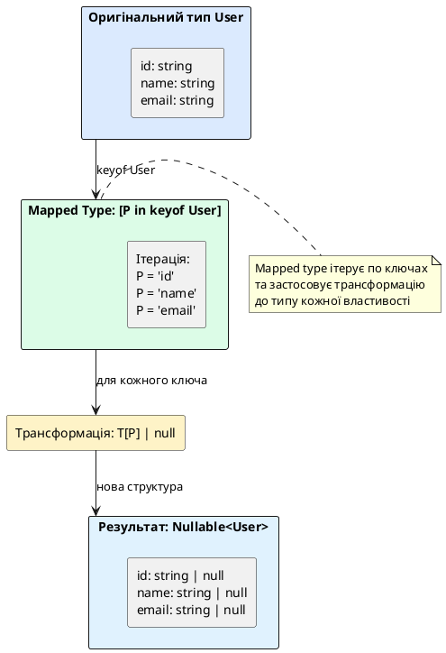

# Mapped та Conditional Types

::card-group

::card{title="🎯 Мета розділу" icon="i-lucide-target"}

- Опанувати механізм mapped types для ітерації по властивостях типів та їх трансформації.
- Зрозуміти синтаксис та семантику conditional types для створення умовної логіки на рівні типів.
- Навчитися використовувати ключове слово `infer` для виведення типів всередині conditional types.
- Застосовувати модифікатори `+`, `-`, `readonly` та `?` для точного контролю трансформацій.
- Створювати власні просунуті utility types для вирішення реальних задач типізації.
- Усвідомити концепцію distributive conditional types та їх поведінку з union типами.

::

::card{title="🔑 Ключові терміни" icon="i-lucide-key"}

- **Mapped Type:** тип, що ітерує по ключах іншого типу та створює нову структуру за певним правилом.
- **Conditional Type:** тип, що обирає одну з альтернатив на основі умови `extends`.
- **Type Inference (infer):** механізм автоматичного виведення частини типу всередині conditional type.
- **Distributive Conditional Types:** conditional types, що автоматично розподіляються по членах union типу.
- **Modifiers:** спеціальні символи (`+`, `-`, `readonly`, `?`) для додавання/видалення модифікаторів властивостей.

::

::

---

## Mapped Types: ітерація та трансформація типів

**Mapped type** — це тип, що створює нову об'єктну структуру шляхом **ітерації по ключах іншого типу** та застосування трансформації до кожної властивості. Це "цикл for на рівні типів".

### Базовий синтаксис mapped types

```typescript
type MappedType<T> = {
  [P in keyof T]: T[P];
};
```

Розбір синтаксису:

- `[P in keyof T]` — ітеруємось по кожному ключу `P` з union типу `keyof T`
- `keyof T` — отримуємо union літеральних типів всіх ключів `T`
- `T[P]` — отримуємо тип властивості за ключем `P` (indexed access type)

Цей базовий приклад просто **копіює** тип `T` без змін. Розглянемо корисніші трансформації.

### Приклад 1: Додавання readonly до всіх властивостей

```typescript
interface User {
  id: string;
  name: string;
  email: string;
}

type ReadonlyUser<T> = {
  readonly [P in keyof T]: T[P];
};

type ImmutableUser = ReadonlyUser<User>;

// Результат:
// type ImmutableUser = {
//   readonly id: string;
//   readonly name: string;
//   readonly email: string;
// }

const user: ImmutableUser = {
  id: 'user-1',
  name: 'Олександр',
  email: 'oleksandr@example.com'
};

// ❌ Error: Cannot assign to 'name' because it is a read-only property
// user.name = 'Марія';
```

Це власноруч реалізований `Readonly<T>` utility type.

### Приклад 2: Додавання опціональності до всіх властивостей

```typescript
type Optional<T> = {
  [P in keyof T]?: T[P];
};

type PartialUser = Optional<User>;

// Результат:
// type PartialUser = {
//   id?: string;
//   name?: string;
//   email?: string;
// }

const partialUser: PartialUser = {
  email: 'user@example.com'
  // id та name відсутні — це допустимо
};
```

Це власноруч реалізований `Partial<T>`.

### Приклад 3: Зміна типу всіх властивостей

```typescript
type Nullable<T> = {
  [P in keyof T]: T[P] | null;
};

type NullableUser = Nullable<User>;

// Результат:
// type NullableUser = {
//   id: string | null;
//   name: string | null;
//   email: string | null;
// }

const user: NullableUser = {
  id: 'user-1',
  name: null,  // ✅ дозволено
  email: 'oleksandr@example.com'
};
```

Кожна властивість може тепер бути `null` додатково до свого оригінального типу.

### Приклад 4: Перетворення всіх властивостей на Promise

```typescript
type Promisify<T> = {
  [P in keyof T]: Promise<T[P]>;
};

interface SyncApi {
  getUser(id: string): User;
  getProducts(): Product[];
  deleteItem(id: string): boolean;
}

type AsyncApi = Promisify<SyncApi>;

// Результат:
// type AsyncApi = {
//   getUser(id: string): Promise<User>;
//   getProducts(): Promise<Product[]>;
//   deleteItem(id: string): Promise<boolean>;
// }
```

Mapped type трансформував синхронний API у асинхронний, обгорнувши всі типи повернення у `Promise`.

::plant-uml{alt="Механіка Mapped Type"}



::

---

## Модифікатори у mapped types: додавання та видалення

Mapped types підтримують **модифікатори** для точного контролю над тим, як властивості трансформуються. Модифікатори можуть бути **додані** (`+`) або **видалені** (`-`).

### Модифікатор readonly

```typescript
// Додавання readonly
type AddReadonly<T> = {
  +readonly [P in keyof T]: T[P];
};

// Видалення readonly
type RemoveReadonly<T> = {
  -readonly [P in keyof T]: T[P];
};

interface ReadonlyConfig {
  readonly apiUrl: string;
  readonly timeout: number;
}

type MutableConfig = RemoveReadonly<ReadonlyConfig>;

// Результат:
// type MutableConfig = {
//   apiUrl: string;      // readonly видалено
//   timeout: number;     // readonly видалено
// }

const config: MutableConfig = {
  apiUrl: 'https://api.example.com',
  timeout: 5000
};

config.apiUrl = 'https://api.other.com';  // ✅ тепер можна змінювати
```

**За замовчуванням** `readonly` означає `+readonly` (додавання), тому `+` зазвичай опускають.

### Модифікатор опціональності (?)

```typescript
// Додавання опціональності
type AddOptional<T> = {
  [P in keyof T]+?: T[P];
};

// Видалення опціональності
type RemoveOptional<T> = {
  [P in keyof T]-?: T[P];
};

interface PartialUser {
  id?: string;
  name?: string;
  email?: string;
}

type RequiredUser = RemoveOptional<PartialUser>;

// Результат:
// type RequiredUser = {
//   id: string;       // опціональність видалено
//   name: string;     // опціональність видалено
//   email: string;    // опціональність видалено
// }

const user: RequiredUser = {
  id: 'user-1',
  name: 'Олександр',
  email: 'oleksandr@example.com'
  // ❌ Error: всі поля обов'язкові, якщо пропустити будь-яке
};
```

Це власноруч реалізований `Required<T>` utility type.

::note
**Комбінація модифікаторів:** Можна комбінувати `readonly` та `?` у одному mapped type:

```typescript
type DeepImmutablePartial<T> = {
  +readonly [P in keyof T]+?: T[P];
};

// Всі властивості стають readonly та опціональними одночасно
```
::


---

## Key Remapping: перейменування ключів у mapped types

TypeScript 4.1+ додав можливість **перейменування ключів** у mapped types через синтаксис `as`. Це дозволяє не лише трансформувати типи властивостей, але й **змінювати самі імена властивостей**.

### Синтаксис key remapping

```typescript
type MappedTypeWithRemapping<T> = {
  [P in keyof T as NewKeyType]: T[P];
};
```

Де `NewKeyType` — це вираз, що обчислює нове ім'я ключа на основі `P`.

### Приклад 1: Додавання префіксу до ключів

```typescript
type Getters<T> = {
  [P in keyof T as `get${Capitalize<string & P>}`]: () => T[P];
};

interface User {
  name: string;
  age: number;
  email: string;
}

type UserGetters = Getters<User>;

// Результат:
// type UserGetters = {
//   getName: () => string;
//   getAge: () => number;
//   getEmail: () => string;
// }

const userGetters: UserGetters = {
  getName: () => 'Олександр',
  getAge: () => 28,
  getEmail: () => 'oleksandr@example.com'
};

console.log(userGetters.getName());  // "Олександр"
```

**Як це працює:**
- `P in keyof T` — ітеруємось по `'name' | 'age' | 'email'`
- `string & P` — приводимо `P` до `string` (гарантує, що `P` не `symbol`)
- `` `get${Capitalize<...>}` `` — template literal type додає префікс "get" та робить першу літеру великою
- Результат: `'name'` → `'getName'`, `'age'` → `'getAge'`

### Приклад 2: Фільтрація ключів (виключення певних властивостей)

```typescript
type OmitByType<T, ValueType> = {
  [P in keyof T as T[P] extends ValueType ? never : P]: T[P];
};

interface Product {
  id: string;
  name: string;
  price: number;
  inStock: boolean;
  discount: number;
}

// Виключаємо всі числові властивості
type ProductWithoutNumbers = OmitByType<Product, number>;

// Результат:
// type ProductWithoutNumbers = {
//   id: string;
//   name: string;
//   inStock: boolean;
// }
```

**Як це працює:**
- Для кожного ключа `P` перевіряємо, чи `T[P] extends number`
- Якщо так — `as never` **видаляє** цей ключ з результату (never зникає з union)
- Якщо ні — `as P` залишає ключ без змін

### Приклад 3: Створення union типу з значень властивостей

```typescript
type EventMap = {
  click: { x: number; y: number };
  keypress: { key: string };
  scroll: { scrollY: number };
};

// Створюємо union об'єктів з полем type
type EventWithType = {
  [K in keyof EventMap]: EventMap[K] & { type: K };
}[keyof EventMap];

// Результат:
// type EventWithType = 
//   | { x: number; y: number; type: 'click' }
//   | { key: string; type: 'keypress' }
//   | { scrollY: number; type: 'scroll' }

function handleEvent(event: EventWithType): void {
  switch (event.type) {
    case 'click':
      console.log(`Клік на (${event.x}, ${event.y})`);
      break;
    case 'keypress':
      console.log(`Натиснуто клавішу: ${event.key}`);
      break;
    case 'scroll':
      console.log(`Прокручено до: ${event.scrollY}`);
      break;
  }
}
```

**Механіка:**
1. Mapped type створює `{ click: {...}, keypress: {...}, scroll: {...} }`
2. `[keyof EventMap]` витягує всі значення з об'єкта
3. Результат — union типів всіх значень

---

## Conditional Types: умовна логіка на рівні типів

**Conditional type** — це тип, що **обирає один з двох варіантів** залежно від умови. Синтаксис схожий на тернарний оператор у JavaScript.

### Базовий синтаксис

```typescript
type ConditionalType<T> = T extends SomeType ? TypeIfTrue : TypeIfFalse;
```

- `T extends SomeType` — умова: чи можна присвоїти `T` до `SomeType`
- Якщо умова `true` → результат `TypeIfTrue`
- Якщо умова `false` → результат `TypeIfFalse`

### Простий приклад

```typescript
type IsString<T> = T extends string ? true : false;

type Test1 = IsString<string>;   // true
type Test2 = IsString<number>;   // false
type Test3 = IsString<'hello'>;  // true (літеральний тип є підтипом string)
```

### Приклад: TypeName utility type

```typescript
type TypeName<T> =
  T extends string ? 'string' :
  T extends number ? 'number' :
  T extends boolean ? 'boolean' :
  T extends undefined ? 'undefined' :
  T extends Function ? 'function' :
  'object';

type T1 = TypeName<string>;        // 'string'
type T2 = TypeName<42>;            // 'number'
type T3 = TypeName<true>;          // 'boolean'
type T4 = TypeName<() => void>;    // 'function'
type T5 = TypeName<{ x: number }>; // 'object'
```

Conditional types можна **ланцюжити** як вкладені тернарні оператори для складніших умов.

### Distributive Conditional Types

Коли conditional type застосовується до **union типу**, TypeScript автоматично **розподіляє** (distribute) перевірку по кожному члену union:

```typescript
type ToArray<T> = T extends any ? T[] : never;

type Test = ToArray<string | number>;

// Розподіл:
// ToArray<string> | ToArray<number>
// string[] | number[]

type Result = string[] | number[];  // ✅ правильно
```

**Як це працює:**
1. `T = string | number`
2. TypeScript розбиває: `ToArray<string>` | `ToArray<number>`
3. Обчислює кожен: `string[]` | `number[]`

**Відключення distributive поведінки:**

Іноді потрібно, щоб conditional type **не розподілявся**. Для цього обгорніть `T` у кортеж:

```typescript
type ToArrayNonDistributive<T> = [T] extends [any] ? T[] : never;

type Test = ToArrayNonDistributive<string | number>;

// Результат: (string | number)[]  — НЕ розподілився
```

### Приклад: Exclude та Extract через conditional types

Пригадаймо реалізацію utility types з попереднього розділу:

```typescript
type Exclude<T, U> = T extends U ? never : T;
type Extract<T, U> = T extends U ? T : never;

type Mixed = 'a' | 'b' | 'c' | 'd';

type WithoutB = Exclude<Mixed, 'b'>;
// Розподіл:
// Exclude<'a', 'b'> | Exclude<'b', 'b'> | Exclude<'c', 'b'> | Exclude<'d', 'b'>
// 'a' | never | 'c' | 'd'
// 'a' | 'c' | 'd'  (never зникає)

type OnlyB = Extract<Mixed, 'b'>;
// 'b'
```

::warning
**Коли distributive поведінка небажана:**

```typescript
// Хочемо перевірити, чи T — це саме union type
type IsUnion<T> = [T] extends [infer U]
  ? U extends T
    ? false  // якби розподілилось, завжди було б true
    : true
  : false;

// Без обгортання у кортеж перевірка не працювала б коректно
```

Детальніше про `infer` — у наступному підрозділі.
::

---

## Infer: виведення типів у conditional types

Ключове слово **`infer`** дозволяє TypeScript **автоматично вивести** частину типу всередині conditional type та зберегти її у змінну типу для подальшого використання.

### Базовий синтаксис

```typescript
type ExtractSomething<T> = T extends SomePattern<infer U> ? U : never;
```

- `infer U` — "виведи тип, що підставляється у `SomePattern`, та збережи його у змінній `U`"
- Якщо виведення успішне, можна використати `U` у `TypeIfTrue` частині

### Приклад 1: Витягнення типу елемента масиву

```typescript
type ArrayElement<T> = T extends (infer U)[] ? U : never;

type Numbers = ArrayElement<number[]>;    // number
type Strings = ArrayElement<string[]>;    // string
type NotArray = ArrayElement<string>;     // never (не масив)

// Вкладені масиви
type NestedArray = ArrayElement<number[][]>;  // number[]
```

**Як це працює:**
- `T extends (infer U)[]` — перевіряємо, чи `T` є масивом
- Якщо так, `infer U` виводить тип елемента масиву
- Повертаємо виведений тип `U`

### Приклад 2: Витягнення типу повернення функції (ReturnType)

```typescript
type ReturnType<T> = T extends (...args: any) => infer R ? R : never;

function getUser(): { id: string; name: string } {
  return { id: 'user-1', name: 'Олександр' };
}

type User = ReturnType<typeof getUser>;
// User: { id: string; name: string }
```

`infer R` виводить тип повернення функції та зберігає його у `R`.

### Приклад 3: Витягнення типів параметрів функції (Parameters)

```typescript
type Parameters<T> = T extends (...args: infer P) => any ? P : never;

function createUser(
  email: string,
  password: string,
  options: { role: string }
): User {
  // ...
}

type CreateUserParams = Parameters<typeof createUser>;
// CreateUserParams: [email: string, password: string, options: { role: string }]
```

`infer P` виводить кортеж типів параметрів функції.

### Приклад 4: Розгортання Promise (Awaited)

```typescript
type Awaited<T> = 
  T extends Promise<infer U> ? Awaited<U> : T;

type Test1 = Awaited<Promise<string>>;               // string
type Test2 = Awaited<Promise<Promise<number>>>;      // number (рекурсивно)
type Test3 = Awaited<string>;                        // string (не Promise)
```

Рекурсивне застосування `Awaited` дозволяє розгорнути навіть вкладені Promise.

### Приклад 5: Витягнення типу з generic класу

```typescript
class Container<T> {
  constructor(public value: T) {}
}

type UnwrapContainer<T> = 
  T extends Container<infer U> ? U : never;

type StringContainer = Container<string>;
type Unwrapped = UnwrapContainer<StringContainer>;
// Unwrapped: string

const container = new Container(42);
type NumberType = UnwrapContainer<typeof container>;
// NumberType: number
```

::tip
**Кілька infer у одному conditional type:**

Можна використовувати кілька `infer` для виведення різних частин типу:

```typescript
type FirstAndLast<T> = 
  T extends [infer First, ...any[], infer Last]
    ? [First, Last]
    : never;

type Test = FirstAndLast<[string, number, boolean, Date]>;
// Test: [string, Date]
```

Витягуємо перший та останній елементи кортежу.
::


---

## Практичні приклади: створення власних utility types

Тепер, володіючи mapped та conditional types, створимо корисні власні utility types для реальних задач.

### DeepPartial: рекурсивна опціональність

```typescript
type DeepPartial<T> = {
  [P in keyof T]?: T[P] extends object
    ? DeepPartial<T[P]>
    : T[P];
};

interface Company {
  name: string;
  address: {
    street: string;
    city: string;
    country: {
      code: string;
      name: string;
    };
  };
  employees: number;
}

type PartialCompany = DeepPartial<Company>;

const update: PartialCompany = {
  address: {
    country: {
      code: 'UA'  // лише code, інші поля опціональні
    }
  }
};
```

### PickByType: вибір властивостей за типом значення

```typescript
type PickByType<T, ValueType> = {
  [P in keyof T as T[P] extends ValueType ? P : never]: T[P];
};

interface User {
  id: string;
  name: string;
  age: number;
  isActive: boolean;
  createdAt: Date;
}

type StringFields = PickByType<User, string>;
// Результат: { id: string; name: string }

type NumberFields = PickByType<User, number>;
// Результат: { age: number }
```

### Mutable: видалення readonly з усіх властивостей

```typescript
type Mutable<T> = {
  -readonly [P in keyof T]: T[P];
};

interface ReadonlyConfig {
  readonly apiUrl: string;
  readonly timeout: number;
  readonly retries: number;
}

type WritableConfig = Mutable<ReadonlyConfig>;

const config: WritableConfig = {
  apiUrl: 'https://api.example.com',
  timeout: 5000,
  retries: 3
};

config.apiUrl = 'https://other-api.com';  // ✅ тепер можна змінювати
```

### FunctionKeys: отримання ключів, що є функціями

```typescript
type FunctionKeys<T> = {
  [K in keyof T]: T[K] extends Function ? K : never;
}[keyof T];

interface UserService {
  getUser(id: string): User;
  updateUser(id: string, data: Partial<User>): User;
  name: string;
  version: number;
  isActive: boolean;
}

type ServiceMethods = FunctionKeys<UserService>;
// Результат: "getUser" | "updateUser"

type OnlyMethods = Pick<UserService, FunctionKeys<UserService>>;
// Результат: {
//   getUser(id: string): User;
//   updateUser(id: string, data: Partial<User>): User;
// }
```

### PromiseType: розгортання Promise

```typescript
type PromiseType<T> = T extends Promise<infer U> ? U : T;

async function fetchData(): Promise<{ id: string; value: number }> {
  return { id: 'data-1', value: 42 };
}

type FetchResult = PromiseType<ReturnType<typeof fetchData>>;
// FetchResult: { id: string; value: number }

// Без PromiseType було б:
type DirectReturn = ReturnType<typeof fetchData>;
// DirectReturn: Promise<{ id: string; value: number }>
```

### RequiredKeys та OptionalKeys

```typescript
type RequiredKeys<T> = {
  [K in keyof T]-?: {} extends Pick<T, K> ? never : K;
}[keyof T];

type OptionalKeys<T> = {
  [K in keyof T]-?: {} extends Pick<T, K> ? K : never;
}[keyof T];

interface Product {
  id: string;
  name: string;
  description?: string;
  tags?: string[];
  price: number;
}

type ProductRequiredKeys = RequiredKeys<Product>;
// Результат: "id" | "name" | "price"

type ProductOptionalKeys = OptionalKeys<Product>;
// Результат: "description" | "tags"
```

### DeepReadonly: рекурсивна readonly структура

```typescript
type DeepReadonly<T> = {
  readonly [P in keyof T]: T[P] extends object
    ? T[P] extends Function
      ? T[P]  // функції залишаємо як є
      : DeepReadonly<T[P]>
    : T[P];
};

interface AppState {
  user: {
    profile: {
      name: string;
      email: string;
    };
    settings: {
      theme: string;
      notifications: boolean;
    };
  };
  data: {
    items: Array<{ id: string; value: number }>;
  };
}

type ImmutableState = DeepReadonly<AppState>;

const state: ImmutableState = {
  user: {
    profile: {
      name: 'Олександр',
      email: 'oleksandr@example.com'
    },
    settings: {
      theme: 'dark',
      notifications: true
    }
  },
  data: {
    items: [{ id: 'item-1', value: 100 }]
  }
};

// ❌ Error на всіх рівнях вкладеності
// state.user.profile.name = 'Марія';
// state.user.settings.theme = 'light';
// state.data.items[0].value = 200;
```

::warning
**Обмеження DeepReadonly:** Ця реалізація не блокує методи масиву, що змінюють його (`push`, `pop`, `splice`). Для повної іммутабельності потрібна більш складна реалізація або бібліотека `ts-essentials`.
::

---

## Підсумок та ключові висновки

Mapped та conditional types — це **мета-програмування на рівні типів**, що дозволяє створювати складну логіку трансформації типів без runtime overhead.

**Ключові тези розділу:**

- **Mapped types** ітерують по ключах типу через `[P in keyof T]` та застосовують трансформації.
- **Модифікатори** `+`/`-`, `readonly`, `?` дозволяють точно контролювати властивості.
- **Key remapping** через `as` дозволяє перейменовувати, додавати префікси та фільтрувати ключі.
- **Conditional types** створюють умовну логіку через `T extends U ? X : Y`.
- **Distributive conditional types** автоматично розподіляються по union типах.
- **`infer` keyword** дозволяє витягувати та зберігати частини типу для подальшого використання.
- **Композиція** mapped та conditional types дозволяє створювати просунуті utility types.

**Практичні рекомендації:**

1. Для **простих трансформацій** використовуйте вбудовані utility types (`Partial`, `Pick`, `Omit`).
2. Створюйте **власні utility types**, коли потрібна специфічна логіка (фільтрація за типом, рекурсивні трансформації).
3. Використовуйте **key remapping** для динамічного перетворення імен властивостей.
4. **`infer`** є основою для витягування типів з generic структур (Promise, функції, контейнери).
5. Тестуйте складні типи через **type assertions** та `type Test = Expect<Equal<A, B>>`.

::accordion

::accordion-item{label="❓ Коли conditional type розподіляється, а коли ні?" icon="i-lucide-help-circle"}

Conditional type **розподіляється** (distributive), коли:

1. `T` є **naked type parameter** (не обгорнутий у додаткову структуру)
2. `T` є **union типом**

```typescript
// Розподіляється
type Dist<T> = T extends any ? T[] : never;
type Result = Dist<'a' | 'b'>;
// 'a'[] | 'b'[]  (розподілився)

// НЕ розподіляється (обгорнутий у кортеж)
type NonDist<T> = [T] extends [any] ? T[] : never;
type Result2 = NonDist<'a' | 'b'>;
// ('a' | 'b')[]  (не розподілився)
```

Обгортання у кортеж `[T]` відключає distributive поведінку.

::

::accordion-item{label="❓ Як перевірити, чи тип є union типом?" icon="i-lucide-help-circle"}

Використовуйте трюк з порівнянням distributive та non-distributive поведінки:

```typescript
type IsUnion<T, U = T> = 
  T extends U 
    ? [U] extends [T]
      ? false
      : true
    : never;

type Test1 = IsUnion<'a' | 'b'>;   // true
type Test2 = IsUnion<string>;      // false
type Test3 = IsUnion<1 | 2 | 3>;   // true
```

Механіка: якщо `T` — union, то при distributive перевірці кожен член порівнюється з повним union `U`, що дає різні результати для `T` та `[T]`.

::

::accordion-item{label="❓ Чому DeepReadonly не блокує масиви повністю?" icon="i-lucide-help-circle"}

TypeScript `readonly` модифікатор для масивів блокує лише **присвоєння за індексом** та **зміну властивості length**, але не методи, що мутують масив:

```typescript
const arr: readonly number[] = [1, 2, 3];

// ❌ Error
// arr[0] = 10;
// arr.length = 0;

// ✅ Компілятор не блокує (але це runtime помилка)
// arr.push(4);  // Error: Property 'push' does not exist
```

Для повної іммутабельності потрібна заміна `Array<T>` на `ReadonlyArray<T>` у DeepReadonly:

```typescript
type DeepReadonly<T> =
  T extends Array<infer U>
    ? ReadonlyArray<DeepReadonly<U>>
    : T extends object
      ? { readonly [P in keyof T]: DeepReadonly<T[P]> }
      : T;
```

::

::accordion-item{label="❓ Як створити тип, що виключає методи з інтерфейсу?" icon="i-lucide-help-circle"}

Використовуйте mapped type з conditional type для фільтрації:

```typescript
type OmitMethods<T> = {
  [K in keyof T as T[K] extends Function ? never : K]: T[K];
};

interface UserService {
  getUser(id: string): User;
  updateUser(id: string, data: Partial<User>): User;
  name: string;
  version: number;
  isActive: boolean;
}

type ServiceData = OmitMethods<UserService>;
// Результат: {
//   name: string;
//   version: number;
//   isActive: boolean;
// }
```

Key remapping `as T[K] extends Function ? never : K` видаляє ключі функцій через `never`.

::

::
