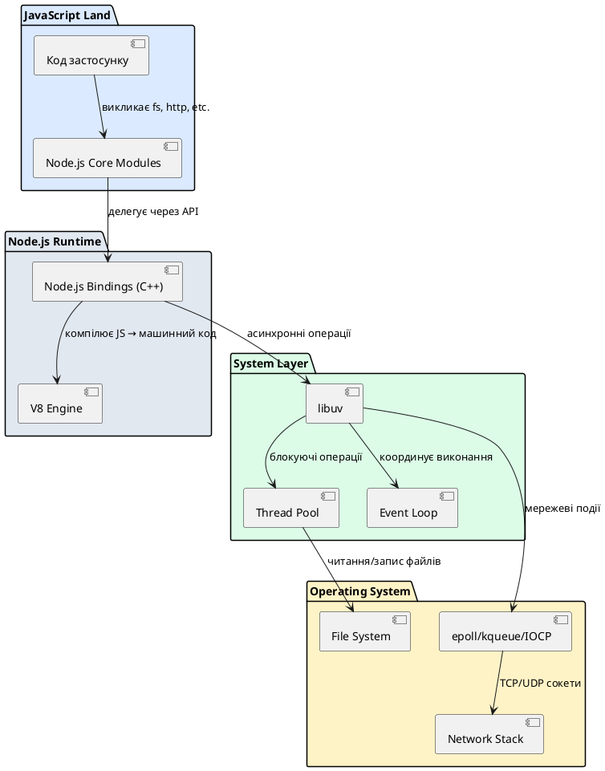
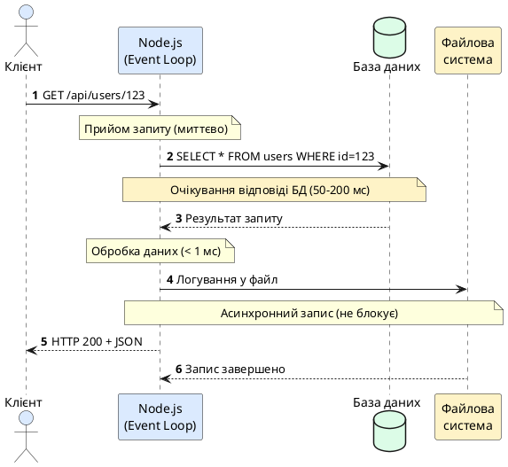

# Що таке Node.js та його архітектура

::card-group

::card{title="🎯 Мета лекції" icon="i-lucide-target"}

- Зрозуміти історичний контекст появи Node.js та проблеми, які він вирішував.
- Дослідити архітектурні компоненти платформи: рушій V8, бібліотеку libuv та прив'язки до ОС.
- Опанувати концепцію однопотокової моделі з неблокуючим введенням/виведенням (*non-blocking I/O*).
- Усвідомити переваги та обмеження Node.js для різних типів застосунків.

::

::card{title="🔑 Ключові терміни" icon="i-lucide-key"}

- **Node.js:** серверне середовище виконання (*runtime*) для JavaScript, побудоване на рушії V8.
- **V8 Engine:** високопродуктивний компілятор JavaScript від Google, який перетворює JS-код у машинний код.
- **libuv:** крос-платформна бібліотека для асинхронного введення/виведення та циклу подій (*Event Loop*).
- **Non-blocking I/O:** модель, де операції читання/запису не блокують виконання програми.

::

::

## Історичний контекст: від браузера до сервера

### Проблема традиційних серверних архітектур

На початку 2000-х років веб-сервери будувалися переважно на багатопотоковій моделі (*multi-threaded model*). Кожен вхідний HTTP-запит обслуговувався окремим потоком операційної системи. Такий підхід використовувався у популярних рішеннях, як Apache HTTP Server з модулем `mpm_worker` або Java-сервери на базі Tomcat.

Однак ця архітектура мала фундаментальні обмеження при високому навантаженні. Створення нового потоку для кожного з'єднання споживало значні системні ресурси: кожен потік резервував від 1 до 8 МБ пам'яті для свого стеку (*stack*), а перемикання контексту між тисячами потоків створювало додаткове навантаження на процесор. При досягненні десятків тисяч одночасних з'єднань (*concurrent connections*) сервер міг вичерпати доступну оперативну пам'ять або втратити продуктивність через накладні витрати планувальника ОС.

::note
Феномен **C10K problem** (*ten thousand concurrent connections*) описував технічні виклики обробки 10,000 одночасних клієнтів на одному сервері. Саме цей виклик став каталізатором для розробки подійно-орієнтованих (*event-driven*) архітектур.
::

### Народження Node.js: бачення Райана Дала

У 2009 році американський програміст Райан Дал (*Ryan Dahl*) презентував на конференції JSConf EU проєкт під назвою Node.js. Його мотивацією було створення середовища, де операції введення/виведення — такі як читання файлів, робота з базами даних або мережеві запити — не блокували б виконання програми.

Дал обрав мову JavaScript з кількох стратегічних причин. По-перше, JavaScript історично розвивався у браузерному середовищі, де всі операції були асинхронними за природою: завантаження зображень, AJAX-запити, таймери виконувалися без блокування інтерфейсу користувача. По-друге, на той момент у JavaScript ще не було стандартної системи модулів чи вбудованих API для роботи з файлами та мережею, що дозволяло Далу проєктувати ці API з нуля, дотримуючись неблокуючої філософії.

::tip
Райан Дал свідомо обрав мову без усталених серверних традицій. На відміну від Python або Ruby, де більшість бібліотек використовували синхронні API, JavaScript дозволяв побудувати екосистему, де асинхронність є нормою, а не винятком.
::

Ключовим рішенням стало використання рушія V8 від Google — того самого компілятора JavaScript, який приводив у рух браузер Chrome. V8 транслював JavaScript-код безпосередньо у машинний код (*Just-In-Time compilation*), забезпечуючи продуктивність, порівнянну з компільованими мовами.

## Архітектурні складові Node.js

Node.js — це не просто «JavaScript на сервері». Це складна платформа, яка об'єднує кілька фундаментальних компонентів у цілісну екосистему.

### Рушій V8: серце виконання JavaScript

**V8 Engine** — це віртуальна машина з відкритим вихідним кодом, розроблена командою Google. Її основне завдання — виконання JavaScript-коду з максимальною швидкістю. На відміну від інтерпретаторів минулого покоління, V8 не інтерпретує код порядково, а компілює його у машинний код перед виконанням.

Процес роботи V8 можна розділити на кілька етапів:

1. **Парсинг (*Parsing*):** вихідний текст JavaScript перетворюється на абстрактне синтаксичне дерево (*Abstract Syntax Tree, AST*).
2. **Базова компіляція (*Ignition Interpreter*):** AST транслюється у проміжний байт-код (*bytecode*), який виконується інтерпретатором Ignition.
3. **Оптимізуюча компіляція (*TurboFan*):** гарячі ділянки коду (*hot paths*), які виконуються багаторазово, компілюються у високооптимізований машинний код за допомогою компілятора TurboFan.

::plant-uml{alt="Процес компіляції JavaScript у V8"}

```plantuml
@startuml
skinparam style plain
skinparam backgroundColor #FFFFFF

rectangle "JavaScript код" as JSCode #DBEAFE
rectangle "Parser" as Parser #E2E8F0
rectangle "AST\nAbstract Syntax Tree" as AST #FEF3C7
rectangle "Ignition\nБайт-код інтерпретатор" as Ignition #DBEAFE
diamond "Гарячий код?" as Hot #FEF3C7
rectangle "TurboFan\nОптимізуючий компілятор" as TurboFan #DCFCE7
rectangle "Виконання" as Execute #E2E8F0

JSCode --> Parser
Parser --> AST
AST --> Ignition
Ignition --> Hot
Hot --> TurboFan : Так
Hot --> Execute : Ні
TurboFan --> Execute

@enduml
```

::

Цей багатоступеневий процес дозволяє V8 балансувати між швидкістю запуску (інтерпретація) та швидкістю виконання (компіляція). Для короткочасних скриптів інтерпретатор забезпечує миттєвий старт, а для тривалих серверних процесів оптимізуючий компілятор виносить продуктивність на рівень компільованих мов.

::warning
V8 використовує автоматичне управління пам'яттю через збирач сміття (*garbage collector*). Для серверних застосунків це означає необхідність контролювати створення об'єктів у циклах обробки запитів, щоб уникнути пауз збирача, які можуть досягати десятків мілісекунд при великих купах (*heap*).
::

### Бібліотека libuv: абстракція над операційною системою

Другий стовп архітектури Node.js — це **libuv**, крос-платформна бібліотека на мові C, яка надає єдиний API для асинхронних операцій введення/виведення на різних операційних системах.

Операційні системи надають різні механізми для неблокуючого I/O:

- **Linux:** `epoll` — масштабований інтерфейс для моніторингу множини файлових дескрипторів.
- **macOS / BSD:** `kqueue` — подійний механізм ядра для відстеження змін стану ресурсів.
- **Windows:** `IOCP (I/O Completion Ports)` — асинхронна модель завершення операцій.

libuv приховує ці відмінності та експонує уніфіковане API. Окрім мережевого I/O, вона надає:

- **Цикл подій (*Event Loop*):** центральний диспетчер, який координує виконання асинхронних операцій.
- **Пул потоків (*Thread Pool*):** для операцій, які не мають нативної асинхронної підтримки в ОС (наприклад, операції з файловою системою або DNS-резолюція на деяких платформах).
- **Таймери та обробники сигналів:** механізми планування відкладеного виконання коду.
- **Міжпроцесна комунікація (*IPC*):** канали для обміну даними між процесами Node.js.

::note
За замовчуванням libuv створює пул із **чотирьох робочих потоків**. Цей пул використовується для операцій, які не можуть бути виконані асинхронно на рівні ОС. Розмір пулу можна налаштувати через змінну оточення `UV_THREADPOOL_SIZE`.
::

### Прив'язки (Node.js Bindings): міст між JavaScript та C++

Node.js не обмежується лише виконанням JavaScript-коду. Значна частина його функціональності реалізована на мові C++ і експонується у JavaScript через механізм прив'язок (*bindings*).

Коли ви викликаєте у коді `fs.readFile()` або `http.createServer()`, відбувається наступний ланцюжок:

1. **JavaScript API:** ви викликаєте функцію з модуля Node.js (наприклад, `fs.readFile(path, callback)`).
2. **Node.js Bindings:** виклик передається у внутрішній C++ модуль через прив'язки.
3. **libuv:** C++ код делегує асинхронну операцію бібліотеці libuv.
4. **Операційна система:** libuv взаємодіє з ядром ОС через системні виклики.
5. **Зворотний шлях:** після завершення операції результат повертається через callback у JavaScript.

Цей підхід дозволяє Node.js поєднувати зручність високорівневого синтаксису JavaScript з продуктивністю низькорівневих системних викликів C++.

::plant-uml{alt="Архітектура Node.js: взаємодія компонентів"}



::

### Загальна картина: як працює Node.js

Уявімо виконання простого веб-сервера на Node.js:

```javascript
const http = require('http');
const fs = require('fs');

const server = http.createServer((req, res) => {
  fs.readFile('./data.json', 'utf8', (err, content) => {
    if (err) {
      res.writeHead(500);
      res.end('Server Error');
      return;
    }
    res.writeHead(200, { 'Content-Type': 'application/json' });
    res.end(content);
  });
});

server.listen(3000);
console.log('Server running on http://localhost:3000');
```

Що відбувається під капотом при запуску цього коду:

1. **Ініціалізація:** V8 компілює JavaScript у машинний код.
2. **Створення сервера:** виклик `http.createServer()` через прив'язки створює TCP-сокет за допомогою libuv.
3. **Прослуховування порту:** `server.listen(3000)` реєструє сокет у циклі подій (*Event Loop*) через `epoll`/`kqueue`/`IOCP`.
4. **Очікування запитів:** програма не блокується — Event Loop періодично опитує ОС на предмет нових подій.
5. **Обробка запиту:** при надходженні HTTP-запиту спрацьовує callback `(req, res) => {...}`.
6. **Читання файлу:** виклик `fs.readFile()` передається у пул потоків, оскільки операції з файловою системою не мають повноцінної асинхронної підтримки на всіх ОС.
7. **Повернення результату:** після завершення читання callback викликається з прочитаним вмістом.
8. **Відповідь клієнту:** `res.end(content)` надсилає дані через TCP-сокет.

::note
Критична відмінність: основний потік Node.js ніколи не блокується на операціях введення/виведення. Поки один запит очікує на читання файлу у пулі потоків, Event Loop може обробляти десятки інших запитів.
::

## Однопотокова модель з неблокуючим I/O

### Філософія "один потік — багато з'єднань"

Node.js використовує **однопотокову модель виконання JavaScript-коду**. Це означає, що весь ваш прикладний код — обробники запитів, бізнес-логіка, callbacks — виконується в одному потоці операційної системи.

На перший погляд це може здаватися обмеженням. Як один потік може обслуговувати тисячі одночасних клієнтів? Секрет криється у природі веб-застосунків: більшість часу сервер не обчислює, а **очікує** — на відповідь бази даних, на читання з диска, на завантаження даних з мережі.

Розглянемо типовий веб-запит до REST API:

::plant-uml{alt="Типовий веб-запит до REST API"}



::

Із 250 мілісекунд загального часу обробки запиту, Node.js **активно виконує код** лише 1-2 мілісекунди. Решту часу процес очікує на зовнішні ресурси. Саме у ці моменти очікування Event Loop обробляє інші запити, досягаючи паралелізму без створення нових потоків.

### Переваги однопотокової архітектури

**1. Мінімальні накладні витрати на пам'ять**

Кожен потік ОС резервує власний стек (зазвичай 1-8 МБ). Для 10,000 одночасних з'єднань багатопотокова модель споживала б 10-80 ГБ лише на стеки потоків. Node.js обробляє той самий обсяг трафіку в одному потоці, витрачаючи лише мегабайти на структури даних Event Loop.

**2. Відсутність проблем синхронізації**

У багатопотокових застосунках спільний доступ до даних вимагає механізмів синхронізації: м'ютексів (*mutexes*), семафорів, блокувань читання/запису (*read-write locks*). Неправильне використання цих примітивів призводить до взаємних блокувань (*deadlocks*) або гонитви даних (*race conditions*). В однопотоковій моделі Node.js ці проблеми відсутні на рівні JavaScript-коду.

**3. Передбачуваність виконання**

Event Loop обробляє події послідовно. Якщо callback функція виконується, вона гарантовано завершиться до початку наступного callback. Це спрощує ментальну модель програміста та зменшує кількість важкознайдених помилок.

::tip
Однопотокова модель не означає, що Node.js не використовує багатопоточність взагалі. libuv створює внутрішній пул потоків для операцій, які не мають асинхронної підтримки. Але ці потоки приховані від розробника та керуються платформою автоматично.
::

### Обмеження: коли Node.js не підходить

Однопотокова архітектура має фундаментальне обмеження: **CPU-інтенсивні обчислення блокують Event Loop**.

Розглянемо приклад обчислення чисел Фібоначчі рекурсивним методом:

```javascript
function fibonacci(n) {
  if (n <= 1) return n;
  return fibonacci(n - 1) + fibonacci(n - 2);
}

const http = require('http');

http.createServer((req, res) => {
  const result = fibonacci(45); // Обчислення займає ~10 секунд
  res.end(`Fibonacci(45) = ${result}`);
}).listen(3000);
```

Під час виконання `fibonacci(45)` жоден інший запит не може бути оброблений. Event Loop заблокований синхронним обчисленням. Якщо 100 клієнтів одночасно надішлють запити, вони будуть оброблятися послідовно, кожен чекатиме ~10 секунд, що призведе до загального часу очікування близько 1000 секунд для останнього клієнта.

::warning
**Золоте правило Node.js:** ніколи не виконуйте тривалі синхронні обчислення в основному потоці Event Loop. Кожна callback-функція має завершуватися за мілісекунди, а не секунди.
::

Для CPU-інтенсивних задач Node.js надає кілька стратегій:

**1. Worker Threads**

Модуль `worker_threads` дозволяє створювати справжні потоки ОС для паралельних обчислень:

```javascript
const { Worker } = require('worker_threads');

function runWorker(n) {
  return new Promise((resolve, reject) => {
    const worker = new Worker('./fibonacci-worker.js', {
      workerData: { n }
    });
    worker.on('message', resolve);
    worker.on('error', reject);
  });
}

http.createServer(async (req, res) => {
  const result = await runWorker(45);
  res.end(`Fibonacci(45) = ${result}`);
}).listen(3000);
```

**2. Дочірні процеси (Child Processes)**

Для ізоляції важких обчислень у окремі процеси:

```javascript
const { fork } = require('child_process');

const child = fork('./compute-service.js');
child.send({ task: 'fibonacci', n: 45 });
child.on('message', (result) => {
  console.log('Result:', result);
});
```

**3. Делегування мікросервісам**

Винесення обчислювальних задач у окремі сервіси на мовах, оптимізованих для обчислень (Go, Rust, C++), з взаємодією через HTTP/gRPC.

::note
Оберіть Node.js для застосунків, де домінують операції введення/виведення: веб-API, проксі-сервери, чат-додатки, стрімінг даних. Уникайте його для наукових обчислень, обробки відео або машинного навчання без делегування у спеціалізовані процеси.
::

## Node.js vs Браузерний JavaScript

Хоча Node.js та браузерні середовища (Chrome, Firefox, Safari) використовують однаковий стандарт мови ECMAScript, вони надають різні API та мають різні обмеження виконання.

### Відмінності у глобальних об'єктах

| Особливість | Браузер | Node.js |
|-------------|---------|---------|
| Глобальний об'єкт | `window` | `global` (до v21), `globalThis` |
| DOM API | `document`, `window.location` | ❌ Відсутні |
| Файлова система | ❌ Обмежений доступ (File API) | ✅ Повний доступ (`fs` модуль) |
| Мережа | `fetch`, `XMLHttpRequest` | `http`, `https`, `net`, `dgram` |
| Модульна система | ES Modules, `<script type="module">` | CommonJS (`require`) + ES Modules |
| Змінні оточення | ❌ Відсутні | ✅ `process.env` |
| Багатопоточність | Web Workers | Worker Threads |
| Потоки даних | Streams API | Node.js Streams (Readable, Writable) |

### Доступ до системних ресурсів

**Браузер:** виконує код у пісочниці (*sandbox*) з обмеженим доступом до системи. Користувач явно дозволяє доступ до камери, мікрофону або файлів через діалоги дозволів.

**Node.js:** має повний доступ до файлової системи, мережевих інтерфейсів, системних процесів та змінних оточення. Це робить Node.js потужним, але вимагає обережності при виконанні недовіреного коду.

### Модульні системи

Браузерні застосунки історично завантажували JavaScript через теги `<script>`, що призводило до забруднення глобального простору імен. Сучасні браузери підтримують ES Modules:

```javascript
// browser.js
import { formatDate } from './utils.js';
console.log(formatDate(new Date()));
```

Node.js традиційно використовував систему CommonJS:

```javascript
// node.js
const { formatDate } = require('./utils');
console.log(formatDate(new Date()));
```

Починаючи з версії Node.js 12, платформа підтримує обидві системи. Для використання ES Modules у Node.js потрібно:

- Додати `"type": "module"` у `package.json`, **або**
- Використовувати розширення `.mjs` для файлів модулів.

::tip
У 2026 році рекомендується використовувати ES Modules як стандарт для нових проєктів. Більшість сучасних бібліотек підтримують обидва формати через умовний експорт (*conditional exports*) у `package.json`.
::

### API для роботи з часом

**Браузер:**
```javascript
setTimeout(() => console.log('Delayed'), 1000);
requestAnimationFrame(() => console.log('Next frame'));
```

**Node.js:**
```javascript
setTimeout(() => console.log('Delayed'), 1000);
setImmediate(() => console.log('After I/O phase')); // Специфічно для Node.js
process.nextTick(() => console.log('Highest priority')); // Специфічно для Node.js
```

## Версії Node.js: LTS vs Current

Node.js дотримується передбачуваного графіку випусків (*release schedule*), що забезпечує баланс між стабільністю та інноваціями.

### Схема версіонування

Node.js використовує семантичне версіонування (*Semantic Versioning*): `MAJOR.MINOR.PATCH`

- **MAJOR (парні числа: 18, 20, 22):** LTS-версії з довгостроковою підтримкою.
- **MAJOR (непарні числа: 19, 21, 23):** Current-версії з експериментальними функціями.
- **MINOR:** нові функції у зворотно сумісний спосіб.
- **PATCH:** виправлення помилок та безпекові патчі.

### LTS (Long Term Support) — Довгострокова підтримка

LTS-версії призначені для **продакшн-середовищ** і підтримуються протягом 30 місяців:

1. **Active LTS (18 місяців):** отримують нові функції, оптимізації та виправлення помилок.
2. **Maintenance LTS (12 місяців):** отримують лише критичні безпекові патчі та виправлення серйозних помилок.

**Приклади LTS-версій (станом на 2026):**

- **Node.js 20 LTS** (кодова назва *Iron*): Active до жовтня 2024, Maintenance до квітня 2026.
- **Node.js 22 LTS** (кодова назва *Jod*): Active до жовтня 2025, Maintenance до квітня 2027.
- **Node.js 24 LTS** (очікується у жовтні 2026): наступна LTS-версія.

::tip
Для корпоративних застосунків завжди обирайте **Active LTS**-версію. Вона гарантує стабільність та своєчасні безпекові оновлення без ризику несумісності API.
::

### Current — Експериментальні версії

Current-версії містять найновіші функції JavaScript та експериментальні API Node.js. Вони випускаються кожні 6 місяців і підтримуються лише до виходу наступної версії.

**Node.js 26 (Current станом на вересень 2026):**
- Підтримка ECMAScript 2026
- Експериментальний Type Stripping (виконання TypeScript без транспіляції)
- Покращена продуктивність HTTP/2 та HTTP/3
- Нові API для роботи з WebAssembly

::warning
Current-версії **не рекомендуються для продакшн-середовищ**. Використовуйте їх для експериментів, навчання та підготовки до майбутніх LTS-версій.
::

### Міграція між версіями

При переході на нову мажорну версію Node.js дотримуйтесь наступної стратегії:

::steps

### Крок 1. Перевірка сумісності залежностей

Переконайтеся, що всі `npm`-пакети у `package.json` підтримують цільову версію Node.js. Використовуйте інструмент `npx node-version-audit`:

```bash
npx node-version-audit --target 22
```

### Крок 2. Тестування у ізольованому середовищі

Створіть окреме середовище (Docker-контейнер або віртуальну машину) з новою версією Node.js і запустіть повний набір тестів:

```bash
docker run -it --rm -v $(pwd):/app node:22-alpine sh -c "cd /app && npm ci && npm test"
```

### Крок 3. Моніторинг deprecated API

Увімкніть прапорець `--trace-deprecation` для виявлення застарілих функцій:

```bash
node --trace-deprecation index.js
```

### Крок 4. Поступовий роллаут

У продакшн-середовищі оновлюйте вузли (*nodes*) поступово: спочатку 10%, потім 50%, і лише після підтвердження стабільності — всі сервери.

::

## Практичний приклад: мінімальний веб-сервер

Розглянемо класичний приклад створення HTTP-сервера, щоб побачити архітектурні принципи Node.js у дії:

```javascript
const http = require('http');

// Лічильник запитів (зберігається у пам'яті процесу)
let requestCount = 0;

const server = http.createServer((req, res) => {
  requestCount++;
  
  console.log(`[${new Date().toISOString()}] ${req.method} ${req.url} - Request #${requestCount}`);
  
  // Імітація асинхронної операції (наприклад, запит до БД)
  setTimeout(() => {
    res.writeHead(200, { 
      'Content-Type': 'application/json',
      'X-Request-Count': requestCount.toString()
    });
    
    res.end(JSON.stringify({
      message: 'Hello from Node.js!',
      timestamp: new Date().toISOString(),
      requestNumber: requestCount,
      nodeVersion: process.version,
      platform: process.platform,
      uptime: process.uptime()
    }, null, 2));
  }, 100); // Затримка 100мс для імітації I/O
});

const PORT = process.env.PORT || 3000;

server.listen(PORT, () => {
  console.log(`✓ Server running on http://localhost:${PORT}`);
  console.log(`✓ Process ID: ${process.pid}`);
  console.log(`✓ Node.js version: ${process.version}`);
  console.log(`✓ V8 version: ${process.versions.v8}`);
});

// Graceful Shutdown
process.on('SIGTERM', () => {
  console.log('\n✗ Received SIGTERM, shutting down gracefully...');
  server.close(() => {
    console.log('✗ Server closed. Exiting process.');
    process.exit(0);
  });
});
```

### Аналіз коду

**1. Створення сервера (`http.createServer`)**

Функція приймає callback, який викликається для кожного вхідного HTTP-запиту. Цей callback виконується в основному потоці Event Loop.

**2. Асинхронна природа (`setTimeout`)**

Навіть з затримкою 100 мілісекунд на кожен запит, сервер може обробляти тисячі одночасних з'єднань. Поки один запит очікує на завершення таймера, Event Loop обслуговує інші запити.

**3. Інформація про процес (`process`)**

Глобальний об'єкт `process` надає доступ до метаданих виконання: версія Node.js, платформа, ідентифікатор процесу, час роботи (*uptime*).

**4. Graceful Shutdown**

Обробка сигналу `SIGTERM` дозволяє коректно завершити активні з'єднання перед зупинкою процесу, що критично для розгортань у Kubernetes або Docker Swarm.

::terminal-preview{title="node server.js"}

<div class="line"><span class="opacity-40">$</span> <strong class="font-bold">node server.js</strong></div>
<div class="line"><span class="text-green-400 font-bold">✓</span> Server running on http://localhost:3000</div>
<div class="line"><span class="text-green-400 font-bold">✓</span> Process ID: 42891</div>
<div class="line"><span class="text-green-400 font-bold">✓</span> Node.js version: v22.11.0</div>
<div class="line"><span class="text-green-400 font-bold">✓</span> V8 version: 12.4.254.20</div>
<div class="line"></div>
<div class="line"><span class="opacity-40">[2026-09-02T14:23:10.482Z]</span> <span class="text-blue-400 font-bold">GET</span> /api/status - Request <span class="text-green-400 font-bold">#1</span></div>
<div class="line"><span class="opacity-40">[2026-09-02T14:23:11.105Z]</span> <span class="text-blue-400 font-bold">GET</span> /api/status - Request <span class="text-green-400 font-bold">#2</span></div>
<div class="line"><span class="opacity-40">[2026-09-02T14:23:11.328Z]</span> <span class="text-blue-400 font-bold">GET</span> /api/status - Request <span class="text-green-400 font-bold">#3</span></div>

::

### Тестування продуктивності

Перевіримо здатність сервера обробляти високе навантаження за допомогою утиліти `wrk`:

::terminal-preview{title="wrk -t4 -c100 -d10s http://localhost:3000"}

<div class="line"><span class="opacity-40">$</span> <strong class="font-bold">wrk -t4 -c100 -d10s http://localhost:3000/api/status</strong></div>
<div class="line">Running 10s test @ http://localhost:3000/api/status</div>
<div class="line">  <span class="text-blue-400">4 threads</span> and <span class="text-blue-400">100 connections</span></div>
<div class="line"></div>
<div class="line">  Thread Stats   Avg      Stdev     Max   +/- Stdev</div>
<div class="line">    Latency   <span class="text-green-400 font-bold">102.35ms</span>  <span class="opacity-40">8.12ms</span>  <span class="opacity-40">145.22ms</span>  <span class="opacity-40">89.34%</span></div>
<div class="line">    Req/Sec   <span class="text-green-400 font-bold">244.18</span>    <span class="opacity-40">21.45</span>    <span class="opacity-40">310.00</span>    <span class="opacity-40">78.92%</span></div>
<div class="line"></div>
<div class="line">  <span class="text-green-400 font-bold">9,752 requests</span> in 10.03s, <span class="text-blue-400">2.13MB</span> read</div>
<div class="line">Requests/sec:   <span class="text-green-400 font-bold">972.31</span></div>
<div class="line">Transfer/sec:   <span class="text-blue-400">217.45KB</span></div>

::

Результат демонструє, що навіть з штучною затримкою 100 мс на запит, сервер обробляє ~970 запитів на секунду при 100 одночасних з'єднаннях. Це підтверджує ефективність неблокуючої моделі.

## Резюме та ключові висновки

::card-group

::card{title="✅ Коли обирати Node.js" icon="i-lucide-check-circle"}

- REST/GraphQL API з високою кількістю одночасних з'єднань
- Реал-тайм застосунки (чати, WebSocket-сервери)
- Проксі-сервери та API-шлюзи
- Стрімінг даних та обробка файлів
- Мікросервісна архітектура з інтенсивним I/O
- Серверний рендеринг (*SSR*) для React/Vue/Angular

::

::card{title="❌ Коли уникати Node.js" icon="i-lucide-x-circle"}

- CPU-інтенсивні обчислення (наукові розрахунки, машинне навчання)
- Обробка відео/аудіо без делегування
- Застосунки з жорсткими вимогами до реального часу (Real-Time Operating Systems)
- Великі монолітні застосунки без чіткої модульної структури

::

::

### Фундаментальні принципи Node.js

1. **Неблокуюче введення/виведення** — операції I/O ніколи не зупиняють Event Loop.
2. **Однопотокова модель JavaScript** — весь прикладний код виконується в одному потоці.
3. **Подійно-орієнтована архітектура** — callbacks, Promises та async/await для координації асинхронних операцій.
4. **Мінімалістичне ядро** — Node.js надає лише базові примітиви, екосистема npm забезпечує функціональність.

### Інтерактивні запитання для самоперевірки

::accordion

::accordion-item{label="❓ Чому Node.js використовує рушій V8, а не інший JavaScript-движок?" icon="i-lucide-help-circle"}

V8 був обраний через його високу продуктивність та архітектуру Just-In-Time компіляції. На момент створення Node.js (2009) V8 був найшвидшим JavaScript-движком, здатним конкурувати з компільованими мовами. Крім того, V8 має відкритий вихідний код та надає C++ API для вбудовування, що дозволило Райану Далу інтегрувати його з libuv.

::

::accordion-item{label="❓ Що станеться, якщо callback функція виконуватиметься 5 секунд?" icon="i-lucide-help-circle"}

Event Loop буде заблокований на весь час виконання callback. Жоден інший запит не зможе бути оброблений, таймери не спрацюють, мережеві події накопичуватимуться у черзі ОС. Це призведе до деградації сервісу та таймаутів на клієнтській стороні. Тривалі обчислення завжди слід виносити у Worker Threads або дочірні процеси.

::

::accordion-item{label="❓ Чи може Node.js використовувати всі ядра процесора?" icon="i-lucide-help-circle"}

Один процес Node.js виконується на одному ядрі. Для використання багатоядерних систем застосовують **кластеризацію**: модуль `cluster` дозволяє створити декілька дочірніх процесів, які спільно обслуговують один TCP-порт. Альтернативно, можна запустити кілька екземплярів застосунку за балансувальником навантаження (*load balancer*) типу Nginx або HAProxy.

::

::accordion-item{label="❓ Як Node.js обробляє помилки у асинхронному коді?" icon="i-lucide-help-circle"}

У callback-стилі помилки передаються першим аргументом: `callback(err, result)`. У Promise-підході використовується `catch()` або блок `try/catch` з `async/await`. Необроблені помилки у Promise викликають подію `unhandledRejection`, яку можна перехопити через `process.on('unhandledRejection')`. Ігнорування таких помилок у продакшн-коді є критичною вразливістю.

::

::

---

**Наступна лекція:** Event Loop — серце Node.js

У наступному матеріалі ми детально розглянемо внутрішню будову циклу подій, фази його виконання, черги мікрозадач та макрозадач, а також механізми `process.nextTick()` та `setImmediate()`.
