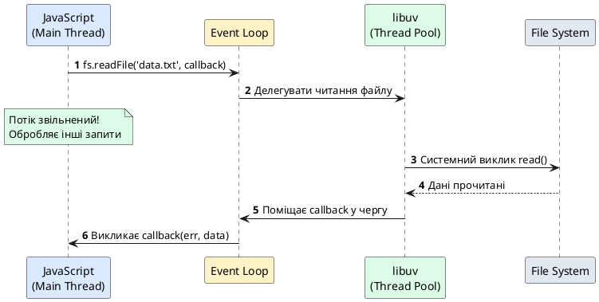
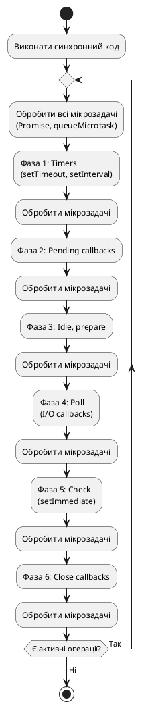
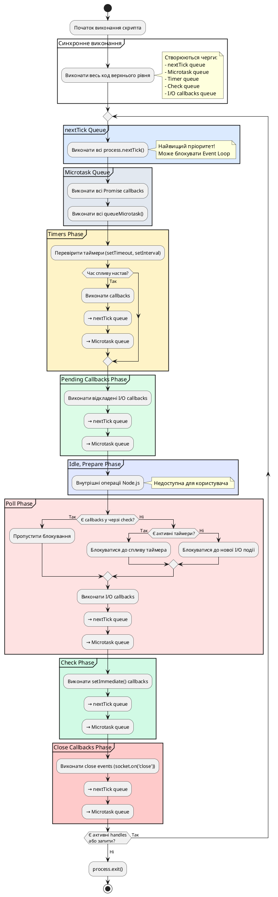

# Event Loop — серце Node.js

::card-group

::card{title="🎯 Мета лекції" icon="i-lucide-target"}

- Зрозуміти внутрішню будову циклу подій (*Event Loop*) та його роль у Node.js.
- Вивчити шість фаз Event Loop та їхні специфічні завдання.
- Опанувати різницю між мікрозадачами (*microtasks*) та макрозадачами (*macrotasks*).
- Навчитися правильно використовувати `process.nextTick()`, `setImmediate()` та `setTimeout()`.
- Розпізнавати та запобігати блокуванню Event Loop у продакшн-коді.

::

::card{title="🔑 Ключові терміни" icon="i-lucide-key"}

- **Event Loop:** механізм, що координує виконання JavaScript-коду, асинхронних операцій та callbacks.
- **Фаза (Phase):** окремий етап циклу подій з власною чергою callbacks.
- **Мікрозадача (Microtask):** високопріоритетна задача (Promise, `queueMicrotask`), що виконується між фазами.
- **Макрозадача (Macrotask):** звичайна задача (`setTimeout`, `setInterval`), що виконується у відповідній фазі.
- **process.nextTick():** спеціальний механізм Node.js для виконання callback на початку наступної ітерації.

::

::

## Концептуальна основа: навіщо потрібен Event Loop

У попередній лекції ми з'ясували, що Node.js працює в **однопотоковій моделі** для виконання JavaScript-коду. Але як один потік може одночасно обслуговувати сотні тисяч з'єднань, обробляти таймери, читати файли та реагувати на мережеві події?

Відповідь криється у **циклі подій** — архітектурному патерні, який дозволяє делегувати повільні операції введення/виведення операційній системі, а потім обробляти їхні результати через систему callbacks, не блокуючи основний потік виконання.

### Проблема синхронного коду

Розглянемо гіпотетичний світ, де Node.js працював би синхронно:

```javascript
const fs = require('fs');
const http = require('http');

http.createServer((req, res) => {
  // БЛОКУВАННЯ: потік зупиняється на час читання файлу
  const data = fs.readFileSync('./large-file.txt', 'utf8'); // 2 секунди
  
  res.writeHead(200);
  res.end(data);
}).listen(3000);
```

У цьому сценарії кожен запит блокує сервер на 2 секунди. Якщо надійшло 10 одночасних запитів, останній клієнт отримає відповідь через **20 секунд**. При навантаженні у 1000 запитів на секунду сервер повністю втратить працездатність.

### Рішення: асинхронність через Event Loop

Event Loop перетворює блокуючі операції на неблокуючі через наступний механізм:

1. **Делегування:** запит на читання файлу передається у пул потоків libuv.
2. **Повернення контролю:** основний потік продовжує обробку інших запитів.
3. **Сповіщення:** коли операція завершується, результат поміщається у чергу callbacks.
4. **Виконання callback:** Event Loop на відповідній фазі викликає зареєстрований callback з результатом.

::plant-uml{alt="Асинхронна обробка запиту у Node.js"}



::

::note
Ключова відмінність: у асинхронній моделі **час очікування I/O не витрачається марно**. Поки одна операція очікує на диск або мережу, Event Loop обслуговує десятки інших запитів.
::

## Анатомія Event Loop: шість фаз виконання

Event Loop — це не просто безкінечний цикл. Це складна машина стану, що проходить через **шість послідовних фаз** на кожній ітерації. Кожна фаза має власну **FIFO-чергу callbacks**, які обробляються по черзі.

### Загальна структура циклу

```
   ┌───────────────────────────┐
┌─>│        timers             │  Фаза 1: setTimeout, setInterval
│  └─────────────┬─────────────┘
│  ┌─────────────┴─────────────┐
│  │   pending callbacks       │  Фаза 2: відкладені I/O callbacks
│  └─────────────┬─────────────┘
│  ┌─────────────┴─────────────┐
│  │      idle, prepare        │  Фаза 3: внутрішні операції Node.js
│  └─────────────┬─────────────┘
│  ┌─────────────┴─────────────┐
│  │         poll              │  Фаза 4: нові I/O події, виконання callbacks
│  └─────────────┬─────────────┘
│  ┌─────────────┴─────────────┐
│  │        check              │  Фаза 5: setImmediate() callbacks
│  └─────────────┬─────────────┘
│  ┌─────────────┴─────────────┐
└──│    close callbacks        │  Фаза 6: закриття ресурсів (socket.on('close'))
   └───────────────────────────┘
```

::tip
Між **кожною фазою** Event Loop виконує всі накопичені **мікрозадачі** (Promise callbacks, `queueMicrotask`). Це критична особливість, яка впливає на порядок виконання коду.
::

### Фаза 1: Timers (Таймери)

**Призначення:** виконання callbacks, заплановані через `setTimeout()` та `setInterval()`.

Таймери не гарантують **точного** часу виконання. Вони встановлюють **мінімальний поріг затримки**, після якого callback стає доступним для виконання. Фактичний момент виклику залежить від навантаження Event Loop.

```javascript
console.log('Start');

setTimeout(() => {
  console.log('Timeout 1: 100ms');
}, 100);

setTimeout(() => {
  console.log('Timeout 2: 0ms');
}, 0);

console.log('End');

// Вивід:
// Start
// End
// Timeout 2: 0ms
// Timeout 1: 100ms
```

**Чому `setTimeout(fn, 0)` не виконується негайно?**

Навіть з нульовою затримкою callback потрапляє у чергу фази **timers**, яка обробляється на наступній ітерації Event Loop, після виконання поточного синхронного коду.

::warning
**Проблема голодування (*starvation*):** якщо у фазі timers накопичується багато callbacks, Event Loop може застрягти на цій фазі, затримуючи обробку нових I/O подій. Node.js обмежує кількість callbacks, що виконуються за одну ітерацію, щоб уникнути цієї проблеми.
::

### Фаза 2: Pending Callbacks (Відкладені callbacks)

**Призначення:** виконання callbacks для деяких системних операцій, відкладених з попередньої ітерації.

Ця фаза обробляє специфічні типи callbacks, зокрема:

- Помилки TCP-сокетів (наприклад, `ECONNREFUSED` при спробі підключення)
- Деякі внутрішні операції libuv

Більшість розробників ніколи безпосередньо не взаємодіють з цією фазою — вона призначена для внутрішніх потреб Node.js.

### Фаза 3: Idle, Prepare (Внутрішні операції)

**Призначення:** виконання внутрішніх операцій Node.js.

Ця фаза використовується виключно платформою для підготовчих дій перед фазою **poll**. Прикладний код не може напряму планувати callbacks у цій фазі.

::note
Назва "idle" може вводити в оману — Event Loop у цій фазі **не простоює**. Вона виконує системні перевірки, необхідні для коректної роботи наступних фаз.
::


### Фаза 4: Poll (Опитування I/O подій)

**Призначення:** очікування нових I/O подій та виконання їхніх callbacks.

Це **найважливіша та найскладніша фаза** Event Loop. Саме тут відбувається обробка більшості асинхронних операцій: мережевих з'єднань, читання файлів, запитів до баз даних.

Фаза poll виконує дві ключові функції:

**1. Обчислення часу блокування**

Event Loop визначає, скільки часу він може **блокуватися** в очікуванні нових I/O подій:

- Якщо черга **check** (setImmediate) не порожня → не блокується, переходить до наступної фази.
- Якщо є заплановані таймери → блокується максимум до моменту спрацювання найближчого таймера.
- Якщо нічого не заплановано → блокується до надходження першої події.

**2. Обробка подій у черзі poll**

Event Loop виконує callbacks з черги poll **по порядку**, поки не виникне одна з умов:

- Черга poll спустошена.
- Досягнуто системного ліміту на кількість callbacks за ітерацію.
- Настав час виконання таймера з фази timers.

```javascript
const fs = require('fs');

console.log('1: Start');

fs.readFile('./package.json', 'utf8', (err, data) => {
  console.log('3: File read callback (poll phase)');
  
  setTimeout(() => {
    console.log('5: Nested timeout');
  }, 0);
  
  setImmediate(() => {
    console.log('4: Nested setImmediate');
  });
});

console.log('2: End');

// Вивід:
// 1: Start
// 2: End
// 3: File read callback (poll phase)
// 4: Nested setImmediate
// 5: Nested timeout
```

**Аналіз порядку виконання:**

1. Синхронний код виконується спочатку: `1: Start`, `2: End`.
2. `fs.readFile()` делегується у пул потоків.
3. Коли файл прочитано, callback потрапляє у чергу **poll**.
4. У callback додаються два нові завдання: `setTimeout` (timers) та `setImmediate` (check).
5. Після виходу з фази poll Event Loop переходить у фазу **check** → виконується `setImmediate`.
6. На наступній ітерації у фазі **timers** виконується `setTimeout`.

::tip
**Правило пріоритету:** якщо `setImmediate()` викликається **всередині I/O callback** (фаза poll), він завжди виконається **раніше** за `setTimeout(fn, 0)`, оскільки фаза check йде безпосередньо після poll.
::

### Фаза 5: Check (Перевірка setImmediate)

**Призначення:** виконання callbacks, зареєстрованих через `setImmediate()`.

Ця фаза існує для забезпечення можливості виконати код **негайно після завершення фази poll**, не чекаючи на наступну ітерацію циклу.

```javascript
const fs = require('fs');

fs.readFile('./data.txt', () => {
  setTimeout(() => console.log('Timeout'), 0);
  setImmediate(() => console.log('Immediate'));
});

// Вивід (гарантований порядок):
// Immediate
// Timeout
```

**Чому саме такий порядок?**

Після завершення I/O callback (фаза poll) Event Loop переходить у фазу **check**, де негайно виконується `setImmediate`. Лише на **наступній ітерації** цикл дійде до фази **timers** і виконає `setTimeout`.

::warning
**Небезпека рекурсивного setImmediate:**

```javascript
function recursiveImmediate() {
  setImmediate(recursiveImmediate);
}
recursiveImmediate(); // Створює безкінечний цикл, блокуючи інші фази!
```

Кожна ітерація Event Loop виконуватиме лише один callback setImmediate, тому інші фази не будуть повністю заблоковані, але це все одно може призвести до деградації продуктивності.
::

### Фаза 6: Close Callbacks (Закриття ресурсів)

**Призначення:** виконання callbacks для подій закриття ресурсів.

Коли з'єднання (*socket*), файловий дескриптор або інший ресурс закривається раптово (через помилку або явний виклик `.destroy()`), його callback обробляється у цій фазі.

```javascript
const net = require('net');

const socket = new net.Socket();

socket.on('close', () => {
  console.log('Socket closed (close callbacks phase)');
});

socket.connect(9999, 'localhost', () => {
  console.log('Connected');
});

// Примусове закриття через 100мс
setTimeout(() => {
  socket.destroy();
}, 100);
```

**Типові події, що обробляються у цій фазі:**

- `socket.on('close')`
- `server.on('close')`
- `process.on('exit')` (частково)

::note
Фаза close callbacks виконується **останньою** перед початком нової ітерації Event Loop. Це гарантує, що ресурси коректно звільняються перед обробкою нових подій.
::

## Мікрозадачі vs Макрозадачі: битва пріоритетів

Окрім шести основних фаз, Event Loop має окрему систему управління пріоритетами через **мікрозадачі** (*microtasks*) та **макрозадачі** (*macrotasks*).

### Макрозадачі (Macrotasks)

Макрозадачі — це звичайні callbacks, що виконуються у відповідних фазах Event Loop:

- `setTimeout` / `setInterval` → фаза **timers**
- `setImmediate` → фаза **check**
- I/O callbacks → фаза **poll**
- `socket.on('close')` → фаза **close callbacks**

Кожна фаза обробляє свою чергу макрозадач **повністю** (з обмеженням на кількість за ітерацію), перш ніж перейти до наступної фази.

### Мікрозадачі (Microtasks)

Мікрозадачі мають **вищий пріоритет** і виконуються **між фазами** Event Loop. Черга мікрозадач завжди спустошується повністю перед переходом до наступної фази.

**Джерела мікрозадач:**

1. **Promise callbacks:** `.then()`, `.catch()`, `.finally()`
2. **queueMicrotask():** явне додавання мікрозадачі
3. **async/await:** під капотом використовує Promise

```javascript
console.log('1: Sync start');

setTimeout(() => console.log('4: Timeout (macrotask)'), 0);

Promise.resolve()
  .then(() => console.log('3: Promise 1 (microtask)'))
  .then(() => console.log('3: Promise 2 (microtask)'));

queueMicrotask(() => console.log('3: queueMicrotask'));

console.log('2: Sync end');

// Вивід:
// 1: Sync start
// 2: Sync end
// 3: Promise 1 (microtask)
// 3: Promise 2 (microtask)
// 3: queueMicrotask
// 4: Timeout (macrotask)
```

**Порядок виконання:**

1. **Синхронний код** виконується повністю.
2. **Черга мікрозадач** спустошується (всі Promise callbacks та queueMicrotask).
3. **Перша фаза Event Loop** (timers) → виконується setTimeout.

::plant-uml{alt="Життєвий цикл Event Loop з мікрозадачами"}



::

::caution
**Небезпека безкінечної черги мікрозадач:**

```javascript
function infiniteMicrotasks() {
  Promise.resolve().then(infiniteMicrotasks);
}
infiniteMicrotasks(); // Event Loop застряне на мікрозадачах!
```

Оскільки мікрозадачі мають найвищий пріоритет, рекурсивне додавання Promise створить безкінечний цикл, блокуючи всі фази Event Loop. Ніякі таймери, I/O події чи setImmediate не виконуватимуться.
::


## process.nextTick() — найвищий пріоритет у Node.js

Окрім стандартних мікрозадач, Node.js надає спеціальний механізм `process.nextTick()`, який має **абсолютний пріоритет** над усіма іншими callbacks, включаючи Promise.

### Черга nextTick

`process.nextTick()` не є частиною стандарту ECMAScript — це **специфічна для Node.js** функція. Callbacks, додані через `nextTick`, зберігаються у окремій черзі, яка обробляється **перед мікрозадачами** та **перед кожною фазою** Event Loop.

**Пріоритети виконання (від найвищого до найнижчого):**

```
1. process.nextTick()
2. Мікрозадачі (Promise, queueMicrotask)
3. Макрозадачі (setTimeout, setImmediate, I/O)
```

```javascript
console.log('1: Start');

setTimeout(() => console.log('5: Timeout'), 0);

Promise.resolve().then(() => console.log('4: Promise'));

queueMicrotask(() => console.log('4: queueMicrotask'));

process.nextTick(() => console.log('3: nextTick 1'));

process.nextTick(() => console.log('3: nextTick 2'));

console.log('2: End');

// Вивід:
// 1: Start
// 2: End
// 3: nextTick 1
// 3: nextTick 2
// 4: Promise
// 4: queueMicrotask
// 5: Timeout
```

**Порядок виконання:**

1. Синхронний код: `1: Start`, `2: End`.
2. Черга **nextTick** спустошується повністю: `3: nextTick 1`, `3: nextTick 2`.
3. Черга **мікрозадач**: `4: Promise`, `4: queueMicrotask`.
4. Фаза **timers**: `5: Timeout`.

### Коли використовувати process.nextTick()

**✅ Правильні сценарії використання:**

**1. Гарантія асинхронності у API**

Іноді потрібно забезпечити, щоб callback викликався завжди асинхронно, навіть якщо результат доступний синхронно:

```javascript
function asyncOperation(data, callback) {
  if (!data) {
    // Помилка доступна синхронно, але callback має бути асинхронним
    process.nextTick(() => callback(new Error('No data provided')));
    return;
  }
  
  // Реальна асинхронна операція
  fs.readFile(data, callback);
}
```

**2. Виконання коду після завершення конструктора**

```javascript
class DataEmitter extends EventEmitter {
  constructor() {
    super();
    
    // Гарантуємо, що слухачі встигнуть зареєструватися
    process.nextTick(() => {
      this.emit('ready');
    });
  }
}

const emitter = new DataEmitter();
emitter.on('ready', () => console.log('Emitter ready!')); // Встигне зареєструватися
```

**3. Розбиття тривалих синхронних операцій**

```javascript
function processLargeArray(array, callback) {
  if (array.length === 0) {
    callback();
    return;
  }
  
  // Обробляємо 100 елементів за раз
  const batch = array.splice(0, 100);
  batch.forEach(item => heavyComputation(item));
  
  // Даємо Event Loop шанс обробити інші події
  process.nextTick(() => processLargeArray(array, callback));
}
```

::warning
**❌ Небезпека зловживання nextTick:**

Рекурсивне використання `process.nextTick()` може створити **безкінечний цикл**, що повністю блокує Event Loop:

```javascript
function dangerous() {
  process.nextTick(dangerous);
}
dangerous(); // Event Loop ніколи не дійде до наступної фази!
```

Node.js встановлює ліміт на кількість nextTick callbacks за одну ітерацію (`process.maxTickDepth`), але рекурсивні виклики все одно можуть призвести до **голодування** (*starvation*) інших фаз.
::

### process.nextTick() vs setImmediate(): коли використовувати кожен

Ці дві функції часто плутають, але вони мають кардинально різне призначення:

| Характеристика | `process.nextTick()` | `setImmediate()` |
|----------------|----------------------|------------------|
| **Пріоритет** | Найвищий (перед усіма фазами) | Нормальний (фаза check) |
| **Черга** | Окрема черга nextTick | Черга фази check |
| **Коли виконується** | Перед кожною фазою Event Loop | У фазі check (після poll) |
| **Блокування** | Може блокувати наступну фазу | Не блокує інші фази |
| **Рекурсія** | ⚠️ Небезпечна (може блокувати Event Loop) | ✅ Безпечна (виконується по одному за ітерацію) |

```javascript
let countNextTick = 0;
let countImmediate = 0;

function recurseNextTick() {
  if (++countNextTick < 5) {
    process.nextTick(recurseNextTick);
  }
}

function recurseImmediate() {
  if (++countImmediate < 5) {
    setImmediate(recurseImmediate);
  }
}

console.log('Start');

recurseNextTick();
recurseImmediate();

setTimeout(() => console.log('Timeout executed'), 0);

// Вивід:
// Start
// (усі 5 nextTick виконуються негайно, блокуючи інші фази)
// Timeout executed
// (setImmediate виконується по одному за ітерацію)
```

::tip
**Рекомендації щодо вибору:**

- **Використовуйте `setImmediate()`** для відкладення виконання коду до наступної ітерації Event Loop. Це безпечніший варіант для більшості сценаріїв.
- **Використовуйте `process.nextTick()`** лише коли потрібно виконати код **перед будь-якою іншою операцією**, наприклад, для гарантії послідовності подій або завершення ініціалізації.
::

## Візуалізація повного циклу: практичний приклад

Розглянемо комплексний приклад, що демонструє взаємодію всіх механізмів Event Loop:

```javascript
const fs = require('fs');

console.log('1: Script start');

// Макрозадача: timers
setTimeout(() => {
  console.log('5: setTimeout 0ms');
  
  process.nextTick(() => console.log('6: nextTick inside setTimeout'));
  
  Promise.resolve().then(() => console.log('6: Promise inside setTimeout'));
}, 0);

// Макрозадача: check
setImmediate(() => {
  console.log('7: setImmediate');
});

// Мікрозадача
Promise.resolve()
  .then(() => {
    console.log('3: Promise 1');
    
    process.nextTick(() => console.log('4: nextTick inside Promise'));
  })
  .then(() => console.log('4: Promise 2'));

// nextTick
process.nextTick(() => console.log('2: nextTick'));

// Асинхронна I/O операція (потрапить у poll phase)
fs.readFile(__filename, () => {
  console.log('8: fs.readFile callback (poll phase)');
  
  setTimeout(() => console.log('10: setTimeout inside readFile'), 0);
  
  setImmediate(() => console.log('9: setImmediate inside readFile'));
});

console.log('1: Script end');
```

::terminal-preview{title="node event-loop-demo.js"}

<div class="line"><span class="opacity-40">$</span> <strong class="font-bold">node event-loop-demo.js</strong></div>
<div class="line"><span class="text-blue-400 font-bold">1:</span> Script start</div>
<div class="line"><span class="text-blue-400 font-bold">1:</span> Script end</div>
<div class="line"><span class="text-green-400 font-bold">2:</span> nextTick <span class="opacity-40">(черга nextTick)</span></div>
<div class="line"><span class="text-green-400 font-bold">3:</span> Promise 1 <span class="opacity-40">(мікрозадачі)</span></div>
<div class="line"><span class="text-green-400 font-bold">4:</span> nextTick inside Promise</div>
<div class="line"><span class="text-green-400 font-bold">4:</span> Promise 2</div>
<div class="line"><span class="text-amber-400 font-bold">5:</span> setTimeout 0ms <span class="opacity-40">(фаза timers)</span></div>
<div class="line"><span class="text-amber-400 font-bold">6:</span> nextTick inside setTimeout</div>
<div class="line"><span class="text-amber-400 font-bold">6:</span> Promise inside setTimeout</div>
<div class="line"><span class="text-purple-400 font-bold">7:</span> setImmediate <span class="opacity-40">(фаза check)</span></div>
<div class="line"><span class="text-rose-400 font-bold">8:</span> fs.readFile callback <span class="opacity-40">(фаза poll)</span></div>
<div class="line"><span class="text-rose-400 font-bold">9:</span> setImmediate inside readFile</div>
<div class="line"><span class="text-rose-400 font-bold">10:</span> setTimeout inside readFile</div>

::

**Покрокове пояснення:**

::steps

### Крок 1: Виконання синхронного коду

Весь код верхнього рівня виконується синхронно:
- `console.log('1: Script start')`
- Реєстрація `setTimeout` у черзі timers
- Реєстрація `setImmediate` у черзі check
- Реєстрація Promise у черзі мікрозадач
- Реєстрація `process.nextTick` у черзі nextTick
- Початок асинхронного читання файлу
- `console.log('1: Script end')`

### Крок 2: Обробка черги nextTick

Event Loop спустошує чергу `process.nextTick()` **перед переходом до мікрозадач**:
- `console.log('2: nextTick')`

### Крок 3: Обробка черги мікрозадач

Виконуються всі Promise callbacks:
- `console.log('3: Promise 1')`
- Всередині Promise додається новий nextTick → він виконується негайно
- `console.log('4: nextTick inside Promise')`
- `console.log('4: Promise 2')`

### Крок 4: Фаза Timers

Event Loop переходить до фази timers:
- `console.log('5: setTimeout 0ms')`
- Всередині callback додаються nextTick та Promise → виконуються перед наступною фазою
- `console.log('6: nextTick inside setTimeout')`
- `console.log('6: Promise inside setTimeout')`

### Крок 5: Фаза Check

Виконується `setImmediate`:
- `console.log('7: setImmediate')`

### Крок 6: Повернення до фази Poll

Файл прочитано, callback виконується у фазі poll:
- `console.log('8: fs.readFile callback')`
- Всередині додаються `setTimeout` та `setImmediate`
- Оскільки ми всередині I/O callback, `setImmediate` виконається **раніше** (фаза check йде після poll)
- `console.log('9: setImmediate inside readFile')`

### Крок 7: Наступна ітерація — Timers

На новій ітерації виконується відкладений `setTimeout`:
- `console.log('10: setTimeout inside readFile')`

::


## Блокування Event Loop: проблема номер один

Найбільша загроза продуктивності Node.js-застосунків — це **блокування Event Loop** довготривалими синхронними операціями. Оскільки весь JavaScript-код виконується в одному потоці, будь-яка функція, що працює довше кількох мілісекунд, зупиняє обробку всіх інших запитів.

### Типові причини блокування

**1. Складні обчислення**

```javascript
// ❌ ПОГАНО: Блокує Event Loop на ~10 секунд
function fibonacci(n) {
  if (n <= 1) return n;
  return fibonacci(n - 1) + fibonacci(n - 2);
}

app.get('/fib/:n', (req, res) => {
  const result = fibonacci(parseInt(req.params.n)); // Блокування!
  res.json({ result });
});
```

**2. Синхронні операції з файловою системою**

```javascript
// ❌ ПОГАНО: Блокує Event Loop на час читання файлу
const data = fs.readFileSync('./large-file.json', 'utf8');
console.log(data);

// ✅ ДОБРЕ: Неблокуюча версія
fs.readFile('./large-file.json', 'utf8', (err, data) => {
  if (err) throw err;
  console.log(data);
});
```

**3. Синхронний парсинг великих JSON**

```javascript
// ❌ ПОГАНО: Парсинг 50MB JSON блокує Event Loop
app.post('/upload', (req, res) => {
  const data = JSON.parse(req.body); // Може зайняти 100-500мс
  processData(data);
  res.send('OK');
});

// ✅ ДОБРЕ: Використовувати стрімінговий парсер
const JSONStream = require('JSONStream');
const parser = JSONStream.parse('*');

req.pipe(parser).on('data', (chunk) => {
  processChunk(chunk); // Обробка частинами
});
```

**4. Регулярні вирази на довгих рядках**

```javascript
// ❌ ПОГАНО: Складний regex на великому тексті
const emailRegex = /^([a-zA-Z0-9._%-]+@[a-zA-Z0-9.-]+\.[a-zA-Z]{2,})$/;
const hugeText = '...'.repeat(1000000); // 1MB тексту
const result = hugeText.match(emailRegex); // Може зайняти секунди

// ✅ ДОБРЕ: Валідувати частинами або у Worker Thread
```

**5. Криптографічні операції**

```javascript
// ❌ ПОГАНО: Синхронне хешування
const crypto = require('crypto');
const hash = crypto.pbkdf2Sync('password', 'salt', 100000, 64, 'sha512'); // ~100мс

// ✅ ДОБРЕ: Асинхронна версія
crypto.pbkdf2('password', 'salt', 100000, 64, 'sha512', (err, hash) => {
  // Не блокує Event Loop
});
```

### Виявлення блокувань у продакшн

**Метод 1: Моніторинг Event Loop Lag**

Event Loop Lag — це затримка між моментом, коли callback мав бути виконаний, і моментом його фактичного виконання.

```javascript
const { performance } = require('perf_hooks');

let lastCheck = performance.now();

setInterval(() => {
  const now = performance.now();
  const lag = now - lastCheck - 1000; // Очікувана затримка 1000мс
  
  if (lag > 100) {
    console.warn(`⚠️ Event Loop Lag detected: ${lag.toFixed(2)}ms`);
  }
  
  lastCheck = now;
}, 1000);
```

**Метод 2: Використання бібліотеки `blocked-at`**

```bash
npm install blocked-at
```

```javascript
const blocked = require('blocked-at');

blocked((time, stack) => {
  console.error(`⚠️ Event Loop blocked for ${time}ms`);
  console.error('Stack trace:', stack);
}, { threshold: 50 }); // Поріг 50мс
```

**Метод 3: Flamegraphs через clinic.js**

```bash
npm install -g clinic
clinic doctor -- node app.js
# Відкрийте http://localhost:3000 та згенеруйте навантаження
# Ctrl+C для завершення
# Автоматично відкриється HTML-звіт з flamegraph
```

::terminal-preview{title="clinic doctor --on-port='wrk -t4 -c100 -d10s http://localhost:3000' -- node app.js"}

<div class="line"><span class="opacity-40">$</span> <strong class="font-bold">clinic doctor -- node app.js</strong></div>
<div class="line"><span class="text-blue-400 font-bold">INFO</span> Server running on :3000</div>
<div class="line"><span class="text-amber-400 font-bold">WARN</span> Detected Event Loop blocking:</div>
<div class="line">  <span class="text-rose-400">Function:</span> fibonacci (app.js:42)</div>
<div class="line">  <span class="text-rose-400">Duration:</span> 8,420ms</div>
<div class="line">  <span class="text-rose-400">CPU Usage:</span> 99.8%</div>
<div class="line"></div>
<div class="line"><span class="text-green-400 font-bold">✓</span> Report saved to <span class="opacity-40">.clinic/doctor-12345.html</span></div>

::

### Стратегії уникнення блокувань

**Стратегія 1: Розбиття на мікрозадачі через setImmediate**

Довгі цикли можна розбити на частини, даючи Event Loop можливість обробити інші події:

```javascript
function processHugeArray(array, callback) {
  const batchSize = 1000;
  let index = 0;

  function processBatch() {
    const endIndex = Math.min(index + batchSize, array.length);
    
    for (; index < endIndex; index++) {
      heavyComputation(array[index]);
    }
    
    if (index < array.length) {
      setImmediate(processBatch); // Даємо Event Loop обробити інші події
    } else {
      callback();
    }
  }
  
  processBatch();
}

// Використання
processHugeArray(millionItems, () => {
  console.log('Processing complete!');
});
```

**Стратегія 2: Worker Threads для CPU-інтенсивних задач**

```javascript
const { Worker } = require('worker_threads');

function runCPUIntensiveTask(data) {
  return new Promise((resolve, reject) => {
    const worker = new Worker('./compute-worker.js', {
      workerData: data
    });
    
    worker.on('message', resolve);
    worker.on('error', reject);
    worker.on('exit', (code) => {
      if (code !== 0) {
        reject(new Error(`Worker stopped with exit code ${code}`));
      }
    });
  });
}

// Використання у HTTP-handler
app.get('/compute', async (req, res) => {
  try {
    const result = await runCPUIntensiveTask(req.query.data);
    res.json({ result });
  } catch (error) {
    res.status(500).json({ error: error.message });
  }
});
```

**Файл `compute-worker.js`:**

```javascript
const { parentPort, workerData } = require('worker_threads');

function fibonacci(n) {
  if (n <= 1) return n;
  return fibonacci(n - 1) + fibonacci(n - 2);
}

const result = fibonacci(workerData.n);
parentPort.postMessage(result);
```

**Стратегія 3: Child Processes для ізоляції**

Для повної ізоляції важких обчислень:

```javascript
const { fork } = require('child_process');

function computeInChildProcess(data) {
  return new Promise((resolve, reject) => {
    const child = fork('./child-compute.js');
    
    child.send(data);
    
    child.on('message', (result) => {
      resolve(result);
      child.kill();
    });
    
    child.on('error', reject);
  });
}
```

**Стратегія 4: Пул воркерів для балансування навантаження**

```javascript
const { Worker } = require('worker_threads');

class WorkerPool {
  constructor(workerScript, poolSize = 4) {
    this.workers = [];
    this.queue = [];
    
    for (let i = 0; i < poolSize; i++) {
      this.workers.push({
        worker: new Worker(workerScript),
        busy: false
      });
    }
  }
  
  exec(data) {
    return new Promise((resolve, reject) => {
      const availableWorker = this.workers.find(w => !w.busy);
      
      if (availableWorker) {
        this.runTask(availableWorker, data, resolve, reject);
      } else {
        this.queue.push({ data, resolve, reject });
      }
    });
  }
  
  runTask(workerObj, data, resolve, reject) {
    workerObj.busy = true;
    
    workerObj.worker.once('message', (result) => {
      workerObj.busy = false;
      resolve(result);
      
      // Обробити наступне завдання з черги
      if (this.queue.length > 0) {
        const next = this.queue.shift();
        this.runTask(workerObj, next.data, next.resolve, next.reject);
      }
    });
    
    workerObj.worker.once('error', (err) => {
      workerObj.busy = false;
      reject(err);
    });
    
    workerObj.worker.postMessage(data);
  }
}

// Використання
const pool = new WorkerPool('./worker.js', 4);

app.get('/compute', async (req, res) => {
  const result = await pool.exec({ n: req.query.n });
  res.json({ result });
});
```

::tip
**Золоте правило продуктивності Node.js:**

Кожен callback у Event Loop має виконуватися **не довше 10 мілісекунд**. Якщо операція потребує більше часу — розбийте її на частини або делегуйте у Worker Thread.
::

## Порівняння таймерів: setTimeout vs setImmediate vs process.nextTick

Підсумуємо відмінності між трьома основними механізмами відкладеного виконання:

::tabs

::tabs-item{label="setTimeout(fn, 0)" icon="i-lucide-clock"}

**Коли виконується:** у фазі **timers** на наступній ітерації Event Loop.

**Гарантії:** мінімальна затримка 0мс, але фактичне виконання залежить від навантаження.

**Переваги:**
- Стандартний API (працює і в браузері)
- Предсказуваний для розробників з фронтенд-досвідом

**Недоліки:**
- Найнижчий пріоритет серед відкладених callbacks
- Не гарантує виконання "якомога швидше"

**Приклад використання:**
```javascript
setTimeout(() => {
  console.log('Виконається у фазі timers');
}, 0);
```

::

::tabs-item{label="setImmediate(fn)" icon="i-lucide-zap"}

**Коли виконується:** у фазі **check** після фази poll.

**Гарантії:** якщо викликається всередині I/O callback, завжди виконається раніше за `setTimeout(fn, 0)`.

**Переваги:**
- Ідеальний для виконання коду "після завершення поточної операції I/O"
- Безпечний для рекурсивних викликів (не блокує інші фази)

**Недоліки:**
- Специфічний для Node.js (не працює в браузері)

**Приклад використання:**
```javascript
fs.readFile('data.txt', (err, data) => {
  setImmediate(() => {
    // Виконається негайно після завершення I/O
    console.log('Processing data...');
  });
});
```

::

::tabs-item{label="process.nextTick(fn)" icon="i-lucide-fast-forward"}

**Коли виконується:** перед кожною фазою Event Loop та перед мікрозадачами.

**Гарантії:** найвищий пріоритет, виконається раніше за все інше.

**Переваги:**
- Гарантія виконання до будь-якої асинхронної операції
- Ідеальний для забезпечення послідовності подій

**Недоліки:**
- Може блокувати Event Loop при рекурсивному використанні
- Специфічний для Node.js

**Приклад використання:**
```javascript
function emitAsync(event) {
  process.nextTick(() => {
    this.emit(event); // Слухачі встигнуть зареєструватися
  });
}
```

::

::

### Практичне порівняння

```javascript
console.log('Start');

setTimeout(() => console.log('setTimeout'), 0);
setImmediate(() => console.log('setImmediate'));
process.nextTick(() => console.log('nextTick'));
Promise.resolve().then(() => console.log('Promise'));

console.log('End');

// Вивід (гарантований порядок):
// Start
// End
// nextTick         ← Найвищий пріоритет
// Promise          ← Мікрозадача
// setTimeout       ← Фаза timers
// setImmediate     ← Фаза check
```

::note
**Особливість порядку `setTimeout` vs `setImmediate`:**

Якщо обидва викликаються у **головному модулі** (поза I/O callback), порядок виконання **не гарантований** і залежить від продуктивності системи. Однак всередині I/O callback `setImmediate` завжди виконується першим.
::


## Повна діаграма життєвого циклу Event Loop

Для кращого розуміння взаємодії всіх компонентів розглянемо детальну діаграму повного циклу подій:

::plant-uml{alt="Повна архітектура Event Loop з усіма чергами"}



::

## Практичні рекомендації та best practices

### Правило 1: Завжди віддавайте перевагу асинхронним API

```javascript
// ❌ ПОГАНО
const data = fs.readFileSync('./config.json', 'utf8');
const config = JSON.parse(data);
initializeApp(config);

// ✅ ДОБРЕ
fs.readFile('./config.json', 'utf8', (err, data) => {
  if (err) throw err;
  const config = JSON.parse(data);
  initializeApp(config);
});

// ✅ КРАЩЕ (сучасний синтаксис)
const { readFile } = require('fs/promises');

async function startup() {
  const data = await readFile('./config.json', 'utf8');
  const config = JSON.parse(data);
  initializeApp(config);
}
```

### Правило 2: Уникайте рекурсивних nextTick

```javascript
// ❌ НЕБЕЗПЕЧНО
function processQueue(queue) {
  const item = queue.shift();
  if (item) {
    processItem(item);
    process.nextTick(() => processQueue(queue)); // Може блокувати Event Loop
  }
}

// ✅ БЕЗПЕЧНО
function processQueue(queue) {
  const item = queue.shift();
  if (item) {
    processItem(item);
    setImmediate(() => processQueue(queue)); // Дає можливість іншим фазам виконатися
  }
}
```

### Правило 3: Моніторте Event Loop Lag у продакшн

```javascript
const express = require('express');
const app = express();

// Middleware для вимірювання lag
app.use((req, res, next) => {
  const start = process.hrtime.bigint();
  
  setImmediate(() => {
    const lag = Number(process.hrtime.bigint() - start) / 1e6; // У мілісекундах
    
    if (lag > 50) {
      console.warn(`⚠️ High Event Loop Lag: ${lag.toFixed(2)}ms on ${req.path}`);
    }
  });
  
  next();
});

app.get('/metrics', (req, res) => {
  const usage = process.cpuUsage();
  const memory = process.memoryUsage();
  
  res.json({
    eventLoopLag: `${lag.toFixed(2)}ms`,
    cpuUser: `${usage.user / 1000}ms`,
    cpuSystem: `${usage.system / 1000}ms`,
    memoryHeapUsed: `${(memory.heapUsed / 1024 / 1024).toFixed(2)} MB`,
    memoryExternal: `${(memory.external / 1024 / 1024).toFixed(2)} MB`
  });
});
```

### Правило 4: Використовуйте Worker Threads для CPU-інтенсивних задач

```javascript
const { Worker, isMainThread, parentPort, workerData } = require('worker_threads');

if (isMainThread) {
  // Головний потік
  function heavyComputation(data) {
    return new Promise((resolve, reject) => {
      const worker = new Worker(__filename, { workerData: data });
      
      worker.on('message', resolve);
      worker.on('error', reject);
    });
  }
  
  // Використання
  app.post('/process', async (req, res) => {
    const result = await heavyComputation(req.body);
    res.json({ result });
  });
  
} else {
  // Worker потік
  function complexCalculation(data) {
    // Тривалі обчислення тут не блокують основний Event Loop
    let result = 0;
    for (let i = 0; i < 1e9; i++) {
      result += Math.sqrt(i) * data.factor;
    }
    return result;
  }
  
  const result = complexCalculation(workerData);
  parentPort.postMessage(result);
}
```

### Правило 5: Обробляйте помилки у асинхронному коді

```javascript
// ❌ ПОГАНО: Необроблені Promise rejections
app.get('/user/:id', async (req, res) => {
  const user = await db.getUserById(req.params.id); // Може викинути помилку
  res.json(user);
});

// ✅ ДОБРЕ: Обробка помилок
app.get('/user/:id', async (req, res, next) => {
  try {
    const user = await db.getUserById(req.params.id);
    res.json(user);
  } catch (error) {
    next(error); // Передати в Express error handler
  }
});

// ✅ КРАЩЕ: Глобальний обробник для unhandled rejections
process.on('unhandledRejection', (reason, promise) => {
  console.error('Unhandled Rejection at:', promise, 'reason:', reason);
  // В продакшн: логувати, надіслати alert, graceful shutdown
});

process.on('uncaughtException', (error) => {
  console.error('Uncaught Exception:', error);
  // Критична помилка: graceful shutdown обов'язковий
  process.exit(1);
});
```

## Візуалізація порядку виконання: чек-лист для розробника

Коли аналізуєте порядок виконання складного асинхронного коду, використовуйте цей алгоритм:

::steps

### Крок 1: Виділіть синхронний код

Весь код верхнього рівня виконується першим, зверху вниз. Функції `setTimeout`, `setImmediate`, `Promise.then()` лише **реєструють** callbacks, але не виконують їх.

```javascript
console.log('A'); // ← Виконається першим
setTimeout(() => console.log('B'), 0); // ← Лише реєстрація
console.log('C'); // ← Виконається другим
```

### Крок 2: Перевірте чергу process.nextTick

Після завершення синхронного коду **завжди** виконується черга `process.nextTick()` повністю.

```javascript
process.nextTick(() => console.log('D')); // ← Виконається третім
```

### Крок 3: Перевірте чергу мікрозадач

Після nextTick виконуються Promise callbacks та `queueMicrotask`.

```javascript
Promise.resolve().then(() => console.log('E')); // ← Виконається четвертим
```

### Крок 4: Визначте поточну фазу Event Loop

- Якщо ми в **головному модулі** → порядок `setTimeout` vs `setImmediate` не гарантований.
- Якщо ми **всередині I/O callback** → `setImmediate` виконається першим.

```javascript
fs.readFile('file.txt', () => {
  setTimeout(() => console.log('F'), 0); // ← Виконається пізніше
  setImmediate(() => console.log('G')); // ← Виконається раніше
});
```

### Крок 5: Після кожної фази — знову nextTick та мікрозадачі

Event Loop перевіряє черги nextTick і мікрозадач **між кожною фазою**.

::

## Резюме та ключові висновки

::card-group

::card{title="✅ Що потрібно запам'ятати" icon="i-lucide-check-circle"}

- Event Loop має **6 фаз**: timers, pending callbacks, idle/prepare, poll, check, close callbacks.
- **Мікрозадачі** (Promise) виконуються між фазами з вищим пріоритетом за макрозадачі.
- **process.nextTick()** має найвищий пріоритет і може блокувати Event Loop.
- **setImmediate()** безпечніший за nextTick для рекурсивних викликів.
- Кожен callback має виконуватися **не довше 10мс** для уникнення блокування.

::

::card{title="⚠️ Чого уникати" icon="i-lucide-alert-triangle"}

- Синхронних API (`fs.readFileSync`, `crypto.pbkdf2Sync`)
- Рекурсивних `process.nextTick()` без обмежень
- Тривалих обчислень у головному потоці
- Складних регулярних виразів на великих рядках
- Ігнорування Event Loop Lag у продакшн-середовищі

::

::

### Інтерактивні запитання для самоперевірки

::accordion

::accordion-item{label="❓ Чому Promise.then() виконується раніше за setTimeout(fn, 0)?" icon="i-lucide-help-circle"}

Promise callbacks належать до **мікрозадач**, які мають вищий пріоритет за макрозадачі. Черга мікрозадач спустошується **між кожною фазою** Event Loop, тоді як `setTimeout` виконується лише у фазі **timers**. Оскільки мікрозадачі обробляються перед переходом до фази timers, Promise завжди виконається раніше.

::

::accordion-item{label="❓ Що станеться, якщо Promise створить новий Promise у своєму .then()?" icon="i-lucide-help-circle"}

Новий Promise також потрапить у чергу мікрозадач і виконається **перед переходом до наступної фази** Event Loop. Черга мікрозадач спустошується повністю, навіть якщо нові мікрозадачі додаються у процесі її обробки. Це може призвести до **голодування** (*starvation*) фаз Event Loop, якщо мікрозадачі створюються безкінечно.

::

::accordion-item{label="❓ Чому setImmediate всередині fs.readFile виконується раніше за setTimeout?" icon="i-lucide-help-circle"}

Callback `fs.readFile` виконується у фазі **poll**. Після завершення фази poll Event Loop **негайно** переходить у фазу **check**, де виконується `setImmediate`. Фаза **timers**, де виконується `setTimeout`, знаходиться на початку **наступної ітерації** циклу. Тому `setImmediate` всередині I/O callback завжди спрацьовує швидше.

::

::accordion-item{label="❓ Як виміряти продуктивність Event Loop у реальному часі?" icon="i-lucide-help-circle"}

Використовуйте бібліотеку `perf_hooks` для вимірювання **Event Loop Lag**:

```javascript
const { performance, PerformanceObserver } = require('perf_hooks');

const obs = new PerformanceObserver((items) => {
  const entry = items.getEntries()[0];
  const lag = entry.duration;
  if (lag > 100) {
    console.warn(`Event Loop Lag: ${lag.toFixed(2)}ms`);
  }
});

obs.observe({ entryTypes: ['measure'] });

setInterval(() => {
  performance.measure('lag', 'start');
  performance.mark('start');
}, 1000);
```

Альтернативно, інтегруйте готові рішення: **prom-client** (Prometheus metrics), **clinic.js** (діагностика), **newrelic** або **datadog** APM.

::

::accordion-item{label="❓ Чи можна зупинити виконання callbacks у черзі nextTick?" icon="i-lucide-help-circle"}

Ні, після додавання callback у чергу `process.nextTick()` його **неможливо скасувати**. На відміну від `setTimeout` (який повертає `Timeout` об'єкт для `clearTimeout`), nextTick не надає механізму скасування. Якщо потрібна можливість скасування, використовуйте `setImmediate` або власну систему черг із флагами стану.

::

::

---

**Наступна лекція:** Модульні системи у Node.js

У наступному матеріалі ми розглянемо системи модулів CommonJS та ES Modules, механізм `require()`, кешування модулів, циклічні залежності та сучасні підходи до організації коду у Node.js-проєктах.

