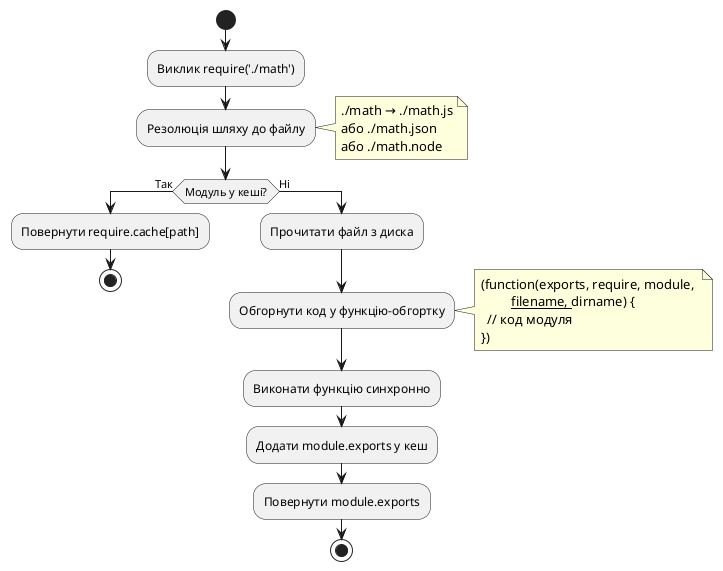
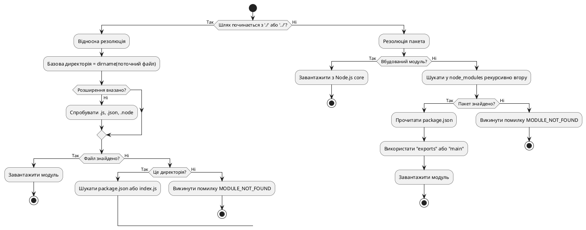

# Модульні системи: CommonJS vs ES Modules

::card-group

::card{title="🎯 Мета лекції" icon="i-lucide-target"}

- Зрозуміти еволюцію модульних систем у JavaScript та проблеми, які вони вирішують.
- Опанувати синтаксис CommonJS (`require`, `module.exports`) та його внутрішній механізм роботи.
- Вивчити ES Modules (`import`, `export`) та їхні переваги над CommonJS.
- Навчитися працювати з інтероперабельністю між двома системами модулів.
- Розібратися з конфігурацією `package.json` та полем `"type"`.
- Усвідомити стратегії міграції на ES Modules у 2026 році.

::

::card{title="🔑 Ключові терміни" icon="i-lucide-key"}

- **Модуль (Module):** ізольований шматок коду з власною областю видимості, що експортує публічне API.
- **CommonJS (CJS):** модульна система Node.js за замовчуванням до версії 13, синхронна та динамічна.
- **ES Modules (ESM):** стандарт ECMAScript для модулів, статичний аналіз, асинхронне завантаження.
- **Named Export:** експорт іменованих сутностей (`export const foo`).
- **Default Export:** експорт єдиного головного значення (`export default`).
- **Module Resolution:** алгоритм пошуку та завантаження модулів з файлової системи або `node_modules`.

::

::

## Проблема глобального простору імен

До появи модульних систем JavaScript-код у браузері та на сервері виконувався у **глобальній області видимості**. Усі змінні, функції та об'єкти були доступні звідусіль, що призводило до конфліктів імен та непередбачуваної поведінки.

### Еволюція організації коду

**Етап 1: Один великий файл (2000-2005)**

```javascript
// app.js (5000 рядків)
var userCount = 0;
function createUser(name) { /* ... */ }
function deleteUser(id) { /* ... */ }
function formatDate(date) { /* ... */ }
function validateEmail(email) { /* ... */ }
// ... ще 4950 рядків
```

**Проблеми:**
- Неможливо розділити обов'язки між розробниками
- Складність навігації по коду
- Ризик конфліктів імен при додаванні нової функціональності

**Етап 2: Кілька файлів + глобальні змінні (2005-2009)**

```html
<script src="utils.js"></script>
<script src="validation.js"></script>
<script src="users.js"></script>
<script src="app.js"></script>
```

```javascript
// utils.js
var APP = APP || {};
APP.utils = {
  formatDate: function(date) { /* ... */ }
};

// users.js
var APP = APP || {};
APP.users = {
  create: function(name) { /* ... */ }
};
```

**Проблеми:**
- Порядок підключення скриптів критичний (якщо `app.js` завантажиться раніше `utils.js` — помилка)
- Забруднення глобального простору імен об'єктом `APP`
- Відсутність інкапсуляції: будь-який код може модифікувати `APP.utils`

**Етап 3: IIFE (Immediately Invoked Function Expression) — патерн Module (2009-2013)**

```javascript
// utils.js
var Utils = (function() {
  // Приватна змінна
  var privateCounter = 0;
  
  // Публічне API
  return {
    formatDate: function(date) {
      privateCounter++;
      return date.toISOString();
    },
    getCallCount: function() {
      return privateCounter;
    }
  };
})();
```

**Переваги:**
- Справжня інкапсуляція через замикання (*closure*)
- Приватні змінні недоступні ззовні
- Контроль над експортованим API

**Недоліки:**
- Досі немає автоматичного механізму завантаження залежностей
- Порядок скриптів у HTML все ще критичний
- Відсутність стандартизованого способу оголошення залежностей

::note
Саме ці проблеми призвели до створення **модульних систем**: спочатку CommonJS для серверного JavaScript (Node.js, 2009), а згодом — офіційного стандарту ES Modules (2015).
::

## CommonJS: модульна система Node.js

У 2009 році разом із Node.js з'явилася модульна система **CommonJS** — перша стандартизована спроба вирішити проблему організації серверного JavaScript-коду.

### Фундаментальні принципи CommonJS

**1. Кожен файл — окремий модуль**

Кожен `.js` файл у Node.js автоматично стає модулем з власною областю видимості. Змінні, оголошені у файлі, **не потрапляють у глобальну область видимості**.

```javascript
// math.js
const PI = 3.14159;

function calculateCircleArea(radius) {
  return PI * radius * radius;
}

console.log('Math module loaded');
```

При завантаженні цього модуля константа `PI` та функція `calculateCircleArea` **недоступні** зовні. Вони існують лише всередині модуля.

**2. Явний експорт через module.exports**

Щоб зробити функціональність доступною іншим модулям, потрібно явно експортувати її через об'єкт `module.exports`:

```javascript
// math.js (CommonJS — для прикладу)
const PI = 3.14159;

function calculateCircleArea(radius) {
  return PI * radius * radius;
}

function calculateCircleCircumference(radius) {
  return 2 * PI * radius;
}

// Експорт публічного API
module.exports = {
  calculateArea: calculateCircleArea,
  calculateCircumference: calculateCircleCircumference,
  PI: PI
};
```

**ESM-еквівалент (сучасний підхід):**

```javascript
// math.js (ES Modules)
export const PI: number = 3.14159;

export function calculateCircleArea(radius: number): number {
  return PI * radius * radius;
}

export function calculateCircleCircumference(radius: number): number {
  return 2 * PI * radius;
}
```

**3. Імпорт через require()**

Інші модулі завантажують цей модуль за допомогою функції `require()`:

```javascript
// app.js (CommonJS — для прикладу)
const math = require('./math');

console.log(math.PI); // 3.14159
console.log(math.calculateArea(5)); // 78.53975
console.log(math.calculateCircumference(5)); // 31.4159
```

**ESM-еквівалент:**

```javascript
// app.js (ES Modules)
import { PI, calculateCircleArea, calculateCircleCircumference } from './math.js';

console.log(PI); // 3.14159
console.log(calculateCircleArea(5)); // 78.53975
console.log(calculateCircleCircumference(5)); // 31.4159
```

::tip
**Шлях до модуля:**
- Відносні шляхи: `'./math'`, `'../utils/helpers'` — завантажують локальні файли (розширення `.js` можна опустити).
- Імена пакетів: `'express'`, `'lodash'` — завантажують модулі з `node_modules`.
- Вбудовані модулі: `'fs'`, `'http'`, `'path'` — завантажують стандартні модулі Node.js без префіксу.
::

### Внутрішній механізм роботи CommonJS

Коли Node.js виконує `require('./math')`, відбувається наступна послідовність дій:

::steps

### Крок 1: Резолюція шляху (Module Resolution)

Node.js визначає абсолютний шлях до файлу модуля:
- Якщо шлях відносний (`./`, `../`) — резолюція відбувається відносно поточного файлу.
- Якщо це ім'я пакета — Node.js шукає у `node_modules` (спочатку в поточній директорії, потім у батьківських).
- Якщо розширення не вказане — Node.js спробує `.js`, `.json`, `.node` по черзі.

### Крок 2: Перевірка кешу модулів

Node.js перевіряє глобальний об'єкт `require.cache`. Якщо модуль вже завантажувався раніше, повертається **кешована версія** без повторного виконання коду.

```javascript
// math.js (CommonJS — для прикладу)
console.log('Math module loaded');
module.exports = { PI: 3.14 };

// app.js
const math1 = require('./math'); // Виведе: "Math module loaded"
const math2 = require('./math'); // Нічого не виведе (кеш!)

console.log(math1 === math2); // true (той самий об'єкт)
```

**Примітка:** В ESM кешування працює інакше — модулі імпортуються як зв'язки (bindings), а не як копії значень.

### Крок 3: Обгортка модуля у функцію

Node.js **не виконує код модуля напряму**. Спочатку він обгортає його у спеціальну функцію:

```javascript
// Обгортка, яку Node.js створює навколо кожного модуля (CommonJS):
(function(exports, require, module, __filename, __dirname) {
  // ВАШ КОД МОДУЛЯ ТУТ
  const PI = 3.14159;
  module.exports = { PI };
});
```

Це створює ізольовану область видимості та надає модулю доступ до:
- `exports` — скорочена форма `module.exports`
- `require` — функція для завантаження інших модулів
- `module` — об'єкт поточного модуля
- `__filename` — абсолютний шлях до файлу модуля
- `__dirname` — абсолютний шлях до директорії модуля

### Крок 4: Виконання коду модуля

Node.js викликає обгорткову функцію, передаючи їй аргументи. Код модуля виконується **синхронно**.

### Крок 5: Повернення module.exports

Після виконання модуля Node.js повертає об'єкт `module.exports` у викликаючий код. Цей об'єкт кешується для наступних викликів `require()`.

::

::plant-uml{alt="Життєвий цикл завантаження модуля CommonJS"}



::

### Варіації експорту у CommonJS

**Спосіб 1: Експорт об'єкта з методами**

```javascript
// logger.js (CommonJS — для прикладу)
module.exports = {
  info: function(message) {
    console.log('[INFO]', message);
  },
  error: function(message) {
    console.error('[ERROR]', message);
  }
};

// Використання
const logger = require('./logger');
logger.info('Server started');
```

**ESM-еквівалент:**

```typescript
// logger.ts (ES Modules)
export function info(message: string): void {
  console.log('[INFO]', message);
}

export function error(message: string): void {
  console.error('[ERROR]', message);
}

// Використання
import { info, error } from './logger.js';
info('Server started');
```

**Спосіб 2: Експорт функції**

```javascript
// createServer.js (CommonJS — для прикладу)
module.exports = function(port) {
  const server = require('http').createServer();
  server.listen(port);
  return server;
};

// Використання
const createServer = require('./createServer');
const server = createServer(3000);
```

**ESM-еквівалент:**

```typescript
// createServer.ts (ES Modules)
import http from 'node:http';

export default function createServer(port: number): http.Server {
  const server = http.createServer();
  server.listen(port);
  return server;
}

// Використання
import createServer from './createServer.js';
const server = createServer(3000);
```

**Спосіб 3: Експорт класу**

```javascript
// User.js (CommonJS — для прикладу)
class User {
  constructor(name, email) {
    this.name = name;
    this.email = email;
  }
  
  greet() {
    return `Hello, ${this.name}!`;
  }
}

module.exports = User;

// Використання
const User = require('./User');
const user = new User('Alice', 'alice@example.com');
console.log(user.greet());
```

**ESM-еквівалент:**

```typescript
// User.ts (ES Modules)
export class User {
  constructor(
    public readonly name: string,
    public readonly email: string
  ) {}

  greet(): string {
    return `Hello, ${this.name}!`;
  }
}

// Використання
import { User } from './User.js';
const user = new User('Alice', 'alice@example.com');
console.log(user.greet());
```

**Спосіб 4: Поступове додавання до exports**

```javascript
// utils.js (CommonJS — для прикладу)
exports.formatDate = function(date) {
  return date.toISOString();
};

exports.capitalize = function(str) {
  return str.charAt(0).toUpperCase() + str.slice(1);
};

exports.VERSION = '1.0.0';

// Використання
const utils = require('./utils');
console.log(utils.formatDate(new Date()));
```

**ESM-еквівалент:**

```typescript
// utils.ts (ES Modules)
export function formatDate(date: Date): string {
  return date.toISOString();
}

export function capitalize(str: string): string {
  return str.charAt(0).toUpperCase() + str.slice(1);
}

export const VERSION: string = '1.0.0';

// Використання
import { formatDate } from './utils.js';
console.log(formatDate(new Date()));
```

::warning
**Важливо:** `exports` — це лише **посилання** на `module.exports`. Якщо ви перезапишете `exports` цілком, зв'язок розірветься:

```javascript
// ❌ ПОГАНО: Це не спрацює! (CommonJS)
exports = { foo: 'bar' };

// ✅ ДОБРЕ: Це працює (CommonJS)
module.exports = { foo: 'bar' };

// ✅ ТЕЖ ДОБРЕ: Додавання властивостей (CommonJS)
exports.foo = 'bar';

// ✅ ESM: Використовуйте export
export const foo = 'bar';
```
::


### Кешування модулів та require.cache

Node.js кешує завантажені модулі у глобальному об'єкті `require.cache`. Це означає, що код модуля виконується **лише один раз**, навіть якщо його імпортують з різних місць.

```javascript
// counter.js (CommonJS — для прикладу)
let count = 0;

module.exports = {
  increment() {
    count++;
  },
  getCount() {
    return count;
  }
};

// app.js
const counter1 = require('./counter');
const counter2 = require('./counter');

counter1.increment();
counter1.increment();

console.log(counter2.getCount()); // 2 (той самий об'єкт!)
console.log(counter1 === counter2); // true
```

**Перегляд кешу модулів:**

```javascript
console.log(require.cache);
// Виведе об'єкт із ключами — абсолютні шляхи до завантажених модулів

// Приклад виводу:
// {
//   '/Users/app/counter.js': Module {
//     id: '/Users/app/counter.js',
//     exports: { increment: [Function], getCount: [Function] },
//     loaded: true,
//     ...
//   }
// }
```

**Очищення кешу (рідкісний кейс):**

```javascript
// Видалити модуль із кешу (CommonJS — для прикладу)
delete require.cache[require.resolve('./counter')];

// Наступний require завантажить модуль заново
const freshCounter = require('./counter');
```

::note
Очищення кешу корисне у **тестуванні** (перезавантаження модуля між тестами) або у **hot-reload** системах, де код модуля змінюється під час виконання. У звичайному продакшн-коді це майже ніколи не потрібно.
::

### Циклічні залежності (Circular Dependencies)

Циклічні залежності виникають, коли модуль A імпортує модуль B, а модуль B імпортує модуль A. CommonJS дозволяє такі ситуації, але з обмеженнями.

```javascript
// a.js (CommonJS — для прикладу)
console.log('A: start');
exports.aValue = 'A';

const b = require('./b');
console.log('A: b.bValue =', b.bValue);

exports.aFunction = function() {
  console.log('Function from A');
};

console.log('A: end');

// b.js
console.log('B: start');
exports.bValue = 'B';

const a = require('./a');
console.log('B: a.aValue =', a.aValue);
console.log('B: a.aFunction =', a.aFunction); // undefined!

exports.bFunction = function() {
  console.log('Function from B');
};

console.log('B: end');

// main.js
const a = require('./a');
```

**Примітка:** В ESM циклічні залежності працюють інакше — зв'язки (bindings) створюються до завершення виконання модуля, тому uninitialized змінні повертають `undefined` лише до моменту їхньої ініціалізації.

::terminal-preview{title="node main.js"}

<div class="line"><span class="opacity-40">$</span> <strong class="font-bold">node main.js</strong></div>
<div class="line"><span class="text-blue-400">A: start</span></div>
<div class="line"><span class="text-green-400">B: start</span></div>
<div class="line"><span class="text-green-400">B: a.aValue =</span> A</div>
<div class="line"><span class="text-rose-400">B: a.aFunction =</span> undefined</div>
<div class="line"><span class="text-green-400">B: end</span></div>
<div class="line"><span class="text-blue-400">A: b.bValue =</span> B</div>
<div class="line"><span class="text-blue-400">A: end</span></div>

::

**Що відбувається:**

1. `main.js` завантажує `a.js`
2. `a.js` встановлює `exports.aValue = 'A'`
3. `a.js` викликає `require('./b')`
4. `b.js` встановлює `exports.bValue = 'B'`
5. `b.js` викликає `require('./a')` → Node.js **повертає неповний** `exports` з `a.js` (лише `aValue`, бо `aFunction` ще не додано)
6. `b.js` завершує виконання
7. `a.js` продовжує виконання і додає `aFunction`

::caution
**Уникайте циклічних залежностей!** Вони призводять до важкознайденних помилок, коли частина експортів модуля `undefined`. Рефакторіть код, виносячи спільну логіку у третій модуль.

```javascript
// ❌ ПОГАНО
// a.js → b.js → a.js

// ✅ ДОБРЕ
// a.js → shared.js
// b.js → shared.js
```
::

## ES Modules (ESM): стандарт ECMAScript

У 2015 році стандарт ECMAScript 2015 (ES6) офіційно представив **ES Modules** — модульну систему, вбудовану у саму мову JavaScript. На відміну від CommonJS, який є специфікою Node.js, ES Modules працюють **однаково в браузерах та на сервері**.

### Фундаментальні відмінності від CommonJS

| Характеристика | CommonJS | ES Modules |
|----------------|----------|------------|
| **Синтаксис** | `require()`, `module.exports` | `import`, `export` |
| **Завантаження** | Синхронне | Асинхронне |
| **Аналіз залежностей** | Динамічний (runtime) | Статичний (parse-time) |
| **Розширення файлів** | `.js` (за замовчуванням CJS) | `.mjs` або `.js` з `"type": "module"` |
| **Області видимості** | Обгортка у функцію | Нативна ізоляція модуля |
| **`this` у модулі** | `exports` об'єкт | `undefined` |
| **Кешування** | `require.cache` | Браузер/runtime кеш |
| **Циклічні залежності** | Підтримка з обмеженнями | Живі прив'язки (*live bindings*) |

### Базовий синтаксис ES Modules

**Named Exports (іменовані експорти):**

```javascript
// math.mjs
export const PI = 3.14159;

export function calculateArea(radius) {
  return PI * radius * radius;
}

export function calculateCircumference(radius) {
  return 2 * PI * radius;
}
```

**Імпорт іменованих експортів:**

```javascript
// app.mjs
import { PI, calculateArea, calculateCircumference } from './math.mjs';

console.log(PI); // 3.14159
console.log(calculateArea(5)); // 78.53975
```

**Default Export (експорт за замовчуванням):**

```javascript
// logger.mjs
export default class Logger {
  constructor(name) {
    this.name = name;
  }
  
  log(message) {
    console.log(`[${this.name}] ${message}`);
  }
}
```

**Імпорт default експорту:**

```javascript
// app.mjs
import Logger from './logger.mjs';

const logger = new Logger('App');
logger.log('Server started');
```

**Комбінований експорт:**

```javascript
// utils.mjs
export const VERSION = '1.0.0';

export function formatDate(date) {
  return date.toISOString();
}

export default {
  VERSION,
  formatDate
};
```

**Імпорт комбінованого експорту:**

```javascript
// app.mjs
import utils, { VERSION, formatDate } from './utils.mjs';

console.log(VERSION); // '1.0.0'
console.log(formatDate(new Date())); // '2026-09-02T...'
console.log(utils.VERSION); // '1.0.0' (той самий об'єкт)
```

### Варіації імпорту

**1. Імпорт з перейменуванням (aliasing):**

```javascript
import { calculateArea as calcArea, PI as pi } from './math.mjs';

console.log(calcArea(5));
console.log(pi);
```

**2. Імпорт усього у namespace:**

```javascript
import * as math from './math.mjs';

console.log(math.PI);
console.log(math.calculateArea(5));
```

**3. Імпорт лише для побічних ефектів:**

```javascript
// Виконує код модуля, але нічого не імпортує
import './init-database.mjs';
```

**4. Динамічний імпорт (async):**

```javascript
// Асинхронне завантаження модуля у runtime
async function loadModule() {
  const math = await import('./math.mjs');
  console.log(math.PI);
}

// Або з .then()
import('./math.mjs').then(math => {
  console.log(math.calculateArea(5));
});
```

::tip
**Динамічний `import()`** корисний для:
- **Code splitting:** завантаження модулів лише коли вони потрібні (зменшення початкового розміру бандла)
- **Умовне завантаження:** `if (condition) { await import('./module.mjs') }`
- **Lazy loading:** відкладене завантаження важких модулів до першого використання
::

### Статичний аналіз: перевага ESM

На відміну від CommonJS, де `require()` — це звичайна функція, яку можна викликати де завгодно, `import` та `export` — це **синтаксичні конструкції**, які аналізуються **до виконання коду**.

**CommonJS (динамічний):**

```javascript
// CommonJS: Умовний імпорт (для прикладу)
if (process.env.NODE_ENV === 'production') {
  module.exports = require('./prod-config');
} else {
  module.exports = require('./dev-config');
}

// CommonJS: Імпорт у циклі
for (const moduleName of moduleNames) {
  require(`./plugins/${moduleName}`);
}
```

**ESM-еквівалент:**

```typescript
// ES Modules: Динамічний імпорт
const config = process.env.NODE_ENV === 'production'
  ? await import('./prod-config.js')
  : await import('./dev-config.js');

// ES Modules: Імпорт у циклі
for (const moduleName of moduleNames) {
  const plugin = await import(`./plugins/${moduleName}.js`);
}
```

**ES Modules (статичний):**

```javascript
// ❌ ПОМИЛКА: import не може бути всередині if
if (condition) {
  import { foo } from './module.mjs'; // SyntaxError!
}

// ✅ ПРАВИЛЬНО: Використовуйте динамічний import()
if (condition) {
  const module = await import('./module.mjs');
  module.foo();
}
```

**Переваги статичного аналізу:**

1. **Tree Shaking:** інструменти збірки (Webpack, Rollup, esbuild) можуть визначити, які експорти **не використовуються**, і видалити мертвий код.

```javascript
// math.mjs
export function usedFunction() { /* ... */ }
export function unusedFunction() { /* ... */ } // ← Буде видалено при збірці

// app.mjs
import { usedFunction } from './math.mjs';
```

2. **Перевірка помилок на етапі парсингу:** компілятори та лінтери можуть виявити неіснуючі імпорти **до запуску програми**.

```javascript
import { nonExistentFunction } from './math.mjs'; // ← Помилка на етапі збірки/lint
```

3. **Оптимізація завантаження:** браузери можуть **паралельно** завантажувати модулі, аналізуючи граф залежностей до виконання.

::plant-uml{alt="Порівняння завантаження CommonJS vs ES Modules"}

```plantuml
@startuml
skinparam style plain
skinparam backgroundColor #FFFFFF

title CommonJS: Синхронне послідовне завантаження

rectangle "main.js" as Main1 #DBEAFE
rectangle "moduleA.js" as A1 #E2E8F0
rectangle "moduleB.js" as B1 #FEF3C7
rectangle "moduleC.js" as C1 #DCFCE7

Main1 -right-> A1 : require('./A')
note right : Блокує виконання
A1 -right-> B1 : require('./B')
note right : Блокує виконання
B1 -right-> C1 : require('./C')
note right : Блокує виконання

newpage

title ES Modules: Асинхронне паралельне завантаження

rectangle "main.mjs" as Main2 #DBEAFE
rectangle "moduleA.mjs" as A2 #E2E8F0
rectangle "moduleB.mjs" as B2 #FEF3C7
rectangle "moduleC.mjs" as C2 #DCFCE7

Main2 -right-> A2 : import './A'
Main2 -down-> B2 : import './B'
Main2 -down-> C2 : import './C'

note bottom
  Модулі завантажуються паралельно
  після аналізу графа залежностей
end note

@enduml
```



::


### Live Bindings: перевага ESM у циклічних залежностях

У CommonJS експортовані значення копіюються при імпорті. У ES Modules створюються **живі прив'язки** (*live bindings*) — імпортер завжди бачить актуальне значення експортованої змінної.

**CommonJS (копіювання значень):**

```javascript
// counter.js (CommonJS — для прикладу)
let count = 0;

function increment() {
  count++;
}

module.exports = { count, increment };

// app.js
const counter = require('./counter');

console.log(counter.count); // 0
counter.increment();
console.log(counter.count); // 0 (!) — значення скопійовано при імпорті
```

**ESM-еквівалент:**

```typescript
// counter.ts (ES Modules — live bindings)
export let count: number = 0;

export function increment(): void {
  count++;
}

// app.ts
import { count, increment } from './counter.js';

console.log(count); // 0
increment();
console.log(count); // 1 — зв'язка актуалізується автоматично
```

**ES Modules (живі прив'язки):**

```javascript
// counter.mjs
export let count = 0;

export function increment() {
  count++;
}

// app.mjs
import { count, increment } from './counter.mjs';

console.log(count); // 0
increment();
console.log(count); // 1 (!) — бачимо актуальне значення
```

::note
Це особливо корисно у **циклічних залежностях**, де модулі взаємодіють до повного завантаження один одного. ESM гарантує, що імпортер завжди бачить найсвіжіші дані.
::

**Обмеження: неможливо змінити імпортоване значення**

```javascript
// counter.mjs
export let count = 0;

// app.mjs
import { count } from './counter.mjs';

count = 10; // TypeError: Assignment to constant variable.
```

Імпортовані змінні доступні **лише для читання**. Змінювати їх можна лише всередині модуля, що експортує.

## Конфігурація модульної системи у package.json

Node.js визначає, яку модульну систему використовувати для файлу `.js`, на основі **контексту**:

### Поле "type" у package.json

```json
{
  "name": "my-app",
  "version": "1.0.0",
  "type": "module"
}
```

**Можливі значення:**

| Значення | Інтерпретація `.js` файлів | Для CommonJS використовуйте |
|----------|----------------------------|----------------------------|
| `"module"` | ES Modules | `.cjs` розширення |
| `"commonjs"` (за замовчуванням) | CommonJS | `.mjs` для ESM |

### Розширення файлів

| Розширення | Завжди інтерпретується як |
|------------|---------------------------|
| `.mjs` | ES Modules |
| `.cjs` | CommonJS |
| `.js` | Залежить від `"type"` у `package.json` |

**Приклад структури проєкту з ESM:**

::code-tree

```json [package.json]
{
  "name": "esm-app",
  "type": "module",
  "main": "index.js"
}
```

```javascript [index.js]
// Інтерпретується як ESM
import { createServer } from './server.js';

createServer(3000);
```

```javascript [server.js]
import http from 'http';

export function createServer(port) {
  const server = http.createServer((req, res) => {
    res.end('Hello ESM!');
  });
  server.listen(port);
  return server;
}
```

```javascript [legacy.cjs]
// Для сумісності з CommonJS (файл legacy.cjs)
const fs = require('fs');

module.exports = function readConfig() {
  return JSON.parse(fs.readFileSync('./config.json', 'utf8'));
};
```

::

### Поля "main", "module" та "exports"

Для публічних npm-пакетів важливо правильно налаштувати точки входу:

```json
{
  "name": "my-library",
  "version": "2.0.0",
  "main": "./dist/index.cjs",
  "module": "./dist/index.mjs",
  "exports": {
    ".": {
      "import": "./dist/index.mjs",
      "require": "./dist/index.cjs"
    },
    "./utils": {
      "import": "./dist/utils.mjs",
      "require": "./dist/utils.cjs"
    }
  }
}
```

**Пояснення полів:**

- **`main`:** точка входу для старих версій Node.js та бандлерів (зазвичай CommonJS).
- **`module`:** точка входу для інструментів, що підтримують ESM (Rollup, Webpack).
- **`exports`:** сучасний спосіб експорту з підтримкою **умовних експортів** (*conditional exports*).

::tip
**Поле `exports` — стандарт 2026 року.** Воно дозволяє:
- Експортувати різні версії для `import` та `require`
- Обмежити доступ до внутрішніх файлів пакета (приватність)
- Визначити кілька точок входу (subpath exports)
::

## Інтероперабельність: CommonJS ↔ ES Modules

Node.js дозволяє змішувати обидві модульні системи у одному проєкті, але з обмеженнями.

### Імпорт CommonJS у ES Modules

**✅ Можливо:** ES Modules можуть імпортувати CommonJS-модулі через default export:

```javascript
// legacy.cjs (CommonJS)
module.exports = {
  foo: 'bar',
  baz: 42
};

// app.mjs (ES Modules)
import legacy from './legacy.cjs';

console.log(legacy.foo); // 'bar'
console.log(legacy.baz); // 42
```

**⚠️ Обмеження:** Named imports не працюють напряму (лише через namespace):

```javascript
// ❌ НЕ ПРАЦЮЄ
import { foo } from './legacy.cjs'; // SyntaxError

// ✅ ПРАЦЮЄ
import * as legacy from './legacy.cjs';
console.log(legacy.default.foo);
```

### Імпорт ES Modules у CommonJS

**❌ Синхронний `require()` не працює:**

```javascript
// module.mjs (ES Module)
export const foo = 'bar';

// app.cjs (CommonJS)
const module = require('./module.mjs'); // Error: require() of ES Module not supported
```

**✅ Використовуйте динамічний `import()`:**

```javascript
// app.cjs
(async () => {
  const module = await import('./module.mjs');
  console.log(module.foo); // 'bar'
})();
```

::warning
**Ключове обмеження:** CommonJS не може **синхронно** завантажувати ES Modules, оскільки ESM завантажуються асинхронно. Це фундаментальна відмінність між двома системами.
::

### Практичні стратегії міграції

**Стратегія 1: Dual Package (підтримка обох форматів)**

Публікуйте пакет у двох версіях:

```json
{
  "exports": {
    ".": {
      "import": "./dist/index.mjs",
      "require": "./dist/index.cjs"
    }
  }
}
```

**Стратегія 2: Поступова міграція зсередини**

1. Додайте `"type": "module"` у `package.json`
2. Перейменуйте всі `.js` файли на `.mjs`
3. Замініть `require()` на `import`, `module.exports` на `export`
4. Тестуйте модуль за модулем
5. Коли все мігровано, видаліть розширення `.mjs` (залишіть `.js`)

**Стратегія 3: Гібридний проєкт**

Використовуйте CommonJS для конфігураційних файлів та ESM для основного коду:

```
project/
├── package.json       ("type": "module")
├── src/
│   ├── index.js       (ESM)
│   ├── server.js      (ESM)
│   └── utils.js       (ESM)
├── config/
│   └── database.cjs   (CommonJS для сумісності)
└── scripts/
    └── build.cjs      (CommonJS для Node.js-скриптів)
```

## Barrel Files: організація експортів

**Barrel file** — це файл `index.js`, який реекспортує модулі з директорії для зручного імпорту.

**Без barrel file:**

```javascript
// app.js
import { User } from './models/User.js';
import { Post } from './models/Post.js';
import { Comment } from './models/Comment.js';
```

**З barrel file:**

```javascript
// models/index.js
export { User } from './User.js';
export { Post } from './Post.js';
export { Comment } from './Comment.js';

// app.js
import { User, Post, Comment } from './models/index.js';
// або коротше (якщо Node.js резолвить index.js автоматично)
import { User, Post, Comment } from './models';
```

::tip
**Переваги barrel files:**
- Зручніший імпорт (один рядок замість трьох)
- Контроль над публічним API директорії
- Легше рефакторити внутрішню структуру без зміни імпортів

**Недоліки:**
- Додатковий рівень непрямості
- Може уповільнити tree shaking (всі модулі завантажуються разом)
::

**Реекспорт усього з модуля:**

```javascript
// index.js
export * from './User.js';
export * from './Post.js';

// Або з перейменуванням
export * as UserModule from './User.js';
```


## Module Resolution: як Node.js шукає модулі

Коли ви пишете `import 'express'` або `require('./utils')`, Node.js виконує складний алгоритм пошуку модуля. Розуміння цього процесу критично для налагодження помилок типу "Cannot find module".

### Алгоритм резолюції для відносних шляхів

**Для `import './math.js'` або `require('./math')`:**

::steps

### Крок 1: Визначення базової директорії

Node.js використовує директорію **поточного файлу** (не `process.cwd()`!) як базову для резолюції.

```javascript
// /Users/app/src/controllers/userController.js
import { formatDate } from '../utils/date.js';
// Резолюція: /Users/app/src/utils/date.js
```

### Крок 2: Додавання розширення (для CommonJS)

Якщо розширення не вказано у CommonJS, Node.js пробує:
1. `math.js`
2. `math.json`
3. `math.node` (нативний addon)

**Для ESM розширення обов'язкове:**

```javascript
// ❌ ПОМИЛКА в ESM
import { PI } from './math'; // Error: Cannot find module

// ✅ ПРАВИЛЬНО
import { PI } from './math.js';
```

### Крок 3: Резолюція директорії (якщо шлях — директорія)

Якщо шлях вказує на директорію, Node.js шукає:
1. `directory/package.json` → поле `"main"` або `"exports"`
2. `directory/index.js`
3. `directory/index.json`
4. `directory/index.node`

::

### Алгоритм резолюції для пакетів (без `.` або `/`)

**Для `import 'express'` або `require('lodash')`:**

::steps

### Крок 1: Перевірка вбудованих модулів

Node.js перевіряє, чи це вбудований модуль (`fs`, `http`, `path`, тощо). Якщо так — завантажує його без пошуку на диску.

```javascript
import fs from 'fs'; // Вбудований модуль, не шукає на диску
import express from 'express'; // Сторонній пакет, шукає у node_modules
```

### Крок 2: Пошук у node_modules (рекурсивно вгору)

Node.js шукає директорію `node_modules` у такому порядку:

```
/Users/app/src/controllers/node_modules/express
/Users/app/src/node_modules/express
/Users/app/node_modules/express
/Users/node_modules/express
/node_modules/express
```

Зупиняється на першій знайденій.

### Крок 3: Резолюція точки входу пакета

Після знаходження директорії пакета Node.js читає `package.json`:

```json
{
  "name": "express",
  "main": "./lib/express.js",
  "exports": {
    ".": "./lib/express.js",
    "./package.json": "./package.json"
  }
}
```

- **ESM:** використовує `"exports"` → `"import"` умову
- **CommonJS:** використовує `"main"` або `"exports"` → `"require"` умову

::

::plant-uml{alt="Алгоритм Module Resolution у Node.js"}



::

### Поле "exports": Subpath Exports та умовні експорти

Сучасні пакети використовують поле `"exports"` для точного контролю над точками входу:

```json
{
  "name": "my-library",
  "exports": {
    ".": {
      "import": "./dist/index.mjs",
      "require": "./dist/index.cjs",
      "types": "./dist/index.d.ts"
    },
    "./utils": {
      "import": "./dist/utils.mjs",
      "require": "./dist/utils.cjs"
    },
    "./package.json": "./package.json"
  }
}
```

**Використання:**

```javascript
// Імпорт головного модуля
import lib from 'my-library';

// Імпорт підмодуля (subpath)
import { helper } from 'my-library/utils';

// ❌ ПОМИЛКА: доступ до внутрішніх файлів заблоковано
import internal from 'my-library/dist/internal.js'; // Error
```

::note
**Захист приватності:** поле `"exports"` **блокує** доступ до файлів, які не вказані явно. Це дозволяє авторам пакетів приховувати внутрішню реалізацію.
::

## Практичні приклади: організація модулів у проєкті

### Приклад 1: Утилітарна бібліотека (ESM)

::code-tree

```json [package.json]
{
  "name": "utils",
  "type": "module",
  "exports": {
    ".": "./index.js",
    "./string": "./src/string.js",
    "./date": "./src/date.js"
  }
}
```

```javascript [index.js]
export * from './src/string.js';
export * from './src/date.js';
```

```javascript [src/string.js]
export function capitalize(str) {
  return str.charAt(0).toUpperCase() + str.slice(1);
}

export function truncate(str, maxLength) {
  return str.length > maxLength 
    ? str.slice(0, maxLength) + '...' 
    : str;
}
```

```javascript [src/date.js]
export function formatDate(date) {
  return date.toISOString().split('T')[0];
}

export function addDays(date, days) {
  const result = new Date(date);
  result.setDate(result.getDate() + days);
  return result;
}
```

::

**Використання:**

```javascript
// Імпорт усіх утиліт
import { capitalize, formatDate } from 'utils';

// Імпорт специфічних модулів
import { truncate } from 'utils/string';
import { addDays } from 'utils/date';
```

### Приклад 2: REST API сервер (MVC структура)

::code-tree

```json [package.json]
{
  "name": "api-server",
  "type": "module",
  "main": "src/index.js"
}
```

```javascript [src/index.js]
import express from 'express';
import { router as userRouter } from './routes/users.js';
import { router as postRouter } from './routes/posts.js';

const app = express();

app.use('/api/users', userRouter);
app.use('/api/posts', postRouter);

app.listen(3000, () => {
  console.log('Server running on :3000');
});
```

```javascript [src/routes/users.js]
import express from 'express';
import * as userController from '../controllers/userController.js';

export const router = express.Router();

router.get('/', userController.getAllUsers);
router.get('/:id', userController.getUserById);
router.post('/', userController.createUser);
```

```javascript [src/controllers/userController.js]
import * as userService from '../services/userService.js';

export async function getAllUsers(req, res) {
  const users = await userService.findAll();
  res.json(users);
}

export async function getUserById(req, res) {
  const user = await userService.findById(req.params.id);
  res.json(user);
}

export async function createUser(req, res) {
  const user = await userService.create(req.body);
  res.status(201).json(user);
}
```

```javascript [src/services/userService.js]
import { db } from '../database/connection.js';

export async function findAll() {
  return db.query('SELECT * FROM users');
}

export async function findById(id) {
  const [user] = await db.query('SELECT * FROM users WHERE id = ?', [id]);
  return user;
}

export async function create(userData) {
  const result = await db.query('INSERT INTO users SET ?', [userData]);
  return { id: result.insertId, ...userData };
}
```

::

### Приклад 3: Плагін-система з динамічним завантаженням

```javascript
// plugin-loader.js
export async function loadPlugins(pluginNames) {
  const plugins = [];
  
  for (const name of pluginNames) {
    try {
      const module = await import(`./plugins/${name}.js`);
      plugins.push(module.default);
      console.log(`✓ Plugin "${name}" loaded`);
    } catch (error) {
      console.error(`✗ Failed to load plugin "${name}":`, error.message);
    }
  }
  
  return plugins;
}

export function executePlugins(plugins, data) {
  for (const plugin of plugins) {
    if (typeof plugin.process === 'function') {
      data = plugin.process(data);
    }
  }
  return data;
}

// app.js
import { loadPlugins, executePlugins } from './plugin-loader.js';

const plugins = await loadPlugins(['logger', 'validator', 'transformer']);
const result = executePlugins(plugins, { text: 'Hello, World!' });
```

::terminal-preview{title="node app.js"}

<div class="line"><span class="opacity-40">$</span> <strong class="font-bold">node app.js</strong></div>
<div class="line"><span class="text-green-400 font-bold">✓</span> Plugin "logger" loaded</div>
<div class="line"><span class="text-green-400 font-bold">✓</span> Plugin "validator" loaded</div>
<div class="line"><span class="text-green-400 font-bold">✓</span> Plugin "transformer" loaded</div>
<div class="line"></div>
<div class="line"><span class="text-blue-400">[Logger Plugin]</span> Processing data...</div>
<div class="line"><span class="text-blue-400">[Validator Plugin]</span> Data is valid ✓</div>
<div class="line"><span class="text-blue-400">[Transformer Plugin]</span> Text transformed to uppercase</div>
<div class="line"></div>
<div class="line">Result: <span class="text-green-400 font-bold">{ text: 'HELLO, WORLD!' }</span></div>

::


## Коли використовувати CommonJS, коли ES Modules

Вибір модульної системи залежить від контексту проєкту, цільового середовища та вимог до сумісності.

::tabs

::tabs-item{label="ES Modules (рекомендовано)" icon="i-lucide-check-circle"}

**✅ Використовуйте ESM для:**

- **Нових проєктів у 2026 році** — це стандарт майбутнього
- **Бібліотек та пакетів** — краща сумісність з інструментами збірки
- **Фронтенд-коду** — сумісність з браузерами без транспіляції
- **Tree shaking** — автоматичне видалення невикористаного коду
- **Статичного аналізу** — перевірка помилок на етапі збірки
- **TypeScript-проєктів** — нативна підтримка ESM у TypeScript 4.7+

**Приклад налаштування:**

```json
{
  "name": "modern-app",
  "type": "module",
  "engines": {
    "node": ">=18.0.0"
  }
}
```

::

::tabs-item{label="CommonJS (legacy)" icon="i-lucide-archive"}

**✅ Використовуйте CommonJS для:**

- **Підтримки старих версій Node.js** (< 12.20)
- **Конфігураційних файлів** (`webpack.config.js`, `.eslintrc.js`)
- **Скриптів збірки та CLI-утиліт** — швидший запуск (синхронне завантаження)
- **Динамічного завантаження** на основі умов runtime
- **Сумісності з екосистемою** — деякі пакети досі не підтримують ESM

**Приклад налаштування:**

```json
{
  "name": "legacy-app",
  "type": "commonjs",
  "engines": {
    "node": ">=14.0.0"
  }
}
```

::

::tabs-item{label="Гібридний підхід" icon="i-lucide-git-branch"}

**✅ Використовуйте обидві системи для:**

- **Міграції з CommonJS на ESM** — поступовий перехід
- **Публічних npm-пакетів** — максимальна сумісність
- **Monorepo з різними цільовими середовищами**

**Приклад dual package:**

```json
{
  "name": "universal-lib",
  "type": "module",
  "main": "./dist/index.cjs",
  "module": "./dist/index.mjs",
  "exports": {
    ".": {
      "import": "./dist/index.mjs",
      "require": "./dist/index.cjs"
    }
  }
}
```

::

::

### Порівняльна таблиця: CommonJS vs ES Modules

| Критерій | CommonJS | ES Modules |
|----------|----------|------------|
| **Стандарт** | Специфіка Node.js | ECMAScript офіційний стандарт |
| **Синтаксис** | `require()`, `module.exports` | `import`, `export` |
| **Завантаження** | Синхронне | Асинхронне |
| **Аналіз залежностей** | Runtime (динамічний) | Parse-time (статичний) |
| **Tree shaking** | ❌ Неможливий | ✅ Повна підтримка |
| **Циклічні залежності** | Часткова підтримка | Live bindings |
| **Top-level await** | ❌ Не підтримується | ✅ Підтримується |
| **Кешування** | `require.cache` | Runtime кеш |
| **Швидкість запуску** | Швидше (синхронний) | Повільніше (асинхронний) |
| **Браузерна підтримка** | ❌ Потребує бандлера | ✅ Нативна підтримка |
| **Динамічний import** | `require(variable)` | `import(variable)` |
| **Файлові розширення** | `.js` (CJS за замовчуванням) | `.mjs` або `.js` з `"type": "module"` |

## Node.js 26: ES Modules за замовчуванням

Починаючи з **Node.js 26** (очікується у квітні 2027), планується зробити **ES Modules форматом за замовчуванням** для `.js` файлів навіть без `"type": "module"` у `package.json`.

### Що зміниться

**До Node.js 26 (поточна поведінка):**

```javascript
// app.js (без "type": "module" у package.json)
const express = require('express'); // ✅ CommonJS за замовчуванням
```

**ESM (сучасний підхід):**

```typescript
// app.ts (ES Modules)
import express from 'express';
```

**Після Node.js 26 (прогноз):**

```javascript
// app.js (без "type" у package.json)
import express from 'express'; // ✅ ESM за замовчуванням

// Для CommonJS потрібно явно вказати:
// 1. Розширення .cjs
// 2. Або "type": "commonjs" у package.json
```

### Рекомендації щодо підготовки

::steps

### Крок 1: Оновіть package.json

Додайте явне поле `"type"` до всіх проєктів:

```json
{
  "type": "module"  // або "commonjs"
}
```

### Крок 2: Використовуйте явні розширення

У ESM завжди вказуйте розширення `.js` в імпортах:

```javascript
// ❌ Може не працювати у майбутньому
import { helper } from './utils';

// ✅ Явне розширення
import { helper } from './utils.js';
```

### Крок 3: Мігруйте конфігураційні файли

Конфігураційні файли, що використовують CommonJS, перейменуйте на `.cjs`:

```
webpack.config.js → webpack.config.cjs
jest.config.js → jest.config.cjs
.eslintrc.js → .eslintrc.cjs
```

### Крок 4: Оновіть інструменти збірки

Переконайтеся, що всі інструменти у вашому проєкті підтримують ESM:

- **Webpack 5+** — повна підтримка ESM
- **Vite** — ESM за замовчуванням
- **esbuild** — нативна підтримка ESM
- **TypeScript 4.7+** — покращена підтримка ESM

::

## Налагодження помилок модулів

### Помилка: "Cannot find module"

```
Error: Cannot find module './utils'
```

**Причини та рішення:**

::accordion

::accordion-item{label="1. Відсутнє розширення файлу (ESM)" icon="i-lucide-file-warning"}

У ES Modules розширення **обов'язкове**:

```javascript
// ❌ ПОМИЛКА
import { helper } from './utils';

// ✅ ПРАВИЛЬНО
import { helper } from './utils.js';
```

::

::accordion-item{label="2. Неправильний відносний шлях" icon="i-lucide-folder-tree"}

Перевірте, що шлях вказаний правильно відносно **поточного файлу**:

```javascript
// Структура:
// src/
//   controllers/
//     userController.js
//   services/
//     userService.js

// У userController.js:
import { findUser } from '../services/userService.js';
```

::

::accordion-item{label="3. Пакет не встановлено" icon="i-lucide-package"}

Якщо імпортуєте сторонній пакет, переконайтеся, що він встановлений:

```bash
npm install express
# або
pnpm add express
```

::

::accordion-item{label="4. Неправильне поле exports у package.json" icon="i-lucide-settings"}

Якщо пакет використовує поле `"exports"`, доступ можливий лише до експортованих підшляхів:

```json
// Пакет дозволяє лише:
{
  "exports": {
    ".": "./index.js",
    "./utils": "./utils.js"
  }
}

// ✅ Працює
import lib from 'my-lib';
import utils from 'my-lib/utils';

// ❌ НЕ працює (не експортовано)
import internal from 'my-lib/internal.js';
```

::

::

### Помилка: "require() of ES Module not supported"

```
Error [ERR_REQUIRE_ESM]: require() of ES module ./app.mjs not supported
```

**Причина:** CommonJS-файл намагається синхронно завантажити ES Module.

**Рішення:**

```javascript
// ❌ ПОГАНО
const module = require('./esm-module.mjs'); // Error: require() of ES Module not supported

// ✅ ДОБРЕ: Використовуйте динамічний import
(async () => {
  const module = await import('./esm-module.mjs');
  console.log(module.default);
})();
```

### Помилка: "Named export not found"

```
SyntaxError: The requested module './module.cjs' does not provide an export named 'foo'
```

**Причина:** Спроба іменованого імпорту з CommonJS-модуля.

**Рішення:**

```javascript
// CommonJS module (module.cjs)
module.exports = { foo: 'bar', baz: 42 };

// ❌ ПОМИЛКА в ESM: named exports з CJS не підтримуються
import { foo } from './module.cjs';

// ✅ ПРАВИЛЬНО: default import
import module from './module.cjs';
console.log(module.foo);

// ✅ АБО: namespace import
import * as module from './module.cjs';
console.log(module.default.foo);
```

## Резюме та ключові висновки

::card-group

::card{title="✅ Що потрібно запам'ятати" icon="i-lucide-check-circle"}

- **CommonJS** — синхронна модульна система Node.js (`require`, `module.exports`)
- **ES Modules** — асинхронний стандарт ECMAScript (`import`, `export`)
- ESM дозволяє **tree shaking** та статичний аналіз залежностей
- Поле `"type": "module"` у package.json вмикає ESM для `.js` файлів
- ESM може імпортувати CommonJS, але не навпаки (лише через динамічний `import()`)
- У 2026 році **ES Modules — стандарт** для нових проєктів

::

::card{title="🎯 Практичні рекомендації" icon="i-lucide-lightbulb"}

- Використовуйте **ESM** для нових проєктів у 2026 році
- Завжди вказуйте **явні розширення** (`.js`) в ESM
- Публічні пакети мають підтримувати **обидва формати** через `"exports"`
- Уникайте **циклічних залежностей** (рефакторіть у третій модуль)
- Використовуйте **barrel files** для зручної організації експортів

::

::

### Інтерактивні запитання для самоперевірки

::accordion

::accordion-item{label="❓ Чому у ES Modules обов'язково вказувати розширення файлу?" icon="i-lucide-help-circle"}

ES Modules розроблялися як **крос-платформний стандарт**, що працює однаково у браузерах та Node.js. Браузери не можуть "перебирати" можливі розширення (`.js`, `.json`, `.mjs`) через мережеві запити — це було б неефективно. Тому стандарт вимагає **явного розширення** для передбачуваності та продуктивності.

Node.js міг би додати автоматичну резолюцію розширень для ESM, але це порушило б сумісність з браузерним стандартом.

::

::accordion-item{label="❓ Що таке 'live bindings' у ES Modules?" icon="i-lucide-help-circle"}

**Live bindings** означають, що імпортована змінна — це не копія значення, а **пряме посилання** на експортовану змінну. Коли експортуюча сторона змінює значення, імпортуюча сторона **автоматично бачить нове значення**.

У CommonJS значення **копіюються** при імпорті, тому зміни в оригінальному модулі не відображаються у імпортері. Live bindings особливо корисні у **циклічних залежностях**, де модулі взаємодіють до повного завантаження.

::

::accordion-item{label="❓ Чому require.cache корисний у тестуванні?" icon="i-lucide-help-circle"}

При запуску тестів часто потрібно **перезавантажувати модуль** між тестами для скидання його стану (наприклад, лічильників, синглтонів, моків). Очищення `require.cache` дозволяє виконати код модуля заново, отримавши "свіжу" копію:

```javascript
// test.js (CommonJS — для прикладу)
beforeEach(() => {
  delete require.cache[require.resolve('./counter')];
});

it('should start from 0', () => {
  const counter = require('./counter');
  expect(counter.getCount()).toBe(0);
});
```

**Примітка:** У тестових фреймворках (Vitest, Jest з ESM) кешування керується автоматично.

Без очищення кешу всі тести отримували б **той самий об'єкт** модуля з накопиченим станом.

::

::accordion-item{label="❓ Чому поле 'exports' безпечніше за 'main'?" icon="i-lucide-help-circle"}

Поле `"main"` експортує **весь пакет**, дозволяючи доступ до будь-якого файлу:

```javascript
// З "main": "./index.js"
import pkg from 'my-lib'; // ✅ Працює
import internal from 'my-lib/src/internal.js'; // ✅ Теж працює (небезпечно!)
```

Поле `"exports"` дозволяє **явно вказати**, які шляхи доступні:

```json
{
  "exports": {
    ".": "./index.js",
    "./utils": "./utils.js"
  }
}
```

Тепер доступ до `my-lib/src/internal.js` **заборонено**. Це захищає внутрішню реалізацію від зовнішнього використання, дозволяючи авторам пакетів безпечно рефакторити код без ризику зламати залежні проєкти.

::

::

---

**Наступна лекція:** npm та package.json

У наступному матеріалі ми розглянемо систему управління пакетами npm, структуру `package.json`, семантичне версіонування, lock-файли, скрипти збірки та публікацію власних пакетів у npm registry.

