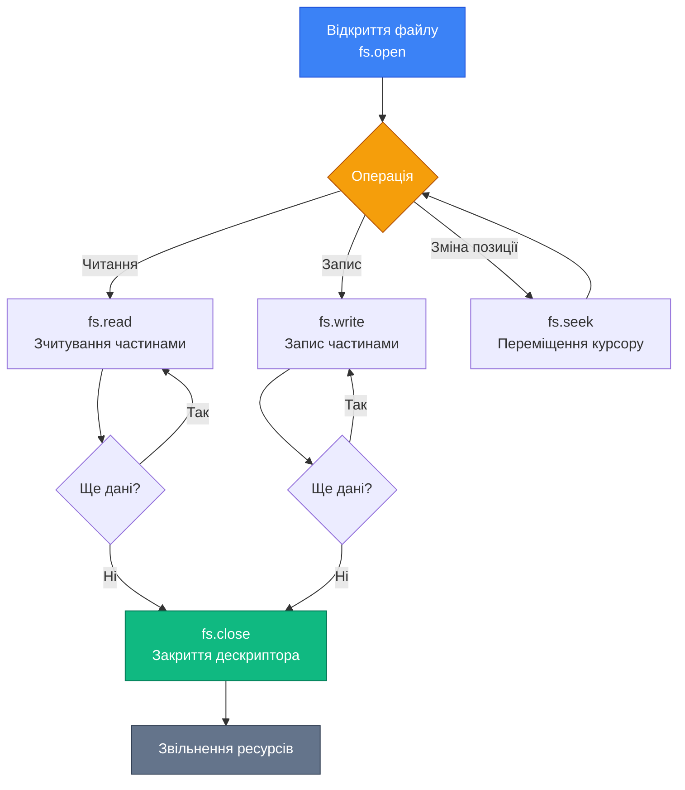

# Вбудований модуль fs (File System)

::card-group

::card{title="🎯 Мета лекції" icon="i-lucide-target"}

- Опанувати три підходи до роботи з файловою системою: синхронний, callback-based та Promise-based API.
- Навчитися читати та записувати файли з різними кодуваннями (UTF-8, binary, base64).
- Освоїти операції з директоріями: створення, читання вмісту, видалення.
- Зрозуміти відмінності між блокуючими та неблокуючими операціями файлового введення/виведення.
- Навчитися правильно обробляти помилки при роботі з файлами.

::

::card{title="🔑 Ключові терміни" icon="i-lucide-key"}

- **fs (File System):** вбудований модуль Node.js для роботи з файловою системою.
- **Синхронний API:** блокуючі операції, що зупиняють виконання до завершення (суфікс `Sync`).
- **Асинхронний API:** неблокуючі операції з callbacks або Promises.
- **File Descriptor:** числовий ідентифікатор відкритого файлу на рівні операційної системи.
- **Encoding:** кодування тексту (UTF-8, UTF-16, ASCII) або бінарних даних.

::

::

## Імпорт модуля fs: три підходи

Модуль `fs` є вбудованим у Node.js і не вимагає встановлення через npm. Існує три способи імпорту залежно від потрібного API:

::code-group

```javascript [CommonJS - Callback API]
const fs = require('fs');

// Асинхронне читання з callback
fs.readFile('file.txt', 'utf8', (err, data) => {
  if (err) {
    console.error('Error:', err);
    return;
  }
  console.log(data);
});
```

```javascript [CommonJS - Promises API]
const fs = require('fs').promises;
// або const { promises: fs } = require('fs');

// Асинхронне читання з Promise
fs.readFile('file.txt', 'utf8')
  .then(data => console.log(data))
  .catch(err => console.error('Error:', err));
```

```javascript [ES Modules - Promises API]
import fs from 'node:fs/promises';
// або import { readFile, writeFile } from 'node:fs/promises';

// Асинхронне читання з async/await
try {
  const data = await fs.readFile('file.txt', 'utf8');
  console.log(data);
} catch (err) {
  console.error('Error:', err);
}
```

::

::note
Префікс `node:` перед назвою модуля (наприклад, `node:fs/promises`) є необов'язковим, але рекомендується для явного позначення вбудованих модулів Node.js та уникнення конфліктів з npm-пакетами з такими самими іменами.
::

## Три парадигми роботи з файлами

Node.js надає три різні API для роботи з файловою системою, кожен зі своїми перевагами та недоліками.

### Синхронний API: простота за ціну блокування

Синхронні методи (з суфіксом `Sync`) блокують виконання всього процесу Node.js до завершення операції. Event Loop зупиняється, і жодні інші запити не обробляються.

```javascript
const fs = require('fs');
const path = require('path');

console.log('1: Starting file read');

// Блокуюче читання файлу
const data = fs.readFileSync(path.join(__dirname, 'config.json'), 'utf8');
console.log('2: File content:', data);

console.log('3: Continuing execution');
```

::terminal-preview{title="node sync-example.js"}

<div class="line">1: Starting file read</div>
<div class="line">2: File content: <span class="text-blue-400">{ "port": 3000, "host": "localhost" }</span></div>
<div class="line">3: Continuing execution</div>

::

**Переваги:**
- Простий лінійний код без callbacks або async/await
- Легко зрозуміти порядок виконання
- Зручно для скриптів ініціалізації або CLI-утиліт

**Недоліки:**
- Блокує Event Loop — катастрофічно для серверних застосунків
- При великих файлах або повільних дисках весь сервер зависає
- Неможливо обробляти інші запити під час операції

::warning
**Коли можна використовувати синхронні методи:**
- При запуску застосунку (читання конфігурації до старту сервера)
- У CLI-інструментах, де немає одночасних операцій
- У скриптах автоматизації та розгортання

**Коли ЗАБОРОНЕНО:**
- У HTTP-обробниках запитів
- У будь-якому коді, що виконується після старту сервера
- При роботі з великими файлами

```javascript
// ❌ АНТИПАТЕРН: синхронне читання у HTTP-обробнику
app.get('/users', (req, res) => {
  const data = fs.readFileSync('users.json', 'utf8'); // БЛОКУЄ ВСІ ЗАПИТИ!
  res.json(JSON.parse(data));
});

// ✅ ПРАВИЛЬНО: асинхронне читання
app.get('/users', async (req, res) => {
  try {
    const data = await fs.promises.readFile('users.json', 'utf8');
    res.json(JSON.parse(data));
  } catch (error) {
    res.status(500).json({ error: error.message });
  }
});
```

::

### Callback-based API: традиційний асинхронний підхід

Класичний асинхронний API Node.js використовує паттерн **error-first callbacks**: перший параметр callback завжди помилка (`err`), другий — результат операції.

```javascript
const fs = require('fs');

console.log('1: Starting async read');

fs.readFile('large-file.txt', 'utf8', (err, data) => {
  if (err) {
    console.error('Error reading file:', err.message);
    return;
  }
  console.log('3: File read complete, size:', data.length, 'bytes');
});

console.log('2: Continuing immediately without waiting');
```

::terminal-preview{title="node callback-example.js"}

<div class="line">1: Starting async read</div>
<div class="line">2: Continuing immediately without waiting</div>
<div class="line">3: File read complete, size: <span class="text-green-400 font-bold">1048576</span> bytes</div>

::

**Переваги:**
- Не блокує Event Loop
- Підтримка у всіх версіях Node.js
- Чітке розділення помилок та успішних результатів

**Недоліки:**
- **Callback Hell** — вкладені callbacks при послідовних операціях
- Складність обробки помилок при ланцюжках операцій
- Важко читати та підтримувати код

Приклад Callback Hell при послідовних операціях:


```javascript
// ❌ Callback Hell: важко читати та підтримувати
fs.readFile('config.json', 'utf8', (err, configData) => {
  if (err) return console.error(err);
  
  const config = JSON.parse(configData);
  
  fs.readFile(config.dataFile, 'utf8', (err, data) => {
    if (err) return console.error(err);
    
    const processedData = processData(data);
    
    fs.writeFile('output.txt', processedData, (err) => {
      if (err) return console.error(err);
      
      console.log('All operations completed');
    });
  });
});
```

### Promise-based API: сучасний стандарт

Promise-based API (`fs/promises`) — це рекомендований підхід для асинхронної роботи з файлами у сучасному Node.js. Він повністю сумісний з `async/await` та дозволяє писати асинхронний код у лінійному стилі.

```javascript
import fs from 'node:fs/promises';

async function processFiles() {
  try {
    // Послідовні операції виглядають як синхронний код
    const configData = await fs.readFile('config.json', 'utf8');
    const config = JSON.parse(configData);
    
    const data = await fs.readFile(config.dataFile, 'utf8');
    const processedData = processData(data);
    
    await fs.writeFile('output.txt', processedData);
    
    console.log('All operations completed');
  } catch (error) {
    console.error('Error:', error.message);
  }
}

processFiles();
```

**Переваги:**
- Чистий лінійний код без вкладеності
- Єдиний блок `try/catch` для всіх помилок
- Підтримка `Promise.all()` для паралельних операцій
- Сумісність з ecosystem async/await

::tip
**Паралельне виконання операцій:**

Якщо операції не залежать одна від одної, виконуйте їх паралельно для підвищення продуктивності:

```javascript
// ❌ Повільно: послідовне виконання (3 секунди)
const file1 = await fs.readFile('large1.txt', 'utf8'); // 1 сек
const file2 = await fs.readFile('large2.txt', 'utf8'); // 1 сек
const file3 = await fs.readFile('large3.txt', 'utf8'); // 1 сек

// ✅ Швидко: паралельне виконання (1 секунда)
const [file1, file2, file3] = await Promise.all([
  fs.readFile('large1.txt', 'utf8'),
  fs.readFile('large2.txt', 'utf8'),
  fs.readFile('large3.txt', 'utf8')
]);
```

::

### Порівняльна таблиця API

| Критерій | Синхронний (`Sync`) | Callback-based | Promise-based |
|----------|---------------------|----------------|---------------|
| Блокування Event Loop | ✅ Блокує | ❌ Не блокує | ❌ Не блокує |
| Складність коду | Проста | Висока (callback hell) | Низька (async/await) |
| Обробка помилок | `try/catch` | Error-first callback | `try/catch` або `.catch()` |
| Підтримка версій | Усі | Усі | Node.js 10+ (стабільно 14+) |
| Рекомендація 2026 | CLI/скрипти | Застарілий підхід | **Основний стандарт** |

## Читання файлів: від тексту до бінарних даних

### Читання текстових файлів

**Сигнатура методу fs.readFile():**

::field-group

::field{name="fs.readFile(path, options)" type="Promise<string | Buffer>"}
Асинхронне читання повного вмісту файлу.

**Параметри:**
- `path` (string | Buffer | URL) — шлях до файлу
- `options` (string | Object) — опції читання
  - `encoding` (string) — кодування ('utf8', 'ascii', 'base64', null). За замовчуванням: null (повертає Buffer)
  - `flag` (string) — режим відкриття файлу. За замовчуванням: 'r' (read)
  - `signal` (AbortSignal) — сигнал для скасування операції

**Повертає:** Promise, що резолвиться у:
- `string` — якщо вказано encoding
- `Buffer` — якщо encoding не вказано

**Викидає:**
- `ENOENT` — файл не знайдено
- `EACCES` — відсутні дозволи доступу
- `EISDIR` — path вказує на директорію
- `EMFILE` — забагато відкритих файлів

::

::

Найпростіший випадок — читання текстового файлу з кодуванням UTF-8:

```javascript
import fs from 'node:fs/promises';
import path from 'node:path';

async function readTextFile() {
  try {
    // Читання з явним кодуванням UTF-8
    const content = await fs.readFile('example.txt', 'utf8');
    console.log('File content:', content);
    console.log('Content type:', typeof content); // string
    
  } catch (error) {
    if (error.code === 'ENOENT') {
      console.error('File not found');
    } else if (error.code === 'EACCES') {
      console.error('Permission denied');
    } else {
      console.error('Unknown error:', error.message);
    }
  }
}

readTextFile();
```

::note
**Коди помилок файлової системи:**
- `ENOENT` — файл або директорія не існує (*No such file or directory*)
- `EACCES` — відсутні дозволи доступу (*Permission denied*)
- `EISDIR` — очікувався файл, але це директорія (*Is a directory*)
- `ENOTDIR` — очікувалась директорія, але це файл (*Not a directory*)
- `EMFILE` — занадто багато відкритих файлів (*Too many open files*)
::

### Читання бінарних файлів

Якщо не вказати кодування, `fs.readFile()` повертає `Buffer` із бінарними даними:

```javascript
import fs from 'node:fs/promises';

async function readImageFile() {
  // Без кодування — повертається Buffer
  const imageBuffer = await fs.readFile('photo.jpg');
  
  console.log('Buffer size:', imageBuffer.length, 'bytes');
  console.log('First 8 bytes:', imageBuffer.slice(0, 8));
  // <Buffer ff d8 ff e0 00 10 4a 46>
  
  // Перевірка сигнатури JPEG (Magic Number)
  if (imageBuffer[0] === 0xFF && imageBuffer[1] === 0xD8) {
    console.log('✓ Valid JPEG image');
  }
  
  // Конвертація у Base64 для передачі через JSON
  const base64Image = imageBuffer.toString('base64');
  console.log('Base64 preview:', base64Image.substring(0, 50) + '...');
}

readImageFile();
```

### Читання великих файлів по частинах

**Сигнатури низькорівневих методів:**

::field-group

::field{name="fs.open(path, flags, mode)" type="Promise<FileHandle>"}
Відкриває файл і повертає FileHandle для низькорівневих операцій.

**Параметри:**
- `path` (string | Buffer | URL) — шлях до файлу
- `flags` (string | number) — режим відкриття. За замовчуванням: 'r'
  - `'r'` — read (помилка, якщо не існує)
  - `'r+'` — read/write (помилка, якщо не існує)
  - `'w'` — write (створює або обрізає)
  - `'w+'` — read/write (створює або обрізає)
  - `'a'` — append (створює, якщо не існує)
  - `'a+'` — read/append (створює, якщо не існує)
- `mode` (integer) — права доступу при створенні. За замовчуванням: 0o666

**Повертає:** Promise<FileHandle>

::

::field{name="FileHandle.read(buffer, offset, length, position)" type="Promise<{ bytesRead, buffer }>"}
Читає дані з файлу у буфер.

**Параметри:**
- `buffer` (Buffer | TypedArray | DataView) — буфер для даних
- `offset` (integer) — позиція у буфері для початку запису
- `length` (integer) — кількість байтів для читання
- `position` (integer | bigint | null) — позиція у файлі для читання. null = поточна позиція

**Повертає:** Promise<{ bytesRead: number, buffer: Buffer }>

::

::field{name="FileHandle.close()" type="Promise<void>"}
Закриває файловий дескриптор. **Обов'язково викликати після завершення роботи!**

**Повертає:** Promise<void>

::

::

Для файлів, які не поміщаються у пам'ять, використовуйте потоки (*streams*) або читання частинами через файлові дескриптори:

```javascript
import fs from 'node:fs/promises';

async function readFileInChunks(filePath, chunkSize = 1024 * 1024) {
  let fileHandle;
  
  try {
    // Відкриття файлу для читання
    fileHandle = await fs.open(filePath, 'r');
    
    const buffer = Buffer.alloc(chunkSize);
    let bytesRead;
    let position = 0;
    
    // Читання файлу частинами
    while ((bytesRead = (await fileHandle.read(buffer, 0, chunkSize, position)).bytesRead) > 0) {
      const chunk = buffer.slice(0, bytesRead);
      console.log(`Read ${bytesRead} bytes at position ${position}`);
      
      // Обробка частини даних
      processChunk(chunk);
      
      position += bytesRead;
    }
    
    console.log('File reading completed');
    
  } finally {
    // Обов'язково закрити файл
    if (fileHandle) {
      await fileHandle.close();
    }
  }
}

function processChunk(chunk) {
  // Обробка частини файлу
  // Наприклад, підрахунок рядків або парсинг
}

readFileInChunks('large-log-file.txt', 64 * 1024); // Читати по 64 КБ
```

::warning
**Важливість закриття файлів:**

Кожен відкритий файл споживає файловий дескриптор (*file descriptor*) — обмежений ресурс операційної системи. Типовий ліміт на Unix-системах — 1024 дескриптори на процес. Якщо не закривати файли, застосунок може досягти ліміту та отримати помилку `EMFILE`. Завжди використовуйте блок `finally` або конструкцію `try...finally` для гарантованого закриття.
::

### Читання JSON-файлів

Типовий паттерн для роботи з JSON-конфігураціями:

```javascript
import fs from 'node:fs/promises';

async function loadConfig(configPath) {
  try {
    const jsonString = await fs.readFile(configPath, 'utf8');
    const config = JSON.parse(jsonString);
    
    // Валідація структури конфігурації
    if (!config.port || !config.host) {
      throw new Error('Invalid config: missing required fields');
    }
    
    return config;
    
  } catch (error) {
    if (error.code === 'ENOENT') {
      console.log('Config not found, using defaults');
      return getDefaultConfig();
    }
    
    if (error instanceof SyntaxError) {
      console.error('Invalid JSON syntax in config file');
      throw error;
    }
    
    throw error;
  }
}

function getDefaultConfig() {
  return {
    port: 3000,
    host: 'localhost',
    database: {
      url: 'postgresql://localhost:5432/mydb'
    }
  };
}

const config = await loadConfig('./config.json');
console.log('Server config:', config);
```


## Запис файлів: створення та модифікація

### Запис текстових даних: writeFile()

**Сигнатура методу fs.writeFile():**

::field-group

::field{name="fs.writeFile(file, data, options)" type="Promise<void>"}
Асинхронний запис даних у файл. Створює новий файл або повністю перезаписує існуючий.

**Параметри:**
- `file` (string | Buffer | URL | FileHandle) — шлях до файлу або дескриптор
- `data` (string | Buffer | TypedArray | DataView) — дані для запису
- `options` (string | Object) — опції запису
  - `encoding` (string) — кодування. За замовчуванням: 'utf8'
  - `mode` (integer) — права доступу до файлу. За замовчуванням: 0o666
  - `flag` (string) — режим відкриття файлу. За замовчуванням: 'w' (write, truncate)
  - `signal` (AbortSignal) — сигнал для скасування операції

**Повертає:** Promise<void>

**Викидає:**
- `ENOENT` — батьківська директорія не існує
- `EACCES` — відсутні дозволи на запис
- `EISDIR` — path вказує на директорію
- `ENOSPC` — недостатньо місця на диску

::

::

Метод `writeFile()` створює новий файл або **повністю перезаписує** існуючий:

```javascript
import fs from 'node:fs/promises';

async function saveUserData(user) {
  try {
    const userData = JSON.stringify(user, null, 2); // Форматований JSON з відступами
    
    await fs.writeFile('user-data.json', userData, 'utf8');
    console.log('✓ User data saved successfully');
    
  } catch (error) {
    console.error('Failed to save user data:', error.message);
    throw error;
  }
}

const user = {
  id: 1,
  name: 'Alice Johnson',
  email: 'alice@example.com',
  createdAt: new Date().toISOString()
};

await saveUserData(user);
```

::terminal-preview{title="node write-example.js"}

<div class="line"><span class="text-green-400 font-bold">✓</span> User data saved successfully</div>

::

Вміст створеного файлу `user-data.json`:

```json
{
  "id": 1,
  "name": "Alice Johnson",
  "email": "alice@example.com",
  "createdAt": "2026-09-02T15:30:00.000Z"
}
```

### Додавання до файлу: appendFile()

**Сигнатура методу fs.appendFile():**

::field-group

::field{name="fs.appendFile(path, data, options)" type="Promise<void>"}
Асинхронне додавання даних у кінець файлу. Створює файл, якщо він не існує.

**Параметри:**
- `path` (string | Buffer | URL | FileHandle) — шлях до файлу
- `data` (string | Buffer) — дані для додавання
- `options` (string | Object) — опції запису
  - `encoding` (string) — кодування. За замовчуванням: 'utf8'
  - `mode` (integer) — права доступу. За замовчуванням: 0o666
  - `flag` (string) — режим відкриття. За замовчуванням: 'a' (append)

**Повертає:** Promise<void>

::

::

Для додавання даних у кінець існуючого файлу використовуйте `appendFile()`:

```javascript
import fs from 'node:fs/promises';

async function logError(errorMessage) {
  const timestamp = new Date().toISOString();
  const logEntry = `[${timestamp}] ERROR: ${errorMessage}\n`;
  
  try {
    await fs.appendFile('error.log', logEntry, 'utf8');
  } catch (error) {
    console.error('Failed to write log:', error.message);
  }
}

// Додавання кількох записів
await logError('Database connection timeout');
await logError('Invalid user credentials');
await logError('Payment gateway unreachable');
```

Вміст файлу `error.log` після виконання:

::terminal-preview{title="cat error.log"}

<div class="line"><span class="opacity-40">[2026-09-02T15:30:10.482Z]</span> <span class="text-rose-400 font-bold">ERROR:</span> Database connection timeout</div>
<div class="line"><span class="opacity-40">[2026-09-02T15:30:11.125Z]</span> <span class="text-rose-400 font-bold">ERROR:</span> Invalid user credentials</div>
<div class="line"><span class="opacity-40">[2026-09-02T15:30:11.834Z]</span> <span class="text-rose-400 font-bold">ERROR:</span> Payment gateway unreachable</div>

::

::note
**Різниця між writeFile та appendFile:**
- `writeFile()` **перезаписує** весь файл або створює новий (еквівалент `>` у bash)
- `appendFile()` **додає** дані у кінець файлу (еквівалент `>>` у bash)

Якщо файл не існує, обидва методи створять його автоматично.
::

### Запис бінарних даних

Buffer можна записати безпосередньо без кодування:

```javascript
import fs from 'node:fs/promises';
import crypto from 'node:crypto';

async function generateAndSaveRandomData() {
  // Генерація 1 МБ випадкових даних
  const randomData = crypto.randomBytes(1024 * 1024);
  
  await fs.writeFile('random.bin', randomData);
  
  console.log('✓ Binary file created:', randomData.length, 'bytes');
  
  // Перевірка: читання назад
  const readBack = await fs.readFile('random.bin');
  console.log('✓ Verification:', readBack.equals(randomData) ? 'PASS' : 'FAIL');
}

await generateAndSaveRandomData();
```

### Атомарний запис: запобігання пошкодженню файлів

При записі критичних даних існує ризик пошкодження файлу, якщо процес буде перерваний (збій живлення, kill signal). Використовуйте паттерн **write-and-rename** для атомарного запису:

```javascript
import fs from 'node:fs/promises';
import path from 'node:path';
import crypto from 'node:crypto';

async function atomicWrite(filePath, data, encoding = 'utf8') {
  // Генерація унікального імені тимчасового файлу
  const tempPath = `${filePath}.tmp.${crypto.randomBytes(6).toString('hex')}`;
  
  try {
    // 1. Запис у тимчасовий файл
    await fs.writeFile(tempPath, data, encoding);
    
    // 2. Атомарне перейменування (операція на рівні ОС)
    await fs.rename(tempPath, filePath);
    
    console.log('✓ Atomic write completed');
    
  } catch (error) {
    // Видалення тимчасового файлу у разі помилки
    try {
      await fs.unlink(tempPath);
    } catch {}
    
    throw error;
  }
}

// Використання
const criticalData = JSON.stringify({ balance: 1000000, currency: 'USD' });
await atomicWrite('./financial-data.json', criticalData);
```

::tip
**Чому це працює:**

На рівні файлової системи операція `rename()` є атомарною — вона або завершується повністю, або не відбувається взагалі. Немає проміжного стану, коли файл частково записаний. Це гарантує, що у будь-який момент часу цільовий файл (`filePath`) містить або старі дані, або нові, але ніколи — пошкоджені.

Цей паттерн використовують системи баз даних, редактори коду (VS Code, Vim) та конфігураційні менеджери.
::

### Запис з контролем дозволів

При створенні файлів можна вказати права доступу (*file permissions*) у форматі octal:

```javascript
import fs from 'node:fs/promises';

async function createSecretFile(content) {
  // 0o600 = rw------- (читання/запис лише для власника)
  await fs.writeFile('secret.key', content, { 
    encoding: 'utf8',
    mode: 0o600
  });
  
  console.log('✓ Secret file created with restricted permissions');
}

await createSecretFile('super-secret-api-key-12345');
```

::terminal-preview{title="ls -la secret.key"}

<div class="line"><span class="text-amber-400">-rw-------</span>  1 arakviel  staff  29 Sep  2 15:30 <span class="text-blue-400 font-bold">secret.key</span></div>

::

Формат octal permissions:

| Значення | Біти | Дозволи | Опис |
|----------|------|---------|------|
| `0o644` | `rw-r--r--` | Власник: read/write, Група: read, Інші: read | Типовий для файлів даних |
| `0o600` | `rw-------` | Власник: read/write, Група: none, Інші: none | Приватні ключі, паролі |
| `0o755` | `rwxr-xr-x` | Власник: read/write/exec, Група: read/exec, Інші: read/exec | Виконувані скрипти |
| `0o777` | `rwxrwxrwx` | Усі: read/write/exec | **Небезпечно!** Уникайте |


## Операції з файлами: видалення, копіювання, переміщення

### Видалення файлів: unlink() та rm()

**Сигнатури методів:**

::field-group

::field{name="fs.unlink(path)" type="Promise<void>"}
Видаляє файл або символічне посилання.

**Параметри:**
- `path` (string | Buffer | URL) — шлях до файлу

**Повертає:** Promise<void>

**Викидає:**
- `ENOENT` — файл не існує
- `EISDIR` — path вказує на директорію (використайте rmdir)
- `EACCES` / `EPERM` — відсутні дозволи

::

::field{name="fs.rm(path, options)" type="Promise<void>"}
Видаляє файл або директорію з додатковими опціями.

**Параметри:**
- `path` (string | Buffer | URL) — шлях до файлу/директорії
- `options` (Object) — опції видалення
  - `force` (boolean) — ігнорувати помилку ENOENT. За замовчуванням: false
  - `maxRetries` (integer) — кількість спроб при помилках. За замовчуванням: 0
  - `recursive` (boolean) — рекурсивне видалення директорій. За замовчуванням: false
  - `retryDelay` (integer) — затримка між спробами (мс). За замовчуванням: 100

**Повертає:** Promise<void>

::

::

Для видалення файлу використовуйте метод `unlink()` (історична назва з Unix) або новіший `rm()`:

```javascript
import fs from 'node:fs/promises';

async function deleteFile(filePath) {
  try {
    await fs.unlink(filePath);
    console.log(`✓ File deleted: ${filePath}`);
  } catch (error) {
    if (error.code === 'ENOENT') {
      console.log(`File not found: ${filePath}`);
    } else {
      throw error;
    }
  }
}

await deleteFile('temp-file.txt');

// Альтернатива з rm() (Node.js 14.14+)
await fs.rm('temp-file.txt', { force: true }); // force: true ігнорує відсутність файлу
```

::note
Назва `unlink()` походить від системного виклику Unix `unlink()`, який видаляє посилання (*link*) на inode у файловій системі. Коли кількість посилань на файл досягає нуля, дані видаляються.
::

### Копіювання файлів: copyFile()

**Сигнатура методу fs.copyFile():**

::field-group

::field{name="fs.copyFile(src, dest, mode)" type="Promise<void>"}
Асинхронно копіює файл з src у dest.

**Параметри:**
- `src` (string | Buffer | URL) — шлях до файлу-джерела
- `dest` (string | Buffer | URL) — шлях до файлу призначення
- `mode` (integer) — необов'язковий модифікатор поведінки. За замовчуванням: 0
  - `0` або не вказано — перезаписати dest, якщо існує
  - `fs.constants.COPYFILE_EXCL` — помилка, якщо dest існує
  - `fs.constants.COPYFILE_FICLONE` — спроба copy-on-write
  - `fs.constants.COPYFILE_FICLONE_FORCE` — вимагає copy-on-write або помилка

**Повертає:** Promise<void>

**Викидає:**
- `ENOENT` — src не знайдено
- `EEXIST` — dest існує (з COPYFILE_EXCL)
- `EACCES` — відсутні дозволи

::

::

```javascript
import fs from 'node:fs/promises';

async function backupFile(sourcePath, backupPath) {
  try {
    await fs.copyFile(sourcePath, backupPath);
    console.log(`✓ Backup created: ${sourcePath} → ${backupPath}`);
  } catch (error) {
    console.error('Backup failed:', error.message);
    throw error;
  }
}

await backupFile('database.sqlite', 'database.sqlite.backup');

// Копіювання з прапорцями
await fs.copyFile('source.txt', 'destination.txt', fs.constants.COPYFILE_EXCL);
// COPYFILE_EXCL: помилка, якщо destination.txt вже існує
```

Доступні константи копіювання:

| Константа | Поведінка |
|-----------|-----------|
| `COPYFILE_EXCL` | Помилка, якщо файл призначення існує |
| `COPYFILE_FICLONE` | Спроба використати copy-on-write (швидше на підтримуючих ФС) |
| `COPYFILE_FICLONE_FORCE` | Вимагає copy-on-write або помилка |

### Переміщення та перейменування: rename()

**Сигнатура методу fs.rename():**

::field-group

::field{name="fs.rename(oldPath, newPath)" type="Promise<void>"}
Асинхронно перейменовує або переміщує файл/директорію.

**Параметри:**
- `oldPath` (string | Buffer | URL) — поточний шлях
- `newPath` (string | Buffer | URL) — новий шлях

**Повертає:** Promise<void>

**Викидає:**
- `ENOENT` — oldPath не існує
- `EEXIST` / `ENOTEMPTY` — newPath вже існує
- `EXDEV` — oldPath та newPath на різних файлових системах (cross-device)
- `EISDIR` — oldPath файл, newPath директорія (або навпаки)

::

::

Метод `rename()` може як перейменувати файл, так і перемістити його:

```javascript
import fs from 'node:fs/promises';

// Перейменування у тій самій директорії
await fs.rename('old-name.txt', 'new-name.txt');

// Переміщення у іншу директорію
await fs.rename('temp/file.txt', 'archive/file.txt');

// Переміщення + перейменування
await fs.rename('downloads/report.pdf', 'documents/2026-report.pdf');
```

::warning
**Обмеження rename() між файловими системами:**

На Unix/Linux операція `rename()` працює лише в межах однієї файлової системи (*filesystem*). Якщо джерело та призначення знаходяться на різних дисках або розділах, отримаєте помилку `EXDEV` (*cross-device link*).

Для переміщення між файловими системами використовуйте комбінацію `copyFile()` + `unlink()`:

```javascript
async function moveFileCrossDisk(src, dest) {
  await fs.copyFile(src, dest);
  await fs.unlink(src);
}
```

::

## Робота з директоріями

### Створення директорій: mkdir()

**Сигнатура методу fs.mkdir():**

::field-group

::field{name="fs.mkdir(path, options)" type="Promise<void | string>"}
Асинхронно створює директорію.

**Параметри:**
- `path` (string | Buffer | URL) — шлях до директорії
- `options` (Object | integer) — опції створення або mode (якщо число)
  - `recursive` (boolean) — створити всі батьківські директорії. За замовчуванням: false
  - `mode` (integer) — права доступу. За замовчуванням: 0o777

**Повертає:** 
- Promise<void> — якщо recursive: false
- Promise<string | undefined> — якщо recursive: true, повертає шлях першої створеної директорії

**Викидає:**
- `ENOENT` — батьківська директорія не існує (без recursive)
- `EEXIST` — директорія вже існує (без recursive)
- `EACCES` — відсутні дозволи

::

::

```javascript
import fs from 'node:fs/promises';

// Створення одної директорії
await fs.mkdir('new-folder');

// Створення вкладеної структури (рекурсивно)
await fs.mkdir('path/to/nested/folder', { recursive: true });

// Директорія з кастомними дозволами
await fs.mkdir('secure-data', { mode: 0o700 }); // rwx------
```

::tip
**Опція recursive: true**

Без `recursive: true` спроба створити `path/to/nested/folder` викличе помилку `ENOENT`, якщо батьківські директорії не існують. З `recursive: true` Node.js автоматично створить всі проміжні каталоги, аналогічно до `mkdir -p` у bash.

```javascript
// ❌ Помилка, якщо path/ або path/to/ не існує
await fs.mkdir('path/to/nested/folder');

// ✅ Створить всю структуру
await fs.mkdir('path/to/nested/folder', { recursive: true });
```

::

### Читання вмісту директорії: readdir()

**Сигнатура методу fs.readdir():**

::field-group

::field{name="fs.readdir(path, options)" type="Promise<string[] | Buffer[] | Dirent[]>"}
Читає вміст директорії.

**Параметри:**
- `path` (string | Buffer | URL) — шлях до директорії
- `options` (string | Object) — опції читання
  - `encoding` (string) — кодування імен файлів. За замовчуванням: 'utf8'
  - `withFileTypes` (boolean) — повертати Dirent об'єкти. За замовчуванням: false
  - `recursive` (boolean) — рекурсивне читання (Node.js 18.17+). За замовчуванням: false

**Повертає:**
- Promise<string[]> — якщо withFileTypes: false
- Promise<Dirent[]> — якщо withFileTypes: true

**Dirent об'єкт містить:**
- `name` (string) — ім'я файлу/директорії
- `isFile()` (boolean) — чи є файлом
- `isDirectory()` (boolean) — чи є директорією
- `isSymbolicLink()` (boolean) — чи є символічним посиланням
- `isBlockDevice()` (boolean) — чи є блочним пристроєм
- `isCharacterDevice()` (boolean) — чи є символьним пристроєм
- `isFIFO()` (boolean) — чи є FIFO/pipe
- `isSocket()` (boolean) — чи є сокетом

::

::

```javascript
import fs from 'node:fs/promises';
import path from 'node:path';

async function listFiles(dirPath) {
  try {
    const entries = await fs.readdir(dirPath);
    
    console.log(`Contents of ${dirPath}:`);
    for (const entry of entries) {
      console.log(`  - ${entry}`);
    }
    
    return entries;
  } catch (error) {
    console.error('Error reading directory:', error.message);
    throw error;
  }
}

await listFiles('./my-project');
```

::terminal-preview{title="node list-files.js"}

<div class="line">Contents of ./my-project:</div>
<div class="line">  - <span class="text-blue-400">src</span></div>
<div class="line">  - <span class="text-blue-400">node_modules</span></div>
<div class="line">  - <span class="text-green-400">package.json</span></div>
<div class="line">  - <span class="text-green-400">README.md</span></div>
<div class="line">  - <span class="text-amber-400">.gitignore</span></div>

::

Розширена версія з типами записів (*entry types*):

```javascript
async function listFilesDetailed(dirPath) {
  const entries = await fs.readdir(dirPath, { withFileTypes: true });
  
  const files = [];
  const directories = [];
  
  for (const entry of entries) {
    const fullPath = path.join(dirPath, entry.name);
    
    if (entry.isDirectory()) {
      directories.push(entry.name);
    } else if (entry.isFile()) {
      files.push(entry.name);
    } else if (entry.isSymbolicLink()) {
      console.log(`Symlink: ${entry.name}`);
    }
  }
  
  console.log('Directories:', directories);
  console.log('Files:', files);
  
  return { files, directories };
}

await listFilesDetailed('./project');
```

### Рекурсивне сканування директорій

Для обходу всієї структури директорій використовуйте рекурсію:

```javascript
import fs from 'node:fs/promises';
import path from 'node:path';

async function* walkDirectory(dirPath) {
  const entries = await fs.readdir(dirPath, { withFileTypes: true });
  
  for (const entry of entries) {
    const fullPath = path.join(dirPath, entry.name);
    
    if (entry.isDirectory()) {
      // Рекурсивний обхід піддиректорій
      yield* walkDirectory(fullPath);
    } else if (entry.isFile()) {
      yield fullPath;
    }
  }
}

// Використання генератора
console.log('All files in project:');
for await (const filePath of walkDirectory('./my-project')) {
  console.log(filePath);
}
```

Приклад фільтрації файлів за розширенням:

```javascript
async function findFilesByExtension(dirPath, extension) {
  const results = [];
  
  for await (const filePath of walkDirectory(dirPath)) {
    if (filePath.endsWith(extension)) {
      results.push(filePath);
    }
  }
  
  return results;
}

// Знайти всі JavaScript файли
const jsFiles = await findFilesByExtension('./src', '.js');
console.log(`Found ${jsFiles.length} JavaScript files`);
jsFiles.forEach(file => console.log(`  - ${file}`));
```

### Видалення директорій: rmdir() та rm()

**Сигнатури методів:**

::field-group

::field{name="fs.rmdir(path, options)" type="Promise<void>"}
Видаляє порожню директорію.

**Параметри:**
- `path` (string | Buffer | URL) — шлях до директорії
- `options` (Object) — опції
  - `maxRetries` (integer) — кількість спроб при помилках. За замовчуванням: 0
  - `retryDelay` (integer) — затримка між спробами (мс). За замовчуванням: 100

**Повертає:** Promise<void>

**Викидає:**
- `ENOENT` — директорія не існує
- `ENOTDIR` — path не є директорією
- `ENOTEMPTY` — директорія не порожня

**Примітка:** Застарілий для рекурсивного видалення. Використовуйте fs.rm() замість.

::

::field{name="fs.rm(path, options)" type="Promise<void>"}
Видаляє файл або директорію (рекомендований метод).

**Параметри:**
- `path` (string | Buffer | URL) — шлях до файлу/директорії
- `options` (Object) — опції
  - `force` (boolean) — ігнорувати ENOENT помилку. За замовчуванням: false
  - `maxRetries` (integer) — кількість спроб. За замовчуванням: 0
  - `recursive` (boolean) — рекурсивне видалення директорій. За замовчуванням: false
  - `retryDelay` (integer) — затримка між спробами (мс). За замовчуванням: 100

**Повертає:** Promise<void>

::

::

```javascript
import fs from 'node:fs/promises';

// Видалення порожньої директорії
await fs.rmdir('empty-folder');

// Рекурсивне видалення директорії з усім вмістом
await fs.rm('folder-with-files', { recursive: true, force: true });

// Більш безпечна версія з перевіркою
async function removeDirectorySafe(dirPath) {
  try {
    const stats = await fs.stat(dirPath);
    
    if (!stats.isDirectory()) {
      throw new Error(`${dirPath} is not a directory`);
    }
    
    await fs.rm(dirPath, { recursive: true, force: true });
    console.log(`✓ Directory removed: ${dirPath}`);
    
  } catch (error) {
    if (error.code === 'ENOENT') {
      console.log(`Directory not found: ${dirPath}`);
    } else {
      throw error;
    }
  }
}

await removeDirectorySafe('./old-cache');
```

::warning
**Небезпека рекурсивного видалення:**

Команда `fs.rm(path, { recursive: true })` видаляє всю структуру директорій без підтвердження, подібно до `rm -rf` у bash. Будьте вкрай обережні з динамічними шляхами:

```javascript
// ❌ КРИТИЧНО НЕБЕЗПЕЧНО!
const userInput = '../../../'; // Шкідливий ввід
await fs.rm(userInput, { recursive: true }); // Може видалити важливі дані!

// ✅ ПРАВИЛЬНО: валідація шляхів
import path from 'node:path';

function sanitizePath(inputPath, baseDir) {
  const resolved = path.resolve(baseDir, inputPath);
  
  // Перевірка, що resolved шлях знаходиться всередині baseDir
  if (!resolved.startsWith(path.resolve(baseDir))) {
    throw new Error('Path traversal detected');
  }
  
  return resolved;
}

const safePath = sanitizePath(userInput, './safe-zone');
await fs.rm(safePath, { recursive: true });
```

::


## Метадані файлів: stat() та перевірка існування

### Отримання статистики файлу: stat()

**Сигнатури методів:**

::field-group

::field{name="fs.stat(path, options)" type="Promise<Stats>"}
Повертає статистику файлу, розіменовуючи символічні посилання.

**Параметри:**
- `path` (string | Buffer | URL) — шлях до файлу
- `options` (Object) — опції
  - `bigint` (boolean) — використовувати BigInt для числових значень. За замовчуванням: false

**Повертає:** Promise<Stats>

::

::field{name="fs.lstat(path, options)" type="Promise<Stats>"}
Повертає статистику файлу БЕЗ розіменування символічних посилань.

**Параметри:** аналогічні fs.stat()

**Повертає:** Promise<Stats>

::

::

**Об'єкт Stats містить:**

::field-group

::field{name="size" type="number | bigint"}
Розмір файлу у байтах
::

::field{name="birthtime" type="Date"}
Час створення файлу (birth time)
::

::field{name="mtime" type="Date"}
Час останньої модифікації вмісту (modified time)
::

::field{name="atime" type="Date"}
Час останнього доступу до файлу (access time)
::

::field{name="ctime" type="Date"}
Час останньої зміни метаданих (change time)
::

::field{name="mode" type="number"}
Права доступу та тип файлу
::

::field{name="uid" type="number"}
User ID власника файлу (Unix)
::

::field{name="gid" type="number"}
Group ID власника файлу (Unix)
::

::field{name="ino" type="number | bigint"}
Номер inode файлу (Unix)
::

::field{name="nlink" type="number"}
Кількість жорстких посилань на файл
::

::field{name="isFile()" type="() => boolean"}
Перевіряє, чи є об'єкт звичайним файлом
::

::field{name="isDirectory()" type="() => boolean"}
Перевіряє, чи є об'єкт директорією
::

::field{name="isSymbolicLink()" type="() => boolean"}
Перевіряє, чи є об'єкт символічним посиланням
::

::field{name="isBlockDevice()" type="() => boolean"}
Перевіряє, чи є об'єкт блочним пристроєм
::

::field{name="isCharacterDevice()" type="() => boolean"}
Перевіряє, чи є об'єкт символьним пристроєм
::

::field{name="isFIFO()" type="() => boolean"}
Перевіряє, чи є об'єкт FIFO/named pipe
::

::field{name="isSocket()" type="() => boolean"}
Перевіряє, чи є об'єкт сокетом
::

::

Метод `stat()` повертає об'єкт `Stats` з детальною інформацією про файл:

```javascript
import fs from 'node:fs/promises';

async function getFileInfo(filePath) {
  try {
    const stats = await fs.stat(filePath);
    
    console.log('File Information:');
    console.log('  Size:', stats.size, 'bytes');
    console.log('  Created:', stats.birthtime.toISOString());
    console.log('  Modified:', stats.mtime.toISOString());
    console.log('  Accessed:', stats.atime.toISOString());
    console.log('  Is File:', stats.isFile());
    console.log('  Is Directory:', stats.isDirectory());
    console.log('  Is Symbolic Link:', stats.isSymbolicLink());
    console.log('  Permissions:', stats.mode.toString(8));
    
    // Розмір у зручному форматі
    const sizeKB = (stats.size / 1024).toFixed(2);
    const sizeMB = (stats.size / 1024 / 1024).toFixed(2);
    console.log(`  Human-readable: ${sizeKB} KB (${sizeMB} MB)`);
    
    return stats;
    
  } catch (error) {
    console.error('Error getting file info:', error.message);
    throw error;
  }
}

await getFileInfo('./package.json');
```

::terminal-preview{title="node file-info.js"}

<div class="line">File Information:</div>
<div class="line">  Size: <span class="text-blue-400 font-bold">2458</span> bytes</div>
<div class="line">  Created: <span class="opacity-40">2026-08-15T10:23:45.000Z</span></div>
<div class="line">  Modified: <span class="opacity-40">2026-09-02T14:30:12.000Z</span></div>
<div class="line">  Accessed: <span class="opacity-40">2026-09-02T15:45:33.000Z</span></div>
<div class="line">  Is File: <span class="text-green-400 font-bold">true</span></div>
<div class="line">  Is Directory: <span class="text-rose-400">false</span></div>
<div class="line">  Is Symbolic Link: <span class="text-rose-400">false</span></div>
<div class="line">  Permissions: <span class="text-amber-400">100644</span></div>
<div class="line">  Human-readable: <span class="text-green-400">2.40 KB</span> (<span class="text-green-400">0.00 MB</span>)</div>

::

Корисні властивості об'єкта `Stats`:

| Властивість | Тип | Опис |
|-------------|-----|------|
| `size` | number | Розмір файлу у байтах |
| `birthtime` | Date | Час створення файлу |
| `mtime` | Date | Час останньої модифікації (*modified time*) |
| `atime` | Date | Час останнього доступу (*access time*) |
| `ctime` | Date | Час зміни метаданих (*change time*) |
| `mode` | number | Права доступу та тип файлу |
| `uid` / `gid` | number | User ID та Group ID власника (Unix) |

### Перевірка існування файлу

**Сигнатура методу fs.access():**

::field-group

::field{name="fs.access(path, mode)" type="Promise<void>"}
Перевіряє дозволи доступу користувача до файлу/директорії.

**Параметри:**
- `path` (string | Buffer | URL) — шлях до файлу
- `mode` (integer) — необов'язковий, режим перевірки. За замовчуванням: fs.constants.F_OK
  - `fs.constants.F_OK` — файл існує (видимий)
  - `fs.constants.R_OK` — файл доступний для читання
  - `fs.constants.W_OK` — файл доступний для запису
  - `fs.constants.X_OK` — файл доступний для виконання

**Повертає:** Promise<void> — резолвиться, якщо доступ дозволено

**Викидає:**
- `ENOENT` — файл не існує
- `EACCES` — доступ заборонено

**Примітка:** Викид помилки означає, що доступ відсутній. Успішний resolve означає наявність доступу.

::

::

::code-group

```javascript [Сучасний підхід (access)]
import fs from 'node:fs/promises';

async function fileExists(filePath) {
  try {
    await fs.access(filePath, fs.constants.F_OK);
    return true;
  } catch {
    return false;
  }
}

if (await fileExists('./config.json')) {
  console.log('Config file exists');
} else {
  console.log('Config file not found');
}
```

```javascript [Альтернатива через stat]
async function fileExists(filePath) {
  try {
    await fs.stat(filePath);
    return true;
  } catch (error) {
    if (error.code === 'ENOENT') {
      return false;
    }
    throw error; // Інші помилки (наприклад, EACCES)
  }
}
```

```javascript [Застарілий синхронний]
import fs from 'node:fs';

// ⚠️ Deprecated у новому коді
if (fs.existsSync('./config.json')) {
  console.log('File exists');
}
```

::

::note
**Метод `fs.exists()` застарілий:**

Колись існував асинхронний метод `fs.exists(path, callback)`, але він був позначений як deprecated через проблему race condition: між перевіркою існування та фактичною операцією файл міг бути видалений іншим процесом. Сучасний підхід — одразу виконувати операцію (читання, запис) та обробляти помилку `ENOENT`, якщо файл не існує.
::

### Перевірка дозволів доступу

```javascript
import fs from 'node:fs/promises';

async function checkPermissions(filePath) {
  const permissions = {
    exists: false,
    readable: false,
    writable: false,
    executable: false
  };
  
  try {
    // Перевірка існування
    await fs.access(filePath, fs.constants.F_OK);
    permissions.exists = true;
    
    // Перевірка читання
    try {
      await fs.access(filePath, fs.constants.R_OK);
      permissions.readable = true;
    } catch {}
    
    // Перевірка запису
    try {
      await fs.access(filePath, fs.constants.W_OK);
      permissions.writable = true;
    } catch {}
    
    // Перевірка виконання
    try {
      await fs.access(filePath, fs.constants.X_OK);
      permissions.executable = true;
    } catch {}
    
  } catch (error) {
    if (error.code !== 'ENOENT') {
      throw error;
    }
  }
  
  return permissions;
}

const perms = await checkPermissions('./script.sh');
console.log('File permissions:', perms);
// { exists: true, readable: true, writable: true, executable: false }
```

### Моніторинг змін файлів: watch()

**Сигнатура методу fs.watch():**

::field-group

::field{name="fs.watch(filename, options)" type="AsyncIterable<FileChangeInfo>"}
Спостерігає за змінами файлу або директорії.

**Параметри:**
- `filename` (string | Buffer | URL) — шлях до файлу або директорії
- `options` (string | Object) — опції моніторингу
  - `persistent` (boolean) — тримати процес активним. За замовчуванням: true
  - `recursive` (boolean) — спостерігати за піддиректоріями (тільки macOS/Windows). За замовчуванням: false
  - `encoding` (string) — кодування імен файлів. За замовчуванням: 'utf8'
  - `signal` (AbortSignal) — сигнал для зупинки спостереження

**Повертає:** AsyncIterable<FileChangeInfo>

**FileChangeInfo містить:**
- `eventType` (string) — тип події: 'rename' або 'change'
- `filename` (string | Buffer | null) — ім'я файлу, що змінився

**Примітка:** Поведінка залежить від ОС. На деяких системах подія може спрацювати двічі для однієї зміни.

::

::

Node.js дозволяє відстежувати зміни у файлах та директоріях:

```javascript
import fs from 'node:fs/promises';

async function watchConfigFile(filePath) {
  console.log(`Watching for changes: ${filePath}`);
  
  try {
    const watcher = fs.watch(filePath);
    
    for await (const event of watcher) {
      console.log(`File ${event.eventType}: ${event.filename}`);
      
      if (event.eventType === 'change') {
        // Перезавантаження конфігурації
        const newConfig = await fs.readFile(filePath, 'utf8');
        console.log('Config reloaded:', JSON.parse(newConfig));
      }
    }
  } catch (error) {
    console.error('Watch error:', error.message);
  }
}

// Запуск моніторингу (працює доки не зупинити процес)
watchConfigFile('./config.json');
```

::warning
**Обмеження fs.watch():**

API `fs.watch()` залежить від базових механізмів операційної системи (inotify на Linux, FSEvents на macOS, ReadDirectoryChangesW на Windows) і може мати різну поведінку:

- На деяких системах подія може спрацювати двічі для однієї зміни
- Не всі події гарантовано доставляються (наприклад, при швидких змінах)
- При перейменуванні файлу може спрацювати як `rename`, а не `change`

Для надійного моніторингу використовуйте спеціалізовані бібліотеки, такі як **chokidar**, які нормалізують поведінку між платформами.
::

## Символічні та жорсткі посилання

### Символічні посилання (Symbolic Links / Symlinks)

**Сигнатури методів для symlink:**

::field-group

::field{name="fs.symlink(target, path, type)" type="Promise<void>"}
Створює символічне посилання.

**Параметри:**
- `target` (string | Buffer | URL) — шлях, на який вказуватиме посилання
- `path` (string | Buffer | URL) — шлях для створення посилання
- `type` (string) — тип посилання (актуально для Windows)
  - `'file'` — посилання на файл (за замовчуванням)
  - `'dir'` — посилання на директорію
  - `'junction'` — directory junction (тільки Windows)

**Повертає:** Promise<void>

::

::field{name="fs.readlink(path, options)" type="Promise<string | Buffer>"}
Читає значення символічного посилання.

**Параметри:**
- `path` (string | Buffer | URL) — шлях до symlink
- `options` (string | Object) — опції
  - `encoding` (string) — кодування результату. За замовчуванням: 'utf8'

**Повертає:** Promise<string> — шлях, на який вказує посилання

**Викидає:**
- `EINVAL` — path не є символічним посиланням
- `ENOENT` — посилання не існує

::

::

Символічне посилання — це спеціальний тип файлу, який вказує на інший файл або директорію за шляхом. Це як ярлик у Windows або аліас у macOS.

```javascript
import fs from 'node:fs/promises';

// Створення символічного посилання
await fs.symlink('original-file.txt', 'link-to-file.txt');
console.log('✓ Symlink created');

// Читання, куди вказує посилання
const target = await fs.readlink('link-to-file.txt');
console.log('Link points to:', target); // "original-file.txt"

// Зміна вмісту через посилання працює
await fs.writeFile('link-to-file.txt', 'Updated content');
// original-file.txt тепер також містить "Updated content"
```

**Типи символічних посилань:**

```javascript
// 'file' — посилання на файл (за замовчуванням)
await fs.symlink('target.txt', 'link.txt', 'file');

// 'dir' — посилання на директорію
await fs.symlink('target-folder', 'link-folder', 'dir');

// 'junction' — тільки для Windows (directory junction)
await fs.symlink('C:\\Users\\Data', 'C:\\Links\\Data', 'junction');
```

### Жорсткі посилання (Hard Links)

**Сигнатура методу fs.link():**

::field-group

::field{name="fs.link(existingPath, newPath)" type="Promise<void>"}
Створює жорстке посилання.

**Параметри:**
- `existingPath` (string | Buffer | URL) — шлях до існуючого файлу
- `newPath` (string | Buffer | URL) — шлях для нового посилання

**Повертає:** Promise<void>

**Викидає:**
- `ENOENT` — existingPath не існує
- `EEXIST` — newPath вже існує
- `EXDEV` — шляхи на різних файлових системах
- `EPERM` — existingPath є директорією (не підтримується на більшості ОС)

::

::

Жорсткі посилання — це додаткове ім'я для того самого файлу на диску. На відміну від символічних, жорсткі посилання вказують безпосередньо на дані (*inode*), а не на шлях.

```javascript
import fs from 'node:fs/promises';

// Створення жорсткого посилання
await fs.link('original.txt', 'hardlink.txt');

// Обидва файли ідентичні на рівні файлової системи
const stats1 = await fs.stat('original.txt');
const stats2 = await fs.stat('hardlink.txt');

console.log('Same inode:', stats1.ino === stats2.ino); // true
console.log('Link count:', stats1.nlink); // 2 (кількість посилань на дані)

// Видалення одного посилання не видаляє дані
await fs.unlink('original.txt');
// hardlink.txt все ще доступний з тими самими даними
```

### Відмінності між Symlink та Hard Link

::code-group

```javascript [Символічне посилання]
// Symlink зберігає ШЛЯХ до файлу
await fs.symlink('file.txt', 'sym.txt');

// Якщо file.txt видалити, sym.txt стане "битим посиланням"
await fs.unlink('file.txt');
await fs.readFile('sym.txt'); // ❌ Error: ENOENT

// Працює між файловими системами
await fs.symlink('/mnt/disk1/file.txt', '/home/user/link.txt');

// Може вказувати на директорії
await fs.symlink('folder/', 'link-to-folder');
```

```javascript [Жорстке посилання]
// Hard link вказує на ТІ САМІ ДАНІ (inode)
await fs.link('file.txt', 'hard.txt');

// Якщо file.txt видалити, hard.txt все ще працює
await fs.unlink('file.txt');
await fs.readFile('hard.txt'); // ✅ Дані доступні

// ❌ НЕ працює між файловими системами
await fs.link('/mnt/disk1/file.txt', '/mnt/disk2/link.txt'); // Error

// ❌ НЕ працює для директорій (обмеження ОС)
await fs.link('folder/', 'hard-folder'); // Error
```

::

Порівняльна таблиця:

| Характеристика | Символічне посилання | Жорстке посилання |
|----------------|---------------------|-------------------|
| Тип | Вказівник на шлях | Додаткове ім'я для даних |
| Видалення оригіналу | Посилання стає битим | Дані залишаються доступними |
| Між файловими системами | ✅ Так | ❌ Ні |
| Для директорій | ✅ Так | ❌ Ні (з обмеженнями) |
| Розмір посилання | Розмір шляху (~байти) | Той самий розмір що і оригінал |
| Відстеження змін | Змінюється при зміні target | Завжди однакові дані |

### Різниця між stat() та lstat()

При роботі з посиланнями важливо розуміти різницю між двома методами:

```javascript
import fs from 'node:fs/promises';

// Створюємо файл та символічне посилання
await fs.writeFile('real-file.txt', 'Content');
await fs.symlink('real-file.txt', 'symlink.txt');

// stat() — статистика ЦІЛЬОВОГО файлу (через посилання)
const stats = await fs.stat('symlink.txt');
console.log('Is file:', stats.isFile());           // true
console.log('Is symlink:', stats.isSymbolicLink()); // false ❗

// lstat() — статистика САМОГО ПОСИЛАННЯ
const lstats = await fs.lstat('symlink.txt');
console.log('Is file:', lstats.isFile());           // false
console.log('Is symlink:', lstats.isSymbolicLink()); // true ✓
```

::tip
Використовуйте `lstat()` коли потрібно визначити, чи є файл символічним посиланням. Метод `stat()` автоматично розіменовує (*dereference*) посилання і повертає статистику цільового файлу.
::

### Практичний приклад: резолюція символічних посилань

```javascript
import fs from 'node:fs/promises';
import path from 'node:path';

async function resolveSymlinks(filePath, maxDepth = 10) {
  let currentPath = filePath;
  let depth = 0;
  const chain = [currentPath];
  
  while (depth < maxDepth) {
    try {
      const stats = await fs.lstat(currentPath);
      
      if (!stats.isSymbolicLink()) {
        // Досягли реального файлу
        return { resolved: currentPath, chain };
      }
      
      // Читаємо куди вказує посилання
      const target = await fs.readlink(currentPath);
      
      // Обробка відносних посилань
      if (!path.isAbsolute(target)) {
        currentPath = path.join(path.dirname(currentPath), target);
      } else {
        currentPath = target;
      }
      
      chain.push(currentPath);
      depth++;
      
    } catch (error) {
      if (error.code === 'ENOENT') {
        return { resolved: null, chain, error: 'Broken symlink' };
      }
      throw error;
    }
  }
  
  return { resolved: null, chain, error: 'Max depth exceeded (circular link?)' };
}

// Використання
const result = await resolveSymlinks('./my-link.txt');
console.log('Symlink chain:', result.chain);
console.log('Final target:', result.resolved);
```

## Управління дозволами та власниками файлів

### Зміна прав доступу: chmod()

**Сигнатура методу fs.chmod():**

::field-group

::field{name="fs.chmod(path, mode)" type="Promise<void>"}
Змінює права доступу до файлу або директорії.

**Параметри:**
- `path` (string | Buffer | URL) — шлях до файлу/директорії
- `mode` (string | integer) — нові права доступу
  - Може бути octal number (0o755) або string ('755')
  - Біти: read (4), write (2), execute (1)
  - Формат: [власник][група][інші], кожен 0-7

**Повертає:** Promise<void>

**Викидає:**
- `ENOENT` — файл не існує
- `EPERM` — недостатньо прав для зміни (потрібен власник або root)

**Типові значення:**
- `0o644` (rw-r--r--) — файли даних
- `0o755` (rwxr-xr-x) — виконувані файли
- `0o600` (rw-------) — приватні файли
- `0o700` (rwx------) — приватні директорії

::

::

На Unix-подібних системах кожен файл має права доступу для власника, групи та інших користувачів. Node.js дозволяє змінювати ці права через `chmod()`:

```javascript
import fs from 'node:fs/promises';

// Зміна прав доступу (octal нотація)
await fs.chmod('script.sh', 0o755);
// rwxr-xr-x: власник може все, інші - читання та виконання

// Зробити файл доступним лише власнику
await fs.chmod('secret.key', 0o600);
// rw-------: лише власник може читати/писати

// Символічна нотація через побітові операції
const stats = await fs.stat('file.txt');
const currentMode = stats.mode;

// Додати біт виконання для власника
await fs.chmod('file.txt', currentMode | 0o100);

// Забрати біт запису для групи та інших
await fs.chmod('file.txt', currentMode & ~0o022);
```

**Розшифровка octal permissions:**

```javascript
// Структура: 0o[спеціальні][власник][група][інші]
// Кожна цифра — сума прав: 4 (read) + 2 (write) + 1 (execute)

const permissions = {
  '0o644': 'rw-r--r--', // Стандарт для файлів: власник r/w, інші тільки r
  '0o755': 'rwxr-xr-x', // Стандарт для скриптів: всі x, тільки власник w
  '0o600': 'rw-------', // Приватні файли: тільки власник
  '0o700': 'rwx------', // Приватні директорії
  '0o777': 'rwxrwxrwx', // ❌ Небезпечно! Всі права для всіх
};

// Приклад обчислення
const ownerRWX = 4 + 2 + 1; // 7 (повні права)
const groupRX  = 4 + 0 + 1; // 5 (читання + виконання)
const othersRX = 4 + 0 + 1; // 5 (читання + виконання)

const mode = parseInt(`${ownerRWX}${groupRX}${othersRX}`, 8); // 0o755
await fs.chmod('app.sh', mode);
```

::note
**Windows та права доступу:**

Windows не використовує Unix-модель прав. Метод `chmod()` на Windows має обмежену функціональність:
- Може лише встановити/зняти біт "тільки для читання"
- Біти виконання ігноруються
- Групові та інші права не підтримуються

Для повноцінного керування ACL на Windows використовуйте нативні інструменти або спеціалізовані бібліотеки.
::

### Зміна власника: chown()

**Сигнатура методу fs.chown():**

::field-group

::field{name="fs.chown(path, uid, gid)" type="Promise<void>"}
Змінює власника та групу файлу або директорії.

**Параметри:**
- `path` (string | Buffer | URL) — шлях до файлу/директорії
- `uid` (integer) — User ID нового власника
- `gid` (integer) — Group ID нової групи

**Повертає:** Promise<void>

**Викидає:**
- `ENOENT` — файл не існує
- `EPERM` — недостатньо прав (зазвичай потрібні root-права)

**Примітка:** На більшості Unix-систем тільки суперкористувач (root) може змінювати власника файлів.

::

::

Метод `chown()` дозволяє змінити власника файлу (User ID) та групу (Group ID):

```javascript
import fs from 'node:fs/promises';

// Зміна власника та групи (потрібні root-права)
try {
  await fs.chown('important-file.txt', 1000, 1000);
  // uid: 1000, gid: 1000
  console.log('✓ Owner changed');
} catch (error) {
  if (error.code === 'EPERM') {
    console.error('Permission denied: need root privileges');
  }
}

// Зміна лише власника (група залишається)
const stats = await fs.stat('file.txt');
await fs.chown('file.txt', 1001, stats.gid);

// Рекурсивна зміна власника директорії
async function chownRecursive(dirPath, uid, gid) {
  await fs.chown(dirPath, uid, gid);
  
  const entries = await fs.readdir(dirPath, { withFileTypes: true });
  
  for (const entry of entries) {
    const fullPath = path.join(dirPath, entry.name);
    
    if (entry.isDirectory()) {
      await chownRecursive(fullPath, uid, gid);
    } else {
      await fs.chown(fullPath, uid, gid);
    }
  }
}

await chownRecursive('./project', 1000, 1000);
```

::warning
**Безпека при зміні власника:**

Зміна власника файлу зазвичай вимагає привілеїв суперкористувача (root). На продакшн-серверах процеси Node.js зазвичай працюють під непривілейованим користувачем (наприклад, `www-data`, `nodejs`) і не можуть змінювати власників. Якщо потрібна така функціональність:

1. Запускайте операції через `sudo` з окремого скрипту
2. Використовуйте setuid-обгортки з обмеженою функціональністю
3. Делегуйте операції системному демону з відповідними правами
::

### Зміна часових міток: utimes()

**Сигнатура методу fs.utimes():**

::field-group

::field{name="fs.utimes(path, atime, mtime)" type="Promise<void>"}
Змінює часові мітки доступу та модифікації файлу.

**Параметри:**
- `path` (string | Buffer | URL) — шлях до файлу
- `atime` (number | string | Date) — новий час доступу (access time)
  - number — Unix timestamp у секундах
  - string — рядок, що парситься Date.parse()
  - Date — об'єкт Date
- `mtime` (number | string | Date) — новий час модифікації (modification time)

**Повертає:** Promise<void>

**Викидає:**
- `ENOENT` — файл не існує
- `EACCES` — відсутні дозволи

::

::

Node.js дозволяє змінювати час доступу (*access time*) та модифікації (*modification time*) файлу:

```javascript
import fs from 'node:fs/promises';

// Встановлення конкретного часу
const accessTime = new Date('2026-01-01T00:00:00Z');
const modifyTime = new Date('2026-01-01T12:00:00Z');

await fs.utimes('file.txt', accessTime, modifyTime);

// Встановлення поточного часу
await fs.utimes('file.txt', new Date(), new Date());

// Часто використовується для "touch" команди (оновлення часу)
async function touch(filePath) {
  try {
    const now = new Date();
    await fs.utimes(filePath, now, now);
  } catch (error) {
    if (error.code === 'ENOENT') {
      // Файл не існує — створити порожній
      await fs.writeFile(filePath, '');
    } else {
      throw error;
    }
  }
}

await touch('timestamp.txt');
```

### Практичний приклад: безпечне розгортання з правами

```javascript
import fs from 'node:fs/promises';
import path from 'node:path';

async function deployWithPermissions(sourceDir, targetDir, config) {
  console.log(`Deploying ${sourceDir} → ${targetDir}`);
  
  const { fileMode = 0o644, dirMode = 0o755, owner = null } = config;
  
  async function copyWithPermissions(src, dest) {
    const entries = await fs.readdir(src, { withFileTypes: true });
    
    for (const entry of entries) {
      const srcPath = path.join(src, entry.name);
      const destPath = path.join(dest, entry.name);
      
      if (entry.isDirectory()) {
        // Створити директорію з правильними правами
        await fs.mkdir(destPath, { recursive: true, mode: dirMode });
        
        // Рекурсивне копіювання
        await copyWithPermissions(srcPath, destPath);
        
      } else if (entry.isFile()) {
        // Копіювати файл
        await fs.copyFile(srcPath, destPath);
        
        // Встановити права
        await fs.chmod(destPath, fileMode);
        
        // Змінити власника (якщо вказано і є права)
        if (owner) {
          try {
            await fs.chown(destPath, owner.uid, owner.gid);
          } catch (error) {
            if (error.code !== 'EPERM') throw error;
            console.warn(`Cannot change owner: ${destPath}`);
          }
        }
        
        console.log(`  ✓ ${destPath} [mode: ${fileMode.toString(8)}]`);
      }
    }
  }
  
  // Створити цільову директорію
  await fs.mkdir(targetDir, { recursive: true, mode: dirMode });
  
  // Копіювання з правами
  await copyWithPermissions(sourceDir, targetDir);
  
  console.log('✓ Deployment completed');
}

// Використання
await deployWithPermissions('./dist', '/var/www/app', {
  fileMode: 0o644,  // rw-r--r--
  dirMode: 0o755,   // rwxr-xr-x
  owner: { uid: 1000, gid: 1000 } // www-data
});
```

## Практичний приклад: утиліта для резервного копіювання

Об'єднаємо всі знання у реальну утиліту для створення резервних копій директорії:

```javascript
import fs from 'node:fs/promises';
import path from 'node:path';
import { createWriteStream, createReadStream } from 'node:fs';
import { pipeline } from 'node:stream/promises';

async function backupDirectory(sourceDir, backupDir) {
  const startTime = Date.now();
  
  console.log(`Starting backup: ${sourceDir} → ${backupDir}`);
  
  // Створення директорії для бекапу
  await fs.mkdir(backupDir, { recursive: true });
  
  let fileCount = 0;
  let totalSize = 0;
  
  // Рекурсивна функція копіювання
  async function copyRecursive(src, dest) {
    const entries = await fs.readdir(src, { withFileTypes: true });
    
    for (const entry of entries) {
      const srcPath = path.join(src, entry.name);
      const destPath = path.join(dest, entry.name);
      
      if (entry.isDirectory()) {
        // Створити піддиректорію та обробити рекурсивно
        await fs.mkdir(destPath, { recursive: true });
        await copyRecursive(srcPath, destPath);
        
      } else if (entry.isFile()) {
        // Копіювати файл
        await fs.copyFile(srcPath, destPath);
        
        // Статистика
        const stats = await fs.stat(srcPath);
        fileCount++;
        totalSize += stats.size;
        
        console.log(`  ✓ ${srcPath}`);
      }
    }
  }
  
  try {
    await copyRecursive(sourceDir, backupDir);
    
    const duration = ((Date.now() - startTime) / 1000).toFixed(2);
    const sizeMB = (totalSize / 1024 / 1024).toFixed(2);
    
    console.log(`\n✓ Backup completed in ${duration}s`);
    console.log(`  Files: ${fileCount}`);
    console.log(`  Total size: ${sizeMB} MB`);
    
  } catch (error) {
    console.error('Backup failed:', error.message);
    throw error;
  }
}

// Використання
const timestamp = new Date().toISOString().replace(/:/g, '-').split('.')[0];
await backupDirectory(
  './my-project',
  `./backups/my-project-${timestamp}`
);
```

::terminal-preview{title="node backup.js"}

<div class="line">Starting backup: ./my-project → ./backups/my-project-2026-09-02T15-30-00</div>
<div class="line">  <span class="text-green-400 font-bold">✓</span> ./my-project/package.json</div>
<div class="line">  <span class="text-green-400 font-bold">✓</span> ./my-project/README.md</div>
<div class="line">  <span class="text-green-400 font-bold">✓</span> ./my-project/src/index.js</div>
<div class="line">  <span class="text-green-400 font-bold">✓</span> ./my-project/src/utils.js</div>
<div class="line"></div>
<div class="line"><span class="text-green-400 font-bold">✓</span> Backup completed in <span class="text-blue-400">2.45s</span></div>
<div class="line">  Files: <span class="text-blue-400 font-bold">42</span></div>
<div class="line">  Total size: <span class="text-blue-400 font-bold">3.87 MB</span></div>

::


## Резюме та найкращі практики

::card-group

::card{title="✅ Рекомендовані підходи" icon="i-lucide-check-circle"}

- **Використовуйте Promise API** (`fs/promises`) з async/await для асинхронного коду.
- **Уникайте синхронних методів** у серверному коді після ініціалізації.
- **Завжди обробляйте помилки** через try/catch або .catch().
- **Закривайте файлові дескриптори** через `finally` або `using` (Node.js 20+).
- **Валідуйте шляхи** перед операціями для запобігання path traversal.

::

::card{title="🔒 Безпека файлових операцій" icon="i-lucide-shield-check"}

- Ніколи не довіряйте користувацькому вводу у шляхах файлів.
- Використовуйте `path.resolve()` та перевіряйте фінальний шлях.
- Обмежуйте дозволи файлів (mode 0o600 для секретів).
- Використовуйте атомарний запис (write-then-rename) для критичних даних.
- Логуйте всі операції з файлами для аудиту безпеки.

::

::

### Порівняння методів для різних задач

| Задача | Рекомендований метод | Альтернатива |
|--------|---------------------|--------------|
| Читання малих текстових файлів | `fs.readFile()` з encoding | Buffer + `toString()` |
| Читання великих файлів | Streams або `fs.open()` + `read()` | Не використовувати `readFile()` |
| Запис критичних даних | Атомарний запис (temp + rename) | `writeFile()` |
| Логування | `appendFile()` або Streams | Бібліотеки Winston/Pino |
| Перевірка існування | `access()` або `stat()` | Не використовувати `existsSync()` |
| Видалення директорій | `rm()` з `recursive: true` | Уникати `rmdir()` |
| Копіювання файлів | `copyFile()` | Streams для великих файлів |

### Діаграма життєвого циклу файлових операцій

::mermaid



::

### Інтерактивні запитання для самоперевірки

::accordion

::accordion-item{label="❓ Чому fs.readFileSync() небезпечний у серверних застосунках?" icon="i-lucide-help-circle"}

Синхронні методи блокують весь Event Loop до завершення операції. Якщо файл великий або диск повільний, сервер повністю зависає — жоден інший HTTP-запит не може бути оброблений. Уявіть читання 100 МБ логу через `readFileSync()`: протягом 2-3 секунд сервер не відповідатиме жодному клієнту. У продакшн-середовищі це призведе до таймаутів, втрати запитів та погіршення SLA.

**Виняток:** синхронні методи допустимі при запуску застосунку (читання конфігурації до старту сервера) або у CLI-інструментах, де немає одночасних операцій.

::

::accordion-item{label="❓ У чому різниця між writeFile() та appendFile()?" icon="i-lucide-help-circle"}

`writeFile()` **повністю перезаписує** файл або створює новий, знищуючи попередній вміст. `appendFile()` **додає** дані у кінець існуючого файлу, зберігаючи старий вміст. Це аналогічно операторам перенаправлення у bash: `>` (перезапис) та `>>` (додавання).

Приклад:
```javascript
// Файл містить "Hello"
await fs.writeFile('log.txt', 'World');  // Тепер: "World"
await fs.appendFile('log.txt', '!');     // Тепер: "World!"
```

::

::accordion-item{label="❓ Навіщо потрібен атомарний запис (write-then-rename)?" icon="i-lucide-help-circle"}

При прямому запису через `writeFile()` існує ризик пошкодження файлу, якщо процес буде перерваний під час операції (збій живлення, SIGKILL, kernel panic). Файл може залишитися частково записаним або порожнім.

Патерн **write-then-rename** вирішує це:
1. Записуємо дані у тимчасовий файл (`data.json.tmp`)
2. Викликаємо атомарну операцію `rename()` на рівні ОС
3. Операція rename є атомарною — вона або завершується повністю, або не відбувається

У будь-який момент часу цільовий файл містить або старі дані, або нові, але ніколи — пошкоджені. Цей паттерн використовують SQLite, Redis, текстові редактори та конфігураційні менеджери.

::

::accordion-item{label="❓ Чому метод fs.exists() позначений як deprecated?" icon="i-lucide-help-circle"}

Проблема полягає у **race condition** (гонитві станів):

```javascript
// ❌ ПОМИЛКОВИЙ ПАТТЕРН
if (fs.existsSync('file.txt')) {
  // Між перевіркою та читанням інший процес може видалити файл!
  const data = fs.readFileSync('file.txt');
}
```

Між перевіркою існування та фактичною операцією читання проходить час. За цей мікроінтервал інший процес може видалити або перейменувати файл, і програма все одно отримає помилку `ENOENT`.

**Правильний підхід** — одразу виконувати операцію та обробляти помилку:

```javascript
// ✅ ПРАВИЛЬНО
try {
  const data = await fs.readFile('file.txt', 'utf8');
} catch (error) {
  if (error.code === 'ENOENT') {
    console.log('File not found');
  } else {
    throw error;
  }
}
```

::

::accordion-item{label="❓ Як безпечно обробляти користувацькі шляхи файлів?" icon="i-lucide-help-circle"}

Користувацький ввід може містити **path traversal атаку** — спроби вийти за межі дозволеної директорії через `../`:

```javascript
// ❌ ВРАЗЛИВИЙ КОД
const userFile = req.query.file; // Користувач передає "../../etc/passwd"
const data = await fs.readFile(`./uploads/${userFile}`);
// Тепер зловмисник може прочитати /etc/passwd!
```

**Правильна валідація:**

```javascript
import path from 'node:path';

function sanitizePath(userInput, baseDir) {
  // Резолвимо повний шлях
  const fullPath = path.resolve(baseDir, userInput);
  const safeBase = path.resolve(baseDir);
  
  // Перевіряємо, що фінальний шлях всередині baseDir
  if (!fullPath.startsWith(safeBase + path.sep)) {
    throw new Error('Path traversal attempt detected');
  }
  
  return fullPath;
}

// Безпечне використання
const safePath = sanitizePath(userFile, './uploads');
const data = await fs.readFile(safePath);
```

::

::accordion-item{label="❓ Коли використовувати fs.watch() замість polling?" icon="i-lucide-help-circle"}

**Polling** (періодична перевірка) — це читання `fs.stat()` у циклі з інтервалом:

```javascript
// ❌ Неефективний polling
setInterval(async () => {
  const stats = await fs.stat('file.txt');
  if (stats.mtime > lastModified) {
    console.log('File changed');
    lastModified = stats.mtime;
  }
}, 1000); // Перевірка кожну секунду
```

**Проблеми polling:**
- Марна витрата ресурсів (системні виклики кожну секунду)
- Затримка виявлення змін (залежить від інтервалу)
- Не масштабується при великій кількості файлів

**fs.watch()** використовує нативні механізми ОС (inotify, FSEvents), які негайно сповіщають про зміни без polling:

```javascript
// ✅ Ефективний watch
const watcher = fs.watch('config.json');
for await (const event of watcher) {
  console.log('File changed immediately');
}
```

Використовуйте `fs.watch()` для:
- Гарячого перезавантаження конфігурації
- Live reload у dev-середовищі
- Моніторингу логів

Але для продакшн-критичних задач використовуйте бібліотеку **chokidar**, яка нормалізує поведінку між платформами.

::

::

---

**Наступна лекція:** Вбудований модуль path — робота зі шляхами

У наступному матеріалі ми розглянемо модуль `path` для кросплатформної роботи зі шляхами файлів: об'єднання, нормалізація, отримання розширень, відносні та абсолютні шляхи, відмінності між Windows та Unix-системами.
