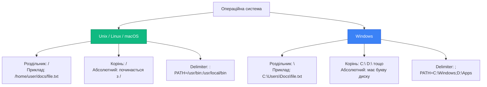

# Вбудований модуль path

::card-group

::card{title="🎯 Мета лекції" icon="i-lucide-target"}

- Зрозуміти проблеми кросплатформної роботи зі шляхами файлів.
- Опанувати методи об'єднання та резолюції шляхів: `join()`, `resolve()`.
- Навчитися розбирати шляхи на компоненти: директорія, ім'я файлу, розширення.
- Освоїти нормалізацію та перетворення між абсолютними та відносними шляхами.
- Зрозуміти відмінності між Windows та Unix-подібними системами у роботі зі шляхами.

::

::card{title="🔑 Ключові терміни" icon="i-lucide-key"}

- **path:** вбудований модуль Node.js для кросплатформної роботи зі шляхами файлів.
- **Абсолютний шлях:** повний шлях від кореня файлової системи (`/home/user/file.txt`, `C:\Users\file.txt`).
- **Відносний шлях:** шлях відносно поточної директорії (`./folder/file.txt`, `../parent/file.txt`).
- **Path separator:** роздільник компонентів шляху (`/` на Unix, `\` на Windows).
- **Path delimiter:** роздільник списку шляхів (`:` на Unix, `;` на Windows).

::

::

## Проблема кросплатформності шляхів

### Відмінності між операційними системами

Різні операційні системи використовують різні конвенції для представлення шляхів до файлів, що створює проблеми для кросплатформного коду:

::mermaid



::

**Ключові відмінності:**

| Аспект | Unix / Linux / macOS | Windows |
|--------|---------------------|---------|
| Роздільник (*separator*) | `/` | `\` (зворотний слеш) |
| Кореневий каталог | `/` | `C:\`, `D:\` тощо (букви дисків) |
| Абсолютний шлях | `/home/user/file.txt` | `C:\Users\user\file.txt` |
| Відносний шлях | `./docs/file.txt` | `.\docs\file.txt` |
| Delimiter у PATH | `:` (двокрапка) | `;` (крапка з комою) |
| Регістр | Чутливий до регістру | Нечутливий до регістру |

### Небезпека ручного конструювання шляхів

Спроба конструювати шляхи через конкатенацію рядків призводить до помилок на різних платформах:

```javascript
// ❌ НЕПРАВИЛЬНО: жорстко закодований роздільник
const filePath = baseDir + '/' + fileName;
// На Windows може не працювати, якщо baseDir містить \

// ❌ НЕПРАВИЛЬНО: припущення про Unix-роздільник
const configPath = './config/database.json';
// Працює на Unix, але не є найкращою практикою

// ❌ НЕПРАВИЛЬНО: шаблонні літерали без path модуля
const logPath = `${logsDir}/app.log`;
// Проблеми з нормалізацією та кросплатформністю

// ✅ ПРАВИЛЬНО: використання path модуля
import path from 'node:path';
const filePath = path.join(baseDir, fileName);
const configPath = path.join('.', 'config', 'database.json');
const logPath = path.join(logsDir, 'app.log');
```

::warning
**Проблеми ручного конструювання:**

1. **Подвійні роздільники:** `folder//file.txt`
2. **Змішані роздільники:** `folder\subfolder/file.txt`
3. **Невідповідність платформі:** `/Users/data` на Windows
4. **Проблеми з `..` та `.`:** неправильна нормалізація відносних шляхів
5. **Path traversal вразливості:** `../../../../etc/passwd`

Модуль `path` автоматично обробляє всі ці випадки.
::

### Імпорт модуля path

```javascript
// CommonJS
const path = require('path');

// ES Modules
import path from 'node:path';

// Імпорт специфічних методів
import { join, resolve, basename } from 'node:path';
```

::note
Префікс `node:` явно позначає вбудовані модулі Node.js і рекомендується для уникнення конфліктів з npm-пакетами з аналогічними назвами.
::

## Об'єднання шляхів: path.join()

**Сигнатура методу:**

::field-group

::field{name="path.join(...paths)" type="string"}
Об'єднує всі сегменти шляху разом, використовуючи роздільник платформи як delimiter, і нормалізує результуючий шлях.

**Параметри:**
- `...paths` (string[]) — послідовність сегментів шляху

**Повертає:** string — нормалізований шлях

**Особливості:**
- Використовує роздільник поточної платформи (`/` або `\`)
- Автоматично нормалізує `.` та `..`
- Видаляє зайві роздільники
- Повертає `.` для порожнього результату
- Сегменти нульової довжини ігноруються

::

::

Метод `path.join()` — найчастіше використовуваний метод для побудови шляхів:

```javascript
import path from 'node:path';

// Базове об'єднання
const filePath = path.join('users', 'documents', 'report.pdf');
console.log(filePath);
// Unix: users/documents/report.pdf
// Windows: users\documents\report.pdf

// З абсолютним базовим шляхом
const absolutePath = path.join('/var', 'www', 'html', 'index.html');
console.log(absolutePath);
// Unix: /var/www/html/index.html
// Windows: \var\www\html\index.html

// Автоматична нормалізація відносних шляхів
const normalized = path.join('folder', '..', 'another', '.', 'file.txt');
console.log(normalized);
// another/file.txt (folder/.. скасовується)

// Видалення зайвих роздільників
const cleaned = path.join('path', '/', '/', 'to', '///', 'file.txt');
console.log(cleaned);
// path/to/file.txt

// Ігнорування порожніх сегментів
const withEmpties = path.join('a', '', 'b', '', 'c');
console.log(withEmpties);
// a/b/c
```

### Практичне застосування: побудова шляхів до ресурсів

```javascript
import path from 'node:path';
import { fileURLToPath } from 'node:url';

// ES Modules: отримання __dirname
const __filename = fileURLToPath(import.meta.url);
const __dirname = path.dirname(__filename);

// Побудова шляхів відносно поточного модуля
const configPath = path.join(__dirname, 'config', 'database.json');
const uploadsDir = path.join(__dirname, '..', 'public', 'uploads');
const templatePath = path.join(__dirname, 'views', 'email-template.html');

console.log('Config:', configPath);
console.log('Uploads:', uploadsDir);
console.log('Template:', templatePath);
```

::terminal-preview{title="node path-join-example.js"}

<div class="line">Config: <span class="text-blue-400">/Users/arakviel/project/src/config/database.json</span></div>
<div class="line">Uploads: <span class="text-blue-400">/Users/arakviel/project/public/uploads</span></div>
<div class="line">Template: <span class="text-blue-400">/Users/arakviel/project/src/views/email-template.html</span></div>

::

::tip
**Коли використовувати path.join():**

- Об'єднання частин шляху з будь-яких джерел
- Побудова шляхів відносно відомої директорії
- Нормалізація шляхів з `..` та `.`
- Забезпечення кросплатформної сумісності

**НЕ використовуйте для:**
- URL-адрес (використовуйте `new URL()`)
- Резолюції відносних шляхів до абсолютних (використовуйте `path.resolve()`)
::


## Резолюція абсолютних шляхів: path.resolve()

**Сигнатура методу:**

::field-group

::field{name="path.resolve(...paths)" type="string"}
Резолвить послідовність шляхів або сегментів шляху у абсолютний шлях.

**Параметри:**
- `...paths` (string[]) — послідовність сегментів шляху

**Повертає:** string — абсолютний шлях

**Поведінка:**
- Обробляє сегменти **справа наліво**
- Якщо знайдено абсолютний шлях, попередні ігноруються
- Якщо після обробки всіх сегментів шлях відносний, додається `process.cwd()`
- Результат завжди абсолютний шлях
- Нормалізує `.` та `..`

::

::

Метод `path.resolve()` відрізняється від `join()` тим, що завжди повертає **абсолютний шлях**:

```javascript
import path from 'node:path';

// Без аргументів: повертає поточну робочу директорію
console.log(path.resolve());
// /Users/arakviel/projects/my-app

// Один відносний сегмент: резолвиться від cwd
console.log(path.resolve('config'));
// /Users/arakviel/projects/my-app/config

// Кілька відносних сегментів
console.log(path.resolve('src', 'utils', 'helper.js'));
// /Users/arakviel/projects/my-app/src/utils/helper.js

// З абсолютним шляхом: попередні ігноруються
console.log(path.resolve('ignored', '/absolute', 'path'));
// /absolute/path (сегмент 'ignored' ігнорується)

// Обробка .. та .
console.log(path.resolve('folder', '..', 'another'));
// /Users/arakviel/projects/my-app/another
```

### Різниця між join() та resolve()

::code-group

```javascript [path.join()]
import path from 'node:path';

// join() — проста конкатенація та нормалізація
console.log(path.join('a', 'b', 'c'));
// a/b/c (відносний шлях)

console.log(path.join('/root', 'a', 'b'));
// /root/a/b

console.log(path.join('a', '/b', 'c'));
// a/b/c (обробляє / всередині як частину шляху)

console.log(path.join('a', '..', 'b'));
// b
```

```javascript [path.resolve()]
import path from 'node:path';

// resolve() — завжди абсолютний шлях
console.log(path.resolve('a', 'b', 'c'));
// /Users/arakviel/projects/app/a/b/c

console.log(path.resolve('/root', 'a', 'b'));
// /root/a/b

console.log(path.resolve('a', '/b', 'c'));
// /b/c (зупиняється на /b, 'a' ігнорується)

console.log(path.resolve('a', '..', 'b'));
// /Users/arakviel/projects/app/b
```

::

**Порівняльна таблиця:**

| Критерій | path.join() | path.resolve() |
|----------|-------------|----------------|
| Результат | Може бути відносним | Завжди абсолютний |
| Базова директорія | Не використовує | Використовує `process.cwd()` |
| Обробка абсолютних шляхів | Як частина конкатенації | Скидає попередні сегменти |
| Напрямок обробки | Зліва направо | Справа наліво |
| Use case | Об'єднання шляхів | Резолюція до абсолютного шляху |

### Практичне застосування: валідація та резолюція шляхів

```javascript
import path from 'node:path';

function getAbsolutePath(relativePath) {
  // Перетворення будь-якого шляху в абсолютний
  return path.resolve(relativePath);
}

console.log(getAbsolutePath('config.json'));
// /Users/arakviel/projects/app/config.json

console.log(getAbsolutePath('../shared/utils.js'));
// /Users/arakviel/projects/shared/utils.js

console.log(getAbsolutePath('/etc/hosts'));
// /etc/hosts (вже абсолютний)

// Безпечна резолюція в межах базової директорії
function safeResolve(basePath, userPath) {
  const resolved = path.resolve(basePath, userPath);
  
  // Перевірка, що resolved всередині basePath
  if (!resolved.startsWith(path.resolve(basePath) + path.sep)) {
    throw new Error('Path traversal attempt detected');
  }
  
  return resolved;
}

try {
  const safe = safeResolve('./uploads', 'user-file.jpg');
  console.log('Safe path:', safe);
  
  const unsafe = safeResolve('./uploads', '../../etc/passwd');
  console.log('This will throw');
} catch (error) {
  console.error('Security error:', error.message);
}
```

::note
**Важливість path.resolve() для безпеки:**

При роботі з користувацькими шляхами завжди використовуйте `path.resolve()` для отримання абсолютного шляху, після чого перевіряйте, що він знаходиться всередині дозволеної директорії. Це запобігає **path traversal** атакам.
::


## Розбір шляхів на компоненти

### Отримання директорії: path.dirname()

**Сигнатура методу:**

::field-group

::field{name="path.dirname(path)" type="string"}
Повертає назву директорії шляху, аналогічно до Unix-команди `dirname`.

**Параметри:**
- `path` (string) — шлях до файлу або директорії

**Повертає:** string — шлях до батьківської директорії

**Особливості:**
- Якщо шлях не містить роздільників, повертає `.`
- Завершальні роздільники ігноруються
- Для кореня повертає сам корінь

::

::

```javascript
import path from 'node:path';

// Отримання директорії файлу
console.log(path.dirname('/users/docs/report.pdf'));
// /users/docs

console.log(path.dirname('src/utils/helper.js'));
// src/utils

// Кілька рівнів вгору
console.log(path.dirname(path.dirname('/a/b/c/d.txt')));
// /a/b

// Без роздільників
console.log(path.dirname('file.txt'));
// . (поточна директорія)

// Корінь
console.log(path.dirname('/'));
// / (корінь залишається коренем)

// Windows-шляхи (на Windows)
console.log(path.dirname('C:\\Users\\Docs\\file.txt'));
// C:\Users\Docs
```

### Отримання імені файлу: path.basename()

**Сигнатура методу:**

::field-group

::field{name="path.basename(path, suffix)" type="string"}
Повертає останній сегмент шляху (зазвичай ім'я файлу).

**Параметри:**
- `path` (string) — шлях до файлу або директорії
- `suffix` (string) — необов'язково, суфікс для видалення з результату

**Повертає:** string — ім'я файлу з розширенням або без (якщо вказано suffix)

**Особливості:**
- Завершальні роздільники ігноруються
- Якщо suffix співпадає з кінцем імені, він видаляється

::

::

```javascript
import path from 'node:path';

// Ім'я файлу з розширенням
console.log(path.basename('/users/docs/report.pdf'));
// report.pdf

console.log(path.basename('src/index.js'));
// index.js

// Ім'я файлу без розширення (через suffix)
console.log(path.basename('report.pdf', '.pdf'));
// report

console.log(path.basename('image.min.js', '.js'));
// image.min

// Ім'я директорії
console.log(path.basename('/users/documents/'));
// documents (завершальний / ігнорується)

// Корінь
console.log(path.basename('/'));
// '' (порожній рядок)
```

### Отримання розширення: path.extname()

**Сигнатура методу:**

::field-group

::field{name="path.extname(path)" type="string"}
Повертає розширення файлу від останньої крапки до кінця рядка.

**Параметри:**
- `path` (string) — шлях до файлу

**Повертає:** string — розширення з крапкою (`.ext`) або порожній рядок

**Особливості:**
- Повертає від останньої `.` до кінця імені файлу
- Якщо немає `.`, повертає `''`
- Якщо `.` на початку імені файлу (прихований файл Unix), повертає `''`
- Якщо `.` в кінці, повертає `.`

::

::

```javascript
import path from 'node:path';

// Стандартні розширення
console.log(path.extname('file.txt'));
// .txt

console.log(path.extname('image.png'));
// .png

// Кілька крапок: береться останнє розширення
console.log(path.extname('archive.tar.gz'));
// .gz

console.log(path.extname('bundle.min.js'));
// .js

// Без розширення
console.log(path.extname('README'));
// '' (порожній рядок)

// Прихований файл Unix (крапка на початку)
console.log(path.extname('.gitignore'));
// '' (немає розширення)

console.log(path.extname('.env.local'));
// .local

// Крапка в кінці
console.log(path.extname('file.'));
// .

// Повний шлях
console.log(path.extname('/path/to/file.html'));
// .html
```

### Комплексний розбір: path.parse()

**Сигнатура методу:**

::field-group

::field{name="path.parse(path)" type="Object"}
Розбирає шлях на об'єкт з окремими компонентами.

**Параметри:**
- `path` (string) — шлях для розбору

**Повертає:** Object з полями:
- `root` (string) — корінь шляху (`/`, `C:\` тощо)
- `dir` (string) — повна директорія (без імені файлу)
- `base` (string) — повне ім'я файлу з розширенням
- `ext` (string) — розширення файлу з крапкою
- `name` (string) — ім'я файлу без розширення

::

::

```javascript
import path from 'node:path';

// Unix шлях
const unixPath = path.parse('/users/docs/report.pdf');
console.log(unixPath);
/*
{
  root: '/',
  dir: '/users/docs',
  base: 'report.pdf',
  ext: '.pdf',
  name: 'report'
}
*/

// Відносний шлях
const relativePath = path.parse('src/utils/helper.js');
console.log(relativePath);
/*
{
  root: '',
  dir: 'src/utils',
  base: 'helper.js',
  ext: '.js',
  name: 'helper'
}
*/

// Windows шлях (на Windows)
const winPath = path.parse('C:\\Users\\Docs\\file.txt');
console.log(winPath);
/*
{
  root: 'C:\\',
  dir: 'C:\\Users\\Docs',
  base: 'file.txt',
  ext: '.txt',
  name: 'file'
}
*/

// Без розширення
const noExt = path.parse('/path/to/README');
console.log(noExt);
/*
{
  root: '/',
  dir: '/path/to',
  base: 'README',
  ext: '',
  name: 'README'
}
*/
```

### Зворотна операція: path.format()

**Сигнатура методу:**

::field-group

::field{name="path.format(pathObject)" type="string"}
Формує шлях з об'єкта, зворотна операція до `path.parse()`.

**Параметри:**
- `pathObject` (Object) — об'єкт з компонентами шляху
  - `root` (string) — ігнорується, якщо вказано `dir`
  - `dir` (string) — директорія
  - `base` (string) — повне ім'я файлу, має пріоритет над `name` + `ext`
  - `name` (string) — ім'я файлу без розширення
  - `ext` (string) — розширення файлу

**Повертає:** string — сформований шлях

**Пріоритети:**
- `dir` + `base` має пріоритет над `root`
- `base` має пріоритет над `name` + `ext`

::

::

```javascript
import path from 'node:path';

// З dir та base
console.log(path.format({
  dir: '/home/user/docs',
  base: 'report.pdf'
}));
// /home/user/docs/report.pdf

// З dir, name та ext
console.log(path.format({
  dir: 'src/utils',
  name: 'helper',
  ext: '.js'
}));
// src/utils/helper.js

// root ігнорується, якщо є dir
console.log(path.format({
  root: '/ignored',
  dir: '/actual/path',
  base: 'file.txt'
}));
// /actual/path/file.txt

// base має пріоритет над name + ext
console.log(path.format({
  dir: '/path',
  base: 'priority.txt',
  name: 'ignored',
  ext: '.js'
}));
// /path/priority.txt
```

### Практичний приклад: зміна розширення файлу

```javascript
import path from 'node:path';

function changeExtension(filePath, newExt) {
  const parsed = path.parse(filePath);
  
  // Додаємо крапку, якщо її немає
  const extension = newExt.startsWith('.') ? newExt : `.${newExt}`;
  
  return path.format({
    dir: parsed.dir,
    name: parsed.name,
    ext: extension
  });
}

console.log(changeExtension('/docs/report.docx', '.pdf'));
// /docs/report.pdf

console.log(changeExtension('image.png', 'jpg'));
// image.jpg

console.log(changeExtension('src/bundle.min.js', '.ts'));
// src/bundle.min.ts
```


## Нормалізація та порівняння шляхів

### Нормалізація: path.normalize()

**Сигнатура методу:**

::field-group

::field{name="path.normalize(path)" type="string"}
Нормалізує шлях, розв'язуючи `.` та `..` сегменти та видаляючи зайві роздільники.

**Параметри:**
- `path` (string) — шлях для нормалізації

**Повертає:** string — нормалізований шлях

**Операції нормалізації:**
- Видаляє множинні роздільники (`//` → `/`)
- Розв'язує `.` (поточна директорія)
- Розв'язує `..` (батьківська директорія)
- Зберігає завершальний роздільник, якщо він був
- Повертає `.` для порожнього шляху

::

::

```javascript
import path from 'node:path';

// Видалення зайвих роздільників
console.log(path.normalize('/users///docs//file.txt'));
// /users/docs/file.txt

// Розв'язування . та ..
console.log(path.normalize('/users/./docs/../downloads/file.txt'));
// /users/downloads/file.txt

// Множинні ..
console.log(path.normalize('/a/b/c/../../d'));
// /a/d

// Вихід за корінь
console.log(path.normalize('/a/b/../../../file.txt'));
// /file.txt (не може вийти вище кореня)

// Відносні шляхи
console.log(path.normalize('a/./b/../c'));
// a/c

console.log(path.normalize('./folder//subfolder/'));
// folder/subfolder/ (завершальний / зберігається)

// Порожній шлях
console.log(path.normalize(''));
// . (поточна директорія)

// Windows зворотні слеші
console.log(path.normalize('C:\\Users\\..\\Docs\\file.txt'));
// C:\Docs\file.txt (на Windows)
```

::tip
**Коли використовувати normalize():**

- Після конкатенації шляхів з ненадійних джерел
- Перед порівнянням шляхів (для уніфікації формату)
- Після отримання шляхів від користувача
- Для очищення шляхів від зайвих символів

**Примітка:** `path.join()` та `path.resolve()` автоматично нормалізують результат, тому окремий виклик `normalize()` часто не потрібен.
::

### Перевірка абсолютності: path.isAbsolute()

**Сигнатура методу:**

::field-group

::field{name="path.isAbsolute(path)" type="boolean"}
Визначає, чи є шлях абсолютним.

**Параметри:**
- `path` (string) — шлях для перевірки

**Повертає:** boolean — `true` якщо абсолютний, `false` якщо відносний

**Критерії абсолютності:**
- Unix: починається з `/`
- Windows: починається з букви диску (`C:\`) або UNC (`\\server\share`)

::

::

```javascript
import path from 'node:path';

// Unix абсолютні шляхи
console.log(path.isAbsolute('/users/docs'));
// true

console.log(path.isAbsolute('/'));
// true

// Відносні шляхи
console.log(path.isAbsolute('users/docs'));
// false

console.log(path.isAbsolute('./file.txt'));
// false

console.log(path.isAbsolute('../parent'));
// false

// Windows абсолютні шляхи (на Windows)
console.log(path.isAbsolute('C:\\Users\\Docs'));
// true (на Windows)

console.log(path.isAbsolute('\\\\server\\share'));
// true (UNC path на Windows)

// Спеціальні випадки
console.log(path.isAbsolute(''));
// false (порожній рядок)

console.log(path.isAbsolute('.'));
// false
```

### Відносний шлях між двома точками: path.relative()

**Сигнатура методу:**

::field-group

::field{name="path.relative(from, to)" type="string"}
Обчислює відносний шлях від `from` до `to`.

**Параметри:**
- `from` (string) — початковий шлях
- `to` (string) — кінцевий шлях

**Повертає:** string — відносний шлях від `from` до `to`

**Особливості:**
- Обидва шляхи резолвяться до абсолютних перед обчисленням
- Якщо `from === to`, повертає порожній рядок
- Використовує `..` для підйому вгору по директоріях

::

::

```javascript
import path from 'node:path';

// Базове використання
console.log(path.relative('/data/orandea/test/aaa', '/data/orandea/impl/bbb'));
// ../../impl/bbb

// Той самий шлях
console.log(path.relative('/users/docs', '/users/docs'));
// '' (порожній рядок)

// Прямий спуск
console.log(path.relative('/users', '/users/docs/file.txt'));
// docs/file.txt

// Прямий підйом
console.log(path.relative('/users/docs/deep', '/users'));
// ../..

// Різні гілки дерева
console.log(path.relative('/var/www/html', '/home/user/docs'));
// ../../../home/user/docs

// Відносні шляхи (резолвяться від cwd)
console.log(path.relative('src/components', 'src/utils'));
// ../utils

// Практичний приклад: імпорти в JavaScript
const currentFile = '/project/src/components/Button.js';
const targetFile = '/project/src/utils/helpers.js';

const relativePath = path.relative(
  path.dirname(currentFile),
  targetFile
);

console.log(`import helpers from '${relativePath}'`);
// import helpers from '../utils/helpers.js'
```

### Практичний приклад: генерація відносних імпортів

```javascript
import path from 'node:path';

function generateImportStatement(fromFile, toFile) {
  // Отримуємо директорії обох файлів
  const fromDir = path.dirname(fromFile);
  
  // Обчислюємо відносний шлях
  let relativePath = path.relative(fromDir, toFile);
  
  // Якщо шлях не починається з . або .., додаємо ./
  if (!relativePath.startsWith('.')) {
    relativePath = `./${relativePath}`;
  }
  
  // Видаляємо розширення для ES modules
  const withoutExt = relativePath.replace(/\.(js|ts|jsx|tsx)$/, '');
  
  return `import { something } from '${withoutExt}';`;
}

console.log(generateImportStatement(
  '/project/src/components/Button.tsx',
  '/project/src/utils/helpers.ts'
));
// import { something } from '../utils/helpers';

console.log(generateImportStatement(
  '/project/src/components/ui/Card.tsx',
  '/project/src/components/Button.tsx'
));
// import { something } from '../Button';

console.log(generateImportStatement(
  '/project/src/pages/Home.tsx',
  '/project/src/components/ui/Card.tsx'
));
// import { something } from '../components/ui/Card';
```

## Платформо-специфічні властивості

### Роздільники та делімітери

**Доступні константи:**

::field-group

::field{name="path.sep" type="string"}
Роздільник сегментів шляху для платформи.
- Unix: `'/'`
- Windows: `'\\'`
::

::field{name="path.delimiter" type="string"}
Делімітер списку шляхів для змінної PATH.
- Unix: `':'`
- Windows: `';'`
::

::field{name="path.posix" type="Object"}
POSIX-специфічна реалізація всіх методів `path` (завжди використовує `/`).
::

::field{name="path.win32" type="Object"}
Windows-специфічна реалізація всіх методів `path` (завжди використовує `\`).
::

::

```javascript
import path from 'node:path';

// Роздільник платформи
console.log('Path separator:', path.sep);
// Unix: /
// Windows: \

// Delimiter для PATH
console.log('PATH delimiter:', path.delimiter);
// Unix: :
// Windows: ;

// Розбір змінної PATH
const pathEnv = process.env.PATH;
const paths = pathEnv.split(path.delimiter);
console.log('PATH directories:', paths);

// Явне використання POSIX-шляхів (завжди /)
console.log(path.posix.join('folder', 'file.txt'));
// folder/file.txt (навіть на Windows)

// Явне використання Windows-шляхів (завжди \)
console.log(path.win32.join('folder', 'file.txt'));
// folder\file.txt (навіть на Unix)

// Корисно для перетворення між форматами
function toPosixPath(windowsPath) {
  return windowsPath.split(path.win32.sep).join(path.posix.sep);
}

console.log(toPosixPath('C:\\Users\\Docs\\file.txt'));
// C:/Users/Docs/file.txt
```

::note
**Коли використовувати path.posix та path.win32:**

- **path.posix:** при роботі з URL-адресами або Unix-орієнтованими API (Git, Docker)
- **path.win32:** при обробці Windows-шляхів на Unix-системі
- **path (звичайний):** для автоматичної адаптації до поточної платформи (рекомендовано у більшості випадків)
::


## Практичні сценарії використання

### Сценарій 1: Побудова структури проєкту

```javascript
import path from 'node:path';
import { fileURLToPath } from 'node:url';

// ES Modules: отримання директорії поточного модуля
const __filename = fileURLToPath(import.meta.url);
const __dirname = path.dirname(__filename);

// Корінь проєкту (на два рівні вище від поточного файлу)
const PROJECT_ROOT = path.resolve(__dirname, '..', '..');

// Структура директорій проєкту
const paths = {
  root: PROJECT_ROOT,
  src: path.join(PROJECT_ROOT, 'src'),
  public: path.join(PROJECT_ROOT, 'public'),
  config: path.join(PROJECT_ROOT, 'config'),
  uploads: path.join(PROJECT_ROOT, 'public', 'uploads'),
  logs: path.join(PROJECT_ROOT, 'logs'),
  
  // Файли конфігурації
  envFile: path.join(PROJECT_ROOT, '.env'),
  packageJson: path.join(PROJECT_ROOT, 'package.json'),
  
  // Функція для резолюції шляхів відносно кореня
  resolve: (...segments) => path.join(PROJECT_ROOT, ...segments)
};

export default paths;

// Використання
import paths from './paths.js';

console.log('Project root:', paths.root);
console.log('Source directory:', paths.src);
console.log('Custom path:', paths.resolve('data', 'cache', 'users.json'));
```

### Сценарій 2: Валідація завантажених файлів

```javascript
import path from 'node:path';

const ALLOWED_EXTENSIONS = new Set(['.jpg', '.jpeg', '.png', '.gif', '.webp']);
const MAX_FILENAME_LENGTH = 255;

function validateUploadedFile(filePath, uploadsDir) {
  const errors = [];
  
  // 1. Перевірка розширення
  const ext = path.extname(filePath).toLowerCase();
  if (!ALLOWED_EXTENSIONS.has(ext)) {
    errors.push(`Invalid file extension: ${ext}. Allowed: ${[...ALLOWED_EXTENSIONS].join(', ')}`);
  }
  
  // 2. Перевірка довжини імені файлу
  const basename = path.basename(filePath);
  if (basename.length > MAX_FILENAME_LENGTH) {
    errors.push(`Filename too long: ${basename.length} characters (max: ${MAX_FILENAME_LENGTH})`);
  }
  
  // 3. Перевірка на небезпечні символи
  if (/[<>:"|?*\x00-\x1f]/.test(basename)) {
    errors.push('Filename contains invalid characters');
  }
  
  // 4. Перевірка на path traversal
  const resolved = path.resolve(uploadsDir, filePath);
  const safeBase = path.resolve(uploadsDir);
  
  if (!resolved.startsWith(safeBase + path.sep)) {
    errors.push('Path traversal attempt detected');
  }
  
  // 5. Перевірка на прихований файл Unix
  if (basename.startsWith('.')) {
    errors.push('Hidden files are not allowed');
  }
  
  return {
    valid: errors.length === 0,
    errors,
    sanitizedPath: errors.length === 0 ? resolved : null
  };
}

// Приклади використання
const result1 = validateUploadedFile('photo.jpg', '/var/www/uploads');
console.log('Valid:', result1.valid);

const result2 = validateUploadedFile('../../etc/passwd', '/var/www/uploads');
console.log('Errors:', result2.errors);
// ['Path traversal attempt detected']

const result3 = validateUploadedFile('malicious.exe', '/var/www/uploads');
console.log('Errors:', result3.errors);
// ['Invalid file extension: .exe...']
```

### Сценарій 3: Генерація унікальних імен файлів

```javascript
import path from 'node:path';
import crypto from 'node:crypto';

function generateUniqueFilename(originalPath, { addTimestamp = true, addHash = true } = {}) {
  const parsed = path.parse(originalPath);
  const parts = [parsed.name];
  
  if (addTimestamp) {
    const timestamp = Date.now();
    parts.push(timestamp);
  }
  
  if (addHash) {
    const hash = crypto.randomBytes(4).toString('hex');
    parts.push(hash);
  }
  
  const uniqueName = parts.join('-');
  
  return path.format({
    dir: parsed.dir,
    name: uniqueName,
    ext: parsed.ext
  });
}

console.log(generateUniqueFilename('photo.jpg'));
// photo-1725286800000-a3f4c2b1.jpg

console.log(generateUniqueFilename('/uploads/document.pdf', { addTimestamp: false }));
// /uploads/document-f8e9a1c2.pdf

console.log(generateUniqueFilename('avatar.png', { addHash: false }));
// avatar-1725286800000.png
```

### Сценарій 4: Рекурсивний пошук файлів за патерном

```javascript
import path from 'node:path';
import fs from 'node:fs/promises';

async function findFilesByPattern(dirPath, pattern) {
  const results = [];
  
  async function search(currentPath) {
    const entries = await fs.readdir(currentPath, { withFileTypes: true });
    
    for (const entry of entries) {
      const fullPath = path.join(currentPath, entry.name);
      
      if (entry.isDirectory()) {
        // Пропускаємо node_modules та приховані директорії
        if (entry.name === 'node_modules' || entry.name.startsWith('.')) {
          continue;
        }
        await search(fullPath);
      } else if (entry.isFile()) {
        // Перевірка за патерном
        if (pattern.test(entry.name)) {
          results.push({
            path: fullPath,
            name: entry.name,
            dir: path.dirname(fullPath),
            ext: path.extname(entry.name)
          });
        }
      }
    }
  }
  
  await search(dirPath);
  return results;
}

// Знайти всі TypeScript файли
const tsFiles = await findFilesByPattern('./src', /\.tsx?$/);
console.log(`Found ${tsFiles.length} TypeScript files`);

// Знайти всі test файли
const testFiles = await findFilesByPattern('./src', /\.(test|spec)\.(js|ts)$/);
console.log(`Found ${testFiles.length} test files`);
```

## Резюме та найкращі практики

::card-group

::card{title="✅ Ключові методи" icon="i-lucide-check-circle"}

- **path.join()** — об'єднання сегментів шляху
- **path.resolve()** — резолюція до абсолютного шляху
- **path.dirname()** — отримання директорії
- **path.basename()** — отримання імені файлу
- **path.extname()** — отримання розширення
- **path.parse()** — розбір шляху на компоненти
- **path.normalize()** — нормалізація шляху
- **path.relative()** — відносний шлях між двома точками

::

::card{title="🎯 Найкращі практики" icon="i-lucide-lightbulb"}

- Завжди використовуйте `path` для конструювання шляхів
- Не використовуйте ручну конкатенацію з `/` або `\`
- Використовуйте `path.resolve()` для валідації безпеки
- Нормалізуйте шляхи перед порівнянням
- Використовуйте `path.posix` для URL-подібних шляхів
- Перевіряйте результат `path.relative()` на порожній рядок

::

::

### Порівняльна таблиця методів

| Метод | Вхід | Вихід | Use Case |
|-------|------|-------|----------|
| `join()` | Сегменти | Відносний/абсолютний | Об'єднання частин |
| `resolve()` | Сегменти | Завжди абсолютний | Резолюція до повного шляху |
| `normalize()` | Шлях | Нормалізований | Очищення від `.` та `..` |
| `dirname()` | Шлях | Директорія | Отримання батьківської папки |
| `basename()` | Шлях | Ім'я файлу | Отримання останнього сегменту |
| `extname()` | Шлях | Розширення | Отримання `.ext` |
| `parse()` | Шлях | Об'єкт | Розбір на компоненти |
| `format()` | Об'єкт | Шлях | Збірка з компонентів |
| `relative()` | Два шляхи | Відносний шлях | Обчислення відносного шляху |
| `isAbsolute()` | Шлях | Boolean | Перевірка абсолютності |

### Інтерактивні запитання для самоперевірки

::accordion

::accordion-item{label="❓ У чому різниця між path.join() та path.resolve()?" icon="i-lucide-help-circle"}

**path.join()** просто об'єднує сегменти шляху та нормалізує результат, але може повернути як відносний, так і абсолютний шлях:
```javascript
path.join('a', 'b', 'c')  // → a/b/c (відносний)
```

**path.resolve()** завжди повертає абсолютний шлях, додаючи `process.cwd()` до відносних шляхів і обробляючи сегменти справа наліво:
```javascript
path.resolve('a', 'b', 'c')  // → /current/dir/a/b/c (абсолютний)
path.resolve('a', '/b', 'c') // → /b/c ('a' ігнорується)
```

Використовуйте `join()` для простого об'єднання, `resolve()` — коли потрібен гарантовано абсолютний шлях.

::

::accordion-item{label="❓ Чому path.extname('.gitignore') повертає порожній рядок?" icon="i-lucide-help-circle"}

Метод `path.extname()` повертає розширення від **останньої** крапки до кінця **імені файлу** (не включаючи шлях). Якщо крапка знаходиться на початку імені файлу (як у прихованих файлах Unix), вона вважається частиною імені, а не початком розширення:

```javascript
path.extname('.gitignore')    // '' (крапка на початку)
path.extname('.env.local')    // '.local' (остання крапка)
path.extname('file.txt')      // '.txt'
path.extname('.hidden.conf')  // '.conf'
```

Це поведінка узгоджується з Unix-конвенцією, де `.filename` означає прихований файл без розширення.

::

::accordion-item{label="❓ Як безпечно об'єднати базовий шлях з користувацьким вводом?" icon="i-lucide-help-circle"}

Ніколи не використовуйте просто `path.join(baseDir, userInput)` — це вразливо до **path traversal**:

```javascript
// ❌ ВРАЗЛИВИЙ КОД
const userFile = '../../etc/passwd';
const filePath = path.join('/var/uploads', userFile);
// Результат: /etc/passwd — витік за межі дозволеної директорії!
```

**Правильний підхід:**

```javascript
// ✅ БЕЗПЕЧНО
function safeJoin(baseDir, userInput) {
  const resolved = path.resolve(baseDir, userInput);
  const safeBase = path.resolve(baseDir);
  
  if (!resolved.startsWith(safeBase + path.sep)) {
    throw new Error('Path traversal detected');
  }
  
  return resolved;
}

safeJoin('/var/uploads', '../../etc/passwd'); // Викине помилку
safeJoin('/var/uploads', 'user/photo.jpg');    // ✓ /var/uploads/user/photo.jpg
```

::

::accordion-item{label="❓ Коли використовувати path.normalize()?" icon="i-lucide-help-circle"}

`path.normalize()` потрібен рідко, оскільки `join()` та `resolve()` автоматично нормалізують результат. Використовуйте його коли:

1. **Отримали шлях ззовні** (API, база даних) і хочете очистити:
```javascript
const messyPath = '/users//docs/./folder/../file.txt';
path.normalize(messyPath);  // /users/docs/file.txt
```

2. **Перед порівнянням шляхів:**
```javascript
const path1 = 'folder/./subfolder/../file.txt';
const path2 = 'folder/file.txt';
path.normalize(path1) === path.normalize(path2);  // true
```

3. **Видалення небезпечних сегментів перед використанням:**
```javascript
const userPath = 'docs/../../sensitive/data.txt';
path.normalize(userPath);  // ../sensitive/data.txt (видно спробу виходу)
```

**НЕ потрібно після `join()` або `resolve()`:**
```javascript
path.normalize(path.join('a', 'b', 'c'));  // Зайве, join() вже нормалізує
```

::

::accordion-item{label="❓ Як path.relative() обчислює відносний шлях?" icon="i-lucide-help-circle"}

`path.relative(from, to)` обчислює мінімальний відносний шлях від `from` до `to`:

**Алгоритм:**
1. Обидва шляхи резолвяться до абсолютних
2. Розбиваються на сегменти
3. Знаходиться спільна батьківська директорія
4. Від `from` додаються `..` до спільного предка
5. Від предка додаються сегменти до `to`

**Приклад:**
```javascript
path.relative('/a/b/c/d', '/a/b/x/y');
// Спільний предок: /a/b
// Від c/d до /a/b: ../..
// Від /a/b до x/y: x/y
// Результат: ../../x/y
```

**Спеціальні випадки:**
```javascript
path.relative('/a/b', '/a/b');     // '' (той самий шлях)
path.relative('/a/b', '/a/b/c');   // 'c' (прямий спуск)
path.relative('/a/b/c', '/a');     // '../..' (прямий підйом)
```

::

::accordion-item{label="❓ Що станеться, якщо передати порожній рядок у path методи?" icon="i-lucide-help-circle"}

Різні методи по-різному обробляють порожні рядки:

```javascript
path.join('');              // '.' (поточна директорія)
path.resolve('');           // process.cwd() (абсолютний шлях до cwd)
path.normalize('');         // '.'
path.isAbsolute('');        // false
path.dirname('');           // '.'
path.basename('');          // ''
path.extname('');           // ''
path.parse('');             // { root: '', dir: '', base: '', ext: '', name: '' }
```

**Важливо:** завжди валідуйте вхідні дані перед передачею в `path` методи:

```javascript
function safePath(input) {
  if (!input || typeof input !== 'string') {
    throw new Error('Invalid path input');
  }
  return path.normalize(input);
}
```

::

::

---

**Наступна лекція:** Вбудований модуль http — створення HTTP-серверів

У наступному матеріалі ми розглянемо модуль `http` для створення веб-серверів: обробка запитів та відповідей, роутинг, заголовки HTTP, статус-коди, робота з query parameters та POST-даними.
