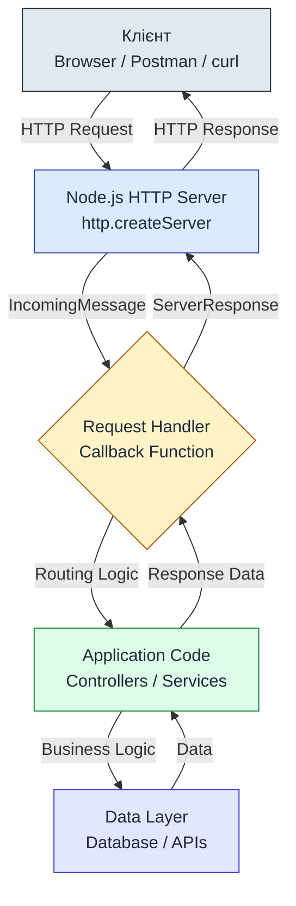
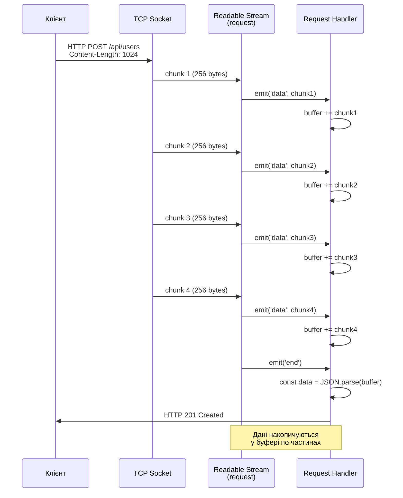
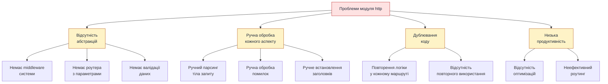

```mermaid
graph TD
    A[HTTP Status Codes] --> B[1xx Informational<br/>Інформаційні відповіді]
    A --> C[2xx Success<br/>Успішні запити]
    A --> D[3xx Redirection<br/>Перенаправлення]
    A --> E[4xx Client Error<br/>Помилки клієнта]
    A --> F[5xx Server Error<br/>Помилки сервера]
    
    C --> C1["200 OK<br/>Стандартна успішна відповідь"]
    C --> C2["201 Created<br/>Ресурс створено"]
    C --> C3["204 No Content<br/>Успіх без тіла відповіді"]
    
    D --> D1["301 Moved Permanently<br/>Постійне перенаправлення"]
    D --> D2["302 Found<br/>Тимчасове перенаправлення"]
    D --> D3["304 Not Modified<br/>Ресурс не змінився"]
    
    E --> E1["400 Bad Request<br/>Невалідний запит"]
    E --> E2["401 Unauthorized<br/>Потрібна автентифікація"]
    E --> E3["403 Forbidden<br/>Доступ заборонено"]
    E --> E4["404 Not Found<br/>Ресурс не знайдено"]
    
    F --> F1["500 Internal Server Error<br/>Внутрішня помилка сервера"]
    F --> F2["502 Bad Gateway<br/>Невалідна відповідь проксі"]
    F --> F3["503 Service Unavailable<br/>Сервіс недоступний"]
    
    style C fill:#dcfce7,stroke:#15803d,color:#1e293b
    style E fill:#fef3c7,stroke:#b45309,color:#1e293b
    style F fill:#fee2e2,stroke:#b91c1c,color:#1e293b
```

# Вбудований модуль http

::card-group

::card{title="🎯 Мета лекції" icon="i-lucide-target"}

- Зрозуміти архітектуру HTTP-сервера на базі Node.js без використання фреймворків.
- Опанувати API модуля `http` для створення веб-серверів та обробки запитів.
- Навчитися працювати з об'єктами `IncomingMessage` та `ServerResponse`.
- Освоїти ручну маршрутизацію, обробку методів (GET, POST) та потокове читання тіла запиту.
- Зрозуміти обмеження низькорівневого підходу та необхідність використання фреймворків.

::

::card{title="🔑 Ключові терміни" icon="i-lucide-key"}

- **http:** вбудований модуль Node.js для створення HTTP-серверів та клієнтів.
- **Request (IncomingMessage):** об'єкт, що представляє вхідний HTTP-запит від клієнта.
- **Response (ServerResponse):** об'єкт, що представляє HTTP-відповідь сервера клієнту.
- **Роутинг (Routing):** процес визначення, який код має обробити конкретний URL-запит.
- **Status Code:** числовий код, що вказує результат обробки запиту (200 OK, 404 Not Found тощо).
- **Headers:** метадані HTTP-запиту або відповіді (Content-Type, Authorization тощо).

::

::

## Архітектурний контекст: HTTP-сервери у Node.js

### Місце модуля http у стеку веб-розробки

Node.js надає вбудований модуль `http` (*Hypertext Transfer Protocol*), який реалізує повну функціональність HTTP-сервера та клієнта на основі подійно-орієнтованої архітектури платформи. Цей модуль є фундаментальним будівельним блоком для всіх веб-фреймворків екосистеми Node.js — Express, Fastify, Koa, NestJS та інші побудовані саме поверх `http`.

::mermaid



::

Модуль `http` надає три основні можливості:

1. **Створення HTTP-серверів** через `http.createServer()` — для прийому вхідних запитів від клієнтів.
2. **Створення HTTP-клієнтів** через `http.request()` — для надсилання запитів до інших серверів.
3. **Низькорівневий доступ до TCP-з'єднань** — для реалізації нестандартних протоколів поверх HTTP.

У цій лекції ми зосередимося виключно на серверній частині, оскільки саме вона є основою для побудови веб-застосунків.

### Чому модуль http називається низькорівневим?

На відміну від фреймворків, які надають високорівневі абстракції (маршрутизація, middleware, валідація, обробка помилок), модуль `http` оперує безпосередньо TCP-сокетами та байтовими потоками (*streams*). Це означає, що розробник повинен вручну:

- Розбирати URL-адреси та визначати маршрути через умовні оператори.
- Читати тіло запиту через подійну модель (`data`, `end` events).
- Встановлювати заголовки відповіді та коди статусу вручну.
- Обробляти помилки та виключні ситуації без автоматичних механізмів.
- Серіалізувати та десеріалізувати дані (JSON, форми) самостійно.

::tip
Модуль `http` забезпечує **повний контроль** над поведінкою сервера, але вимагає **більше коду** для реалізації стандартних задач. Фреймворки автоматизують рутинні операції, дозволяючи зосередитися на бізнес-логіці. Проте розуміння роботи `http` критично важливе для налагодження продакшн-проблем та оптимізації продуктивності.
::

### Імпорт модуля http

```typescript
// CommonJS (Node.js традиційний синтаксис)
const http = require('http');

// ES Modules (сучасний стандарт)
import http from 'node:http';
import type { Server, IncomingMessage, ServerResponse } from 'node:http';

// Імпорт окремих функцій з типами
import { createServer, request } from 'node:http';
```

::note
Префікс `node:` явно позначає вбудовані модулі Node.js і є рекомендованим підходом починаючи з Node.js 16+. Це запобігає конфліктам із npm-пакетами, які можуть мати аналогічні назви (наприклад, існує пакет `http` у npm-реєстрі).
::

## Створення базового HTTP-сервера

### Мінімальний приклад: Hello World сервер

Найпростіший HTTP-сервер у Node.js можна створити лише за допомогою функції `http.createServer()` та методу `listen()`:

```typescript
import http from 'node:http';
import type { IncomingMessage, ServerResponse } from 'node:http';

// Створення сервера з обробником запитів
const server = http.createServer((request: IncomingMessage, response: ServerResponse): void => {
  // Встановлення коду статусу та заголовків
  response.writeHead(200, { 'Content-Type': 'text/plain; charset=utf-8' });
  
  // Відправка тіла відповіді
  response.end('Привіт, світ! Це Node.js HTTP-сервер.');
});

// Прив'язка сервера до порту 3000
const PORT = 3000;
const HOST = '127.0.0.1';

server.listen(PORT, HOST, (): void => {
  console.log(`Сервер запущено на http://${HOST}:${PORT}/`);
});
```

::terminal-preview{title="node server.js" :cursor="true"}

<div class="line"><span class="opacity-40">$</span> <strong class="font-bold">node server.js</strong></div>
<div class="line"><span class="text-green-400 font-bold">Сервер запущено на</span> <span class="text-blue-400">http://127.0.0.1:3000/</span></div>
<div class="line"></div>
<div class="line"><span class="opacity-40"># У іншому терміналі виконуємо запит:</span></div>
<div class="line"><span class="opacity-40">$</span> <strong class="font-bold">curl http://127.0.0.1:3000/</strong></div>
<div class="line">Привіт, світ! Це Node.js HTTP-сервер.</div>

::

### Розбір анатомії http.createServer()

**Сигнатура методу:**

::field-group

::field{name="http.createServer([options], requestListener)" type="http.Server"}
Створює новий HTTP-сервер, який приймає вхідні підключення та викликає `requestListener` для кожного запиту.

**Параметри:**
- `options` (Object, опціонально) — конфігураційні налаштування сервера:
  - `IncomingMessage` — кастомний клас для об'єктів запиту
  - `ServerResponse` — кастомний клас для об'єктів відповіді
  - `insecureHTTPParser` — дозволити нестандартні HTTP-заголовки
  - `maxHeaderSize` — максимальний розмір заголовків (за замовчуванням 16 КБ)
- `requestListener` (Function) — callback-функція, що викликається при кожному запиті

**Повертає:** `http.Server` — екземпляр сервера

**Сигнатура requestListener:**

```typescript
function requestListener(request: IncomingMessage, response: ServerResponse): void {
  // request: http.IncomingMessage — вхідний запит
  // response: http.ServerResponse — відповідь сервера
}
```

::

::

Кожен раз, коли клієнт надсилає HTTP-запит до сервера, Node.js викликає передану callback-функцію (*request listener*) з двома аргументами:

1. **`request`** (тип: `http.IncomingMessage`) — об'єкт, що представляє вхідний запит. Містить інформацію про метод HTTP, URL, заголовки та тіло запиту.
2. **`response`** (тип: `http.ServerResponse`) — об'єкт, що представляє відповідь сервера. Використовується для встановлення статусу, заголовків та відправки даних клієнту.

::warning
**Важливо:** callback-функція викликається **для кожного HTTP-запиту окремо**. Це означає, що для 100 одночасних запитів Node.js створить 100 окремих викликів функції (у різних горутинах Event Loop). Завдяки неблокуючій архітектурі Node.js, сервер може обробляти тисячі запитів паралельно без створення окремих потоків операційної системи.
::

### Метод listen(): прив'язка до порту та інтерфейсу

**Сигнатура методу:**

::field-group

::field{name="server.listen(port, host, backlog, callback)" type="http.Server"}
Запускає HTTP-сервер та прив'язує його до вказаного порту та мережевого інтерфейсу.


**Параметри:**
- `port` (number) — номер порту TCP (1-65535, зазвичай 3000-8080 для розробки)
- `host` (string, опціонально) — IP-адреса або hostname для прив'язки:
  - `'127.0.0.1'` — локальний інтерфейс (доступний лише на цій машині)
  - `'0.0.0.0'` — всі мережеві інтерфейси (доступнийззовні)
  - за замовчуванням: `'::'` (IPv6) або `'0.0.0.0'` (IPv4)
- `backlog` (number, опціонально) — максимальна довжина черги очікуючих з'єднань
- `callback` (Function, опціонально) — викликається, коли сервер почав слухати

**Повертає:** `http.Server` — той самий екземпляр сервера (для chaining)

::

::

```typescript
import http from 'node:http';
import type { IncomingMessage, ServerResponse } from 'node:http';

const server = http.createServer((req: IncomingMessage, res: ServerResponse) => {
  res.end('Server is running');
});

// Варіанти прив'язки до порту
server.listen(3000); // Тільки порт (хост за замовчуванням)

server.listen(3000, '127.0.0.1'); // Локальний доступ

server.listen(3000, '0.0.0.0', (): void => {
  console.log('Сервер доступний з будь-якого мережевого інтерфейсу');
});

// Використання змінних оточення
const PORT = process.env.PORT || 3000;
const HOST = process.env.HOST || '0.0.0.0';

server.listen(PORT, HOST, (): void => {
  console.log(`Сервер запущено на http://${HOST}:${PORT}`);
});
```

::note
**Безпека хосту:**

- `127.0.0.1` (localhost) — використовується під час розробки, сервер доступний лише на локальній машині.
- `0.0.0.0` — сервер приймає з'єднання з будь-якої IP-адреси, включно з зовнішніми. У продакшн-середовищах зазвичай використовується зворотний проксі-сервер (Nginx, Caddy), який слухає на `0.0.0.0:80/443`, а Node.js-застосунок прив'язується до `127.0.0.1:3000`.
::

### Обробка події listening та помилок запуску

Сервер успадковує від `EventEmitter`, тому можна підписатися на події життєвого циклу:

```typescript
import http from 'node:http';
import type { IncomingMessage, ServerResponse } from 'node:http';

const server = http.createServer((req: IncomingMessage, res: ServerResponse) => {
  res.end('OK');
});

// Подія: сервер почав слухати порт
server.on('listening', (): void => {
  const address = server.address();
  console.log(`Сервер слухає ${address.address}:${address.port}`);
});

// Подія: помилка запуску (наприклад, порт зайнятий)
server.on('error', (error: Error): void => {
  if (error.code === 'EADDRINUSE') {
    console.error(`Порт ${PORT} вже зайнятий іншим процесом`);
    process.exit(1);
  } else if (error.code === 'EACCES') {
    console.error(`Недостатньо прав для прив'язки до порту ${PORT}`);
    process.exit(1);
  } else {
    console.error('Критична помилка сервера:', error);
    process.exit(1);
  }
});

// Подія: нове з'єднання встановлено
server.on('connection', (socket) => {
  console.log('Нове TCP-з\'єднання від', socket.remoteAddress);
});

const PORT = 3000;
server.listen(PORT);
```

::accordion

::accordion-item{label="❓ Чому порт нижче 1024 вимагає root-прав на Unix?" icon="i-lucide-help-circle"}

Порти від 1 до 1023 називаються **привілейованими** (*privileged ports*) у Unix-подібних системах (Linux, macOS). Історично, ці порти зарезервовані для системних служб (HTTP на 80, HTTPS на 443, SSH на 22 тощо) та вимагають запуску процесу від імені суперкористувача (`root` або через `sudo`).

Node.js-застосунки у продакшн-середовищах **ніколи не запускаються від root**. Замість цього використовується зворотний проксі-сервер (Nginx, Caddy), який слухає на порту 80/443 від імені root та перенаправляє трафік на Node.js-застосунок, запущений на непривілейованому порту (наприклад, 3000) від звичайного користувача.

::

::accordion-item{label="❓ Що станеться, якщо викликати listen() двічі на одному сервері?" icon="i-lucide-help-circle"}

Виклик `server.listen()` вдруге призведе до події `error` з кодом `ERR_SERVER_ALREADY_LISTEN`. Кожен екземпляр `http.Server` може слухати лише один порт одночасно. Якщо потрібно обробляти запити на кількох портах, необхідно створити окремі екземпляри серверів:

```typescript
const server1 = http.createServer(handler);
server1.listen(3000);

const server2 = http.createServer(handler);
server2.listen(4000);
```

::

::

## Об'єкт Request: аналіз вхідних запитів

### Структура http.IncomingMessage

Об'єкт `request`, переданий у callback `createServer()`, є екземпляром класу `http.IncomingMessage` і представляє вхідний HTTP-запит. Він успадковує від `stream.Readable`, що дозволяє читати тіло запиту через подійну модель.

**Ключові властивості:**

::field-group

::field{name="request.method" type="string"}
HTTP-метод запиту: `'GET'`, `'POST'`, `'PUT'`, `'DELETE'`, `'PATCH'` тощо.
::

::field{name="request.url" type="string"}
Повний URL запиту включно зі шляхом та query string (наприклад, `'/api/users?page=2'`).
::

::field{name="request.headers" type="Object"}
Об'єкт з усіма HTTP-заголовками запиту у нижньому регістрі (наприклад, `{ 'content-type': 'application/json' }`).
::

::field{name="request.httpVersion" type="string"}
Версія HTTP-протоколу (`'1.1'`, `'2.0'`).
::

::field{name="request.socket" type="net.Socket"}
Підлеглий TCP-сокет, через який прийшов запит (містить IP-адресу клієнта).
::

::

### Практичний приклад: інспекція запиту

```typescript
import http from 'node:http';
import type { IncomingMessage, ServerResponse } from 'node:http';

const server = http.createServer((request: IncomingMessage, response: ServerResponse) => {
  // Збір інформації про запит
  const info = {
    method: request.method,
    url: request.url,
    httpVersion: request.httpVersion,
    headers: request.headers,
    clientIP: request.socket.remoteAddress,
    clientPort: request.socket.remotePort
  };
  
  // Відправка інформації у форматі JSON
  response.writeHead(200, { 'Content-Type': 'application/json; charset=utf-8' });
  response.end(JSON.stringify(info, null, 2));
});

server.listen(3000, (): void => {
  console.log('Інспектор запитів запущено на http://127.0.0.1:3000');
});
```

::terminal-preview{title="curl http://127.0.0.1:3000/api/users?page=2"}

<div class="line"><span class="opacity-40">$</span> <strong class="font-bold">curl http://127.0.0.1:3000/api/users?page=2 -H "User-Agent: CustomClient/1.0"</strong></div>
<div class="line">{</div>
<div class="line">  <span class="text-blue-400">"method"</span>: <span class="text-green-400">"GET"</span>,</div>
<div class="line">  <span class="text-blue-400">"url"</span>: <span class="text-green-400">"/api/users?page=2"</span>,</div>
<div class="line">  <span class="text-blue-400">"httpVersion"</span>: <span class="text-green-400">"1.1"</span>,</div>
<div class="line">  <span class="text-blue-400">"headers"</span>: {</div>
<div class="line">    <span class="text-blue-400">"host"</span>: <span class="text-green-400">"127.0.0.1:3000"</span>,</div>
<div class="line">    <span class="text-blue-400">"user-agent"</span>: <span class="text-green-400">"CustomClient/1.0"</span>,</div>
<div class="line">    <span class="text-blue-400">"accept"</span>: <span class="text-green-400">"*/*"</span></div>
<div class="line">  },</div>
<div class="line">  <span class="text-blue-400">"clientIP"</span>: <span class="text-green-400">"::ffff:127.0.0.1"</span>,</div>
<div class="line">  <span class="text-blue-400">"clientPort"</span>: 52341</div>
<div class="line">}</div>

::

### Парсинг URL та query параметрів

Модуль `http` **не парсить URL автоматично** — властивість `request.url` містить сирий рядок. Для розбору використовується вбудований модуль `node:url`:

```typescript
import http from 'node:http';
import type { IncomingMessage, ServerResponse } from 'node:http';
import { URL } from 'node:url';

const server = http.createServer((request: IncomingMessage, response: ServerResponse) => {
  // Побудова повного URL (потрібна базова адреса для конструктора URL)
  const baseURL = `http://${request.headers.host}`;
  const url: URL = new URL(request.url, baseURL);
  
  // Розбір компонентів URL
  const pathname = url.pathname; // '/api/users'
  const searchParams = url.searchParams; // URLSearchParams об'єкт
  
  // Отримання конкретного параметра
  const page = searchParams.get('page') || '1';
  const limit = searchParams.get('limit') || '10';
  
  // Перевірка наявності параметра
  const hasFilter = searchParams.has('filter');
  
  const result = {
    pathname,
    queryParams: Object.fromEntries(searchParams),
    page: parseInt(page, 10),
    limit: parseInt(limit, 10),
    hasFilter
  };
  
  response.writeHead(200, { 'Content-Type': 'application/json' });
  response.end(JSON.stringify(result, null, 2));
});

server.listen(3000);
```

::tip
**Альтернативний підхід:** модуль `node:querystring` надає утиліти для парсингу query string, але API `URL` та `URLSearchParams` є сучаснішим та рекомендованим підходом.
::

### Читання заголовків запиту

Заголовки HTTP-запиту доступні через властивість `request.headers` у вигляді об'єкта, де ключі автоматично перетворюються у нижній регістр:

```typescript
import http from 'node:http';
import type { IncomingMessage, ServerResponse } from 'node:http';

const server = http.createServer((request: IncomingMessage, response: ServerResponse) => {
  // Отримання конкретних заголовків
  const contentType = request.headers['content-type'];
  const userAgent = request.headers['user-agent'];
  const authorization = request.headers['authorization'];
  const acceptLanguage = request.headers['accept-language'];
  
  // Перевірка наявності заголовка
  if (!authorization) {
    response.writeHead(401, { 'Content-Type': 'application/json' });
    response.end(JSON.stringify({ error: 'Authorization header is required' }));
    return;
  }
  
  // Парсинг Bearer токена
  const token = authorization.startsWith('Bearer ')
    ? authorization.slice(7)
    : null;
  
  if (!token) {
    response.writeHead(401, { 'Content-Type': 'application/json' });
    response.end(JSON.stringify({ error: 'Invalid authorization format' }));
    return;
  }
  
  // Симуляція успішної автентифікації
  response.writeHead(200, { 'Content-Type': 'application/json' });
  response.end(JSON.stringify({
    message: 'Authenticated successfully',
    token: token.slice(0, 10) + '...',
    contentType,
    userAgent,
    language: acceptLanguage
  }));
});

server.listen(3000);
```

::warning
**Регістр заголовків:** хоча HTTP-специфікація визначає заголовки як нечутливі до регістру (*case-insensitive*), Node.js автоматично нормалізує їх у нижній регістр у об'єкті `request.headers`. Це означає, що `Content-Type`, `content-type` та `CONTENT-TYPE` будуть доступні як `request.headers['content-type']`.

Проте при **відправці** заголовків через `response.writeHead()` або `response.setHeader()` регістр зберігається, тому рекомендується дотримуватися конвенції Title-Case (наприклад, `Content-Type`, `Authorization`).
::


## Об'єкт Response: формування відповідей сервера

### Структура http.ServerResponse

Об'єкт `response`, переданий у callback `createServer()`, є екземпляром класу `http.ServerResponse` і представляє HTTP-відповідь, яку сервер надсилає клієнту. Він успадковує від `stream.Writable`, що дозволяє потоково записувати великі обсяги даних без навантаження на пам'ять.

**Ключові методи:**

::field-group

::field{name="response.writeHead(statusCode, statusMessage, headers)" type="void"}
Встановлює код статусу HTTP, опціональне повідомлення статусу та заголовки відповіді.

**Параметри:**
- `statusCode` (number) — код статусу HTTP (200, 404, 500 тощо)
- `statusMessage` (string, опціонально) — текстове повідомлення статусу
- `headers` (Object, опціонально) — об'єкт з заголовками відповіді

**Особливості:**
- Викликається **лише один раз** на початку відповіді
- Автоматично відправляє заголовки при першому виклику `write()` або `end()`
- Після виклику неможливо змінити статус або додати нові заголовки

::

::field{name="response.setHeader(name, value)" type="void"}
Встановлює один заголовок відповіді перед відправкою заголовків.

**Параметри:**
- `name` (string) — назва заголовка
- `value` (string | string[]) — значення заголовка

**Особливості:**
- Можна викликати багаторазово до відправки заголовків
- Перезаписує попереднє значення заголовка з тією ж назвою

::

::field{name="response.write(chunk, encoding, callback)" type="boolean"}
Записує частину тіла відповіді (без завершення відповіді).

**Параметри:**
- `chunk` (string | Buffer) — дані для відправки
- `encoding` (string, опціонально) — кодування для рядків (за замовчуванням `'utf8'`)
- `callback` (Function, опціонально) — викликається після запису

**Повертає:** `true` якщо дані записано у буфер, `false` якщо буфер переповнений

::

::field{name="response.end(data, encoding, callback)" type="void"}
Завершує відповідь та закриває з'єднання.

**Параметри:**
- `data` (string | Buffer, опціонально) — останні дані для відправки
- `encoding` (string, опціонально) — кодування для рядків
- `callback` (Function, опціонально) — викликається після завершення

**Особливості:**
- **ОБОВ'ЯЗКОВО** викликати для завершення кожної відповіді
- Можна передати дані для відправки разом із завершенням
- Після виклику неможливо записувати дані

::

::

### Базові приклади формування відповідей

```typescript
import http from 'node:http';
import type { IncomingMessage, ServerResponse } from 'node:http';

const server = http.createServer((request: IncomingMessage, response: ServerResponse) => {
  // Спосіб 1: writeHead + end з даними
  response.writeHead(200, { 'Content-Type': 'text/plain; charset=utf-8' });
  response.end('Відповідь відправлено');
  
  // Спосіб 2: setHeader + end
  response.setHeader('Content-Type', 'application/json');
  response.end(JSON.stringify({ message: 'OK' }));
  
  // Спосіб 3: множинні write + end
  response.writeHead(200, { 'Content-Type': 'text/html' });
  response.write('<!DOCTYPE html>');
  response.write('<html><body>');
  response.write('<h1>Привіт</h1>');
  response.write('</body></html>');
  response.end();
  
  // Спосіб 4: лише end (статус 200 за замовчуванням)
  response.end('Простий текст');
});

server.listen(3000);
```

::warning
**Критична помилка:** забути викликати `response.end()` призведе до "зависання" запиту — клієнт буде нескінченно очікувати відповідь, доки не спрацює timeout. Браузери зазвичай мають таймаут 30-120 секунд, після чого відображають помилку "Connection timeout".

```typescript
// ❌ ПОМИЛКА: відповідь ніколи не завершується
const server = http.createServer((request: IncomingMessage, response: ServerResponse) => {
  response.writeHead(200, { 'Content-Type': 'text/plain' });
  response.write('Дані відправлено...');
  // НЕМАЄ response.end() — клієнт чекатиме нескінченно!
});
```
::

### Коди статусу HTTP та їх семантика

HTTP-протокол визначає стандартизовані коди статусу (*status codes*), які інформують клієнта про результат обробки запиту. Коди групуються за діапазонами:

::mermaid



::

**Найпоширеніші коди у веб-застосунках:**

| Код | Назва | Використання |
|-----|-------|-------------|
| **200** | OK | Стандартна успішна відповідь для GET/PUT/PATCH |
| **201** | Created | Ресурс успішно створено (POST) |
| **204** | No Content | Операція успішна, але немає даних для повернення (DELETE) |
| **400** | Bad Request | Невалідний синтаксис запиту або параметри |
| **401** | Unauthorized | Потрібна автентифікація (відсутній або невалідний токен) |
| **403** | Forbidden | Автентифікація є, але права доступу недостатні |
| **404** | Not Found | Запитаний ресурс не існує |
| **422** | Unprocessable Entity | Запит синтаксично правильний, але семантично невалідний (валідація) |
| **500** | Internal Server Error | Необроблене виключення на сервері |
| **503** | Service Unavailable | Сервер тимчасово недоступний (перевантаження, обслуговування) |

### Практичний приклад: правильна обробка статусів

```typescript
import http from 'node:http';
import type { IncomingMessage, ServerResponse } from 'node:http';

const server = http.createServer((request: IncomingMessage, response: ServerResponse) => {
  // Симуляція бази даних користувачів
  const users = [
    { id: 1, name: 'Олександр' },
    { id: 2, name: 'Марія' }
  ];
  
  // Парсинг URL
  const url: URL = new URL(request.url, `http://${request.headers.host}`);
  const userId = parseInt(url.pathname.split('/').pop(), 10);
  
  // GET /api/users/:id
  if (request.method === 'GET' && url.pathname.startsWith('/api/users/')) {
    const user = users.find(u => u.id === userId);
    
    if (user) {
      // 200 OK — ресурс знайдено
      response.writeHead(200, { 'Content-Type': 'application/json' });
      response.end(JSON.stringify(user));
    } else {
      // 404 Not Found — ресурс не існує
      response.writeHead(404, { 'Content-Type': 'application/json' });
      response.end(JSON.stringify({
        error: 'User not found',
        userId
      }));
    }
    return;
  }
  
  // POST /api/users — створення користувача
  if (request.method === 'POST' && url.pathname === '/api/users') {
    // 201 Created — новий ресурс створено
    const newUser = { id: users.length + 1, name: 'Новий користувач' };
    users.push(newUser);
    
    response.writeHead(201, {
      'Content-Type': 'application/json',
      'Location': `/api/users/${newUser.id}` // URL нового ресурсу
    });
    response.end(JSON.stringify(newUser));
    return;
  }
  
  // DELETE /api/users/:id — видалення користувача
  if (request.method === 'DELETE' && url.pathname.startsWith('/api/users/')) {
    const index = users.findIndex(u => u.id === userId);
    
    if (index !== -1) {
      users.splice(index, 1);
      // 204 No Content — видалено успішно, немає тіла відповіді
      response.writeHead(204);
      response.end();
    } else {
      response.writeHead(404, { 'Content-Type': 'application/json' });
      response.end(JSON.stringify({ error: 'User not found' }));
    }
    return;
  }
  
  // Невідомий маршрут або метод
  response.writeHead(404, { 'Content-Type': 'application/json' });
  response.end(JSON.stringify({
    error: 'Route not found',
    path: url.pathname,
    method: request.method
  }));
});

server.listen(3000);
```

### Встановлення заголовків відповіді

Заголовки HTTP-відповіді передають метадані про контент, кешування, безпеку та інші аспекти:

```typescript
import http from 'node:http';
import type { IncomingMessage, ServerResponse } from 'node:http';

const server = http.createServer((request: IncomingMessage, response: ServerResponse) => {
  // Метод 1: через writeHead (рекомендовано)
  response.writeHead(200, {
    'Content-Type': 'application/json; charset=utf-8',
    'Cache-Control': 'no-store, no-cache, must-revalidate',
    'X-Custom-Header': 'CustomValue',
    'Access-Control-Allow-Origin': '*',
    'Content-Security-Policy': "default-src 'self'"
  });
  
  // Метод 2: через setHeader (до відправки заголовків)
  response.setHeader('Content-Type', 'text/html; charset=utf-8');
  response.setHeader('X-Powered-By', 'Node.js');
  
  // Видалення заголовка (до відправки)
  response.removeHeader('X-Powered-By');
  
  // Перевірка наявності заголовка
  if (!response.hasHeader('Content-Type')) {
    response.setHeader('Content-Type', 'text/plain');
  }
  
  // Отримання значення заголовка
  const contentType = response.getHeader('Content-Type');
  console.log('Content-Type:', contentType);
  
  response.end(JSON.stringify({ message: 'Headers set' }));
});

server.listen(3000);
```

::note
**Важливі заголовки безпеки:**

Для продакшн-застосунків критично важливо встановлювати заголовки безпеки:

- `Content-Security-Policy` — захист від XSS-атак
- `X-Content-Type-Options: nosniff` — заборона MIME-sniffing
- `X-Frame-Options: DENY` — захист відClickJacking
- `Strict-Transport-Security` — примусове використання HTTPS
- `Permissions-Policy` — обмеження можливостей браузера

Фреймворки зазвичай надають middleware для автоматичного встановлення цих заголовків (наприклад, `helmet` для Express).
::


## Ручна маршрутизація запитів

### Проблема відсутності вбудованого роутера

На відміну від фреймворків (Express, Fastify), модуль `http` **не надає вбудованого механізму маршрутизації**. Розробник повинен вручну перевіряти URL та метод запиту через умовні оператори:

```typescript
import http from 'node:http';
import type { IncomingMessage, ServerResponse } from 'node:http';

const server = http.createServer((request: IncomingMessage, response: ServerResponse) => {
  const { method, url } = request;
  
  // ❌ Проблема: громіздкий код з вкладеними if/else
  if (method === 'GET') {
    if (url === '/') {
      response.end('Home page');
    } else if (url === '/about') {
      response.end('About page');
    } else if (url === '/users') {
      response.end('Users list');
    } else {
      response.writeHead(404);
      response.end('Not found');
    }
  } else if (method === 'POST') {
    if (url === '/users') {
      response.end('Create user');
    } else {
      response.writeHead(404);
      response.end('Not found');
    }
  } else {
    response.writeHead(405); // Method Not Allowed
    response.end('Method not supported');
  }
});

server.listen(3000);
```

::warning
**Проблеми наївної маршрутизації:**

1. **Складність підтримки:** при десятках маршрутів код стає нечитабельним.
2. **Відсутність параметрів у шляху:** немає вбудованої підтримки `/users/:id`.
3. **Дублювання логіки:** перевірка методу та URL повторюється для кожного маршруту.
4. **Немає middleware:** немає механізму для загальної обробки (логування, автентифікація).
5. **Складність тестування:** важко ізолювати логіку окремих маршрутів.
::

### Покращена маршрутизація через об'єкт-маршрутизатор

Для зменшення складності можна створити просту систему маршрутизації на основі об'єкта:

```typescript
import http from 'node:http';
import type { IncomingMessage, ServerResponse } from 'node:http';
import { URL } from 'node:url';

// Карта маршрутів: ключ — "METHOD /path", значення — handler-функція
const routes = {
  'GET /': (req: IncomingMessage, res: ServerResponse) => {
    res.writeHead(200, { 'Content-Type': 'text/html; charset=utf-8' });
    res.end('<h1>Головна сторінка</h1>');
  },
  
  'GET /about': (req: IncomingMessage, res: ServerResponse) => {
    res.writeHead(200, { 'Content-Type': 'application/json' });
    res.end(JSON.stringify({ page: 'About', version: '1.0.0' }));
  },
  
  'GET /api/users': (req: IncomingMessage, res: ServerResponse) => {
    const users = [
      { id: 1, name: 'Олександр' },
      { id: 2, name: 'Марія' }
    ];
    res.writeHead(200, { 'Content-Type': 'application/json' });
    res.end(JSON.stringify(users));
  },
  
  'POST /api/users': (req: IncomingMessage, res: ServerResponse) => {
    // Тут буде логіка читання тіла запиту (див. наступний розділ)
    res.writeHead(201, { 'Content-Type': 'application/json' });
    res.end(JSON.stringify({ id: 3, name: 'Новий користувач' }));
  },
  
  'DELETE /api/users': (req: IncomingMessage, res: ServerResponse) => {
    res.writeHead(204); // No Content
    res.end();
  }
};

// Обробник 404
function notFoundHandler(req, res) {
  res.writeHead(404, { 'Content-Type': 'application/json' });
  res.end(JSON.stringify({
    error: 'Route not found',
    path: req.url,
    method: req.method
  }));
}

// Головний обробник запитів
const server = http.createServer((request: IncomingMessage, response: ServerResponse) => {
  const url: URL = new URL(request.url, `http://${request.headers.host}`);
  const routeKey = `${request.method} ${url.pathname}`;
  
  const handler = routes[routeKey] || notFoundHandler;
  handler(request, response);
});

server.listen(3000, (): void => {
  console.log('Сервер запущено на http://127.0.0.1:3000');
  console.log('Доступні маршрути:');
  Object.keys(routes).forEach(route => console.log(`  ${route}`));
});
```

### Підтримка динамічних параметрів у шляху

Для обробки маршрутів з параметрами (наприклад, `/users/:id`) потрібна більш складна логіка:

```typescript
import http from 'node:http';
import type { IncomingMessage, ServerResponse } from 'node:http';
import { URL } from 'node:url';

// Функція для співставлення шляху з шаблоном
function matchRoute(pattern, pathname) {
  const patternParts = pattern.split('/').filter(Boolean);
  const pathParts = pathname.split('/').filter(Boolean);
  
  if (patternParts.length !== pathParts.length) {
    return null;
  }
  
  const params = {};
  
  for (let i = 0; i < patternParts.length; i++) {
    const patternPart = patternParts[i];
    const pathPart = pathParts[i];
    
    if (patternPart.startsWith(':')) {
      // Динамічний параметр
      const paramName = patternPart.slice(1);
      params[paramName] = pathPart;
    } else if (patternPart !== pathPart) {
      // Статична частина не співпадає
      return null;
    }
  }
  
  return params;
}

// Маршрути з параметрами
const routes = [
  {
    method: 'GET',
    pattern: '/api/users/:id',
    handler: (req, res, params) => {
      const userId = params.id;
      res.writeHead(200, { 'Content-Type': 'application/json' });
      res.end(JSON.stringify({
        message: `Fetching user with ID: ${userId}`,
        userId
      }));
    }
  },
  {
    method: 'PUT',
    pattern: '/api/users/:id',
    handler: (req, res, params) => {
      res.writeHead(200, { 'Content-Type': 'application/json' });
      res.end(JSON.stringify({
        message: `Updating user ${params.id}`
      }));
    }
  },
  {
    method: 'GET',
    pattern: '/api/posts/:postId/comments/:commentId',
    handler: (req, res, params) => {
      res.writeHead(200, { 'Content-Type': 'application/json' });
      res.end(JSON.stringify({
        postId: params.postId,
        commentId: params.commentId
      }));
    }
  }
];

const server = http.createServer((request: IncomingMessage, response: ServerResponse) => {
  const url: URL = new URL(request.url, `http://${request.headers.host}`);
  
  // Пошук відповідного маршруту
  for (const route of routes) {
    if (route.method !== request.method) {
      continue;
    }
    
    const params = matchRoute(route.pattern, url.pathname);
    
    if (params !== null) {
      route.handler(request, response, params);
      return;
    }
  }
  
  // 404 Not Found
  response.writeHead(404, { 'Content-Type': 'application/json' });
  response.end(JSON.stringify({ error: 'Route not found' }));
});

server.listen(3000);
```

::terminal-preview{title="Тестування динамічних маршрутів"}

<div class="line"><span class="opacity-40">$</span> <strong class="font-bold">curl http://127.0.0.1:3000/api/users/42</strong></div>
<div class="line">{"message":"Fetching user with ID: 42","userId":"42"}</div>
<div class="line"></div>
<div class="line"><span class="opacity-40">$</span> <strong class="font-bold">curl http://127.0.0.1:3000/api/posts/10/comments/55</strong></div>
<div class="line">{"postId":"10","commentId":"55"}</div>

::

::note
**Обмеження самописного роутера:**

Наведені приклади демонструють базову логіку маршрутизації, але не враховують:

- **Регулярні вирази** у шляхах (наприклад, `/files/:filename(\\d+\\.pdf)`)
- **Опціональні параметри** (наприклад, `/users/:id?`)
- **Wildcard маршрути** (наприклад, `/static/*`)
- **Пріоритетність маршрутів** (статичні мають перевагу над динамічними)
- **Перевірку типів параметрів** (userId має бути числом)

Професійні роутери (Express Router, `find-my-way` у Fastify) реалізують всі ці можливості та оптимізовані для високої продуктивності через структури даних типу Radix Tree.
::

### Обробка різних HTTP-методів

HTTP-протокол визначає набір стандартних методів (*HTTP verbs*), кожен з яких має свою семантику:

| Метод | Призначення | Ідемпотентний | Має тіло запиту | Має тіло відповіді |
|-------|------------|---------------|-----------------|-------------------|
| **GET** | Отримання ресурсу | Так | Ні | Так |
| **POST** | Створення ресурсу | Ні | Так | Так |
| **PUT** | Повна заміна ресурсу | Так | Так | Так (опціонально) |
| **PATCH** | Часткове оновлення ресурсу | Ні | Так | Так (опціонально) |
| **DELETE** | Видалення ресурсу | Так | Ні (опціонально) | Ні (опціонально) |
| **HEAD** | Отримання заголовків (без тіла) | Так | Ні | Ні |
| **OPTIONS** | Отримання дозволених методів | Так | Ні | Так |

**Приклад RESTful API з усіма методами:**

```typescript
import http from 'node:http';
import type { IncomingMessage, ServerResponse } from 'node:http';
import { URL } from 'node:url';

// Симуляція бази даних
let users = [
  { id: 1, name: 'Олександр', email: 'alex@example.com' },
  { id: 2, name: 'Марія', email: 'maria@example.com' }
];

let nextId = 3;

const server = http.createServer((request: IncomingMessage, response: ServerResponse) => {
  const url: URL = new URL(request.url, `http://${request.headers.host}`);
  const { method, pathname } = { method: request.method, pathname: url.pathname };
  
  // GET /api/users — отримання списку користувачів
  if (method === 'GET' && pathname === '/api/users') {
    response.writeHead(200, { 'Content-Type': 'application/json' });
    response.end(JSON.stringify(users));
    return;
  }
  
  // GET /api/users/:id — отримання конкретного користувача
  if (method === 'GET' && pathname.startsWith('/api/users/')) {
    const id = parseInt(pathname.split('/').pop(), 10);
    const user = users.find(u => u.id === id);
    
    if (user) {
      response.writeHead(200, { 'Content-Type': 'application/json' });
      response.end(JSON.stringify(user));
    } else {
      response.writeHead(404, { 'Content-Type': 'application/json' });
      response.end(JSON.stringify({ error: 'User not found' }));
    }
    return;
  }
  
  // POST /api/users — створення користувача
  if (method === 'POST' && pathname === '/api/users') {
    let body = '';
    
    request.on('data', chunk => {
      body += chunk.toString();
    });
    
    request.on('end', (): void => {
      try {
        const data = JSON.parse(body);
        const newUser = { id: nextId++, ...data };
        users.push(newUser);
        
        response.writeHead(201, {
          'Content-Type': 'application/json',
          'Location': `/api/users/${newUser.id}`
        });
        response.end(JSON.stringify(newUser));
      } catch (error) {
        response.writeHead(400, { 'Content-Type': 'application/json' });
        response.end(JSON.stringify({ error: 'Invalid JSON' }));
      }
    });
    return;
  }
  
  // PUT /api/users/:id — повна заміна користувача
  if (method === 'PUT' && pathname.startsWith('/api/users/')) {
    const id = parseInt(pathname.split('/').pop(), 10);
    let body = '';
    
    request.on('data', chunk => {
      body += chunk.toString();
    });
    
    request.on('end', (): void => {
      try {
        const data = JSON.parse(body);
        const index = users.findIndex(u => u.id === id);
        
        if (index !== -1) {
          users[index] = { id, ...data };
          response.writeHead(200, { 'Content-Type': 'application/json' });
          response.end(JSON.stringify(users[index]));
        } else {
          response.writeHead(404, { 'Content-Type': 'application/json' });
          response.end(JSON.stringify({ error: 'User not found' }));
        }
      } catch (error) {
        response.writeHead(400, { 'Content-Type': 'application/json' });
        response.end(JSON.stringify({ error: 'Invalid JSON' }));
      }
    });
    return;
  }
  
  // DELETE /api/users/:id — видалення користувача
  if (method === 'DELETE' && pathname.startsWith('/api/users/')) {
    const id = parseInt(pathname.split('/').pop(), 10);
    const index = users.findIndex(u => u.id === id);
    
    if (index !== -1) {
      users.splice(index, 1);
      response.writeHead(204); // No Content
      response.end();
    } else {
      response.writeHead(404, { 'Content-Type': 'application/json' });
      response.end(JSON.stringify({ error: 'User not found' }));
    }
    return;
  }
  
  // OPTIONS — CORS preflight
  if (method === 'OPTIONS') {
    response.writeHead(204, {
      'Access-Control-Allow-Origin': '*',
      'Access-Control-Allow-Methods': 'GET, POST, PUT, DELETE, OPTIONS',
      'Access-Control-Allow-Headers': 'Content-Type, Authorization'
    });
    response.end();
    return;
  }
  
  // 404 або 405
  if (pathname.startsWith('/api/')) {
    response.writeHead(405, { 'Content-Type': 'application/json' });
    response.end(JSON.stringify({
      error: 'Method not allowed',
      allowedMethods: ['GET', 'POST', 'PUT', 'DELETE']
    }));
  } else {
    response.writeHead(404, { 'Content-Type': 'application/json' });
    response.end(JSON.stringify({ error: 'Route not found' }));
  }
});

server.listen(3000, (): void => {
  console.log('RESTful API запущено на http://127.0.0.1:3000');
});
```

::tip
**Ідемпотентність методів:**

Ідемпотентний метод — це метод, який можна безпечно викликати багаторазово без зміни стану сервера після першого виклику:

- `GET /users/1` — 10 запитів поспіль повернуть той самий результат
- `PUT /users/1` — 10 запитів встановлять те саме значення
- `DELETE /users/1` — перший запит видалить, наступні 9 нічого не змінять

`POST` **не ідемпотентний**: кожен запит `POST /users` створить нового користувача.

Ідемпотентність критична для автоматичних повторних спроб (*retry logic*) у розподілених системах.
::


## Читання тіла запиту: подійна модель потоків

### Чому request є Readable Stream

Об'єкт `request` успадковує від `stream.Readable`, що означає, що дані тіла запиту надходять **асинхронно частинами** (*chunks*), а не одним блоком. Це критично важливо для обробки великих файлів або повільних мережевих з'єднань без блокування Event Loop.

::mermaid



::

### Базовий приклад: читання POST-запиту

```typescript
import http from 'node:http';
import type { IncomingMessage, ServerResponse } from 'node:http';

const server = http.createServer((request: IncomingMessage, response: ServerResponse) => {
  if (request.method === 'POST' && request.url === '/api/data') {
    let body = ''; // Буфер для накопичення даних
    
    // Подія 'data': отримано частину даних
    request.on('data', (chunk) => {
      body += chunk.toString(); // Конвертація Buffer у рядок
      
      // Захист від переповнення пам'яті
      if (body.length > 1e6) { // 1 МБ ліміт
        request.destroy(); // Розірвати з'єднання
        response.writeHead(413, { 'Content-Type': 'application/json' });
        response.end(JSON.stringify({ error: 'Payload too large' }));
      }
    });
    
    // Подія 'end': всі дані отримано
    request.on('end', (): void => {
      try {
        const data = JSON.parse(body);
        console.log('Отримано дані:', data);
        
        response.writeHead(200, { 'Content-Type': 'application/json' });
        response.end(JSON.stringify({
          message: 'Data received',
          receivedBytes: body.length,
          data
        }));
      } catch (error) {
        response.writeHead(400, { 'Content-Type': 'application/json' });
        response.end(JSON.stringify({
          error: 'Invalid JSON',
          details: error.message
        }));
      }
    });
    
    // Подія 'error': помилка читання (наприклад, розрив з'єднання)
    request.on('error', (error: Error): void => {
      console.error('Request error:', error);
      response.writeHead(500, { 'Content-Type': 'application/json' });
      response.end(JSON.stringify({ error: 'Request processing failed' }));
    });
    
  } else {
    response.writeHead(404, { 'Content-Type': 'application/json' });
    response.end(JSON.stringify({ error: 'Route not found' }));
  }
});

server.listen(3000);
```

::terminal-preview{title="curl -X POST з JSON-даними"}

<div class="line"><span class="opacity-40">$</span> <strong class="font-bold">curl -X POST http://127.0.0.1:3000/api/data \</strong></div>
<div class="line">  <strong>-H "Content-Type: application/json" \</strong></div>
<div class="line">  <strong>-d '{"name":"Олександр","age":25}'</strong></div>
<div class="line"></div>
<div class="line">{</div>
<div class="line">  <span class="text-blue-400">"message"</span>: <span class="text-green-400">"Data received"</span>,</div>
<div class="line">  <span class="text-blue-400">"receivedBytes"</span>: 33,</div>
<div class="line">  <span class="text-blue-400">"data"</span>: { <span class="text-blue-400">"name"</span>: <span class="text-green-400">"Олександр"</span>, <span class="text-blue-400">"age"</span>: 25 }</div>
<div class="line">}</div>

::

::warning
**Критичні помилки при роботі з потоками:**

1. **Забути перевірити метод:** GET-запити не мають тіла, спроба читати призведе до зависання.
2. **Відсутність ліміту розміру:** зловмисник може надіслати гігабайти даних, спричинивши Out-Of-Memory.
3. **Не обробляти помилки:** розрив з'єднання під час читання спричинить необроблене виключення.
4. **Відправити відповідь до завершення читання:** `response.end()` у обробнику `data` замість `end`.
5. **Не перевіряти Content-Type:** спроба парсити бінарні дані як JSON призведе до помилки.
::

### Утилітарна функція для читання тіла запиту

Для зменшення дублювання коду створимо багаторазову функцію:

```typescript
/**
 * Читає тіло HTTP-запиту та повертає його як рядок
 * @param {http.IncomingMessage} request - HTTP-запит
 * @param {Object} options - Налаштування
 * @param {number} options.maxSize - Максимальний розмір у байтах (за замовчуванням 1 МБ)
 * @param {string} options.encoding - Кодування (за замовчуванням 'utf8')
 * @returns {Promise<string>} - Повне тіло запиту
 */
function readRequestBody(request, { maxSize = 1e6, encoding = 'utf8' } = {}) {
  return new Promise((resolve, reject) => {
    let body = '';
    let size = 0;
    
    request.setEncoding(encoding);
    
    request.on('data', (chunk) => {
      size += chunk.length;
      
      if (size > maxSize) {
        request.destroy();
        reject(new Error(`Payload exceeds maximum size of ${maxSize} bytes`));
        return;
      }
      
      body += chunk;
    });
    
    request.on('end', (): void => {
      resolve(body);
    });
    
    request.on('error', (error: Error): void => {
      reject(error);
    });
  });
}

// Використання з async/await
import http from 'node:http';
import type { IncomingMessage, ServerResponse } from 'node:http';

const server = http.createServer(async (request: IncomingMessage, response: ServerResponse) => {
  if (request.method === 'POST' && request.url === '/api/users') {
    try {
      const body = await readRequestBody(request, { maxSize: 10 * 1024 }); // 10 КБ ліміт
      const data = JSON.parse(body);
      
      // Валідація даних
      if (!data.name || typeof data.name !== 'string') {
        response.writeHead(400, { 'Content-Type': 'application/json' });
        response.end(JSON.stringify({ error: 'Name is required and must be a string' }));
        return;
      }
      
      // Обробка валідних даних
      response.writeHead(201, { 'Content-Type': 'application/json' });
      response.end(JSON.stringify({ message: 'User created', data }));
      
    } catch (error) {
      if (error.message.includes('Payload exceeds')) {
        response.writeHead(413, { 'Content-Type': 'application/json' });
        response.end(JSON.stringify({ error: error.message }));
      } else if (error instanceof SyntaxError) {
        response.writeHead(400, { 'Content-Type': 'application/json' });
        response.end(JSON.stringify({ error: 'Invalid JSON' }));
      } else {
        console.error('Unexpected error:', error);
        response.writeHead(500, { 'Content-Type': 'application/json' });
        response.end(JSON.stringify({ error: 'Internal server error' }));
      }
    }
  } else {
    response.writeHead(404);
    response.end();
  }
});

server.listen(3000);
```

### Парсинг різних типів контенту

Залежно від заголовка `Content-Type`, тіло запиту може мати різний формат:

```typescript
import http from 'node:http';
import type { IncomingMessage, ServerResponse } from 'node:http';
import { parse as parseQueryString } from 'node:querystring';

async function parseRequestBody(request) {
  const contentType = request.headers['content-type'] || '';
  const body = await readRequestBody(request);
  
  // JSON (application/json)
  if (contentType.includes('application/json')) {
    try {
      return { type: 'json', data: JSON.parse(body) };
    } catch (error) {
      throw new Error('Invalid JSON format');
    }
  }
  
  // Form URL-encoded (application/x-www-form-urlencoded)
  if (contentType.includes('application/x-www-form-urlencoded')) {
    return { type: 'form', data: parseQueryString(body) };
  }
  
  // Plain text (text/plain)
  if (contentType.includes('text/plain')) {
    return { type: 'text', data: body };
  }
  
  // Інші типи або відсутність Content-Type
  return { type: 'raw', data: body };
}

const server = http.createServer(async (request: IncomingMessage, response: ServerResponse) => {
  if (request.method === 'POST' && request.url === '/api/submit') {
    try {
      const parsed = await parseRequestBody(request);
      
      response.writeHead(200, { 'Content-Type': 'application/json' });
      response.end(JSON.stringify({
        message: 'Data received',
        contentType: parsed.type,
        data: parsed.data
      }));
    } catch (error) {
      response.writeHead(400, { 'Content-Type': 'application/json' });
      response.end(JSON.stringify({ error: error.message }));
    }
  } else {
    response.writeHead(404);
    response.end();
  }
});

server.listen(3000);
```

::terminal-preview{title="Тестування різних Content-Type"}

<div class="line"><span class="opacity-40"># JSON</span></div>
<div class="line"><span class="opacity-40">$</span> <strong class="font-bold">curl -X POST http://127.0.0.1:3000/api/submit \</strong></div>
<div class="line">  <strong>-H "Content-Type: application/json" \</strong></div>
<div class="line">  <strong>-d '{"key":"value"}'</strong></div>
<div class="line">{"contentType":"json","data":{"key":"value"}}</div>
<div class="line"></div>
<div class="line"><span class="opacity-40"># Form URL-encoded</span></div>
<div class="line"><span class="opacity-40">$</span> <strong class="font-bold">curl -X POST http://127.0.0.1:3000/api/submit \</strong></div>
<div class="line">  <strong>-H "Content-Type: application/x-www-form-urlencoded" \</strong></div>
<div class="line">  <strong>-d "name=John&age=30"</strong></div>
<div class="line">{"contentType":"form","data":{"name":"John","age":"30"}}</div>
<div class="line"></div>
<div class="line"><span class="opacity-40"># Plain text</span></div>
<div class="line"><span class="opacity-40">$</span> <strong class="font-bold">curl -X POST http://127.0.0.1:3000/api/submit \</strong></div>
<div class="line">  <strong>-H "Content-Type: text/plain" \</strong></div>
<div class="line">  <strong>-d "Hello, world!"</strong></div>
<div class="line">{"contentType":"text","data":"Hello, world!"}</div>

::

::note
**Обробка multipart/form-data:**

Для завантаження файлів через форми використовується тип `multipart/form-data`, який має складний формат з межами (*boundaries*). Парсинг цього формату вручну надзвичайно складний та схильний до помилок.

У продакшн-середовищах використовуються спеціалізовані бібліотеки:
- **busboy** — низькорівневий парсер multipart/form-data
- **multer** — middleware для Express з підтримкою завантаження файлів
- **formidable** — альтернативний парсер з підтримкою JSON та файлів

Модуль `http` **не надає вбудованих утиліт** для обробки multipart даних.
::

### Обробка помилок десеріалізації

```typescript
import http from 'node:http';
import type { IncomingMessage, ServerResponse } from 'node:http';

function createJsonResponse(response, statusCode, data) {
  response.writeHead(statusCode, { 'Content-Type': 'application/json; charset=utf-8' });
  response.end(JSON.stringify(data));
}

const server = http.createServer(async (request: IncomingMessage, response: ServerResponse) => {
  if (request.method === 'POST' && request.url === '/api/users') {
    try {
      const body = await readRequestBody(request);
      
      // Спроба парсингу JSON
      let data;
      try {
        data = JSON.parse(body);
      } catch (jsonError) {
        createJsonResponse(response, 400, {
          error: 'Invalid JSON syntax',
          details: jsonError.message,
          position: jsonError.message.match(/position (\d+)/)?.[1]
        });
        return;
      }
      
      // Валідація структури даних
      const errors = [];
      
      if (!data.name) {
        errors.push({ field: 'name', message: 'Name is required' });
      } else if (typeof data.name !== 'string') {
        errors.push({ field: 'name', message: 'Name must be a string' });
      } else if (data.name.length < 2 || data.name.length > 50) {
        errors.push({ field: 'name', message: 'Name must be between 2 and 50 characters' });
      }
      
      if (data.age !== undefined) {
        if (typeof data.age !== 'number' || !Number.isInteger(data.age)) {
          errors.push({ field: 'age', message: 'Age must be an integer' });
        } else if (data.age < 0 || data.age > 150) {
          errors.push({ field: 'age', message: 'Age must be between 0 and 150' });
        }
      }
      
      if (errors.length > 0) {
        createJsonResponse(response, 422, {
          error: 'Validation failed',
          errors
        });
        return;
      }
      
      // Успішна обробка
      createJsonResponse(response, 201, {
        message: 'User created successfully',
        user: data
      });
      
    } catch (error) {
      console.error('Unexpected error:', error);
      createJsonResponse(response, 500, {
        error: 'Internal server error'
      });
    }
  } else {
    createJsonResponse(response, 404, {
      error: 'Route not found'
    });
  }
});

server.listen(3000);
```

::accordion

::accordion-item{label="❓ Чому не можна використати await для події 'data'?" icon="i-lucide-help-circle"}

Події Node.js працюють у подійній моделі (*event-driven*), а не у промісах. Подія `'data'` може викликатися **багаторазово** (для кожного chunk), тоді як `await` очікує на **одне** виконання проміса.

Правильний підхід — обгорнути всю логіку обробки подій у `Promise`, як показано у функції `readRequestBody()`. Альтернативно, можна використати асинхронні ітератори (async iterators) для потоків у Node.js 10+:

```typescript
async function readBodyAsyncIterator(request) {
  const chunks = [];
  for await (const chunk of request) {
    chunks.push(chunk);
  }
  return Buffer.concat(chunks).toString('utf8');
}
```

::

::accordion-item{label="❓ Як обробити одночасні POST-запити без блокування?" icon="i-lucide-help-circle"}

Node.js автоматично обробляє одночасні запити завдяки Event Loop. Кожен виклик callback-функції `createServer()` виконується в окремому контексті виконання, але всі вони працюють в одному потоці.

Критично важливо **не використовувати блокуючі операції** всередині обробників:

❌ **Неправильно:**
```typescript
const data = JSON.parse(body);
const hash = crypto.createHash('sha256').update(data.password).digest('hex'); // Блокуючий
```

✅ **Правильно:**
```typescript
const data = JSON.parse(body);
const hash = await crypto.subtle.digest('SHA-256', encoder.encode(data.password)); // Неблокуючий
```

Для CPU-інтенсивних задач (хешування паролів, обробка зображень) використовуйте `worker_threads` або зовнішні сервіси.

::

::


## Обмеження низькорівневого підходу

### Чому модуль http не використовується напряму у продакшн

Хоча модуль `http` надає повний контроль над поведінкою сервера, його використання у реальних застосунках призводить до низки проблем:

::mermaid



::

**Основні проблеми:**

1. **Відсутність middleware-системи:** немає стандартного способу виконання спільної логіки (логування, автентифікація, CORS) для всіх або групи маршрутів.

2. **Примітивна маршрутизація:** немає підтримки динамічних параметрів, регулярних виразів, вкладених роутерів, пріоритетності маршрутів.

3. **Ручна обробка тіла запиту:** необхідно писати власний код для кожного типу контенту (JSON, форми, файли).

4. **Відсутність валідації:** немає вбудованих механізмів для перевірки структури даних, типів полів, обов'язковості параметрів.

5. **Неефективна обробка помилок:** потрібно обгортати кожен маршрут у `try-catch` та дублювати логіку відправки помилок.

6. **Немає автоматичної серіалізації:** необхідно вручну викликати `JSON.stringify()` для кожної відповіді.

7. **Відсутність helpers:** немає утилітарних методів для cookies, redirects, file downloads, streaming responses.

8. **Низька продуктивність роутингу:** лінійний пошук маршрутів через `if/else` у великих застосунках створює bottleneck.

### Порівняння з фреймворками

::code-group

```typescript [Чистий http]
import http from 'node:http';
import type { IncomingMessage, ServerResponse } from 'node:http';

const server = http.createServer(async (request: IncomingMessage, response: ServerResponse) => {
  const url: URL = new URL(request.url, `http://${request.headers.host}`);
  
  // Ручна маршрутизація
  if (request.method === 'POST' && url.pathname === '/api/users') {
    try {
      // Ручне читання тіла запиту
      let body = '';
      for await (const chunk of request) {
        body += chunk;
      }
      
      // Ручний парсинг JSON
      let data;
      try {
        data = JSON.parse(body);
      } catch {
        response.writeHead(400, { 'Content-Type': 'application/json' });
        response.end(JSON.stringify({ error: 'Invalid JSON' }));
        return;
      }
      
      // Ручна валідація
      if (!data.name || typeof data.name !== 'string') {
        response.writeHead(400, { 'Content-Type': 'application/json' });
        response.end(JSON.stringify({ error: 'Name is required' }));
        return;
      }
      
      // Ручна обробка бізнес-логіки
      const user = { id: Date.now(), name: data.name };
      
      // Ручна серіалізація та встановлення заголовків
      response.writeHead(201, { 'Content-Type': 'application/json' });
      response.end(JSON.stringify(user));
      
    } catch (error) {
      console.error(error);
      response.writeHead(500, { 'Content-Type': 'application/json' });
      response.end(JSON.stringify({ error: 'Internal server error' }));
    }
  } else {
    response.writeHead(404, { 'Content-Type': 'application/json' });
    response.end(JSON.stringify({ error: 'Route not found' }));
  }
});

server.listen(3000);
// Близько 50 рядків коду для одного маршруту
```

```typescript [Express]
import express from 'express';

const app = express();

// Middleware для парсингу JSON (автоматично)
app.use(express.json());

// Middleware для логування
app.use((req, res, next) => {
  console.log(`${req.method} ${req.url}`);
  next();
});

// Маршрут з автоматичною обробкою
app.post('/api/users', async (req: IncomingMessage, res: ServerResponse) => {
  try {
    const { name } = req.body;
    
    // Валідація (можна використати express-validator)
    if (!name || typeof name !== 'string') {
      return res.status(400).json({ error: 'Name is required' });
    }
    
    // Бізнес-логіка
    const user = { id: Date.now(), name };
    
    // Автоматична серіалізація JSON
    res.status(201).json(user);
  } catch (error) {
    console.error(error);
    res.status(500).json({ error: 'Internal server error' });
  }
});

// Глобальний обробник помилок
app.use((error, req, res, next) => {
  console.error(error);
  res.status(500).json({ error: 'Internal server error' });
});

app.listen(3000);
// Близько 25 рядків коду для того ж функціоналу
```

```typescript [Fastify]
import Fastify from 'fastify';

const fastify = Fastify({ logger: true });

// JSON Schema валідація (автоматична)
const schema = {
  body: {
    type: 'object',
    required: ['name'],
    properties: {
      name: { type: 'string', minLength: 1, maxLength: 50 }
    }
  }
};

// Маршрут з декларативною валідацією
fastify.post('/api/users', { schema }, async (request, reply) => {
  const { name } = request.body;
  
  const user = { id: Date.now(), name };
  
  // Автоматична серіалізація + встановлення статусу
  return reply.code(201).send(user);
});

// Глобальний обробник помилок
fastify.setErrorHandler((error, request, reply) => {
  fastify.log.error(error);
  reply.status(500).send({ error: 'Internal server error' });
});

await fastify.listen({ port: 3000 });
// Близько 20 рядків коду + автоматична валідація
```

::

::tip
**Переваги фреймворків:**

| Аспект | Чистий http | Express | Fastify |
|--------|-------------|---------|---------|
| Код для базового маршруту | ~50 рядків | ~25 рядків | ~20 рядків |
| Парсинг JSON | Ручний | Автоматичний | Автоматичний |
| Валідація | Ручна | Через бібліотеки | Вбудована (JSON Schema) |
| Роутинг | `if/else` | Декларативний | Декларативний + швидкий |
| Middleware | Немає | Так | Так |
| Продуктивність | Базова | Середня | Висока (найшвидший) |
| Екосистема плагінів | Немає | Велика | Зростаюча |
| Крива навчання | Низька | Середня | Середня |

**Висновок:** модуль `http` ідеальний для навчання фундаментальних концепцій, але у продакшн-застосунках завжди використовуються фреймворки.
::

### Що робить Express/Fastify "під капотом"

Фреймворки не замінюють модуль `http` — вони **обгортають** його та надають високорівневі абстракції:

```typescript
// Спрощена структура Express
class Express {
  constructor() {
    this.routes = [];
    this.middlewares = [];
  }
  
  use(middleware) {
    this.middlewares.push(middleware);
  }
  
  post(path, handler) {
    this.routes.push({ method: 'POST', path, handler });
  }
  
  listen(port) {
    const server = http.createServer(async (req: IncomingMessage, res: ServerResponse) => {
      // 1. Виконання middleware
      for (const middleware of this.middlewares) {
        await middleware(req, res);
      }
      
      // 2. Пошук маршруту
      const route = this.routes.find(r => 
        r.method === req.method && r.path === new URL(req.url, 'http://localhost').pathname
      );
      
      if (route) {
        // 3. Виконання обробника
        await route.handler(req, res);
      } else {
        res.writeHead(404);
        res.end('Not found');
      }
    });
    
    server.listen(port);
  }
}
```

::note
**Express та Fastify побудовані на http:**

- Express використовує `http.createServer()` внутрішньо
- Fastify також базується на `http`, але додає оптимізації (find-my-way роутер, JSON Schema компіляція)
- Обидва фреймворки зберігають доступ до низькорівневих об'єктів `request` та `response`

Це означає, що знання модуля `http` критично важливе для розуміння **як працюють фреймворки** та налагодження проблем у продакшні.
::

## Практичний приклад: REST API на чистому http

### Побудова повноцінного CRUD API

Завершимо лекцію створенням повноцінного RESTful API для управління користувачами:

```typescript
import http from 'node:http';
import type { IncomingMessage, ServerResponse } from 'node:http';
import { URL } from 'node:url';
import crypto from 'node:crypto';

// ==================== Типи ====================

interface User {
  id: string;
  name: string;
  email: string;
  createdAt: string;
  updatedAt?: string;
}

interface RouteParams {
  [key: string]: string;
}

interface ValidationError {
  field: string;
  message: string;
}

type RouteHandler = (
  req: IncomingMessage,
  res: ServerResponse,
  params: RouteParams
) => Promise<void>;

// ==================== Утиліти ====================

async function readBody(request: IncomingMessage, maxSize: number = 1e6): Promise<string> {
  return new Promise((resolve, reject) => {
    let body = '';
    let size = 0;
    
    request.on('data', (chunk: Buffer) => {
      size += chunk.length;
      if (size > maxSize) {
        request.destroy();
        reject(new Error('Payload too large'));
        return;
      }
      body += chunk.toString();
    });
    
    request.on('end', (): void => resolve(body));
    request.on('error', reject);
  });
}

function sendJson(response: ServerResponse, statusCode: number, data: unknown): void {
  response.writeHead(statusCode, { 
    'Content-Type': 'application/json; charset=utf-8',
    'X-Content-Type-Options': 'nosniff'
  });
  response.end(JSON.stringify(data));
}

function matchRoute(pattern: string, pathname: string): RouteParams | null {
  const patternParts = pattern.split('/').filter(Boolean);
  const pathParts = pathname.split('/').filter(Boolean);
  
  if (patternParts.length !== pathParts.length) return null;
  
  const params: RouteParams = {};
  for (let i = 0; i < patternParts.length; i++) {
    if (patternParts[i].startsWith(':')) {
      params[patternParts[i].slice(1)] = pathParts[i];
    } else if (patternParts[i] !== pathParts[i]) {
      return null;
    }
  }
  return params;
}

// ==================== База даних (in-memory) ====================

const users = new Map<string, User>([
  ['1', { id: '1', name: 'Олександр', email: 'alex@example.com', createdAt: new Date().toISOString() }],
  ['2', { id: '2', name: 'Марія', email: 'maria@example.com', createdAt: new Date().toISOString() }]
]);

// ==================== Контролери ====================

const controllers: Record<string, RouteHandler> = {
  // GET /api/users — список користувачів
  async listUsers(req: IncomingMessage, res: ServerResponse, params: RouteParams): Promise<void> {
    const usersList = Array.from(users.values());
    sendJson(res, 200, { users: usersList, total: usersList.length });
  },
  
  // GET /api/users/:id — конкретний користувач
  async getUser(req: IncomingMessage, res: ServerResponse, params: RouteParams): Promise<void> {
    const user = users.get(params.id);
    
    if (!user) {
      sendJson(res, 404, { error: 'User not found', userId: params.id });
      return;
    }
    
    sendJson(res, 200, user);
  },
  
  // POST /api/users — створення користувача
  async createUser(req: IncomingMessage, res: ServerResponse, params: RouteParams): Promise<void> {
    try {
      const body = await readBody(req, 10 * 1024); // 10 КБ ліміт
      const data = JSON.parse(body) as Partial<User>;
      
      // Валідація
      const errors: ValidationError[] = [];
      if (!data.name?.trim()) errors.push({ field: 'name', message: 'Name is required' });
      if (!data.email?.trim()) errors.push({ field: 'email', message: 'Email is required' });
      else if (!/^[^\s@]+@[^\s@]+\.[^\s@]+$/.test(data.email)) {
        errors.push({ field: 'email', message: 'Invalid email format' });
      }
      
      if (errors.length > 0) {
        sendJson(res, 422, { error: 'Validation failed', errors });
        return;
      }
      
      // Перевірка унікальності email
      const emailExists = Array.from(users.values()).some(u => u.email === data.email);
      if (emailExists) {
        sendJson(res, 409, { error: 'Email already exists' });
        return;
      }
      
      // Створення користувача
      const id = crypto.randomUUID();
      const user: User = {
        id,
        name: data.name!.trim(),
        email: data.email!.trim(),
        createdAt: new Date().toISOString()
      };
      
      users.set(id, user);
      
      res.writeHead(201, {
        'Content-Type': 'application/json',
        'Location': `/api/users/${id}`
      });
      res.end(JSON.stringify(user));
      
    } catch (error) {
      const err = error as Error;
      if (err.message === 'Payload too large') {
        sendJson(res, 413, { error: err.message });
      } else if (error instanceof SyntaxError) {
        sendJson(res, 400, { error: 'Invalid JSON' });
      } else {
        console.error('Unexpected error:', error);
        sendJson(res, 500, { error: 'Internal server error' });
      }
    }
  },
  
  // PUT /api/users/:id — оновлення користувача
  async updateUser(req: IncomingMessage, res: ServerResponse, params: RouteParams): Promise<void> {
    if (!users.has(params.id)) {
      sendJson(res, 404, { error: 'User not found' });
      return;
    }
    
    try {
      const body = await readBody(req);
      const data = JSON.parse(body) as Partial<User>;
      
      const user = users.get(params.id)!;
      const updated: User = {
        ...user,
        name: data.name?.trim() || user.name,
        email: data.email?.trim() || user.email,
        updatedAt: new Date().toISOString()
      };
      
      users.set(params.id, updated);
      sendJson(res, 200, updated);
      
    } catch (error) {
      sendJson(res, 400, { error: 'Invalid JSON' });
    }
  },
  
  // DELETE /api/users/:id — видалення користувача
  async deleteUser(req: IncomingMessage, res: ServerResponse, params: RouteParams): Promise<void> {
    const index = Array.from(users.keys()).indexOf(params.id);
    
    if (index !== -1) {
      users.delete(params.id);
      res.writeHead(204); // No Content
      res.end();
    } else {
      sendJson(res, 404, { error: 'User not found' });
    }
  }
};

// ==================== Маршрутизація ====================

interface Route {
  method: string;
  pattern: string;
  handler: RouteHandler;
}

const routes: Route[] = [
  { method: 'GET', pattern: '/api/users', handler: controllers.listUsers },
  { method: 'GET', pattern: '/api/users/:id', handler: controllers.getUser },
  { method: 'POST', pattern: '/api/users', handler: controllers.createUser },
  { method: 'PUT', pattern: '/api/users/:id', handler: controllers.updateUser },
  { method: 'DELETE', pattern: '/api/users/:id', handler: controllers.deleteUser }
];

// ==================== HTTP сервер ====================

const server = http.createServer(async (request: IncomingMessage, response: ServerResponse) => {
  // CORS headers
  response.setHeader('Access-Control-Allow-Origin', '*');
  response.setHeader('Access-Control-Allow-Methods', 'GET, POST, PUT, DELETE, OPTIONS');
  response.setHeader('Access-Control-Allow-Headers', 'Content-Type');
  
  // Preflight request
  if (request.method === 'OPTIONS') {
    response.writeHead(204);
    response.end();
    return;
  }
  
  const url: URL = new URL(request.url, `http://${request.headers.host}`);
  
  // Пошук маршруту
  for (const route of routes) {
    if (route.method !== request.method) continue;
    
    const params = matchRoute(route.pattern, url.pathname);
    if (params !== null) {
      try {
        await route.handler(request, response, params);
      } catch (error) {
        console.error('Route handler error:', error);
        sendJson(response, 500, { error: 'Internal server error' });
      }
      return;
    }
  }
  
  // 404 Not Found
  sendJson(response, 404, { error: 'Route not found', path: url.pathname });
});

// Обробка помилок сервера
server.on('error', (error: Error): void => {
  if (error.code === 'EADDRINUSE') {
    console.error('Port 3000 is already in use');
    process.exit(1);
  } else {
    console.error('Server error:', error);
  }
});

// Graceful shutdown
process.on('SIGINT', (): void => {
  console.log('\nShutting down server...');
  server.close((): void => {
    console.log('Server closed');
    process.exit(0);
  });
});

const PORT = process.env.PORT || 3000;
server.listen(PORT, '0.0.0.0', (): void => {
  console.log(`REST API running on http://0.0.0.0:${PORT}`);
  console.log('Available endpoints:');
  routes.forEach(r => console.log(`  ${r.method.padEnd(6)} ${r.pattern}`));
});
```

::terminal-preview{title="Тестування CRUD API" :cursor="false"}

<div class="line"><span class="opacity-40"># Список користувачів</span></div>
<div class="line"><span class="opacity-40">$</span> <strong>curl http://127.0.0.1:3000/api/users</strong></div>
<div class="line">{"users":[{"id":"1","name":"Олександр",...},...],"total":2}</div>
<div class="line"></div>
<div class="line"><span class="opacity-40"># Створення користувача</span></div>
<div class="line"><span class="opacity-40">$</span> <strong>curl -X POST http://127.0.0.1:3000/api/users \</strong></div>
<div class="line">  <strong>-H "Content-Type: application/json" \</strong></div>
<div class="line">  <strong>-d '{"name":"Іван","email":"ivan@example.com"}'</strong></div>
<div class="line">{"id":"3a4b5c...","name":"Іван","email":"ivan@example.com",...}</div>
<div class="line"></div>
<div class="line"><span class="opacity-40"># Оновлення користувача</span></div>
<div class="line"><span class="opacity-40">$</span> <strong>curl -X PUT http://127.0.0.1:3000/api/users/1 \</strong></div>
<div class="line">  <strong>-H "Content-Type: application/json" \</strong></div>
<div class="line">  <strong>-d '{"name":"Олександр Петренко"}'</strong></div>
<div class="line">{"id":"1","name":"Олександр Петренко",...,"updatedAt":"..."}</div>
<div class="line"></div>
<div class="line"><span class="opacity-40"># Видалення користувача</span></div>
<div class="line"><span class="opacity-40">$</span> <strong>curl -X DELETE http://127.0.0.1:3000/api/users/2</strong></div>
<div class="line"><span class="text-green-400">HTTP/1.1 204 No Content</span></div>

::

Цей приклад демонструє всі ключові аспекти роботи з модулем `http`, але одночасно показує, **чому у продакшн-застосунках використовуються фреймворки** — навіть для простого CRUD API необхідно написати близько 200 рядків інфраструктурного коду.

## Підсумок: коли використовувати модуль http

::card-group

::card{title="✅ Використовуйте http, коли:" icon="i-lucide-check-circle"}

- **Навчання фундаментальних концепцій:** розуміння HTTP-протоколу, потоків, подійної моделі.
- **Мікросервіси з мінімальною логікою:** проксі-сервери, health checks, простіwebhooks.
- **Максимальний контроль:** нестандартні протоколи, кастомні оптимізації.
- **Інтеграція з фреймворками:** розуміння, як працюють Express/Fastify "під капотом".

::

::card{title="❌ НЕ використовуйте http для:" icon="i-lucide-x-circle"}

- **Продакшн веб-застосунків:** немає middleware, валідації, роутингу.
- **REST/GraphQL API:** занадто низький рівень абстракції.
- **Складної маршрутизації:** динамічні параметри, вкладені роути.
- **Роботи з файлами:** multipart/form-data вимагає спеціалізованих парсерів.

::

::

::tip
**Рекомендована траєкторія навчання:**

1. **Розберіться з модулем http** — зрозумійте низькорівневі концепції (цю лекцію ✅)
2. **Вивчіть Express** — найпопулярніший фреймворк, велика екосистема
3. **Спробуйте Fastify** — сучасна альтернатива з фокусом на продуктивність
4. **Досліджуйте NestJS** — enterprise-фреймворк з TypeScript та архітектурними патернами

Знання модуля `http` допоможе вам **налагоджувати проблеми**, **оптимізувати продуктивність** та **розуміти обмеження** фреймворків.
::
