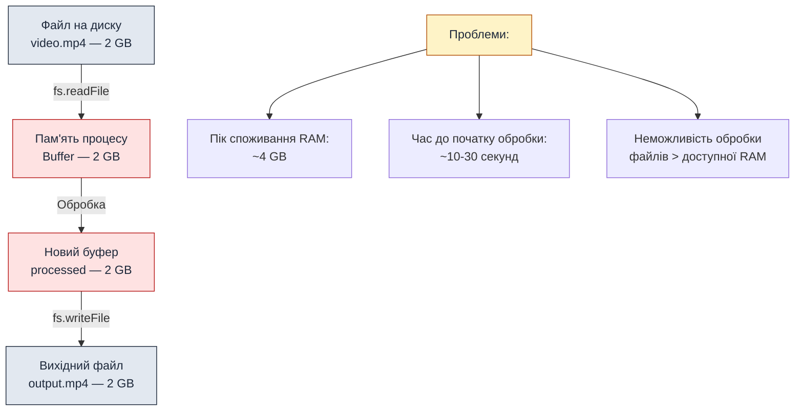
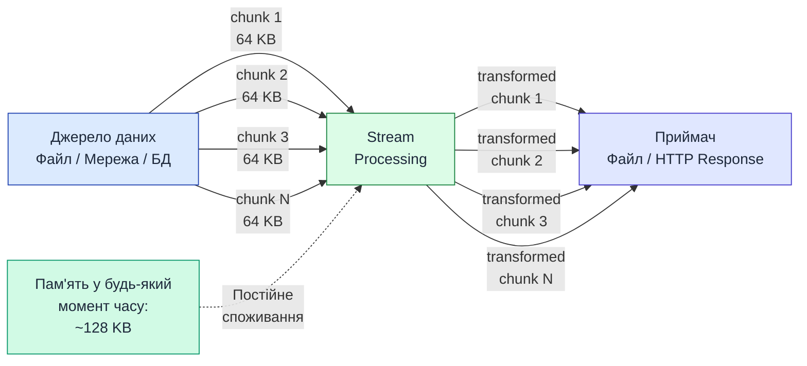
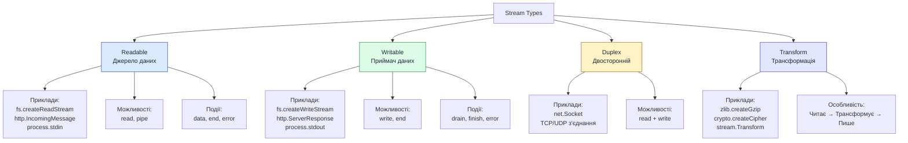
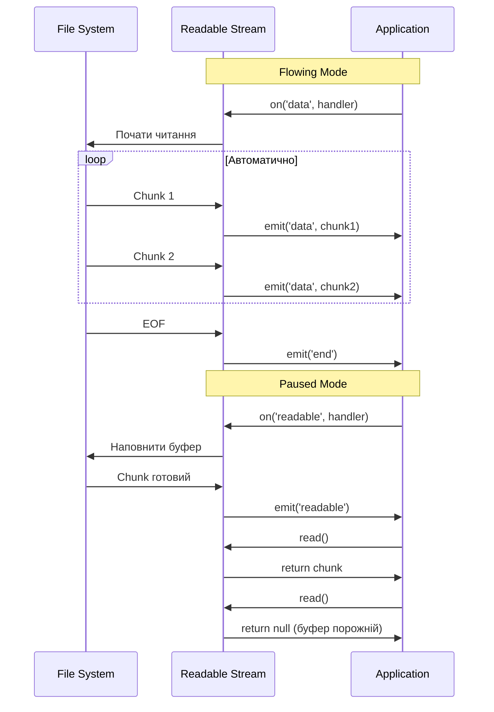
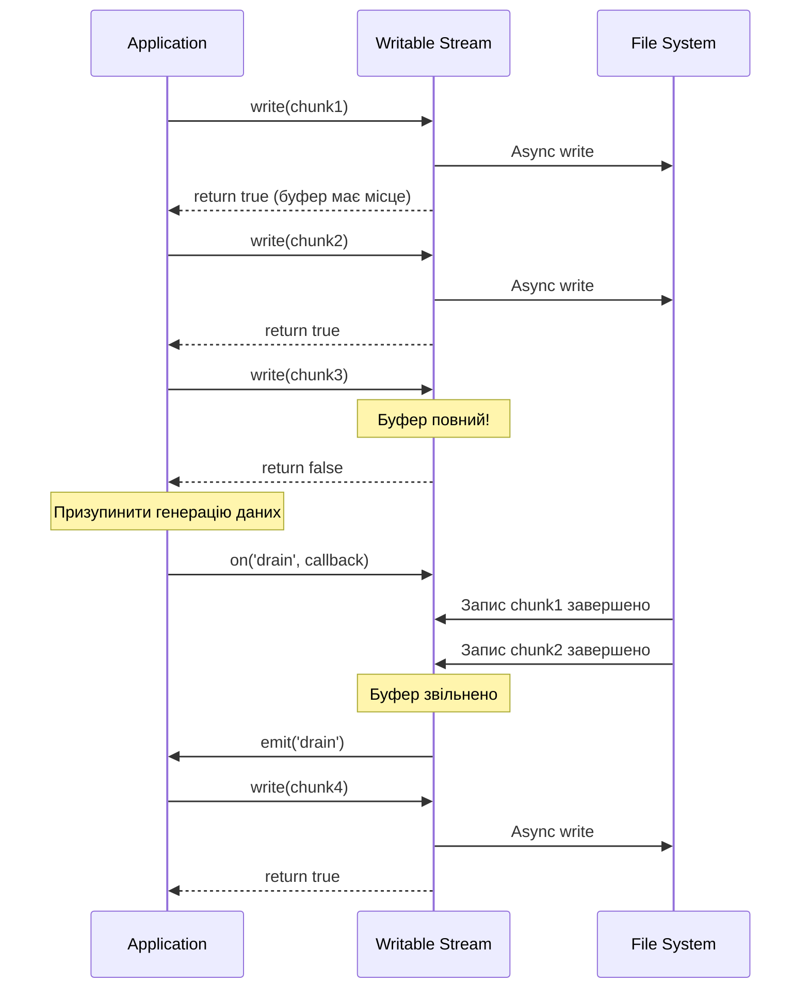
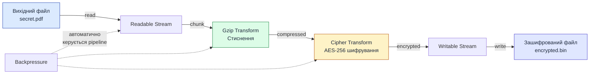

# Streams — потоки даних у Node.js

::card-group

::card{title="🎯 Мета лекції" icon="i-lucide-target"}

- Зрозуміти концепцію потоків (*streams*) як альтернативи буферизованій обробці даних.
- Опанувати чотири типи потоків: Readable, Writable, Duplex та Transform.
- Навчитися працювати з подіями потоків (`data`, `end`, `error`, `drain`) та обробляти backpressure.
- Освоїти механізм piping для з'єднання потоків та побудови конвеєрів обробки даних.
- Зрозуміти застосування streams у файловій системі, HTTP-запитах та обробці великих наборів даних.

::

::card{title="🔑 Ключові терміни" icon="i-lucide-key"}

- **Stream (Потік):** абстракція для роботи з даними як послідовністю фрагментів (*chunks*) замість завантаження всього масиву в пам'ять.
- **Chunk (Фрагмент):** окрема порція даних, що передається через потік (зазвичай Buffer або рядок).
- **Piping (Конвеєр):** механізм автоматичного передавання даних з одного потоку в інший.
- **Backpressure (Протитиск):** ситуація, коли споживач не встигає обробляти дані так швидко, як їх надає джерело.
- **Object Mode:** режим потоку, у якому передаються JavaScript-об'єкти замість буферів байтів.

::

::

## Фундаментальна проблема: обробка великих обсягів даних

### Чому буферизоване читання не масштабується

У попередніх лекціях ми працювали з файловою системою через методи `fs.readFile()` та `fs.writeFile()`, які завантажують **весь файл у пам'ять** перед обробкою. Цей підхід має критичні обмеження:

```typescript
import fs from 'node:fs/promises';

// ❌ ПРОБЛЕМА: весь файл завантажується у пам'ять
async function processLargeFile() {
  // Якщо файл має розмір 2 ГБ, Node.js спробує виділити 2 ГБ RAM
  const data = await fs.readFile('video.mp4'); // Buffer(2 GB)
  
  // Обробка даних
  const processed = transformData(data);
  
  // Запис результату (ще +2 ГБ у пам'яті)
  await fs.writeFile('output.mp4', processed);
}
```

::mermaid



::

**Реальні наслідки буферизації:**

1. **Out-Of-Memory (OOM) помилки:** спроба обробити файл розміром 4 ГБ на сервері з 2 ГБ RAM призведе до краху процесу.
2. **Висока затримка першого байта (*TTFB*):** клієнт починає отримувати дані лише після завантаження всього файлу на сервер.
3. **Неможливість паралельної обробки:** якщо 10 користувачів одночасно завантажують відео по 500 МБ, потрібно 5 ГБ RAM.
4. **Блокування Event Loop:** синхронна обробка великих буферів може заморозити сервер на секунди.

### Концепція Streams: потокова обробка даних

**Streams** — це абстракція, яка дозволяє обробляти дані **частинами** (*chunks*) у міру їх надходження, без завантаження всього набору даних у пам'ять. Це аналогічно до перегляду відео онлайн: ви не чекаєте завантаження всього фільму, а починаєте дивитися, поки наступні частини завантажуються у фоні.

::mermaid



::

**Ключові переваги потокової обробки:**

| Аспект | Буферизація (fs.readFile) | Потоки (fs.createReadStream) |
|--------|---------------------------|-------------------------------|
| **Споживання пам'яті** | Розмір файлу (наприклад, 2 ГБ) | Постійне (~64 КБ за chunk) |
| **Час до першого байта** | Після повного завантаження | Миттєво (перший chunk) |
| **Максимальний розмір файлу** | Обмежений доступною RAM | Необмежений |
| **Паралелізм** | 10 користувачів = 10 × розмір файлу | 10 користувачів = 10 × 64 КБ |
| **Скасування операції** | Важко (дані вже у пам'яті) | Легко (закрити потік) |

::note
**Історична довідка:**

Концепція потоків (*streams*) походить з Unix-філософії "pipes" (|), де програми з'єднуються у ланцюжки для обробки даних:

```bash
cat large-file.txt | grep "error" | sort | uniq -c | head -n 10
```

Кожна програма читає stdin, обробляє дані та записує у stdout **без завантаження всього файлу у пам'ять**. Node.js успадкував цю концепцію та адаптував її для асинхронного JavaScript-середовища.
::

### Де використовуються Streams у Node.js

Потоки є фундаментальною частиною Node.js і використовуються в багатьох вбудованих модулях:

```typescript
import fs from 'node:fs';
import type { ReadStream, WriteStream } from 'node:fs';
import http from 'node:http';
import zlib from 'node:zlib';
import crypto from 'node:crypto';

// 1. Файлова система
const readStream = fs.createReadStream('input.txt');   // Readable
const writeStream = fs.createWriteStream('output.txt'); // Writable

// 2. HTTP (request та response — це streams)
http.createServer((req, res) => {
  req.pipe(res); // Readable (request) → Writable (response)
});

// 3. Стиснення та шифрування
const gzip = zlib.createGzip();           // Transform
const cipher = crypto.createCipher('aes-256-cbc', 'password'); // Transform

// 4. Process stdio
process.stdin.pipe(process.stdout);  // stdin → stdout (echo)

// 5. Child processes
import { spawn } from 'node:child_process';
const ls = spawn('ls', ['-la']);
ls.stdout.pipe(process.stdout); // Вивід дочірнього процесу → stdout
```

::tip
**Універсальність Streams API:**

Усі потоки у Node.js успадковують від базових класів `stream.Readable`, `stream.Writable`, `stream.Duplex` та `stream.Transform`. Це означає, що методи та події, вивчені для файлових потоків, працюють **однаково** для HTTP, стиснення, шифрування та інших типів потоків.

Завдяки цій уніфікації можна будувати складні конвеєри обробки даних, комбінуючи потоки з різних модулів:

```typescript
// Читання файлу → Стиснення → Шифрування → Завантаження на S3
fs.createReadStream('large.txt')
  .pipe(zlib.createGzip())
  .pipe(crypto.createCipher('aes-256-cbc', key))
  .pipe(s3UploadStream);
```
::

## Типи потоків у Node.js

Node.js визначає **чотири основних типи потоків**, кожен з яких призначений для специфічних сценаріїв обробки даних:

::mermaid



::

### Порівняльна таблиця типів потоків

| Тип | Може читати | Може писати | Наслідується від | Типові use cases |
|-----|-------------|-------------|------------------|------------------|
| **Readable** | ✅ Так | ❌ Ні | `stream.Readable` | Читання файлів, HTTP-запити (req), stdout дочірніх процесів |
| **Writable** | ❌ Ні | ✅ Так | `stream.Writable` | Запис файлів, HTTP-відповіді (res), stdin дочірніх процесів |
| **Duplex** | ✅ Так | ✅ Так | `stream.Duplex` | TCP-сокети, WebSockets, двостороння комунікація |
| **Transform** | ✅ Так | ✅ Так | `stream.Transform` (успадковує від Duplex) | Стиснення (gzip), шифрування, парсинг CSV → JSON |

::warning
**Важливе уточнення щодо Transform:**

Transform-потік є **спеціалізованим випадком Duplex**, де записані дані автоматично перетворюються та стають доступними для читання. У звичайному Duplex-потоці читання та запис **незалежні** (наприклад, у TCP-сокеті можна одночасно надсилати та отримувати різні дані).

У Transform-потоку **вхід пов'язаний з виходом через функцію трансформації**:

```
Input → _transform(chunk) → Output
```

Наприклад, у `zlib.createGzip()`:
- Вхід: звичайні дані (`"Hello, world!"`)
- Трансформація: алгоритм gzip стиснення
- Вихід: стиснені байти (`.gz` формат)
::

### Потоки як EventEmitter

Усі типи потоків успадковують від `EventEmitter`, що означає, що вони **працюють через події** замість промісів або callbacks:

```typescript
import fs from 'node:fs';
import type { ReadStream, WriteStream } from 'node:fs';

const readStream = fs.createReadStream('data.txt');

// Підписка на події (event-driven programming)
readStream.on('data', (chunk: Buffer) => {
  console.log('Отримано chunk розміром:', chunk.length);
});

readStream.on('end', (): void => {
  console.log('Читання завершено');
});

readStream.on('error', (error: Error) => {
  console.error('Помилка читання:', error);
});
```

::note
**Асинхронні ітератори як альтернатива:**

Починаючи з Node.js 10, потоки підтримують асинхронні ітератори (*async iterators*), що дозволяє використовувати їх з `for await...of`:

```typescript
import fs from 'node:fs';
import type { ReadStream, WriteStream } from 'node:fs';

const stream = fs.createReadStream('large-file.txt');

for await (const chunk of stream) {
  console.log('Chunk:', chunk.length);
}

console.log('Завершено');
```

Цей підхід більш сучасний та читабельний, але під капотом все одно працює через події `data` та `end`.
::


## Readable Stream: читання даних частинами

### Створення Readable Stream для файлів

Найпростіший спосіб створити Readable Stream — використати `fs.createReadStream()`:

```typescript
import fs from 'node:fs';
import type { ReadStream, WriteStream } from 'node:fs';

// Створення потоку для читання файлу
const readStream = fs.createReadStream('large-file.txt', {
  encoding: 'utf8',      // Автоматична конвертація Buffer → String
  highWaterMark: 64 * 1024,  // Розмір буфера (64 КБ за замовчуванням)
  start: 0,              // Початкова позиція у файлі (байт)
  end: undefined,        // Кінцева позиція (undefined = до кінця файлу)
  autoClose: true        // Автоматичне закриття файлового дескриптора
});

console.log('Stream створено, але читання ще не почалося');
```

**Параметри конфігурації:**

::field-group

::field{name="encoding" type="string | null"}
Кодування для автоматичної конвертації `Buffer` у рядок. Якщо `null` (за замовчуванням), повертаються `Buffer` об'єкти.

Підтримувані значення: `'utf8'`, `'utf16le'`, `'latin1'`, `'base64'`, `'hex'`.

::

::field{name="highWaterMark" type="number"}
Максимальний розмір внутрішнього буфера у байтах. Потік намагатиметься читати chunks такого розміру з диска.

За замовчуванням: `64 * 1024` (64 КБ) для файлових потоків.

::

::field{name="start" type="number"}
Позиція у файлі (у байтах), з якої почати читання. Корисно для resumable uploads або вибірки діапазонів (Range requests).

::

::field{name="end" type="number"}
Позиція у файлі (у байтах), на якій зупинити читання. Якщо не вказано, читання йде до кінця файлу.

::

::

### Режими роботи Readable Stream

Readable Stream може працювати у двох режимах:

**1. Flowing Mode (Потоковий режим):**

Дані автоматично читаються з джерела та надаються через події `data` так швидко, як це можливо.

```typescript
import fs from 'node:fs';
import type { ReadStream, WriteStream } from 'node:fs';

const stream = fs.createReadStream('data.txt', { encoding: 'utf8' });

// Підписка на подію 'data' автоматично переводить потік у flowing mode
stream.on('data', (chunk: Buffer) => {
  console.log('Отримано chunk:', chunk);
  // Дані надходять автоматично, доки не закінчаться або не буде викликано pause()
});

stream.on('end', (): void => {
  console.log('Читання завершено');
});

stream.on('error', (error: Error) => {
  console.error('Помилка:', error);
});
```

**2. Paused Mode (Призупинений режим):**

Дані потрібно явно запитувати через метод `read()`. Це дає більший контроль над швидкістю споживання.

```typescript
import fs from 'node:fs';
import type { ReadStream, WriteStream } from 'node:fs';

const stream = fs.createReadStream('data.txt');

// За замовчуванням потік у paused mode
stream.on('readable', () => {
  let chunk;
  
  // Явне читання даних з внутрішнього буфера
  while ((chunk = stream.read()) !== null) {
    console.log('Прочитано chunk розміром:', chunk.length);
    
    // Можна обробляти chunk синхронно
    processChunk(chunk);
  }
});

stream.on('end', (): void => {
  console.log('Читання завершено');
});

function processChunk(chunk) {
  // Синхронна обробка
  console.log('Обробка:', chunk.toString('utf8').slice(0, 50));
}
```

::mermaid



::

### Базові події Readable Stream

::field-group

::field{name="'data'" type="Event"}
Випромінюється, коли потік надає chunk даних споживачу.

**Параметри callback:** `(chunk: Buffer | string)`

**Поведінка:** Автоматично переводить потік у **flowing mode**.

::

::field{name="'end'" type="Event"}
Випромінюється, коли всі дані прочитано і більше не буде chunks.

**Параметри callback:** немає

**Важливо:** Подія `'end'` завжди випромінюється після останньої події `'data'`.

::

::field{name="'error'" type="Event"}
Випромінюється при виникненні помилки читання (наприклад, файл не існує, недостатньо прав).

**Параметри callback:** `(error: Error)`

**Критично:** Якщо не додати обробник `'error'`, необроблена помилка призведе до краху процесу.

::

::field{name="'readable'" type="Event"}
Випромінюється, коли у внутрішньому буфері з'явилися нові дані для читання через `read()`.

**Використання:** Паused mode для ручного контролю швидкості читання.

::

::field{name="'close'" type="Event"}
Випромінюється після закриття потоку та звільнення системних ресурсів (файлові дескриптори).

**Відмінність від 'end':** `'end'` сигналізує про завершення даних, `'close'` — про закриття ресурсів.

::

::

### Практичний приклад: статистика файлу

```typescript
import fs from 'node:fs';
import type { ReadStream, WriteStream } from 'node:fs';

function analyzeFile(filePath) {
  const stream = fs.createReadStream(filePath, { encoding: 'utf8' });
  
  let totalBytes = 0;
  let totalLines = 0;
  let totalWords = 0;
  let chunkCount = 0;
  
  stream.on('data', (chunk: Buffer) => {
    chunkCount++;
    totalBytes += Buffer.byteLength(chunk, 'utf8');
    
    // Підрахунок рядків
    totalLines += (chunk.match(/\n/g) || []).length;
    
    // Підрахунок слів (приблизно)
    totalWords += chunk.split(/\s+/).filter(Boolean).length;
  });
  
  stream.on('end', (): void => {
    console.log('Аналіз завершено:');
    console.log(`  Байти: ${totalBytes.toLocaleString()}`);
    console.log(`  Рядки: ${totalLines.toLocaleString()}`);
    console.log(`  Слова: ${totalWords.toLocaleString()}`);
    console.log(`  Chunks: ${chunkCount}`);
    console.log(`  Середній розмір chunk: ${Math.round(totalBytes / chunkCount)} байт`);
  });
  
  stream.on('error', (error: Error) => {
    console.error('Помилка читання файлу:', error.message);
  });
}

// Використання
analyzeFile('large-document.txt');
```

::terminal-preview{title="node analyze-file.js"}

<div class="line"><span class="opacity-40">$</span> <strong class="font-bold">node analyze-file.js</strong></div>
<div class="line">Аналіз завершено:</div>
<div class="line">  Байти: <span class="text-blue-400">2,458,624</span></div>
<div class="line">  Рядки: <span class="text-blue-400">45,231</span></div>
<div class="line">  Слова: <span class="text-blue-400">312,456</span></div>
<div class="line">  Chunks: <span class="text-blue-400">38</span></div>
<div class="line">  Середній розмір chunk: <span class="text-blue-400">64,700</span> байт</div>

::

### Контроль швидкості: pause() та resume()

У flowing mode можна динамічно призупиняти та відновлювати читання:

```typescript
import fs from 'node:fs';
import type { ReadStream, WriteStream } from 'node:fs';

const stream = fs.createReadStream('large-file.txt', { encoding: 'utf8' });

let processedChunks = 0;

stream.on('data', (chunk: Buffer) => {
  processedChunks++;
  console.log(`Обробка chunk #${processedChunks}`);
  
  // Симуляція повільної обробки
  processSlowly(chunk);
  
  // Після кожних 5 chunks — пауза на 2 секунди
  if (processedChunks % 5 === 0) {
    console.log('Призупинення потоку на 2 секунди...');
    stream.pause();
    
    setTimeout(() => {
      console.log('Відновлення потоку');
      stream.resume();
    }, 2000);
  }
});

stream.on('end', (): void => {
  console.log(`Оброблено ${processedChunks} chunks`);
});

function processSlowly(chunk) {
  // Симуляція CPU-інтенсивної операції
  const lines = chunk.split('\n');
  for (const line of lines) {
    if (line.includes('ERROR')) {
      console.log('Знайдено помилку:', line.slice(0, 50));
    }
  }
}
```

::warning
**Важливо про pause() та backpressure:**

Метод `pause()` **не зупиняє читання миттєво** — дані, що вже знаходяться у внутрішньому буфері потоку, все одно будуть випромінені через події `'data'`. Це означає, що може надійти ще 1-2 chunks після виклику `pause()`.

Для коректної обробки **backpressure** (протитиску) при з'єднанні потоків краще використовувати механізм **piping**, який автоматично керує паузами та відновленням.
::

### Читання конкретного діапазону байтів

```typescript
import fs from 'node:fs';
import type { ReadStream, WriteStream } from 'node:fs';

// Читання лише перших 1024 байтів файлу
function readFileHeader(filePath) {
  const stream = fs.createReadStream(filePath, {
    start: 0,
    end: 1023  // Прочитати байти 0-1023 (включно)
  });
  
  let header = '';
  
  stream.on('data', (chunk: Buffer) => {
    header += chunk.toString('utf8');
  });
  
  stream.on('end', (): void => {
    console.log('Заголовок файлу (перші 1024 байти):');
    console.log(header);
  });
}

// HTTP Range Request (resumable downloads)
function serveFileRange(filePath, rangeHeader, response) {
  const stat = fs.statSync(filePath);
  const fileSize = stat.size;
  
  // Парсинг заголовка Range: bytes=0-1023
  const range = /bytes=(\d+)-(\d*)/.exec(rangeHeader);
  if (!range) {
    response.writeHead(416); // Range Not Satisfiable
    response.end();
    return;
  }
  
  const start = parseInt(range[1], 10);
  const end = range[2] ? parseInt(range[2], 10) : fileSize - 1;
  const chunkSize = end - start + 1;
  
  // HTTP 206 Partial Content
  response.writeHead(206, {
    'Content-Range': `bytes ${start}-${end}/${fileSize}`,
    'Accept-Ranges': 'bytes',
    'Content-Length': chunkSize,
    'Content-Type': 'application/octet-stream'
  });
  
  // Потоковий запис лише вказаного діапазону
  const stream = fs.createReadStream(filePath, { start, end });
  stream.pipe(response);
}
```

::accordion

::accordion-item{label="❓ Чи можна читати файл з кінця на початок?" icon="i-lucide-help-circle"}

`fs.createReadStream()` **не підтримує** читання у зворотному порядку нативно. Проте можна емулювати це через параметри `start` та `end`:

```typescript
const fileSize = fs.statSync('file.txt').size;
const chunkSize = 1024;

// Читання останнього KB
const stream = fs.createReadStream('file.txt', {
  start: Math.max(0, fileSize - chunkSize),
  end: fileSize - 1
});
```

Для справжнього зворотного читання по байтах потрібно використовувати `fs.open()` + `fs.read()` у циклі з декрементом позиції.

::

::accordion-item{label="❓ Що станеться, якщо файл змінюється під час читання?" icon="i-lucide-help-circle"}

`fs.createReadStream()` використовує **файловий дескриптор**, який вказує на момент відкриття файлу. Поведінка залежить від операційної системи:

- **Linux/macOS:** зміни, внесені **після** відкриття файлу, **видимі** для потоку (інод залишається тим самим).
- **Windows:** файл зазвичай **блокується** на час читання, запис може викликати помилку.

Для критичних сценаріїв (логи, що постійно оновлюються) краще використовувати `fs.watch()` або бібліотеки типу `tail-f`.

::

::


## Writable Stream: запис даних частинами

### Створення Writable Stream для файлів

Writable Stream дозволяє записувати дані у файл поетапно, без необхідності тримати весь вміст у пам'яті:

```typescript
import fs from 'node:fs';
import type { ReadStream, WriteStream } from 'node:fs';

// Створення потоку для запису
const writeStream = fs.createWriteStream('output.txt', {
  encoding: 'utf8',
  flags: 'w',            // 'w' — перезаписати, 'a' — додати до кінця
  mode: 0o666,           // Права доступу (rw-rw-rw-)
  highWaterMark: 16 * 1024,  // Розмір буфера (16 КБ за замовчуванням)
  autoClose: true
});

console.log('Writable Stream створено');
```

**Параметри конфігурації:**

::field-group

::field{name="flags" type="string"}
Режим відкриття файлу:
- `'w'` — створити або перезаписати файл (за замовчуванням)
- `'a'` — додати до кінця файлу (append mode)
- `'wx'` — створити файл, якщо він не існує (помилка, якщо існує)

::

::field{name="mode" type="number"}
Unix-права доступу для нового файлу у вісімковій системі:
- `0o666` — читання/запис для всіх (за замовчуванням)
- `0o644` — rw-r--r-- (власник може писати, інші лише читати)

::

::field{name="highWaterMark" type="number"}
Максимальний розмір внутрішнього буфера. Коли буфер переповнюється, метод `write()` повертає `false`, сигналізуючи про необхідність backpressure.

За замовчуванням: `16 * 1024` (16 КБ) для файлових потоків.

::

::

### Методи запису даних

**Базовий запис через write():**

::field-group

::field{name="stream.write(chunk, encoding, callback)" type="boolean"}
Записує chunk даних у потік.

**Параметри:**
- `chunk` (string | Buffer) — дані для запису
- `encoding` (string, опціонально) — кодування для рядків
- `callback` (Function, опціонально) — викликається після фактичного запису на диск

**Повертає:** `boolean`
- `true` — буфер має місце, можна продовжувати запис
- `false` — буфер повний, потрібно чекати події `'drain'`

::

::field{name="stream.end(chunk, encoding, callback)" type="void"}
Сигналізує про завершення запису. Опціонально записує останній chunk.

**Параметри:** ті самі, що у `write()`

**Важливо:** Після виклику `end()` неможливо писати у потік. Подія `'finish'` випромінюється після фактичного запису всіх даних.

::

::

```typescript
import fs from 'node:fs';
import type { ReadStream, WriteStream } from 'node:fs';

const writeStream = fs.createWriteStream('log.txt', { flags: 'a' });

// Запис кількох рядків
writeStream.write('Перший рядок\n');
writeStream.write('Другий рядок\n');
writeStream.write('Третій рядок\n');

// Завершення запису
writeStream.end('Останній рядок\n', () => {
  console.log('Всі дані записано на диск');
});

writeStream.on('error', (error: Error) => {
  console.error('Помилка запису:', error);
});
```

### Події Writable Stream

::field-group

::field{name="'drain'" type="Event"}
Випромінюється, коли внутрішній буфер звільнено і потік готовий приймати нові дані.

**Використання:** Обробка backpressure — продовження запису після `write()` повернуло `false`.

::

::field{name="'finish'" type="Event"}
Випромінюється після виклику `end()` і запису всіх даних на диск.

**Відмінність від callback у end():** `'finish'` — подія, callback — аргумент функції.

::

::field{name="'error'" type="Event"}
Випромінюється при помилці запису (недостатньо місця на диску, відсутні права доступу).

::

::field{name="'close'" type="Event"}
Випромінюється після закриття потоку та звільнення файлового дескриптора.

::

::

### Обробка backpressure у Writable Stream

Коли записуються дані швидше, ніж система встигає їх фізично записати на диск, виникає **backpressure** (протитиск). Метод `write()` повертає `false`, сигналізуючи про необхідність призупинити запис:

```typescript
import fs from 'node:fs';
import type { ReadStream, WriteStream } from 'node:fs';

const writeStream = fs.createWriteStream('large-output.txt');

function writeMillionLines() {
  let lineNumber = 0;
  const totalLines = 1_000_000;
  
  function writeNext() {
    let canContinue = true;
    
    // Пишемо, доки write() повертає true
    while (lineNumber < totalLines && canContinue) {
      const line = `Рядок номер ${lineNumber}\n`;
      lineNumber++;
      
      if (lineNumber === totalLines) {
        // Останній рядок — завершуємо потік
        writeStream.end(line, () => {
          console.log(`Записано ${totalLines} рядків`);
        });
      } else {
        // Продовжуємо запис
        canContinue = writeStream.write(line);
      }
    }
    
    // Якщо write() повернув false, чекаємо 'drain'
    if (lineNumber < totalLines) {
      console.log(`Backpressure на рядку ${lineNumber}, очікування drain...`);
      writeStream.once('drain', writeNext);
    }
  }
  
  writeNext();
}

writeMillionLines();
```

::mermaid



::

::tip
**Правило коректної обробки backpressure:**

```typescript
// ✅ ПРАВИЛЬНО: перевіряємо повернене значення write()
if (!stream.write(data)) {
  // Буфер повний, чекаємо drain
  stream.once('drain', continueWriting);
} else {
  // Можна продовжувати
  continueWriting();
}

// ❌ НЕПРАВИЛЬНО: ігноруємо повернене значення
stream.write(data); // Ігнорування false призведе до Out-Of-Memory
continueWriting();
```

Ігнорування `false` від `write()` призводить до накопичення даних у буфері пам'яті швидше, ніж вони записуються на диск, що спричиняє **витік пам'яті** (*memory leak*) та OOM.
::

### Практичний приклад: генерація великого CSV-файлу

```typescript
import fs from 'node:fs';
import type { ReadStream, WriteStream } from 'node:fs';

function generateLargeCSV(filename, rowCount) {
  const writeStream = fs.createWriteStream(filename, { encoding: 'utf8' });
  
  // Заголовки CSV
  writeStream.write('id,name,email,age,created_at\n');
  
  let currentRow = 0;
  let bytesWritten = 0;
  const startTime = Date.now();
  
  function writeRows() {
    let canContinue = true;
    
    while (currentRow < rowCount && canContinue) {
      currentRow++;
      
      const row = [
        currentRow,
        `User${currentRow}`,
        `user${currentRow}@example.com`,
        Math.floor(Math.random() * 60) + 18,
        new Date().toISOString()
      ].join(',') + '\n';
      
      bytesWritten += Buffer.byteLength(row, 'utf8');
      
      if (currentRow === rowCount) {
        // Останній рядок
        writeStream.end(row);
      } else {
        canContinue = writeStream.write(row);
      }
      
      // Прогрес кожні 100000 рядків
      if (currentRow % 100000 === 0) {
        const elapsed = (Date.now() - startTime) / 1000;
        const speed = Math.round(currentRow / elapsed);
        console.log(`Прогрес: ${currentRow}/${rowCount} (${speed} рядків/сек)`);
      }
    }
    
    if (currentRow < rowCount) {
      // Backpressure — чекаємо drain
      writeStream.once('drain', writeRows);
    }
  }
  
  writeStream.on('finish', (): void => {
    const totalTime = (Date.now() - startTime) / 1000;
    const sizeMB = (bytesWritten / 1024 / 1024).toFixed(2);
    const speed = Math.round(rowCount / totalTime);
    
    console.log('\n✅ Генерацію завершено:');
    console.log(`   Файл: ${filename}`);
    console.log(`   Рядків: ${rowCount.toLocaleString()}`);
    console.log(`   Розмір: ${sizeMB} МБ`);
    console.log(`   Час: ${totalTime.toFixed(2)} сек`);
    console.log(`   Швидкість: ${speed.toLocaleString()} рядків/сек`);
  });
  
  writeStream.on('error', (error: Error) => {
    console.error('Помилка запису:', error.message);
  });
  
  // Почати запис
  writeRows();
}

// Згенерувати CSV з 10 мільйонами рядків
generateLargeCSV('users.csv', 10_000_000);
```

::terminal-preview{title="node generate-csv.js"}

<div class="line"><span class="opacity-40">$</span> <strong class="font-bold">node generate-csv.js</strong></div>
<div class="line">Прогрес: 100000/10000000 <span class="opacity-40">(125432 рядків/сек)</span></div>
<div class="line">Прогрес: 200000/10000000 <span class="opacity-40">(126891 рядків/сек)</span></div>
<div class="line">Прогрес: 300000/10000000 <span class="opacity-40">(127045 рядків/сек)</span></div>
<div class="line"><span class="opacity-40">...</span></div>
<div class="line">Прогрес: 10000000/10000000 <span class="opacity-40">(125789 рядків/сек)</span></div>
<div class="line"></div>
<div class="line"><span class="text-green-400 font-bold">✅ Генерацію завершено:</span></div>
<div class="line">   Файл: <span class="text-blue-400">users.csv</span></div>
<div class="line">   Рядків: <span class="text-blue-400">10,000,000</span></div>
<div class="line">   Розмір: <span class="text-blue-400">487.32</span> МБ</div>
<div class="line">   Час: <span class="text-blue-400">79.45</span> сек</div>
<div class="line">   Швидкість: <span class="text-blue-400">125,864</span> рядків/сек</div>

::

::note
**Споживання пам'яті у прикладі:**

Завдяки потоковому запису та коректній обробці backpressure, генерація файлу розміром ~500 МБ споживає лише **~20-30 МБ RAM** (розмір внутрішнього буфера потоку). Без streams довелося б тримати всі 10 мільйонів рядків у пам'яті, що вимагало б **~2-3 ГБ RAM**.
::

### Запис у кілька файлів одночасно

```typescript
import fs from 'node:fs';
import type { ReadStream, WriteStream } from 'node:fs';

function splitLogsByLevel(inputFile) {
  const readStream = fs.createReadStream(inputFile, { encoding: 'utf8' });
  
  // Три окремі потоки для запису
  const streams = {
    info: fs.createWriteStream('info.log'),
    warn: fs.createWriteStream('warn.log'),
    error: fs.createWriteStream('error.log')
  };
  
  let buffer = '';
  
  readStream.on('data', (chunk: Buffer) => {
    buffer += chunk;
    
    // Обробка повних рядків
    let lines = buffer.split('\n');
    buffer = lines.pop(); // Зберегти неповний останній рядок
    
    for (const line of lines) {
      if (line.includes('[INFO]')) {
        streams.info.write(line + '\n');
      } else if (line.includes('[WARN]')) {
        streams.warn.write(line + '\n');
      } else if (line.includes('[ERROR]')) {
        streams.error.write(line + '\n');
      }
    }
  });
  
  readStream.on('end', (): void => {
    // Записати залишок буфера
    if (buffer) {
      if (buffer.includes('[INFO]')) streams.info.write(buffer + '\n');
      else if (buffer.includes('[WARN]')) streams.warn.write(buffer + '\n');
      else if (buffer.includes('[ERROR]')) streams.error.write(buffer + '\n');
    }
    
    // Закрити всі потоки
    streams.info.end();
    streams.warn.end();
    streams.error.end();
    
    console.log('Логи розділено за рівнями');
  });
  
  readStream.on('error', (error: Error) => {
    console.error('Помилка читання:', error);
  });
}

splitLogsByLevel('application.log');
```

Цей приклад демонструє одночасне читання одного файлу та запис у три різні файли на основі фільтрації вмісту — все без завантаження всього лог-файлу у пам'ять.


## Piping: з'єднання потоків у конвеєр

### Концепція pipe() — автоматичний потік даних

Метод `pipe()` дозволяє з'єднати Readable Stream з Writable Stream, автоматично передаючи дані та **керуючи backpressure**:

```typescript
import fs from 'node:fs';
import type { ReadStream, WriteStream } from 'node:fs';

// Ручний підхід (багато коду)
const readStream = fs.createReadStream('input.txt');
const writeStream = fs.createWriteStream('output.txt');

readStream.on('data', (chunk: Buffer) => {
  const canContinue = writeStream.write(chunk);
  if (!canContinue) {
    readStream.pause(); // Backpressure
  }
});

writeStream.on('drain', (): void => {
  readStream.resume();
});

readStream.on('end', (): void => {
  writeStream.end();
});

// ✅ З pipe() — один рядок
fs.createReadStream('input.txt')
  .pipe(fs.createWriteStream('output.txt'));
```

::field-group

::field{name="readable.pipe(writable, options)" type="Writable"}
З'єднує readable потік з writable, автоматично передаючи дані та керуючи backpressure.

**Параметри:**
- `writable` (Writable Stream) — потік-приймач
- `options.end` (boolean, за замовчуванням `true`) — чи викликати `writable.end()` після завершення readable

**Повертає:** `writable` — для chaining pipe()

**Автоматичні дії:**
- Підписується на події `'data'`, `'end'`, `'error'`
- Викликає `pause()` при backpressure
- Викликає `resume()` після події `'drain'`
- Закриває writable після завершення readable (якщо `options.end !== false`)

::

::

### Базове копіювання файлу

```typescript
import fs from 'node:fs';
import type { ReadStream, WriteStream } from 'node:fs';

function copyFile(source, destination) {
  const readStream = fs.createReadStream(source);
  const writeStream = fs.createWriteStream(destination);
  
  // Pipe автоматично обробляє backpressure
  readStream.pipe(writeStream);
  
  // Обробка завершення
  writeStream.on('finish', (): void => {
    console.log(`Файл скопійовано: ${source} → ${destination}`);
  });
  
  // Обробка помилок
  readStream.on('error', (error: Error) => {
    console.error('Помилка читання:', error.message);
  });
  
  writeStream.on('error', (error: Error) => {
    console.error('Помилка запису:', error.message);
    readStream.destroy(); // Зупинити читання при помилці запису
  });
}

copyFile('large-video.mp4', 'backup-video.mp4');
```

::tip
**Переваги pipe() над ручною обробкою:**

1. **Автоматичний backpressure:** не потрібно вручну керувати `pause()` / `resume()`
2. **Менше коду:** одна строка замість 10-15 рядків обробників подій
3. **Захист від витоків пам'яті:** автоматична призупинка при переповненні буфера
4. **Chaining:** можна будувати ланцюжки трансформацій

```typescript
// Ланцюжок обробки
source
  .pipe(transform1)
  .pipe(transform2)
  .pipe(transform3)
  .pipe(destination);
```
::

### Ланцюжок трансформацій: стиснення файлу

```typescript
import fs from 'node:fs';
import type { ReadStream, WriteStream } from 'node:fs';
import zlib from 'node:zlib';

function compressFile(inputFile, outputFile) {
  const readStream = fs.createReadStream(inputFile);
  const gzipStream = zlib.createGzip({ level: 9 }); // Максимальне стиснення
  const writeStream = fs.createWriteStream(outputFile);
  
  // Ланцюжок: Читання → Стиснення → Запис
  readStream
    .pipe(gzipStream)
    .pipe(writeStream);
  
  // Відстеження прогресу
  let inputBytes = 0;
  let outputBytes = 0;
  
  readStream.on('data', (chunk: Buffer) => {
    inputBytes += chunk.length;
  });
  
  gzipStream.on('data', (chunk: Buffer) => {
    outputBytes += chunk.length;
  });
  
  writeStream.on('finish', (): void => {
    const ratio = ((1 - outputBytes / inputBytes) * 100).toFixed(2);
    console.log(`Стиснення завершено:`);
    console.log(`  Вхід: ${(inputBytes / 1024 / 1024).toFixed(2)} МБ`);
    console.log(`  Вихід: ${(outputBytes / 1024 / 1024).toFixed(2)} МБ`);
    console.log(`  Компресія: ${ratio}%`);
  });
  
  // Обробка помилок на кожному етапі
  readStream.on('error', (error: Error) => {
    console.error('Помилка читання:', error.message);
  });
  
  gzipStream.on('error', (error: Error) => {
    console.error('Помилка стиснення:', error.message);
  });
  
  writeStream.on('error', (error: Error) => {
    console.error('Помилка запису:', error.message);
  });
}

compressFile('document.txt', 'document.txt.gz');
```

::terminal-preview{title="node compress-file.js"}

<div class="line"><span class="opacity-40">$</span> <strong class="font-bold">node compress-file.js</strong></div>
<div class="line">Стиснення завершено:</div>
<div class="line">  Вхід: <span class="text-blue-400">125.48</span> МБ</div>
<div class="line">  Вихід: <span class="text-blue-400">42.17</span> МБ</div>
<div class="line">  Компресія: <span class="text-green-400 font-bold">66.40</span>%</div>

::

### Розпаковка архіву

```typescript
import fs from 'node:fs';
import type { ReadStream, WriteStream } from 'node:fs';
import zlib from 'node:zlib';

function decompressFile(gzipFile, outputFile) {
  fs.createReadStream(gzipFile)
    .pipe(zlib.createGunzip())
    .pipe(fs.createWriteStream(outputFile))
    .on('finish', (): void => {
      console.log(`Розпаковано: ${gzipFile} → ${outputFile}`);
    });
}

decompressFile('document.txt.gz', 'document-restored.txt');
```

### Pipeline API: сучасний спосіб з'єднання потоків

Node.js 10+ надає функцію `pipeline()` з модуля `stream/promises`, яка покращує обробку помилок:

```typescript
import { pipeline } from 'node:stream/promises';
import fs from 'node:fs';
import type { ReadStream, WriteStream } from 'node:fs';
import zlib from 'node:zlib';

async function compressFileModern(inputFile, outputFile) {
  try {
    await pipeline(
      fs.createReadStream(inputFile),
      zlib.createGzip({ level: 9 }),
      fs.createWriteStream(outputFile)
    );
    
    console.log(`✅ Стиснення успішне: ${inputFile} → ${outputFile}`);
  } catch (error) {
    console.error('❌ Помилка під час стиснення:', error.message);
    
    // Автоматичне очищення: всі потоки закриваються при помилці
    // Видалення частково записаного файлу
    try {
      await fs.promises.unlink(outputFile);
    } catch {
      // Файл не існує або вже видалений
    }
  }
}

// Використання з async/await
await compressFileModern('large-file.txt', 'large-file.txt.gz');
```

::warning
**Критична різниця між pipe() та pipeline():**

| Аспект | pipe() | pipeline() |
|--------|--------|-----------|
| Обробка помилок | Потрібно вручну для кожного потоку | Автоматична для всіх потоків |
| Закриття потоків | Вручну при помилці | Автоматичне при помилці |
| Промісифікація | Ні (події) | Так (async/await) |
| Очищення ресурсів | Ручне | Автоматичне |
| Node.js версія | Всі версії | 10+ (legacy callback), 15+ (promises) |

**Рекомендація:** використовуйте `pipeline()` з `stream/promises` для нового коду, оскільки він автоматично обробляє помилки та очищує ресурси.
::

### Складний конвеєр: шифрування та стиснення

```typescript
import { pipeline } from 'node:stream/promises';
import fs from 'node:fs';
import type { ReadStream, WriteStream } from 'node:fs';
import crypto from 'node:crypto';
import zlib from 'node:zlib';

async function encryptAndCompress(inputFile, outputFile, password) {
  // Генерація ключа шифрування з пароля
  const key = crypto.scryptSync(password, 'salt', 32);
  const iv = crypto.randomBytes(16);
  
  // Збереження IV на початку файлу (потрібен для розшифрування)
  const outputStream = fs.createWriteStream(outputFile);
  outputStream.write(iv);
  
  try {
    await pipeline(
      fs.createReadStream(inputFile),
      zlib.createGzip({ level: 6 }),                    // 1. Стиснення
      crypto.createCipheriv('aes-256-cbc', key, iv),    // 2. Шифрування
      outputStream                                       // 3. Запис
    );
    
    console.log('✅ Файл зашифровано та стиснено');
  } catch (error) {
    console.error('❌ Помилка:', error.message);
    
    // Видалення некоректного файлу
    try {
      await fs.promises.unlink(outputFile);
    } catch {}
  }
}

async function decryptAndDecompress(inputFile, outputFile, password) {
  const key = crypto.scryptSync(password, 'salt', 32);
  
  // Читання IV з початку файлу
  const fileHandle = await fs.promises.open(inputFile, 'r');
  const iv = Buffer.alloc(16);
  await fileHandle.read(iv, 0, 16, 0);
  
  // Створення потоку, який пропускає перші 16 байтів
  const readStream = fs.createReadStream(inputFile, { start: 16 });
  
  try {
    await pipeline(
      readStream,
      crypto.createDecipheriv('aes-256-cbc', key, iv),  // 1. Розшифрування
      zlib.createGunzip(),                               // 2. Розпаковка
      fs.createWriteStream(outputFile)                   // 3. Запис
    );
    
    console.log('✅ Файл розшифровано та розпаковано');
  } catch (error) {
    console.error('❌ Помилка:', error.message);
  } finally {
    await fileHandle.close();
  }
}

// Використання
await encryptAndCompress('secret-document.pdf', 'encrypted.bin', 'my-password-123');
await decryptAndDecompress('encrypted.bin', 'decrypted-document.pdf', 'my-password-123');
```

::mermaid



::

::note
**Порядок операцій має значення:**

У прикладі вище спочатку виконується **стиснення**, а потім **шифрування**. Це оптимальний порядок, оскільки:

1. **Стиснення перед шифруванням:** зменшує розмір даних, що потрібно шифрувати, прискорюючи процес.
2. **Шифрування після стиснення:** зашифровані дані мають високу ентропію і майже не піддаються стисненню.

Якщо змінити порядок (шифрування → стиснення), файл **не стиснеться** і навіть може збільшитися через додавання заголовків gzip.
::

### HTTP-сервер з потоковим передаванням файлів

```typescript
import http from 'node:http';
import fs from 'node:fs';
import type { ReadStream, WriteStream } from 'node:fs';
import path from 'node:path';

const server = http.createServer((req, res) => {
  const filePath = path.join(process.cwd(), 'public', req.url);
  
  // Перевірка існування файлу
  fs.stat(filePath, (err, stats) => {
    if (err || !stats.isFile()) {
      res.writeHead(404, { 'Content-Type': 'text/plain' });
      res.end('File not found');
      return;
    }
    
    // Встановлення заголовків
    res.writeHead(200, {
      'Content-Type': 'application/octet-stream',
      'Content-Length': stats.size,
      'Content-Disposition': `attachment; filename="${path.basename(filePath)}"`
    });
    
    // Потокове передавання файлу клієнту
    const readStream = fs.createReadStream(filePath);
    
    // res (ServerResponse) є Writable Stream
    readStream.pipe(res);
    
    // Обробка помилок
    readStream.on('error', (error: Error) => {
      console.error('Помилка читання файлу:', error);
      res.destroy(); // Розірвати з'єднання
    });
    
    // Клієнт розірвав з'єднання (наприклад, скасував завантаження)
    res.on('close', (): void => {
      readStream.destroy();
      console.log('Клієнт розірвав з\'єднання');
    });
  });
});

server.listen(3000, () => {
  console.log('Файловий сервер запущено на http://127.0.0.1:3000');
});
```

Цей HTTP-сервер може передавати файли будь-якого розміру (навіть 10 ГБ відео) без завантаження їх у пам'ять завдяки потоковому передаванню через `pipe()`.


## Transform Streams: трансформація даних на льоту

### Створення власних Transform Stream

Transform Stream — це спеціальний тип Duplex Stream, який читає дані, трансформує їх через функцію `_transform()` та записує результат:

```typescript
import { Transform } from 'node:stream';
import type { TransformCallback } from 'node:stream';

// Приклад: перетворення тексту у верхній регістр
class UpperCaseTransform extends Transform {
  _transform(chunk: Buffer | string, encoding: BufferEncoding, callback: TransformCallback): void {
    // chunk — вхідні дані (Buffer або string)
    // encoding — кодування (якщо chunk є рядком)
    // callback(error, transformedChunk) — виклик після трансформації
    
    const upperCased = chunk.toString().toUpperCase();
    this.push(upperCased); // Відправити трансформовані дані далі
    callback(); // Сигнал, що chunk оброблено
  }
}

// Використання
import fs from 'node:fs';
import type { ReadStream, WriteStream } from 'node:fs';

fs.createReadStream('input.txt', { encoding: 'utf8' })
  .pipe(new UpperCaseTransform())
  .pipe(fs.createWriteStream('output.txt'))
  .on('finish', (): void => {
    console.log('Файл перетворено у верхній регістр');
  });
```

::field-group

::field{name="_transform(chunk, encoding, callback)" type="void"}
Метод, який потрібно реалізувати для створення кастомного Transform Stream.

**Параметри:**
- `chunk` (Buffer | string) — вхідний фрагмент даних
- `encoding` (string) — кодування (якщо chunk є рядком)
- `callback` (Function) — `callback(error, transformedData)` або `callback()`

**Правила:**
- Викликати `this.push(data)` для відправки трансформованих даних
- Викликати `callback()` після завершення обробки chunk
- Можна викликати `this.push()` кілька разів для одного chunk
- Можна не викликати `this.push()` (фільтрація даних)

::

::field{name="_flush(callback)" type="void"}
Опціональний метод, викликається після обробки всіх chunks, перед подією `'end'`.

**Використання:** Відправка залишкових даних, які накопичувалися у буфері.

::

::

### Практичні приклади Transform Streams

**1. Заміна тексту:**

```typescript
import { Transform } from 'node:stream';
import type { TransformCallback } from 'node:stream';

class ReplaceTransform extends Transform {
  constructor(searchValue, replaceValue, options) {
    super(options);
    this.searchValue = searchValue;
    this.replaceValue = replaceValue;
    this.buffer = '';
  }
  
  _transform(chunk, encoding, callback) {
    // Накопичуємо дані у буфері для коректної обробки меж chunks
    this.buffer += chunk.toString();
    
    // Обробляємо повні рядки
    const lines = this.buffer.split('\n');
    this.buffer = lines.pop(); // Зберегти неповний останній рядок
    
    for (const line of lines) {
      const replaced = line.replace(
        new RegExp(this.searchValue, 'g'),
        this.replaceValue
      );
      this.push(replaced + '\n');
    }
    
    callback();
  }
  
  _flush(callback) {
    // Відправити залишок буфера
    if (this.buffer) {
      const replaced = this.buffer.replace(
        new RegExp(this.searchValue, 'g'),
        this.replaceValue
      );
      this.push(replaced);
    }
    callback();
  }
}

// Використання: заміна всіх 'error' на 'warning' у лог-файлі
import fs from 'node:fs';
import type { ReadStream, WriteStream } from 'node:fs';

fs.createReadStream('app.log', { encoding: 'utf8' })
  .pipe(new ReplaceTransform('error', 'warning'))
  .pipe(fs.createWriteStream('app-sanitized.log'));
```

**2. Підрахунок рядків та слів:**

```typescript
import { Transform } from 'node:stream';
import type { TransformCallback } from 'node:stream';

class StatisticsTransform extends Transform {
  constructor(options) {
    super(options);
    this.lines = 0;
    this.words = 0;
    this.bytes = 0;
  }
  
  _transform(chunk, encoding, callback) {
    const text = chunk.toString();
    this.bytes += Buffer.byteLength(text);
    this.lines += (text.match(/\n/g) || []).length;
    this.words += text.split(/\s+/).filter(Boolean).length;
    
    // Пропускаємо дані далі без змін
    this.push(chunk);
    callback();
  }
  
  _flush(callback) {
    // Виведення статистики після обробки всіх даних
    console.log('\nСтатистика файлу:');
    console.log(`  Байти: ${this.bytes.toLocaleString()}`);
    console.log(`  Рядки: ${this.lines.toLocaleString()}`);
    console.log(`  Слова: ${this.words.toLocaleString()}`);
    callback();
  }
}

// Використання: копіювання файлу з підрахунком статистики
fs.createReadStream('large-document.txt', { encoding: 'utf8' })
  .pipe(new StatisticsTransform())
  .pipe(fs.createWriteStream('copy.txt'))
  .on('finish', (): void => {
    console.log('Копіювання завершено');
  });
```

**3. Фільтрація рядків (grep-like):**

```typescript
import { Transform } from 'node:stream';
import type { TransformCallback } from 'node:stream';

class GrepTransform extends Transform {
  constructor(pattern, options) {
    super({ ...options, encoding: 'utf8' });
    this.pattern = new RegExp(pattern);
    this.buffer = '';
  }
  
  _transform(chunk, encoding, callback) {
    this.buffer += chunk;
    const lines = this.buffer.split('\n');
    this.buffer = lines.pop();
    
    for (const line of lines) {
      if (this.pattern.test(line)) {
        this.push(line + '\n'); // Пропускаємо лише рядки, що співпадають
      }
    }
    
    callback();
  }
  
  _flush(callback) {
    if (this.buffer && this.pattern.test(this.buffer)) {
      this.push(this.buffer + '\n');
    }
    callback();
  }
}

// Використання: фільтрація лише рядків з 'ERROR'
fs.createReadStream('app.log', { encoding: 'utf8' })
  .pipe(new GrepTransform('ERROR'))
  .pipe(process.stdout); // Виведення у консоль
```

### Object Mode: робота з JavaScript-об'єктами

За замовчуванням потоки працюють з `Buffer` або `string`. **Object Mode** дозволяє передавати довільні JavaScript-об'єкти:

```typescript
import { Transform } from 'node:stream';
import type { TransformCallback } from 'node:stream';
import fs from 'node:fs';
import type { ReadStream, WriteStream } from 'node:fs';
import { parse } from 'csv-parse';

// Transform Stream для парсингу CSV у об'єкти
function createCsvParser() {
  return parse({
    columns: true,      // Перший рядок — заголовки
    skip_empty_lines: true
  });
}

// Transform Stream для валідації користувачів
class UserValidator extends Transform {
  constructor(options) {
    super({ ...options, objectMode: true }); // Увімкнути Object Mode
  }
  
  _transform(user, encoding, callback) {
    // user — це JavaScript-об'єкт, а не Buffer
    const errors = [];
    
    if (!user.email || !user.email.includes('@')) {
      errors.push('Invalid email');
    }
    
    if (!user.age || isNaN(user.age) || user.age < 0) {
      errors.push('Invalid age');
    }
    
    if (errors.length === 0) {
      // Пропустити валідний об'єкт
      this.push({
        ...user,
        age: parseInt(user.age, 10),
        validated: true
      });
    } else {
      // Відхилити невалідний (або можна push з полем errors)
      console.warn(`Відхилено користувача: ${user.email || 'unknown'} (${errors.join(', ')})`);
    }
    
    callback();
  }
}

// Transform Stream для конвертації у JSON
class JsonStringifier extends Transform {
  constructor(options) {
    super({ ...options, objectMode: true, writableObjectMode: true, readableObjectMode: false });
    this.first = true;
  }
  
  _transform(obj, encoding, callback) {
    const json = JSON.stringify(obj);
    if (this.first) {
      this.push('[' + json);
      this.first = false;
    } else {
      this.push(',' + json);
    }
    callback();
  }
  
  _flush(callback) {
    this.push(']');
    callback();
  }
}

// Конвеєр: CSV → Об'єкти → Валідація → JSON → Файл
fs.createReadStream('users.csv', { encoding: 'utf8' })
  .pipe(createCsvParser())           // CSV → Об'єкти
  .pipe(new UserValidator())         // Валідація
  .pipe(new JsonStringifier())       // Об'єкти → JSON string
  .pipe(fs.createWriteStream('valid-users.json'))
  .on('finish', (): void => {
    console.log('Обробку CSV завершено');
  });
```

::terminal-preview{title="node csv-to-json.js"}

<div class="line"><span class="opacity-40">$</span> <strong class="font-bold">node csv-to-json.js</strong></div>
<div class="line"><span class="text-yellow-400">WARN</span> Відхилено користувача: invalid@example (Invalid age)</div>
<div class="line"><span class="text-yellow-400">WARN</span> Відхилено користувача: unknown (Invalid email)</div>
<div class="line">Обробку CSV завершено</div>
<div class="line"></div>
<div class="line"><span class="opacity-40">$</span> <strong class="font-bold">cat valid-users.json</strong></div>
<div class="line">[{"id":"1","name":"John","email":"john@example.com","age":30,"validated":true},</div>
<div class="line">{"id":"2","name":"Jane","email":"jane@example.com","age":25,"validated":true}]</div>

::

::note
**Налаштування Object Mode:**

Transform Streams підтримують три окремих налаштування для Object Mode:

- `objectMode: true` — увімкнути для **обох** сторін (readable та writable)
- `readableObjectMode: true` — лише для вихідного потоку (читання)
- `writableObjectMode: true` — лише для вхідного потоку (запису)

Це дозволяє створювати потоки, які приймають об'єкти, а виводять буфери (або навпаки):

```typescript
// Приймає об'єкти, виводить JSON-рядки
new Transform({
  writableObjectMode: true,  // Вхід: об'єкти
  readableObjectMode: false  // Вихід: рядки/буфери
});
```
::

### Вбудовані Transform Streams у Node.js

Node.js надає кілька готових Transform Streams:

```typescript
import zlib from 'node:zlib';
import crypto from 'node:crypto';

// 1. Стиснення та розпаковка (zlib)
const gzip = zlib.createGzip();
const gunzip = zlib.createGunzip();
const deflate = zlib.createDeflate();
const inflate = zlib.createInflate();
const brotli = zlib.createBrotliCompress();

// 2. Шифрування та розшифрування (crypto)
const cipher = crypto.createCipher('aes-256-cbc', 'password');
const decipher = crypto.createDecipher('aes-256-cbc', 'password');

// 3. Хешування (crypto)
const hash = crypto.createHash('sha256');
hash.on('readable', () => {
  const data = hash.read();
  if (data) {
    console.log('SHA256:', data.toString('hex'));
  }
});

fs.createReadStream('file.txt').pipe(hash);

// 4. HMAC (crypto)
const hmac = crypto.createHmac('sha256', 'secret-key');
fs.createReadStream('data.bin').pipe(hmac).pipe(process.stdout);
```

::accordion

::accordion-item{label="❓ Чи можна використовувати async/await у _transform()?" icon="i-lucide-help-circle"}

Методи `_transform()` та `_flush()` **не підтримують** `async/await` напряму, оскільки вони працюють через callback-архітектуру. Проте можна обгорнути асинхронну логіку:

```typescript
class AsyncTransform extends Transform {
  _transform(chunk, encoding, callback) {
    this.processAsync(chunk)
      .then((result) => {
        this.push(result);
        callback();
      })
      .catch((error) => {
        callback(error);
      });
  }
  
  async processAsync(chunk) {
    // Асинхронна обробка
    const result = await someAsyncOperation(chunk);
    return result;
  }
}
```

Альтернативно, у Node.js 16+ можна використовувати `stream.Duplex.from(asyncGenerator)` для створення потоків з async generators.

::

::accordion-item{label="❓ Як обмежити швидкість обробки (throttling)?" icon="i-lucide-help-circle"}

Для обмеження швидкості потоку (наприклад, для симуляції повільної мережі) можна додати затримку у `_transform()`:

```typescript
class ThrottleTransform extends Transform {
  constructor(delayMs, options) {
    super(options);
    this.delayMs = delayMs;
  }
  
  _transform(chunk, encoding, callback) {
    setTimeout(() => {
      this.push(chunk);
      callback();
    }, this.delayMs);
  }
}

// Симуляція мережі зі швидкістю ~1 МБ/сек (1 КБ за 1 мс)
fs.createReadStream('file.txt', { highWaterMark: 1024 })
  .pipe(new ThrottleTransform(1))
  .pipe(destination);
```

Для реального rate limiting краще використовувати бібліотеки типу `stream-throttle`.

::

::


## Streams у реальних сценаріях

### HTTP-сервер з потоковим завантаженням файлів

```typescript
import http from 'node:http';
import fs from 'node:fs';
import type { ReadStream, WriteStream } from 'node:fs';
import path from 'node:path';
import { pipeline } from 'node:stream/promises';

const UPLOAD_DIR = './uploads';

// Створення директорії для завантажень
if (!fs.existsSync(UPLOAD_DIR)) {
  fs.mkdirSync(UPLOAD_DIR, { recursive: true });
}

const server = http.createServer(async (req, res) => {
  if (req.method === 'POST' && req.url === '/upload') {
    const filename = req.headers['x-filename'] || `upload-${Date.now()}.bin`;
    const filepath = path.join(UPLOAD_DIR, filename);
    
    // Обмеження розміру файлу
    const maxSize = 100 * 1024 * 1024; // 100 МБ
    let uploadedBytes = 0;
    
    const writeStream = fs.createWriteStream(filepath);
    
    // Моніторинг прогресу
    req.on('data', (chunk: Buffer) => {
      uploadedBytes += chunk.length;
      
      if (uploadedBytes > maxSize) {
        req.destroy();
        writeStream.destroy();
        
        // Видалення частково завантаженого файлу
        fs.unlink(filepath, () => {});
        
        res.writeHead(413, { 'Content-Type': 'application/json' });
        res.end(JSON.stringify({ error: 'File too large' }));
      }
    });
    
    try {
      await pipeline(req, writeStream);
      
      res.writeHead(201, { 'Content-Type': 'application/json' });
      res.end(JSON.stringify({
        message: 'File uploaded successfully',
        filename,
        size: uploadedBytes
      }));
    } catch (error) {
      console.error('Upload error:', error);
      
      // Очищення при помилці
      try {
        await fs.promises.unlink(filepath);
      } catch {}
      
      if (!res.headersSent) {
        res.writeHead(500, { 'Content-Type': 'application/json' });
        res.end(JSON.stringify({ error: 'Upload failed' }));
      }
    }
  } else {
    res.writeHead(404);
    res.end('Not found');
  }
});

server.listen(3000, () => {
  console.log('Upload server running on http://127.0.0.1:3000');
  console.log('Upload files: curl -X POST -H "X-Filename: test.txt" --data-binary @file.txt http://127.0.0.1:3000/upload');
});
```

### Обробка великих JSON-масивів через потоки

```typescript
import { Transform } from 'node:stream';
import type { TransformCallback } from 'node:stream';
import fs from 'node:fs';
import type { ReadStream, WriteStream } from 'node:fs';

// Transform Stream для парсингу JSON-масиву по одному елементу
class JsonArrayParser extends Transform {
  constructor(options) {
    super({ ...options, objectMode: true });
    this.buffer = '';
    this.depth = 0;
    this.inArray = false;
  }
  
  _transform(chunk, encoding, callback) {
    this.buffer += chunk.toString();
    
    let startPos = 0;
    
    for (let i = 0; i < this.buffer.length; i++) {
      const char = this.buffer[i];
      
      if (char === '[') {
        this.depth++;
        if (this.depth === 1) {
          this.inArray = true;
          startPos = i + 1;
        }
      } else if (char === ']') {
        this.depth--;
        if (this.depth === 0 && this.inArray) {
          // Кінець масиву
          const lastObject = this.buffer.slice(startPos, i).trim();
          if (lastObject && lastObject !== ',') {
            try {
              const obj = JSON.parse(lastObject.replace(/,$/, ''));
              this.push(obj);
            } catch (error) {
              console.error('Parse error:', error);
            }
          }
          this.buffer = this.buffer.slice(i + 1);
          return callback();
        }
      } else if (char === ',' && this.depth === 1) {
        // Знайдено об'єкт
        const objectStr = this.buffer.slice(startPos, i).trim();
        if (objectStr) {
          try {
            const obj = JSON.parse(objectStr);
            this.push(obj);
          } catch (error) {
            console.error('Parse error:', error);
          }
        }
        startPos = i + 1;
      }
    }
    
    // Зберегти необроблений залишок
    if (startPos > 0) {
      this.buffer = this.buffer.slice(startPos);
    }
    
    callback();
  }
}

// Використання: обробка великого JSON-масиву
fs.createReadStream('large-array.json', { encoding: 'utf8' })
  .pipe(new JsonArrayParser())
  .on('data', (object) => {
    // Обробка кожного об'єкта окремо
    console.log('Отримано об\'єкт:', object.id);
  })
  .on('end', (): void => {
    console.log('Парсинг JSON завершено');
  });
```

### Прогрес-бар для файлових операцій

```typescript
import fs from 'node:fs';
import type { ReadStream, WriteStream } from 'node:fs';
import { Transform } from 'node:stream';
import type { TransformCallback } from 'node:stream';
import { pipeline } from 'node:stream/promises';

class ProgressTransform extends Transform {
  constructor(totalSize, options) {
    super(options);
    this.totalSize = totalSize;
    this.processedBytes = 0;
    this.lastPercent = 0;
  }
  
  _transform(chunk, encoding, callback) {
    this.processedBytes += chunk.length;
    const percent = Math.floor((this.processedBytes / this.totalSize) * 100);
    
    if (percent !== this.lastPercent && percent % 5 === 0) {
      this.lastPercent = percent;
      const bar = '█'.repeat(percent / 2) + '░'.repeat(50 - percent / 2);
      process.stdout.write(`\rПрогрес: [${bar}] ${percent}%`);
    }
    
    this.push(chunk);
    callback();
  }
  
  _flush(callback) {
    process.stdout.write('\n');
    callback();
  }
}

async function copyWithProgress(source, destination) {
  const stats = await fs.promises.stat(source);
  const totalSize = stats.size;
  
  console.log(`Копіювання файлу (${(totalSize / 1024 / 1024).toFixed(2)} МБ)...`);
  
  await pipeline(
    fs.createReadStream(source),
    new ProgressTransform(totalSize),
    fs.createWriteStream(destination)
  );
  
  console.log('✅ Копіювання завершено');
}

await copyWithProgress('large-file.mp4', 'copy.mp4');
```

::terminal-preview{title="node copy-with-progress.js" :cursor="false"}

<div class="line">Копіювання файлу (450.25 МБ)...</div>
<div class="line">Прогрес: [<span class="text-green-400">█████████████████████████</span>░░░░░░░░░░░░░░░░░░░░░░░░░] 50%</div>

::

## Порівняння: буферизація проти потоків

::code-group

```typescript [Буферизація (fs.readFile)]
import fs from 'node:fs/promises';

async function processFileBuffered(inputFile, outputFile) {
  // ❌ Весь файл у пам'яті
  const data = await fs.readFile(inputFile, 'utf8');
  
  // Обробка
  const processed = data.toUpperCase();
  
  // Запис
  await fs.writeFile(outputFile, processed);
}

// Проблеми:
// - Пам'ять: розмір файлу × 2 (input + output)
// - Затримка: починається лише після повного читання
// - Масштабованість: не працює для файлів > RAM
```

```typescript [Потоки (Streams)]
import fs from 'node:fs';
import type { ReadStream, WriteStream } from 'node:fs';
import { Transform } from 'node:stream';
import type { TransformCallback } from 'node:stream';
import { pipeline } from 'node:stream/promises';

class UpperCaseTransform extends Transform {
  _transform(chunk, encoding, callback) {
    this.push(chunk.toString().toUpperCase());
    callback();
  }
}

async function processFileStreamed(inputFile, outputFile) {
  await pipeline(
    fs.createReadStream(inputFile, { encoding: 'utf8' }),
    new UpperCaseTransform(),
    fs.createWriteStream(outputFile)
  );
}

// Переваги:
// - Пам'ять: постійна (~64 КБ незалежно від розміру)
// - Затримка: миттєвий початок обробки
// - Масштабованість: працює для файлів будь-якого розміру
```

::

**Порівняльна таблиця:**

| Метрика | Буферизація | Потоки |
|---------|-------------|--------|
| **Пам'ять для 1 ГБ файлу** | ~2 ГБ RAM | ~64 КБ RAM |
| **Час до першого байта** | 5-15 секунд | <10 мілісекунд |
| **10 одночасних операцій** | ~20 ГБ RAM | ~640 КБ RAM |
| **Максимальний розмір файлу** | Обмежений RAM | Необмежений |
| **CPU блокування** | Можливе при великих буферах | Мінімальне |
| **Складність коду** | Проста | Середня |

## Best Practices: рекомендації для роботи з потоками

::card-group

::card{title="✅ Завжди обробляйте помилки" icon="i-lucide-check-circle"}

```typescript
stream.on('error', (error: Error) => {
  console.error('Stream error:', error);
  // Очищення ресурсів
});

// Або через pipeline
await pipeline(source, transform, destination);
```

Необроблена помилка у потоці призведе до краху процесу.

::

::card{title="✅ Використовуйте pipeline замість pipe" icon="i-lucide-check-circle"}

```typescript
// ❌ Старий підхід
source.pipe(transform).pipe(destination);

// ✅ Сучасний підхід
await pipeline(source, transform, destination);
```

`pipeline()` автоматично обробляє помилки та очищає ресурси.

::

::card{title="✅ Поважайте backpressure" icon="i-lucide-check-circle"}

```typescript
// ✅ Правильно
if (!writable.write(data)) {
  writable.once('drain', continueWriting);
}

// ❌ Неправильно
writable.write(data);
continueWriting(); // Ігнорування false
```

::

::card{title="✅ Закривайте потоки при помилках" icon="i-lucide-check-circle"}

```typescript
readStream.on('error', (error: Error) => {
  console.error(error);
  readStream.destroy();
  writeStream.destroy();
});
```

Незакриті потоки призводять до витоків файлових дескрипторів.

::

::

::card-group

::card{title="❌ Не використовуйте sync методи" icon="i-lucide-x-circle"}

```typescript
// ❌ Блокує Event Loop
const data = fs.readFileSync('file.txt');

// ✅ Асинхронно через потік
fs.createReadStream('file.txt');
```

::

::card{title="❌ Не накопичуйте chunks у масиві" icon="i-lucide-x-circle"}

```typescript
// ❌ Втрачається перевага потоків
const chunks = [];
stream.on('data', chunk => chunks.push(chunk));
stream.on('end', (): void => {
  const full = Buffer.concat(chunks);
});

// ✅ Обробляйте по chunks
stream.on('data', chunk => {
  processChunk(chunk);
});
```

::

::card{title="❌ Не забувайте про encoding" icon="i-lucide-x-circle"}

```typescript
// ❌ Повертає Buffer
const stream = fs.createReadStream('text.txt');

// ✅ Повертає рядок
const stream = fs.createReadStream('text.txt', {
  encoding: 'utf8'
});
```

::

::card{title="❌ Не ігноруйте події 'close'" icon="i-lucide-x-circle"}

```typescript
// ✅ Відстежуйте закриття ресурсів
stream.on('close', (): void => {
  console.log('Stream closed, FD released');
});
```

::

::

## Підсумок: коли використовувати Streams

::card-group

::card{title="✅ Використовуйте Streams для:" icon="i-lucide-thumbs-up"}

- **Великих файлів** (> 100 МБ) — відео, бекапи, логи
- **HTTP-запитів та відповідей** — завантаження, потокове відео
- **Обробки даних у реальному часі** — логи, метрики, події
- **ETL-процесів** — CSV → валідація → трансформація → БД
- **Низьке споживання пам'яті** — серверні застосунки з обмеженнями

::

::card{title="❌ НЕ використовуйте Streams для:" icon="i-lucide-thumbs-down"}

- **Малих файлів** (< 1 МБ) — `fs.readFile` простіший
- **Випадкового доступу** — потоки лінійні, не підтримують seek
- **Складної бізнес-логіки** — краще завантажити у пам'ять
- **Синхронних операцій** — потоки асинхронні за природою

::

::

::tip
**Золоте правило Streams:**

Якщо не знаєте заздалегідь **розмір даних** або він **перевищує 10 МБ**, використовуйте потоки. Для малих, передбачуваних обсягів даних буферизація через `fs.readFile` / `fs.writeFile` є простішою альтернативою.

**Виняток:** HTTP-запити та відповіді завжди є потоками незалежно від розміру, оскільки дані надходять частинами через мережу.
::

## Корисні ресурси для поглибленого вивчення

- **Офіційна документація Node.js:** [Stream API](https://nodejs.org/api/stream.html)
- **Backpressure та flow control:** [Understanding Streams](https://nodejs.org/en/docs/guides/backpressuring-in-streams/)
- **Stream Handbook:** посібник Substack з практичними прикладами
- **Бібліотеки екосистеми:**
  - `through2` — спрощене створення Transform Streams
  - `split2` — розбиття потоку на рядки
  - `pumpify` — комбінування кількох потоків в один
  - `mississippi` — колекція утиліт для роботи з потоками

::note
**Еволюція Streams API:**

Node.js має три покоління Streams API:

1. **Streams1** (Node.js 0.x) — застарілий, не використовується
2. **Streams2** (Node.js 0.10+) — поточний стандарт, описаний у цій лекції
3. **Streams3** (Node.js 10+) — додає підтримку async iterators (`for await...of`)

Streams2 залишається основним API, а Streams3 надає синтаксичний цукор поверх нього. Знання Streams2 є фундаментальним для розуміння роботи потоків у Node.js.
::
