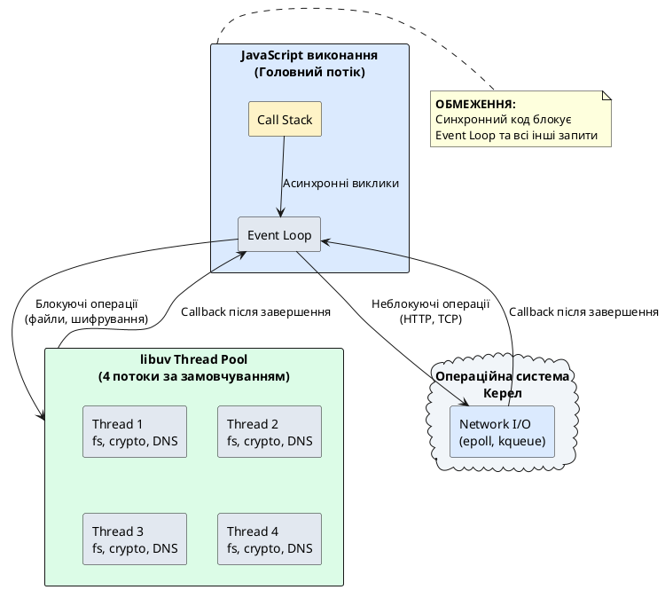
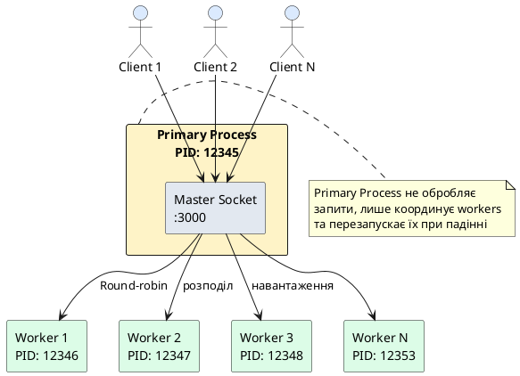

# Продуктивність та Best Practices

::card-group

::card{title="🎯 Мета лекції" icon="i-lucide-target"}

- Зрозуміти архітектурні обмеження Node.js та стратегії їх подолання.
- Опанувати техніки оптимізації Event Loop та уникнення блокувань.
- Освоїти кластеризацію через модуль `cluster` та PM2 для утилізації всіх CPU-ядер.
- Вивчити використання Worker Threads для CPU-інтенсивних обчислень.
- Навчитися впроваджувати кешування (in-memory, Redis), compression та connection pooling.
- Опанувати моніторинг продуктивності через метрики та health checks.

::

::card{title="🔑 Ключові терміни" icon="i-lucide-key"}

- **Event Loop Blocking:** затримка Event Loop через синхронний або тривалий код, що зупиняє обробку інших запитів.
- **Cluster:** механізм запуску кількох Node.js-процесів, які розподіляють навантаження між CPU-ядрами.
- **Worker Threads:** легковагі потоки для паралельного виконання JavaScript без блокування головного потоку.
- **Connection Pool:** набір повторно використовуваних з'єднань до бази даних або зовнішнього сервісу.
- **Throughput:** кількість запитів, які сервер може обробити за одиницю часу (RPS — requests per second).

::

::

## Архітектурні обмеження Node.js

### Однопотокова модель: переваги та виклики

Node.js виконує JavaScript-код у **одному потоці** (*single-threaded*), використовуючи Event Loop для управління асинхронними операціями. Ця архітектура має фундаментальні наслідки для продуктивності.

::plant-uml{alt="Архітектура Node.js: Event Loop та Thread Pool"}



::

**Переваги однопотоковості:**

1. **Відсутність race conditions:** Немає потреби у mutex, locks чи інших примітивах синхронізації.
2. **Низькі накладні витрати:** Один потік не створює overhead на перемикання контексту.
3. **Простота розробки:** Немає складності багатопотокового програмування.

**Виклики:**

1. **CPU-bound операції блокують Event Loop:** Обчислення, що тривають >10 мс, зупиняють обробку всіх інших запитів.
2. **Одноядерна утилізація:** За замовчуванням Node.js використовує лише одне CPU-ядро.
3. **Відсутність справжнього паралелізму:** JavaScript-код не може виконуватися одночасно на кількох ядрах.

::warning
**Золоте правило:** Якщо операція займає >10 мілісекунд синхронного часу, вона блокує Event Loop і має бути оптимізована або винесена у Worker Thread.
::

## Вимірювання продуктивності: perf_hooks

Модуль `perf_hooks` надає високоточний API для вимірювання продуктивності коду, аналогічний Web Performance API у браузерах.

### Performance Timeline API

```typescript
import { performance, PerformanceObserver } from 'node:perf_hooks';

// Спостерігач за всіма вимірюваннями
const obs = new PerformanceObserver((items) => {
  items.getEntries().forEach((entry) => {
    console.log(`${entry.name}: ${entry.duration.toFixed(2)} ms`);
  });
});

obs.observe({ entryTypes: ['measure'], buffered: true });

// Вимірювання часу виконання операції
performance.mark('start-db-query');

await queryDatabase('SELECT * FROM users WHERE active = true');

performance.mark('end-db-query');
performance.measure('Database Query', 'start-db-query', 'end-db-query');

// Вивід: Database Query: 42.35 ms
```

### Функція-декоратор для автоматичного вимірювання

```typescript
function measurePerformance<T extends (...args: any[]) => any>(
  fn: T,
  label?: string
): T {
  return ((...args: Parameters<T>): ReturnType<T> => {
    const name = label || fn.name || 'anonymous';
    const startMark = `${name}-start`;
    const endMark = `${name}-end`;

    performance.mark(startMark);

    const result = fn(...args);

    // Для асинхронних функцій
    if (result instanceof Promise) {
      return result.finally(() => {
        performance.mark(endMark);
        performance.measure(name, startMark, endMark);
      }) as ReturnType<T>;
    }

    // Для синхронних функцій
    performance.mark(endMark);
    performance.measure(name, startMark, endMark);

    return result;
  }) as T;
}

// Використання
const optimizedCalculation = measurePerformance(
  (n: number) => {
    let result = 0;
    for (let i = 0; i < n; i++) {
      result += Math.sqrt(i);
    }
    return result;
  },
  'Heavy Calculation'
);

optimizedCalculation(1_000_000);
// Вивід: Heavy Calculation: 8.23 ms
```

### Моніторинг Event Loop Lag

Event Loop lag — це затримка між моментом, коли callback має бути виконаний, і моментом, коли він реально виконується. Високий lag вказує на блокування Event Loop.

```typescript
import { performance } from 'node:perf_hooks';

class EventLoopMonitor {
  private lastCheck = performance.now();
  private interval: NodeJS.Timeout | null = null;

  start(checkInterval = 100): void {
    this.interval = setInterval(() => {
      const now = performance.now();
      const lag = now - this.lastCheck - checkInterval;

      if (lag > 10) {
        console.warn(`⚠️  Event Loop lag detected: ${lag.toFixed(2)} ms`);
      }

      this.lastCheck = now;
    }, checkInterval);
  }

  stop(): void {
    if (this.interval) {
      clearInterval(this.interval);
    }
  }
}

// Запуск моніторингу
const monitor = new EventLoopMonitor();
monitor.start();

// Симуляція блокування Event Loop
function blockingOperation() {
  const start = Date.now();
  while (Date.now() - start < 100) {
    // Блокуємо на 100 мс
  }
}

blockingOperation();
// Вивід: ⚠️  Event Loop lag detected: 90.45 ms
```

::note
Бібліотека `blocked-at` автоматично виявляє блокування Event Loop та показує stack trace місця блокування, що спрощує діагностику проблем продуктивності у великих кодових базах.
::

## Уникнення блокування Event Loop

### Проблема: синхронні операції

Синхронні версії функцій (з суфіксом `Sync`) блокують Event Loop до завершення:

```typescript
import express from 'express';
import fs from 'node:fs';

const app = express();

// ❌ АНТИПАТТЕРН: Блокує Event Loop
app.get('/user/:id', (req, res) => {
  const userId = req.params.id;
  
  // Синхронне читання файлу блокує обробку всіх інших запитів
  const data = fs.readFileSync(`./users/${userId}.json`, 'utf8');
  const user = JSON.parse(data);
  
  res.json(user);
});

app.listen(3000);
```

**Проблема:** Якщо читання файлу займає 50 мс, сервер не може обробляти інші запити протягом цього часу. При 100 одночасних користувачах затримка досягне 5 секунд!

### Рішення 1: Асинхронні API

```typescript
import { readFile } from 'node:fs/promises';

// ✅ ПРАВИЛЬНО: Не блокує Event Loop
app.get('/user/:id', async (req, res) => {
  const userId = req.params.id;
  
  try {
    const data = await readFile(`./users/${userId}.json`, 'utf8');
    const user = JSON.parse(data);
    res.json(user);
  } catch (err) {
    res.status(404).json({ error: 'User not found' });
  }
});
```

### Рішення 2: Розбиття на мікрозадачі

Для CPU-інтенсивних обчислень розділіть роботу на маленькі шматки з `setImmediate()`:

```typescript
function processLargeArray(
  array: number[],
  callback: (result: number) => void
): void {
  let sum = 0;
  let index = 0;
  const chunkSize = 1000;

  function processChunk() {
    const end = Math.min(index + chunkSize, array.length);

    for (let i = index; i < end; i++) {
      sum += Math.sqrt(array[i]);
    }

    index = end;

    if (index < array.length) {
      // Повернути управління Event Loop перед наступним шматком
      setImmediate(processChunk);
    } else {
      callback(sum);
    }
  }

  processChunk();
}

// Використання
const bigArray = Array.from({ length: 1_000_000 }, (_, i) => i);

processLargeArray(bigArray, (result) => {
  console.log('Результат:', result);
});

// Event Loop не блокується — інші запити обробляються між chunks
```

::tip
`setImmediate()` планує виклик callback після завершення поточної фази Event Loop, даючи можливість обробити інші події (HTTP-запити, таймери). Це дозволяє розбити тривалу операцію на маленькі шматки без блокування сервера.
::

### Рішення 3: Worker Threads для CPU-bound задач

Для справжньо важких обчислень використовуйте Worker Threads — окремі потоки для JavaScript:

```typescript
// worker.ts — код у Worker Thread
import { parentPort } from 'node:worker_threads';

parentPort?.on('message', (data: { array: number[] }) => {
  // Важкі обчислення у окремому потоці
  const result = data.array.reduce((sum, num) => sum + Math.sqrt(num), 0);
  
  parentPort?.postMessage({ result });
});
```

```typescript
// server.ts — головний потік
import { Worker } from 'node:worker_threads';
import express from 'express';

const app = express();

app.post('/calculate', (req, res) => {
  const array = req.body.numbers as number[];

  // Створення Worker Thread для обчислення
  const worker = new Worker('./worker.js', {
    workerData: { array },
  });

  worker.on('message', (data: { result: number }) => {
    res.json({ result: data.result });
    worker.terminate(); // Завершити worker після використання
  });

  worker.on('error', (err) => {
    res.status(500).json({ error: err.message });
    worker.terminate();
  });
});

app.listen(3000);
```

::note
Worker Threads не є легковаговими як горутини у Go. Створення Worker має overhead ~30 мс та споживає ~2-10 МБ пам'яті. Для коротких задач (<100 мс) overhead може перевищити виграш. Використовуйте пул Worker для повторного використання.
::

### Worker Pool: повторне використання потоків

```typescript
import { Worker } from 'node:worker_threads';
import { EventEmitter } from 'node:events';

class WorkerPool extends EventEmitter {
  private workers: Worker[] = [];
  private freeWorkers: Worker[] = [];
  private taskQueue: Array<{
    data: any;
    resolve: (value: any) => void;
    reject: (err: Error) => void;
  }> = [];

  constructor(private poolSize: number, private workerScript: string) {
    super();
    this.initialize();
  }

  private initialize(): void {
    for (let i = 0; i < this.poolSize; i++) {
      const worker = new Worker(this.workerScript);
      this.workers.push(worker);
      this.freeWorkers.push(worker);

      worker.on('message', (result) => {
        this.emit('taskComplete', worker, result);
      });

      worker.on('error', (err) => {
        this.emit('taskError', worker, err);
      });
    }
  }

  async exec(data: any): Promise<any> {
    return new Promise((resolve, reject) => {
      const task = { data, resolve, reject };

      if (this.freeWorkers.length > 0) {
        this.runTask(task);
      } else {
        this.taskQueue.push(task);
      }
    });
  }

  private runTask(task: { data: any; resolve: any; reject: any }): void {
    const worker = this.freeWorkers.pop()!;

    const onMessage = (result: any) => {
      task.resolve(result);
      this.freeWorkers.push(worker);
      this.processQueue();
      worker.off('message', onMessage);
      worker.off('error', onError);
    };

    const onError = (err: Error) => {
      task.reject(err);
      this.freeWorkers.push(worker);
      this.processQueue();
      worker.off('message', onMessage);
      worker.off('error', onError);
    };

    worker.once('message', onMessage);
    worker.once('error', onError);
    worker.postMessage(task.data);
  }

  private processQueue(): void {
    if (this.taskQueue.length > 0 && this.freeWorkers.length > 0) {
      const task = this.taskQueue.shift()!;
      this.runTask(task);
    }
  }

  async destroy(): Promise<void> {
    await Promise.all(this.workers.map((w) => w.terminate()));
  }
}

// Використання
const pool = new WorkerPool(4, './worker.js');

app.post('/calculate', async (req, res) => {
  try {
    const result = await pool.exec({ numbers: req.body.numbers });
    res.json(result);
  } catch (err) {
    res.status(500).json({ error: (err as Error).message });
  }
});
```

::tip
Бібліотека `piscina` надає готову реалізацію Worker Pool з автоматичним балансуванням навантаження, timeouts та керуванням помилками. Використовуйте її замість власної реалізації для production-застосунків.
::


## Кластеризація: утилізація всіх CPU-ядер

За замовчуванням Node.js використовує лише одне CPU-ядро. Модуль `cluster` дозволяє запустити кілька копій застосунку, які розподіляють навантаження між усіма ядрами.

### Модуль cluster: ручна кластеризація

```typescript
import cluster from 'node:cluster';
import os from 'node:os';
import process from 'node:process';

const numCPUs = os.cpus().length;

if (cluster.isPrimary) {
  console.log(`Primary процес ${process.pid} запущено`);
  console.log(`Створення ${numCPUs} worker-процесів...`);

  // Створення worker для кожного CPU-ядра
  for (let i = 0; i < numCPUs; i++) {
    cluster.fork();
  }

  // Автоматичний перезапуск worker при падінні
  cluster.on('exit', (worker, code, signal) => {
    console.log(`Worker ${worker.process.pid} завершився (${signal || code})`);
    console.log('Запуск нового worker...');
    cluster.fork();
  });

  // Graceful shutdown
  process.on('SIGTERM', () => {
    console.log('SIGTERM отримано. Завершення workers...');
    for (const id in cluster.workers) {
      cluster.workers[id]?.kill();
    }
  });
} else {
  // Код worker-процесу
  startServer();
}

function startServer(): void {
  const express = require('express');
  const app = express();

  app.get('/', (req, res) => {
    res.json({
      message: 'Hello from cluster!',
      pid: process.pid,
      uptime: process.uptime(),
    });
  });

  const PORT = process.env.PORT || 3000;
  app.listen(PORT, () => {
    console.log(`Worker ${process.pid} слухає порт ${PORT}`);
  });
}
```

::terminal-preview{title="node cluster-server.js" :cursor="false"}

<div class="line"><span class="opacity-40">$</span> <strong class="font-bold">node cluster-server.js</strong></div>
<div class="line"></div>
<div class="line"><span class="text-blue-400 font-bold">Primary процес 12345 запущено</span></div>
<div class="line">Створення <span class="text-green-400 font-bold">8</span> worker-процесів...</div>
<div class="line"></div>
<div class="line">Worker <span class="text-yellow-400">12346</span> слухає порт 3000</div>
<div class="line">Worker <span class="text-yellow-400">12347</span> слухає порт 3000</div>
<div class="line">Worker <span class="text-yellow-400">12348</span> слухає порт 3000</div>
<div class="line">Worker <span class="text-yellow-400">12349</span> слухає порт 3000</div>
<div class="line">Worker <span class="text-yellow-400">12350</span> слухає порт 3000</div>
<div class="line">Worker <span class="text-yellow-400">12351</span> слухає порт 3000</div>
<div class="line">Worker <span class="text-yellow-400">12352</span> слухає порт 3000</div>
<div class="line">Worker <span class="text-yellow-400">12353</span> слухає порт 3000</div>
<div class="line"></div>
<div class="line"><span class="text-green-400">✓</span> <span class="opacity-60">Кластер готовий. Навантаження розподіляється між 8 ядрами</span></div>
::

### Як працює розподіл навантаження у cluster

Операційна система автоматично розподіляє вхідні TCP-з'єднання між worker-процесами через механізм **round-robin** (у Linux/macOS) або kernel-level load balancing (у Windows).

::plant-uml{alt="Архітектура Node.js Cluster"}



::

::note
Кожен worker — це окремий процес із власною пам'яттю та V8-інстансом. Вони **не діляться глобальним станом**. Для обміну даними між workers використовуйте Redis, Memcached або message queue (RabbitMQ, Bull).
::

### PM2: production-ready менеджер процесів

PM2 автоматизує кластеризацію, моніторинг, логування та перезапуск застосунків:

::tabs

::tabs-item{label="Встановлення"}
```bash
npm install -g pm2
```
::

::tabs-item{label="Запуск у кластерному режимі"}
```bash
# Запустити 4 інстанси
pm2 start dist/server.js -i 4

# Або автоматично по кількості CPU
pm2 start dist/server.js -i max

# З назвою застосунку
pm2 start dist/server.js -i max --name "api-server"
```
::

::tabs-item{label="Управління"}
```bash
# Показати статус
pm2 list

# Моніторинг у реальному часі
pm2 monit

# Логи всіх процесів
pm2 logs

# Логи конкретного застосунку
pm2 logs api-server

# Перезапуск без downtime (graceful reload)
pm2 reload api-server

# Зупинка
pm2 stop api-server

# Видалення з PM2
pm2 delete api-server
```
::

::

### Конфігурація PM2 через ecosystem.config.js

Для складних налаштувань створіть файл `ecosystem.config.js`:

```javascript
module.exports = {
  apps: [
    {
      name: 'api-server',
      script: './dist/server.js',
      instances: 'max', // Або конкретне число: 4
      exec_mode: 'cluster',
      env: {
        NODE_ENV: 'development',
        PORT: 3000,
      },
      env_production: {
        NODE_ENV: 'production',
        PORT: 8080,
      },
      max_memory_restart: '500M', // Перезапуск при перевищенні пам'яті
      error_file: './logs/err.log',
      out_file: './logs/out.log',
      log_date_format: 'YYYY-MM-DD HH:mm:ss Z',
      autorestart: true,
      watch: false, // Вимкнути у production
      max_restarts: 10,
      min_uptime: '10s',
    },
  ],
};
```

Запуск через конфігурацію:

```bash
# Development
pm2 start ecosystem.config.js

# Production
pm2 start ecosystem.config.js --env production

# Автостарт після перезавантаження сервера
pm2 startup
pm2 save
```

::tip
PM2 має вбудовану інтеграцію з Docker, Kubernetes та хмарними платформами (AWS, Azure, Google Cloud). Для production рекомендується використовувати PM2 замість ручної кластеризації через `cluster` модуль.
::

## Кешування: прискорення повторних запитів

Кешування — це збереження результатів дорогих операцій для повторного використання без повторного обчислення.

### In-Memory кешування: Map

Найпростіший спосіб — використання `Map` для зберігання даних у пам'яті процесу:

```typescript
class InMemoryCache<T> {
  private cache = new Map<string, { value: T; expiry: number }>();

  set(key: string, value: T, ttlMs: number = 60000): void {
    const expiry = Date.now() + ttlMs;
    this.cache.set(key, { value, expiry });
  }

  get(key: string): T | null {
    const entry = this.cache.get(key);

    if (!entry) return null;

    if (Date.now() > entry.expiry) {
      this.cache.delete(key);
      return null;
    }

    return entry.value;
  }

  delete(key: string): void {
    this.cache.delete(key);
  }

  clear(): void {
    this.cache.clear();
  }

  // Періодичне очищення протермінованих ключів
  startCleanup(intervalMs: number = 60000): NodeJS.Timeout {
    return setInterval(() => {
      const now = Date.now();
      for (const [key, entry] of this.cache.entries()) {
        if (now > entry.expiry) {
          this.cache.delete(key);
        }
      }
    }, intervalMs);
  }
}

// Використання
const cache = new InMemoryCache<User>();
cache.startCleanup();

app.get('/user/:id', async (req, res) => {
  const userId = req.params.id;
  const cacheKey = `user:${userId}`;

  // Спроба отримати з кешу
  let user = cache.get(cacheKey);

  if (!user) {
    // Cache miss — завантажити з БД
    user = await db.query('SELECT * FROM users WHERE id = $1', [userId]);
    
    // Зберегти у кеш на 5 хвилин
    cache.set(cacheKey, user, 5 * 60 * 1000);
  }

  res.json(user);
});
```

::warning
In-memory кеш у кластерному режимі **не діляться між workers**. Кожен worker має власний кеш. Для спільного кешу використовуйте Redis або Memcached.
::

### Redis: розподілений кеш

Redis — це in-memory база даних, яка працює як централізований кеш для всіх процесів:

```typescript
import { createClient } from 'redis';

const redis = createClient({ url: process.env.REDIS_URL });
await redis.connect();

// Кешування з TTL
await redis.setEx('user:42', 300, JSON.stringify(user)); // 5 хвилин

// Отримання з кешу
const cached = await redis.get('user:42');
if (cached) {
  const user = JSON.parse(cached);
}

// Інвалідація кешу
await redis.del('user:42');

// Видалення за патерном (обережно у production!)
const keys = await redis.keys('user:*');
await redis.del(keys);
```

### Middleware для автоматичного кешування

```typescript
import { Request, Response, NextFunction } from 'express';
import { createClient } from 'redis';

const redis = createClient({ url: process.env.REDIS_URL });
await redis.connect();

function cacheMiddleware(ttlSeconds: number = 300) {
  return async (req: Request, res: Response, next: NextFunction) => {
    // Використовуємо повний URL як ключ кешу
    const cacheKey = `cache:${req.originalUrl}`;

    try {
      const cached = await redis.get(cacheKey);

      if (cached) {
        // Cache hit
        return res.json(JSON.parse(cached));
      }

      // Перехоплюємо оригінальний res.json
      const originalJson = res.json.bind(res);

      res.json = function (data: any) {
        // Зберігаємо відповідь у кеш
        redis.setEx(cacheKey, ttlSeconds, JSON.stringify(data)).catch((err) => {
          console.error('Redis error:', err);
        });

        return originalJson(data);
      };

      next();
    } catch (err) {
      // Redis недоступний — пропустити кешування
      console.error('Redis error:', err);
      next();
    }
  };
}

// Використання
app.get('/api/posts', cacheMiddleware(600), async (req, res) => {
  const posts = await db.query('SELECT * FROM posts ORDER BY created_at DESC LIMIT 20');
  res.json(posts);
});
```

::tip
Для складних стратегій інвалідації кешу використовуйте tags: зберігайте списки ключів за тегами (наприклад, `tag:user:42` → `['user:42', 'posts:user:42']`), щоб видаляти всі пов'язані ключі одним запитом.
::

## HTTP Compression: зменшення розміру відповідей

Compression middleware стискає HTTP-відповіді перед відправкою клієнту, зменшуючи розмір на 60-80%:

```typescript
import compression from 'compression';
import express from 'express';

const app = express();

// Увімкнути compression для всіх відповідей
app.use(
  compression({
    level: 6, // Рівень стиснення (0-9, де 9 — максимальне)
    threshold: 1024, // Стискати тільки відповіді >1KB
    filter: (req, res) => {
      // Не стискати streaming-відповіді
      if (req.headers['x-no-compression']) {
        return false;
      }
      return compression.filter(req, res);
    },
  })
);

app.get('/api/large-data', (req, res) => {
  const data = Array.from({ length: 10000 }, (_, i) => ({
    id: i,
    name: `Item ${i}`,
    description: 'Lorem ipsum dolor sit amet...',
  }));

  res.json(data);
  // Без compression: ~2.5 MB
  // З compression: ~150 KB (зменшення на 94%)
});
```

::note
У production-середовищах часто compression виконується на рівні reverse proxy (Nginx, Cloudflare), а не у Node.js-застосунку. Це знижує навантаження на додаток. Однак для простих деплойментів без proxy compression middleware є ефективним рішенням.
::

## Connection Pooling: ефективна робота з базами даних

Створення нового з'єднання з базою даних — це дорога операція (100-300 мс для PostgreSQL). Connection pool повторно використовує існуючі з'єднання.

### PostgreSQL: pg Pool

```typescript
import { Pool } from 'pg';

const pool = new Pool({
  connectionString: process.env.DATABASE_URL,
  min: 2, // Мінімальна кількість з'єднань
  max: 10, // Максимальна кількість з'єднань
  idleTimeoutMillis: 30000, // Закрити idle з'єднання через 30 секунд
  connectionTimeoutMillis: 2000, // Timeout для отримання з'єднання
});

// Query автоматично отримує з'єднання з пулу та повертає його назад
app.get('/users', async (req, res) => {
  try {
    const result = await pool.query('SELECT * FROM users LIMIT 100');
    res.json(result.rows);
  } catch (err) {
    res.status(500).json({ error: (err as Error).message });
  }
});

// Для транзакцій отримуємо клієнта явно
app.post('/transfer', async (req, res) => {
  const client = await pool.connect();

  try {
    await client.query('BEGIN');
    await client.query('UPDATE accounts SET balance = balance - $1 WHERE id = $2', [100, 1]);
    await client.query('UPDATE accounts SET balance = balance + $1 WHERE id = $2', [100, 2]);
    await client.query('COMMIT');

    res.json({ success: true });
  } catch (err) {
    await client.query('ROLLBACK');
    res.status(500).json({ error: (err as Error).message });
  } finally {
    client.release(); // ВАЖЛИВО: повернути з'єднання у пул
  }
});

// Graceful shutdown
process.on('SIGTERM', async () => {
  await pool.end();
  console.log('Database pool закрито');
});
```

::warning
**Типова помилка:** Забути викликати `client.release()` після використання з'єднання у транзакціях. Це призводить до витоку з'єднань (*connection leak*) — пул вичерпується, і нові запити чекають безкінечно.
::

### Моніторинг пулу з'єднань

```typescript
import { Pool } from 'pg';

const pool = new Pool({ /* config */ });

// Логування метрик пулу кожні 10 секунд
setInterval(() => {
  console.log({
    totalConnections: pool.totalCount,
    idleConnections: pool.idleCount,
    waitingClients: pool.waitingCount,
  });
}, 10000);

// Попередження при high watermark
pool.on('connect', () => {
  if (pool.totalCount >= (pool.options.max || 10) * 0.8) {
    console.warn('⚠️  Connection pool майже заповнений (80%)');
  }
});

pool.on('error', (err) => {
  console.error('Unexpected pool error:', err);
});
```


## Структуроване логування та моніторинг

### Проблема console.log у production

`console.log()` має кілька недоліків для production-застосунків:

1. **Відсутність рівнів:** Немає різниці між debug, info, warn, error.
2. **Неструктурований формат:** Складно парсити для систем агрегації логів (ELK, Splunk).
3. **Низька продуктивність:** Синхронний запис у stdout може блокувати Event Loop.
4. **Відсутність контексту:** Немає автоматичних timestamp, request ID, user ID.

### Pino: швидкий структурований логер

```typescript
import pino from 'pino';

const logger = pino({
  level: process.env.LOG_LEVEL || 'info',
  // Pretty print тільки у development
  transport:
    process.env.NODE_ENV === 'development'
      ? { target: 'pino-pretty', options: { colorize: true } }
      : undefined,
});

// Базове логування
logger.info('Server started');
logger.warn('High memory usage detected');
logger.error('Database connection failed');

// Логування з контекстом
logger.info(
  {
    userId: 42,
    action: 'purchase',
    amount: 99.99,
    currency: 'USD',
  },
  'User completed purchase'
);

// Логування помилок зі stack trace
try {
  throw new Error('Payment gateway timeout');
} catch (err) {
  logger.error({ err }, 'Payment processing failed');
}

// Дочірній логер з постійним контекстом
const requestLogger = logger.child({ requestId: 'abc-123', userId: 42 });
requestLogger.info('Processing request');
requestLogger.info('Query executed');
// Обидва логи матимуть requestId та userId
```

**JSON вивід у production:**

```json
{
  "level": 30,
  "time": 1709380800000,
  "pid": 12345,
  "hostname": "server-01",
  "userId": 42,
  "action": "purchase",
  "amount": 99.99,
  "currency": "USD",
  "msg": "User completed purchase"
}
```

### Express middleware для логування запитів

```typescript
import pino from 'pino';
import pinoHttp from 'pino-http';
import express from 'express';

const logger = pino();
const app = express();

// Middleware для логування всіх HTTP-запитів
app.use(
  pinoHttp({
    logger,
    autoLogging: true,
    customLogLevel: (req, res, err) => {
      if (res.statusCode >= 500 || err) return 'error';
      if (res.statusCode >= 400) return 'warn';
      return 'info';
    },
    customSuccessMessage: (req, res) => {
      return `${req.method} ${req.url} completed with ${res.statusCode}`;
    },
  })
);

app.get('/api/users', (req, res) => {
  // req.log — це дочірній логер з request ID
  req.log.info({ query: req.query }, 'Fetching users');

  const users = [{ id: 1, name: 'Alice' }];
  res.json(users);
});

app.listen(3000);
```

::terminal-preview{title="Вивід структурованих логів" :cursor="false"}

<div class="line"><span class="text-blue-400">[2026-09-02 15:30:00]</span> <span class="text-green-400 font-bold">INFO</span> (12345 on server-01): <span class="opacity-60">Server started</span></div>
<div class="line">  <span class="opacity-60">port: 3000</span></div>
<div class="line"></div>
<div class="line"><span class="text-blue-400">[2026-09-02 15:30:05]</span> <span class="text-green-400 font-bold">INFO</span> (12345 on server-01): <span class="opacity-60">Fetching users</span></div>
<div class="line">  <span class="opacity-60">req: { id: "req-1", method: "GET", url: "/api/users" }</span></div>
<div class="line">  <span class="opacity-60">query: { limit: 10 }</span></div>
<div class="line"></div>
<div class="line"><span class="text-blue-400">[2026-09-02 15:30:05]</span> <span class="text-green-400 font-bold">INFO</span> (12345 on server-01): <span class="opacity-60">GET /api/users completed with 200</span></div>
<div class="line">  <span class="opacity-60">responseTime: 23ms</span></div>
::

::tip
Для централізованого збору логів у production використовуйте інтеграції з ELK Stack (Elasticsearch, Logstash, Kibana), Datadog, Grafana Loki або AWS CloudWatch. Вони дозволяють шукати, фільтрувати та візуалізувати логи з усіх серверів в одному місці.
::

## Health Checks та Graceful Shutdown

### Health Check endpoint

Health check — це endpoint, який перевіряє стан застосунку та його залежностей (база даних, Redis, зовнішні API):

```typescript
import express from 'express';
import { Pool } from 'pg';
import { createClient } from 'redis';

const app = express();
const db = new Pool({ connectionString: process.env.DATABASE_URL });
const redis = createClient({ url: process.env.REDIS_URL });

interface HealthStatus {
  status: 'healthy' | 'unhealthy';
  uptime: number;
  timestamp: string;
  services: {
    database: 'up' | 'down';
    redis: 'up' | 'down';
  };
}

app.get('/health', async (req, res) => {
  const health: HealthStatus = {
    status: 'healthy',
    uptime: process.uptime(),
    timestamp: new Date().toISOString(),
    services: {
      database: 'down',
      redis: 'down',
    },
  };

  // Перевірка бази даних
  try {
    await db.query('SELECT 1');
    health.services.database = 'up';
  } catch (err) {
    health.status = 'unhealthy';
  }

  // Перевірка Redis
  try {
    await redis.ping();
    health.services.redis = 'up';
  } catch (err) {
    health.status = 'unhealthy';
  }

  const statusCode = health.status === 'healthy' ? 200 : 503;
  res.status(statusCode).json(health);
});

app.get('/ready', (req, res) => {
  // Readiness probe для Kubernetes
  // Повертає 200 тільки коли застосунок готовий приймати трафік
  res.status(200).send('OK');
});

app.get('/live', (req, res) => {
  // Liveness probe для Kubernetes
  // Повертає 200 якщо процес живий (навіть якщо БД недоступна)
  res.status(200).send('OK');
});
```

### Graceful Shutdown: коректне завершення

Коли сервер отримує сигнал завершення (SIGTERM, SIGINT), потрібно коректно закрити всі з'єднання перед виходом:

```typescript
import express from 'express';
import { Server } from 'node:http';
import { Pool } from 'pg';

const app = express();
const db = new Pool({ /* config */ });
let server: Server;

// Запуск сервера
function startServer(): void {
  server = app.listen(3000, () => {
    console.log('Server running on port 3000');
  });
}

// Graceful shutdown
async function shutdown(signal: string): Promise<void> {
  console.log(`\n${signal} received. Starting graceful shutdown...`);

  // 1. Зупинити прийом нових з'єднань
  server.close((err) => {
    if (err) {
      console.error('Error closing server:', err);
      process.exit(1);
    }
    console.log('✓ HTTP server closed');
  });

  // 2. Дати час існуючим запитам завершитися (до 30 секунд)
  const shutdownTimeout = setTimeout(() => {
    console.error('⚠️  Forced shutdown after timeout');
    process.exit(1);
  }, 30000);

  // 3. Закрити з'єднання з базою даних
  try {
    await db.end();
    console.log('✓ Database connections closed');
  } catch (err) {
    console.error('Error closing database:', err);
  }

  // 4. Очистити timeout та завершити процес
  clearTimeout(shutdownTimeout);
  console.log('✓ Graceful shutdown completed');
  process.exit(0);
}

// Обробка сигналів завершення
process.on('SIGTERM', () => shutdown('SIGTERM'));
process.on('SIGINT', () => shutdown('SIGINT'));

// Обробка неперехоплених помилок
process.on('uncaughtException', (err) => {
  console.error('Uncaught Exception:', err);
  shutdown('UNCAUGHT_EXCEPTION');
});

process.on('unhandledRejection', (reason, promise) => {
  console.error('Unhandled Rejection at:', promise, 'reason:', reason);
  shutdown('UNHANDLED_REJECTION');
});

startServer();
```

::note
Graceful shutdown критично важливий у Kubernetes та інших оркестраторах. Коли pod видаляється, Kubernetes спочатку відправляє SIGTERM і чекає 30 секунд (за замовчуванням) перед SIGKILL. Якщо застосунок не обробляє SIGTERM, активні запити будуть примусово обірвані.
::

## Метрики та APM (Application Performance Monitoring)

### Prometheus: збір метрик

```typescript
import promClient from 'prom-client';
import express from 'express';

const app = express();

// Автоматичний збір стандартних метрик (CPU, memory, Event Loop lag)
promClient.collectDefaultMetrics({ timeout: 5000 });

// Кастомні метрики
const httpRequestDuration = new promClient.Histogram({
  name: 'http_request_duration_seconds',
  help: 'Duration of HTTP requests in seconds',
  labelNames: ['method', 'route', 'status_code'],
  buckets: [0.01, 0.05, 0.1, 0.5, 1, 2, 5],
});

const httpRequestTotal = new promClient.Counter({
  name: 'http_requests_total',
  help: 'Total number of HTTP requests',
  labelNames: ['method', 'route', 'status_code'],
});

const activeConnections = new promClient.Gauge({
  name: 'active_connections',
  help: 'Number of active connections',
});

// Middleware для збору метрик
app.use((req, res, next) => {
  const start = Date.now();
  activeConnections.inc();

  res.on('finish', () => {
    const duration = (Date.now() - start) / 1000;
    const labels = {
      method: req.method,
      route: req.route?.path || req.path,
      status_code: res.statusCode,
    };

    httpRequestDuration.observe(labels, duration);
    httpRequestTotal.inc(labels);
    activeConnections.dec();
  });

  next();
});

// Endpoint для Prometheus scraping
app.get('/metrics', async (req, res) => {
  res.set('Content-Type', promClient.register.contentType);
  const metrics = await promClient.register.metrics();
  res.send(metrics);
});

app.get('/api/users', (req, res) => {
  res.json([{ id: 1, name: 'Alice' }]);
});

app.listen(3000);
```

**Приклад метрик:**

```
# HELP http_requests_total Total number of HTTP requests
# TYPE http_requests_total counter
http_requests_total{method="GET",route="/api/users",status_code="200"} 1523

# HELP http_request_duration_seconds Duration of HTTP requests in seconds
# TYPE http_request_duration_seconds histogram
http_request_duration_seconds_bucket{method="GET",route="/api/users",status_code="200",le="0.01"} 1200
http_request_duration_seconds_bucket{method="GET",route="/api/users",status_code="200",le="0.05"} 1480
http_request_duration_seconds_bucket{method="GET",route="/api/users",status_code="200",le="0.1"} 1523

# HELP active_connections Number of active connections
# TYPE active_connections gauge
active_connections 42
```

## Поширені помилки та антипаттерни

::accordion

::accordion-item{label="❌ Помилка 1: Синхронні операції у request handlers" icon="i-lucide-alert-circle"}

**Неправильно:**
```typescript
app.get('/file', (req, res) => {
  const data = fs.readFileSync('./large-file.json', 'utf8'); // Блокує Event Loop!
  res.send(data);
});
```

**Правильно:**
```typescript
app.get('/file', async (req, res) => {
  const data = await fs.promises.readFile('./large-file.json', 'utf8');
  res.send(data);
});
```

**Пояснення:** Синхронні функції (`readFileSync`, `execSync`) блокують Event Loop, зупиняючи обробку всіх інших запитів. У production це призводить до тайм-аутів клієнтів.

::

::accordion-item{label="❌ Помилка 2: Забути обробити rejected Promise" icon="i-lucide-alert-circle"}

**Неправильно:**
```typescript
app.get('/users', (req, res) => {
  queryDatabase('SELECT * FROM users'); // Promise не обробляється!
  res.send('OK');
});
```

**Правильно:**
```typescript
app.get('/users', async (req, res) => {
  try {
    const users = await queryDatabase('SELECT * FROM users');
    res.json(users);
  } catch (err) {
    res.status(500).json({ error: (err as Error).message });
  }
});
```

**Пояснення:** Необроблені rejected Promises призводять до `UnhandledPromiseRejectionWarning` і можуть завершити процес у Node.js 15+.

::

::accordion-item{label="❌ Помилка 3: Не закривати з'єднання з БД" icon="i-lucide-alert-circle"}

**Неправильно:**
```typescript
app.post('/transaction', async (req, res) => {
  const client = await pool.connect();
  await client.query('BEGIN');
  await client.query('UPDATE accounts SET balance = balance - 100 WHERE id = 1');
  await client.query('COMMIT');
  res.send('OK');
  // client.release() відсутній — витік з'єднання!
});
```

**Правильно:**
```typescript
app.post('/transaction', async (req, res) => {
  const client = await pool.connect();
  try {
    await client.query('BEGIN');
    await client.query('UPDATE accounts SET balance = balance - 100 WHERE id = 1');
    await client.query('COMMIT');
    res.send('OK');
  } catch (err) {
    await client.query('ROLLBACK');
    throw err;
  } finally {
    client.release(); // ЗАВЖДИ повертати у пул
  }
});
```

::

::accordion-item{label="❌ Помилка 4: Зберігати великі об'єкти у глобальній пам'яті" icon="i-lucide-alert-circle"}

**Неправильно:**
```typescript
const cache: Record<string, any> = {}; // Глобальний кеш без TTL

app.get('/data/:id', async (req, res) => {
  const id = req.params.id;
  if (!cache[id]) {
    cache[id] = await loadData(id); // Накопичується назавжди!
  }
  res.json(cache[id]);
});
```

**Правильно:**
```typescript
import NodeCache from 'node-cache';
const cache = new NodeCache({ stdTTL: 600 }); // TTL 10 хвилин

app.get('/data/:id', async (req, res) => {
  const id = req.params.id;
  let data = cache.get<Data>(id);
  
  if (!data) {
    data = await loadData(id);
    cache.set(id, data);
  }
  
  res.json(data);
});
```

::

::accordion-item{label="❌ Помилка 5: Не встановлювати ліміти для запитів" icon="i-lucide-alert-circle"}

**Неправильно:**
```typescript
app.post('/upload', upload.single('file'), (req, res) => {
  // Немає ліміту розміру — DDoS через великі файли
  res.send('Uploaded');
});
```

**Правильно:**
```typescript
import express from 'express';

app.use(express.json({ limit: '10mb' })); // Ліміт для JSON body
app.use(express.urlencoded({ limit: '10mb', extended: true }));

import rateLimit from 'express-rate-limit';

const limiter = rateLimit({
  windowMs: 15 * 60 * 1000, // 15 хвилин
  max: 100, // Максимум 100 запитів з одного IP
  message: 'Забагато запитів, спробуйте пізніше',
});

app.use('/api/', limiter);
```

::

::

## Підсумок: чеклист продуктивності

::steps

### Крок 1: Архітектура

- ✅ Використовувати кластеризацію (PM2 або `cluster`)
- ✅ Виносити CPU-bound задачі у Worker Threads
- ✅ Уникати синхронних операцій (`*Sync` функції)

### Крок 2: База даних

- ✅ Використовувати connection pooling
- ✅ Індексувати запити (EXPLAIN ANALYZE)
- ✅ Кешувати часто запитувані дані (Redis)

### Крок 3: HTTP

- ✅ Увімкнути compression middleware
- ✅ Встановити rate limiting
- ✅ Використовувати HTTP/2 через reverse proxy

### Крок 4: Моніторинг

- ✅ Структуроване логування (pino, winston)
- ✅ Health checks (`/health`, `/ready`, `/live`)
- ✅ Метрики Prometheus
- ✅ APM (Datadog, New Relic, Elastic APM)

### Крок 5: Безпека та стабільність

- ✅ Graceful shutdown
- ✅ Обробка `uncaughtException` та `unhandledRejection`
- ✅ Обмеження розміру запитів
- ✅ CORS, helmet middleware

::

::card-group

::card{title="🚀 Швидкість" icon="i-lucide-zap"}

- Асинхронні API
- Кластеризація
- Worker Threads для CPU-bound
- Кешування (Redis)
- Connection pooling

::

::card{title="📊 Моніторинг" icon="i-lucide-activity"}

- Структуровані логи
- Prometheus метрики
- Health checks
- APM інтеграція
- Event Loop lag tracking

::

::card{title="🛡️ Надійність" icon="i-lucide-shield"}

- Graceful shutdown
- Error handling
- Rate limiting
- Memory leak detection
- Автоматичний перезапуск (PM2)

::

::

Ці принципи та техніки забезпечать високу продуктивність та надійність Node.js-застосунків у production-середовищах під навантаженням від тисяч до мільйонів запитів на день.
