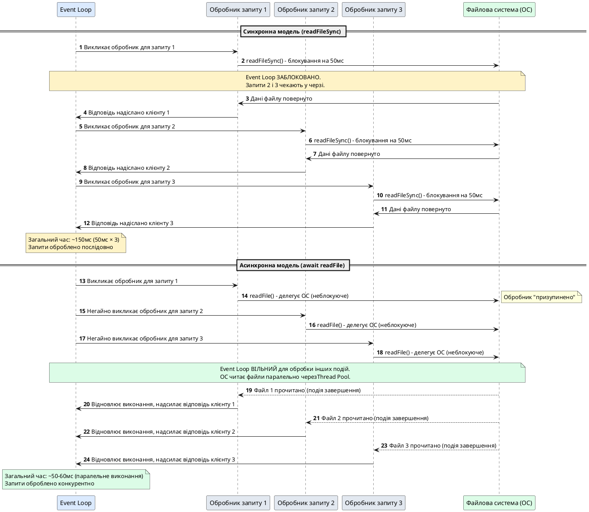

# Синхронний vs асинхронний код

::card-group

::card{title="🎯 Мета лекції" icon="i-lucide-target"}

- Зрозуміти різницю між синхронним та асинхронним виконанням коду.
- Опанувати концепцію блокування потоку (*thread blocking*) та його вплив на продуктивність.
- Навчитися визначати ситуації, коли слід використовувати синхронні або асинхронні операції.
- Дослідити архітектурні переваги неблокуючого введення/виведення у Node.js.

::

::card{title="🔑 Ключові терміни" icon="i-lucide-key"}

- **Синхронне виконання (*synchronous execution*):** послідовне виконання операцій, коли кожна наступна чекає завершення попередньої.
- **Асинхронне виконання (*asynchronous execution*):** неблокуюче виконання операцій, коли програма продовжує роботу, не чекаючи завершення повільних операцій.
- **Event Loop (*цикл подій*):** механізм у Node.js, що координує виконання коду, обробку подій та виконання фонових завдань.
- **Блокування потоку (*thread blocking*):** стан, коли поточна операція перешкоджає виконанню іншого коду до свого завершення.

::

::

## Архітектурний контекст та еволюція підходів

Для розуміння філософії Node.js необхідно спочатку розглянути, як працюють традиційні веб-сервери та чому вони зіткнулися з проблемами масштабування у епоху високонавантажених систем. Класичні серверні середовища (наприклад, Apache HTTP Server у конфігурації за замовчуванням або ранні версії PHP-FPM) покладаються на модель «один потік (*thread*) — одне з'єднання». Це означає, що при надходженні HTTP-запиту сервер виділяє окремий потік операційної системи або процес для обробки цього запиту від початку до кінця.

Така архітектура видається інтуїтивно зрозумілою: кожен запит обробляється ізольовано, а програміст пише код у звичній послідовній манері. Проте при зростанні навантаження до тисяч одночасних з'єднань виникає критична проблема: кожен потік споживає від 512 КБ до декількох мегабайт оперативної пам'яті лише на стек виконання. Якщо сервер обробляє 10 000 одночасних запитів, витрати пам'яті лише на потоки можуть сягнути кількох гігабайтів. Додатково, операційна система витрачає значні ресурси процесора на перемикання контексту між потоками (*context switching*), що зменшує ефективну пропускну здатність системи.

Більш серйозна проблема полягає у природі веб-запитів: значна частина часу обробки витрачається не на обчислення, а на очікування повільних операцій введення/виведення (*I/O operations*) — читання файлів із диска, запити до бази даних, виклики зовнішніх API через мережу. Наприклад, запит до PostgreSQL може тривати 50 мілісекунд, а запит до зовнішнього мікросервісу — до 200 мілісекунд. Протягом цього часу потік просто блокується у системному виклику, не виконуючи корисної роботи, але продовжуючи споживати пам'ять.

Node.js пропонує радикально інший підхід: **асинхронна однопотокова архітектура з подійним циклом**. Замість блокування потоку на кожній операції введення/виведення, Node.js делегує такі операції операційній системі (через механізми на кшталт `epoll` у Linux, `kqueue` у macOS або `IOCP` у Windows) та продовжує обробляти інші запити. Коли операція завершується, ОС сигналізує Node.js через подію, і відповідний обробник (*callback*, *promise handler*) додається до черги виконання.

Це дозволяє одному процесу Node.js обслуговувати десятки тисяч одночасних з'єднань із мінімальними витратами пам'яті. Але ця ефективність має ціну: програміст повинен мислити у термінах асинхронних операцій та уникати блокуючого коду, який може зупинити весь Event Loop.

::warning
Node.js **не є багатопотоковим** у класичному розумінні. Основний цикл обробки подій виконується в одному потоці. Тому будь-яка синхронна операція, що триває довго (наприклад, обчислення хеша великого файлу або синхронне читання багатьох файлів), заблокує обробку всіх інших запитів до її завершення.
::

## Синхронне виконання: послідовність як природна поведінка

Синхронне виконання — це модель програмування, у якій кожна інструкція виконується одна за одною у строгій послідовності. Коли викликається функція, програма зупиняється та чекає її завершення перед тим, як перейти до наступного рядка коду. Такий підхід інтуїтивно зрозумілий для більшості розробників, оскільки він відповідає природному способу мислення: «спочатку зроби A, потім B, потім C».


У мові TypeScript (та JavaScript) більшість базових операцій виконується синхронно: арифметичні обчислення, робота зі змінними, виклики функцій, які не залучають введення/виведення. Розглянемо простий приклад синхронного коду:

```typescript
function calculateSum(numbers: number[]): number {
  let sum = 0;
  for (const num of numbers) {
    sum += num;
  }
  return sum;
}

const result = calculateSum([1, 2, 3, 4, 5]);
console.log('Сума:', result); // Вивід: Сума: 15
console.log('Обчислення завершено');
```

У цьому прикладі виконання відбувається строго послідовно: спочатку викликається функція `calculateSum`, яка ітерує через масив та обчислює суму. Під час виконання цього циклу жодна інша операція не може виконуватися — інтерпретатор JavaScript чекає завершення функції. Після повернення результату виконується перший `console.log`, потім другий. Така поведінка передбачувана та легко читається.

Проте ситуація кардинально змінюється, коли до коду потрапляють операції введення/виведення. Розглянемо синхронне читання файлу з диска за допомогою модуля `fs` (*file system*) у Node.js:

```typescript
import { readFileSync } from 'node:fs';
import { join } from 'node:path';

console.log('Початок читання файлу');

try {
  const configPath = join(process.cwd(), 'config.json');
  const content = readFileSync(configPath, 'utf-8');
  const config = JSON.parse(content);
  
  console.log('Конфігурація завантажена:', config);
} catch (error) {
  console.error('Помилка читання файлу:', error);
}

console.log('Програма завершена');
```

Функція `readFileSync` є **блокуючою**: коли інтерпретатор досягає рядка з викликом цієї функції, він зупиняється та чекає, поки операційна система прочитає дані з файлової системи у буфер пам'яті. Для сучасних SSD-дисків ця операція може тривати 1–5 мілісекунд, для HDD-дисків — десятки мілісекунд. Протягом цього часу процес Node.js **не може виконувати жодної іншої роботи**: ні обробляти HTTP-запити, ні відповідати на події, ні виконувати таймери.

::note
Термін «синхронний» у контексті Node.js не означає «швидкий» чи «миттєвий». Він означає «блокуючий» — операція займає час і не дозволяє іншому коду виконуватися паралельно у тому ж потоці.
::

Якщо такий код виконується під час запуску застосунку (наприклад, завантаження конфігурації перед стартом сервера), блокування не є проблемою: програма ще не обробляє запити користувачів. Але якщо синхронна операція викликається всередині HTTP-обробника, наслідки катастрофічні.

## Проблема блокування Event Loop: антипаттерн у серверах

Щоб продемонструвати критичність проблеми, розглянемо веб-сервер, який читає файли синхронно при обробці запитів:

```typescript
import { createServer } from 'node:http';
import { readFileSync } from 'node:fs';
import { join } from 'node:path';

const server = createServer((req, res) => {
  if (req.url === '/report') {
    console.log(`[${new Date().toISOString()}] Запит отримано`);
    
    // ❌ АНТИПАТТЕРН: Синхронне читання великого файлу
    const reportPath = join(process.cwd(), 'data', 'large-report.json');
    const data = readFileSync(reportPath, 'utf-8'); // Блокує Event Loop на ~50мс
    
    res.writeHead(200, { 'Content-Type': 'application/json' });
    res.end(data);
    
    console.log(`[${new Date().toISOString()}] Відповідь надіслано`);
  } else {
    res.writeHead(404);
    res.end('Not Found');
  }
});

server.listen(3000, () => {
  console.log('Сервер слухає на порту 3000');
});
```

На перший погляд код виглядає коректно. Але уявімо ситуацію, коли до сервера одночасно надходить 100 запитів на ендпоінт `/report`. Що відбувається?

1. Перший запит надходить, викликається обробник, починається синхронне читання файлу.
2. Протягом ~50 мілісекунд (тривалість читання з HDD або мережевого диска) Event Loop **заблоковано** — він не може обробити жодного іншого запиту.
3. Всі інші 99 запитів залишаються у черзі та чекають звільнення Event Loop.
4. Після завершення першого запиту обробляється другий — знову блокування на 50мс.
5. Останній запит почне обробку лише через 100 × 50мс = **5 секунд**.

Така поведінка є неприпустимою для продакшн-систем. У реальних високонавантажених застосунках тисячі одночасних запитів — синхронні операції введення/виведення призводять до повного паралічу сервера.

::caution
Навіть якщо синхронна операція триває всього 10 мілісекунд, при навантаженні у 1000 запитів на секунду це призводить до накопичення затримок та падіння пропускної здатності сервера до нуля. Event Loop повинен бути вільним для обробки подій — це фундаментальний принцип Node.js.
::


## Асинхронне виконання: неблокуюча модель програмування

Асинхронне виконання кардинально змінює спосіб написання коду. Замість очікування завершення повільної операції, програма реєструє функцію зворотного виклику (*callback*) або повертає проміс (*Promise*), а Event Loop продовжує обробляти інші завдання. Коли операція завершується (наприклад, файл прочитано або база даних відповіла), зареєстрований обробник додається до черги та виконується при наступній ітерації Event Loop.

Перепишемо попередній приклад читання файлу у асинхронному стилі:

```typescript
import { readFile } from 'node:fs/promises';
import { join } from 'node:path';

console.log('Початок читання файлу');

const configPath = join(process.cwd(), 'config.json');

readFile(configPath, 'utf-8')
  .then((content) => {
    const config = JSON.parse(content);
    console.log('Конфігурація завантажена:', config);
  })
  .catch((error) => {
    console.error('Помилка читання файлу:', error);
  });

console.log('Програма продовжує виконання (не чекає на файл)');
```

Ключова відмінність: виклик `readFile` **не блокує** виконання коду. Функція негайно повертає проміс (*Promise*), який представляє майбутнє значення. Event Loop одразу переходить до наступного рядка `console.log('Програма продовжує виконання...')` і виконує його **до того**, як файл буде прочитано. Коли операційна система завершує читання файлу, Node.js планує виконання обробника `.then()` у наступній ітерації циклу подій.

Порядок виведення у консоль буде таким:

```
Початок читання файлу
Програма продовжує виконання (не чекає на файл)
Конфігурація завантажена: { port: 3000, database: '...' }
```

Це може здаватися дивним для тих, хто звик до синхронного коду, але саме така поведінка дозволяє Node.js ефективно використовувати ресурси.

::tip
Сучасний стандарт ECMAScript пропонує синтаксис `async/await`, який робить асинхронний код візуально схожим на синхронний, але під капотом він все одно працює неблокуючим чином. Детально це буде розглянуто у наступних лекціях.
::

Тепер перепишемо HTTP-сервер у правильному асинхронному стилі:

```typescript
import { createServer } from 'node:http';
import { readFile } from 'node:fs/promises';
import { join } from 'node:path';

const server = createServer(async (req, res) => {
  if (req.url === '/report') {
    console.log(`[${new Date().toISOString()}] Запит отримано`);
    
    try {
      // ✅ ПРАВИЛЬНО: Асинхронне читання файлу
      const reportPath = join(process.cwd(), 'data', 'large-report.json');
      const data = await readFile(reportPath, 'utf-8'); // Не блокує Event Loop
      
      res.writeHead(200, { 'Content-Type': 'application/json' });
      res.end(data);
      
      console.log(`[${new Date().toISOString()}] Відповідь надіслано`);
    } catch (error) {
      console.error('Помилка читання файлу:', error);
      res.writeHead(500, { 'Content-Type': 'application/json' });
      res.end(JSON.stringify({ error: 'Internal Server Error' }));
    }
  } else {
    res.writeHead(404);
    res.end('Not Found');
  }
});

server.listen(3000, () => {
  console.log('Сервер слухає на порту 3000');
});
```

У цій версії використано ключове слово `await` перед викликом `readFile`. Під час читання файлу поточний обробник запиту «призупиняється» (технічно — повертає проміс), але Event Loop **не блокується** — він може обробляти інші запити, таймери та події. Коли файл прочитано, виконання обробника відновлюється з того місця, де була зустрінута конструкція `await`.

Тепер при 100 одночасних запитах:

1. Перший запит надходить, починається асинхронне читання файлу, обробник «призупиняється».
2. Event Loop негайно обробляє другий запит, запускає читання його файлу.
3. Через кілька мілісекунд Event Loop обробив усі 100 запитів, делегувавши читання файлів операційній системі.
4. Коли ОС завершує читання файлів (паралельно або через пул потоків), обробники відновлюються та надсилають відповіді.
5. Загальний час обробки 100 запитів — близько 50–100 мілісекунд (залежно від пропускної здатності диска), а не 5 секунд!

::note
Node.js використовує внутрішній пул потоків `libuv` (*thread pool*) для виконання деяких операцій введення/виведення (наприклад, читання файлів, криптографічні обчислення). За замовчуванням цей пул містить 4 потоки. Це дозволяє виконувати до 4 операцій файлового введення/виведення паралельно, не блокуючи основний потік Event Loop.
::


## Візуалізація: Event Loop та обробка запитів

Для кращого розуміння різниці між синхронним та асинхронним підходами розглянемо діаграму послідовності обробки трьох HTTP-запитів у обох моделях:

::plant-uml{alt="Порівняння синхронної та асинхронної обробки запитів"}



::

Як видно з діаграми, у синхронній моделі Event Loop послідовно обробляє кожен запит, очікуючи завершення операції введення/виведення перед переходом до наступного. У асинхронній моделі Event Loop делегує операції введення/виведення операційній системі та негайно переходить до обробки наступних запитів, що дозволяє досягти **конкурентності** (*concurrency*) навіть у однопотоковому середовищі.

::warning
Важливо розуміти, що асинхронність у Node.js — це **конкурентність** (*concurrency*), а не **паралелізм** (*parallelism*). Сам JavaScript-код виконується в одному потоці. Паралельне виконання відбувається лише на рівні операційної системи (читання файлів, мережеві операції) або через окремі Worker Threads, які будуть розглянуті у наступних лекціях.
::

## Порівняння синхронних та асинхронних API у Node.js

Модуль `fs` (*file system*) у Node.js пропонує три різні API для роботи з файлами:

1. **Синхронне API** (`fs.readFileSync`, `fs.writeFileSync`) — блокуючі функції.
2. **Callback-based API** (`fs.readFile`, `fs.writeFile`) — асинхронні функції зі зворотними викликами.
3. **Promise-based API** (`fs/promises`) — асинхронні функції, що повертають проміси.

Розглянемо порівняння цих підходів на прикладі читання файлу:

::code-group

```typescript [Синхронний (блокуючий)]
import { readFileSync } from 'node:fs';

try {
  const data = readFileSync('./config.json', 'utf-8');
  console.log('Дані:', data);
} catch (error) {
  console.error('Помилка:', error);
}

// Наступний код виконається ПІСЛЯ завершення читання
console.log('Файл прочитано');
```

```typescript [Callback-based (асинхронний)]
import { readFile } from 'node:fs';

readFile('./config.json', 'utf-8', (error, data) => {
  if (error) {
    console.error('Помилка:', error);
    return;
  }
  console.log('Дані:', data);
});

// Наступний код виконається ДО завершення читання
console.log('Читання файлу розпочато');
```

```typescript [Promise-based (асинхронний + async/await)]
import { readFile } from 'node:fs/promises';

async function loadConfig(): Promise<void> {
  try {
    const data = await readFile('./config.json', 'utf-8');
    console.log('Дані:', data);
  } catch (error) {
    console.error('Помилка:', error);
  }
}

loadConfig();

// Наступний код виконається ДО завершення читання
console.log('Читання файлу розпочато');
```

::


Кожен із цих підходів має свої переваги та обмеження:

::card-group

::card{title="✅ Синхронний API" icon="i-lucide-check-circle"}

**Переваги:**
- Простий та інтуїтивний синтаксис.
- Легко відстежувати потік виконання.
- Не потребує розуміння асинхронних патернів.

**Недоліки:**
- Блокує Event Loop — неприпустимо у серверних застосунках.
- Знижує пропускну здатність системи під навантаженням.

**Коли використовувати:**
- Скрипти для запуску (*startup scripts*).
- CLI-утиліти, що виконують одну задачу.
- Завантаження конфігурації перед стартом сервера.

::

::card{title="⚡ Асинхронний API" icon="i-lucide-zap"}

**Переваги:**
- Не блокує Event Loop — сервер може обробляти тисячі запитів одночасно.
- Ефективне використання ресурсів (пам'ять, CPU).
- Відповідає філософії Node.js.

**Недоліки:**
- Складніший синтаксис (callback hell або проміси).
- Потребує глибшого розуміння Event Loop.
- Порядок виконання не завжди очевидний.

**Коли використовувати:**
- HTTP-сервери, REST API, WebSocket-сервери.
- Обробка запитів у реальному часі.
- Читання/запис файлів під час обробки запитів.
- Запити до баз даних та зовнішніх сервісів.

::

::

## Чому JavaScript ідеальний для асинхронності

Мова JavaScript історично розроблялася для браузерного середовища, де асинхронність є природною — користувач клікає кнопку, завантажується зображення, надходить відповідь від сервера. Усі ці операції є подіями (*events*), які обробляються асинхронно, не блокуючи інтерфейс користувача.

Node.js успадкував цю модель та застосував її для серверного середовища. Ключові характеристики JavaScript, які робили його ідеальним для асинхронного програмування:

1. **Функції як об'єкти першого класу** (*first-class functions*): функції можна передавати як аргументи, повертати з інших функцій та зберігати у змінних. Це дозволяє легко реалізувати патерн зворотних викликів (*callbacks*).

2. **Замикання** (*closures*): асинхронний обробник має доступ до змінних зовнішньої функції навіть після її завершення. Це дозволяє зберігати контекст виконання між асинхронними викликами.

3. **Подієва модель** (*event-driven*): JavaScript має вбудовану підтримку подій через `EventEmitter` та DOM Events, що природно інтегрується з асинхронною архітектурою.

4. **Однопотоковість** (*single-threaded*): відсутність багатопотоковості усуває проблеми гонитви за даними (*race conditions*), необхідності у м'ютексах та складної синхронізації. Розробник може не турбуватися про блокування (*locks*) чи атомарні операції.

Розглянемо приклад, який демонструє замикання у асинхронному коді:

```typescript
function processUserRequest(userId: number): void {
  console.log(`Початок обробки запиту для користувача ${userId}`);
  
  // userId доступний у замиканні навіть після завершення processUserRequest
  setTimeout(() => {
    console.log(`Завершено обробку запиту для користувача ${userId}`);
  }, 1000);
  
  console.log(`Запит ${userId} делеговано асинхронному обробнику`);
}

processUserRequest(101);
processUserRequest(102);
processUserRequest(103);
```

Вивід у консоль:

```
Початок обробки запиту для користувача 101
Запит 101 делеговано асинхронному обробнику
Початок обробки запиту для користувача 102
Запит 102 делеговано асинхронному обробнику
Початок обробки запиту для користувача 103
Запит 103 делеговано асинхронному обробнику
Завершено обробку запиту для користувача 101
Завершено обробку запиту для користувача 102
Завершено обробку запиту для користувача 103
```

Як видно, кожен асинхронний обробник зберігає правильне значення `userId` завдяки замиканню, незважаючи на те, що всі три виклики функції завершилися до спрацювання таймерів.

::tip
У мовах із багатопотоковістю (наприклад, Java або C#) для досягнення подібної конкурентності потрібно керувати пулами потоків, блокуваннями та потокобезпечними колекціями. У Node.js достатньо використовувати асинхронні функції — Event Loop автоматично координує виконання.
::

## Коли синхронний код є прийнятним

Не всі застосунки на Node.js є високонавантаженими веб-серверами. Існують сценарії, де використання синхронного API є цілком виправданим:

### Скрипти для запуску (Startup Scripts)

Коли застосунок тільки починає роботу та ще не приймає запити від користувачів, блокування Event Loop не має негативних наслідків. Наприклад, завантаження конфігурації перед стартом сервера:

```typescript
import { readFileSync } from 'node:fs';
import { createServer } from 'node:http';

// ✅ Синхронне читання під час ініціалізації — прийнятно
const configData = readFileSync('./config.json', 'utf-8');
const config = JSON.parse(configData);

const server = createServer((req, res) => {
  // Тут вже потрібен асинхронний код
  res.writeHead(200);
  res.end(`Server running with config: ${config.appName}`);
});

server.listen(config.port, () => {
  console.log(`Сервер запущено на порту ${config.port}`);
});
```

У цьому прикладі синхронне читання відбувається **до** того, як сервер починає слухати порт. Event Loop ще не обробляє запити, тому блокування не має значення.


### CLI-утиліти та інструменти командного рядка

Якщо програма виконує одну конкретну задачу та завершується (наприклад, конвертація файлів, генерація звітів), синхронний код є простішим та читабельнішим рішенням:

```typescript
import { readFileSync, writeFileSync } from 'node:fs';

// CLI-утиліта для конвертації JSON у CSV
const jsonData = readFileSync('./data.json', 'utf-8');
const records = JSON.parse(jsonData);

const csvLines = records.map((record: any) => 
  `${record.id},${record.name},${record.email}`
).join('\n');

writeFileSync('./output.csv', csvLines, 'utf-8');
console.log('Конвертація завершена');
```

Така утиліта виконується один раз, обробляє дані та завершується. Немає необхідності у асинхронності, оскільки програма не обслуговує кілька одночасних завдань.

::note
Навіть для CLI-утиліт, якщо планується обробка великих обсягів даних або паралельне виконання кількох операцій, варто розглянути асинхронний підхід для підвищення продуктивності.
::

## Реальний приклад: наслідки синхронного коду у продакшн-сервері

Щоб продемонструвати критичність проблеми, розглянемо реальний сценарій — HTTP API, який генерує PDF-звіти. Припустимо, генерація одного PDF триває 200 мілісекунд:

```typescript
import { createServer } from 'node:http';
import { writeFileSync } from 'node:fs';

function generatePDFSync(data: string): string {
  // Імітація важкого синхронного обчислення (генерація PDF)
  const start = Date.now();
  while (Date.now() - start < 200) {
    // Блокуємо Event Loop на 200мс
  }
  
  const pdfContent = `PDF Report: ${data}`;
  const filename = `./reports/report-${Date.now()}.pdf`;
  writeFileSync(filename, pdfContent); // Також синхронна операція
  
  return filename;
}

const server = createServer((req, res) => {
  if (req.url === '/generate-report') {
    const filename = generatePDFSync('User Data'); // ❌ Блокує Event Loop
    
    res.writeHead(200, { 'Content-Type': 'application/json' });
    res.end(JSON.stringify({ file: filename }));
  } else {
    res.writeHead(404);
    res.end();
  }
});

server.listen(3000);
```

При навантаженні у 10 одночасних запитів на `/generate-report`:

- Перший запит блокує Event Loop на 200мс.
- Другий запит чекає завершення першого, потім блокує на 200мс.
- Десятий запит починає обробку через 10 × 200мс = **2 секунди**.

Середній час відповіді: ~1 секунда. Це неприйнятно для продакшн-систем.

Правильне асинхронне рішення із використанням Worker Threads або черг повідомлень буде розглянуто у наступних лекціях, але навіть просте перенесення генерації у асинхронний контекст значно покращить ситуацію:

```typescript
import { createServer } from 'node:http';
import { writeFile } from 'node:fs/promises';

async function generatePDFAsync(data: string): Promise<string> {
  // Імітація асинхронної генерації (наприклад, через бібліотеку puppeteer)
  await new Promise(resolve => setTimeout(resolve, 200));
  
  const pdfContent = `PDF Report: ${data}`;
  const filename = `./reports/report-${Date.now()}.pdf`;
  await writeFile(filename, pdfContent);
  
  return filename;
}

const server = createServer(async (req, res) => {
  if (req.url === '/generate-report') {
    try {
      const filename = await generatePDFAsync('User Data'); // ✅ Не блокує Event Loop
      
      res.writeHead(200, { 'Content-Type': 'application/json' });
      res.end(JSON.stringify({ file: filename }));
    } catch (error) {
      res.writeHead(500);
      res.end('Error generating report');
    }
  } else {
    res.writeHead(404);
    res.end();
  }
});

server.listen(3000);
```

Тепер при 10 одночасних запитах усі вони обробляються майже паралельно, а загальний час відповіді — близько 200–250мс.

## Практичні рекомендації та патерни

На основі розглянутого матеріалу сформулюємо практичні правила для роботи з синхронним та асинхронним кодом у Node.js:

::steps

### Правило 1: Уникайте синхронних операцій у HTTP-обробниках

Будь-який код, що виконується під час обробки HTTP-запиту, повинен бути асинхронним. Виключення можуть становити лише дуже швидкі обчислення (менше 1мс).

### Правило 2: Використовуйте `fs/promises` замість `fs` або `fs.readFileSync`

Модуль `fs/promises` надає чистий Promise-based API, що добре інтегрується з `async/await` та є найсучаснішим підходом для роботи з файлами.

### Правило 3: Завантажуйте конфігурацію синхронно при старті

Конфігураційні файли, змінні оточення та статичні ресурси можна завантажувати синхронно під час ініціалізації застосунку — це спрощує код та не впливає на продуктивність.

### Правило 4: Профілюйте критичні шляхи виконання

Використовуйте вбудовані інструменти Node.js (наприклад, `--prof`, `clinic.js`, `0x`) для виявлення вузьких місць та блокувань Event Loop у продакшн-коді.

### Правило 5: Розумійте різницю між конкурентністю та паралелізмом

Асинхронність у Node.js забезпечує конкурентність (обробку багатьох завдань одночасно), але не паралелізм (виконання коду на кількох ядрах CPU). Для CPU-інтенсивних завдань розгляньте Worker Threads.

::

## Підсумок та закріплення матеріалу

У цій лекції ми розглянули фундаментальну різницю між синхронним та асинхронним виконанням коду у Node.js:

::card-group

::card{title="📌 Синхронний код" icon="i-lucide-clock"}

- Виконується послідовно, кожна операція блокує наступну.
- Простий для розуміння, але неефективний для серверних застосунків.
- Прийнятний для скриптів запуску, CLI-утиліт та ініціалізації конфігурації.
- Функції: `readFileSync`, `writeFileSync`, синхронні обчислення.

::

::card{title="⚡ Асинхронний код" icon="i-lucide-workflow"}

- Виконується неблокуюче, дозволяє обробляти тисячі операцій одночасно.
- Складніший синтаксис, але критично важливий для високонавантажених систем.
- Обов'язковий для HTTP-серверів, API, роботи з базами даних.
- Функції: `readFile`, `writeFile` з промісами, `async/await`.

::

::card{title="🔄 Event Loop" icon="i-lucide-repeat"}

- Серце Node.js — координує виконання коду, обробку подій та асинхронні операції.
- Однопотоковий: блокування Event Loop зупиняє весь застосунок.
- Делегує операції введення/виведення операційній системі або Thread Pool.

::

::

::accordion

::accordion-item{label="❓ Чи можна змішувати синхронні та асинхронні функції в одному файлі?" icon="i-lucide-help-circle"}

Так, це цілком припустимо. Наприклад, ви можете завантажувати конфігурацію синхронно під час ініціалізації модуля, а всі операції всередині HTTP-обробників робити асинхронними. Головне — не використовувати синхронні блокуючі операції у критичних шляхах виконання під навантаженням.

::

::accordion-item{label="❓ Чи варто завжди використовувати async/await замість callback?" icon="i-lucide-help-circle"}

У більшості випадків — так. Синтаксис `async/await` робить асинхронний код більш читабельним та схожим на синхронний, уникаючи проблеми «callback hell». Проте у деяких сценаріях (наприклад, обробка стрімів або складна композиція подій) callback-based підхід може бути більш гнучким. Детально це буде розглянуто у наступних лекціях.

::

::accordion-item{label="❓ Якщо Node.js однопотоковий, як він обробляє тисячі запитів одночасно?" icon="i-lucide-help-circle"}

Node.js не обробляє код JavaScript паралельно — це дійсно однопотокове середовище. Але операції введення/виведення (читання файлів, мережеві запити, запити до баз даних) виконуються операційною системою паралельно. Event Loop просто реєструє обробники для цих операцій та виконує їх, коли ОС сигналізує про завершення. Це дозволяє досягти високої конкурентності без багатопотоковості.

::

::

У наступній лекції ми детально розглянемо callback-based підхід до асинхронності, проблему «callback hell» та патерни для її вирішення.
