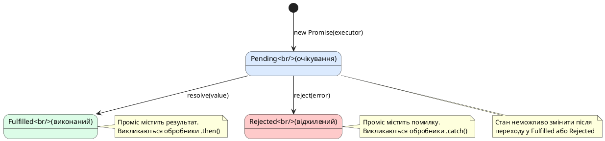

# Promises — стандарт асинхронності

::card-group

::card{title="🎯 Мета лекції" icon="i-lucide-target"}

- Опанувати концепцію промісу як обіцянки майбутнього результату асинхронної операції.
- Зрозуміти три стани промісу: очікування (*pending*), виконаний (*fulfilled*), відхилений (*rejected*).
- Навчитися створювати проміси та будувати ланцюжки операцій через `.then()`, `.catch()`, `.finally()`.
- Дослідити переваги промісів над callback у контексті читабельності та обробки помилок.
- Оволодіти технікою перетворення callback-based API у Promise-based через `util.promisify`.

::

::card{title="🔑 Ключові терміни" icon="i-lucide-key"}

- **Promise (*обіцянка*):** об'єкт, що представляє результат асинхронної операції, який буде доступний у майбутньому.
- **Pending (*очікування*):** початковий стан промісу, коли операція ще виконується.
- **Fulfilled (*виконаний*):** стан промісу, коли операція успішно завершена та доступний результат.
- **Rejected (*відхилений*):** стан промісу, коли операція завершилася з помилкою.
- **Thenable:** об'єкт, що має метод `.then()` — узагальнений інтерфейс для роботи з асинхронними значеннями.

::

::

## Концептуальна основа: проміс як контракт майбутнього значення

Уявімо реальний життєвий сценарій: ви замовляєте каву у кав'ярні. Баріста не віддає вам каву одразу — натомість ви отримуєте **квиток із номером замовлення**. Цей квиток є «обіцянкою» (*promise*), що каву буде приготовано. Протягом певного часу ваше замовлення перебуває у стані очікування (*pending*). Врешті-решт воно може бути або **виконане** (*fulfilled*) — ви отримуєте готову каву, або **відхилене** (*rejected*) — закінчилося молоко, і замовлення скасовано.

Проміс у JavaScript працює за тим же принципом: це **об'єкт-обгортка навколо асинхронної операції**, який дозволяє зареєструвати обробники для успішного результату та помилок, не вдаючись до callback-based вкладеності. Ключова інновація промісу — це **повернення контролю розробнику**: на відміну від callback, де ви передаєте свою логіку зовнішній функції, проміс повертає об'єкт, який ви можете зберегти, передати, скомбінувати з іншими промісами.

::note
Проміс є об'єктом першого класу (*first-class object*) у JavaScript. Це означає, що його можна присвоїти змінній, передати як аргумент функції, повернути з функції або зберегти у структурі даних. Така гнучкість дозволяє будувати складні асинхронні композиції, що було б неможливо з простими callback-функціями.
::

## Анатомія промісу: стани та життєвий цикл

Кожен проміс у JavaScript перебуває в одному з трьох можливих станів:

1. **Pending (*очікування*)** — початковий стан, операція виконується. Проміс ще не має результату.
2. **Fulfilled (*виконаний*)** — операція успішно завершена, проміс має результуюче значення.
3. **Rejected (*відхилений*)** — операція завершилася з помилкою, проміс містить причину помилки (*rejection reason*).

Після того, як проміс переходить зі стану *pending* у стан *fulfilled* або *rejected*, він вважається **settled** (*врегульованим*) та **більше ніколи не змінює свого стану**. Це критична властивість промісу: одного разу вирішений проміс залишається у цьому стані назавжди, що усуває проблему багатократного виклику callback.

::plant-uml{alt="Життєвий цикл промісу"}



::

Розглянемо найпростіший приклад створення промісу:

```typescript
const promise = new Promise<string>((resolve, reject) => {
  // Executor-функція виконується НЕГАЙНО (синхронно)
  const success = Math.random() > 0.5;
  
  setTimeout(() => {
    if (success) {
      resolve('Операція успішна'); // Переводить проміс у стан fulfilled
    } else {
      reject(new Error('Операція провалилася')); // Переводить проміс у стан rejected
    }
  }, 1000);
});

console.log('Проміс створено:', promise); // Promise { <pending> }

// Реєстрація обробників
promise
  .then((result) => {
    console.log('Успіх:', result); // Виконується, якщо resolve()
  })
  .catch((error) => {
    console.error('Помилка:', error.message); // Виконується, якщо reject()
  });
```

Ключові моменти:

- **Executor-функція** `(resolve, reject) => {}` виконується **синхронно** у момент створення промісу.
- Виклик `resolve(value)` або `reject(error)` є асинхронним — обробники `.then()` та `.catch()` виконаються у наступній ітерації Event Loop, навіть якщо проміс вирішено одразу.
- Після виклику `resolve()` чи `reject()` стан промісу фіксується — повторні виклики ігноруються.

::warning
Якщо всередині executor-функції виникне необроблене виключення, проміс автоматично переходить у стан *rejected* з цим виключенням як причиною. Проте це працює лише для синхронних виключень всередині executor. Якщо виключення виникає у асинхронному коді (наприклад, у `setTimeout`), воно не буде перехоплено промісом і призведе до необробленого відхилення.
::

## Ланцюжки промісів: композиція асинхронних операцій

Одна з найпотужніших властивостей промісів — можливість будувати ланцюжки (*chaining*) через метод `.then()`. Кожен виклик `.then()` повертає **новий проміс**, що дозволяє додавати послідовні асинхронні операції без вкладеності:

```typescript
import { readFile, writeFile } from 'node:fs/promises';

readFile('./input.json', 'utf-8')
  .then((content) => {
    console.log('Файл прочитано');
    return JSON.parse(content); // Повертаємо синхронне значення
  })
  .then((data) => {
    console.log('JSON розпарсено:', data);
    data.processed = true;
    data.timestamp = new Date().toISOString();
    return data; // Передаємо дані далі по ланцюжку
  })
  .then((modifiedData) => {
    const output = JSON.stringify(modifiedData, null, 2);
    return writeFile('./output.json', output, 'utf-8'); // Повертаємо проміс
  })
  .then(() => {
    console.log('Файл записано успішно');
  })
  .catch((error) => {
    console.error('Сталася помилка на будь-якому етапі:', error);
  })
  .finally(() => {
    console.log('Операція завершена (успішно або з помилкою)');
  });
```

Правила роботи ланцюжків:

1. **Повернення значення з `.then()`** передає це значення у наступний `.then()` у ланцюжку.
2. **Повернення промісу з `.then()`** «розгортає» цей проміс — наступний `.then()` отримає результат вкладеного промісу після його виконання.
3. **Відсутність `return`** у `.then()` передає `undefined` у наступний обробник.
4. **Викидання виключення** (`throw new Error()`) у `.then()` переводить проміс у стан *rejected* та передає керування найближчому `.catch()`.

Розглянемо детальніше повернення промісу з `.then()`:

```typescript
function fetchUserData(userId: number): Promise<any> {
  return new Promise((resolve) => {
    setTimeout(() => {
      resolve({ id: userId, name: 'Олександр', email: 'alex@example.com' });
    }, 500);
  });
}

function fetchUserPosts(userId: number): Promise<any[]> {
  return new Promise((resolve) => {
    setTimeout(() => {
      resolve([
        { id: 1, title: 'Перший пост', userId },
        { id: 2, title: 'Другий пост', userId },
      ]);
    }, 300);
  });
}

fetchUserData(42)
  .then((user) => {
    console.log('Користувача знайдено:', user.name);
    // Повертаємо новий проміс — ланцюжок чекатиме його виконання
    return fetchUserPosts(user.id);
  })
  .then((posts) => {
    console.log('Пости користувача:', posts.length);
    console.log('Заголовки:', posts.map(p => p.title));
  })
  .catch((error) => {
    console.error('Помилка:', error);
  });
```

У цьому прикладі другий `.then()` не виконається, доки проміс `fetchUserPosts()` не буде виконано. Це дозволяє будувати послідовні асинхронні операції з плоскою структурою коду — на відміну від вкладених callback.


## Обробка помилок: централізація через `.catch()`

Одна з найбільших переваг промісів над callback — **централізована обробка помилок**. У ланцюжку промісів будь-яка помилка (викинуте виключення або відхилений проміс) автоматично «бульбашкується» (*bubbles up*) до найближчого обробника `.catch()`:

```typescript
import { readFile } from 'node:fs/promises';

readFile('./config.json', 'utf-8')
  .then((content) => {
    return JSON.parse(content); // Може викинути SyntaxError
  })
  .then((config) => {
    if (!config.apiKey) {
      throw new Error('API ключ відсутній у конфігурації');
    }
    return config;
  })
  .then((config) => {
    console.log('Конфігурація валідна:', config);
  })
  .catch((error) => {
    // Цей обробник спрацює для БУДЬ-ЯКОЇ помилки у ланцюжку:
    // - Файл не знайдено (ENOENT)
    // - JSON невалідний (SyntaxError)
    // - API ключ відсутній (Error)
    console.error('Помилка завантаження конфігурації:', error.message);
  });
```

Порівняймо це з callback-based підходом, де кожен рівень вимагав власної перевірки `if (error)`:

::code-group

```typescript [Callback-based]
import { readFile } from 'node:fs';

readFile('./config.json', 'utf-8', (error, content) => {
  if (error) {
    console.error('Помилка 1:', error);
    return;
  }
  
  let config;
  try {
    config = JSON.parse(content);
  } catch (parseError) {
    console.error('Помилка 2:', parseError);
    return;
  }
  
  if (!config.apiKey) {
    console.error('Помилка 3: API ключ відсутній');
    return;
  }
  
  console.log('Конфігурація валідна:', config);
});
```

```typescript [Promise-based]
import { readFile } from 'node:fs/promises';

readFile('./config.json', 'utf-8')
  .then((content) => JSON.parse(content))
  .then((config) => {
    if (!config.apiKey) {
      throw new Error('API ключ відсутній');
    }
    return config;
  })
  .then((config) => {
    console.log('Конфігурація валідна:', config);
  })
  .catch((error) => {
    console.error('Помилка:', error.message);
  });
```

::

Ключова різниця: у Promise-based коді всі помилки обробляються в **одному місці** у кінці ланцюжка, що усуває дублювання та спрощує логіку.

::note
Метод `.catch(handler)` є синтаксичним цукром для `.then(undefined, handler)`. Обидва варіанти функціонально еквівалентні, але `.catch()` є більш читабельним та явно показує намір обробити помилку.
::

### Продовження ланцюжка після `.catch()`

Важлива особливість: `.catch()` також повертає проміс, тому ланцюжок може продовжуватися після обробки помилки:

```typescript
readFile('./primary-config.json', 'utf-8')
  .catch((error) => {
    console.warn('Основна конфігурація недоступна, використовуємо резервну');
    // Відновлюємо ланцюжок, повертаючи резервне значення
    return '{"apiKey": "default-key", "timeout": 5000}';
  })
  .then((content) => JSON.parse(content))
  .then((config) => {
    console.log('Завантажено конфігурацію:', config);
  })
  .catch((error) => {
    console.error('Критична помилка — навіть резервна конфігурація недоступна:', error);
  });
```

У цьому прикладі, якщо читання основного файлу провалюється, перший `.catch()` перехоплює помилку та повертає резервне значення (JSON-рядок). Ланцюжок продовжує виконання з цим значенням, і наступні `.then()` обробляють його нормально. Другий `.catch()` спрацює лише якщо виникне помилка у парсингу або обробці резервної конфігурації.

## Метод `.finally()`: очищення ресурсів

Метод `.finally()` виконується **завжди** — незалежно від того, чи проміс був виконаний успішно, чи відхилений. Це ідеальне місце для очищення ресурсів: закриття з'єднань, видалення тимчасових файлів, зупинка таймерів:

```typescript
import { readFile, unlink } from 'node:fs/promises';

const tempFile = './temp-data.json';

readFile(tempFile, 'utf-8')
  .then((content) => {
    const data = JSON.parse(content);
    console.log('Дані оброблено:', data);
  })
  .catch((error) => {
    console.error('Помилка обробки:', error);
  })
  .finally(() => {
    // Видаляємо тимчасовий файл у будь-якому випадку
    return unlink(tempFile)
      .then(() => console.log('Тимчасовий файл видалено'))
      .catch((error) => console.warn('Не вдалося видалити файл:', error));
  });
```

Важливі властивості `.finally()`:

1. **Не отримує аргументів** — обробник `.finally()` не знає, чи проміс був виконаний успішно чи з помилкою.
2. **Прозорий для ланцюжка** — значення, повернуте з `.finally()`, ігнорується (крім випадку, коли воно саме є відхиленим промісом).
3. **Може повертати проміс** — якщо `.finally()` повертає проміс, ланцюжок чекатиме його виконання перед продовженням.

::tip
Використовуйте `.finally()` для операцій, які мають виконатися незалежно від результату: закриття файлових дескрипторів, звільнення блокувань, відправка метрик тривалості операції. Це забезпечує чистоту коду та запобігає витокам ресурсів.
::

## Порівняння callback та Promise: рефакторинг реального прикладу

Повернемося до прикладу HTTP API зі створення користувача, який ми розглядали у лекції про callback. Перепишемо його з використанням промісів:

::code-group

```typescript [Callback-based (складно)]
import { createServer } from 'node:http';
import { Client } from 'pg';

const dbClient = new Client({ /* ... */ });

const server = createServer((req, res) => {
  if (req.method === 'POST' && req.url === '/api/users') {
    let body = '';
    
    req.on('data', (chunk) => { body += chunk.toString(); });
    
    req.on('end', () => {
      let userData;
      try {
        userData = JSON.parse(body);
      } catch (parseError) {
        res.writeHead(400, { 'Content-Type': 'application/json' });
        res.end(JSON.stringify({ error: 'Invalid JSON' }));
        return;
      }
      
      dbClient.query('SELECT id FROM users WHERE email = $1', [userData.email], (error, result) => {
        if (error) {
          res.writeHead(500, { 'Content-Type': 'application/json' });
          res.end(JSON.stringify({ error: 'Database error' }));
          return;
        }
        
        if (result.rows.length > 0) {
          res.writeHead(409, { 'Content-Type': 'application/json' });
          res.end(JSON.stringify({ error: 'User exists' }));
          return;
        }
        
        dbClient.query('INSERT INTO users (email, name) VALUES ($1, $2) RETURNING *',
          [userData.email, userData.name],
          (error, result) => {
            if (error) {
              res.writeHead(500, { 'Content-Type': 'application/json' });
              res.end(JSON.stringify({ error: 'Failed to create user' }));
              return;
            }
            
            res.writeHead(201, { 'Content-Type': 'application/json' });
            res.end(JSON.stringify(result.rows[0]));
          }
        );
      });
    });
  }
});
```

```typescript [Promise-based (читабельно)]
import { createServer } from 'node:http';
import { Client } from 'pg';

const dbClient = new Client({ /* ... */ });

function parseRequestBody(req: any): Promise<any> {
  return new Promise((resolve, reject) => {
    let body = '';
    req.on('data', (chunk: Buffer) => { body += chunk.toString(); });
    req.on('end', () => {
      try {
        resolve(JSON.parse(body));
      } catch (error) {
        reject(new Error('Invalid JSON'));
      }
    });
    req.on('error', reject);
  });
}

const server = createServer((req, res) => {
  if (req.method === 'POST' && req.url === '/api/users') {
    parseRequestBody(req)
      .then((userData) => {
        // Перевірка існування користувача
        return dbClient
          .query('SELECT id FROM users WHERE email = $1', [userData.email])
          .then((result) => {
            if (result.rows.length > 0) {
              const error: any = new Error('User already exists');
              error.statusCode = 409;
              throw error;
            }
            return userData; // Передаємо дані далі
          });
      })
      .then((userData) => {
        // Створення користувача
        return dbClient.query(
          'INSERT INTO users (email, name) VALUES ($1, $2) RETURNING *',
          [userData.email, userData.name]
        );
      })
      .then((result) => {
        res.writeHead(201, { 'Content-Type': 'application/json' });
        res.end(JSON.stringify(result.rows[0]));
      })
      .catch((error) => {
        const statusCode = error.statusCode || 500;
        res.writeHead(statusCode, { 'Content-Type': 'application/json' });
        res.end(JSON.stringify({ error: error.message }));
      });
  }
});
```

::

Ключові покращення Promise-based версії:

1. **Плоска структура** — замість 4 рівнів вкладеності маємо лінійний ланцюжок `.then()`.
2. **Централізована обробка помилок** — один `.catch()` обробляє всі можливі помилки.
3. **Винесення логіки** — парсинг тіла запиту винесено у окрему функцію `parseRequestBody`, яка повертає проміс.
4. **Передача контексту** — дані передаються між етапами через `return`, а не через замикання.


## Перетворення callback API у Promise: `util.promisify`

Багато існуючих бібліотек та модулів Node.js все ще використовують callback-based API, особливо ті, що були написані до 2015 року. Node.js надає вбудовану утиліту `util.promisify`, яка автоматично перетворює функції у форматі Error-First Callback у функції, що повертають проміси:

```typescript
import { readFile as readFileCallback, writeFile as writeFileCallback } from 'node:fs';
import { promisify } from 'node:util';

// Перетворюємо callback-based функції у Promise-based
const readFile = promisify(readFileCallback);
const writeFile = promisify(writeFileCallback);

// Тепер можна використовувати з промісами
readFile('./input.txt', 'utf-8')
  .then((content) => {
    const uppercased = content.toUpperCase();
    return writeFile('./output.txt', uppercased, 'utf-8');
  })
  .then(() => {
    console.log('Файл оброблено та збережено');
  })
  .catch((error) => {
    console.error('Помилка:', error);
  });
```

`promisify` працює з будь-якою функцією, яка дотримується конвенції Error-First Callback: останній параметр має бути функцією виду `(error, result) => void`. Утиліта автоматично створює обгортку, яка:

1. Приймає ті ж параметри, що й оригінальна функція (крім callback).
2. Повертає проміс.
3. Викликає `resolve()` при успішному виконанні (коли `error === null`).
4. Викликає `reject()` при помилці (коли `error !== null`).

### Власна реалізація promisify для розуміння механізму

Для глибшого розуміння розглянемо спрощену власну реалізацію `promisify`:

```typescript
function customPromisify<T>(fn: Function): (...args: any[]) => Promise<T> {
  return function (...args: any[]): Promise<T> {
    return new Promise<T>((resolve, reject) => {
      // Додаємо callback як останній аргумент
      fn(...args, (error: Error | null, result?: T) => {
        if (error) {
          reject(error);
        } else {
          resolve(result as T);
        }
      });
    });
  };
}

// Використання
import { readFile as readFileCallback } from 'node:fs';

const readFile = customPromisify<string>(readFileCallback);

readFile('./test.txt', 'utf-8')
  .then((content) => console.log('Контент:', content))
  .catch((error) => console.error('Помилка:', error));
```

::note
Сучасні версії Node.js надають Promise-based версії стандартних модулів через окремі експорти: `node:fs/promises`, `node:dns/promises`, `node:stream/promises`. Для нових проєктів рекомендується використовувати ці модулі безпосередньо замість `promisify`.
::

## Гарантія асинхронності: проміси завжди виконуються асинхронно

Навіть якщо проміс вирішується (*resolved*) або відхиляється (*rejected*) синхронно у момент створення, обробники `.then()` та `.catch()` **завжди виконуються асинхронно** — у наступній ітерації Event Loop. Це критична властивість для передбачуваності коду:

```typescript
console.log('1. Початок');

const instantPromise = Promise.resolve('Миттєвий результат');

instantPromise.then((result) => {
  console.log('3. Обробник .then():', result);
});

console.log('2. Після реєстрації обробника');

// Вивід:
// 1. Початок
// 2. Після реєстрації обробника
// 3. Обробник .then(): Миттєвий результат
```

Незважаючи на те, що проміс створено через `Promise.resolve()` (тобто він одразу у стані *fulfilled*), обробник `.then()` виконується **не одразу**, а лише після завершення поточного синхронного коду. Це усуває проблему **Zalgo** (*непередбачуваної поведінки*, коли callback може виконатися як синхронно, так і асинхронно залежно від умов).

::warning
У callback-based коді деякі бібліотеки можуть викликати callback синхронно, якщо результат вже доступний (наприклад, кеш). Це призводить до важкодетектованих багів, оскільки розробник не може передбачити, чи код виконається до чи після наступного рядка. Проміси усувають цю проблему — вони **завжди** асинхронні.
::

Порівняємо проблемну callback-функцію з промісом:

::code-group

```typescript [Проблемний callback (Zalgo)]
function fetchData(useCache: boolean, callback: (data: string) => void): void {
  if (useCache) {
    // ❌ Синхронний виклик callback
    callback('Дані з кешу');
  } else {
    // Асинхронний виклик callback
    setTimeout(() => {
      callback('Дані з сервера');
    }, 100);
  }
}

console.log('Початок');
fetchData(true, (data) => {
  console.log('Callback:', data);
});
console.log('Кінець');

// Вивід (непередбачувано!):
// Початок
// Callback: Дані з кешу  ← виконується СИНХРОННО
// Кінець
```

```typescript [Promise (передбачувано)]
function fetchData(useCache: boolean): Promise<string> {
  if (useCache) {
    // ✅ Promise.resolve завжди асинхронний
    return Promise.resolve('Дані з кешу');
  } else {
    return new Promise((resolve) => {
      setTimeout(() => resolve('Дані з сервера'), 100);
    });
  }
}

console.log('Початок');
fetchData(true).then((data) => {
  console.log('Promise:', data);
});
console.log('Кінець');

// Вивід (завжди однаково):
// Початок
// Кінець
// Promise: Дані з кешу  ← виконується АСИНХРОННО
```

::

## Типові помилки при роботі з промісами

### Помилка 1: Забути `return` у `.then()`

Одна з найпоширеніших помилок — забути повернути значення або проміс з обробника `.then()`:

```typescript
import { readFile, writeFile } from 'node:fs/promises';

// ❌ ПОМИЛКА: немає return
readFile('./input.txt', 'utf-8')
  .then((content) => {
    writeFile('./output.txt', content.toUpperCase(), 'utf-8'); // Проміс не повертається!
  })
  .then(() => {
    console.log('Готово'); // Виконається ДО завершення writeFile!
  });

// ✅ ПРАВИЛЬНО: повертаємо проміс
readFile('./input.txt', 'utf-8')
  .then((content) => {
    return writeFile('./output.txt', content.toUpperCase(), 'utf-8');
  })
  .then(() => {
    console.log('Готово'); // Виконається ПІСЛЯ завершення writeFile
  });
```

Без `return` наступний `.then()` отримує `undefined` та виконується одразу, не чекаючи завершення `writeFile()`.

### Помилка 2: Створення «промісного пекла» (Promise Hell)

Проміси можна використовувати неправильно, вкладаючи їх один в одного, що нівелює переваги:

```typescript
// ❌ АНТИПАТТЕРН: Promise Hell (вкладеність)
readFile('./config.json', 'utf-8')
  .then((content) => {
    const config = JSON.parse(content);
    
    connectToDatabase(config).then((client) => {
      client.query('SELECT * FROM users').then((result) => {
        console.log('Користувачі:', result.rows);
      });
    });
  });

// ✅ ПРАВИЛЬНО: плоский ланцюжок
readFile('./config.json', 'utf-8')
  .then((content) => JSON.parse(content))
  .then((config) => connectToDatabase(config))
  .then((client) => client.query('SELECT * FROM users'))
  .then((result) => console.log('Користувачі:', result.rows))
  .catch((error) => console.error('Помилка:', error));
```

### Помилка 3: Ігнорування помилок (необроблені відхилення)

Кожен ланцюжок промісів повинен мати `.catch()` для обробки помилок:

```typescript
// ❌ ПОМИЛКА: немає .catch()
readFile('./important-data.json', 'utf-8')
  .then((content) => JSON.parse(content))
  .then((data) => processData(data)); // Якщо processData провалиться — unhandled rejection!

// ✅ ПРАВИЛЬНО: завжди обробляємо помилки
readFile('./important-data.json', 'utf-8')
  .then((content) => JSON.parse(content))
  .then((data) => processData(data))
  .catch((error) => {
    console.error('Помилка обробки даних:', error);
    // Можна надіслати сповіщення, записати у лог тощо
  });
```

::caution
Необроблені відхилення промісів (*unhandled promise rejections*) у Node.js призводять до попередження у консолі. Починаючи з Node.js 15.0.0, необроблене відхилення за замовчуванням завершує процес з кодом помилки (як і необроблені виключення). Завжди додавайте `.catch()` до кореневих промісів.
::


## Статичні методи Promise: утилітарні функції

Клас `Promise` надає кілька корисних статичних методів для роботи з промісами:

### `Promise.resolve()` та `Promise.reject()`

Створення промісу, що одразу перебуває у стані *fulfilled* або *rejected*:

```typescript
const resolvedPromise = Promise.resolve(42);
resolvedPromise.then((value) => console.log(value)); // 42

const rejectedPromise = Promise.reject(new Error('Щось не так'));
rejectedPromise.catch((error) => console.error(error.message)); // Щось не так
```

Ці методи корисні для перетворення синхронних значень у проміси або для раннього виходу з функції з помилкою:

```typescript
function validateUser(user: any): Promise<any> {
  if (!user.email) {
    return Promise.reject(new Error('Email є обов\'язковим'));
  }
  
  if (!user.name) {
    return Promise.reject(new Error('Ім\'я є обов\'язковим'));
  }
  
  // Якщо валідація пройшла — повертаємо проміс з користувачем
  return Promise.resolve(user);
}
```

### `Promise.all()`: паралельне виконання

Приймає масив промісів та повертає новий проміс, який виконується, коли **всі** проміси у масиві виконані:

```typescript
import { readFile } from 'node:fs/promises';

const filePromises = [
  readFile('./file1.txt', 'utf-8'),
  readFile('./file2.txt', 'utf-8'),
  readFile('./file3.txt', 'utf-8'),
];

Promise.all(filePromises)
  .then((contents) => {
    console.log('Файл 1:', contents[0]);
    console.log('Файл 2:', contents[1]);
    console.log('Файл 3:', contents[2]);
  })
  .catch((error) => {
    console.error('Помилка читання одного з файлів:', error);
  });
```

**Важливо:** якщо хоча б один проміс відхилено, `Promise.all()` негайно відхиляється з цією помилкою, навіть якщо інші проміси ще виконуються.

### `Promise.allSettled()`: очікування всіх результатів

На відміну від `Promise.all()`, `Promise.allSettled()` чекає завершення **всіх** промісів, незалежно від їхнього результату:

```typescript
const promises = [
  Promise.resolve(42),
  Promise.reject(new Error('Помилка')),
  Promise.resolve('Успіх'),
];

Promise.allSettled(promises)
  .then((results) => {
    results.forEach((result, index) => {
      if (result.status === 'fulfilled') {
        console.log(`Проміс ${index}: виконано зі значенням`, result.value);
      } else {
        console.log(`Проміс ${index}: відхилено з помилкою`, result.reason);
      }
    });
  });

// Вивід:
// Проміс 0: виконано зі значенням 42
// Проміс 1: відхилено з помилкою Error: Помилка
// Проміс 2: виконано зі значенням Успіх
```

Це корисно, коли потрібно обробити всі результати, навіть якщо деякі операції провалилися.

### `Promise.race()`: перший завершений проміс

Повертає проміс, який виконується або відхиляється, як тільки **перший** проміс у масиві завершується:

```typescript
const timeout = new Promise((_, reject) => {
  setTimeout(() => reject(new Error('Timeout після 5 секунд')), 5000);
});

const dataFetch = fetch('https://api.example.com/data').then((res) => res.json());

Promise.race([dataFetch, timeout])
  .then((data) => console.log('Дані отримано:', data))
  .catch((error) => console.error('Помилка або таймаут:', error));
```

Це корисно для реалізації таймаутів або вибору найшвидшого джерела даних.

::tip
Для більшості сценаріїв паралельного виконання використовуйте `Promise.all()`. Використовуйте `Promise.allSettled()`, якщо потрібно обробити всі результати незалежно від помилок. `Promise.race()` корисний для таймаутів та вибору найшвидшого джерела.
::

## Реальний приклад: завантаження конфігурації з fallback

Розглянемо практичний приклад, який демонструє композицію промісів для надійного завантаження конфігурації з кількох джерел:

```typescript
import { readFile } from 'node:fs/promises';

interface Config {
  apiUrl: string;
  timeout: number;
  retries: number;
}

function loadConfigFromFile(path: string): Promise<Config> {
  return readFile(path, 'utf-8').then((content) => JSON.parse(content));
}

function loadConfigFromEnv(): Promise<Config> {
  if (!process.env.API_URL) {
    return Promise.reject(new Error('API_URL не встановлено'));
  }
  
  return Promise.resolve({
    apiUrl: process.env.API_URL,
    timeout: parseInt(process.env.TIMEOUT || '5000', 10),
    retries: parseInt(process.env.RETRIES || '3', 10),
  });
}

function getDefaultConfig(): Promise<Config> {
  return Promise.resolve({
    apiUrl: 'https://api.example.com',
    timeout: 5000,
    retries: 3,
  });
}

// Спроба завантажити конфігурацію з кількох джерел з fallback
function loadConfig(): Promise<Config> {
  return loadConfigFromFile('./config.json')
    .catch((error) => {
      console.warn('Не вдалося завантажити config.json:', error.message);
      return loadConfigFromEnv();
    })
    .catch((error) => {
      console.warn('Не вдалося завантажити з ENV:', error.message);
      return getDefaultConfig();
    })
    .then((config) => {
      console.log('Конфігурація завантажена:', config);
      return config;
    });
}

// Використання
loadConfig()
  .then((config) => {
    // Запуск застосунку з конфігурацією
    console.log('Застосунок стартує з URL:', config.apiUrl);
  })
  .catch((error) => {
    // Цей catch спрацює лише якщо навіть getDefaultConfig провалиться
    console.error('Критична помилка завантаження конфігурації:', error);
    process.exit(1);
  });
```

У цьому прикладі реалізовано каскадну стратегію завантаження: спочатку спроба читання з файлу, при невдачі — з змінних оточення, при невдачі — використання конфігурації за замовчуванням. Кожен `.catch()` відновлює ланцюжок, повертаючи альтернативне джерело.

## Підсумок та закріплення матеріалу

У цій лекції ми детально розглянули проміси як сучасний стандарт асинхронності у JavaScript та Node.js:

::card-group

::card{title="📌 Стани промісу" icon="i-lucide-git-branch"}

- **Pending:** початковий стан, операція виконується.
- **Fulfilled:** операція успішна, доступний результат.
- **Rejected:** операція провалилася, доступна причина помилки.
- Після переходу у *fulfilled* або *rejected* стан більше не змінюється.

::

::card{title="🔗 Ланцюжки промісів" icon="i-lucide-link"}

- Метод `.then()` повертає новий проміс — можливість будувати ланцюжки.
- Повернення значення з `.then()` передає його у наступний `.then()`.
- Повернення промісу з `.then()` «розгортає» його — чекається його виконання.
- Плоска структура замість вкладеності callback.

::

::card{title="⚠️ Обробка помилок" icon="i-lucide-shield-alert"}

- Метод `.catch()` перехоплює помилки з будь-якого `.then()` у ланцюжку.
- Централізована обробка помилок — один `.catch()` на весь ланцюжок.
- Метод `.finally()` виконується завжди — ідеально для очищення ресурсів.
- Необроблені відхилення призводять до завершення процесу у Node.js 15+.

::

::card{title="🛠️ Утиліти" icon="i-lucide-wrench"}

- `util.promisify` — перетворення callback API у Promise API.
- `Promise.all()` — паралельне виконання, провал при першій помилці.
- `Promise.allSettled()` — очікування всіх результатів незалежно від помилок.
- `Promise.race()` — перший завершений проміс (таймаути, найшвидше джерело).

::

::

::accordion

::accordion-item{label="❓ Чи можна скасувати виконання промісу?" icon="i-lucide-help-circle"}

Ні, стандартні проміси JavaScript не підтримують скасування. Якщо проміс створено, він виконається до кінця, навіть якщо результат більше не потрібен. Для сценаріїв, що вимагають скасування (наприклад, HTTP-запити при відміні користувачем), використовуйте `AbortController` та API, що його підтримують (наприклад, `fetch` з `signal`).

::

::accordion-item{label="❓ Що станеться, якщо викликати resolve() та reject() одночасно?" icon="i-lucide-help-circle"}

Спрацює лише перший виклик. Проміс може змінити стан лише один раз — з *pending* на *fulfilled* або *rejected*. Усі наступні виклики `resolve()` або `reject()` будуть проігноровані. Це гарантує, що проміс завжди має єдиний, незмінний результат.

::

::accordion-item{label="❓ Чому варто уникати створення промісів через конструктор new Promise()?" icon="i-lucide-help-circle"}

У більшості випадків функції, що повертають проміси, вже створюють їх за вас (наприклад, `fs/promises`, `fetch`, методи баз даних). Створення промісу через `new Promise()` потрібне лише для обгортання callback-based API або створення власних асинхронних абстракцій. Надмірне використання конструктора призводить до «анти-паттерну проміс-обгортки» (*promise constructor anti-pattern*), коли проміс огортає існуючий проміс без необхідності.

::

::

У наступній лекції ми розглянемо комбінатори промісів (`Promise.all`, `Promise.allSettled`, `Promise.race`, `Promise.any`) детальніше та їх практичне застосування у реальних сценаріях.
