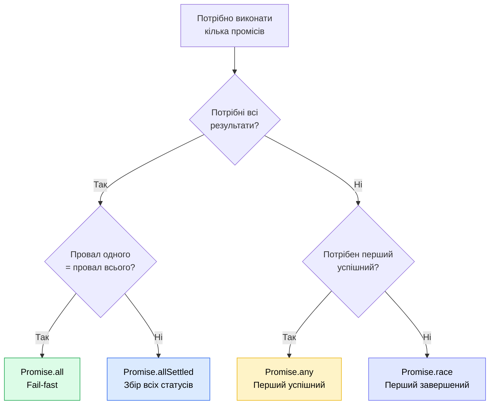

# Promise комбінатори

::card-group

::card{title="🎯 Мета лекції" icon="i-lucide-target"}

- Опанувати чотири основні комбінатори промісів для координації множинних асинхронних операцій.
- Зрозуміти різницю між `Promise.all()`, `Promise.allSettled()`, `Promise.race()` та `Promise.any()`.
- Навчитися вибирати правильний комбінатор залежно від сценарію використання.
- Дослідити реальні застосування паралельного виконання асинхронних операцій.
- Оволодіти технікою обробки помилок у кожному комбінаторі.

::

::card{title="🔑 Ключові терміни" icon="i-lucide-key"}

- **Комбінатор промісів (*promise combinator*):** статичний метод класу `Promise`, що координує виконання множинних промісів.
- **Fail-fast поведінка:** стратегія, коли операція припиняється при першій помилці (характерна для `Promise.all()` та `Promise.race()`).
- **Settled проміс:** проміс, що перейшов із стану *pending* у *fulfilled* або *rejected*, незалежно від результату.
- **AggregateError:** спеціальний тип помилки, що містить масив причин відхилення кількох промісів (використовується у `Promise.any()`).

::

::

## Мотивація: необхідність паралельного виконання

У попередніх лекціях ми розглядали послідовне виконання асинхронних операцій через ланцюжки `.then()`. Проте багато реальних сценаріїв вимагають **паралельного** або **конкурентного** виконання множинних операцій:

- Завантаження даних із кількох API одночасно для формування комплексного відображення.
- Читання кількох файлів паралельно для агрегації інформації.
- Виконання кількох запитів до різних мікросервісів для збору даних користувача.
- Реалізація стратегій резервування (*fallback*) та таймаутів.

Без комбінаторів розробник змушений вручну координувати стан кожного промісу через змінні-лічильники або складну логіку callback, що призводить до важкопідтримуваного коду. Комбінатори промісів інкапсулюють типові патерни координації та надають декларативний інтерфейс для роботи з множинними асинхронними операціями.

::note
Важливо розуміти, що комбінатори промісів не створюють справжній паралелізм у JavaScript. Код JavaScript виконується в одному потоці. «Паралельність» означає конкурентне виконання (*concurrency*) — операції введення/виведення делегуються операційній системі або Thread Pool, а Event Loop координує їх завершення.
::

## `Promise.all()`: дочекатися всіх або провалитися

Метод `Promise.all()` приймає ітерабельну колекцію (зазвичай масив) промісів та повертає новий проміс, який:

- **Виконується (*fulfills*)**, коли **всі** проміси у масиві виконані успішно. Результатом є масив значень у тому ж порядку, що й вхідні проміси.
- **Відхиляється (*rejects*)** негайно, як тільки **хоча б один** проміс відхилено. Причиною відхилення є помилка цього промісу.

Це класична **fail-fast** стратегія: якщо одна операція провалилася, результат усього набору вважається невалідним.

### Базовий приклад

```typescript
const promise1 = Promise.resolve(10);
const promise2 = Promise.resolve(20);
const promise3 = Promise.resolve(30);

Promise.all([promise1, promise2, promise3])
  .then((results) => {
    console.log('Всі проміси виконані:', results); // [10, 20, 30]
    const sum = results.reduce((acc, val) => acc + val, 0);
    console.log('Сума:', sum); // 60
  })
  .catch((error) => {
    console.error('Один із промісів відхилено:', error);
  });
```

Порядок елементів у результуючому масиві відповідає порядку промісів у вхідному масиві, **незалежно від того, який проміс завершився першим**. Це гарантує передбачуваність обробки результатів.

### Реальний приклад: завантаження даних користувача

Типовий сценарій у веб-застосунках — завантаження профілю користувача, його постів та коментарів з різних API endpoints:

```typescript
interface User {
  id: number;
  name: string;
  email: string;
}

interface Post {
  id: number;
  title: string;
  userId: number;
}

interface Comment {
  id: number;
  text: string;
  postId: number;
}

async function fetchUserProfile(userId: number): Promise<User> {
  const response = await fetch(`https://api.example.com/users/${userId}`);
  if (!response.ok) throw new Error('Не вдалося завантажити профіль');
  return response.json();
}

async function fetchUserPosts(userId: number): Promise<Post[]> {
  const response = await fetch(`https://api.example.com/users/${userId}/posts`);
  if (!response.ok) throw new Error('Не вдалося завантажити пости');
  return response.json();
}

async function fetchUserComments(userId: number): Promise<Comment[]> {
  const response = await fetch(`https://api.example.com/users/${userId}/comments`);
  if (!response.ok) throw new Error('Не вдалося завантажити коментарі');
  return response.json();
}

// Паралельне завантаження всіх даних
const userId = 42;

Promise.all([
  fetchUserProfile(userId),
  fetchUserPosts(userId),
  fetchUserComments(userId),
])
  .then(([user, posts, comments]) => {
    // Деструктуризація результатів у змінні з осмисленими назвами
    console.log('Користувач:', user.name);
    console.log('Кількість постів:', posts.length);
    console.log('Кількість коментарів:', comments.length);
    
    // Тут можна формувати комплексний об'єкт для відображення
    return {
      profile: user,
      posts,
      comments,
    };
  })
  .catch((error) => {
    console.error('Помилка завантаження даних користувача:', error.message);
    // Тут можна показати користувачу повідомлення про помилку
  });
```

У цьому прикладі всі три запити виконуються одночасно (конкурентно). Якщо кожен запит триває 200 мілісекунд, загальний час виконання — близько 200мс, а не 600мс (як було б при послідовному виконанні).

::warning
Якщо один із запитів провалиться (наприклад, `fetchUserPosts` поверне 404), `Promise.all()` негайно відхилиться, і обробник `.catch()` отримає помилку. При цьому інші запити (`fetchUserProfile` та `fetchUserComments`) продовжать виконуватися у фоні, але їхні результати будуть проігноровані.
::

### Візуалізація поведінки `Promise.all()`

::plant-uml{alt="Поведінка Promise.all() при успіху та помилці"}

```plantuml
@startuml
skinparam style plain
skinparam backgroundColor #FFFFFF

== Сценарій 1: Всі проміси успішні ==

participant "Promise.all()" as All1 #DBEAFE
participant "Promise 1" as P1 #DCFCE7
participant "Promise 2" as P2 #DCFCE7
participant "Promise 3" as P3 #DCFCE7

All1 -> P1 : Запуск
All1 -> P2 : Запуск
All1 -> P3 : Запуск

P2 --> All1 : resolve(20) [швидкий]
P1 --> All1 : resolve(10)
P3 --> All1 : resolve(30) [повільний]

note over All1 #DCFCE7
  Чекає завершення всіх промісів.
  Результат: [10, 20, 30] (порядок збережено)
end note

All1 --> [o] : resolve([10, 20, 30])

== Сценарій 2: Один проміс відхилено ==

participant "Promise.all()" as All2 #DBEAFE
participant "Promise A" as PA #DCFCE7
participant "Promise B" as PB #FECACA
participant "Promise C" as PC #DCFCE7

All2 -> PA : Запуск
All2 -> PB : Запуск
All2 -> PC : Запуск

PB --> All2 : reject(Error) [швидкий]

note over All2 #FEF3C7
  Негайно відхиляється при першій помилці.
  PA та PC продовжують виконання, але ігноруються.
end note

All2 --> [o] : reject(Error)

PA --> All2 : resolve(A) [ігнорується]
PC --> All2 : resolve(C) [ігнорується]

@enduml
```

::


### Практичний приклад: паралельне читання файлів

Розглянемо сценарій, коли потрібно прочитати кілька конфігураційних файлів та об'єднати їх у єдиний об'єкт:

```typescript
import { readFile } from 'node:fs/promises';
import { join } from 'node:path';

interface DatabaseConfig {
  host: string;
  port: number;
  database: string;
}

interface AppConfig {
  name: string;
  version: string;
  port: number;
}

interface LoggingConfig {
  level: string;
  format: string;
}

async function loadAllConfigs(): Promise<{
  database: DatabaseConfig;
  app: AppConfig;
  logging: LoggingConfig;
}> {
  const configDir = './config';
  
  // Паралельне читання трьох файлів
  const [dbConfig, appConfig, loggingConfig] = await Promise.all([
    readFile(join(configDir, 'database.json'), 'utf-8').then(JSON.parse),
    readFile(join(configDir, 'app.json'), 'utf-8').then(JSON.parse),
    readFile(join(configDir, 'logging.json'), 'utf-8').then(JSON.parse),
  ]);
  
  return {
    database: dbConfig,
    app: appConfig,
    logging: loggingConfig,
  };
}

// Використання
loadAllConfigs()
  .then((config) => {
    console.log('Всі конфігурації завантажено:');
    console.log('- База даних:', config.database.host);
    console.log('- Застосунок:', config.app.name, config.app.version);
    console.log('- Логування:', config.logging.level);
  })
  .catch((error) => {
    console.error('Помилка завантаження конфігурації:', error.message);
    process.exit(1);
  });
```

Якщо хоча б один файл відсутній або містить невалідний JSON, весь процес завантаження конфігурації провалиться, що є бажаною поведінкою — застосунок не може стартувати з неповною конфігурацією.

## `Promise.allSettled()`: обробка всіх результатів незалежно від помилок

На відміну від `Promise.all()`, метод `Promise.allSettled()` **ніколи не відхиляється**. Він чекає завершення всіх промісів (як успішних, так і відхилених) та повертає масив об'єктів з інформацією про статус кожного промісу:

```typescript
type SettledResult<T> =
  | { status: 'fulfilled'; value: T }
  | { status: 'rejected'; reason: any };
```

Цей комбінатор корисний, коли потрібно виконати кілька незалежних операцій та обробити результати кожної окремо, навіть якщо деякі провалилися.

### Базовий приклад

```typescript
const promises = [
  Promise.resolve(42),
  Promise.reject(new Error('Щось пішло не так')),
  Promise.resolve('Успіх'),
  Promise.reject(new Error('Інша помилка')),
];

Promise.allSettled(promises).then((results) => {
  results.forEach((result, index) => {
    if (result.status === 'fulfilled') {
      console.log(`Проміс ${index}: виконано зі значенням`, result.value);
    } else {
      console.error(`Проміс ${index}: відхилено з причиною`, result.reason.message);
    }
  });
});

// Вивід:
// Проміс 0: виконано зі значенням 42
// Проміс 1: відхилено з причиною Щось пішло не так
// Проміс 2: виконано зі значенням Успіх
// Проміс 3: відхилено з причиною Інша помилка
```

### Реальний приклад: надсилання Email-сповіщень кільком користувачам

Розглянемо сценарій масової розсилки email: деякі адреси можуть бути невалідними або сервер може тимчасово не відповідати, але ми хочемо надіслати листи всім, кому це можливо, та зібрати статистику:

```typescript
interface EmailResult {
  email: string;
  success: boolean;
  error?: string;
}

async function sendEmail(to: string, subject: string, body: string): Promise<void> {
  // Імітація надсилання email (може провалитися випадково)
  return new Promise((resolve, reject) => {
    setTimeout(() => {
      const success = Math.random() > 0.3; // 70% успішності
      if (success) {
        console.log(`Email надіслано: ${to}`);
        resolve();
      } else {
        reject(new Error(`Не вдалося надіслати email на ${to}`));
      }
    }, Math.random() * 1000);
  });
}

async function sendBulkEmails(recipients: string[]): Promise<EmailResult[]> {
  const emailPromises = recipients.map((email) =>
    sendEmail(email, 'Важливе оновлення', 'Контент листа...')
  );
  
  const results = await Promise.allSettled(emailPromises);
  
  return results.map((result, index) => {
    const email = recipients[index];
    
    if (result.status === 'fulfilled') {
      return { email, success: true };
    } else {
      return { email, success: false, error: result.reason.message };
    }
  });
}

// Використання
const recipients = [
  'user1@example.com',
  'user2@example.com',
  'user3@example.com',
  'user4@example.com',
  'user5@example.com',
];

sendBulkEmails(recipients)
  .then((results) => {
    const successful = results.filter((r) => r.success).length;
    const failed = results.filter((r) => !r.success).length;
    
    console.log(`\nРезультати розсилки:`);
    console.log(`Успішно: ${successful}/${results.length}`);
    console.log(`Провалено: ${failed}/${results.length}`);
    
    // Виведення помилок
    results.forEach((result) => {
      if (!result.success) {
        console.error(`❌ ${result.email}: ${result.error}`);
      }
    });
  });
```

У цьому прикладі навіть якщо надсилання кільком адресатам провалилося, ми отримуємо повну статистику та можемо обробити кожен результат індивідуально.

::tip
Використовуйте `Promise.allSettled()`, коли операції є незалежними та провал однієї не повинен впливати на інші. Типові сценарії: масові операції, збір метрик з кількох джерел, паралельне логування у кілька систем.
::

## `Promise.race()`: перший завершений проміс перемагає

Метод `Promise.race()` повертає проміс, який виконується або відхиляється, як тільки **перший** проміс у масиві завершується (у будь-якому стані — *fulfilled* або *rejected*):

```typescript
const promise1 = new Promise((resolve) => setTimeout(() => resolve('Повільний'), 2000));
const promise2 = new Promise((resolve) => setTimeout(() => resolve('Швидкий'), 500));
const promise3 = new Promise((resolve) => setTimeout(() => resolve('Середній'), 1000));

Promise.race([promise1, promise2, promise3])
  .then((winner) => {
    console.log('Переможець:', winner); // "Швидкий"
  });
```

Важливо розуміти: `Promise.race()` повертає результат **першого завершеного** промісу, незалежно від того, чи він виконаний успішно, чи відхилений.

### Реальний приклад: реалізація таймауту для запиту

Один із найпоширеніших випадків використання `Promise.race()` — додавання таймауту до асинхронної операції:

```typescript
function fetchWithTimeout<T>(
  promise: Promise<T>,
  timeoutMs: number
): Promise<T> {
  const timeout = new Promise<never>((_, reject) => {
    setTimeout(() => {
      reject(new Error(`Операція перевищила ліміт часу ${timeoutMs}мс`));
    }, timeoutMs);
  });
  
  return Promise.race([promise, timeout]);
}

// Використання
async function fetchUserData(userId: number): Promise<any> {
  const response = await fetch(`https://api.example.com/users/${userId}`);
  if (!response.ok) throw new Error('Помилка API');
  return response.json();
}

fetchWithTimeout(fetchUserData(42), 3000)
  .then((user) => {
    console.log('Користувач завантажено:', user);
  })
  .catch((error) => {
    console.error('Помилка або таймаут:', error.message);
  });
```

У цьому прикладі, якщо запит до API триває довше 3 секунд, `Promise.race()` відхилиться з помилкою таймауту. Якщо запит завершиться швидше — поверне дані користувача.

::note
Навіть після спрацювання таймауту оригінальний проміс (HTTP-запит) продовжує виконуватися у фоні. JavaScript не може скасувати проміс після його створення. Для справжнього скасування HTTP-запитів використовуйте `AbortController` разом із `fetch`.
::

### Реальний приклад: вибір найшвидшого CDN

Розглянемо сценарій, коли застосунок може завантажити ресурс із кількох CDN-серверів та вибирає найшвидший:

```typescript
async function fetchFromCDN(url: string): Promise<string> {
  const response = await fetch(url);
  if (!response.ok) throw new Error(`Помилка CDN: ${url}`);
  return response.text();
}

const cdnUrls = [
  'https://cdn1.example.com/library.js',
  'https://cdn2.example.com/library.js',
  'https://cdn3.example.com/library.js',
];

Promise.race(cdnUrls.map((url) => fetchFromCDN(url)))
  .then((content) => {
    console.log('Бібліотека завантажена з найшвидшого CDN');
    // Використовуємо контент
  })
  .catch((error) => {
    console.error('Всі CDN недоступні або найшвидший провалився:', error);
  });
```

У цьому сценарії `Promise.race()` поверне результат від того CDN-сервера, який відповість першим.


## `Promise.any()`: перший успішний проміс перемагає

Метод `Promise.any()` (доданий у ECMAScript 2021) повертає проміс, який виконується, як тільки **хоча б один** проміс у масиві виконується успішно (*fulfilled*). Якщо **всі** проміси відхилені, `Promise.any()` відхиляється з спеціальною помилкою `AggregateError`, що містить масив усіх причин відхилення.

Ключова різниця з `Promise.race()`:

- `Promise.race()` повертає **перший завершений** (успішний **або** відхилений).
- `Promise.any()` повертає **перший успішний**, ігноруючи відхилені проміси, доки хоча б один не виконається.

### Базовий приклад

```typescript
const promise1 = Promise.reject(new Error('Помилка 1'));
const promise2 = new Promise((resolve) => setTimeout(() => resolve('Успіх 2'), 500));
const promise3 = Promise.reject(new Error('Помилка 3'));

Promise.any([promise1, promise2, promise3])
  .then((result) => {
    console.log('Перший успішний:', result); // "Успіх 2"
  })
  .catch((error) => {
    console.error('Всі проміси відхилені:', error);
  });
```

Навіть якщо `promise1` та `promise3` відхилені, `Promise.any()` чекає виконання `promise2` та повертає його результат.

### Реальний приклад: запит до кількох резервних серверів

Типовий випадок використання `Promise.any()` — запит до кількох резервних серверів з метою отримати результат від першого доступного:

```typescript
async function fetchFromServer(url: string): Promise<any> {
  const response = await fetch(url);
  if (!response.ok) {
    throw new Error(`Сервер ${url} недоступний (${response.status})`);
  }
  return response.json();
}

const servers = [
  'https://primary.example.com/api/data',
  'https://backup1.example.com/api/data',
  'https://backup2.example.com/api/data',
  'https://backup3.example.com/api/data',
];

Promise.any(servers.map((url) => fetchFromServer(url)))
  .then((data) => {
    console.log('Дані отримано від першого доступного сервера:', data);
  })
  .catch((error: AggregateError) => {
    console.error('Всі сервери недоступні:');
    error.errors.forEach((err, index) => {
      console.error(`- ${servers[index]}: ${err.message}`);
    });
  });
```

У цьому прикладі запити до всіх серверів виконуються паралельно. `Promise.any()` поверне дані від першого сервера, що відповість успішно, навіть якщо кілька інших провалилися.

::warning
Якщо всі проміси у `Promise.any()` відхилені, результуюча помилка має тип `AggregateError`. Цей об'єкт містить властивість `errors` — масив усіх причин відхилення. Для доступу до конкретних помилок потрібно явно вказати тип `AggregateError` у обробнику `.catch()`.
::

### Обробка `AggregateError`

Розглянемо детальніше структуру помилки `AggregateError`:

```typescript
const promises = [
  Promise.reject(new Error('База даних недоступна')),
  Promise.reject(new Error('Кеш недоступний')),
  Promise.reject(new Error('API недоступне')),
];

Promise.any(promises)
  .catch((aggregateError: AggregateError) => {
    console.log('Тип помилки:', aggregateError.constructor.name); // "AggregateError"
    console.log('Повідомлення:', aggregateError.message); // "All promises were rejected"
    console.log('Кількість помилок:', aggregateError.errors.length); // 3
    
    aggregateError.errors.forEach((error, index) => {
      console.error(`Помилка ${index + 1}:`, error.message);
    });
  });

// Вивід:
// Тип помилки: AggregateError
// Повідомлення: All promises were rejected
// Кількість помилок: 3
// Помилка 1: База даних недоступна
// Помилка 2: Кеш недоступний
// Помилка 3: API недоступне
```

## Порівняльна таблиця комбінаторів

Для кращого розуміння різниці між комбінаторами розглянемо порівняльну таблицю:

::card-group

::card{title="Promise.all()" icon="i-lucide-check-square"}

**Поведінка:**
- Чекає завершення **всіх** промісів.
- Відхиляється при **першій** помилці (fail-fast).

**Повертає:**
- Масив результатів у порядку вхідних промісів.

**Використання:**
- Завантаження всіх ресурсів для відображення.
- Операції, де потрібні **всі** результати.
- Валідація множинних умов.

::

::card{title="Promise.allSettled()" icon="i-lucide-list-checks"}

**Поведінка:**
- Чекає завершення **всіх** промісів.
- **Ніколи** не відхиляється.

**Повертає:**
- Масив об'єктів `{status, value/reason}`.

**Використання:**
- Незалежні операції (розсилка, логування).
- Збір статистики успішності.
- Коли потрібна інформація про **всі** результати.

::

::card{title="Promise.race()" icon="i-lucide-zap"}

**Поведінка:**
- Повертає **перший завершений** проміс.
- Може бути як виконаний, так і відхилений.

**Повертає:**
- Результат або помилку першого промісу.

**Використання:**
- Таймаути для операцій.
- Вибір найшвидшого джерела.
- Обмеження часу виконання.

::

::card{title="Promise.any()" icon="i-lucide-trophy"}

**Поведінка:**
- Повертає **перший успішний** проміс.
- Ігнорує відхилені до першого успіху.
- Відхиляється, якщо **всі** відхилені.

**Повертає:**
- Результат першого успішного промісу.
- `AggregateError` якщо всі провалилися.

**Використання:**
- Резервні сервери (fallback).
- Першоджерельна доступність.
- Стратегії відмовостійкості.

::

::

## Комбінування комбінаторів: складні сценарії

У реальних застосунках часто потрібно комбінувати різні комбінатори для досягнення складної логіки координації:

### Приклад: завантаження з таймаутом та резервними джерелами

```typescript
function fetchWithTimeout<T>(promise: Promise<T>, timeoutMs: number): Promise<T> {
  const timeout = new Promise<never>((_, reject) => {
    setTimeout(() => reject(new Error('Timeout')), timeoutMs);
  });
  return Promise.race([promise, timeout]);
}

async function fetchDataRobust(urls: string[]): Promise<any> {
  // Для кожного URL додаємо таймаут 3 секунди
  const fetchPromises = urls.map((url) =>
    fetchWithTimeout(
      fetch(url).then((res) => {
        if (!res.ok) throw new Error(`HTTP ${res.status}`);
        return res.json();
      }),
      3000
    )
  );
  
  // Повертаємо дані від першого успішного джерела
  return Promise.any(fetchPromises);
}

// Використання
const dataSources = [
  'https://primary-api.example.com/data',
  'https://backup-api.example.com/data',
  'https://cache-api.example.com/data',
];

fetchDataRobust(dataSources)
  .then((data) => {
    console.log('Дані успішно завантажено:', data);
  })
  .catch((error: AggregateError) => {
    console.error('Всі джерела недоступні або перевищили таймаут');
    error.errors.forEach((err) => console.error('-', err.message));
  });
```

У цьому прикладі ми комбінуємо `Promise.race()` (для таймаутів) з `Promise.any()` (для резервних джерел), досягаючи надійної стратегії завантаження даних.

### Приклад: часткова толерантність до помилок

Іноді потрібна гібридна стратегія: деякі операції є критичними, інші — опціональними:

```typescript
interface PageData {
  user: any;
  posts: any[];
  recommendations?: any[];
  ads?: any[];
}

async function loadPageData(userId: number): Promise<PageData> {
  // Критичні дані: користувач та його пости (Promise.all)
  const [user, posts] = await Promise.all([
    fetchUserProfile(userId),
    fetchUserPosts(userId),
  ]);
  
  // Опціональні дані: рекомендації та реклама (Promise.allSettled)
  const [recommendationsResult, adsResult] = await Promise.allSettled([
    fetchRecommendations(userId),
    fetchAds(userId),
  ]);
  
  return {
    user,
    posts,
    recommendations: recommendationsResult.status === 'fulfilled'
      ? recommendationsResult.value
      : undefined,
    ads: adsResult.status === 'fulfilled'
      ? adsResult.value
      : undefined,
  };
}

loadPageData(42)
  .then((pageData) => {
    console.log('Сторінка завантажена');
    console.log('Користувач:', pageData.user.name);
    console.log('Постів:', pageData.posts.length);
    
    if (pageData.recommendations) {
      console.log('Рекомендації:', pageData.recommendations.length);
    } else {
      console.warn('Рекомендації недоступні');
    }
    
    if (pageData.ads) {
      console.log('Реклама завантажена');
    } else {
      console.warn('Реклама недоступна');
    }
  })
  .catch((error) => {
    console.error('Критична помилка завантаження сторінки:', error);
  });
```

У цьому прикладі профіль користувача та пости є критичними — якщо їх не вдається завантажити, сторінка вважається непридатною. Рекомендації та реклама є опціональними — сторінка може відобразитися без них.


## Діаграма прийняття рішення: вибір комбінатора

Для швидкого вибору правильного комбінатора використовуйте цю блок-схему:

::mermaid



::

## Практичні рекомендації та патерни

::steps

### Правило 1: Використовуйте `Promise.all()` для критичних залежностей

Якщо всі операції є критичними для продовження роботи, завжди використовуйте `Promise.all()`. Це забезпечує fail-fast поведінку та запобігає роботі з неповними даними.

### Правило 2: Використовуйте `Promise.allSettled()` для незалежних операцій

Коли операції є незалежними (наприклад, логування у кілька систем, масові оновлення), використовуйте `Promise.allSettled()` для збору повної статистики.

### Правило 3: Додавайте таймаути через `Promise.race()`

Будь-яка операція введення/виведення у продакшн-коді повинна мати таймаут. Використовуйте `Promise.race()` для обмеження часу виконання.

### Правило 4: Використовуйте `Promise.any()` для стратегій fallback

При роботі з множинними резервними джерелами `Promise.any()` є ідеальним рішенням — він автоматично обирає перше доступне джерело.

### Правило 5: Обробляйте `AggregateError` правильно

При використанні `Promise.any()` завжди вказуйте тип `AggregateError` у `.catch()` для доступу до масиву помилок.

::

## Типові помилки та антипаттерни

### Помилка 1: Послідовне виконання замість паралельного

```typescript
// ❌ АНТИПАТТЕРН: Послідовне виконання (повільно)
async function loadDataSequential() {
  const user = await fetchUser(42);
  const posts = await fetchPosts(42);
  const comments = await fetchComments(42);
  return { user, posts, comments };
}
// Загальний час: 200мс + 150мс + 100мс = 450мс

// ✅ ПРАВИЛЬНО: Паралельне виконання (швидко)
async function loadDataParallel() {
  const [user, posts, comments] = await Promise.all([
    fetchUser(42),
    fetchPosts(42),
    fetchComments(42),
  ]);
  return { user, posts, comments };
}
// Загальний час: max(200мс, 150мс, 100мс) = 200мс
```

### Помилка 2: Ігнорування помилок у `Promise.allSettled()`

```typescript
// ❌ ПОМИЛКА: Не перевіряємо статус
Promise.allSettled([op1, op2, op3]).then((results) => {
  const values = results.map((r) => r.value); // Помилка: rejected не має value
  processValues(values);
});

// ✅ ПРАВИЛЬНО: Перевіряємо статус кожного
Promise.allSettled([op1, op2, op3]).then((results) => {
  const values = results
    .filter((r) => r.status === 'fulfilled')
    .map((r) => r.value);
  processValues(values);
});
```

### Помилка 3: Неправильна обробка таймауту

```typescript
// ❌ ПОМИЛКА: Таймаут не скасовує оригінальну операцію
function badTimeout<T>(promise: Promise<T>, ms: number): Promise<T> {
  const timeout = new Promise<never>((_, reject) => {
    setTimeout(() => reject(new Error('Timeout')), ms);
  });
  return Promise.race([promise, timeout]);
}

// ✅ КРАЩЕ: Використання AbortController для справжнього скасування
function goodTimeout<T>(
  fetcher: (signal: AbortSignal) => Promise<T>,
  ms: number
): Promise<T> {
  const controller = new AbortController();
  
  const timeout = setTimeout(() => {
    controller.abort(); // Скасовуємо запит
  }, ms);
  
  return fetcher(controller.signal).finally(() => {
    clearTimeout(timeout);
  });
}

// Використання з fetch
goodTimeout(
  (signal) => fetch('https://api.example.com/data', { signal }).then(r => r.json()),
  3000
);
```

## Метрики продуктивності: вимірювання ефекту паралелізації

Розглянемо практичний приклад вимірювання покращення продуктивності:

```typescript
interface Metrics {
  sequential: number;
  parallel: number;
  improvement: string;
}

async function measurePerformance(): Promise<Metrics> {
  const operations = [
    () => new Promise((resolve) => setTimeout(() => resolve('Op1'), 200)),
    () => new Promise((resolve) => setTimeout(() => resolve('Op2'), 150)),
    () => new Promise((resolve) => setTimeout(() => resolve('Op3'), 180)),
  ];
  
  // Вимірювання послідовного виконання
  const sequentialStart = Date.now();
  for (const op of operations) {
    await op();
  }
  const sequentialTime = Date.now() - sequentialStart;
  
  // Вимірювання паралельного виконання
  const parallelStart = Date.now();
  await Promise.all(operations.map((op) => op()));
  const parallelTime = Date.now() - parallelStart;
  
  const improvement = ((1 - parallelTime / sequentialTime) * 100).toFixed(1);
  
  return {
    sequential: sequentialTime,
    parallel: parallelTime,
    improvement: `${improvement}%`,
  };
}

measurePerformance().then((metrics) => {
  console.log('Послідовне виконання:', metrics.sequential, 'мс');
  console.log('Паралельне виконання:', metrics.parallel, 'мс');
  console.log('Покращення:', metrics.improvement);
});

// Приблизний вивід:
// Послідовне виконання: 530 мс
// Паралельне виконання: 200 мс
// Покращення: 62.3%
```

## Підсумок та закріплення матеріалу

У цій лекції ми детально розглянули чотири комбінатори промісів для координації множинних асинхронних операцій:

::card-group

::card{title="🎯 Promise.all()" icon="i-lucide-layers"}

**Коли використовувати:**
- Всі операції критичні.
- Потрібні всі результати.
- Провал однієї = провал всього.

**Приклади:**
- Завантаження обов'язкових даних.
- Валідація множинних умов.
- Паралельна обробка залежних ресурсів.

::

::card{title="📊 Promise.allSettled()" icon="i-lucide-bar-chart"}

**Коли використовувати:**
- Незалежні операції.
- Потрібна статистика всіх результатів.
- Провал однієї не впливає на інші.

**Приклади:**
- Масова розсилка повідомлень.
- Збір метрик із кількох джерел.
- Логування у кілька систем.

::

::card{title="⚡ Promise.race()" icon="i-lucide-zap"}

**Коли використовувати:**
- Потрібен перший завершений.
- Реалізація таймаутів.
- Вибір найшвидшого джерела.

**Приклади:**
- Таймаути для операцій.
- Вибір найшвидшого CDN.
- Обмеження часу виконання.

::

::card{title="🏆 Promise.any()" icon="i-lucide-trophy"}

**Коли використовувати:**
- Потрібен перший успішний.
- Резервні джерела (fallback).
- Стратегії відмовостійкості.

**Приклади:**
- Запити до множинних серверів.
- Завантаження з резервних джерел.
- Пошук першої доступної бази даних.

::

::

::accordion

::accordion-item{label="❓ Чи можна комбінувати кілька комбінаторів у одній операції?" icon="i-lucide-help-circle"}

Так, комбінування комбінаторів є поширеною практикою для складних сценаріїв. Наприклад, можна використовувати `Promise.race()` для додавання таймауту до кожного промісу, а потім `Promise.any()` для вибору першого успішного результату. Або `Promise.all()` для критичних операцій і `Promise.allSettled()` для опціональних у одному застосунку.

::

::accordion-item{label="❓ Що станеться з іншими промісами після завершення Promise.race() або Promise.any()?" icon="i-lucide-help-circle"}

Інші проміси **продовжують виконуватися у фоні**, навіть після того, як `Promise.race()` або `Promise.any()` повернули результат. JavaScript не може скасувати проміс після його створення. Для справжнього скасування операцій потрібно використовувати механізми на кшталт `AbortController` для HTTP-запитів або власну логіку відміни для інших операцій.

::

::accordion-item{label="❓ Чи впливають комбінатори на порядок виконання промісів?" icon="i-lucide-help-circle"}

Ні, комбінатори не впливають на порядок виконання — всі проміси у масиві починають виконуватися одночасно (конкурентно) одразу після виклику комбінатора. Комбінатор лише визначає, **як обробляти їхні результати**: чекати всіх (`Promise.all`), чекати першого завершеного (`Promise.race`), першого успішного (`Promise.any`) тощо. Фактичний порядок завершення залежить від швидкості операцій, а не від позиції у масиві.

::

::

У наступній лекції ми розглянемо синтаксис `async/await` — сучасний спосіб написання асинхронного коду, що робить його схожим на синхронний та усуває необхідність у ланцюжках `.then()`.
