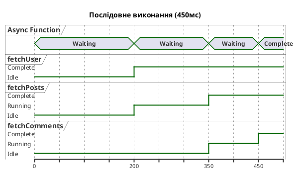
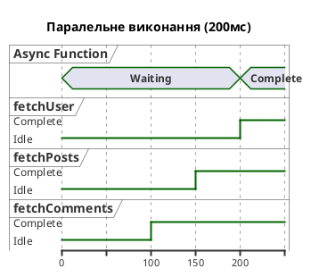

# Async/Await — синтаксичний цукор над Promises

::card-group

::card{title="🎯 Мета лекції" icon="i-lucide-target"}

- Опанувати синтаксис `async/await` як елегантну альтернативу ланцюжкам промісів.
- Зрозуміти концепцію функції `async` як функції, що завжди повертає проміс.
- Навчитися використовувати оператор `await` для призупинення виконання до завершення асинхронної операції.
- Дослідити переваги обробки помилок через `try/catch` замість `.catch()`.
- Оволодіти технікою top-level `await` у модулях ES (ES2022).
- Навчитися уникати типових помилок та антипаттернів при роботі з `async/await`.

::

::card{title="🔑 Ключові терміни" icon="i-lucide-key"}

- **Async функція (*async function*):** функція, оголошена з ключовим словом `async`, що автоматично повертає проміс та дозволяє використання оператора `await` всередині свого тіла.
- **Await оператор:** оператор, що призупиняє виконання `async` функції до моменту виконання промісу, повертаючи його результат синхронно.
- **Синтаксичний цукор (*syntactic sugar*):** синтаксична конструкція, що робить код більш читабельним, але не додає нової функціональності — `async/await` є цукром над промісами.
- **Top-level await:** можливість використання `await` поза `async` функціями на верхньому рівні ES-модулів (з ES2022).

::

::

## Еволюція асинхронного синтаксису: від callback до async/await

Протягом еволюції JavaScript асинхронний код пройшов три основні етапи:

1. **Callback (1990-ті — 2010-ті):** функції зворотного виклику, що призводили до callback hell.
2. **Promises (ES2015):** об'єкти-обгортки з ланцюжками `.then()`, що усували вкладеність.
3. **Async/Await (ES2017):** синтаксичний цукор над промісами, що робить асинхронний код схожим на синхронний.

Розглянемо еволюцію одного й того ж коду через всі три підходи:

::code-group

```typescript [Callback Hell]
import { readFile, writeFile } from 'node:fs';

readFile('./user.json', 'utf-8', (err1, userData) => {
  if (err1) {
    console.error('Помилка читання користувача:', err1);
    return;
  }
  
  const user = JSON.parse(userData);
  
  readFile(`./posts/${user.id}.json`, 'utf-8', (err2, postsData) => {
    if (err2) {
      console.error('Помилка читання постів:', err2);
      return;
    }
    
    const posts = JSON.parse(postsData);
    const summary = { user, postCount: posts.length };
    
    writeFile('./summary.json', JSON.stringify(summary), (err3) => {
      if (err3) {
        console.error('Помилка запису:', err3);
        return;
      }
      console.log('Звіт створено');
    });
  });
});
```

```typescript [Promise Chains]
import { readFile, writeFile } from 'node:fs/promises';

readFile('./user.json', 'utf-8')
  .then((userData) => {
    const user = JSON.parse(userData);
    return readFile(`./posts/${user.id}.json`, 'utf-8')
      .then((postsData) => ({ user, postsData }));
  })
  .then(({ user, postsData }) => {
    const posts = JSON.parse(postsData);
    const summary = { user, postCount: posts.length };
    return writeFile('./summary.json', JSON.stringify(summary));
  })
  .then(() => {
    console.log('Звіт створено');
  })
  .catch((error) => {
    console.error('Помилка:', error.message);
  });
```

```typescript [Async/Await]
import { readFile, writeFile } from 'node:fs/promises';

async function createSummary(): Promise<void> {
  try {
    const userData = await readFile('./user.json', 'utf-8');
    const user = JSON.parse(userData);
    
    const postsData = await readFile(`./posts/${user.id}.json`, 'utf-8');
    const posts = JSON.parse(postsData);
    
    const summary = { user, postCount: posts.length };
    await writeFile('./summary.json', JSON.stringify(summary));
    
    console.log('Звіт створено');
  } catch (error) {
    console.error('Помилка:', (error as Error).message);
  }
}

createSummary();
```

::

Порівнюючи три варіанти, очевидно, що `async/await` синтаксис найбільш читабельний — код виглядає майже як синхронний, але виконується асинхронно. Кожна операція чітко відокремлена, відсутня вкладеність, помилки обробляються у єдиному блоці `catch`.

::note
Критично важливо розуміти: `async/await` **НЕ змінює** асинхронної природи JavaScript. Під капотом весь код досі працює через проміси та Event Loop. `async/await` є лише **синтаксичним цукром**, що робить код більш лінійним та зрозумілим.
::

## Ключове слово `async`: функції, що повертають проміси

Ключове слово `async` перед оголошенням функції змінює її поведінку фундаментальним чином: **функція завжди повертає проміс**, навіть якщо у тілі функції явно повертається звичайне значення.

### Базовий приклад

```typescript
// Звичайна функція
function regularFunction(): number {
  return 42;
}

console.log(regularFunction()); // 42 (число)

// Async функція
async function asyncFunction(): Promise<number> {
  return 42;
}

console.log(asyncFunction()); // Promise { 42 } (проміс)

// Отримання значення з async функції
asyncFunction().then((value) => {
  console.log(value); // 42
});
```

Правила роботи `async` функцій:

1. **Повернення значення:** якщо `async` функція повертає значення `x`, воно автоматично обгортається у `Promise.resolve(x)`.
2. **Викидання виключення:** якщо `async` функція викидає виключення, воно обгортається у `Promise.reject(error)`.
3. **Повернення промісу:** якщо `async` функція повертає проміс, він повертається без додаткової обгортки.


Розглянемо детальніше:

```typescript
// Приклад 1: Повернення значення
async function getValue(): Promise<string> {
  return 'Hello, async!';
}
// Еквівалентно:
// function getValue(): Promise<string> {
//   return Promise.resolve('Hello, async!');
// }

getValue().then(console.log); // "Hello, async!"

// Приклад 2: Викидання виключення
async function throwError(): Promise<never> {
  throw new Error('Щось пішло не так');
}
// Еквівалентно:
// function throwError(): Promise<never> {
//   return Promise.reject(new Error('Щось пішло не так'));
// }

throwError().catch(console.error); // Error: Щось пішло не так

// Приклад 3: Повернення промісу
async function returnPromise(): Promise<number> {
  return Promise.resolve(100);
}
// Проміс НЕ обгортається додатково — повертається як є

returnPromise().then(console.log); // 100
```

### Варіанти оголошення async функцій

Ключове слово `async` може використовуватися з різними формами оголошення функцій:

```typescript
// 1. Оголошення функції (Function Declaration)
async function fetchData(): Promise<string> {
  return 'data';
}

// 2. Функціональний вираз (Function Expression)
const fetchData2 = async function(): Promise<string> {
  return 'data';
};

// 3. Стрілкова функція (Arrow Function)
const fetchData3 = async (): Promise<string> => {
  return 'data';
};

// 4. Метод об'єкта
const api = {
  async fetchUser(id: number): Promise<any> {
    return { id, name: 'Користувач' };
  },
};

// 5. Метод класу
class UserService {
  async getUser(id: number): Promise<any> {
    return { id, name: 'Користувач' };
  }
  
  // Статичний async метод
  static async initialize(): Promise<void> {
    console.log('Ініціалізація сервісу...');
  }
}
```

::tip
У TypeScript завжди явно вказуйте тип повернення `async` функції як `Promise<T>`. Це покращує читабельність коду та допомагає компілятору виявити помилки типізації.
::

## Оператор `await`: призупинення виконання до отримання результату

Оператор `await` є серцем `async/await` синтаксису. Він **призупиняє виконання** `async` функції до моменту виконання промісу та **повертає розгорнуте значення** промісу синхронно:

```typescript
async function example(): Promise<void> {
  console.log('1. Початок');
  
  const result = await Promise.resolve('async value');
  // Виконання функції призупиняється тут до виконання промісу
  
  console.log('2. Результат:', result); // "async value" (не Promise!)
  console.log('3. Кінець');
}

example();
console.log('4. Зовнішній код');

// Вивід:
// 1. Початок
// 4. Зовнішній код
// 2. Результат: async value
// 3. Кінець
```

Ключові моменти поведінки `await`:

1. **Розгортання промісу:** `await promise` повертає не проміс, а **значення**, яким цей проміс виконався.
2. **Асинхронне призупинення:** виконання функції призупиняється, але **не блокує Event Loop** — інший код може виконуватися.
3. **Обмеження контексту:** `await` можна використовувати **лише всередині `async` функцій** (за винятком top-level await у модулях ES).
4. **Викидання помилок:** якщо проміс відхилено, `await` **викидає** причину відхилення як виключення.

### Реальний приклад: завантаження даних користувача

```typescript
interface User {
  id: number;
  name: string;
  email: string;
}

interface Post {
  id: number;
  title: string;
  userId: number;
}

async function fetchUser(id: number): Promise<User> {
  const response = await fetch(`https://api.example.com/users/${id}`);
  
  if (!response.ok) {
    throw new Error(`HTTP ${response.status}: ${response.statusText}`);
  }
  
  return response.json();
}

async function fetchUserPosts(userId: number): Promise<Post[]> {
  const response = await fetch(`https://api.example.com/users/${userId}/posts`);
  
  if (!response.ok) {
    throw new Error(`HTTP ${response.status}: ${response.statusText}`);
  }
  
  return response.json();
}

async function displayUserDashboard(userId: number): Promise<void> {
  console.log('Завантаження даних...');
  
  // Послідовне виконання: спочатку користувач, потім пости
  const user = await fetchUser(userId);
  console.log('Користувач:', user.name);
  
  const posts = await fetchUserPosts(userId);
  console.log('Кількість постів:', posts.length);
  
  console.log('Дашборд готовий!');
}

// Виклик async функції (повертає проміс)
displayUserDashboard(42)
  .then(() => console.log('Завершено успішно'))
  .catch((error) => console.error('Помилка:', error.message));
```

У цьому прикладі код виглядає як синхронний, хоча всі операції асинхронні. Виконання функції призупиняється на кожному `await`, поки проміс не виконається.

::warning
Оператор `await` **не можна** використовувати у звичайних (не-`async`) функціях, конструкторах або на верхньому рівні файлу (за винятком ES-модулів з підтримкою top-level await). Спроба використати `await` поза `async` функцією призведе до синтаксичної помилки.
::


## Обробка помилок: `try/catch` замість `.catch()`

Одна з найбільших переваг `async/await` — можливість використання **традиційних конструкцій обробки помилок** `try/catch/finally` замість ланцюжків `.catch()`. Це робить код більш послідовним та зрозумілим для розробників, що звикли до синхронного коду.

### Базовий приклад обробки помилок

```typescript
async function readConfigFile(path: string): Promise<any> {
  try {
    const content = await readFile(path, 'utf-8');
    const config = JSON.parse(content);
    
    if (!config.apiKey) {
      throw new Error('API ключ відсутній у конфігурації');
    }
    
    return config;
  } catch (error) {
    // Обробляємо ВСІ помилки:
    // - Файл не знайдено (ENOENT)
    // - JSON невалідний (SyntaxError)
    // - API ключ відсутній (Error)
    console.error('Помилка завантаження конфігурації:', (error as Error).message);
    throw error; // Передаємо помилку вище по стеку
  }
}

// Виклик з обробкою помилок
readConfigFile('./config.json')
  .then((config) => console.log('Конфігурація завантажена:', config))
  .catch((error) => console.error('Критична помилка:', error.message));
```

### Порівняння обробки помилок: `.then().catch()` vs `try/catch`

::code-group

```typescript [Promise Chains]
import { readFile } from 'node:fs/promises';

function processData(): Promise<void> {
  return readFile('./data.json', 'utf-8')
    .then((content) => {
      const data = JSON.parse(content);
      return validateData(data);
    })
    .then((validData) => {
      return saveToDatabase(validData);
    })
    .then(() => {
      console.log('Дані збережено');
    })
    .catch((error) => {
      console.error('Помилка обробки даних:', error.message);
      throw error;
    });
}
```

```typescript [Async/Await]
import { readFile } from 'node:fs/promises';

async function processData(): Promise<void> {
  try {
    const content = await readFile('./data.json', 'utf-8');
    const data = JSON.parse(content);
    const validData = await validateData(data);
    await saveToDatabase(validData);
    console.log('Дані збережено');
  } catch (error) {
    console.error('Помилка обробки даних:', (error as Error).message);
    throw error;
  }
}
```

::

Переваги `try/catch` підходу:

1. **Єдиний блок обробки:** всі помилки у межах `try` блоку обробляються в одному місці.
2. **Звична семантика:** розробники, що знайомі з іншими мовами (Java, C#, Python), відразу розуміють структуру.
3. **Можливість локальної обробки:** можна обгорнути окремі операції у власні `try/catch` для специфічної обробки.

### Блок `finally`: гарантоване виконання коду очищення

Блок `finally` виконується **завжди**, незалежно від того, чи виконався код у `try` успішно, чи виникла помилка:

```typescript
import { open, FileHandle } from 'node:fs/promises';

async function processFile(path: string): Promise<void> {
  let fileHandle: FileHandle | undefined;
  
  try {
    fileHandle = await open(path, 'r');
    const buffer = Buffer.alloc(1024);
    const { bytesRead } = await fileHandle.read(buffer, 0, 1024, 0);
    
    console.log('Прочитано байтів:', bytesRead);
    
    // Обробка даних...
    if (bytesRead === 0) {
      throw new Error('Файл порожній');
    }
  } catch (error) {
    console.error('Помилка обробки файлу:', (error as Error).message);
    throw error;
  } finally {
    // Гарантоване закриття файлового дескриптора
    if (fileHandle) {
      await fileHandle.close();
      console.log('Файл закрито');
    }
  }
}

processFile('./data.bin')
  .catch((error) => console.error('Критична помилка:', error));
```

У цьому прикладі файловий дескриптор буде закрито **завжди** — навіть якщо виникне помилка під час читання. Це критично важливо для запобігання витоку ресурсів (*resource leaks*).

::note
Блок `finally` виконується після `try` (якщо код успішний) або після `catch` (якщо виникла помилка), але **перед поверненням** значення з функції. Це робить `finally` ідеальним місцем для очищення ресурсів (закриття файлів, з'єднань з базою даних, звільнення блокувань).
::

### Вибіркова обробка помилок за типом

У деяких сценаріях потрібно по-різному обробляти різні типи помилок:

```typescript
import { readFile } from 'node:fs/promises';

class ValidationError extends Error {
  constructor(message: string) {
    super(message);
    this.name = 'ValidationError';
  }
}

async function loadAndValidateConfig(path: string): Promise<any> {
  try {
    const content = await readFile(path, 'utf-8');
    const config = JSON.parse(content);
    
    if (!config.version || typeof config.version !== 'string') {
      throw new ValidationError('Поле version є обов\'язковим');
    }
    
    if (!config.database || !config.database.host) {
      throw new ValidationError('Налаштування database.host відсутні');
    }
    
    return config;
  } catch (error) {
    if (error instanceof ValidationError) {
      console.error('Помилка валідації конфігурації:', error.message);
      // Використовуємо конфігурацію за замовчуванням
      return getDefaultConfig();
    }
    
    if ((error as NodeJS.ErrnoException).code === 'ENOENT') {
      console.warn('Файл конфігурації не знайдено, використовуємо значення за замовчуванням');
      return getDefaultConfig();
    }
    
    if (error instanceof SyntaxError) {
      console.error('Невалідний JSON у файлі конфігурації');
      throw error; // Критична помилка — не можемо продовжити
    }
    
    // Невідома помилка — передаємо вище
    throw error;
  }
}

function getDefaultConfig(): any {
  return {
    version: '1.0.0',
    database: {
      host: 'localhost',
      port: 5432,
    },
  };
}
```

У цьому прикладі різні типи помилок обробляються по-різному: помилки валідації та відсутності файлу призводять до використання конфігурації за замовчуванням, тоді як помилки парсингу JSON вважаються критичними.


## Паралельне виконання: поєднання `async/await` з комбінаторами промісів

Одна з типових помилок при використанні `async/await` — ненавмисне **послідовне виконання** операцій, які могли б виконуватися **паралельно**. Оскільки `await` призупиняє виконання функції, кілька `await` підряд виконуються послідовно:

```typescript
// ❌ АНТИПАТТЕРН: Послідовне виконання (повільно)
async function loadUserDataSequential(userId: number): Promise<any> {
  const user = await fetchUser(userId);        // Чекаємо 200мс
  const posts = await fetchUserPosts(userId);  // Чекаємо 150мс
  const comments = await fetchUserComments(userId); // Чекаємо 100мс
  
  return { user, posts, comments };
  // Загальний час: 200 + 150 + 100 = 450мс
}
```

У цьому прикладі кожен запит чекає завершення попереднього, хоча всі три операції є **незалежними** та могли б виконуватися одночасно. Для паралельного виконання потрібно використовувати комбінатори промісів разом з `async/await`:

```typescript
// ✅ ПРАВИЛЬНО: Паралельне виконання (швидко)
async function loadUserDataParallel(userId: number): Promise<any> {
  const [user, posts, comments] = await Promise.all([
    fetchUser(userId),
    fetchUserPosts(userId),
    fetchUserComments(userId),
  ]);
  
  return { user, posts, comments };
  // Загальний час: max(200, 150, 100) = 200мс
}
```

У цій версії всі три запити стартують одночасно, а `await Promise.all()` чекає завершення всіх трьох. Це призводить до **2,25× прискорення** порівняно з послідовним виконанням.

### Візуалізація паралельного виконання

::plant-uml{alt="Порівняння послідовного та паралельного виконання"}



::

::plant-uml{alt="Паралельне виконання з Promise.all()"}



::

### Комбінування послідовних та паралельних операцій

У реальних застосунках часто потрібно комбінувати послідовні та паралельні операції — коли результат однієї операції потрібен для запуску наступних:

```typescript
interface User {
  id: number;
  name: string;
}

interface Post {
  id: number;
  title: string;
}

interface Comment {
  id: number;
  text: string;
}

interface UserProfile {
  user: User;
  posts: Post[];
  comments: Comment[];
  followers: User[];
  following: User[];
}

async function loadCompleteUserProfile(userId: number): Promise<UserProfile> {
  // Крок 1: Завантажити користувача (обов'язковий перший крок)
  const user = await fetchUser(userId);
  
  // Крок 2: Паралельно завантажити всі дані, що залежать від user.id
  const [posts, comments, followers, following] = await Promise.all([
    fetchUserPosts(user.id),
    fetchUserComments(user.id),
    fetchUserFollowers(user.id),
    fetchUserFollowing(user.id),
  ]);
  
  return {
    user,
    posts,
    comments,
    followers,
    following,
  };
}
```

У цьому прикладі `fetchUser()` виконується **послідовно** (оскільки його результат необхідний для наступних запитів), а всі залежні операції виконуються **паралельно**.

::tip
Завжди аналізуйте залежності між асинхронними операціями. Якщо операції **незалежні** (результат однієї не потрібен для іншої), запускайте їх **паралельно** через `Promise.all()`, `Promise.allSettled()` або інші комбінатори. Це значно покращує продуктивність застосунку.
::

### Реальний приклад: завантаження сторінки з критичними та опціональними даними

```typescript
interface PageData {
  user: User;
  posts: Post[];
  recommendations?: Post[];
  ads?: any;
}

async function loadPageData(userId: number): Promise<PageData> {
  // Крок 1: Критичні дані (Promise.all — fail-fast)
  const [user, posts] = await Promise.all([
    fetchUser(userId),
    fetchUserPosts(userId),
  ]);
  
  // Крок 2: Опціональні дані (Promise.allSettled — толерантність до помилок)
  const [recommendationsResult, adsResult] = await Promise.allSettled([
    fetchRecommendations(userId),
    fetchAds(),
  ]);
  
  return {
    user,
    posts,
    recommendations: recommendationsResult.status === 'fulfilled'
      ? recommendationsResult.value
      : undefined,
    ads: adsResult.status === 'fulfilled'
      ? adsResult.value
      : undefined,
  };
}

// Використання
loadPageData(42)
  .then((pageData) => {
    console.log('Сторінка завантажена');
    console.log('Користувач:', pageData.user.name);
    console.log('Постів:', pageData.posts.length);
    
    if (pageData.recommendations) {
      console.log('Рекомендації доступні');
    } else {
      console.warn('Рекомендації недоступні');
    }
  })
  .catch((error) => {
    console.error('Критична помилка завантаження сторінки:', error);
  });
```

У цьому прикладі критичні дані (користувач та пости) завантажуються через `Promise.all()` — якщо хоча б одна операція провалиться, вся сторінка вважається недоступною. Опціональні дані (рекомендації та реклама) завантажуються через `Promise.allSettled()` — сторінка відобразиться навіть якщо вони недоступні.


## Top-level `await`: асинхронність на верхньому рівні модулів

До появи ECMAScript 2022 оператор `await` можна було використовувати **лише всередині** `async` функцій. Це створювало незручності на верхньому рівні модулів, де часто потрібно виконати асинхронну ініціалізацію:

```typescript
// ❌ До ES2022: неможливо використати await на верхньому рівні
// await loadConfig(); // SyntaxError!

// Обхідний шлях: IIFE (Immediately Invoked Function Expression)
(async () => {
  const config = await loadConfig();
  startServer(config);
})();
```

З появою **top-level await** (ES2022) оператор `await` можна використовувати безпосередньо на верхньому рівні **ES-модулів** (файлів з розширенням `.mjs` або з налаштуванням `"type": "module"` у `package.json`):

```typescript
// ✅ ES2022: top-level await у модулях
import { readFile } from 'node:fs/promises';

const config = await readFile('./config.json', 'utf-8').then(JSON.parse);

export const apiUrl = config.apiUrl;
export const port = config.port;

console.log('Конфігурація завантажена:', config);
```

### Правила використання top-level await

1. **Лише у ES-модулях:** top-level `await` працює тільки у файлах, що є модулями ECMAScript (`import`/`export`).
2. **Блокування імпорту:** модуль з top-level `await` блокує виконання модулів, що його імпортують, до завершення асинхронної операції.
3. **Підтримка середовищем:** потрібна Node.js 14.8+ з увімкненими ES-модулями або сучасні браузери.

### Приклад: ініціалізація підключення до бази даних

```typescript
// database.ts (ES-модуль)
import { Pool } from 'pg';

const connectionString = process.env.DATABASE_URL || 'postgresql://localhost/mydb';

// Створення пулу підключень
export const pool = new Pool({ connectionString });

// Перевірка підключення на верхньому рівні
try {
  const client = await pool.connect();
  console.log('✓ Підключення до бази даних успішне');
  
  const result = await client.query('SELECT NOW()');
  console.log('Час сервера БД:', result.rows[0].now);
  
  client.release();
} catch (error) {
  console.error('✗ Помилка підключення до БД:', (error as Error).message);
  process.exit(1);
}

export async function queryUser(id: number): Promise<any> {
  const result = await pool.query('SELECT * FROM users WHERE id = $1', [id]);
  return result.rows[0];
}
```

```typescript
// app.ts (імпортує database.ts)
import express from 'express';
import { pool, queryUser } from './database.js'; // Виконання зупиниться до завершення top-level await у database.ts

const app = express();

app.get('/users/:id', async (req, res) => {
  try {
    const user = await queryUser(parseInt(req.params.id));
    res.json(user);
  } catch (error) {
    res.status(500).json({ error: (error as Error).message });
  }
});

const PORT = 3000;
app.listen(PORT, () => {
  console.log(`Сервер запущено на порту ${PORT}`);
});
```

У цьому прикладі `app.ts` почне виконуватися **лише після** того, як `database.ts` завершить перевірку підключення до бази даних. Це гарантує, що сервер не стартує з невалідним підключенням.

::warning
Використовуйте top-level `await` обережно у модулях, що імпортуються іншими модулями. Тривалі асинхронні операції на верхньому рівні можуть значно уповільнити завантаження застосунку. У таких випадках краще використовувати явні функції ініціалізації:

```typescript
// ✅ КРАЩЕ: Явна функція ініціалізації
export async function initializeDatabase(): Promise<void> {
  // Ініціалізація...
}

// У головному файлі:
await initializeDatabase();
```
::

### Top-level await у тестах

Top-level `await` особливо корисний у тестових файлах для підготовки фікстур та налаштування середовища:

```typescript
// user.test.ts
import { describe, it, expect } from 'vitest';
import { readFile } from 'node:fs/promises';

// Завантаження тестових даних на верхньому рівні
const testUsers = await readFile('./fixtures/users.json', 'utf-8').then(JSON.parse);

describe('User Service', () => {
  it('should validate user data', () => {
    const user = testUsers[0];
    expect(user).toHaveProperty('id');
    expect(user).toHaveProperty('email');
  });
  
  it('should filter active users', () => {
    const activeUsers = testUsers.filter((u: any) => u.active);
    expect(activeUsers.length).toBeGreaterThan(0);
  });
});
```

## Типові помилки та антипаттерни при роботі з `async/await`

### Помилка 1: Забути `await` перед асинхронним викликом

```typescript
// ❌ ПОМИЛКА: Забуто await
async function getUserName(id: number): Promise<string> {
  const user = fetchUser(id); // Отримуємо Promise, а не результат!
  return user.name; // TypeError: Cannot read property 'name' of Promise
}

// ✅ ПРАВИЛЬНО: Використано await
async function getUserName(id: number): Promise<string> {
  const user = await fetchUser(id); // Чекаємо виконання промісу
  return user.name;
}
```

Ця помилка є однією з найпоширеніших серед початківців. TypeScript частково допомагає виявити її через систему типів, але у динамічних сценаріях помилка може залишитися непоміченою до runtime.

::note
У TypeScript компілятор попередить, якщо ви намагаєтеся отримати доступ до властивості промісу без `await`. Завжди вмикайте строгі перевірки типів (`"strict": true` у `tsconfig.json`) для виявлення таких помилок на етапі компіляції.
::

### Помилка 2: Не обгорнути асинхронний код у `try/catch`

```typescript
// ❌ ПОМИЛКА: Необроблена помилка
async function loadData(): Promise<void> {
  const data = await fetchData(); // Якщо проміс відхилено — UnhandledPromiseRejection!
  processData(data);
}

// ✅ ПРАВИЛЬНО: Обробка помилки
async function loadData(): Promise<void> {
  try {
    const data = await fetchData();
    processData(data);
  } catch (error) {
    console.error('Помилка завантаження даних:', (error as Error).message);
    throw error; // Або обробити локально
  }
}
```

Необроблені відхилення промісів (*unhandled promise rejections*) є критичною проблемою у Node.js — починаючи з версії 15, вони призводять до завершення процесу з ненульовим кодом виходу.


### Помилка 3: Використання `async` без `await` (безглузда async функція)

```typescript
// ❌ АНТИПАТТЕРН: async функція без await
async function calculateSum(a: number, b: number): Promise<number> {
  return a + b; // Немає асинхронних операцій — async зайве
}

// ✅ ПРАВИЛЬНО: Видаляємо async
function calculateSum(a: number, b: number): number {
  return a + b;
}

// Виняток: коли потрібно повернути проміс для сумісності з інтерфейсом
interface Calculator {
  add(a: number, b: number): Promise<number>;
}

class SimpleCalculator implements Calculator {
  // async тут виправданий — інтерфейс вимагає Promise
  async add(a: number, b: number): Promise<number> {
    return a + b;
  }
}
```

Використання `async` без жодного `await` всередині функції створює непотрібну обгортку у проміс. Це не призводить до помилок, але додає накладні витрати та робить код менш зрозумілим.

### Помилка 4: Послідовне виконання незалежних операцій

```typescript
// ❌ АНТИПАТТЕРН: Послідовне виконання (повільно)
async function fetchAllData(): Promise<any> {
  const users = await fetchUsers();     // 300мс
  const products = await fetchProducts(); // 200мс
  const orders = await fetchOrders();   // 250мс
  
  return { users, products, orders };
  // Загальний час: 750мс
}

// ✅ ПРАВИЛЬНО: Паралельне виконання (швидко)
async function fetchAllData(): Promise<any> {
  const [users, products, orders] = await Promise.all([
    fetchUsers(),
    fetchProducts(),
    fetchOrders(),
  ]);
  
  return { users, products, orders };
  // Загальний час: max(300, 200, 250) = 300мс
}
```

### Помилка 5: Неправильна обробка помилок у циклах

```typescript
// ❌ ПРОБЛЕМА: Один провал зупиняє весь цикл
async function processUsers(userIds: number[]): Promise<void> {
  for (const id of userIds) {
    try {
      const user = await fetchUser(id);
      await processUser(user);
      console.log(`Користувач ${id} оброблений`);
    } catch (error) {
      console.error(`Помилка обробки користувача ${id}:`, error);
      // Цикл продовжується, але можна й зупинити
    }
  }
}

// ✅ КРАЩЕ: Паралельна обробка з толерантністю до помилок
async function processUsers(userIds: number[]): Promise<void> {
  const results = await Promise.allSettled(
    userIds.map((id) =>
      fetchUser(id).then((user) => processUser(user))
    )
  );
  
  results.forEach((result, index) => {
    const userId = userIds[index];
    if (result.status === 'fulfilled') {
      console.log(`Користувач ${userId} оброблений`);
    } else {
      console.error(`Помилка обробки користувача ${userId}:`, result.reason);
    }
  });
}
```

Другий варіант виконує обробку всіх користувачів паралельно та збирає статистику успішності, що значно ефективніше для великих масивів.

### Помилка 6: Не дочекатися виконання `async` функції

```typescript
// ❌ ПОМИЛКА: Не дочекалися виконання
function startServer(): void {
  initializeDatabase(); // Повертає Promise, але ми його ігноруємо!
  
  app.listen(3000, () => {
    console.log('Сервер запущено');
    // База даних може бути ще не готова!
  });
}

async function initializeDatabase(): Promise<void> {
  await pool.connect();
  await pool.query('CREATE TABLE IF NOT EXISTS users (...)');
}

// ✅ ПРАВИЛЬНО: Чекаємо завершення ініціалізації
async function startServer(): Promise<void> {
  await initializeDatabase(); // Чекаємо готовності БД
  
  app.listen(3000, () => {
    console.log('Сервер запущено');
  });
}

startServer().catch((error) => {
  console.error('Помилка запуску сервера:', error);
  process.exit(1);
});
```

## Діаграма прийняття рішення: `async/await` vs `.then()/.catch()`

Коли варто використовувати `async/await`, а коли залишитися з ланцюжками промісів?

::mermaid

```mermaid
graph TD
    Start[Потрібно виконати<br/>асинхронний код] --> Q1{Складна логіка<br/>з умовами та циклами?}
    
    Q1 -->|Так| AsyncAwait[Використай async/await<br/>+ try/catch]
    Q1 -->|Ні| Q2{Простий ланцюжок<br/>трансформацій?}
    
    Q2 -->|Так| Q3{Потрібна обробка<br/>помилок на кожному кроці?}
    Q2 -->|Ні| Q4{Паралельне<br/>виконання?}
    
    Q3 -->|Так| AsyncAwait2[Використай async/await<br/>з окремими try/catch]
    Q3 -->|Ні| PromiseChain[Використай .then()<br/>+ .catch() в кінці]
    
    Q4 -->|Так| PromiseCombinator[Використай Promise.all()<br/>з await]
    Q4 -->|Ні| Either[Обидва підходи<br/>підходять - обирай за стилем]
    
    style AsyncAwait fill:#DCFCE7,stroke:#16A34A,color:#000
    style AsyncAwait2 fill:#DCFCE7,stroke:#16A34A,color:#000
    style PromiseChain fill:#DBEAFE,stroke:#2563EB,color:#000
    style PromiseCombinator fill:#FEF3C7,stroke:#EAB308,color:#000
    style Either fill:#E0E7FF,stroke:#6366F1,color:#000
```

::

### Рекомендації вибору

::card-group

::card{title="Використовуйте async/await" icon="i-lucide-check-circle"}

- Складна бізнес-логіка з умовами.
- Цикли з асинхронними операціями.
- Потрібні локальні змінні між кроками.
- Код має виглядати послідовним.
- Обробка помилок через `try/catch` зручніша.

::

::card{title="Використовуйте .then()/.catch()" icon="i-lucide-git-branch"}

- Прості трансформації даних.
- Функціональний стиль програмування.
- Короткі ланцюжки без розгалужень.
- Динамічні композиції промісів.
- Інтеграція з бібліотеками у стилі functional reactive programming.

::

::

## Під капотом: як працює `async/await`

Важливо розуміти, що `async/await` **не змінює** фундаментальної природи асинхронності у JavaScript. Під капотом компілятор трансформує `async/await` код у еквівалентний код з промісами та генераторами (*generators*).

Розглянемо просту `async` функцію:

```typescript
async function fetchData(): Promise<string> {
  const response = await fetch('https://api.example.com/data');
  const data = await response.json();
  return data.value;
}
```

Компілятор (наприклад, TypeScript або Babel) трансформує її приблизно у таку конструкцію:

```typescript
function fetchData(): Promise<string> {
  return fetch('https://api.example.com/data')
    .then((response) => {
      return response.json();
    })
    .then((data) => {
      return data.value;
    });
}
```

Кожен `await` перетворюється на `.then()`, а обробка помилок через `try/catch` перетворюється на `.catch()`.

::note
Насправді трансформація складніша та використовує генератори (*generator functions*) зі спеціальним executor, але концептуально `async/await` є синтаксичним цукром над промісами. Це означає, що обидва підходи мають **однакову продуктивність** — немає причин уникати `async/await` з міркувань швидкодії.
::


## Практичні патерни та рецепти з `async/await`

### Патерн 1: Retry з експоненційною затримкою (*exponential backoff*)

Іноді потрібно повторити невдалу асинхронну операцію кілька разів з збільшуваною затримкою між спробами:

```typescript
async function fetchWithRetry<T>(
  fetcher: () => Promise<T>,
  maxRetries: number = 3,
  baseDelay: number = 1000
): Promise<T> {
  let lastError: Error | undefined;
  
  for (let attempt = 0; attempt < maxRetries; attempt++) {
    try {
      return await fetcher();
    } catch (error) {
      lastError = error as Error;
      console.warn(`Спроба ${attempt + 1}/${maxRetries} провалилася:`, lastError.message);
      
      if (attempt < maxRetries - 1) {
        const delay = baseDelay * Math.pow(2, attempt); // Експоненційна затримка: 1с, 2с, 4с...
        console.log(`Очікування ${delay}мс перед наступною спробою...`);
        await new Promise((resolve) => setTimeout(resolve, delay));
      }
    }
  }
  
  throw new Error(`Всі ${maxRetries} спроб провалилися. Остання помилка: ${lastError?.message}`);
}

// Використання
async function loadCriticalData(): Promise<any> {
  return fetchWithRetry(
    () => fetch('https://api.example.com/critical-data').then((r) => r.json()),
    5,    // 5 спроб
    2000  // Початкова затримка 2с
  );
}

loadCriticalData()
  .then((data) => console.log('Дані завантажено:', data))
  .catch((error) => console.error('Критична помилка:', error));
```

Цей патерн корисний для роботи з нестабільними API або мережевими запитами, що можуть тимчасово провалитися.

### Патерн 2: Таймаут з використанням `AbortController`

Для справжнього скасування асинхронних операцій (а не лише відхилення промісу) використовуйте `AbortController`:

```typescript
async function fetchWithTimeout<T>(
  url: string,
  timeoutMs: number
): Promise<T> {
  const controller = new AbortController();
  const { signal } = controller;
  
  // Таймер для скасування запиту
  const timeoutId = setTimeout(() => {
    controller.abort();
  }, timeoutMs);
  
  try {
    const response = await fetch(url, { signal });
    clearTimeout(timeoutId); // Скасовуємо таймер, якщо запит успішний
    
    if (!response.ok) {
      throw new Error(`HTTP ${response.status}: ${response.statusText}`);
    }
    
    return response.json();
  } catch (error) {
    clearTimeout(timeoutId);
    
    if ((error as Error).name === 'AbortError') {
      throw new Error(`Запит перевищив таймаут ${timeoutMs}мс`);
    }
    
    throw error;
  }
}

// Використання
fetchWithTimeout<{ data: string }>('https://slow-api.example.com/data', 5000)
  .then((data) => console.log('Дані:', data))
  .catch((error) => console.error('Помилка або таймаут:', error.message));
```

На відміну від `Promise.race()`, який лише відхиляє проміс при таймауті, `AbortController` **фізично скасовує** HTTP-запит, звільняючи мережеві ресурси.

### Патерн 3: Обмеження кількості паралельних операцій (*concurrency limit*)

Коли потрібно обробити велику кількість елементів паралельно, але з обмеженням на максимальну кількість одночасних операцій:

```typescript
async function processBatch<T, R>(
  items: T[],
  processor: (item: T) => Promise<R>,
  concurrencyLimit: number
): Promise<R[]> {
  const results: R[] = [];
  const executing: Promise<void>[] = [];
  
  for (const item of items) {
    // Створюємо проміс для обробки поточного елемента
    const promise = processor(item).then((result) => {
      results.push(result);
    });
    
    executing.push(promise);
    
    // Якщо досягнуто ліміт паралельності, чекаємо завершення будь-якої операції
    if (executing.length >= concurrencyLimit) {
      await Promise.race(executing);
      // Видаляємо завершені проміси
      const completed = executing.filter((p) => {
        // Перевіряємо, чи проміс завершено (fulfilled або rejected)
        return Promise.race([p, Promise.resolve()]).then(() => true);
      });
      completed.forEach((p) => {
        const index = executing.indexOf(p);
        if (index > -1) executing.splice(index, 1);
      });
    }
  }
  
  // Чекаємо завершення всіх операцій, що залишилися
  await Promise.all(executing);
  
  return results;
}

// Використання: обробка 100 користувачів з максимум 5 паралельними запитами
async function processAllUsers(userIds: number[]): Promise<void> {
  const results = await processBatch(
    userIds,
    async (userId) => {
      const user = await fetchUser(userId);
      await updateUserMetrics(user);
      return user;
    },
    5 // Максимум 5 паралельних операцій
  );
  
  console.log(`Оброблено ${results.length} користувачів`);
}
```

Цей патерн запобігає перевантаженню сервера при обробці великих масивів даних.

::tip
Для продакшн-коду рекомендується використовувати готові бібліотеки обмеження паралельності, такі як `p-limit` або `p-queue`, які обробляють граничні випадки та помилки більш надійно.
::

### Патерн 4: Кешування результатів асинхронних функцій

Мемоізація (*memoization*) асинхронних функцій для уникнення дублювання запитів:

```typescript
class AsyncCache<K, V> {
  private cache = new Map<K, Promise<V>>();
  
  async get(key: K, fetcher: (key: K) => Promise<V>): Promise<V> {
    // Якщо результат вже у кеші, повертаємо його
    if (this.cache.has(key)) {
      return this.cache.get(key)!;
    }
    
    // Створюємо новий проміс та зберігаємо його у кеші
    const promise = fetcher(key).catch((error) => {
      // Видаляємо з кешу, якщо запит провалився
      this.cache.delete(key);
      throw error;
    });
    
    this.cache.set(key, promise);
    return promise;
  }
  
  clear(): void {
    this.cache.clear();
  }
  
  delete(key: K): void {
    this.cache.delete(key);
  }
}

// Використання
const userCache = new AsyncCache<number, any>();

async function getCachedUser(userId: number): Promise<any> {
  return userCache.get(userId, async (id) => {
    console.log(`Завантаження користувача ${id} з API...`);
    const response = await fetch(`https://api.example.com/users/${id}`);
    return response.json();
  });
}

// Перший виклик — робить запит
await getCachedUser(42); // "Завантаження користувача 42 з API..."

// Другий виклик — повертає з кешу
await getCachedUser(42); // Немає логу — результат з кешу

// Третій виклик з іншим ID — робить новий запит
await getCachedUser(100); // "Завантаження користувача 100 з API..."
```

Цей патерн особливо корисний для даних, що рідко змінюються (конфігурації, довідники, метадані).

### Патерн 5: Асинхронна ініціалізація класів через статичний метод

Оскільки конструктори не можуть бути `async`, для класів з асинхронною ініціалізацією використовується патерн статичного factory-методу:

```typescript
class DatabaseConnection {
  private constructor(
    private pool: any,
    private readonly connectionString: string
  ) {}
  
  // Статичний async factory-метод
  static async create(connectionString: string): Promise<DatabaseConnection> {
    console.log('Ініціалізація підключення до БД...');
    
    const pool = createPool(connectionString);
    
    // Асинхронна перевірка підключення
    const client = await pool.connect();
    await client.query('SELECT 1');
    client.release();
    
    console.log('Підключення до БД успішне');
    
    return new DatabaseConnection(pool, connectionString);
  }
  
  async query(sql: string, params?: any[]): Promise<any> {
    return this.pool.query(sql, params);
  }
  
  async close(): Promise<void> {
    await this.pool.end();
  }
}

// Використання
async function main(): Promise<void> {
  const db = await DatabaseConnection.create('postgresql://localhost/mydb');
  
  try {
    const result = await db.query('SELECT * FROM users WHERE id = $1', [42]);
    console.log('Результат:', result.rows);
  } finally {
    await db.close();
  }
}

main().catch(console.error);
```

Цей патерн дозволяє гарантувати, що об'єкт класу завжди повністю ініціалізований до моменту його використання.


## Порівняння продуктивності: послідовне vs паралельне виконання

Розглянемо практичний приклад вимірювання продуктивності різних підходів до виконання асинхронних операцій:

```typescript
// Імітація асинхронних операцій з різною тривалістю
function fetchUser(id: number): Promise<any> {
  return new Promise((resolve) => {
    setTimeout(() => resolve({ id, name: `User ${id}` }), 200);
  });
}

function fetchPosts(userId: number): Promise<any[]> {
  return new Promise((resolve) => {
    setTimeout(() => resolve([{ id: 1, title: 'Post 1' }]), 150);
  });
}

function fetchComments(userId: number): Promise<any[]> {
  return new Promise((resolve) => {
    setTimeout(() => resolve([{ id: 1, text: 'Comment 1' }]), 180);
  });
}

// Підхід 1: Послідовне виконання
async function loadDataSequential(userId: number): Promise<any> {
  const start = Date.now();
  
  const user = await fetchUser(userId);
  const posts = await fetchPosts(userId);
  const comments = await fetchComments(userId);
  
  const duration = Date.now() - start;
  console.log(`Послідовне виконання: ${duration}мс`);
  
  return { user, posts, comments };
}

// Підхід 2: Паралельне виконання
async function loadDataParallel(userId: number): Promise<any> {
  const start = Date.now();
  
  const [user, posts, comments] = await Promise.all([
    fetchUser(userId),
    fetchPosts(userId),
    fetchComments(userId),
  ]);
  
  const duration = Date.now() - start;
  console.log(`Паралельне виконання: ${duration}мс`);
  
  return { user, posts, comments };
}

// Підхід 3: Гібридне виконання (з залежностями)
async function loadDataHybrid(userId: number): Promise<any> {
  const start = Date.now();
  
  // Крок 1: Завантажити користувача (обов'язковий)
  const user = await fetchUser(userId);
  
  // Крок 2: Паралельно завантажити залежні дані
  const [posts, comments] = await Promise.all([
    fetchPosts(user.id),
    fetchComments(user.id),
  ]);
  
  const duration = Date.now() - start;
  console.log(`Гібридне виконання: ${duration}мс`);
  
  return { user, posts, comments };
}

// Вимірювання
async function measurePerformance(): Promise<void> {
  console.log('=== Тест продуктивності ===\n');
  
  await loadDataSequential(42);  // ~530мс (200 + 150 + 180)
  await loadDataParallel(42);    // ~200мс (max(200, 150, 180))
  await loadDataHybrid(42);      // ~380мс (200 + max(150, 180))
}

measurePerformance();

// Приблизний вивід:
// === Тест продуктивності ===
//
// Послідовне виконання: 532мс
// Паралельне виконання: 201мс
// Гібридне виконання: 381мс
```

::note
Результати демонструють, що паралельне виконання дає **2,6× прискорення** порівняно з послідовним для незалежних операцій. Гібридний підхід є компромісом, коли є залежності між операціями.
::

## Інтерактивні запитання для самоконтролю

::accordion

::accordion-item{label="❓ Чому async функція завжди повертає проміс, навіть якщо явно повертається звичайне значення?" icon="i-lucide-help-circle"}

Ключове слово `async` перетворює функцію на **фабрику промісів**. Будь-яке значення, що повертається з `async` функції, автоматично обгортається у `Promise.resolve()`. Це гарантує єдиний інтерфейс роботи з усіма асинхронними функціями — незалежно від того, чи вони виконують асинхронні операції всередині, вони завжди повертають проміс, який можна обробити через `.then()` або `await`.

::

::accordion-item{label="❓ Що станеться, якщо забути await перед асинхронним викликом?" icon="i-lucide-help-circle"}

Без `await` змінна отримає **об'єкт Promise**, а не результат його виконання. Це призведе до логічних помилок — наприклад, спроба отримати доступ до властивості промісу (`promise.name`) поверне `undefined`, оскільки промісу немає такої властивості. TypeScript частково захищає від цієї помилки через систему типів, але у динамічних сценаріях помилка може залишитися непоміченою до runtime. Завжди використовуйте `await` для розгортання промісів всередині `async` функцій.

::

::accordion-item{label="❓ Чим відрізняється обробка помилок через try/catch від .catch()?" icon="i-lucide-help-circle"}

Обидва підходи функціонально еквівалентні — і `try/catch`, і `.catch()` перехоплюють відхилені проміси. Ключова різниця у **синтаксисі та структурі коду**:

- `try/catch` робить код більш **лінійним** та схожим на синхронний, що покращує читабельність.
- `try/catch` дозволяє використовувати **локальні змінні** між кроками без вкладеності.
- `.catch()` краще підходить для **функціональних трансформацій** та коротких ланцюжків.

Вибір залежить від стилю коду та складності логіки. Для складних функцій з розгалуженнями `try/catch` зазвичай зручніший.

::

::accordion-item{label="❓ Чому важливо використовувати Promise.all() замість кількох await підряд для незалежних операцій?" icon="i-lucide-help-circle"}

Кілька `await` підряд виконуються **послідовно** — кожна наступна операція чекає завершення попередньої, навіть якщо вони незалежні. Це призводить до **сумування часу виконання** (якщо операції тривають 200мс, 150мс та 180мс, загальний час буде 530мс).

`Promise.all()` запускає всі операції **паралельно** (конкурентно) та чекає завершення всіх. Загальний час дорівнює **максимальному часу найповільнішої операції** (~200мс у нашому прикладі), що дає **2,6× прискорення**.

Правило: якщо операції **незалежні** (результат однієї не потрібен для іншої), завжди виконуйте їх паралельно через `Promise.all()` або інші комбінатори.

::

::accordion-item{label="❓ Що таке top-level await та де його можна використовувати?" icon="i-lucide-help-circle"}

**Top-level await** (ES2022) дозволяє використовувати оператор `await` на верхньому рівні модулів ES **поза** `async` функціями. Це спрощує ініціалізацію модулів, що потребують асинхронного завантаження даних (конфігурації, підключення до БД, завантаження ресурсів).

**Обмеження:**
1. Працює **лише у ES-модулях** (`import`/`export`), не у CommonJS.
2. **Блокує імпорт** модуля до завершення асинхронної операції.
3. Потрібна Node.js 14.8+ або сучасні браузери.

**Використовуйте обережно:** тривалі операції на верхньому рівні уповільнюють завантаження застосунку. Для складних ініціалізацій краще використовувати явні `async` функції ініціалізації.

::

::accordion-item{label="❓ Чи є async/await швидшим за .then()/.catch()?" icon="i-lucide-help-circle"}

**Ні, продуктивність однакова.** `async/await` є **синтаксичним цукром** над промісами — під капотом компілятор трансформує `async/await` код у еквівалентні `.then()` ланцюжки. Різниця лише у **читабельності та зручності**, а не у швидкодії.

Обидва підходи виконуються через Event Loop та мають однакові накладні витрати. Вибір між `async/await` та `.then()` має базуватися на **структурі коду** та **особистих перевагах команди**, а не на міркуваннях продуктивності.

::

::

## Підсумок та ключові висновки

У цій лекції ми детально розглянули синтаксис `async/await` як сучасний спосіб роботи з асинхронним кодом у JavaScript та TypeScript:

::card-group

::card{title="🎯 Ключове слово async" icon="i-lucide-function-square"}

- Перетворює функцію на фабрику промісів.
- Автоматично обгортає повернене значення у `Promise.resolve()`.
- Дозволяє використання оператора `await` всередині.
- Викинуті виключення автоматично стають відхиленими промісами.

**Використання:** будь-яка функція, що виконує асинхронні операції або повинна повертати проміс.

::

::card{title="⏸️ Оператор await" icon="i-lucide-pause"}

- Призупиняє виконання `async` функції до завершення промісу.
- Повертає розгорнуте значення промісу (не проміс!).
- Викидає виключення, якщо проміс відхилено.
- Не блокує Event Loop — інший код продовжує виконуватися.

**Використання:** всередині `async` функцій для очікування асинхронних результатів.

::

::card{title="🛡️ Обробка помилок" icon="i-lucide-shield-alert"}

- Використовуйте `try/catch` для централізованої обробки помилок.
- Блок `finally` гарантує виконання коду очищення.
- Можлива вибіркова обробка за типом помилки.
- Необроблені відхилення призводять до завершення процесу (Node.js 15+).

**Використання:** обов'язково обгортайте асинхронний код у `try/catch` або обробляйте помилки через `.catch()`.

::

::card{title="⚡ Паралельне виконання" icon="i-lucide-zap"}

- Використовуйте `Promise.all()` для незалежних операцій.
- Уникайте послідовного виконання незалежних операцій.
- Комбінуйте послідовність та паралельність залежно від залежностей.
- Паралельність може дати 2-3× прискорення для множинних операцій.

**Використання:** завжди аналізуйте залежності між операціями та виконуйте незалежні паралельно.

::

::

::steps

### Крок 1. Оголосіть функцію з ключовим словом `async`

Це перетворює функцію на фабрику промісів та дозволяє використання `await` всередині.

### Крок 2. Використовуйте `await` для очікування асинхронних результатів

Оператор `await` розгортає проміси у синхронні значення, роблячи код лінійним та читабельним.

### Крок 3. Обгорніть асинхронний код у `try/catch`

Це забезпечує централізовану обробку помилок та запобігає необробленим відхиленням.

### Крок 4. Оптимізуйте продуктивність через `Promise.all()`

Виконуйте незалежні операції паралельно для максимальної швидкодії.

### Крок 5. Використовуйте `finally` для очищення ресурсів

Блок `finally` гарантує закриття файлів, з'єднань та звільнення інших ресурсів.

::

## Додаткові ресурси

::card-group

::card{title="📚 Офіційна документація" icon="i-lucide-book-open"}

- [MDN: async function](https://developer.mozilla.org/en-US/docs/Web/JavaScript/Reference/Statements/async_function)
- [MDN: await operator](https://developer.mozilla.org/en-US/docs/Web/JavaScript/Reference/Operators/await)
- [Node.js: Async patterns](https://nodejs.org/en/docs/guides/blocking-vs-non-blocking/)
- [TypeScript: Async/Await](https://www.typescriptlang.org/docs/handbook/release-notes/typescript-1-7.html#asyncawait)

::

::card{title="🎓 Поглиблене вивчення" icon="i-lucide-graduation-cap"}

- [JavaScript.info: Async/await](https://javascript.info/async-await)
- [ECMAScript Proposal: Top-level await](https://github.com/tc39/proposal-top-level-await)
- [V8 Blog: Faster async functions](https://v8.dev/blog/fast-async)
- [Understanding async/await implementation](https://tc39.es/ecma262/#sec-async-functions-abstract-operations)

::

::

---

**Наступна лекція:** [Паралельне vs послідовне виконання →](./06.parallel-vs-sequential)
