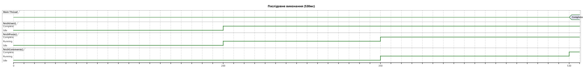
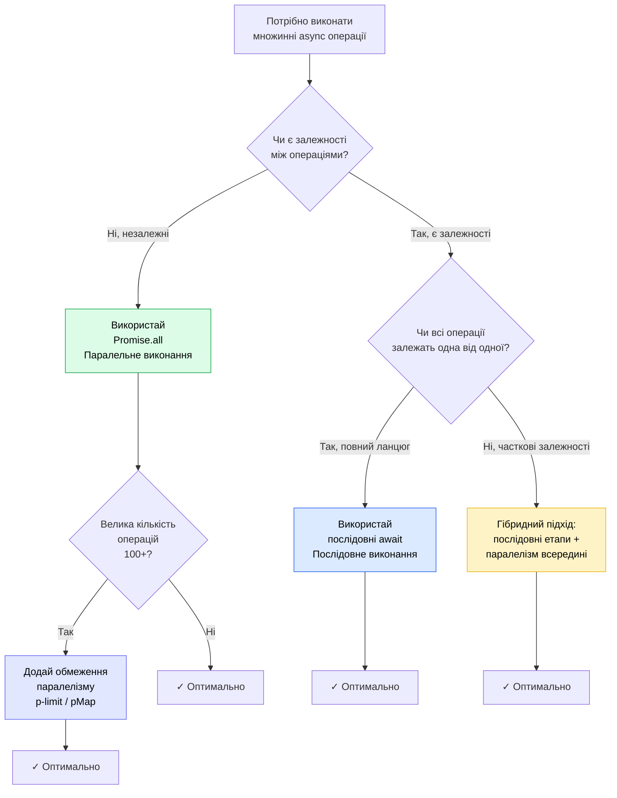

# Паралельне vs послідовне виконання

::card-group

::card{title="🎯 Мета лекції" icon="i-lucide-target"}

- Опанувати різницю між послідовним та паралельним виконанням асинхронних операцій.
- Навчитися визначати, коли операції є незалежними та можуть виконуватися паралельно.
- Дослідити вплив різних стратегій виконання на продуктивність застосунку.
- Оволодіти технікою контрольованого паралелізму з обмеженням кількості одночасних операцій.
- Розібрати типові помилки та антипаттерни при роботі з асинхронними операціями у циклах.
- Навчитися проєктувати оптимальні стратегії виконання для реальних застосунків.

::

::card{title="🔑 Ключові терміни" icon="i-lucide-key"}

- **Послідовне виконання (*sequential execution*):** виконання асинхронних операцій одна за одною, коли кожна наступна операція чекає завершення попередньої.
- **Паралельне виконання (*parallel execution*):** одночасний старт множинних асинхронних операцій, що виконуються конкурентно (*concurrently*).
- **Залежність даних (*data dependency*):** ситуація, коли результат однієї операції необхідний для виконання наступної операції.
- **Обмеження паралелізму (*concurrency limit*):** максимальна кількість операцій, що можуть виконуватися одночасно для запобігання перевантаженню ресурсів.
- **Латентність (*latency*):** час від початку до завершення окремої операції.
- **Пропускна здатність (*throughput*):** кількість операцій, що можуть бути оброблені за одиницю часу.

::

::

## Фундаментальна різниця: послідовність vs паралелізм

Перш ніж занурюватися у технічні деталі, важливо зрозуміти фундаментальну концептуальну різницю між двома стратегіями виконання асинхронного коду.

### Послідовне виконання: один за іншим

При **послідовному виконанні** асинхронні операції запускаються та завершуються строго по черзі. Кожна наступна операція чекає повного завершення попередньої:

```typescript
async function fetchDataSequential(): Promise<void> {
  console.log('Початок:', new Date().toISOString());
  
  const user = await fetchUser(1);        // Операція 1: чекаємо 200мс
  console.log('Користувач завантажено');
  
  const posts = await fetchPosts(1);      // Операція 2: чекаємо 150мс
  console.log('Пости завантажено');
  
  const comments = await fetchComments(1); // Операція 3: чекаємо 180мс
  console.log('Коментарі завантажено');
  
  console.log('Кінець:', new Date().toISOString());
  // Загальний час: 200 + 150 + 180 = 530мс
}
```

**Характеристики послідовного виконання:**
- Операції виконуються **лінійно**, одна за одною.
- Загальний час дорівнює **сумі часів** всіх операцій.
- Простіша логіка та налагодження — чітка послідовність подій.
- Використовується, коли операції **залежать** одна від одної (результат першої потрібен для другої).

### Паралельне виконання: всі разом

При **паралельному виконанні** множинні асинхронні операції стартують одночасно та виконуються конкурентно:

```typescript
async function fetchDataParallel(): Promise<void> {
  console.log('Початок:', new Date().toISOString());
  
  // Всі операції стартують ОДНОЧАСНО
  const [user, posts, comments] = await Promise.all([
    fetchUser(1),      // Операція 1: 200мс
    fetchPosts(1),     // Операція 2: 150мс
    fetchComments(1),  // Операція 3: 180мс
  ]);
  
  console.log('Користувач завантажено');
  console.log('Пости завантажено');
  console.log('Коментарі завантажено');
  console.log('Кінець:', new Date().toISOString());
  // Загальний час: max(200, 150, 180) = 200мс
}
```

**Характеристики паралельного виконання:**
- Операції виконуються **конкурентно** (не блокують одна одну).
- Загальний час дорівнює **максимальному часу найповільнішої операції**.
- Складніша координація, але значно вища продуктивність.
- Використовується, коли операції **незалежні** (не потребують результатів одна одної).

::note
У JavaScript термін «паралельне виконання» насправді означає **конкурентне виконання** (*concurrency*), оскільки код JavaScript виконується в одному потоці. Операції введення/виведення делегуються операційній системі або Thread Pool, а Event Loop координує їх завершення. Справжній паралелізм (*parallelism*) з виконанням у множинних потоках можливий лише через Worker Threads.
::

### Візуалізація різниці у часі виконання

::plant-uml{alt="Порівняння послідовного та паралельного виконання"}



::

::plant-uml{alt="Паралельне виконання через Promise.all()"}

```plantuml
@startuml
skinparam style plain
skinparam backgroundColor #FFFFFF
skinparam defaultFontSize 11

title Паралельне виконання (200мс)

concise "Main Thread" as Par
robust "fetchUser()" as U2
robust "fetchPosts()" as P2
robust "fetchComments()" as C2

@0
Par is {-}
U2 is Idle
P2 is Idle
C2 is Idle

@0
U2 is Running
P2 is Running
C2 is Running
Par is Waiting

@150
P2 is Complete

@180
C2 is Complete

@200
U2 is Complete
Par is Complete

note bottom
  Всі операції стартують одночасно.
  Загальний час = max(200, 150, 180) = 200мс
  Прискорення: 530 / 200 = 2.65x
end note

@enduml
```

::

Як видно з діаграм, паралельне виконання дає **2,65× прискорення** для трьох незалежних операцій.


## Аналіз залежностей: коли використовувати послідовне, а коли паралельне виконання

Ключовим критерієм вибору стратегії виконання є **наявність залежностей між операціями**. Розглянемо детально різні сценарії.

### Сценарій 1: Повна незалежність операцій (паралельне виконання)

Якщо операції **не потребують результатів одна одної**, вони є незалежними та мають виконуватися паралельно:

```typescript
interface UserData {
  profile: any;
  settings: any;
  notifications: any;
}

// ❌ АНТИПАТТЕРН: Послідовне виконання незалежних операцій
async function loadUserDataBad(userId: number): Promise<UserData> {
  const profile = await fetchUserProfile(userId);           // 200мс
  const settings = await fetchUserSettings(userId);         // 150мс
  const notifications = await fetchUserNotifications(userId); // 180мс
  
  return { profile, settings, notifications };
  // Загальний час: 530мс
}

// ✅ ПРАВИЛЬНО: Паралельне виконання
async function loadUserDataGood(userId: number): Promise<UserData> {
  const [profile, settings, notifications] = await Promise.all([
    fetchUserProfile(userId),
    fetchUserSettings(userId),
    fetchUserNotifications(userId),
  ]);
  
  return { profile, settings, notifications };
  // Загальний час: 200мс (прискорення у 2.65x)
}
```

**Критерій незалежності:** жодна операція не використовує результат іншої для своєї роботи. Всі три запити можуть стартувати одразу, оскільки знають `userId` на момент виклику.

### Сценарій 2: Повна залежність операцій (послідовне виконання)

Якщо кожна наступна операція **потребує результату попередньої**, паралелізм неможливий:

```typescript
// ✅ ПРАВИЛЬНО: Послідовне виконання залежних операцій
async function processUserOrder(orderId: number): Promise<void> {
  // Крок 1: Завантажити замовлення
  const order = await fetchOrder(orderId);
  console.log('Замовлення завантажено:', order.id);
  
  // Крок 2: Резервувати товари (потрібен order.items)
  const reservation = await reserveItems(order.items);
  console.log('Товари зарезервовано:', reservation.id);
  
  // Крок 3: Провести оплату (потрібен reservation.amount)
  const payment = await processPayment(reservation.amount, order.userId);
  console.log('Оплату проведено:', payment.transactionId);
  
  // Крок 4: Підтвердити замовлення (потрібен payment.transactionId)
  await confirmOrder(orderId, payment.transactionId);
  console.log('Замовлення підтверджено');
}
```

У цьому прикладі кожен крок **залежить** від результату попереднього:
- `reserveItems()` потребує `order.items` з кроку 1.
- `processPayment()` потребує `reservation.amount` з кроку 2.
- `confirmOrder()` потребує `payment.transactionId` з кроку 3.

Паралелізувати ці операції **неможливо** — це призвело б до логічних помилок.

::warning
Спроба паралелізувати залежні операції призведе до невизначеної поведінки або помилок. Завжди аналізуйте, чи потрібні результати попередніх операцій для виконання наступних. Якщо так — використовуйте послідовне виконання.
::

### Сценарій 3: Часткова залежність (гібридне виконання)

Найчастіший сценарій у реальних застосунках — **комбінація залежних та незалежних операцій**:

```typescript
interface UserDashboard {
  user: any;
  recentActivity: any;
  statistics: any;
  recommendations: any;
  socialData: any;
}

async function loadUserDashboard(userId: number): Promise<UserDashboard> {
  // ====== ЕТАП 1: Завантажити профіль користувача (критична залежність) ======
  const user = await fetchUser(userId);
  
  // ====== ЕТАП 2: Паралельно завантажити ВСІ дані, що залежать від user ======
  const [recentActivity, statistics, recommendations, socialData] = await Promise.all([
    fetchRecentActivity(user.id),           // 180мс
    fetchUserStatistics(user.id),           // 220мс
    fetchRecommendations(user.preferences), // 200мс (залежить від user.preferences)
    fetchSocialData(user.connections),      // 150мс (залежить від user.connections)
  ]);
  
  return {
    user,
    recentActivity,
    statistics,
    recommendations,
    socialData,
  };
  // Загальний час: 200мс (user) + max(180, 220, 200, 150) = 420мс
  // Якби все було послідовно: 200 + 180 + 220 + 200 + 150 = 950мс
  // Прискорення: 2.26x
}
```

**Стратегія гібридного виконання:**
1. Виконати **критично важливі операції** послідовно (завантаження профілю користувача).
2. Групувати **незалежні операції** та виконувати їх паралельно.
3. Якщо є кілька етапів залежностей, розбити на послідовні етапи з паралелізмом всередині кожного.

### Діаграма прийняття рішення: послідовне vs паралельне

::mermaid



::

## Типова помилка: `await` у циклах

Одна з найпоширеніших помилок при роботі з асинхронним кодом — використання `await` всередині циклів, що призводить до ненавмисного **послідовного виконання**:

```typescript
interface User {
  id: number;
  name: string;
}

// ❌ АНТИПАТТЕРН: await у циклі (ДУЖЕ ПОВІЛЬНО!)
async function fetchAllUsersBad(userIds: number[]): Promise<User[]> {
  const users: User[] = [];
  
  for (const id of userIds) {
    const user = await fetchUser(id); // Кожен запит чекає попереднього!
    users.push(user);
  }
  
  return users;
  // Якщо 10 користувачів, кожен запит 200мс → Загальний час: 2000мс
}

// ✅ ПРАВИЛЬНО: Паралельне виконання через Promise.all
async function fetchAllUsersGood(userIds: number[]): Promise<User[]> {
  const userPromises = userIds.map((id) => fetchUser(id));
  const users = await Promise.all(userPromises);
  return users;
  // Всі 10 запитів паралельно → Загальний час: 200мс (прискорення у 10x!)
}

// ✅ АЛЬТЕРНАТИВА: Компактний синтаксис
async function fetchAllUsersCompact(userIds: number[]): Promise<User[]> {
  return Promise.all(userIds.map((id) => fetchUser(id)));
}
```

Різниця у продуктивності є **критичною**:
- Послідовно (await у циклі): 10 користувачів × 200мс = **2000мс**
- Паралельно (Promise.all): max(200мс всіх запитів) = **200мс**
- **Прискорення: 10×**


### Порівняння різних підходів до обробки масивів

Розглянемо детальніше різні патерни роботи з масивами асинхронних операцій:

::code-group

```typescript [❌ Антипаттерн: for...of + await]
async function processItems(items: number[]): Promise<void> {
  for (const item of items) {
    await processItem(item); // ПОСЛІДОВНО!
  }
  // Час: n × itemTime
}
```

```typescript [❌ Антипаттерн: forEach + await]
async function processItems(items: number[]): Promise<void> {
  items.forEach(async (item) => {
    await processItem(item); // НЕ ЧЕКАЄ завершення!
  });
  // Функція повертається ОДРАЗУ, проміси ігноруються
}
```

```typescript [✅ Promise.all + map]
async function processItems(items: number[]): Promise<void> {
  await Promise.all(
    items.map((item) => processItem(item))
  );
  // Час: max(itemTime)
}
```

```typescript [✅ Promise.allSettled + map]
async function processItems(items: number[]): Promise<void> {
  const results = await Promise.allSettled(
    items.map((item) => processItem(item))
  );
  
  // Обробка результатів та помилок
  results.forEach((result, index) => {
    if (result.status === 'rejected') {
      console.error(`Елемент ${index} провалився:`, result.reason);
    }
  });
}
```

```typescript [✅ for...of (коли потрібна послідовність)]
async function processItems(items: number[]): Promise<void> {
  for (const item of items) {
    try {
      await processItem(item); // Послідовно (за потреби)
      console.log(`Елемент ${item} оброблено`);
    } catch (error) {
      console.error(`Помилка обробки ${item}:`, error);
      break; // Зупинити при помилці
    }
  }
}
```

::

::warning
**Критична помилка:** Використання `.forEach()` з `async` callback не чекає завершення промісів! Метод `.forEach()` не розуміє проміси та негайно повертає керування. Для асинхронної обробки масивів завжди використовуйте комбінацію `.map()` з `Promise.all()` або циклом `for...of` з явним `await`.
::

## Обмеження паралелізму: контрольоване виконання

Хоча паралельне виконання покращує продуктивність, **необмежений паралелізм** може призвести до перевантаження:
- Вичерпання пулу підключень до бази даних.
- Rate limiting від зовнішніх API (429 Too Many Requests).
- Перевантаження пам'яті при обробці великих файлів.
- Перевантаження цільового сервера.

Для великих масивів потрібно **обмежити кількість одночасних операцій**:

### Реалізація обмеження паралелізму вручну

```typescript
async function processWithConcurrencyLimit<T, R>(
  items: T[],
  processor: (item: T) => Promise<R>,
  concurrencyLimit: number
): Promise<R[]> {
  const results: R[] = [];
  
  // Розбиваємо масив на пакети (chunks) розміром concurrencyLimit
  for (let i = 0; i < items.length; i += concurrencyLimit) {
    const chunk = items.slice(i, i + concurrencyLimit);
    
    // Обробляємо кожен пакет паралельно
    const chunkResults = await Promise.all(
      chunk.map((item) => processor(item))
    );
    
    results.push(...chunkResults);
    
    console.log(`Оброблено ${Math.min(i + concurrencyLimit, items.length)} з ${items.length}`);
  }
  
  return results;
}

// Використання: обробка 100 користувачів пакетами по 10
const userIds = Array.from({ length: 100 }, (_, i) => i + 1);

await processWithConcurrencyLimit(
  userIds,
  async (userId) => {
    const user = await fetchUser(userId);
    await updateUserMetrics(user);
    return user;
  },
  10 // Максимум 10 паралельних запитів
);
```

### Продвинута реалізація з чергою

Більш ефективний підхід використовує чергу для динамічного запуску нових операцій, як тільки попередні завершуються:

```typescript
class AsyncQueue<T, R> {
  private queue: T[] = [];
  private running = 0;
  private results: R[] = [];
  
  constructor(
    private readonly processor: (item: T) => Promise<R>,
    private readonly concurrencyLimit: number
  ) {}
  
  async addAll(items: T[]): Promise<R[]> {
    this.queue = [...items];
    this.results = [];
    
    // Стартуємо початкові worker'и
    const workers = Array(Math.min(this.concurrencyLimit, items.length))
      .fill(null)
      .map(() => this.worker());
    
    await Promise.all(workers);
    return this.results;
  }
  
  private async worker(): Promise<void> {
    while (this.queue.length > 0) {
      const item = this.queue.shift();
      if (!item) break;
      
      this.running++;
      
      try {
        const result = await this.processor(item);
        this.results.push(result);
      } catch (error) {
        console.error('Помилка обробки елемента:', error);
      } finally {
        this.running--;
      }
    }
  }
  
  getProgress(): { completed: number; total: number; running: number } {
    return {
      completed: this.results.length,
      total: this.results.length + this.queue.length + this.running,
      running: this.running,
    };
  }
}

// Використання
const queue = new AsyncQueue(
  async (userId: number) => {
    console.log(`Обробка користувача ${userId}...`);
    const user = await fetchUser(userId);
    await processUser(user);
    return user;
  },
  5 // Максимум 5 паралельних операцій
);

const userIds = Array.from({ length: 50 }, (_, i) => i + 1);
const results = await queue.addAll(userIds);

console.log(`Оброблено ${results.length} користувачів`);
```

Ця реалізація:
- Динамічно запускає нові операції, як тільки попередні завершуються.
- Підтримує моніторинг прогресу через метод `getProgress()`.
- Обробляє помилки без припинення черги.

::tip
Для продакшн-коду рекомендується використовувати готові бібліотеки:
- **p-limit:** проста функція для обмеження паралелізму.
- **p-queue:** повноцінна черга з пріоритетами та таймаутами.
- **p-map:** асинхронний map з підтримкою обмеження паралелізму.

Ці бібліотеки обробляють граничні випадки, помилки та забезпечують оптимальну продуктивність.
::

### Приклад з бібліотекою p-limit

```typescript
import pLimit from 'p-limit';

// Створюємо обмежувач паралелізму
const limit = pLimit(5); // Максимум 5 одночасних операцій

async function fetchAllUsersWithLimit(userIds: number[]): Promise<any[]> {
  // Обгортаємо кожну операцію у limit()
  const promises = userIds.map((id) =>
    limit(() => fetchUser(id))
  );
  
  return Promise.all(promises);
}

// Використання
const userIds = Array.from({ length: 100 }, (_, i) => i + 1);
const users = await fetchAllUsersWithLimit(userIds);

console.log(`Завантажено ${users.length} користувачів з обмеженням 5 паралельних запитів`);
```

## Реальні сценарії: оптимізація завантаження даних

### Сценарій 1: Завантаження користувачів та їх постів

Класична задача: завантажити список користувачів, а для кожного — його пости.

```typescript
interface User {
  id: number;
  name: string;
}

interface Post {
  id: number;
  title: string;
  userId: number;
}

interface UserWithPosts {
  user: User;
  posts: Post[];
}

// ❌ НАЙГІРШИЙ ВАРІАНТ: Повна послідовність
async function loadUsersWithPostsWorst(userIds: number[]): Promise<UserWithPosts[]> {
  const result: UserWithPosts[] = [];
  
  for (const userId of userIds) {
    const user = await fetchUser(userId);      // ПОСЛІДОВНО!
    const posts = await fetchPosts(userId);    // ПОСЛІДОВНО!
    result.push({ user, posts });
  }
  
  return result;
  // 10 користувачів × (200мс user + 150мс posts) = 3500мс
}

// ❌ ПОГАНИЙ ВАРІАНТ: Паралельні користувачі, послідовні пости
async function loadUsersWithPostsBad(userIds: number[]): Promise<UserWithPosts[]> {
  const users = await Promise.all(userIds.map((id) => fetchUser(id)));
  
  const result: UserWithPosts[] = [];
  for (const user of users) {
    const posts = await fetchPosts(user.id); // ПОСЛІДОВНО!
    result.push({ user, posts });
  }
  
  return result;
  // 200мс (users) + 10 × 150мс (posts) = 1700мс
}

// ✅ ХОРОШИЙ ВАРІАНТ: Повна паралелізація
async function loadUsersWithPostsGood(userIds: number[]): Promise<UserWithPosts[]> {
  const usersWithPosts = await Promise.all(
    userIds.map(async (userId) => {
      const [user, posts] = await Promise.all([
        fetchUser(userId),
        fetchPosts(userId),
      ]);
      return { user, posts };
    })
  );
  
  return usersWithPosts;
  // max(200мс user, 150мс posts) = 200мс
}

// ✅ НАЙКРАЩИЙ ВАРІАНТ: Паралелізація з обмеженням
async function loadUsersWithPostsBest(userIds: number[]): Promise<UserWithPosts[]> {
  const limit = pLimit(10); // Обмеження: 10 паралельних запитів
  
  const usersWithPosts = await Promise.all(
    userIds.map((userId) =>
      limit(async () => {
        const [user, posts] = await Promise.all([
          fetchUser(userId),
          fetchPosts(userId),
        ]);
        return { user, posts };
      })
    )
  );
  
  return usersWithPosts;
  // Баланс між швидкістю та навантаженням на сервер
}
```

**Порівняння продуктивності для 10 користувачів:**

| Варіант | Час виконання | Паралельних запитів | Примітка |
|---------|---------------|---------------------|----------|
| Найгірший | 3500мс | 1 | Повна послідовність |
| Поганий | 1700мс | 10 (users) + 1 (posts) | Часткова паралелізація |
| Хороший | 200мс | 20 (10 users + 10 posts) | Повна паралелізація |
| Найкращий | ~400мс | 10 (контрольовано) | Баланс швидкості та навантаження |


### Сценарій 2: Завантаження файлів з резервних джерел

Стратегія fallback: спробувати завантажити файл з основного джерела, при невдачі — з резервних:

```typescript
// ❌ НЕЕФЕКТИВНО: Послідовні спроби
async function downloadFileSequential(filename: string): Promise<Buffer> {
  const sources = [
    `https://cdn1.example.com/${filename}`,
    `https://cdn2.example.com/${filename}`,
    `https://cdn3.example.com/${filename}`,
    `https://backup.example.com/${filename}`,
  ];
  
  for (const url of sources) {
    try {
      console.log(`Спроба завантажити з ${url}...`);
      const response = await fetch(url);
      if (response.ok) {
        return Buffer.from(await response.arrayBuffer());
      }
    } catch (error) {
      console.warn(`Джерело ${url} недоступне`);
    }
  }
  
  throw new Error('Всі джерела недоступні');
  // Час: 4 × (timeout до помилки) = дуже повільно
}

// ✅ ЕФЕКТИВНО: Promise.any() для першого успішного
async function downloadFileEfficient(filename: string): Promise<Buffer> {
  const sources = [
    `https://cdn1.example.com/${filename}`,
    `https://cdn2.example.com/${filename}`,
    `https://cdn3.example.com/${filename}`,
    `https://backup.example.com/${filename}`,
  ];
  
  const downloadPromises = sources.map(async (url) => {
    const response = await fetch(url);
    if (!response.ok) {
      throw new Error(`HTTP ${response.status}`);
    }
    console.log(`Успішно завантажено з ${url}`);
    return Buffer.from(await response.arrayBuffer());
  });
  
  try {
    return await Promise.any(downloadPromises);
  } catch (error) {
    if (error instanceof AggregateError) {
      console.error('Всі джерела недоступні:');
      error.errors.forEach((err, index) => {
        console.error(`- ${sources[index]}: ${err.message}`);
      });
    }
    throw new Error('Не вдалося завантажити файл');
  }
  // Час: мінімальний серед доступних джерел
}
```

Використання `Promise.any()` гарантує найшвидше завантаження з першого доступного джерела, при цьому всі джерела перевіряються паралельно.

### Сценарій 3: Пакетна обробка із збором статистики

Обробка великого масиву елементів з підрахунком успішних та провалених операцій:

```typescript
interface ProcessingResult {
  successful: number;
  failed: number;
  errors: Array<{ itemId: number; error: string }>;
  duration: number;
}

async function batchProcessItems(
  itemIds: number[],
  concurrencyLimit: number = 10
): Promise<ProcessingResult> {
  const startTime = Date.now();
  const errors: Array<{ itemId: number; error: string }> = [];
  
  const limit = pLimit(concurrencyLimit);
  
  const results = await Promise.allSettled(
    itemIds.map((itemId) =>
      limit(async () => {
        try {
          const item = await fetchItem(itemId);
          await processItem(item);
          return { itemId, success: true };
        } catch (error) {
          errors.push({ itemId, error: (error as Error).message });
          throw error;
        }
      })
    )
  );
  
  const successful = results.filter((r) => r.status === 'fulfilled').length;
  const failed = results.filter((r) => r.status === 'rejected').length;
  const duration = Date.now() - startTime;
  
  return {
    successful,
    failed,
    errors,
    duration,
  };
}

// Використання
const itemIds = Array.from({ length: 500 }, (_, i) => i + 1);

const result = await batchProcessItems(itemIds, 20);

console.log(`
Результати пакетної обробки:
- Успішно: ${result.successful}
- Провалено: ${result.failed}
- Загальний час: ${result.duration}мс
- Швидкість: ${(itemIds.length / (result.duration / 1000)).toFixed(2)} елементів/сек
`);

if (result.errors.length > 0) {
  console.log('\nПомилки:');
  result.errors.forEach(({ itemId, error }) => {
    console.log(`- Елемент ${itemId}: ${error}`);
  });
}
```

## Вимірювання та оптимізація продуктивності

Для обґрунтованого вибору стратегії виконання потрібно **вимірювати реальну продуктивність**:

```typescript
interface BenchmarkResult {
  strategy: string;
  duration: number;
  itemsPerSecond: number;
  speedup: number; // Відносно базового варіанту
}

async function benchmarkStrategies(itemIds: number[]): Promise<void> {
  const results: BenchmarkResult[] = [];
  
  // Стратегія 1: Послідовна обробка (baseline)
  console.log('\n🔄 Тестування послідовної обробки...');
  const start1 = Date.now();
  for (const id of itemIds) {
    await fetchUser(id);
  }
  const duration1 = Date.now() - start1;
  results.push({
    strategy: 'Послідовна (baseline)',
    duration: duration1,
    itemsPerSecond: (itemIds.length / (duration1 / 1000)),
    speedup: 1.0,
  });
  
  // Стратегія 2: Повна паралелізація
  console.log('\n⚡ Тестування повної паралелізації...');
  const start2 = Date.now();
  await Promise.all(itemIds.map((id) => fetchUser(id)));
  const duration2 = Date.now() - start2;
  results.push({
    strategy: 'Повна паралелізація',
    duration: duration2,
    itemsPerSecond: (itemIds.length / (duration2 / 1000)),
    speedup: duration1 / duration2,
  });
  
  // Стратегія 3: Обмежена паралелізація (5)
  console.log('\n🎯 Тестування обмеженої паралелізації (limit=5)...');
  const start3 = Date.now();
  const limit5 = pLimit(5);
  await Promise.all(itemIds.map((id) => limit5(() => fetchUser(id))));
  const duration3 = Date.now() - start3;
  results.push({
    strategy: 'Обмежена паралелізація (5)',
    duration: duration3,
    itemsPerSecond: (itemIds.length / (duration3 / 1000)),
    speedup: duration1 / duration3,
  });
  
  // Стратегія 4: Обмежена паралелізація (10)
  console.log('\n🎯 Тестування обмеженої паралелізації (limit=10)...');
  const start4 = Date.now();
  const limit10 = pLimit(10);
  await Promise.all(itemIds.map((id) => limit10(() => fetchUser(id))));
  const duration4 = Date.now() - start4;
  results.push({
    strategy: 'Обмежена паралелізація (10)',
    duration: duration4,
    itemsPerSecond: (itemIds.length / (duration4 / 1000)),
    speedup: duration1 / duration4,
  });
  
  // Вивід результатів
  console.log('\n📊 Результати бенчмарків:\n');
  console.table(results);
  
  // Виявлення оптимальної стратегії
  const fastest = results.reduce((prev, curr) =>
    curr.duration < prev.duration ? curr : prev
  );
  console.log(`\n🏆 Найшвидша стратегія: ${fastest.strategy}`);
  console.log(`   Прискорення: ${fastest.speedup.toFixed(2)}x`);
}

// Запуск бенчмарків
const testUserIds = Array.from({ length: 50 }, (_, i) => i + 1);
await benchmarkStrategies(testUserIds);

// Приблазні результати:
// ┌─────────┬──────────────────────────────────┬──────────┬──────────────────┬─────────┐
// │ (index) │ strategy                         │ duration │ itemsPerSecond   │ speedup │
// ├─────────┼──────────────────────────────────┼──────────┼──────────────────┼─────────┤
// │ 0       │ 'Послідовна (baseline)'          │ 10000    │ 5.0              │ 1.0     │
// │ 1       │ 'Повна паралелізація'            │ 250      │ 200.0            │ 40.0    │
// │ 2       │ 'Обмежена паралелізація (5)'     │ 2100     │ 23.8             │ 4.76    │
// │ 3       │ 'Обмежена паралелізація (10)'    │ 1200     │ 41.7             │ 8.33    │
// └─────────┴──────────────────────────────────┴──────────┴──────────────────┴─────────┘
```

::note
Результати бенчмарків залежать від:
- **Латентності операцій** (мережеві запити vs локальні обчислення).
- **Обмежень інфраструктури** (пул з'єднань БД, rate limits API).
- **Ресурсів системи** (CPU, пам'ять, мережа).

Завжди вимірюйте продуктивність **у реальних умовах** вашого застосунку, а не покладайтеся лише на теоретичні розрахунки.
::

## Практичні рекомендації та патерни

::steps

### Правило 1: Аналізуйте залежності перед кодуванням

Перед написанням коду накресліть граф залежностей операцій. Це допоможе виявити можливості для паралелізації.

### Правило 2: За замовчуванням паралелізуйте незалежні операції

Якщо операції незалежні, завжди використовуйте `Promise.all()`. Послідовне виконання має бути явним виключенням, а не нормою.

### Правило 3: Обмежуйте паралелізм для великих масивів

Для масивів понад 50-100 елементів використовуйте бібліотеки обмеження паралелізму (`p-limit`, `p-queue`).

### Правило 4: Використовуйте Promise.allSettled() для незалежних операцій з толерантністю до помилок

Коли провал однієї операції не повинен блокувати інші, використовуйте `Promise.allSettled()` замість `Promise.all()`.

### Правило 5: Вимірюйте продуктивність у реальних умовах

Теоретичні розрахунки не враховують обмеження інфраструктури. Завжди проводьте бенчмарки на реальних даних.

### Правило 6: Додавайте моніторинг та метрики

Впровадьте логування часу виконання асинхронних операцій для виявлення вузьких місць у продакшн.

::


## Типові антипаттерни та їх виправлення

### Антипаттерн 1: Необґрунтоване послідовне виконання

```typescript
// ❌ АНТИПАТТЕРН
async function loadPageData(userId: number): Promise<any> {
  const profile = await fetchProfile(userId);
  const settings = await fetchSettings(userId); // Не залежить від profile!
  const stats = await fetchStats(userId);       // Не залежить від settings!
  
  return { profile, settings, stats };
}

// ✅ ВИПРАВЛЕННЯ
async function loadPageData(userId: number): Promise<any> {
  const [profile, settings, stats] = await Promise.all([
    fetchProfile(userId),
    fetchSettings(userId),
    fetchStats(userId),
  ]);
  
  return { profile, settings, stats };
}
```

### Антипаттерн 2: Втрата контролю над помилками у forEach

```typescript
// ❌ АНТИПАТТЕРН: forEach не чекає async функцій
async function notifyUsers(userIds: number[]): Promise<void> {
  userIds.forEach(async (userId) => {
    await sendNotification(userId); // Не чекається!
  });
  console.log('Всі сповіщення надіслано'); // НЕПРАВДА! Виконується одразу
}

// ✅ ВИПРАВЛЕННЯ: Promise.all + map
async function notifyUsers(userIds: number[]): Promise<void> {
  await Promise.all(
    userIds.map((userId) => sendNotification(userId))
  );
  console.log('Всі сповіщення надіслано'); // Тепер правда
}

// ✅ АЛЬТЕРНАТИВА: for...of (якщо потрібна послідовність)
async function notifyUsers(userIds: number[]): Promise<void> {
  for (const userId of userIds) {
    await sendNotification(userId);
    console.log(`Сповіщення для користувача ${userId} надіслано`);
  }
  console.log('Всі сповіщення надіслано');
}
```

### Антипаттерн 3: Створення промісів у циклі без очікування

```typescript
// ❌ АНТИПАТТЕРН: Проміси створюються, але не очікуються
async function updateUsers(users: User[]): Promise<void> {
  const promises = [];
  
  for (const user of users) {
    promises.push(updateUser(user)); // Створюємо проміси
  }
  
  // Забули await Promise.all(promises)!
  console.log('Оновлення завершено'); // НЕПРАВДА!
}

// ✅ ВИПРАВЛЕННЯ
async function updateUsers(users: User[]): Promise<void> {
  const promises = users.map((user) => updateUser(user));
  await Promise.all(promises);
  console.log('Оновлення завершено');
}

// ✅ НАЙКРАЩЕ: Компактний синтаксис
async function updateUsers(users: User[]): Promise<void> {
  await Promise.all(users.map((user) => updateUser(user)));
  console.log('Оновлення завершено');
}
```

### Антипаттерн 4: Ігнорування помилок у паралельних операціях

```typescript
// ❌ АНТИПАТТЕРН: Одна помилка провалює все
async function loadMultipleResources(): Promise<void> {
  const [data1, data2, data3] = await Promise.all([
    fetchCriticalData(),   // Критичні дані
    fetchOptionalData(),   // Опціональні дані
    fetchAds(),            // Реклама (не критична)
  ]);
  // Якщо fetchAds() провалиться, весь Promise.all відхиляється!
}

// ✅ ВИПРАВЛЕННЯ: Розділити критичні та опціональні операції
async function loadMultipleResources(): Promise<void> {
  // Критичні дані (fail-fast)
  const [data1] = await Promise.all([fetchCriticalData()]);
  
  // Опціональні дані (толерантність до помилок)
  const [data2Result, adsResult] = await Promise.allSettled([
    fetchOptionalData(),
    fetchAds(),
  ]);
  
  const data2 = data2Result.status === 'fulfilled' ? data2Result.value : null;
  const ads = adsResult.status === 'fulfilled' ? adsResult.value : null;
  
  return { data1, data2, ads };
}
```

## Моніторинг та профілювання асинхронних операцій

Для виявлення вузьких місць у продакшн потрібен моніторинг часу виконання:

```typescript
class AsyncPerformanceMonitor {
  private metrics = new Map<string, { count: number; totalTime: number; maxTime: number }>();
  
  async measure<T>(
    operationName: string,
    operation: () => Promise<T>
  ): Promise<T> {
    const startTime = Date.now();
    
    try {
      const result = await operation();
      const duration = Date.now() - startTime;
      
      this.recordMetric(operationName, duration);
      
      return result;
    } catch (error) {
      const duration = Date.now() - startTime;
      this.recordMetric(`${operationName}_ERROR`, duration);
      throw error;
    }
  }
  
  private recordMetric(operationName: string, duration: number): void {
    const existing = this.metrics.get(operationName) || {
      count: 0,
      totalTime: 0,
      maxTime: 0,
    };
    
    this.metrics.set(operationName, {
      count: existing.count + 1,
      totalTime: existing.totalTime + duration,
      maxTime: Math.max(existing.maxTime, duration),
    });
  }
  
  getReport(): string {
    const lines = ['=== Звіт продуктивності асинхронних операцій ===\n'];
    
    for (const [name, stats] of this.metrics.entries()) {
      const avgTime = (stats.totalTime / stats.count).toFixed(2);
      lines.push(
        `${name}:\n` +
        `  Кількість викликів: ${stats.count}\n` +
        `  Середній час: ${avgTime}мс\n` +
        `  Максимальний час: ${stats.maxTime}мс\n` +
        `  Загальний час: ${stats.totalTime}мс\n`
      );
    }
    
    return lines.join('\n');
  }
  
  clear(): void {
    this.metrics.clear();
  }
}

// Використання
const monitor = new AsyncPerformanceMonitor();

async function loadUserDashboard(userId: number): Promise<any> {
  const [user, posts, comments] = await Promise.all([
    monitor.measure('fetchUser', () => fetchUser(userId)),
    monitor.measure('fetchPosts', () => fetchPosts(userId)),
    monitor.measure('fetchComments', () => fetchComments(userId)),
  ]);
  
  return { user, posts, comments };
}

// Після кількох викликів
await loadUserDashboard(1);
await loadUserDashboard(2);
await loadUserDashboard(3);

console.log(monitor.getReport());

// Вивід:
// === Звіт продуктивності асинхронних операцій ===
//
// fetchUser:
//   Кількість викликів: 3
//   Середній час: 198.67мс
//   Максимальний час: 205мс
//   Загальний час: 596мс
//
// fetchPosts:
//   Кількість викликів: 3
//   Середній час: 152.33мс
//   Максимальний час: 158мс
//   Загальний час: 457мс
```

## Інтерактивні запитання для самоконтролю

::accordion

::accordion-item{label="❓ Чому await у циклі for...of призводить до послідовного виконання?" icon="i-lucide-help-circle"}

Оператор `await` **призупиняє виконання** функції до завершення промісу. У циклі `for...of` кожна ітерація чекає завершення попередньої через `await`, що робить виконання **строго послідовним**.

```typescript
for (const id of [1, 2, 3]) {
  await fetchUser(id); // Чекає завершення перед наступною ітерацією
}
```

Для паралельного виконання потрібно **спочатку створити всі проміси**, а потім очікувати їх разом через `Promise.all()`:

```typescript
await Promise.all([1, 2, 3].map((id) => fetchUser(id)));
```

::

::accordion-item{label="❓ Що станеться, якщо використати forEach з async callback?" icon="i-lucide-help-circle"}

Метод `.forEach()` **не розуміє проміси** та не чекає їх завершення. Він викликає callback для кожного елемента синхронно та негайно повертає керування. Async callback всередині `.forEach()` створює проміси, але вони **ігноруються**.

```typescript
// ❌ ПОМИЛКА
await items.forEach(async (item) => {
  await processItem(item); // Проміси створюються, але не очікуються!
});
console.log('Завершено'); // Виконується ОДРАЗУ, не чекаючи processItem
```

Для асинхронної обробки масивів використовуйте `.map()` з `Promise.all()` або цикл `for...of` з явним `await`.

::

::accordion-item{label="❓ Коли варто обмежувати паралелізм замість необмеженого Promise.all()?" icon="i-lucide-help-circle"}

Обмеження паралелізму необхідне у таких випадках:

1. **Великі масиви даних** (100+ елементів) — необмежений паралелізм може вичерпати пам'ять або мережеві ресурси.
2. **Обмеження сторонніх API** — багато API мають rate limits (наприклад, 10 запитів/сек).
3. **Пул з'єднань БД** — кількість одночасних підключень обмежена (типово 10-100).
4. **Захист цільових серверів** — масовані паралельні запити можуть перевантажити сервер.

**Правило:** для масивів понад 50-100 елементів завжди використовуйте обмеження паралелізму (бібліотеки `p-limit`, `p-queue` або власну реалізацію).

::

::accordion-item{label="❓ Яка різниця між Promise.all() та Promise.allSettled() у контексті паралельного виконання?" icon="i-lucide-help-circle"}

Обидва комбінатори виконують операції **паралельно** та чекають завершення всіх. Різниця у **обробці помилок**:

**Promise.all()** — **fail-fast стратегія:**
- Відхиляється при **першій** помилці.
- Інші операції продовжують виконання у фоні, але їх результати **ігноруються**.
- Використовуйте, коли всі операції **критичні** (провал однієї = провал всього).

**Promise.allSettled()** — **толерантність до помилок:**
- **Ніколи не відхиляється**.
- Повертає масив з інформацією про статус кожної операції (`fulfilled` або `rejected`).
- Використовуйте, коли операції **незалежні** та потрібна інформація про всі результати.

::

::accordion-item{label="❓ Чи справді JavaScript виконує операції паралельно, якщо він однопотоковий?" icon="i-lucide-help-circle"}

JavaScript виконується в **одному потоці**, але це не означає відсутність паралелізму. Розрізняють два типи паралелізму:

**Конкурентність (*concurrency*)** — множинні операції виконуються **перемежовано**:
- JavaScript код виконується у одному потоці.
- Операції введення/виведення (мережа, файли) делегуються **ОС або Thread Pool**.
- Event Loop координує завершення цих операцій.
- `Promise.all()` створює **конкурентність** — операції не блокують одна одну.

**Паралелізм (*parallelism*)** — множинні операції виконуються **одночасно на різних ядрах CPU**:
- У JavaScript досягається через **Worker Threads** (Node.js) або **Web Workers** (браузер).
- Кожен worker має власний потік виконання та ізольовану пам'ять.

Термін «паралельне виконання» у контексті `Promise.all()` означає **конкурентність**, а не справжній паралелізм.

::

::

## Підсумок та ключові висновки

У цій лекції ми детально розглянули різницю між послідовним та паралельним виконанням асинхронних операцій:

::card-group

::card{title="🔗 Послідовне виконання" icon="i-lucide-git-commit"}

**Характеристики:**
- Операції виконуються одна за одною.
- Час = сума часів всіх операцій.
- Простіша логіка та налагодження.

**Коли використовувати:**
- Операції мають залежності даних.
- Потрібен строгий порядок виконання.
- Обробка помилок для кожного кроку окремо.

**Реалізація:**
```typescript
const a = await step1();
const b = await step2(a);
const c = await step3(b);
```

::

::card{title="⚡ Паралельне виконання" icon="i-lucide-zap"}

**Характеристики:**
- Операції стартують одночасно.
- Час = max(час найповільнішої операції).
- Значне покращення продуктивності.

**Коли використовувати:**
- Операції незалежні (не потребують результатів одна одної).
- Множинні мережеві запити або операції введення/виведення.
- Обробка масивів даних.

**Реалізація:**
```typescript
const [a, b, c] = await Promise.all([
  step1(),
  step2(),
  step3(),
]);
```

::

::card{title="🎯 Обмежений паралелізм" icon="i-lucide-gauge"}

**Характеристики:**
- Контрольована кількість одночасних операцій.
- Баланс між швидкістю та навантаженням.
- Запобігання перевантаженню ресурсів.

**Коли використовувати:**
- Великі масиви (100+ елементів).
- API з rate limits.
- Обмежені пули підключень.

**Реалізація:**
```typescript
const limit = pLimit(10);
await Promise.all(
  items.map((item) =>
    limit(() => process(item))
  )
);
```

::

::card{title="🔀 Гібридне виконання" icon="i-lucide-workflow"}

**Характеристики:**
- Комбінація послідовних етапів та паралелізму.
- Оптимальний баланс для складних сценаріїв.
- Враховує залежності даних.

**Коли використовувати:**
- Часткові залежності між операціями.
- Критичні та опціональні дані разом.
- Багатоетапна обробка.

**Реалізація:**
```typescript
const user = await fetchUser(id);
const [posts, comments] = await Promise.all([
  fetchPosts(user.id),
  fetchComments(user.id),
]);
```

::

::

## Додаткові ресурси

::card-group

::card{title="📚 Бібліотеки" icon="i-lucide-package"}

- [p-limit](https://github.com/sindresorhus/p-limit) — Обмеження паралелізму
- [p-queue](https://github.com/sindresorhus/p-queue) — Черга з пріоритетами
- [p-map](https://github.com/sindresorhus/p-map) — Async map з concurrency
- [async](https://github.com/caolan/async) — Комплексна бібліотека для async flow control

::

::card{title="🎓 Поглиблене вивчення" icon="i-lucide-graduation-cap"}

- [MDN: Using Promises](https://developer.mozilla.org/en-US/docs/Web/JavaScript/Guide/Using_promises)
- [Node.js Best Practices: Async Patterns](https://github.com/goldbergyoni/nodebestpractices)
- [JavaScript.info: Promise API](https://javascript.info/promise-api)
- [Understanding Concurrency vs Parallelism](https://stackoverflow.com/questions/1050222)

::

::

---

**Наступна лекція:** [Event Emitter та події →](./07.event-emitter)
