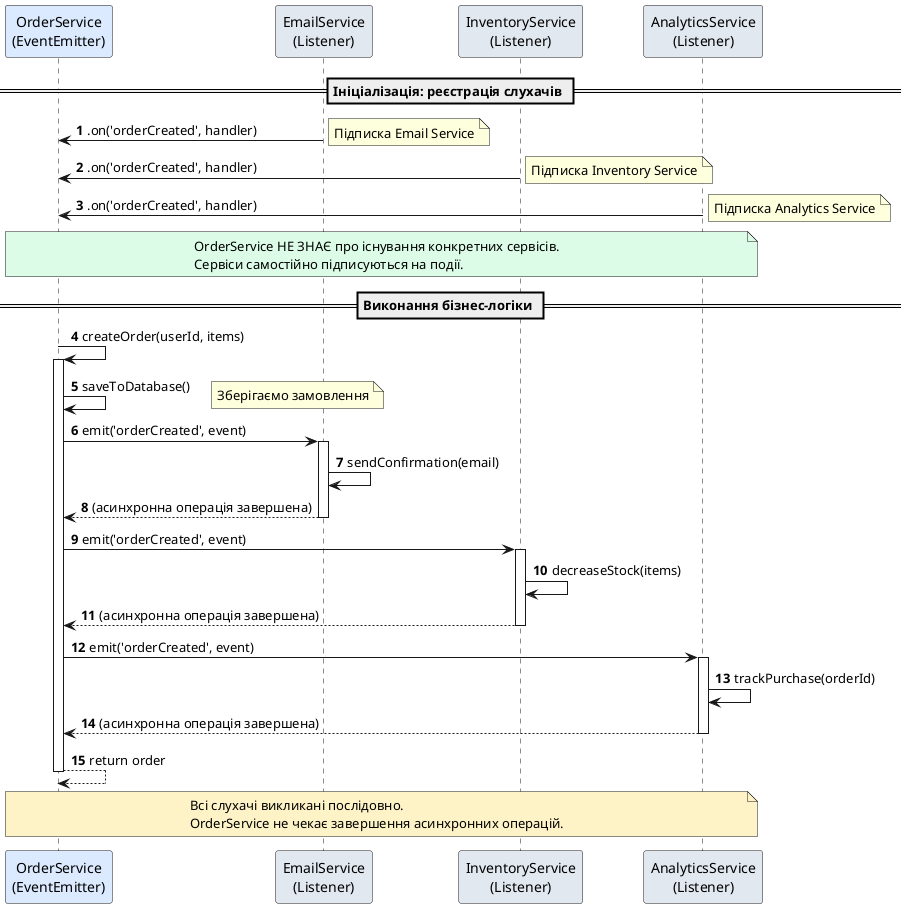

# EventEmitter — подієва модель Node.js

::card-group

::card{title="🎯 Мета лекції" icon="i-lucide-target"}

- Опанувати патерн проєктування **Observer** (*Спостерігач*) та його реалізацію у Node.js через клас `EventEmitter`.
- Навчитися створювати власні подієві архітектури для слабкого зв'язування (*loose coupling*) компонентів системи.
- Зрозуміти життєвий цикл подій: підписка, генерація, передача даних та відписка.
- Дослідити вбудовані EventEmitter у Node.js API: Stream, HTTP Server, Child Process.
- Розрізняти сценарії використання EventEmitter та Promise для асинхронних операцій.

::

::card{title="🔑 Ключові терміни" icon="i-lucide-key"}

- **EventEmitter (*генератор подій*):** клас у Node.js, що реалізує патерн Observer для обробки асинхронних подій.
- **Event (*подія*):** іменоване повідомлення про зміну стану або завершення операції.
- **Listener (*слухач*):** функція зворотного виклику (*callback*), що виконується при виникненні події.
- **emit (*генерувати подію*):** метод для виклику всіх зареєстрованих слухачів події з передачею даних.
- **Loose coupling (*слабке зв'язування*):** принцип архітектури, коли компоненти системи взаємодіють через події, не залежачи від конкретних реалізацій один одного.

::

::

## Архітектурний контекст: проблема прямої взаємодії компонентів

У попередніх лекціях ми розглядали асинхронні операції, що мають чітко визначений момент завершення: Promise вирішується один раз, async/await функція повертає результат один раз. Проте багато реальних систем працюють з **потоками подій**, що відбуваються багаторазово у непередбачувані моменти часу:

- Користувач клікає кнопку на веб-сторінці (подія може статися 0, 1 або 100 разів).
- Сервер приймає нове TCP-з'єднання (події надходять постійно під час роботи).
- Файловий монітор виявляє зміну файлу (події генеруються при кожній модифікації).
- Таймер спрацьовує кожні N мілісекунд (періодична подія).

Традиційний підхід до обробки таких сценаріїв через прямі виклики функцій призводить до щільного зв'язування (*tight coupling*) компонентів. Розглянемо приклад системи обробки замовлень:

```typescript
// ❌ АНТИПАТТЕРН: Щільне зв'язування компонентів
class OrderService {
  private emailService: EmailService;
  private inventoryService: InventoryService;
  private analyticsService: AnalyticsService;

  constructor(
    emailService: EmailService,
    inventoryService: InventoryService,
    analyticsService: AnalyticsService
  ) {
    this.emailService = emailService;
    this.inventoryService = inventoryService;
    this.analyticsService = analyticsService;
  }

  async createOrder(userId: string, items: OrderItem[]): Promise<Order> {
    const order = await this.saveToDatabase(userId, items);
    
    // OrderService ЗНАЄ про всі залежності та викликає їх безпосередньо
    await this.emailService.sendConfirmation(userId, order);
    await this.inventoryService.decreaseStock(items);
    await this.analyticsService.trackPurchase(order);
    
    return order;
  }
}
```

Проблеми такої архітектури:

1. **Жорсткі залежності:** `OrderService` повинен знати про існування `EmailService`, `InventoryService` та `AnalyticsService`. Додавання нового сервісу (наприклад, `LoyaltyProgramService`) вимагає модифікації `OrderService`.

2. **Блокуюче виконання:** Якщо `emailService.sendConfirmation()` триває 2 секунди, користувач чекає завершення створення замовлення протягом цього часу, хоча електронний лист не є критичною частиною транзакції.

3. **Складність тестування:** Для unit-тестування `OrderService` потрібно створювати моки всіх трьох залежностей.

4. **Відсутність розширюваності:** Неможливо динамічно додати нові обробники замовлень без модифікації основного коду.

Патерн **Observer** через `EventEmitter` вирішує ці проблеми, дозволяючи компонентам взаємодіяти через події без прямих посилань один на одного:

```typescript
// ✅ ПРАВИЛЬНО: Слабке зв'язування через події
import { EventEmitter } from 'node:events';

interface OrderCreatedEvent {
  orderId: string;
  userId: string;
  items: OrderItem[];
  total: number;
}

class OrderService extends EventEmitter {
  async createOrder(userId: string, items: OrderItem[]): Promise<Order> {
    const order = await this.saveToDatabase(userId, items);
    
    // Генеруємо подію — OrderService не знає, хто її обробить
    this.emit('orderCreated', {
      orderId: order.id,
      userId,
      items,
      total: order.total
    });
    
    return order;
  }
}

// Окремі сервіси ПІДПИСУЮТЬСЯ на події незалежно
const orderService = new OrderService();

orderService.on('orderCreated', async (event: OrderCreatedEvent) => {
  await emailService.sendConfirmation(event.userId, event.orderId);
});

orderService.on('orderCreated', async (event: OrderCreatedEvent) => {
  await inventoryService.decreaseStock(event.items);
});

orderService.on('orderCreated', async (event: OrderCreatedEvent) => {
  await analyticsService.trackPurchase(event);
});

// Додавання нового обробника не вимагає змін у OrderService
orderService.on('orderCreated', async (event: OrderCreatedEvent) => {
  await loyaltyProgramService.addPoints(event.userId, event.total);
});
```

Тепер `OrderService` не залежить від конкретних реалізацій сервісів — він просто повідомляє про створення замовлення через подію. Будь-який модуль може підписатися на цю подію та виконати власну логіку.

::note
Патерн Observer є одним із фундаментальних патернів проєктування (*Gang of Four Design Patterns*). Він визначає залежність «один-до-багатьох» між об'єктами: коли стан одного об'єкта змінюється, всі його залежні об'єкти повідомляються автоматично.
::

## Клас EventEmitter: основи роботи з подіями

Клас `EventEmitter` є частиною стандартного модуля `events` у Node.js та надає API для реалізації подієвої моделі:

```typescript
import { EventEmitter } from 'node:events';

const emitter = new EventEmitter();

// Підписка на подію 'data'
emitter.on('data', (message: string) => {
  console.log('Отримано повідомлення:', message);
});

// Генерація події 'data' з передачею даних
emitter.emit('data', 'Hello, EventEmitter!');
// Вивід: Отримано повідомлення: Hello, EventEmitter!

emitter.emit('data', 'Друге повідомлення');
// Вивід: Отримано повідомлення: Друге повідомлення
```

Ключові методи API:

### on(eventName, listener): підписка на подію

Реєструє слухача (*listener*), який буде викликатися **кожного разу**, коли подія генерується:

```typescript
import { EventEmitter } from 'node:events';

const emitter = new EventEmitter();

function handleConnection(clientId: string): void {
  console.log(`Клієнт підключився: ${clientId}`);
}

emitter.on('connection', handleConnection);

emitter.emit('connection', 'client-001'); // Вивід: Клієнт підключився: client-001
emitter.emit('connection', 'client-002'); // Вивід: Клієнт підключився: client-002
emitter.emit('connection', 'client-003'); // Вивід: Клієнт підключився: client-003
```

Можна додати кілька слухачів для однієї події — вони викликаються у порядку реєстрації:

```typescript
emitter.on('message', (text: string) => {
  console.log('Обробник 1:', text);
});

emitter.on('message', (text: string) => {
  console.log('Обробник 2:', text);
});

emitter.emit('message', 'Тестове повідомлення');
// Вивід:
// Обробник 1: Тестове повідомлення
// Обробник 2: Тестове повідомлення
```

::tip
Метод `on()` має синонім `addListener()` — обидва методи працюють ідентично. У сучасному коді прийнято використовувати `on()` як більш лаконічну форму.
::

### once(eventName, listener): одноразова підписка

Реєструє слухача, який виконається **лише один раз**, після чого автоматично відписується:

```typescript
import { EventEmitter } from 'node:events';

const emitter = new EventEmitter();

emitter.once('startup', () => {
  console.log('Сервер ініціалізовано');
});

emitter.emit('startup'); // Вивід: Сервер ініціалізовано
emitter.emit('startup'); // Нічого не виведе — слухач вже відпрацював
emitter.emit('startup'); // Нічого не виведе
```

Це корисно для обробки подій, що мають статися один раз (завершення запуску, перше з'єднання, завантаження конфігурації):

```typescript
import { EventEmitter } from 'node:events';
import { createServer } from 'node:http';

const serverEvents = new EventEmitter();

serverEvents.once('firstRequest', () => {
  console.log('Перший HTTP-запит оброблено. Система прогріта.');
});

const server = createServer((req, res) => {
  serverEvents.emit('firstRequest');
  res.end('OK');
});

server.listen(3000);
```

### emit(eventName, ...args): генерація події

Викликає всі зареєстровані слухачі події у порядку їх додавання, передаючи їм аргументи:

```typescript
import { EventEmitter } from 'node:events';

const emitter = new EventEmitter();

emitter.on('userRegistered', (userId: string, email: string, timestamp: Date) => {
  console.log(`Користувач ${userId} зареєстрований`);
  console.log(`Email: ${email}`);
  console.log(`Час: ${timestamp.toISOString()}`);
});

emitter.emit('userRegistered', 'user-42', 'user@example.com', new Date());
// Вивід:
// Користувач user-42 зареєстрований
// Email: user@example.com
// Час: 2026-09-03T10:30:00.000Z
```

Метод `emit()` повертає `true`, якщо подія мала слухачів, та `false`, якщо жоден слухач не був зареєстрований:

```typescript
const emitter = new EventEmitter();

const hasListeners = emitter.emit('unknownEvent', 'data');
console.log('Подія мала слухачів:', hasListeners); // false

emitter.on('knownEvent', () => {});
const hasListeners2 = emitter.emit('knownEvent');
console.log('Подія мала слухачів:', hasListeners2); // true
```

::warning
Слухачі викликаються **синхронно** у порядку їх реєстрації. Якщо слухач виконує блокуючу операцію (важкі обчислення), він заблокує Event Loop до завершення. Для асинхронних операцій використовуйте `async` функції, але пам'ятайте, що `emit()` не чекає їх завершення.
::

### off(eventName, listener): відписка від події

Видаляє конкретний слухач з події:

```typescript
import { EventEmitter } from 'node:events';

const emitter = new EventEmitter();

function handleData(data: string): void {
  console.log('Дані:', data);
}

emitter.on('data', handleData);

emitter.emit('data', 'Перше повідомлення'); // Вивід: Дані: Перше повідомлення

// Відписуємось від події
emitter.off('data', handleData);

emitter.emit('data', 'Друге повідомлення'); // Нічого не виведе
```

::note
Для відписки необхідно передати **ту ж саму функцію**, що була зареєстрована через `on()`. Анонімні функції відписати неможливо, оскільки немає посилання на них. Метод `off()` є синонімом `removeListener()`.
::

### removeAllListeners(eventName?): видалення всіх слухачів

Видаляє всіх слухачів конкретної події або всіх подій (якщо аргумент не вказано):

```typescript
import { EventEmitter } from 'node:events';

const emitter = new EventEmitter();

emitter.on('log', () => console.log('Логер 1'));
emitter.on('log', () => console.log('Логер 2'));
emitter.on('error', () => console.error('Помилка'));

emitter.emit('log'); // Виведе: Логер 1, Логер 2

// Видаляємо всіх слухачів події 'log'
emitter.removeAllListeners('log');

emitter.emit('log'); // Нічого не виведе
emitter.emit('error'); // Виведе: Помилка (слухачі 'error' не видалено)

// Видаляємо всіх слухачів всіх подій
emitter.removeAllListeners();

emitter.emit('error'); // Нічого не виведе
```

::caution
Виклик `removeAllListeners()` без аргументів видаляє **всіх слухачів усіх подій**, включаючи системну подію `error`. Це може призвести до неконтрольованих помилок. Використовуйте цей метод обережно, переважно для очищення ресурсів при завершенні роботи об'єкта.
::


## Створення власних класів з підтримкою подій

Найпотужніший спосіб використання `EventEmitter` — створення власних класів, що успадковують його функціональність. Це дозволяє інкапсулювати бізнес-логіку та надати подієвий API для зовнішніх споживачів.

### Приклад: система логування з подіями

```typescript
import { EventEmitter } from 'node:events';
import { writeFile } from 'node:fs/promises';
import { join } from 'node:path';

type LogLevel = 'info' | 'warn' | 'error';

interface LogEntry {
  level: LogLevel;
  message: string;
  timestamp: Date;
  metadata?: Record<string, unknown>;
}

class Logger extends EventEmitter {
  private logs: LogEntry[] = [];

  log(level: LogLevel, message: string, metadata?: Record<string, unknown>): void {
    const entry: LogEntry = {
      level,
      message,
      timestamp: new Date(),
      metadata
    };

    this.logs.push(entry);

    // Генеруємо загальну подію 'log'
    this.emit('log', entry);

    // Генеруємо подію для конкретного рівня
    this.emit(level, entry);

    // Для критичних помилок генеруємо окрему подію
    if (level === 'error') {
      this.emit('critical', entry);
    }
  }

  info(message: string, metadata?: Record<string, unknown>): void {
    this.log('info', message, metadata);
  }

  warn(message: string, metadata?: Record<string, unknown>): void {
    this.log('warn', message, metadata);
  }

  error(message: string, metadata?: Record<string, unknown>): void {
    this.log('error', message, metadata);
  }

  async flush(): Promise<void> {
    const filepath = join(process.cwd(), 'logs', `app-${Date.now()}.log`);
    const content = JSON.stringify(this.logs, null, 2);
    
    await writeFile(filepath, content, 'utf-8');
    
    this.emit('flushed', { filepath, count: this.logs.length });
    this.logs = [];
  }

  getStats(): { total: number; byLevel: Record<LogLevel, number> } {
    const byLevel: Record<LogLevel, number> = {
      info: 0,
      warn: 0,
      error: 0
    };

    for (const log of this.logs) {
      byLevel[log.level]++;
    }

    return {
      total: this.logs.length,
      byLevel
    };
  }
}

// Використання власного Logger з підпискою на події
const logger = new Logger();

// Підписуємось на всі логи для виводу у консоль
logger.on('log', (entry: LogEntry) => {
  const timestamp = entry.timestamp.toISOString();
  console.log(`[${timestamp}] ${entry.level.toUpperCase()}: ${entry.message}`);
});

// Підписуємось на критичні помилки для сповіщень
logger.on('critical', async (entry: LogEntry) => {
  console.error('🚨 КРИТИЧНА ПОМИЛКА:', entry.message);
  // Тут можна відправити сповіщення у Slack, PagerDuty тощо
});

// Підписуємось на збереження логів
logger.on('flushed', ({ filepath, count }) => {
  console.log(`✅ Збережено ${count} логів у ${filepath}`);
});

// Генерація логів
logger.info('Сервер запущено', { port: 3000 });
logger.warn('Високе навантаження CPU', { usage: 87 });
logger.error('Помилка з\'єднання з базою даних', { code: 'ECONNREFUSED' });

// Збереження логів у файл
logger.flush().catch(console.error);
```

Вивід у консоль:

```
[2026-09-03T10:30:00.000Z] INFO: Сервер запущено
[2026-09-03T10:30:05.000Z] WARN: Високе навантаження CPU
[2026-09-03T10:30:07.000Z] ERROR: Помилка з'єднання з базою даних
🚨 КРИТИЧНА ПОМИЛКА: Помилка з'єднання з базою даних
✅ Збережено 3 логів у /path/to/logs/app-1725358207000.log
```

Цей підхід дозволяє зовнішнім модулям підписуватися на події логування без модифікації класу `Logger`. Додавання нового обробника (наприклад, відправка метрик у Prometheus) не вимагає змін у основному коді.

::tip
При проєктуванні подієвого API дотримуйтесь правила: **генеруйте події для значущих змін стану, а не для кожної операції**. Надмірна кількість подій ускладнює розуміння життєвого циклу об'єкта. Для прикладу Logger: події `log`, `critical` та `flushed` є значущими, але подія `getStats` була б надмірною.
::

## Обробка помилок: спеціальна подія 'error'

Подія `error` має особливий статус у Node.js: якщо EventEmitter генерує цю подію, але жоден слухач не зареєстрований, Node.js **викидає виняток та аварійно завершує процес**.

### Демонстрація проблеми

```typescript
import { EventEmitter } from 'node:events';

const emitter = new EventEmitter();

// ❌ АНТИПАТТЕРН: Генерація 'error' без слухачів
emitter.emit('error', new Error('Щось пішло не так'));

// Процес Node.js завершиться з кодом виходу 1:
// Error: Щось пішло не так
//     at Object.<anonymous> (...)
// Emitted 'error' event on EventEmitter instance at: ...
```

Цей механізм існує для попередження мовчазних відмов: помилки повинні бути явно оброблені, інакше система не повинна продовжувати роботу.

### Правильна обробка помилок

```typescript
import { EventEmitter } from 'node:events';

const emitter = new EventEmitter();

// ✅ ПРАВИЛЬНО: Завжди реєструйте обробник 'error'
emitter.on('error', (error: Error) => {
  console.error('Виникла помилка:', error.message);
  console.error('Stack trace:', error.stack);
  
  // Тут можна додати логування, сповіщення, fallback-логіку
});

emitter.emit('error', new Error('Щось пішло не так'));
// Процес продовжить роботу, помилка оброблена
```

Практичний приклад: обробка помилок у користувацькому класі:

```typescript
import { EventEmitter } from 'node:events';

class DatabaseConnection extends EventEmitter {
  private reconnectAttempts = 0;
  private maxReconnectAttempts = 5;

  async connect(): Promise<void> {
    try {
      // Імітація підключення до бази даних
      await this.performConnection();
      
      this.emit('connected');
      this.reconnectAttempts = 0;
    } catch (error) {
      this.reconnectAttempts++;

      // Генеруємо подію 'error' з об'єктом помилки
      this.emit('error', error);

      if (this.reconnectAttempts < this.maxReconnectAttempts) {
        console.log(`Спроба перепідключення ${this.reconnectAttempts}/${this.maxReconnectAttempts}`);
        
        setTimeout(() => {
          this.connect();
        }, 1000 * this.reconnectAttempts); // Exponential backoff
      } else {
        this.emit('error', new Error('Максимальну кількість спроб перепідключення вичерпано'));
      }
    }
  }

  private async performConnection(): Promise<void> {
    // Імітація з'єднання з можливою помилкою
    if (Math.random() < 0.7) {
      throw new Error('ECONNREFUSED: Connection refused');
    }
  }
}

const db = new DatabaseConnection();

// Обов'язково реєструємо обробник помилок
db.on('error', (error: Error) => {
  console.error('Помилка бази даних:', error.message);
});

db.on('connected', () => {
  console.log('✅ З\'єднання з базою даних встановлено');
});

db.connect();
```

::caution
**Критично важливо**: Завжди реєструйте обробник події `error` для всіх екземплярів EventEmitter у продакшн-коді. Необроблена помилка призведе до аварійного завершення процесу та downtime сервісу.
::

## Передача даних через події: типізовані події у TypeScript

При роботі з TypeScript рекомендується створювати типізовані інтерфейси для подій, щоб забезпечити безпеку типів та автодоповнення у IDE:

```typescript
import { EventEmitter } from 'node:events';

// Визначаємо типи подій та їх аргументів
interface ServerEvents {
  'request': (method: string, url: string, timestamp: Date) => void;
  'response': (statusCode: number, duration: number) => void;
  'error': (error: Error, context: { method: string; url: string }) => void;
  'shutdown': () => void;
}

// Розширюємо EventEmitter з типізацією
class TypedEventEmitter<T extends Record<string, (...args: any[]) => void>> {
  private emitter = new EventEmitter();

  on<K extends keyof T>(event: K, listener: T[K]): this {
    this.emitter.on(event as string, listener as (...args: any[]) => void);
    return this;
  }

  once<K extends keyof T>(event: K, listener: T[K]): this {
    this.emitter.once(event as string, listener as (...args: any[]) => void);
    return this;
  }

  emit<K extends keyof T>(event: K, ...args: Parameters<T[K]>): boolean {
    return this.emitter.emit(event as string, ...args);
  }

  off<K extends keyof T>(event: K, listener: T[K]): this {
    this.emitter.off(event as string, listener as (...args: any[]) => void);
    return this;
  }
}

// Використання типізованого EventEmitter
const server = new TypedEventEmitter<ServerEvents>();

// ✅ TypeScript перевіряє типи аргументів
server.on('request', (method, url, timestamp) => {
  // method: string, url: string, timestamp: Date
  console.log(`${method} ${url} — ${timestamp.toISOString()}`);
});

server.on('response', (statusCode, duration) => {
  // statusCode: number, duration: number
  console.log(`Відповідь: ${statusCode} (${duration}ms)`);
});

server.on('error', (error, context) => {
  // error: Error, context: { method: string; url: string }
  console.error(`Помилка: ${error.message}`, context);
});

// TypeScript попереджає про невірні типи аргументів
server.emit('request', 'GET', '/api/users', new Date());
server.emit('response', 200, 45);
server.emit('error', new Error('Internal Server Error'), { method: 'POST', url: '/api/orders' });

// ❌ TypeScript помилка: Argument of type 'number' is not assignable to parameter of type 'string'
// server.emit('request', 123, '/api/users', new Date());
```

Такий підхід забезпечує **compile-time** безпеку типів та зменшує ймовірність помилок під час рефакторингу коду.

::note
У бібліотеках `typed-emitter` або `eventemitter3` є готові реалізації типізованих EventEmitter з розширеним функціоналом. Проте для більшості проєктів достатньо базового класу EventEmitter із TypeScript інтерфейсами.
::

## Візуалізація: життєвий цикл подій у EventEmitter

Розглянемо діаграму послідовності, що ілюструє взаємодію компонентів через події:

::plant-uml{alt="Життєвий цикл подій у EventEmitter"}



::

Як видно з діаграми, `OrderService` не має прямих посилань на інші сервіси — він лише генерує подію. Сервіси самостійно підписуються на неї під час ініціалізації системи, що забезпечує слабке зв'язування та гнучкість архітектури.

## EventEmitter у Node.js API: вбудовані реалізації

Багато стандартних модулів Node.js успадковують від `EventEmitter` та генерують події для різних стадій життєвого циклу:

### HTTP Server

```typescript
import { createServer } from 'node:http';

const server = createServer((req, res) => {
  res.end('OK');
});

// HTTP Server є EventEmitter
server.on('request', (req, res) => {
  console.log(`Запит: ${req.method} ${req.url}`);
});

server.on('connection', (socket) => {
  console.log('Нове TCP-з\'єднання встановлено');
});

server.on('close', () => {
  console.log('Сервер зупинено');
});

server.on('error', (error) => {
  console.error('Помилка сервера:', error);
});

server.listen(3000, () => {
  console.log('Сервер слухає на порту 3000');
});
```

### Readable Stream

```typescript
import { createReadStream } from 'node:fs';

const stream = createReadStream('./large-file.txt');

// Readable Stream є EventEmitter
stream.on('data', (chunk: Buffer) => {
  console.log(`Отримано chunk розміром ${chunk.length} байт`);
});

stream.on('end', () => {
  console.log('Читання завершено');
});

stream.on('error', (error) => {
  console.error('Помилка читання:', error);
});

stream.on('close', () => {
  console.log('Стрім закрито');
});
```

### Child Process

```typescript
import { spawn } from 'node:child_process';

const child = spawn('ls', ['-lah', '/usr']);

// Child Process є EventEmitter
child.stdout.on('data', (data: Buffer) => {
  console.log(`stdout: ${data}`);
});

child.stderr.on('data', (data: Buffer) => {
  console.error(`stderr: ${data}`);
});

child.on('close', (code: number) => {
  console.log(`Процес завершився з кодом ${code}`);
});

child.on('error', (error: Error) => {
  console.error('Помилка запуску процесу:', error);
});
```

::tip
Коли ви працюєте з Node.js API, завжди перевіряйте документацію на предмет подій, що генеруються. Більшість модулів для введення/виведення, мережевих з'єднань та процесів є екземплярами EventEmitter.
::


## Порівняння EventEmitter та Promise: коли що використовувати

EventEmitter та Promise є двома фундаментальними механізмами асинхронності у Node.js, але вони призначені для різних сценаріїв:

::code-group

```typescript [EventEmitter: багаторазові події]
import { EventEmitter } from 'node:events';

class FileWatcher extends EventEmitter {
  watch(filepath: string): void {
    // Симуляція моніторингу файлу
    setInterval(() => {
      const hasChanged = Math.random() > 0.7;
      
      if (hasChanged) {
        // Подія може генеруватися 0, 1 або N разів
        this.emit('change', { filepath, timestamp: new Date() });
      }
    }, 1000);
  }
}

const watcher = new FileWatcher();

// Підписуємось на всі зміни файлу
watcher.on('change', ({ filepath, timestamp }) => {
  console.log(`Файл ${filepath} змінено о ${timestamp.toISOString()}`);
});

watcher.watch('./config.json');

// Подія 'change' може відбутися багато разів
```

```typescript [Promise: одноразовий результат]
import { readFile } from 'node:fs/promises';

async function loadConfig(filepath: string): Promise<Config> {
  // Promise вирішується ОДИН РАЗ: успіхом або помилкою
  try {
    const content = await readFile(filepath, 'utf-8');
    return JSON.parse(content) as Config;
  } catch (error) {
    throw new Error(`Не вдалося завантажити конфігурацію: ${error}`);
  }
}

// Отримуємо результат один раз
loadConfig('./config.json')
  .then((config) => {
    console.log('Конфігурація завантажена:', config);
  })
  .catch((error) => {
    console.error('Помилка:', error);
  });

// Promise не можна "перевикористати" — він вирішується один раз
```

::

Ключові відмінності:

::card-group

::card{title="🔄 EventEmitter" icon="i-lucide-repeat"}

**Характеристики:**
- Багаторазові події протягом життєвого циклу об'єкта.
- Один емітер може мати кілька слухачів для однієї події.
- Слухачі викликаються синхронно у порядку реєстрації.
- Підходить для потоків подій (клацання кнопок, нові з'єднання, зміни файлів).

**Коли використовувати:**
- Моніторинг файлової системи (`fs.watch`).
- HTTP-сервери (події `request`, `connection`, `close`).
- Stream обробка даних (`data`, `end`, `error`).
- Реалізація патернів Pub/Sub та Observer.

::

::card{title="✅ Promise / async-await" icon="i-lucide-check-circle"}

**Характеристики:**
- Одноразовий результат: fulfilled (успіх) або rejected (помилка).
- Проміс не можна "перезапустити" — він існує в одному з трьох станів: pending, fulfilled, rejected.
- Підтримує ланцюжки через `.then()` та композицію через `async/await`.
- Підходить для операцій з чітко визначеним завершенням.

**Коли використовувати:**
- HTTP-запити до зовнішніх API (`fetch`, `axios`).
- Операції з базою даних (один запит — один результат).
- Читання/запис файлів (`fs.readFile`, `fs.writeFile`).
- Будь-які асинхронні операції, що мають одне завершення.

::

::

Гібридний підхід: перетворення EventEmitter у Promise:

```typescript
import { EventEmitter } from 'node:events';
import { once } from 'node:events';

class DatabaseConnection extends EventEmitter {
  connect(): void {
    setTimeout(() => {
      const success = Math.random() > 0.3;
      
      if (success) {
        this.emit('connected');
      } else {
        this.emit('error', new Error('Connection failed'));
      }
    }, 1000);
  }
}

// Утилітна функція: перетворення події у Promise
async function waitForConnection(db: DatabaseConnection): Promise<void> {
  // Використовуємо вбудовану функцію `once` для очікування події
  await once(db, 'connected');
  console.log('З\'єднання встановлено');
}

const db = new DatabaseConnection();

db.on('error', (error) => {
  console.error('Помилка підключення:', error);
});

db.connect();

// Очікуємо події як Promise
waitForConnection(db)
  .then(() => {
    console.log('Можна працювати з базою даних');
  })
  .catch((error) => {
    console.error('Не вдалося підключитися:', error);
  });
```

::note
Функція `once()` із модуля `events` перетворює подію у Promise, що вирішується при першому спрацюванні події. Це зручно для очікування одноразових подій (наприклад, `listening` у HTTP-сервері) в асинхронних функціях.
::

## Обмеження та застереження при роботі з EventEmitter

### Проблема 1: Витік пам'яті через забуті слухачі

Якщо слухачі подій не відписуються при знищенні об'єкта, вони залишаються у пам'яті, утримуючи посилання на об'єкт:

```typescript
import { EventEmitter } from 'node:events';

const globalEmitter = new EventEmitter();

function createUser(userId: string): void {
  const userData = { userId, createdAt: new Date() }; // Великий об'єкт у пам'яті

  // ❌ АНТИПАТТЕРН: Слухач не відписується
  globalEmitter.on('broadcast', (message: string) => {
    console.log(`Користувач ${userData.userId} отримав: ${message}`);
  });
  
  // Після завершення функції userData має бути звільнено з пам'яті,
  // але слухач утримує посилання на неї через замикання (closure)
}

// Створюємо 10000 користувачів
for (let i = 0; i < 10000; i++) {
  createUser(`user-${i}`);
}

console.log('Кількість слухачів:', globalEmitter.listenerCount('broadcast')); // 10000

// Всі об'єкти userData залишаються у пам'яті через слухачів!
```

Правильне рішення: відписка при знищенні об'єкта:

```typescript
class User {
  constructor(
    private userId: string,
    private emitter: EventEmitter
  ) {
    this.onBroadcast = this.onBroadcast.bind(this);
    this.emitter.on('broadcast', this.onBroadcast);
  }

  private onBroadcast(message: string): void {
    console.log(`Користувач ${this.userId} отримав: ${message}`);
  }

  destroy(): void {
    // ✅ ПРАВИЛЬНО: Відписуємось при знищенні
    this.emitter.off('broadcast', this.onBroadcast);
    console.log(`Користувач ${this.userId} відписався`);
  }
}

const emitter = new EventEmitter();

const users: User[] = [];
for (let i = 0; i < 10; i++) {
  users.push(new User(`user-${i}`, emitter));
}

console.log('Кількість слухачів:', emitter.listenerCount('broadcast')); // 10

// Знищуємо користувачів
users.forEach(user => user.destroy());

console.log('Кількість слухачів після очищення:', emitter.listenerCount('broadcast')); // 0
```

::warning
Node.js виводить попередження `MaxListenersExceededWarning`, якщо до однієї події додано більше 10 слухачів. Це може сигналізувати про витік пам'яті. Для легітимних випадків (наприклад, чат-сервер з тисячами клієнтів) використовуйте `emitter.setMaxListeners(n)` для збільшення ліміту.
::

### Проблема 2: Синхронність слухачів блокує Event Loop

Слухачі подій викликаються синхронно при виклику `emit()`:

```typescript
import { EventEmitter } from 'node:events';

const emitter = new EventEmitter();

emitter.on('heavyTask', () => {
  console.log('Початок важкого обчислення');
  
  // ❌ АНТИПАТТЕРН: Блокуюче обчислення у слухачі
  let sum = 0;
  for (let i = 0; i < 5_000_000_000; i++) {
    sum += i;
  }
  
  console.log('Обчислення завершено:', sum);
});

console.log('Перед emit');
emitter.emit('heavyTask'); // Блокує Event Loop на кілька секунд
console.log('Після emit');
```

Порядок виводу:

```
Перед emit
Початок важкого обчислення
Обчислення завершено: 1.25e+19
Після emit
```

Event Loop заблоковано до завершення обчислення. Для CPU-інтенсивних завдань використовуйте Worker Threads або перенесіть обчислення у асинхронний контекст:

```typescript
emitter.on('heavyTask', async () => {
  console.log('Початок важкого обчислення');
  
  // ✅ ПРАВИЛЬНО: Виконуємо у окремому мікрозавданні
  await new Promise<void>(resolve => {
    setImmediate(() => {
      let sum = 0;
      for (let i = 0; i < 5_000_000_000; i++) {
        sum += i;
      }
      console.log('Обчислення завершено:', sum);
      resolve();
    });
  });
});
```

::tip
Якщо слухач подій виконує асинхронну операцію (запит до БД, HTTP-виклик), використовуйте `async` функції. Проте пам'ятайте, що `emit()` не чекає завершення асинхронних слухачів — вони виконуються паралельно.
::

### Проблема 3: Порядок викликів слухачів

Слухачі викликаються у порядку їх реєстрації:

```typescript
import { EventEmitter } from 'node:events';

const emitter = new EventEmitter();

emitter.on('log', () => console.log('Слухач 1'));
emitter.on('log', () => console.log('Слухач 2'));
emitter.on('log', () => console.log('Слухач 3'));

emitter.emit('log');
// Вивід:
// Слухач 1
// Слухач 2
// Слухач 3
```

Якщо потрібно змінити порядок, використовуйте `prependListener()`:

```typescript
emitter.on('log', () => console.log('Слухач A'));
emitter.prependListener('log', () => console.log('Слухач B (додано першим)')); // Додається на початок

emitter.emit('log');
// Вівід:
// Слухач B (додано першим)
// Слухач A
```

Проте покладатися на порядок викликів є антипаттерном — слухачі повинні бути незалежними.

## Практичний приклад: система повідомлень у реальному часі

Розглянемо реалізацію простої системи обміну повідомленнями на основі EventEmitter:

```typescript
import { EventEmitter } from 'node:events';

interface Message {
  id: string;
  from: string;
  to: string;
  content: string;
  timestamp: Date;
}

interface MessageEvents {
  'message:sent': (message: Message) => void;
  'message:delivered': (messageId: string, to: string) => void;
  'message:read': (messageId: string, by: string) => void;
  'user:online': (userId: string) => void;
  'user:offline': (userId: string) => void;
}

class MessageBus extends EventEmitter {
  private onlineUsers = new Set<string>();

  sendMessage(from: string, to: string, content: string): Message {
    const message: Message = {
      id: `msg-${Date.now()}-${Math.random().toString(36).slice(2)}`,
      from,
      to,
      content,
      timestamp: new Date()
    };

    this.emit('message:sent', message);

    // Якщо отримувач онлайн, генеруємо подію доставки
    if (this.onlineUsers.has(to)) {
      setTimeout(() => {
        this.emit('message:delivered', message.id, to);
      }, 100); // Імітація затримки доставки
    }

    return message;
  }

  markAsRead(messageId: string, userId: string): void {
    this.emit('message:read', messageId, userId);
  }

  setUserOnline(userId: string): void {
    if (!this.onlineUsers.has(userId)) {
      this.onlineUsers.add(userId);
      this.emit('user:online', userId);
    }
  }

  setUserOffline(userId: string): void {
    if (this.onlineUsers.has(userId)) {
      this.onlineUsers.delete(userId);
      this.emit('user:offline', userId);
    }
  }

  isUserOnline(userId: string): boolean {
    return this.onlineUsers.has(userId);
  }
}

// Використання системи повідомлень
const messageBus = new MessageBus();

// Модуль логування: записує всі повідомлення
messageBus.on('message:sent', (message) => {
  console.log(`[LOG] Повідомлення надіслано: ${message.from} → ${message.to}`);
});

// Модуль сповіщень: надсилає push-notification
messageBus.on('message:delivered', (messageId, to) => {
  console.log(`[PUSH] Повідомлення ${messageId} доставлено користувачу ${to}`);
});

// Модуль аналітики: збирає статистику
let messageCount = 0;
messageBus.on('message:sent', () => {
  messageCount++;
  console.log(`[ANALYTICS] Загальна кількість повідомлень: ${messageCount}`);
});

// Модуль індикатора прочитання
messageBus.on('message:read', (messageId, by) => {
  console.log(`[READ RECEIPT] Користувач ${by} прочитав повідомлення ${messageId}`);
});

// Модуль статусу користувачів
messageBus.on('user:online', (userId) => {
  console.log(`[STATUS] Користувач ${userId} у мережі`);
});

messageBus.on('user:offline', (userId) => {
  console.log(`[STATUS] Користувач ${userId} не в мережі`);
});

// Сценарій використання
messageBus.setUserOnline('alice');
messageBus.setUserOnline('bob');

const msg1 = messageBus.sendMessage('alice', 'bob', 'Привіт, Боб!');
const msg2 = messageBus.sendMessage('bob', 'alice', 'Привіт, Аліса! Як справи?');

setTimeout(() => {
  messageBus.markAsRead(msg1.id, 'bob');
  messageBus.markAsRead(msg2.id, 'alice');
  
  messageBus.setUserOffline('bob');
}, 2000);
```

Вивід програми:

```
[STATUS] Користувач alice у мережі
[STATUS] Користувач bob у мережі
[LOG] Повідомлення надіслано: alice → bob
[ANALYTICS] Загальна кількість повідомлень: 1
[PUSH] Повідомлення msg-1725358207000-abc123 доставлено користувачу bob
[LOG] Повідомлення надіслано: bob → alice
[ANALYTICS] Загальна кількість повідомлень: 2
[PUSH] Повідомлення msg-1725358207050-def456 доставлено користувачу alice
[READ RECEIPT] Користувач bob прочитав повідомлення msg-1725358207000-abc123
[READ RECEIPT] Користувач alice прочитав повідомлення msg-1725358207050-def456
[STATUS] Користувач bob не в мережі
```

Цей приклад демонструє, як різні модулі системи (логування, сповіщення, аналітика, статус) можуть підписуватися на події `MessageBus` без жодних залежностей між собою.

::tip
При проєктуванні подієвих систем документуйте всі події, їх аргументи та семантику. Створіть окремий файл `events.ts` з описом всіх типів подій у проєкті для централізованого керування подієвою архітектурою.
::

## Порівняння з альтернативами: EventEmitter vs Pub/Sub бібліотеки

Node.js має екосистему бібліотек для роботи з подіями, що надають розширену функціональність порівняно зі стандартним EventEmitter:

::code-group

```typescript [EventEmitter (стандартний)]
import { EventEmitter } from 'node:events';

const emitter = new EventEmitter();

emitter.on('user:created', (userId) => {
  console.log('Користувач створено:', userId);
});

emitter.emit('user:created', 'user-123');

// Переваги:
// - Вбудований у Node.js (без залежностей)
// - Простий API
// - Високопродуктивний

// Недоліки:
// - Відсутність wildcards ('user:*')
// - Немає пріоритетів слухачів
// - Немає async/await підтримки з коробки
```

```typescript [EventEmitter2 (npm пакет)]
import EventEmitter2 from 'eventemitter2';

const emitter = new EventEmitter2({
  wildcard: true,
  delimiter: ':',
  maxListeners: 20
});

// Підписка на всі події namespace 'user'
emitter.on('user:*', (userId) => {
  console.log('Подія користувача:', userId);
});

emitter.emit('user:created', 'user-123');
emitter.emit('user:updated', 'user-123');
emitter.emit('user:deleted', 'user-123');

// Переваги:
// - Підтримка wildcards ('user:*', '**')
// - Простір імен для подій
// - Async слухачі з Promise

// Недоліки:
// - Додаткова залежність
// - Трохи повільніший за стандартний EventEmitter
```

```typescript [mitt (мікро-бібліотека)]
import mitt from 'mitt';

type Events = {
  'user:created': string;
  'user:updated': { userId: string; changes: object };
};

const emitter = mitt<Events>();

emitter.on('user:created', (userId) => {
  console.log('Користувач створено:', userId);
});

emitter.emit('user:created', 'user-123');

// Переваги:
// - Дуже маленький розмір (~200 байт)
// - TypeScript-native
// - Працює у браузері та Node.js

// Недоліки:
// - Мінімалістичний API
// - Відсутність просунутих функцій
```

::

Для більшості застосунків Node.js достатньо стандартного `EventEmitter`. Розширені бібліотеки варто використовувати, лише якщо потрібні специфічні функції (wildcards, пріоритети, простори імен).


## Практичні рекомендації та патерни

::steps

### Правило 1: Завжди обробляйте подію 'error'

Необроблена подія `error` призводить до аварійного завершення процесу. Реєструйте обробник одразу після створення емітера.

### Правило 2: Іменування подій через двокрапку (namespace)

Використовуйте префікси для групування пов'язаних подій: `user:created`, `user:updated`, `order:completed`. Це полегшує розуміння архітектури та пошук подій у коді.

### Правило 3: Документуйте події та їх аргументи

Створіть TypeScript інтерфейс або JSDoc коментар, що описує всі події та їх параметри. Це критично важливо для підтримуваності коду.

### Правило 4: Уникайте блокуючих операцій у слухачах

Слухачі викликаються синхронно. Для важких обчислень або асинхронних операцій використовуйте `setImmediate()`, `process.nextTick()` або Worker Threads.

### Правило 5: Відписуйтесь від подій при знищенні об'єктів

Щоб уникнути витоків пам'яті, завжди викликайте `off()` або `removeListener()` при знищенні об'єкта, що підписувався на події.

### Правило 6: Не покладайтесь на порядок викликів слухачів

Слухачі повинні бути незалежними та не залежати від порядку виконання. Якщо потрібна строга послідовність, використовуйте Promise ланцюжки або async/await.

### Правило 7: Використовуйте EventEmitter для багаторазових подій, Promise — для одноразових операцій

Якщо операція завершується один раз (HTTP-запит, читання файлу), використовуйте Promise. Якщо подія може статися багато разів (клацання кнопок, нові з'єднання), використовуйте EventEmitter.

::

## Інтеграція з асинхронними функціями

Сучасний Node.js надає утиліти для інтеграції EventEmitter з async/await:

### Очікування події через once()

```typescript
import { once } from 'node:events';
import { createServer } from 'node:http';

async function startServer(): Promise<void> {
  const server = createServer((req, res) => {
    res.end('OK');
  });

  server.listen(3000);

  // Чекаємо події 'listening' як Promise
  await once(server, 'listening');
  
  console.log('Сервер запущено та готовий приймати запити');
}

startServer().catch(console.error);
```

### Перетворення стріму у асинхронний ітератор

```typescript
import { on } from 'node:events';
import { EventEmitter } from 'node:events';

async function processEvents(): Promise<void> {
  const emitter = new EventEmitter();

  // Генерація подій у фоновому режимі
  let counter = 0;
  const interval = setInterval(() => {
    emitter.emit('data', { id: ++counter, timestamp: Date.now() });
    
    if (counter >= 5) {
      clearInterval(interval);
      emitter.emit('end');
    }
  }, 500);

  // Обробка подій через асинхронний ітератор
  try {
    for await (const [data] of on(emitter, 'data')) {
      console.log('Отримано дані:', data);
    }
  } catch (error) {
    console.error('Помилка обробки:', error);
  }
  
  console.log('Обробка завершена');
}

processEvents();
```

Вивід:

```
Отримано дані: { id: 1, timestamp: 1725358207000 }
Отримано дані: { id: 2, timestamp: 1725358207500 }
Отримано дані: { id: 3, timestamp: 1725358208000 }
Отримано дані: { id: 4, timestamp: 1725358208500 }
Отримано дані: { id: 5, timestamp: 1725358209000 }
Обробка завершена
```

::note
Функція `on()` перетворює EventEmitter у асинхронний ітератор, що дозволяє використовувати `for await...of` для обробки потоку подій. Це зручно для обробки стрімів або WebSocket-повідомлень у асинхронному стилі.
::

## Моніторинг та налагодження подій

Node.js надає вбудовані засоби для моніторингу подій:

### Відстеження кількості слухачів

```typescript
import { EventEmitter } from 'node:events';

const emitter = new EventEmitter();

emitter.on('data', () => {});
emitter.on('data', () => {});
emitter.on('error', () => {});

console.log('Слухачів події "data":', emitter.listenerCount('data')); // 2
console.log('Слухачів події "error":', emitter.listenerCount('error')); // 1

// Отримати список імен всіх подій
console.log('Всі події:', emitter.eventNames()); // ['data', 'error']
```

### Налагодження через подію 'newListener'

EventEmitter генерує спеціальну подію `newListener` при додаванні нового слухача:

```typescript
import { EventEmitter } from 'node:events';

const emitter = new EventEmitter();

emitter.on('newListener', (eventName, listener) => {
  console.log(`Додано слухача для події: ${String(eventName)}`);
});

emitter.on('removeListener', (eventName, listener) => {
  console.log(`Видалено слухача події: ${String(eventName)}`);
});

emitter.on('data', () => {}); // Вивід: Додано слухача для події: data
emitter.on('error', () => {}); // Вивід: Додано слухача для події: error

const handler = () => {};
emitter.on('test', handler);
emitter.off('test', handler); // Вивід: Видалено слухача події: test
```

Це корисно для налагодження витоків пам'яті та відстеження динаміки підписок.

### Захист від витоків пам'яті: setMaxListeners

```typescript
import { EventEmitter } from 'node:events';

const emitter = new EventEmitter();

// Збільшуємо ліміт для легітимних випадків (чат-сервер, WebSocket)
emitter.setMaxListeners(1000);

for (let i = 0; i < 500; i++) {
  emitter.on('message', () => {
    // Обробка повідомлення
  });
}

console.log('Кількість слухачів:', emitter.listenerCount('message')); // 500
console.log('Максимальний ліміт:', emitter.getMaxListeners()); // 1000
```

За замовчуванням Node.js виводить попередження, якщо до однієї події додано більше 10 слухачів. Для систем з великою кількістю підписників (чати, нотифікації) збільште ліміт через `setMaxListeners()`.

## Підсумок та закріплення матеріалу

::card-group

::card{title="📌 Патерн Observer" icon="i-lucide-eye"}

EventEmitter реалізує патерн Observer для слабкого зв'язування компонентів через події. Об'єкти взаємодіють, не знаючи про конкретні реалізації один одного.

::

::card{title="🔑 Ключові методи" icon="i-lucide-key"}

- **`on(event, listener)`:** підписка на подію (багаторазово).
- **`once(event, listener)`:** підписка на одну подію (один раз).
- **`emit(event, ...args)`:** генерація події з передачею даних.
- **`off(event, listener)`:** відписка від події.
- **`removeAllListeners(event?)`:** видалення всіх слухачів.

::

::card{title="⚠️ Обробка помилок" icon="i-lucide-alert-triangle"}

Подія `error` має спеціальний статус: якщо жоден слухач не зареєстрований, процес Node.js аварійно завершується. Завжди додавайте обробник `error`.

::

::card{title="🔄 EventEmitter vs Promise" icon="i-lucide-git-compare"}

- **EventEmitter:** багаторазові події (клацання кнопок, нові з'єднання, зміни файлів).
- **Promise:** одноразові операції (HTTP-запити, читання файлів, запити до БД).

::

::card{title="🛠️ Вбудовані емітери" icon="i-lucide-wrench"}

Багато Node.js API успадковують EventEmitter: HTTP Server, Readable/Writable Stream, Child Process, net.Socket, fs.FSWatcher.

::

::card{title="💡 Best Practices" icon="i-lucide-lightbulb"}

- Завжди обробляйте `error`.
- Відписуйтесь при знищенні об'єктів.
- Уникайте блокуючих операцій у слухачах.
- Документуйте події через TypeScript інтерфейси.
- Використовуйте namespace для імен подій (`user:created`).

::

::

## Інтерактивні запитання для самоконтролю

::accordion

::accordion-item{label="❓ Чому подія 'error' має спеціальний статус у EventEmitter?" icon="i-lucide-help-circle"}

Якщо EventEmitter генерує подію `error`, але жоден слухач не зареєстрований для її обробки, Node.js вважає це критичною помилкою та аварійно завершує процес з кодом виходу 1. Це запобігає мовчазним відмовам, коли помилки ігноруються. Розробник зобов'язаний явно обробити помилку через `emitter.on('error', handler)`.

::

::accordion-item{label="❓ У чому різниця між on() та once()?" icon="i-lucide-help-circle"}

Метод `on()` реєструє слухача, який викликається **кожного разу** при генерації події. Метод `once()` реєструє слухача, який викликається **лише один раз**, після чого автоматично відписується. `once()` корисний для одноразових подій (завершення запуску сервера, перше з'єднання, завантаження конфігурації).

::

::accordion-item{label="❓ Чи викликаються слухачі подій синхронно чи асинхронно?" icon="i-lucide-help-circle"}

Слухачі викликаються **синхронно** у порядку їх реєстрації при виклику `emit()`. Це означає, що метод `emit()` не повертає управління, поки всі слухачі не завершать виконання. Якщо слухач виконує важкі обчислення, він заблокує Event Loop. Для асинхронних операцій використовуйте `async` функції, але пам'ятайте, що `emit()` не чекає їх завершення.

::

::accordion-item{label="❓ Як запобігти витоку пам'яті при роботі з EventEmitter?" icon="i-lucide-help-circle"}

Витік пам'яті виникає, коли слухачі подій не відписуються при знищенні об'єкта. Вони залишаються у пам'яті, утримуючи посилання на об'єкт через замикання (*closure*). Правильний підхід: зберігати посилання на функцію-слухач та викликати `emitter.off(event, listener)` при знищенні об'єкта. Node.js виводить попередження `MaxListenersExceededWarning`, якщо кількість слухачів перевищує 10.

::

::accordion-item{label="❓ Коли варто використовувати EventEmitter замість Promise?" icon="i-lucide-help-circle"}

EventEmitter підходить для **багаторазових подій**, що відбуваються протягом життєвого циклу об'єкта (клацання кнопок, нові HTTP-з'єднання, зміни файлів, повідомлення WebSocket). Promise підходить для **одноразових асинхронних операцій** з чітко визначеним завершенням (HTTP-запити, читання файлів, запити до бази даних). Promise вирішується один раз: fulfilled або rejected.

::

::accordion-item{label="❓ Як перетворити подію EventEmitter у Promise?" icon="i-lucide-help-circle"}

Використовуйте вбудовану функцію `once()` із модуля `events`: `await once(emitter, 'eventName')`. Це дозволяє очікувати одноразової події у асинхронних функціях. Для потоку подій використовуйте функцію `on()`, що перетворює EventEmitter у асинхронний ітератор: `for await (const [data] of on(emitter, 'data'))`.

::

::

## Додаткові ресурси та практика

::card-group

::card{title="📚 Офіційна документація" icon="i-lucide-book-open"}

- [Node.js Events API](https://nodejs.org/api/events.html)
- [EventEmitter Reference](https://nodejs.org/api/events.html#class-eventemitter)
- [Observer Pattern (Gang of Four)](https://refactoring.guru/design-patterns/observer)

::

::card{title="🔧 Корисні бібліотеки" icon="i-lucide-package"}

- **`eventemitter2`:** Розширений EventEmitter з wildcards та пріоритетами.
- **`mitt`:** Мікро-бібліотека (~200 байт) для подій, TypeScript-native.
- **`events`:** Standalone версія Node.js EventEmitter для браузерів.
- **`typed-emitter`:** Type-safe EventEmitter для TypeScript.

::

::card{title="🎯 Практичні вправи" icon="i-lucide-target"}

1. Реалізуйте систему логування з підпискою на різні рівні (info, warn, error).
2. Створіть клас FileWatcher, що генерує події `created`, `modified`, `deleted`.
3. Напишіть Task Queue з подіями `task:queued`, `task:started`, `task:completed`.
4. Імплементуйте чат-систему з EventEmitter для обміну повідомленнями.

::

::

## Висновок

EventEmitter є фундаментальним інструментом Node.js для побудови подієвих архітектур із слабким зв'язуванням компонентів. Розуміння патерна Observer та правильне використання подій дозволяє створювати гнучкі, масштабовані та підтримувані системи.

Ключові принципи:

- **Завжди обробляйте події `error`** — це запобігає аварійним завершенням процесу.
- **Відписуйтесь від подій** при знищенні об'єктів для уникнення витоків пам'яті.
- **Використовуйте EventEmitter для багаторазових подій**, Promise — для одноразових операцій.
- **Документуйте події** через TypeScript інтерфейси для кращої підтримуваності.
- **Уникайте блокуючих операцій** у слухачах — вони викликаються синхронно.

Наступна лекція розгляне **Worker Threads** для виконання CPU-інтенсивних завдань без блокування Event Loop.

---

**Попередня лекція:** Паралельне vs послідовне виконання асинхронних операцій  
**Наступна лекція:** Worker Threads — багатопотоковість у Node.js
