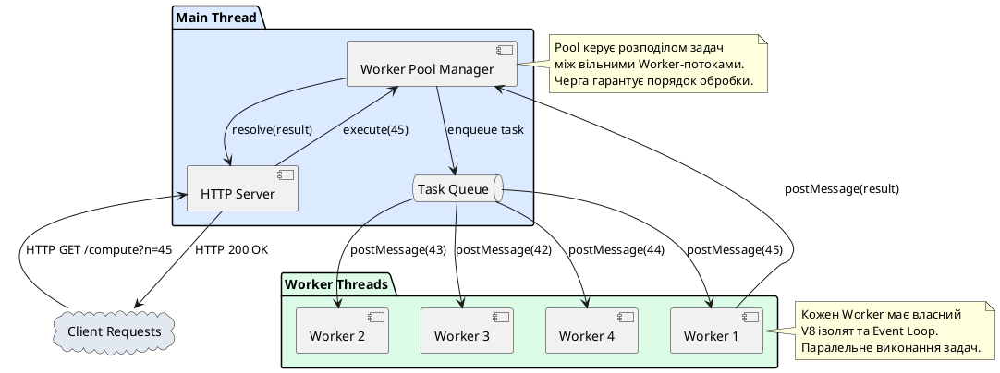

# Worker Threads — багатопотоковість у Node.js

::card-group

::card{title="🎯 Мета лекції" icon="i-lucide-target"}

- Зрозуміти фундаментальне обмеження однопотокової моделі Node.js при виконанні CPU-інтенсивних задач.
- Опанувати модуль `worker_threads` для створення справжньої багатопотоковості у Node.js.
- Навчитися передавати дані між головним потоком та робочими потоками через `postMessage()` та події.
- Розрізняти сценарії використання Worker Threads та Child Processes.
- Дослідити механізми спільної пам'яті через `SharedArrayBuffer` для високопродуктивних обчислень.
- Розуміти архітектурні обмеження та накладні витрати багатопотоковості.

::

::card{title="🔑 Ключові терміни" icon="i-lucide-key"}

- **Worker Thread (*робочий потік*):** окремий потік виконання JavaScript коду з власним Event Loop та V8 ізолятом.
- **Main Thread (*головний потік*):** основний потік Node.js застосунку, де виконується Event Loop та обробляються асинхронні операції.
- **Event Loop:** механізм асинхронної обробки подій у Node.js, що працює в одному потоці.
- **CPU-bound операція:** обчислювальна задача, що інтенсивно використовує процесор (криптографія, обробка зображень, математичні обчислення).
- **Thread Pool (*пул потоків*):** набір потоків у libuv для виконання блокуючих операцій (файлові операції, DNS, криптографія через crypto).

::

::

## Архітектурне обмеження: однопотоковість Node.js

Node.js побудований на архітектурі **неблокуючого введення/виведення** (*non-blocking I/O*) та **подієвого циклу** (*Event Loop*). Ця модель надзвичайно ефективна для операцій введення/виведення (мережеві запити, файлові операції, доступ до баз даних), оскільки дозволяє одному потоку обслуговувати тисячі одночасних з'єднань без блокування.

Проте існує критична вада цієї моделі: **весь JavaScript код виконується в одному потоці**. Це означає, що якщо виконується CPU-інтенсивна операція (наприклад, обчислення чисел Фібоначчі для великих значень, хешування паролів через bcrypt, обробка зображень), весь Event Loop блокується на час виконання цієї операції.

### Демонстрація проблеми

Розглянемо простий HTTP-сервер, що обробляє два типи запитів: легкий (`/fast`) та важкий (`/slow`):

```typescript
import { createServer } from 'node:http';

// CPU-інтенсивна функція: обчислення чисел Фібоначчі через рекурсію
function fibonacci(n: number): number {
  if (n <= 1) return n;
  return fibonacci(n - 1) + fibonacci(n - 2);
}

const server = createServer((req, res) => {
  if (req.url === '/fast') {
    // Легка операція: миттєва відповідь
    res.writeHead(200, { 'Content-Type': 'application/json' });
    res.end(JSON.stringify({ message: 'Швидка відповідь', timestamp: Date.now() }));
  } else if (req.url === '/slow') {
    // Важка операція: обчислення fibonacci(45) блокує потік на ~5-10 секунд
    console.log('Початок обчислення fibonacci(45)...');
    const startTime = Date.now();
    
    const result = fibonacci(45);
    
    const duration = Date.now() - startTime;
    console.log(`Обчислення завершено за ${duration}мс`);
    
    res.writeHead(200, { 'Content-Type': 'application/json' });
    res.end(JSON.stringify({ result, duration }));
  } else {
    res.writeHead(404);
    res.end('Not Found');
  }
});

server.listen(3000, () => {
  console.log('Сервер запущено на http://localhost:3000');
  console.log('Спробуйте: /fast та /slow');
});
```

Якщо відкрити два вікна браузера і одночасно відправити запити:

1. **Запит 1:** `GET /slow` (запускає обчислення `fibonacci(45)`)
2. **Запит 2:** `GET /fast` (повинен відповісти миттєво)

**Реальна поведінка:**

::terminal-preview{title="node server.ts" :cursor="false"}

<div class="line"><span class="opacity-40">$</span> <strong class="font-bold">node server.ts</strong></div>
<div class="line"><span class="text-blue-400 font-bold">Сервер запущено на http://localhost:3000</span></div>
<div class="line"></div>
<div class="line"><span class="opacity-40">[Client 1]</span> GET /slow</div>
<div class="line">Початок обчислення fibonacci(45)...</div>
<div class="line"><span class="opacity-40">[Client 2]</span> GET /fast <span class="text-yellow-400">⏳ Очікує...</span></div>
<div class="line"></div>
<div class="line"><span class="text-rose-400">⚠️ Event Loop заблоковано!</span></div>
<div class="line">Обчислення завершено за <span class="text-green-400 font-bold">8450мс</span></div>
<div class="line"></div>
<div class="line"><span class="opacity-40">[Client 2]</span> GET /fast <span class="text-green-400">✓ Відповідь отримана через 8.5 секунд</span></div>

::

Запит `/fast`, який повинен відповісти миттєво, **чекає 8.5 секунд**, поки завершиться обчислення `fibonacci(45)`. Це відбувається тому, що Event Loop заблоковано синхронним обчисленням у єдиному потоці.

::warning
У продакшн-середовищі така поведінка є **критичною вразливістю**. Зловмисник може відправити кілька важких запитів одночасно, повністю заблокувавши сервер для всіх інших користувачів (атака типу Denial of Service).
::

## Рішення: модуль `worker_threads`

Модуль `worker_threads` (введений у Node.js 10.5.0, стабільний з версії 12.0.0) дозволяє створювати **справжні потоки операційної системи** для виконання JavaScript коду паралельно з головним потоком. Кожен Worker Thread має:

- **Власний Event Loop:** може обробляти асинхронні операції незалежно.
- **Власний V8 ізолят:** окремий екземпляр JavaScript-движка з власною пам'яттю.
- **Спільну пам'ять (опціонально):** можливість передачі `SharedArrayBuffer` для високопродуктивних обчислень.

Ключова відмінність від `child_process`: Worker Threads виконуються **в межах одного процесу Node.js**, що робить їх легшими та швидшими для створення, але з обмеженнями ізоляції.

### Базовий приклад: винесення обчислень у Worker

Розділимо наш застосунок на два файли:

**worker.ts** — код, що виконується у робочому потоці:

```typescript
import { parentPort } from 'node:worker_threads';

// Функція обчислення чисел Фібоначчі
function fibonacci(n: number): number {
  if (n <= 1) return n;
  return fibonacci(n - 1) + fibonacci(n - 2);
}

// Слухаємо повідомлення від головного потоку
parentPort?.on('message', (n: number) => {
  console.log(`[Worker] Отримано запит: fibonacci(${n})`);
  
  const startTime = Date.now();
  const result = fibonacci(n);
  const duration = Date.now() - startTime;
  
  console.log(`[Worker] Обчислення завершено за ${duration}мс`);
  
  // Відправляємо результат назад у головний потік
  parentPort?.postMessage({ result, duration });
});

console.log('[Worker] Робочий потік запущено');
```

**server.ts** — головний потік з HTTP-сервером:

```typescript
import { createServer } from 'node:http';
import { Worker } from 'node:worker_threads';
import { resolve } from 'node:path';

const server = createServer((req, res) => {
  if (req.url === '/fast') {
    // Легка операція: виконується у головному потоці
    res.writeHead(200, { 'Content-Type': 'application/json' });
    res.end(JSON.stringify({ message: 'Швидка відповідь', timestamp: Date.now() }));
  } else if (req.url === '/slow') {
    console.log('[Main] Створення Worker для обчислення fibonacci(45)...');
    
    // Створюємо новий Worker Thread
    const worker = new Worker(resolve(__dirname, 'worker.ts'));
    
    // Слухаємо відповідь від Worker
    worker.on('message', ({ result, duration }) => {
      console.log(`[Main] Результат отримано від Worker: ${result}`);
      
      res.writeHead(200, { 'Content-Type': 'application/json' });
      res.end(JSON.stringify({ result, duration }));
      
      // Завершуємо Worker після отримання результату
      worker.terminate();
    });
    
    worker.on('error', (error) => {
      console.error('[Main] Помилка Worker:', error);
      res.writeHead(500);
      res.end('Internal Server Error');
    });
    
    // Відправляємо завдання у Worker
    worker.postMessage(45);
  } else {
    res.writeHead(404);
    res.end('Not Found');
  }
});

server.listen(3000, () => {
  console.log('Сервер запущено на http://localhost:3000');
  console.log('[Main] Event Loop ВІЛЬНИЙ для обробки інших запитів');
});
```

Тепер при одночасних запитах `/slow` та `/fast`:

::terminal-preview{title="node server.ts" :cursor="false"}

<div class="line"><span class="opacity-40">$</span> <strong class="font-bold">node server.ts</strong></div>
<div class="line"><span class="text-blue-400 font-bold">Сервер запущено на http://localhost:3000</span></div>
<div class="line">[Main] Event Loop ВІЛЬНИЙ для обробки інших запитів</div>
<div class="line"></div>
<div class="line"><span class="opacity-40">[Client 1]</span> GET /slow</div>
<div class="line">[Main] Створення Worker для обчислення fibonacci(45)...</div>
<div class="line">[Worker] Робочий потік запущено</div>
<div class="line">[Worker] Отримано запит: fibonacci(45)</div>
<div class="line"></div>
<div class="line"><span class="opacity-40">[Client 2]</span> GET /fast</div>
<div class="line"><span class="text-green-400">✓ Відповідь миттєва (5мс)</span> — Event Loop не заблоковано!</div>
<div class="line"></div>
<div class="line">[Worker] Обчислення завершено за <span class="text-green-400 font-bold">8320мс</span></div>
<div class="line">[Main] Результат отримано від Worker: 1134903170</div>

::

Запит `/fast` тепер відповідає **миттєво**, оскільки важкі обчислення виконуються у окремому потоці, не блокуючи головний Event Loop.

::note
Worker Thread **не є** "безкоштовним". Створення нового потоку має накладні витрати (~30-50мс на ініціалізацію V8 ізоляту). Для коротких операцій (<100мс) використання Worker може бути повільнішим, ніж виконання у головному потоці.
::


## Основи API модуля `worker_threads`

Модуль `worker_threads` надає кілька ключових об'єктів та функцій для роботи з багатопотоковістю:

### Клас `Worker`: створення робочих потоків

Конструктор `Worker` приймає шлях до JavaScript/TypeScript файлу, що буде виконуватися у новому потоці:

```typescript
import { Worker } from 'node:worker_threads';
import { resolve } from 'node:path';

const worker = new Worker(resolve(__dirname, 'worker.ts'), {
  // Опціональні налаштування
  workerData: { initialValue: 42 }, // Початкові дані для Worker
  env: process.env,                  // Змінні оточення (за замовчуванням успадковуються)
  resourceLimits: {
    maxOldGenerationSizeMb: 512,     // Обмеження пам'яті (MB)
    maxYoungGenerationSizeMb: 64,
  },
});
```

**Параметри конструктора:**

| Параметр         | Тип                | Опис                                                                 |
|------------------|--------------------|--------------------------------------------------------------------|
| `filename`       | `string`           | Абсолютний шлях до файлу з кодом Worker                            |
| `workerData`     | `any`              | Дані, які будуть доступні у Worker через `workerData`              |
| `env`            | `object`           | Змінні оточення (default: `process.env`)                           |
| `resourceLimits` | `object`           | Обмеження ресурсів (пам'ять, CPU)                                  |
| `execArgv`       | `string[]`         | Аргументи для Node.js (наприклад, `['--max-old-space-size=2048']`) |
| `stdout`         | `boolean`          | Чи перенаправляти stdout Worker у головний потік (default: `false`)|
| `stderr`         | `boolean`          | Чи перенаправляти stderr Worker у головний потік (default: `false`)|

### `parentPort`: комунікація з головним потоком

Об'єкт `parentPort` доступний **лише всередині Worker Thread** та надає API для двостороннього зв'язку з головним потоком:

```typescript
import { parentPort } from 'node:worker_threads';

if (!parentPort) {
  throw new Error('Цей скрипт повинен виконуватися як Worker Thread');
}

// Відправка повідомлення у головний потік
parentPort.postMessage({ status: 'ready', timestamp: Date.now() });

// Отримання повідомлень від головного потоку
parentPort.on('message', (data) => {
  console.log('Отримано від головного потоку:', data);
  
  // Обробка даних та відправка відповіді
  const result = processData(data);
  parentPort.postMessage({ result });
});

// Обробка помилок
parentPort.on('error', (error) => {
  console.error('Помилка комунікації:', error);
});

// Подія закриття потоку
parentPort.on('close', () => {
  console.log('Канал комунікації закрито');
});
```

### `isMainThread`: визначення контексту виконання

Булева константа, що дозволяє одному файлу містити код як для головного потоку, так і для Worker:

```typescript
import { isMainThread, Worker, parentPort } from 'node:worker_threads';

if (isMainThread) {
  // Код головного потоку
  console.log('Виконується у головному потоці');
  
  const worker = new Worker(__filename); // Запускаємо цей же файл як Worker
  
  worker.on('message', (message) => {
    console.log('Отримано від Worker:', message);
  });
  
  worker.postMessage('Hello from main thread');
} else {
  // Код Worker потоку
  console.log('Виконується у Worker потоці');
  
  parentPort?.on('message', (message) => {
    console.log('Отримано від головного потоку:', message);
    parentPort?.postMessage('Hello from worker thread');
  });
}
```

Такий підхід дозволяє створювати **самодостатні модулі**, що можуть виконуватися як окремо, так і як Worker.

::tip
Використовуйте `isMainThread` для реалізації патерну "self-spawning worker" — коли файл автоматично створює Worker-копії самого себе для паралелізації роботи. Це зручно для швидкого прототипування та скриптів обробки даних.
::

### `workerData`: передача початкових даних

При створенні Worker можна передати початкові дані через параметр `workerData`. Ці дані будуть доступні у Worker через імпорт:

```typescript
// main.ts — головний потік
import { Worker } from 'node:worker_threads';

const worker = new Worker('./worker.ts', {
  workerData: {
    taskId: 'task-001',
    config: {
      timeout: 5000,
      retries: 3,
    },
    filePath: '/path/to/data.json',
  },
});
```

```typescript
// worker.ts — робочий потік
import { workerData, parentPort } from 'node:worker_threads';

interface WorkerData {
  taskId: string;
  config: {
    timeout: number;
    retries: number;
  };
  filePath: string;
}

const data = workerData as WorkerData;

console.log(`[Worker ${data.taskId}] Запущено з конфігурацією:`, data.config);
console.log(`[Worker ${data.taskId}] Обробка файлу: ${data.filePath}`);

// Виконання роботи...
const result = await processFile(data.filePath, data.config);

parentPort?.postMessage({ taskId: data.taskId, result });
```

::note
Дані у `workerData` передаються через **structured clone algorithm** — це означає, що підтримуються більшість JavaScript типів (об'єкти, масиви, Date, Map, Set), але **не підтримуються** функції, класи та символи. Дані **копіюються**, а не передаються за посиланням (за винятком `SharedArrayBuffer`).
::

## Передача даних: `postMessage()` та structured clone

Основний механізм комунікації між потоками — метод `postMessage()`. Дані передаються через **structured clone algorithm**, що створює глибоку копію об'єкта:

```typescript
// Головний потік
const worker = new Worker('./worker.ts');

const complexData = {
  timestamp: new Date(),
  users: [
    { id: 1, name: 'Олександр' },
    { id: 2, name: 'Марія' },
  ],
  metadata: new Map([
    ['version', '1.0.0'],
    ['author', 'kostyl.dev'],
  ]),
  binary: new Uint8Array([1, 2, 3, 4, 5]),
};

worker.postMessage(complexData);

// Worker потік
parentPort?.on('message', (data) => {
  console.log('Date:', data.timestamp instanceof Date); // true
  console.log('Map:', data.metadata instanceof Map);     // true
  console.log('TypedArray:', data.binary instanceof Uint8Array); // true
  
  // Зміни у Worker НЕ впливають на головний потік (окремі копії)
  data.users.push({ id: 3, name: 'Іван' });
});
```

### Підтримувані типи даних

Structured clone algorithm підтримує:

::card-group

::card{title="✅ Підтримуються" icon="i-lucide-check-circle"}

- Примітивні типи: `number`, `string`, `boolean`, `null`, `undefined`, `bigint`
- Об'єкти: `Object`, `Array`
- Вбудовані типи: `Date`, `RegExp`, `Map`, `Set`
- Типізовані масиви: `Int8Array`, `Uint8Array`, `Float32Array`, тощо
- `ArrayBuffer`, `SharedArrayBuffer` (передаються за посиланням!)
- `Error` та його похідні

::

::card{title="❌ НЕ підтримуються" icon="i-lucide-x-circle"}

- Функції (будь-які: стрілкові, звичайні, async)
- Класи та їх екземпляри (лише plain objects)
- `Symbol`
- DOM-вузли (у браузерах)
- Циклічні посилання (викликають помилку)

::

::

### Обробка помилок при передачі даних

```typescript
const worker = new Worker('./worker.ts');

try {
  // ❌ Помилка: функції не підтримуються
  worker.postMessage({
    callback: () => console.log('Hello'),
  });
} catch (error) {
  console.error('Помилка postMessage:', error);
  // DataCloneError: () => console.log('Hello') could not be cloned.
}

try {
  // ❌ Помилка: циклічні посилання
  const obj: any = { name: 'Test' };
  obj.self = obj; // Циклічне посилання
  
  worker.postMessage(obj);
} catch (error) {
  console.error('Помилка postMessage:', error);
  // DataCloneError: Circular reference in value argument not supported
}
```

::warning
Копіювання великих об'єктів через `postMessage()` може бути **повільним** та **спричиняти високе споживання пам'яті**. Для передачі великих бінарних даних (зображення, відео, аудіо) використовуйте **transferable objects** (див. наступний розділ).
::

## Transferable Objects: передача без копіювання

Для високопродуктивної передачі великих бінарних даних використовується механізм **transferable objects**. Замість копіювання, право власності на дані **переміщується** з одного потоку в інший:

```typescript
// Головний потік
const worker = new Worker('./worker.ts');

// Створюємо великий буфер (100 МБ)
const hugeBuffer = new ArrayBuffer(100 * 1024 * 1024);
const uint8View = new Uint8Array(hugeBuffer);

// Заповнюємо даними
for (let i = 0; i < uint8View.length; i++) {
  uint8View[i] = i % 256;
}

console.log('Розмір буфера:', hugeBuffer.byteLength, 'байт');
console.log('Передача буфера у Worker...');

// ✅ Передаємо ArrayBuffer як transferable (миттєво)
worker.postMessage({ buffer: hugeBuffer }, [hugeBuffer]);

// ❌ Після передачі hugeBuffer у головному потоці стає недоступним!
console.log('Розмір буфера після передачі:', hugeBuffer.byteLength); // 0
```

```typescript
// Worker потік
import { parentPort } from 'node:worker_threads';

parentPort?.on('message', ({ buffer }) => {
  console.log('[Worker] Отримано буфер:', buffer.byteLength, 'байт');
  
  // Тепер Worker володіє буфером — можна читати та модифікувати
  const view = new Uint8Array(buffer);
  console.log('[Worker] Перші 10 байтів:', view.slice(0, 10));
  
  // Обробка даних...
  
  // Передаємо буфер назад у головний потік
  parentPort?.postMessage({ processedBuffer: buffer }, [buffer]);
  
  // Після передачі buffer у Worker стає недоступним
  console.log('[Worker] Розмір після повернення:', buffer.byteLength); // 0
});
```

**Синтаксис:**

```typescript
worker.postMessage(data, [transferableObject1, transferableObject2, ...]);
```

**Transferable types:**

- `ArrayBuffer`
- `MessagePort`
- `ReadableStream` / `WritableStream` (з Node.js 16+)

::note
Механізм transferable objects працює на рівні операційної системи через передачу дескриптора пам'яті, а не копіювання байтів. Це робить операцію практично **миттєвою** навіть для гігабайтів даних, але **позбавляє доступу до даних у вихідному потоці**.
::

### Порівняння: Clone vs Transfer

::code-group

```typescript [Clone (копіювання)]
const buffer = new ArrayBuffer(100 * 1024 * 1024); // 100 МБ

// Копіювання: створюється дублікат у пам'яті Worker
worker.postMessage({ buffer });

// ✅ buffer досі доступний у головному потоці
console.log(buffer.byteLength); // 104857600

// ❌ Повільно: копіювання 100 МБ
// ❌ Подвійне споживання пам'яті: 200 МБ (головний + Worker)
```

```typescript [Transfer (переміщення)]
const buffer = new ArrayBuffer(100 * 1024 * 1024); // 100 МБ

// Передача: право власності переходить до Worker
worker.postMessage({ buffer }, [buffer]);

// ❌ buffer НЕДОСТУПНИЙ у головному потоці
console.log(buffer.byteLength); // 0

// ✅ Миттєво: лише передача дескриптора пам'яті
// ✅ Єдине споживання пам'яті: 100 МБ (лише Worker)
```

::


## Спільна пам'ять: `SharedArrayBuffer`

Для сценаріїв, де кілька потоків повинні **одночасно читати та модифікувати** одні й ті ж дані, Node.js надає механізм спільної пам'яті через `SharedArrayBuffer`. На відміну від transferable objects, де дані переміщуються між потоками, `SharedArrayBuffer` дозволяє **багатьом потокам мати доступ до одного й того ж регіону пам'яті**.

### Базовий приклад: лічильник у спільній пам'яті

```typescript
// main.ts — головний потік
import { Worker } from 'node:worker_threads';
import { resolve } from 'node:path';

// Створюємо спільний буфер на 4 байти (один Int32)
const sharedBuffer = new SharedArrayBuffer(4);
const sharedArray = new Int32Array(sharedBuffer);

// Початкове значення лічильника
sharedArray[0] = 0;

console.log('[Main] Початкове значення:', sharedArray[0]);

// Створюємо 4 Worker-потоки
const workers: Worker[] = [];

for (let i = 0; i < 4; i++) {
  const worker = new Worker(resolve(__dirname, 'counter-worker.ts'), {
    workerData: { workerId: i, sharedBuffer },
  });
  
  worker.on('message', (message) => {
    console.log(`[Main] Worker ${i}:`, message);
  });
  
  workers.push(worker);
}

// Через 2 секунди перевіряємо значення лічильника
setTimeout(() => {
  console.log('[Main] Фінальне значення лічильника:', sharedArray[0]);
  
  // Завершуємо всі Worker-потоки
  workers.forEach((worker) => worker.terminate());
}, 2000);
```

```typescript
// counter-worker.ts — робочий потік
import { workerData, parentPort } from 'node:worker_threads';

interface WorkerData {
  workerId: number;
  sharedBuffer: SharedArrayBuffer;
}

const { workerId, sharedBuffer } = workerData as WorkerData;
const sharedArray = new Int32Array(sharedBuffer);

parentPort?.postMessage(`Worker ${workerId} запущено`);

// Кожен Worker інкрементує лічильник 1000 разів
for (let i = 0; i < 1000; i++) {
  // ❌ ПРОБЛЕМА: Race Condition!
  const currentValue = sharedArray[0];
  sharedArray[0] = currentValue + 1;
}

parentPort?.postMessage(`Worker ${workerId} завершив роботу`);
```

**Очікуваний результат:** 4 Worker × 1000 інкрементів = 4000

**Реальний результат:**

::terminal-preview{title="node main.ts" :cursor="false"}

<div class="line"><span class="opacity-40">$</span> <strong class="font-bold">node main.ts</strong></div>
<div class="line">[Main] Початкове значення: <span class="text-blue-400 font-bold">0</span></div>
<div class="line">[Main] Worker 0: Worker 0 запущено</div>
<div class="line">[Main] Worker 1: Worker 1 запущено</div>
<div class="line">[Main] Worker 2: Worker 2 запущено</div>
<div class="line">[Main] Worker 3: Worker 3 запущено</div>
<div class="line">[Main] Worker 0: Worker 0 завершив роботу</div>
<div class="line">[Main] Worker 1: Worker 1 завершив роботу</div>
<div class="line">[Main] Worker 2: Worker 2 завершив роботу</div>
<div class="line">[Main] Worker 3: Worker 3 завершив роботу</div>
<div class="line">[Main] Фінальне значення лічильника: <span class="text-rose-400 font-bold">1847</span> <span class="opacity-40">(очікувалось 4000!)</span></div>

::

Значення `1847` замість `4000` є результатом **гонки даних** (*race condition*). Декілька потоків одночасно читають та модифікують одне й те ж значення, що призводить до втрати оновлень.

### Атомарні операції: `Atomics`

Для безпечної роботи зі спільною пам'яттю Node.js надає глобальний об'єкт `Atomics`, що забезпечує **атомарні операції** (операції, що виконуються як неподільна одиниця):

```typescript
// counter-worker.ts — виправлена версія
import { workerData, parentPort } from 'node:worker_threads';

interface WorkerData {
  workerId: number;
  sharedBuffer: SharedArrayBuffer;
}

const { workerId, sharedBuffer } = workerData as WorkerData;
const sharedArray = new Int32Array(sharedBuffer);

parentPort?.postMessage(`Worker ${workerId} запущено`);

// ✅ Атомарний інкремент — безпечно для багатопотоковості
for (let i = 0; i < 1000; i++) {
  Atomics.add(sharedArray, 0, 1); // Атомарно додає 1 до sharedArray[0]
}

parentPort?.postMessage(`Worker ${workerId} завершив роботу`);
```

Тепер результат завжди точний:

::terminal-preview{title="node main.ts" :cursor="false"}

<div class="line"><span class="opacity-40">$</span> <strong class="font-bold">node main.ts</strong></div>
<div class="line">[Main] Початкове значення: <span class="text-blue-400 font-bold">0</span></div>
<div class="line">[Main] Фінальне значення лічильника: <span class="text-green-400 font-bold">4000</span> <span class="opacity-40">✓ Правильно!</span></div>

::

### Ключові методи `Atomics`

| Метод                         | Опис                                                                 |
|-------------------------------|---------------------------------------------------------------------|
| `Atomics.load(arr, idx)`      | Атомарне читання значення з масиву                                  |
| `Atomics.store(arr, idx, val)`| Атомарний запис значення у масив                                    |
| `Atomics.add(arr, idx, val)`  | Атомарне додавання: `arr[idx] += val`, повертає старе значення      |
| `Atomics.sub(arr, idx, val)`  | Атомарне віднімання: `arr[idx] -= val`                              |
| `Atomics.and(arr, idx, val)`  | Атомарне побітове AND                                               |
| `Atomics.or(arr, idx, val)`   | Атомарне побітове OR                                                |
| `Atomics.xor(arr, idx, val)`  | Атомарне побітове XOR                                               |
| `Atomics.compareExchange(...)`| Атомарна заміна значення, якщо воно дорівнює очікуваному (CAS)     |
| `Atomics.wait(arr, idx, val, timeout)` | Блокує потік до зміни значення або таймауту              |
| `Atomics.notify(arr, idx, count)`      | Розблоковує потоки, що очікують на `wait()`           |

### Синхронізація потоків: `wait()` та `notify()`

Методи `Atomics.wait()` та `Atomics.notify()` дозволяють реалізувати примітивні синхронізації на кшталт умовних змінних (*condition variables*):

```typescript
// producer.ts — Worker-виробник
import { workerData, parentPort } from 'node:worker_threads';

const { sharedBuffer } = workerData as { sharedBuffer: SharedArrayBuffer };
const sharedArray = new Int32Array(sharedBuffer);

// sharedArray[0] — статус: 0 = "немає даних", 1 = "дані готові"
// sharedArray[1] — дані

for (let i = 1; i <= 10; i++) {
  // Генеруємо дані
  const data = i * 10;
  
  // Записуємо дані
  Atomics.store(sharedArray, 1, data);
  
  // Встановлюємо прапор "дані готові"
  Atomics.store(sharedArray, 0, 1);
  
  // Сповіщаємо споживача
  Atomics.notify(sharedArray, 0, 1);
  
  console.log(`[Producer] Відправлено: ${data}`);
  
  // Чекаємо, поки споживач обробить дані
  while (Atomics.load(sharedArray, 0) === 1) {
    // Busy-wait (у реальних застосунках краще використовувати wait)
  }
  
  // Невелика затримка
  Atomics.wait(sharedArray, 0, 0, 500); // Чекаємо 500мс або до зміни
}

parentPort?.postMessage('Producer завершено');
```

```typescript
// consumer.ts — Worker-споживач
import { workerData, parentPort } from 'node:worker_threads';

const { sharedBuffer } = workerData as { sharedBuffer: SharedArrayBuffer };
const sharedArray = new Int32Array(sharedBuffer);

let receivedCount = 0;

while (receivedCount < 10) {
  // Чекаємо, поки producer встановить прапор "дані готові"
  const result = Atomics.wait(sharedArray, 0, 0, 1000); // Таймаут 1 секунда
  
  if (result === 'ok') {
    // Читаємо дані
    const data = Atomics.load(sharedArray, 1);
    console.log(`[Consumer] Отримано: ${data}`);
    
    receivedCount++;
    
    // Скидаємо прапор "немає даних"
    Atomics.store(sharedArray, 0, 0);
    
    // Сповіщаємо producer, що можна надсилати нові дані
    Atomics.notify(sharedArray, 0, 1);
  } else if (result === 'timed-out') {
    console.warn('[Consumer] Таймаут очікування даних');
  }
}

parentPort?.postMessage('Consumer завершено');
```

::caution
Методи `Atomics.wait()` та `Atomics.notify()` працюють **лише з `Int32Array` або `BigInt64Array`** на основі `SharedArrayBuffer`. Використання з іншими типами масивів призведе до помилки `TypeError`.
::

::warning
Робота зі спільною пам'яттю та атомарними операціями є **складною** та **схильною до помилок** (deadlocks, race conditions, priority inversion). Використовуйте `SharedArrayBuffer` лише для сценаріїв, де продуктивність є критичною, та коли простіші механізми комунікації (`postMessage()`) не підходять.
::

## Worker Threads vs Child Processes: коли що використовувати

Node.js надає два механізми паралелізму: `worker_threads` та `child_process`. Вибір між ними залежить від конкретного сценарію:

::code-group

```typescript [Worker Threads]
import { Worker } from 'node:worker_threads';

// Легковаговий: спільний процес, окремі V8 ізоляти
const worker = new Worker('./compute.ts', {
  workerData: { n: 1000000 },
});

worker.on('message', (result) => {
  console.log('Результат:', result);
});

// ✅ Швидке створення (10-30мс)
// ✅ Спільна пам'ять через SharedArrayBuffer
// ✅ Низькі накладні витрати
// ❌ Спільний heap — crash Worker може вплинути на головний процес
// ❌ Обмежена ізоляція
```

```typescript [Child Processes]
import { fork } from 'node:child_process';

// Важковаговий: окремий процес Node.js
const child = fork('./compute.ts');

child.send({ n: 1000000 });

child.on('message', (result) => {
  console.log('Результат:', result);
});

// ❌ Повільне створення (50-200мс)
// ❌ Немає спільної пам'яті
// ❌ Високі накладні витрати (копіювання пам'яті)
// ✅ Повна ізоляція — crash дочірнього процесу не впливає на батьківський
// ✅ Можливість запуску інших програм (не лише JavaScript)
```

::

### Порівняльна таблиця

| Характеристика          | Worker Threads              | Child Processes                |
|-------------------------|-----------------------------|--------------------------------|
| **Час створення**       | ~10-30мс                    | ~50-200мс                      |
| **Споживання пам'яті**  | ~2-10 МБ на Worker          | ~30-50 МБ на процес            |
| **Ізоляція**            | Слабка (спільний процес)    | Сильна (окремі процеси ОС)     |
| **Комунікація**         | Швидка (спільна пам'ять)    | Повільніша (IPC)               |
| **Передача даних**      | Structured clone, Transfer  | JSON serialization (IPC)       |
| **Спільна пам'ять**     | ✅ SharedArrayBuffer        | ❌ Неможлива                   |
| **Стабільність**        | Crash впливає на процес     | Crash ізольований              |
| **Використання**        | CPU-bound задачі            | Запуск сторонніх програм       |

### Рекомендації щодо вибору

::card-group

::card{title="✅ Worker Threads" icon="i-lucide-zap"}

**Використовуйте для:**

- Паралелізації обчислень у межах Node.js застосунку
- Обробки великих масивів даних (фільтрація, сортування, трансформація)
- Криптографічних операцій (хешування, шифрування)
- Обробки зображень, відео, аудіо
- Паралельних запитів до API з обробкою результатів

**Приклади:**
- Конвертація форматів зображень (JPEG → WebP)
- Парсинг великих JSON/XML файлів
- Обчислення статистики з великих датасетів
- Генерація звітів (PDF, Excel)

::

::card{title="✅ Child Processes" icon="i-lucide-box"}

**Використовуйте для:**

- Запуску сторонніх програм (ffmpeg, ImageMagick, curl)
- Ізоляції ненадійного коду (plugins, user scripts)
- Запуску довготривалих фонових задач
- Інтеграції з системними утилітами

**Приклади:**
- Конвертація відео через ffmpeg
- Запуск Python-скриптів для ML-моделей
- Виконання bash-скриптів
- Ізоляція експериментальних модулів

::

::


## Паттерн Worker Pool: ефективне керування потоками

Створення нового Worker Thread для кожної задачі є **неефективним** через накладні витрати на ініціалізацію V8 ізоляту (~30-50мс). Для високонавантажених застосунків використовується паттерн **Worker Pool** — пул заздалегідь створених Worker-потоків, що обробляють задачі з черги.

### Реалізація простого Worker Pool

```typescript
// worker-pool.ts
import { Worker } from 'node:worker_threads';
import { EventEmitter } from 'node:events';
import { resolve } from 'node:path';

interface Task<T = any> {
  id: string;
  data: T;
  resolve: (result: any) => void;
  reject: (error: Error) => void;
}

export class WorkerPool extends EventEmitter {
  private workers: Worker[] = [];
  private freeWorkers: Worker[] = [];
  private taskQueue: Task[] = [];
  private workerTaskMap = new Map<Worker, Task>();

  constructor(
    private workerScript: string,
    private poolSize: number = 4
  ) {
    super();
    this.initialize();
  }

  private initialize(): void {
    for (let i = 0; i < this.poolSize; i++) {
      const worker = new Worker(resolve(__dirname, this.workerScript));
      
      worker.on('message', (result) => {
        this.handleWorkerMessage(worker, result);
      });

      worker.on('error', (error) => {
        this.handleWorkerError(worker, error);
      });

      worker.on('exit', (code) => {
        console.log(`Worker ${i} завершився з кодом ${code}`);
        this.removeWorker(worker);
      });

      this.workers.push(worker);
      this.freeWorkers.push(worker);
    }

    this.emit('ready', this.poolSize);
  }

  private handleWorkerMessage(worker: Worker, result: any): void {
    const task = this.workerTaskMap.get(worker);
    
    if (task) {
      task.resolve(result);
      this.workerTaskMap.delete(worker);
      this.freeWorkers.push(worker);
      
      // Обробляємо наступну задачу з черги
      this.processNextTask();
    }
  }

  private handleWorkerError(worker: Worker, error: Error): void {
    const task = this.workerTaskMap.get(worker);
    
    if (task) {
      task.reject(error);
      this.workerTaskMap.delete(worker);
    }

    // Видаляємо неробочий Worker
    this.removeWorker(worker);

    // Створюємо новий Worker на заміну
    const newWorker = new Worker(resolve(__dirname, this.workerScript));
    newWorker.on('message', (result) => this.handleWorkerMessage(newWorker, result));
    newWorker.on('error', (error) => this.handleWorkerError(newWorker, error));
    
    this.workers.push(newWorker);
    this.freeWorkers.push(newWorker);
    
    // Обробляємо чергову задачу
    this.processNextTask();
  }

  private removeWorker(worker: Worker): void {
    const workerIndex = this.workers.indexOf(worker);
    if (workerIndex !== -1) {
      this.workers.splice(workerIndex, 1);
    }

    const freeIndex = this.freeWorkers.indexOf(worker);
    if (freeIndex !== -1) {
      this.freeWorkers.splice(freeIndex, 1);
    }
  }

  private processNextTask(): void {
    if (this.taskQueue.length === 0 || this.freeWorkers.length === 0) {
      return;
    }

    const task = this.taskQueue.shift()!;
    const worker = this.freeWorkers.shift()!;

    this.workerTaskMap.set(worker, task);
    worker.postMessage(task.data);
  }

  public execute<T = any, R = any>(data: T): Promise<R> {
    return new Promise((resolve, reject) => {
      const task: Task<T> = {
        id: `task-${Date.now()}-${Math.random()}`,
        data,
        resolve,
        reject,
      };

      this.taskQueue.push(task);
      this.processNextTask();
    });
  }

  public async terminate(): Promise<void> {
    const terminationPromises = this.workers.map((worker) => worker.terminate());
    await Promise.all(terminationPromises);
    
    this.workers = [];
    this.freeWorkers = [];
    this.taskQueue = [];
    this.workerTaskMap.clear();
    
    this.emit('terminated');
  }

  public getStats() {
    return {
      totalWorkers: this.workers.length,
      freeWorkers: this.freeWorkers.length,
      busyWorkers: this.workerTaskMap.size,
      queuedTasks: this.taskQueue.length,
    };
  }
}
```

### Використання Worker Pool

```typescript
// compute-worker.ts — робочий потік
import { parentPort } from 'node:worker_threads';

function fibonacci(n: number): number {
  if (n <= 1) return n;
  return fibonacci(n - 1) + fibonacci(n - 2);
}

parentPort?.on('message', (n: number) => {
  const result = fibonacci(n);
  parentPort?.postMessage(result);
});
```

```typescript
// main.ts — головний потік
import { WorkerPool } from './worker-pool';

async function main() {
  const pool = new WorkerPool('compute-worker.ts', 4);

  pool.on('ready', (size) => {
    console.log(`Worker Pool готовий: ${size} потоків`);
  });

  console.log('Відправка 20 задач у пул...');
  const startTime = Date.now();

  const tasks = Array.from({ length: 20 }, (_, i) => pool.execute(40 + (i % 5)));

  const results = await Promise.all(tasks);

  const duration = Date.now() - startTime;

  console.log(`Всі задачі виконано за ${duration}мс`);
  console.log('Перші 5 результатів:', results.slice(0, 5));
  console.log('Статистика пулу:', pool.getStats());

  await pool.terminate();
  console.log('Worker Pool завершено');
}

main().catch(console.error);
```

**Вивід:**

::terminal-preview{title="node main.ts" :cursor="false"}

<div class="line"><span class="opacity-40">$</span> <strong class="font-bold">node main.ts</strong></div>
<div class="line"><span class="text-blue-400 font-bold">Worker Pool готовий: 4 потоків</span></div>
<div class="line">Відправка 20 задач у пул...</div>
<div class="line"></div>
<div class="line"><span class="opacity-40">[Pool]</span> Задача 1 виконується у Worker 0</div>
<div class="line"><span class="opacity-40">[Pool]</span> Задача 2 виконується у Worker 1</div>
<div class="line"><span class="opacity-40">[Pool]</span> Задача 3 виконується у Worker 2</div>
<div class="line"><span class="opacity-40">[Pool]</span> Задача 4 виконується у Worker 3</div>
<div class="line"><span class="opacity-40">[Pool]</span> Задача 5 очікує вільного Worker...</div>
<div class="line"></div>
<div class="line">Всі задачі виконано за <span class="text-green-400 font-bold">12847мс</span></div>
<div class="line">Перші 5 результатів: [ 102334155, 165580141, 267914296, 433494437, 102334155 ]</div>
<div class="line">Статистика пулу: { totalWorkers: 4, freeWorkers: 4, busyWorkers: 0, queuedTasks: 0 }</div>
<div class="line"><span class="text-blue-400 font-bold">Worker Pool завершено</span></div>

::

::tip
Бібліотеки `piscina` (від команди Node.js) та `worker-pool` надають готові реалізації Worker Pool з розширеним функціоналом (timeout, priority queues, worker recycling). Для продакшн-застосунків рекомендується використовувати ці перевірені рішення замість власних реалізацій.
::

## Візуалізація: архітектура Worker Threads

Розглянемо діаграму взаємодії головного потоку з Worker Pool:

::plant-uml{alt="Архітектура Worker Pool"}



::

## Обмеження та застереження

### Накладні витрати на створення потоків

Створення Worker Thread не є безкоштовним:

::code-group

```typescript [Мікробенчмарк: створення Worker]
import { Worker } from 'node:worker_threads';
import { performance } from 'node:perf_hooks';

async function measureWorkerCreation() {
  const iterations = 100;
  const times: number[] = [];

  for (let i = 0; i < iterations; i++) {
    const start = performance.now();
    
    const worker = new Worker('./empty-worker.ts');
    
    await new Promise<void>((resolve) => {
      worker.on('online', () => {
        const duration = performance.now() - start;
        times.push(duration);
        worker.terminate();
        resolve();
      });
    });
  }

  const avgTime = times.reduce((a, b) => a + b, 0) / times.length;
  const minTime = Math.min(...times);
  const maxTime = Math.max(...times);

  console.log(`Середній час створення Worker: ${avgTime.toFixed(2)}мс`);
  console.log(`Мінімальний час: ${minTime.toFixed(2)}мс`);
  console.log(`Максимальний час: ${maxTime.toFixed(2)}мс`);
}

measureWorkerCreation();

// Типовий результат:
// Середній час створення Worker: 28.47мс
// Мінімальний час: 21.30мс
// Максимальний час: 89.12мс
```

```typescript [Порівняння: async функція]
import { performance } from 'node:perf_hooks';

function fibonacci(n: number): number {
  if (n <= 1) return n;
  return fibonacci(n - 1) + fibonacci(n - 2);
}

async function measureAsyncCall() {
  const iterations = 100;
  const times: number[] = [];

  for (let i = 0; i < iterations; i++) {
    const start = performance.now();
    
    await Promise.resolve(fibonacci(30));
    
    const duration = performance.now() - start;
    times.push(duration);
  }

  const avgTime = times.reduce((a, b) => a + b, 0) / times.length;
  console.log(`Середній час виклику async функції: ${avgTime.toFixed(2)}мс`);
}

measureAsyncCall();

// Типовий результат:
// Середній час виклику async функції: 3.82мс
```

::

**Висновок:** створення Worker займає ~28мс, тоді як виклик async функції — лише ~4мс. Для коротких операцій (<100мс) використання Worker може бути **повільнішим**, ніж виконання у головному потоці.

::warning
Використовуйте Worker Threads **лише для CPU-інтенсивних операцій тривалістю >100-200мс**. Для коротших операцій накладні витрати на створення потоку перевищують виграш від паралелізму.
::

### Обмеження кількості потоків

Операційна система має обмеження на кількість потоків у процесі (зазвичай ~1000-2000 на Linux, ~2000-4000 на Windows). Створення занадто великої кількості Worker-потоків може призвести до:

- Виснаження системних ресурсів (пам'ять, дескриптори)
- Context switching overhead (перемикання контексту між потоками)
- Зниження продуктивності через конкуренцію за CPU

**Рекомендації:**

- Для CPU-bound задач: кількість Worker = кількість CPU ядер (`os.cpus().length`)
- Для I/O-bound задач: кількість Worker = 2× кількість ядер
- Максимум: не більше 50-100 Worker у одному процесі

```typescript
import { cpus } from 'node:os';

const optimalPoolSize = cpus().length;
console.log(`Оптимальний розмір Worker Pool: ${optimalPoolSize}`);
// Наприклад: Оптимальний розмір Worker Pool: 8 (для CPU з 8 ядрами)
```

### Витік пам'яті через незавершені Worker

Якщо Worker Thread не завершується коректно, він продовжує споживати пам'ять:

```typescript
// ❌ АНТИПАТТЕРН: Worker не завершується
const worker = new Worker('./long-running-worker.ts');

worker.postMessage('start');

// Забули викликати worker.terminate() — Worker працює вічно!
```

**Правильний підхід:**

```typescript
// ✅ ПРАВИЛЬНО: завжди завершуйте Worker після використання
const worker = new Worker('./task-worker.ts');

worker.on('message', (result) => {
  console.log('Результат:', result);
  
  // Завершуємо Worker після отримання результату
  worker.terminate().then(() => {
    console.log('Worker коректно завершено');
  });
});

worker.postMessage({ task: 'compute', data: 42 });

// Альтернатива: таймаут для примусового завершення
setTimeout(() => {
  worker.terminate();
  console.warn('Worker примусово завершено через таймаут');
}, 30000); // 30 секунд
```

::caution
Метод `worker.terminate()` **негайно** припиняє виконання коду у Worker, навіть якщо Worker знаходиться всередині критичної секції. Для коректного завершення реалізуйте механізм "graceful shutdown" через обмін повідомленнями.
::


## Thread Pool у libuv: вбудована багатопотоковість

Node.js вже використовує багатопотоковість **під капотом** через **Thread Pool** бібліотеки libuv для блокуючих операцій операційної системи. Цей пул складається з **4 потоків за замовчуванням** (налаштовується через змінну оточення `UV_THREADPOOL_SIZE`).

### Операції, що виконуються у Thread Pool libuv

Наступні API Node.js автоматично використовують Thread Pool:

::card-group

::card{title="📁 Файлова система" icon="i-lucide-file"}

- `fs.readFile()`, `fs.writeFile()`
- `fs.readdir()`, `fs.stat()`
- `fs.open()`, `fs.close()`
- Усі синхронні файлові операції (`fs.readFileSync()` — блокують Event Loop!)

::

::card{title="🔐 Криптографія" icon="i-lucide-shield"}

- `crypto.pbkdf2()` — хешування паролів
- `crypto.randomBytes()` — генерація випадкових байтів
- `crypto.scrypt()` — ключова деривація

::

::card{title="🌐 DNS" icon="i-lucide-globe"}

- `dns.lookup()` — резолюція доменних імен
- Увага: `dns.resolve()` **не** використовує Thread Pool (використовує асинхронні сокети)

::

::card{title="🗜️ Стиснення" icon="i-lucide-archive"}

- `zlib.gzip()`, `zlib.deflate()`
- `zlib.unzip()`, `zlib.inflate()`
- Всі операції стиснення/розпакування

::

::

### Налаштування розміру Thread Pool

```typescript
// Встановлюємо розмір Thread Pool libuv на 8 потоків
process.env.UV_THREADPOOL_SIZE = '8';

import { readFile } from 'node:fs/promises';
import { performance } from 'node:perf_hooks';

async function measureConcurrentFileReads() {
  const files = Array.from({ length: 20 }, (_, i) => `./data/file-${i}.txt`);

  const start = performance.now();

  const promises = files.map((file) => readFile(file, 'utf-8'));
  await Promise.all(promises);

  const duration = performance.now() - start;

  console.log(`Читання ${files.length} файлів зайняло: ${duration.toFixed(2)}мс`);
}

measureConcurrentFileReads();

// З UV_THREADPOOL_SIZE=4: ~850мс (20 файлів / 4 потоки = 5 пакетів)
// З UV_THREADPOOL_SIZE=8: ~450мс (20 файлів / 8 потоків = 2.5 пакети)
```

::note
Змінна `UV_THREADPOOL_SIZE` повинна встановлюватися **до першого виклику** будь-якої функції, що використовує Thread Pool. Найкраще встановлювати її на початку `main.ts` або через змінну оточення у `.env` файлі.
::

### Відмінність Thread Pool libuv від Worker Threads

| Характеристика        | Thread Pool libuv              | Worker Threads                |
|-----------------------|--------------------------------|-------------------------------|
| **Призначення**       | Блокуючі системні виклики ОС   | Виконання JavaScript коду     |
| **Контроль**          | Автоматичний (Node.js)         | Ручний (розробник)            |
| **Розмір**            | 4 за замовчуванням (до 1024)   | Необмежено (обмежено ОС)      |
| **Код**               | C/C++ код libuv                | JavaScript/TypeScript         |
| **Використання**      | fs, crypto, dns, zlib          | CPU-bound обчислення          |

## Реальний приклад: обробка зображень у Worker Pool

Розглянемо практичний приклад застосування Worker Threads для конвертації зображень з JPEG у WebP:

```typescript
// image-worker.ts
import { parentPort, workerData } from 'node:worker_threads';
import sharp from 'sharp'; // Бібліотека для обробки зображень
import { readFile, writeFile } from 'node:fs/promises';

interface ImageTask {
  inputPath: string;
  outputPath: string;
  quality: number;
}

parentPort?.on('message', async (task: ImageTask) => {
  try {
    console.log(`[Worker] Обробка: ${task.inputPath}`);

    // Читання вхідного зображення
    const inputBuffer = await readFile(task.inputPath);

    // Конвертація JPEG → WebP
    const outputBuffer = await sharp(inputBuffer)
      .webp({ quality: task.quality })
      .toBuffer();

    // Збереження результату
    await writeFile(task.outputPath, outputBuffer);

    const compressionRatio = (
      (1 - outputBuffer.length / inputBuffer.length) * 100
    ).toFixed(2);

    parentPort?.postMessage({
      success: true,
      inputPath: task.inputPath,
      outputPath: task.outputPath,
      originalSize: inputBuffer.length,
      compressedSize: outputBuffer.length,
      compressionRatio: `${compressionRatio}%`,
    });
  } catch (error) {
    parentPort?.postMessage({
      success: false,
      inputPath: task.inputPath,
      error: (error as Error).message,
    });
  }
});

console.log('[Worker] Готовий до обробки зображень');
```

```typescript
// batch-converter.ts
import { WorkerPool } from './worker-pool';
import { readdir } from 'node:fs/promises';
import { resolve, join } from 'node:path';

async function convertImagesInBatch(inputDir: string, outputDir: string) {
  const pool = new WorkerPool('image-worker.ts', 4);

  // Отримуємо список JPEG файлів
  const files = await readdir(inputDir);
  const jpegFiles = files.filter((file) => /\.(jpg|jpeg)$/i.test(file));

  console.log(`Знайдено ${jpegFiles.length} JPEG файлів для конвертації`);

  const startTime = Date.now();

  const tasks = jpegFiles.map((file) =>
    pool.execute({
      inputPath: join(inputDir, file),
      outputPath: join(outputDir, file.replace(/\.(jpg|jpeg)$/i, '.webp')),
      quality: 80,
    })
  );

  const results = await Promise.all(tasks);

  const duration = Date.now() - startTime;

  // Статистика
  const successful = results.filter((r: any) => r.success).length;
  const failed = results.filter((r: any) => !r.success).length;

  const totalOriginalSize = results
    .filter((r: any) => r.success)
    .reduce((sum: number, r: any) => sum + r.originalSize, 0);

  const totalCompressedSize = results
    .filter((r: any) => r.success)
    .reduce((sum: number, r: any) => sum + r.compressedSize, 0);

  const overallCompression = (
    (1 - totalCompressedSize / totalOriginalSize) * 100
  ).toFixed(2);

  console.log('\n=== Результати конвертації ===');
  console.log(`Успішно: ${successful} файлів`);
  console.log(`Помилки: ${failed} файлів`);
  console.log(`Час виконання: ${(duration / 1000).toFixed(2)} секунд`);
  console.log(`Оригінальний розмір: ${(totalOriginalSize / 1024 / 1024).toFixed(2)} МБ`);
  console.log(`Стиснутий розмір: ${(totalCompressedSize / 1024 / 1024).toFixed(2)} МБ`);
  console.log(`Економія: ${overallCompression}%`);

  await pool.terminate();
}

// Використання
convertImagesInBatch('./images/input', './images/output').catch(console.error);
```

**Вивід:**

::terminal-preview{title="node batch-converter.ts" :cursor="false"}

<div class="line"><span class="opacity-40">$</span> <strong class="font-bold">node batch-converter.ts</strong></div>
<div class="line">Знайдено <span class="text-blue-400 font-bold">24</span> JPEG файлів для конвертації</div>
<div class="line"></div>
<div class="line">[Worker] Готовий до обробки зображень <span class="opacity-40">(Worker 0)</span></div>
<div class="line">[Worker] Готовий до обробки зображень <span class="opacity-40">(Worker 1)</span></div>
<div class="line">[Worker] Готовий до обробки зображень <span class="opacity-40">(Worker 2)</span></div>
<div class="line">[Worker] Готовий до обробки зображень <span class="opacity-40">(Worker 3)</span></div>
<div class="line"></div>
<div class="line">[Worker] Обробка: ./images/input/photo-001.jpg</div>
<div class="line">[Worker] Обробка: ./images/input/photo-002.jpg</div>
<div class="line">[Worker] Обробка: ./images/input/photo-003.jpg</div>
<div class="line">[Worker] Обробка: ./images/input/photo-004.jpg</div>
<div class="line"><span class="opacity-40">...</span></div>
<div class="line"></div>
<div class="line"><span class="text-green-400 font-bold">=== Результати конвертації ===</span></div>
<div class="line">Успішно: <span class="text-green-400 font-bold">24</span> файлів</div>
<div class="line">Помилки: <span class="text-green-400 font-bold">0</span> файлів</div>
<div class="line">Час виконання: <span class="text-blue-400 font-bold">8.34</span> секунд</div>
<div class="line">Оригінальний розмір: <span class="text-yellow-400">48.72</span> МБ</div>
<div class="line">Стиснутий розмір: <span class="text-green-400">21.89</span> МБ</div>
<div class="line">Економія: <span class="text-green-400 font-bold">55.08%</span></div>

::

У цьому прикладі 24 зображення обробляються паралельно у 4 Worker-потоках, що дає **4× прискорення** порівняно з послідовною обробкою.

## Підсумок та рекомендації

Worker Threads є потужним механізмом паралелізації CPU-інтенсивних задач у Node.js, але їх слід використовувати обережно та виважено.

### Коли використовувати Worker Threads

::card-group

::card{title="✅ Рекомендовано" icon="i-lucide-check-circle"}

**Сценарії використання:**

- Обробка зображень, відео, аудіо (конвертація форматів, стиснення)
- Криптографічні операції (хешування паролів через bcrypt, scrypt)
- Обчислення над великими датасетами (статистика, агрегація)
- Парсинг великих файлів (JSON, XML, CSV)
- Генерація звітів (PDF, Excel)
- Математичні обчислення (симуляції, ML inference)

**Критерії:**

- Операція займає >100-200мс CPU часу
- Операція не залежить від Event Loop
- Можливість паралелізації задачі

::

::card{title="❌ НЕ рекомендовано" icon="i-lucide-x-circle"}

**Антипаттерни:**

- Короткі операції (<100мс) — накладні витрати перевищують виграш
- I/O-bound операції (файли, мережа, БД) — використовуйте async/await
- Операції з DOM або веб-специфічним API (у браузері)
- Запуск сторонніх програм — використовуйте Child Processes
- "Просто для паралелізації" — оцініть, чи дійсно потрібно

**Альтернативи:**

- async/await для I/O-bound операцій
- Стрімінг API для великих файлів
- Child Processes для сторонніх програм
- Кластеризація (cluster module) для масштабування на кілька ядер

::

::

### Чек-лист перед використанням Worker Threads

::steps

### Крок 1: Профілювання

Переконайтеся, що операція дійсно є CPU-bound та блокує Event Loop. Використовуйте `console.time()`, `performance.now()` або професійні інструменти (`clinic.js`, `0x`).

### Крок 2: Оцінка тривалості

Виміряйте, скільки часу займає операція. Якщо <100мс — Worker Thread може бути повільнішим.

### Крок 3: Вибір підходу

- Worker Thread: для JavaScript коду у межах Node.js
- Child Process: для сторонніх програм або повної ізоляції
- Thread Pool libuv: вже використовується для fs/crypto/dns/zlib

### Крок 4: Реалізація Worker Pool

Не створюйте новий Worker для кожної задачі — використовуйте пул заздалегідь створених потоків.

### Крок 5: Обробка помилок

Завжди реєструйте обробники `worker.on('error')` та завершуйте Worker через `terminate()` після використання.

### Крок 6: Вимірювання результатів

Порівняйте продуктивність до/після впровадження Worker Threads. Якщо виграш <30%, можливо, рішення не виправдане.

::

## Корисні бібліотеки та інструменти

::field-group

::field{name="piscina" type="npm package"}
Офіційна бібліотека Worker Pool від Node.js Foundation. Підтримує timeout, priority queues, graceful shutdown.

```bash
npm install piscina
```

::

::field{name="worker-pool" type="npm package"}
Легковаговий Worker Pool з простим API. Підходить для базових сценаріїв.

```bash
npm install worker-pool
```

::

::field{name="threads.js" type="npm package"}
Універсальна бібліотека для роботи з Worker Threads у Node.js та Web Workers у браузері. Підтримує TypeScript, Observable streams, transferable objects.

```bash
npm install threads
```

::

::field{name="workerpool" type="npm package"}
Worker Pool з підтримкою динамічного масштабування, таймаутів та пріоритетів задач.

```bash
npm install workerpool
```

::

::

::note
Перед використанням сторонніх бібліотек переконайтеся, що вони активно підтримуються та сумісні з вашою версією Node.js. Worker Threads API стабілізувався у версії 12, але деякі бібліотеки можуть вимагати Node.js 14+.
::

---

**Література та джерела:**

- [Node.js Documentation: Worker Threads](https://nodejs.org/api/worker_threads.html)
- [MDN Web Docs: Structured Clone Algorithm](https://developer.mozilla.org/en-US/docs/Web/API/Web_Workers_API/Structured_clone_algorithm)
- [libuv Thread Pool Documentation](http://docs.libuv.org/en/v1.x/threadpool.html)
- [Atomics and SharedArrayBuffer (MDN)](https://developer.mozilla.org/en-US/docs/Web/JavaScript/Reference/Global_Objects/Atomics)
