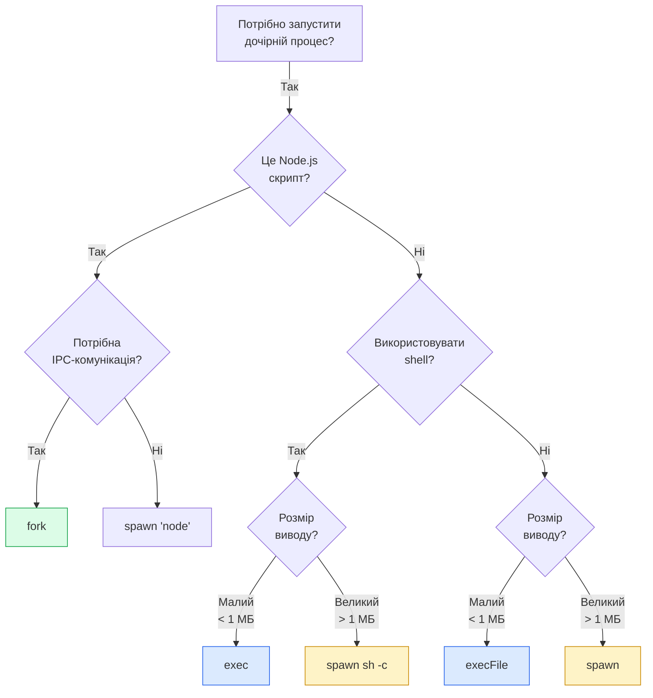
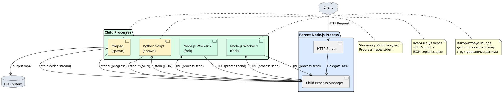

# Child Processes — запуск зовнішніх процесів

::card-group

::card{title="🎯 Мета лекції" icon="i-lucide-target"}

- Опанувати модуль `child_process` для запуску зовнішніх програм та утиліт з Node.js.
- Зрозуміти відмінності між методами `exec()`, `spawn()`, `execFile()` та `fork()`.
- Навчитися обробляти вивід дочірніх процесів через потоки (*streams*) та буфери.
- Дослідити міжпроцесну комунікацію (*IPC*) між батьківським та дочірнім Node.js процесами.
- Розрізняти сценарії використання Child Processes та Worker Threads.
- Оволодіти технікою безпечного запуску команд та валідації вводу для запобігання ін'єкцій.

::

::card{title="🔑 Ключові терміни" icon="i-lucide-key"}

- **Child Process (*дочірній процес*):** окремий процес операційної системи, створений батьківським процесом Node.js.
- **IPC (Inter-Process Communication):** механізм обміну даними між процесами через канали комунікації.
- **Shell:** командна оболонка операційної системи (bash, zsh, cmd.exe, PowerShell), що інтерпретує команди.
- **Stream:** потік даних, що дозволяє обробляти вивід процесу частинами (chunks), без завантаження всього у пам'ять.
- **Exit Code (*код виходу*):** числове значення (0-255), що повертає процес при завершенні (0 = успіх, >0 = помилка).

::

::

## Архітектурний контекст: обмеження однопроцесної моделі

У попередній лекції ми розглянули Worker Threads — механізм паралелізації **JavaScript коду** всередині одного процесу Node.js. Проте існують сценарії, де необхідно:

- Запустити **програми, написані іншими мовами** (Python, Ruby, Go, системні утиліти).
- Виконати **системні команди** (git, ffmpeg, ImageMagick, docker).
- **Ізолювати ненадійний код** у окремому процесі для запобігання crash всього застосунку.
- **Масштабувати** Node.js застосунок на кілька ядер процесора через кластеризацію.

Для цих задач Node.js надає модуль `child_process`, що дозволяє створювати та керувати дочірніми процесами операційної системи.

### Фундаментальна відмінність: Worker Threads vs Child Processes

::code-group

```typescript [Worker Threads]
import { Worker } from 'node:worker_threads';

// Виконується JAVASCRIPT у межах одного процесу
const worker = new Worker('./compute.ts');

// ✅ Спільна пам'ять через SharedArrayBuffer
// ✅ Швидка комунікація (structured clone)
// ✅ Легковаговий (~2-10 МБ на Worker)
// ❌ Лише JavaScript/TypeScript код
// ❌ Crash Worker може вплинути на процес
```

```typescript [Child Processes]
import { spawn } from 'node:child_process';

// Виконується БУДЬ-ЯКА ПРОГРАМА у окремому процесі ОС
const child = spawn('python3', ['script.py']);

// ❌ Немає спільної пам'яті
// ❌ Повільніша комунікація (IPC, pipes)
// ❌ Важковаговий (~30-50 МБ на процес)
// ✅ Будь-яка програма (Python, ffmpeg, bash)
// ✅ Повна ізоляція (crash не впливає)
```

::

::note
Child Process є **окремим процесом операційної системи** з власним адресним простором пам'яті, ідентифікатором процесу (PID) та ресурсами. На відміну від Worker Thread, що є потоком у межах одного процесу, Child Process забезпечує **повну ізоляцію** та **можливість запуску будь-якої програми**, а не лише JavaScript коду.
::

## Модуль `child_process`: огляд методів

Модуль `child_process` надає чотири основні методи створення дочірніх процесів:

| Метод         | Shell | Вивід        | Комунікація | Використання                          |
|---------------|-------|--------------|-------------|---------------------------------------|
| `exec()`      | ✅ Так | Buffer       | ❌ Ні       | Короткі shell-команди з невеликим виводом |
| `execFile()`  | ❌ Ні  | Buffer       | ❌ Ні       | Запуск виконуваних файлів без shell    |
| `spawn()`     | ❌ Ні  | Stream       | ❌ Ні       | Довгі процеси з великим виводом        |
| `fork()`      | ❌ Ні  | Stream       | ✅ IPC      | Дочірні Node.js процеси з комунікацією |

Також доступні синхронні версії (блокують Event Loop): `execSync()`, `execFileSync()`, `spawnSync()`.

### Візуалізація вибору методу

::mermaid



::

::tip
**Правило вибору:** Якщо потрібно запустити shell-команду (з пайпами, редиректами, підстановками) — використовуйте `exec()`. Якщо запускаєте конкретну програму з аргументами без shell — використовуйте `spawn()` або `execFile()`. Для Node.js процесів з IPC — використовуйте `fork()`.
::

## Метод `exec()`: запуск shell-команд

Метод `exec()` виконує команду через shell операційної системи (bash/zsh на Unix, cmd.exe/PowerShell на Windows) та буферизує весь вивід у пам'яті:

```typescript
import { exec } from 'node:child_process';
import { promisify } from 'node:util';

const execPromise = promisify(exec);

async function runShellCommand() {
  try {
    const { stdout, stderr } = await execPromise('ls -lah /usr/local/bin');
    
    console.log('=== STDOUT ===');
    console.log(stdout);
    
    if (stderr) {
      console.error('=== STDERR ===');
      console.error(stderr);
    }
  } catch (error) {
    const execError = error as { code: number; stdout: string; stderr: string };
    console.error('Помилка виконання команди:');
    console.error('Exit Code:', execError.code);
    console.error('STDERR:', execError.stderr);
  }
}

runShellCommand();
```

**Вивід:**

::terminal-preview{title="node exec-example.ts" :cursor="false"}

<div class="line"><span class="opacity-40">$</span> <strong class="font-bold">node exec-example.ts</strong></div>
<div class="line">=== STDOUT ===</div>
<div class="line">total 328</div>
<div class="line">drwxr-xr-x  45 root  wheel   1.4K Jan 15 10:30 <span class="text-blue-400">.</span></div>
<div class="line">drwxr-xr-x  11 root  wheel   352B Dec  1 09:15 <span class="text-blue-400">..</span></div>
<div class="line">-rwxr-xr-x   1 root  wheel    65K Jan 10 14:22 <span class="text-green-400 font-bold">node</span></div>
<div class="line">-rwxr-xr-x   1 root  wheel    42K Jan 10 14:22 <span class="text-green-400 font-bold">npm</span></div>
<div class="line">-rwxr-xr-x   1 root  wheel    38K Jan 10 14:22 <span class="text-green-400 font-bold">pnpm</span></div>
<div class="line"><span class="opacity-40">...</span></div>

::

### Синтаксис та параметри

```typescript
exec(
  command: string,
  options?: {
    cwd?: string;              // Робоча директорія
    env?: object;              // Змінні оточення
    shell?: string;            // Shell для виконання (default: '/bin/sh' або 'cmd.exe')
    timeout?: number;          // Таймаут у мілісекундах
    maxBuffer?: number;        // Максимальний розмір буфера (default: 1 МБ)
    encoding?: string;         // Кодування виводу (default: 'utf8')
    killSignal?: string;       // Сигнал для завершення процесу (default: 'SIGTERM')
  },
  callback?: (error, stdout, stderr) => void
): ChildProcess
```

### Використання shell-фіч: pipes та редиректи

Перевага `exec()` — можливість використання shell-синтаксису:

```typescript
import { exec } from 'node:child_process';
import { promisify } from 'node:util';

const execPromise = promisify(exec);

async function complexShellCommand() {
  try {
    // Використовуємо pipe для з'єднання команд
    const { stdout } = await execPromise(
      'cat package.json | grep "version" | head -n 1'
    );
    
    console.log('Версія з package.json:', stdout.trim());
    // Виведе: "version": "1.0.0",
  } catch (error) {
    console.error('Помилка:', error);
  }
}

async function countLogFiles() {
  try {
    // Використовуємо wildcard для підрахунку файлів
    const { stdout } = await execPromise('ls -1 logs/*.log 2>/dev/null | wc -l');
    
    const count = parseInt(stdout.trim(), 10);
    console.log(`Знайдено ${count} лог-файлів`);
  } catch (error) {
    console.error('Помилка:', error);
  }
}

complexShellCommand();
countLogFiles();
```

::warning
**Безпека:** Метод `exec()` виконує команди через shell, що робить його **вразливим до command injection атак**, якщо команда містить дані від користувача. **Ніколи** не вставляйте неперевірений user input у команду без валідації та екранування:

```typescript
// ❌ НЕБЕЗПЕЧНО: command injection
const userInput = req.query.filename; // "file.txt; rm -rf /"
exec(`cat ${userInput}`, callback); // Виконає rm -rf / !!!

// ✅ БЕЗПЕЧНО: використовуйте spawn() з масивом аргументів
spawn('cat', [userInput]);
```
::

### Обмеження розміру виводу

За замовчуванням `exec()` буферизує лише **1 МБ виводу**. Для великих виводів збільште `maxBuffer` або використовуйте `spawn()`:

```typescript
import { exec } from 'node:child_process';
import { promisify } from 'node:util';

const execPromise = promisify(exec);

async function largeOutput() {
  try {
    // ❌ Помилка: вивід перевищує 1 МБ
    await execPromise('find /usr -type f');
  } catch (error) {
    console.error(error); // Error: maxBuffer exceeded
  }
  
  try {
    // ✅ Збільшуємо буфер до 10 МБ
    const { stdout } = await execPromise('find /usr -type f', {
      maxBuffer: 10 * 1024 * 1024,
    });
    
    const lines = stdout.split('\n').length;
    console.log(`Знайдено ${lines} файлів`);
  } catch (error) {
    console.error('Помилка:', error);
  }
}

largeOutput();
```

::caution
Збільшення `maxBuffer` до дуже великих значень (>50 МБ) може призвести до високого споживання пам'яті. Для процесів з великим виводом (логи, результати обробки) використовуйте `spawn()` зі streaming обробкою.
::

## Синхронні версії: `execSync()` та `execFileSync()`

Node.js надає синхронні версії методів, що **блокують Event Loop** до завершення процесу:

```typescript
import { execSync } from 'node:child_process';

try {
  const output = execSync('git rev-parse --short HEAD', {
    encoding: 'utf-8',
    cwd: '/path/to/repo',
  });
  
  console.log('Поточний git commit:', output.trim());
} catch (error) {
  console.error('Помилка отримання git commit:', error);
}
```

::warning
**Критично важливо:** Синхронні методи (`execSync`, `execFileSync`, `spawnSync`) **блокують Event Loop** на весь час виконання процесу. Використовуйте їх **лише у скриптах** (CLI tools, build scripts), але **ніколи у серверних застосунках** (HTTP servers, API), де блокування Event Loop призведе до повної недоступності сервісу для інших користувачів.
::

### Коли використовувати синхронні методи

::card-group

::card{title="✅ Прийнятно" icon="i-lucide-check-circle"}

**Сценарії:**
- CLI-утиліти та скрипти автоматизації
- Build scripts (webpack plugins, gulp tasks)
- Тести (setup/teardown фікстур)
- Одноразові скрипти обробки даних

**Приклад:** Отримання версії Node.js у build script

```typescript
const nodeVersion = execSync('node --version', {
  encoding: 'utf-8'
}).trim();
console.log(`Build Node.js: ${nodeVersion}`);
```

::

::card{title="❌ Неприйнятно" icon="i-lucide-x-circle"}

**Сценарії:**
- HTTP-сервери та API
- WebSocket-сервери
- Довготривалі процеси (демони)
- Будь-які застосунки з Event Loop

**Приклад антипаттерну:**

```typescript
// ❌ АНТИПАТТЕРН: блокує всіх користувачів!
app.get('/git-log', (req, res) => {
  const log = execSync('git log --oneline');
  res.send(log); // Всі запити чекають!
});
```

::

::


## Метод `spawn()`: streaming вивід та довгі процеси

На відміну від `exec()`, що буферизує весь вивід у пам'яті, метод `spawn()` надає **потоки** (streams) для читання stdout/stderr та запису у stdin. Це робить його ідеальним для:

- Процесів з великим виводом (логи, результати обробки)
- Довготривалих процесів (серверів, моніторингу)
- Інтерактивних програм (REPL, CLI tools)
- Обробки даних у режимі реального часу

### Базовий приклад: запуск команди через spawn

```typescript
import { spawn } from 'node:child_process';

// Запускаємо команду 'ls -lah /usr/local'
const child = spawn('ls', ['-lah', '/usr/local']);

// child.stdout — це Readable Stream
child.stdout.on('data', (data: Buffer) => {
  console.log('[STDOUT]:', data.toString());
});

// child.stderr — потік для помилок
child.stderr.on('data', (data: Buffer) => {
  console.error('[STDERR]:', data.toString());
});

// Подія завершення процесу
child.on('close', (code: number, signal: string | null) => {
  console.log(`Процес завершено з кодом ${code}`);
  
  if (signal) {
    console.log(`Процес убито сигналом: ${signal}`);
  }
});

// Подія помилки запуску
child.on('error', (error: Error) => {
  console.error('Помилка запуску процесу:', error.message);
});
```

::note
Метод `spawn()` **не використовує shell** за замовчуванням. Це означає, що shell-специфічні фічі (pipes `|`, редиректи `>`, wildcards `*`, змінні `$VAR`) не працюють. Аргументи передаються як **масив рядків**, що робить метод **безпечним від command injection**.
::

### Передача аргументів: масив vs shell-команда

::code-group

```typescript [spawn() — безпечно]
import { spawn } from 'node:child_process';

// Аргументи передаються як масив
const userInput = req.query.filename; // "file.txt; rm -rf /"

// ✅ БЕЗПЕЧНО: userInput буде оброблений як ONE аргумент
const child = spawn('cat', [userInput]);

// Навіть якщо userInput = "file.txt; rm -rf /",
// команда інтерпретується як:
// cat "file.txt; rm -rf /" (шукає файл з таким ім'ям)
```

```typescript [exec() — небезпечно]
import { exec } from 'node:child_process';

const userInput = req.query.filename; // "file.txt; rm -rf /"

// ❌ НЕБЕЗПЕЧНО: shell інтерпретує ; як роздільник команд
exec(`cat ${userInput}`, (error, stdout, stderr) => {
  // Виконає ДВІ команди:
  // 1. cat file.txt
  // 2. rm -rf / (видалить всю файлову систему!)
});
```

::

### Обробка великих виводів: streaming vs buffering

Порівняємо обробку виводу команди `find`, що може повернути мільйони рядків:

::code-group

```typescript [exec() — буферизація]
import { exec } from 'node:child_process';
import { promisify } from 'node:util';

const execPromise = promisify(exec);

async function findFilesBuffered() {
  try {
    // ❌ Завантажує ВСЬ вивід у пам'ять
    const { stdout } = await execPromise('find /usr -type f', {
      maxBuffer: 50 * 1024 * 1024, // 50 МБ буфер
    });
    
    const files = stdout.split('\n');
    console.log(`Знайдено ${files.length} файлів`);
    
    // Споживання пам'яті: ~50 МБ
  } catch (error) {
    console.error('Помилка:', error);
  }
}
```

```typescript [spawn() — streaming]
import { spawn } from 'node:child_process';

function findFilesStreaming() {
  const child = spawn('find', ['/usr', '-type', 'f']);
  
  let lineCount = 0;
  let buffer = '';
  
  // ✅ Обробляємо вивід по частинах (chunks)
  child.stdout.on('data', (chunk: Buffer) => {
    buffer += chunk.toString();
    
    const lines = buffer.split('\n');
    buffer = lines.pop() || ''; // Залишаємо неповний рядок у буфері
    
    lineCount += lines.length;
    
    // Обробляємо кожен рядок окремо
    lines.forEach((line) => {
      if (line.endsWith('.log')) {
        console.log('Лог-файл:', line);
      }
    });
  });
  
  child.on('close', () => {
    console.log(`Оброблено ${lineCount} файлів`);
    // Споживання пам'яті: ~1-5 МБ (лише поточний chunk)
  });
}
```

::

### Передача даних у stdin: інтерактивна комунікація

`spawn()` дозволяє передавати дані у stdin дочірнього процесу через Writable Stream:

```typescript
import { spawn } from 'node:child_process';

// Запускаємо Python-скрипт, що читає з stdin
const python = spawn('python3', ['-c', `
import sys
for line in sys.stdin:
    print(f"Python отримав: {line.strip()}")
    sys.stdout.flush()
`]);

// python.stdin — Writable Stream
python.stdin.write('Перше повідомлення\n');
python.stdin.write('Друге повідомлення\n');
python.stdin.write('Третє повідомлення\n');

// Закриваємо stdin (надсилаємо EOF)
python.stdin.end();

python.stdout.on('data', (data: Buffer) => {
  console.log('[Python STDOUT]:', data.toString());
});

python.on('close', (code) => {
  console.log(`Python завершився з кодом ${code}`);
});
```

**Вивід:**

::terminal-preview{title="node spawn-stdin.ts" :cursor="false"}

<div class="line"><span class="opacity-40">$</span> <strong class="font-bold">node spawn-stdin.ts</strong></div>
<div class="line">[Python STDOUT]: Python отримав: Перше повідомлення</div>
<div class="line">[Python STDOUT]: Python отримав: Друге повідомлення</div>
<div class="line">[Python STDOUT]: Python отримав: Третє повідомлення</div>
<div class="line">Python завершився з кодом <span class="text-green-400 font-bold">0</span></div>

::

### Використання shell-команд через spawn

Якщо потрібно використати shell-фічі (pipes, редиректи), передайте опцію `shell: true`:

```typescript
import { spawn } from 'node:child_process';

// ✅ З shell: дозволяє використовувати pipes
const child = spawn('ls -lah | grep node | wc -l', {
  shell: true,
});

child.stdout.on('data', (data: Buffer) => {
  console.log('Кількість файлів з "node":', data.toString().trim());
});

// Альтернатива: явно вказати shell
const child2 = spawn('bash', [
  '-c',
  'cat package.json | jq .version'
]);
```

::warning
Опція `shell: true` робить `spawn()` **вразливим до command injection**, як і `exec()`. Використовуйте її лише з довіреними командами або коли shell-функціональність дійсно необхідна.
::

## Метод `execFile()`: запуск виконуваних файлів без shell

Метод `execFile()` є проміжним рішенням між `exec()` та `spawn()`:

- Не використовує shell (безпечніше)
- Буферизує вивід у пам'яті (як `exec()`)
- Швидший за `exec()` (відсутність overhead shell)

```typescript
import { execFile } from 'node:child_process';
import { promisify } from 'node:util';

const execFilePromise = promisify(execFile);

async function runExecutable() {
  try {
    // Запускаємо виконуваний файл напряму
    const { stdout, stderr } = await execFilePromise('/usr/bin/git', [
      'log',
      '--oneline',
      '-n',
      '5',
    ]);
    
    console.log('Останні 5 git commits:');
    console.log(stdout);
  } catch (error) {
    console.error('Помилка:', error);
  }
}

runExecutable();
```

### Коли використовувати `execFile()` замість `exec()`

::card-group

::card{title="✅ execFile()" icon="i-lucide-zap"}

**Переваги:**
- Безпечніше (немає shell interpretation)
- Швидше (відсутність overhead shell)
- Підходить для виконуваних файлів

**Використовуйте для:**
- Запуску бінарних утиліт (git, curl, ffmpeg)
- Виконання скриптів з shebang (`#!/usr/bin/env node`)
- Коли не потрібні shell-фічі

::

::card{title="✅ exec()" icon="i-lucide-terminal"}

**Переваги:**
- Підтримка shell-синтаксису (pipes, редиректи)
- Зручно для простих команд

**Використовуйте для:**
- Складних команд з pipes (`cat | grep | sort`)
- Використання shell-функцій (wildcards, змінних)
- Швидкого прототипування

::

::

## Обробка помилок та exit codes

Дочірній процес може завершитися з **кодом виходу** (*exit code*) від 0 до 255:

- **0:** успішне завершення
- **1-127:** помилки програми
- **128+N:** процес убито сигналом N (наприклад, 137 = SIGKILL)

```typescript
import { spawn } from 'node:child_process';

function runCommandWithErrorHandling(command: string, args: string[]) {
  const child = spawn(command, args);
  
  let stdout = '';
  let stderr = '';
  
  child.stdout.on('data', (data) => {
    stdout += data.toString();
  });
  
  child.stderr.on('data', (data) => {
    stderr += data.toString();
  });
  
  child.on('close', (code, signal) => {
    if (code === 0) {
      console.log('✓ Команда виконана успішно');
      console.log(stdout);
    } else if (signal) {
      console.error(`✗ Процес убито сигналом: ${signal}`);
    } else {
      console.error(`✗ Команда завершилась з помилкою (exit code ${code})`);
      console.error('STDERR:', stderr);
      
      // Інтерпретація типових exit codes
      switch (code) {
        case 1:
          console.error('Загальна помилка виконання');
          break;
        case 126:
          console.error('Команда знайдена, але не може бути виконана');
          break;
        case 127:
          console.error('Команда не знайдена');
          break;
        case 130:
          console.error('Процес перервано (Ctrl+C)');
          break;
        default:
          console.error('Невідома помилка');
      }
    }
  });
  
  child.on('error', (error) => {
    console.error('✗ Помилка запуску процесу:', error.message);
    
    if (error.message.includes('ENOENT')) {
      console.error('Програма не знайдена. Перевірте PATH.');
    }
  });
}

// Приклад: команда, що не існує
runCommandWithErrorHandling('nonexistent-command', ['arg1']);

// Приклад: команда з помилкою виконання
runCommandWithErrorHandling('ls', ['/nonexistent-directory']);
```

**Вивід:**

::terminal-preview{title="node error-handling.ts" :cursor="false"}

<div class="line"><span class="opacity-40">$</span> <strong class="font-bold">node error-handling.ts</strong></div>
<div class="line"><span class="text-rose-400">✗ Помилка запуску процесу: spawn nonexistent-command ENOENT</span></div>
<div class="line">Програма не знайдена. Перевірте PATH.</div>
<div class="line"></div>
<div class="line"><span class="text-rose-400">✗ Команда завершилась з помилкою (exit code 1)</span></div>
<div class="line">STDERR: ls: /nonexistent-directory: No such file or directory</div>
<div class="line">Загальна помилка виконання</div>

::

::tip
Завжди обробляйте обидві події: `'close'` (нормальне завершення) та `'error'` (помилка запуску). Подія `'error'` генерується, коли процес не вдалося запустити (команда не знайдена, недостатньо прав), тоді як `'close'` генерується при будь-якому завершенні процесу, включаючи помилки виконання.
::

## Таймаути та примусове завершення процесів

Для запобігання зависання процесів встановлюйте таймаути:

```typescript
import { spawn } from 'node:child_process';

function runWithTimeout(
  command: string,
  args: string[],
  timeoutMs: number
): Promise<string> {
  return new Promise((resolve, reject) => {
    const child = spawn(command, args);
    let stdout = '';
    let timedOut = false;
    
    // Встановлюємо таймаут
    const timeout = setTimeout(() => {
      timedOut = true;
      child.kill('SIGTERM'); // Спроба graceful shutdown
      
      // Якщо через 5 секунд процес не завершився — kill -9
      setTimeout(() => {
        if (!child.killed) {
          child.kill('SIGKILL');
        }
      }, 5000);
    }, timeoutMs);
    
    child.stdout.on('data', (data) => {
      stdout += data.toString();
    });
    
    child.on('close', (code) => {
      clearTimeout(timeout);
      
      if (timedOut) {
        reject(new Error(`Процес перевищив таймаут ${timeoutMs}мс`));
      } else if (code === 0) {
        resolve(stdout);
      } else {
        reject(new Error(`Exit code ${code}`));
      }
    });
    
    child.on('error', (error) => {
      clearTimeout(timeout);
      reject(error);
    });
  });
}

// Використання
runWithTimeout('sleep', ['10'], 2000) // Таймаут 2 секунди
  .then((output) => console.log('Вивід:', output))
  .catch((error) => console.error('Помилка:', error.message));
  
// Вивід: Помилка: Процес перевищив таймаут 2000мс
```

::note
**Сигнали завершення процесів:**
- `SIGTERM` (15): graceful shutdown — дозволяє процесу завершити роботу коректно
- `SIGKILL` (9): примусове завершення — процес убивається негайно, без можливості очищення ресурсів
- `SIGINT` (2): переривання (Ctrl+C) — зазвичай обробляється процесом для graceful shutdown

Завжди спочатку намагайтеся використати `SIGTERM`, і лише якщо процес не реагує протягом кількох секунд — використовуйте `SIGKILL`.
::


## Метод `fork()`: створення дочірніх Node.js процесів з IPC

Метод `fork()` є спеціалізованою версією `spawn()` для створення дочірніх **Node.js процесів** з вбудованим каналом міжпроцесної комунікації (*IPC — Inter-Process Communication*). Це дозволяє батьківському та дочірнім процесам обмінюватися повідомленнями через `process.send()` та `process.on('message')`.

### Базовий приклад: батьківський та дочірній процеси

**worker.ts** — дочірній процес:

```typescript
// worker.ts
process.on('message', (message: any) => {
  console.log('[Worker] Отримано повідомлення:', message);
  
  if (message.task === 'compute') {
    const result = fibonacci(message.n);
    
    // Відправляємо результат назад у батьківський процес
    process.send?.({
      task: 'compute',
      result,
      workerId: process.pid,
    });
  }
});

function fibonacci(n: number): number {
  if (n <= 1) return n;
  return fibonacci(n - 1) + fibonacci(n - 2);
}

console.log(`[Worker ${process.pid}] Готовий до роботи`);

// Повідомляємо батьківський процес про готовність
process.send?.({ status: 'ready', pid: process.pid });
```

**main.ts** — батьківський процес:

```typescript
// main.ts
import { fork } from 'node:child_process';
import { resolve } from 'node:path';

const worker = fork(resolve(__dirname, 'worker.ts'));

worker.on('message', (message: any) => {
  console.log('[Main] Отримано від Worker:', message);
  
  if (message.status === 'ready') {
    console.log(`[Main] Worker ${message.pid} готовий`);
    
    // Відправляємо завдання у Worker
    worker.send({
      task: 'compute',
      n: 42,
    });
  } else if (message.task === 'compute') {
    console.log(`[Main] Результат обчислення: ${message.result}`);
    
    // Завершуємо Worker після отримання результату
    worker.disconnect();
  }
});

worker.on('exit', (code, signal) => {
  console.log(`[Main] Worker завершено з кодом ${code}`);
});

console.log('[Main] Запуск Worker процесу...');
```

**Вивід:**

::terminal-preview{title="node main.ts" :cursor="false"}

<div class="line"><span class="opacity-40">$</span> <strong class="font-bold">node main.ts</strong></div>
<div class="line">[Main] Запуск Worker процесу...</div>
<div class="line">[Worker <span class="text-blue-400">12345</span>] Готовий до роботи</div>
<div class="line">[Main] Отримано від Worker: { status: 'ready', pid: <span class="text-blue-400">12345</span> }</div>
<div class="line">[Main] Worker <span class="text-blue-400">12345</span> готовий</div>
<div class="line">[Worker] Отримано повідомлення: { task: 'compute', n: 42 }</div>
<div class="line">[Main] Отримано від Worker: { task: 'compute', result: <span class="text-green-400 font-bold">267914296</span>, workerId: <span class="text-blue-400">12345</span> }</div>
<div class="line">[Main] Результат обчислення: <span class="text-green-400 font-bold">267914296</span></div>
<div class="line">[Main] Worker завершено з кодом <span class="text-green-400 font-bold">0</span></div>

::

### Відмінності `fork()` від `spawn()`

| Характеристика       | `fork()`                           | `spawn()`                        |
|----------------------|------------------------------------|----------------------------------|
| **Тип процесу**      | Лише Node.js скрипти               | Будь-яка програма                |
| **IPC-канал**        | ✅ Вбудований (`process.send()`)   | ❌ Немає (лише stdin/stdout)     |
| **Використання**     | Паралелізація Node.js коду         | Запуск зовнішніх програм         |
| **Комунікація**      | Structured messages (objects)      | Текстові потоки (strings)        |
| **Overhead**         | Вищий (повний Node.js процес)      | Нижчий (залежить від програми)   |

::note
Метод `fork()` автоматично встановлює змінну оточення `NODE_CHANNEL_FD`, що дозволяє дочірньому Node.js процесу використовувати `process.send()` та `process.on('message')` для комунікації з батьківським процесом. Якщо спробувати викликати `process.send()` у процесі, що **не** був створений через `fork()`, виникне помилка.
::

## Паралельна обробка даних через fork(): Worker Pool

Розглянемо практичний приклад створення пулу дочірніх процесів для паралельної обробки великого масиву даних:

**processor-worker.ts** — дочірній процес-обробник:

```typescript
import { readFile } from 'node:fs/promises';

interface Task {
  taskId: string;
  filePath: string;
}

process.on('message', async (task: Task) => {
  try {
    console.log(`[Worker ${process.pid}] Обробка файлу: ${task.filePath}`);
    
    // Читаємо файл
    const content = await readFile(task.filePath, 'utf-8');
    
    // Обробляємо дані (підрахунок слів)
    const words = content.split(/\s+/).filter((w) => w.length > 0);
    const wordCount = words.length;
    const uniqueWords = new Set(words.map((w) => w.toLowerCase()));
    
    // Відправляємо результат
    process.send?.({
      taskId: task.taskId,
      filePath: task.filePath,
      wordCount,
      uniqueWordCount: uniqueWords.size,
      pid: process.pid,
    });
  } catch (error) {
    process.send?.({
      taskId: task.taskId,
      error: (error as Error).message,
      pid: process.pid,
    });
  }
});

process.send?.({ status: 'ready', pid: process.pid });
```

**main.ts** — координатор з Worker Pool:

```typescript
import { fork, ChildProcess } from 'node:child_process';
import { readdir } from 'node:fs/promises';
import { resolve, join } from 'node:path';
import { cpus } from 'node:os';

interface Task {
  taskId: string;
  filePath: string;
}

class ProcessPool {
  private workers: ChildProcess[] = [];
  private freeWorkers: ChildProcess[] = [];
  private taskQueue: Task[] = [];
  private results = new Map<string, any>();
  
  constructor(
    private workerScript: string,
    private poolSize: number = cpus().length
  ) {}
  
  async initialize(): Promise<void> {
    console.log(`Створення пулу з ${this.poolSize} процесів...`);
    
    const workerPromises = Array.from({ length: this.poolSize }, (_, i) => {
      return new Promise<void>((resolve) => {
        const worker = fork(resolve(__dirname, this.workerScript));
        
        worker.on('message', (message: any) => {
          if (message.status === 'ready') {
            console.log(`Worker ${message.pid} готовий`);
            this.workers.push(worker);
            this.freeWorkers.push(worker);
            resolve();
          } else {
            this.handleWorkerResult(worker, message);
          }
        });
        
        worker.on('exit', (code) => {
          console.log(`Worker завершено з кодом ${code}`);
          this.removeWorker(worker);
        });
      });
    });
    
    await Promise.all(workerPromises);
    console.log('Пул процесів готовий\n');
  }
  
  private handleWorkerResult(worker: ChildProcess, result: any): void {
    this.results.set(result.taskId, result);
    
    if (result.error) {
      console.error(`✗ Помилка обробки ${result.taskId}: ${result.error}`);
    } else {
      console.log(`✓ Оброблено ${result.filePath} (${result.wordCount} слів)`);
    }
    
    // Повертаємо Worker у пул вільних
    this.freeWorkers.push(worker);
    
    // Обробляємо наступну задачу з черги
    this.processNextTask();
  }
  
  private processNextTask(): void {
    if (this.taskQueue.length === 0 || this.freeWorkers.length === 0) {
      return;
    }
    
    const task = this.taskQueue.shift()!;
    const worker = this.freeWorkers.shift()!;
    
    worker.send(task);
  }
  
  private removeWorker(worker: ChildProcess): void {
    const idx = this.workers.indexOf(worker);
    if (idx !== -1) this.workers.splice(idx, 1);
    
    const freeIdx = this.freeWorkers.indexOf(worker);
    if (freeIdx !== -1) this.freeWorkers.splice(freeIdx, 1);
  }
  
  public async submitTask(task: Task): Promise<void> {
    this.taskQueue.push(task);
    this.processNextTask();
  }
  
  public async waitForCompletion(): Promise<Map<string, any>> {
    return new Promise((resolve) => {
      const checkInterval = setInterval(() => {
        const allTasksProcessed = 
          this.taskQueue.length === 0 &&
          this.freeWorkers.length === this.workers.length;
        
        if (allTasksProcessed) {
          clearInterval(checkInterval);
          resolve(this.results);
        }
      }, 100);
    });
  }
  
  public async terminate(): Promise<void> {
    console.log('\nЗавершення всіх Worker процесів...');
    
    for (const worker of this.workers) {
      worker.disconnect();
      worker.kill();
    }
    
    this.workers = [];
    this.freeWorkers = [];
  }
}

// Використання
async function main() {
  const pool = new ProcessPool('processor-worker.ts', 4);
  await pool.initialize();
  
  // Отримуємо список файлів для обробки
  const files = await readdir('./data');
  const textFiles = files.filter((f) => f.endsWith('.txt'));
  
  console.log(`Відправка ${textFiles.length} файлів на обробку...\n`);
  const startTime = Date.now();
  
  // Відправляємо задачі у пул
  for (const file of textFiles) {
    await pool.submitTask({
      taskId: file,
      filePath: join('./data', file),
    });
  }
  
  // Чекаємо завершення всіх задач
  const results = await pool.waitForCompletion();
  
  const duration = Date.now() - startTime;
  
  // Статистика
  const successful = Array.from(results.values()).filter((r) => !r.error);
  const totalWords = successful.reduce((sum, r) => sum + r.wordCount, 0);
  
  console.log('\n=== Результати ===');
  console.log(`Оброблено файлів: ${successful.length}`);
  console.log(`Загальна кількість слів: ${totalWords}`);
  console.log(`Час виконання: ${(duration / 1000).toFixed(2)}с`);
  
  await pool.terminate();
}

main().catch(console.error);
```

**Вивід:**

::terminal-preview{title="node main.ts" :cursor="false"}

<div class="line"><span class="opacity-40">$</span> <strong class="font-bold">node main.ts</strong></div>
<div class="line">Створення пулу з <span class="text-blue-400 font-bold">4</span> процесів...</div>
<div class="line">Worker <span class="opacity-40">12346</span> готовий</div>
<div class="line">Worker <span class="opacity-40">12347</span> готовий</div>
<div class="line">Worker <span class="opacity-40">12348</span> готовий</div>
<div class="line">Worker <span class="opacity-40">12349</span> готовий</div>
<div class="line">Пул процесів готовий</div>
<div class="line"></div>
<div class="line">Відправка <span class="text-blue-400 font-bold">12</span> файлів на обробку...</div>
<div class="line"></div>
<div class="line">[Worker <span class="opacity-40">12346</span>] Обробка файлу: ./data/article-01.txt</div>
<div class="line">[Worker <span class="opacity-40">12347</span>] Обробка файлу: ./data/article-02.txt</div>
<div class="line">[Worker <span class="opacity-40">12348</span>] Обробка файлу: ./data/article-03.txt</div>
<div class="line">[Worker <span class="opacity-40">12349</span>] Обробка файлу: ./data/article-04.txt</div>
<div class="line"><span class="text-green-400">✓</span> Оброблено ./data/article-01.txt (<span class="text-green-400 font-bold">2847</span> слів)</div>
<div class="line"><span class="text-green-400">✓</span> Оброблено ./data/article-02.txt (<span class="text-green-400 font-bold">1923</span> слів)</div>
<div class="line"><span class="opacity-40">...</span></div>
<div class="line"></div>
<div class="line"><span class="text-blue-400 font-bold">=== Результати ===</span></div>
<div class="line">Оброблено файлів: <span class="text-green-400 font-bold">12</span></div>
<div class="line">Загальна кількість слів: <span class="text-green-400 font-bold">28492</span></div>
<div class="line">Час виконання: <span class="text-blue-400 font-bold">3.47</span>с</div>
<div class="line"></div>
<div class="line">Завершення всіх Worker процесів...</div>

::

::tip
Використовуйте `fork()` для створення Worker Pool, коли:
- Кожна задача займає >500мс (щоб накладні витрати на IPC були виправданими)
- Потрібна **повна ізоляція** — crash одного Worker не впливає на інші
- Обробляються **незалежні задачі** (файли, запити, обчислення)

Для коротших задач (<500мс) або коли потрібна спільна пам'ять — використовуйте Worker Threads.
::

## Практичний приклад: інтеграція з Python

Розглянемо реальний сценарій інтеграції Node.js з Python для машинного навчання:

**ml_model.py** — Python-скрипт з ML-моделлю:

```python
import sys
import json
import numpy as np
from sklearn.linear_model import LinearRegression

def train_and_predict(data_points):
    """Навчання лінійної регресії та передбачення"""
    X = np.array([[x] for x, _ in data_points])
    y = np.array([y for _, y in data_points])
    
    model = LinearRegression()
    model.fit(X, y)
    
    # Передбачення для наступних 5 точок
    future_X = np.array([[max(X)[0] + i] for i in range(1, 6)])
    predictions = model.predict(future_X)
    
    return {
        'slope': float(model.coef_[0]),
        'intercept': float(model.intercept_),
        'predictions': predictions.tolist()
    }

if __name__ == '__main__':
    # Читаємо JSON з stdin
    input_data = json.loads(sys.stdin.read())
    
    result = train_and_predict(input_data['dataPoints'])
    
    # Виводимо JSON у stdout
    print(json.dumps(result))
    sys.stdout.flush()
```

**node-ml-bridge.ts** — Node.js інтерфейс:

```typescript
import { spawn } from 'node:child_process';

interface DataPoint {
  x: number;
  y: number;
}

interface MLResult {
  slope: number;
  intercept: number;
  predictions: number[];
}

function runPythonML(dataPoints: DataPoint[]): Promise<MLResult> {
  return new Promise((resolve, reject) => {
    const python = spawn('python3', ['ml_model.py']);
    
    let stdout = '';
    let stderr = '';
    
    python.stdout.on('data', (data) => {
      stdout += data.toString();
    });
    
    python.stderr.on('data', (data) => {
      stderr += data.toString();
    });
    
    python.on('close', (code) => {
      if (code === 0) {
        try {
          const result = JSON.parse(stdout);
          resolve(result);
        } catch (error) {
          reject(new Error(`Помилка парсингу JSON: ${error}`));
        }
      } else {
        reject(new Error(`Python завершився з кодом ${code}\nSTDERR: ${stderr}`));
      }
    });
    
    python.on('error', (error) => {
      reject(new Error(`Помилка запуску Python: ${error.message}`));
    });
    
    // Відправляємо дані у Python через stdin
    python.stdin.write(JSON.stringify({ dataPoints }));
    python.stdin.end();
  });
}

// Використання
async function main() {
  const trainingData: DataPoint[] = [
    { x: 1, y: 2.1 },
    { x: 2, y: 3.9 },
    { x: 3, y: 6.2 },
    { x: 4, y: 7.8 },
    { x: 5, y: 10.1 },
    { x: 6, y: 11.9 },
  ];
  
  console.log('Навчання ML-моделі через Python...');
  
  try {
    const result = await runPythonML(trainingData);
    
    console.log('\n=== Результати моделі ===');
    console.log(`Нахил (slope): ${result.slope.toFixed(4)}`);
    console.log(`Зміщення (intercept): ${result.intercept.toFixed(4)}`);
    console.log('\nПередбачення для наступних 5 точок:');
    result.predictions.forEach((pred, i) => {
      console.log(`  x=${7 + i}: y ≈ ${pred.toFixed(2)}`);
    });
  } catch (error) {
    console.error('Помилка:', (error as Error).message);
  }
}

main();
```

**Вивід:**

::terminal-preview{title="node node-ml-bridge.ts" :cursor="false"}

<div class="line"><span class="opacity-40">$</span> <strong class="font-bold">node node-ml-bridge.ts</strong></div>
<div class="line">Навчання ML-моделі через Python...</div>
<div class="line"></div>
<div class="line"><span class="text-blue-400 font-bold">=== Результати моделі ===</span></div>
<div class="line">Нахил (slope): <span class="text-green-400 font-bold">1.9857</span></div>
<div class="line">Зміщення (intercept): <span class="text-green-400 font-bold">0.1429</span></div>
<div class="line"></div>
<div class="line">Передбачення для наступних 5 точок:</div>
<div class="line">  x=7: y ≈ <span class="text-green-400">14.04</span></div>
<div class="line">  x=8: y ≈ <span class="text-green-400">16.03</span></div>
<div class="line">  x=9: y ≈ <span class="text-green-400">18.01</span></div>
<div class="line">  x=10: y ≈ <span class="text-green-400">20.00</span></div>
<div class="line">  x=11: y ≈ <span class="text-green-400">21.99</span></div>

::

Цей підхід дозволяє використовувати потужні Python-бібліотеки (NumPy, scikit-learn, TensorFlow) з Node.js застосунків без необхідності переписувати ML-логіку на JavaScript.


## Візуалізація: архітектура Child Processes

Розглянемо діаграму взаємодії батьківського процесу Node.js з дочірніми процесами різних типів:

::plant-uml{alt="Архітектура Child Processes"}



::

## Порівняння підходів: Worker Threads vs Child Processes vs Cluster

Node.js надає три механізми паралелізму, кожен з яких має свою нішу:

::code-group

```typescript [Worker Threads]
import { Worker } from 'node:worker_threads';

// Паралелізація JavaScript у межах процесу
const worker = new Worker('./compute.ts', {
  workerData: { n: 1000000 }
});

// ✅ Ідеально для:
// - CPU-інтенсивних JS обчислень
// - Спільної пам'яті (SharedArrayBuffer)
// - Низьких накладних витрат

// ❌ Обмеження:
// - Лише JavaScript/TypeScript
// - Спільний heap (crash може вплинути)
```

```typescript [Child Processes]
import { spawn } from 'node:child_process';

// Запуск будь-якої програми у окремому процесі
const child = spawn('python3', ['script.py']);

// ✅ Ідеально для:
// - Сторонніх програм (Python, ffmpeg)
// - Повної ізоляції
// - Системних утиліт

// ❌ Обмеження:
// - Високі накладні витрати (процес ОС)
// - Повільна комунікація (IPC)
```

```typescript [Cluster Module]
import cluster from 'node:cluster';
import { cpus } from 'node:os';

// Кластеризація HTTP-сервера на всі ядра
if (cluster.isPrimary) {
  cpus().forEach(() => cluster.fork());
} else {
  // Кожен Worker запускає HTTP-сервер
  createServer().listen(3000);
}

// ✅ Ідеально для:
// - Горизонтального масштабування серверів
// - Load balancing між ядрами
// - High-availability (crash одного = інші працюють)

// ❌ Обмеження:
// - Лише для серверів (HTTP/WebSocket)
// - Немає спільного стану
```

::

### Таблиця порівняння

| Критерій                 | Worker Threads     | Child Processes       | Cluster Module        |
|--------------------------|--------------------|-----------------------|-----------------------|
| **Час створення**        | ~10-30мс           | ~50-200мс             | ~50-200мс             |
| **Пам'ять на Worker**    | ~2-10 МБ           | ~30-50 МБ             | ~30-50 МБ             |
| **Ізоляція**             | Слабка             | Сильна                | Сильна                |
| **Спільна пам'ять**      | ✅ SharedArrayBuffer| ❌ Ні                 | ❌ Ні                 |
| **Типи програм**         | Лише JS            | Будь-які              | Лише Node.js          |
| **IPC швидкість**        | Дуже швидка        | Середня               | Середня               |
| **Використання**         | CPU-bound JS       | Зовнішні програми     | HTTP/WebSocket servers|

## Безпека: валідація та екранування команд

При роботі з Child Processes критично важливо запобігати **command injection** атакам:

### Небезпечні паттерни

```typescript
import { exec } from 'node:child_process';

// ❌ КРИТИЧНА ВРАЗЛИВІСТЬ: user input у exec()
app.get('/api/file', (req, res) => {
  const filename = req.query.filename; // "file.txt; rm -rf /"
  
  exec(`cat ${filename}`, (error, stdout) => {
    // Shell виконає ДВІ команди:
    // 1. cat file.txt
    // 2. rm -rf / (видалить всю файлову систему!)
    res.send(stdout);
  });
});
```

### Безпечні підходи

::steps

### Крок 1: Використовуйте `spawn()` замість `exec()`

```typescript
import { spawn } from 'node:child_process';

app.get('/api/file', (req, res) => {
  const filename = req.query.filename;
  
  // ✅ БЕЗПЕЧНО: filename передається як аргумент, не інтерпретується shell
  const cat = spawn('cat', [filename]);
  
  cat.stdout.pipe(res);
  cat.stderr.on('data', (data) => {
    console.error('Error:', data.toString());
  });
});
```

### Крок 2: Валідуйте user input

```typescript
import { spawn } from 'node:child_process';
import { resolve, normalize } from 'node:path';

app.get('/api/file', (req, res) => {
  const filename = req.query.filename as string;
  
  // ✅ Валідація: лише буквено-цифрові символи та дефіс
  if (!/^[\w\-\.]+$/.test(filename)) {
    return res.status(400).json({ error: 'Invalid filename' });
  }
  
  // ✅ Обмеження директорії: лише /data/files/
  const allowedDir = resolve(__dirname, 'data/files');
  const requestedPath = normalize(resolve(allowedDir, filename));
  
  if (!requestedPath.startsWith(allowedDir)) {
    return res.status(403).json({ error: 'Access denied' });
  }
  
  const cat = spawn('cat', [requestedPath]);
  cat.stdout.pipe(res);
});
```

### Крок 3: Використовуйте whitelist дозволених команд

```typescript
const ALLOWED_COMMANDS = new Map([
  ['imagemagick', '/usr/bin/convert'],
  ['ffmpeg', '/usr/bin/ffmpeg'],
  ['git', '/usr/bin/git'],
]);

function runAllowedCommand(
  command: string,
  args: string[]
): Promise<string> {
  const execPath = ALLOWED_COMMANDS.get(command);
  
  if (!execPath) {
    throw new Error(`Command "${command}" not allowed`);
  }
  
  return new Promise((resolve, reject) => {
    const child = spawn(execPath, args);
    let stdout = '';
    
    child.stdout.on('data', (data) => {
      stdout += data.toString();
    });
    
    child.on('close', (code) => {
      if (code === 0) resolve(stdout);
      else reject(new Error(`Exit code ${code}`));
    });
  });
}

// Використання
runAllowedCommand('imagemagick', ['-resize', '50%', 'input.jpg', 'output.jpg']);
```

::

::caution
**Критичні правила безпеки:**

1. **Ніколи** не використовуйте `exec()` з user input
2. Завжди **валідуйте** user input (whitelist, regex, path traversal)
3. Використовуйте `spawn()` з масивом аргументів
4. Обмежуйте **дозволені команди** через whitelist
5. Встановлюйте **таймаути** для запобігання DoS атакам
6. Логуйте всі **виклики команд** для аудиту безпеки
::

## Підсумок та рекомендації

Child Processes є потужним механізмом інтеграції Node.js з зовнішніми програмами та масштабування застосунків, але вимагають обережного використання.

### Коли використовувати Child Processes

::card-group

::card{title="✅ Рекомендовано" icon="i-lucide-check-circle"}

**Сценарії використання:**

- Запуск системних утиліт (git, docker, curl, tar)
- Конвертація медіа через ffmpeg, ImageMagick
- Інтеграція з Python/Ruby/Go скриптами
- Виконання bash/shell скриптів
- Ізоляція ненадійного коду (plugins, user scripts)
- Паралельна обробка незалежних задач
- Масштабування HTTP-серверів (через Cluster)

**Критерії:**

- Потрібно запустити **не-JavaScript** програму
- Необхідна **повна ізоляція** (crash не повинен впливати)
- Задача займає >500мс (накладні витрати виправдані)

::

::card{title="❌ НЕ рекомендовано" icon="i-lucide-x-circle"}

**Антипаттерни:**

- Короткі операції (<100мс) — overhead перевищує виграш
- JavaScript обчислення — використовуйте Worker Threads
- I/O операції — використовуйте async/await
- Потрібна спільна пам'ять — використовуйте Worker Threads
- User input у команди без валідації — command injection!

**Альтернативи:**

- Worker Threads для JavaScript коду
- async/await для I/O операцій
- Нативні модулі (N-API) для С/С++ інтеграції
- Cluster Module для HTTP-серверів

::

::

### Чек-лист використання Child Processes

::field-group

::field{name="Вибір методу" type="checklist"}

- [ ] `exec()` — для простих shell-команд з малим виводом (<1 МБ)
- [ ] `spawn()` — для процесів з великим виводом або streaming
- [ ] `fork()` — для дочірніх Node.js процесів з IPC
- [ ] `execFile()` — для виконуваних файлів без shell

::

::field{name="Безпека" type="checklist"}

- [ ] Валідація всього user input (whitelist, regex)
- [ ] Використання `spawn()` замість `exec()` з user data
- [ ] Обмеження дозволених команд через whitelist
- [ ] Перевірка path traversal атак
- [ ] Встановлення таймаутів для всіх процесів

::

::field{name="Обробка помилок" type="checklist"}

- [ ] Обробка події `'error'` (помилка запуску)
- [ ] Обробка події `'close'` (завершення процесу)
- [ ] Логування stderr для діагностики
- [ ] Перевірка exit code (0 = успіх)
- [ ] Graceful shutdown через SIGTERM перед SIGKILL

::

::field{name="Продуктивність" type="checklist"}

- [ ] Використання Worker Pool для повторних задач
- [ ] Streaming обробка для великих виводів
- [ ] Обмеження кількості одночасних процесів
- [ ] Моніторинг споживання пам'яті
- [ ] Вимірювання накладних витрат vs виграшу

::

::

## Корисні бібліотеки та інструменти

::field-group

::field{name="execa" type="npm package"}
Покращена версія `child_process` з Promise API, кращою обробкою помилок та streaming.

```typescript
import { execa } from 'execa';

const { stdout } = await execa('git', ['log', '--oneline', '-n', '5']);
console.log(stdout);
```

::

::field{name="cross-spawn" type="npm package"}
Кросплатформенний spawn, що правильно обробляє відмінності Windows/Unix.

```bash
npm install cross-spawn
```

::

::field{name="shelljs" type="npm package"}
Unix shell команди у Node.js (ls, cd, cp, rm) з кросплатформенною підтримкою.

```typescript
import shell from 'shelljs';

shell.exec('git commit -am "Update"');
```

::

::field{name="pm2" type="process manager"}
Production process manager для Node.js з load balancing, моніторингом та автоматичним restart.

```bash
npm install -g pm2
pm2 start app.js -i max  # Запуск на всіх CPU ядрах
```

::

::

## Практичні приклади використання

### Конвертація відео через ffmpeg

```typescript
import { spawn } from 'node:child_process';
import { createWriteStream } from 'node:fs';

function convertVideo(
  inputPath: string,
  outputPath: string
): Promise<void> {
  return new Promise((resolve, reject) => {
    const ffmpeg = spawn('ffmpeg', [
      '-i', inputPath,
      '-c:v', 'libx264',
      '-crf', '23',
      '-c:a', 'aac',
      '-b:a', '128k',
      '-progress', 'pipe:2', // Progress у stderr
      outputPath,
    ]);
    
    ffmpeg.stderr.on('data', (data) => {
      const progress = data.toString();
      
      // Парсимо прогрес
      const timeMatch = progress.match(/time=(\d+):(\d+):(\d+\.\d+)/);
      if (timeMatch) {
        const [, hours, minutes, seconds] = timeMatch;
        const totalSeconds = 
          parseInt(hours) * 3600 +
          parseInt(minutes) * 60 +
          parseFloat(seconds);
        
        console.log(`Прогрес: ${totalSeconds.toFixed(1)}с`);
      }
    });
    
    ffmpeg.on('close', (code) => {
      if (code === 0) resolve();
      else reject(new Error(`ffmpeg exit code ${code}`));
    });
  });
}

// Використання
convertVideo('./input.mp4', './output.mp4')
  .then(() => console.log('Конвертація завершена'))
  .catch(console.error);
```

### Виконання Git-команд

```typescript
import { spawn } from 'node:child_process';

async function gitCommitAndPush(message: string): Promise<void> {
  // git add .
  await runGitCommand(['add', '.']);
  
  // git commit -m "message"
  await runGitCommand(['commit', '-m', message]);
  
  // git push origin main
  await runGitCommand(['push', 'origin', 'main']);
}

function runGitCommand(args: string[]): Promise<string> {
  return new Promise((resolve, reject) => {
    const git = spawn('git', args);
    let stdout = '';
    let stderr = '';
    
    git.stdout.on('data', (data) => {
      stdout += data.toString();
    });
    
    git.stderr.on('data', (data) => {
      stderr += data.toString();
    });
    
    git.on('close', (code) => {
      if (code === 0) {
        console.log(`✓ git ${args.join(' ')}`);
        resolve(stdout);
      } else {
        reject(new Error(`Git error: ${stderr}`));
      }
    });
  });
}

gitCommitAndPush('Add new feature')
  .then(() => console.log('Changes pushed successfully'))
  .catch(console.error);
```

---

**Література та джерела:**

- [Node.js Documentation: Child Process](https://nodejs.org/api/child_process.html)
- [Node.js Documentation: Cluster](https://nodejs.org/api/cluster.html)
- [OWASP: Command Injection](https://owasp.org/www-community/attacks/Command_Injection)
- [Linux signals reference](https://man7.org/linux/man-pages/man7/signal.7.html)
