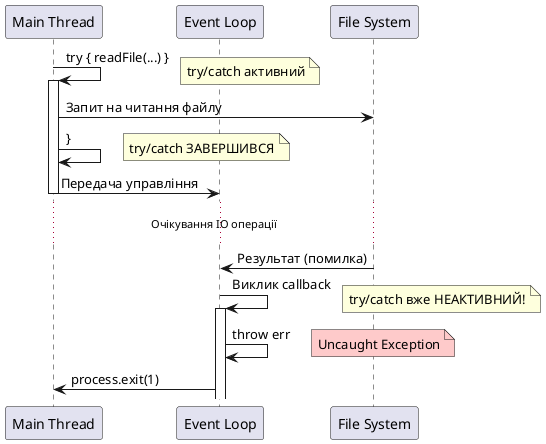
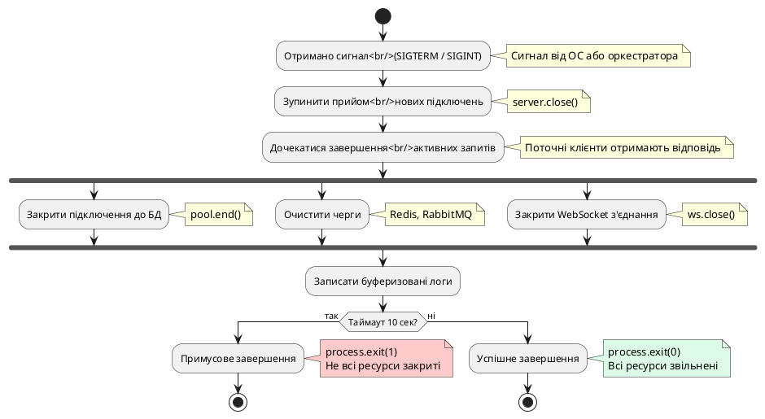

# Обробка помилок у асинхронному коді

::card-group

::card{title="🎯 Мета лекції" icon="i-lucide-target"}

- Опанувати фундаментальну різницю між обробкою синхронних та асинхронних помилок у Node.js.
- Зрозуміти механізми захисту застосунку: `try/catch`, `.catch()`, глобальні обробники подій.
- Навчитися проєктувати надійні (*resilient*) системи через graceful shutdown та централізоване логування.
- Дослідити створення власних класів помилок для семантичного розмежування типів помилок.
- Оволодіти технікою коректного завершення процесу при критичних збоях.

::

::card{title="🔑 Ключові терміни" icon="i-lucide-key"}

- **Uncaught Exception (*необроблений виняток*):** синхронна помилка, що не була перехоплена жодним `try/catch` блоком та досягла верхнього рівня стеку викликів.
- **Unhandled Rejection (*необроблене відхилення*):** проміс, що був відхилений, але не має обробника `.catch()` або `try/catch` у `async` функції.
- **Graceful Shutdown (*коректне завершення*):** контрольована процедура зупинки застосунку з закриттям відкритих ресурсів (з'єднання, файли, сокети) перед завершенням процесу.
- **Signal (*сигнал*):** повідомлення операційної системи до процесу про необхідність виконати певну дію (наприклад, `SIGTERM` — запит на завершення, `SIGINT` — переривання з клавіатури).
- **Stack Trace (*трасування стеку*):** послідовність викликів функцій, що привели до виникнення помилки — критично важливий інструмент для налагодження.

::

::

## Фундаментальна дихотомія: синхронні та асинхронні помилки

Одна з найбільших концептуальних складнощів Node.js полягає у тому, що **синхронні та асинхронні помилки обробляються принципово різними механізмами**. Ця відмінність випливає з архітектури Event Loop: синхронний код виконується безпосередньо у поточному стеку викликів, тоді як асинхронний код виконується у майбутньому циклі подій — часто після того, як початкова функція вже завершила свою роботу.

### Синхронні помилки: традиційна модель `try/catch`

Синхронні помилки виникають **безпосередньо під час виконання коду** у поточному стеку викликів. Вони можуть бути перехоплені через блок `try/catch`:

```typescript
function parseJSON(jsonString: string): any {
  try {
    const data = JSON.parse(jsonString); // Може викинути SyntaxError
    
    if (!data.user || !data.user.id) {
      throw new Error('Невалідна структура даних: відсутнє поле user.id');
    }
    
    return data;
  } catch (error) {
    console.error('Помилка парсингу JSON:', (error as Error).message);
    throw error; // Передаємо помилку вище по стеку
  }
}

// Використання
try {
  const config = parseJSON('{ "user": { "id": 42 } }');
  console.log('Конфігурація завантажена:', config);
} catch (error) {
  console.error('Критична помилка:', (error as Error).message);
  process.exit(1);
}
```

У цьому прикладі помилка парсингу JSON відбувається **синхронно** — одразу під час виклику `JSON.parse()`. Блок `try/catch` успішно перехоплює її, оскільки помилка виникає у межах того ж стеку викликів.

### Асинхронні помилки: чому `try/catch` не працює

Проблема виникає, коли помилка відбувається **всередині асинхронної операції** — callback, проміс або таймер. На момент виникнення помилки початкова функція вже завершила свою роботу, і блок `try/catch` не може її перехопити:

```typescript
import { readFile } from 'node:fs';

// ❌ АНТИПАТТЕРН: try/catch НЕ перехопить помилку
try {
  readFile('./config.json', 'utf-8', (err, data) => {
    if (err) {
      throw err; // Помилка виникає у callback, ЗА МЕЖАМИ try/catch!
    }
    console.log('Файл прочитано:', data);
  });
} catch (error) {
  // Цей блок НІКОЛИ не виконається для помилок callback
  console.error('Помилка:', error);
}

console.log('Код продовжує виконуватися...');
```

У цьому прикладі `try/catch` не спрацює, оскільки callback виконується **у наступному циклі Event Loop**, коли блок `try` вже завершив свою роботу. Якщо файл не існує, помилка стане **необробленим винятком** (*uncaught exception*), що призведе до аварійного завершення процесу Node.js.

::plant-uml{alt="Чому try/catch не працює для callback"}



::

::warning
Ніколи не використовуйте `try/catch` для обробки помилок у callback-функціях, промісах без `await`, або таймерах. У цих контекстах помилка виникає **асинхронно**, за межами блоку `try/catch`, що робить його безсилим. Для callback використовуйте Error-First Callback pattern, для промісів — `.catch()` або `try/catch` з `async/await`.
::

## Error-First Callback: конвенція Node.js для callback-based API

До появи промісів Node.js використовував **Error-First Callback** як стандартну конвенцію обробки помилок у асинхронних операціях. Ця конвенція передбачає, що **перший аргумент callback завжди є помилкою** (`null` або `undefined` у разі успіху), а наступні аргументи містять результат:

```typescript
import { readFile, writeFile } from 'node:fs';

// Сигнатура Error-First Callback:
// callback(err: Error | null, data?: T)

readFile('./user.json', 'utf-8', (err, data) => {
  if (err) {
    // Помилка відбулася — обробляємо її
    console.error('Помилка читання файлу:', err.message);
    return; // КРИТИЧНО: завершуємо виконання callback
  }
  
  // Якщо err === null, data гарантовано містить результат
  console.log('Файл прочитано:', data);
  
  try {
    const user = JSON.parse(data);
    console.log('Користувач:', user.name);
  } catch (parseError) {
    console.error('Помилка парсингу JSON:', (parseError as Error).message);
  }
});
```

Критичні правила Error-First Callback:

1. **Завжди перевіряйте `err` першим**: код не повинен продовжуватися, якщо виникла помилка.
2. **Використовуйте ранній вихід**: `if (err) { ...; return; }` запобігає виконанню решти коду.
3. **Не викидайте виключення у callback**: це призведе до uncaught exception (див. попередній розділ).
4. **Передавайте помилку вище**: якщо callback вкладений, передайте помилку до зовнішнього рівня.


### Приклад вкладених callback з передачею помилок

```typescript
import { readFile, writeFile } from 'node:fs';

function processUserData(userId: number, callback: (err: Error | null, summary?: any) => void): void {
  // Крок 1: Читання даних користувача
  readFile(`./users/${userId}.json`, 'utf-8', (err1, userData) => {
    if (err1) {
      return callback(err1); // Передаємо помилку вище
    }
    
    let user: any;
    try {
      user = JSON.parse(userData);
    } catch (parseError) {
      return callback(parseError as Error);
    }
    
    // Крок 2: Читання постів користувача
    readFile(`./posts/${user.id}.json`, 'utf-8', (err2, postsData) => {
      if (err2) {
        return callback(err2);
      }
      
      let posts: any;
      try {
        posts = JSON.parse(postsData);
      } catch (parseError) {
        return callback(parseError as Error);
      }
      
      // Крок 3: Формування звіту
      const summary = {
        user: user.name,
        email: user.email,
        postCount: posts.length,
        lastPost: posts[posts.length - 1]?.title || 'Немає постів',
      };
      
      // Крок 4: Збереження звіту
      writeFile('./summary.json', JSON.stringify(summary, null, 2), (err3) => {
        if (err3) {
          return callback(err3);
        }
        
        callback(null, summary); // Успіх — помилка null, результат у другому аргументі
      });
    });
  });
}

// Використання
processUserData(42, (err, summary) => {
  if (err) {
    console.error('Помилка обробки даних користувача:', err.message);
    process.exit(1);
    return;
  }
  
  console.log('Звіт створено:', summary);
});
```

Цей приклад демонструє класичний callback hell, але з коректною обробкою помилок на кожному рівні. Кожна помилка передається до головного callback через `return callback(err)`, що запобігає продовженню виконання.

::note
Конвенція Error-First Callback є причиною, чому у Node.js прийнято використовувати `return` перед викликом callback у блоці помилки: `return callback(err)`. Це запобігає випадковому продовженню виконання коду після обробки помилки, що могло б призвести до подвійного виклику callback або інших race condition.
::

## Promise rejection: `.catch()` vs `try/catch` з `async/await`

З появою промісів (ES2015) та `async/await` (ES2017) обробка асинхронних помилок стала значно елегантнішою. Проміси надають два механізми обробки відхилення (*rejection*):

1. **Метод `.catch()`** — для ланцюжків промісів.
2. **Блок `try/catch`** — для `async/await` синтаксису.

### Обробка помилок у ланцюжках промісів

```typescript
import { readFile, writeFile } from 'node:fs/promises';

function processUserData(userId: number): Promise<any> {
  return readFile(`./users/${userId}.json`, 'utf-8')
    .then((userData) => {
      const user = JSON.parse(userData); // Може викинути SyntaxError
      return readFile(`./posts/${user.id}.json`, 'utf-8')
        .then((postsData) => ({ user, postsData }));
    })
    .then(({ user, postsData }) => {
      const posts = JSON.parse(postsData);
      const summary = {
        user: user.name,
        email: user.email,
        postCount: posts.length,
      };
      return writeFile('./summary.json', JSON.stringify(summary, null, 2))
        .then(() => summary);
    })
    .catch((error) => {
      // Обробляємо ВСІ помилки у ланцюжку:
      // - readFile (ENOENT, EACCES)
      // - JSON.parse (SyntaxError)
      // - writeFile (ENOSPC, EROFS)
      console.error('Помилка обробки даних:', error.message);
      throw error; // Передаємо помилку далі
    });
}

// Використання
processUserData(42)
  .then((summary) => console.log('Звіт:', summary))
  .catch((error) => {
    console.error('Критична помилка:', error.message);
    process.exit(1);
  });
```

Ключова особливість `.catch()`: він перехоплює **будь-яку** помилку у ланцюжку промісів, що виникла до нього. Це робить обробку помилок централізованою та зручною.

### Обробка помилок у `async/await` через `try/catch`

```typescript
import { readFile, writeFile } from 'node:fs/promises';

async function processUserData(userId: number): Promise<any> {
  try {
    // Послідовні асинхронні операції
    const userData = await readFile(`./users/${userId}.json`, 'utf-8');
    const user = JSON.parse(userData);
    
    const postsData = await readFile(`./posts/${user.id}.json`, 'utf-8');
    const posts = JSON.parse(postsData);
    
    const summary = {
      user: user.name,
      email: user.email,
      postCount: posts.length,
    };
    
    await writeFile('./summary.json', JSON.stringify(summary, null, 2));
    
    return summary;
  } catch (error) {
    console.error('Помилка обробки даних:', (error as Error).message);
    throw error;
  }
}

// Використання
async function main(): Promise<void> {
  try {
    const summary = await processUserData(42);
    console.log('Звіт:', summary);
  } catch (error) {
    console.error('Критична помилка:', (error as Error).message);
    process.exit(1);
  }
}

main();
```

Порівняно з callback та ланцюжками промісів, `async/await` з `try/catch` є найбільш читабельним варіантом — код виглядає як синхронний, але обробляє асинхронні помилки.

::tip
Завжди віддавайте перевагу `async/await` з `try/catch` перед ланцюжками `.then().catch()` для нового коду. Це покращує читабельність, спрощує налагодження та робить код більш послідовним. Виняток: коли потрібно явно комбінувати паралельні операції через `Promise.all()` або інші комбінатори.
::

### Вибіркова обробка помилок за типом

У реальних застосунках часто потрібно по-різному реагувати на різні типи помилок:

```typescript
import { readFile } from 'node:fs/promises';

class ConfigurationError extends Error {
  constructor(message: string) {
    super(message);
    this.name = 'ConfigurationError';
  }
}

async function loadConfig(path: string): Promise<any> {
  try {
    const content = await readFile(path, 'utf-8');
    const config = JSON.parse(content);
    
    // Валідація конфігурації
    if (!config.database || !config.database.host) {
      throw new ConfigurationError('Відсутнє поле database.host у конфігурації');
    }
    
    if (!config.port || config.port < 1 || config.port > 65535) {
      throw new ConfigurationError('Невалідний порт сервера');
    }
    
    return config;
  } catch (error) {
    // Вибіркова обробка за типом помилки
    if (error instanceof ConfigurationError) {
      console.error('❌ Помилка конфігурації:', error.message);
      console.log('💡 Використовуємо конфігурацію за замовчуванням');
      return getDefaultConfig();
    }
    
    if ((error as NodeJS.ErrnoException).code === 'ENOENT') {
      console.warn('⚠️  Файл конфігурації не знайдено, створюємо новий');
      const defaultConfig = getDefaultConfig();
      await createDefaultConfigFile(path, defaultConfig);
      return defaultConfig;
    }
    
    if (error instanceof SyntaxError) {
      console.error('❌ Невалідний JSON у файлі конфігурації');
      throw error; // Критична помилка — завершуємо процес
    }
    
    // Невідома помилка
    console.error('❌ Неочікувана помилка:', (error as Error).message);
    throw error;
  }
}

function getDefaultConfig(): any {
  return {
    port: 3000,
    database: {
      host: 'localhost',
      port: 5432,
      name: 'myapp',
    },
  };
}

async function createDefaultConfigFile(path: string, config: any): Promise<void> {
  const { writeFile } = await import('node:fs/promises');
  await writeFile(path, JSON.stringify(config, null, 2));
}
```

У цьому прикладі різні типи помилок обробляються по-різному: помилки валідації та відсутності файлу призводять до використання конфігурації за замовчуванням, тоді як помилки парсингу JSON вважаються критичними.

## Глобальні обробники помилок: останній рубіж захисту

Навіть при ретельній обробці помилок на рівні коду завжди існує ризик, що якась помилка залишиться необробленою. Node.js надає два глобальні обробники подій для перехоплення таких помилок:

1. **`process.on('uncaughtException')`** — синхронні необроблені виключення.
2. **`process.on('unhandledRejection')`** — проміси без обробників `.catch()`.

### `uncaughtException`: помилки, що досягли верху стеку

Подія `uncaughtException` спрацьовує, коли **синхронна помилка** не була перехоплена жодним `try/catch` блоком та досягла верхнього рівня стеку викликів:

```typescript
process.on('uncaughtException', (error: Error, origin: string) => {
  console.error('🚨 Необроблене виключення!');
  console.error('Помилка:', error.message);
  console.error('Стек:', error.stack);
  console.error('Джерело:', origin);
  
  // КРИТИЧНО: Завершити процес після логування
  process.exit(1);
});

// Приклад виникнення uncaughtException
setTimeout(() => {
  throw new Error('Помилка у таймері — не перехоплена try/catch');
}, 1000);

console.log('Сервер запущено');
```

::terminal-preview{title="node app.ts" :cursor="false"}

<div class="line"><span class="opacity-40">$</span> <strong class="font-bold">node app.ts</strong></div>
<div class="line">Сервер запущено</div>
<div class="line"></div>
<div class="line"><span class="text-rose-400 font-bold">🚨 Необроблене виключення!</span></div>
<div class="line"><span class="text-rose-400">Помилка:</span> Помилка у таймері — не перехоплена try/catch</div>
<div class="line"><span class="text-rose-400">Стек:</span></div>
<div class="line"><span class="opacity-60">    at Timeout._onTimeout (/app/app.ts:13:9)</span></div>
<div class="line"><span class="opacity-60">    at listOnTimeout (node:internal/timers:573:17)</span></div>
<div class="line"><span class="text-rose-400">Джерело:</span> uncaughtException</div>
<div class="line"></div>
<div class="line"><span class="opacity-40">Process exited with code</span> <span class="text-rose-400 font-bold">1</span></div>
::

::caution
**Не намагайтеся продовжити роботу застосунку після `uncaughtException`!** Офіційна документація Node.js категорично не рекомендує це робити: стан застосунку після необробленого виключення є **невизначеним** (*undefined state*). Деякі ресурси можуть залишитися незакритими, об'єкти — у несумісному стані. Єдина безпечна дія — логування та завершення процесу.
::


### `unhandledRejection`: проміси без обробників помилок

Подія `unhandledRejection` спрацьовує, коли **проміс відхилено** (*rejected*), але не було зареєстровано жодного обробника `.catch()` або `try/catch`:

```typescript
process.on('unhandledRejection', (reason: any, promise: Promise<any>) => {
  console.error('🚨 Необроблене відхилення промісу!');
  console.error('Причина:', reason);
  console.error('Проміс:', promise);
  
  // КРИТИЧНО: Завершити процес
  process.exit(1);
});

// Приклад виникнення unhandledRejection
async function fetchData(): Promise<void> {
  throw new Error('Помилка завантаження даних');
}

fetchData(); // ❌ Викликано БЕЗ await і БЕЗ .catch() — unhandledRejection!

console.log('Застосунок продовжує працювати...');
```

::terminal-preview{title="node app.ts" :cursor="false"}

<div class="line"><span class="opacity-40">$</span> <strong class="font-bold">node app.ts</strong></div>
<div class="line">Застосунок продовжує працювати...</div>
<div class="line"></div>
<div class="line"><span class="text-rose-400 font-bold">🚨 Необроблене відхилення промісу!</span></div>
<div class="line"><span class="text-rose-400">Причина:</span> Error: Помилка завантаження даних</div>
<div class="line"><span class="opacity-60">    at fetchData (/app/app.ts:10:9)</span></div>
<div class="line"><span class="text-rose-400">Проміс:</span> Promise { <rejected> Error: Помилка завантаження даних }</div>
<div class="line"></div>
<div class="line"><span class="opacity-40">Process exited with code</span> <span class="text-rose-400 font-bold">1</span></div>
::

::warning
**З Node.js 15.0.0 необроблені відхилення промісів автоматично завершують процес з кодом виходу 1.** До цієї версії застосунок продовжував працювати, що призводило до непередбачуваної поведінки та важких у налагодженні помилок. Завжди обробляйте проміси через `.catch()` або `try/catch` у `async` функціях.
::

### Централізований обробник для production-середовища

У виробничих застосунках критично важливо логувати всі необроблені помилки до системи моніторингу (Sentry, Datadog, CloudWatch) перед завершенням процесу:

```typescript
import { createLogger, transports, format } from 'winston';

// Налаштування логера
const logger = createLogger({
  level: 'error',
  format: format.combine(
    format.timestamp(),
    format.errors({ stack: true }),
    format.json()
  ),
  transports: [
    new transports.File({ filename: 'error.log' }),
    new transports.Console(),
  ],
});

// Глобальний обробник для uncaughtException
process.on('uncaughtException', (error: Error) => {
  logger.error('Uncaught Exception', {
    message: error.message,
    stack: error.stack,
    timestamp: new Date().toISOString(),
  });
  
  // Очікуємо завершення запису у лог
  setTimeout(() => {
    console.error('Процес завершено через необроблене виключення');
    process.exit(1);
  }, 1000);
});

// Глобальний обробник для unhandledRejection
process.on('unhandledRejection', (reason: any, promise: Promise<any>) => {
  logger.error('Unhandled Rejection', {
    reason: reason instanceof Error ? reason.message : String(reason),
    stack: reason instanceof Error ? reason.stack : undefined,
    promise: String(promise),
    timestamp: new Date().toISOString(),
  });
  
  setTimeout(() => {
    console.error('Процес завершено через необроблене відхилення промісу');
    process.exit(1);
  }, 1000);
});

// Приклад застосунку
import express from 'express';

const app = express();

app.get('/error', (req, res) => {
  // Викидаємо помилку без обробки — спрацює uncaughtException
  throw new Error('Тестова помилка у маршруті');
});

app.get('/async-error', async (req, res) => {
  // Викликаємо async функцію без await — спрацює unhandledRejection
  Promise.reject(new Error('Тестова помилка у промісі'));
  res.send('Запит оброблено');
});

const PORT = 3000;
app.listen(PORT, () => {
  console.log(`Сервер запущено на порту ${PORT}`);
});
```

У цьому прикладі всі необроблені помилки логуються через Winston з повним стеком викликів та часовою міткою. Процес завершується після короткої затримки, щоб дати час на запис логів.

::note
Використання `setTimeout()` перед `process.exit()` є поширеною практикою для гарантії, що всі асинхронні операції логування встигнуть завершитися. Альтернативно можна використовувати обробники подій `finish` або `close` транспортів логера для синхронізації.
::

## Graceful Shutdown: коректне завершення застосунку

**Graceful shutdown** (*коректне завершення*) — це процес контрольованої зупинки застосунку з закриттям всіх відкритих ресурсів: HTTP-серверів, підключень до бази даних, черг повідомлень, файлових дескрипторів. Це критично важливо для:

1. **Запобігання втраті даних:** незавершені транзакції БД повинні бути закомічені або відкочені.
2. **Уникнення витоку ресурсів:** відкриті сокети, файлові дескриптори повинні бути закриті.
3. **Коректної роботи оркестраторів:** Kubernetes, Docker Swarm очікують, що застосунок коректно відповість на `SIGTERM`.
4. **Збереження логів:** всі буферизовані логи повинні бути записані на диск.

### Обробка сигналів операційної системи

Операційна система може надіслати процесу різні сигнали для керування його життєвим циклом:

- **`SIGTERM`** (*Signal Terminate*): запит на коректне завершення процесу (стандартний сигнал від Kubernetes).
- **`SIGINT`** (*Signal Interrupt*): переривання з клавіатури (`Ctrl+C`).
- **`SIGKILL`**: негайне примусове завершення (не може бути перехоплено).
- **`SIGUSR1`**, **`SIGUSR2`**: користувацькі сигнали (можуть використовуватися для кастомної логіки).

```typescript
import http from 'node:http';
import { Pool } from 'pg';

// Створення HTTP-сервера
const server = http.createServer((req, res) => {
  res.writeHead(200);
  res.end('Hello, World!');
});

// Підключення до бази даних
const pool = new Pool({
  connectionString: process.env.DATABASE_URL || 'postgresql://localhost/mydb',
});

const PORT = 3000;
server.listen(PORT, () => {
  console.log(`✓ Сервер запущено на порту ${PORT}`);
});

// Функція коректного завершення
async function gracefulShutdown(signal: string): Promise<void> {
  console.log(`\n🛑 Отримано сигнал ${signal}, ініціюємо graceful shutdown...`);
  
  // Крок 1: Зупиняємо прийом нових підключень
  server.close((err) => {
    if (err) {
      console.error('❌ Помилка закриття HTTP-сервера:', err.message);
    } else {
      console.log('✓ HTTP-сервер закрито');
    }
  });
  
  // Крок 2: Закриваємо підключення до бази даних
  try {
    await pool.end();
    console.log('✓ Пул підключень до БД закрито');
  } catch (error) {
    console.error('❌ Помилка закриття пулу БД:', (error as Error).message);
  }
  
  // Крок 3: Очікуємо завершення всіх активних запитів (max 10 секунд)
  const shutdownTimeout = setTimeout(() => {
    console.error('⚠️  Таймаут graceful shutdown, примусове завершення');
    process.exit(1);
  }, 10000);
  
  // Крок 4: Успішне завершення
  clearTimeout(shutdownTimeout);
  console.log('✓ Graceful shutdown завершено');
  process.exit(0);
}

// Реєстрація обробників сигналів
process.on('SIGTERM', () => gracefulShutdown('SIGTERM'));
process.on('SIGINT', () => gracefulShutdown('SIGINT'));

// Обробник для необроблених помилок
process.on('uncaughtException', (error: Error) => {
  console.error('🚨 Uncaught Exception:', error.message);
  console.error(error.stack);
  gracefulShutdown('uncaughtException');
});

process.on('unhandledRejection', (reason: any) => {
  console.error('🚨 Unhandled Rejection:', reason);
  gracefulShutdown('unhandledRejection');
});
```

::terminal-preview{title="Graceful Shutdown у дії" :cursor="false"}

<div class="line"><span class="opacity-40">$</span> <strong class="font-bold">node server.ts</strong></div>
<div class="line"><span class="text-green-400 font-bold">✓</span> Сервер запущено на порту 3000</div>
<div class="line"></div>
<div class="line"><span class="opacity-60">[Користувач натискає Ctrl+C]</span></div>
<div class="line"></div>
<div class="line"><span class="text-yellow-400 font-bold">🛑</span> Отримано сигнал SIGINT, ініціюємо graceful shutdown...</div>
<div class="line"><span class="text-green-400 font-bold">✓</span> HTTP-сервер закрито</div>
<div class="line"><span class="text-green-400 font-bold">✓</span> Пул підключень до БД закрито</div>
<div class="line"><span class="text-green-400 font-bold">✓</span> Graceful shutdown завершено</div>
<div class="line"></div>
<div class="line"><span class="opacity-40">Process exited with code</span> <span class="text-green-400 font-bold">0</span></div>
::

### Візуалізація процесу graceful shutdown

::plant-uml{alt="Graceful Shutdown Flow"}



::

::tip
**Kubernetes Best Practice:** Налаштуйте `terminationGracePeriodSeconds` у Pod Spec (типово 30 секунд) відповідно до максимального часу завершення ваших запитів. Якщо застосунок не завершиться протягом цього періоду, Kubernetes надішле `SIGKILL`, що призведе до негайного завершення без очищення.
::

### Приклад з Express та PostgreSQL

```typescript
import express from 'express';
import { Pool } from 'pg';

const app = express();
const pool = new Pool({ connectionString: process.env.DATABASE_URL });

app.use(express.json());

// Middleware для відстеження активних запитів
let activeRequests = 0;

app.use((req, res, next) => {
  activeRequests++;
  res.on('finish', () => {
    activeRequests--;
  });
  next();
});

app.get('/users/:id', async (req, res) => {
  try {
    const { rows } = await pool.query('SELECT * FROM users WHERE id = $1', [req.params.id]);
    res.json(rows[0] || null);
  } catch (error) {
    console.error('Помилка запиту:', (error as Error).message);
    res.status(500).json({ error: 'Internal Server Error' });
  }
});

const server = app.listen(3000, () => {
  console.log('Сервер запущено на порту 3000');
});

// Graceful shutdown з очікуванням завершення активних запитів
async function gracefulShutdown(signal: string): Promise<void> {
  console.log(`\nОтримано ${signal}, ініціюємо graceful shutdown...`);
  
  // Зупиняємо прийом нових запитів
  server.close(() => {
    console.log('HTTP-сервер закрито');
  });
  
  // Очікуємо завершення активних запитів (max 15 секунд)
  const maxWait = 15000;
  const checkInterval = 100;
  let waited = 0;
  
  while (activeRequests > 0 && waited < maxWait) {
    console.log(`Очікуємо завершення ${activeRequests} активних запитів...`);
    await new Promise((resolve) => setTimeout(resolve, checkInterval));
    waited += checkInterval;
  }
  
  if (activeRequests > 0) {
    console.warn(`⚠️  Залишилося ${activeRequests} активних запитів, примусово завершуємо`);
  }
  
  // Закриваємо пул БД
  await pool.end();
  console.log('Пул підключень до БД закрито');
  
  console.log('Graceful shutdown завершено');
  process.exit(0);
}

process.on('SIGTERM', () => gracefulShutdown('SIGTERM'));
process.on('SIGINT', () => gracefulShutdown('SIGINT'));
```

У цьому прикладі застосунок відстежує кількість активних запитів та очікує їх завершення перед закриттям сервера. Це гарантує, що всі клієнти отримають відповідь перед зупинкою процесу.


## Створення власних класів помилок

Стандартний клас `Error` у JavaScript є дуже загальним та не надає достатньо контексту для розрізнення типів помилок у великих застосунках. **Власні класи помилок** (*custom error classes*) дозволяють створити семантичну ієрархію помилок, що значно покращує обробку та налагодження:

### Базовий власний клас помилки

```typescript
class ApplicationError extends Error {
  constructor(
    message: string,
    public readonly code: string,
    public readonly statusCode: number = 500,
    public readonly isOperational: boolean = true
  ) {
    super(message);
    this.name = this.constructor.name;
    
    // Зберігаємо правильний stack trace (лише у V8: Node.js, Chrome)
    if (Error.captureStackTrace) {
      Error.captureStackTrace(this, this.constructor);
    }
  }
}

// Спеціалізовані класи помилок
class ValidationError extends ApplicationError {
  constructor(message: string, public readonly field?: string) {
    super(message, 'VALIDATION_ERROR', 400);
  }
}

class NotFoundError extends ApplicationError {
  constructor(resource: string, id: string | number) {
    super(`${resource} з ID ${id} не знайдено`, 'NOT_FOUND', 404);
  }
}

class UnauthorizedError extends ApplicationError {
  constructor(message: string = 'Доступ заборонено') {
    super(message, 'UNAUTHORIZED', 401);
  }
}

class DatabaseError extends ApplicationError {
  constructor(message: string, public readonly query?: string) {
    super(message, 'DATABASE_ERROR', 500);
    this.isOperational = false; // Помилка БД — не операційна, потрібен перезапуск
  }
}
```

Ключові властивості власних помилок:

1. **`code`**: унікальний код помилки для програмної обробки (наприклад, `VALIDATION_ERROR`).
2. **`statusCode`**: HTTP-код для використання у REST API.
3. **`isOperational`**: розмежування між **операційними помилками** (очікувані, відновлювані) та **програмними помилками** (баги, потребують перезапуску).
4. **`Error.captureStackTrace()`**: метод V8 для правильного збереження стеку викликів без включення конструктора класу помилки.

### Використання власних помилок у бізнес-логіці

```typescript
interface User {
  id: number;
  email: string;
  password: string;
}

class UserService {
  private users: User[] = [];
  
  async createUser(email: string, password: string): Promise<User> {
    // Валідація email
    const emailRegex = /^[^\s@]+@[^\s@]+\.[^\s@]+$/;
    if (!emailRegex.test(email)) {
      throw new ValidationError('Невалідний формат email', 'email');
    }
    
    // Валідація паролю
    if (password.length < 8) {
      throw new ValidationError('Пароль повинен містити щонайменше 8 символів', 'password');
    }
    
    // Перевірка унікальності
    const existingUser = this.users.find((u) => u.email === email);
    if (existingUser) {
      throw new ValidationError('Користувач з таким email вже існує', 'email');
    }
    
    const user: User = {
      id: this.users.length + 1,
      email,
      password, // У реальному застосунку — хешувати!
    };
    
    this.users.push(user);
    return user;
  }
  
  async getUserById(id: number): Promise<User> {
    const user = this.users.find((u) => u.id === id);
    
    if (!user) {
      throw new NotFoundError('User', id);
    }
    
    return user;
  }
  
  async deleteUser(id: number, requesterId: number): Promise<void> {
    // Перевірка авторизації
    if (id !== requesterId) {
      throw new UnauthorizedError('Ви можете видалити лише свій обліковий запис');
    }
    
    const index = this.users.findIndex((u) => u.id === id);
    
    if (index === -1) {
      throw new NotFoundError('User', id);
    }
    
    this.users.splice(index, 1);
  }
}

// Використання у Express-роутах
import express from 'express';

const app = express();
const userService = new UserService();

app.use(express.json());

app.post('/users', async (req, res, next) => {
  try {
    const user = await userService.createUser(req.body.email, req.body.password);
    res.status(201).json(user);
  } catch (error) {
    next(error); // Передаємо помилку до централізованого обробника
  }
});

app.get('/users/:id', async (req, res, next) => {
  try {
    const user = await userService.getUserById(parseInt(req.params.id));
    res.json(user);
  } catch (error) {
    next(error);
  }
});

app.delete('/users/:id', async (req, res, next) => {
  try {
    await userService.deleteUser(parseInt(req.params.id), req.user?.id); // req.user з middleware авторизації
    res.status(204).send();
  } catch (error) {
    next(error);
  }
});

// Централізований обробник помилок (error-handling middleware)
app.use((err: Error, req: express.Request, res: express.Response, next: express.NextFunction) => {
  if (err instanceof ApplicationError) {
    // Операційна помилка — відправляємо клієнту
    res.status(err.statusCode).json({
      error: {
        code: err.code,
        message: err.message,
        field: (err as any).field, // Якщо ValidationError
      },
    });
    
    // Логуємо лише серверні помилки (5xx)
    if (err.statusCode >= 500) {
      console.error('Server Error:', err);
    }
  } else {
    // Непередбачена помилка (програмна помилка, баг)
    console.error('Unexpected Error:', err.stack);
    res.status(500).json({
      error: {
        code: 'INTERNAL_SERVER_ERROR',
        message: 'Внутрішня помилка сервера',
      },
    });
  }
});

app.listen(3000, () => {
  console.log('Сервер запущено на порту 3000');
});
```

У цьому прикладі всі помилки бізнес-логіки викидаються як спеціалізовані класи, що дозволяє централізованому обробнику коректно формувати HTTP-відповіді з відповідними кодами статусу.

::note
Властивість `isOperational` критично важлива для розрізнення між **операційними помилками** (недійсний вхід, недостатньо прав, ресурс не знайдено) та **програмними помилками** (баги у коді, null pointer, type errors). Операційні помилки є очікуваними та обробляються звичайним чином, тоді як програмні помилки вказують на баг та зазвичай потребують перезапуску процесу для відновлення чистого стану.
::

### Ієрархія класів помилок для доменної логіки

```typescript
// Базова помилка для всього застосунку
class AppError extends Error {
  constructor(
    message: string,
    public readonly code: string,
    public readonly statusCode: number = 500
  ) {
    super(message);
    this.name = this.constructor.name;
    Error.captureStackTrace?.(this, this.constructor);
  }
}

// Помилки доменного рівня (бізнес-логіка)
class DomainError extends AppError {
  constructor(message: string, code: string) {
    super(message, code, 400);
  }
}

class InsufficientFundsError extends DomainError {
  constructor(public readonly balance: number, public readonly required: number) {
    super(
      `Недостатньо коштів: баланс ${balance}, потрібно ${required}`,
      'INSUFFICIENT_FUNDS'
    );
  }
}

class AccountLockedError extends DomainError {
  constructor(public readonly reason: string) {
    super(`Обліковий запис заблоковано: ${reason}`, 'ACCOUNT_LOCKED');
  }
}

// Помилки інфраструктурного рівня
class InfrastructureError extends AppError {
  constructor(message: string, code: string) {
    super(message, code, 503);
  }
}

class DatabaseConnectionError extends InfrastructureError {
  constructor(public readonly host: string, public readonly originalError: Error) {
    super(`Не вдалося підключитися до БД ${host}`, 'DB_CONNECTION_ERROR');
  }
}

class ExternalServiceError extends InfrastructureError {
  constructor(public readonly service: string, public readonly statusCode: number) {
    super(`Зовнішній сервіс ${service} недоступний`, 'EXTERNAL_SERVICE_ERROR');
  }
}

// Використання у банківському сервісі
class BankingService {
  async transferMoney(fromAccountId: string, toAccountId: string, amount: number): Promise<void> {
    const fromAccount = await this.getAccount(fromAccountId);
    
    // Перевірка блокування
    if (fromAccount.isLocked) {
      throw new AccountLockedError('Підозріла активність');
    }
    
    // Перевірка балансу
    if (fromAccount.balance < amount) {
      throw new InsufficientFundsError(fromAccount.balance, amount);
    }
    
    try {
      // Виконуємо транзакцію
      await this.executeTransaction(fromAccountId, toAccountId, amount);
    } catch (error) {
      if ((error as any).code === 'ECONNREFUSED') {
        throw new DatabaseConnectionError('postgres-primary', error as Error);
      }
      throw error;
    }
  }
  
  private async getAccount(id: string): Promise<any> {
    // Заглушка
    return { id, balance: 1000, isLocked: false };
  }
  
  private async executeTransaction(from: string, to: string, amount: number): Promise<void> {
    // Заглушка
  }
}
```

Така ієрархія дозволяє обробляти помилки на різних рівнях абстракції: доменні помилки обробляються бізнес-логікою, інфраструктурні — через retry-логіку та fallback-механізми.

## Stack Trace та налагодження

**Stack trace** (*трасування стеку*) — це послідовність викликів функцій, що призвели до виникнення помилки. Це найважливіший інструмент для налагодження, оскільки він точно вказує, де саме і як виникла помилка:

### Структура stack trace

```typescript
const error = new Error('Тестова помилка');
console.error(error.stack);
```

::terminal-preview{title="Stack Trace приклад" :cursor="false"}

<div class="line"><span class="text-rose-400 font-bold">Error:</span> Тестова помилка</div>
<div class="line">    at processUser (<span class="text-blue-400">/app/services/user.service.ts:42:11</span>)</div>
<div class="line">    at async UserController.createUser (<span class="text-blue-400">/app/controllers/user.controller.ts:18:5</span>)</div>
<div class="line">    at async Layer.handle [as handle_request] (<span class="opacity-60">/app/node_modules/express/lib/router/layer.js:95:5</span>)</div>
<div class="line">    at async next (<span class="opacity-60">/app/node_modules/express/lib/router/route.js:144:13</span>)</div>
<div class="line">    at async Immediate._onImmediate (<span class="opacity-60">node:internal/timers:483:21</span>)</div>
::

Структура запису stack trace:

1. **Повідомлення помилки**: `Error: Тестова помилка`.
2. **Послідовність викликів** (зверху вниз — від найновішого до найстарішого):
   - Назва функції: `processUser`, `createUser`.
   - Шлях до файлу: `/app/services/user.service.ts`.
   - Номер рядка та стовпця: `:42:11`.

### Покращення читабельності stack trace

Стандартний stack trace може бути важким для читання у production-застосунках через мініфікацію та транспіляцію TypeScript → JavaScript. Використовуйте **source maps** для мапування скомпільованого коду на оригінальний:

```typescript
// tsconfig.json
{
  "compilerOptions": {
    "sourceMap": true,  // Генерувати .map файли
    "inlineSourceMap": false,
    "inlineSources": true
  }
}
```

```typescript
// Увімкнення підтримки source maps у Node.js (Node.js 12.12+)
// node --enable-source-maps dist/server.js
```

Для автоматичного увімкнення source maps у застосунку:

```typescript
import 'source-map-support/register'; // На самому початку entry point

// Тепер всі stack trace показуватимуть оригінальні TypeScript файли
```

### Логування stack trace з контекстом

```typescript
class ErrorLogger {
  static log(error: Error, context?: Record<string, any>): void {
    const errorInfo = {
      timestamp: new Date().toISOString(),
      name: error.name,
      message: error.message,
      stack: error.stack?.split('\n').map((line) => line.trim()),
      context,
    };
    
    console.error(JSON.stringify(errorInfo, null, 2));
  }
}

// Використання
async function processPayment(orderId: string, amount: number): Promise<void> {
  try {
    await chargeCard(amount);
  } catch (error) {
    ErrorLogger.log(error as Error, {
      operation: 'processPayment',
      orderId,
      amount,
      userId: 'user-123',
    });
    throw error;
  }
}
```

::terminal-preview{title="Структуроване логування помилок" :cursor="false"}

<div class="line">{</div>
<div class="line">  <span class="text-blue-400">"timestamp"</span>: <span class="text-green-400">"2026-09-03T14:23:45.123Z"</span>,</div>
<div class="line">  <span class="text-blue-400">"name"</span>: <span class="text-green-400">"PaymentError"</span>,</div>
<div class="line">  <span class="text-blue-400">"message"</span>: <span class="text-rose-400">"Card declined"</span>,</div>
<div class="line">  <span class="text-blue-400">"stack"</span>: [</div>
<div class="line">    <span class="text-green-400">"at chargeCard (/app/payment.service.ts:58:11)"</span>,</div>
<div class="line">    <span class="text-green-400">"at processPayment (/app/order.service.ts:42:5)"</span></div>
<div class="line">  ],</div>
<div class="line">  <span class="text-blue-400">"context"</span>: {</div>
<div class="line">    <span class="text-blue-400">"operation"</span>: <span class="text-green-400">"processPayment"</span>,</div>
<div class="line">    <span class="text-blue-400">"orderId"</span>: <span class="text-green-400">"ord_abc123"</span>,</div>
<div class="line">    <span class="text-blue-400">"amount"</span>: <span class="text-yellow-400">99.99</span>,</div>
<div class="line">    <span class="text-blue-400">"userId"</span>: <span class="text-green-400">"user-123"</span></div>
<div class="line">  }</div>
<div class="line">}</div>
::

Структуроване логування з контекстом значно спрощує налагодження у production, оскільки надає всю необхідну інформацію для відтворення проблеми.


## Best Practices: принципи проєктування надійних систем

### 1. Розмежовуйте операційні та програмні помилки

**Операційні помилки** (*operational errors*) є очікуваними та повинні оброблятися у межах бізнес-логіки:

- Недійсні дані від користувача (валідація).
- Ресурс не знайдено (404).
- Недостатньо прав доступу (403).
- Тимчасова недоступність зовнішнього сервісу.

**Програмні помилки** (*programmer errors*) є багами у коді та потребують виправлення:

- `TypeError: Cannot read property 'x' of undefined`.
- `ReferenceError: variable is not defined`.
- Некоректна логіка (ділення на нуль, нескінченний цикл).
- Порушення інваріантів (неможливий стан).

```typescript
class OperationalError extends Error {
  readonly isOperational = true;
  
  constructor(message: string, public readonly statusCode: number = 500) {
    super(message);
    this.name = 'OperationalError';
  }
}

class ProgrammerError extends Error {
  readonly isOperational = false;
  
  constructor(message: string) {
    super(message);
    this.name = 'ProgrammerError';
  }
}

// Централізований обробник
function handleError(error: Error): void {
  if ((error as any).isOperational) {
    // Операційна помилка — логуємо та продовжуємо
    console.error('Operational Error:', error.message);
  } else {
    // Програмна помилка — логуємо, сповіщаємо команду та перезапускаємо
    console.error('Programmer Error (BUG):', error.stack);
    // Надіслати в Sentry, PagerDuty тощо
    process.exit(1);
  }
}
```

::warning
**Ніколи не ігноруйте програмні помилки.** Після виникнення багу стан застосунку може бути несумісним (об'єкти у неправильному стані, змінні мають невалідні значення). Продовження роботи може призвести до корупції даних, витоку пам'яті або інших критичних проблем. Єдина безпечна дія — перезапуск процесу.
::

### 2. Завжди обробляйте проміси

```typescript
// ❌ АНТИПАТТЕРН: Необроблений проміс
async function fetchData(): Promise<void> {
  throw new Error('API недоступне');
}

fetchData(); // unhandledRejection!

// ✅ ПРАВИЛЬНО: Обробка через .catch()
fetchData().catch((error) => {
  console.error('Помилка завантаження даних:', error.message);
});

// ✅ ПРАВИЛЬНО: Обробка через await + try/catch
async function main(): Promise<void> {
  try {
    await fetchData();
  } catch (error) {
    console.error('Помилка завантаження даних:', (error as Error).message);
  }
}

main();
```

**Eslint правило для автоматичної перевірки:**

```json
{
  "rules": {
    "no-floating-promises": "error",
    "@typescript-eslint/no-floating-promises": "error"
  }
}
```

### 3. Використовуйте централізований логер

```typescript
import winston from 'winston';

const logger = winston.createLogger({
  level: process.env.LOG_LEVEL || 'info',
  format: winston.format.combine(
    winston.format.timestamp(),
    winston.format.errors({ stack: true }),
    winston.format.json()
  ),
  transports: [
    new winston.transports.File({ filename: 'error.log', level: 'error' }),
    new winston.transports.File({ filename: 'combined.log' }),
  ],
});

// У production — додати транспорт для зовнішніх сервісів
if (process.env.NODE_ENV === 'production') {
  logger.add(new winston.transports.Console({
    format: winston.format.simple(),
  }));
  
  // Інтеграція з Sentry
  // logger.add(new SentryTransport({ sentry, level: 'error' }));
}

// Використання
try {
  await riskyOperation();
} catch (error) {
  logger.error('Операція провалилася', {
    error: error instanceof Error ? error.message : String(error),
    stack: error instanceof Error ? error.stack : undefined,
    userId: req.user?.id,
    operation: 'riskyOperation',
  });
  throw error;
}
```

### 4. Реалізуйте retry-логіку для тимчасових помилок

```typescript
async function fetchWithRetry<T>(
  fn: () => Promise<T>,
  maxRetries: number = 3,
  delayMs: number = 1000
): Promise<T> {
  let lastError: Error;
  
  for (let attempt = 1; attempt <= maxRetries; attempt++) {
    try {
      return await fn();
    } catch (error) {
      lastError = error as Error;
      
      // Не ретраїмо клієнтські помилки (4xx)
      if ((error as any).statusCode && (error as any).statusCode < 500) {
        throw error;
      }
      
      if (attempt < maxRetries) {
        console.warn(`Спроба ${attempt} провалилася, повтор через ${delayMs}мс...`);
        await new Promise((resolve) => setTimeout(resolve, delayMs * attempt)); // Exponential backoff
      }
    }
  }
  
  throw new Error(`Операція провалилася після ${maxRetries} спроб: ${lastError!.message}`);
}

// Використання
const data = await fetchWithRetry(() => fetch('https://api.example.com/data').then((r) => r.json()));
```

### 5. Налаштуйте моніторинг та алертинг

```typescript
import * as Sentry from '@sentry/node';

// Ініціалізація Sentry
Sentry.init({
  dsn: process.env.SENTRY_DSN,
  environment: process.env.NODE_ENV,
  tracesSampleRate: 0.1, // 10% транзакцій для performance monitoring
});

// Обробник необроблених помилок
process.on('uncaughtException', (error: Error) => {
  console.error('Uncaught Exception:', error);
  Sentry.captureException(error);
  
  // Очікуємо відправки даних у Sentry
  Sentry.close(2000).then(() => {
    process.exit(1);
  });
});

process.on('unhandledRejection', (reason: any) => {
  console.error('Unhandled Rejection:', reason);
  Sentry.captureException(reason);
  
  Sentry.close(2000).then(() => {
    process.exit(1);
  });
});

// У Express middleware
app.use(Sentry.Handlers.requestHandler());
app.use(Sentry.Handlers.errorHandler());
```

### 6. Документуйте помилки у функціях

```typescript
/**
 * Створює нового користувача у системі.
 * 
 * @param email - Email користувача (повинен бути унікальним)
 * @param password - Пароль (мінімум 8 символів)
 * @returns Створений об'єкт користувача
 * 
 * @throws {ValidationError} Якщо email або пароль невалідні
 * @throws {ConflictError} Якщо користувач з таким email вже існує
 * @throws {DatabaseError} Якщо виникла помилка підключення до БД
 * 
 * @example
 * ```typescript
 * try {
 *   const user = await createUser('test@example.com', 'password123');
 *   console.log('Користувач створений:', user.id);
 * } catch (error) {
 *   if (error instanceof ValidationError) {
 *     console.error('Невалідні дані:', error.message);
 *   }
 * }
 * ```
 */
async function createUser(email: string, password: string): Promise<User> {
  // Реалізація...
}
```

## Практичний приклад: повна архітектура обробки помилок

```typescript
// errors/index.ts — Ієрархія класів помилок
export class AppError extends Error {
  constructor(
    message: string,
    public readonly code: string,
    public readonly statusCode: number = 500,
    public readonly isOperational: boolean = true
  ) {
    super(message);
    this.name = this.constructor.name;
    Error.captureStackTrace?.(this, this.constructor);
  }
}

export class ValidationError extends AppError {
  constructor(message: string, public readonly field?: string) {
    super(message, 'VALIDATION_ERROR', 400);
  }
}

export class NotFoundError extends AppError {
  constructor(resource: string, id: string | number) {
    super(`${resource} with ID ${id} not found`, 'NOT_FOUND', 404);
  }
}

export class UnauthorizedError extends AppError {
  constructor(message: string = 'Unauthorized') {
    super(message, 'UNAUTHORIZED', 401);
  }
}

// services/error-handler.service.ts — Централізований обробник
import winston from 'winston';
import { AppError } from '../errors';

export class ErrorHandlerService {
  private logger = winston.createLogger({
    level: 'error',
    format: winston.format.combine(
      winston.format.timestamp(),
      winston.format.errors({ stack: true }),
      winston.format.json()
    ),
    transports: [
      new winston.transports.File({ filename: 'error.log' }),
      new winston.transports.Console(),
    ],
  });
  
  handleError(error: Error): void {
    this.logError(error);
    
    if (this.isTrustedError(error)) {
      // Операційна помилка — можна продовжити
      return;
    }
    
    // Програмна помилка — перезапуск обов'язковий
    console.error('Критична програмна помилка, завершуємо процес...');
    process.exit(1);
  }
  
  private logError(error: Error): void {
    this.logger.error('Application Error', {
      message: error.message,
      stack: error.stack,
      code: (error as any).code,
      statusCode: (error as any).statusCode,
      isOperational: (error as any).isOperational,
      timestamp: new Date().toISOString(),
    });
  }
  
  private isTrustedError(error: Error): boolean {
    if (error instanceof AppError) {
      return error.isOperational;
    }
    return false;
  }
}

// middleware/error.middleware.ts — Express middleware
import { Request, Response, NextFunction } from 'express';
import { AppError } from '../errors';
import { ErrorHandlerService } from '../services/error-handler.service';

const errorHandler = new ErrorHandlerService();

export function errorMiddleware(
  error: Error,
  req: Request,
  res: Response,
  next: NextFunction
): void {
  errorHandler.handleError(error);
  
  if (error instanceof AppError) {
    res.status(error.statusCode).json({
      error: {
        code: error.code,
        message: error.message,
        ...(error as any).field && { field: (error as any).field },
      },
    });
  } else {
    // Непередбачена помилка
    res.status(500).json({
      error: {
        code: 'INTERNAL_SERVER_ERROR',
        message: 'Internal server error',
      },
    });
  }
}

// app.ts — Головний файл
import express from 'express';
import { errorMiddleware } from './middleware/error.middleware';
import { ErrorHandlerService } from './services/error-handler.service';

const app = express();
const errorHandler = new ErrorHandlerService();

app.use(express.json());

// Роути...
// app.use('/api/users', userRoutes);

// Error middleware (останнім)
app.use(errorMiddleware);

// Глобальні обробники
process.on('uncaughtException', (error: Error) => {
  console.error('Uncaught Exception detected');
  errorHandler.handleError(error);
});

process.on('unhandledRejection', (reason: any) => {
  throw reason; // Перетворюємо на uncaughtException для єдиної обробки
});

// Graceful shutdown
process.on('SIGTERM', async () => {
  console.log('SIGTERM received, closing server...');
  // Закриття ресурсів...
  process.exit(0);
});

const PORT = process.env.PORT || 3000;
app.listen(PORT, () => {
  console.log(`Server running on port ${PORT}`);
});
```

## Підсумок та ключові висновки

::card-group

::card{title="✅ Ключові практики" icon="i-lucide-check-circle"}

- **Розрізняйте** синхронні (`try/catch`) та асинхронні (`.catch()`, `async/await`) помилки.
- **Завжди обробляйте** проміси — необроблені rejection призводять до завершення процесу.
- **Використовуйте** власні класи помилок для семантичного розмежування типів помилок.
- **Реалізуйте** graceful shutdown для коректного звільнення ресурсів перед завершенням.
- **Логуйте** всі помилки з повним контекстом (stack trace, userId, operation).

::

::card{title="⚠️ Чого уникати" icon="i-lucide-alert-triangle"}

- **Не ігноруйте** `uncaughtException` та `unhandledRejection` — вони сигналізують про критичні проблеми.
- **Не продовжуйте** роботу після програмних помилок — стан застосунку невизначений.
- **Не використовуйте** `try/catch` для callback-функцій — це не працює.
- **Не забувайте** про `await` перед асинхронними викликами у `async` функціях.
- **Не блокуйте** graceful shutdown — таймаути запобігають зависанню процесу.

::

::card{title="🔧 Інструменти та бібліотеки" icon="i-lucide-wrench"}

- **Winston** — потужний структурований логер для Node.js.
- **Sentry** — сервіс моніторингу помилок та performance tracking.
- **source-map-support** — мапування TypeScript stack trace на оригінальний код.
- **ESLint** — статичний аналіз для виявлення необроблених промісів.
- **PM2 / Kubernetes** — автоматичний перезапуск процесів після збоїв.

::

::

## Практичні вправи для закріплення

::accordion

::accordion-item{label="❓ Вправа 1: Обробка помилок у ланцюжку промісів" icon="i-lucide-code"}

Напишіть функцію `processOrder(orderId: string)`, яка:
1. Завантажує замовлення з БД.
2. Перевіряє наявність товарів на складі.
3. Створює платіж.
4. Відправляє email-підтвердження.

Обробіть помилки кожного етапу окремо:
- `NotFoundError` — замовлення не знайдено.
- `OutOfStockError` — товари відсутні.
- `PaymentError` — помилка платежу.
- `EmailError` — помилка відправки email (не критична).

::

::accordion-item{label="❓ Вправа 2: Graceful Shutdown для WebSocket сервера" icon="i-lucide-code"}

Реалізуйте graceful shutdown для WebSocket-сервера, що:
1. Припиняє прийом нових підключень.
2. Відправляє всім клієнтам повідомлення про закриття.
3. Очікує закриття всіх активних з'єднань (max 10 секунд).
4. Закриває підключення до Redis.
5. Завершує процес з кодом 0.

::

::accordion-item{label="❓ Вправа 3: Власний клас помилки для Rate Limiting" icon="i-lucide-code"}

Створіть клас `RateLimitError`, що містить:
- `limit` — ліміт запитів.
- `window` — часове вікно (наприклад, "1 хвилина").
- `retryAfter` — час у секундах до наступної спроби.

Використайте його у Express middleware для обмеження запитів.

::

::

::tip
**Рекомендована література:**

- [Node.js Best Practices — Error Handling](https://github.com/goldbergyoni/nodebestpractices#2-error-handling-practices)
- [Joyent: Error Handling in Node.js](https://www.joyent.com/node-js/production/design/errors)
- [Sentry Blog: Error Monitoring Strategies](https://blog.sentry.io/category/engineering/)

::
