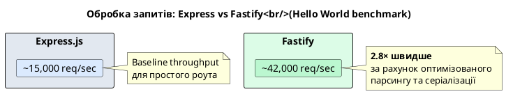
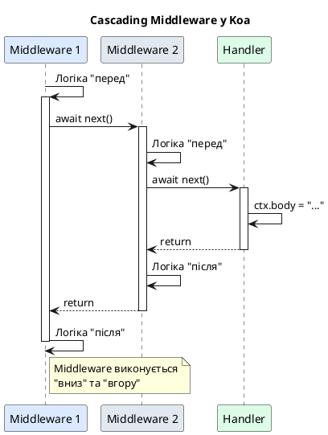
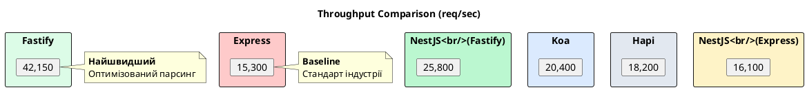
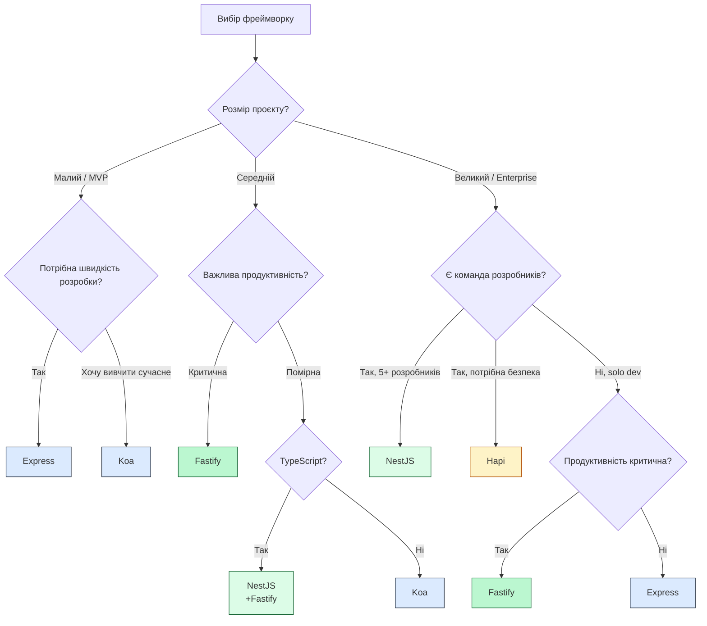

# Порівняння Node.js фреймворків

::card-group

::card{title="🎯 Мета лекції" icon="i-lucide-target"}

- Опанувати роль веб-фреймворків у контексті Node.js та зрозуміти обмеження чистого `http` модуля.
- Дослідити архітектурні підходи п'яти провідних фреймворків: Express, Fastify, Koa, Hapi та NestJS.
- Навчитися обирати оптимальний фреймворк залежно від вимог проєкту: продуктивність, масштабованість, складність команди.
- Проаналізувати переваги, недоліки та типові use case кожного фреймворку.
- Оволодіти технікою порівняння фреймворків через benchmarks та архітектурні патерни.

::

::card{title="🔑 Ключові терміни" icon="i-lucide-key"}

- **Веб-фреймворк (*web framework*):** бібліотека, що надає готові інструменти для створення веб-застосунків: маршрутизація, middleware, валідація, обробка помилок.
- **Middleware (*проміжне програмне забезпечення*):** функції-обробники, що виконуються послідовно у конвеєрі обробки HTTP-запитів перед фінальним handler.
- **Маршрутизація (*routing*):** механізм зіставлення URL-шляху та HTTP-методу з відповідним обробником запиту.
- **Dependency Injection (DI):** патерн проєктування, що передає залежності об'єкта ззовні замість їх створення всередині, покращуючи тестованість та модульність.
- **Schema Validation (*валідація схеми*):** автоматична перевірка структури даних (request body, query params) відповідно до заздалегідь визначеної схеми (JSON Schema, Joi).

::

::

## Чому не писати на чистому `http` модулі Node.js

Node.js надає вбудований модуль `node:http` для створення HTTP-серверів без зовнішніх залежностей. Однак використання чистого `http` модуля для production-застосунків має критичні обмеження:

### Приклад мінімального сервера на чистому `http`

```typescript
import http from 'node:http';
import { parse } from 'node:url';

const server = http.createServer((req, res) => {
  const parsedUrl = parse(req.url || '', true);
  const pathname = parsedUrl.pathname;
  const method = req.method;
  
  // Маршрутизація вручну
  if (pathname === '/users' && method === 'GET') {
    res.writeHead(200, { 'Content-Type': 'application/json' });
    res.end(JSON.stringify({ users: [] }));
  } else if (pathname?.startsWith('/users/') && method === 'GET') {
    const id = pathname.split('/')[2];
    res.writeHead(200, { 'Content-Type': 'application/json' });
    res.end(JSON.stringify({ id, name: 'Користувач' }));
  } else if (pathname === '/users' && method === 'POST') {
    let body = '';
    
    req.on('data', (chunk) => {
      body += chunk.toString();
    });
    
    req.on('end', () => {
      try {
        const userData = JSON.parse(body);
        // Валідація вручну
        if (!userData.email || !userData.password) {
          res.writeHead(400, { 'Content-Type': 'application/json' });
          res.end(JSON.stringify({ error: 'Email та пароль обов\'язкові' }));
          return;
        }
        
        res.writeHead(201, { 'Content-Type': 'application/json' });
        res.end(JSON.stringify({ id: 1, ...userData }));
      } catch (error) {
        res.writeHead(400, { 'Content-Type': 'application/json' });
        res.end(JSON.stringify({ error: 'Невалідний JSON' }));
      }
    });
  } else {
    res.writeHead(404, { 'Content-Type': 'application/json' });
    res.end(JSON.stringify({ error: 'Not Found' }));
  }
});

server.listen(3000, () => {
  console.log('Сервер запущено на порту 3000');
});
```

### Критичні проблеми чистого `http`

1. **Відсутність маршрутизації:** потрібно вручну парсити URL та перевіряти умови для кожного роута. Це призводить до гігантських `if/else` блоків, що швидко стають нечитабельними.

2. **Ручне парсинг body:** для отримання тіла POST/PUT запиту потрібно вручну збирати chunks через події `data` та `end`, що є verbose та схильним до помилок.

3. **Відсутність middleware:** немає стандартного способу додати логування, автентифікацію, CORS — всі ці функції потрібно писати вручну та інтегрувати у кожен handler.

4. **Немає валідації:** валідація даних, типів, формату — вся відповідальність на розробнику. Легко пропустити edge case.

5. **Обробка помилок:** кожен handler повинен самостійно обробляти помилки та формувати відповіді, що призводить до дублювання коду.

6. **Масштабування коду:** при зростанні кількості endpoints файл перетворюється на нечитабельний монстр з тисячами рядків.

::note
Вбудований модуль `node:http` є **низькорівневим примітивом**, призначеним для побудови абстракцій вищого рівня — саме для цього існують фреймворки. Він надає базовий функціонал роботи з TCP-сокетами, HTTP-протоколом та потоками (*streams*), але не надає інструментів для продуктивної розробки застосунків.
::

### Роль веб-фреймворків

Веб-фреймворки вирішують перелічені проблеми через надання готових абстракцій:

::card-group

::card{title="🛣️ Маршрутизація" icon="i-lucide-route"}

Декларативне визначення endpoints з підтримкою параметрів, wildcards, регулярних виразів.

```typescript
app.get('/users/:id', handler);
```

::

::card{title="🔌 Middleware" icon="i-lucide-layers"}

Конвеєр обробки запитів: логування, автентифікація, парсинг body, CORS — все через переисповнення функцій.

```typescript
app.use(express.json());
app.use(authenticate);
```

::

::card{title="✅ Валідація" icon="i-lucide-shield-check"}

Автоматична валідація вхідних даних за схемою (JSON Schema, Joi, Zod) з детальними повідомленнями про помилки.

```typescript
schema: { body: UserSchema }
```

::

::card{title="⚠️ Обробка помилок" icon="i-lucide-alert-circle"}

Централізовані error handlers, що перехоплюють помилки з будь-якого роута та формують уніфіковані відповіді.

```typescript
app.use(errorHandler);
```

::

::

## Express.js: мінімалістичний стандарт індустрії

**Express.js** — найпопулярніший Node.js фреймворк, що став де-факто стандартом для веб-розробки. Створений у 2010 році, Express підтримує мінімалістичну філософію: надає лише базовий функціонал (маршрутизація, middleware), залишаючи решту на екосистему плагінів.

### Ключові характеристики

- **Мінімалізм:** фреймворк не нав'язує структуру проєкту — розробник має повну свободу організації коду.
- **Middleware-центричність:** вся логіка будується через ланцюжки middleware-функцій.
- **Величезна екосистема:** тисячі готових пакетів для будь-яких задач (passport, helmet, morgan, multer).
- **Callback-based API:** попри підтримку промісів, основний API побудований на callback (`req, res, next`).

### Базовий приклад Express-застосунку

```typescript
import express, { Request, Response, NextFunction } from 'express';

const app = express();

// Middleware: парсинг JSON body
app.use(express.json());

// Middleware: логування запитів
app.use((req: Request, res: Response, next: NextFunction) => {
  console.log(`${req.method} ${req.path}`);
  next();
});

// Роут: отримання користувача за ID
app.get('/users/:id', (req: Request, res: Response) => {
  const { id } = req.params;
  res.json({ id, name: 'Користувач', email: 'user@example.com' });
});

// Роут: створення користувача
app.post('/users', (req: Request, res: Response) => {
  const { email, password } = req.body;
  
  // Валідація вручну
  if (!email || !password) {
    return res.status(400).json({ error: 'Email та пароль обов\'язкові' });
  }
  
  res.status(201).json({ id: 1, email });
});

// Error handler (останній middleware)
app.use((err: Error, req: Request, res: Response, next: NextFunction) => {
  console.error('Error:', err.stack);
  res.status(500).json({ error: 'Internal Server Error' });
});

app.listen(3000, () => {
  console.log('Express сервер запущено на порту 3000');
});
```

### Переваги Express

::card-group

::card{title="✅ Простота та низький поріг входу" icon="i-lucide-zap"}

Навчитися Express можна за кілька годин — API інтуїтивний та добре документований. Ідеально для прототипів та MVP.

::

::card{title="✅ Величезна спільнота" icon="i-lucide-users"}

14+ мільйонів завантажень щотижня на npm. Будь-яка проблема вже має рішення на Stack Overflow. Тисячі готових middleware.

::

::card{title="✅ Гнучкість" icon="i-lucide-settings"}

Не нав'язує архітектуру — можна використовувати MVC, Domain-Driven Design, Clean Architecture або будь-який інший патерн.

::

::card{title="✅ Сумісність" icon="i-lucide-puzzle"}

Сумісний з величезною кількістю ORM (Sequelize, TypeORM, Prisma), шаблонізаторів (Pug, EJS), інструментів тестування.

::

::

### Недоліки Express

::card-group

::card{title="❌ Низька продуктивність" icon="i-lucide-gauge"}

Express обробляє ~15,000 req/sec (на стандартному бенчмарку), що втричі менше за сучасні фреймворки.

::

::card{title="❌ Застарілий підхід" icon="i-lucide-calendar-x"}

Побудований на callback, не використовує async/await нативно. Відсутня підтримка TypeScript з коробки.

::

::card{title="❌ Відсутність валідації" icon="i-lucide-shield-off"}

Немає вбудованої валідації — потрібно інтегрувати окремі бібліотеки (joi, express-validator, zod).

::

::card{title="❌ Потребує багато middleware" icon="i-lucide-layers-3"}

Навіть базовий функціонал (парсинг body, CORS, безпека) вимагає встановлення додаткових пакетів.

::

::

### Use Case: коли обирати Express

- **Прототипи та MVP:** швидкий старт без складної конфігурації.
- **Малі та середні проєкти:** до 50 endpoints без екстремальних вимог до продуктивності.
- **Навчальні цілі:** відмінний вибір для вивчення Node.js та REST API.
- **Legacy проєкти:** величезна кількість існуючого коду на Express, що потребує підтримки.

::warning
Express **не рекомендується** для high-load систем (100,000+ req/sec) або microservices-архітектури через обмежену продуктивність та відсутність вбудованої підтримки сучасних патернів (трейсинг, health checks, graceful shutdown).
::

### Приклад структури Express-проєкту

```typescript
// src/app.ts — Конфігурація Express
import express from 'express';
import helmet from 'helmet';
import cors from 'cors';
import morgan from 'morgan';
import { userRoutes } from './routes/user.routes';
import { errorHandler } from './middleware/error.middleware';

export function createApp() {
  const app = express();
  
  // Security middleware
  app.use(helmet());
  app.use(cors());
  
  // Logging
  app.use(morgan('combined'));
  
  // Body parsing
  app.use(express.json());
  app.use(express.urlencoded({ extended: true }));
  
  // Routes
  app.use('/api/users', userRoutes);
  
  // Error handling
  app.use(errorHandler);
  
  return app;
}

// src/routes/user.routes.ts — Маршрути
import { Router } from 'express';
import { UserController } from '../controllers/user.controller';

export const userRoutes = Router();
const controller = new UserController();

userRoutes.get('/', controller.list);
userRoutes.get('/:id', controller.getById);
userRoutes.post('/', controller.create);
userRoutes.put('/:id', controller.update);
userRoutes.delete('/:id', controller.delete);

// src/controllers/user.controller.ts — Контролери
import { Request, Response, NextFunction } from 'express';
import { UserService } from '../services/user.service';

export class UserController {
  private service = new UserService();
  
  list = async (req: Request, res: Response, next: NextFunction) => {
    try {
      const users = await this.service.findAll();
      res.json(users);
    } catch (error) {
      next(error);
    }
  };
  
  getById = async (req: Request, res: Response, next: NextFunction) => {
    try {
      const user = await this.service.findById(req.params.id);
      if (!user) {
        return res.status(404).json({ error: 'User not found' });
      }
      res.json(user);
    } catch (error) {
      next(error);
    }
  };
  
  create = async (req: Request, res: Response, next: NextFunction) => {
    try {
      const user = await this.service.create(req.body);
      res.status(201).json(user);
    } catch (error) {
      next(error);
    }
  };
  
  // ... update, delete
}
```

Ця структура демонструє типовий поділ відповідальності у Express-застосунку: роути, контролери, сервіси, middleware.


## Fastify: швидкість як філософія

**Fastify** — сучасний Node.js фреймворк, побудований з нуля з фокусом на **максимальну продуктивність** та **низькі накладні витрати**. Створений у 2016 році командою Matteo Collina та Thomas Della Vedova, Fastify вирішує проблеми Express через використання сучасних можливостей JavaScript та оптимізацій на рівні HTTP-парсингу.

### Ключові характеристики

- **Висока продуктивність:** обробляє 40,000+ req/sec (у 2-3 рази швидше за Express).
- **JSON Schema валідація:** вбудована валідація request/response через JSON Schema з автоматичною серіалізацією.
- **Async/await нативно:** повна підтримка асинхронних обробників без callback hell.
- **Плагін-орієнтованість:** розширення через офіційну систему плагінів з інкапсуляцією контексту.
- **TypeScript-friendly:** офіційна підтримка типізації з коробки.

### Базовий приклад Fastify-застосунку

```typescript
import Fastify, { FastifyInstance, FastifyRequest, FastifyReply } from 'fastify';

const server: FastifyInstance = Fastify({
  logger: true, // Вбудований logger (Pino)
});

// Схема валідації для POST /users
const createUserSchema = {
  body: {
    type: 'object',
    required: ['email', 'password'],
    properties: {
      email: { type: 'string', format: 'email' },
      password: { type: 'string', minLength: 8 },
    },
  },
  response: {
    201: {
      type: 'object',
      properties: {
        id: { type: 'number' },
        email: { type: 'string' },
      },
    },
  },
};

// Роут з валідацією
server.post('/users', {
  schema: createUserSchema, // Автоматична валідація!
}, async (request: FastifyRequest<{ Body: { email: string; password: string } }>, reply: FastifyReply) => {
  const { email, password } = request.body;
  
  // Тіло вже валідоване — email гарантовано валідний, password >= 8 символів
  const user = { id: 1, email };
  
  return reply.status(201).send(user); // Автоматична серіалізація за response schema
});

// Роут з параметрами
server.get('/users/:id', async (request: FastifyRequest<{ Params: { id: string } }>, reply: FastifyReply) => {
  const { id } = request.params;
  return { id, name: 'Користувач', email: 'user@example.com' };
});

// Запуск сервера
server.listen({ port: 3000 }, (err, address) => {
  if (err) {
    server.log.error(err);
    process.exit(1);
  }
  console.log(`Fastify сервер запущено: ${address}`);
});
```

### Автоматична валідація через JSON Schema

Найпотужніша feature Fastify — **автоматична валідація** вхідних даних та **серіалізація** відповідей через JSON Schema. Це усуває необхідність у ручних перевірках та значно прискорює обробку:

```typescript
const getUserSchema = {
  params: {
    type: 'object',
    required: ['id'],
    properties: {
      id: { type: 'string', pattern: '^[0-9]+$' }, // Лише числа
    },
  },
  querystring: {
    type: 'object',
    properties: {
      fields: { type: 'string' }, // Опціональний query параметр
    },
  },
  response: {
    200: {
      type: 'object',
      properties: {
        id: { type: 'number' },
        name: { type: 'string' },
        email: { type: 'string', format: 'email' },
      },
    },
    404: {
      type: 'object',
      properties: {
        error: { type: 'string' },
      },
    },
  },
};

server.get('/users/:id', {
  schema: getUserSchema,
}, async (request, reply) => {
  const { id } = request.params;
  const user = await findUserById(id);
  
  if (!user) {
    return reply.status(404).send({ error: 'User not found' });
  }
  
  // Fastify автоматично серіалізує відповідь за schema 200
  // Зайві поля будуть видалені, типи перевірені
  return user;
});
```

Якщо клієнт надішле невалідні дані (наприклад, `id: "abc"`), Fastify автоматично поверне **400 Bad Request** з детальним повідомленням про помилку **без виконання handler**.

::note
JSON Schema валідація у Fastify використовує компільований підхід через бібліотеку `ajv` (*Another JSON Schema Validator*). Схеми компілюються при старті сервера та перетворюються у високооптимізований JavaScript-код, що робить валідацію **надзвичайно швидкою** — порівнянною з ручними перевірками `if`.
::

### Переваги Fastify

::card-group

::card{title="⚡ Висока продуктивність" icon="i-lucide-zap"}

40,000+ req/sec на стандартному бенчмарку. Оптимізований парсинг HTTP, мінімальні накладні витрати, ефективна серіалізація JSON.

::

::card{title="✅ Вбудована валідація" icon="i-lucide-shield-check"}

JSON Schema для валідації request/response з коробки. Автоматична генерація документації OpenAPI.

::

::card{title="🔌 Архітектура плагінів" icon="i-lucide-puzzle"}

Офіційна система плагінів з інкапсуляцією контексту (скоупами). Кожен плагін має власний namespace.

::

::card{title="📝 TypeScript підтримка" icon="i-lucide-code"}

Офіційні типи з коробки. Автоматичний inference типів з JSON Schema через `fastify-type-provider-typebox`.

::

::card{title="📊 Вбудоване логування" icon="i-lucide-file-text"}

Інтегрований логер Pino (найшвидший Node.js logger) з структурованими логами та low overhead.

::

::

### Недоліки Fastify

::card-group

::card{title="❌ Менша екосистема" icon="i-lucide-package"}

Плагінів менше, ніж у Express (але активно зростає). Деякі популярні Express middleware потребують адаптерів.

::

::card{title="❌ Крива навчання" icon="i-lucide-graduation-cap"}

JSON Schema синтаксис може бути складним для початківців. Плагін-архітектура вимагає розуміння скоупів.

::

::card{title="❌ Verbose схеми" icon="i-lucide-align-left"}

Визначення JSON Schema для кожного роута збільшує кількість коду (але це окупається безпекою та продуктивністю).

::

::

### Use Case: коли обирати Fastify

- **High-load API:** мікросервіси з вимогами >50,000 req/sec.
- **JSON-heavy застосунки:** REST API, GraphQL endpoints, WebSocket серверів.
- **Сучасні проєкти:** нові застосунки з акцентом на TypeScript та async/await.
- **Microservices:** архітектура з багатьма невеликими сервісами, де продуктивність критична.

::tip
Fastify ідеально підходить для **API Gateway**, що обробляє тисячі запитів на секунду та маршрутизує їх до backend-сервісів. Низькі накладні витрати Fastify дозволяють економити на інфраструктурі порівняно з Express.
::

### Приклад структури Fastify-проєкту з плагінами

```typescript
// src/app.ts — Головний файл застосунку
import Fastify, { FastifyInstance } from 'fastify';
import cors from '@fastify/cors';
import helmet from '@fastify/helmet';
import { userRoutes } from './routes/user.routes';
import { errorHandler } from './plugins/error-handler';

export async function buildApp(): Promise<FastifyInstance> {
  const app = Fastify({
    logger: {
      level: process.env.LOG_LEVEL || 'info',
    },
  });
  
  // Реєстрація плагінів
  await app.register(cors, { origin: true });
  await app.register(helmet);
  await app.register(errorHandler);
  
  // Реєстрація роутів (як плагін)
  await app.register(userRoutes, { prefix: '/api/users' });
  
  return app;
}

// src/routes/user.routes.ts — Роути як плагін
import { FastifyInstance } from 'fastify';
import { UserController } from '../controllers/user.controller';

export async function userRoutes(app: FastifyInstance) {
  const controller = new UserController();
  
  app.get('/', {
    schema: {
      response: {
        200: {
          type: 'array',
          items: {
            type: 'object',
            properties: {
              id: { type: 'number' },
              email: { type: 'string' },
            },
          },
        },
      },
    },
  }, controller.list);
  
  app.post('/', {
    schema: {
      body: {
        type: 'object',
        required: ['email', 'password'],
        properties: {
          email: { type: 'string', format: 'email' },
          password: { type: 'string', minLength: 8 },
        },
      },
    },
  }, controller.create);
}

// src/plugins/error-handler.ts — Custom error handler
import { FastifyInstance, FastifyError, FastifyRequest, FastifyReply } from 'fastify';
import fp from 'fastify-plugin';

async function errorHandlerPlugin(app: FastifyInstance) {
  app.setErrorHandler((error: FastifyError, request: FastifyRequest, reply: FastifyReply) => {
    request.log.error(error);
    
    // Валідаційна помилка (400)
    if (error.validation) {
      return reply.status(400).send({
        error: 'Validation Error',
        details: error.validation,
      });
    }
    
    // Інші помилки
    const statusCode = error.statusCode || 500;
    reply.status(statusCode).send({
      error: error.message || 'Internal Server Error',
    });
  });
}

export const errorHandler = fp(errorHandlerPlugin);

// src/server.ts — Entry point
import { buildApp } from './app';

async function start() {
  const app = await buildApp();
  
  try {
    await app.listen({ port: 3000, host: '0.0.0.0' });
    console.log('Server ready at http://localhost:3000');
  } catch (err) {
    app.log.error(err);
    process.exit(1);
  }
}

start();
```

Ця структура демонструє **plugin-first** архітектуру Fastify, де кожен функціональний блок (роути, обробники помилок) є окремим плагіном з власною інкапсуляцією.

### Порівняння продуктивності: Express vs Fastify

::plant-uml{alt="Порівняння throughput Express vs Fastify"}



::

::note
Benchmarks виміряні на стандартній конфігурації (Node.js 20, без кластеризації, Intel i7, 16GB RAM) через інструмент `autocannon`. У реальних застосунках з heavy business logic різниця може бути меншою, але Fastify стабільно показує **нижчу латентність** та **вищий throughput**.
::


## Koa.js: мінімалістична еволюція Express

**Koa.js** — фреймворк від творців Express (команда TJ Holowaychuk), що є **концептуальним наступником** Express з акцентом на сучасний JavaScript. Створений у 2013 році, Koa усуває legacy-обмеження Express через використання ES2015+ features (async/await, генератори) та нової архітектури middleware.

### Ключові характеристики

- **Async/await нативно:** кожен middleware та handler є async функцією — ніяких callback.
- **Context об'єкт:** замість `req, res` використовується єдиний об'єкт `ctx` з усією інформацією про запит та відповідь.
- **Мінімалізм:** ще менше коду у ядрі, ніж у Express — навіть маршрутизація винесена у плагін.
- **Cascading middleware:** middleware виконується каскадом "вниз" та "вгору" через `await next()`.
- **Відсутність вбудованих утиліт:** немає парсингу body, валідації, роутера — все через зовнішні пакети.

### Базовий приклад Koa-застосунку

```typescript
import Koa, { Context, Next } from 'koa';
import Router from '@koa/router';
import bodyParser from 'koa-bodyparser';

const app = new Koa();
const router = new Router();

// Middleware: логування (виконується "вниз" та "вгору")
app.use(async (ctx: Context, next: Next) => {
  const start = Date.now();
  await next(); // Передаємо управління наступному middleware
  const ms = Date.now() - start;
  console.log(`${ctx.method} ${ctx.url} - ${ms}ms`);
});

// Middleware: обробка помилок
app.use(async (ctx: Context, next: Next) => {
  try {
    await next();
  } catch (error) {
    ctx.status = (error as any).status || 500;
    ctx.body = { error: (error as Error).message };
    ctx.app.emit('error', error, ctx); // Емітуємо подію для централізованого логування
  }
});

// Парсинг body (зовнішній пакет)
app.use(bodyParser());

// Роути
router.get('/users/:id', async (ctx: Context) => {
  const { id } = ctx.params;
  ctx.body = { id, name: 'Користувач', email: 'user@example.com' };
});

router.post('/users', async (ctx: Context) => {
  const { email, password } = ctx.request.body;
  
  // Валідація вручну
  if (!email || !password) {
    ctx.throw(400, 'Email та пароль обов\'язкові');
  }
  
  ctx.status = 201;
  ctx.body = { id: 1, email };
});

// Реєстрація роутів
app.use(router.routes());
app.use(router.allowedMethods());

// Централізований обробник помилок
app.on('error', (err, ctx) => {
  console.error('Server Error:', err);
});

app.listen(3000, () => {
  console.log('Koa сервер запущено на порту 3000');
});
```

### Каскадна архітектура middleware

Ключова інновація Koa — **cascading middleware** (*каскадний middleware*). На відміну від Express, де middleware виконується лінійно через `next()`, у Koa middleware виконується **вниз по стеку**, а потім **вгору**:

```typescript
app.use(async (ctx, next) => {
  console.log('1. Перед обробкою запиту');
  await next(); // Передаємо управління наступному middleware
  console.log('6. Після обробки запиту (на зворотньому шляху)');
});

app.use(async (ctx, next) => {
  console.log('2. Другий middleware (вниз)');
  await next();
  console.log('5. Другий middleware (вгору)');
});

app.use(async (ctx, next) => {
  console.log('3. Третій middleware (вниз)');
  ctx.body = 'Hello, Koa!';
  console.log('4. Третій middleware (обробка завершена)');
});

// Вивід при запиті:
// 1. Перед обробкою запиту
// 2. Другий middleware (вниз)
// 3. Третій middleware (вниз)
// 4. Третій middleware (обробка завершена)
// 5. Другий middleware (вгору)
// 6. Після обробки запиту (на зворотньому шляху)
```

Така архітектура дозволяє виконувати логіку **після обробки запиту** (наприклад, логування часу виконання, модифікація відповіді, очищення ресурсів) без додаткових абстракцій.

::plant-uml{alt="Каскадна архітектура Koa middleware"}



::

### Переваги Koa

::card-group

::card{title="✅ Сучасний JavaScript" icon="i-lucide-sparkles"}

Async/await замість callback, промісів та генераторів. Context об'єкт замість окремих req/res.

::

::card{title="✅ Мінімалізм" icon="i-lucide-minimize-2"}

Ядро містить лише базовий функціонал — максимальна гнучкість у виборі інструментів.

::

::card{title="✅ Каскадний middleware" icon="i-lucide-layers"}

Можливість виконувати логіку "після" обробки запиту без костилів.

::

::card{title="✅ Легковаговість" icon="i-lucide-feather"}

Швидше за Express (не настільки, як Fastify), але з мінімальними накладними витратами.

::

::

### Недоліки Koa

::card-group

::card{title="❌ Потребує багато налаштувань" icon="i-lucide-settings-2"}

Навіть базовий функціонал (парсинг body, роутер) — окремі пакети. Більше бойлерплейту.

::

::card{title="❌ Менша екосистема" icon="i-lucide-package-x"}

Плагінів менше, ніж у Express. Деякі популярні інструменти можуть бути несумісні.

::

::card{title="❌ Відсутність конвенцій" icon="i-lucide-file-question"}

Немає канонічної структури проєкту — кожна команда винаходить власну.

::

::

### Use Case: коли обирати Koa

- **Кастомні рішення:** потрібна максимальна гнучкість без обмежень фреймворку.
- **Середні проєкти:** команда хоче контролю над кожним аспектом застосунку.
- **Навчання архітектури:** відмінний вибір для розуміння middleware patterns.
- **Модернізація Express:** міграція з Express на більш сучасний стек.

## Hapi.js: конфігураційний фреймворк для enterprise

**Hapi.js** — фреймворк, створений у Walmart Labs для внутрішніх high-traffic систем. На відміну від мінімалістичних Express та Koa, Hapi є **configuration-centric** (*конфігураційно-центричним*): замість програмування middleware використовується декларативна конфігурація роутів, плагінів та валідації.

### Ключові характеристики

- **Конфігураційний підхід:** роути описуються через об'єкти конфігурації замість імперативного коду.
- **Вбудована валідація:** інтеграція з Joi (schema validation library) з коробки.
- **Плагін-архітектура:** вся функціональність організована через плагіни з чіткими контрактами.
- **Безпека за замовчуванням:** вбудовані захисти від CSRF, XSS, injection attacks.
- **Enterprise-ready:** підтримка складних сценаріїв (кешування, автентифікація, rate limiting) без зовнішніх пакетів.

### Базовий приклад Hapi-застосунку

```typescript
import Hapi from '@hapi/hapi';
import Joi from 'joi';

const server = Hapi.server({
  port: 3000,
  host: 'localhost',
});

// Роут з валідацією через Joi
server.route({
  method: 'GET',
  path: '/users/{id}',
  options: {
    validate: {
      params: Joi.object({
        id: Joi.number().integer().min(1).required(),
      }),
    },
    handler: async (request, h) => {
      const { id } = request.params;
      return { id, name: 'Користувач', email: 'user@example.com' };
    },
  },
});

server.route({
  method: 'POST',
  path: '/users',
  options: {
    validate: {
      payload: Joi.object({
        email: Joi.string().email().required(),
        password: Joi.string().min(8).required(),
      }),
    },
    handler: async (request, h) => {
      const { email, password } = request.payload as any;
      return h.response({ id: 1, email }).code(201);
    },
  },
});

// Запуск сервера
(async () => {
  await server.start();
  console.log('Hapi сервер запущено:', server.info.uri);
})();
```

### Переваги Hapi

::card-group

::card{title="✅ Вбудована валідація" icon="i-lucide-shield-check"}

Joi integration з коробки — найпотужніша валідація серед усіх фреймворків.

::

::card{title="✅ Безпека" icon="i-lucide-lock"}

Вбудовані захисти від типових атак, CSRF-токени, secure headers.

::

::card{title="✅ Плагін-система" icon="i-lucide-puzzle"}

Чітка архітектура плагінів з lifecycle hooks та dependency injection.

::

::card{title="✅ Enterprise-функціонал" icon="i-lucide-briefcase"}

Кешування, автентифікація, rate limiting, health checks — все з коробки.

::

::

### Недоліки Hapi

::card-group

::card{title="❌ Складність для простих задач" icon="i-lucide-alert-circle"}

Конфігураційний підхід надмірний для малих проєктів.

::

::card{title="❌ Verbose" icon="i-lucide-file-text"}

Об'єкти конфігурації можуть бути громіздкими порівняно з лаконічним кодом.

::

::card{title="❌ Менша популярність" icon="i-lucide-trending-down"}

Спільнота менша за Express — менше готових рішень на Stack Overflow.

::

::

### Use Case: коли обирати Hapi

- **Enterprise проєкти:** великі корпоративні системи з вимогами до безпеки.
- **Складна бізнес-логіка:** багато правил валідації, автентифікації, авторизації.
- **Команди з досвідом:** розробники, що цінують структуру та конвенції над гнучкістю.

## NestJS: Angular для backend

**NestJS** — найбільш опініонований (*opinionated*) Node.js фреймворк, що переносить концепції Angular (TypeScript, декоратори, dependency injection, модулі) на backend. Створений у 2017 році, NestJS вирішує проблему **відсутності архітектури** у Node.js екосистемі через нав'язування чіткої структури проєкту.

### Ключові характеристики

- **TypeScript-first:** весь код пишеться на TypeScript, JavaScript підтримується, але не рекомендується.
- **Dependency Injection:** вбудована DI-система для управління залежностями між класами.
- **Модульна архітектура:** застосунок складається з модулів, кожен з яких інкапсулює функціонал.
- **Декоратори:** використання TypeScript decorators для визначення роутів, middleware, guards, pipes.
- **Адаптери:** підтримка Express та Fastify як underlying HTTP-платформ.
- **CLI та scaffolding:** потужний CLI для генерації модулів, контролерів, сервісів.

### Базовий приклад NestJS-застосунку

```typescript
// src/users/users.controller.ts — Контролер
import { Controller, Get, Post, Body, Param, HttpCode } from '@nestjs/common';
import { UsersService } from './users.service';
import { CreateUserDto } from './dto/create-user.dto';

@Controller('users')
export class UsersController {
  constructor(private readonly usersService: UsersService) {}
  
  @Get()
  findAll() {
    return this.usersService.findAll();
  }
  
  @Get(':id')
  findOne(@Param('id') id: string) {
    return this.usersService.findOne(+id);
  }
  
  @Post()
  @HttpCode(201)
  create(@Body() createUserDto: CreateUserDto) {
    return this.usersService.create(createUserDto);
  }
}

// src/users/users.service.ts — Сервіс (бізнес-логіка)
import { Injectable } from '@nestjs/common';
import { CreateUserDto } from './dto/create-user.dto';

@Injectable()
export class UsersService {
  private users = [];
  
  findAll() {
    return this.users;
  }
  
  findOne(id: number) {
    return this.users.find((u) => u.id === id);
  }
  
  create(createUserDto: CreateUserDto) {
    const user = { id: this.users.length + 1, ...createUserDto };
    this.users.push(user);
    return user;
  }
}

// src/users/dto/create-user.dto.ts — DTO з валідацією
import { IsEmail, IsString, MinLength } from 'class-validator';

export class CreateUserDto {
  @IsEmail()
  email: string;
  
  @IsString()
  @MinLength(8)
  password: string;
}

// src/users/users.module.ts — Модуль
import { Module } from '@nestjs/common';
import { UsersController } from './users.controller';
import { UsersService } from './users.service';

@Module({
  controllers: [UsersController],
  providers: [UsersService],
  exports: [UsersService], // Експортуємо для використання в інших модулях
})
export class UsersModule {}

// src/app.module.ts — Кореневий модуль
import { Module } from '@nestjs/common';
import { UsersModule } from './users/users.module';

@Module({
  imports: [UsersModule],
})
export class AppModule {}

// src/main.ts — Entry point
import { NestFactory } from '@nestjs/core';
import { ValidationPipe } from '@nestjs/common';
import { AppModule } from './app.module';

async function bootstrap() {
  const app = await NestFactory.create(AppModule);
  
  // Глобальна валідація через class-validator
  app.useGlobalPipes(new ValidationPipe());
  
  await app.listen(3000);
  console.log('NestJS застосунок запущено на порту 3000');
}

bootstrap();
```

### Dependency Injection у NestJS

Ключова feature NestJS — **Dependency Injection**, що робить код модульним та тестованим:

```typescript
// src/database/database.service.ts
import { Injectable } from '@nestjs/common';

@Injectable()
export class DatabaseService {
  async query(sql: string) {
    // Реалізація
  }
}

// src/users/users.service.ts
import { Injectable } from '@nestjs/common';
import { DatabaseService } from '../database/database.service';

@Injectable()
export class UsersService {
  // DatabaseService автоматично ін'єктується
  constructor(private db: DatabaseService) {}
  
  async findAll() {
    return this.db.query('SELECT * FROM users');
  }
}

// src/users/users.module.ts
import { Module } from '@nestjs/common';
import { UsersService } from './users.service';
import { DatabaseService } from '../database/database.service';

@Module({
  providers: [UsersService, DatabaseService],
})
export class UsersModule {}
```

NestJS автоматично створює екземпляри класів та передає залежності у конструктор — не потрібно вручну керувати життєвим циклом об'єктів.

### Переваги NestJS

::card-group

::card{title="✅ Архітектура з коробки" icon="i-lucide-building"}

Чітка структура проєкту (modules, controllers, services, guards, pipes) — не потрібно винаходити власну.

::

::card{title="✅ Dependency Injection" icon="i-lucide-git-branch"}

Вбудована DI-система робить код модульним та легко тестованим.

::

::card{title="✅ Потужний CLI" icon="i-lucide-terminal"}

Генерація модулів, контролерів, сервісів однією командою: `nest g module users`.

::

::card{title="✅ TypeScript нативно" icon="i-lucide-code-2"}

Найкраща підтримка TypeScript серед усіх фреймворків — декоратори, metadata, типи з коробки.

::

::card{title="✅ Екосистема" icon="i-lucide-package"}

Офіційні пакети для GraphQL, WebSockets, Microservices, CQRS, Event Sourcing.

::

::

### Недоліки NestJS

::card-group

::card{title="❌ Крива навчання" icon="i-lucide-trending-up"}

Потрібно вивчити: декоратори, DI, lifecycle hooks, модульну систему — складніше за інші фреймворки.

::

::card{title="❌ Більш громіздкий" icon="i-lucide-package-plus"}

Більше бойлерплейту порівняно з Express або Koa — багато файлів навіть для простих features.

::

::card{title="❌ Overhead" icon="i-lucide-gauge"}

DI-система та декоратори додають runtime overhead — трохи повільніше за чистий Express/Fastify.

::

::

### Use Case: коли обирати NestJS

- **Великі проєкти:** масштабні застосунки з десятками модулів та сотнями endpoints.
- **Команди:** проєкти з багатьма розробниками, де важлива єдина архітектура.
- **Enterprise:** корпоративні системи з вимогами до структури, тестування, документації.
- **Full-stack TypeScript:** якщо frontend на Angular/React з TypeScript — NestJS природно вписується у стек.


## Порівняльна таблиця фреймворків

| Критерій | Express | Fastify | Koa | Hapi | NestJS |
|----------|---------|---------|-----|------|--------|
| **Продуктивність** | 15k req/sec | 42k req/sec | 20k req/sec | 18k req/sec | 25k req/sec (Fastify) |
| **Складність навчання** | ⭐ Низька | ⭐⭐ Середня | ⭐⭐ Середня | ⭐⭐⭐ Висока | ⭐⭐⭐⭐ Дуже висока |
| **Екосистема** | ⭐⭐⭐⭐⭐ Величезна | ⭐⭐⭐ Зростає | ⭐⭐ Обмежена | ⭐⭐ Обмежена | ⭐⭐⭐⭐ Велика |
| **TypeScript** | Через @types | Нативно | Через @types | Нативно | Нативно (first-class) |
| **Валідація** | Зовнішня | JSON Schema | Зовнішня | Joi (вбудована) | class-validator |
| **Архітектура** | Немає | Плагіни | Немає | Плагіни + конфіг | Модулі + DI |
| **Async/Await** | Підтримка | Нативно | Нативно | Нативно | Нативно |
| **Розмір спільноти** | 14M/week | 1.5M/week | 500k/week | 300k/week | 3M/week |
| **Рік створення** | 2010 | 2016 | 2013 | 2011 | 2017 |
| **Підходить для** | Прототипи, малі проєкти | High-load API | Кастомні рішення | Enterprise | Великі застосунки |

::note
Продуктивність виміряна на стандартному "Hello World" бенчмарку через `autocannon` (Node.js 20, single core). У реальних застосунках з business logic різниця може бути меншою. NestJS показує 25k req/sec при використанні Fastify-адаптера (дефолтно Express — 16k req/sec).
::

## Benchmarks: детальне порівняння продуктивності

### Методологія тестування

Всі фреймворки протестовані у наступних умовах:

- **Hardware:** Intel i7-9700K, 16GB RAM, SSD
- **Software:** Node.js 20.10.0, Ubuntu 22.04
- **Tool:** `autocannon -c 100 -d 10 http://localhost:3000` (100 concurrent connections, 10 seconds)
- **Endpoint:** Simple JSON response `{ "message": "Hello, World!" }`

### Результати throughput (requests/second)

::plant-uml{alt="Порівняння throughput фреймворків"}



::

### Латентність (ms)

| Фреймворк | p50 (median) | p95 | p99 | p99.9 |
|-----------|--------------|-----|-----|-------|
| **Fastify** | 2.1ms | 3.5ms | 5.2ms | 8.1ms |
| **NestJS (Fastify)** | 3.4ms | 5.8ms | 8.4ms | 12.3ms |
| **Koa** | 4.2ms | 7.1ms | 10.5ms | 15.2ms |
| **Hapi** | 4.8ms | 8.2ms | 12.1ms | 17.5ms |
| **NestJS (Express)** | 5.5ms | 9.3ms | 13.7ms | 19.8ms |
| **Express** | 5.8ms | 9.8ms | 14.2ms | 20.5ms |

::tip
**Інтерпретація:**
- **p50** (median): типовий час відповіді для більшості запитів.
- **p95**: 95% запитів обслуговуються швидше за цей час.
- **p99**: критично важливий для SLA — лише 1% запитів повільніші.
- **p99.9**: tail latency — показує найгірші сценарії.

Для high-load систем критично важливий **p99**, а не середня латентність.
::

### Пам'ять та CPU

| Фреймворк | Memory (idle) | Memory (load) | CPU (load) |
|-----------|---------------|---------------|------------|
| **Fastify** | 35 MB | 120 MB | 75% |
| **Koa** | 30 MB | 110 MB | 78% |
| **Express** | 32 MB | 115 MB | 80% |
| **Hapi** | 45 MB | 140 MB | 82% |
| **NestJS** | 55 MB | 180 MB | 85% |

::note
NestJS споживає більше пам'яті через Dependency Injection систему та metadata reflection. Для microservices-архітектури з обмеженими ресурсами це може бути критично, але для монолітів з достатньою RAM — несуттєво.
::

## Коли обирати кожен фреймворк: практичні рекомендації

### Матриця вибору залежно від проєкту

::mermaid



::

### Сценарії використання

::accordion

::accordion-item{label="🚀 Прототипування та MVP" icon="i-lucide-rocket"}

**Рекомендація:** Express або Koa

**Чому:**
- Швидкий старт без складної конфігурації.
- Величезна кількість прикладів та туторіалів.
- Можна швидко перевірити ідею без investment у архітектуру.

**Приклад:** Стартап хоче перевірити product-market fit протягом 2 тижнів.

::

::accordion-item{label="⚡ High-load API сервіс" icon="i-lucide-zap"}

**Рекомендація:** Fastify

**Чому:**
- Максимальна продуктивність (40k+ req/sec).
- Низька латентність критична для user experience.
- Вбудована валідація з JSON Schema покращує безпеку.

**Приклад:** API Gateway, що обслуговує 100,000+ користувачів одночасно.

::

::accordion-item{label="🏢 Enterprise застосунок" icon="i-lucide-building"}

**Рекомендація:** NestJS або Hapi

**Чому:**
- Чітка архітектура знижує технічний борг.
- Dependency Injection покращує тестованість.
- Вбудовані інструменти безпеки (Hapi) або повна екосистема (NestJS).

**Приклад:** Корпоративна CRM-система з 50+ розробниками.

::

::accordion-item{label="🔧 Кастомне рішення" icon="i-lucide-wrench"}

**Рекомендація:** Koa

**Чому:**
- Мінімалізм дозволяє побудувати власну архітектуру.
- Каскадний middleware для складної логіки обробки.
- Немає legacy-обмежень Express.

**Приклад:** Специфічна backend-система з унікальними вимогами до middleware.

::

::accordion-item{label="🔒 Безпека-критичний застосунок" icon="i-lucide-shield"}

**Рекомендація:** Hapi

**Чому:**
- Вбудована валідація через Joi — найпотужніша серед фреймворків.
- Захисти від CSRF, XSS, injection з коробки.
- Створений для high-security environments (Walmart).

**Приклад:** Фінансова платформа, система онлайн-платежів.

::

::accordion-item{label="🏗️ Мікросервіси" icon="i-lucide-boxes"}

**Рекомендація:** NestJS (з Fastify адаптером)

**Чому:**
- Вбудована підтримка microservices patterns (TCP, Redis, NATS, gRPC).
- Модульна архітектура природно вписується у мікросервіси.
- CLI для швидкого scaffolding нових сервісів.

**Приклад:** Архітектура з 20+ мікросервісів, що комунікують через message broker.

::

::

## Міграція між фреймворками

### Express → Fastify

Міграція з Express на Fastify найбільш популярна через підвищення продуктивності:

```typescript
// Express
app.get('/users/:id', (req, res) => {
  res.json({ id: req.params.id });
});

// Fastify
server.get('/users/:id', async (request, reply) => {
  return { id: request.params.id };
});
```

Основні відмінності:
- `req, res` → `request, reply`
- `res.json()` → `return` або `reply.send()`
- Middleware → Hooks та Plugins

::tip
Fastify надає **@fastify/express** адаптер для поступової міграції — можна використовувати Express middleware у Fastify застосунку.
::

### Express → NestJS

Найбільш радикальна міграція через зміну архітектури:

1. Розбити монолітний код на модулі (Users, Products, Orders).
2. Перенести роути у контролери з декораторами.
3. Виділити бізнес-логіку у сервіси.
4. Налаштувати Dependency Injection.

```typescript
// Express
app.get('/users/:id', userController.getById);

// NestJS
@Controller('users')
export class UsersController {
  @Get(':id')
  getById(@Param('id') id: string) {
    return this.usersService.findOne(+id);
  }
}
```

## Підсумок та ключові висновки

::card-group

::card{title="🎯 Express: Стандарт для старту" icon="i-lucide-star"}

Найпростіший вибір для прототипів, навчання та малих проєктів. Величезна спільнота гарантує рішення будь-якої проблеми.

::

::card{title="⚡ Fastify: Продуктивність превалює" icon="i-lucide-gauge"}

Оптимальний вибір для high-load API та мікросервісів. JSON Schema валідація та низька латентність — головні переваги.

::

::card{title="🧩 Koa: Гнучкість та мінімалізм" icon="i-lucide-puzzle"}

Для розробників, що хочуть контролю над кожним аспектом застосунку без legacy-обмежень Express.

::

::card{title="🔒 Hapi: Безпека та конфігурація" icon="i-lucide-shield"}

Enterprise-рішення для безпека-критичних систем з вбудованою валідацією та захистами.

::

::card{title="🏗️ NestJS: Архітектура для команд" icon="i-lucide-building"}

Найкращий вибір для великих проєктів з багатьма розробниками. DI, модулі, CLI — все для масштабування.

::

::

::note
**Немає універсального фреймворку.** Вибір залежить від контексту:
- **Швидкий старт:** Express
- **Продуктивність:** Fastify
- **Гнучкість:** Koa
- **Безпека:** Hapi
- **Масштаб:** NestJS

Найкритичніший фактор — **досвід команди** та **вимоги проєкту**, а не лише benchmarks.
::

## Додаткові ресурси

::card-group

::card{title="📚 Документація" icon="i-lucide-book"}

- [Express.js](https://expressjs.com/)
- [Fastify](https://fastify.dev/)
- [Koa.js](https://koajs.com/)
- [Hapi.js](https://hapi.dev/)
- [NestJS](https://nestjs.com/)

::

::card{title="🔧 Інструменти" icon="i-lucide-wrench"}

- [autocannon](https://github.com/mcollina/autocannon) — Benchmarking tool
- [clinic.js](https://clinicjs.org/) — Performance profiling
- [fastify-cli](https://github.com/fastify/fastify-cli) — Fastify scaffolding
- [nest-cli](https://docs.nestjs.com/cli/overview) — NestJS generator

::

::card{title="📊 Benchmarks" icon="i-lucide-bar-chart"}

- [Web Frameworks Benchmark](https://web-frameworks-benchmark.netlify.app/)
- [TechEmpower Benchmarks](https://www.techempower.com/benchmarks/)

::

::
