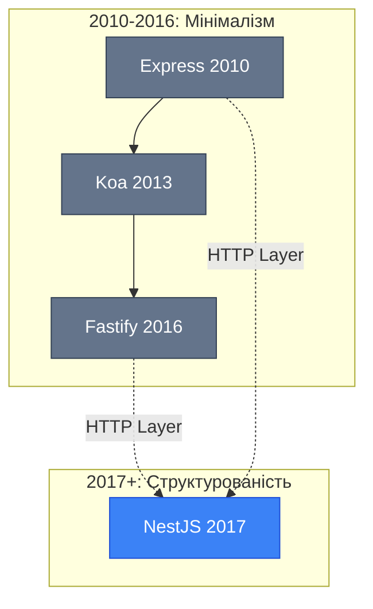
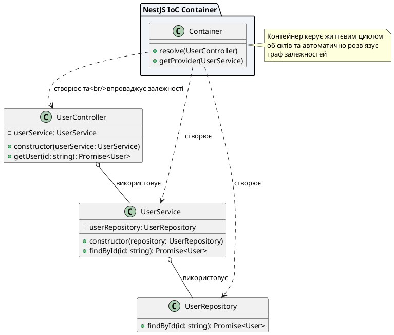
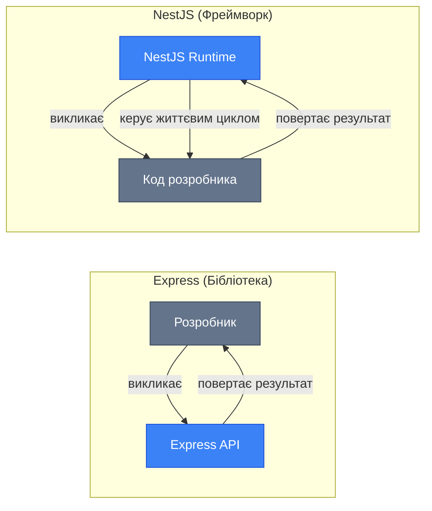
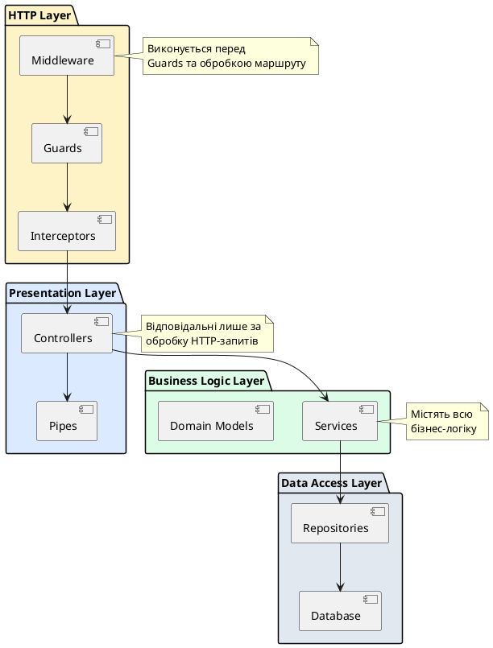
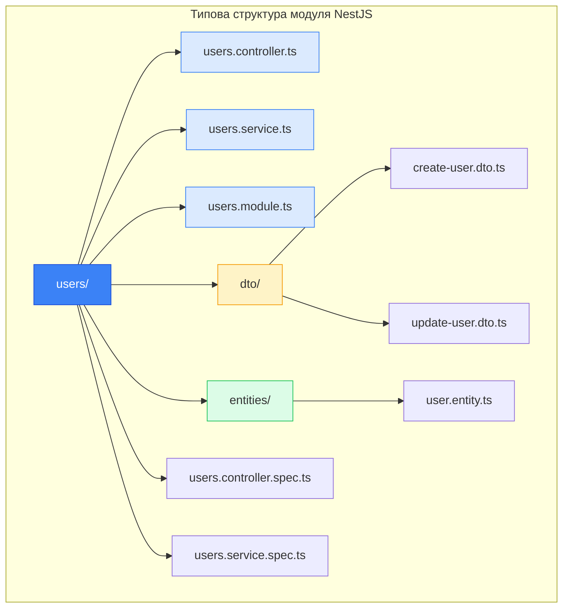
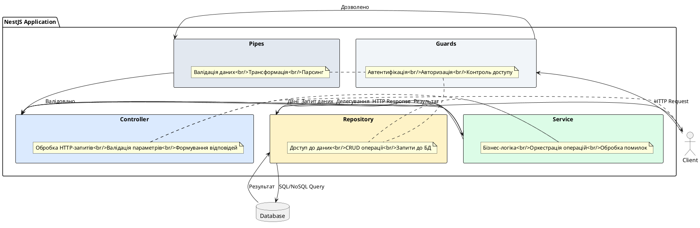

# Філософія та архітектура NestJS

::card-group

::card{title="🎯 Мета лекції" icon="i-lucide-target"}

- Зрозуміти філософські основи та архітектурні принципи фреймворку NestJS
- Простежити еволюцію підходів до розробки серверних застосунків на Node.js
- Опанувати концепцію TypeScript-first розробки та її переваги
- Усвідомити відмінності між мінімалістичними та структурованими фреймворками
- Навчитися визначати, коли варто обирати NestJS для проєкту

::

::card{title="🔑 Ключові терміни" icon="i-lucide-key"}

- **Framework** (*фреймворк*): архітектурна основа для побудови застосунків із визначеними правилами та структурою
- **TypeScript-first**: підхід, де TypeScript є первинною мовою розробки, а не надбудовою
- **Decorators** (*декоратори*): синтаксична конструкція для метапрограмування та додавання метаданих до класів
- **Convention over Configuration**: принцип, що надає перевагу домовленостям над явним налаштуванням
- **Dependency Injection** (*впровадження залежностей*): патерн проєктування для керування залежностями між компонентами

::

::

## Що таке NestJS: прогресивний TypeScript-first фреймворк

NestJS (Nest.js) — це прогресивний фреймворк для побудови ефективних, надійних та масштабованих серверних застосунків на платформі Node.js. Термін «прогресивний» у даному контексті означає, що фреймворк органічно поєднує найкращі практики сучасної веб-розробки з гнучкістю та можливістю поступового впровадження нових концепцій без необхідності повного переписування кодової бази.

На відміну від мінімалістичних бібліотек, таких як Express або Fastify, які надають лише базові примітиви для роботи з HTTP-запитами, NestJS пропонує повноцінну архітектурну основу (*architectural framework*). Це означає, що розробник отримує не просто інструменти для обробки маршрутів (*routes*), а цілісну екосистему із вбудованими рішеннями для організації коду, керування залежностями, тестування, валідації даних та багатьох інших аспектів розробки корпоративних застосунків.

Фреймворк було створено у 2017 році польським розробником Каміном Мисліком (*Kamil Myśliwiec*) як відповідь на відсутність структурованого підходу до розробки на Node.js, особливо для команд, що працюють над великими та складними проєктами. Архітектура NestJS ґрунтується на досвіді та найкращих практиках, накопичених у світі фронтенд-фреймворків, зокрема Angular, але адаптованих для серверної розробки з урахуванням специфіки Node.js екосистеми.

::note
NestJS підтримує два HTTP-адаптери «з коробки»: Express (за замовчуванням) та Fastify. Це дозволяє розробникам обирати між стабільністю та широкою екосистемою Express або високою продуктивністю Fastify, зберігаючи при цьому єдиний архітектурний підхід у застосунку.
::

Ключовою особливістю NestJS є його TypeScript-first підхід. Фреймворк не просто підтримує TypeScript як опціональну можливість, а повністю побудований навколо потужної системи типів TypeScript. Це означає, що всі внутрішні компоненти, декоратори та утиліти спроєктовані з урахуванням статичної типізації, що забезпечує високий рівень безпеки типів (*type safety*) на етапі компіляції та значно покращує підтримку з боку інструментів розробки (*IDE support*) — автодоповнення, навігація по коду, рефакторинг та виявлення помилок стають значно ефективнішими.

## Еволюція Node.js фреймворків: від простоти до структурності

Щоб зрозуміти місце NestJS у сучасній екосистемі Node.js, необхідно простежити еволюцію серверних фреймворків на цій платформі. Історія розвитку Node.js фреймворків демонструє поступовий перехід від мінімалізму до структурованості, від абсолютної свободи до архітектурних домовленостей.

### Express: мінімалістична основа

Express з'явився у 2010 році та швидко став де-facto стандартом для веб-розробки на Node.js. Його філософія полягала в наданні мінімального набору інструментів для обробки HTTP-запитів, маршрутизації та роботи з проміжним програмним забезпеченням (*middleware*). Express не нав'язував жодної архітектурної структури — розробники отримували абсолютну свободу у організації коду.


Ця свобода мала як переваги, так і недоліки. З одного боку, розробники могли створювати застосунки будь-якої складності, адаптуючи архітектуру під конкретні потреби. З іншого боку, відсутність загальноприйнятих стандартів призводила до того, що кожна команда, а іноді й кожен розробник, створювали власну архітектуру. Це ускладнювало підтримку коду, інтеграцію нових членів команди та масштабування проєктів.

::code-group

```javascript [Express (JavaScript)]
const express = require('express');
const app = express();

app.get('/users/:id', (req, res) => {
  const userId = req.params.id;
  // Прямий доступ до бази даних? Логіка в маршруті? Виклик сервісу?
  // Express не нав'язує жодної структури
  res.json({ id: userId, name: 'John Doe' });
});

app.listen(3000);
```

```typescript [Express + TypeScript (Ручна типізація)]
import express, { Request, Response } from 'express';
const app = express();

interface User {
  id: string;
  name: string;
}

app.get('/users/:id', (req: Request, res: Response) => {
  const userId = req.params.id;
  // Типізація присутня, але структура застосунку залишається довільною
  const user: User = { id: userId, name: 'John Doe' };
  res.json(user);
});

app.listen(3000);
```

::

### Koa: еволюція middleware через async/await

У 2013 році команда, що стояла за Express, представила Koa — «наступне покоління» веб-фреймворку для Node.js. Головною інновацією Koa стало використання генераторів, а згодом — async/await для обробки асинхронних операцій, що значно спростило роботу з ланцюжками проміжного програмного забезпечення та усунуло проблему «callback hell».

Koa зберіг мінімалістичну філософію Express, але запропонував більш елегантний підхід до керування потоком виконання через систему контексту (*context*). Проте, як і Express, Koa не пропонував жодних архітектурних домовленостей щодо організації бізнес-логіки, роботи з базами даних або структурування великих застосунків.

::code-group

```javascript [Koa Middleware]
const Koa = require('koa');
const app = new Koa();

// Елегантна обробка помилок через async/await
app.use(async (ctx, next) => {
  try {
    await next(); // Передача керування наступному middleware
  } catch (err) {
    ctx.status = err.status || 500;
    ctx.body = { error: err.message };
  }
});

app.use(async (ctx) => {
  const userId = ctx.params.id;
  ctx.body = { id: userId, name: 'John Doe' };
});
```

::

### Fastify: продуктивність та схеми валідації

Fastify, представлений у 2016 році, зосередився на двох ключових аспектах: високій продуктивності та вбудованій підтримці валідації через JSON Schema. Фреймворк продемонстрував, що Node.js застосунки можуть бути значно швидшими при правильному підході до обробки запитів та серіалізації даних.

Fastify запровадив концепцію декларативного опису маршрутів через схеми (*schema-based routing*), що дозволяло автоматично генерувати документацію API та валідувати вхідні дані. Проте навіть із цими покращеннями, Fastify залишився бібліотекою, а не фреймворком у повному розумінні — він не визначав, як організовувати код застосунку на рівні архітектури.


::code-group

```javascript [Fastify з JSON Schema]
const fastify = require('fastify')();

const getUserSchema = {
  params: {
    type: 'object',
    properties: {
      id: { type: 'string' }
    },
    required: ['id']
  },
  response: {
    200: {
      type: 'object',
      properties: {
        id: { type: 'string' },
        name: { type: 'string' }
      }
    }
  }
};

fastify.get('/users/:id', { schema: getUserSchema }, async (request, reply) => {
  const { id } = request.params;
  return { id, name: 'John Doe' };
});
```

::

### NestJS: архітектурна революція

NestJS з'явився як відповідь на запит спільноти щодо більш структурованого підходу до розробки на Node.js. Замість того, щоб конкурувати з Express або Fastify на рівні продуктивності обробки HTTP-запитів, NestJS зайняв іншу нішу — він став архітектурною надбудовою (*architectural layer*) над цими бібліотеками.

Головна інновація NestJS полягає в тому, що він приносить у світ Node.js концепції, які довели свою ефективність у корпоративній Java-розробці (Spring Framework) та фронтенд-екосистемі (Angular): модульна архітектура, впровадження залежностей (*Dependency Injection*), декоративний синтаксис для метапрограмування та чіткий розподіл відповідальностей між компонентами системи.

::mermaid



::

::tip
Коли в проєкті потрібна швидкість розробки простого API з кількома ендпоінтами, Express або Fastify можуть бути оптимальним вибором. Але якщо застосунок передбачає десятки або сотні ендпоінтів, складну бізнес-логіку, інтеграції з різними сервісами та багаторічну підтримку — архітектурна структурованість NestJS стає критично важливою перевагою.
::

## Натхнення Angular: модульна архітектура та декоратори

Одним із ключових джерел натхнення для NestJS став фронтенд-фреймворк Angular. Це не випадковий вибір — Angular успішно вирішив проблему структурування великих односторінкових застосунків (*Single Page Applications*), і багато з цих рішень виявилися універсальними та застосовними до серверної розробки.

### Модульна архітектура як основа масштабованості

Angular запровадив концепцію модулів (*modules*) як спосіб організації коду в логічно пов'язані блоки. Кожен модуль інкапсулює певну функціональність застосунку — наприклад, модуль аутентифікації, модуль роботи з користувачами, модуль платежів тощо. Модулі можуть імпортувати інші модулі, експортувати компоненти для використання в інших частинах застосунку та визначати свої власні залежності.

NestJS повністю перейняв цей підхід. У NestJS застосунок складається з модулів, кожен з яких є класом, позначеним декоратором `@Module()`. Цей декоратор приймає об'єкт метаданих, що описує:

- **providers**: сервіси та інші класи, які мають бути доступні всередині модуля через механізм впровадження залежностей
- **controllers**: контролери, відповідальні за обробку вхідних HTTP-запитів
- **imports**: інші модулі, функціональність яких потрібна поточному модулю
- **exports**: компоненти, які поточний модуль робить доступними для інших модулів

::code-group

```typescript [Angular Module]
import { NgModule } from '@angular/core';
import { UserComponent } from './user.component';
import { UserService } from './user.service';

@NgModule({
  declarations: [UserComponent], // Компоненти UI
  providers: [UserService],      // Сервіси з логікою
  exports: [UserComponent]       // Експорт для інших модулів
})
export class UserModule {}
```

```typescript [NestJS Module]
import { Module } from '@nestjs/common';
import { UserController } from './user.controller';
import { UserService } from './user.service';

@Module({
  controllers: [UserController], // Обробники HTTP
  providers: [UserService],      // Бізнес-логіка
  exports: [UserService]         // Експорт для інших модулів
})
export class UserModule {}
```

::


### Декоратори як механізм метапрограмування

Декоратори (*decorators*) — це експериментальна можливість TypeScript (та JavaScript Stage 3 proposal), що дозволяє додавати метадані та змінювати поведінку класів, методів, властивостей та параметрів. Angular активно використовує декоратори для позначення компонентів, сервісів, директив та інших елементів фреймворку.

NestJS розширив цю концепцію, створивши власну систему декораторів для серверної розробки. Декоратори в NestJS виконують кілька критичних функцій:

1. **Оголошення типу компонента**: `@Controller()`, `@Injectable()`, `@Module()` позначають, яку роль виконує клас у застосунку
2. **Конфігурація маршрутизації**: `@Get()`, `@Post()`, `@Put()`, `@Delete()` визначають HTTP-методи та шляхи
3. **Впровадження залежностей**: `@Inject()` дозволяє явно вказувати, які залежності потрібно впровадити
4. **Отримання даних із запиту**: `@Param()`, `@Query()`, `@Body()` екстрагують дані з різних частин HTTP-запиту
5. **Застосування поведінки**: `@UseGuards()`, `@UseInterceptors()`, `@UsePipes()` додають крос-функціональну логіку

Декоратори роблять код більш декларативним та виразним. Замість імперативного програмування, де розробник описує *як* щось зробити, декоративний підхід дозволяє описувати *що* потрібно зробити, делегуючи деталі реалізації фреймворку.

::code-group

```typescript [Імперативний підхід (Express)]
import { Request, Response } from 'express';

function getUserHandler(req: Request, res: Response) {
  // Ручне отримання параметра
  const id = req.params.id;
  
  // Ручна валідація
  if (!id || typeof id !== 'string') {
    return res.status(400).json({ error: 'Invalid ID' });
  }
  
  // Виклик бізнес-логіки
  const user = userService.findById(id);
  
  // Ручне формування відповіді
  res.status(200).json(user);
}
```

```typescript [Декларативний підхід (NestJS)]
import { Controller, Get, Param, ParseUUIDPipe } from '@nestjs/common';

@Controller('users')
export class UserController {
  constructor(private readonly userService: UserService) {}

  @Get(':id')
  async getUser(@Param('id', ParseUUIDPipe) id: string) {
    // Параметр вже отримано, валідовано та перетворено на UUID
    // Сервіс автоматично впроваджено через конструктор
    return this.userService.findById(id);
  }
}
```

::

::note
Декоратори в TypeScript наразі є експериментальною можливістю і потребують увімкнення опції `experimentalDecorators` у файлі `tsconfig.json`. Це не заважає їх широкому використанню в продакшн-застосунках, оскільки Angular та NestJS успішно використовують їх роками, а стандартизація декораторів у JavaScript продовжує просуватися.
::

### Впровадження залежностей: інверсія контролю

Третім ключовим запозиченням з Angular став патерн Dependency Injection (DI) — впровадження залежностей. Це фундаментальний принцип побудови слабко зв'язаних (*loosely coupled*) систем, де компоненти не створюють свої залежності самостійно, а отримують їх ззовні.

У класичному об'єктно-орієнтованому програмуванні клас, якому потрібен якийсь сервіс, зазвичай створює екземпляр цього сервісу всередині себе. Це призводить до сильного зв'язування (*tight coupling*) — зміна реалізації сервісу вимагає змін у всіх класах, що його використовують. Крім того, таке створення об'єктів ускладнює тестування, оскільки неможливо замінити реальний сервіс на тестовий дублер (*mock*) або заглушку (*stub*).

NestJS реалізує повноцінний IoC-контейнер (*Inversion of Control container*), який бере на себе відповідальність за створення екземплярів класів та впровадження залежностей. Розробник лише описує, які залежності потрібні класу (через конструктор), а фреймворк автоматично знаходить або створює відповідні екземпляри та передає їх при створенні об'єкта.

::plant-uml{alt="Dependency Injection у NestJS"}



::


## TypeScript-first підхід: система типів як основа

Одним із найбільш фундаментальних рішень у дизайні NestJS стало повне прийняття TypeScript не як додаткової опції, а як основи всього фреймворку. Це рішення має глибокі наслідки для розробки, підтримки та масштабування застосунків.

### Статична типізація як захист від помилок

JavaScript, будучи динамічно типізованою мовою, надає величезну гнучкість, але за рахунок безпеки. Помилки, пов'язані з типами даних, виявляються лише під час виконання програми, часто вже в продакшн-середовищі. TypeScript вирішує цю проблему, додаючи статичну систему типів, яка перевіряється на етапі компіляції.

У контексті NestJS статична типізація забезпечує кілька критичних переваг:

1. **Раннє виявлення помилок**: Неправильні типи аргументів, відсутні властивості об'єктів, помилки в назвах методів — все це виявляється на етапі розробки, а не під час виконання
2. **Автоматична документація коду**: Типи служать формою живої документації, яка завжди актуальна та перевіряється компілятором
3. **Безпечний рефакторинг**: При зміні сигнатури методу або структури даних TypeScript автоматично вказує на всі місця, де потрібно оновити код
4. **Покращена підтримка IDE**: Автодоповнення, підказки типів, навігація по коду — все це працює значно ефективніше завдяки статичній інформації про типи

::code-group

```javascript [JavaScript: Помилка виявиться у runtime]
// users.service.js
class UserService {
  async findById(id) {
    // Припустимо, розробник повернув не те, що очікувалося
    return { userId: id, fullName: 'John Doe' };
  }
}

// users.controller.js
class UserController {
  async getUser(req, res) {
    const user = await this.userService.findById(req.params.id);
    // Помилка! user.id не існує (є userId), але про це дізнаємося лише під час виконання
    res.json({ id: user.id, name: user.name });
  }
}
```

```typescript [TypeScript: Помилка виявиться на етапі компіляції]
// user.entity.ts
interface User {
  id: string;
  name: string;
  email: string;
}

// users.service.ts
@Injectable()
export class UserService {
  async findById(id: string): Promise<User> {
    // Компілятор перевірить, що повертається правильний тип
    return { id, name: 'John Doe', email: 'john@example.com' };
  }
}

// users.controller.ts
@Controller('users')
export class UserController {
  constructor(private readonly userService: UserService) {}

  @Get(':id')
  async getUser(@Param('id') id: string): Promise<User> {
    // TypeScript знає тип, що повертається, і перевіряє всі операції
    const user = await this.userService.findById(id);
    // Помилка буде виявлена на етапі компіляції, якщо структура не відповідає
    return user;
  }
}
```

::

### Узгодженість типів через весь стек

NestJS йде далі простої підтримки TypeScript і забезпечує узгодженість типів через весь стек застосунку. Від визначення DTO (*Data Transfer Objects*) до конфігурації валідації, від опису відповідей API до генерації документації — скрізь використовується єдина система типів.

Особливо потужною стає інтеграція з бібліотекою `class-validator`, яка дозволяє описувати правила валідації безпосередньо у класах TypeScript через декоратори. Це означає, що визначення структури даних, правила валідації та типізація об'єднані в єдине ціле:

```typescript
import { IsString, IsEmail, IsInt, Min, Max, IsOptional } from 'class-validator';

export class CreateUserDto {
  @IsString()
  @MinLength(2)
  @MaxLength(50)
  name: string;

  @IsEmail()
  email: string;

  @IsInt()
  @Min(18)
  @Max(120)
  age: number;

  @IsString()
  @IsOptional()
  bio?: string;
}
```

У цьому прикладі клас одночасно виконує три функції:
1. Визначає TypeScript-тип для статичної перевірки компілятором
2. Описує правила валідації вхідних даних через декоратори `class-validator`
3. Може бути використаний для автоматичної генерації документації API через інтеграцію з Swagger/OpenAPI

::tip
Використання `class-validator` та `class-transformer` разом із TypeScript створює ефект «тип-безпечної валідації» (*type-safe validation*). Компілятор TypeScript перевіряє відповідність типів на етапі розробки, а валідатори перевіряють фактичні значення під час виконання, створюючи двошаровий захист від некоректних даних.
::

### Генератори типів та інтеграція з GraphQL

Для проєктів, що використовують GraphQL, NestJS пропонує унікальну можливість — автоматичну генерацію TypeScript-типів із GraphQL-схеми або навпаки, генерацію GraphQL-схеми з TypeScript-класів. Це підхід «Code First» та «Schema First» відповідно.

У режимі Code First розробник пише TypeScript-класи з декораторами, а NestJS автоматично генерує GraphQL-схему. У режимі Schema First розробник пише GraphQL-схему, а фреймворк генерує відповідні TypeScript-типи. Обидва підходи гарантують, що типи на сервері завжди синхронізовані зі схемою API.


## Принцип Convention over Configuration

Convention over Configuration (CoC) — це парадигма проєктування програмного забезпечення, що надає перевагу розумним домовленостям (*conventions*) над явним налаштуванням (*explicit configuration*). Замість того, щоб вимагати від розробника конфігурувати кожен аспект застосунку, фреймворк приймає розумні рішення за замовчуванням, дозволяючи перевизначати їх лише там, де це дійсно необхідно.

### Розумні значення за замовчуванням

NestJS впроваджує принцип CoC на багатьох рівнях. Розглянемо приклад створення простого REST API для роботи з користувачами. У мінімалістичному фреймворку розробник має явно налаштувати:

- Шлях базового маршруту (*base route*)
- HTTP-методи для кожної операції
- Формат відповіді (JSON, XML тощо)
- Код статусу HTTP для успішних операцій та помилок
- Механізм впровадження залежностей (якщо він взагалі є)
- Структуру папок та файлів

У NestJS більшість цих рішень приймається автоматично згідно з домовленостями:

::code-group

```typescript [NestJS: Мінімальна конфігурація]
@Controller('users')
export class UserController {
  constructor(private readonly userService: UserService) {}

  @Get()
  findAll() {
    return this.userService.findAll(); // Автоматично повертає JSON
  }

  @Post()
  create(@Body() createUserDto: CreateUserDto) {
    return this.userService.create(createUserDto); // Статус 201 за замовчуванням
  }

  @Get(':id')
  findOne(@Param('id') id: string) {
    return this.userService.findOne(id);
  }
}
```

```typescript [Express: Явна конфігурація всього]
const express = require('express');
const router = express.Router();

// Явне визначення базового шляху
router.get('/users', async (req, res) => {
  try {
    // Явний виклик сервісу (який треба створити та передати)
    const users = await userService.findAll();
    // Явне налаштування статусу та формату
    res.status(200).json(users);
  } catch (error) {
    res.status(500).json({ error: error.message });
  }
});

router.post('/users', async (req, res) => {
  try {
    const user = await userService.create(req.body);
    // Явне встановлення статусу 201
    res.status(201).json(user);
  } catch (error) {
    res.status(400).json({ error: error.message });
  }
});
```

::

Домовленості NestJS включають:

1. **Маршрутизація**: Декоратор `@Controller('users')` автоматично створює базовий шлях `/users`, а методи з декораторами `@Get()`, `@Post()` тощо додають відповідні HTTP-методи
2. **Серіалізація**: Об'єкти, що повертаються з методів контролера, автоматично серіалізуються в JSON
3. **Коди статусу**: POST-запити автоматично отримують статус 201 (Created), GET-запити — 200 (OK)
4. **Впровадження залежностей**: Залежності, оголошені в конструкторі, автоматично впроваджуються IoC-контейнером
5. **Обробка помилок**: Винятки автоматично перетворюються на відповідні HTTP-відповіді з помилками

### Гнучкість через перевизначення

Важливо розуміти, що домовленості не є жорсткими обмеженнями. NestJS дозволяє перевизначати будь-яку поведінку за замовчуванням, коли це потрібно:

```typescript
@Controller('users')
export class UserController {
  // Перевизначення коду статусу
  @Post()
  @HttpCode(200) // Замість 201 за замовчуванням
  create(@Body() dto: CreateUserDto) {
    return this.userService.create(dto);
  }

  // Перевизначення заголовків
  @Get(':id')
  @Header('Cache-Control', 'max-age=3600')
  findOne(@Param('id') id: string) {
    return this.userService.findOne(id);
  }

  // Явне налаштування складного маршруту
  @Get('by-email/:email')
  @Redirect('https://docs.nestjs.com', 302)
  findByEmail(@Param('email') email: string) {
    return { url: `https://example.com/users?email=${email}` };
  }
}
```

::note
Принцип Convention over Configuration не означає відсутність гнучкості. Навпаки, він звільняє розробника від необхідності приймати рішення про тривіальні речі, дозволяючи зосередитися на бізнес-логіці. Коли ж потрібна специфічна поведінка, фреймворк надає все необхідне для її реалізації.
::

### Структура проєкту та найменування файлів

NestJS також пропонує домовленості щодо організації коду в проєкті. Хоча фреймворк не примусово нав'язує певну структуру папок, офіційна документація та CLI-інструменти заохочують певний стиль:

- Модулі розміщуються в окремих папках: `src/users/`, `src/auth/`, `src/orders/`
- Кожен модуль містить файли з чіткими суфіксами: `*.controller.ts`, `*.service.ts`, `*.module.ts`, `*.entity.ts`, `*.dto.ts`
- Тести розміщуються поряд з кодом: `*.spec.ts` для модульних тестів, `*.e2e-spec.ts` для інтеграційних

Така структура робить код передбачуваним та полегшує навігацію у великих проєктах, особливо для нових членів команди.


## Відмінності від мінімалістичних фреймворків

Щоб повністю усвідомити філософію NestJS, важливо зрозуміти фундаментальні відмінності між структурованими фреймворками (на кшталт NestJS) та мінімалістичними бібліотеками (Express, Fastify, Koa). Ці відмінності виходять далеко за межі синтаксису та стосуються самої філософії організації коду.

### Бібліотека vs Фреймворк: Хто контролює потік виконання

Одна з ключових відмінностей полягає в тому, хто контролює потік виконання програми. У випадку бібліотеки розробник викликає код бібліотеки, коли це потрібно — це підхід «Ви викликаєте нас» (*You call us*). У випадку фреймворку ситуація протилежна — фреймворк викликає код розробника в певних точках — це підхід «Ми викликаємо вас» (*We call you*), відомий також як Inversion of Control (IoC).

Express є бібліотекою: розробник створює застосунок, реєструє middleware та обробники маршрутів, і сам відповідає за виклик всіх необхідних функцій. NestJS є фреймворком: розробник описує структуру застосунку через декоратори та модулі, а фреймворк бере на себе відповідальність за створення екземплярів класів, впровадження залежностей, виклик методів та керування життєвим циклом.

::mermaid



::

### Відсутність vs Наявність архітектурних обмежень

Мінімалістичні фреймворки надають величезну свободу в організації коду, але не пропонують жодних вказівок щодо архітектури. Розробник може структурувати код як завгодно: все в одному файлі, розділення на папки за функціональністю, шарова архітектура (*layered architecture*), чиста архітектура (*clean architecture*) — будь-який підхід можливий, але жоден не підтримується «з коробки».

NestJS, навпаки, нав'язує певну архітектурну структуру. Це не означає відсутність гнучкості, але встановлює чіткі рамки:

- Код організується у модулі
- Бізнес-логіка інкапсулюється в сервіси (providers)
- Обробка HTTP-запитів здійснюється контролерами
- Доступ до даних абстрагується через репозиторії або сервіси
- Крос-функціональна логіка реалізується через Guards, Interceptors, Pipes та Middleware

::plant-uml{alt="Архітектурні шари NestJS"}



::

### Ручна vs Автоматична залежність

У Express розробник сам відповідає за створення та передачу залежностей. Якщо контролер потребує сервіс, а сервіс потребує репозиторій, розробник має вручну створити всі ці екземпляри та передати їх у правильному порядку:

```javascript
// Express: Ручне керування залежностями
const userRepository = new UserRepository(databaseConnection);
const userService = new UserService(userRepository, emailService, loggerService);
const userController = new UserController(userService, validationService);

app.get('/users/:id', (req, res) => userController.getUser(req, res));
```

У NestJS IoC-контейнер автоматично розв'язує весь граф залежностей. Розробник лише описує, що потрібно класу, а фреймворк сам знаходить або створює необхідні екземпляри:

```typescript
// NestJS: Автоматичне впровадження залежностей
@Controller('users')
export class UserController {
  // Залежності оголошуються в конструкторі
  constructor(
    private readonly userService: UserService,
    private readonly validationService: ValidationService,
  ) {}

  @Get(':id')
  getUser(@Param('id') id: string) {
    return this.userService.findOne(id);
  }
}
```

::warning
Автоматичне впровадження залежностей має свою ціну — збільшену складність налагодження у випадку помилок конфігурації. Коли IoC-контейнер не може знайти або створити необхідний provider, повідомлення про помилку може бути складним для інтерпретації. Розуміння принципів роботи DI-контейнера критично важливе для ефективної роботи з NestJS.
::

### Явна vs Неявна конфігурація тестування

Мінімалістичні фреймворки не надають жодних інструментів для тестування — розробник сам обирає тестовий фреймворк, організовує моки та налаштовує тестове середовище. NestJS інтегрує тестування безпосередньо в архітектуру через модуль `@nestjs/testing`, який надає утиліти для створення ізольованого тестового контексту з усіма необхідними залежностями.


## NestJS як архітектурна надбудова над HTTP-адаптерами

Однією з найбільш елегантних архітектурних особливостей NestJS є його незалежність від конкретної HTTP-бібліотеки. На відміну від фреймворків, що жорстко прив'язані до певної реалізації HTTP-сервера, NestJS використовує концепцію адаптерів (*platform adapters*), що дозволяє працювати з різними базовими платформами.

### Архітектура платформенної абстракції

NestJS визначає абстрактний інтерфейс для роботи з HTTP-запитами та відповідями, який не залежить від конкретної реалізації. Цей інтерфейс називається Platform Abstraction Layer. Завдяки цьому шару розробник пише код, який працює однаково незалежно від того, чи використовується Express, Fastify, чи будь-яка інша HTTP-бібліотека.

Фреймворк постачається з двома вбудованими адаптерами:

1. **platform-express** (за замовчуванням): Адаптер для Express, найбільш зрілої та широко використовуваної HTTP-бібліотеки для Node.js
2. **platform-fastify**: Адаптер для Fastify, високопродуктивної альтернативи з акцентом на швидкість та низькі накладні витрати

Перехід між адаптерами вимагає лише зміни однієї строки коду в точці входу застосунку:

::code-group

```typescript [Express (за замовчуванням)]
import { NestFactory } from '@nestjs/core';
import { AppModule } from './app.module';

async function bootstrap() {
  // За замовчуванням використовується Express
  const app = await NestFactory.create(AppModule);
  await app.listen(3000);
}
bootstrap();
```

```typescript [Fastify]
import { NestFactory } from '@nestjs/core';
import { FastifyAdapter, NestFastifyApplication } from '@nestjs/platform-fastify';
import { AppModule } from './app.module';

async function bootstrap() {
  // Явне використання Fastify
  const app = await NestFactory.create<NestFastifyApplication>(
    AppModule,
    new FastifyAdapter(),
  );
  await app.listen(3000, '0.0.0.0');
}
bootstrap();
```

::

Весь код контролерів, сервісів, модулів та інших компонентів залишається абсолютно незмінним при переході між платформами. Це дозволяє:

- Розпочати розробку з Express для швидкого прототипування
- Перейти на Fastify для підвищення продуктивності без переписування логіки
- Створювати бібліотеки та модулі, які працюють з обома платформами
- Експериментувати з новими HTTP-бібліотеками, реалізувавши власний адаптер

### Пряме використання платформенних API

Хоча NestJS надає абстракцію над HTTP-запитами, розробник завжди має доступ до базових об'єктів платформи. Це забезпечує максимальну гнучкість у випадках, коли потрібні специфічні можливості конкретної бібліотеки:

```typescript
import { Controller, Get, Req, Res } from '@nestjs/common';
import { Request, Response } from 'express'; // або з 'fastify'

@Controller('files')
export class FileController {
  @Get('download')
  downloadFile(@Res() res: Response) {
    // Прямий доступ до Express Response для потокової передачі файлу
    const fileStream = createReadStream('./large-file.pdf');
    res.setHeader('Content-Type', 'application/pdf');
    res.setHeader('Content-Disposition', 'attachment; filename="document.pdf"');
    fileStream.pipe(res);
  }

  @Get('upload')
  uploadFile(@Req() req: Request) {
    // Прямий доступ до Express Request для обробки multipart/form-data
    // через middleware типу multer
    return { files: req.files };
  }
}
```

::caution
При використанні платформенно-специфічних API (через декоратори `@Req()` та `@Res()`) код втрачає переносимість між адаптерами. Якщо ви плануєте переходити між Express та Fastify, намагайтеся використовувати абстракції NestJS (`@Body()`, `@Query()`, `@Param()` тощо) замість прямого доступу до об'єктів запиту та відповіді.
::

### Розширення можливостей через middleware

Завдяки адаптерам NestJS може використовувати будь-яке middleware, створене для базової платформи. Тисячі існуючих пакетів для Express (наприклад, `helmet` для безпеки, `morgan` для логування, `compression` для стиснення відповідей) працюють у NestJS без жодних змін:

```typescript
import { NestFactory } from '@nestjs/core';
import { AppModule } from './app.module';
import * as helmet from 'helmet';
import * as compression from 'compression';

async function bootstrap() {
  const app = await NestFactory.create(AppModule);
  
  // Використання Express middleware
  app.use(helmet());
  app.use(compression());
  
  await app.listen(3000);
}
bootstrap();
```

Це означає, що при переході на NestJS команда не втрачає доступ до всієї екосистеми наявних рішень, а отримує архітектурну структуру поверх перевірених часом інструментів.


## Переваги структурованого підходу для великих застосунків

Справжня цінність архітектурного підходу NestJS проявляється при роботі над великими та складними застосунками. Коли кількість ендпоінтів API переходить за десятки, команда розробників налічує більше п'яти осіб, а проєкт планується підтримувати роками, структурована архітектура стає не розкішшю, а необхідністю.

### Масштабування команди розробників

Одна з найбільш недооцінених переваг структурованих фреймворків — можливість ефективного масштабування команди. У проєктах на чистому Express кожен розробник схильний організовувати код по-своєму. Один створює папку `routes/`, інший — `controllers/`, третій змішує все в одному файлі. Це призводить до неузгодженості (*inconsistency*), яка ускладнює code review, навігацію по кодовій базі та інтеграцію нових членів команди.

NestJS вирішує цю проблему, встановлюючи чіткі домовленості про структуру проєкту. Нові розробники, які приєднуються до команди, одразу розуміють, де знаходиться логіка обробки запитів (контролери), бізнес-логіка (сервіси), валідація даних (DTO та pipes), автентифікація (guards) тощо. Навіть якщо розробник вперше бачить конкретний модуль, він знає, чого очікувати від його структури.

::mermaid



::

### Розподіл відповідальностей та принцип єдиної відповідальності

Архітектура NestJS природним чином заохочує дотримання принципу єдиної відповідальності (*Single Responsibility Principle*) з SOLID. Кожен тип компонента має чітко визначену роль:

- **Controllers**: Приймають HTTP-запити, делегують роботу сервісам, формують HTTP-відповіді. Не містять бізнес-логіки.
- **Services**: Містять бізнес-логіку застосунку. Не знають про HTTP, запити або відповіді.
- **Repositories**: Абстрагують доступ до даних. Не містять бізнес-логіки.
- **Guards**: Відповідають за автентифікацію та авторизацію. Приймають рішення «дозволити чи заборонити».
- **Interceptors**: Додають крос-функціональну логіку (логування, кешування, трансформація даних).
- **Pipes**: Валідують та трансформують вхідні дані.

Такий розподіл робить код більш передбачуваним, тестовним та підтримуваним. Якщо потрібно змінити логіку валідації, розробник знає, що треба шукати в pipes або DTO. Якщо треба додати логування — це interceptor. Якщо треба змінити бізнес-правило — це service.

::plant-uml{alt="Розподіл відповідальностей у NestJS"}



::

### Модульність та можливість повторного використання

Система модулів NestJS дозволяє створювати самодостатні блоки функціональності, які можна легко переносити між проєктами або публікувати як окремі npm-пакети. Наприклад, модуль автентифікації з JWT, розроблений для одного проєкту, може бути упакований та використаний у десятках інших проєктів без жодних змін.

Модулі можуть бути:
- **Функціональними** (*feature modules*): інкапсулюють певну бізнес-функціональність (users, orders, products)
- **Спільними** (*shared modules*): надають загальні утиліти та сервіси (database, config, logger)
- **Динамічними** (*dynamic modules*): конфігуруються під час виконання з різними параметрами

```typescript
// Приклад створення переносного модуля логування
@Module({})
export class LoggerModule {
  static forRoot(options: LoggerOptions): DynamicModule {
    return {
      module: LoggerModule,
      providers: [
        {
          provide: 'LOGGER_OPTIONS',
          useValue: options,
        },
        LoggerService,
      ],
      exports: [LoggerService],
      global: options.isGlobal ?? false,
    };
  }
}

// Використання в різних проєктах з різною конфігурацією
@Module({
  imports: [
    LoggerModule.forRoot({
      level: 'debug',
      format: 'json',
      isGlobal: true,
    }),
  ],
})
export class AppModule {}
```

::tip
Концепція динамічних модулів у NestJS дозволяє створювати гнучкі та конфігуровані бібліотеки, схожі за філософією на `ConfigModule.forRoot()` або `TypeOrmModule.forRoot()`. Це робить екосистему NestJS надзвичайно багатою на якісні, готові до використання рішення для типових задач.
::


### Вбудована підтримка тестування

NestJS розглядає тестування не як додаткову опцію, а як невід'ємну частину розробки. Фреймворк постачається з модулем `@nestjs/testing`, який надає потужні утиліти для створення ізольованого тестового середовища. Завдяки впровадженню залежностей, кожен компонент можна легко тестувати ізольовано, замінюючи реальні залежності на моки або заглушки.

::code-group

```typescript [users.service.spec.ts]
import { Test, TestingModule } from '@nestjs/testing';
import { UserService } from './user.service';
import { UserRepository } from './user.repository';

describe('UserService', () => {
  let service: UserService;
  let repository: UserRepository;

  beforeEach(async () => {
    // Створення ізольованого тестового модуля
    const module: TestingModule = await Test.createTestingModule({
      providers: [
        UserService,
        {
          provide: UserRepository,
          useValue: {
            findById: jest.fn(),
            save: jest.fn(),
          },
        },
      ],
    }).compile();

    service = module.get<UserService>(UserService);
    repository = module.get<UserRepository>(UserRepository);
  });

  it('should find user by id', async () => {
    const mockUser = { id: '1', name: 'John' };
    jest.spyOn(repository, 'findById').mockResolvedValue(mockUser);

    const result = await service.findOne('1');

    expect(result).toEqual(mockUser);
    expect(repository.findById).toHaveBeenCalledWith('1');
  });
});
```

```typescript [users.controller.spec.ts]
import { Test, TestingModule } from '@nestjs/testing';
import { UserController } from './user.controller';
import { UserService } from './user.service';

describe('UserController', () => {
  let controller: UserController;
  let service: UserService;

  beforeEach(async () => {
    const module: TestingModule = await Test.createTestingModule({
      controllers: [UserController],
      providers: [
        {
          provide: UserService,
          useValue: {
            findOne: jest.fn(),
            create: jest.fn(),
          },
        },
      ],
    }).compile();

    controller = module.get<UserController>(UserController);
    service = module.get<UserService>(UserService);
  });

  it('should return a user', async () => {
    const mockUser = { id: '1', name: 'John' };
    jest.spyOn(service, 'findOne').mockResolvedValue(mockUser);

    const result = await controller.getUser('1');

    expect(result).toEqual(mockUser);
  });
});
```

::

## Екосистема та спільнота NestJS

Успіх будь-якого фреймворку визначається не лише його технічними характеристиками, а й активністю спільноти, якістю документації та багатством екосистеми готових рішень. NestJS демонструє вражаючі результати в усіх цих аспектах.

### Офіційні пакети та інтеграції

Команда NestJS підтримує офіційні пакети для інтеграції з найпопулярнішими технологіями та інструментами:

::card-group

::card{title="🗄️ Бази даних" icon="i-lucide-database"}

- **@nestjs/typeorm**: Інтеграція з TypeORM для SQL-баз даних (PostgreSQL, MySQL, SQLite)
- **@nestjs/mongoose**: Робота з MongoDB через Mongoose ODM
- **@nestjs/sequelize**: Альтернативна ORM для SQL-баз даних
- **@nestjs/prisma**: Підтримка сучасної ORM Prisma

::

::card{title="🔐 Автентифікація" icon="i-lucide-shield"}

- **@nestjs/passport**: Інтеграція з Passport.js для різних стратегій автентифікації
- **@nestjs/jwt**: Робота з JSON Web Tokens
- Підтримка OAuth2, OpenID Connect, SAML через Passport

::

::card{title="📡 Протоколи комунікації" icon="i-lucide-radio"}

- **@nestjs/graphql**: Побудова GraphQL API з підтримкою Apollo та Mercurius
- **@nestjs/websockets**: WebSocket-з'єднання через Socket.io або ws
- **@nestjs/microservices**: Мікросервісна архітектура з підтримкою Redis, MQTT, RabbitMQ, Kafka, gRPC

::

::card{title="⚙️ Конфігурація та кешування" icon="i-lucide-settings"}

- **@nestjs/config**: Керування конфігурацією застосунку
- **@nestjs/cache-manager**: Універсальне кешування з підтримкою різних сховищ
- **@nestjs/schedule**: Планування задач (cron jobs)

::

::card{title="📝 Документація API" icon="i-lucide-book-open"}

- **@nestjs/swagger**: Автоматична генерація OpenAPI/Swagger документації
- Підтримка decorators для опису схем, відповідей, параметрів

::

::card{title="🧪 Тестування та якість" icon="i-lucide-flask-conical"}

- **@nestjs/testing**: Утиліти для модульного та інтеграційного тестування
- Інтеграція з Jest та Supertest «з коробки»

::

::

### Активна спільнота та ресурси навчання

З моменту створення в 2017 році NestJS зібрав величезну спільноту розробників. Станом на 2026 рік:

- Репозиторій на GitHub має понад 65 000 зірок
- Щотижня фреймворк завантажується понад 3 мільйони разів з npm
- Активний Discord-сервер об'єднує тисячі розробників з усього світу
- Існують десятки курсів, туторіалів та книг різними мовами

::note
Офіційна документація NestJS (docs.nestjs.com) вважається однією з найкращих у світі Node.js фреймворків. Вона не просто описує API, а пояснює концепції, надає численні приклади та покриває як базові, так і просунуті сценарії використання.
::

### Корпоративна підтримка та довгострокова стабільність

На відміну від багатьох open-source проєктів, які залежать від ентузіазму окремих розробників, NestJS має стійку модель фінансування. Проєкт підтримується через GitHub Sponsors, корпоративних спонсорів та комерційні сервіси (наприклад, Nest Devtools).

Багато великих компаній використовують NestJS у продакшн-середовищі: Adidas, Roche, Decathlon та сотні інших. Це забезпечує довгострокову стабільність проєкту та гарантує, що фреймворк продовжуватиме розвиватися та отримувати оновлення безпеки.


## Коли варто обирати NestJS замість інших фреймворків

Розуміння сильних та слабких сторін NestJS критично важливе для прийняття обґрунтованих архітектурних рішень. Фреймворк не є універсальним рішенням для всіх сценаріїв, і вибір між NestJS та альтернативами має базуватися на специфіці проєкту, команди та бізнес-вимог.

### Сценарії, де NestJS є оптимальним вибором

::accordion

::accordion-item{label="💼 Корпоративні застосунки з тривалим життєвим циклом" icon="i-lucide-building"}

Якщо проєкт планується підтримувати та розвивати роками, а команда розробників може змінюватися, структурована архітектура NestJS забезпечує передбачуваність та зменшує технічний борг. Чіткі домовленості щодо організації коду полегшують інтеграцію нових членів команди та знижують ризики, пов'язані з відходом ключових розробників.

::

::accordion-item{label="🏗️ Складні бізнес-домени з багатьма інтеграціями" icon="i-lucide-boxes"}

Застосунки, що інтегруються з десятками зовнішніх сервісів, використовують кілька баз даних, обробляють складну бізнес-логіку та мають численні бізнес-правила, отримують величезну користь від модульної архітектури NestJS. Кожна інтеграція може бути інкапсульована у власний модуль, який легко тестувати та підтримувати ізольовано.

::

::accordion-item{label="👥 Великі команди розробників (5+ осіб)" icon="i-lucide-users"}

Коли над проєктом працюють кілька розробників одночасно, домовленості стають критично важливими для уникнення конфліктів при злитті коду та забезпечення узгодженості. NestJS встановлює чіткі правила, які знижують когнітивне навантаження на code review та полегшують паралельну розробку різних функцій.

::

::accordion-item{label="🎓 Команди з досвідом у Angular або корпоративній Java-розробці" icon="i-lucide-graduation-cap"}

Розробники, знайомі з Angular, Spring Framework або інших фреймворків з впровадженням залежностей, відчують себе як вдома в NestJS. Концепції модулів, сервісів, декораторів та IoC-контейнерів будуть інтуїтивно зрозумілими, що прискорить адаптацію команди.

::

::accordion-item{label="🔄 Мікросервісна архітектура" icon="i-lucide-network"}

NestJS має вбудовану підтримку мікросервісів з різними транспортними шарами (TCP, Redis, RabbitMQ, Kafka, gRPC, MQTT). Модульна структура природним чином підходить для розбиття монолітного застосунку на окремі сервіси, а єдиний архітектурний підхід забезпечує узгодженість між усіма мікросервісами.

::

::accordion-item{label="📚 REST + GraphQL у одному застосунку" icon="i-lucide-git-merge"}

Якщо проєкт потребує одночасно REST API для зовнішніх клієнтів та GraphQL для внутрішніх інструментів або мобільних застосунків, NestJS дозволяє елегантно поєднувати обидва підходи. Бізнес-логіка залишається в сервісах, а контролери та резолвери GraphQL виступають як різні інтерфейси до тієї самої логіки.

::

::

### Сценарії, де можуть бути кращі альтернативи

::accordion

::accordion-item{label="⚡ Прості CRUD API з мінімальною логікою" icon="i-lucide-zap"}

Якщо застосунок є простим прошарком між базою даних та клієнтом без складної бізнес-логіки, NestJS може виявитися надмірно складним (*over-engineering*). У таких випадках Express з простим маршрутизатором або навіть Fastify можуть бути швидшими у розробці та більш ефективними за ресурсами.

**Рекомендація**: Express/Fastify + TypeScript для швидкого прототипування та невеликих API.

::

::accordion-item{label="🚀 Максимальна продуктивність як критичний фактор" icon="i-lucide-rocket"}

Хоча NestJS побудований на високопродуктивних платформах (Express/Fastify), додатковий шар абстракції та впровадження залежностей створює невеликі накладні витрати. Для сценаріїв, де кожна мілісекунда має значення (high-frequency trading, real-time analytics), можливо, варто розглянути більш низькорівневі рішення.

**Рекомендація**: Чистий Fastify або Deno/Bun з мінімальними абстракціями.

::

::accordion-item{label="📦 Serverless Functions (AWS Lambda, Vercel Functions)" icon="i-lucide-package"}

Serverless-функції мають специфічні обмеження: холодний старт (*cold start*), обмежений час виконання, обмеження розміру пакета. NestJS додає значний оверхед до розміру бандла та часу ініціалізації через IoC-контейнер та модульну систему. Для простих функцій цей оверхед може бути непропорційним.

**Рекомендація**: Легковагі рішення типу Hono, tRPC або навіть чисті функції без фреймворків.

::

::accordion-item{label="🎯 Команди, які цінують мінімалізм та явний контроль" icon="i-lucide-minimize"}

Деякі команди філософськи відкидають «магію» фреймворків та віддають перевагу явному коду, де все контролюється вручну. Для таких команд декоратори, метапрограмування та IoC можуть здаватися надто неявними та складними для налагодження.

**Рекомендація**: Express або Koa з ручною організацією коду за власними домовленостями.

::

::

### Матриця прийняття рішень

Для спрощення вибору між NestJS та альтернативами можна використовувати наступну матрицю факторів:

| Фактор | NestJS | Express/Fastify | Інші (Deno, Bun) |
|--------|--------|-----------------|------------------|
| **Розмір команди** | 5+ розробників | 1-3 розробники | 1-5 розробників |
| **Складність бізнес-логіки** | Висока | Низька-Середня | Низька-Середня |
| **Тривалість проєкту** | Роки | Місяці | Місяці-Роки |
| **Вимоги до продуктивності** | Середні-Високі | Високі | Екстремальні |
| **Розмір API** | 50+ ендпоінтів | < 20 ендпоінтів | Варіюється |
| **Необхідність тестування** | Критична | Середня | Середня |
| **Досвід команди** | Angular/Spring | JavaScript/Node.js | Сучасні runtime |

::tip
Важливо пам'ятати, що вибір фреймворку — це не тільки технічне рішення, а й організаційне. Враховуйте не лише поточні вимоги проєкту, а й майбутнє масштабування, плинність кадрів, навички команди та довгострокові цілі бізнесу. Інколи «надмірна інженерія» сьогодні стає економією часу та коштів завтра.
::

## Підсумок

NestJS представляє парадигму структурованої веб-розробки на Node.js, що контрастує з традиційним мінімалізмом Express-екосистеми. Запозичивши найкращі практики з Angular та корпоративної Java-розробки, фреймворк пропонує повноцінну архітектурну основу для побудови масштабованих серверних застосунків.

Ключові філософські принципи NestJS включають:

- **TypeScript-first підхід** з повною інтеграцією статичної типізації на всіх рівнях
- **Модульна архітектура** для організації коду в логічно пов'язані блоки
- **Впровадження залежностей** для створення слабко зв'язаних систем
- **Convention over Configuration** для зниження когнітивного навантаження
- **Платформенна абстракція** для незалежності від конкретних HTTP-бібліотек

Фреймворк найкраще підходить для корпоративних застосунків, великих команд та проєктів з тривалим життєвим циклом, де структурованість та передбачуваність коду є критично важливими. Водночас для простих API та проєктів, що вимагають максимальної гнучкості або мінімальних накладних витрат, більш мінімалістичні рішення можуть виявитися доцільнішими.

Розуміння філософії та архітектурних принципів NestJS є фундаментом для ефективної роботи з фреймворком та прийняття обґрунтованих технічних рішень у процесі розробки застосунків.

::card-group

::card{title="📚 Що далі?" icon="i-lucide-book-open"}

У наступних лекціях ми детально розглянемо три фундаментальні стовпи NestJS (Controllers, Providers, Modules), глибше вивчимо концепцію Inversion of Control та Dependency Injection, а також отримаємо практичний досвід роботи з NestJS CLI для створення та структурування проєктів.

::

::
