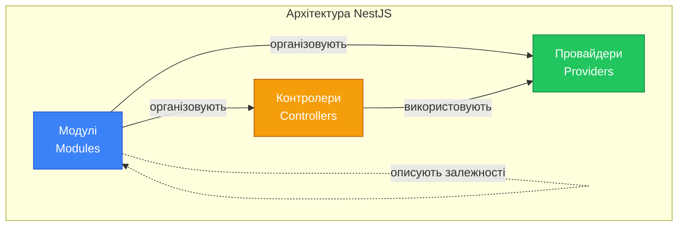
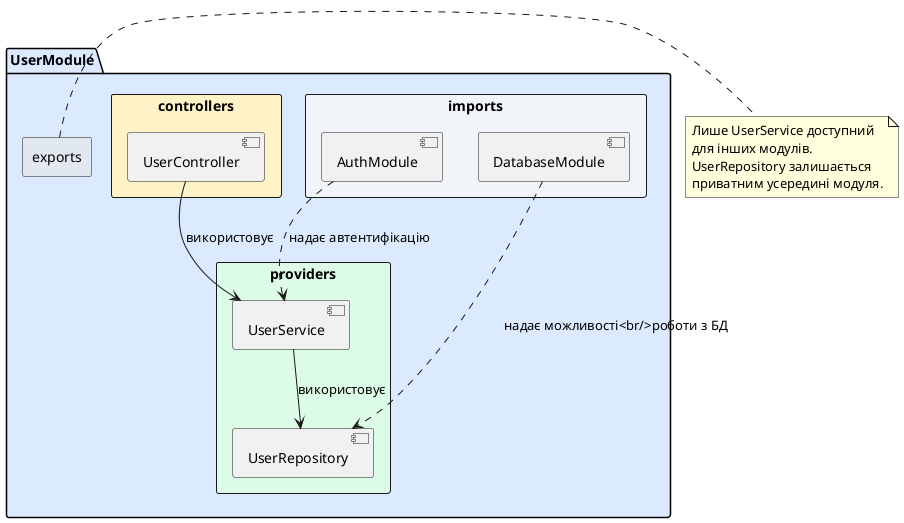
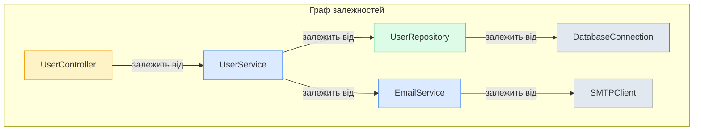
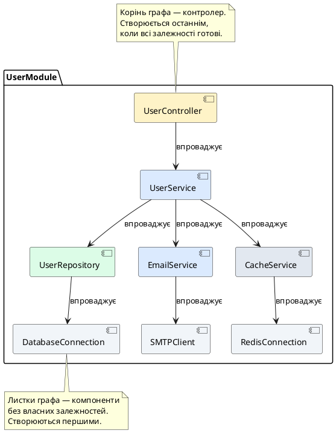
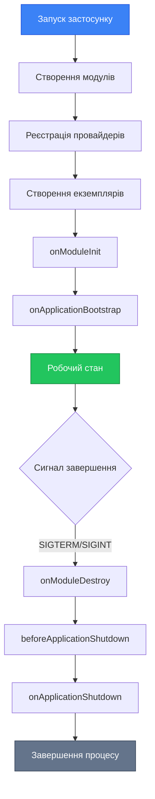
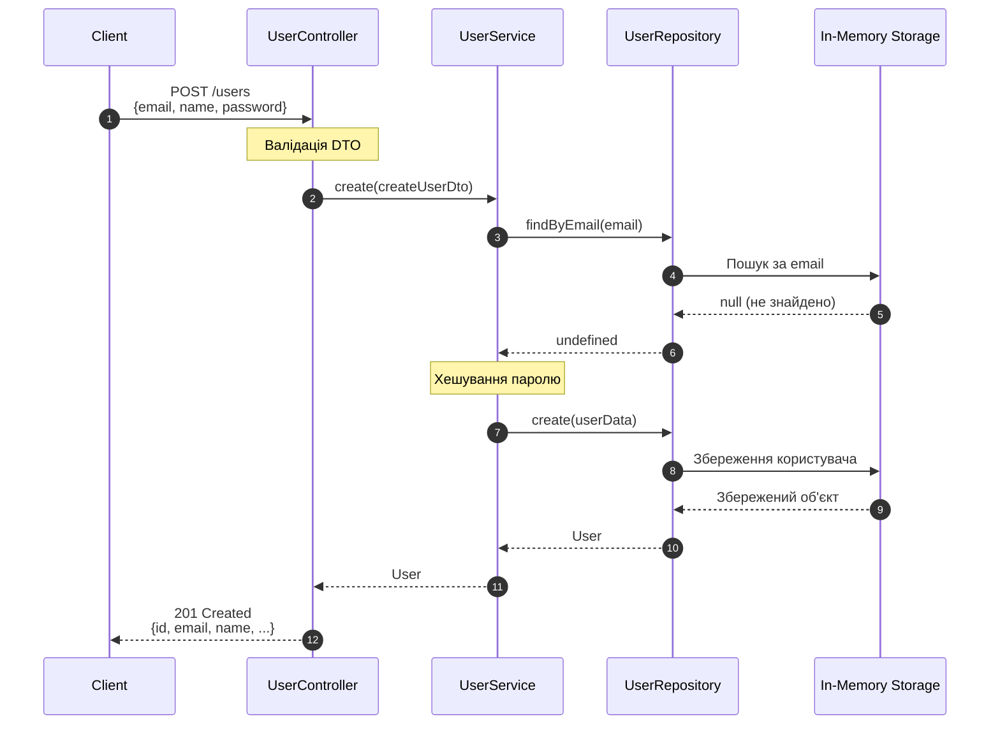
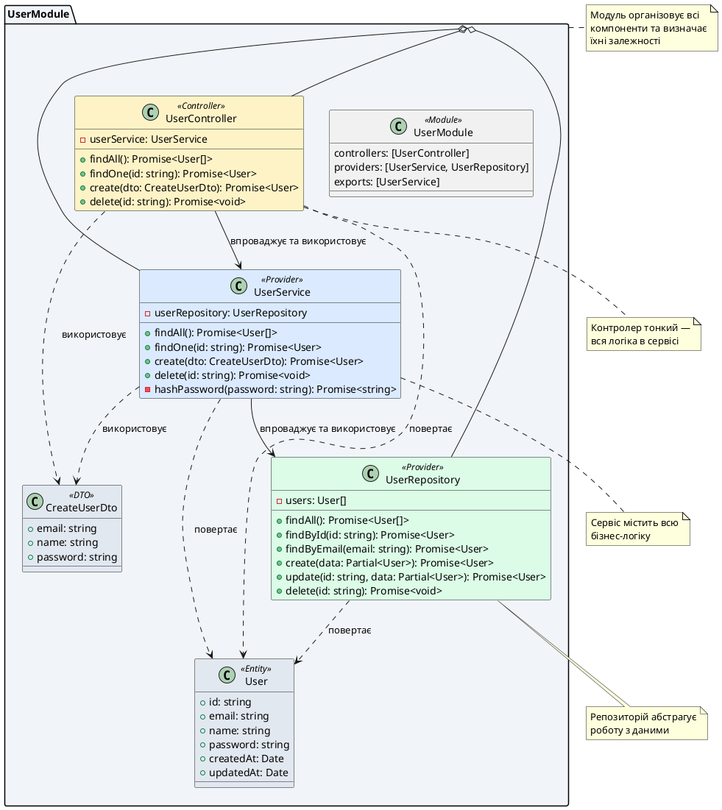

# Три стовпи архітектури: модулі, контролери, провайдери

::card-group

::card{title="🎯 Мета лекції" icon="i-lucide-target"}

- Опанувати концепцію трьох фундаментальних компонентів архітектури NestJS
- Зрозуміти роль модулів як організаційних блоків застосунку
- Навчитися відокремлювати відповідальності контролерів та провайдерів
- Вивчити механізми взаємодії компонентів через систему впровадження залежностей
- Побудувати ментальну модель графа залежностей у застосунку

::

::card{title="🔑 Ключові терміни" icon="i-lucide-key"}

- **Module** (*модуль*): організаційний блок, що групує пов'язані компоненти
- **Controller** (*контролер*): компонент, відповідальний за обробку HTTP-запитів та формування відповідей
- **Provider** (*провайдер*): загальне поняття для класів, що інкапсулюють бізнес-логіку та можуть бути впровадженими
- **Service** (*сервіс*): найпоширеніший тип провайдера, що містить бізнес-правила
- **Dependency Graph** (*граф залежностей*): структура, що описує відношення між компонентами системи

::

::

## Архітектурна тріада: фундамент NestJS

Вся архітектура NestJS побудована навколо трьох фундаментальних концепцій, які формують основу будь-якого застосунку в цьому фреймворку. Ці три компоненти — **модулі** (*modules*), **контролери** (*controllers*) та **провайдери** (*providers*) — діють як архітектурні стовпи, що підтримують всю структуру системи. Розуміння їхніх ролей, відповідальностей та механізмів взаємодії є критично важливим для ефективної розробки в NestJS.

Кожен з цих компонентів має чітко визначену роль у загальній архітектурі. Модулі організовують код у логічні блоки, контролери обробляють вхідні запити від клієнтів, а провайдери інкапсулюють бізнес-логіку та забезпечують повторне використання коду. Разом вони створюють гнучку, масштабовану та легко підтримувану архітектуру, що дозволяє розробникам будувати застосунки будь-якого рівня складності.

::mermaid



::

::note
Три стовпи архітектури NestJS не є ізольованими концепціями — вони тісно переплетені та працюють у синергії. Модулі визначають контекст існування контролерів та провайдерів, контролери координують виклики провайдерів, а провайдери можуть використовувати інші провайдери, формуючи складні графи залежностей.
::

## Модулі: організаційні блоки застосунку

Модулі (*modules*) є фундаментальним механізмом організації коду в NestJS. Кожен модуль — це клас, позначений декоратором `@Module()`, який інкапсулює певну функціональність застосунку та визначає, які компоненти належать до цієї функціональності, а також як вони взаємодіють з іншими частинами системи.

### Концепція модульності та інкапсуляції

Модульність — це принцип проєктування програмного забезпечення, що передбачає розбиття системи на незалежні, самодостатні блоки, кожен з яких відповідає за певну область функціональності. У контексті NestJS модуль може представляти бізнес-домен (наприклад, управління користувачами), технічну можливість (наприклад, автентифікацію) або інфраструктурну функцію (наприклад, роботу з базою даних).

Інкапсуляція в модулях означає, що всі деталі реалізації певної функціональності приховані всередині модуля. Інші частини застосунку взаємодіють з модулем виключно через його публічний інтерфейс — експортовані компоненти. Це створює чіткі межі між різними частинами системи та зменшує складність, дозволяючи розробникам зосередитися на одному аспекті застосунку, не турбуючись про деталі інших модулів.


### Анатомія декоратора @Module

Декоратор `@Module()` приймає об'єкт конфігурації з чотирма основними властивостями, кожна з яких відіграє специфічну роль в організації та взаємодії модулів:

```typescript
import { Module } from '@nestjs/common';

@Module({
  imports: [],      // Модулі, функціональність яких потрібна поточному модулю
  controllers: [],  // Контролери, що належать до цього модуля
  providers: [],    // Провайдери, доступні всередині модуля
  exports: [],      // Провайдери, які модуль робить доступними для інших модулів
})
export class SomeModule {}
```

**Властивість `imports`** дозволяє модулю використовувати функціональність інших модулів. Коли модуль A імпортує модуль B, всі експортовані провайдери з модуля B стають доступними для компонентів модуля A. Це створює явні залежності між модулями та забезпечує чітку структуру застосунку.

**Властивість `controllers`** перераховує всі контролери, які належать до цього модуля. NestJS автоматично створить екземпляри цих контролерів та зареєструє їхні маршрути в системі маршрутизації. Контролери мають доступ до всіх провайдерів, оголошених у властивості `providers` поточного модуля, а також до експортованих провайдерів з імпортованих модулів.

**Властивість `providers`** визначає класи, які будуть керуватися IoC-контейнером (*Inversion of Control container*) у контексті цього модуля. Провайдери можуть бути впроваджені в конструктори контролерів та інших провайдерів усередині модуля. За замовчуванням провайдери є приватними для модуля — вони недоступні ззовні, якщо явно не експортовані.

**Властивість `exports`** визначає, які провайдери з поточного модуля будуть доступні іншим модулям, що імпортують цей модуль. Це механізм створення публічного API модуля. Важливо розуміти, що експортувати можна лише ті провайдери, які оголошені у властивості `providers` цього ж модуля, або цілі модулі з властивості `imports`.

::plant-uml{alt="Структура модуля в NestJS"}



::

### Кореневий модуль та модульне дерево

Кожен NestJS-застосунок має один кореневий модуль (*root module*), який традиційно називається `AppModule`. Це точка входу для побудови графа модулів застосунку. Під час запуску NestJS починає з кореневого модуля та рекурсивно обходить всі імпортовані модулі, будуючи повне дерево залежностей.

Кореневий модуль зазвичай імпортує всі основні функціональні модулі застосунку, створюючи центральну точку, з якої розгортається вся архітектура. Це дерево модулів формує ієрархічну структуру, де кожен модуль може імпортувати інші модулі, створюючи мережу залежностей.

::code-group

```typescript [app.module.ts - Кореневий модуль]
import { Module } from '@nestjs/common';
import { UserModule } from './user/user.module';
import { AuthModule } from './auth/auth.module';
import { ProductModule } from './product/product.module';
import { OrderModule } from './order/order.module';

@Module({
  imports: [
    UserModule,    // Функціональність користувачів
    AuthModule,    // Автентифікація та авторизація
    ProductModule, // Управління товарами
    OrderModule,   // Обробка замовлень
  ],
})
export class AppModule {}
```

```typescript [user/user.module.ts - Функціональний модуль]
import { Module } from '@nestjs/common';
import { UserController } from './user.controller';
import { UserService } from './user.service';

@Module({
  controllers: [UserController],
  providers: [UserService],
  exports: [UserService], // Інші модулі зможуть використовувати UserService
})
export class UserModule {}
```

::

::tip
Структура модулів не обов'язково має бути суворо ієрархічною. Модулі можуть формувати складні графи залежностей, де один модуль імпортує кілька інших, а ті, у свою чергу, можуть імпортувати спільні модулі. NestJS автоматично керує створенням синглтон-екземплярів (*singleton instances*) провайдерів, забезпечуючи, що навіть якщо модуль імпортовано в кілька місць, його провайдери створюються лише один раз.
::

## Контролери: обробка HTTP-запитів

Контролери (*controllers*) є вхідними точками застосунку — компонентами, відповідальними за обробку вхідних HTTP-запитів та повернення відповідей клієнту. Контролери не повинні містити бізнес-логіку; їхня роль обмежується координацією: прийняти запит, делегувати роботу відповідним сервісам та сформувати HTTP-відповідь.

### Відповідальності контролера

Основна відповідальність контролера — бути посередником між HTTP-шаром та бізнес-логікою застосунку. Контролер виконує кілька чітко визначених функцій:

1. **Маршрутизація**: Визначення, який метод контролера має бути викликаний для конкретного HTTP-запиту на основі шляху URL та HTTP-методу
2. **Екстракція даних**: Отримання необхідних даних із запиту (параметри шляху, query-параметри, тіло запиту, заголовки)
3. **Валідація вхідних даних**: Перевірка коректності отриманих даних (часто делегується pipes, але контролер координує цей процес)
4. **Делегування бізнес-логіки**: Виклик відповідних методів сервісів для виконання бізнес-операцій
5. **Формування відповіді**: Перетворення результатів роботи сервісів у HTTP-відповідь з відповідним статус-кодом та заголовками


### Декоратор @Controller та базовий маршрут

Клас позначається як контролер за допомогою декоратора `@Controller()`, який може приймати необов'язковий аргумент — базовий маршрут (*route prefix*). Цей базовий маршрут додається до всіх маршрутів, визначених у методах контролера, створюючи логічне групування ендпоінтів.

```typescript
import { Controller, Get, Post, Body, Param } from '@nestjs/common';

@Controller('users') // Базовий маршрут: /users
export class UserController {
  constructor(private readonly userService: UserService) {}

  @Get() // Повний шлях: GET /users
  findAll() {
    return this.userService.findAll();
  }

  @Get(':id') // Повний шлях: GET /users/:id
  findOne(@Param('id') id: string) {
    return this.userService.findOne(id);
  }

  @Post() // Повний шлях: POST /users
  create(@Body() createUserDto: CreateUserDto) {
    return this.userService.create(createUserDto);
  }
}
```

У цьому прикладі декоратор `@Controller('users')` встановлює базовий маршрут `/users`. Усі методи цього контролера будуть доступні за URL-адресами, що починаються з `/users`. Метод, позначений `@Get()` без аргументів, відповідає точно на шлях `/users`, тоді як `@Get(':id')` обробляє запити типу `/users/123`, де `123` — динамічний параметр.

::warning
Контролер ніколи не повинен безпосередньо працювати з базою даних, здійснювати складні обчислення або містити бізнес-правила. Порушення цього принципу призводить до утворення «товстих контролерів» (*fat controllers*), які важко тестувати, підтримувати та повторно використовувати. Всю логіку слід делегувати сервісам.
::

### Тонкі контролери vs Товсті контролери

Існує фундаментальна різниця між «тонким контролером» (*thin controller*) та «товстим контролером» (*fat controller*). Тонкий контролер містить мінімум логіки — лише координацію викликів сервісів та формування відповідей. Товстий контролер містить бізнес-логіку безпосередньо в методах обробки запитів, що є антипатерном.

::code-group

```typescript [❌ Товстий контролер (антипатерн)]
@Controller('users')
export class UserController {
  constructor(private readonly db: DatabaseService) {}

  @Post()
  async create(@Body() dto: CreateUserDto) {
    // Валідація в контролері
    if (!dto.email.includes('@')) {
      throw new BadRequestException('Invalid email');
    }

    // Хешування паролю в контролері
    const hashedPassword = await bcrypt.hash(dto.password, 10);

    // Пряма робота з БД у контролері
    const user = await this.db.query(
      'INSERT INTO users (email, password) VALUES ($1, $2) RETURNING *',
      [dto.email, hashedPassword]
    );

    // Відправка email у контролері
    await this.sendWelcomeEmail(user.email);

    return user;
  }

  private async sendWelcomeEmail(email: string) {
    // Логіка відправки email...
  }
}
```

```typescript [✅ Тонкий контролер (правильний підхід)]
@Controller('users')
export class UserController {
  constructor(private readonly userService: UserService) {}

  @Post()
  async create(@Body() dto: CreateUserDto) {
    // Вся логіка делегована сервісу
    return this.userService.create(dto);
  }
}

// Бізнес-логіка інкапсульована в сервісі
@Injectable()
export class UserService {
  constructor(
    private readonly userRepository: UserRepository,
    private readonly emailService: EmailService,
  ) {}

  async create(dto: CreateUserDto): Promise<User> {
    const hashedPassword = await this.hashPassword(dto.password);
    const user = await this.userRepository.create({
      ...dto,
      password: hashedPassword,
    });
    await this.emailService.sendWelcome(user.email);
    return user;
  }

  private async hashPassword(password: string): Promise<string> {
    return bcrypt.hash(password, 10);
  }
}
```

::

Тонкий контролер значно легше тестувати, оскільки всю бізнес-логіку можна протестувати ізольовано в модульних тестах сервісу, а контролер тестується лише на коректність координації викликів. Крім того, бізнес-логіка в сервісі може бути повторно використана іншими контролерами або навіть викликана поза контекстом HTTP (наприклад, з WebSocket-обробників або CLI-команд).

## Провайдери: інкапсуляція бізнес-логіки

Провайдери (*providers*) — це загальне поняття для класів, які можуть бути впровадженими (*injected*) в інші класи через механізм впровадження залежностей. Найпоширенішим типом провайдера є сервіс (*service*), але провайдерами можуть бути також репозиторії (*repositories*), фабрики (*factories*), хелпери (*helpers*) та будь-які інші класи, що інкапсулюють певну логіку або функціональність.

### Декоратор @Injectable та роль сервісів

Клас стає провайдером, коли його позначають декоратором `@Injectable()`. Цей декоратор сигналізує NestJS, що клас може керуватися IoC-контейнером та впроваджуватися в інші класи як залежність. Декоратор також дозволяє самому провайдеру мати власні залежності, які будуть автоматично впроваджені при створенні екземпляра.

```typescript
import { Injectable } from '@nestjs/common';

@Injectable()
export class UserService {
  constructor(
    private readonly userRepository: UserRepository,
    private readonly emailService: EmailService,
  ) {}

  async findAll(): Promise<User[]> {
    return this.userRepository.findAll();
  }

  async findOne(id: string): Promise<User> {
    const user = await this.userRepository.findById(id);
    if (!user) {
      throw new NotFoundException(`User with ID ${id} not found`);
    }
    return user;
  }

  async create(dto: CreateUserDto): Promise<User> {
    const existingUser = await this.userRepository.findByEmail(dto.email);
    if (existingUser) {
      throw new ConflictException('User with this email already exists');
    }

    const hashedPassword = await this.hashPassword(dto.password);
    const user = await this.userRepository.create({
      ...dto,
      password: hashedPassword,
    });

    await this.emailService.sendWelcome(user.email);
    return user;
  }

  private async hashPassword(password: string): Promise<string> {
    const bcrypt = require('bcrypt');
    return bcrypt.hash(password, 10);
  }
}
```

У цьому прикладі `UserService` є провайдером, що інкапсулює всю бізнес-логіку, пов'язану з управлінням користувачами. Сервіс сам має дві залежності — `UserRepository` для доступу до даних та `EmailService` для відправки email-повідомлень. Ці залежності автоматично впроваджуються NestJS при створенні екземпляра `UserService`.

### Шаровий розподіл відповідальностей

Провайдери часто організовуються в шари відповідно до їхніх ролей у застосунку. Класична трирівнева архітектура включає:


1. **Presentation Layer (Шар представлення)**: Контролери, що обробляють HTTP-запити
2. **Business Logic Layer (Шар бізнес-логіки)**: Сервіси, що містять бізнес-правила та оркестрацію
3. **Data Access Layer (Шар доступу до даних)**: Репозиторії, що абстрагують роботу з базою даних

::plant-uml{alt="Шарова архітектура в NestJS"}

```plantuml
@startuml
skinparam style plain
skinparam backgroundColor #FFFFFF

package "Presentation Layer" #FEF3C7 {
  class UserController {
    - userService: UserService
    + getUser(id: string): Promise<User>
    + createUser(dto: CreateUserDto): Promise<User>
  }
}

package "Business Logic Layer" #DBEAFE {
  class UserService {
    - userRepository: UserRepository
    - emailService: EmailService
    + findOne(id: string): Promise<User>
    + create(dto: CreateUserDto): Promise<User>
    - hashPassword(password: string): Promise<string>
  }
  
  class EmailService {
    + sendWelcome(email: string): Promise<void>
  }
}

package "Data Access Layer" #DCFCE7 {
  class UserRepository {
    + findById(id: string): Promise<User>
    + findByEmail(email: string): Promise<User>
    + create(data: Partial<User>): Promise<User>
  }
}

database "PostgreSQL" #E2E8F0

UserController --> UserService : використовує
UserService --> UserRepository : використовує
UserService --> EmailService : використовує
UserRepository --> PostgreSQL : SQL запити

note right of UserController
  Відповідає лише за
  HTTP-комунікацію
end note

note right of UserService
  Містить всі
  бізнес-правила
end note

note right of UserRepository
  Абстрагує роботу
  з базою даних
end note

@enduml
```

::

Така організація забезпечує чіткий розподіл відповідальностей: кожен шар має свою специфічну роль та не виконує функції інших шарів. Контролери не знають про базу даних, сервіси не знають про HTTP, а репозиторії не містять бізнес-логіки. Це робить код більш передбачуваним, тестовним та легким для розуміння.

::note
Хоча трирівнева архітектура є поширеною, вона не є єдиним можливим підходом. Для особливо складних доменів може застосовуватися Domain-Driven Design (DDD) з додатковими шарами: Domain Models, Use Cases, Domain Services тощо. NestJS достатньо гнучкий, щоб підтримувати різні архітектурні стилі.
::

### Типи провайдерів

Не всі провайдери є сервісами з бізнес-логікою. NestJS підтримує різні типи провайдерів, кожен з яких має специфічне призначення:

**Сервіси (*Services*)**: Містять бізнес-логіку, оркеструють виклики інших провайдерів, реалізують бізнес-правила. Це найпоширеніший тип провайдерів.

**Репозиторії (*Repositories*)**: Абстрагують доступ до даних, інкапсулюють SQL-запити або операції ORM. Відокремлюють бізнес-логіку від деталей зберігання даних.

**Фабрики (*Factories*)**: Створюють складні об'єкти або конфігурації. Використовуються, коли процес створення екземпляра потребує нетривіальної логіки.

**Хелпери та утиліти (*Helpers/Utilities*)**: Надають допоміжні функції, які використовуються в різних частинах застосунку (наприклад, валідація, форматування, криптографія).

**Адаптери (*Adapters*)**: Інтегрують застосунок із зовнішніми системами (платіжні шлюзи, email-сервіси, сторонні API).

```typescript
// Сервіс
@Injectable()
export class UserService {
  constructor(private readonly userRepository: UserRepository) {}
  
  async findOne(id: string): Promise<User> {
    return this.userRepository.findById(id);
  }
}

// Репозиторій
@Injectable()
export class UserRepository {
  constructor(@InjectRepository(User) private repo: Repository<User>) {}
  
  async findById(id: string): Promise<User> {
    return this.repo.findOneBy({ id });
  }
}

// Адаптер
@Injectable()
export class StripePaymentAdapter {
  private stripe: Stripe;
  
  constructor(configService: ConfigService) {
    this.stripe = new Stripe(configService.get('STRIPE_SECRET_KEY'));
  }
  
  async createCharge(amount: number, currency: string) {
    return this.stripe.charges.create({ amount, currency });
  }
}
```

## Взаємодія між компонентами через DI

Три стовпи архітектури NestJS не існують ізольовано — вони тісно взаємодіють через механізм впровадження залежностей (*Dependency Injection*). Розуміння того, як компоненти з'єднуються та обмінюються даними, є ключовим для проєктування ефективних застосунків.

### Впровадження через конструктор

Основний механізм впровадження залежностей у NestJS — це впровадження через конструктор (*constructor injection*). Коли класу потрібна залежність, він оголошує її як параметр конструктора. NestJS автоматично розпізнає тип параметра (завдяки метаданим TypeScript) та надасть відповідний екземпляр провайдера.

```typescript
// Контролер отримує сервіс через конструктор
@Controller('users')
export class UserController {
  constructor(
    private readonly userService: UserService,
    private readonly logger: LoggerService,
  ) {}

  @Get(':id')
  async getUser(@Param('id') id: string) {
    this.logger.log(`Fetching user with ID: ${id}`);
    return this.userService.findOne(id);
  }
}

// Сервіс отримує репозиторій та інші сервіси через конструктор
@Injectable()
export class UserService {
  constructor(
    private readonly userRepository: UserRepository,
    private readonly emailService: EmailService,
    private readonly cacheService: CacheService,
  ) {}

  async findOne(id: string): Promise<User> {
    // Спочатку перевіряємо кеш
    const cached = await this.cacheService.get(`user:${id}`);
    if (cached) return cached;

    // Якщо немає в кеші, запитуємо з БД
    const user = await this.userRepository.findById(id);
    await this.cacheService.set(`user:${id}`, user, 300);
    return user;
  }
}
```

Модифікатор `private readonly` у параметрах конструктора — це скорочений синтаксис TypeScript, що автоматично створює відповідну властивість класу та ініціалізує її значенням параметра. Це еквівалентно явному оголошенню властивості та присвоєнню їй значення в тілі конструктора, але значно коротше та зрозуміліше.

::tip
Використання `private readonly` для залежностей є best practice, оскільки забезпечує інкапсуляцію (private) та незмінність посилання (readonly). Залежності не повинні змінюватися після створення екземпляра класу, і `readonly` забезпечує це на рівні системи типів TypeScript.
::


### Автоматичне розв'язання залежностей

NestJS автоматично розв'язує весь граф залежностей при запуску застосунку. Якщо контролер залежить від сервісу, а сервіс залежить від репозиторію, фреймворк автоматично створить екземпляри в правильному порядку: спочатку репозиторій, потім сервіс, потім контролер.

Процес розв'язання залежностей відбувається під час ініціалізації застосунку та включає кілька етапів:

1. **Реєстрація провайдерів**: NestJS сканує всі модулі та реєструє всі провайдери в IoC-контейнері
2. **Побудова графа залежностей**: Фреймворк аналізує конструктори всіх класів та будує граф залежностей
3. **Виявлення циклічних залежностей**: Перевіряється відсутність циклів у графі (A залежить від B, B залежить від A)
4. **Створення екземплярів**: Провайдери створюються в порядку від листків до кореня графа залежностей
5. **Впровадження залежностей**: Створені екземпляри впроваджуються в конструктори класів, які їх потребують

::mermaid



::

Порядок створення екземплярів у цьому прикладі буде наступним:
1. `DatabaseConnection` та `SMTPClient` (не мають залежностей)
2. `UserRepository` (залежить від `DatabaseConnection`) та `EmailService` (залежить від `SMTPClient`)
3. `UserService` (залежить від `UserRepository` та `EmailService`)
4. `UserController` (залежить від `UserService`)

::warning
Циклічні залежності (коли клас A залежить від класу B, а клас B залежить від класу A) призводять до помилки під час запуску застосунку. NestJS виявляє такі цикли та повідомляє про них. У наступних лекціях ми розглянемо, як правильно обробляти ситуації, де циклічні залежності здаються неминучими (через використання `forwardRef` або рефакторинг архітектури).
::

### Область видимості провайдерів

За замовчуванням всі провайдери в NestJS є синглтонами (*singletons*) в межах застосунку. Це означає, що NestJS створює лише один екземпляр кожного провайдера, і цей екземпляр спільно використовується всіма компонентами, які його потребують. Такий підхід є оптимальним для більшості сценаріїв, оскільки зменшує споживання пам'яті та прискорює створення об'єктів.

Проте NestJS також підтримує інші області видимості (*scopes*) для специфічних випадків:

- **DEFAULT (Singleton)**: Один екземпляр на весь застосунок (за замовчуванням)
- **REQUEST**: Новий екземпляр для кожного HTTP-запиту
- **TRANSIENT**: Новий екземпляр кожного разу, коли провайдер впроваджується

```typescript
import { Injectable, Scope } from '@nestjs/common';

// За замовчуванням — singleton
@Injectable()
export class UserService {
  // Один екземпляр для всього застосунку
}

// Request-scoped провайдер
@Injectable({ scope: Scope.REQUEST })
export class RequestContextService {
  // Новий екземпляр для кожного HTTP-запиту
  // Корисно для зберігання даних, специфічних для запиту
}

// Transient провайдер
@Injectable({ scope: Scope.TRANSIENT })
export class UniqueIdGenerator {
  // Новий екземпляр кожного разу, коли впроваджується
  private id = Math.random();
  
  getId() {
    return this.id;
  }
}
```

::caution
Використання областей видимості, відмінних від DEFAULT, має негативний вплив на продуктивність, оскільки NestJS змушений створювати нові екземпляри провайдерів частіше. REQUEST-scoped провайдери особливо накладні, оскільки весь граф залежностей, що залежить від такого провайдера, також має бути створений заново для кожного запиту. Використовуйте ці можливості лише там, де це дійсно необхідно.
::

## Граф залежностей та його побудова

Граф залежностей (*dependency graph*) — це структура даних, що представляє відношення між компонентами застосунку. Вершини графа — це класи (контролери, сервіси, репозиторії), а ребра — залежності між ними. Розуміння цього графа критично важливе для проєктування архітектури та діагностики проблем.

### Читання графа залежностей

Граф залежностей можна читати у двох напрямках:

**Знизу вгору (Bottom-up)**: Починаючи з компонентів без залежностей (листків графа) та рухаючись до компонентів, які від них залежать. Це порядок створення екземплярів при запуску застосунку.

**Зверху вниз (Top-down)**: Починаючи з контролерів (точок входу) та рухаючись до сервісів та репозиторіїв. Це порядок виконання при обробці запиту.

::plant-uml{alt="Повний граф залежностей модуля користувачів"}



::

### Виявлення та уникнення циклічних залежностей

Циклічна залежність виникає, коли два або більше компонентів залежать один від одного, формуючи цикл у графі. Наприклад:
- Сервіс A залежить від сервісу B
- Сервіс B залежить від сервісу A

Такі залежності неможливо розв'язати, оскільки неясно, який компонент створювати першим. NestJS виявляє циклічні залежності під час ініціалізації та викидає помилку `Circular dependency`.

**Типові причини циклічних залежностей:**

1. Невірний розподіл відповідальностей між сервісами
2. Відсутність проміжного шару абстракції
3. Порушення принципу єдиної відповідальності

**Стратегії усунення:**

- **Рефакторинг**: Виділити спільну логіку в третій сервіс
- **Використання подій**: Замінити пряму залежність на event-driven комунікацію
- **Інверсія залежності**: Створити інтерфейс та інвертувати напрямок залежності


::code-group

```typescript [❌ Циклічна залежність]
// user.service.ts
@Injectable()
export class UserService {
  constructor(private readonly orderService: OrderService) {}
  
  async getUserWithOrders(id: string) {
    const user = await this.findOne(id);
    const orders = await this.orderService.findByUserId(id);
    return { ...user, orders };
  }
}

// order.service.ts
@Injectable()
export class OrderService {
  constructor(private readonly userService: UserService) {}
  
  async createOrder(userId: string, items: Item[]) {
    const user = await this.userService.findOne(userId);
    // Створення замовлення...
  }
}
// Помилка: UserService залежить від OrderService,
// а OrderService залежить від UserService
```

```typescript [✅ Виправлено через виділення спільного сервісу]
// user.service.ts
@Injectable()
export class UserService {
  constructor(private readonly userRepository: UserRepository) {}
  
  async findOne(id: string): Promise<User> {
    return this.userRepository.findById(id);
  }
}

// order.service.ts
@Injectable()
export class OrderService {
  constructor(private readonly orderRepository: OrderRepository) {}
  
  async findByUserId(userId: string): Promise<Order[]> {
    return this.orderRepository.findByUserId(userId);
  }
}

// user-order.service.ts — оркестратор
@Injectable()
export class UserOrderService {
  constructor(
    private readonly userService: UserService,
    private readonly orderService: OrderService,
  ) {}
  
  async getUserWithOrders(id: string) {
    const user = await this.userService.findOne(id);
    const orders = await this.orderService.findByUserId(id);
    return { ...user, orders };
  }
}
```

::

## Життєвий цикл компонентів у NestJS

Розуміння життєвого циклу компонентів допомагає правильно організовувати ініціалізацію, підключення до зовнішніх ресурсів та коректне завершення роботи застосунку. NestJS надає хуки життєвого циклу (*lifecycle hooks*), які дозволяють виконувати код у конкретні моменти життя компонента.

### Етапи життєвого циклу

Життєвий цикл NestJS-застосунку проходить через кілька чітко визначених етапів:

1. **Створення модулів**: NestJS сканує та реєструє всі модулі
2. **Реєстрація провайдерів**: Всі провайдери з модулів реєструються в IoC-контейнері
3. **Створення екземплярів**: Провайдери інстанціюються в порядку залежностей
4. **Ініціалізація** (`onModuleInit`): Виконується після створення всіх провайдерів модуля
5. **Початок роботи застосунку** (`onApplicationBootstrap`): Виконується, коли всі модулі ініціалізовані
6. **Робочий стан**: Застосунок обробляє запити
7. **Завершення** (`onModuleDestroy`, `beforeApplicationShutdown`, `onApplicationShutdown`): Коректне закриття з'єднань та звільнення ресурсів

::mermaid



::

### Хуки життєвого циклу

NestJS надає інтерфейси для впровадження логіки в різні етапи життєвого циклу:

```typescript
import { 
  Injectable, 
  OnModuleInit, 
  OnModuleDestroy,
  BeforeApplicationShutdown,
  OnApplicationShutdown,
} from '@nestjs/common';

@Injectable()
export class DatabaseService 
  implements OnModuleInit, OnModuleDestroy {
  
  private connection: DatabaseConnection;

  // Викликається після ініціалізації модуля
  async onModuleInit() {
    console.log('Підключення до бази даних...');
    this.connection = await createConnection({
      host: 'localhost',
      database: 'myapp',
    });
    console.log('З\'єднання встановлено');
  }

  // Викликається перед знищенням модуля
  async onModuleDestroy() {
    console.log('Закриття з\'єднання з базою даних...');
    await this.connection.close();
    console.log('З\'єднання закрито');
  }

  async query(sql: string) {
    return this.connection.execute(sql);
  }
}
```

Ці хуки особливо корисні для:
- Підключення до баз даних
- Встановлення WebSocket-з'єднань
- Запуску фонових задач
- Підписки на черги повідомлень
- Коректного закриття з'єднань при зупинці

::tip
Для критичних ресурсів (з'єднання з БД, файлові дескриптори, мережеві сокети) завжди реалізовуйте `OnModuleDestroy`, щоб гарантувати коректне звільнення ресурсів при завершенні роботи застосунку. Це особливо важливо в контейнеризованих середовищах, де застосунок може бути зупинений у будь-який момент.
::

## Приклад базової структури: модуль користувачів

Для закріплення концепцій трьох стовпів архітектури розглянемо повний приклад модуля управління користувачами, що демонструє взаємодію всіх компонентів.

### Структура файлів модуля

```
src/
└── user/
    ├── dto/
    │   ├── create-user.dto.ts
    │   └── update-user.dto.ts
    ├── entities/
    │   └── user.entity.ts
    ├── user.controller.ts
    ├── user.service.ts
    ├── user.repository.ts
    └── user.module.ts
```

### Реалізація компонентів

::code-group

```typescript [user.entity.ts]
// Визначення структури даних користувача
export class User {
  id: string;
  email: string;
  name: string;
  password: string;
  createdAt: Date;
  updatedAt: Date;
}
```

```typescript [create-user.dto.ts]
// Data Transfer Object для створення користувача
import { IsEmail, IsString, MinLength } from 'class-validator';

export class CreateUserDto {
  @IsEmail()
  email: string;

  @IsString()
  @MinLength(2)
  name: string;

  @IsString()
  @MinLength(8)
  password: string;
}
```

```typescript [user.repository.ts]
// Репозиторій — доступ до даних
import { Injectable } from '@nestjs/common';

@Injectable()
export class UserRepository {
  private users: User[] = []; // Заглушка замість реальної БД

  async findAll(): Promise<User[]> {
    return this.users;
  }

  async findById(id: string): Promise<User | undefined> {
    return this.users.find(user => user.id === id);
  }

  async findByEmail(email: string): Promise<User | undefined> {
    return this.users.find(user => user.email === email);
  }

  async create(userData: Partial<User>): Promise<User> {
    const user: User = {
      id: Date.now().toString(),
      createdAt: new Date(),
      updatedAt: new Date(),
      ...userData,
    } as User;
    
    this.users.push(user);
    return user;
  }

  async update(id: string, userData: Partial<User>): Promise<User> {
    const index = this.users.findIndex(u => u.id === id);
    if (index === -1) throw new Error('User not found');
    
    this.users[index] = {
      ...this.users[index],
      ...userData,
      updatedAt: new Date(),
    };
    
    return this.users[index];
  }

  async delete(id: string): Promise<void> {
    this.users = this.users.filter(u => u.id !== id);
  }
}
```

```typescript [user.service.ts]
// Сервіс — бізнес-логіка
import { Injectable, NotFoundException, ConflictException } from '@nestjs/common';
import { UserRepository } from './user.repository';
import { CreateUserDto } from './dto/create-user.dto';
import { User } from './entities/user.entity';

@Injectable()
export class UserService {
  constructor(private readonly userRepository: UserRepository) {}

  async findAll(): Promise<User[]> {
    return this.userRepository.findAll();
  }

  async findOne(id: string): Promise<User> {
    const user = await this.userRepository.findById(id);
    if (!user) {
      throw new NotFoundException(`User with ID "${id}" not found`);
    }
    return user;
  }

  async create(createUserDto: CreateUserDto): Promise<User> {
    // Перевірка унікальності email
    const existing = await this.userRepository.findByEmail(createUserDto.email);
    if (existing) {
      throw new ConflictException('User with this email already exists');
    }

    // Хешування паролю (спрощено)
    const hashedPassword = await this.hashPassword(createUserDto.password);

    return this.userRepository.create({
      ...createUserDto,
      password: hashedPassword,
    });
  }

  async delete(id: string): Promise<void> {
    const user = await this.findOne(id); // Перевірка існування
    await this.userRepository.delete(id);
  }

  private async hashPassword(password: string): Promise<string> {
    // У реальному застосунку використовувати bcrypt
    return `hashed_${password}`;
  }
}
```

```typescript [user.controller.ts]
// Контролер — обробка HTTP
import {
  Controller,
  Get,
  Post,
  Delete,
  Body,
  Param,
  HttpCode,
  HttpStatus,
} from '@nestjs/common';
import { UserService } from './user.service';
import { CreateUserDto } from './dto/create-user.dto';

@Controller('users')
export class UserController {
  constructor(private readonly userService: UserService) {}

  @Get()
  findAll() {
    return this.userService.findAll();
  }

  @Get(':id')
  findOne(@Param('id') id: string) {
    return this.userService.findOne(id);
  }

  @Post()
  @HttpCode(HttpStatus.CREATED)
  create(@Body() createUserDto: CreateUserDto) {
    return this.userService.create(createUserDto);
  }

  @Delete(':id')
  @HttpCode(HttpStatus.NO_CONTENT)
  async delete(@Param('id') id: string) {
    await this.userService.delete(id);
  }
}
```

```typescript [user.module.ts]
// Модуль — об'єднання компонентів
import { Module } from '@nestjs/common';
import { UserController } from './user.controller';
import { UserService } from './user.service';
import { UserRepository } from './user.repository';

@Module({
  controllers: [UserController],
  providers: [UserService, UserRepository],
  exports: [UserService], // Інші модулі можуть використовувати UserService
})
export class UserModule {}
```

::


### Потік обробки запиту

Коли клієнт надсилає HTTP-запит до застосунку, відбувається наступна послідовність подій:

::steps

### Крок 1: Надходження HTTP-запиту

Клієнт надсилає запит, наприклад `POST /users` з тілом:
```json
{
  "email": "john@example.com",
  "name": "John Doe",
  "password": "securepass123"
}
```

### Крок 2: Маршрутизація до контролера

NestJS визначає, що маршрут `/users` з методом POST обробляється методом `create()` у `UserController`.

### Крок 3: Валідація даних

Тіло запиту автоматично валідується відповідно до правил, визначених у `CreateUserDto` через декоратори `class-validator`.

### Крок 4: Виклик методу контролера

Контролер викликає метод `create()`, передаючи валідовані дані:
```typescript
return this.userService.create(createUserDto);
```

### Крок 5: Виконання бізнес-логіки

`UserService` перевіряє унікальність email, хешує пароль та викликає репозиторій:
```typescript
const user = await this.userRepository.create({...});
```

### Крок 6: Збереження даних

`UserRepository` зберігає користувача (у нашому прикладі — в масиві, у реальному застосунку — в базі даних).

### Крок 7: Повернення відповіді

Створений об'єкт `User` повертається через весь стек:
- Репозиторій → Сервіс → Контролер → HTTP-відповідь (JSON)

::

::mermaid



::

### Візуалізація взаємодії компонентів

Для повного розуміння архітектури важливо бачити, як всі три стовпи працюють разом у контексті модуля:

::plant-uml{alt="Повна взаємодія компонентів UserModule"}



::

::note
У цьому прикладі видно чіткий розподіл відповідальностей: контролер обробляє HTTP, сервіс містить бізнес-правила, репозиторій керує даними. Кожен компонент можна тестувати ізольовано, замінюючи залежності на моки. Така архітектура легко масштабується — можна додати `EmailService` для сповіщень, `CacheService` для кешування, `AuditService` для логування дій без зміни існуючої структури.
::

## Підсумок

Три стовпи архітектури NestJS — модулі, контролери та провайдери — формують фундамент, на якому будуються всі застосунки в цьому фреймворку. Розуміння їхніх ролей та механізмів взаємодії є ключовим для ефективної розробки.

**Модулі** організовують код у логічні блоки, інкапсулюють функціональність та визначають залежності між різними частинами системи. Вони створюють чіткі межі та забезпечують модульність застосунку.

**Контролери** є точками входу для HTTP-запитів. Їхня відповідальність обмежується координацією: прийняти запит, делегувати роботу сервісам та сформувати відповідь. Тонкі контролери забезпечують тестованість та повторне використання логіки.

**Провайдери** інкапсулюють бізнес-логіку, доступ до даних та інші функціональності. Впровадження залежностей через конструктор створює слабко зв'язані, легко тестовані компоненти.

Ці три концепції працюють у синергії через механізм впровадження залежностей, автоматично керованого IoC-контейнером NestJS. Граф залежностей, що формується між компонентами, визначає порядок їхнього створення та структуру застосунку.

У наступних лекціях ми глибше розглянемо механізми Inversion of Control та Dependency Injection, навчимося працювати з NestJS CLI для швидкого створення компонентів, а також детально вивчимо структуру та конвенції організації проєктів.

::card-group

::card{title="📚 Що далі?" icon="i-lucide-book-open"}

У наступній лекції ми детально розглянемо концепції **Інверсії керування (IoC)** та **Впровадження залежностей (DI)**, зрозуміємо, як працює IoC-контейнер NestJS, та навчимося проєктувати архітектуру з урахуванням принципів SOLID.

::

::card{title="🔑 Ключові висновки" icon="i-lucide-lightbulb"}

- Модулі організовують застосунок у логічні блоки
- Контролери обробляють HTTP, але не містять бізнес-логіку
- Провайдери інкапсулюють всю функціональність системи
- Впровадження залежностей створює слабко зв'язані компоненти
- Граф залежностей визначає структуру застосунку

::

::
