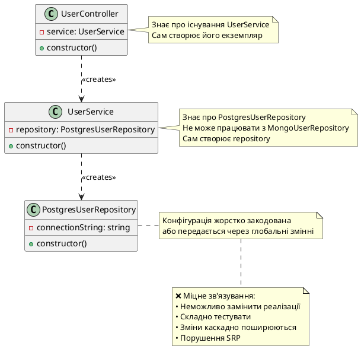
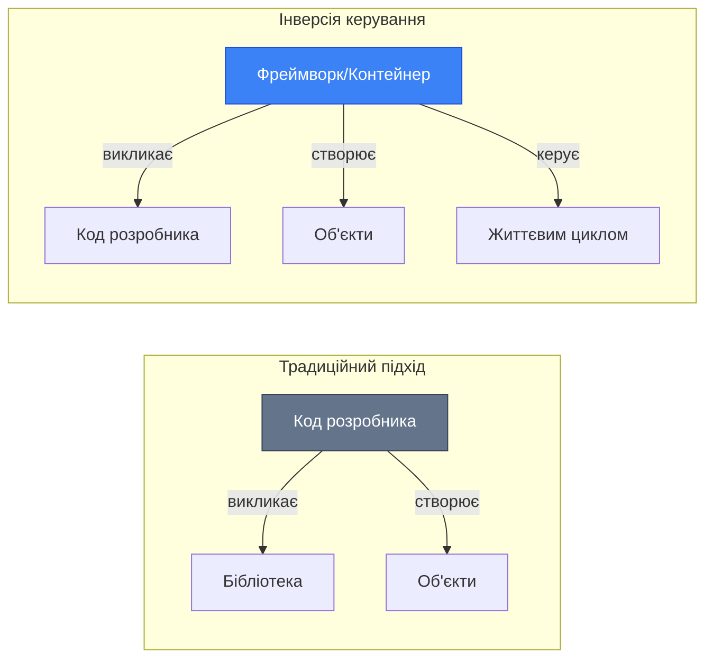
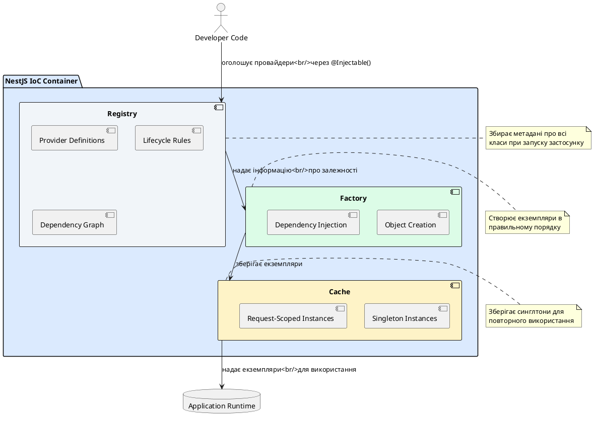
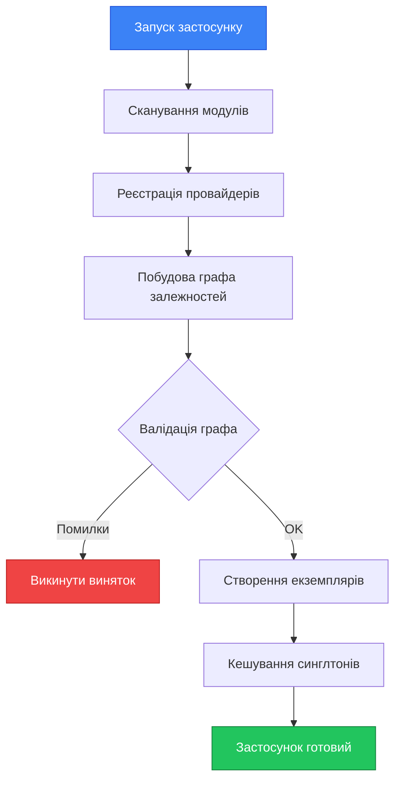
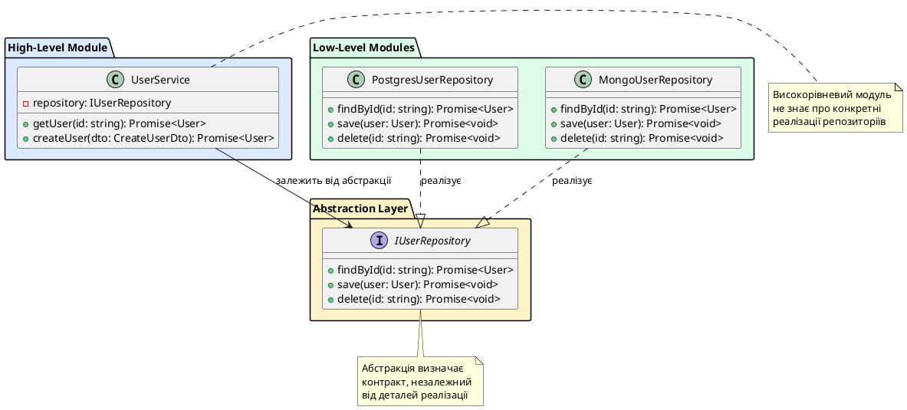
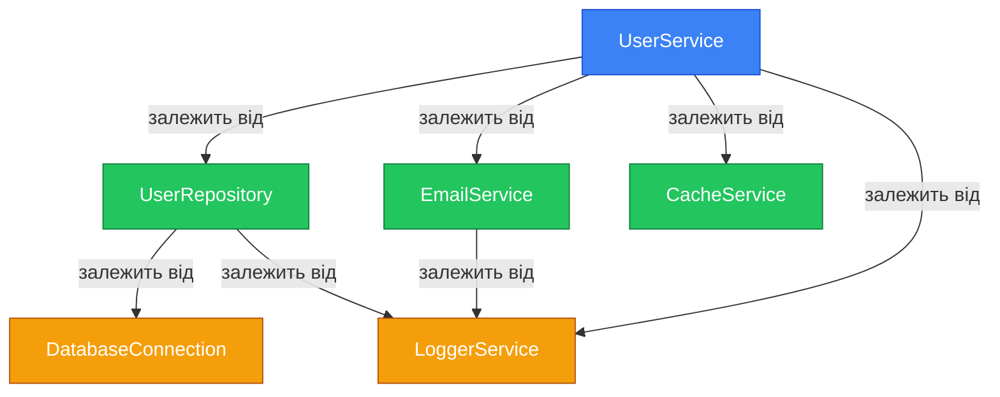
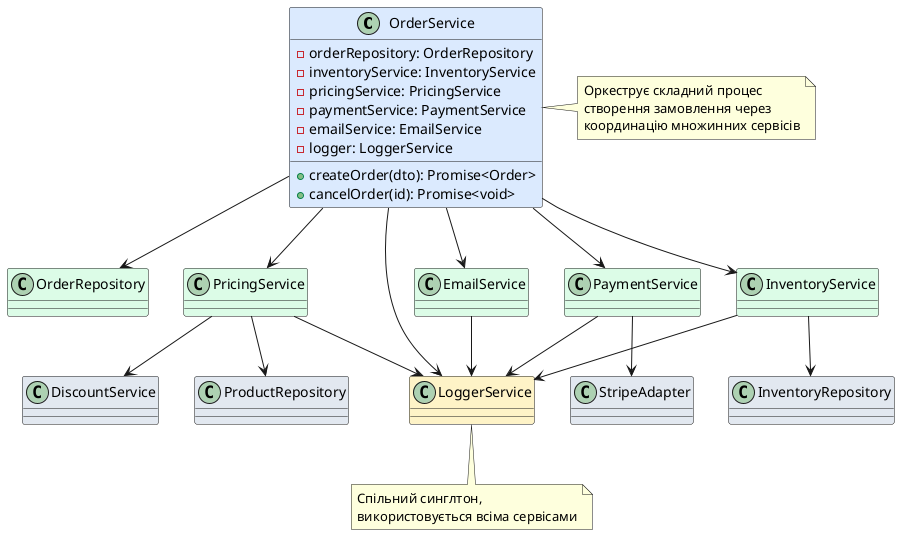

# Інверсія керування (IoC) та ін'єкція залежностей (DI)

::card-group

::card{title="🎯 Мета лекції" icon="i-lucide-target"}

- Зрозуміти концепцію інверсії керування та її переваги перед традиційним підходом
- Опанувати патерн впровадження залежностей як реалізацію IoC
- Вивчити роботу IoC-контейнера в NestJS
- Навчитися проєктувати слабко зв'язані системи згідно з принципом інверсії залежностей (DIP)
- Зрозуміти механізм автоматичного розв'язання залежностей через TypeScript metadata

::

::card{title="🔑 Ключові терміни" icon="i-lucide-key"}

- **Inversion of Control (IoC)**: принцип проєктування, де керування потоком виконання та створенням об'єктів передається фреймворку
- **Dependency Injection (DI)**: патерн, що реалізує IoC через впровадження залежностей ззовні
- **IoC Container**: компонент фреймворку, що керує життєвим циклом об'єктів та впроваджує залежності
- **Tight Coupling**: міцне зв'язування, коли компоненти безпосередньо залежать від конкретних реалізацій
- **Dependency Inversion Principle (DIP)**: принцип SOLID, що постулює залежність від абстракцій, а не від конкретних реалізацій

::

::

## Проблема традиційного підходу: міцне зв'язування

Щоб повністю оцінити цінність інверсії керування та впровадження залежностей, необхідно спочатку зрозуміти проблеми, які вони вирішують. У традиційному об'єктно-орієнтованому програмуванні класи часто безпосередньо створюють екземпляри інших класів, від яких вони залежать. Такий підхід призводить до міцного зв'язування (*tight coupling*) — ситуації, коли зміна однієї частини системи вимагає змін у багатьох інших частинах.

### Класичний приклад міцного зв'язування

Розглянемо типовий сценарій: застосунок для управління користувачами, де контролер взаємодіє з сервісом, а сервіс — з репозиторієм для доступу до бази даних.

```typescript
// ❌ Міцно зв'язаний код — антипатерн
class PostgresUserRepository {
  async findById(id: string): Promise<User> {
    // Запит до PostgreSQL
    const result = await this.db.query('SELECT * FROM users WHERE id = $1', [id]);
    return result.rows[0];
  }

  async save(user: User): Promise<void> {
    // Збереження в PostgreSQL
    await this.db.query(
      'INSERT INTO users (id, name, email) VALUES ($1, $2, $3)',
      [user.id, user.name, user.email]
    );
  }
}

class UserService {
  private repository: PostgresUserRepository;

  constructor() {
    // Клас сам створює свою залежність
    this.repository = new PostgresUserRepository();
  }

  async getUser(id: string): Promise<User> {
    return this.repository.findById(id);
  }

  async createUser(name: string, email: string): Promise<User> {
    const user = new User({ id: generateId(), name, email });
    await this.repository.save(user);
    return user;
  }
}

class UserController {
  private service: UserService;

  constructor() {
    // Клас сам створює свою залежність
    this.service = new UserService();
  }

  handleGetUser(request: Request, response: Response) {
    const user = await this.service.getUser(request.params.id);
    response.json(user);
  }
}
```

### Проблеми міцного зв'язування

Такий підхід створює кілька серйозних проблем, які стають критичними при зростанні складності застосунку:

**1. Неможливість заміни реалізації**

`UserService` жорстко прив'язаний до `PostgresUserRepository`. Якщо виникне потреба використовувати MongoDB замість PostgreSQL, або додати кешування через Redis, доведеться змінювати код `UserService`. Це порушує принцип відкритості/закритості (*Open/Closed Principle*) — клас має бути відкритим для розширення, але закритим для модифікації.

**2. Складність тестування**

Модульне тестування (*unit testing*) `UserService` стає практично неможливим без реальної бази даних. Неможливо замінити `PostgresUserRepository` на тестовий дублер (*mock*) або заглушку (*stub*), оскільки екземпляр створюється всередині конструктора. Це означає, що кожен тест буде вимагати підключення до бази даних, що робить тести повільними, крихкими та залежними від зовнішньої інфраструктури.


```typescript
// ❌ Спроба тестування міцно зв'язаного коду
describe('UserService', () => {
  it('should get user by id', async () => {
    const service = new UserService();
    
    // Неможливо замінити repository на mock!
    // Тест буде виконувати реальні запити до PostgreSQL
    const user = await service.getUser('123');
    
    expect(user.id).toBe('123');
  });
});
```

**3. Складність конфігурування**

Якщо `PostgresUserRepository` потребує конфігурації (наприклад, рядок підключення до бази даних), ця конфігурація має бути жорстко закодована в конструкторі або передаватися через глобальні змінні. Це ускладнює використання різних конфігурацій для розробки, тестування та продакшн-середовищ.

**4. Каскадне створення об'єктів**

Кожен клас у ланцюжку залежностей має знати, як створити всі свої залежності, і залежності своїх залежностей. Це призводить до того, що зміна конструктора низькорівневого класу (наприклад, додавання нового параметра в `PostgresUserRepository`) вимагає змін у всіх класах, які його використовують, навіть якщо ці класи безпосередньо не взаємодіють з новим параметром.

**5. Порушення принципу єдиної відповідальності**

Клас стає відповідальним не лише за свою основну функціональність, а й за створення та управління своїми залежностями. Це змішування відповідальностей (*mixed concerns*) ускладнює розуміння та підтримку коду.

::plant-uml{alt="Міцне зв'язування: проблеми залежностей"}



::

::warning
Міцне зв'язування — це одна з найпоширеніших проблем у розробці програмного забезпечення, що призводить до створення монолітних, нерозширюваних та важкопідтримуваних систем. Технічний борг (*technical debt*), накопичений через міцне зв'язування, може стати настільки великим, що переписування системи з нуля стає єдиним економічно виправданим рішенням.
::

## Що таке Inversion of Control (IoC)

Інверсія керування (*Inversion of Control*, IoC) — це фундаментальний принцип проєктування програмного забезпечення, що полягає в передачі контролю над створенням об'єктів та керуванням потоком виконання від коду застосунку до фреймворку або контейнера. Термін «інверсія» означає переворот традиційного підходу: замість того, щоб розробник явно керував створенням об'єктів та викликом методів, цей контроль інвертується — фреймворк сам викликає код розробника в потрібний момент.

### «Голлівудський принцип»: Don't call us, we'll call you

IoC часто описують через «Голлівудський принцип» (*Hollywood Principle*): «Не телефонуйте нам, ми вам зателефонуємо» (*Don't call us, we'll call you*). У традиційному програмуванні розробник пише код, що активно викликає бібліотеки та створює об'єкти за потреби. При IoC ситуація інвертується: фреймворк контролює потік виконання та викликає код розробника через заздалегідь визначені точки розширення (*extension points*).

::mermaid



::

У контексті NestJS інверсія керування проявляється в кількох аспектах:

**Створення об'єктів**: Розробник не створює екземпляри контролерів, сервісів або репозиторіїв вручну. Натомість він описує ці класи через декоратори, а NestJS автоматично створює екземпляри при запуску застосунку.

**Керування життєвим циклом**: Фреймворк визначає, коли створити об'єкт, як довго він існуватиме (singleton, request-scoped, transient) та коли його знищити. Розробник може впливати на ці рішення, але базове керування виконує фреймворк.

**Виклик методів**: Розробник не викликає методи контролерів вручну при надходженні HTTP-запиту. Натомість NestJS автоматично визначає, який метод якого контролера викликати, на основі URL та HTTP-методу запиту.

**Впровадження залежностей**: Розробник оголошує, які залежності потрібні класу (через параметри конструктора), а фреймворк автоматично надає ці залежності при створенні екземпляра.

### Переваги інверсії керування

Інверсія керування надає кілька фундаментальних переваг, які стають критично важливими при розробці складних застосунків:

**Розділення відповідальностей (*Separation of Concerns*)**: Бізнес-логіка відокремлюється від логіки створення об'єктів та управління залежностями. Класи зосереджуються на своїй основній функціональності, делегуючи інфраструктурні питання фреймворку.

**Знижена складність (*Reduced Complexity*)**: Розробнику не потрібно турбуватися про порядок створення об'єктів, розв'язання складних графів залежностей або керування життєвим циклом. Фреймворк бере ці обов'язки на себе.

**Узгодженість (*Consistency*)**: Всі об'єкти в системі керуються однаковим чином згідно з правилами фреймворку. Це створює передбачувану та узгоджену архітектуру.

**Можливість впровадження крос-функціональної логіки (*Cross-cutting Concerns*)**: Фреймворк може автоматично додавати поведінку до об'єктів (логування, кешування, транзакції) без змін у бізнес-коді. У NestJS це реалізується через Guards, Interceptors та Pipes.


## Dependency Injection: впровадження через конструктор

Впровадження залежностей (*Dependency Injection*, DI) — це конкретний патерн проєктування, що реалізує принцип інверсії керування. Суть DI полягає в тому, що залежності об'єкта надаються йому ззовні, а не створюються всередині самого об'єкта. Існує кілька способів впровадження залежностей, але найпоширенішим та найбільш рекомендованим є впровадження через конструктор (*constructor injection*).

### Механізм впровадження через конструктор

При впровадженні через конструктор клас оголошує свої залежності як параметри конструктора. Зовнішня сутність (у випадку NestJS — IoC-контейнер) відповідає за створення екземплярів залежностей та передачу їх у конструктор при створенні об'єкта.

::code-group

```typescript [❌ Без DI — клас створює залежності]
class UserService {
  private repository: PostgresUserRepository;

  constructor() {
    // Клас сам створює свою залежність
    this.repository = new PostgresUserRepository();
  }

  async getUser(id: string): Promise<User> {
    return this.repository.findById(id);
  }
}

// Використання
const service = new UserService();
```

```typescript [✅ З DI — залежності впроваджуються]
class UserService {
  constructor(
    private readonly repository: UserRepository // Абстракція, а не конкретна реалізація
  ) {}

  async getUser(id: string): Promise<User> {
    return this.repository.findById(id);
  }
}

// Використання — залежності надаються ззовні
const postgresRepo = new PostgresUserRepository();
const service = new UserService(postgresRepo);

// Або для тестування
const mockRepo = new MockUserRepository();
const testService = new UserService(mockRepo);
```

::

Ключова відмінність полягає в тому, що при використанні DI клас не знає про конкретну реалізацію залежності. Він працює з абстракцією (інтерфейсом або абстрактним класом), а конкретна реалізація надається ззовні. Це робить код гнучким та легко тестованим.

### Типи впровадження залежностей

Хоча NestJS використовує виключно впровадження через конструктор, корисно знати про альтернативні підходи, які існують в інших фреймворках:

**1. Constructor Injection (Впровадження через конструктор)** — рекомендований підхід

Залежності передаються через параметри конструктора. Це робить залежності явними та забезпечує, що об'єкт завжди створюється в коректному стані з усіма необхідними залежностями.

```typescript
@Injectable()
export class UserService {
  constructor(
    private readonly userRepository: UserRepository,
    private readonly emailService: EmailService,
  ) {
    // Залежності гарантовано доступні після створення об'єкта
  }
}
```

**2. Property Injection (Впровадження через властивості)** — не рекомендується

Залежності встановлюються через публічні властивості після створення об'єкта. Цей підхід має недолік: об'єкт може існувати в некоректному стані (без впроваджених залежностей) між моментом створення та моментом впровадження.

```typescript
// Не використовується в NestJS, але існує в інших фреймворках
class UserService {
  public repository: UserRepository; // Публічна властивість

  async getUser(id: string) {
    return this.repository.findById(id); // Може бути undefined!
  }
}

const service = new UserService();
service.repository = new PostgresUserRepository(); // Встановлення після створення
```

**3. Method Injection (Впровадження через метод)** — для опціональних залежностей

Залежність передається як параметр методу, що її використовує. Підходить для випадків, коли залежність потрібна лише для конкретної операції.

```typescript
class ReportService {
  generateReport(formatter: IFormatter) {
    // Formatter впроваджується лише для цього методу
    return formatter.format(this.data);
  }
}
```

::tip
NestJS свідомо підтримує лише впровадження через конструктор, оскільки це найбезпечніший та найбільш явний підхід. Він гарантує, що всі обов'язкові залежності присутні на момент створення об'єкта, та робить залежності явними через сигнатуру конструктора. Це спрощує розуміння коду та запобігає помилкам, пов'язаним з відсутністю залежностей.
::

### Переваги впровадження через конструктор

Впровадження через конструктор має кілька переваг над альтернативними підходами:

**Незмінність (*Immutability*)**: Залежності оголошені як `readonly`, що гарантує їхню незмінність після створення об'єкта. Це запобігає випадковій зміні залежностей під час виконання.

**Явність (*Explicitness*)**: Всі залежності класу явно перераховані в конструкторі. Достатньо подивитися на сигнатуру конструктора, щоб зрозуміти, від чого залежить клас.

**Валідність стану (*State Validity*)**: Об'єкт не може існувати без своїх залежностей. Якщо об'єкт створено, він гарантовано має всі необхідні залежності.

**Підтримка інкапсуляції (*Encapsulation*)**: Залежності є приватними властивостями класу з модифікатором `private`. Зовнішній код не має прямого доступу до внутрішніх залежностей.

**Полегшене тестування (*Testability*)**: У тестах можна легко передати моки або заглушки замість реальних залежностей через конструктор.

## IoC-контейнер: автоматичне управління залежностями

IoC-контейнер (*IoC Container*) — це компонент фреймворку, який бере на себе відповідальність за створення об'єктів, керування їхнім життєвим циклом та автоматичне впровадження залежностей. У NestJS IoC-контейнер є центральною частиною архітектури, що забезпечує роботу всієї системи впровадження залежностей.

### Роль IoC-контейнера

IoC-контейнер виконує кілька критичних функцій у застосунку:

**1. Реєстрація провайдерів**: Контейнер зберігає інформацію про всі класи (провайдери), які він має керувати. Ця інформація включає тип класу, його залежності та правила життєвого циклу (singleton, request-scoped, transient).

**2. Розв'язання залежностей (*Dependency Resolution*)**: При створенні об'єкта контейнер аналізує його залежності, рекурсивно створює або знаходить всі необхідні екземпляри та передає їх у конструктор.

**3. Керування життєвим циклом (*Lifecycle Management*)**: Контейнер визначає, коли створювати об'єкти, як довго їх зберігати та коли знищувати. За замовчуванням всі провайдери є синглтонами, але можна налаштувати інші стратегії.

**4. Виявлення помилок конфігурації**: Контейнер перевіряє граф залежностей на наявність проблем (відсутні провайдери, циклічні залежності) на етапі запуску застосунку, а не під час виконання.


::plant-uml{alt="Архітектура IoC-контейнера в NestJS"}



::

### Життєвий цикл DI-контейнера

Робота IoC-контейнера в NestJS проходить через кілька чітко визначених етапів, від реєстрації провайдерів до створення екземплярів та їхнього використання.

::steps

### Етап 1: Реєстрація провайдерів

При запуску застосунку NestJS сканує всі модулі та збирає інформацію про провайдери з властивості `providers` декоратора `@Module()`. Для кожного провайдера контейнер зберігає:
- Ідентифікатор (зазвичай клас або токен)
- Спосіб створення екземпляра (клас, фабрика, значення)
- Область видимості (singleton, request, transient)

```typescript
@Module({
  providers: [
    UserService,           // Простий синтаксис
    UserRepository,
    {
      provide: EmailService, // Розширений синтаксис
      useClass: SendGridEmailService,
      scope: Scope.DEFAULT,
    },
  ],
})
export class UserModule {}
```

### Етап 2: Побудова графа залежностей

Контейнер аналізує конструктори всіх провайдерів та будує граф залежностей. Для кожного класу визначається список його залежностей через аналіз параметрів конструктора та метаданих TypeScript.

```typescript
@Injectable()
export class UserService {
  // Контейнер бачить, що UserService залежить від:
  // 1. UserRepository
  // 2. EmailService
  constructor(
    private readonly userRepository: UserRepository,
    private readonly emailService: EmailService,
  ) {}
}
```

### Етап 3: Валідація графа

Перевіряється коректність графа залежностей:
- Чи зареєстровані всі необхідні провайдери?
- Чи немає циклічних залежностей?
- Чи узгоджені області видимості?

Якщо виявлені проблеми, застосунок не запускається, а видається детальна помилка з описом проблеми.

### Етап 4: Створення екземплярів

Провайдери створюються в порядку від листків до кореня графа залежностей:
1. Спочатку створюються класи без залежностей
2. Потім класи, що залежать від уже створених
3. І так далі, поки не буде створено весь граф

```typescript
// Порядок створення:
// 1. DatabaseConnection (без залежностей)
// 2. UserRepository (залежить від DatabaseConnection)
// 3. EmailService (без залежностей)
// 4. UserService (залежить від UserRepository та EmailService)
// 5. UserController (залежить від UserService)
```

### Етап 5: Кешування та повторне використання

Створені екземпляри синглтон-провайдерів зберігаються в кеші контейнера. При наступних запитах на той самий провайдер контейнер повертає існуючий екземпляр замість створення нового.

::

::mermaid



::

### Автоматичне розв'язання залежностей

Найпотужніша можливість IoC-контейнера — автоматичне розв'язання навіть складних графів залежностей. Розробнику достатньо оголосити залежності в конструкторі, а контейнер сам знайде або створить всі необхідні екземпляри.

```typescript
// Складний граф залежностей
@Injectable()
export class OrderService {
  constructor(
    private readonly orderRepository: OrderRepository,
    private readonly userService: UserService,
    private readonly paymentService: PaymentService,
    private readonly notificationService: NotificationService,
    private readonly inventoryService: InventoryService,
  ) {}
}

// UserService має свої залежності
@Injectable()
export class UserService {
  constructor(
    private readonly userRepository: UserRepository,
    private readonly emailService: EmailService,
  ) {}
}

// PaymentService має свої залежності
@Injectable()
export class PaymentService {
  constructor(
    private readonly stripeAdapter: StripeAdapter,
    private readonly auditLogger: AuditLogger,
  ) {}
}

// Контейнер автоматично створить увесь граф:
// StripeAdapter → PaymentService → OrderService
// UserRepository → UserService → OrderService
// EmailService → UserService → OrderService
// AuditLogger → PaymentService → OrderService
// ... і так далі для всіх залежностей
```

::note
Автоматичне розв'язання залежностей працює рекурсивно. Коли контейнер створює `OrderService` і бачить, що потрібен `UserService`, він спочатку створює `UserService`. Але для створення `UserService` потрібні `UserRepository` та `EmailService`, тому контейнер створює спочатку їх. Цей процес продовжується до тих пір, поки не буде створено весь граф залежностей.
::

## Принцип інверсії залежностей (DIP) із SOLID

Принцип інверсії залежностей (*Dependency Inversion Principle*, DIP) є останнім з п'яти принципів SOLID та має фундаментальне значення для проєктування слабко зв'язаних систем. Цей принцип постулює дві ключові ідеї:

1. **Модулі верхнього рівня не повинні залежати від модулів нижнього рівня. Обидва типи модулів мають залежати від абстракцій.**

2. **Абстракції не повинні залежати від деталей. Деталі мають залежати від абстракцій.**

### Традиційна залежність vs Інверсія залежності

У традиційній архітектурі модулі верхнього рівня (бізнес-логіка) безпосередньо залежать від модулів нижнього рівня (інфраструктура, доступ до даних). Принцип інверсії залежностей інвертує цю залежність через введення абстракцій.


::code-group

```typescript [❌ Порушення DIP — залежність від конкретної реалізації]
// Низькорівневий модуль — конкретна реалізація
class PostgresUserRepository {
  async findById(id: string): Promise<User> {
    // SQL запит до PostgreSQL
    return await this.db.query('SELECT * FROM users WHERE id = $1', [id]);
  }
}

// Високорівневий модуль залежить від низькорівневого
class UserService {
  constructor(
    private readonly repository: PostgresUserRepository // Конкретна реалізація!
  ) {}

  async getUser(id: string): Promise<User> {
    return this.repository.findById(id);
  }
}

// Проблеми:
// 1. UserService жорстко прив'язаний до PostgreSQL
// 2. Неможливо замінити на MongoDB без зміни UserService
// 3. Складно тестувати з мок-об'єктами
```

```typescript [✅ Дотримання DIP — залежність від абстракції]
// Абстракція — інтерфейс, що визначає контракт
interface IUserRepository {
  findById(id: string): Promise<User>;
  save(user: User): Promise<void>;
  delete(id: string): Promise<void>;
}

// Високорівневий модуль залежить від абстракції
@Injectable()
class UserService {
  constructor(
    private readonly repository: IUserRepository // Абстракція!
  ) {}

  async getUser(id: string): Promise<User> {
    return this.repository.findById(id);
  }
}

// Низькорівневі модулі реалізують абстракцію
@Injectable()
class PostgresUserRepository implements IUserRepository {
  async findById(id: string): Promise<User> {
    return await this.db.query('SELECT * FROM users WHERE id = $1', [id]);
  }

  async save(user: User): Promise<void> {
    // PostgreSQL реалізація
  }

  async delete(id: string): Promise<void> {
    // PostgreSQL реалізація
  }
}

@Injectable()
class MongoUserRepository implements IUserRepository {
  async findById(id: string): Promise<User> {
    return await this.collection.findOne({ _id: id });
  }

  async save(user: User): Promise<void> {
    // MongoDB реалізація
  }

  async delete(id: string): Promise<void> {
    // MongoDB реалізація
  }
}

// Конфігурація залежності в модулі
@Module({
  providers: [
    UserService,
    {
      provide: 'IUserRepository',
      useClass: PostgresUserRepository, // Легко змінити на MongoUserRepository
    },
  ],
})
export class UserModule {}
```

::

::plant-uml{alt="Принцип інверсії залежностей"}



::

### Реалізація DIP у NestJS через токени впровадження

TypeScript підтримує інтерфейси лише на рівні системи типів — вони повністю видаляються при компіляції в JavaScript і не існують у runtime. Це створює проблему: IoC-контейнер не може використовувати інтерфейс як ідентифікатор для реєстрації провайдера, оскільки інтерфейсів не існує в скомпільованому коді.

NestJS вирішує цю проблему двома способами:

**1. Використання абстрактних класів замість інтерфейсів**

Абстрактні класи, на відміну від інтерфейсів, існують у runtime і можуть використовуватися IoC-контейнером.

```typescript
// Абстрактний клас замість інтерфейсу
export abstract class UserRepository {
  abstract findById(id: string): Promise<User>;
  abstract save(user: User): Promise<void>;
  abstract delete(id: string): Promise<void>;
}

// Сервіс залежить від абстрактного класу
@Injectable()
export class UserService {
  constructor(private readonly repository: UserRepository) {}

  async getUser(id: string): Promise<User> {
    return this.repository.findById(id);
  }
}

// Конкретна реалізація
@Injectable()
export class PostgresUserRepository extends UserRepository {
  async findById(id: string): Promise<User> {
    // Реалізація
  }

  async save(user: User): Promise<void> {
    // Реалізація
  }

  async delete(id: string): Promise<void> {
    // Реалізація
  }
}

// Реєстрація в модулі
@Module({
  providers: [
    UserService,
    {
      provide: UserRepository,      // Токен — абстрактний клас
      useClass: PostgresUserRepository, // Конкретна реалізація
    },
  ],
})
export class UserModule {}
```

**2. Використання рядкових або символьних токенів**

Можна використовувати рядки або Symbol як токени впровадження разом з декоратором `@Inject()`.

```typescript
// Визначення інтерфейсу (для системи типів)
export interface IUserRepository {
  findById(id: string): Promise<User>;
  save(user: User): Promise<void>;
}

// Визначення токена впровадження
export const USER_REPOSITORY = 'USER_REPOSITORY';

// Сервіс використовує токен для впровадження
@Injectable()
export class UserService {
  constructor(
    @Inject(USER_REPOSITORY)
    private readonly repository: IUserRepository,
  ) {}

  async getUser(id: string): Promise<User> {
    return this.repository.findById(id);
  }
}

// Реєстрація в модулі
@Module({
  providers: [
    UserService,
    {
      provide: USER_REPOSITORY,        // Рядковий токен
      useClass: PostgresUserRepository, // Конкретна реалізація
    },
  ],
})
export class UserModule {}
```

::tip
Вибір між абстрактними класами та токенами залежить від контексту. Абстрактні класи надають кращу підтримку від IDE (автодоповнення, навігація), але вимагають успадкування. Рядкові токени більш гнучкі та не створюють ієрархії успадкування, але потребують явного декоратора `@Inject()` та вимагають більшої дисципліни для уникнення помилок у назвах токенів.
::

## Metadata reflection у TypeScript: experimentalDecorators

Автоматичне розв'язання залежностей у NestJS базується на можливості отримувати інформацію про типи параметрів конструктора в runtime. Ця можливість надається через механізм Reflection Metadata, який є експериментальною можливістю TypeScript.

### Роль experimentalDecorators та emitDecoratorMetadata

Для роботи системи впровадження залежностей у файлі `tsconfig.json` мають бути увімкнені дві опції:

```json
{
  "compilerOptions": {
    "experimentalDecorators": true,
    "emitDecoratorMetadata": true
  }
}
```

**experimentalDecorators**: Вмикає підтримку декораторів — спеціального синтаксису для додавання метаданих до класів, методів та властивостей.

**emitDecoratorMetadata**: Вказує компілятору TypeScript генерувати додаткові метадані про типи при компіляції. Ці метадані включають інформацію про типи параметрів конструктора, що дозволяє IoC-контейнеру визначити, які залежності потрібні класу.

### Як працює Reflection Metadata

Коли TypeScript компілює клас з увімкненою опцією `emitDecoratorMetadata`, він генерує додатковий JavaScript-код, що зберігає інформацію про типи:


::code-group

```typescript [TypeScript код (вихідний)]
@Injectable()
export class UserService {
  constructor(
    private readonly userRepository: UserRepository,
    private readonly emailService: EmailService,
  ) {}
}
```

```javascript [JavaScript після компіляції (спрощено)]
var __decorate = /* функція декорування */;
var __metadata = /* функція метаданих */;

let UserService = class UserService {
  constructor(userRepository, emailService) {
    this.userRepository = userRepository;
    this.emailService = emailService;
  }
};

UserService = __decorate([
  Injectable(),
  // Збережені метадані про типи параметрів конструктора
  __metadata("design:paramtypes", [UserRepository, EmailService])
], UserService);

exports.UserService = UserService;
```

::

Метадані `design:paramtypes` містять масив конструкторів (класів) параметрів конструктора. NestJS використовує ці метадані для визначення залежностей:

```typescript
// NestJS IoC-контейнер внутрішньо робить щось подібне:
import 'reflect-metadata';

function resolveDependencies(targetClass: any): any[] {
  // Отримання метаданих про типи параметрів
  const paramTypes = Reflect.getMetadata('design:paramtypes', targetClass) || [];
  
  // Для кожного типу параметра знайти або створити екземпляр
  return paramTypes.map((paramType: any) => {
    return container.resolve(paramType);
  });
}

// Створення екземпляра з впровадженими залежностями
function createInstance(targetClass: any): any {
  const dependencies = resolveDependencies(targetClass);
  return new targetClass(...dependencies);
}

// Використання
const userService = createInstance(UserService);
// NestJS автоматично створить UserRepository та EmailService
// і передасть їх у конструктор UserService
```

::warning
Reflection Metadata працює лише для класів, а не для інтерфейсів, оскільки інтерфейси TypeScript повністю видаляються при компіляції. Якщо параметр конструктора має тип інтерфейсу, метадані міститимуть `Object` замість конкретного типу, і автоматичне розв'язання не спрацює. Саме тому для DIP у NestJS використовуються абстрактні класи або явні токени з декоратором `@Inject()`.
::

### Обмеження Reflection Metadata

Важливо розуміти обмеження цього механізму:

**1. Працює лише з класами**: Примітивні типи (`string`, `number`, `boolean`) не можуть бути використані для автоматичного розв'язання. Для них потрібні явні токени.

```typescript
// ❌ Не працюватиме
@Injectable()
export class ConfigService {
  constructor(private readonly apiKey: string) {}
  // Метадані міститимуть String, але контейнер не знає, яке значення надати
}

// ✅ Правильно — використання токена
@Injectable()
export class ConfigService {
  constructor(
    @Inject('API_KEY')
    private readonly apiKey: string,
  ) {}
}

@Module({
  providers: [
    ConfigService,
    {
      provide: 'API_KEY',
      useValue: process.env.API_KEY,
    },
  ],
})
export class AppModule {}
```

**2. Не працює з дженериками**: TypeScript generics — це концепція часу компіляції, яка не існує в runtime.

```typescript
// ❌ Не працюватиме — дженерик не збережеться в метаданих
@Injectable()
export class Repository<T> {
  constructor(private readonly model: Model<T>) {}
}

// ✅ Правильно — явна реєстрація для кожного типу
@Module({
  providers: [
    {
      provide: 'UserRepository',
      useFactory: (connection: Connection) => {
        return connection.getRepository(User);
      },
      inject: [Connection],
    },
  ],
})
export class UserModule {}
```

**3. Циклічні залежності**: Reflection Metadata не вирішує проблему циклічних залежностей — їх потрібно уникати або обробляти через `forwardRef()`.

## Переваги DI: слабке зв'язування, тестованість, масштабованість

Впровадження залежностей надає численні переваги, які стають особливо помітними при розробці та підтримці складних застосунків.

### Слабке зв'язування та гнучкість

Слабке зв'язування (*loose coupling*) означає, що компоненти системи мінімально залежать один від одного. Зміни в одному компоненті мають мінімальний вплив на інші компоненти. DI досягає цього через залежність від абстракцій замість конкретних реалізацій.

::accordion

::accordion-item{label="🔄 Легка заміна реалізацій" icon="i-lucide-repeat"}

Завдяки DI можна легко замінювати реалізації без зміни коду, що їх використовує. Наприклад, заміна PostgreSQL на MongoDB вимагає лише зміни конфігурації модуля:

```typescript
// Було
@Module({
  providers: [
    {
      provide: UserRepository,
      useClass: PostgresUserRepository,
    },
  ],
})

// Стало — змінено лише один рядок
@Module({
  providers: [
    {
      provide: UserRepository,
      useClass: MongoUserRepository,
    },
  ],
})
```

Весь код `UserService`, що використовує репозиторій, залишається незмінним.

::

::accordion-item{label="🎭 Декоратор та проксі-патерни" icon="i-lucide-layers"}

DI спрощує реалізацію декоратора та проксі-патернів. Можна обгорнути існуючу реалізацію додатковою поведінкою без зміни клієнтського коду:

```typescript
// Оригінальна реалізація
@Injectable()
class BasicUserRepository implements UserRepository {
  async findById(id: string): Promise<User> {
    return this.db.findOne({ id });
  }
}

// Додавання кешування через декоратор
@Injectable()
class CachedUserRepository implements UserRepository {
  constructor(
    private readonly decorated: BasicUserRepository,
    private readonly cache: CacheService,
  ) {}

  async findById(id: string): Promise<User> {
    const cached = await this.cache.get(`user:${id}`);
    if (cached) return cached;

    const user = await this.decorated.findById(id);
    await this.cache.set(`user:${id}`, user, 300);
    return user;
  }
}

// Реєстрація декорованої версії
@Module({
  providers: [
    BasicUserRepository,
    {
      provide: UserRepository,
      useClass: CachedUserRepository,
    },
  ],
})
```

::

::accordion-item{label="⚙️ Конфігурація для різних середовищ" icon="i-lucide-settings"}

DI дозволяє легко налаштовувати застосунок для різних середовищ (розробка, тестування, продакшн) через зміну реєстрації провайдерів:

```typescript
@Module({
  providers: [
    {
      provide: EmailService,
      useClass: process.env.NODE_ENV === 'production'
        ? SendGridEmailService    // У продакшні — реальний сервіс
        : ConsoleEmailService,     // У розробці — логування в консоль
    },
    {
      provide: StorageService,
      useClass: process.env.NODE_ENV === 'production'
        ? S3StorageService         // У продакшні — AWS S3
        : LocalStorageService,     // У розробці — локальна файлова система
    },
  ],
})
export class AppModule {}
```

::

::

### Тестованість та ізольоване тестування

Одна з найважливіших переваг DI — драматичне спрощення тестування. Можливість замінювати реальні залежності на моки або заглушки робить модульне тестування швидким, надійним та ізольованим.


::code-group

```typescript [user.service.spec.ts - Модульний тест]
import { Test, TestingModule } from '@nestjs/testing';
import { UserService } from './user.service';
import { UserRepository } from './user.repository';
import { EmailService } from '../email/email.service';

describe('UserService', () => {
  let service: UserService;
  let mockRepository: jest.Mocked<UserRepository>;
  let mockEmailService: jest.Mocked<EmailService>;

  beforeEach(async () => {
    // Створення моків для залежностей
    mockRepository = {
      findById: jest.fn(),
      save: jest.fn(),
      delete: jest.fn(),
    } as any;

    mockEmailService = {
      sendWelcome: jest.fn(),
      sendPasswordReset: jest.fn(),
    } as any;

    // Створення тестового модуля з моками
    const module: TestingModule = await Test.createTestingModule({
      providers: [
        UserService,
        {
          provide: UserRepository,
          useValue: mockRepository, // Мок замість реального репозиторія
        },
        {
          provide: EmailService,
          useValue: mockEmailService, // Мок замість реального сервісу
        },
      ],
    }).compile();

    service = module.get<UserService>(UserService);
  });

  describe('getUser', () => {
    it('should return user when found', async () => {
      // Arrange
      const mockUser = { id: '1', name: 'John', email: 'john@example.com' };
      mockRepository.findById.mockResolvedValue(mockUser);

      // Act
      const result = await service.getUser('1');

      // Assert
      expect(result).toEqual(mockUser);
      expect(mockRepository.findById).toHaveBeenCalledWith('1');
      expect(mockRepository.findById).toHaveBeenCalledTimes(1);
    });

    it('should throw NotFoundException when user not found', async () => {
      // Arrange
      mockRepository.findById.mockResolvedValue(null);

      // Act & Assert
      await expect(service.getUser('999')).rejects.toThrow(NotFoundException);
    });
  });

  describe('createUser', () => {
    it('should create user and send welcome email', async () => {
      // Arrange
      const createDto = { name: 'Jane', email: 'jane@example.com', password: 'pass123' };
      const createdUser = { id: '2', ...createDto };
      mockRepository.save.mockResolvedValue(createdUser);
      mockEmailService.sendWelcome.mockResolvedValue(undefined);

      // Act
      const result = await service.createUser(createDto);

      // Assert
      expect(result).toEqual(createdUser);
      expect(mockRepository.save).toHaveBeenCalled();
      expect(mockEmailService.sendWelcome).toHaveBeenCalledWith('jane@example.com');
    });
  });
});
```

::

Ключові переваги тестування з DI:

**Ізоляція**: Кожен тест перевіряє лише один компонент, не залежачи від зовнішніх систем (бази даних, API, файлової системи).

**Швидкість**: Тести виконуються миттєво, оскільки не потребують реальних підключень до баз даних або зовнішніх сервісів.

**Надійність**: Тести не падають через проблеми з інфраструктурою (недоступність бази даних, мережеві проблеми).

**Контроль**: Можна легко симулювати будь-які сценарії, включно з помилками та граничними випадками.

### Масштабованість та підтримка

DI значно полегшує масштабування застосунку як у плані функціональності, так і в плані команди розробників.

**Паралельна розробка**: Різні розробники можуть працювати над різними модулями незалежно, оскільки взаємодія між модулями чітко визначена через абстракції.

**Інкрементальний рефакторинг**: Можна поступово покращувати окремі частини системи, замінюючи реалізації без впливу на інші компоненти.

**Модульність**: Застосунок природним чином розбивається на незалежні модулі, які можна розробляти, тестувати та розгортати окремо.

**Повторне використання**: Добре спроєктовані провайдери можуть бути легко перенесені в інші проєкти або опубліковані як бібліотеки.

## Автоматичне розв'язання залежностей за типами

Однією з найпотужніших можливостей NestJS є здатність автоматично розв'язувати залежності, базуючись виключно на типах TypeScript у конструкторах. Розробнику достатньо оголосити параметри конструктора з правильними типами, і IoC-контейнер сам знайде відповідні провайдери.

### Простий сценарій: одна залежність

```typescript
@Injectable()
export class UserRepository {
  async findById(id: string): Promise<User> {
    // Реалізація
  }
}

@Injectable()
export class UserService {
  // IoC-контейнер бачить тип параметра (UserRepository)
  // і автоматично впроваджує зареєстрований екземпляр
  constructor(private readonly userRepository: UserRepository) {}

  async getUser(id: string): Promise<User> {
    return this.userRepository.findById(id);
  }
}

@Module({
  providers: [
    UserRepository, // Реєстрація провайдера
    UserService,    // Автоматичне розв'язання залежності
  ],
})
export class UserModule {}
```

### Складний сценарій: множинні залежності

IoC-контейнер може розв'язувати будь-яку кількість залежностей, навіть якщо самі залежності мають власні залежності.

```typescript
@Injectable()
export class DatabaseConnection {
  async query(sql: string, params: any[]): Promise<any> {
    // Реалізація
  }
}

@Injectable()
export class CacheService {
  async get(key: string): Promise<any> {
    // Реалізація
  }

  async set(key: string, value: any, ttl: number): Promise<void> {
    // Реалізація
  }
}

@Injectable()
export class LoggerService {
  log(message: string): void {
    console.log(`[LOG] ${message}`);
  }
}

@Injectable()
export class UserRepository {
  constructor(
    private readonly db: DatabaseConnection,
    private readonly logger: LoggerService,
  ) {}

  async findById(id: string): Promise<User> {
    this.logger.log(`Finding user with ID: ${id}`);
    return this.db.query('SELECT * FROM users WHERE id = $1', [id]);
  }
}

@Injectable()
export class EmailService {
  constructor(private readonly logger: LoggerService) {}

  async sendWelcome(email: string): Promise<void> {
    this.logger.log(`Sending welcome email to: ${email}`);
    // Відправка email
  }
}

@Injectable()
export class UserService {
  constructor(
    private readonly userRepository: UserRepository,
    private readonly emailService: EmailService,
    private readonly cacheService: CacheService,
    private readonly logger: LoggerService,
  ) {}

  async getUser(id: string): Promise<User> {
    this.logger.log(`UserService.getUser called with ID: ${id}`);

    // Перевірка кешу
    const cached = await this.cacheService.get(`user:${id}`);
    if (cached) {
      this.logger.log(`User ${id} found in cache`);
      return cached;
    }

    // Запит до БД через репозиторій
    const user = await this.userRepository.findById(id);
    
    // Збереження в кеш
    await this.cacheService.set(`user:${id}`, user, 300);
    
    return user;
  }

  async createUser(dto: CreateUserDto): Promise<User> {
    const user = await this.userRepository.save(dto);
    await this.emailService.sendWelcome(user.email);
    return user;
  }
}

@Module({
  providers: [
    DatabaseConnection,
    CacheService,
    LoggerService,
    UserRepository,
    EmailService,
    UserService,
  ],
})
export class UserModule {}
```

::mermaid



::

У цьому прикладі IoC-контейнер автоматично:

1. Створює екземпляри `DatabaseConnection`, `CacheService` та `LoggerService` (без залежностей)
2. Створює `UserRepository`, впроваджуючи `DatabaseConnection` та `LoggerService`
3. Створює `EmailService`, впроваджуючи `LoggerService`
4. Створює `UserService`, впроваджуючи `UserRepository`, `EmailService`, `CacheService` та `LoggerService`

Розробнику не потрібно писати жодного коду для створення та зв'язування цих об'єктів — все відбувається автоматично на основі типів у конструкторах.

::note
Важливо зауважити, що `LoggerService` створюється лише один раз (singleton) та спільно використовується всіма компонентами, які його потребують. Це забезпечує ефективне використання ресурсів та узгодженість стану в межах застосунку.
::


## Приклад множинних залежностей у конструкторі

Для закріплення матеріалу розглянемо реальний приклад сервісу управління замовленнями з множинними залежностями, що демонструє всі концепції IoC та DI у дії.

### Постановка задачі

Потрібно реалізувати сервіс для створення замовлень, який:
- Перевіряє наявність товарів на складі
- Розраховує вартість з урахуванням знижок
- Обробляє платіж
- Зберігає замовлення в базу даних
- Відправляє підтвердження на email
- Логує всі операції

### Реалізація з впровадженням залежностей

::code-tree

```typescript [order.service.ts]
import { Injectable, BadRequestException } from '@nestjs/common';
import { OrderRepository } from './order.repository';
import { InventoryService } from '../inventory/inventory.service';
import { PricingService } from '../pricing/pricing.service';
import { PaymentService } from '../payment/payment.service';
import { EmailService } from '../email/email.service';
import { LoggerService } from '../logger/logger.service';
import { CreateOrderDto } from './dto/create-order.dto';
import { Order } from './entities/order.entity';

@Injectable()
export class OrderService {
  constructor(
    private readonly orderRepository: OrderRepository,
    private readonly inventoryService: InventoryService,
    private readonly pricingService: PricingService,
    private readonly paymentService: PaymentService,
    private readonly emailService: EmailService,
    private readonly logger: LoggerService,
  ) {
    this.logger.log('OrderService initialized');
  }

  async createOrder(dto: CreateOrderDto): Promise<Order> {
    this.logger.log(`Creating order for user ${dto.userId}`);

    // Крок 1: Перевірка наявності товарів
    const available = await this.inventoryService.checkAvailability(dto.items);
    if (!available) {
      this.logger.warn(`Insufficient inventory for order`);
      throw new BadRequestException('Some items are not available');
    }

    // Крок 2: Розрахунок вартості
    const pricing = await this.pricingService.calculate({
      items: dto.items,
      userId: dto.userId,
      promoCode: dto.promoCode,
    });
    this.logger.log(`Order total: ${pricing.total}`);

    // Крок 3: Обробка платежу
    const payment = await this.paymentService.processPayment({
      amount: pricing.total,
      currency: 'USD',
      userId: dto.userId,
      paymentMethod: dto.paymentMethodId,
    });

    if (!payment.success) {
      this.logger.error(`Payment failed for order`);
      throw new BadRequestException('Payment failed');
    }

    // Крок 4: Зберігання замовлення
    const order = await this.orderRepository.create({
      userId: dto.userId,
      items: dto.items,
      total: pricing.total,
      discount: pricing.discount,
      paymentId: payment.id,
      status: 'confirmed',
    });

    // Крок 5: Оновлення складу
    await this.inventoryService.reserveItems(dto.items, order.id);

    // Крок 6: Відправка підтвердження
    await this.emailService.sendOrderConfirmation({
      email: dto.email,
      orderId: order.id,
      items: dto.items,
      total: pricing.total,
    });

    this.logger.log(`Order ${order.id} created successfully`);
    return order;
  }

  async getOrder(id: string): Promise<Order> {
    this.logger.log(`Fetching order ${id}`);
    return this.orderRepository.findById(id);
  }

  async cancelOrder(id: string): Promise<void> {
    this.logger.log(`Cancelling order ${id}`);

    const order = await this.orderRepository.findById(id);
    
    // Повернення товарів на склад
    await this.inventoryService.releaseItems(order.items, id);

    // Повернення коштів
    await this.paymentService.refund(order.paymentId);

    // Оновлення статусу
    await this.orderRepository.updateStatus(id, 'cancelled');

    // Сповіщення користувача
    await this.emailService.sendOrderCancellation({
      email: order.userEmail,
      orderId: id,
    });

    this.logger.log(`Order ${id} cancelled`);
  }
}
```

```typescript [order.module.ts]
import { Module } from '@nestjs/common';
import { OrderController } from './order.controller';
import { OrderService } from './order.service';
import { OrderRepository } from './order.repository';
import { InventoryModule } from '../inventory/inventory.module';
import { PricingModule } from '../pricing/pricing.module';
import { PaymentModule } from '../payment/payment.module';
import { EmailModule } from '../email/email.module';
import { LoggerModule } from '../logger/logger.module';

@Module({
  imports: [
    InventoryModule,  // Експортує InventoryService
    PricingModule,    // Експортує PricingService
    PaymentModule,    // Експортує PaymentService
    EmailModule,      // Експортує EmailService
    LoggerModule,     // Експортує LoggerService
  ],
  controllers: [OrderController],
  providers: [
    OrderService,
    OrderRepository,
  ],
  exports: [OrderService],
})
export class OrderModule {}
```

```typescript [inventory/inventory.service.ts]
@Injectable()
export class InventoryService {
  constructor(
    private readonly inventoryRepository: InventoryRepository,
    private readonly logger: LoggerService,
  ) {}

  async checkAvailability(items: OrderItem[]): Promise<boolean> {
    for (const item of items) {
      const available = await this.inventoryRepository.getStock(item.productId);
      if (available < item.quantity) {
        this.logger.warn(`Insufficient stock for product ${item.productId}`);
        return false;
      }
    }
    return true;
  }

  async reserveItems(items: OrderItem[], orderId: string): Promise<void> {
    this.logger.log(`Reserving items for order ${orderId}`);
    for (const item of items) {
      await this.inventoryRepository.decrementStock(item.productId, item.quantity);
    }
  }

  async releaseItems(items: OrderItem[], orderId: string): Promise<void> {
    this.logger.log(`Releasing items for order ${orderId}`);
    for (const item of items) {
      await this.inventoryRepository.incrementStock(item.productId, item.quantity);
    }
  }
}
```

```typescript [pricing/pricing.service.ts]
@Injectable()
export class PricingService {
  constructor(
    private readonly productRepository: ProductRepository,
    private readonly discountService: DiscountService,
    private readonly logger: LoggerService,
  ) {}

  async calculate(params: PricingParams): Promise<PricingResult> {
    this.logger.log(`Calculating pricing for ${params.items.length} items`);

    // Розрахунок базової вартості
    let subtotal = 0;
    for (const item of params.items) {
      const product = await this.productRepository.findById(item.productId);
      subtotal += product.price * item.quantity;
    }

    // Застосування знижок
    const discount = await this.discountService.calculateDiscount({
      userId: params.userId,
      subtotal,
      promoCode: params.promoCode,
    });

    const total = subtotal - discount;

    this.logger.log(`Pricing calculated: subtotal=${subtotal}, discount=${discount}, total=${total}`);

    return { subtotal, discount, total };
  }
}
```

::

### Аналіз прикладу

У цьому прикладі `OrderService` має **шість залежностей**, кожна з яких відповідає за свою область відповідальності:

1. **OrderRepository**: Зберігання та отримання замовлень з бази даних
2. **InventoryService**: Керування складом та наявністю товарів
3. **PricingService**: Розрахунок вартості з урахуванням знижок
4. **PaymentService**: Обробка платежів через платіжний шлюз
5. **EmailService**: Відправка email-сповіщень
6. **LoggerService**: Логування всіх операцій

Кожна з цих залежностей, у свою чергу, має власні залежності, формуючи складний граф. Наприклад:
- `InventoryService` залежить від `InventoryRepository` та `LoggerService`
- `PricingService` залежить від `ProductRepository`, `DiscountService` та `LoggerService`
- `PaymentService` залежить від `StripeAdapter`, `AuditLogger` тощо

::plant-uml{alt="Граф залежностей OrderService"}



::

Завдяки DI весь цей складний граф залежностей створюється та зв'язується автоматично IoC-контейнером NestJS. Розробнику не потрібно писати жодного коду для створення екземплярів або передачі залежностей — достатньо правильно оголосити їх у конструкторах та зареєструвати провайдери в модулях.

::tip
При проєктуванні сервісів з множинними залежностями важливо дотримуватися принципу єдиної відповідальності. Якщо сервіс має більше 5-7 залежностей, це може бути сигналом, що він бере на себе занадто багато відповідальностей і варто розглянути можливість його розбиття на менші, більш фокусні компоненти.
::

## Підсумок

Інверсія керування та впровадження залежностей є фундаментальними концепціями, що лежать в основі архітектури NestJS. Ці принципи вирішують критичні проблеми традиційного об'єктно-орієнтованого програмування, забезпечуючи слабке зв'язування, тестованість та масштабованість застосунків.

**IoC-контейнер** бере на себе відповідальність за створення об'єктів та керування їхнім життєвим циклом, звільняючи розробника від необхідності вручну управляти складними графами залежностей. **Впровадження залежностей через конструктор** робить залежності явними, забезпечує незмінність та полегшує тестування.

**Принцип інверсії залежностей (DIP)** з SOLID навчає проєктувати системи, де компоненти залежать від абстракцій, а не від конкретних реалізацій. Це дозволяє легко замінювати реалізації, додавати нову функціональність та підтримувати код у довгостроковій перспективі.

**Metadata Reflection** у TypeScript робить можливим автоматичне розв'язання залежностей на основі типів, що значно спрощує код та зменшує кількість явної конфігурації.

Розуміння цих концепцій є критично важливим для ефективної роботи з NestJS та проєктування якісних, підтримуваних застосунків корпоративного рівня.

::card-group

::card{title="📚 Що далі?" icon="i-lucide-book-open"}

У наступній лекції ми вивчимо **NestJS CLI** — потужний інструмент командного рядка для швидкого створення проєктів, генерації компонентів та автоматизації рутинних задач розробки.

::

::card{title="🔑 Ключові висновки" icon="i-lucide-lightbulb"}

- IoC інвертує контроль від коду розробника до фреймворку
- DI через конструктор забезпечує явність та незмінність залежностей
- IoC-контейнер автоматично керує життєвим циклом об'єктів
- DIP навчає залежати від абстракцій, а не конкретних реалізацій
- Metadata Reflection дозволяє автоматичне розв'язання за типами

::

::
