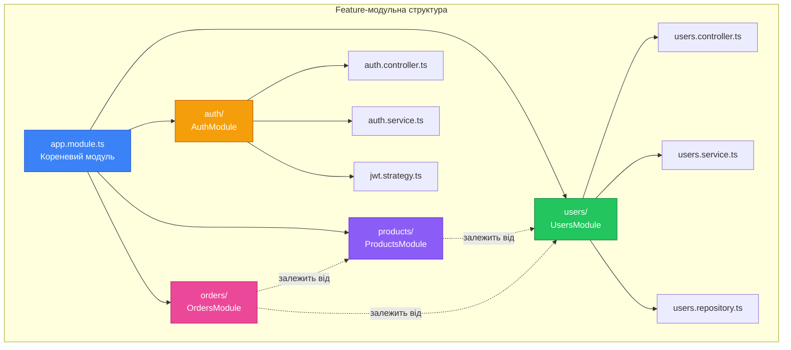

# Структура проєкту NestJS та конвенції

::card-group

::card{title="🎯 Мета лекції" icon="i-lucide-target"}

- Опанувати принципи організації коду в NestJS-проєктах різного масштабу
- Засвоїти конвенції іменування файлів та директорій, прийняті в спільноті
- Навчитися структурувати застосунки за feature-модулями для масштабованості
- Зрозуміти призначення спеціальних директорій: common, shared, config
- Вивчити best practices організації великих корпоративних проєктів

::

::card{title="🔑 Ключові терміни" icon="i-lucide-key"}

- **Feature Module** (*feature-модуль*): модуль, що інкапсулює функціональність окремого бізнес-домену
- **Naming Convention** (*конвенція іменування*): узгоджені правила найменування файлів та директорій
- **Domain-Driven Design** (*проєктування, кероване доменом*): підхід до структурування коду за бізнес-доменами
- **Shared Module** (*спільний модуль*): модуль з компонентами, що використовуються в багатьох частинах застосунку
- **Barrel Export**: патерн повторного експорту модулів через index-файли для спрощення імпортів

::

::

## Філософія організації коду: від хаосу до структури

Організація коду в проєкті є одним з найкритичніших рішень, що впливає на продуктивність розробки, швидкість онбордингу нових членів команди та довгострокову підтримуваність системи. У невеликих проєктах, де весь код міститься в кількох файлах, структура не має великого значення — розробник може тримати в голові всю архітектуру. Проте у міру зростання кодової бази до десятків тисяч рядків коду відсутність чіткої структури перетворюється на серйозну перешкоду.

NestJS пропонує чітку, перевірену індустрією філософію організації коду, що базується на принципах модульності, розділення відповідальностей (*separation of concerns*) та домен-орієнтованого проєктування (*domain-driven design*). Ця філософія не є жорстким обмеженням — фреймворк залишає простір для адаптації під специфічні потреби проєкту — але надає надійну основу, яка працює для більшості застосунків.

Ключовий принцип організації коду в NestJS — це **структурування за функціональністю, а не за технічним типом компонентів**. Замість того, щоб групувати всі контролери в одній директорії, всі сервіси в іншій, а всі сутності в третій, NestJS заохочує створювати feature-модулі, кожен з яких містить усі компоненти, пов'язані з певною бізнес-функцією. Такий підхід значно полегшує навігацію в коді та розуміння меж відповідальності кожного модуля.

::note
Структурування за функціональністю відображає природний спосіб мислення про бізнес-логіку застосунку. Коли розробнику потрібно внести зміни в функціональність управління користувачами, він одразу знає, що весь відповідний код знаходиться в директорії `users/`, а не розкиданий по різних папках `controllers/`, `services/`, `repositories/`.
::

## Конвенції іменування файлів: передбачуваність та узгодженість

NestJS встановлює чіткі конвенції іменування файлів, які забезпечують миттєву ідентифікацію типу компонента навіть без відкриття файлу. Загальний шаблон іменування виглядає наступним чином:

```
<name>.<type>.ts
```

Де `<name>` — це ім'я конкретного компонента (зазвичай у kebab-case), а `<type>` — тип компонента, що визначає його роль у архітектурі. Ця конвенція походить з Angular та довела свою ефективність у великих проєктах.

### Основні типи файлів та їхнє призначення

**module** — Файл модуля, що організовує та об'єднує пов'язані компоненти:
```
users.module.ts
auth.module.ts
products.module.ts
```

**controller** — Файл контролера, відповідального за обробку HTTP-запитів:
```
users.controller.ts
auth.controller.ts
products.controller.ts
```

**service** — Файл сервісу з бізнес-логікою:
```
users.service.ts
auth.service.ts
products.service.ts
```

**repository** — Файл репозиторію для доступу до даних (якщо використовується патерн Repository):
```
users.repository.ts
products.repository.ts
```

**entity** — Файл сутності бази даних (для TypeORM, Prisma тощо):
```
user.entity.ts
product.entity.ts
order.entity.ts
```

**dto** — Файл Data Transfer Object для валідації та передачі даних:
```
create-user.dto.ts
update-user.dto.ts
login.dto.ts
```

**interface** — Файл з TypeScript-інтерфейсами:
```
user.interface.ts
config.interface.ts
```

**spec** — Файл модульних тестів (розміщується поряд з файлом, що тестується):
```
users.service.spec.ts
users.controller.spec.ts
auth.service.spec.ts
```

**guard** — Файл guard для автентифікації та авторизації:
```
auth.guard.ts
roles.guard.ts
```

**interceptor** — Файл interceptor для трансформації даних:
```
transform.interceptor.ts
logging.interceptor.ts
```

**pipe** — Файл pipe для валідації та трансформації:
```
validation.pipe.ts
parse-int.pipe.ts
```

**filter** — Файл exception filter для обробки помилок:
```
http-exception.filter.ts
all-exceptions.filter.ts
```

**decorator** — Файл з власними декораторами:
```
current-user.decorator.ts
roles.decorator.ts
```

::tip
Дотримання цих конвенцій іменування не є технічною вимогою — TypeScript і Node.js не нав'язують жодних правил найменування. Проте узгодженість іменування створює передбачуваність: будь-який розробник NestJS, відкривши проєкт, одразу зрозуміє структуру без додаткової документації.
::

### Регістр найменування: kebab-case для файлів

NestJS використовує kebab-case (слова, розділені дефісами) для імен файлів, навіть якщо відповідний клас у TypeScript має ім'я в PascalCase:

```typescript
// Файл: create-user.dto.ts
export class CreateUserDto {
  email: string;
  password: string;
  firstName: string;
  lastName: string;
}
```

Це рішення має кілька причин:
1. **Кросплатформенна сумісність**: Деякі файлові системи (Windows) нечутливі до регістру, що може призвести до проблем з іменами на кшталт `User.ts` та `user.ts`
2. **Читабельність URL**: Імена файлів часто відображаються в URL-адресах при помилках у стеках викликів (*stack traces*)
3. **Традиція Unix**: Kebab-case є традиційним регістром для файлів у Unix-подібних системах

## Базова структура нового проєкту: фундамент застосунку

Коли команда `nest new` створює новий проєкт, генерується мінімалістична, але функціональна структура:


```
project-root/
├── src/
│   ├── app.controller.ts
│   ├── app.controller.spec.ts
│   ├── app.module.ts
│   ├── app.service.ts
│   └── main.ts
├── test/
│   ├── app.e2e-spec.ts
│   └── jest-e2e.json
├── node_modules/
├── package.json
├── tsconfig.json
├── nest-cli.json
└── ...
```

Ця структура є відправною точкою, яка демонструє базові принципи, але не призначена для використання в реальних застосунках без модифікацій. У міру зростання функціональності код організовується в модулі, кожен з яких має власну піддиректорію.

### Директорія src/: епіцентр розробки

Директорія `src/` містить весь вихідний TypeScript-код застосунку. Це єдина директорія, з якою розробники взаємодіють під час написання коду. У базовій структурі всі файли розміщені безпосередньо в `src/`, але це підходить лише для найпростіших демонстраційних застосунків.

Файл `main.ts` завжди залишається в корені `src/`, оскільки він є точкою входу (*entry point*) застосунку та не належить до жодного конкретного модуля. Всі інші файли у міру розвитку проєкту переміщуються в тематичні піддиректорії.

### Директорія test/: інтеграційні тести

Директорія `test/` призначена виключно для end-to-end (E2E) тестів — інтеграційних тестів, що перевіряють роботу всього застосунку через HTTP API. Модульні тести (*unit tests*), навпаки, розміщуються безпосередньо поряд з кодом, що тестується, у файлах з суфіксом `.spec.ts`.

Це розділення має важливу причину: модульні тести фокусуються на ізольованому тестуванні окремих класів та методів, тоді як E2E тести перевіряють взаємодію всіх компонентів системи. Розміщення E2E тестів в окремій директорії дозволяє легко виключити їх з швидких локальних тестових прогонів та запускати лише перед комітом або на CI/CD сервері.

::note
Деякі команди віддають перевагу альтернативному підходу — розміщенню E2E тестів поряд з відповідними модулями, використовуючи суфікс `.e2e-spec.ts`. Обидва підходи мають свої переваги, і NestJS не нав'язує конкретний вибір.
::

## Feature-модульна організація: масштабування через домени

У реальних застосунках код швидко переростає плоску структуру та вимагає ієрархічної організації. NestJS пропонує організацію за **feature-модулями** — принцип, за яким кожна бізнес-функція інкапсулюється в окремий модуль з власною піддиректорією.

### Структура feature-модуля

Кожен feature-модуль отримує власну директорію всередині `src/`, що містить всі компоненти, пов'язані з цією функціональністю:

```
src/
├── users/
│   ├── dto/
│   │   ├── create-user.dto.ts
│   │   ├── update-user.dto.ts
│   │   └── user-response.dto.ts
│   ├── entities/
│   │   └── user.entity.ts
│   ├── users.controller.ts
│   ├── users.controller.spec.ts
│   ├── users.service.ts
│   ├── users.service.spec.ts
│   ├── users.repository.ts
│   └── users.module.ts
├── auth/
│   ├── dto/
│   │   ├── login.dto.ts
│   │   └── register.dto.ts
│   ├── guards/
│   │   ├── jwt-auth.guard.ts
│   │   └── local-auth.guard.ts
│   ├── strategies/
│   │   ├── jwt.strategy.ts
│   │   └── local.strategy.ts
│   ├── auth.controller.ts
│   ├── auth.service.ts
│   └── auth.module.ts
├── products/
│   ├── dto/
│   │   ├── create-product.dto.ts
│   │   └── update-product.dto.ts
│   ├── entities/
│   │   └── product.entity.ts
│   ├── products.controller.ts
│   ├── products.service.ts
│   └── products.module.ts
├── app.module.ts
└── main.ts
```

У цій структурі кожен модуль є самодостатнім блоком, що містить:
- **Контролер**: обробляє HTTP-запити, специфічні для цього домену
- **Сервіс**: містить бізнес-логіку домену
- **Репозиторій** (опціонально): абстрагує доступ до даних
- **DTO**: класи для валідації вхідних та вихідних даних
- **Entities**: моделі даних для ORM
- **Module**: файл, що об'єднує всі компоненти

### Переваги feature-модульної структури

**Локалізація змін**: Коли потрібно додати нову функцію або виправити баг, розробник знає, що весь відповідний код знаходиться в одній директорії. Це зменшує когнітівне навантаження та прискорює розробку.

**Чіткі межі відповідальності**: Кожен модуль має чітко визначену область відповідальності. Модуль `users/` відповідає за все, що стосується користувачів, модуль `auth/` — за автентифікацію та авторизацію, модуль `products/` — за управління продуктами.

**Повторне використання**: Feature-модулі можна легко експортувати та імпортувати в інші модулі. Наприклад, модуль `auth/` може використовуватися в модулях `users/`, `orders/`, `admin/` тощо.

**Незалежне тестування**: Кожен модуль можна тестувати ізольовано, створюючи mock для залежностей від інших модулів. Це спрощує написання модульних тестів та прискорює їх виконання.

**Можливість виділення в мікросервіс**: Якщо застосунок переростає монолітну архітектуру, feature-модулі можна легко виділити в окремі мікросервіси з мінімальними змінами в коді.

::mermaid



::

## Спеціальні директорії: common, shared, config

Окрім feature-модулів, які інкапсулюють бізнес-логіку, NestJS-проєкти зазвичай містять кілька спеціальних директорій для коду, що використовується в різних частинах застосунку.

### Директорія common/: загальні компоненти інфраструктури

Директорія `common/` призначена для інфраструктурних компонентів, які не належать до жодного конкретного бізнес-домену, але потрібні в багатьох місцях застосунку:

```
src/
├── common/
│   ├── decorators/
│   │   ├── current-user.decorator.ts
│   │   ├── roles.decorator.ts
│   │   └── public.decorator.ts
│   ├── filters/
│   │   ├── http-exception.filter.ts
│   │   └── all-exceptions.filter.ts
│   ├── guards/
│   │   ├── roles.guard.ts
│   │   └── throttle.guard.ts
│   ├── interceptors/
│   │   ├── logging.interceptor.ts
│   │   ├── transform.interceptor.ts
│   │   └── timeout.interceptor.ts
│   ├── pipes/
│   │   ├── validation.pipe.ts
│   │   └── parse-objectid.pipe.ts
│   └── middleware/
│       ├── logger.middleware.ts
│       └── cors.middleware.ts
```

Компоненти з `common/` зазвичай реєструються глобально в `main.ts` або в кореневому `AppModule`, щоб бути доступними для всього застосунку без явного імпорту в кожен модуль.


::tip
Компоненти з директорії `common/` мають бути справді загальними та не залежати від бізнес-логіки конкретних доменів. Якщо декоратор чи interceptor використовується лише в одному модулі, його слід розмістити всередині цього модуля, а не в `common/`.
::

### Директорія shared/: повторно використовувані модулі

Директорія `shared/` містить модулі та компоненти, які використовуються в декількох feature-модулях, але мають більш складну логіку, ніж прості декоратори чи pipes з `common/`:

```
src/
├── shared/
│   ├── database/
│   │   ├── database.module.ts
│   │   ├── database.service.ts
│   │   └── database.providers.ts
│   ├── email/
│   │   ├── email.module.ts
│   │   ├── email.service.ts
│   │   └── templates/
│   │       ├── welcome.hbs
│   │       └── reset-password.hbs
│   ├── storage/
│   │   ├── storage.module.ts
│   │   ├── storage.service.ts
│   │   └── storage.interface.ts
│   └── utils/
│       ├── date.utils.ts
│       ├── string.utils.ts
│       └── crypto.utils.ts
```

Відмінність між `common/` та `shared/` полягає в складності та ролі компонентів:
- **common/**: Прості, інфраструктурні компоненти без власної бізнес-логіки (decorators, pipes, filters)
- **shared/**: Повноцінні модулі з сервісами, що надають функціональність іншим модулям (email, storage, logging)

::accordion

::accordion-item{label="❓ Коли створювати модуль у shared/, а коли залишити код у feature-модулі?" icon="i-lucide-help-circle"}

Код варто виносити в `shared/`, якщо виконуються **обидві** умови:

1. Функціональність використовується щонайменше в двох різних feature-модулях
2. Код має достатню складність, щоб виправдати створення окремого модуля (наприклад, сервіс з декількома методами, а не одна утилітарна функція)

Якщо код використовується лише в одному модулі — залишіть його всередині feature-модуля. Якщо це проста функція — помістіть її в `common/utils/`. Створюйте `shared/` модулі лише тоді, коли це дійсно спрощує архітектуру, а не ускладнює її.

::

::accordion-item{label="❓ Чи можуть shared-модулі залежати один від одного?" icon="i-lucide-help-circle"}

Технічно це можливо, але не рекомендується. Shared-модулі мають бути максимально незалежними та самодостатніми. Якщо `EmailModule` потребує `StorageModule`, і `StorageModule` потребує `LoggingModule`, виникає складний граф залежностей, який ускладнює розуміння архітектури.

Якщо виявляєте, що shared-модулі сильно залежать один від одного, це може бути сигналом, що їх варто об'єднати в один модуль або переосмислити межі відповідальностей.

::

::

### Директорія config/: централізоване налаштування

Директорія `config/` містить конфігураційні файли та модулі для керування налаштуваннями застосунку через змінні оточення:

```
src/
├── config/
│   ├── configuration.ts        # Об'єкт конфігурації
│   ├── database.config.ts      # Налаштування бази даних
│   ├── jwt.config.ts           # Налаштування JWT
│   ├── email.config.ts         # Налаштування email-сервісу
│   ├── validation.schema.ts    # Joi-схема для валідації змінних оточення
│   └── config.module.ts        # Модуль конфігурації
```

Приклад файлу конфігурації:

```typescript
// config/configuration.ts
export default () => ({
  port: parseInt(process.env.PORT, 10) || 3000,
  database: {
    host: process.env.DATABASE_HOST || 'localhost',
    port: parseInt(process.env.DATABASE_PORT, 10) || 5432,
    username: process.env.DATABASE_USER || 'postgres',
    password: process.env.DATABASE_PASSWORD,
    database: process.env.DATABASE_NAME || 'nestjs_db',
  },
  jwt: {
    secret: process.env.JWT_SECRET,
    expiresIn: process.env.JWT_EXPIRES_IN || '1d',
  },
  email: {
    host: process.env.EMAIL_HOST,
    port: parseInt(process.env.EMAIL_PORT, 10) || 587,
    user: process.env.EMAIL_USER,
    password: process.env.EMAIL_PASSWORD,
  },
});
```

NestJS пропонує офіційний пакет `@nestjs/config` для роботи з конфігураціями, який підтримує валідацію змінних оточення, завантаження з `.env` файлів та типізацію конфігурацій.

::warning
Ніколи не комітьте в репозиторій файли з реальними секретами (паролі, API-ключі, токени). Використовуйте `.env.example` з прикладами змінних, а реальні значення зберігайте в `.env` (додано в `.gitignore`) або в системі управління секретами (AWS Secrets Manager, HashiCorp Vault тощо).
::

### Директорія constants/: загальні константи

Директорія `constants/` містить файли з константами, що використовуються в різних частинах застосунку:

```
src/
├── constants/
│   ├── roles.constant.ts       # Константи ролей користувачів
│   ├── error-messages.constant.ts  # Повідомлення про помилки
│   ├── validation-messages.constant.ts  # Повідомлення валідації
│   └── app.constant.ts         # Загальні константи застосунку
```

Приклад файлу з константами:

```typescript
// constants/roles.constant.ts
export enum UserRole {
  ADMIN = 'admin',
  USER = 'user',
  MODERATOR = 'moderator',
  GUEST = 'guest',
}

export const ROLES_KEY = 'roles';
```

```typescript
// constants/error-messages.constant.ts
export const ErrorMessages = {
  USER_NOT_FOUND: 'Користувача не знайдено',
  INVALID_CREDENTIALS: 'Невірні облікові дані',
  EMAIL_ALREADY_EXISTS: 'Користувач з таким email вже існує',
  UNAUTHORIZED: 'Необхідна автентифікація',
  FORBIDDEN: 'Доступ заборонено',
} as const;
```

Централізація констант полегшує їх підтримку та запобігає дублюванню магічних рядків (*magic strings*) по всьому коду.

## Barrel Exports: спрощення імпортів

Barrel exports — це патерн, що використовує `index.ts` файли для повторного експорту модулів з директорії, дозволяючи імпортувати багато компонентів з одного шляху:

```
src/
├── users/
│   ├── dto/
│   │   ├── create-user.dto.ts
│   │   ├── update-user.dto.ts
│   │   ├── user-response.dto.ts
│   │   └── index.ts              # Barrel export
│   ├── users.controller.ts
│   ├── users.service.ts
│   └── users.module.ts
```

Файл `dto/index.ts`:

```typescript
export * from './create-user.dto';
export * from './update-user.dto';
export * from './user-response.dto';
```

Це дозволяє імпортувати всі DTO з одного шляху:

::code-group

```typescript [Без barrel export]
import { CreateUserDto } from './dto/create-user.dto';
import { UpdateUserDto } from './dto/update-user.dto';
import { UserResponseDto } from './dto/user-response.dto';
```

```typescript [З barrel export]
import { CreateUserDto, UpdateUserDto, UserResponseDto } from './dto';
```

::

Barrel exports особливо корисні для директорій з великою кількістю файлів, таких як `dto/`, `entities/`, `interfaces/`.

::caution
Надмірне використання barrel exports може призвести до циркулярних залежностей (*circular dependencies*) та уповільнити компіляцію TypeScript у великих проєктах. Використовуйте barrel exports помірковано, переважно для експорту типів та DTO, а не для модулів та сервісів з складною логікою.
::

## Структура великого корпоративного проєкту

У великих корпоративних застосунках структура стає більш складною та багатошаровою. Розглянемо приклад структури реального e-commerce застосунку з десятками модулів:

```
src/
├── modules/
│   ├── core/
│   │   ├── auth/
│   │   │   ├── guards/
│   │   │   ├── strategies/
│   │   │   ├── decorators/
│   │   │   ├── auth.controller.ts
│   │   │   ├── auth.service.ts
│   │   │   └── auth.module.ts
│   │   ├── users/
│   │   │   ├── dto/
│   │   │   ├── entities/
│   │   │   ├── users.controller.ts
│   │   │   ├── users.service.ts
│   │   │   ├── users.repository.ts
│   │   │   └── users.module.ts
│   │   └── notifications/
│   │       ├── email/
│   │       ├── sms/
│   │       ├── push/
│   │       ├── notifications.service.ts
│   │       └── notifications.module.ts
│   ├── business/
│   │   ├── products/
│   │   │   ├── dto/
│   │   │   ├── entities/
│   │   │   ├── products.controller.ts
│   │   │   ├── products.service.ts
│   │   │   └── products.module.ts
│   │   ├── orders/
│   │   │   ├── dto/
│   │   │   ├── entities/
│   │   │   ├── orders.controller.ts
│   │   │   ├── orders.service.ts
│   │   │   └── orders.module.ts
│   │   ├── payments/
│   │   │   ├── processors/
│   │   │   ├── dto/
│   │   │   ├── payments.controller.ts
│   │   │   ├── payments.service.ts
│   │   │   └── payments.module.ts
│   │   └── inventory/
│   │       ├── dto/
│   │       ├── entities/
│   │       ├── inventory.controller.ts
│   │       ├── inventory.service.ts
│   │       └── inventory.module.ts
│   └── admin/
│       ├── dashboard/
│       ├── analytics/
│       ├── reports/
│       └── settings/
├── shared/
│   ├── database/
│   ├── redis/
│   ├── elasticsearch/
│   ├── storage/
│   └── queue/
├── common/
│   ├── decorators/
│   ├── filters/
│   ├── guards/
│   ├── interceptors/
│   ├── pipes/
│   └── middleware/
├── config/
│   ├── configuration.ts
│   ├── database.config.ts
│   ├── redis.config.ts
│   └── validation.schema.ts
├── constants/
│   ├── roles.constant.ts
│   ├── error-codes.constant.ts
│   └── app.constant.ts
├── app.module.ts
└── main.ts
```

У цій структурі модулі згруповано за категоріями:
- **core/**: Базові модулі, необхідні для роботи всього застосунку (auth, users, notifications)
- **business/**: Бізнес-домени застосунку (products, orders, payments)
- **admin/**: Адміністративні модулі з окремою логікою доступу

::note
Групування модулів у піддиректорії (`core/`, `business/`, `admin/`) є опціональним підходом, що підходить для дуже великих проєктів. Для проєктів середнього розміру достатньо розміщувати всі feature-модулі безпосередньо в `src/` без додаткового угруповання.
::

## Best Practices організації коду

Підсумуємо найкращі практики структурування NestJS-проєктів, перевірені в індустрії:


### Принцип єдиної відповідальності на рівні директорій

Кожна директорія має відповідати за один аспект функціональності. Уникайте створення директорій на кшталт `misc/`, `stuff/`, `helpers/` — це ознака того, що код не має чіткого місця в архітектурі. Якщо не знаєте, куди помістити файл, можливо, варто створити новий модуль або переосмислити існуючі межі відповідальностей.

### Глибина вкладеності: баланс між плоскістю та ієрархією

Надмірна вкладеність директорій (більше 4-5 рівнів) ускладнює навігацію та створює довгі шляхи імпортів. З іншого боку, абсолютно плоска структура з десятками модулів в одній директорії також незручна. Оптимальна глибина — 2-3 рівні для більшості проєктів:

```
src/
├── users/               # Рівень 1: Feature-модуль
│   ├── dto/             # Рівень 2: Категорія компонентів
│   │   └── *.dto.ts     # Рівень 3: Конкретні файли
```

### Розділення публічного та приватного API модулів

Не всі компоненти модуля мають бути доступні іншим модулям. Використовуйте експорти у `@Module()` декораторі для явного визначення публічного API:

```typescript
@Module({
  imports: [TypeOrmModule.forFeature([User])],
  controllers: [UsersController],
  providers: [
    UsersService,
    UsersRepository,      // Приватний провайдер (не експортується)
    EmailValidator,       // Приватний провайдер
  ],
  exports: [UsersService], // Публічний API модуля
})
export class UsersModule {}
```

Інші модулі можуть імпортувати `UsersModule` і використовувати лише `UsersService`, але не матимуть прямого доступу до `UsersRepository` або `EmailValidator`. Це створює чіткі межі абстракції та дозволяє змінювати внутрішню реалізацію без впливу на залежні модулі.

### Уникнення циркулярних залежностей

Циркулярні залежності виникають, коли модуль A залежить від модуля B, а модуль B залежить від модуля A. TypeScript може скомпілювати такий код, але він часто призводить до непередбачуваної поведінки під час виконання.

::code-group

```typescript [❌ Погана практика: Циркулярна залежність]
// users.module.ts
@Module({
  imports: [OrdersModule], // UsersModule залежить від OrdersModule
  providers: [UsersService],
  exports: [UsersService],
})
export class UsersModule {}

// orders.module.ts
@Module({
  imports: [UsersModule], // OrdersModule залежить від UsersModule
  providers: [OrdersService],
  exports: [OrdersService],
})
export class OrdersModule {}
```

```typescript [✅ Добра практика: Виділення спільної залежності]
// Створюємо окремий модуль для спільної функціональності
// shared/user-data/user-data.module.ts
@Module({
  providers: [UserDataService],
  exports: [UserDataService],
})
export class UserDataModule {}

// users.module.ts
@Module({
  imports: [UserDataModule],
  providers: [UsersService],
})
export class UsersModule {}

// orders.module.ts
@Module({
  imports: [UserDataModule],
  providers: [OrdersService],
})
export class OrdersModule {}
```

::

NestJS надає механізм `forwardRef()` для вирішення циркулярних залежностей, але його використання є сигналом архітектурної проблеми, яку краще вирішити рефакторингом.

### Використання абсолютних імпортів замість відносних

У великих проєктах відносні імпорти стають незручними:

```typescript
import { UsersService } from '../../../users/users.service';
import { EmailService } from '../../../../shared/email/email.service';
```

Налаштуйте абсолютні імпорти через `tsconfig.json`:

```json
{
  "compilerOptions": {
    "baseUrl": "./",
    "paths": {
      "@modules/*": ["src/modules/*"],
      "@shared/*": ["src/shared/*"],
      "@common/*": ["src/common/*"],
      "@config/*": ["src/config/*"]
    }
  }
}
```

Тепер імпорти стають читабельнішими та незалежними від місця розташування файлу:

```typescript
import { UsersService } from '@modules/users/users.service';
import { EmailService } from '@shared/email/email.service';
import { CurrentUser } from '@common/decorators/current-user.decorator';
```

::tip
Абсолютні імпорти також полегшують рефакторинг — переміщення файлу в іншу директорію не вимагає оновлення всіх відносних шляхів.
::

### Документування структури проєкту

Для великих проєктів рекомендується створити файл `ARCHITECTURE.md` у корені репозиторію, що описує структуру директорій та призначення кожного модуля:

```markdown
# Архітектура проєкту

## Структура директорій

### src/modules/core/
Базові модулі, необхідні для роботи всього застосунку.

- **auth/**: Автентифікація та авторизація користувачів
- **users/**: Управління профілями користувачів
- **notifications/**: Система повідомлень (email, SMS, push)

### src/modules/business/
Бізнес-домени застосунку.

- **products/**: Каталог продуктів
- **orders/**: Обробка замовлень
- **payments/**: Інтеграція з платіжними системами

...
```

Така документація допомагає новим розробникам швидше розібратися в проєкті та підтримує узгодженість розуміння архітектури в команді.

## Еволюція структури: від простого до складного

Важливо розуміти, що ідеальна структура проєкту залежить від його розміру та етапу розвитку. Не варто створювати складну ієрархію директорій для простого API з трьома ендпоінтами, але й не варто залишати плоску структуру, коли проєкт переріс 10 модулів.

::steps

### Етап 1: Мінімальний проєкт (1-3 модулі)

Плоска структура з усіма файлами безпосередньо в `src/`:

```
src/
├── users/
├── auth/
├── app.module.ts
└── main.ts
```

### Етап 2: Середній проєкт (4-10 модулів)

Додавання `common/` та `shared/`:

```
src/
├── users/
├── auth/
├── products/
├── orders/
├── common/
├── shared/
├── app.module.ts
└── main.ts
```

### Етап 3: Великий проєкт (10+ модулів)

Групування модулів за категоріями:

```
src/
├── modules/
│   ├── core/
│   ├── business/
│   └── admin/
├── shared/
├── common/
├── config/
├── app.module.ts
└── main.ts
```

::

Рефакторинг структури — це природний процес еволюції проєкту. Не бійтеся переорганізовувати код, коли поточна структура перестає відповідати потребам команди.

## Практичне завдання: реорганізація структури

Для закріплення матеріалу спробуйте виконати наступну вправу:

::steps

### Крок 1: Аналіз поточної структури

Проаналізуйте структуру проєкту, створеного в попередній лекції. Визначте, які компоненти можна виділити в окремі модулі.

### Крок 2: Створення feature-модуля

Створіть директорію `src/tasks/` та перемістіть туди логіку для управління задачами (якщо вона є) або створіть новий модуль з нуля.

### Крок 3: Додавання DTO директорії

Всередині `tasks/` створіть піддиректорію `dto/` та помістіть туди класи для валідації даних задач:
- `create-task.dto.ts`
- `update-task.dto.ts`
- `task-response.dto.ts`

### Крок 4: Створення спільних компонентів

Створіть директорію `src/common/decorators/` та додайте власний декоратор (наприклад, `@ApiResponse()` для стандартизації відповідей API).

::

## Підсумок: архітектура як інвестиція

Правильна структура проєкту — це інвестиція в майбутнє. Час, витрачений на продумування організації коду на початку проєкту, багаторазово окупається в процесі розробки та підтримки. Передбачувана структура прискорює онбординг нових розробників, спрощує навігацію в коді та створює чіткі межі відповідальностей між компонентами.

Ключові принципи, які ми розглянули:

- **Конвенції іменування** забезпечують миттєву ідентифікацію типу компонента без відкриття файлу
- **Feature-модульна організація** локалізує зміни та створює чіткі межі відповідальностей
- **Спеціальні директорії** (`common/`, `shared/`, `config/`) відокремлюють інфраструктурний код від бізнес-логіки
- **Barrel exports** спрощують імпорти та покращують читабельність коду
- **Еволюція структури** — природний процес, який не варто боятися

Пам'ятайте, що структура проєкту має служити команді, а не обмежувати її. Адаптуйте ці принципи під специфічні потреби вашого проєкту, але завжди прагніть до узгодженості та передбачуваності.

::card-group

::card{title="✅ Що ми опанували" icon="i-lucide-check-circle"}

- Конвенції іменування файлів у форматі `<name>.<type>.ts`
- Feature-модульну організацію коду за бізнес-доменами
- Призначення спеціальних директорій: common, shared, config, constants
- Barrel exports для спрощення імпортів
- Best practices структурування великих проєктів
- Еволюцію структури від простої до складної

::

::card{title="🎯 Наступні кроки" icon="i-lucide-target"}

У наступній лекції ми детально розглянемо контролери — компоненти, відповідальні за обробку HTTP-запитів. Ми навчимося визначати маршрути, обробляти різні HTTP-методи та інтегрувати контролери з сервісами для реалізації повноцінної бізнес-логіки.

::

::
