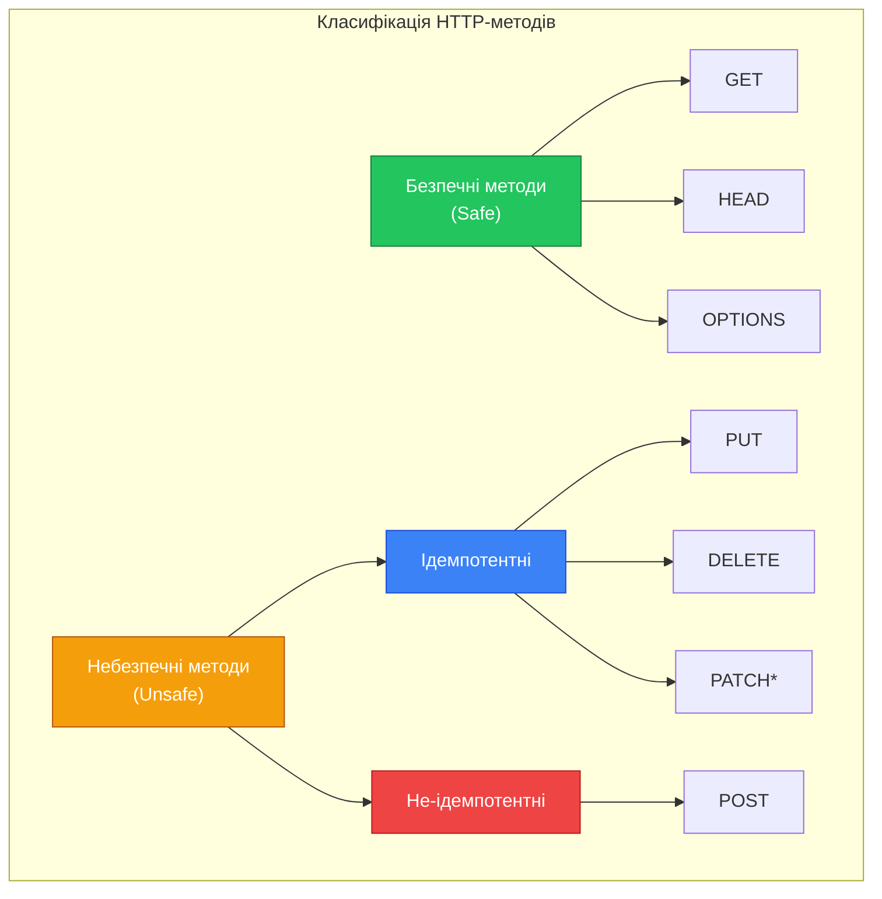

# Декоратори маршрутизації HTTP-методів

::card-group

::card{title="🎯 Мета лекції" icon="i-lucide-target"}

- Опанувати всі декоратори HTTP-методів у NestJS та їх призначення
- Зрозуміти семантику кожного HTTP-методу згідно з REST-конвенціями
- Навчитися комбінувати базові шляхи контролера з шляхами методів
- Вивчити wildcard-маршрутизацію для гнучких шаблонів URL
- Засвоїти важливість порядку оголошення маршрутів
- Практикувати створення RESTful API з правильним використанням HTTP-методів

::

::card{title="🔑 Ключові терміни" icon="i-lucide-key"}

- **HTTP Method** (*HTTP-метод*): тип операції, яку клієнт хоче виконати над ресурсом (GET, POST, PUT тощо)
- **Idempotency** (*ідемпотентність*): властивість операції давати однаковий результат при повторних виконаннях
- **Safe Method** (*безпечний метод*): HTTP-метод, що не змінює стан ресурсу на сервері
- **Wildcard Route** (*маршрут із підстановкою*): маршрут, що використовує символи `*` для збігу з шаблоном
- **Route Order** (*порядок маршрутів*): послідовність оголошення маршрутів, що впливає на пріоритет збігу

::

::

## HTTP-методи: семантика протоколу

HTTP-протокол визначає набір методів (*methods* або *verbs*), кожен з яких має специфічну семантику щодо операцій над ресурсами. NestJS надає декоратори для всіх стандартних HTTP-методів, дозволяючи розробникам будувати API, що дотримується REST-конвенцій та принципів HTTP-специфікації.

Розуміння семантики HTTP-методів є критично важливим для проєктування інтуїтивних API. Неправильне використання методів (наприклад, використання GET для операцій, що змінюють дані) призводить до порушення очікувань клієнтів, проблем з кешуванням та потенційних вразливостей безпеки.

### Властивості HTTP-методів

HTTP-методи класифікуються за двома важливими властивостями:

**Безпечність** (*Safety*): Безпечні методи не змінюють стан ресурсу на сервері. Клієнт може викликати їх без побічних ефектів. Безпечні методи: GET, HEAD, OPTIONS.

**Ідемпотентність** (*Idempotency*): Ідемпотентна операція дає однаковий результат при виконанні один раз або багато разів. Ідемпотентні методи: GET, PUT, DELETE, HEAD, OPTIONS. Неідемпотентний: POST.

::mermaid



::

::note
PATCH технічно не є ідемпотентним у загальному випадку, оскільки його поведінка залежить від реалізації. Проте у більшості RESTful API PATCH проєктується як ідемпотентна операція часткового оновлення.
::

## Декоратор @Get: читання ресурсів

Декоратор `@Get()` позначає метод як обробник GET-запитів — найпоширенішого HTTP-методу, призначеного для читання даних. GET-запити є безпечними та ідемпотентними, що означає, що вони не повинні змінювати стан сервера і можуть бути повторені без побічних ефектів.

### Базове використання

::code-group

```typescript [Без шляху]
import { Controller, Get } from '@nestjs/common';

@Controller('products')
export class ProductsController {
  @Get()
  findAll() {
    return { message: 'List all products' };
  }
  // URL: GET /products
}
```

```typescript [З шляхом]
@Controller('products')
export class ProductsController {
  @Get('featured')
  findFeatured() {
    return { message: 'List featured products' };
  }
  // URL: GET /products/featured
}
```

```typescript [Вкладені шляхи]
@Controller('products')
export class ProductsController {
  @Get('categories/electronics')
  findElectronics() {
    return { message: 'Electronics products' };
  }
  // URL: GET /products/categories/electronics
}
```

::

### Семантика GET-запитів

GET-запити мають відповідати наступним принципам:

**Не змінювати стан**: GET не повинен створювати, оновлювати або видаляти дані на сервері. Багаторазові виклики одного GET-запиту мають повертати однаковий результат (за умови, що дані не змінилися іншими запитами).

**Кешування**: Відповіді на GET-запити можуть кешуватися проксі-серверами, браузерами та CDN. Це критично для продуктивності, тому GET не повинен викликати побічні ефекти.

**Безпека у посиланнях**: URL GET-запитів часто зберігаються в історії браузера, серверних логах та можуть бути передані через Referer-заголовок. Тому чутлива інформація не повинна передаватися через GET.

::warning
Ніколи не використовуйте GET для операцій, що змінюють дані. Антипатерн типу `GET /users/delete/123` порушує HTTP-специфікацію, ускладнює кешування та створює вразливості безпеки (атаки через CSRF).
::

### Типові сценарії використання @Get

**Отримання колекції ресурсів**:
```typescript
@Get()
async findAll() {
  return this.productsService.findAll();
}
// GET /products → Список усіх продуктів
```

**Отримання одного ресурсу** (детально у лекції 08):
```typescript
@Get(':id')
async findOne(@Param('id') id: string) {
  return this.productsService.findOne(id);
}
// GET /products/123 → Один продукт з ID 123
```

**Фільтрація та пошук** (детально у лекції 09):
```typescript
@Get('search')
async search(@Query('q') query: string) {
  return this.productsService.search(query);
}
// GET /products/search?q=laptop → Пошук продуктів
```

## Декоратор @Post: створення ресурсів

Декоратор `@Post()` позначає метод як обробник POST-запитів, призначених для створення нових ресурсів. POST є небезпечним (змінює стан) та не-ідемпотентним методом — повторне виконання POST-запиту зазвичай створює дублюючі ресурси.

### Базове використання

```typescript
import { Controller, Post, Body } from '@nestjs/common';

@Controller('products')
export class ProductsController {
  constructor(private readonly productsService: ProductsService) {}

  @Post()
  async create(@Body() createProductDto: CreateProductDto) {
    return this.productsService.create(createProductDto);
  }
  // URL: POST /products
  // Body: { "name": "Laptop", "price": 1200 }
}
```

### Семантика POST-запитів

**Створення ресурсів**: Основне призначення POST — створення нових ресурсів. Сервер зазвичай генерує ідентифікатор нового ресурсу та повертає його у відповіді.

**Не-ідемпотентність**: Повторне виконання POST-запиту створює новий ресурс кожного разу. `POST /products` з однаковими даними створить кілька продуктів з різними ID.

**Статус-код 201**: За замовчуванням NestJS повертає статус 201 (Created) для успішних POST-запитів, що відповідає HTTP-конвенціям.

**Location заголовок**: Відповідь на POST часто включає заголовок `Location` з URL нового ресурсу:

```typescript
@Post()
async create(
  @Body() createProductDto: CreateProductDto,
  @Res({ passthrough: true }) res: Response,
) {
  const product = await this.productsService.create(createProductDto);
  res.header('Location', `/products/${product.id}`);
  return product;
}
```

### Типові сценарії використання @Post

**Створення ресурсу**:
```typescript
@Post()
create(@Body() dto: CreateProductDto) {
  return this.productsService.create(dto);
}
// POST /products → Створення нового продукту
```

**Вкладені ресурси**:
```typescript
@Post(':id/reviews')
addReview(
  @Param('id') productId: string,
  @Body() reviewDto: CreateReviewDto,
) {
  return this.reviewsService.create(productId, reviewDto);
}
// POST /products/123/reviews → Додавання відгуку до продукту
```

**Не-REST операції**:
```typescript
@Post('bulk-import')
bulkImport(@Body() products: CreateProductDto[]) {
  return this.productsService.bulkCreate(products);
}
// POST /products/bulk-import → Масове імпортування
```

## Декоратор @Put: повна заміна ресурсу

Декоратор `@Put()` позначає метод як обробник PUT-запитів, призначених для повної заміни існуючого ресурсу. PUT є ідемпотентним — повторне виконання з тими самими даними не змінює кінцевого результату.

### Базове використання

```typescript
import { Controller, Put, Param, Body } from '@nestjs/common';

@Controller('products')
export class ProductsController {
  @Put(':id')
  async update(
    @Param('id') id: string,
    @Body() updateProductDto: UpdateProductDto,
  ) {
    return this.productsService.update(id, updateProductDto);
  }
  // URL: PUT /products/123
  // Body: { "name": "Updated Laptop", "price": 1300, "stock": 50 }
}
```

### Семантика PUT-запитів

**Повна заміна**: PUT замінює весь ресурс новими даними. Якщо клієнт надсилає частковий об'єкт, відсутні поля мають бути встановлені у значення за замовчуванням або видалені.

**Ідемпотентність**: Виконання `PUT /products/123` з однаковими даними кілька разів дасть однаковий результат. Це дозволяє клієнтам безпечно повторювати запити при мережевих збоях.

**Створення або оновлення**: Технічно PUT може створити ресурс, якщо він не існує (upsert), проте на практиці це рідко використовується — створення залишається за POST.

::code-group

```typescript [PUT - Повна заміна]
@Put(':id')
update(@Param('id') id: string, @Body() dto: UpdateProductDto) {
  // DTO містить ВСІ поля продукту
  return this.productsService.replaceCompletely(id, dto);
}
// PUT /products/123
// Body: {
//   "name": "Laptop",
//   "price": 1200,
//   "description": "...",
//   "category": "Electronics",
//   "stock": 50
// }
```

```typescript [POST - Створення]
@Post()
create(@Body() dto: CreateProductDto) {
  return this.productsService.create(dto);
}
// POST /products
// Body: { "name": "Laptop", "price": 1200 }
```

::


::note
Різниця між PUT та PATCH часто викликає плутанину. PUT замінює весь ресурс, тому клієнт має надіслати повний об'єкт з усіма полями. PATCH модифікує лише вказані поля, залишаючи інші без змін.
::

## Декоратор @Patch: часткове оновлення ресурсу

Декоратор `@Patch()` позначає метод як обробник PATCH-запитів, призначених для часткового оновлення існуючого ресурсу. PATCH дозволяє клієнту надіслати лише ті поля, які потрібно змінити, не торкаючись інших.

### Базове використання

```typescript
import { Controller, Patch, Param, Body } from '@nestjs/common';

@Controller('products')
export class ProductsController {
  @Patch(':id')
  async partialUpdate(
    @Param('id') id: string,
    @Body() updateDto: Partial<UpdateProductDto>,
  ) {
    return this.productsService.partialUpdate(id, updateDto);
  }
  // URL: PATCH /products/123
  // Body: { "price": 1100 } ← тільки ціна
}
```

### Семантика PATCH-запитів

**Часткове оновлення**: PATCH модифікує лише ті властивості ресурсу, які явно вказані в тілі запиту. Невказані поля залишаються без змін.

**Гнучкість**: Клієнт може оновити одне поле, кілька полів або весь об'єкт — PATCH підтримує всі ці сценарії.

**Ідемпотентність на практиці**: Хоча HTTP-специфікація не гарантує ідемпотентності PATCH, у більшості RESTful API він проєктується як ідемпотентний — повторне застосування однакових змін дає той самий результат.

### PUT vs PATCH: порівняння

::code-group

```typescript [PATCH - Часткове]
@Patch(':id')
async partialUpdate(
  @Param('id') id: string,
  @Body() updates: Partial<Product>,
) {
  // Оновлюємо лише передані поля
  return this.productsService.patch(id, updates);
}

// Запит 1: PATCH /products/123
// Body: { "price": 1100 }
// Результат: змінено лише ціну

// Запит 2: PATCH /products/123
// Body: { "stock": 100, "available": true }
// Результат: змінено stock та available, ціна залишилася 1100
```

```typescript [PUT - Повне]
@Put(':id')
async fullUpdate(
  @Param('id') id: string,
  @Body() product: UpdateProductDto,
) {
  // Замінюємо весь ресурс
  return this.productsService.replace(id, product);
}

// Запит: PUT /products/123
// Body: {
//   "name": "Laptop",
//   "price": 1200,
//   "stock": 50,
//   "available": true
// }
// Результат: весь продукт замінено новими даними
```

::

::tip
У TypeScript використовуйте `Partial<T>` для типізації PATCH-запитів. Це робить всі поля опціональними, чітко вказуючи, що клієнт може надіслати будь-яку підмножину полів: `@Body() updates: Partial<UpdateProductDto>`.
::

## Декоратор @Delete: видалення ресурсів

Декоратор `@Delete()` позначає метод як обробник DELETE-запитів, призначених для видалення ресурсів. DELETE є ідемпотентним — повторне видалення того самого ресурсу не змінює кінцевого стану (ресурс залишається видаленим).

### Базове використання

```typescript
import { Controller, Delete, Param, HttpCode, HttpStatus } from '@nestjs/common';

@Controller('products')
export class ProductsController {
  @Delete(':id')
  @HttpCode(HttpStatus.NO_CONTENT) // 204
  async remove(@Param('id') id: string): Promise<void> {
    await this.productsService.remove(id);
  }
  // URL: DELETE /products/123
  // Response: 204 No Content (без тіла)
}
```

### Семантика DELETE-запитів

**Ідемпотентність**: Перший DELETE-запит видаляє ресурс. Наступні DELETE до того самого ресурсу зазвичай повертають 404 (Not Found) або 204 (No Content), але не створюють помилку — ресурс так чи інакше відсутній, що й було метою.

**Статус-коди**:
- **204 No Content**: Успішне видалення без тіла відповіді (найпоширеніше)
- **200 OK**: Успішне видалення з поверненням інформації про видалений ресурс
- **202 Accepted**: Видалення прийнято, але ще не виконано (асинхронна обробка)
- **404 Not Found**: Ресурс вже не існує

**М'яке видалення**: У багатьох системах DELETE не видаляє фізично записи з бази даних, а лише позначає їх як видалені (soft delete). Це дозволяє відновлювати дані та зберігати історію.

::code-group

```typescript [Жорстке видалення]
@Delete(':id')
@HttpCode(HttpStatus.NO_CONTENT)
async hardDelete(@Param('id') id: string): Promise<void> {
  await this.productsService.permanentlyDelete(id);
  // Фізичне видалення з бази даних
}
```

```typescript [М'яке видалення]
@Delete(':id')
async softDelete(@Param('id') id: string) {
  return this.productsService.softDelete(id);
  // Встановлюємо deletedAt = new Date()
}

// В сервісі:
async softDelete(id: string) {
  return this.repository.update(id, { 
    deletedAt: new Date(),
    isActive: false 
  });
}
```

```typescript [З поверненням інформації]
@Delete(':id')
async removeWithInfo(@Param('id') id: string) {
  const deleted = await this.productsService.findOne(id);
  await this.productsService.remove(id);
  return {
    message: 'Product deleted successfully',
    deleted,
  };
}
// HTTP 200 OK з тілом відповіді
```

::

## Декоратор @Options: перевірка можливостей

Декоратор `@Options()` позначає метод як обробник OPTIONS-запитів, призначених для перевірки підтримуваних HTTP-методів для конкретного ресурсу. OPTIONS є безпечним та ідемпотентним методом.

### Базове використання

```typescript
import { Controller, Options } from '@nestjs/common';

@Controller('products')
export class ProductsController {
  @Options()
  getOptions() {
    return {
      methods: ['GET', 'POST', 'PUT', 'PATCH', 'DELETE', 'OPTIONS'],
    };
  }
  // URL: OPTIONS /products
}
```

### Семантика OPTIONS-запитів

**CORS preflight**: Основне призначення OPTIONS — обробка CORS preflight запитів. Браузери автоматично надсилають OPTIONS перед «складними» запитами (з нестандартними заголовками або методами).

**Автоматична обробка**: NestJS автоматично обробляє OPTIONS-запити при увімкненому CORS через `app.enableCors()`. Явна реалізація обробника OPTIONS потрібна рідко.

**Allow заголовок**: Відповідь на OPTIONS зазвичай містить заголовок `Allow` зі списком підтримуваних методів:

```typescript
@Options(':id')
optionsForProduct(@Res() res: Response) {
  res.set('Allow', 'GET, PUT, PATCH, DELETE, OPTIONS');
  res.send();
}
```

::note
У більшості випадків вам не потрібно явно реалізовувати обробники OPTIONS. NestJS автоматично обробляє CORS preflight запити, коли ви викликаєте `app.enableCors()` у `main.ts`. Явні обробники OPTIONS потрібні лише для специфічних кастомізацій.
::

## Декоратор @Head: отримання метаданих

Декоратор `@Head()` позначає метод як обробник HEAD-запитів, призначених для отримання заголовків відповіді без тіла. HEAD є ідентичним до GET, але без тіла відповіді.

### Базове використання

```typescript
import { Controller, Head, Param } from '@nestjs/common';

@Controller('products')
export class ProductsController {
  @Head(':id')
  async checkExists(@Param('id') id: string): Promise<void> {
    const exists = await this.productsService.exists(id);
    if (!exists) {
      throw new NotFoundException();
    }
    // Тіло не повертається, лише статус-код
  }
  // URL: HEAD /products/123
  // Response: 200 OK (без тіла) або 404 Not Found
}
```

### Семантика HEAD-запитів

**Ідентичність до GET**: Сервер має обробляти HEAD так само, як GET, але без відправлення тіла відповіді. Всі заголовки (Content-Length, Content-Type, ETag тощо) мають бути такими самими, як при GET.

**Перевірка існування**: HEAD часто використовується для перевірки, чи існує ресурс, без завантаження його вмісту. Це ефективніше за GET для великих ресурсів.

**Кешування**: HEAD корисний для перевірки актуальності кешу через ETag або Last-Modified заголовки без завантаження всього ресурсу.

**Автоматична обробка**: У багатьох фреймворках, включаючи NestJS, HEAD-запити автоматично маршрутизуються до відповідних GET-обробників, просто відкидаючи тіло. Явні обробники HEAD потрібні лише для оптимізації.

## Декоратор @All: універсальний обробник

Декоратор `@All()` позначає метод як обробник запитів з будь-яким HTTP-методом. Це корисно для створення універсальних ендпоінтів або fallback-обробників.

### Базове використання

```typescript
import { Controller, All, Req } from '@nestjs/common';
import { Request } from 'express';

@Controller('webhook')
export class WebhookController {
  @All()
  handleWebhook(@Req() req: Request) {
    return {
      method: req.method,
      body: req.body,
      message: 'Webhook received',
    };
  }
  // Обробляє GET, POST, PUT, DELETE тощо до /webhook
}
```

### Типові сценарії використання

**Webhooks**: Зовнішні сервіси можуть надсилати різні HTTP-методи:

```typescript
@All('github-webhook')
async handleGitHub(@Req() req: Request) {
  const event = req.headers['x-github-event'];
  return this.webhookService.process(event, req.body);
}
```

**Проксі**: Перенаправлення всіх запитів на інший сервіс:

```typescript
@All('*')
async proxy(@Req() req: Request, @Res() res: Response) {
  return this.proxyService.forward(req, res);
}
```

**Fallback**: Обробка невідомих маршрутів:

```typescript
@All('*')
notFound() {
  throw new NotFoundException('Endpoint not found');
}
```

::warning
Використовуйте `@All()` обережно. Універсальні обробники можуть «перехопити» запити, призначені для інших, більш специфічних маршрутів, якщо оголошені раніше. Завжди розміщуйте `@All()` в кінці контролера.
::

## Комбінування шляхів: базовий + метод

Повний URL маршруту формується шляхом конкатенації префікса контролера та шляху методу. Розуміння цієї композиції дозволяє створювати інтуїтивні ієрархічні API.

### Правила формування шляхів

```
Повний шлях = @Controller(prefix) + @Method(path)
```

::code-group

```typescript [Приклад 1: Прості шляхи]
@Controller('users')
export class UsersController {
  @Get()           // /users
  @Get('active')   // /users/active
  @Post()          // /users (POST)
  @Get(':id')      // /users/123
}
```

```typescript [Приклад 2: Вкладені ресурси]
@Controller('users')
export class UsersController {
  @Get(':userId/posts')          // /users/123/posts
  @Post(':userId/posts')         // /users/123/posts (POST)
  @Get(':userId/posts/:postId')  // /users/123/posts/456
}
```

```typescript [Приклад 3: Складні шляхи]
@Controller('api/v2/products')
export class ProductsController {
  @Get('categories/:category/items')
  // /api/v2/products/categories/electronics/items
  
  @Post('bulk/import')
  // /api/v2/products/bulk/import
}
```

::


::tip
Використовуйте вкладені шляхи для відображення ієрархічних відношень між ресурсами. Шлях `/users/123/posts` інтуїтивно читається як «пости користувача з ID 123», що відповідає REST-принципам.
::

### Порожні шляхи та слеші

NestJS автоматично обробляє слеші (`/`), додаючи або видаляючи їх за потреби:

```typescript
@Controller('products')
export class ProductsController {
  @Get()        // Обробляє і /products, і /products/
  @Get('list')  // Обробляє і /products/list, і /products/list/
}
```

Обидві версії URL (з слешем наприкінці та без нього) працюють однаково — NestJS нормалізує їх автоматично.

## Wildcard-маршрути: гнучкі шаблони

Wildcard-маршрутизація дозволяє створювати маршрути, що відповідають шаблонам з символами підстановки (*wildcard characters*). NestJS підтримує символ `*`, який збігається з будь-якою послідовністю символів.

### Базовий синтаксис wildcard

```typescript
@Controller('files')
export class FilesController {
  @Get('*')
  getAnyFile() {
    return { message: 'Matches any path under /files/' };
  }
  // Збігається:
  // /files/document.pdf
  // /files/images/photo.jpg
  // /files/deep/nested/file.txt
}
```

### Wildcard у середині шляху

```typescript
@Controller('products')
export class ProductsController {
  @Get('ab*cd')
  findPattern() {
    return { message: 'Pattern matched' };
  }
  // Збігається:
  // /products/abcd
  // /products/ab123cd
  // /products/abXYZcd
  // НЕ збігається:
  // /products/abc (немає 'cd' в кінці)
  // /products/abcd/extra (є додатковий сегмент)
}
```

### Множинні wildcards

```typescript
@Get('files/*.{jpg,png}')
getImageFiles() {
  return { message: 'Image file matched' };
}
// Збігається:
// /files/photo.jpg
// /files/image.png
// НЕ збігається:
// /files/document.pdf
```

::caution
Wildcard-маршрути мають бути оголошені **після** всіх специфічних маршрутів, інакше вони «перехоплять» запити, призначені для специфічних обробників. Порядок оголошення критично важливий для коректної маршрутизації.
::

### Отримання збігу wildcards

На жаль, NestJS не надає вбудованого способу отримати частину шляху, що відповідає wildcard. Для цього потрібен прямий доступ до об'єкта запиту:

```typescript
import { Controller, Get, Req } from '@nestjs/common';
import { Request } from 'express';

@Controller('files')
export class FilesController {
  @Get('*')
  getFile(@Req() req: Request) {
    // Витягуємо шлях після /files/
    const filePath = req.path.replace('/files/', '');
    return {
      message: 'File requested',
      path: filePath,
    };
  }
}
// GET /files/images/photo.jpg
// → { message: 'File requested', path: 'images/photo.jpg' }
```

## Порядок оголошення маршрутів: пріоритет збігу

Порядок, у якому маршрути оголошуються в контролері, визначає пріоритет їх збігу. NestJS перевіряє маршрути зверху вниз і зупиняється на першому збігу.

### Правильний порядок: від специфічного до загального

::code-group

```typescript [✅ Правильно]
@Controller('products')
export class ProductsController {
  // 1. Найбільш специфічні статичні шляхи
  @Get('featured')
  findFeatured() {
    return { type: 'featured' };
  }

  @Get('on-sale')
  findOnSale() {
    return { type: 'on-sale' };
  }

  // 2. Шляхи з параметрами
  @Get(':id')
  findOne(@Param('id') id: string) {
    return { type: 'single', id };
  }

  // 3. Найбільш загальні (wildcard)
  @Get('*')
  findAny() {
    return { type: 'wildcard' };
  }
}

// Результати:
// GET /products/featured → findFeatured()
// GET /products/on-sale → findOnSale()
// GET /products/123 → findOne()
// GET /products/anything/else → findAny()
```

```typescript [❌ Неправильно]
@Controller('products')
export class ProductsController {
  // Wildcard оголошений першим - ПРОБЛЕМА!
  @Get('*')
  findAny() {
    return { type: 'wildcard' };
  }

  // Цей маршрут НІКОЛИ не спрацює
  @Get('featured')
  findFeatured() {
    return { type: 'featured' };
  }

  // І цей теж НІКОЛИ не спрацює
  @Get(':id')
  findOne(@Param('id') id: string) {
    return { type: 'single', id };
  }
}

// Всі запити обробляє findAny() ❌
// GET /products/featured → findAny() (неправильно!)
// GET /products/123 → findAny() (неправильно!)
```

::

### Ієрархія специфічності

Від найбільш специфічного до найменш специфічного:

1. **Статичні шляхи**: `/products/featured`, `/products/new`
2. **Шляхи з параметрами**: `/products/:id`
3. **Wildcard в кінці**: `/products/*`
4. **Повний wildcard**: `*`

::accordion

::accordion-item{label="❓ Чому параметризовані маршрути мають бути після статичних?" icon="i-lucide-help-circle"}

Маршрут `:id` збігається з будь-яким рядком. Якщо оголосити його перед статичним маршрутом `featured`, то запит `GET /products/featured` буде оброблений маршрутом `:id`, де `id` отримає значення `"featured"`, замість спрацювання специфічного обробника для featured-продуктів.

Статичні маршрути не мають неоднозначності — вони збігаються точно з вказаним рядком. Тому їх завжди треба оголошувати першими.

::

::accordion-item{label="❓ Що робити, якщо маршрути конфліктують між різними контролерами?" icon="i-lucide-help-circle"}

Якщо два контролери з однаковим префіксом оголошують маршрути, що перетинаються, результат залежить від порядку реєстрації контролерів у модулі. Це небезпечна ситуація, яку варто уникати.

Рішення:
1. Використовуйте різні префікси для контролерів
2. Об'єднайте функціональність в один контролер
3. Використовуйте більш специфічні шляхи для диференціації

Наприклад, замість двох контролерів з `@Controller('users')`, створіть `@Controller('users')` та `@Controller('admins')`.

::

::

## Практичний приклад: RESTful API для блогу

Для закріплення матеріалу розглянемо повноцінний RESTful контролер для управління статтями блогу:

```typescript
import {
  Controller,
  Get,
  Post,
  Put,
  Patch,
  Delete,
  Param,
  Body,
  HttpCode,
  HttpStatus,
} from '@nestjs/common';
import { ArticlesService } from './articles.service';
import { CreateArticleDto, UpdateArticleDto } from './dto';

@Controller('articles')
export class ArticlesController {
  constructor(private readonly articlesService: ArticlesService) {}

  // GET /articles - Отримання всіх статей
  @Get()
  async findAll() {
    return this.articlesService.findAll();
  }

  // GET /articles/published - Опубліковані статті
  @Get('published')
  async findPublished() {
    return this.articlesService.findPublished();
  }

  // GET /articles/drafts - Чернетки
  @Get('drafts')
  async findDrafts() {
    return this.articlesService.findDrafts();
  }

  // GET /articles/:id - Одна стаття
  @Get(':id')
  async findOne(@Param('id') id: string) {
    return this.articlesService.findOne(id);
  }

  // POST /articles - Створення статті
  @Post()
  async create(@Body() createDto: CreateArticleDto) {
    return this.articlesService.create(createDto);
  }

  // PUT /articles/:id - Повна заміна статті
  @Put(':id')
  async replace(
    @Param('id') id: string,
    @Body() updateDto: UpdateArticleDto,
  ) {
    return this.articlesService.replace(id, updateDto);
  }

  // PATCH /articles/:id - Часткове оновлення
  @Patch(':id')
  async update(
    @Param('id') id: string,
    @Body() updates: Partial<UpdateArticleDto>,
  ) {
    return this.articlesService.update(id, updates);
  }

  // PATCH /articles/:id/publish - Публікація статті
  @Patch(':id/publish')
  async publish(@Param('id') id: string) {
    return this.articlesService.publish(id);
  }

  // PATCH /articles/:id/unpublish - Зняття з публікації
  @Patch(':id/unpublish')
  async unpublish(@Param('id') id: string) {
    return this.articlesService.unpublish(id);
  }

  // DELETE /articles/:id - Видалення статті
  @Delete(':id')
  @HttpCode(HttpStatus.NO_CONTENT)
  async remove(@Param('id') id: string): Promise<void> {
    await this.articlesService.remove(id);
  }
}
```

Цей контролер демонструє:
- **GET** для читання колекцій та окремих ресурсів
- **POST** для створення нових статей
- **PUT** для повної заміни
- **PATCH** для часткового оновлення та дій (publish/unpublish)
- **DELETE** для видалення
- Правильний порядок маршрутів (статичні перед параметризованими)
- Використання статус-кодів (204 для DELETE)

## Підсумок: семантика HTTP у NestJS

Декоратори HTTP-методів у NestJS надають зручний спосіб відобразити REST-операції на методи контролера. Правильне використання HTTP-семантики створює API, що є інтуїтивним для клієнтів та відповідає загальноприйнятим конвенціям.

Ключові принципи роботи з декораторами маршрутів:

- **@Get** — для безпечного читання даних без побічних ефектів
- **@Post** — для створення нових ресурсів (не-ідемпотентно)
- **@Put** — для повної заміни існуючих ресурсів (ідемпотентно)
- **@Patch** — для часткового оновлення полів (зазвичай ідемпотентно)
- **@Delete** — для видалення ресурсів (ідемпотентно)
- **@Options, @Head** — для метаданих та CORS (рідко потрібні явно)
- **@All** — для універсальних обробників (використовуйте обережно)
- **Порядок оголошення** — від специфічного до загального
- **Wildcard** — для гнучких шаблонів (оголошуйте останніми)

У наступних лекціях ми детально вивчимо роботу з параметрами маршрутів через декоратор @Param, query-параметрами через @Query та тілом запиту через @Body, що дозволить створювати повноцінні REST API з валідацією та трансформацією даних.

::card-group

::card{title="✅ Що ми опанували" icon="i-lucide-check-circle"}

- Семантику всіх HTTP-методів та їх властивості (безпечність, ідемпотентність)
- Декоратори @Get, @Post, @Put, @Patch, @Delete, @Options, @Head, @All
- Відмінності між PUT (повна заміна) та PATCH (часткове оновлення)
- Комбінування базових шляхів контролера з шляхами методів
- Wildcard-маршрутизацію для гнучких шаблонів
- Критичність порядку оголошення маршрутів
- Best practices створення RESTful API

::

::card{title="🎯 Наступні кроки" icon="i-lucide-target"}

У наступній лекції ми детально розглянемо параметри маршруту та декоратор @Param. Ми навчимося витягувати динамічні сегменти з URL, валідувати та трансформувати їх, а також обробляти множинні параметри у вкладених маршрутах.

::

::
