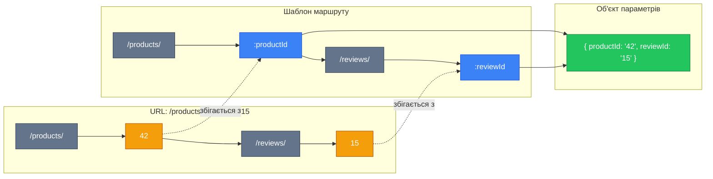
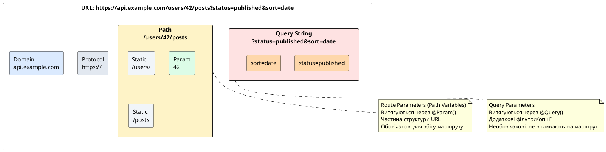

# Параметри маршруту та декоратор @Param

::card-group

::card{title="🎯 Мета лекції" icon="i-lucide-target"}

- Опанувати використання динамічних сегментів у маршрутах через синтаксис `:parameter`
- Навчитися витягувати параметри маршруту за допомогою декоратора @Param
- Зрозуміти різницю між витягуванням всіх параметрів та окремого параметра
- Вивчити типізацію та трансформацію параметрів маршруту
- Практикувати роботу з множинними параметрами у вкладених маршрутах
- Засвоїти обробку неіснуючих ресурсів через NotFoundException
- Застосовувати валідаційні pipes для перевірки коректності параметрів

::

::card{title="🔑 Ключові терміни" icon="i-lucide-key"}

- **Route Parameter** (*параметр маршруту*): динамічний сегмент URL, що починається з `:` та використовується для передачі ідентифікаторів
- **Path Variable** (*змінна шляху*): альтернативна назва параметра маршруту, прийнята у деяких фреймворках
- **Param Decorator** (*декоратор параметра*): спеціальний декоратор NestJS для витягування значень з URL
- **Type Coercion** (*приведення типів*): автоматична трансформація рядкових параметрів у інші типи даних
- **Nested Routes** (*вкладені маршрути*): маршрути з множинними параметрами, що відображають ієрархію ресурсів

::

::

## Динамічні сегменти URL: від статичних шляхів до параметрів

У попередній лекції ми розглядали статичні маршрути, де кожен сегмент URL був фіксованим: `/products`, `/products/featured`, `/products/on-sale`. Проте більшість реальних API потребують гнучкості — можливості звертатися до конкретних ресурсів за їх ідентифікаторами або іншими унікальними характеристиками.

Саме для цього призначені **параметри маршруту** (*route parameters*) — динамічні сегменти URL, що дозволяють створювати шаблони шляхів, які можуть відповідати необмеженій кількості конкретних URL. Замість створення окремого маршруту для кожного продукту (що було б технічно неможливо), ми визначаємо один шаблон `/products/:id`, який обслуговує запити до будь-якого продукту.

### Анатомія параметризованого маршруту

Параметр маршруту позначається двокрапкою (`:`) перед ім'ям параметра. Це сигналізує NestJS, що даний сегмент є змінним і його значення має бути витягнуте та передане обробнику:

::mermaid



::

Розглянемо простий приклад — маршрут для отримання користувача за ідентифікатором:

```typescript
import { Controller, Get } from '@nestjs/common';

@Controller('users')
export class UsersController {
  @Get(':id')
  findOne() {
    return { message: 'User found' };
  }
}
```

Цей контролер обробить всі наступні запити, де `:id` може бути будь-яким рядком:
- `GET /users/1` → `id = "1"`
- `GET /users/42` → `id = "42"`
- `GET /users/abc-def-123` → `id = "abc-def-123"`
- `GET /users/john.doe` → `id = "john.doe"`

::note
Параметри маршруту завжди передаються як **рядки** (*strings*), незалежно від того, як вони виглядають в URL. Якщо клієнт надсилає `/users/42`, то `id` буде рядком `"42"`, а не числом `42`. Трансформацію у числовий тип або інші типи даних необхідно виконувати явно.
::

### Іменування параметрів: семантика та конвенції

Імена параметрів маршруту повинні бути описовими та відображати семантику того, що вони представляють. Використовуйте загальноприйняті конвенції RESTful API:

**Ідентифікатори ресурсів**:
- `:id` — загальний ідентифікатор (коли контекст очевидний)
- `:userId`, `:productId`, `:orderId` — специфічні ідентифікатори (коли потрібна ясність)
- `:uuid` — коли явно вказується формат ідентифікатора

**Текстові ідентифікатори**:
- `:slug` — URL-дружній ідентифікатор (наприклад, `nestjs-tutorial-2024`)
- `:username` — ім'я користувача як ідентифікатор
- `:code` — символьний код (наприклад, код країни `UA`, `US`)

**Ієрархічні ідентифікатори**:
```typescript
@Get(':companyId/departments/:departmentId/employees/:employeeId')
// Чітко вказує ієрархію: компанія → відділ → працівник
```

::tip
Для вкладених ресурсів використовуйте специфічні імена параметрів замість загального `:id` у кожному сегменті. Замість `/users/:id/posts/:id` (неоднозначно) використовуйте `/users/:userId/posts/:postId` (зрозуміло).
::

## Декоратор @Param: витягування значень параметрів

Щоб отримати доступ до значень параметрів маршруту всередині обробника, NestJS надає декоратор `@Param()`. Цей декоратор може використовуватися у двох режимах: для витягування всіх параметрів одночасно або для доступу до конкретного параметра за іменем.


### Режим 1: Витягування всіх параметрів (@Param())

Коли декоратор `@Param()` використовується без аргументів, він повертає об'єкт, що містить всі параметри маршруту як пари ключ-значення:

```typescript
import { Controller, Get, Param } from '@nestjs/common';

@Controller('users')
export class UsersController {
  @Get(':userId/posts/:postId')
  findPost(@Param() params: any) {
    console.log(params); // { userId: '123', postId: '456' }
    return {
      userId: params.userId,
      postId: params.postId,
    };
  }
}
// GET /users/123/posts/456
```

Цей підхід корисний, коли маршрут містить багато параметрів і зручніше працювати з ними як з єдиним об'єктом. Проте у TypeScript краще явно типізувати цей об'єкт:

```typescript
interface PostParams {
  userId: string;
  postId: string;
}

@Get(':userId/posts/:postId')
findPost(@Param() params: PostParams) {
  return {
    message: `Fetching post ${params.postId} of user ${params.userId}`,
  };
}
```

### Режим 2: Витягування окремого параметра (@Param('key'))

Набагато частіше використовується другий режим, де ми витягуємо конкретний параметр за його іменем, передаючи ім'я як аргумент декоратора:

```typescript
import { Controller, Get, Param } from '@nestjs/common';

@Controller('users')
export class UsersController {
  @Get(':id')
  findOne(@Param('id') id: string) {
    return {
      message: `Fetching user with ID: ${id}`,
      userId: id,
    };
  }
}
// GET /users/42 → id = "42"
```

Цей спосіб є більш читабельним та рекомендується для більшості випадків. TypeScript автоматично виводить тип параметра як `string`, що відповідає дійсності — всі параметри URL є рядками.

::code-group

```typescript [Один параметр]
@Controller('products')
export class ProductsController {
  @Get(':id')
  findOne(@Param('id') id: string) {
    return { productId: id };
  }
}
// GET /products/42 → id = "42"
```

```typescript [Два параметри]
@Controller('users')
export class UsersController {
  @Get(':userId/posts/:postId')
  findPost(
    @Param('userId') userId: string,
    @Param('postId') postId: string,
  ) {
    return { userId, postId };
  }
}
// GET /users/10/posts/25 → userId = "10", postId = "25"
```

```typescript [Комбінація підходів]
@Controller('companies')
export class CompaniesController {
  @Get(':companyId/departments/:deptId/employees/:empId')
  findEmployee(
    @Param() params: { companyId: string; deptId: string; empId: string },
  ) {
    // Альтернативно: витягнути всі параметри одразу
    return params;
  }
}
```

::

::warning
Не намагайтеся отримати параметр, який не оголошений у маршруті. Якщо маршрут визначений як `@Get(':id')`, але ви використовуєте `@Param('userId')`, NestJS поверне `undefined`, а не кине помилку. Імена параметрів у маршруті та у декораторі **повинні точно збігатися**.
::

## Типізація параметрів: від рядків до бізнес-типів

Як було зазначено вище, всі параметри маршруту NestJS передає як рядки (*strings*). Це відповідає природі URL — вони є текстовими структурами. Проте у більшості випадків параметри представляють типовані сутності: числові ідентифікатори, UUID, дати тощо.

### Ручна трансформація: примітивні підходи

Найпростіший спосіб трансформації — явне перетворення всередині обробника:

```typescript
@Get(':id')
async findOne(@Param('id') id: string) {
  // Перетворення рядка у число
  const numericId = parseInt(id, 10);
  
  if (isNaN(numericId)) {
    throw new BadRequestException('ID must be a number');
  }
  
  return this.usersService.findOne(numericId);
}
```

Проте цей підхід має кілька недоліків:
- **Дублювання коду**: Кожен обробник, що приймає числовий ID, має повторювати логіку перетворення
- **Відсутність автоматичної валідації**: Легко забути перевірити `isNaN`
- **Розмивання відповідальностей**: Контролер виконує валідацію, хоча це не його основна функція

### Інтерфейси для типізації параметрів

Для складніших маршрутів з множинними параметрами створюйте інтерфейси або типи, що описують структуру параметрів:

```typescript
// Інтерфейс для параметрів маршруту
interface UserPostParams {
  userId: string;
  postId: string;
}

@Controller('users')
export class UsersController {
  @Get(':userId/posts/:postId/comments')
  async getComments(@Param() params: UserPostParams) {
    const userId = parseInt(params.userId, 10);
    const postId = parseInt(params.postId, 10);
    
    return this.postsService.getComments(userId, postId);
  }
}
```

::tip
Використовуйте інтерфейси для документування структури параметрів маршруту. Це покращує читабельність коду та забезпечує автодоповнення у IDE. Проте пам'ятайте: інтерфейси TypeScript не виконують runtime-валідацію — вони існують лише під час компіляції.
::

## Автоматична трансформація через Pipes

NestJS надає **pipes** (*пайпи*) — спеціальні механізми, що дозволяють трансформувати та валідувати вхідні дані перед тим, як вони потраплять до обробника. Pipes можна застосовувати як глобально, так і на рівні окремих параметрів.

### ParseIntPipe: трансформація у цілі числа

Найпоширеніший сценарій — перетворення рядкового ID у числовий:

```typescript
import { Controller, Get, Param, ParseIntPipe } from '@nestjs/common';

@Controller('users')
export class UsersController {
  @Get(':id')
  async findOne(@Param('id', ParseIntPipe) id: number) {
    // id вже є числом типу number, не рядком!
    return this.usersService.findOne(id);
  }
}
```

Що відбувається під капотом:
1. NestJS отримує `/users/42` → витягує `id = "42"` (рядок)
2. `ParseIntPipe` намагається перетворити `"42"` у `42` (число)
3. Якщо перетворення успішне, `id` передається у обробник як `number`
4. Якщо перетворення неможливе (наприклад, `/users/abc`), `ParseIntPipe` автоматично кидає `BadRequestException` з повідомленням про помилку

::terminal-preview{title="Запит з некоректним ID" :cursor="false"}

<div class="line"><span class="opacity-40">$</span> <strong class="font-bold">curl http://localhost:3000/users/abc</strong></div>
<div class="line"></div>
<div class="line"><span class="text-rose-400 font-bold">HTTP/1.1 400 Bad Request</span></div>
<div class="line">{</div>
<div class="line">  <span class="text-blue-400">"statusCode"</span>: <span class="text-yellow-400">400</span>,</div>
<div class="line">  <span class="text-blue-400">"message"</span>: <span class="text-green-400">"Validation failed (numeric string is expected)"</span>,</div>
<div class="line">  <span class="text-blue-400">"error"</span>: <span class="text-green-400">"Bad Request"</span></div>
<div class="line">}</div>

::

### ParseUUIDPipe: валідація UUID-ідентифікаторів

Для систем, що використовують UUID замість числових ID:

```typescript
import { Controller, Get, Param, ParseUUIDPipe } from '@nestjs/common';

@Controller('products')
export class ProductsController {
  @Get(':id')
  async findOne(@Param('id', ParseUUIDPipe) id: string) {
    // id валідований як UUID формату:
    // 123e4567-e89b-12d3-a456-426614174000
    return this.productsService.findOne(id);
  }
}
```

`ParseUUIDPipe` перевіряє, що рядок відповідає стандарту UUID (за замовчуванням версія 4). Якщо формат некоректний, автоматично повертається `400 Bad Request`.


### Інші вбудовані Pipes для параметрів

NestJS надає набір pipes для найпоширеніших сценаріїв трансформації:

::code-group

```typescript [ParseIntPipe]
@Get(':id')
findOne(@Param('id', ParseIntPipe) id: number) {
  // Перетворює "123" → 123
  // Кидає помилку для "abc"
}
```

```typescript [ParseFloatPipe]
@Get(':price')
findByPrice(@Param('price', ParseFloatPipe) price: number) {
  // Перетворює "19.99" → 19.99
  // Кидає помилку для "invalid"
}
```

```typescript [ParseBoolPipe]
@Get(':active')
findActive(@Param('active', ParseBoolPipe) active: boolean) {
  // Перетворює "true" → true, "false" → false
  // Також підтримує "1" → true, "0" → false
}
```

```typescript [ParseEnumPipe]
enum Status {
  Active = 'active',
  Inactive = 'inactive',
  Pending = 'pending',
}

@Get('status/:value')
findByStatus(
  @Param('value', new ParseEnumPipe(Status)) status: Status,
) {
  // Перевіряє, що значення є одним із enum
  // Кидає помилку для невалідних значень
}
```

```typescript [ParseUUIDPipe]
@Get(':id')
findOne(@Param('id', ParseUUIDPipe) id: string) {
  // Валідує формат UUID
  // "123e4567-e89b-12d3-a456-426614174000" ✅
  // "not-a-uuid" ❌
}
```

::

### Опції та кастомізація Pipes

Більшість pipes підтримують опції конфігурації. Наприклад, `ParseIntPipe` може вказати статус-код помилки:

```typescript
@Get(':id')
findOne(
  @Param('id', new ParseIntPipe({ 
    errorHttpStatusCode: HttpStatus.NOT_ACCEPTABLE 
  }))
  id: number,
) {
  return this.usersService.findOne(id);
}
```

Для `ParseUUIDPipe` можна вказати версію UUID:

```typescript
@Get(':id')
findOne(
  @Param('id', new ParseUUIDPipe({ version: '4' }))
  id: string,
) {
  // Валідує лише UUID версії 4
}
```

::note
Pipes застосовуються **до** виклику обробника. Якщо pipe кидає помилку, обробник взагалі не викликається. Це дозволяє тримати контролери чистими від валідаційної логіки — вся перевірка відбувається на рівні інфраструктури.
::

## Множинні параметри: вкладені ресурси та ієрархії

Реальні RESTful API часто мають ієрархічні структури ресурсів, де доступ до одного ресурсу залежить від ідентифікаторів батьківських ресурсів. Наприклад, коментарі належать постам, які належать користувачам: `/users/:userId/posts/:postId/comments/:commentId`.

### Базовий приклад: пости користувача

```typescript
import { Controller, Get, Param, ParseIntPipe } from '@nestjs/common';

@Controller('users')
export class UsersController {
  constructor(private readonly postsService: PostsService) {}

  @Get(':userId/posts/:postId')
  async getUserPost(
    @Param('userId', ParseIntPipe) userId: number,
    @Param('postId', ParseIntPipe) postId: number,
  ) {
    // Обидва параметри автоматично перетворені у числа
    return this.postsService.findUserPost(userId, postId);
  }
}
```

Цей маршрут обробляє запити типу:
- `GET /users/10/posts/25` → `userId = 10, postId = 25`
- `GET /users/3/posts/100` → `userId = 3, postId = 100`

### Тристоронні та глибші ієрархії

Для складніших структур можна мати три і більше параметрів:

```typescript
@Controller('companies')
export class CompaniesController {
  @Get(':companyId/departments/:departmentId/employees/:employeeId')
  async getEmployee(
    @Param('companyId', ParseIntPipe) companyId: number,
    @Param('departmentId', ParseIntPipe) departmentId: number,
    @Param('employeeId', ParseIntPipe) employeeId: number,
  ) {
    return this.employeesService.find(companyId, departmentId, employeeId);
  }
}
// GET /companies/1/departments/5/employees/42
```

::warning
Хоча технічно можна створювати довільно глибокі ієрархії, **уникайте надмірного вкладення**. URL з більш ніж 3-4 рівнями стають громіздкими та складними для розуміння. Розгляньте альтернативи:
- Скорочені маршрути: `/employees/:id` замість повної ієрархії
- Query-параметри: `/employees?companyId=1&departmentId=5`
- Композитні ідентифікатори: `/employees/:compoundId` де `compoundId = "1-5-42"`
::

### Витягування множинних параметрів як об'єкт

Коли параметрів багато, зручно витягувати їх усі одразу:

```typescript
interface ResourceParams {
  companyId: string;
  departmentId: string;
  employeeId: string;
}

@Get(':companyId/departments/:departmentId/employees/:employeeId')
async getEmployee(@Param() params: ResourceParams) {
  const companyId = parseInt(params.companyId, 10);
  const departmentId = parseInt(params.departmentId, 10);
  const employeeId = parseInt(params.employeeId, 10);
  
  return this.employeesService.find(companyId, departmentId, employeeId);
}
```

Проте цей підхід втрачає автоматичну валідацію pipes. Для збереження валідації використовуйте DTO з class-validator (детально розглянемо у лекції 12):

```typescript
import { IsInt, Min } from 'class-validator';
import { Type } from 'class-transformer';

export class EmployeeParamsDto {
  @Type(() => Number)
  @IsInt()
  @Min(1)
  companyId: number;

  @Type(() => Number)
  @IsInt()
  @Min(1)
  departmentId: number;

  @Type(() => Number)
  @IsInt()
  @Min(1)
  employeeId: number;
}

@Get(':companyId/departments/:departmentId/employees/:employeeId')
async getEmployee(@Param() params: EmployeeParamsDto) {
  // params вже валідовані та перетворені у числа
  return this.employeesService.find(
    params.companyId,
    params.departmentId,
    params.employeeId,
  );
}
```

## Практичний приклад: повноцінний CRUD з параметрами

Розглянемо реалістичний контролер для управління користувачами, що демонструє типові патерни роботи з параметрами маршруту:

```typescript
import {
  Controller,
  Get,
  Post,
  Put,
  Patch,
  Delete,
  Param,
  Body,
  ParseIntPipe,
  NotFoundException,
  HttpCode,
  HttpStatus,
} from '@nestjs/common';
import { UsersService } from './users.service';
import { CreateUserDto, UpdateUserDto } from './dto';

@Controller('users')
export class UsersController {
  constructor(private readonly usersService: UsersService) {}

  // GET /users — Список всіх користувачів
  @Get()
  async findAll() {
    return this.usersService.findAll();
  }

  // GET /users/:id — Один користувач за ID
  @Get(':id')
  async findOne(@Param('id', ParseIntPipe) id: number) {
    const user = await this.usersService.findOne(id);
    
    if (!user) {
      throw new NotFoundException(`User with ID ${id} not found`);
    }
    
    return user;
  }

  // POST /users — Створення користувача
  @Post()
  async create(@Body() createUserDto: CreateUserDto) {
    return this.usersService.create(createUserDto);
  }

  // PUT /users/:id — Повна заміна користувача
  @Put(':id')
  async replace(
    @Param('id', ParseIntPipe) id: number,
    @Body() updateUserDto: UpdateUserDto,
  ) {
    return this.usersService.replace(id, updateUserDto);
  }

  // PATCH /users/:id — Часткове оновлення
  @Patch(':id')
  async update(
    @Param('id', ParseIntPipe) id: number,
    @Body() updates: Partial<UpdateUserDto>,
  ) {
    return this.usersService.update(id, updates);
  }

  // DELETE /users/:id — Видалення користувача
  @Delete(':id')
  @HttpCode(HttpStatus.NO_CONTENT)
  async remove(@Param('id', ParseIntPipe) id: number): Promise<void> {
    const deleted = await this.usersService.remove(id);
    
    if (!deleted) {
      throw new NotFoundException(`User with ID ${id} not found`);
    }
  }

  // GET /users/:id/posts — Пости конкретного користувача
  @Get(':id/posts')
  async getUserPosts(@Param('id', ParseIntPipe) userId: number) {
    return this.usersService.getUserPosts(userId);
  }
}
```

Ключові аспекти цього прикладу:

**Автоматична валідація**: Використання `ParseIntPipe` гарантує, що всі ID є коректними числами. Якщо клієнт надішле `/users/abc`, він отримає `400 Bad Request` автоматично.

**Обробка неіснуючих ресурсів**: Методи `findOne` та `remove` перевіряють існування ресурсу та кидають `NotFoundException` (статус 404), якщо ресурс не знайдено.

**Вкладені ресурси**: Маршрут `:id/posts` демонструє доступ до пов'язаних ресурсів через ідентифікатор батьківського ресурсу.

**Відповідні статус-коди**: DELETE повертає `204 No Content` через `@HttpCode()`.


## Обробка неіснуючих ресурсів: NotFoundException

Один з найпоширеніших сценаріїв при роботі з параметрами маршруту — клієнт запитує ресурс, який не існує. Наприклад, `GET /users/999` де користувача з ID 999 немає в базі даних.

REST-конвенції чітко вказують, що у такому випадку API має повернути статус **404 Not Found**. NestJS надає спеціальне виключення `NotFoundException` для цього:

```typescript
import { Controller, Get, Param, ParseIntPipe, NotFoundException } from '@nestjs/common';

@Controller('products')
export class ProductsController {
  constructor(private readonly productsService: ProductsService) {}

  @Get(':id')
  async findOne(@Param('id', ParseIntPipe) id: number) {
    const product = await this.productsService.findOne(id);
    
    if (!product) {
      throw new NotFoundException(`Product with ID ${id} not found`);
    }
    
    return product;
  }
}
```

### Анатомія NotFoundException

Коли ви кидаєте `NotFoundException`, NestJS автоматично:

1. Встановлює HTTP-статус у `404`
2. Формує стандартну структуру JSON-відповіді з повідомленням
3. Логує помилку (якщо увімкнено логування)
4. Припиняє виконання обробника

::terminal-preview{title="Відповідь при неіснуючому ресурсі" :cursor="false"}

<div class="line"><span class="opacity-40">$</span> <strong class="font-bold">curl http://localhost:3000/products/999</strong></div>
<div class="line"></div>
<div class="line"><span class="text-rose-400 font-bold">HTTP/1.1 404 Not Found</span></div>
<div class="line">{</div>
<div class="line">  <span class="text-blue-400">"statusCode"</span>: <span class="text-yellow-400">404</span>,</div>
<div class="line">  <span class="text-blue-400">"message"</span>: <span class="text-green-400">"Product with ID 999 not found"</span>,</div>
<div class="line">  <span class="text-blue-400">"error"</span>: <span class="text-green-400">"Not Found"</span></div>
<div class="line">}</div>

::

### Альтернативні форми повідомлень

`NotFoundException` підтримує кілька форм конструктора:

::code-group

```typescript [Просте повідомлення]
throw new NotFoundException('User not found');
// Результат: { statusCode: 404, message: 'User not found', error: 'Not Found' }
```

```typescript [Повідомлення з описом]
throw new NotFoundException(
  'User not found',
  'The requested user does not exist in the database',
);
// Результат: { statusCode: 404, message: 'User not found', error: 'The requested...' }
```

```typescript [Кастомний об'єкт]
throw new NotFoundException({
  statusCode: 404,
  message: 'Resource not found',
  resourceType: 'User',
  resourceId: id,
  timestamp: new Date().toISOString(),
});
// Повертає кастомну структуру
```

::

### Патерн findOneOrFail у сервісі

Для уникнення дублювання логіки перевірки існування ресурсу у кожному контролері, винесіть цю відповідальність у сервіс:

```typescript
// users.service.ts
import { Injectable, NotFoundException } from '@nestjs/common';

@Injectable()
export class UsersService {
  // Метод, що кидає помилку, якщо ресурс не знайдено
  async findOneOrFail(id: number): Promise<User> {
    const user = await this.userRepository.findOne({ where: { id } });
    
    if (!user) {
      throw new NotFoundException(`User with ID ${id} not found`);
    }
    
    return user;
  }

  // Метод, що просто повертає null
  async findOne(id: number): Promise<User | null> {
    return this.userRepository.findOne({ where: { id } });
  }
}
```

Тепер контролер стає набагато простішим:

```typescript
// users.controller.ts
@Controller('users')
export class UsersController {
  constructor(private readonly usersService: UsersService) {}

  @Get(':id')
  async findOne(@Param('id', ParseIntPipe) id: number) {
    // Сервіс сам кине NotFoundException, якщо користувач не знайдений
    return this.usersService.findOneOrFail(id);
  }

  @Delete(':id')
  @HttpCode(HttpStatus.NO_CONTENT)
  async remove(@Param('id', ParseIntPipe) id: number): Promise<void> {
    // Спочатку перевіряємо існування
    await this.usersService.findOneOrFail(id);
    // Потім видаляємо
    await this.usersService.remove(id);
  }
}
```

::tip
Патерн `findOneOrFail` є стандартом у багатьох ORM, включаючи TypeORM. Використовуйте його для спрощення контролерів та централізації логіки обробки неіснуючих ресурсів.
::

## Параметри з текстовими ідентифікаторами: slug та username

Не всі ідентифікатори є числовими. Багато систем використовують текстові ідентифікатори для SEO-дружніх URL або для покращення читабельності API.

### Slug: URL-дружні ідентифікатори

Slug — це URL-безпечний ідентифікатор, зазвичай створений з назви ресурсу: `"NestJS Tutorial 2024"` → `"nestjs-tutorial-2024"`.

```typescript
@Controller('articles')
export class ArticlesController {
  @Get(':slug')
  async findBySlug(@Param('slug') slug: string) {
    const article = await this.articlesService.findBySlug(slug);
    
    if (!article) {
      throw new NotFoundException(`Article with slug "${slug}" not found`);
    }
    
    return article;
  }
}
// GET /articles/nestjs-tutorial-2024
```

### Username як ідентифікатор

Для профілів користувачів часто використовується username замість числового ID:

```typescript
@Controller('profiles')
export class ProfilesController {
  @Get(':username')
  async getProfile(@Param('username') username: string) {
    return this.usersService.findByUsername(username);
  }
}
// GET /profiles/john_doe_42
```

### Обережність з конфліктами статичних та динамічних маршрутів

При використанні текстових параметрів легко створити конфлікти з статичними маршрутами:

::code-group

```typescript [❌ Проблема: Конфлікт]
@Controller('users')
export class UsersController {
  // Динамічний маршрут оголошений першим
  @Get(':username')
  getByUsername(@Param('username') username: string) {
    return { username };
  }

  // Статичний маршрут не спрацює!
  @Get('me')
  getCurrentUser() {
    return { message: 'Current user' };
  }
}

// GET /users/me → getByUsername() отримає username = "me" ❌
```

```typescript [✅ Рішення: Правильний порядок]
@Controller('users')
export class UsersController {
  // Статичні маршрути оголошуються ПЕРШИМИ
  @Get('me')
  getCurrentUser() {
    return { message: 'Current user' };
  }

  // Динамічні маршрути — після статичних
  @Get(':username')
  getByUsername(@Param('username') username: string) {
    return { username };
  }
}

// GET /users/me → getCurrentUser() ✅
// GET /users/john → getByUsername() ✅
```

::

::caution
Завжди оголошуйте статичні маршрути перед динамічними параметризованими маршрутами. Інакше параметризований маршрут перехопить всі запити, включаючи ті, що призначені для статичних ендпоінтів.
::

## Валідація параметрів через кастомні Pipes

Іноді вбудованих pipes недостатньо. Наприклад, вам потрібно перевірити, що ID відповідає певним бізнес-правилам, або що slug відповідає специфічному формату.

### Створення кастомного ValidationPipe для слагів

```typescript
import { PipeTransform, Injectable, BadRequestException } from '@nestjs/common';

@Injectable()
export class ParseSlugPipe implements PipeTransform<string, string> {
  private readonly slugRegex = /^[a-z0-9]+(?:-[a-z0-9]+)*$/;

  transform(value: string): string {
    if (!this.slugRegex.test(value)) {
      throw new BadRequestException(
        `Invalid slug format: "${value}". Slug must contain only lowercase letters, numbers, and hyphens.`,
      );
    }
    return value;
  }
}
```

Використання у контролері:

```typescript
@Controller('articles')
export class ArticlesController {
  @Get(':slug')
  async findBySlug(@Param('slug', ParseSlugPipe) slug: string) {
    return this.articlesService.findBySlug(slug);
  }
}
// GET /articles/valid-slug-123 ✅
// GET /articles/Invalid_Slug! ❌ → 400 Bad Request
```

### Pipe з перевіркою існування у базі даних

Для складніших валідацій можна створити pipe, що перевіряє існування ресурсу:

```typescript
import { PipeTransform, Injectable, NotFoundException } from '@nestjs/common';
import { UsersService } from '../users.service';

@Injectable()
export class UserExistsPipe implements PipeTransform<string, Promise<number>> {
  constructor(private readonly usersService: UsersService) {}

  async transform(value: string): Promise<number> {
    const id = parseInt(value, 10);
    
    if (isNaN(id)) {
      throw new BadRequestException('ID must be a number');
    }

    const exists = await this.usersService.exists(id);
    
    if (!exists) {
      throw new NotFoundException(`User with ID ${id} not found`);
    }

    return id;
  }
}
```

Застосування:

```typescript
@Delete(':id')
@HttpCode(HttpStatus.NO_CONTENT)
async remove(@Param('id', UserExistsPipe) id: number): Promise<void> {
  // Якщо ми дійшли сюди, користувач точно існує
  await this.usersService.remove(id);
}
```

::note
Кастомні pipes з асинхронними операціями (наприклад, запити до бази даних) можуть вплинути на продуктивність. Використовуйте їх обережно та розгляньте кешування для часто запитуваних ресурсів.
::


## Різниця між параметрами маршруту та query-параметрами

Параметри маршруту (*route parameters*) часто плутають з query-параметрами (*query parameters*), хоча вони мають різні призначення та семантику.

::plant-uml{alt="Анатомія URL з параметрами маршруту та query-параметрами"}



::

### Коли використовувати параметри маршруту

Параметри маршруту (`:id`, `:slug`, `:username`) є **частиною структури** URL та використовуються для:

**Ідентифікації ресурсів**: `/users/:id`, `/products/:sku`
- Параметр вказує на конкретний екземпляр ресурсу
- URL без параметра (`/users/`) та з параметром (`/users/123`) мають різну семантику

**Відображення ієрархії**: `/users/:userId/posts/:postId`
- Параметри показують відношення власності між ресурсами
- Структура URL відображає структуру даних

**Обов'язкові ідентифікатори**: Якщо запит не має сенсу без ідентифікатора, це параметр маршруту
- `GET /users/:id` — не можна отримати користувача без ID

### Коли використовувати query-параметри

Query-параметри (`?status=active&page=2`) є **опціональними модифікаторами** та використовуються для:

**Фільтрації**: `?status=active&role=admin`
**Пагінації**: `?page=1&limit=20`
**Сортування**: `?sort=createdAt:desc`
**Пошуку**: `?search=keyword`

Query-параметри розглянемо детально у наступній лекції.

::accordion

::accordion-item{label="❓ Чому не можна змішувати параметри маршруту та query-параметри для одного й того ж призначення?" icon="i-lucide-help-circle"}

Змішування створює неоднозначність та погіршує читабельність API. Наприклад, якщо один ендпоінт використовує `/users/:id`, а інший — `/users?id=123`, клієнтам незрозуміло, який підхід використовувати.

**Загальне правило**: Якщо ідентифікатор обов'язковий для ідентифікації ресурсу — це параметр маршруту. Якщо це додатковий фільтр серед багатьох можливих — це query-параметр.

::

::accordion-item{label="❓ Що робити, якщо потрібно передати складний ідентифікатор з кількох частин?" icon="i-lucide-help-circle"}

Є кілька підходів:

1. **Композитний ідентифікатор**: `/orders/2024-01-15-1234` (рік-місяць-день-номер)
2. **Множинні параметри**: `/companies/:companyId/orders/:orderId`
3. **Encoded ідентифікатор**: `/resources/eyJpZCI6MTIzLCJ0eXBlIjoicHJvZHVjdCJ9` (Base64-encoded JSON)

Найчастіше використовується підхід із множинними параметрами, оскільки він найбільш читабельний та інтуїтивний.

::

::

## Best Practices: рекомендації роботи з параметрами

Підсумуємо найкращі практики для роботи з параметрами маршруту у NestJS:

### 1. Завжди використовуйте ParseIntPipe для числових ID

::code-group

```typescript [❌ Погано: Ручне перетворення]
@Get(':id')
async findOne(@Param('id') id: string) {
  const numericId = parseInt(id, 10);
  if (isNaN(numericId)) {
    throw new BadRequestException('Invalid ID');
  }
  return this.service.findOne(numericId);
}
```

```typescript [✅ Добре: Використання Pipe]
@Get(':id')
async findOne(@Param('id', ParseIntPipe) id: number) {
  return this.service.findOne(id);
}
```

::

### 2. Перевіряйте існування ресурсів

::code-group

```typescript [❌ Погано: Повернення null]
@Get(':id')
async findOne(@Param('id', ParseIntPipe) id: number) {
  return this.service.findOne(id); // Може повернути null
}
```

```typescript [✅ Добре: Кидання NotFoundException]
@Get(':id')
async findOne(@Param('id', ParseIntPipe) id: number) {
  const user = await this.service.findOne(id);
  if (!user) {
    throw new NotFoundException(`User ${id} not found`);
  }
  return user;
}
```

```typescript [✅ Найкраще: Логіка у сервісі]
// users.service.ts
async findOneOrFail(id: number): Promise<User> {
  const user = await this.repository.findOne({ where: { id } });
  if (!user) {
    throw new NotFoundException(`User ${id} not found`);
  }
  return user;
}

// users.controller.ts
@Get(':id')
async findOne(@Param('id', ParseIntPipe) id: number) {
  return this.service.findOneOrFail(id);
}
```

::

### 3. Використовуйте специфічні імена для множинних параметрів

::code-group

```typescript [❌ Погано: Неоднозначні імена]
@Get(':id/posts/:id')  // Конфлікт імен!
async getPost(@Param('id') userId: string, @Param('id') postId: string) {
  // Не спрацює — дублікат ключа
}
```

```typescript [✅ Добре: Унікальні імена]
@Get(':userId/posts/:postId')
async getPost(
  @Param('userId', ParseIntPipe) userId: number,
  @Param('postId', ParseIntPipe) postId: number,
) {
  return this.postsService.findUserPost(userId, postId);
}
```

::

### 4. Валідуйте формат спеціальних ідентифікаторів

::code-group

```typescript [❌ Погано: Без валідації]
@Get(':uuid')
async findByUUID(@Param('uuid') uuid: string) {
  return this.service.findByUUID(uuid);
  // Клієнт може надіслати будь-який рядок
}
```

```typescript [✅ Добре: ParseUUIDPipe]
@Get(':uuid')
async findByUUID(@Param('uuid', ParseUUIDPipe) uuid: string) {
  return this.service.findByUUID(uuid);
  // Гарантовано валідний UUID
}
```

::

### 5. Документуйте параметри через Swagger/OpenAPI

```typescript
import { ApiParam } from '@nestjs/swagger';

@Controller('users')
export class UsersController {
  @Get(':id')
  @ApiParam({
    name: 'id',
    type: 'integer',
    description: 'Унікальний числовий ідентифікатор користувача',
    example: 42,
  })
  async findOne(@Param('id', ParseIntPipe) id: number) {
    return this.usersService.findOne(id);
  }
}
```

### 6. Уникайте надмірного вкладення маршрутів

::code-group

```typescript [❌ Погано: Надто глибока ієрархія]
@Get(':countryId/regions/:regionId/cities/:cityId/districts/:districtId/streets/:streetId/buildings/:buildingId')
// URL стає нечитабельним та складним для підтримки
```

```typescript [✅ Добре: Плоска структура]
@Get('buildings/:id')
async getBuilding(@Param('id', ParseIntPipe) id: number) {
  // Повертає будівлю разом з усією ієрархією у відповіді
  return this.buildingsService.findOneWithHierarchy(id);
}
```

::

### 7. Використовуйте типізацію TypeScript

```typescript
// Інтерфейс для параметрів
interface UserPostParams {
  userId: string;
  postId: string;
}

@Get(':userId/posts/:postId')
async getPost(@Param() params: UserPostParams) {
  const userId = parseInt(params.userId, 10);
  const postId = parseInt(params.postId, 10);
  return this.postsService.find(userId, postId);
}
```

## Підсумок: параметри маршруту як ключ до ресурсів

Параметри маршруту є фундаментальним механізмом для створення гнучких RESTful API у NestJS. Вони дозволяють перетворити статичні шляхи на динамічні шаблони, що можуть обслуговувати необмежену кількість ресурсів через єдиний обробник.

Ключові принципи роботи з параметрами маршруту:

- **Синтаксис**: Параметри позначаються двокрапкою (`:id`, `:username`, `:slug`)
- **Витягування**: Декоратор `@Param('key')` для окремого параметра, `@Param()` для всіх
- **Типізація**: Всі параметри передаються як рядки, трансформація через Pipes
- **Валідація**: Використовуйте `ParseIntPipe`, `ParseUUIDPipe` та кастомні pipes
- **Множинні параметри**: Для ієрархічних структур (`:userId/posts/:postId`)
- **Помилки**: Кидайте `NotFoundException` для неіснуючих ресурсів
- **Порядок**: Статичні маршрути оголошуються перед параметризованими

У наступній лекції ми розглянемо query-параметри через декоратор `@Query`, що дозволяють реалізувати фільтрацію, пагінацію, сортування та пошук у RESTful API.

::card-group

::card{title="✅ Що ми опанували" icon="i-lucide-check-circle"}

- Створення динамічних маршрутів через синтаксис `:parameter`
- Витягування параметрів за допомогою декоратора @Param
- Автоматичну трансформацію та валідацію через Pipes (ParseIntPipe, ParseUUIDPipe)
- Роботу з множинними параметрами у вкладених маршрутах
- Обробку неіснуючих ресурсів через NotFoundException
- Різницю між параметрами маршруту та query-параметрами
- Best practices для створення зрозумілих та надійних API

::

::card{title="🎯 Наступні кроки" icon="i-lucide-arrow-right"}

У лекції 09 ми вивчимо **query-параметри та декоратор @Query**, що дозволяють передавати додаткові опції запиту для фільтрації, пагінації та пошуку:
- Витягування query-параметрів: `?page=1&limit=10`
- Типізація query-параметрів через DTO
- Реалізація фільтрації та сортування
- Пагінація колекцій ресурсів

::

::

::accordion

::accordion-item{label="❓ Чи можна використовувати wildcards у параметрах маршруту?" icon="i-lucide-help-circle"}

Так, NestJS підтримує wildcard `*` у маршрутах, але це стосується повних сегментів шляху, а не частин параметрів:

```typescript
@Get('files/*')
getFile(@Req() req: Request) {
  // Збігається з /files/docs/manual.pdf
  // Збігається з /files/images/photo.jpg
}
```

Проте wildcard не можна комбінувати з параметрами у одному сегменті: `@Get(':id*')` не підтримується.

Для складніших патернів використовуйте кастомні pipes з регулярними виразами для валідації.

::

::accordion-item{label="❓ Чи можна мати опціональні параметри маршруту?" icon="i-lucide-help-circle"}

NestJS не підтримує опціональні параметри маршруту напряму. Всі параметри, оголошені через `:name`, є обов'язковими для збігу маршруту.

Якщо потрібна опціональність, створіть два окремих маршрути:

```typescript
@Get('posts')
getAllPosts() {
  return this.postsService.findAll();
}

@Get('posts/:category')
getPostsByCategory(@Param('category') category: string) {
  return this.postsService.findByCategory(category);
}
```

Альтернативно, використовуйте query-параметри: `GET /posts?category=tech` (детально у лекції 09).

::

::accordion-item{label="❓ Як обробити ситуацію, коли параметр може бути як ID, так і slug?" icon="i-lucide-help-circle"}

Цей сценарій вимагає обережного підходу. Рекомендовані стратегії:

**1. Різні префікси**:
```typescript
@Get('id/:id')
findById(@Param('id', ParseIntPipe) id: number) {
  return this.service.findById(id);
}

@Get('slug/:slug')
findBySlug(@Param('slug') slug: string) {
  return this.service.findBySlug(slug);
}
```

**2. Автоматичне визначення через pipe**:
```typescript
@Get(':identifier')
async find(@Param('identifier') identifier: string) {
  const isNumeric = /^\d+$/.test(identifier);
  
  if (isNumeric) {
    return this.service.findById(parseInt(identifier, 10));
  } else {
    return this.service.findBySlug(identifier);
  }
}
```

**3. Конвенція: числа — ID, інше — slug** (найпростіше, але менш явне).

Перший підхід є найбільш чітким та рекомендується для public API.

::

::
