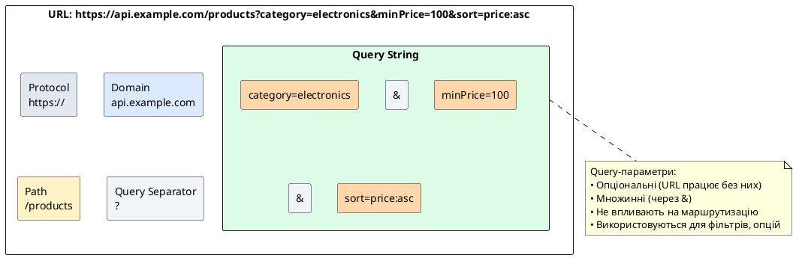
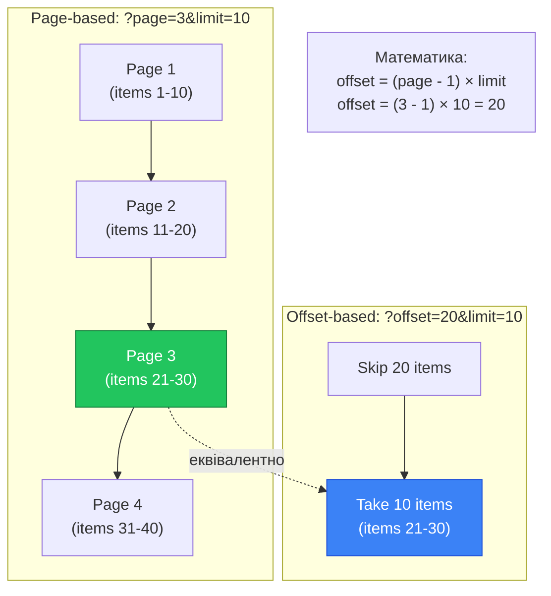

```mermaid
graph TB
    subgraph "Route Parameters (Параметри маршруту)"
        RP1["Частина структури URL<br/>/users/:id"]
        RP2["Обов'язкові для збігу<br/>/users/42"]
        RP3["Ідентифікують ресурс<br/>конкретний користувач"]
        RP4["Витягуються через<br/>@Param декоратор"]
        
        RP1 --> RP2
        RP2 --> RP3
        RP3 --> RP4
    end
    
    subgraph "Query Parameters (Query-параметри)"
        QP1["Додаток до URL<br/>/users?role=admin"]
        QP2["Опціональні<br/>/users працює без них"]
        QP3["Модифікують результат<br/>фільтри, пагінація"]
        QP4["Витягуються через<br/>@Query декоратор"]
        
        QP1 --> QP2
        QP2 --> QP3
        QP3 --> QP4
    end
    
    style RP1 fill:#3b82f6,stroke:#1d4ed8,color:#ffffff
    style RP2 fill:#3b82f6,stroke:#1d4ed8,color:#ffffff
    style RP3 fill:#3b82f6,stroke:#1d4ed8,color:#ffffff
    style RP4 fill:#3b82f6,stroke:#1d4ed8,color:#ffffff
    
    style QP1 fill:#22c55e,stroke:#15803d,color:#ffffff
    style QP2 fill:#22c55e,stroke:#15803d,color:#ffffff
    style QP3 fill:#22c55e,stroke:#15803d,color:#ffffff
    style QP4 fill:#22c55e,stroke:#15803d,color:#ffffff
```

# Query-параметри та декоратор @Query

::card-group

::card{title="🎯 Мета лекції" icon="i-lucide-target"}

- Опанувати використання query-параметрів для передачі додаткових опцій запиту
- Навчитися витягувати query-параметри за допомогою декоратора @Query
- Зрозуміти різницю між параметрами маршруту та query-параметрами
- Вивчити типізацію query-параметрів через Data Transfer Objects (DTO)
- Реалізувати фільтрацію, пагінацію та сортування колекцій
- Практикувати трансформацію та валідацію query-параметрів
- Застосовувати значення за замовчуванням для необов'язкових параметрів

::

::card{title="🔑 Ключові терміни" icon="i-lucide-key"}

- **Query String** (*рядок запиту*): частина URL після символу `?`, що містить пари ключ-значення
- **Query Parameter** (*параметр запиту*): окрема пара ключ-значення у query string
- **Filtering** (*фільтрація*): обмеження результатів запиту за певними критеріями
- **Pagination** (*пагінація*): розбиття великої колекції на сторінки фіксованого розміру
- **Sorting** (*сортування*): упорядкування результатів за одним або кількома полями
- **DTO** (*Data Transfer Object*): об'єкт для передачі даних між шарами застосунку з валідацією

::

::

## Query-параметри: опціональні модифікатори запитів

У попередній лекції ми вивчили параметри маршруту (*route parameters*), які є обов'язковою частиною структури URL і використовуються для ідентифікації конкретних ресурсів. Query-параметри (*query parameters*) мають принципово іншу природу — вони є **опціональними модифікаторами**, що дозволяють клієнту уточнити, як саме сервер має обробити запит.

Query-параметри передаються у так званому **query string** — частині URL після символу питання (`?`). Вони представлені парами ключ-значення, з'єднаними символом `=`, а множинні параметри відокремлюються амперсандом (`&`):

```
https://api.example.com/products?category=electronics&minPrice=100&maxPrice=500&sort=price:asc
                                 └────────────────────────────────────────────────────────┘
                                              Query String (рядок запиту)
```

### Анатомія query string

::plant-uml{alt="Структура URL з query-параметрами"}



::

Кожен query-параметр складається з трьох компонентів:

1. **Ключ** (*key*): ім'я параметра (наприклад, `category`, `page`, `sort`)
2. **Роздільник**: символ `=`
3. **Значення** (*value*): дані параметра (наприклад, `electronics`, `1`, `price:asc`)

::note
Query-параметри є **опціональними** за своєю природою. Маршрут `/products` та `/products?category=electronics` обробляються одним і тим самим обробником. Наявність або відсутність query-параметрів не впливає на маршрутизацію — NestJS знайде правильний обробник на основі шляху, а query-параметри передасть як додаткову інформацію.
::

### Відмінності від параметрів маршруту

Щоб остаточно закріпити різницю між двома типами параметрів:

::mermaid



::

**Параметри маршруту** (`/users/:id`):
- Обов'язкові — без них маршрут не збігається
- Ідентифікують конкретний ресурс
- Частина семантики REST API
- Приклад: `/users/42` — користувач з ID 42

**Query-параметри** (`/users?role=admin`):
- Опціональні — їх відсутність не впливає на маршрутизацію
- Модифікують вибірку або поведінку
- Додаткові опції для одного й того ж ендпоінту
- Приклад: `/users?role=admin&status=active` — фільтрація користувачів

## Декоратор @Query: витягування параметрів запиту

NestJS надає декоратор `@Query()` для доступу до query-параметрів всередині обробника маршруту. Подібно до `@Param()`, цей декоратор має два режими використання: витягування всіх параметрів або окремого параметра за ключем.

### Режим 1: Витягування всіх query-параметрів (@Query())

Коли декоратор використовується без аргументів, він повертає об'єкт з усіма query-параметрами:

```typescript
import { Controller, Get, Query } from '@nestjs/common';

@Controller('products')
export class ProductsController {
  @Get()
  findAll(@Query() query: any) {
    console.log(query);
    // GET /products?category=electronics&minPrice=100
    // → { category: 'electronics', minPrice: '100' }
    
    return {
      filters: query,
      results: [],
    };
  }
}
```

::tip
Завжди типізуйте query-параметри замість використання `any`. Створюйте інтерфейси або класи DTO для документування очікуваних параметрів та забезпечення автодоповнення у IDE.
::

### Режим 2: Витягування окремого параметра (@Query('key'))

Частіше використовується підхід з витягуванням конкретних параметрів за іменем:

```typescript
@Controller('products')
export class ProductsController {
  @Get()
  findAll(
    @Query('category') category: string,
    @Query('minPrice') minPrice: string,
    @Query('maxPrice') maxPrice: string,
  ) {
    return {
      category,
      priceRange: { min: minPrice, max: maxPrice },
    };
  }
}
// GET /products?category=electronics&minPrice=100&maxPrice=500
```

::warning
Усі query-параметри передаються як **рядки** (*strings*), незалежно від їх вигляду в URL. Якщо клієнт надсилає `?page=1`, то `page` буде рядком `"1"`, а не числом `1`. Трансформацію типів необхідно виконувати явно або через pipes.
::

### Необов'язкові параметри та undefined

Оскільки query-параметри є опціональними, їх значення може бути `undefined`, якщо параметр не був переданий у запиті:

```typescript
@Controller('users')
export class UsersController {
  @Get()
  findAll(
    @Query('role') role: string,
    @Query('status') status: string,
  ) {
    console.log({ role, status });
    // GET /users → { role: undefined, status: undefined }
    // GET /users?role=admin → { role: 'admin', status: undefined }
    // GET /users?role=admin&status=active → { role: 'admin', status: 'active' }
    
    return this.usersService.findAll(role, status);
  }
}
```

Це означає, що логіка обробника має коректно обробляти відсутність параметрів:

```typescript
@Get()
findAll(@Query('role') role?: string) {
  if (role) {
    return this.usersService.findByRole(role);
  }
  return this.usersService.findAll();
}
```


## Типізація query-параметрів через DTO

При роботі з багатьма query-параметрами створення окремих аргументів для кожного стає незручним. Натомість рекомендується використовувати **Data Transfer Objects (DTO)** — спеціальні класи, що описують структуру даних з можливістю валідації.

### Базовий DTO для query-параметрів

```typescript
// dto/find-products-query.dto.ts
export class FindProductsQueryDto {
  category?: string;
  minPrice?: number;
  maxPrice?: number;
  inStock?: boolean;
  sort?: string;
}
```

Використання у контролері:

```typescript
import { Controller, Get, Query } from '@nestjs/common';
import { FindProductsQueryDto } from './dto/find-products-query.dto';

@Controller('products')
export class ProductsController {
  @Get()
  findAll(@Query() query: FindProductsQueryDto) {
    // TypeScript знає про всі властивості query
    return this.productsService.findAll({
      category: query.category,
      priceRange: {
        min: query.minPrice,
        max: query.maxPrice,
      },
      inStock: query.inStock,
      sort: query.sort,
    });
  }
}
```

### DTO з валідацією через class-validator

Для автоматичної валідації та трансформації використовуйте бібліотеки `class-validator` та `class-transformer`:

```typescript
import { IsOptional, IsInt, Min, Max, IsBoolean, IsIn } from 'class-validator';
import { Type } from 'class-transformer';

export class FindProductsQueryDto {
  @IsOptional()
  @IsIn(['electronics', 'clothing', 'books', 'food'])
  category?: string;

  @IsOptional()
  @Type(() => Number) // Трансформує рядок у число
  @IsInt()
  @Min(0)
  minPrice?: number;

  @IsOptional()
  @Type(() => Number)
  @IsInt()
  @Min(0)
  maxPrice?: number;

  @IsOptional()
  @Type(() => Boolean) // Трансформує "true"/"false" у boolean
  @IsBoolean()
  inStock?: boolean;

  @IsOptional()
  @IsIn(['price:asc', 'price:desc', 'name:asc', 'name:desc'])
  sort?: string;
}
```

Щоб увімкнути автоматичну валідацію, додайте `ValidationPipe` глобально у `main.ts`:

```typescript
// main.ts
import { ValidationPipe } from '@nestjs/common';

async function bootstrap() {
  const app = await NestFactory.create(AppModule);
  
  app.useGlobalPipes(
    new ValidationPipe({
      transform: true, // Автоматична трансформація типів
      whitelist: true, // Видалення невідомих полів
      forbidNonWhitelisted: false, // Не кидати помилку для невідомих полів
    }),
  );
  
  await app.listen(3000);
}
```

Тепер валідація працює автоматично:

::terminal-preview{title="Валідація query-параметрів" :cursor="false"}

<div class="line"><span class="opacity-40">#</span> <strong class="font-bold">Коректний запит</strong></div>
<div class="line"><span class="opacity-40">$</span> curl "http://localhost:3000/products?category=electronics&minPrice=100&inStock=true"</div>
<div class="line"><span class="text-green-400 font-bold">HTTP/1.1 200 OK</span></div>
<div class="line">{ <span class="text-blue-400">"results"</span>: [...] }</div>
<div class="line"></div>
<div class="line"><span class="opacity-40">#</span> <strong class="font-bold">Некоректна категорія</strong></div>
<div class="line"><span class="opacity-40">$</span> curl "http://localhost:3000/products?category=invalid"</div>
<div class="line"><span class="text-rose-400 font-bold">HTTP/1.1 400 Bad Request</span></div>
<div class="line">{</div>
<div class="line">  <span class="text-blue-400">"statusCode"</span>: <span class="text-yellow-400">400</span>,</div>
<div class="line">  <span class="text-blue-400">"message"</span>: [<span class="text-green-400">"category must be one of: electronics, clothing, books, food"</span>],</div>
<div class="line">  <span class="text-blue-400">"error"</span>: <span class="text-green-400">"Bad Request"</span></div>
<div class="line">}</div>
<div class="line"></div>
<div class="line"><span class="opacity-40">#</span> <strong class="font-bold">Некоректна ціна</strong></div>
<div class="line"><span class="opacity-40">$</span> curl "http://localhost:3000/products?minPrice=-50"</div>
<div class="line"><span class="text-rose-400 font-bold">HTTP/1.1 400 Bad Request</span></div>
<div class="line">{</div>
<div class="line">  <span class="text-blue-400">"message"</span>: [<span class="text-green-400">"minPrice must not be less than 0"</span>]</div>
<div class="line">}</div>

::

::tip
Використання DTO з валідацією дозволяє:
- **Документувати** очікувані параметри безпосередньо у коді
- **Валідувати** дані автоматично без ручних перевірок
- **Трансформувати** рядки у потрібні типи (числа, булеві значення)
- **Генерувати** Swagger-документацію автоматично (через `@nestjs/swagger`)
::

### Значення за замовчуванням у DTO

Для параметрів, що мають стандартні значення, встановіть їх безпосередньо у класі:

```typescript
import { IsOptional, IsInt, Min } from 'class-validator';
import { Type } from 'class-transformer';

export class PaginationQueryDto {
  @IsOptional()
  @Type(() => Number)
  @IsInt()
  @Min(1)
  page: number = 1; // За замовчуванням сторінка 1

  @IsOptional()
  @Type(() => Number)
  @IsInt()
  @Min(1)
  @Max(100)
  limit: number = 10; // За замовчуванням 10 елементів
}
```

Тепер якщо клієнт не передає параметри, будуть використані значення за замовчуванням:

```typescript
@Get()
findAll(@Query() query: PaginationQueryDto) {
  // GET /products → { page: 1, limit: 10 }
  // GET /products?page=2 → { page: 2, limit: 10 }
  // GET /products?page=3&limit=25 → { page: 3, limit: 25 }
  
  return this.productsService.findPaginated(query.page, query.limit);
}
```

## Фільтрація: обмеження результатів за критеріями

Одним з найпоширеніших застосувань query-параметрів є **фільтрація** (*filtering*) — обмеження результатів запиту на основі певних критеріїв. Клієнт вказує умови, а сервер повертає лише ті записи, що відповідають цим умовам.

### Проста фільтрація за одним полем

```typescript
// dto/find-users-query.dto.ts
import { IsOptional, IsIn } from 'class-validator';

export class FindUsersQueryDto {
  @IsOptional()
  @IsIn(['admin', 'user', 'moderator'])
  role?: string;

  @IsOptional()
  @IsIn(['active', 'inactive', 'banned'])
  status?: string;
}
```

Контролер:

```typescript
@Controller('users')
export class UsersController {
  constructor(private readonly usersService: UsersService) {}

  @Get()
  async findAll(@Query() query: FindUsersQueryDto) {
    return this.usersService.findAll({
      role: query.role,
      status: query.status,
    });
  }
}
// GET /users?role=admin → Тільки адміністратори
// GET /users?status=active → Тільки активні користувачі
// GET /users?role=admin&status=active → Активні адміністратори
```

Реалізація у сервісі (приклад з TypeORM):

```typescript
// users.service.ts
import { Injectable } from '@nestjs/common';
import { InjectRepository } from '@nestjs/typeorm';
import { Repository } from 'typeorm';
import { User } from './entities/user.entity';

@Injectable()
export class UsersService {
  constructor(
    @InjectRepository(User)
    private readonly userRepository: Repository<User>,
  ) {}

  async findAll(filters: { role?: string; status?: string }) {
    const queryBuilder = this.userRepository.createQueryBuilder('user');

    // Додаємо умови фільтрації, якщо параметри передані
    if (filters.role) {
      queryBuilder.andWhere('user.role = :role', { role: filters.role });
    }

    if (filters.status) {
      queryBuilder.andWhere('user.status = :status', { status: filters.status });
    }

    return queryBuilder.getMany();
  }
}
```

### Діапазони значень: min/max фільтри

Для числових полів часто потрібна фільтрація за діапазоном:

```typescript
// dto/find-products-query.dto.ts
import { IsOptional, IsInt, Min } from 'class-validator';
import { Type } from 'class-transformer';

export class FindProductsQueryDto {
  @IsOptional()
  @Type(() => Number)
  @IsInt()
  @Min(0)
  minPrice?: number;

  @IsOptional()
  @Type(() => Number)
  @IsInt()
  @Min(0)
  maxPrice?: number;

  @IsOptional()
  @Type(() => Number)
  @IsInt()
  @Min(0)
  minStock?: number;
}
```

Контролер та сервіс:

```typescript
@Controller('products')
export class ProductsController {
  @Get()
  async findAll(@Query() query: FindProductsQueryDto) {
    return this.productsService.findAll(query);
  }
}

// products.service.ts
async findAll(filters: FindProductsQueryDto) {
  const queryBuilder = this.productRepository.createQueryBuilder('product');

  if (filters.minPrice !== undefined) {
    queryBuilder.andWhere('product.price >= :minPrice', { 
      minPrice: filters.minPrice 
    });
  }

  if (filters.maxPrice !== undefined) {
    queryBuilder.andWhere('product.price <= :maxPrice', { 
      maxPrice: filters.maxPrice 
    });
  }

  if (filters.minStock !== undefined) {
    queryBuilder.andWhere('product.stock >= :minStock', { 
      minStock: filters.minStock 
    });
  }

  return queryBuilder.getMany();
}
```

Приклади використання:

```
GET /products?minPrice=100&maxPrice=500  → Продукти від 100 до 500
GET /products?minPrice=1000              → Продукти від 1000 і вище
GET /products?minStock=10                → Продукти з запасом не менше 10
```

### Множинні значення для одного параметра

Іноді потрібно дозволити вибір кількох значень для одного фільтра. Наприклад, `?tags=nodejs,typescript,nestjs`:

```typescript
// dto/find-articles-query.dto.ts
import { IsOptional, IsString } from 'class-validator';
import { Transform } from 'class-transformer';

export class FindArticlesQueryDto {
  @IsOptional()
  @IsString({ each: true }) // Валідація кожного елемента масиву
  @Transform(({ value }) => {
    // Трансформуємо рядок "tag1,tag2,tag3" у масив ['tag1', 'tag2', 'tag3']
    if (typeof value === 'string') {
      return value.split(',').map(tag => tag.trim());
    }
    return value;
  })
  tags?: string[];
}
```

Використання:

```typescript
@Get('articles')
async findArticles(@Query() query: FindArticlesQueryDto) {
  // GET /articles?tags=nodejs,typescript,nestjs
  // query.tags → ['nodejs', 'typescript', 'nestjs']
  
  return this.articlesService.findByTags(query.tags);
}
```

У сервісі (приклад з TypeORM):

```typescript
async findByTags(tags?: string[]) {
  if (!tags || tags.length === 0) {
    return this.articleRepository.find();
  }

  return this.articleRepository
    .createQueryBuilder('article')
    .where('article.tags && ARRAY[:...tags]', { tags }) // PostgreSQL array overlap
    .getMany();
}
```


## Пагінація: розбиття великих колекцій на сторінки

**Пагінація** (*pagination*) є критично важливою для API, що працюють з великими наборами даних. Замість повернення тисяч записів в одному запиті, сервер розбиває результати на сторінки фіксованого розміру, що зменшує навантаження на мережу, пам'ять та час відповіді.

### Два основних підходи до пагінації

Існують два популярних способи реалізації пагінації через query-параметри:

**1. Page-based pagination** (*пагінація на основі сторінок*):
- Параметри: `page` (номер сторінки) та `limit` (розмір сторінки)
- Приклад: `?page=2&limit=20` — друга сторінка по 20 елементів
- Інтуїтивний для користувачів, простий у реалізації

**2. Offset-based pagination** (*пагінація на основі зміщення*):
- Параметри: `offset` (кількість пропущених елементів) та `limit` (розмір вибірки)
- Приклад: `?offset=40&limit=20` — пропустити 40, взяти 20
- Більш гнучкий, використовується у SQL (`LIMIT ... OFFSET ...`)

::mermaid



::

### Реалізація page-based пагінації

DTO для пагінації:

```typescript
// dto/pagination-query.dto.ts
import { IsOptional, IsInt, Min, Max } from 'class-validator';
import { Type } from 'class-transformer';

export class PaginationQueryDto {
  @IsOptional()
  @Type(() => Number)
  @IsInt()
  @Min(1)
  page: number = 1;

  @IsOptional()
  @Type(() => Number)
  @IsInt()
  @Min(1)
  @Max(100) // Обмеження максимального розміру сторінки
  limit: number = 10;
}
```

Контролер:

```typescript
@Controller('users')
export class UsersController {
  @Get()
  async findAll(@Query() pagination: PaginationQueryDto) {
    return this.usersService.findPaginated(
      pagination.page,
      pagination.limit,
    );
  }
}
```

Сервіс з TypeORM:

```typescript
// users.service.ts
import { Injectable } from '@nestjs/common';
import { InjectRepository } from '@nestjs/typeorm';
import { Repository } from 'typeorm';
import { User } from './entities/user.entity';

@Injectable()
export class UsersService {
  constructor(
    @InjectRepository(User)
    private readonly userRepository: Repository<User>,
  ) {}

  async findPaginated(page: number, limit: number) {
    // Розрахунок offset з page
    const offset = (page - 1) * limit;

    // Отримання даних та підрахунок загальної кількості
    const [items, total] = await this.userRepository.findAndCount({
      skip: offset,
      take: limit,
      order: { createdAt: 'DESC' },
    });

    // Розрахунок метаданих пагінації
    const totalPages = Math.ceil(total / limit);
    const hasNextPage = page < totalPages;
    const hasPreviousPage = page > 1;

    return {
      items,
      meta: {
        total,
        page,
        limit,
        totalPages,
        hasNextPage,
        hasPreviousPage,
      },
    };
  }
}
```

Приклад відповіді:

::terminal-preview{title="GET /users?page=2&limit=5" :cursor="false"}

<div class="line"><span class="opacity-40">$</span> <strong class="font-bold">curl "http://localhost:3000/users?page=2&limit=5"</strong></div>
<div class="line"></div>
<div class="line"><span class="text-green-400 font-bold">HTTP/1.1 200 OK</span></div>
<div class="line">{</div>
<div class="line">  <span class="text-blue-400">"items"</span>: [</div>
<div class="line">    { <span class="text-blue-400">"id"</span>: 6, <span class="text-blue-400">"name"</span>: <span class="text-green-400">"Alice"</span> },</div>
<div class="line">    { <span class="text-blue-400">"id"</span>: 7, <span class="text-blue-400">"name"</span>: <span class="text-green-400">"Bob"</span> },</div>
<div class="line">    { <span class="text-blue-400">"id"</span>: 8, <span class="text-blue-400">"name"</span>: <span class="text-green-400">"Charlie"</span> },</div>
<div class="line">    { <span class="text-blue-400">"id"</span>: 9, <span class="text-blue-400">"name"</span>: <span class="text-green-400">"Diana"</span> },</div>
<div class="line">    { <span class="text-blue-400">"id"</span>: 10, <span class="text-blue-400">"name"</span>: <span class="text-green-400">"Eve"</span> }</div>
<div class="line">  ],</div>
<div class="line">  <span class="text-blue-400">"meta"</span>: {</div>
<div class="line">    <span class="text-blue-400">"total"</span>: <span class="text-yellow-400">42</span>,</div>
<div class="line">    <span class="text-blue-400">"page"</span>: <span class="text-yellow-400">2</span>,</div>
<div class="line">    <span class="text-blue-400">"limit"</span>: <span class="text-yellow-400">5</span>,</div>
<div class="line">    <span class="text-blue-400">"totalPages"</span>: <span class="text-yellow-400">9</span>,</div>
<div class="line">    <span class="text-blue-400">"hasNextPage"</span>: <span class="text-yellow-400">true</span>,</div>
<div class="line">    <span class="text-blue-400">"hasPreviousPage"</span>: <span class="text-yellow-400">true</span></div>
<div class="line">  }</div>
<div class="line">}</div>

::

::tip
Завжди повертайте метадані пагінації разом з даними. Клієнту потрібно знати:
- `total` — загальна кількість елементів
- `totalPages` — загальна кількість сторінок
- `hasNextPage` / `hasPreviousPage` — чи є наступна/попередня сторінка
- `page` / `limit` — поточна сторінка та розмір

Це дозволяє клієнту побудувати навігацію по сторінках.
::

### Cursor-based pagination для великих датасетів

Для дуже великих наборів даних (мільйони записів) offset-based пагінація стає неефективною, оскільки база даних має пропустити всі попередні записи. **Cursor-based pagination** (*пагінація на основі курсора*) вирішує цю проблему, використовуючи унікальний ідентифікатор останнього елемента як точку відліку:

```typescript
// dto/cursor-pagination-query.dto.ts
export class CursorPaginationQueryDto {
  @IsOptional()
  @Type(() => Number)
  @IsInt()
  cursor?: number; // ID останнього елемента попередньої сторінки

  @IsOptional()
  @Type(() => Number)
  @IsInt()
  @Min(1)
  @Max(100)
  limit: number = 20;
}
```

Реалізація у сервісі:

```typescript
async findPaginatedByCursor(cursor?: number, limit: number = 20) {
  const queryBuilder = this.userRepository
    .createQueryBuilder('user')
    .orderBy('user.id', 'ASC')
    .take(limit + 1); // Беремо +1 для перевірки наявності наступної сторінки

  if (cursor) {
    // Беремо записи після курсора
    queryBuilder.where('user.id > :cursor', { cursor });
  }

  const items = await queryBuilder.getMany();
  const hasNextPage = items.length > limit;

  // Видаляємо зайвий елемент
  if (hasNextPage) {
    items.pop();
  }

  return {
    items,
    meta: {
      nextCursor: hasNextPage ? items[items.length - 1].id : null,
      hasNextPage,
      limit,
    },
  };
}
```

Використання:

```
GET /users?limit=20                → Перша сторінка
GET /users?cursor=20&limit=20      → Наступна сторінка після ID=20
GET /users?cursor=40&limit=20      → Ще одна сторінка після ID=40
```

## Сортування: впорядкування результатів

**Сортування** (*sorting*) дозволяє клієнту контролювати порядок елементів у відповіді. Query-параметр `sort` зазвичай вказує поле та напрямок сортування.

### Формати параметра sort

Існує кілька поширених конвенцій для сортування:

**1. Поле з префіксом напрямку**:
```
?sort=price:asc   → Сортування за ціною за зростанням
?sort=price:desc  → Сортування за ціною за спаданням
?sort=name:asc    → Сортування за назвою (алфавіт)
```

**2. Мінус для спадання**:
```
?sort=price       → За зростанням
?sort=-price      → За спаданням
```

**3. Окремі параметри**:
```
?sortBy=price&order=asc
?sortBy=createdAt&order=desc
```

Розглянемо реалізацію першого підходу як найбільш поширеного:

### Реалізація сортування

DTO для сортування:

```typescript
// dto/find-products-query.dto.ts
import { IsOptional, IsIn, Matches } from 'class-validator';

export class FindProductsQueryDto {
  @IsOptional()
  @Matches(/^(name|price|createdAt|stock):(asc|desc)$/, {
    message: 'sort must be in format "field:direction", e.g. "price:asc"',
  })
  sort?: string;
}
```

Парсинг параметра сортування:

```typescript
// utils/parse-sort.util.ts
export interface SortOptions {
  field: string;
  order: 'ASC' | 'DESC';
}

export function parseSortParam(sort?: string): SortOptions {
  if (!sort) {
    // Сортування за замовчуванням
    return { field: 'createdAt', order: 'DESC' };
  }

  const [field, direction] = sort.split(':');
  const order = direction?.toUpperCase() === 'DESC' ? 'DESC' : 'ASC';

  return { field, order };
}
```

Використання у сервісі:

```typescript
// products.service.ts
async findAll(query: FindProductsQueryDto) {
  const sort = parseSortParam(query.sort);

  return this.productRepository.find({
    order: {
      [sort.field]: sort.order,
    },
  });
}

// Або з QueryBuilder:
async findAll(query: FindProductsQueryDto) {
  const sort = parseSortParam(query.sort);

  return this.productRepository
    .createQueryBuilder('product')
    .orderBy(`product.${sort.field}`, sort.order)
    .getMany();
}
```

### Множинне сортування

Для сортування за кількома полями одночасно:

```typescript
// dto/find-products-query.dto.ts
export class FindProductsQueryDto {
  @IsOptional()
  @IsString({ each: true })
  @Transform(({ value }) => {
    if (typeof value === 'string') {
      return value.split(',');
    }
    return value;
  })
  sort?: string[];
}
```

Використання:

```
GET /products?sort=category:asc,price:desc,name:asc
→ Сортувати за категорією ↑, потім за ціною ↓, потім за назвою ↑
```

Парсинг:

```typescript
function parseMultipleSort(sort?: string[]): SortOptions[] {
  if (!sort || sort.length === 0) {
    return [{ field: 'createdAt', order: 'DESC' }];
  }

  return sort.map(s => {
    const [field, direction] = s.split(':');
    return {
      field,
      order: direction?.toUpperCase() === 'DESC' ? 'DESC' : 'ASC',
    };
  });
}
```

Застосування у QueryBuilder:

```typescript
async findAll(query: FindProductsQueryDto) {
  const sortOptions = parseMultipleSort(query.sort);
  const queryBuilder = this.productRepository.createQueryBuilder('product');

  // Додаємо кожне правило сортування
  sortOptions.forEach((sort, index) => {
    if (index === 0) {
      queryBuilder.orderBy(`product.${sort.field}`, sort.order);
    } else {
      queryBuilder.addOrderBy(`product.${sort.field}`, sort.order);
    }
  });

  return queryBuilder.getMany();
}
```


## Пошук: текстовий запит через query-параметр

**Пошук** (*search*) є ще одним поширеним застосуванням query-параметрів. Клієнт передає ключове слово або фразу, а сервер шукає відповідні записи у одному або кількох полях.

### Базовий текстовий пошук

```typescript
// dto/search-products-query.dto.ts
import { IsOptional, IsString, MinLength, MaxLength } from 'class-validator';

export class SearchProductsQueryDto {
  @IsOptional()
  @IsString()
  @MinLength(2, { message: 'Search query must be at least 2 characters' })
  @MaxLength(100)
  search?: string;
}
```

Контролер:

```typescript
@Controller('products')
export class ProductsController {
  @Get()
  async search(@Query() query: SearchProductsQueryDto) {
    if (query.search) {
      return this.productsService.search(query.search);
    }
    return this.productsService.findAll();
  }
}
```

Реалізація пошуку у сервісі (TypeORM з PostgreSQL):

```typescript
// products.service.ts
async search(searchTerm: string) {
  return this.productRepository
    .createQueryBuilder('product')
    .where(
      'product.name ILIKE :search OR product.description ILIKE :search',
      { search: `%${searchTerm}%` }
    )
    .getMany();
}
```

::note
`ILIKE` — це case-insensitive оператор пошуку у PostgreSQL. Для MySQL використовуйте `LIKE`, оскільки він за замовчуванням нечутливий до регістру. Для SQLite використовуйте `LIKE` з `COLLATE NOCASE`.
::

### Full-Text Search (повнотекстовий пошук)

Для складніших сценаріїв пошуку використовуйте можливості повнотекстового пошуку бази даних:

```typescript
// PostgreSQL Full-Text Search
async fullTextSearch(searchTerm: string) {
  return this.productRepository
    .createQueryBuilder('product')
    .where(
      `to_tsvector('english', product.name || ' ' || product.description) @@ plainto_tsquery('english', :search)`,
      { search: searchTerm }
    )
    .orderBy(
      `ts_rank(to_tsvector('english', product.name || ' ' || product.description), plainto_tsquery('english', :search))`,
      'DESC'
    )
    .setParameter('search', searchTerm)
    .getMany();
}
```

::tip
Для продуктивного повнотекстового пошуку створіть спеціалізовані індекси у базі даних:
- **PostgreSQL**: GIN індекси на `tsvector` стовпцях
- **MySQL**: FULLTEXT індекси
- **Elasticsearch**: для дуже складних сценаріїв пошуку

Також розгляньте використання спеціалізованих рішень типу Elasticsearch, Algolia або MeiliSearch для великих обсягів даних та складних вимог до пошуку.
::

## Комплексний приклад: фільтрація + пагінація + сортування + пошук

Реальні API зазвичай комбінують усі описані функції в одному ендпоінті. Розглянемо повноцінний приклад:

### Універсальний DTO для запитів

```typescript
// dto/find-products-query.dto.ts
import { IsOptional, IsString, IsInt, Min, Max, IsIn, Matches, MinLength } from 'class-validator';
import { Type, Transform } from 'class-transformer';

export class FindProductsQueryDto {
  // Пошук
  @IsOptional()
  @IsString()
  @MinLength(2)
  search?: string;

  // Фільтрація
  @IsOptional()
  @IsIn(['electronics', 'clothing', 'books', 'food', 'home'])
  category?: string;

  @IsOptional()
  @Type(() => Number)
  @IsInt()
  @Min(0)
  minPrice?: number;

  @IsOptional()
  @Type(() => Number)
  @IsInt()
  @Min(0)
  maxPrice?: number;

  @IsOptional()
  @Type(() => Boolean)
  inStock?: boolean;

  @IsOptional()
  @IsString({ each: true })
  @Transform(({ value }) => typeof value === 'string' ? value.split(',') : value)
  tags?: string[];

  // Пагінація
  @IsOptional()
  @Type(() => Number)
  @IsInt()
  @Min(1)
  page: number = 1;

  @IsOptional()
  @Type(() => Number)
  @IsInt()
  @Min(1)
  @Max(100)
  limit: number = 10;

  // Сортування
  @IsOptional()
  @Matches(/^(name|price|createdAt|stock):(asc|desc)$/)
  sort?: string;
}
```

### Контролер

```typescript
import { Controller, Get, Query } from '@nestjs/common';
import { ProductsService } from './products.service';
import { FindProductsQueryDto } from './dto/find-products-query.dto';

@Controller('products')
export class ProductsController {
  constructor(private readonly productsService: ProductsService) {}

  @Get()
  async findAll(@Query() query: FindProductsQueryDto) {
    return this.productsService.findAll(query);
  }
}
```

### Сервіс з повною логікою

```typescript
// products.service.ts
import { Injectable } from '@nestjs/common';
import { InjectRepository } from '@nestjs/typeorm';
import { Repository } from 'typeorm';
import { Product } from './entities/product.entity';
import { FindProductsQueryDto } from './dto/find-products-query.dto';

@Injectable()
export class ProductsService {
  constructor(
    @InjectRepository(Product)
    private readonly productRepository: Repository<Product>,
  ) {}

  async findAll(query: FindProductsQueryDto) {
    const queryBuilder = this.productRepository.createQueryBuilder('product');

    // 1. ПОШУК
    if (query.search) {
      queryBuilder.andWhere(
        '(product.name ILIKE :search OR product.description ILIKE :search)',
        { search: `%${query.search}%` }
      );
    }

    // 2. ФІЛЬТРАЦІЯ
    if (query.category) {
      queryBuilder.andWhere('product.category = :category', {
        category: query.category,
      });
    }

    if (query.minPrice !== undefined) {
      queryBuilder.andWhere('product.price >= :minPrice', {
        minPrice: query.minPrice,
      });
    }

    if (query.maxPrice !== undefined) {
      queryBuilder.andWhere('product.price <= :maxPrice', {
        maxPrice: query.maxPrice,
      });
    }

    if (query.inStock !== undefined) {
      if (query.inStock) {
        queryBuilder.andWhere('product.stock > 0');
      } else {
        queryBuilder.andWhere('product.stock = 0');
      }
    }

    if (query.tags && query.tags.length > 0) {
      queryBuilder.andWhere('product.tags && ARRAY[:...tags]', {
        tags: query.tags,
      });
    }

    // 3. СОРТУВАННЯ
    const [sortField, sortOrder] = query.sort?.split(':') || ['createdAt', 'desc'];
    queryBuilder.orderBy(
      `product.${sortField}`,
      sortOrder.toUpperCase() as 'ASC' | 'DESC',
    );

    // 4. ПАГІНАЦІЯ
    const offset = (query.page - 1) * query.limit;
    queryBuilder.skip(offset).take(query.limit);

    // 5. ВИКОНАННЯ ЗАПИТУ
    const [items, total] = await queryBuilder.getManyAndCount();

    // 6. ФОРМУВАННЯ ВІДПОВІДІ
    return {
      items,
      meta: {
        total,
        page: query.page,
        limit: query.limit,
        totalPages: Math.ceil(total / query.limit),
        hasNextPage: query.page < Math.ceil(total / query.limit),
        hasPreviousPage: query.page > 1,
      },
    };
  }
}
```

### Приклади використання

::code-group

```bash [Базовий запит]
curl "http://localhost:3000/products"
# Повертає першу сторінку (10 елементів), сортування за createdAt:desc
```

```bash [Пошук]
curl "http://localhost:3000/products?search=laptop"
# Шукає "laptop" у назві та описі
```

```bash [Фільтрація]
curl "http://localhost:3000/products?category=electronics&minPrice=500&maxPrice=2000&inStock=true"
# Електроніка від $500 до $2000, що є в наявності
```

```bash [Пагінація]
curl "http://localhost:3000/products?page=3&limit=25"
# Третя сторінка, по 25 елементів
```

```bash [Сортування]
curl "http://localhost:3000/products?sort=price:asc"
# Сортування за ціною за зростанням
```

```bash [Комплексний запит]
curl "http://localhost:3000/products?search=wireless&category=electronics&minPrice=50&maxPrice=200&tags=bluetooth,portable&inStock=true&page=2&limit=20&sort=price:asc"
# Пошук "wireless" у електроніці від $50 до $200 з тегами bluetooth і portable,
# що є в наявності, друга сторінка по 20, сортування за ціною ↑
```

::

::terminal-preview{title="Комплексний запит з усіма параметрами" :cursor="false"}

<div class="line"><span class="opacity-40">$</span> <strong class="font-bold">curl "localhost:3000/products?category=electronics&minPrice=100&page=1&limit=5&sort=price:asc"</strong></div>
<div class="line"></div>
<div class="line"><span class="text-green-400 font-bold">HTTP/1.1 200 OK</span></div>
<div class="line">{</div>
<div class="line">  <span class="text-blue-400">"items"</span>: [</div>
<div class="line">    { <span class="text-blue-400">"id"</span>: 5, <span class="text-blue-400">"name"</span>: <span class="text-green-400">"USB Cable"</span>, <span class="text-blue-400">"price"</span>: <span class="text-yellow-400">120</span> },</div>
<div class="line">    { <span class="text-blue-400">"id"</span>: 12, <span class="text-blue-400">"name"</span>: <span class="text-green-400">"Wireless Mouse"</span>, <span class="text-blue-400">"price"</span>: <span class="text-yellow-400">250</span> },</div>
<div class="line">    { <span class="text-blue-400">"id"</span>: 8, <span class="text-blue-400">"name"</span>: <span class="text-green-400">"Keyboard"</span>, <span class="text-blue-400">"price"</span>: <span class="text-yellow-400">450</span> },</div>
<div class="line">    { <span class="text-blue-400">"id"</span>: 3, <span class="text-blue-400">"name"</span>: <span class="text-green-400">"Webcam HD"</span>, <span class="text-blue-400">"price"</span>: <span class="text-yellow-400">890</span> },</div>
<div class="line">    { <span class="text-blue-400">"id"</span>: 15, <span class="text-blue-400">"name"</span>: <span class="text-green-400">"Headphones"</span>, <span class="text-blue-400">"price"</span>: <span class="text-yellow-400">1200</span> }</div>
<div class="line">  ],</div>
<div class="line">  <span class="text-blue-400">"meta"</span>: {</div>
<div class="line">    <span class="text-blue-400">"total"</span>: <span class="text-yellow-400">23</span>,</div>
<div class="line">    <span class="text-blue-400">"page"</span>: <span class="text-yellow-400">1</span>,</div>
<div class="line">    <span class="text-blue-400">"limit"</span>: <span class="text-yellow-400">5</span>,</div>
<div class="line">    <span class="text-blue-400">"totalPages"</span>: <span class="text-yellow-400">5</span>,</div>
<div class="line">    <span class="text-blue-400">"hasNextPage"</span>: <span class="text-yellow-400">true</span>,</div>
<div class="line">    <span class="text-blue-400">"hasPreviousPage"</span>: <span class="text-yellow-400">false</span></div>
<div class="line">  }</div>
<div class="line">}</div>

::


## Трансформація та валідація через DefaultValuePipe

Іноді потрібно встановити значення за замовчуванням для окремого параметра без створення повного DTO. Для цього NestJS надає `DefaultValuePipe`:

```typescript
import { Controller, Get, Query, DefaultValuePipe, ParseIntPipe } from '@nestjs/common';

@Controller('products')
export class ProductsController {
  @Get()
  async findAll(
    @Query('page', new DefaultValuePipe(1), ParseIntPipe) page: number,
    @Query('limit', new DefaultValuePipe(10), ParseIntPipe) limit: number,
  ) {
    // Якщо параметри не передані, використовуються значення за замовчуванням
    // GET /products → page = 1, limit = 10
    // GET /products?page=3 → page = 3, limit = 10
    
    return this.productsService.findPaginated(page, limit);
  }
}
```

Pipes можна комбінувати у ланцюжок:
1. `DefaultValuePipe` встановлює значення, якщо параметр відсутній
2. `ParseIntPipe` перетворює рядок у число

::note
`DefaultValuePipe` корисний для простих сценаріїв, але для складніших API рекомендується використовувати DTO з валідацією через `class-validator`, оскільки це забезпечує кращу типізацію, документацію та централізацію логіки валідації.
::

## URL Encoding: обробка спеціальних символів

Query-параметри передаються як частина URL, тому спеціальні символи (пробіли, амперсанди, знаки питання тощо) мають бути закодовані (*URL-encoded* або *percent-encoded*).

### Автоматичне декодування

NestJS автоматично декодує query-параметри, тому у більшості випадків вам не потрібно виконувати додаткових операцій:

```typescript
@Get()
findAll(@Query('search') search: string) {
  // Клієнт надсилає: ?search=hello%20world
  // NestJS декодує автоматично: search = "hello world"
  
  console.log(search); // "hello world"
}
```

### Поширені кодування

::code-group

```typescript [Пробіли]
// URL: ?search=hello%20world
// або: ?search=hello+world (застарілий формат)
// Результат: "hello world"
```

```typescript [Спеціальні символи]
// URL: ?email=user%40example.com
// Результат: "user@example.com"

// URL: ?url=https%3A%2F%2Fexample.com%2Fpath
// Результат: "https://example.com/path"
```

```typescript [Кирилиця]
// URL: ?name=%D0%9F%D1%80%D0%B8%D0%B2%D1%96%D1%82
// Результат: "Привіт"
```

::

::tip
При формуванні URL на клієнті використовуйте вбудовані функції для кодування:
- **JavaScript**: `encodeURIComponent(value)`
- **HTTP-клієнти** (Axios, Fetch): автоматично кодують параметри
- **Браузер**: автоматично кодує при введенні в адресний рядок

Ніколи не створюйте URL вручну через конкатенацію рядків!
::

## Best Practices: рекомендації роботи з query-параметрами

Підсумуємо найкращі практики для створення якісних API з query-параметрами:

### 1. Використовуйте DTO для типізації та валідації

::code-group

```typescript [❌ Погано: Без типізації]
@Get()
findAll(@Query() query: any) {
  const page = parseInt(query.page);
  const limit = parseInt(query.limit);
  // Відсутність валідації, погана документація
}
```

```typescript [✅ Добре: DTO з валідацією]
export class PaginationQueryDto {
  @IsOptional()
  @Type(() => Number)
  @IsInt()
  @Min(1)
  page: number = 1;

  @IsOptional()
  @Type(() => Number)
  @IsInt()
  @Min(1)
  @Max(100)
  limit: number = 10;
}

@Get()
findAll(@Query() query: PaginationQueryDto) {
  // Автоматична валідація та трансформація
}
```

::

### 2. Встановлюйте розумні значення за замовчуванням

```typescript
export class FindProductsQueryDto {
  page: number = 1;           // Перша сторінка за замовчуванням
  limit: number = 10;         // 10 елементів за замовчуванням
  sort: string = 'createdAt:desc'; // Нові спочатку
}
```

### 3. Обмежуйте максимальні значення

```typescript
export class PaginationQueryDto {
  @Max(100, { message: 'Maximum limit is 100 items per page' })
  limit: number = 10;
  
  // Запобігає зловживанням типу ?limit=1000000
}
```

### 4. Документуйте параметри через Swagger

```typescript
import { ApiQuery } from '@nestjs/swagger';

@Controller('products')
export class ProductsController {
  @Get()
  @ApiQuery({ name: 'category', required: false, enum: ['electronics', 'clothing'] })
  @ApiQuery({ name: 'minPrice', required: false, type: Number })
  @ApiQuery({ name: 'page', required: false, type: Number, example: 1 })
  @ApiQuery({ name: 'limit', required: false, type: Number, example: 10 })
  findAll(@Query() query: FindProductsQueryDto) {
    return this.productsService.findAll(query);
  }
}
```

### 5. Використовуйте стандартні конвенції

**Пагінація**: `page` та `limit` (або `offset` та `limit`)
**Сортування**: `sort=field:direction` (наприклад, `sort=price:asc`)
**Пошук**: `search` або `q`
**Фільтрація**: назви полів напряму (`category=electronics`, `status=active`)

### 6. Повертайте метадані для пагінації

```typescript
{
  "items": [...],
  "meta": {
    "total": 100,
    "page": 2,
    "limit": 10,
    "totalPages": 10,
    "hasNextPage": true,
    "hasPreviousPage": true
  }
}
```

### 7. Валідуйте enum-значення

::code-group

```typescript [❌ Погано: Без валідації]
@Get()
findAll(@Query('category') category: string) {
  // Клієнт може надіслати будь-яке значення
}
```

```typescript [✅ Добре: Валідація enum]
export class FindProductsQueryDto {
  @IsOptional()
  @IsIn(['electronics', 'clothing', 'books'])
  category?: string;
}
```

::

### 8. Обробляйте помилки валідації gracefully

```typescript
// main.ts
app.useGlobalPipes(
  new ValidationPipe({
    transform: true,
    whitelist: true,
    forbidNonWhitelisted: false, // Не кидати помилку для невідомих полів
    exceptionFactory: (errors) => {
      // Кастомізація повідомлень про помилки
      const messages = errors.map(error => ({
        field: error.property,
        errors: Object.values(error.constraints || {}),
      }));
      return new BadRequestException({
        statusCode: 400,
        message: 'Validation failed',
        errors: messages,
      });
    },
  }),
);
```

## Підсумок: query-параметри для гнучких API

Query-параметри є потужним інструментом для створення гнучких та інтуїтивних RESTful API. Вони дозволяють клієнтам контролювати, які дані отримувати та як їх представляти, не змінюючи структуру самого URL.

Ключові принципи роботи з query-параметрами:

- **Опціональність**: Query-параметри не впливають на маршрутизацію, їх відсутність не є помилкою
- **Декоратор @Query**: Для витягування всіх параметрів або окремого за ключем
- **DTO + валідація**: Типізація через класи з `class-validator` для автоматичної перевірки
- **Трансформація**: `@Type()` для перетворення рядків у числа, булеві значення тощо
- **Фільтрація**: Обмеження результатів за критеріями (`?status=active&role=admin`)
- **Пагінація**: Розбиття великих колекцій (`?page=1&limit=10`)
- **Сортування**: Упорядкування результатів (`?sort=price:asc`)
- **Пошук**: Текстові запити (`?search=keyword`)

Комбінування цих можливостей дозволяє створювати повноцінні API, що задовольняють потреби різних клієнтів без створення множини спеціалізованих ендпоінтів.

::card-group

::card{title="✅ Що ми опанували" icon="i-lucide-check-circle"}

- Природу query-параметрів як опціональних модифікаторів запиту
- Витягування параметрів через декоратор @Query у двох режимах
- Типізацію та валідацію query-параметрів через DTO з class-validator
- Реалізацію фільтрації за одним або кількома критеріями
- Page-based та offset-based пагінацію з метаданими
- Сортування за одним або кількома полями
- Текстовий пошук та інтеграцію з full-text search
- Комбінування всіх можливостей у єдиному ендпоінті
- Best practices для створення зручних та безпечних API

::

::card{title="🎯 Наступні кроки" icon="i-lucide-arrow-right"}

У лекції 10 ми вивчимо **тіло запиту та декоратор @Body**, що дозволяє отримувати складні структуровані дані у POST, PUT та PATCH запитах:
- Витягування тіла запиту через @Body
- Валідація складних об'єктів через DTO
- Вкладені об'єкти та масиви
- Часткове оновлення через Partial<T>
- File uploads та multipart/form-data

::

::

::accordion

::accordion-item{label="❓ Чи можна використовувати query-параметри у POST/PUT/PATCH запитах?" icon="i-lucide-help-circle"}

Так, query-параметри можна використовувати з будь-яким HTTP-методом, включаючи POST, PUT, PATCH та DELETE. Проте це рідко має сенс, оскільки ці методи зазвичай передають основні дані у тілі запиту.

Типові сценарії використання query-параметрів з POST/PUT:
- **Масові операції**: `POST /users/bulk?sendNotification=false`
- **Опції обробки**: `POST /orders?validateOnly=true` (dry run)
- **Додаткові прапорці**: `PATCH /users/:id?returnUpdated=true`

Загальне правило: основні дані передаються у тілі, опціональні модифікатори поведінки — через query.

::

::accordion-item{label="❓ Як обробити ситуацію, коли query-параметр переданий кілька разів?" icon="i-lucide-help-circle"}

Якщо параметр переданий кілька разів (`?tag=javascript&tag=typescript&tag=nodejs`), NestJS автоматично перетворює його у масив:

```typescript
@Get()
findAll(@Query('tag') tags: string | string[]) {
  console.log(tags);
  // Один параметр: "javascript"
  // Кілька: ["javascript", "typescript", "nodejs"]
}
```

Для гарантованого масиву використовуйте трансформацію у DTO:

```typescript
@IsOptional()
@IsString({ each: true })
@Transform(({ value }) => Array.isArray(value) ? value : [value])
tags?: string[];
```

::

::accordion-item{label="❓ Чи безпечно використовувати query-параметри для чутливих даних?" icon="i-lucide-help-circle"}

**Ні**, query-параметри **не призначені** для передачі чутливої інформації (паролів, токенів, персональних даних), оскільки:

1. **Логування**: URL повністю логуються серверами, проксі, балансувальниками
2. **Історія браузера**: Зберігається у історії переглядів користувача
3. **Referer заголовок**: Може бути переданий третім сайтам при переході за посиланням
4. **Кешування**: URL можуть кешуватися CDN та проксі-серверами

Для чутливих даних використовуйте:
- **Тіло запиту** (POST/PUT/PATCH)
- **Заголовки** (Authorization, X-API-Key)
- **Cookies** (HttpOnly, Secure)

::

::
