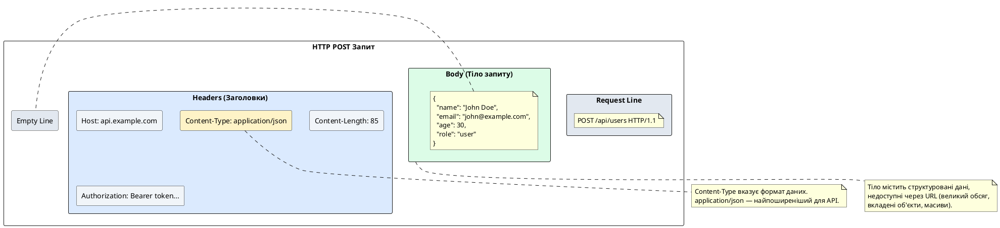
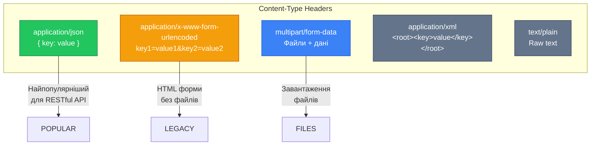

```mermaid
graph TB
    subgraph "PUT - Повна заміна"
        PUT_REQ["Клієнт надсилає<br/>ВСІ поля"]
        PUT_SRV["Сервер замінює<br/>ресурс повністю"]
        PUT_RES["Незазначені поля<br/>скидаються"]
        
        PUT_REQ --> PUT_SRV
        PUT_SRV --> PUT_RES
        
        style PUT_REQ fill:#f59e0b,stroke:#b45309,color:#ffffff
        style PUT_SRV fill:#f59e0b,stroke:#b45309,color:#ffffff
        style PUT_RES fill:#f59e0b,stroke:#b45309,color:#ffffff
    end
    
    subgraph "PATCH - Часткове оновлення"
        PATCH_REQ["Клієнт надсилає<br/>ТІЛЬКИ змінені поля"]
        PATCH_SRV["Сервер оновлює<br/>лише ці поля"]
        PATCH_RES["Інші поля<br/>залишаються без змін"]
        
        PATCH_REQ --> PATCH_SRV
        PATCH_SRV --> PATCH_RES
        
        style PATCH_REQ fill:#22c55e,stroke:#15803d,color:#ffffff
        style PATCH_SRV fill:#22c55e,stroke:#15803d,color:#ffffff
        style PATCH_RES fill:#22c55e,stroke:#15803d,color:#ffffff
    end
```

# Тіло запиту та декоратор @Body

::card-group

::card{title="🎯 Мета лекції" icon="i-lucide-target"}

- Зрозуміти призначення тіла запиту у HTTP-протоколі та його відмінність від параметрів URL
- Опанувати використання декоратора @Body для витягування даних з тіла запиту
- Навчитися створювати DTO для структурованої типізації вхідних даних
- Вивчити автоматичну валідацію тіла запиту через class-validator
- Практикувати створення та оновлення ресурсів через POST, PUT та PATCH
- Зрозуміти різницю між повною заміною (PUT) та частковим оновленням (PATCH)
- Застосовувати трансформацію та санітизацію вхідних даних

::

::card{title="🔑 Ключові терміни" icon="i-lucide-key"}

- **Request Body** (*тіло запиту*): дані, що передаються у HTTP-запиті окремо від URL
- **DTO** (*Data Transfer Object*): клас, що описує структуру даних для передачі між шарами
- **Validation** (*валідація*): перевірка коректності даних згідно з визначеними правилами
- **Sanitization** (*санітизація*): очищення та нормалізація вхідних даних
- **Content-Type**: HTTP-заголовок, що вказує формат даних у тілі запиту
- **Idempotency** (*ідемпотентність*): властивість операції давати однаковий результат при повторах

::

::

## Тіло запиту: передача структурованих даних

У попередніх лекціях ми вивчили два способи передачі даних у HTTP-запитах: **параметри маршруту** (`:id`) для ідентифікації ресурсів та **query-параметри** (`?page=1`) для фільтрації та опцій. Проте обидва ці методи мають суттєве обмеження — вони передають дані як частину URL, що робить їх непридатними для великих або складних структур даних.

**Тіло запиту** (*request body*) вирішує цю проблему, дозволяючи передавати довільні обсяги структурованих даних окремо від URL. Тіло запиту використовується переважно у методах, що змінюють стан сервера: **POST** (створення), **PUT** (повна заміна), **PATCH** (часткове оновлення).

### Анатомія HTTP-запиту з тілом

::plant-uml{alt="Структура HTTP POST-запиту з тілом"}



::

### Коли використовувати тіло запиту

**Використовуйте тіло запиту для:**

**Створення ресурсів (POST)**:
```typescript
POST /users
Body: { "name": "Alice", "email": "alice@example.com", "password": "..." }
```

**Повного оновлення (PUT)**:
```typescript
PUT /users/123
Body: { "name": "Alice Smith", "email": "alice@example.com", "age": 28, "role": "admin" }
```

**Часткового оновлення (PATCH)**:
```typescript
PATCH /users/123
Body: { "email": "newemail@example.com" }
```

**Складних операцій**:
```typescript
POST /orders/bulk
Body: [
  { "productId": 1, "quantity": 2 },
  { "productId": 5, "quantity": 1 }
]
```

**НЕ використовуйте тіло запиту для:**
- GET-запитів (за HTTP-специфікацією GET не повинен мати тіла)
- DELETE-запитів (зазвичай використовують параметри URL)
- Маленьких простих даних, що можуть бути передані через query-параметри

::note
Хоча технічно HTTP дозволяє GET-запити з тілом, більшість інфраструктури (проксі-сервери, кеші, балансувальники навантаження) ігнорують або відкидають тіла у GET-запитах. Це вважається поганою практикою та порушує семантику протоколу.
::

### Content-Type: формати тіла запиту

HTTP-заголовок `Content-Type` вказує, у якому форматі закодовані дані у тілі запиту. Найпоширеніші типи:

::mermaid



::

**application/json** — стандарт для сучасних API:
```json
{
  "name": "Product",
  "price": 99.99,
  "tags": ["electronics", "gadgets"]
}
```

**application/x-www-form-urlencoded** — традиційні HTML-форми:
```
name=Product&price=99.99&tags=electronics&tags=gadgets
```

**multipart/form-data** — завантаження файлів (розглянемо у наступних лекціях):
```
------WebKitFormBoundary7MA4YWxkTrZu0gW
Content-Disposition: form-data; name="name"

Product
------WebKitFormBoundary7MA4YWxkTrZu0gW
Content-Disposition: form-data; name="file"; filename="image.jpg"
Content-Type: image/jpeg

[binary data]
```

::tip
У сучасних RESTful API майже завжди використовується `application/json`. NestJS автоматично парсить JSON-тіло завдяки вбудованому Express/Fastify middleware, тому вам не потрібно виконувати ручне перетворення.
::

## Декоратор @Body: витягування даних з тіла запиту

NestJS надає декоратор `@Body()` для доступу до даних, переданих у тілі HTTP-запиту. Подібно до `@Param()` та `@Query()`, цей декоратор має два режими: витягування всього тіла або окремого поля.

### Режим 1: Витягування всього тіла (@Body())

Найпоширеніший сценарій — витягування всього об'єкта з тіла запиту:

```typescript
import { Controller, Post, Body } from '@nestjs/common';

@Controller('users')
export class UsersController {
  @Post()
  create(@Body() body: any) {
    console.log(body);
    // POST /users з тілом { "name": "Alice", "email": "alice@example.com" }
    // → body = { name: "Alice", email: "alice@example.com" }
    
    return {
      message: 'User created',
      data: body,
    };
  }
}
```

::warning
Використання типу `any` для тіла запиту є **поганою практикою**. Це втрачає всі переваги TypeScript (автодоповнення, перевірка типів) та робить код вразливим до помилок. Завжди типізуйте тіло запиту через DTO.
::

### Режим 2: Витягування окремого поля (@Body('key'))

Іноді потрібно отримати лише одне поле з тіла:

```typescript
@Post()
create(
  @Body('name') name: string,
  @Body('email') email: string,
) {
  return {
    message: `Creating user: ${name} (${email})`,
  };
}
```

Проте цей підхід стає незручним при багатьох полях. Рекомендується використовувати DTO для витягування всього об'єкта з правильною типізацією.


## DTO: Data Transfer Objects для типізації

**Data Transfer Object (DTO)** — це клас, що описує структуру даних, які передаються між різними шарами застосунку. У контексті NestJS контролерів DTO використовуються для:

1. **Типізації** вхідних даних (TypeScript автодоповнення та перевірка типів)
2. **Валідації** даних через декоратори `class-validator`
3. **Документування** очікуваної структури даних
4. **Трансформації** даних через `class-transformer`

### Створення базового DTO

Розглянемо DTO для створення користувача:

```typescript
// dto/create-user.dto.ts
export class CreateUserDto {
  name: string;
  email: string;
  password: string;
  age?: number; // Опціональне поле
  role?: string;
}
```

Використання у контролері:

```typescript
import { Controller, Post, Body } from '@nestjs/common';
import { CreateUserDto } from './dto/create-user.dto';

@Controller('users')
export class UsersController {
  constructor(private readonly usersService: UsersService) {}

  @Post()
  async create(@Body() createUserDto: CreateUserDto) {
    // TypeScript знає про всі поля DTO
    console.log(createUserDto.name);    // ✅ Автодоповнення
    console.log(createUserDto.email);   // ✅ Автодоповнення
    console.log(createUserDto.unknown); // ❌ Помилка компіляції
    
    return this.usersService.create(createUserDto);
  }
}
```

### Валідація DTO через class-validator

Базовий DTO забезпечує типізацію під час компіляції, але не виконує runtime-валідацію. Для автоматичної перевірки коректності даних використовуйте бібліотеку `class-validator`:

```bash
npm install class-validator class-transformer
```

DTO з валідацією:

```typescript
// dto/create-user.dto.ts
import {
  IsString,
  IsEmail,
  IsNotEmpty,
  IsOptional,
  IsInt,
  Min,
  Max,
  MinLength,
  MaxLength,
  Matches,
  IsIn,
} from 'class-validator';

export class CreateUserDto {
  @IsString()
  @IsNotEmpty({ message: 'Name is required' })
  @MinLength(2, { message: 'Name must be at least 2 characters' })
  @MaxLength(50, { message: 'Name must not exceed 50 characters' })
  name: string;

  @IsEmail({}, { message: 'Invalid email format' })
  @IsNotEmpty()
  email: string;

  @IsString()
  @MinLength(8, { message: 'Password must be at least 8 characters' })
  @Matches(/^(?=.*[a-z])(?=.*[A-Z])(?=.*\d)/, {
    message: 'Password must contain uppercase, lowercase and number',
  })
  password: string;

  @IsOptional()
  @IsInt()
  @Min(13)
  @Max(120)
  age?: number;

  @IsOptional()
  @IsIn(['user', 'admin', 'moderator'])
  role?: string;
}
```

Увімкнення глобальної валідації у `main.ts`:

```typescript
// main.ts
import { NestFactory } from '@nestjs/core';
import { ValidationPipe } from '@nestjs/common';
import { AppModule } from './app.module';

async function bootstrap() {
  const app = await NestFactory.create(AppModule);

  app.useGlobalPipes(
    new ValidationPipe({
      transform: true,           // Автоматична трансформація типів
      whitelist: true,           // Видалення полів, не описаних у DTO
      forbidNonWhitelisted: true, // Помилка при невідомих полях
      transformOptions: {
        enableImplicitConversion: true, // Неявне перетворення типів
      },
    }),
  );

  await app.listen(3000);
}
bootstrap();
```

Тепер валідація працює автоматично:

::terminal-preview{title="Автоматична валідація тіла запиту" :cursor="false"}

<div class="line"><span class="opacity-40">#</span> <strong class="font-bold">Коректний запит</strong></div>
<div class="line"><span class="opacity-40">$</span> curl -X POST http://localhost:3000/users \</div>
<div class="line">  -H "Content-Type: application/json" \</div>
<div class="line">  -d '{"name":"Alice","email":"alice@example.com","password":"SecurePass123"}'</div>
<div class="line"><span class="text-green-400 font-bold">HTTP/1.1 201 Created</span></div>
<div class="line">{ <span class="text-blue-400">"id"</span>: 1, <span class="text-blue-400">"name"</span>: <span class="text-green-400">"Alice"</span>, ... }</div>
<div class="line"></div>
<div class="line"><span class="opacity-40">#</span> <strong class="font-bold">Відсутнє обов'язкове поле</strong></div>
<div class="line"><span class="opacity-40">$</span> curl -X POST http://localhost:3000/users \</div>
<div class="line">  -H "Content-Type: application/json" \</div>
<div class="line">  -d '{"name":"Alice"}'</div>
<div class="line"><span class="text-rose-400 font-bold">HTTP/1.1 400 Bad Request</span></div>
<div class="line">{</div>
<div class="line">  <span class="text-blue-400">"message"</span>: [</div>
<div class="line">    <span class="text-green-400">"email must be an email"</span>,</div>
<div class="line">    <span class="text-green-400">"email should not be empty"</span>,</div>
<div class="line">    <span class="text-green-400">"password must be at least 8 characters"</span></div>
<div class="line">  ],</div>
<div class="line">  <span class="text-blue-400">"error"</span>: <span class="text-green-400">"Bad Request"</span></div>
<div class="line">}</div>
<div class="line"></div>
<div class="line"><span class="opacity-40">#</span> <strong class="font-bold">Некоректний формат email</strong></div>
<div class="line"><span class="opacity-40">$</span> curl -X POST http://localhost:3000/users \</div>
<div class="line">  -H "Content-Type: application/json" \</div>
<div class="line">  -d '{"name":"Alice","email":"not-an-email","password":"SecurePass123"}'</div>
<div class="line"><span class="text-rose-400 font-bold">HTTP/1.1 400 Bad Request</span></div>
<div class="line">{</div>
<div class="line">  <span class="text-blue-400">"message"</span>: [<span class="text-green-400">"Invalid email format"</span>]</div>
<div class="line">}</div>
<div class="line"></div>
<div class="line"><span class="opacity-40">#</span> <strong class="font-bold">Невідоме поле (при forbidNonWhitelisted: true)</strong></div>
<div class="line"><span class="opacity-40">$</span> curl -X POST http://localhost:3000/users \</div>
<div class="line">  -H "Content-Type: application/json" \</div>
<div class="line">  -d '{"name":"Alice","email":"alice@ex.com","password":"Pass123","hacker":"field"}'</div>
<div class="line"><span class="text-rose-400 font-bold">HTTP/1.1 400 Bad Request</span></div>
<div class="line">{</div>
<div class="line">  <span class="text-blue-400">"message"</span>: [<span class="text-green-400">"property hacker should not exist"</span>]</div>
<div class="line">}</div>

::

### Популярні декоратори class-validator

::code-group

```typescript [Рядки (Strings)]
import {
  IsString,
  IsNotEmpty,
  MinLength,
  MaxLength,
  Matches,
  Contains,
  IsAlpha,
  IsAlphanumeric,
} from 'class-validator';

export class StringValidationDto {
  @IsString()
  @IsNotEmpty()
  name: string;

  @MinLength(5)
  @MaxLength(20)
  username: string;

  @Matches(/^[a-zA-Z0-9-_]+$/)
  slug: string;

  @Contains('hello')
  greeting: string;

  @IsAlpha() // Тільки літери
  firstName: string;

  @IsAlphanumeric() // Літери та цифри
  code: string;
}
```

```typescript [Числа (Numbers)]
import {
  IsInt,
  IsNumber,
  Min,
  Max,
  IsPositive,
  IsNegative,
  IsDivisibleBy,
} from 'class-validator';

export class NumberValidationDto {
  @IsInt()
  @Min(1)
  @Max(100)
  age: number;

  @IsNumber()
  @IsPositive()
  price: number;

  @IsInt()
  @IsDivisibleBy(10)
  quantity: number;
}
```

```typescript [Email та URL]
import {
  IsEmail,
  IsUrl,
  IsUUID,
  IsPhoneNumber,
} from 'class-validator';

export class ContactDto {
  @IsEmail()
  email: string;

  @IsUrl()
  website: string;

  @IsUUID()
  userId: string;

  @IsPhoneNumber('UA') // Українські номери
  phone: string;
}
```

```typescript [Дати та Булеві]
import {
  IsDate,
  IsBoolean,
  MinDate,
  MaxDate,
} from 'class-validator';
import { Type } from 'class-transformer';

export class DateBoolDto {
  @IsBoolean()
  isActive: boolean;

  @Type(() => Date)
  @IsDate()
  @MinDate(new Date('2020-01-01'))
  birthDate: Date;
}
```

```typescript [Масиви та Об'єкти]
import {
  IsArray,
  ArrayMinSize,
  ArrayMaxSize,
  IsObject,
  ValidateNested,
} from 'class-validator';
import { Type } from 'class-transformer';

class AddressDto {
  @IsString()
  street: string;

  @IsString()
  city: string;
}

export class ArrayObjectDto {
  @IsArray()
  @ArrayMinSize(1)
  @ArrayMaxSize(10)
  @IsString({ each: true }) // Валідація кожного елемента
  tags: string[];

  @ValidateNested() // Валідація вкладеного об'єкта
  @Type(() => AddressDto)
  address: AddressDto;
}
```

```typescript [Enum та Умови]
import {
  IsEnum,
  IsIn,
  IsOptional,
  ValidateIf,
} from 'class-validator';

enum UserRole {
  User = 'user',
  Admin = 'admin',
  Moderator = 'moderator',
}

export class ConditionalDto {
  @IsEnum(UserRole)
  role: UserRole;

  @IsIn(['active', 'inactive', 'banned'])
  status: string;

  @IsOptional() // Поле необов'язкове
  @IsString()
  nickname?: string;

  @ValidateIf(o => o.role === 'admin')
  @IsString()
  adminKey?: string; // Обов'язкове тільки для admin
}
```

::

::tip
Використовуйте кастомні повідомлення про помилки для покращення UX:

```typescript
@MinLength(8, { message: 'Пароль має містити щонайменше 8 символів' })
@Matches(/^(?=.*[a-z])(?=.*[A-Z])(?=.*\d)/, {
  message: 'Пароль має містити великі та малі літери, а також цифри',
})
password: string;
```
::

## POST: створення нових ресурсів

HTTP-метод **POST** призначений для створення нових ресурсів. Клієнт надсилає дані у тілі запиту, сервер створює новий запис та повертає інформацію про створений ресурс, зазвичай зі статусом **201 Created**.

### Базовий приклад створення користувача

```typescript
// dto/create-user.dto.ts
import { IsString, IsEmail, MinLength, IsOptional, IsIn } from 'class-validator';

export class CreateUserDto {
  @IsString()
  @MinLength(2)
  name: string;

  @IsEmail()
  email: string;

  @IsString()
  @MinLength(8)
  password: string;

  @IsOptional()
  @IsIn(['user', 'admin'])
  role?: string;
}
```

Контролер:

```typescript
// users.controller.ts
import { Controller, Post, Body, HttpCode, HttpStatus } from '@nestjs/common';
import { UsersService } from './users.service';
import { CreateUserDto } from './dto/create-user.dto';

@Controller('users')
export class UsersController {
  constructor(private readonly usersService: UsersService) {}

  @Post()
  async create(@Body() createUserDto: CreateUserDto) {
    const user = await this.usersService.create(createUserDto);
    
    // NestJS автоматично встановлює статус 201 Created для POST
    return {
      message: 'User created successfully',
      data: user,
    };
  }
}
```

Сервіс:

```typescript
// users.service.ts
import { Injectable, ConflictException } from '@nestjs/common';
import { InjectRepository } from '@nestjs/typeorm';
import { Repository } from 'typeorm';
import { User } from './entities/user.entity';
import { CreateUserDto } from './dto/create-user.dto';
import * as bcrypt from 'bcrypt';

@Injectable()
export class UsersService {
  constructor(
    @InjectRepository(User)
    private readonly userRepository: Repository<User>,
  ) {}

  async create(createUserDto: CreateUserDto): Promise<User> {
    // Перевірка унікальності email
    const existingUser = await this.userRepository.findOne({
      where: { email: createUserDto.email },
    });

    if (existingUser) {
      throw new ConflictException('User with this email already exists');
    }

    // Хешування пароля
    const hashedPassword = await bcrypt.hash(createUserDto.password, 10);

    // Створення нового користувача
    const user = this.userRepository.create({
      ...createUserDto,
      password: hashedPassword,
      role: createUserDto.role || 'user', // Значення за замовчуванням
    });

    // Збереження у базі даних
    const savedUser = await this.userRepository.save(user);

    // Видалення пароля з відповіді
    const { password, ...result } = savedUser;
    return result as User;
  }
}
```

Приклад використання:

::terminal-preview{title="POST /users - Створення користувача" :cursor="false"}

<div class="line"><span class="opacity-40">$</span> <strong class="font-bold">curl -X POST http://localhost:3000/users \</strong></div>
<div class="line">  <strong class="font-bold">-H "Content-Type: application/json" \</strong></div>
<div class="line">  <strong class="font-bold">-d '{</strong></div>
<div class="line"><strong class="font-bold">    "name": "Alice Johnson",</strong></div>
<div class="line"><strong class="font-bold">    "email": "alice@example.com",</strong></div>
<div class="line"><strong class="font-bold">    "password": "SecurePass123"</strong></div>
<div class="line"><strong class="font-bold">  }'</strong></div>
<div class="line"></div>
<div class="line"><span class="text-green-400 font-bold">HTTP/1.1 201 Created</span></div>
<div class="line"><span class="opacity-40">Location: /users/1</span></div>
<div class="line">{</div>
<div class="line">  <span class="text-blue-400">"message"</span>: <span class="text-green-400">"User created successfully"</span>,</div>
<div class="line">  <span class="text-blue-400">"data"</span>: {</div>
<div class="line">    <span class="text-blue-400">"id"</span>: <span class="text-yellow-400">1</span>,</div>
<div class="line">    <span class="text-blue-400">"name"</span>: <span class="text-green-400">"Alice Johnson"</span>,</div>
<div class="line">    <span class="text-blue-400">"email"</span>: <span class="text-green-400">"alice@example.com"</span>,</div>
<div class="line">    <span class="text-blue-400">"role"</span>: <span class="text-green-400">"user"</span>,</div>
<div class="line">    <span class="text-blue-400">"createdAt"</span>: <span class="text-green-400">"2026-09-04T10:30:00.000Z"</span></div>
<div class="line">  }</div>
<div class="line">}</div>

::

::note
**Статус 201 Created** автоматично встановлюється NestJS для POST-запитів. Рекомендується також додавати заголовок `Location` з URL новоствореного ресурсу:

```typescript
@Post()
async create(@Body() dto: CreateUserDto, @Res({ passthrough: true }) res: Response) {
  const user = await this.usersService.create(dto);
  res.header('Location', `/users/${user.id}`);
  return user;
}
```
::


## PUT: повна заміна ресурсу

HTTP-метод **PUT** призначений для повної заміни існуючого ресурсу. Клієнт надсилає **всі** дані ресурсу, і сервер замінює поточний стан повністю новими даними. PUT є **ідемпотентним** — повторне виконання з тими самими даними дає той самий результат.

### DTO для оновлення

```typescript
// dto/update-user.dto.ts
import { IsString, IsEmail, MinLength, IsOptional, IsInt, Min, IsIn } from 'class-validator';

export class UpdateUserDto {
  @IsString()
  @MinLength(2)
  name: string; // Обов'язкове — PUT замінює весь ресурс

  @IsEmail()
  email: string; // Обов'язкове

  @IsOptional()
  @IsString()
  @MinLength(8)
  password?: string; // Опціональне — може не змінюватися

  @IsOptional()
  @IsInt()
  @Min(13)
  age?: number;

  @IsOptional()
  @IsIn(['user', 'admin', 'moderator'])
  role?: string;
}
```

Контролер:

```typescript
import { Controller, Put, Param, Body, ParseIntPipe, NotFoundException } from '@nestjs/common';
import { UsersService } from './users.service';
import { UpdateUserDto } from './dto/update-user.dto';

@Controller('users')
export class UsersController {
  constructor(private readonly usersService: UsersService) {}

  @Put(':id')
  async replace(
    @Param('id', ParseIntPipe) id: number,
    @Body() updateUserDto: UpdateUserDto,
  ) {
    const user = await this.usersService.replace(id, updateUserDto);
    
    if (!user) {
      throw new NotFoundException(`User with ID ${id} not found`);
    }
    
    return {
      message: 'User replaced successfully',
      data: user,
    };
  }
}
```

Сервіс з повною заміною:

```typescript
// users.service.ts
async replace(id: number, updateUserDto: UpdateUserDto): Promise<User> {
  // Перевірка існування
  const user = await this.userRepository.findOne({ where: { id } });
  
  if (!user) {
    throw new NotFoundException(`User with ID ${id} not found`);
  }

  // Хешування нового пароля, якщо він переданий
  if (updateUserDto.password) {
    updateUserDto.password = await bcrypt.hash(updateUserDto.password, 10);
  }

  // Повна заміна: встановлюємо всі поля з DTO
  // Поля, не передані у DTO, мають бути встановлені явно або видалені
  const updatedUser = {
    ...user,
    ...updateUserDto,
    updatedAt: new Date(),
  };

  const result = await this.userRepository.save(updatedUser);
  const { password, ...safeUser } = result;
  return safeUser as User;
}
```

::warning
**Семантика PUT вимагає передачі всіх полів ресурсу.** Якщо клієнт не передає поле, воно має бути встановлене у значення за замовчуванням або видалене. На практиці багато API порушують цю семантику, використовуючи PUT як PATCH. Для справжньої повної заміни використовуйте PUT, для часткового оновлення — PATCH.
::

## PATCH: часткове оновлення ресурсу

HTTP-метод **PATCH** призначений для **часткового оновлення** існуючого ресурсу. Клієнт надсилає лише ті поля, які потрібно змінити, інші залишаються без змін. PATCH є більш гнучким та зручним для клієнтів, ніж PUT.

### DTO для часткового оновлення через Partial<T>

TypeScript надає утиліту `Partial<T>`, що робить всі поля типу опціональними. Це ідеально підходить для PATCH:

```typescript
// dto/update-user.dto.ts
import { PartialType } from '@nestjs/mapped-types'; // ⚠️ Використовуйте цей, а не TypeScript Partial!
import { CreateUserDto } from './create-user.dto';

export class UpdateUserDto extends PartialType(CreateUserDto) {}

// Альтернативно, явне визначення:
// export class UpdateUserDto {
//   @IsOptional()
//   @IsString()
//   @MinLength(2)
//   name?: string;
//
//   @IsOptional()
//   @IsEmail()
//   email?: string;
//
//   @IsOptional()
//   @IsString()
//   @MinLength(8)
//   password?: string;
//
//   @IsOptional()
//   @IsInt()
//   @Min(13)
//   age?: number;
//
//   @IsOptional()
//   @IsIn(['user', 'admin', 'moderator'])
//   role?: string;
// }
```

::tip
`@nestjs/mapped-types` надає `PartialType`, який:
1. Робить всі поля опціональними (як TypeScript `Partial<T>`)
2. **Зберігає декоратори валідації** з базового DTO
3. Автоматично додає `@IsOptional()` до всіх полів

Стандартний TypeScript `Partial<T>` **НЕ зберігає** декоратори валідації!

```bash
npm install @nestjs/mapped-types
```
::

Контролер:

```typescript
import { Controller, Patch, Param, Body, ParseIntPipe } from '@nestjs/common';
import { UsersService } from './users.service';
import { UpdateUserDto } from './dto/update-user.dto';

@Controller('users')
export class UsersController {
  constructor(private readonly usersService: UsersService) {}

  @Patch(':id')
  async update(
    @Param('id', ParseIntPipe) id: number,
    @Body() updateUserDto: UpdateUserDto,
  ) {
    const user = await this.usersService.update(id, updateUserDto);
    
    return {
      message: 'User updated successfully',
      data: user,
    };
  }
}
```

Сервіс з частковим оновленням:

```typescript
// users.service.ts
async update(id: number, updateUserDto: UpdateUserDto): Promise<User> {
  // Перевірка існування
  const user = await this.userRepository.findOne({ where: { id } });
  
  if (!user) {
    throw new NotFoundException(`User with ID ${id} not found`);
  }

  // Хешування пароля, якщо він оновлюється
  if (updateUserDto.password) {
    updateUserDto.password = await bcrypt.hash(updateUserDto.password, 10);
  }

  // Часткове оновлення: застосовуємо лише передані поля
  Object.assign(user, updateUserDto);
  user.updatedAt = new Date();

  const result = await this.userRepository.save(user);
  const { password, ...safeUser } = result;
  return safeUser as User;
}
```

Приклади використання:

::code-group

```bash [Оновлення одного поля]
curl -X PATCH http://localhost:3000/users/1 \
  -H "Content-Type: application/json" \
  -d '{ "email": "newemail@example.com" }'

# Результат: змінено лише email, інші поля залишились без змін
```

```bash [Оновлення кількох полів]
curl -X PATCH http://localhost:3000/users/1 \
  -H "Content-Type: application/json" \
  -d '{
    "name": "Alice Smith",
    "age": 29
  }'

# Результат: змінено name та age, інші поля незмінні
```

```bash [Порожнє тіло (нічого не змінюється)]
curl -X PATCH http://localhost:3000/users/1 \
  -H "Content-Type: application/json" \
  -d '{}'

# Результат: користувач залишився без змін, але updatedAt оновлено
```

::

### PUT vs PATCH: порівняння

::mermaid



::

::code-group

```typescript [PUT - Всі поля обов'язкові]
// DTO для PUT
export class ReplaceUserDto {
  @IsString()
  @MinLength(2)
  name: string; // ✅ Обов'язкове

  @IsEmail()
  email: string; // ✅ Обов'язкове

  @IsInt()
  @Min(13)
  age: number; // ✅ Обов'язкове

  @IsIn(['user', 'admin'])
  role: string; // ✅ Обов'язкове
}

// PUT /users/1
// Body: {
//   "name": "Alice",
//   "email": "alice@ex.com",
//   "age": 28,
//   "role": "admin"
// }
// ❌ Якщо не передати age — помилка валідації
```

```typescript [PATCH - Всі поля опціональні]
// DTO для PATCH
export class UpdateUserDto extends PartialType(ReplaceUserDto) {}

// Еквівалентно:
// export class UpdateUserDto {
//   @IsOptional() @IsString() @MinLength(2) name?: string;
//   @IsOptional() @IsEmail() email?: string;
//   @IsOptional() @IsInt() @Min(13) age?: number;
//   @IsOptional() @IsIn(['user', 'admin']) role?: string;
// }

// PATCH /users/1
// Body: { "email": "newemail@ex.com" }
// ✅ Оновлюється лише email, інші поля незмінні
```

::

::accordion

::accordion-item{label="❓ Коли використовувати PUT, а коли PATCH?" icon="i-lucide-help-circle"}

**Використовуйте PUT**, коли:
- Клієнт має повну інформацію про ресурс та хоче замінити його цілком
- Потрібна ідемпотентність повної заміни (наприклад, синхронізація з іншою системою)
- API вимагає явної передачі всіх полів для безпеки

**Використовуйте PATCH**, коли:
- Клієнт хоче оновити лише деякі поля
- Ресурс має багато полів, і передача всіх кожного разу недоцільна
- Потрібна зручність для мобільних клієнтів (менше трафіку)

**На практиці**: PATCH використовується набагато частіше, оскільки він більш гнучкий та зручний. Багато API взагалі не реалізують PUT, використовуючи лише PATCH для всіх оновлень.

::

::accordion-item{label="❓ Чи можна використовувати той самий DTO для POST та PATCH?" icon="i-lucide-help-circle"}

Технічно можна, але **не рекомендується** з кількох причин:

1. **POST зазвичай вимагає обов'язкові поля**, PATCH — всі опціональні
2. **POST може мати поля, що не можна оновлювати** (наприклад, `createdAt`, `id`)
3. **Валідація може відрізнятися** (при створенні email має бути унікальним, при оновленні — можливо, ні)

Рекомендований підхід:
```typescript
// Для POST
export class CreateUserDto {
  @IsString() name: string;
  @IsEmail() email: string;
  @IsString() password: string;
}

// Для PATCH (повторне використання валідації з CreateUserDto)
export class UpdateUserDto extends PartialType(CreateUserDto) {}

// Або через OmitType для виключення полів:
export class UpdateUserDto extends PartialType(
  OmitType(CreateUserDto, ['password'] as const)
) {}
```

::

::


## Вкладені об'єкти та масиви у DTO

Реальні API часто приймають складні структури з вкладеними об'єктами та масивами. class-validator підтримує валідацію таких структур через декоратори `@ValidateNested()` та `@Type()`.

### Валідація вкладених об'єктів

```typescript
// dto/address.dto.ts
import { IsString, IsPostalCode, MinLength } from 'class-validator';

export class AddressDto {
  @IsString()
  @MinLength(3)
  street: string;

  @IsString()
  city: string;

  @IsString()
  @IsPostalCode('UA') // Валідація українського поштового індексу
  postalCode: string;

  @IsString()
  country: string;
}
```

```typescript
// dto/create-user.dto.ts
import { IsString, IsEmail, ValidateNested, IsOptional } from 'class-validator';
import { Type } from 'class-transformer';
import { AddressDto } from './address.dto';

export class CreateUserDto {
  @IsString()
  name: string;

  @IsEmail()
  email: string;

  @IsOptional()
  @ValidateNested() // Застосувати валідацію до вкладеного об'єкта
  @Type(() => AddressDto) // Трансформувати plain object у клас AddressDto
  address?: AddressDto;
}
```

Приклад запиту:

```json
POST /users
{
  "name": "Alice",
  "email": "alice@example.com",
  "address": {
    "street": "Khreshchatyk St, 1",
    "city": "Kyiv",
    "postalCode": "01001",
    "country": "Ukraine"
  }
}
```

Якщо адреса некоректна, валідація поверне помилку:

```json
{
  "statusCode": 400,
  "message": [
    "address.street must be at least 3 characters",
    "address.postalCode must be a postal code in UA"
  ],
  "error": "Bad Request"
}
```

### Валідація масивів примітивів

```typescript
// dto/create-article.dto.ts
import { IsString, IsArray, ArrayMinSize, ArrayMaxSize } from 'class-validator';

export class CreateArticleDto {
  @IsString()
  title: string;

  @IsString()
  content: string;

  @IsArray()
  @ArrayMinSize(1, { message: 'At least one tag is required' })
  @ArrayMaxSize(10, { message: 'Maximum 10 tags allowed' })
  @IsString({ each: true }) // Валідація кожного елемента масиву
  tags: string[];
}
```

Приклад:

```json
POST /articles
{
  "title": "NestJS Tutorial",
  "content": "Learn NestJS...",
  "tags": ["nestjs", "typescript", "backend"]
}
```

### Валідація масивів об'єктів

```typescript
// dto/order-item.dto.ts
import { IsInt, Min, IsUUID } from 'class-validator';

export class OrderItemDto {
  @IsUUID()
  productId: string;

  @IsInt()
  @Min(1)
  quantity: number;
}
```

```typescript
// dto/create-order.dto.ts
import { IsArray, ValidateNested, ArrayMinSize } from 'class-validator';
import { Type } from 'class-transformer';
import { OrderItemDto } from './order-item.dto';

export class CreateOrderDto {
  @IsArray()
  @ArrayMinSize(1, { message: 'Order must contain at least one item' })
  @ValidateNested({ each: true }) // Валідувати кожен елемент масиву
  @Type(() => OrderItemDto)
  items: OrderItemDto[];
}
```

Приклад замовлення:

```json
POST /orders
{
  "items": [
    { "productId": "123e4567-e89b-12d3-a456-426614174000", "quantity": 2 },
    { "productId": "987f6543-e21c-45d6-a123-987654321000", "quantity": 1 }
  ]
}
```

## Трансформація та санітизація даних

Іноді потрібно не лише валідувати, а й **трансформувати** або **санітизувати** вхідні дані перед обробкою. class-transformer надає декоратори для автоматичної трансформації.

### Автоматичне обрізання пробілів

```typescript
import { Transform } from 'class-transformer';
import { IsString, IsEmail } from 'class-validator';

export class CreateUserDto {
  @Transform(({ value }) => value?.trim()) // Видалити пробіли на початку/кінці
  @IsString()
  name: string;

  @Transform(({ value }) => value?.toLowerCase().trim()) // Перевести у нижній регістр
  @IsEmail()
  email: string;
}
```

Тепер якщо клієнт надішле `"  Alice  "`, ім'я буде збережено як `"Alice"`.

### Перетворення типів

```typescript
import { Type, Transform } from 'class-transformer';
import { IsDate, IsBoolean, IsNumber } from 'class-validator';

export class UpdateProductDto {
  @Type(() => Number) // Перетворити рядок "99.99" у число 99.99
  @IsNumber()
  price?: number;

  @Type(() => Date) // Перетворити рядок "2024-01-15" у Date
  @IsDate()
  releaseDate?: Date;

  @Transform(({ value }) => value === 'true' || value === true)
  @IsBoolean()
  isActive?: boolean;
}
```

### Кастомна трансформація

```typescript
import { Transform } from 'class-transformer';
import { IsString } from 'class-validator';

export class CreateArticleDto {
  @IsString()
  title: string;

  // Автоматична генерація slug з title
  @Transform(({ obj }) => {
    if (!obj.slug && obj.title) {
      return obj.title
        .toLowerCase()
        .replace(/[^a-z0-9]+/g, '-')
        .replace(/^-|-$/g, '');
    }
    return obj.slug;
  })
  @IsString()
  slug?: string;
}
```

Тепер якщо клієнт надішле:

```json
{
  "title": "My Great Article!"
}
```

Slug автоматично буде згенеровано як `"my-great-article"`.

## Обробка помилок валідації

Коли валідація не проходить, NestJS автоматично повертає статус **400 Bad Request** з детальним описом помилок. Структуру відповіді можна кастомізувати.

### Стандартна відповідь про помилку

```json
{
  "statusCode": 400,
  "message": [
    "name must be at least 2 characters",
    "email must be an email",
    "password must be at least 8 characters"
  ],
  "error": "Bad Request"
}
```

### Кастомізація повідомлень

Налаштування у `main.ts`:

```typescript
// main.ts
import { ValidationPipe, BadRequestException } from '@nestjs/common';

app.useGlobalPipes(
  new ValidationPipe({
    transform: true,
    whitelist: true,
    forbidNonWhitelisted: true,
    exceptionFactory: (errors) => {
      // Кастомна структура помилок
      const formattedErrors = errors.map((error) => ({
        field: error.property,
        constraints: error.constraints,
        value: error.value,
      }));

      return new BadRequestException({
        statusCode: 400,
        message: 'Validation failed',
        errors: formattedErrors,
      });
    },
  }),
);
```

Тепер відповідь матиме структуру:

```json
{
  "statusCode": 400,
  "message": "Validation failed",
  "errors": [
    {
      "field": "email",
      "constraints": {
        "isEmail": "email must be an email"
      },
      "value": "not-an-email"
    },
    {
      "field": "age",
      "constraints": {
        "min": "age must not be less than 13"
      },
      "value": 10
    }
  ]
}
```

## Best Practices: рекомендації роботи з тілом запиту

### 1. Завжди використовуйте DTO з валідацією

::code-group

```typescript [❌ Погано: Без типізації]
@Post()
create(@Body() body: any) {
  // Відсутність валідації, немає автодоповнення
  return this.usersService.create(body);
}
```

```typescript [✅ Добре: DTO з валідацією]
@Post()
create(@Body() createUserDto: CreateUserDto) {
  // Автоматична валідація, типобезпека
  return this.usersService.create(createUserDto);
}
```

::

### 2. Використовуйте mapped types для DRY

```typescript
import { PartialType, OmitType, PickType, IntersectionType } from '@nestjs/mapped-types';

// Базовий DTO
export class CreateUserDto {
  name: string;
  email: string;
  password: string;
  role: string;
}

// Часткове оновлення (всі поля опціональні)
export class UpdateUserDto extends PartialType(CreateUserDto) {}

// Без пароля (виключити поле)
export class UserResponseDto extends OmitType(CreateUserDto, ['password']) {}

// Тільки name та email
export class BasicUserDto extends PickType(CreateUserDto, ['name', 'email']) {}

// Комбінація типів
export class ExtendedUserDto extends IntersectionType(
  CreateUserDto,
  class { @IsInt() age: number; }
) {}
```

### 3. Ніколи не зберігайте паролі у відкритому вигляді

```typescript
async create(createUserDto: CreateUserDto): Promise<User> {
  // ❌ НІКОЛИ не робіть так:
  // await this.userRepository.save(createUserDto);

  // ✅ Завжди хешуйте паролі:
  const hashedPassword = await bcrypt.hash(createUserDto.password, 10);
  const user = this.userRepository.create({
    ...createUserDto,
    password: hashedPassword,
  });
  return this.userRepository.save(user);
}
```

### 4. Видаляйте чутливі дані з відповідей

```typescript
async findOne(id: number): Promise<User> {
  const user = await this.userRepository.findOne({ where: { id } });
  
  // ❌ Не повертайте пароль:
  // return user;

  // ✅ Видаліть чутливі поля:
  const { password, ...safeUser } = user;
  return safeUser as User;
}

// Або використовуйте class-transformer з @Exclude():
export class User {
  id: number;
  name: string;
  email: string;
  
  @Exclude() // Це поле не буде серіалізовано
  password: string;
}
```

### 5. Валідуйте бізнес-правила у сервісі

```typescript
// ❌ Не всі перевірки можна виконати через декоратори
export class CreateUserDto {
  @IsEmail()
  email: string;
  // Як перевірити унікальність email через декоратор?
}

// ✅ Бізнес-валідація у сервісі
async create(createUserDto: CreateUserDto): Promise<User> {
  // Перевірка унікальності email
  const existingUser = await this.userRepository.findOne({
    where: { email: createUserDto.email },
  });

  if (existingUser) {
    throw new ConflictException('Email already exists');
  }

  // Створення користувача
  return this.userRepository.save(createUserDto);
}
```

### 6. Використовуйте whitelist та forbidNonWhitelisted

```typescript
// main.ts
app.useGlobalPipes(
  new ValidationPipe({
    whitelist: true,           // Видалити незадекларовані поля
    forbidNonWhitelisted: true, // Кинути помилку при невідомих полях
  }),
);
```

Це захищає від **mass assignment attacks**:

```json
// Клієнт намагається встановити role через створення користувача
POST /users
{
  "name": "Hacker",
  "email": "hack@example.com",
  "password": "pass",
  "role": "admin"  // ⚠️ Потенційна атака
}
```

Якщо `role` не задекларовано у `CreateUserDto`, воно буде:
- **Видалено** (при `whitelist: true`)
- **Кинуто помилку** (при `forbidNonWhitelisted: true`)

### 7. Документуйте DTO через Swagger

```typescript
import { ApiProperty } from '@nestjs/swagger';
import { IsString, IsEmail, MinLength } from 'class-validator';

export class CreateUserDto {
  @ApiProperty({
    description: 'Full name of the user',
    example: 'John Doe',
    minLength: 2,
    maxLength: 50,
  })
  @IsString()
  @MinLength(2)
  name: string;

  @ApiProperty({
    description: 'User email address',
    example: 'john@example.com',
  })
  @IsEmail()
  email: string;

  @ApiProperty({
    description: 'User password (min 8 characters)',
    example: 'SecurePass123',
    minLength: 8,
  })
  @IsString()
  @MinLength(8)
  password: string;
}
```

Це автоматично генерує Swagger-документацію для вашого API.


## Комплексний приклад: CRUD операції з валідацією

Підсумуємо все, що вивчили, у повноцінному прикладі контролера з усіма операціями:

```typescript
// dto/create-product.dto.ts
import { IsString, IsNumber, Min, IsOptional, IsArray, ArrayMinSize, IsIn } from 'class-validator';
import { Type } from 'class-transformer';

export class CreateProductDto {
  @IsString()
  @MinLength(3)
  @MaxLength(100)
  name: string;

  @IsString()
  @MinLength(10)
  description: string;

  @Type(() => Number)
  @IsNumber()
  @Min(0)
  price: number;

  @Type(() => Number)
  @IsNumber()
  @Min(0)
  stock: number;

  @IsOptional()
  @IsIn(['electronics', 'clothing', 'books', 'food'])
  category?: string;

  @IsOptional()
  @IsArray()
  @ArrayMinSize(1)
  @IsString({ each: true })
  tags?: string[];
}
```

```typescript
// dto/update-product.dto.ts
import { PartialType } from '@nestjs/mapped-types';
import { CreateProductDto } from './create-product.dto';

export class UpdateProductDto extends PartialType(CreateProductDto) {}
```

```typescript
// products.controller.ts
import {
  Controller,
  Get,
  Post,
  Put,
  Patch,
  Delete,
  Body,
  Param,
  ParseIntPipe,
  HttpCode,
  HttpStatus,
} from '@nestjs/common';
import { ProductsService } from './products.service';
import { CreateProductDto } from './dto/create-product.dto';
import { UpdateProductDto } from './dto/update-product.dto';

@Controller('products')
export class ProductsController {
  constructor(private readonly productsService: ProductsService) {}

  // CREATE - POST /products
  @Post()
  @HttpCode(HttpStatus.CREATED)
  async create(@Body() createProductDto: CreateProductDto) {
    const product = await this.productsService.create(createProductDto);
    return {
      message: 'Product created successfully',
      data: product,
    };
  }

  // READ ALL - GET /products
  @Get()
  async findAll() {
    return this.productsService.findAll();
  }

  // READ ONE - GET /products/:id
  @Get(':id')
  async findOne(@Param('id', ParseIntPipe) id: number) {
    return this.productsService.findOneOrFail(id);
  }

  // UPDATE (FULL) - PUT /products/:id
  @Put(':id')
  async replace(
    @Param('id', ParseIntPipe) id: number,
    @Body() updateProductDto: UpdateProductDto,
  ) {
    const product = await this.productsService.replace(id, updateProductDto);
    return {
      message: 'Product replaced successfully',
      data: product,
    };
  }

  // UPDATE (PARTIAL) - PATCH /products/:id
  @Patch(':id')
  async update(
    @Param('id', ParseIntPipe) id: number,
    @Body() updateProductDto: UpdateProductDto,
  ) {
    const product = await this.productsService.update(id, updateProductDto);
    return {
      message: 'Product updated successfully',
      data: product,
    };
  }

  // DELETE - DELETE /products/:id
  @Delete(':id')
  @HttpCode(HttpStatus.NO_CONTENT)
  async remove(@Param('id', ParseIntPipe) id: number): Promise<void> {
    await this.productsService.remove(id);
  }
}
```

```typescript
// products.service.ts
import { Injectable, NotFoundException, ConflictException } from '@nestjs/common';
import { InjectRepository } from '@nestjs/typeorm';
import { Repository } from 'typeorm';
import { Product } from './entities/product.entity';
import { CreateProductDto } from './dto/create-product.dto';
import { UpdateProductDto } from './dto/update-product.dto';

@Injectable()
export class ProductsService {
  constructor(
    @InjectRepository(Product)
    private readonly productRepository: Repository<Product>,
  ) {}

  async create(createProductDto: CreateProductDto): Promise<Product> {
    // Перевірка унікальності назви
    const existingProduct = await this.productRepository.findOne({
      where: { name: createProductDto.name },
    });

    if (existingProduct) {
      throw new ConflictException('Product with this name already exists');
    }

    const product = this.productRepository.create(createProductDto);
    return this.productRepository.save(product);
  }

  async findAll(): Promise<Product[]> {
    return this.productRepository.find();
  }

  async findOneOrFail(id: number): Promise<Product> {
    const product = await this.productRepository.findOne({ where: { id } });

    if (!product) {
      throw new NotFoundException(`Product with ID ${id} not found`);
    }

    return product;
  }

  async replace(id: number, updateProductDto: UpdateProductDto): Promise<Product> {
    await this.findOneOrFail(id); // Перевірка існування

    // Повна заміна
    await this.productRepository.update(id, updateProductDto);
    return this.findOneOrFail(id);
  }

  async update(id: number, updateProductDto: UpdateProductDto): Promise<Product> {
    const product = await this.findOneOrFail(id);

    // Часткове оновлення
    Object.assign(product, updateProductDto);
    return this.productRepository.save(product);
  }

  async remove(id: number): Promise<void> {
    const result = await this.productRepository.delete(id);

    if (result.affected === 0) {
      throw new NotFoundException(`Product with ID ${id} not found`);
    }
  }
}
```

## Підсумок: тіло запиту для створення та оновлення ресурсів

Тіло запиту є основним способом передачі структурованих даних у HTTP-запитах, що змінюють стан сервера. Воно дозволяє клієнтам надсилати складні об'єкти, вкладені структури та масиви, що неможливо через параметри URL.

Ключові принципи роботи з тілом запиту:

- **Декоратор @Body**: Для витягування всього тіла або окремих полів
- **DTO**: Data Transfer Objects для типізації, валідації та документування
- **class-validator**: Автоматична валідація через декоратори (`@IsString`, `@IsEmail`, `@Min` тощо)
- **class-transformer**: Трансформація та санітизація даних (`@Type`, `@Transform`)
- **POST**: Створення нових ресурсів (статус 201 Created)
- **PUT**: Повна заміна ресурсу (ідемпотентна операція)
- **PATCH**: Часткове оновлення (гнучкіше та зручніше за PUT)
- **ValidationPipe**: Глобальна валідація з опціями whitelist та forbidNonWhitelisted
- **Безпека**: Хешування паролів, видалення чутливих даних, захист від mass assignment

Комбінування цих можливостей дозволяє створювати надійні API з автоматичною валідацією, чіткою типізацією та захистом від некоректних даних.

::card-group

::card{title="✅ Що ми опанували" icon="i-lucide-check-circle"}

- Призначення тіла запиту та його відмінності від параметрів URL
- Витягування даних з тіла через декоратор @Body
- Створення DTO для структурованої типізації вхідних даних
- Автоматичну валідацію через class-validator з десятками декораторів
- Трансформацію та санітизацію даних через class-transformer
- Створення ресурсів через POST з валідацією
- Повну заміну (PUT) vs часткове оновлення (PATCH)
- Валідацію вкладених об'єктів та масивів через @ValidateNested
- Best practices для безпечної обробки вхідних даних
- Захист від mass assignment attacks через whitelist

::

::card{title="🎯 Наступні кроки" icon="i-lucide-arrow-right"}

У лекції 11 ми вивчимо **декоратори заголовків (@Headers, @Req, @Res)**, що дозволяють працювати з HTTP-заголовками та повним об'єктом запиту/відповіді:
- Витягування заголовків через @Headers
- Робота з об'єктом запиту через @Req
- Управління відповіддю через @Res
- Кастомні заголовки та CORS
- Cookie та сесії

::

::

::accordion

::accordion-item{label="❓ Чи може GET-запит мати тіло?" icon="i-lucide-help-circle"}

**Технічно так**, але **практично ні**. HTTP-специфікація не забороняє тіло у GET-запитах, але:

1. **Семантика**: GET призначений для безпечного читання без побічних ефектів. Тіло асоціюється зі зміною стану.
2. **Інфраструктура**: Багато проксі, балансувальників, CDN та кешів **ігнорують або відкидають** тіла у GET-запитах.
3. **Клієнти**: Більшість HTTP-клієнтів (браузери, Axios, Fetch) не підтримують або утруднюють надсилання тіла у GET.
4. **Кешування**: Тіло не враховується при кешуванні GET-запитів, що може призвести до некоректних результатів.

**Рекомендація**: Для складних параметрів читання використовуйте **POST з дієсловом** у URL (`POST /users/search`) або **GraphQL**, де всі запити йдуть через POST.

::

::accordion-item{label="❓ Як обробити запит з Content-Type: application/x-www-form-urlencoded?" icon="i-lucide-help-circle"}

NestJS автоматично парсить `application/x-www-form-urlencoded` завдяки Express/Fastify middleware. Декоратор `@Body()` працює однаково для JSON та form-encoded даних:

```typescript
@Post()
create(@Body() createUserDto: CreateUserDto) {
  // Працює як для application/json:
  // { "name": "Alice", "email": "alice@example.com" }
  
  // Так і для application/x-www-form-urlencoded:
  // name=Alice&email=alice@example.com
  
  return this.usersService.create(createUserDto);
}
```

Проте для сучасних API **рекомендується використовувати JSON**, оскільки він підтримує вкладені структури та масиви природним чином.

::

::accordion-item{label="❓ Чи можна комбінувати @Body з @Query та @Param?" icon="i-lucide-help-circle"}

**Так, абсолютно!** Це поширена практика, коли ідентифікатор ресурсу передається через параметр URL, додаткові опції через query, а основні дані через тіло:

```typescript
@Patch(':id')
async update(
  @Param('id', ParseIntPipe) id: number,           // Ідентифікатор ресурсу
  @Query('notify') notify: boolean,                // Додаткова опція
  @Body() updateUserDto: UpdateUserDto,            // Дані для оновлення
) {
  const user = await this.usersService.update(id, updateUserDto);
  
  if (notify) {
    await this.notificationService.sendUpdateNotification(user);
  }
  
  return user;
}

// PATCH /users/123?notify=true
// Body: { "email": "newemail@example.com" }
```

Такий підхід дозволяє створювати гнучкі API, де різні типи даних передаються найбільш відповідним способом.

::

::
