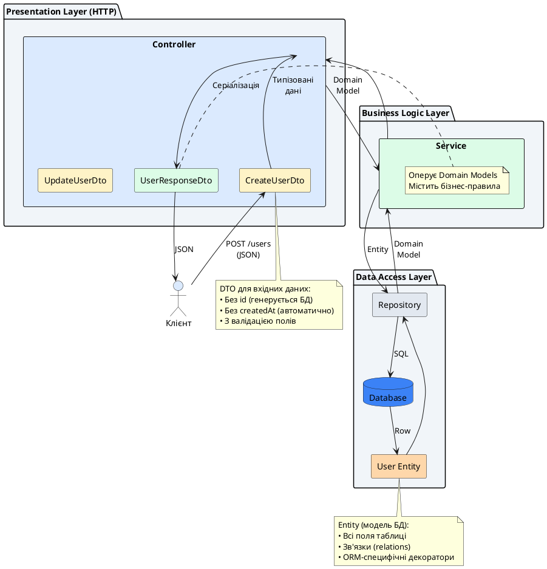
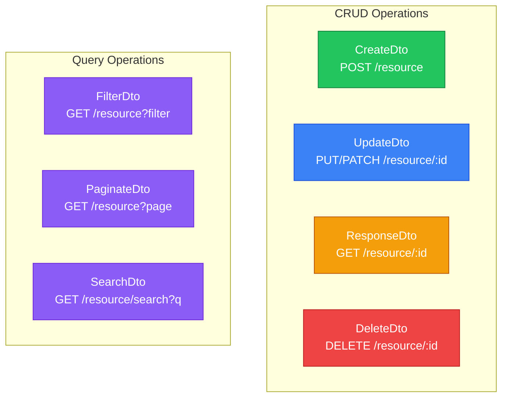

```mermaid
graph TB
    subgraph "DTO (Data Transfer Object)"
        DTO1["Призначення:<br/>Передача даних між шарами"]
        DTO2["Життєвий цикл:<br/>Короткочасний (один запит)"]
        DTO3["Поля:<br/>Лише публічні, які клієнт бачить"]
        DTO4["Валідація:<br/>class-validator декоратори"]
        DTO5["Використання:<br/>Контролери, HTTP-запити"]
        
        DTO1 --> DTO2
        DTO2 --> DTO3
        DTO3 --> DTO4
        DTO4 --> DTO5
        
        style DTO1 fill:#22c55e,stroke:#15803d,color:#ffffff
        style DTO2 fill:#22c55e,stroke:#15803d,color:#ffffff
        style DTO3 fill:#22c55e,stroke:#15803d,color:#ffffff
        style DTO4 fill:#22c55e,stroke:#15803d,color:#ffffff
        style DTO5 fill:#22c55e,stroke:#15803d,color:#ffffff
    end
    
    subgraph "Entity (Сутність БД)"
        ENT1["Призначення:<br/>Представлення таблиці БД"]
        ENT2["Життєвий цикл:<br/>Довготривалий (персистентність)"]
        ENT3["Поля:<br/>Всі колонки БД + метадані"]
        ENT4["Декоратори:<br/>ORM-специфічні (@Column, @Entity)"]
        ENT5["Використання:<br/>Репозиторії, БД-операції"]
        
        ENT1 --> ENT2
        ENT2 --> ENT3
        ENT3 --> ENT4
        ENT4 --> ENT5
        
        style ENT1 fill:#3b82f6,stroke:#1d4ed8,color:#ffffff
        style ENT2 fill:#3b82f6,stroke:#1d4ed8,color:#ffffff
        style ENT3 fill:#3b82f6,stroke:#1d4ed8,color:#ffffff
        style ENT4 fill:#3b82f6,stroke:#1d4ed8,color:#ffffff
        style ENT5 fill:#3b82f6,stroke:#1d4ed8,color:#ffffff
    end
```

# Data Transfer Objects (DTO): визначення та призначення

::card-group

::card{title="🎯 Мета лекції" icon="i-lucide-target"}

- Зрозуміти концепцію Data Transfer Objects та їх роль у шаровій архітектурі
- Опанувати створення DTO-класів для типізації даних, що передаються між клієнтом та сервером
- Навчитися відрізняти DTO від Entity (моделей бази даних) за призначенням та структурою
- Засвоїти неймінг-конвенції для DTO: CreateDto, UpdateDto, FilterDto
- Практикувати використання класів TypeScript замість інтерфейсів для runtime-валідації
- Вивчити генерацію DTO через NestJS CLI для прискорення розробки
- Зрозуміти DTO як контракт API між фронтендом та бекендом

::

::card{title="🔑 Ключові терміни" icon="i-lucide-key"}

- **DTO** (*Data Transfer Object*): клас, що описує структуру даних для передачі між шарами застосунку
- **Entity** (*сутність*): клас, що представляє структуру даних у базі даних (ORM-модель)
- **Contract** (*контракт*): угода про структуру даних між клієнтом та сервером
- **Layer Separation** (*розділення шарів*): ізоляція різних рівнів застосунку (HTTP, бізнес-логіка, база даних)
- **Runtime Validation** (*валідація під час виконання*): перевірка коректності даних у момент обробки запиту
- **Immutability** (*незмінність*): принцип, за яким дані не змінюються після створення

::

::


## Що таке Data Transfer Object

**Data Transfer Object (DTO)** — це патерн проєктування, введений Мартіном Фаулером у книзі "Patterns of Enterprise Application Architecture" (2002), який визначає структуру даних для передачі інформації між різними шарами застосунку або між різними системами через мережу. У контексті RESTful API та NestJS, DTO є класом TypeScript, що описує форму (*shape*) даних, які клієнт надсилає серверу (вхідні DTO) або які сервер повертає клієнту (вихідні DTO).

Концептуально DTO є **контейнером даних** без бізнес-логіки. Він не містить методів для обробки даних, не виконує складних обчислень та не взаємодіє з базою даних. Єдина відповідальність DTO — визначити, які поля існують, які типи вони мають, та (опціонально) які правила валідації застосовуються до цих полів.

### Проблема, яку вирішують DTO

Без DTO розробники часто використовують універсальний тип `any` або базові інтерфейси, що призводить до наступних проблем:

**Відсутність типізації:**
```typescript
// ❌ Поганий підхід: будь-які дані можуть потрапити у метод
@Post('users')
createUser(@Body() data: any) {
  // Які поля є у data? Невідомо!
  // Немає автодоповнення IDE
  // Немає перевірки типів під час компіляції
  return this.usersService.create(data);
}
```

**Нечітка документація API:**
```typescript
// ❌ Що саме очікує цей ендпоінт?
// Які поля обов'язкові? Які опціональні?
// Які типи даних підтримуються?
@Post('users')
createUser(@Body() data: object) {
  // Клієнт має відгадувати структуру даних
}
```

**Змішування рівнів абстракції:**
```typescript
// ❌ Використання моделі БД для HTTP-запитів
import { User } from './entities/user.entity';

@Post('users')
createUser(@Body() user: User) {
  // User — це модель БД з полями: id, createdAt, deletedAt
  // Клієнт не повинен надсилати ці поля!
}
```

**DTO вирішує ці проблеми:**
```typescript
// ✅ Правильний підхід: чіткий контракт даних
@Post('users')
createUser(@Body() createUserDto: CreateUserDto) {
  // TypeScript знає всі поля CreateUserDto
  // IDE надає автодоповнення
  // Валідація перевіряє коректність даних
  return this.usersService.create(createUserDto);
}
```

### DTO у шаровій архітектурі

DTO є ключовим елементом розділення відповідальностей (*separation of concerns*) між різними шарами застосунку:

::plant-uml{alt="DTO у шаровій архітектурі застосунку"}



::

**Ключові ідеї архітектури:**

1. **Ізоляція шарів:** Контролер працює з DTO, сервіс — з domain models, репозиторій — з Entity. Кожен шар має свої типи даних.

2. **Перетворення між шарами:** DTO трансформуються у domain models при вході, domain models — у DTO при виході. Це дозволяє змінювати внутрішню структуру без впливу на API.

3. **Захист внутрішньої структури:** Клієнт ніколи не бачить внутрішню структуру Entity (поля БД, метадані ORM, чутливі дані). Він працює лише з публічним контрактом DTO.

::note
У невеликих застосунках DTO та Entity можуть виглядати дуже схожими, що створює питання "навіщо дублювати?". Проте в міру зростання проєкту Entity накопичує поля для внутрішніх потреб (audit fields, soft deletes, кешування), а DTO залишається чистим публічним контрактом. Це розділення дозволяє еволюціонувати внутрішню структуру без порушення API.
::

## Призначення DTO: чому вони необхідні

DTO виконують кілька критично важливих функцій у процесі розробки та підтримки API:

### 1. Типізація та безпека типів

DTO забезпечують **строгу типізацію** даних на рівні TypeScript, що дозволяє виявляти помилки під час компіляції замість runtime:

```typescript
// dto/create-article.dto.ts
export class CreateArticleDto {
  title: string;
  content: string;
  published: boolean;
  tags: string[];
}

// articles.controller.ts
@Post()
createArticle(@Body() createArticleDto: CreateArticleDto) {
  // ✅ TypeScript знає структуру
  console.log(createArticleDto.title);      // OK
  console.log(createArticleDto.content);    // OK
  console.log(createArticleDto.author);     // ❌ Помилка компіляції: властивості 'author' не існує
  
  return this.articlesService.create(createArticleDto);
}
```

**Переваги типізації:**
- **Автодоповнення IDE:** IntelliSense показує доступні поля та їх типи
- **Рефакторинг:** Зміна імені поля автоматично оновлюється у всіх місцях використання
- **Документація коду:** Структура даних очевидна без додаткових коментарів
- **Попередження помилок:** Спроба доступу до неіснуючого поля викликає помилку компіляції

### 2. Валідація вхідних даних

DTO є ідеальним місцем для декларативної валідації через декоратори `class-validator`:

```typescript
import { IsString, IsBoolean, IsArray, MinLength, MaxLength, IsNotEmpty } from 'class-validator';

export class CreateArticleDto {
  @IsString()
  @IsNotEmpty()
  @MinLength(5)
  @MaxLength(100)
  title: string;

  @IsString()
  @IsNotEmpty()
  @MinLength(50)
  content: string;

  @IsBoolean()
  published: boolean;

  @IsArray()
  @IsString({ each: true })
  tags: string[];
}
```

Валідація виконується автоматично завдяки `ValidationPipe`, і некоректні дані відхиляються ще до того, як вони потраплять у бізнес-логіку:

::terminal-preview{title="Автоматична валідація DTO" :cursor="false"}

<div class="line"><span class="opacity-40">#</span> <strong class="font-bold">Коректний запит</strong></div>
<div class="line"><span class="opacity-40">$</span> curl -X POST http://localhost:3000/articles -H "Content-Type: application/json" \</div>
<div class="line">  -d '{"title":"Valid Title","content":"This is a long enough content...","published":true,"tags":["nestjs","dto"]}'</div>
<div class="line"><span class="text-green-400 font-bold">HTTP/1.1 201 Created</span></div>
<div class="line"></div>
<div class="line"><span class="opacity-40">#</span> <strong class="font-bold">Занадто короткий title</strong></div>
<div class="line"><span class="opacity-40">$</span> curl -X POST http://localhost:3000/articles -H "Content-Type: application/json" \</div>
<div class="line">  -d '{"title":"Bad","content":"Content...","published":true,"tags":[]}'</div>
<div class="line"><span class="text-rose-400 font-bold">HTTP/1.1 400 Bad Request</span></div>
<div class="line">{</div>
<div class="line">  <span class="text-blue-400">"message"</span>: [<span class="text-green-400">"title must be longer than or equal to 5 characters"</span>]</div>
<div class="line">}</div>
<div class="line"></div>
<div class="line"><span class="opacity-40">#</span> <strong class="font-bold">Некоректний тип поля</strong></div>
<div class="line"><span class="opacity-40">$</span> curl -X POST http://localhost:3000/articles -H "Content-Type: application/json" \</div>
<div class="line">  -d '{"title":"Valid Title","content":"Content...","published":"yes","tags":[]}'</div>
<div class="line"><span class="text-rose-400 font-bold">HTTP/1.1 400 Bad Request</span></div>
<div class="line">{</div>
<div class="line">  <span class="text-blue-400">"message"</span>: [<span class="text-green-400">"published must be a boolean value"</span>]</div>
<div class="line">}</div>

::

### 3. Документація API

DTO є формальним контрактом API, який може бути автоматично перетворений у документацію через Swagger/OpenAPI:

```typescript
import { ApiProperty } from '@nestjs/swagger';

export class CreateArticleDto {
  @ApiProperty({
    description: 'The title of the article',
    example: 'Introduction to NestJS DTO',
    minLength: 5,
    maxLength: 100,
  })
  @IsString()
  @MinLength(5)
  @MaxLength(100)
  title: string;

  @ApiProperty({
    description: 'The full content of the article in Markdown format',
    example: '# Introduction\n\nThis article explains...',
  })
  @IsString()
  content: string;

  @ApiProperty({
    description: 'Publication status of the article',
    default: false,
  })
  @IsBoolean()
  published: boolean;
}
```

Це автоматично генерує інтерактивну документацію Swagger, де фронтенд-розробники можуть побачити структуру запиту, типи полів, валідаційні правила та приклади даних.

### 4. Захист від over-posting атак

DTO обмежують, які поля клієнт може надіслати, захищаючи від **mass-assignment** або **over-posting** вразливостей:

```typescript
// entities/user.entity.ts
@Entity()
export class User {
  @PrimaryGeneratedColumn()
  id: number;

  @Column()
  email: string;

  @Column()
  password: string;

  @Column({ default: 'user' })
  role: string;  // ⚠️ Критичне поле!

  @Column({ default: false })
  isAdmin: boolean;  // ⚠️ Критичне поле!
}
```

Без DTO клієнт міг би надіслати:
```json
{
  "email": "hacker@example.com",
  "password": "123456",
  "role": "admin",      ← Спроба підвищення привілеїв!
  "isAdmin": true       ← Спроба отримати адмін-права!
}
```

DTO обмежує доступні поля:
```typescript
// dto/create-user.dto.ts
export class CreateUserDto {
  @IsEmail()
  email: string;

  @IsString()
  @MinLength(8)
  password: string;

  // ✅ role та isAdmin відсутні — клієнт не може їх встановити!
}
```

При використанні `ValidationPipe` з опцією `whitelist: true`, всі поля, не описані у DTO, автоматично видаляються:

```typescript
// main.ts
app.useGlobalPipes(
  new ValidationPipe({
    whitelist: true,  // Видаляє поля, не описані у DTO
    forbidNonWhitelisted: true,  // Відхиляє запит з невідомими полями
  }),
);
```

::warning
**Mass-assignment** — це вразливість безпеки, коли атакуючий надсилає додаткові поля у запиті, намагаючись змінити внутрішні властивості об'єкта (наприклад, `isAdmin`, `role`, `balance`). DTO з валідацією є критично важливим механізмом захисту від таких атак.
::

### 5. Трансформація та нормалізація даних

DTO можуть автоматично трансформувати вхідні дані у потрібний формат через декоратори `class-transformer`:

```typescript
import { Type, Transform } from 'class-transformer';
import { IsDate, IsInt, Min, IsEmail } from 'class-validator';

export class CreateUserDto {
  @Transform(({ value }) => value.trim().toLowerCase())
  @IsEmail()
  email: string;  // "  User@Example.COM  " → "user@example.com"

  @Type(() => Date)
  @IsDate()
  birthDate: Date;  // "1990-05-15" → Date object

  @Type(() => Number)
  @IsInt()
  @Min(18)
  age: number;  // "25" (string) → 25 (number)

  @Transform(({ value }) => value?.trim())
  name: string;  // "  Alice  " → "Alice"
}
```

Це дозволяє гарантувати, що дані завжди надходять у сервіс у правильному, нормалізованому форматі, незалежно від того, як клієнт їх надіслав.


## DTO vs Entity: фундаментальна різниця

Одне з найпоширеніших непорозумінь серед початківців — змішування концепцій DTO та Entity. Хоча обидва є класами TypeScript з полями та типами, вони мають принципово різне призначення та життєвий цикл.

### Що таке Entity

**Entity** (*сутність*) — це клас, що представляє структуру даних у базі даних. Entity описує таблицю БД, її колонки, зв'язки з іншими таблицями, індекси та обмеження. Entity використовується ORM (*Object-Relational Mapping*) бібліотеками, такими як TypeORM, Prisma або Sequelize, для маппінгу об'єктів JavaScript на рядки таблиць.

```typescript
// entities/user.entity.ts
import { Entity, PrimaryGeneratedColumn, Column, CreateDateColumn, UpdateDateColumn, DeleteDateColumn } from 'typeorm';

@Entity('users')  // Назва таблиці у БД
export class User {
  @PrimaryGeneratedColumn('uuid')
  id: string;  // UUID, генерується БД

  @Column({ unique: true })
  email: string;

  @Column()
  passwordHash: string;  // Хешований пароль, НЕ передається клієнту!

  @Column()
  firstName: string;

  @Column()
  lastName: string;

  @Column({ default: 'user' })
  role: string;

  @CreateDateColumn()
  createdAt: Date;  // Автоматично встановлюється при створенні

  @UpdateDateColumn()
  updatedAt: Date;  // Автоматично оновлюється при зміні

  @DeleteDateColumn()
  deletedAt?: Date;  // Soft delete

  @Column({ default: false })
  isEmailVerified: boolean;

  @Column({ nullable: true })
  lastLoginAt?: Date;

  // Зв'язки з іншими таблицями
  @OneToMany(() => Article, article => article.author)
  articles: Article[];
}
```

### Порівняльна таблиця: DTO vs Entity

::mermaid



::

| Аспект | DTO | Entity |
|--------|-----|--------|
| **Призначення** | Передача даних між клієнтом та сервером | Представлення структури даних у БД |
| **Шар застосунку** | Presentation Layer (HTTP) | Data Access Layer (БД) |
| **Життєвий цикл** | Короткочасний (один HTTP-запит) | Довготривалий (персистентність у БД) |
| **Поля** | Тільки публічні API-поля | Всі колонки таблиці + метадані |
| **Декоратори** | `@IsString()`, `@IsEmail()`, `@Min()` | `@Entity()`, `@Column()`, `@PrimaryKey()` |
| **Валідація** | class-validator (HTTP-валідація) | БД-обмеження (constraints, foreign keys) |
| **Приклади полів** | `email`, `password`, `name` | `id`, `createdAt`, `deletedAt`, `passwordHash` |
| **Використання** | Контролери, HTTP API | Репозиторії, ORM-запити |
| **Модифікація** | Часто змінюється (еволюція API) | Рідко змінюється (міграції БД) |
| **Приклад імені** | `CreateUserDto`, `UpdateUserDto` | `User`, `Article`, `Order` |

### Приклад: DTO для створення користувача vs Entity

::code-group

```typescript [CreateUserDto]
// dto/create-user.dto.ts
import { IsEmail, IsString, MinLength, MaxLength } from 'class-validator';

export class CreateUserDto {
  @IsEmail()
  email: string;  // Клієнт надсилає email

  @IsString()
  @MinLength(8)
  password: string;  // Клієнт надсилає пароль у відкритому вигляді

  @IsString()
  @MinLength(2)
  @MaxLength(50)
  firstName: string;

  @IsString()
  @MinLength(2)
  @MaxLength(50)
  lastName: string;

  // ✅ Лише публічні поля, які клієнт може встановити
  // ❌ Немає: id, createdAt, passwordHash, role, isEmailVerified
}
```

```typescript [User Entity]
// entities/user.entity.ts
import { Entity, PrimaryGeneratedColumn, Column, CreateDateColumn, UpdateDateColumn } from 'typeorm';

@Entity('users')
export class User {
  @PrimaryGeneratedColumn('uuid')
  id: string;  // ⚙️ Генерується БД, клієнт не надсилає

  @Column({ unique: true })
  email: string;

  @Column()
  passwordHash: string;  // 🔒 Хеш пароля, НЕ відкритий пароль з DTO

  @Column()
  firstName: string;

  @Column()
  lastName: string;

  @Column({ default: 'user' })
  role: string;  // 🔒 Встановлюється сервером, не клієнтом

  @CreateDateColumn()
  createdAt: Date;  // ⚙️ Автоматично

  @UpdateDateColumn()
  updatedAt: Date;  // ⚙️ Автоматично

  @Column({ default: false })
  isEmailVerified: boolean;  // 🔒 Керується сервером

  // ✅ Всі поля БД, включно з технічними та чутливими
}
```

```typescript [Маппінг DTO → Entity]
// users.service.ts
import { Injectable } from '@nestjs/common';
import { InjectRepository } from '@nestjs/typeorm';
import { Repository } from 'typeorm';
import * as bcrypt from 'bcrypt';
import { User } from './entities/user.entity';
import { CreateUserDto } from './dto/create-user.dto';

@Injectable()
export class UsersService {
  constructor(
    @InjectRepository(User)
    private readonly userRepository: Repository<User>,
  ) {}

  async create(createUserDto: CreateUserDto): Promise<User> {
    // 1. Хешування пароля (DTO → Entity трансформація)
    const passwordHash = await bcrypt.hash(createUserDto.password, 10);

    // 2. Створення Entity з DTO + додаткові поля
    const user = this.userRepository.create({
      email: createUserDto.email,
      firstName: createUserDto.firstName,
      lastName: createUserDto.lastName,
      passwordHash,  // ✅ Трансформований пароль
      role: 'user',  // ✅ Встановлено сервером
      // id, createdAt, updatedAt — автоматично від БД/ORM
    });

    // 3. Збереження у БД
    return this.userRepository.save(user);
  }
}
```

::

::note
**Ключовий принцип:** DTO описує, що клієнт **може** надіслати. Entity описує, що **фактично зберігається** у БД. Між ними завжди є трансформація у сервісному шарі (хешування паролів, встановлення за замовчуванням, генерація ID тощо).
::

### Чому не можна використовувати Entity замість DTO?

Спокуса використати Entity безпосередньо у контролерах може здаватися привабливою (менше коду!), проте це призводить до серйозних проблем:

**Проблема 1: Витік внутрішньої структури**
```typescript
// ❌ НЕБЕЗПЕЧНО!
@Post()
createUser(@Body() user: User) {
  // Клієнт бачить ВСІ поля Entity, включно з passwordHash, deletedAt, internalFlags
  // Swagger документація розкриває внутрішню структуру БД
}
```

**Проблема 2: Over-posting атаки**
```typescript
// ❌ ВРАЗЛИВІСТЬ!
@Post()
createUser(@Body() user: User) {
  // Клієнт може надіслати:
  // { "email": "...", "role": "admin", "isEmailVerified": true }
  // І встановити поля, які мають бути лише серверними!
}
```

**Проблема 3: Неможливість різних DTO для різних операцій**
```typescript
// ❌ НЕГНУЧКО!
// При створенні користувача потрібен password
// При оновленні password опціональний
// При отриманні password взагалі не повертається
// Один Entity не може представляти всі ці варіанти!
```

**Рішення: Окремі DTO для кожної операції**
```typescript
// ✅ ПРАВИЛЬНО: різні DTO для різних сценаріїв
export class CreateUserDto {
  email: string;
  password: string;  // Обов'язковий при створенні
  firstName: string;
  lastName: string;
}

export class UpdateUserDto {
  email?: string;
  password?: string;  // Опціональний при оновленні
  firstName?: string;
  lastName?: string;
}

export class UserResponseDto {
  id: string;
  email: string;
  firstName: string;
  lastName: string;
  createdAt: Date;
  // ❌ Без password, passwordHash, deletedAt
}
```

## Класи TypeScript vs Інтерфейси для DTO

У TypeScript є два способи визначення структур даних: **класи** та **інтерфейси**. Для DTO завжди рекомендується використовувати **класи** замість інтерфейсів з наступних причин:

### Інтерфейси: компіляція без runtime

Інтерфейси TypeScript існують лише на етапі компіляції і **повністю видаляються** при трансформації у JavaScript:

```typescript
// dto/create-user.dto.ts (інтерфейс)
export interface CreateUserDto {
  email: string;
  password: string;
  name: string;
}

// ↓ Після компіляції у JavaScript
// (НІЧОГО! Інтерфейс зникає)
```

Це означає, що у runtime (під час виконання програми) інформація про структуру даних **недоступна**, що унеможливлює:

**❌ Валідацію через class-validator:**
```typescript
// НЕ ПРАЦЮЄ з інтерфейсами!
export interface CreateUserDto {
  @IsEmail()  // ❌ Декоратор застосований, але немає класу у runtime
  email: string;
}
```

**❌ Трансформацію через class-transformer:**
```typescript
// НЕ ПРАЦЮЄ з інтерфейсами!
export interface CreateUserDto {
  @Type(() => Date)  // ❌ Не спрацює
  birthDate: Date;
}
```

**❌ Swagger документацію:**
```typescript
// НЕ ПРАЦЮЄ з інтерфейсами!
export interface CreateUserDto {
  @ApiProperty()  // ❌ Swagger не бачить структуру
  email: string;
}
```

### Класи: runtime метадані

Класи TypeScript **зберігаються** у JavaScript-коді після компіляції і доступні у runtime:

```typescript
// dto/create-user.dto.ts (клас)
export class CreateUserDto {
  email: string;
  password: string;
  name: string;
}

// ↓ Після компіляції у JavaScript
class CreateUserDto {
}
// ✅ Клас існує у runtime!
```

Це дозволяє:

**✅ Валідацію:**
```typescript
import { IsEmail, MinLength } from 'class-validator';

export class CreateUserDto {
  @IsEmail()
  email: string;

  @MinLength(8)
  password: string;
}
// ✅ ValidationPipe використовує метадані класу для валідації
```

**✅ Трансформацію:**
```typescript
import { Type } from 'class-transformer';

export class CreateUserDto {
  @Type(() => Date)
  birthDate: Date;
}
// ✅ plainToClass() перетворює рядок у Date
```

**✅ Автоматичну документацію:**
```typescript
import { ApiProperty } from '@nestjs/swagger';

export class CreateUserDto {
  @ApiProperty({ example: 'user@example.com' })
  email: string;
}
// ✅ Swagger генерує інтерактивну документацію
```

### Порівняння: клас vs інтерфейс

::code-group

```typescript [❌ Інтерфейс (не рекомендується)]
// dto/create-user.dto.ts
export interface CreateUserDto {
  email: string;
  password: string;
  name: string;
}

// Проблеми:
// • Немає валідації у runtime
// • Не працює class-validator
// • Не працює class-transformer
// • Swagger не бачить структуру
// • Типізація тільки на етапі компіляції
```

```typescript [✅ Клас (рекомендується)]
// dto/create-user.dto.ts
import { IsEmail, IsString, MinLength } from 'class-validator';
import { ApiProperty } from '@nestjs/swagger';

export class CreateUserDto {
  @ApiProperty({ example: 'user@example.com' })
  @IsEmail()
  email: string;

  @ApiProperty({ example: 'SecurePass123', minLength: 8 })
  @IsString()
  @MinLength(8)
  password: string;

  @ApiProperty({ example: 'John Doe' })
  @IsString()
  name: string;
}

// Переваги:
// ✅ Валідація у runtime
// ✅ Автоматична Swagger документація
// ✅ Трансформація типів
// ✅ Метадані доступні у runtime
```

::

::tip
**Завжди використовуйте класи для DTO у NestJS.** Це не лише рекомендація, а практична необхідність для роботи валідації, трансформації та документації. Інтерфейси залишайте для внутрішніх контрактів коду, де runtime-метадані не потрібні.
::


## Неймінг-конвенції: як називати DTO

Правильна система імен для DTO є критично важливою для підтримки великих проєктів. Чіткі неймінг-конвенції дозволяють розробникам миттєво зрозуміти призначення класу без читання його вмісту.

### Загальна структура імені DTO

Імена DTO у NestJS зазвичай слідують патерну:

```
<Action><Resource>Dto
```

Де:
- `<Action>` — дія, яку виконує DTO (Create, Update, Filter, Response тощо)
- `<Resource>` — ресурс, з яким працює DTO (User, Article, Order тощо)
- `Dto` — суфікс, що позначає клас як Data Transfer Object

### Стандартні префікси для різних операцій

::mermaid



::

**Створення (Create):**
```typescript
CreateUserDto       // POST /users
CreateArticleDto    // POST /articles
CreateOrderDto      // POST /orders
RegisterUserDto     // POST /auth/register (специфічний варіант створення)
```

**Оновлення (Update):**
```typescript
UpdateUserDto       // PUT/PATCH /users/:id
UpdateArticleDto    // PATCH /articles/:id
UpdateProfileDto    // PATCH /profile (специфічний ресурс)
```

**Відповіді (Response):**
```typescript
UserResponseDto      // GET /users/:id
ArticleResponseDto   // GET /articles/:id
LoginResponseDto     // POST /auth/login (відповідь з токеном)
```

**Фільтрація (Filter):**
```typescript
FilterUsersDto       // GET /users?role=admin&status=active
FilterArticlesDto    // GET /articles?category=tech&published=true
```

**Пагінація (Pagination):**
```typescript
PaginateUsersDto     // GET /users?page=1&limit=10
PaginationQueryDto   // Загальний DTO для пагінації (reusable)
```

**Пошук (Search):**
```typescript
SearchArticlesDto    // GET /articles/search?q=nestjs
SearchUsersDto       // GET /users/search?query=john
```

**Специфічні операції:**
```typescript
LoginDto             // POST /auth/login
ResetPasswordDto     // POST /auth/reset-password
ChangeEmailDto       // PATCH /users/:id/email
VerifyEmailDto       // POST /auth/verify-email
```

### Приклади неймінгу для користувацького ресурсу

::code-tree

```typescript [dto/users/create-user.dto.ts]
export class CreateUserDto {
  email: string;
  password: string;
  firstName: string;
  lastName: string;
}
```

```typescript [dto/users/update-user.dto.ts]
export class UpdateUserDto {
  email?: string;
  firstName?: string;
  lastName?: string;
  // password оновлюється окремим ендпоінтом
}
```

```typescript [dto/users/user-response.dto.ts]
export class UserResponseDto {
  id: string;
  email: string;
  firstName: string;
  lastName: string;
  role: string;
  createdAt: Date;
  // Без passwordHash, deletedAt
}
```

```typescript [dto/users/filter-users.dto.ts]
export class FilterUsersDto {
  role?: string;
  status?: string;
  search?: string;
}
```

```typescript [dto/users/change-password.dto.ts]
export class ChangePasswordDto {
  currentPassword: string;
  newPassword: string;
}
```

::

### Організація DTO у файловій структурі

Для малих проєктів DTO зберігаються у папці `dto/` контролера:

```
src/
├── users/
│   ├── dto/
│   │   ├── create-user.dto.ts
│   │   ├── update-user.dto.ts
│   │   ├── user-response.dto.ts
│   │   └── filter-users.dto.ts
│   ├── entities/
│   │   └── user.entity.ts
│   ├── users.controller.ts
│   ├── users.service.ts
│   └── users.module.ts
```

Для великих проєктів DTO групуються за призначенням:

```
src/
├── users/
│   ├── dto/
│   │   ├── requests/
│   │   │   ├── create-user.dto.ts
│   │   │   ├── update-user.dto.ts
│   │   │   └── change-password.dto.ts
│   │   ├── responses/
│   │   │   ├── user-response.dto.ts
│   │   │   └── user-list-response.dto.ts
│   │   └── queries/
│   │       ├── filter-users.dto.ts
│   │       └── search-users.dto.ts
│   ├── entities/
│   ├── users.controller.ts
│   └── users.service.ts
```

::tip
**Консистентність важливіша за конкретний стиль.** Виберіть одну схему неймінгу та структуру папок для всього проєкту і дотримуйтесь її. Це значно полегшує навігацію для нових розробників та підтримку коду.
::

## Створення DTO: практичні приклади

Розглянемо покроковий процес створення DTO для типового CRUD-ресурсу — статей блогу.

### Крок 1: Аналіз вимог до ресурсу

Перед створенням DTO потрібно визначити:

1. **Які операції підтримує ресурс?** (CRUD, пошук, фільтрація)
2. **Які поля є обов'язковими, а які опціональними?**
3. **Які правила валідації застосовуються до кожного поля?**
4. **Які поля клієнт може встановити, а які генеруються сервером?**

Для ресурсу "Статті" (*articles*):

**Операції:**
- Створення статті (POST /articles)
- Оновлення статті (PATCH /articles/:id)
- Отримання статті (GET /articles/:id)
- Список статей з фільтрами (GET /articles?category=tech)

**Поля:**
- `title` — заголовок (обов'язковий, 5-100 символів)
- `content` — вміст (обов'язковий, мінімум 50 символів)
- `excerpt` — короткий опис (опціональний, максимум 200 символів)
- `category` — категорія (обов'язковий, один зі списку)
- `tags` — теги (опціональний, масив рядків)
- `published` — статус публікації (булевий, за замовчуванням false)
- `publishedAt` — дата публікації (встановлюється сервером)

### Крок 2: CreateArticleDto

```typescript
// dto/create-article.dto.ts
import {
  IsString,
  IsBoolean,
  IsArray,
  IsEnum,
  IsOptional,
  MinLength,
  MaxLength,
  ArrayMinSize,
  ArrayMaxSize,
} from 'class-validator';
import { ApiProperty, ApiPropertyOptional } from '@nestjs/swagger';

export enum ArticleCategory {
  Technology = 'technology',
  Science = 'science',
  Business = 'business',
  Health = 'health',
  Entertainment = 'entertainment',
}

export class CreateArticleDto {
  @ApiProperty({
    description: 'The title of the article',
    example: 'Introduction to NestJS DTO Patterns',
    minLength: 5,
    maxLength: 100,
  })
  @IsString()
  @MinLength(5, { message: 'Title must be at least 5 characters long' })
  @MaxLength(100, { message: 'Title must not exceed 100 characters' })
  title: string;

  @ApiProperty({
    description: 'The full content of the article',
    example: 'In this article, we will explore...',
    minLength: 50,
  })
  @IsString()
  @MinLength(50, { message: 'Content must be at least 50 characters long' })
  content: string;

  @ApiPropertyOptional({
    description: 'A brief excerpt or summary of the article',
    example: 'Learn about DTO patterns in NestJS',
    maxLength: 200,
  })
  @IsOptional()
  @IsString()
  @MaxLength(200, { message: 'Excerpt must not exceed 200 characters' })
  excerpt?: string;

  @ApiProperty({
    description: 'The category of the article',
    enum: ArticleCategory,
    example: ArticleCategory.Technology,
  })
  @IsEnum(ArticleCategory, {
    message: `Category must be one of: ${Object.values(ArticleCategory).join(', ')}`,
  })
  category: ArticleCategory;

  @ApiPropertyOptional({
    description: 'Tags associated with the article',
    type: [String],
    example: ['nestjs', 'typescript', 'backend'],
    minItems: 0,
    maxItems: 10,
  })
  @IsOptional()
  @IsArray()
  @IsString({ each: true })
  @ArrayMaxSize(10, { message: 'Maximum 10 tags allowed' })
  tags?: string[];

  @ApiPropertyOptional({
    description: 'Whether the article is published',
    default: false,
  })
  @IsOptional()
  @IsBoolean()
  published?: boolean;
}
```

**Особливості CreateArticleDto:**
- ✅ Містить тільки поля, які клієнт може встановити
- ❌ Немає `id`, `authorId`, `createdAt`, `publishedAt` — генеруються сервером
- 📋 Повні правила валідації для кожного поля
- 📖 Swagger-документація через `@ApiProperty`

### Крок 3: UpdateArticleDto через PartialType

Для оновлення зазвичай всі поля стають опціональними. NestJS надає утиліту `PartialType`:

```typescript
// dto/update-article.dto.ts
import { PartialType } from '@nestjs/mapped-types';
import { CreateArticleDto } from './create-article.dto';

export class UpdateArticleDto extends PartialType(CreateArticleDto) {}
```

`PartialType` автоматично:
- Робить всі поля опціональними (`title?: string`)
- **Зберігає** всі декоратори валідації з `CreateArticleDto`
- Додає `@IsOptional()` до кожного поля

Еквівалентний ручний код:

```typescript
// Те саме, що робить PartialType автоматично
export class UpdateArticleDto {
  @IsOptional()
  @IsString()
  @MinLength(5)
  @MaxLength(100)
  title?: string;

  @IsOptional()
  @IsString()
  @MinLength(50)
  content?: string;

  @IsOptional()
  @IsString()
  @MaxLength(200)
  excerpt?: string;

  @IsOptional()
  @IsEnum(ArticleCategory)
  category?: ArticleCategory;

  @IsOptional()
  @IsArray()
  @IsString({ each: true })
  @ArrayMaxSize(10)
  tags?: string[];

  @IsOptional()
  @IsBoolean()
  published?: boolean;
}
```

::tip
Використовуйте `PartialType` з `@nestjs/mapped-types`, а **не** `Partial<T>` з TypeScript. `PartialType` зберігає декоратори валідації, тоді як `Partial<T>` їх видаляє.

```bash
npm install @nestjs/mapped-types
```
::

### Крок 4: ArticleResponseDto

DTO для відповідей містить поля, які сервер повертає клієнту, включно з системними:

```typescript
// dto/article-response.dto.ts
import { ApiProperty } from '@nestjs/swagger';
import { ArticleCategory } from './create-article.dto';

export class ArticleResponseDto {
  @ApiProperty({ example: 'uuid-123-456' })
  id: string;

  @ApiProperty({ example: 'Introduction to NestJS DTO' })
  title: string;

  @ApiProperty({ example: 'In this article, we explore...' })
  content: string;

  @ApiProperty({ example: 'Learn about DTO patterns', nullable: true })
  excerpt: string | null;

  @ApiProperty({ enum: ArticleCategory, example: ArticleCategory.Technology })
  category: ArticleCategory;

  @ApiProperty({ type: [String], example: ['nestjs', 'typescript'] })
  tags: string[];

  @ApiProperty({ example: true })
  published: boolean;

  @ApiProperty({ example: '2026-09-04T10:00:00.000Z', nullable: true })
  publishedAt: Date | null;

  @ApiProperty({ example: 'uuid-author-789' })
  authorId: string;

  @ApiProperty({ example: '2026-09-01T15:30:00.000Z' })
  createdAt: Date;

  @ApiProperty({ example: '2026-09-04T10:00:00.000Z' })
  updatedAt: Date;
}
```

Використання у контролері:

```typescript
import { Controller, Get, Param } from '@nestjs/common';
import { ApiResponse, ApiTags } from '@nestjs/swagger';
import { ArticleResponseDto } from './dto/article-response.dto';

@ApiTags('articles')
@Controller('articles')
export class ArticlesController {
  @Get(':id')
  @ApiResponse({
    status: 200,
    description: 'Article found',
    type: ArticleResponseDto,
  })
  async findOne(@Param('id') id: string): Promise<ArticleResponseDto> {
    return this.articlesService.findOne(id);
  }
}
```

### Крок 5: FilterArticlesDto

DTO для фільтрації списків через query-параметри:

```typescript
// dto/filter-articles.dto.ts
import { IsEnum, IsBoolean, IsString, IsOptional, IsArray } from 'class-validator';
import { Transform, Type } from 'class-transformer';
import { ApiPropertyOptional } from '@nestjs/swagger';
import { ArticleCategory } from './create-article.dto';

export class FilterArticlesDto {
  @ApiPropertyOptional({ enum: ArticleCategory })
  @IsOptional()
  @IsEnum(ArticleCategory)
  category?: ArticleCategory;

  @ApiPropertyOptional({ example: true })
  @IsOptional()
  @Type(() => Boolean)
  @IsBoolean()
  published?: boolean;

  @ApiPropertyOptional({ example: 'nestjs,typescript' })
  @IsOptional()
  @Transform(({ value }) => value.split(',').map((tag: string) => tag.trim()))
  @IsArray()
  @IsString({ each: true })
  tags?: string[];

  @ApiPropertyOptional({ example: 'tutorial' })
  @IsOptional()
  @IsString()
  search?: string;

  @ApiPropertyOptional({ example: 1, default: 1 })
  @IsOptional()
  @Type(() => Number)
  page?: number = 1;

  @ApiPropertyOptional({ example: 10, default: 10 })
  @IsOptional()
  @Type(() => Number)
  limit?: number = 10;
}
```

Використання:

```typescript
@Get()
async findAll(@Query() filterDto: FilterArticlesDto) {
  return this.articlesService.findAll(filterDto);
}
// GET /articles?category=technology&published=true&tags=nestjs,typescript&page=1&limit=10
```

## Генерація DTO через NestJS CLI

NestJS CLI надає команду для автоматичної генерації DTO-класів:

```bash
# Базова генерація DTO
nest generate class dto/create-user

# Скорочений варіант
nest g class dto/create-user

# Генерація у конкретному модулі
nest g class users/dto/create-user

# Без тестового файлу
nest g class dto/create-user --no-spec

# Dry run (перегляд без створення)
nest g class dto/create-user --dry-run
```

Згенерований файл:

```typescript
// dto/create-user.dto.ts
export class CreateUserDto {}
```

Після генерації додайте поля та декоратори валідації вручну.

::terminal-preview{title="Генерація DTO через CLI" :cursor="false"}

<div class="line"><span class="opacity-40">$</span> <strong class="font-bold">nest generate class users/dto/create-user --no-spec</strong></div>
<div class="line"><span class="text-green-400 font-bold">CREATE</span> src/users/dto/create-user.dto.ts <span class="opacity-40">(30 bytes)</span></div>
<div class="line"></div>
<div class="line"><span class="opacity-40">$</span> <strong class="font-bold">nest generate class users/dto/update-user --no-spec</strong></div>
<div class="line"><span class="text-green-400 font-bold">CREATE</span> src/users/dto/update-user.dto.ts <span class="opacity-40">(30 bytes)</span></div>
<div class="line"></div>
<div class="line"><span class="opacity-40">$</span> <strong class="font-bold">nest generate class users/dto/user-response --no-spec</strong></div>
<div class="line"><span class="text-green-400 font-bold">CREATE</span> src/users/dto/user-response.dto.ts <span class="opacity-40">(33 bytes)</span></div>

::

::tip
Використовуйте CLI для швидкого створення структури файлів, але пам'ятайте, що наповнення DTO полями та валідацією — це завжди ручна робота, що вимагає розуміння бізнес-правил вашого додатку.
::


## DTO як контракт API: версіонування та сумісність

Одна з найважливіших функцій DTO — вони формують **публічний контракт** між фронтендом та бекендом. Цей контракт визначає, які дані можуть бути надіслані та отримані, і зміни у цьому контракті мають критичне значення для зворотної сумісності API.

### Принцип стабільності контракту

Коли клієнт (веб-застосунок, мобільний додаток, сторонній сервіс) інтегрується з вашим API, він покладається на конкретну структуру DTO. **Зміна DTO є зміною API**, що може зламати існуючих клієнтів.

**Безпечні зміни (backward compatible):**
- ✅ Додавання нових **опціональних** полів
- ✅ Робити обов'язкові поля **опціональними**
- ✅ Додавання нових значень у enum (з обережністю)
- ✅ Розширення діапазону валідації (наприклад, maxLength: 50 → 100)

**Небезпечні зміни (breaking changes):**
- ❌ Видалення існуючих полів
- ❌ Перейменування полів
- ❌ Зміна типу поля (string → number)
- ❌ Робити опціональні поля **обов'язковими**
- ❌ Звуження валідації (maxLength: 100 → 50)

### Приклад еволюції DTO

**Версія 1.0 — початковий контракт:**
```typescript
export class CreateUserDto {
  @IsEmail()
  email: string;

  @IsString()
  @MinLength(8)
  password: string;

  @IsString()
  name: string;
}
```

**Версія 1.1 — безпечна зміна (додавання опціонального поля):**
```typescript
export class CreateUserDto {
  @IsEmail()
  email: string;

  @IsString()
  @MinLength(8)
  password: string;

  @IsString()
  name: string;

  @IsOptional()  // ✅ Нове опціональне поле
  @IsString()
  @MinLength(10)
  @MaxLength(15)
  phone?: string;
}
```

Старі клієнти продовжують працювати, оскільки `phone` не є обов'язковим. Нові клієнти можуть надсилати телефон.

**Версія 2.0 — breaking change (поділ поля name):**
```typescript
// ❌ BREAKING: поле name видалено, додано firstName та lastName
export class CreateUserDto {
  @IsEmail()
  email: string;

  @IsString()
  @MinLength(8)
  password: string;

  @IsString()
  firstName: string;  // Було: name

  @IsString()
  lastName: string;   // Нове обов'язкове поле
}
```

Ця зміна зламає всіх існуючих клієнтів, які надсилають `name`. Потрібне версіонування API.

### Версіонування DTO для breaking changes

Коли необхідна breaking change, створіть нову версію DTO:

```typescript
// v1/dto/create-user.dto.ts (стара версія, залишається для сумісності)
export class CreateUserDtoV1 {
  @IsEmail()
  email: string;

  @IsString()
  password: string;

  @IsString()
  name: string;
}

// v2/dto/create-user.dto.ts (нова версія)
export class CreateUserDtoV2 {
  @IsEmail()
  email: string;

  @IsString()
  password: string;

  @IsString()
  firstName: string;

  @IsString()
  lastName: string;
}
```

Контролери для різних версій:

```typescript
// v1/users.controller.ts
@Controller('v1/users')
export class UsersControllerV1 {
  @Post()
  create(@Body() createUserDto: CreateUserDtoV1) {
    // Трансформація v1 → v2 формат всередині
    const [firstName, ...lastNameParts] = createUserDto.name.split(' ');
    const lastName = lastNameParts.join(' ') || firstName;
    
    return this.usersService.create({ ...createUserDto, firstName, lastName });
  }
}

// v2/users.controller.ts
@Controller('v2/users')
export class UsersControllerV2 {
  @Post()
  create(@Body() createUserDto: CreateUserDtoV2) {
    return this.usersService.create(createUserDto);
  }
}
```

Тепер обидві версії API працюють одночасно:
- `POST /v1/users` — приймає `name`
- `POST /v2/users` — приймає `firstName` та `lastName`

::note
**Deprecation Period** (*період застарівання*): Перед видаленням старої версії API надайте клієнтам час на міграцію (зазвичай 6-12 місяців). Додайте заголовки попередження:

```typescript
@Post()
@Header('X-API-Deprecation', 'v1 will be removed on 2027-03-01')
@Header('X-API-Sunset', '2027-03-01')
create(@Body() dto: CreateUserDtoV1) {
  // ...
}
```
::

## Readonly-властивості та незмінність DTO

DTO є контейнерами даних, і після валідації їх вміст не повинен змінюватися. TypeScript надає модифікатор `readonly` для забезпечення незмінності:

```typescript
export class CreateUserDto {
  readonly email: string;
  readonly password: string;
  readonly name: string;
}
```

Проте на практиці `readonly` рідко використовується у DTO з двох причин:

1. **class-validator очікує мутабельні властивості** для трансформації даних
2. **ValidationPipe створює нові екземпляри**, а не модифікує існуючі

Замість цього незмінність забезпечується через:

**Передача DTO як readonly параметр:**
```typescript
@Post()
create(@Body() createUserDto: Readonly<CreateUserDto>) {
  // createUserDto не може бути змінений
  // createUserDto.email = 'new@email.com'; // ❌ Помилка компіляції
  
  return this.usersService.create(createUserDto);
}
```

**Використання Object.freeze у ValidationPipe:**
```typescript
// main.ts
app.useGlobalPipes(
  new ValidationPipe({
    transform: true,
    whitelist: true,
    forbidNonWhitelisted: true,
    // Заморожування DTO після валідації
    transformOptions: {
      enableImplicitConversion: true,
    },
  }),
);
```

::tip
У більшості випадків немає необхідності явно робити DTO readonly. Архітектура NestJS природним чином ізолює DTO від модифікації завдяки принципу "створення нових об'єктів" замість мутації існуючих.
::

## Перевірка знань

::accordion

::accordion-item{label="❓ Чому DTO та Entity мають бути різними класами?" icon="i-lucide-help-circle"}

Розділення DTO та Entity забезпечує три критичні переваги:

**1. Безпека:** Entity містить чутливі поля (`passwordHash`, `deletedAt`, `internalFlags`), які не повинні бути доступні через API. DTO фільтрує ці поля, показуючи клієнту лише публічні дані.

**2. Гнучкість API:** Для одного Entity може існувати кілька DTO:
- `CreateUserDto` — без `id`, `password` обов'язковий
- `UpdateUserDto` — всі поля опціональні
- `UserResponseDto` — без `password`, з `createdAt`
- `PublicProfileDto` — лише публічні поля

**3. Еволюція без breaking changes:** Внутрішня структура Entity може змінюватися (додавання колонок БД, зміна типів) без впливу на публічний контракт API. Трансформація відбувається у сервісному шарі.

**Приклад:**
```typescript
// Entity — внутрішня структура (БД)
class User {
  id: string;
  email: string;
  passwordHash: string;  // 🔒 Чутливе
  deletedAt: Date;       // 🔒 Технічне
  internalScore: number; // 🔒 Системне
}

// DTO — публічний контракт (API)
class UserResponseDto {
  id: string;
  email: string;
  // ✅ Лише безпечні поля
}
```

::

::accordion-item{label="❓ Чому для DTO використовуються класи, а не інтерфейси?" icon="i-lucide-help-circle"}

Інтерфейси TypeScript існують лише на етапі компіляції і **зникають** у JavaScript-коді після транспіляції. Класи ж зберігаються у runtime, що критично для:

**1. Валідації через class-validator:**
```typescript
// ❌ НЕ ПРАЦЮЄ з інтерфейсом
interface CreateUserDto {
  @IsEmail() email: string; // Декоратор "зникає"
}

// ✅ ПРАЦЮЄ з класом
class CreateUserDto {
  @IsEmail() email: string; // Метадані доступні у runtime
}
```

**2. Трансформації через class-transformer:**
```typescript
const dto = plainToClass(CreateUserDto, rawData);
// Потребує класу для створення екземпляра з метаданими
```

**3. Swagger-документації:**
```typescript
@ApiProperty() // Потребує runtime-метаданих класу
```

**Технічне пояснення:** Декоратори TypeScript створюють метадані через Reflect API, які зберігаються у властивості класу. Інтерфейси не мають runtime-представлення, тому метадані втрачаються.

::

::accordion-item{label="❓ Що робити, якщо CreateDto та UpdateDto майже ідентичні?" icon="i-lucide-help-circle"}

Навіть якщо зараз CreateDto та UpdateDto виглядають однаково, майбутня еволюція API майже завжди призводить до розбіжностей:

- При створенні `password` обов'язковий, при оновленні — опціональний
- При створенні `role` встановлюється за замовчуванням, при оновленні — вимагає прав адміна
- При створенні немає `id`, при оновленні він береться з URL параметра

**Рекомендований підхід — завжди створювати окремі DTO:**

```typescript
// dto/create-user.dto.ts
export class CreateUserDto {
  @IsEmail()
  email: string;

  @IsString()
  @MinLength(8)
  password: string; // Обов'язковий

  @IsString()
  name: string;
}

// dto/update-user.dto.ts
import { PartialType } from '@nestjs/mapped-types';
export class UpdateUserDto extends PartialType(CreateUserDto) {
  // Всі поля стають опціональними, включно з password
}
```

`PartialType` автоматично створює копію CreateDto з опціональними полями, що зменшує дублювання коду.

**Якщо потрібне спільне базове DTO:**

```typescript
// dto/base-user.dto.ts
export class BaseUserDto {
  @IsEmail() email: string;
  @IsString() name: string;
}

// dto/create-user.dto.ts
export class CreateUserDto extends BaseUserDto {
  @IsString() @MinLength(8) password: string;
}

// dto/update-user.dto.ts
export class UpdateUserDto extends PartialType(BaseUserDto) {
  @IsOptional() @IsString() @MinLength(8) password?: string;
}
```

::

::accordion-item{label="❓ Як обробляти вкладені об'єкти у DTO?" icon="i-lucide-help-circle"}

Для валідації вкладених об'єктів використовуйте декоратор `@ValidateNested()` та `@Type()` для правильної трансформації:

```typescript
import { ValidateNested, IsString, IsInt } from 'class-validator';
import { Type } from 'class-transformer';

// Вкладений DTO
export class AddressDto {
  @IsString()
  street: string;

  @IsString()
  city: string;

  @IsString()
  zipCode: string;
}

// Головний DTO
export class CreateUserDto {
  @IsString()
  name: string;

  @ValidateNested()  // ✅ Валідувати вкладений об'єкт
  @Type(() => AddressDto)  // ✅ Трансформувати у екземпляр класу
  address: AddressDto;
}
```

Запит:
```json
{
  "name": "Alice",
  "address": {
    "street": "Main St 123",
    "city": "Kyiv",
    "zipCode": "01001"
  }
}
```

**Для масивів вкладених об'єктів:**

```typescript
export class CreateOrderDto {
  @IsArray()
  @ValidateNested({ each: true })  // ✅ Валідувати кожен елемент
  @Type(() => OrderItemDto)
  items: OrderItemDto[];
}

export class OrderItemDto {
  @IsString()
  productId: string;

  @IsInt()
  @Min(1)
  quantity: number;
}
```

::

::accordion-item{label="❓ Чи можна використовувати один DTO для запиту та відповіді?" icon="i-lucide-help-circle"}

**Не рекомендується** з наступних причин:

**1. Різні поля:** Відповідь зазвичай містить поля, яких немає у запиті (`id`, `createdAt`, `updatedAt`), а запит може містити поля, які не повертаються (`password`).

**2. Різні правила валідації:** Вхідні дані потребують строгої валідації (`@MinLength`, `@IsEmail`), вихідні дані — ні.

**3. Swagger-документація:** Окремі DTO дозволяють показати різну структуру для Request Body та Response:

```typescript
// ❌ Погана практика (один DTO)
class UserDto {
  id?: string;         // Присутнє у відповіді, відсутнє у запиті
  email: string;
  password?: string;   // Присутнє у запиті, відсутнє у відповіді
  createdAt?: Date;    // Присутнє у відповіді
}

// ✅ Правильна практика (окремі DTO)
class CreateUserDto {
  @IsEmail() email: string;
  @MinLength(8) password: string;
}

class UserResponseDto {
  id: string;
  email: string;
  createdAt: Date;
  // Без password
}
```

**Використання у контролері:**

```typescript
@Post()
@ApiResponse({ status: 201, type: UserResponseDto })
async create(
  @Body() createUserDto: CreateUserDto
): Promise<UserResponseDto> {
  const user = await this.usersService.create(createUserDto);
  return this.mapToResponse(user);
}
```

::

::accordion-item{label="❓ Як обробляти файли (multipart/form-data) у DTO?" icon="i-lucide-help-circle"}

Для завантаження файлів DTO не використовується для самих файлів, а тільки для додаткових текстових полів форми. Файли обробляються через декоратори `@UploadedFile()` або `@UploadedFiles()`:

```typescript
import { Controller, Post, Body, UploadedFile, UseInterceptors } from '@nestjs/common';
import { FileInterceptor } from '@nestjs/platform-express';
import { Express } from 'express';

// DTO для текстових полів форми
export class CreateArticleDto {
  @IsString()
  title: string;

  @IsString()
  content: string;
}

@Controller('articles')
export class ArticlesController {
  @Post()
  @UseInterceptors(FileInterceptor('coverImage'))  // Ім'я поля файлу у формі
  async create(
    @Body() createArticleDto: CreateArticleDto,  // Текстові поля
    @UploadedFile() file: Express.Multer.File,   // Файл
  ) {
    console.log('DTO:', createArticleDto);
    console.log('File:', file.originalname, file.size);
    
    return this.articlesService.create(createArticleDto, file);
  }
}
```

**Запит через curl:**
```bash
curl -X POST http://localhost:3000/articles \
  -F "title=My Article" \
  -F "content=Article content..." \
  -F "coverImage=@/path/to/image.jpg"
```

Детальніше про роботу з файлами ви дізнаєтесь у наступних лекціях курсу.

::

::

## Підсумок

У цій лекції ми детально розглянули концепцію Data Transfer Objects — фундаментальний інструмент для типізації, валідації та документування даних у NestJS API.

**Ключові висновки:**

**Що таке DTO:**
- Клас TypeScript, що описує структуру даних для передачі між шарами
- Контракт між клієнтом та сервером
- Контейнер без бізнес-логіки

**Призначення DTO:**
- Типізація та безпека типів (compile-time перевірки)
- Валідація вхідних даних (runtime перевірки)
- Автоматична документація API (Swagger/OpenAPI)
- Захист від over-posting атак
- Трансформація та нормалізація даних

**DTO vs Entity:**
- DTO — публічний контракт API (Presentation Layer)
- Entity — структура бази даних (Data Access Layer)
- DTO містить тільки публічні поля
- Entity містить всі поля БД + метадані
- Завжди розділяйте ці концепції

**Технічні вимоги:**
- Використовуйте **класи**, а не інтерфейси (для runtime-метаданих)
- Застосовуйте `class-validator` для валідації
- Використовуйте `class-transformer` для трансформації типів
- Документуйте через `@ApiProperty` для Swagger

**Неймінг-конвенції:**
- `Create<Resource>Dto` — створення ресурсу
- `Update<Resource>Dto` — оновлення ресурсу
- `<Resource>ResponseDto` — відповідь сервера
- `Filter<Resource>Dto` — фільтрація списків
- Консистентність важливіша за конкретний стиль

**Best Practices:**
- Створюйте окремі DTO для різних операцій (Create, Update, Response)
- Використовуйте `PartialType` для автоматичного створення UpdateDto
- Версіонуйте API при breaking changes у DTO
- Валідуйте вкладені об'єкти через `@ValidateNested()`
- Не використовуйте Entity як DTO

У наступній лекції ми вивчимо **об'єкти Request та Response** — низькорівневі інструменти для прямого доступу до Express/Fastify API, та зрозуміємо, чому NestJS рекомендує уникати їх на користь декораторів.
